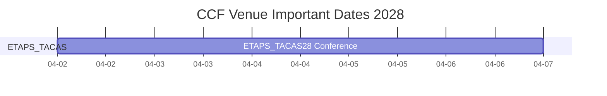
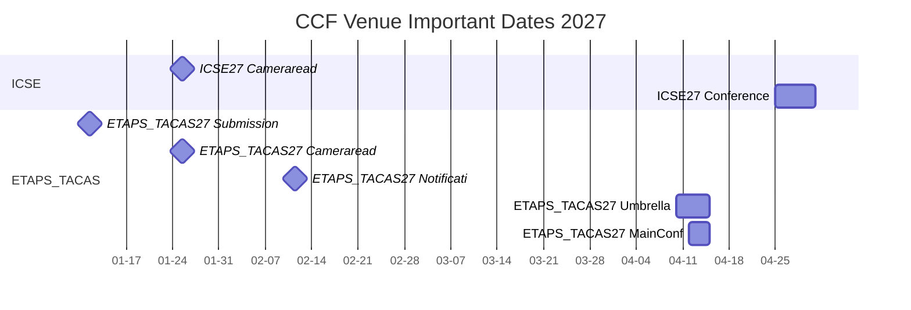
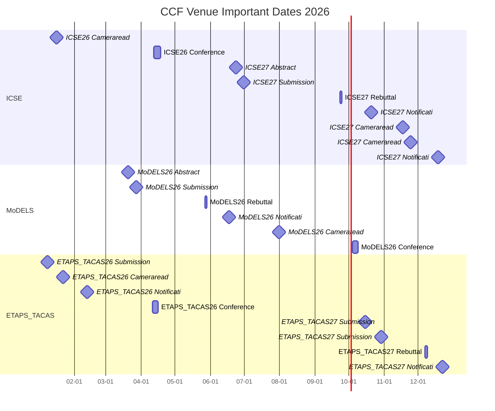
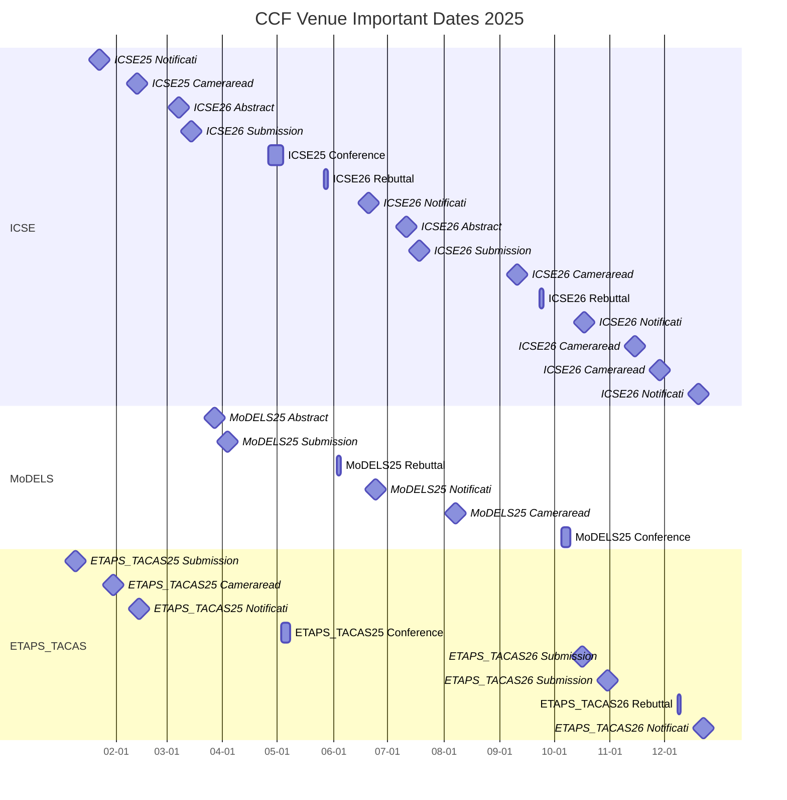
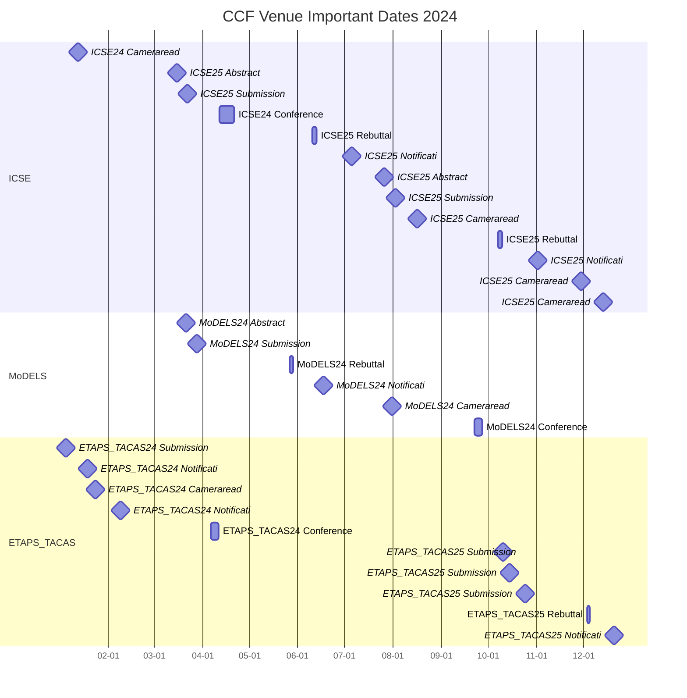
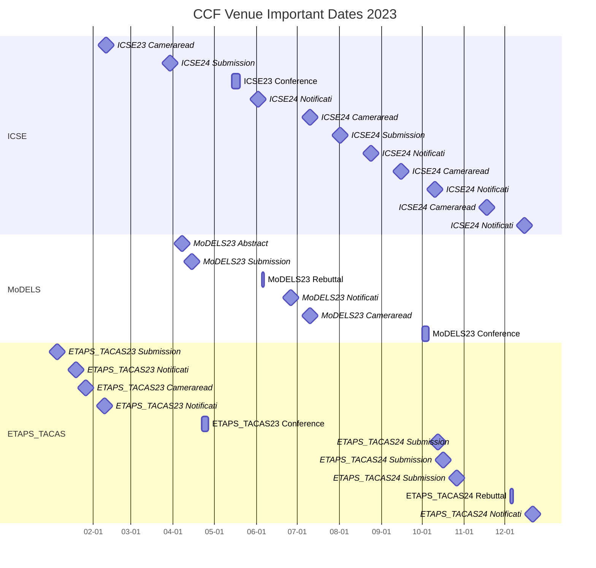
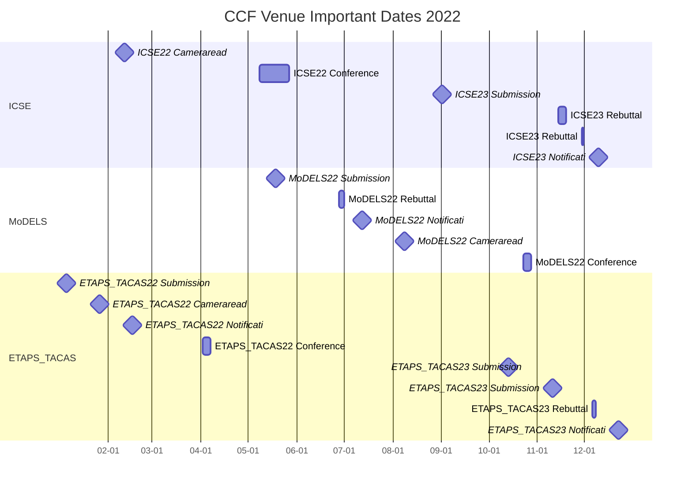

# `ccf_venues/` TIMELINE

> 信息更新时间：`2026-06-04 22:20`（Asia/Shanghai）
> 数据范围：按**事件发生年份**覆盖 `2022` 至 `2028`；会议 edition 的投稿 deadline 若发生在前一年，会进入前一年的日历章节。
> 数据来源：各 venue README / 年度 README；本文件是汇总索引，不是事实真源。

## 1. 文档用途

[TIMELINE.md](./TIMELINE.md) 是 `ccf_venues/` 的跨 venue 投稿时间线总览。它不替代各 venue 根 README 或年度 README，而是把已经核验到的会议 / 期刊投稿相关 important dates 按事件发生年份串起来，方便直观看到：

1. 每一年哪些 venue 的 abstract / submission / notification / camera-ready / conference dates 聚集在什么时间段。
2. 哪些会议 edition 的投稿窗口实际落在前一年，例如 `ICSE 2027` 的 submission 在 `2026` 年。
3. 后续 project_1~4 做投稿规划、论文检索和调研冲刺时，应优先盯哪些时间窗口。

## 2. 维护口径

1. **按事件发生年份分节**：每个年份一个二级章节，例如 `2028`、`2027`、`2026`；年份按降序排列。
2. **节内按时间升序**：同一年内的表格必须按实际日期从早到晚排列。
3. **年度 README 是事实源**：各 venue 年度 README 保存原始核验事实；本文件只做跨 venue 汇总索引。
4. **来源可点击**：每个时间点都必须给出事件官方来源、官方年度主页、本库年度 README；已发布论文集 / 论文名录时也直接挂链接。
5. **时间精确到分钟**：官方只给日期时写 `yyyy-mm-dd 待补时刻`；Mermaid 图只使用日期级粒度。
6. **阶段状态为当前核查时点状态**：截至 `2026-06-04`，尚未发生的 future notification / camera-ready 不写成“已完成”；若 submission 已过但通知未出，可写 `🟡 审稿中`。
7. **历史起点说明**：本库时间线从事件日期 `2022` 开始；因此 `ICSE 2022`、`ETAPS/TACAS 2022` 等 edition 的 `2021` 投稿截止只保留在年度 README，不回填到本文件。

## 3. 近期 Abstract / Submission 截止速览

> 筛选规则：仅列 `2026-06-04` 之后、PR-1A 已纳入 venue 中已经能从官方页面核验的 `Abstract` / `Submission` 类未来截止；不列 notification、camera-ready、rebuttal、conference-only 事件。完整跨年度事件仍以 §6 之后各年度时间线为准。

| 日期时间 | Venue | 类型-CCF | Track / 事项 | 日期类型 | 阶段状态 | 事件官方来源 | 年度主页 | 论文集 / 名录 | 本库年度页 | 核验状态 | 备注 |
|---|---|---|---|---|---|---|---|---|---|---|---|
| 2026-06-23 待补时刻 | [ICSE 2027](./conf-a-icse/2027/README.md) | 会议-A | Research Track abstract | Abstract | 🟢 投稿中 | [Research Track](https://conf.researchr.org/track/icse-2027/icse-2027-research-track) | [ICSE 2027](https://conf.researchr.org/home/icse-2027) | 未公布 | [本库年度页](./conf-a-icse/2027/README.md) | 🟡 部分核验 | AoE / UTC-12h，官方仅日期。 |
| 2026-06-30 待补时刻 | [ICSE 2027](./conf-a-icse/2027/README.md) | 会议-A | Research Track submission | Submission | 🟢 投稿中 | [Research Track](https://conf.researchr.org/track/icse-2027/icse-2027-research-track) | [ICSE 2027](https://conf.researchr.org/home/icse-2027) | 未公布 | [本库年度页](./conf-a-icse/2027/README.md) | 🟡 部分核验 | AoE / UTC-12h，官方仅日期。 |
| 2026-10-15 待补时刻 AoE | [ETAPS/TACAS 2027](./conf-b-etaps/2027/README.md) | 会议-B | TACAS paper submission | Submission | 🟢 投稿中 | [ETAPS 2027 CFP](https://etaps.org/2027/cfp/) | [ETAPS 2027](https://etaps.org/2027/) | 未公布 | [本库年度页](./conf-b-etaps/2027/README.md) | 🟡 部分核验 | CFP 明确写明 All the dates are AoE；TACAS deadline 不是 ETAPS umbrella 所有分会的通用 deadline。 |
| 2026-10-29 待补时刻 AoE | [ETAPS/TACAS 2027](./conf-b-etaps/2027/README.md) | 会议-B | TACAS mandatory artifact submission | Submission | 🟢 投稿中 | [ETAPS 2027 CFP](https://etaps.org/2027/cfp/) | [ETAPS 2027](https://etaps.org/2027/) | 未公布 | [本库年度页](./conf-b-etaps/2027/README.md) | 🟡 部分核验 | CFP 明确写明 All the dates are AoE；artifact deadline 单列，避免只看 paper deadline。 |
| 2027-01-11 待补时刻 AoE | [ETAPS/TACAS 2027](./conf-b-etaps/2027/README.md) | 会议-B | TACAS voluntary artifact submission | Submission | 🟢 投稿中 | [ETAPS 2027 CFP](https://etaps.org/2027/cfp/) | [ETAPS 2027](https://etaps.org/2027/) | 未公布 | [本库年度页](./conf-b-etaps/2027/README.md) | 🟡 部分核验 | CFP 明确写明 All the dates are AoE；录用后 artifact 相关未来截止。 |

## 4. 事件类型口径

| 日期类型 | 说明 | 是否进入 Mermaid |
|---|---|---|
| `Abstract` | 摘要截止 | 是 |
| `Submission` | 正文 / full paper / artifact 截止 | 是 |
| `Rebuttal` | rebuttal / author response 时间窗口 | 是，按起止日期表示 |
| `Notification` | 录用通知 / artifact notification | 是 |
| `Camera-ready` | 终稿 / final version / revision due | 是 |
| `Conference` | 会期 | 是，按起止日期表示 |
| `Special issue` | 期刊专刊 / topical collection 截止 | 是 |
| `Rolling submission` | 期刊常规滚动投稿 | 否，只在未定日期表中说明 |
| `Proceedings online` | 论文集或年度论文名录上线 | 可选，默认不进图 |

## 5. Mermaid 年度总览规范

1. 默认每年一张 Mermaid `gantt` 图；不要把 `2022` 到未来所有日期塞进一张图。
2. 单日 deadline 使用 `milestone`，多日窗口使用普通任务。
3. Mermaid 图只表达日期级粒度；分钟、`AoE`、北京时间换算、官方只给日期等细节放表格备注。
4. 图中使用短英文 label，不写 URL、emoji、复杂 `init`、`click`、自定义 CSS 或过长中文 label。

## 6. 2028 时间线

> 当前章节按 **2028 年实际发生的事件日期** 升序排列；Venue 名称保留会议 edition。

### 6.1 2028 投稿事件总表

| 日期时间 | Venue | 类型-CCF | Track / 事项 | 日期类型 | 阶段状态 | 事件官方来源 | 年度主页 | 论文集 / 名录 | 本库年度页 | 核验状态 | 备注 |
|---|---|---|---|---|---|---|---|---|---|---|---|
| 2028-04-02 至 2028-04-07 | [ETAPS/TACAS 2028](./conf-b-etaps/2028/README.md) | 会议-B | ETAPS conference dates | Conference | 🟦 已有主页 | [官方来源](https://etaps.org/2028/) | [年度主页](https://etaps.org/2028/) | 未公布 | [本库年度页](./conf-b-etaps/2028/README.md) | 🟡 部分核验 | 仅主页公开，CFP / TACAS dates 未公布。 |

### 6.2 2028 Mermaid 可视化

## 7. 2027 时间线

> 当前章节按 **2027 年实际发生的事件日期** 升序排列；Venue 名称保留会议 edition。

### 7.1 2027 投稿事件总表

| 日期时间 | Venue | 类型-CCF | Track / 事项 | 日期类型 | 阶段状态 | 事件官方来源 | 年度主页 | 论文集 / 名录 | 本库年度页 | 核验状态 | 备注 |
|---|---|---|---|---|---|---|---|---|---|---|---|
| 2027-01-11 待补时刻 AoE | [ETAPS/TACAS 2027](./conf-b-etaps/2027/README.md) | 会议-B | TACAS voluntary artifact submission | Submission | 🟢 投稿中 | [官方来源](https://etaps.org/2027/cfp/) | [年度主页](https://etaps.org/2027/) | 未公布 | [本库年度页](./conf-b-etaps/2027/README.md) | 🟡 部分核验 | 官方仅日期，AoE；时刻待补。 |
| 2027-01-25 待补时刻 AoE | [ETAPS/TACAS 2027](./conf-b-etaps/2027/README.md) | 会议-B | TACAS final version | Camera-ready | 🟢 投稿中 | [官方来源](https://etaps.org/2027/cfp/) | [年度主页](https://etaps.org/2027/) | 未公布 | [本库年度页](./conf-b-etaps/2027/README.md) | 🟡 部分核验 | 官方仅日期，AoE；时刻待补。 |
| 2027-01-25 待补时刻 | [ICSE 2027](./conf-a-icse/2027/README.md) | 会议-A | Research Track camera-ready after major revision | Camera-ready | 🟢 投稿中 | [官方来源](https://conf.researchr.org/track/icse-2027/icse-2027-research-track) | [年度主页](https://conf.researchr.org/home/icse-2027) | 未公布 | [本库年度页](./conf-a-icse/2027/README.md) | 🟡 部分核验 | 官方仅日期，AoE；时刻待补。 |
| 2027-02-11 待补时刻 AoE | [ETAPS/TACAS 2027](./conf-b-etaps/2027/README.md) | 会议-B | TACAS artifact notification | Notification | 🟢 投稿中 | [官方来源](https://etaps.org/2027/cfp/) | [年度主页](https://etaps.org/2027/) | 未公布 | [本库年度页](./conf-b-etaps/2027/README.md) | 🟡 部分核验 | 官方仅日期，AoE；时刻待补。 |
| 2027-04-10 至 2027-04-15 | [ETAPS/TACAS 2027](./conf-b-etaps/2027/README.md) | 会议-B | ETAPS umbrella conference dates | Conference | 🟢 投稿中 | [官方来源](https://etaps.org/2027/) | [年度主页](https://etaps.org/2027/) | 未公布 | [本库年度页](./conf-b-etaps/2027/README.md) | 🟡 部分核验 | ETAPS umbrella 会期；官方主页 / CFP 均给出 Copenhagen, April 10–15, 2027。 |
| 2027-04-12 至 2027-04-15 | [ETAPS/TACAS 2027](./conf-b-etaps/2027/README.md) | 会议-B | Main conferences / TACAS dates | Conference | 🟢 投稿中 | [官方来源](https://etaps.org/2027/cfp/) | [年度主页](https://etaps.org/2027/) | 未公布 | [本库年度页](./conf-b-etaps/2027/README.md) | 🟡 部分核验 | CFP 明确写明 MAIN CONFERENCES / Main Conference: April 12–15, 2027；TACAS 属 main conferences。 |
| 2027-04-25 至 2027-05-01 | [ICSE 2027](./conf-a-icse/2027/README.md) | 会议-A | Conference dates | Conference | 🟢 投稿中 | [官方来源](https://conf.researchr.org/track/icse-2027/icse-2027-research-track) | [年度主页](https://conf.researchr.org/home/icse-2027) | 未公布 | [本库年度页](./conf-a-icse/2027/README.md) | 🟡 部分核验 | Dublin, Ireland。 |

### 7.2 2027 Mermaid 可视化

## 8. 2026 时间线

> 当前章节按 **2026 年实际发生的事件日期** 升序排列；Venue 名称保留会议 edition。

### 8.1 2026 投稿事件总表

| 日期时间 | Venue | 类型-CCF | Track / 事项 | 日期类型 | 阶段状态 | 事件官方来源 | 年度主页 | 论文集 / 名录 | 本库年度页 | 核验状态 | 备注 |
|---|---|---|---|---|---|---|---|---|---|---|---|
| 2026-01-08 待补时刻 AoE | [ETAPS/TACAS 2026](./conf-b-etaps/2026/README.md) | 会议-B | TACAS voluntary artifact submission | Submission | ✅ 已结束 | [官方来源](https://etaps.org/2026/cfp/) | [年度主页](https://etaps.org/2026/) | [Programme](https://etaps.org/2026/programme/) / [DBLP TACAS](https://dblp.org/db/conf/tacas/index.html#2026) | [本库年度页](./conf-b-etaps/2026/README.md) | 🟡 部分核验 | CFP 明确写明 All the dates are AoE；官方仅日期，具体时刻待补。 |
| 2026-01-16 待补时刻 | [ICSE 2026](./conf-a-icse/2026/README.md) | 会议-A | Research Track camera-ready, cycle 2 revised | Camera-ready | ✅ 已结束 | [官方来源](https://conf.researchr.org/track/icse-2026/icse-2026-research-track) | [年度主页](https://conf.researchr.org/home/icse-2026) | [Research Track](https://conf.researchr.org/track/icse-2026/icse-2026-research-track) / [Program](https://conf.researchr.org/program/icse-2026/program-icse-2026/) | [本库年度页](./conf-a-icse/2026/README.md) | 🟡 部分核验 | 官方仅日期；时刻待补。 |
| 2026-01-22 待补时刻 AoE | [ETAPS/TACAS 2026](./conf-b-etaps/2026/README.md) | 会议-B | TACAS final version | Camera-ready | ✅ 已结束 | [官方来源](https://etaps.org/2026/cfp/) | [年度主页](https://etaps.org/2026/) | [Programme](https://etaps.org/2026/programme/) / [DBLP TACAS](https://dblp.org/db/conf/tacas/index.html#2026) | [本库年度页](./conf-b-etaps/2026/README.md) | 🟡 部分核验 | CFP 明确写明 All the dates are AoE；官方仅日期，具体时刻待补。 |
| 2026-02-12 待补时刻 AoE | [ETAPS/TACAS 2026](./conf-b-etaps/2026/README.md) | 会议-B | TACAS artifact notification | Notification | ✅ 已结束 | [官方来源](https://etaps.org/2026/cfp/) | [年度主页](https://etaps.org/2026/) | [Programme](https://etaps.org/2026/programme/) / [DBLP TACAS](https://dblp.org/db/conf/tacas/index.html#2026) | [本库年度页](./conf-b-etaps/2026/README.md) | 🟡 部分核验 | CFP 明确写明 All the dates are AoE；官方仅日期，具体时刻待补。 |
| 2026-03-20 待补时刻 | [MoDELS 2026](./conf-b-models/2026/README.md) | 会议-B | Research Papers abstract | Abstract | 🟡 审稿中 | [官方来源](https://conf.researchr.org/dates/models-2026) | [年度主页](https://conf.researchr.org/home/models-2026) | 未公布 | [本库年度页](./conf-b-models/2026/README.md) | 🟡 部分核验 | 官方仅日期，AoE；时刻待补。 |
| 2026-03-27 待补时刻 | [MoDELS 2026](./conf-b-models/2026/README.md) | 会议-B | Research Papers submission | Submission | 🟡 审稿中 | [官方来源](https://conf.researchr.org/dates/models-2026) | [年度主页](https://conf.researchr.org/home/models-2026) | 未公布 | [本库年度页](./conf-b-models/2026/README.md) | 🟡 部分核验 | 官方仅日期，AoE；时刻待补。 |
| 2026-04-11 至 2026-04-16 | [ETAPS/TACAS 2026](./conf-b-etaps/2026/README.md) | 会议-B | ETAPS conference dates | Conference | ✅ 已结束 | [官方来源](https://etaps.org/2026/cfp/) | [年度主页](https://etaps.org/2026/) | [Programme](https://etaps.org/2026/programme/) / [DBLP TACAS](https://dblp.org/db/conf/tacas/index.html#2026) | [本库年度页](./conf-b-etaps/2026/README.md) | 🟡 部分核验 | Turin, Italy。 |
| 2026-04-12 至 2026-04-18 | [ICSE 2026](./conf-a-icse/2026/README.md) | 会议-A | Conference dates | Conference | ✅ 已结束 | [官方来源](https://conf.researchr.org/track/icse-2026/icse-2026-research-track) | [年度主页](https://conf.researchr.org/home/icse-2026) | [Research Track](https://conf.researchr.org/track/icse-2026/icse-2026-research-track) / [Program](https://conf.researchr.org/program/icse-2026/program-icse-2026/) | [本库年度页](./conf-a-icse/2026/README.md) | 🟡 部分核验 | Rio de Janeiro, Brazil。 |
| 2026-05-27 至 2026-05-29 | [MoDELS 2026](./conf-b-models/2026/README.md) | 会议-B | Research Papers author response | Rebuttal | 🟡 审稿中 | [官方来源](https://conf.researchr.org/dates/models-2026) | [年度主页](https://conf.researchr.org/home/models-2026) | 未公布 | [本库年度页](./conf-b-models/2026/README.md) | 🟡 部分核验 | 官方仅日期，AoE；时刻待补。 |
| 2026-06-17 待补时刻 | [MoDELS 2026](./conf-b-models/2026/README.md) | 会议-B | Research Papers notification | Notification | 🟡 审稿中 | [官方来源](https://conf.researchr.org/dates/models-2026) | [年度主页](https://conf.researchr.org/home/models-2026) | 未公布 | [本库年度页](./conf-b-models/2026/README.md) | 🟡 部分核验 | 官方仅日期，AoE；时刻待补。 |
| 2026-06-23 待补时刻 | [ICSE 2027](./conf-a-icse/2027/README.md) | 会议-A | Research Track abstract | Abstract | 🟢 投稿中 | [官方来源](https://conf.researchr.org/track/icse-2027/icse-2027-research-track) | [年度主页](https://conf.researchr.org/home/icse-2027) | 未公布 | [本库年度页](./conf-a-icse/2027/README.md) | 🟡 部分核验 | 官方仅日期，AoE / UTC-12h；时刻待补。 |
| 2026-06-30 待补时刻 | [ICSE 2027](./conf-a-icse/2027/README.md) | 会议-A | Research Track submission | Submission | 🟢 投稿中 | [官方来源](https://conf.researchr.org/track/icse-2027/icse-2027-research-track) | [年度主页](https://conf.researchr.org/home/icse-2027) | 未公布 | [本库年度页](./conf-a-icse/2027/README.md) | 🟡 部分核验 | 官方仅日期，AoE / UTC-12h；时刻待补。 |
| 2026-07-31 待补时刻 | [MoDELS 2026](./conf-b-models/2026/README.md) | 会议-B | Research Papers camera-ready | Camera-ready | 🟡 审稿中 | [官方来源](https://conf.researchr.org/dates/models-2026) | [年度主页](https://conf.researchr.org/home/models-2026) | 未公布 | [本库年度页](./conf-b-models/2026/README.md) | 🟡 部分核验 | 官方仅日期，AoE；时刻待补。 |
| 2026-09-23 至 2026-09-25 | [ICSE 2027](./conf-a-icse/2027/README.md) | 会议-A | Research Track author response | Rebuttal | 🟢 投稿中 | [官方来源](https://conf.researchr.org/track/icse-2027/icse-2027-research-track) | [年度主页](https://conf.researchr.org/home/icse-2027) | 未公布 | [本库年度页](./conf-a-icse/2027/README.md) | 🟡 部分核验 | 官方仅日期，AoE / UTC-12h；时刻待补。 |
| 2026-10-04 至 2026-10-09 | [MoDELS 2026](./conf-b-models/2026/README.md) | 会议-B | Conference dates | Conference | 🟡 审稿中 | [官方来源](https://conf.researchr.org/dates/models-2026) | [年度主页](https://conf.researchr.org/home/models-2026) | 未公布 | [本库年度页](./conf-b-models/2026/README.md) | 🟡 部分核验 | Málaga, Spain。 |
| 2026-10-15 待补时刻 AoE | [ETAPS/TACAS 2027](./conf-b-etaps/2027/README.md) | 会议-B | TACAS paper submission | Submission | 🟢 投稿中 | [官方来源](https://etaps.org/2027/cfp/) | [年度主页](https://etaps.org/2027/) | 未公布 | [本库年度页](./conf-b-etaps/2027/README.md) | 🟡 部分核验 | 官方仅日期，AoE；时刻待补。 |
| 2026-10-20 待补时刻 | [ICSE 2027](./conf-a-icse/2027/README.md) | 会议-A | Research Track notification | Notification | 🟢 投稿中 | [官方来源](https://conf.researchr.org/track/icse-2027/icse-2027-research-track) | [年度主页](https://conf.researchr.org/home/icse-2027) | 未公布 | [本库年度页](./conf-a-icse/2027/README.md) | 🟡 部分核验 | 官方仅日期；时刻待补。 |
| 2026-10-29 待补时刻 AoE | [ETAPS/TACAS 2027](./conf-b-etaps/2027/README.md) | 会议-B | TACAS mandatory artifact submission | Submission | 🟢 投稿中 | [官方来源](https://etaps.org/2027/cfp/) | [年度主页](https://etaps.org/2027/) | 未公布 | [本库年度页](./conf-b-etaps/2027/README.md) | 🟡 部分核验 | 官方仅日期，AoE；时刻待补。 |
| 2026-11-17 待补时刻 | [ICSE 2027](./conf-a-icse/2027/README.md) | 会议-A | Research Track major revision due | Camera-ready | 🟢 投稿中 | [官方来源](https://conf.researchr.org/track/icse-2027/icse-2027-research-track) | [年度主页](https://conf.researchr.org/home/icse-2027) | 未公布 | [本库年度页](./conf-a-icse/2027/README.md) | 🟡 部分核验 | 官方仅日期；时刻待补。 |
| 2026-11-24 待补时刻 | [ICSE 2027](./conf-a-icse/2027/README.md) | 会议-A | Research Track camera-ready direct | Camera-ready | 🟢 投稿中 | [官方来源](https://conf.researchr.org/track/icse-2027/icse-2027-research-track) | [年度主页](https://conf.researchr.org/home/icse-2027) | 未公布 | [本库年度页](./conf-a-icse/2027/README.md) | 🟡 部分核验 | 官方仅日期；时刻待补。 |
| 2026-12-07 至 2026-12-09 AoE | [ETAPS/TACAS 2027](./conf-b-etaps/2027/README.md) | 会议-B | TACAS rebuttal | Rebuttal | 🟢 投稿中 | [官方来源](https://etaps.org/2027/cfp/) | [年度主页](https://etaps.org/2027/) | 未公布 | [本库年度页](./conf-b-etaps/2027/README.md) | 🟡 部分核验 | 官方仅日期，AoE；时刻待补。 |
| 2026-12-18 待补时刻 | [ICSE 2027](./conf-a-icse/2027/README.md) | 会议-A | Research Track final decision | Notification | 🟢 投稿中 | [官方来源](https://conf.researchr.org/track/icse-2027/icse-2027-research-track) | [年度主页](https://conf.researchr.org/home/icse-2027) | 未公布 | [本库年度页](./conf-a-icse/2027/README.md) | 🟡 部分核验 | 官方仅日期；时刻待补。 |
| 2026-12-22 待补时刻 AoE | [ETAPS/TACAS 2027](./conf-b-etaps/2027/README.md) | 会议-B | TACAS notification | Notification | 🟢 投稿中 | [官方来源](https://etaps.org/2027/cfp/) | [年度主页](https://etaps.org/2027/) | 未公布 | [本库年度页](./conf-b-etaps/2027/README.md) | 🟡 部分核验 | 官方仅日期，AoE；时刻待补。 |

### 8.2 2026 Mermaid 可视化

## 9. 2025 时间线

> 当前章节按 **2025 年实际发生的事件日期** 升序排列；Venue 名称保留会议 edition。

### 9.1 2025 投稿事件总表

| 日期时间 | Venue | 类型-CCF | Track / 事项 | 日期类型 | 阶段状态 | 事件官方来源 | 年度主页 | 论文集 / 名录 | 本库年度页 | 核验状态 | 备注 |
|---|---|---|---|---|---|---|---|---|---|---|---|
| 2025-01-09 待补时刻 | [ETAPS/TACAS 2025](./conf-b-etaps/2025/README.md) | 会议-B | TACAS voluntary artifact submission | Submission | ✅ 已结束 | [官方来源](https://etaps.org/2025/cfp/) | [年度主页](https://etaps.org/2025/) | [Past conference](https://etaps.org/2025/past-conference/) / [DBLP TACAS](https://dblp.org/db/conf/tacas/index.html#2025) | [本库年度页](./conf-b-etaps/2025/README.md) | 🟡 部分核验 | 官方仅日期；时刻待补。 |
| 2025-01-22 待补时刻 | [ICSE 2025](./conf-a-icse/2025/README.md) | 会议-A | Research Track final decision, cycle 2 | Notification | ✅ 已结束 | [官方来源](https://conf.researchr.org/track/icse-2025/icse-2025-research-track) | [年度主页](https://conf.researchr.org/home/icse-2025) | [Program](https://conf.researchr.org/program/icse-2025/program-icse-2025/) / [Proceedings](https://conf.researchr.org/info/icse-2025/proceedings) | [本库年度页](./conf-a-icse/2025/README.md) | 🟡 部分核验 | 官方仅日期；时刻待补。 |
| 2025-01-30 待补时刻 | [ETAPS/TACAS 2025](./conf-b-etaps/2025/README.md) | 会议-B | TACAS final version | Camera-ready | ✅ 已结束 | [官方来源](https://etaps.org/2025/cfp/) | [年度主页](https://etaps.org/2025/) | [Past conference](https://etaps.org/2025/past-conference/) / [DBLP TACAS](https://dblp.org/db/conf/tacas/index.html#2025) | [本库年度页](./conf-b-etaps/2025/README.md) | 🟡 部分核验 | 官方仅日期；时刻待补。 |
| 2025-02-12 待补时刻 | [ICSE 2025](./conf-a-icse/2025/README.md) | 会议-A | Research Track camera-ready, cycle 2 revised | Camera-ready | ✅ 已结束 | [官方来源](https://conf.researchr.org/track/icse-2025/icse-2025-research-track) | [年度主页](https://conf.researchr.org/home/icse-2025) | [Program](https://conf.researchr.org/program/icse-2025/program-icse-2025/) / [Proceedings](https://conf.researchr.org/info/icse-2025/proceedings) | [本库年度页](./conf-a-icse/2025/README.md) | 🟡 部分核验 | 官方仅日期；时刻待补。 |
| 2025-02-13 待补时刻 | [ETAPS/TACAS 2025](./conf-b-etaps/2025/README.md) | 会议-B | TACAS artifact notification | Notification | ✅ 已结束 | [官方来源](https://etaps.org/2025/cfp/) | [年度主页](https://etaps.org/2025/) | [Past conference](https://etaps.org/2025/past-conference/) / [DBLP TACAS](https://dblp.org/db/conf/tacas/index.html#2025) | [本库年度页](./conf-b-etaps/2025/README.md) | 🟡 部分核验 | 官方仅日期；时刻待补。 |
| 2025-03-07 待补时刻 | [ICSE 2026](./conf-a-icse/2026/README.md) | 会议-A | Research Track abstract, cycle 1 | Abstract | ✅ 已结束 | [官方来源](https://conf.researchr.org/track/icse-2026/icse-2026-research-track) | [年度主页](https://conf.researchr.org/home/icse-2026) | [Research Track](https://conf.researchr.org/track/icse-2026/icse-2026-research-track) / [Program](https://conf.researchr.org/program/icse-2026/program-icse-2026/) | [本库年度页](./conf-a-icse/2026/README.md) | 🟡 部分核验 | 官方仅日期，AoE / UTC-12h；时刻待补。 |
| 2025-03-14 待补时刻 | [ICSE 2026](./conf-a-icse/2026/README.md) | 会议-A | Research Track submission, cycle 1 | Submission | ✅ 已结束 | [官方来源](https://conf.researchr.org/track/icse-2026/icse-2026-research-track) | [年度主页](https://conf.researchr.org/home/icse-2026) | [Research Track](https://conf.researchr.org/track/icse-2026/icse-2026-research-track) / [Program](https://conf.researchr.org/program/icse-2026/program-icse-2026/) | [本库年度页](./conf-a-icse/2026/README.md) | 🟡 部分核验 | 官方仅日期，AoE / UTC-12h；时刻待补。 |
| 2025-03-27 待补时刻 | [MoDELS 2025](./conf-b-models/2025/README.md) | 会议-B | Research Papers abstract | Abstract | ✅ 已结束 | [官方来源](https://conf.researchr.org/dates/models-2025) | [年度主页](https://2025.models-conf.com/) | [Program](https://2025.models-conf.com/program/program-models-2025/) / [DBLP](https://dblp.org/db/conf/models/models2025.html) | [本库年度页](./conf-b-models/2025/README.md) | 🟡 部分核验 | 官方仅日期，AoE；时刻待补。 |
| 2025-04-03 待补时刻 | [MoDELS 2025](./conf-b-models/2025/README.md) | 会议-B | Research Papers submission | Submission | ✅ 已结束 | [官方来源](https://conf.researchr.org/dates/models-2025) | [年度主页](https://2025.models-conf.com/) | [Program](https://2025.models-conf.com/program/program-models-2025/) / [DBLP](https://dblp.org/db/conf/models/models2025.html) | [本库年度页](./conf-b-models/2025/README.md) | 🟡 部分核验 | 官方仅日期，AoE；时刻待补。 |
| 2025-04-26 至 2025-05-04 | [ICSE 2025](./conf-a-icse/2025/README.md) | 会议-A | Conference dates | Conference | ✅ 已结束 | [官方来源](https://conf.researchr.org/track/icse-2025/icse-2025-research-track) | [年度主页](https://conf.researchr.org/home/icse-2025) | [Program](https://conf.researchr.org/program/icse-2025/program-icse-2025/) / [Proceedings](https://conf.researchr.org/info/icse-2025/proceedings) | [本库年度页](./conf-a-icse/2025/README.md) | 🟡 部分核验 | Ottawa, Canada。 |
| 2025-05-03 至 2025-05-08 | [ETAPS/TACAS 2025](./conf-b-etaps/2025/README.md) | 会议-B | ETAPS conference dates | Conference | ✅ 已结束 | [官方来源](https://etaps.org/2025/cfp/) | [年度主页](https://etaps.org/2025/) | [Past conference](https://etaps.org/2025/past-conference/) / [DBLP TACAS](https://dblp.org/db/conf/tacas/index.html#2025) | [本库年度页](./conf-b-etaps/2025/README.md) | 🟡 部分核验 | Hamilton, Canada。 |
| 2025-05-27 至 2025-05-29 | [ICSE 2026](./conf-a-icse/2026/README.md) | 会议-A | Research Track author response, cycle 1 | Rebuttal | ✅ 已结束 | [官方来源](https://conf.researchr.org/track/icse-2026/icse-2026-research-track) | [年度主页](https://conf.researchr.org/home/icse-2026) | [Research Track](https://conf.researchr.org/track/icse-2026/icse-2026-research-track) / [Program](https://conf.researchr.org/program/icse-2026/program-icse-2026/) | [本库年度页](./conf-a-icse/2026/README.md) | 🟡 部分核验 | 官方仅日期；时刻待补。 |
| 2025-06-03 至 2025-06-05 | [MoDELS 2025](./conf-b-models/2025/README.md) | 会议-B | Research Papers author response | Rebuttal | ✅ 已结束 | [官方来源](https://conf.researchr.org/dates/models-2025) | [年度主页](https://2025.models-conf.com/) | [Program](https://2025.models-conf.com/program/program-models-2025/) / [DBLP](https://dblp.org/db/conf/models/models2025.html) | [本库年度页](./conf-b-models/2025/README.md) | 🟡 部分核验 | 官方仅日期，AoE；时刻待补。 |
| 2025-06-20 待补时刻 | [ICSE 2026](./conf-a-icse/2026/README.md) | 会议-A | Research Track notification, cycle 1 | Notification | ✅ 已结束 | [官方来源](https://conf.researchr.org/track/icse-2026/icse-2026-research-track) | [年度主页](https://conf.researchr.org/home/icse-2026) | [Research Track](https://conf.researchr.org/track/icse-2026/icse-2026-research-track) / [Program](https://conf.researchr.org/program/icse-2026/program-icse-2026/) | [本库年度页](./conf-a-icse/2026/README.md) | 🟡 部分核验 | 官方仅日期；时刻待补。 |
| 2025-06-24 待补时刻 | [MoDELS 2025](./conf-b-models/2025/README.md) | 会议-B | Research Papers notification | Notification | ✅ 已结束 | [官方来源](https://conf.researchr.org/dates/models-2025) | [年度主页](https://2025.models-conf.com/) | [Program](https://2025.models-conf.com/program/program-models-2025/) / [DBLP](https://dblp.org/db/conf/models/models2025.html) | [本库年度页](./conf-b-models/2025/README.md) | 🟡 部分核验 | 官方仅日期，AoE；时刻待补。 |
| 2025-07-11 待补时刻 | [ICSE 2026](./conf-a-icse/2026/README.md) | 会议-A | Research Track abstract, cycle 2 | Abstract | ✅ 已结束 | [官方来源](https://conf.researchr.org/track/icse-2026/icse-2026-research-track) | [年度主页](https://conf.researchr.org/home/icse-2026) | [Research Track](https://conf.researchr.org/track/icse-2026/icse-2026-research-track) / [Program](https://conf.researchr.org/program/icse-2026/program-icse-2026/) | [本库年度页](./conf-a-icse/2026/README.md) | 🟡 部分核验 | 官方仅日期，AoE / UTC-12h；时刻待补。 |
| 2025-07-18 待补时刻 | [ICSE 2026](./conf-a-icse/2026/README.md) | 会议-A | Research Track submission, cycle 2 | Submission | ✅ 已结束 | [官方来源](https://conf.researchr.org/track/icse-2026/icse-2026-research-track) | [年度主页](https://conf.researchr.org/home/icse-2026) | [Research Track](https://conf.researchr.org/track/icse-2026/icse-2026-research-track) / [Program](https://conf.researchr.org/program/icse-2026/program-icse-2026/) | [本库年度页](./conf-a-icse/2026/README.md) | 🟡 部分核验 | 官方仅日期，AoE / UTC-12h；时刻待补。 |
| 2025-08-07 待补时刻 | [MoDELS 2025](./conf-b-models/2025/README.md) | 会议-B | Research Papers camera-ready | Camera-ready | ✅ 已结束 | [官方来源](https://conf.researchr.org/dates/models-2025) | [年度主页](https://2025.models-conf.com/) | [Program](https://2025.models-conf.com/program/program-models-2025/) / [DBLP](https://dblp.org/db/conf/models/models2025.html) | [本库年度页](./conf-b-models/2025/README.md) | 🟡 部分核验 | 官方仅日期，AoE；时刻待补。 |
| 2025-09-10 待补时刻 | [ICSE 2026](./conf-a-icse/2026/README.md) | 会议-A | Research Track camera-ready direct, cycle 1 | Camera-ready | ✅ 已结束 | [官方来源](https://conf.researchr.org/track/icse-2026/icse-2026-research-track) | [年度主页](https://conf.researchr.org/home/icse-2026) | [Research Track](https://conf.researchr.org/track/icse-2026/icse-2026-research-track) / [Program](https://conf.researchr.org/program/icse-2026/program-icse-2026/) | [本库年度页](./conf-a-icse/2026/README.md) | 🟡 部分核验 | 官方仅日期；时刻待补。 |
| 2025-09-23 至 2025-09-25 | [ICSE 2026](./conf-a-icse/2026/README.md) | 会议-A | Research Track author response, cycle 2 | Rebuttal | ✅ 已结束 | [官方来源](https://conf.researchr.org/track/icse-2026/icse-2026-research-track) | [年度主页](https://conf.researchr.org/home/icse-2026) | [Research Track](https://conf.researchr.org/track/icse-2026/icse-2026-research-track) / [Program](https://conf.researchr.org/program/icse-2026/program-icse-2026/) | [本库年度页](./conf-a-icse/2026/README.md) | 🟡 部分核验 | 官方仅日期；时刻待补。 |
| 2025-10-05 至 2025-10-10 | [MoDELS 2025](./conf-b-models/2025/README.md) | 会议-B | Conference dates | Conference | ✅ 已结束 | [官方来源](https://conf.researchr.org/dates/models-2025) | [年度主页](https://2025.models-conf.com/) | [Program](https://2025.models-conf.com/program/program-models-2025/) / [DBLP](https://dblp.org/db/conf/models/models2025.html) | [本库年度页](./conf-b-models/2025/README.md) | 🟡 部分核验 | Grand Rapids, Michigan。 |
| 2025-10-16 待补时刻 AoE | [ETAPS/TACAS 2026](./conf-b-etaps/2026/README.md) | 会议-B | TACAS paper submission | Submission | ✅ 已结束 | [官方来源](https://etaps.org/2026/cfp/) | [年度主页](https://etaps.org/2026/) | [Programme](https://etaps.org/2026/programme/) / [DBLP TACAS](https://dblp.org/db/conf/tacas/index.html#2026) | [本库年度页](./conf-b-etaps/2026/README.md) | 🟡 部分核验 | CFP 明确写明 All the dates are AoE；官方仅日期，具体时刻待补。 |
| 2025-10-17 待补时刻 | [ICSE 2026](./conf-a-icse/2026/README.md) | 会议-A | Research Track notification / final, cycle 1 | Notification | ✅ 已结束 | [官方来源](https://conf.researchr.org/track/icse-2026/icse-2026-research-track) | [年度主页](https://conf.researchr.org/home/icse-2026) | [Research Track](https://conf.researchr.org/track/icse-2026/icse-2026-research-track) / [Program](https://conf.researchr.org/program/icse-2026/program-icse-2026/) | [本库年度页](./conf-a-icse/2026/README.md) | 🟡 部分核验 | 官方仅日期；时刻待补。 |
| 2025-10-30 待补时刻 AoE | [ETAPS/TACAS 2026](./conf-b-etaps/2026/README.md) | 会议-B | TACAS mandatory artifact submission | Submission | ✅ 已结束 | [官方来源](https://etaps.org/2026/cfp/) | [年度主页](https://etaps.org/2026/) | [Programme](https://etaps.org/2026/programme/) / [DBLP TACAS](https://dblp.org/db/conf/tacas/index.html#2026) | [本库年度页](./conf-b-etaps/2026/README.md) | 🟡 部分核验 | CFP 明确写明 All the dates are AoE；官方仅日期，具体时刻待补。 |
| 2025-11-14 待补时刻 | [ICSE 2026](./conf-a-icse/2026/README.md) | 会议-A | Research Track revision due, cycle 2 | Camera-ready | ✅ 已结束 | [官方来源](https://conf.researchr.org/track/icse-2026/icse-2026-research-track) | [年度主页](https://conf.researchr.org/home/icse-2026) | [Research Track](https://conf.researchr.org/track/icse-2026/icse-2026-research-track) / [Program](https://conf.researchr.org/program/icse-2026/program-icse-2026/) | [本库年度页](./conf-a-icse/2026/README.md) | 🟡 部分核验 | 官方仅日期；时刻待补。 |
| 2025-11-28 待补时刻 | [ICSE 2026](./conf-a-icse/2026/README.md) | 会议-A | Research Track camera-ready | Camera-ready | ✅ 已结束 | [官方来源](https://conf.researchr.org/track/icse-2026/icse-2026-research-track) | [年度主页](https://conf.researchr.org/home/icse-2026) | [Research Track](https://conf.researchr.org/track/icse-2026/icse-2026-research-track) / [Program](https://conf.researchr.org/program/icse-2026/program-icse-2026/) | [本库年度页](./conf-a-icse/2026/README.md) | 🟡 部分核验 | 官方仅日期；时刻待补。 |
| 2025-12-08 至 2025-12-10 AoE | [ETAPS/TACAS 2026](./conf-b-etaps/2026/README.md) | 会议-B | TACAS rebuttal | Rebuttal | ✅ 已结束 | [官方来源](https://etaps.org/2026/cfp/) | [年度主页](https://etaps.org/2026/) | [Programme](https://etaps.org/2026/programme/) / [DBLP TACAS](https://dblp.org/db/conf/tacas/index.html#2026) | [本库年度页](./conf-b-etaps/2026/README.md) | 🟡 部分核验 | CFP 明确写明 All the dates are AoE；官方仅日期，具体时刻待补。 |
| 2025-12-19 待补时刻 | [ICSE 2026](./conf-a-icse/2026/README.md) | 会议-A | Research Track final decision, cycle 2 | Notification | ✅ 已结束 | [官方来源](https://conf.researchr.org/track/icse-2026/icse-2026-research-track) | [年度主页](https://conf.researchr.org/home/icse-2026) | [Research Track](https://conf.researchr.org/track/icse-2026/icse-2026-research-track) / [Program](https://conf.researchr.org/program/icse-2026/program-icse-2026/) | [本库年度页](./conf-a-icse/2026/README.md) | 🟡 部分核验 | 官方仅日期；时刻待补。 |
| 2025-12-22 待补时刻 AoE | [ETAPS/TACAS 2026](./conf-b-etaps/2026/README.md) | 会议-B | TACAS notification | Notification | ✅ 已结束 | [官方来源](https://etaps.org/2026/cfp/) | [年度主页](https://etaps.org/2026/) | [Programme](https://etaps.org/2026/programme/) / [DBLP TACAS](https://dblp.org/db/conf/tacas/index.html#2026) | [本库年度页](./conf-b-etaps/2026/README.md) | 🟡 部分核验 | CFP 明确写明 All the dates are AoE；官方仅日期，具体时刻待补。 |

### 9.2 2025 Mermaid 可视化

## 10. 2024 时间线

> 当前章节按 **2024 年实际发生的事件日期** 升序排列；Venue 名称保留会议 edition。

### 10.1 2024 投稿事件总表

| 日期时间 | Venue | 类型-CCF | Track / 事项 | 日期类型 | 阶段状态 | 事件官方来源 | 年度主页 | 论文集 / 名录 | 本库年度页 | 核验状态 | 备注 |
|---|---|---|---|---|---|---|---|---|---|---|---|
| 2024-01-04 待补时刻 | [ETAPS/TACAS 2024](./conf-b-etaps/2024/README.md) | 会议-B | Artifact submission, non-TACAS tracks | Submission | ✅ 已结束 | [官方来源](https://etaps.org/2024/cfp/) | [年度主页](https://etaps.org/2024/) | [Past conference](https://etaps.org/2024/past-conference/) / [DBLP TACAS](https://dblp.org/db/conf/tacas/index.html#2024) | [本库年度页](./conf-b-etaps/2024/README.md) | 🟡 部分核验 | 官方仅日期；时刻待补。 |
| 2024-01-12 待补时刻 | [ICSE 2024](./conf-a-icse/2024/README.md) | 会议-A | Research Track camera-ready, cycle 2 | Camera-ready | ✅ 已结束 | [官方来源](https://conf.researchr.org/track/icse-2024/icse-2024-research-track) | [年度主页](https://conf.researchr.org/home/icse-2024) | [Program](https://conf.researchr.org/program/icse-2024/program-icse-2024/) / [DBLP](https://dblp.org/db/conf/icse/icse2024.html) | [本库年度页](./conf-a-icse/2024/README.md) | 🟡 部分核验 | 官方仅日期；时刻待补。 |
| 2024-01-18 待补时刻 | [ETAPS/TACAS 2024](./conf-b-etaps/2024/README.md) | 会议-B | TACAS artifact notification | Notification | ✅ 已结束 | [官方来源](https://etaps.org/2024/cfp/) | [年度主页](https://etaps.org/2024/) | [Past conference](https://etaps.org/2024/past-conference/) / [DBLP TACAS](https://dblp.org/db/conf/tacas/index.html#2024) | [本库年度页](./conf-b-etaps/2024/README.md) | 🟡 部分核验 | 官方仅日期；时刻待补。 |
| 2024-01-23 待补时刻 | [ETAPS/TACAS 2024](./conf-b-etaps/2024/README.md) | 会议-B | TACAS final version | Camera-ready | ✅ 已结束 | [官方来源](https://etaps.org/2024/cfp/) | [年度主页](https://etaps.org/2024/) | [Past conference](https://etaps.org/2024/past-conference/) / [DBLP TACAS](https://dblp.org/db/conf/tacas/index.html#2024) | [本库年度页](./conf-b-etaps/2024/README.md) | 🟡 部分核验 | 官方仅日期；时刻待补。 |
| 2024-02-08 待补时刻 | [ETAPS/TACAS 2024](./conf-b-etaps/2024/README.md) | 会议-B | Artifact notification, non-TACAS tracks | Notification | ✅ 已结束 | [官方来源](https://etaps.org/2024/cfp/) | [年度主页](https://etaps.org/2024/) | [Past conference](https://etaps.org/2024/past-conference/) / [DBLP TACAS](https://dblp.org/db/conf/tacas/index.html#2024) | [本库年度页](./conf-b-etaps/2024/README.md) | 🟡 部分核验 | 官方仅日期；时刻待补。 |
| 2024-03-15 待补时刻 | [ICSE 2025](./conf-a-icse/2025/README.md) | 会议-A | Research Track abstract, cycle 1 | Abstract | ✅ 已结束 | [官方来源](https://conf.researchr.org/track/icse-2025/icse-2025-research-track) | [年度主页](https://conf.researchr.org/home/icse-2025) | [Program](https://conf.researchr.org/program/icse-2025/program-icse-2025/) / [Proceedings](https://conf.researchr.org/info/icse-2025/proceedings) | [本库年度页](./conf-a-icse/2025/README.md) | 🟡 部分核验 | 官方仅日期，AoE / UTC-12h；时刻待补。 |
| 2024-03-21 待补时刻 | [MoDELS 2024](./conf-b-models/2024/README.md) | 会议-B | Technical Track abstract | Abstract | ✅ 已结束 | [官方来源](https://conf.researchr.org/dates/models-2024) | [年度主页](https://conf.researchr.org/home/models-2024) | [Program](https://conf.researchr.org/program/models-2024/program-models-2024/) / [DBLP](https://dblp.org/db/conf/models/models2024.html) | [本库年度页](./conf-b-models/2024/README.md) | 🟡 部分核验 | 官方仅日期，AoE；时刻待补。 |
| 2024-03-22 待补时刻 | [ICSE 2025](./conf-a-icse/2025/README.md) | 会议-A | Research Track submission, cycle 1 | Submission | ✅ 已结束 | [官方来源](https://conf.researchr.org/track/icse-2025/icse-2025-research-track) | [年度主页](https://conf.researchr.org/home/icse-2025) | [Program](https://conf.researchr.org/program/icse-2025/program-icse-2025/) / [Proceedings](https://conf.researchr.org/info/icse-2025/proceedings) | [本库年度页](./conf-a-icse/2025/README.md) | 🟡 部分核验 | 官方仅日期，AoE / UTC-12h；时刻待补。 |
| 2024-03-28 待补时刻 | [MoDELS 2024](./conf-b-models/2024/README.md) | 会议-B | Technical Track submission | Submission | ✅ 已结束 | [官方来源](https://conf.researchr.org/dates/models-2024) | [年度主页](https://conf.researchr.org/home/models-2024) | [Program](https://conf.researchr.org/program/models-2024/program-models-2024/) / [DBLP](https://dblp.org/db/conf/models/models2024.html) | [本库年度页](./conf-b-models/2024/README.md) | 🟡 部分核验 | 官方仅日期，AoE；时刻待补。 |
| 2024-04-06 至 2024-04-11 | [ETAPS/TACAS 2024](./conf-b-etaps/2024/README.md) | 会议-B | ETAPS conference dates | Conference | ✅ 已结束 | [官方来源](https://etaps.org/2024/cfp/) | [年度主页](https://etaps.org/2024/) | [Past conference](https://etaps.org/2024/past-conference/) / [DBLP TACAS](https://dblp.org/db/conf/tacas/index.html#2024) | [本库年度页](./conf-b-etaps/2024/README.md) | 🟡 部分核验 | Luxembourg City。 |
| 2024-04-12 至 2024-04-21 | [ICSE 2024](./conf-a-icse/2024/README.md) | 会议-A | Conference dates | Conference | ✅ 已结束 | [官方来源](https://conf.researchr.org/track/icse-2024/icse-2024-research-track) | [年度主页](https://conf.researchr.org/home/icse-2024) | [Program](https://conf.researchr.org/program/icse-2024/program-icse-2024/) / [DBLP](https://dblp.org/db/conf/icse/icse2024.html) | [本库年度页](./conf-a-icse/2024/README.md) | 🟡 部分核验 | Lisbon, Portugal。 |
| 2024-05-27 至 2024-05-29 | [MoDELS 2024](./conf-b-models/2024/README.md) | 会议-B | Technical Track author response | Rebuttal | ✅ 已结束 | [官方来源](https://conf.researchr.org/dates/models-2024) | [年度主页](https://conf.researchr.org/home/models-2024) | [Program](https://conf.researchr.org/program/models-2024/program-models-2024/) / [DBLP](https://dblp.org/db/conf/models/models2024.html) | [本库年度页](./conf-b-models/2024/README.md) | 🟡 部分核验 | 官方仅日期，AoE；时刻待补。 |
| 2024-06-10 至 2024-06-13 | [ICSE 2025](./conf-a-icse/2025/README.md) | 会议-A | Research Track author response, cycle 1 | Rebuttal | ✅ 已结束 | [官方来源](https://conf.researchr.org/track/icse-2025/icse-2025-research-track) | [年度主页](https://conf.researchr.org/home/icse-2025) | [Program](https://conf.researchr.org/program/icse-2025/program-icse-2025/) / [Proceedings](https://conf.researchr.org/info/icse-2025/proceedings) | [本库年度页](./conf-a-icse/2025/README.md) | 🟡 部分核验 | 官方仅日期；时刻待补。 |
| 2024-06-17 待补时刻 | [MoDELS 2024](./conf-b-models/2024/README.md) | 会议-B | Technical Track notification | Notification | ✅ 已结束 | [官方来源](https://conf.researchr.org/dates/models-2024) | [年度主页](https://conf.researchr.org/home/models-2024) | [Program](https://conf.researchr.org/program/models-2024/program-models-2024/) / [DBLP](https://dblp.org/db/conf/models/models2024.html) | [本库年度页](./conf-b-models/2024/README.md) | 🟡 部分核验 | 官方仅日期，AoE；时刻待补。 |
| 2024-07-05 待补时刻 | [ICSE 2025](./conf-a-icse/2025/README.md) | 会议-A | Research Track notification, cycle 1 | Notification | ✅ 已结束 | [官方来源](https://conf.researchr.org/track/icse-2025/icse-2025-research-track) | [年度主页](https://conf.researchr.org/home/icse-2025) | [Program](https://conf.researchr.org/program/icse-2025/program-icse-2025/) / [Proceedings](https://conf.researchr.org/info/icse-2025/proceedings) | [本库年度页](./conf-a-icse/2025/README.md) | 🟡 部分核验 | 官方仅日期；时刻待补。 |
| 2024-07-26 待补时刻 | [ICSE 2025](./conf-a-icse/2025/README.md) | 会议-A | Research Track abstract, cycle 2 | Abstract | ✅ 已结束 | [官方来源](https://conf.researchr.org/track/icse-2025/icse-2025-research-track) | [年度主页](https://conf.researchr.org/home/icse-2025) | [Program](https://conf.researchr.org/program/icse-2025/program-icse-2025/) / [Proceedings](https://conf.researchr.org/info/icse-2025/proceedings) | [本库年度页](./conf-a-icse/2025/README.md) | 🟡 部分核验 | 官方仅日期，AoE / UTC-12h；时刻待补。 |
| 2024-07-31 待补时刻 | [MoDELS 2024](./conf-b-models/2024/README.md) | 会议-B | Technical Track camera-ready | Camera-ready | ✅ 已结束 | [官方来源](https://conf.researchr.org/dates/models-2024) | [年度主页](https://conf.researchr.org/home/models-2024) | [Program](https://conf.researchr.org/program/models-2024/program-models-2024/) / [DBLP](https://dblp.org/db/conf/models/models2024.html) | [本库年度页](./conf-b-models/2024/README.md) | 🟡 部分核验 | 官方仅日期，AoE；时刻待补。 |
| 2024-08-02 待补时刻 | [ICSE 2025](./conf-a-icse/2025/README.md) | 会议-A | Research Track submission, cycle 2 | Submission | ✅ 已结束 | [官方来源](https://conf.researchr.org/track/icse-2025/icse-2025-research-track) | [年度主页](https://conf.researchr.org/home/icse-2025) | [Program](https://conf.researchr.org/program/icse-2025/program-icse-2025/) / [Proceedings](https://conf.researchr.org/info/icse-2025/proceedings) | [本库年度页](./conf-a-icse/2025/README.md) | 🟡 部分核验 | 官方仅日期，AoE / UTC-12h；时刻待补。 |
| 2024-08-16 待补时刻 | [ICSE 2025](./conf-a-icse/2025/README.md) | 会议-A | Research Track camera-ready direct, cycle 1 | Camera-ready | ✅ 已结束 | [官方来源](https://conf.researchr.org/track/icse-2025/icse-2025-research-track) | [年度主页](https://conf.researchr.org/home/icse-2025) | [Program](https://conf.researchr.org/program/icse-2025/program-icse-2025/) / [Proceedings](https://conf.researchr.org/info/icse-2025/proceedings) | [本库年度页](./conf-a-icse/2025/README.md) | 🟡 部分核验 | 官方仅日期；时刻待补。 |
| 2024-09-22 至 2024-09-27 | [MoDELS 2024](./conf-b-models/2024/README.md) | 会议-B | Conference dates | Conference | ✅ 已结束 | [官方来源](https://conf.researchr.org/dates/models-2024) | [年度主页](https://conf.researchr.org/home/models-2024) | [Program](https://conf.researchr.org/program/models-2024/program-models-2024/) / [DBLP](https://dblp.org/db/conf/models/models2024.html) | [本库年度页](./conf-b-models/2024/README.md) | 🟡 部分核验 | Linz, Austria。 |
| 2024-10-07 至 2024-10-10 | [ICSE 2025](./conf-a-icse/2025/README.md) | 会议-A | Research Track author response, cycle 2 | Rebuttal | ✅ 已结束 | [官方来源](https://conf.researchr.org/track/icse-2025/icse-2025-research-track) | [年度主页](https://conf.researchr.org/home/icse-2025) | [Program](https://conf.researchr.org/program/icse-2025/program-icse-2025/) / [Proceedings](https://conf.researchr.org/info/icse-2025/proceedings) | [本库年度页](./conf-a-icse/2025/README.md) | 🟡 部分核验 | 官方仅日期；时刻待补。 |
| 2024-10-10 | [ETAPS/TACAS 2025](./conf-b-etaps/2025/README.md) | 会议-B | TACAS paper submission | Submission | ✅ 已结束 | [官方来源](https://etaps.org/2025/cfp/) | [年度主页](https://etaps.org/2025/) | [Past conference](https://etaps.org/2025/past-conference/) / [DBLP TACAS](https://dblp.org/db/conf/tacas/index.html#2025) | [本库年度页](./conf-b-etaps/2025/README.md) | 🟡 部分核验 | 23:59 AoE。 |
| 2024-10-14 | [ETAPS/TACAS 2025](./conf-b-etaps/2025/README.md) | 会议-B | TACAS polish deadline | Submission | ✅ 已结束 | [官方来源](https://etaps.org/2025/cfp/) | [年度主页](https://etaps.org/2025/) | [Past conference](https://etaps.org/2025/past-conference/) / [DBLP TACAS](https://dblp.org/db/conf/tacas/index.html#2025) | [本库年度页](./conf-b-etaps/2025/README.md) | 🟡 部分核验 | 23:59 AoE。 |
| 2024-10-24 待补时刻 | [ETAPS/TACAS 2025](./conf-b-etaps/2025/README.md) | 会议-B | TACAS mandatory artifact submission | Submission | ✅ 已结束 | [官方来源](https://etaps.org/2025/cfp/) | [年度主页](https://etaps.org/2025/) | [Past conference](https://etaps.org/2025/past-conference/) / [DBLP TACAS](https://dblp.org/db/conf/tacas/index.html#2025) | [本库年度页](./conf-b-etaps/2025/README.md) | 🟡 部分核验 | 官方仅日期；时刻待补。 |
| 2024-11-01 待补时刻 | [ICSE 2025](./conf-a-icse/2025/README.md) | 会议-A | Research Track notification / final, cycles | Notification | ✅ 已结束 | [官方来源](https://conf.researchr.org/track/icse-2025/icse-2025-research-track) | [年度主页](https://conf.researchr.org/home/icse-2025) | [Program](https://conf.researchr.org/program/icse-2025/program-icse-2025/) / [Proceedings](https://conf.researchr.org/info/icse-2025/proceedings) | [本库年度页](./conf-a-icse/2025/README.md) | 🟡 部分核验 | 官方仅日期；时刻待补。 |
| 2024-11-29 待补时刻 | [ICSE 2025](./conf-a-icse/2025/README.md) | 会议-A | Research Track revision due, cycle 2 | Camera-ready | ✅ 已结束 | [官方来源](https://conf.researchr.org/track/icse-2025/icse-2025-research-track) | [年度主页](https://conf.researchr.org/home/icse-2025) | [Program](https://conf.researchr.org/program/icse-2025/program-icse-2025/) / [Proceedings](https://conf.researchr.org/info/icse-2025/proceedings) | [本库年度页](./conf-a-icse/2025/README.md) | 🟡 部分核验 | 官方仅日期；时刻待补。 |
| 2024-12-03 至 2024-12-05 | [ETAPS/TACAS 2025](./conf-b-etaps/2025/README.md) | 会议-B | TACAS rebuttal | Rebuttal | ✅ 已结束 | [官方来源](https://etaps.org/2025/cfp/) | [年度主页](https://etaps.org/2025/) | [Past conference](https://etaps.org/2025/past-conference/) / [DBLP TACAS](https://dblp.org/db/conf/tacas/index.html#2025) | [本库年度页](./conf-b-etaps/2025/README.md) | 🟡 部分核验 | 官方仅日期；时刻待补。 |
| 2024-12-13 待补时刻 | [ICSE 2025](./conf-a-icse/2025/README.md) | 会议-A | Research Track camera-ready | Camera-ready | ✅ 已结束 | [官方来源](https://conf.researchr.org/track/icse-2025/icse-2025-research-track) | [年度主页](https://conf.researchr.org/home/icse-2025) | [Program](https://conf.researchr.org/program/icse-2025/program-icse-2025/) / [Proceedings](https://conf.researchr.org/info/icse-2025/proceedings) | [本库年度页](./conf-a-icse/2025/README.md) | 🟡 部分核验 | 官方仅日期；时刻待补。 |
| 2024-12-20 待补时刻 | [ETAPS/TACAS 2025](./conf-b-etaps/2025/README.md) | 会议-B | TACAS notification | Notification | ✅ 已结束 | [官方来源](https://etaps.org/2025/cfp/) | [年度主页](https://etaps.org/2025/) | [Past conference](https://etaps.org/2025/past-conference/) / [DBLP TACAS](https://dblp.org/db/conf/tacas/index.html#2025) | [本库年度页](./conf-b-etaps/2025/README.md) | 🟡 部分核验 | 官方仅日期；时刻待补。 |

### 10.2 2024 Mermaid 可视化

## 11. 2023 时间线

> 当前章节按 **2023 年实际发生的事件日期** 升序排列；Venue 名称保留会议 edition。

### 11.1 2023 投稿事件总表

| 日期时间 | Venue | 类型-CCF | Track / 事项 | 日期类型 | 阶段状态 | 事件官方来源 | 年度主页 | 论文集 / 名录 | 本库年度页 | 核验状态 | 备注 |
|---|---|---|---|---|---|---|---|---|---|---|---|
| 2023-01-05 待补时刻 | [ETAPS/TACAS 2023](./conf-b-etaps/2023/README.md) | 会议-B | Artifact submission, non-TACAS tracks | Submission | ✅ 已结束 | [官方来源](https://etaps.org/2023/cfp/) | [年度主页](https://etaps.org/2023/) | [Accepted papers](https://etaps.org/2023/accepted-papers/) / [Proceedings](https://etaps.org/2023/proceedings/) / [DBLP TACAS](https://dblp.org/db/conf/tacas/index.html#2023) | [本库年度页](./conf-b-etaps/2023/README.md) | 🟡 部分核验 | 官方仅日期；时刻待补。 |
| 2023-01-19 待补时刻 | [ETAPS/TACAS 2023](./conf-b-etaps/2023/README.md) | 会议-B | TACAS artifact notification | Notification | ✅ 已结束 | [官方来源](https://etaps.org/2023/cfp/) | [年度主页](https://etaps.org/2023/) | [Accepted papers](https://etaps.org/2023/accepted-papers/) / [Proceedings](https://etaps.org/2023/proceedings/) / [DBLP TACAS](https://dblp.org/db/conf/tacas/index.html#2023) | [本库年度页](./conf-b-etaps/2023/README.md) | 🟡 部分核验 | 官方仅日期；时刻待补。 |
| 2023-01-26 待补时刻 | [ETAPS/TACAS 2023](./conf-b-etaps/2023/README.md) | 会议-B | TACAS final version | Camera-ready | ✅ 已结束 | [官方来源](https://etaps.org/2023/cfp/) | [年度主页](https://etaps.org/2023/) | [Accepted papers](https://etaps.org/2023/accepted-papers/) / [Proceedings](https://etaps.org/2023/proceedings/) / [DBLP TACAS](https://dblp.org/db/conf/tacas/index.html#2023) | [本库年度页](./conf-b-etaps/2023/README.md) | 🟡 部分核验 | 官方仅日期；时刻待补。 |
| 2023-02-09 待补时刻 | [ETAPS/TACAS 2023](./conf-b-etaps/2023/README.md) | 会议-B | Artifact notification | Notification | ✅ 已结束 | [官方来源](https://etaps.org/2023/cfp/) | [年度主页](https://etaps.org/2023/) | [Accepted papers](https://etaps.org/2023/accepted-papers/) / [Proceedings](https://etaps.org/2023/proceedings/) / [DBLP TACAS](https://dblp.org/db/conf/tacas/index.html#2023) | [本库年度页](./conf-b-etaps/2023/README.md) | 🟡 部分核验 | 官方仅日期；时刻待补。 |
| 2023-02-10 待补时刻 | [ICSE 2023](./conf-a-icse/2023/README.md) | 会议-A | Technical Track camera-ready | Camera-ready | ✅ 已结束 | [官方来源](https://conf.researchr.org/track/icse-2023/icse-2023-technical-track) | [年度主页](https://conf.researchr.org/home/icse-2023) | [Program](https://conf.researchr.org/program/icse-2023/program-icse-2023/) / [DBLP](https://dblp.org/db/conf/icse/icse2023.html) | [本库年度页](./conf-a-icse/2023/README.md) | 🟡 部分核验 | 主页历史时间线回填；原 CFP 曾写 TBA。 |
| 2023-03-29 待补时刻 | [ICSE 2024](./conf-a-icse/2024/README.md) | 会议-A | Research Track submission, cycle 1 | Submission | ✅ 已结束 | [官方来源](https://conf.researchr.org/track/icse-2024/icse-2024-research-track) | [年度主页](https://conf.researchr.org/home/icse-2024) | [Program](https://conf.researchr.org/program/icse-2024/program-icse-2024/) / [DBLP](https://dblp.org/db/conf/icse/icse2024.html) | [本库年度页](./conf-a-icse/2024/README.md) | 🟡 部分核验 | 官方仅日期，AoE / UTC-12h；时刻待补。 |
| 2023-04-07 待补时刻 | [MoDELS 2023](./conf-b-models/2023/README.md) | 会议-B | Technical Track abstract | Abstract | ✅ 已结束 | [官方来源](https://conf.researchr.org/dates/models-2023) | [年度主页](https://conf.researchr.org/home/models-2023) | [FT](https://conf.researchr.org/info/models-2023/accepted-papers---ft) / [PT](https://conf.researchr.org/info/models-2023/accepted-papers---pt) / [DBLP](https://dblp.org/db/conf/models/models2023.html) | [本库年度页](./conf-b-models/2023/README.md) | 🟡 部分核验 | 官方仅日期；时刻待补。 |
| 2023-04-14 待补时刻 | [MoDELS 2023](./conf-b-models/2023/README.md) | 会议-B | Technical Track submission | Submission | ✅ 已结束 | [官方来源](https://conf.researchr.org/dates/models-2023) | [年度主页](https://conf.researchr.org/home/models-2023) | [FT](https://conf.researchr.org/info/models-2023/accepted-papers---ft) / [PT](https://conf.researchr.org/info/models-2023/accepted-papers---pt) / [DBLP](https://dblp.org/db/conf/models/models2023.html) | [本库年度页](./conf-b-models/2023/README.md) | 🟡 部分核验 | 官方仅日期；时刻待补。 |
| 2023-04-22 至 2023-04-27 | [ETAPS/TACAS 2023](./conf-b-etaps/2023/README.md) | 会议-B | ETAPS conference dates | Conference | ✅ 已结束 | [官方来源](https://etaps.org/2023/cfp/) | [年度主页](https://etaps.org/2023/) | [Accepted papers](https://etaps.org/2023/accepted-papers/) / [Proceedings](https://etaps.org/2023/proceedings/) / [DBLP TACAS](https://dblp.org/db/conf/tacas/index.html#2023) | [本库年度页](./conf-b-etaps/2023/README.md) | 🟡 部分核验 | Paris, France。 |
| 2023-05-14 至 2023-05-20 | [ICSE 2023](./conf-a-icse/2023/README.md) | 会议-A | Conference dates | Conference | ✅ 已结束 | [官方来源](https://conf.researchr.org/track/icse-2023/icse-2023-technical-track) | [年度主页](https://conf.researchr.org/home/icse-2023) | [Program](https://conf.researchr.org/program/icse-2023/program-icse-2023/) / [DBLP](https://dblp.org/db/conf/icse/icse2023.html) | [本库年度页](./conf-a-icse/2023/README.md) | 🟡 部分核验 | Melbourne, Australia。 |
| 2023-06-02 待补时刻 | [ICSE 2024](./conf-a-icse/2024/README.md) | 会议-A | Research Track notification, cycle 1 | Notification | ✅ 已结束 | [官方来源](https://conf.researchr.org/track/icse-2024/icse-2024-research-track) | [年度主页](https://conf.researchr.org/home/icse-2024) | [Program](https://conf.researchr.org/program/icse-2024/program-icse-2024/) / [DBLP](https://dblp.org/db/conf/icse/icse2024.html) | [本库年度页](./conf-a-icse/2024/README.md) | 🟡 部分核验 | 官方仅日期；时刻待补。 |
| 2023-06-05 至 2023-06-07 | [MoDELS 2023](./conf-b-models/2023/README.md) | 会议-B | Technical Track author response | Rebuttal | ✅ 已结束 | [官方来源](https://conf.researchr.org/dates/models-2023) | [年度主页](https://conf.researchr.org/home/models-2023) | [FT](https://conf.researchr.org/info/models-2023/accepted-papers---ft) / [PT](https://conf.researchr.org/info/models-2023/accepted-papers---pt) / [DBLP](https://dblp.org/db/conf/models/models2023.html) | [本库年度页](./conf-b-models/2023/README.md) | 🟡 部分核验 | 官方仅日期；时刻待补。 |
| 2023-06-26 待补时刻 | [MoDELS 2023](./conf-b-models/2023/README.md) | 会议-B | Technical Track notification | Notification | ✅ 已结束 | [官方来源](https://conf.researchr.org/dates/models-2023) | [年度主页](https://conf.researchr.org/home/models-2023) | [FT](https://conf.researchr.org/info/models-2023/accepted-papers---ft) / [PT](https://conf.researchr.org/info/models-2023/accepted-papers---pt) / [DBLP](https://dblp.org/db/conf/models/models2023.html) | [本库年度页](./conf-b-models/2023/README.md) | 🟡 部分核验 | 官方仅日期；时刻待补。 |
| 2023-07-10 待补时刻 | [ICSE 2024](./conf-a-icse/2024/README.md) | 会议-A | Research Track revision due, cycle 1 | Camera-ready | ✅ 已结束 | [官方来源](https://conf.researchr.org/track/icse-2024/icse-2024-research-track) | [年度主页](https://conf.researchr.org/home/icse-2024) | [Program](https://conf.researchr.org/program/icse-2024/program-icse-2024/) / [DBLP](https://dblp.org/db/conf/icse/icse2024.html) | [本库年度页](./conf-a-icse/2024/README.md) | 🟡 部分核验 | 官方仅日期；时刻待补。 |
| 2023-07-10 待补时刻 | [MoDELS 2023](./conf-b-models/2023/README.md) | 会议-B | Technical Track camera-ready | Camera-ready | ✅ 已结束 | [官方来源](https://conf.researchr.org/dates/models-2023) | [年度主页](https://conf.researchr.org/home/models-2023) | [FT](https://conf.researchr.org/info/models-2023/accepted-papers---ft) / [PT](https://conf.researchr.org/info/models-2023/accepted-papers---pt) / [DBLP](https://dblp.org/db/conf/models/models2023.html) | [本库年度页](./conf-b-models/2023/README.md) | 🟡 部分核验 | 官方仅日期；时刻待补。 |
| 2023-08-01 待补时刻 | [ICSE 2024](./conf-a-icse/2024/README.md) | 会议-A | Research Track submission, cycle 2 | Submission | ✅ 已结束 | [官方来源](https://conf.researchr.org/track/icse-2024/icse-2024-research-track) | [年度主页](https://conf.researchr.org/home/icse-2024) | [Program](https://conf.researchr.org/program/icse-2024/program-icse-2024/) / [DBLP](https://dblp.org/db/conf/icse/icse2024.html) | [本库年度页](./conf-a-icse/2024/README.md) | 🟡 部分核验 | 官方仅日期，AoE / UTC-12h；时刻待补。 |
| 2023-08-24 待补时刻 | [ICSE 2024](./conf-a-icse/2024/README.md) | 会议-A | Research Track final decision, cycle 1 | Notification | ✅ 已结束 | [官方来源](https://conf.researchr.org/track/icse-2024/icse-2024-research-track) | [年度主页](https://conf.researchr.org/home/icse-2024) | [Program](https://conf.researchr.org/program/icse-2024/program-icse-2024/) / [DBLP](https://dblp.org/db/conf/icse/icse2024.html) | [本库年度页](./conf-a-icse/2024/README.md) | 🟡 部分核验 | 官方仅日期；时刻待补。 |
| 2023-09-15 待补时刻 | [ICSE 2024](./conf-a-icse/2024/README.md) | 会议-A | Research Track camera-ready, cycle 1 | Camera-ready | ✅ 已结束 | [官方来源](https://conf.researchr.org/track/icse-2024/icse-2024-research-track) | [年度主页](https://conf.researchr.org/home/icse-2024) | [Program](https://conf.researchr.org/program/icse-2024/program-icse-2024/) / [DBLP](https://dblp.org/db/conf/icse/icse2024.html) | [本库年度页](./conf-a-icse/2024/README.md) | 🟡 部分核验 | 官方仅日期；时刻待补。 |
| 2023-10-01 至 2023-10-06 | [MoDELS 2023](./conf-b-models/2023/README.md) | 会议-B | Conference dates | Conference | ✅ 已结束 | [官方来源](https://conf.researchr.org/dates/models-2023) | [年度主页](https://conf.researchr.org/home/models-2023) | [FT](https://conf.researchr.org/info/models-2023/accepted-papers---ft) / [PT](https://conf.researchr.org/info/models-2023/accepted-papers---pt) / [DBLP](https://dblp.org/db/conf/models/models2023.html) | [本库年度页](./conf-b-models/2023/README.md) | 🟡 部分核验 | Västerås, Sweden。 |
| 2023-10-10 待补时刻 | [ICSE 2024](./conf-a-icse/2024/README.md) | 会议-A | Research Track notification, cycle 2 | Notification | ✅ 已结束 | [官方来源](https://conf.researchr.org/track/icse-2024/icse-2024-research-track) | [年度主页](https://conf.researchr.org/home/icse-2024) | [Program](https://conf.researchr.org/program/icse-2024/program-icse-2024/) / [DBLP](https://dblp.org/db/conf/icse/icse2024.html) | [本库年度页](./conf-a-icse/2024/README.md) | 🟡 部分核验 | 官方仅日期；时刻待补。 |
| 2023-10-12 | [ETAPS/TACAS 2024](./conf-b-etaps/2024/README.md) | 会议-B | TACAS paper submission | Submission | ✅ 已结束 | [官方来源](https://etaps.org/2024/cfp/) | [年度主页](https://etaps.org/2024/) | [Past conference](https://etaps.org/2024/past-conference/) / [DBLP TACAS](https://dblp.org/db/conf/tacas/index.html#2024) | [本库年度页](./conf-b-etaps/2024/README.md) | 🟡 部分核验 | 23:59 AoE。 |
| 2023-10-16 | [ETAPS/TACAS 2024](./conf-b-etaps/2024/README.md) | 会议-B | TACAS update deadline | Submission | ✅ 已结束 | [官方来源](https://etaps.org/2024/cfp/) | [年度主页](https://etaps.org/2024/) | [Past conference](https://etaps.org/2024/past-conference/) / [DBLP TACAS](https://dblp.org/db/conf/tacas/index.html#2024) | [本库年度页](./conf-b-etaps/2024/README.md) | 🟡 部分核验 | 23:59 AoE。 |
| 2023-10-26 | [ETAPS/TACAS 2024](./conf-b-etaps/2024/README.md) | 会议-B | TACAS artifact submission | Submission | ✅ 已结束 | [官方来源](https://etaps.org/2024/cfp/) | [年度主页](https://etaps.org/2024/) | [Past conference](https://etaps.org/2024/past-conference/) / [DBLP TACAS](https://dblp.org/db/conf/tacas/index.html#2024) | [本库年度页](./conf-b-etaps/2024/README.md) | 🟡 部分核验 | 23:59 AoE；页面版本差异待复核。 |
| 2023-11-17 待补时刻 | [ICSE 2024](./conf-a-icse/2024/README.md) | 会议-A | Research Track revision due, cycle 2 | Camera-ready | ✅ 已结束 | [官方来源](https://conf.researchr.org/track/icse-2024/icse-2024-research-track) | [年度主页](https://conf.researchr.org/home/icse-2024) | [Program](https://conf.researchr.org/program/icse-2024/program-icse-2024/) / [DBLP](https://dblp.org/db/conf/icse/icse2024.html) | [本库年度页](./conf-a-icse/2024/README.md) | 🟡 部分核验 | 官方仅日期；时刻待补。 |
| 2023-12-05 至 2023-12-07 | [ETAPS/TACAS 2024](./conf-b-etaps/2024/README.md) | 会议-B | TACAS rebuttal | Rebuttal | ✅ 已结束 | [官方来源](https://etaps.org/2024/cfp/) | [年度主页](https://etaps.org/2024/) | [Past conference](https://etaps.org/2024/past-conference/) / [DBLP TACAS](https://dblp.org/db/conf/tacas/index.html#2024) | [本库年度页](./conf-b-etaps/2024/README.md) | 🟡 部分核验 | 官方仅日期；时刻待补。 |
| 2023-12-15 待补时刻 | [ICSE 2024](./conf-a-icse/2024/README.md) | 会议-A | Research Track final decision, cycle 2 | Notification | ✅ 已结束 | [官方来源](https://conf.researchr.org/track/icse-2024/icse-2024-research-track) | [年度主页](https://conf.researchr.org/home/icse-2024) | [Program](https://conf.researchr.org/program/icse-2024/program-icse-2024/) / [DBLP](https://dblp.org/db/conf/icse/icse2024.html) | [本库年度页](./conf-a-icse/2024/README.md) | 🟡 部分核验 | 官方仅日期；时刻待补。 |
| 2023-12-21 待补时刻 | [ETAPS/TACAS 2024](./conf-b-etaps/2024/README.md) | 会议-B | TACAS notification | Notification | ✅ 已结束 | [官方来源](https://etaps.org/2024/cfp/) | [年度主页](https://etaps.org/2024/) | [Past conference](https://etaps.org/2024/past-conference/) / [DBLP TACAS](https://dblp.org/db/conf/tacas/index.html#2024) | [本库年度页](./conf-b-etaps/2024/README.md) | 🟡 部分核验 | 官方仅日期；时刻待补。 |

### 11.2 2023 Mermaid 可视化

## 12. 2022 时间线

> 当前章节按 **2022 年实际发生的事件日期** 升序排列；Venue 名称保留会议 edition。

### 12.1 2022 投稿事件总表

| 日期时间 | Venue | 类型-CCF | Track / 事项 | 日期类型 | 阶段状态 | 事件官方来源 | 年度主页 | 论文集 / 名录 | 本库年度页 | 核验状态 | 备注 |
|---|---|---|---|---|---|---|---|---|---|---|---|
| 2022-01-05 | [ETAPS/TACAS 2022](./conf-b-etaps/2022/README.md) | 会议-B | TACAS post-paper artifact submission | Submission | ✅ 已结束 | [官方来源](https://etaps.org/2022/call-for-papers.html) | [年度主页](https://etaps.org/2022/) | [TACAS accepted](https://etaps.org/user-profile/archive/53-etaps-2022/495-tacas-2022-accepted-papers.html) / [Proceedings](https://etaps.org/2022/proceedings.html) | [本库年度页](./conf-b-etaps/2022/README.md) | 🟡 部分核验 | 23:59 AoE。 |
| 2022-01-26 待补时刻 | [ETAPS/TACAS 2022](./conf-b-etaps/2022/README.md) | 会议-B | TACAS final version | Camera-ready | ✅ 已结束 | [官方来源](https://etaps.org/2022/call-for-papers.html) | [年度主页](https://etaps.org/2022/) | [TACAS accepted](https://etaps.org/user-profile/archive/53-etaps-2022/495-tacas-2022-accepted-papers.html) / [Proceedings](https://etaps.org/2022/proceedings.html) | [本库年度页](./conf-b-etaps/2022/README.md) | 🟡 部分核验 | 官方仅日期；时刻待补。 |
| 2022-02-11 待补时刻 | [ICSE 2022](./conf-a-icse/2022/README.md) | 会议-A | Technical Track camera-ready | Camera-ready | ✅ 已结束 | [官方来源](https://conf.researchr.org/track/icse-2022/icse-2022-papers) | [年度主页](https://conf.researchr.org/home/icse-2022) | [Program](https://conf.researchr.org/program/icse-2022/program-icse-2022/) / [DBLP](https://dblp.org/db/conf/icse/icse2022.html) | [本库年度页](./conf-a-icse/2022/README.md) | 🟡 部分核验 | 官方仅日期；时刻待补。 |
| 2022-02-16 待补时刻 | [ETAPS/TACAS 2022](./conf-b-etaps/2022/README.md) | 会议-B | TACAS artifact notification | Notification | ✅ 已结束 | [官方来源](https://etaps.org/2022/call-for-papers.html) | [年度主页](https://etaps.org/2022/) | [TACAS accepted](https://etaps.org/user-profile/archive/53-etaps-2022/495-tacas-2022-accepted-papers.html) / [Proceedings](https://etaps.org/2022/proceedings.html) | [本库年度页](./conf-b-etaps/2022/README.md) | 🟡 部分核验 | 官方仅日期；时刻待补。 |
| 2022-04-02 至 2022-04-07 | [ETAPS/TACAS 2022](./conf-b-etaps/2022/README.md) | 会议-B | ETAPS conference dates | Conference | ✅ 已结束 | [官方来源](https://etaps.org/2022/call-for-papers.html) | [年度主页](https://etaps.org/2022/) | [TACAS accepted](https://etaps.org/user-profile/archive/53-etaps-2022/495-tacas-2022-accepted-papers.html) / [Proceedings](https://etaps.org/2022/proceedings.html) | [本库年度页](./conf-b-etaps/2022/README.md) | 🟡 部分核验 | Munich, Germany。 |
| 2022-05-08 至 2022-05-27 | [ICSE 2022](./conf-a-icse/2022/README.md) | 会议-A | Conference dates | Conference | ✅ 已结束 | [官方来源](https://conf.researchr.org/track/icse-2022/icse-2022-papers) | [年度主页](https://conf.researchr.org/home/icse-2022) | [Program](https://conf.researchr.org/program/icse-2022/program-icse-2022/) / [DBLP](https://dblp.org/db/conf/icse/icse2022.html) | [本库年度页](./conf-a-icse/2022/README.md) | 🟡 部分核验 | venue-wide 会期窗口。 |
| 2022-05-18 待补时刻 | [MoDELS 2022](./conf-b-models/2022/README.md) | 会议-B | Technical Track abstract / submission | Submission | ✅ 已结束 | [官方来源](https://conf.researchr.org/dates/models-2022) | [年度主页](https://conf.researchr.org/home/models-2022) | [Proceedings](https://conf.researchr.org/info/models-2022/conference-proceedings) / [DBLP](https://dblp.org/db/conf/models/models2022.html) | [本库年度页](./conf-b-models/2022/README.md) | 🟡 部分核验 | abstract 与 full paper 同日；官方仅日期，AoE；时刻待补。 |
| 2022-06-28 至 2022-07-01 | [MoDELS 2022](./conf-b-models/2022/README.md) | 会议-B | Technical Track author response | Rebuttal | ✅ 已结束 | [官方来源](https://conf.researchr.org/dates/models-2022) | [年度主页](https://conf.researchr.org/home/models-2022) | [Proceedings](https://conf.researchr.org/info/models-2022/conference-proceedings) / [DBLP](https://dblp.org/db/conf/models/models2022.html) | [本库年度页](./conf-b-models/2022/README.md) | 🟡 部分核验 | 官方仅日期，AoE；时刻待补。 |
| 2022-07-12 待补时刻 | [MoDELS 2022](./conf-b-models/2022/README.md) | 会议-B | Technical Track notification | Notification | ✅ 已结束 | [官方来源](https://conf.researchr.org/dates/models-2022) | [年度主页](https://conf.researchr.org/home/models-2022) | [Proceedings](https://conf.researchr.org/info/models-2022/conference-proceedings) / [DBLP](https://dblp.org/db/conf/models/models2022.html) | [本库年度页](./conf-b-models/2022/README.md) | 🟡 部分核验 | 官方仅日期，AoE；时刻待补。 |
| 2022-08-08 待补时刻 | [MoDELS 2022](./conf-b-models/2022/README.md) | 会议-B | Technical Track camera-ready | Camera-ready | ✅ 已结束 | [官方来源](https://conf.researchr.org/dates/models-2022) | [年度主页](https://conf.researchr.org/home/models-2022) | [Proceedings](https://conf.researchr.org/info/models-2022/conference-proceedings) / [DBLP](https://dblp.org/db/conf/models/models2022.html) | [本库年度页](./conf-b-models/2022/README.md) | 🟡 部分核验 | 官方仅日期，AoE；时刻待补。 |
| 2022-09-01 待补时刻 | [ICSE 2023](./conf-a-icse/2023/README.md) | 会议-A | Technical Track submission | Submission | ✅ 已结束 | [官方来源](https://conf.researchr.org/track/icse-2023/icse-2023-technical-track) | [年度主页](https://conf.researchr.org/home/icse-2023) | [Program](https://conf.researchr.org/program/icse-2023/program-icse-2023/) / [DBLP](https://dblp.org/db/conf/icse/icse2023.html) | [本库年度页](./conf-a-icse/2023/README.md) | 🟡 部分核验 | 官方仅日期，AoE / UTC-12h；时刻待补。 |
| 2022-10-13 | [ETAPS/TACAS 2023](./conf-b-etaps/2023/README.md) | 会议-B | TACAS paper submission | Submission | ✅ 已结束 | [官方来源](https://etaps.org/2023/cfp/) | [年度主页](https://etaps.org/2023/) | [Accepted papers](https://etaps.org/2023/accepted-papers/) / [Proceedings](https://etaps.org/2023/proceedings/) / [DBLP TACAS](https://dblp.org/db/conf/tacas/index.html#2023) | [本库年度页](./conf-b-etaps/2023/README.md) | 🟡 部分核验 | 23:59 AoE。 |
| 2022-10-23 至 2022-10-28 | [MoDELS 2022](./conf-b-models/2022/README.md) | 会议-B | Conference dates | Conference | ✅ 已结束 | [官方来源](https://conf.researchr.org/dates/models-2022) | [年度主页](https://conf.researchr.org/home/models-2022) | [Proceedings](https://conf.researchr.org/info/models-2022/conference-proceedings) / [DBLP](https://dblp.org/db/conf/models/models2022.html) | [本库年度页](./conf-b-models/2022/README.md) | 🟡 部分核验 | Montréal, Canada。 |
| 2022-11-10 待补时刻 | [ETAPS/TACAS 2023](./conf-b-etaps/2023/README.md) | 会议-B | TACAS artifact submission | Submission | ✅ 已结束 | [官方来源](https://etaps.org/2023/cfp/) | [年度主页](https://etaps.org/2023/) | [Accepted papers](https://etaps.org/2023/accepted-papers/) / [Proceedings](https://etaps.org/2023/proceedings/) / [DBLP TACAS](https://dblp.org/db/conf/tacas/index.html#2023) | [本库年度页](./conf-b-etaps/2023/README.md) | 🟡 部分核验 | 官方仅日期；时刻待补。 |
| 2022-11-14 至 2022-11-19 | [ICSE 2023](./conf-a-icse/2023/README.md) | 会议-A | Technical Track first response | Rebuttal | ✅ 已结束 | [官方来源](https://conf.researchr.org/track/icse-2023/icse-2023-technical-track) | [年度主页](https://conf.researchr.org/home/icse-2023) | [Program](https://conf.researchr.org/program/icse-2023/program-icse-2023/) / [DBLP](https://dblp.org/db/conf/icse/icse2023.html) | [本库年度页](./conf-a-icse/2023/README.md) | 🟡 部分核验 | 官方仅日期；时刻待补。 |
| 2022-11-29 至 2022-11-30 | [ICSE 2023](./conf-a-icse/2023/README.md) | 会议-A | Technical Track second response | Rebuttal | ✅ 已结束 | [官方来源](https://conf.researchr.org/track/icse-2023/icse-2023-technical-track) | [年度主页](https://conf.researchr.org/home/icse-2023) | [Program](https://conf.researchr.org/program/icse-2023/program-icse-2023/) / [DBLP](https://dblp.org/db/conf/icse/icse2023.html) | [本库年度页](./conf-a-icse/2023/README.md) | 🟡 部分核验 | 官方仅日期；时刻待补。 |
| 2022-12-06 至 2022-12-08 | [ETAPS/TACAS 2023](./conf-b-etaps/2023/README.md) | 会议-B | TACAS rebuttal | Rebuttal | ✅ 已结束 | [官方来源](https://etaps.org/2023/cfp/) | [年度主页](https://etaps.org/2023/) | [Accepted papers](https://etaps.org/2023/accepted-papers/) / [Proceedings](https://etaps.org/2023/proceedings/) / [DBLP TACAS](https://dblp.org/db/conf/tacas/index.html#2023) | [本库年度页](./conf-b-etaps/2023/README.md) | 🟡 部分核验 | 官方仅日期；时刻待补。 |
| 2022-12-09 待补时刻 | [ICSE 2023](./conf-a-icse/2023/README.md) | 会议-A | Technical Track notification | Notification | ✅ 已结束 | [官方来源](https://conf.researchr.org/track/icse-2023/icse-2023-technical-track) | [年度主页](https://conf.researchr.org/home/icse-2023) | [Program](https://conf.researchr.org/program/icse-2023/program-icse-2023/) / [DBLP](https://dblp.org/db/conf/icse/icse2023.html) | [本库年度页](./conf-a-icse/2023/README.md) | 🟡 部分核验 | 官方仅日期；时刻待补。 |
| 2022-12-22 待补时刻 | [ETAPS/TACAS 2023](./conf-b-etaps/2023/README.md) | 会议-B | TACAS notification | Notification | ✅ 已结束 | [官方来源](https://etaps.org/2023/cfp/) | [年度主页](https://etaps.org/2023/) | [Accepted papers](https://etaps.org/2023/accepted-papers/) / [Proceedings](https://etaps.org/2023/proceedings/) / [DBLP TACAS](https://dblp.org/db/conf/tacas/index.html#2023) | [本库年度页](./conf-b-etaps/2023/README.md) | 🟡 部分核验 | 官方仅日期；时刻待补。 |

### 12.2 2022 Mermaid 可视化

## 13. 期刊滚动投稿 / 未定日期

当前 PR-1A 只填充会议试点，尚未纳入期刊 venue。PR-1B 期刊试点完成后，本节应挂 author guidelines、submission system、volume / issue、online first 和本库年度页链接。

| 年份 | Journal | CCF | 投稿模式 | Author guidelines | Submission system | Special issue / topical collection | 截止时间 | Volume / issue | Online first | 本库年度页 | 核验状态 | 备注 |
|---|---|---|---|---|---|---|---|---|---|---|---|---|
| 待补 | 待补 | 待补 | 待补 | 待补 | 待补 | 待补 | 未定 | 待补 | 待补 | 待补 | ⏳ 待核验 | rolling submission 不进入 Mermaid dated timeline。 |

## 14. 待补与冲突记录

| Venue | 年份 | 问题 | 当前处理 | 下一步 |
|---|---|---|---|---|
| ICSE | 2028 | 年度主页当前 Access denied，仅找到 Hawaii 预告 | 不写成正式 CFP / Important Dates | 后续重新核查 `conf.researchr.org/home/icse-2028` 与 track 页 |
| MoDELS | 2027-2028 | 官方 home / dates / track 探测未发布 | 年度页与根 README 标为 `⏳ 已检索未公布` | 后续定期复查 `conf.researchr.org` 与 MoDELS 长期域名 |
| ETAPS/TACAS | 2028 | 仅 ETAPS 年度主页公开，TACAS CFP / dates 未公布 | 只记录会期，不脑补 TACAS submission | 后续复查 `/2028/cfp/` 与 `/2028/conferences/tacas/` |
| ETAPS/TACAS | 2024 | TACAS artifact deadline 存在页面版本差异 | 当前按 `2023-10-26 23:59 AoE` 记录并标注 | 后续如建立出版物精表，回到官方页复核 |
| ICSE | 2026 | Research Track accepted papers 已公开，但 DBLP / proceedings 年度页未公开 | 论文数保留为官方 accepted papers 口径，核验状态为部分核验 | 后续补 DBLP / proceedings 链接 |

## 15. 更新日志

> 更新日志按时间降序排列，最新修改在最上方。

| 时间 | 更新内容 |
|---|---|
| `2026-06-04 22:20` | 缩窄 §3 为 Abstract / Submission 截止速览，并统一 MoDELS 2026 阶段状态为审稿中。 |
| `2026-06-04 21:44` | 修正近期投稿窗口速览范围、ETAPS/TACAS AoE 口径与 2027 umbrella / main conference 会期分层。 |
| `2026-06-04 21:10` | PR-1A 回填 ICSE、MoDELS、ETAPS/TACAS 会议试点的 2022-2028 事件时间线，并按事件发生年份组织 Mermaid Gantt。 |
| `2026-06-04 19:37` | 补充核心链接字段，要求事件官方来源、年度主页、论文集 / 名录、本库年度页均可点击。 |
| `2026-06-04 18:55` | 初始化跨 venue 投稿时间线骨架。 |
