# `ccf_venues/` TIMELINE

> 信息更新时间：`2026-06-05 22:34`（Asia/Shanghai）
> 数据范围：按**事件发生年份**覆盖 `2022` 至当前年份 + 2；已公布 CFP / important dates 的更远未来年度也必须纳入；当前至少覆盖到 `2028`
> 数据来源：各 venue README / 年度 README；本文件是汇总索引，不是事实真源。

## 1. 文档用途

[TIMELINE.md](./TIMELINE.md) 是 `ccf_venues/` 的跨 venue 投稿时间线总览。它不替代各 venue 根 README 或年度 README，而是把已经核验到的会议 / 期刊投稿相关 important dates 按事件发生年份串起来，方便直观看到：

1. 每一年哪些 venue 的 abstract / submission / notification / camera-ready / conference dates 聚集在什么时间段。
2. 哪些会议 edition 的投稿窗口实际落在前一年，例如 `ICSE 2027` 的 submission 在 `2026` 年；哪些期刊 special issue 或 topical collection 与会议截稿形成时间冲突。
3. 后续 project_1~4 做投稿规划、论文检索和调研冲刺时，应优先盯哪些时间窗口。

## 2. 维护口径

1. **按事件发生年份分节**：每个年份一个二级章节，例如 `2028`、`2027`、`2026`；年份按降序排列。会议 edition 的投稿 ddl 若发生在前一年，进入前一年章节，并在 Venue 字段保留 edition。
2. **节内按时间升序**：同一年内的表格必须按实际日期从早到晚排列。
3. **年度 README 是事实源**：各 venue 年度 README 保存原始核验事实；本文件只做跨 venue 汇总索引。
4. **来源可点击**：每个时间点都必须给出事件官方来源、官方年度主页、本库年度 README；已发布论文集 / 论文名录 / 期刊卷期入口时也直接挂链接。
5. **时间精确到分钟**：官方只给日期时写 `yyyy-mm-dd 待补时刻`；Mermaid 图只使用日期级粒度。
6. **阶段状态为当前核查时点状态**：截至 `2026-06-05`，尚未发生的 future notification / camera-ready 不写成“已完成”；若 submission 已过但通知未出，可写 `🟡 审稿中`。
7. **未来检索下限**：每轮实际搜索默认至少检索到当前年份 + 2；若当前年份 + 1 / +2 没有官方信息，也要在对应 venue 年度页或待补记录中说明已检索但未公布。
8. **更远未来年度**：当前年份 + 3 或更远不强制占位，但只要能找到官方年度主页、`CFP`、important dates 或投稿入口，就必须新增对应年份章节。
9. **期刊区别处理**：rolling submission 不伪造日期，放入“期刊滚动投稿 / 未定日期”；只有 special issue / topical collection 等带明确 ddl 的期刊事件进入年度 dated timeline。
10. **已核验事实不互删**：会议 dated events、期刊 rolling 表和期刊 special issue dated events 合流后必须共存；不得用空白年度占位覆盖已经核验的事件行。
11. **避免超大图**：如果某一年事件超过 `40` 条，按 `A 类 / B 类 / C 类` 或 `会议 / 期刊专刊` 拆成多张 Mermaid 图，仍保持同一年度总表。
12. **历史起点说明**：本库时间线从事件日期 `2022` 开始；因此 `ICSE 2022`、`ETAPS/TACAS 2022` 等 edition 的 `2021` 投稿截止只保留在年度 README，不回填到本文件。

## 3. 近期投稿窗口速览

> 筛选规则：仅列截至本文件 `信息更新时间` 仍未错过、已纳入 venue 中已经能从官方页面核验且仍可行动的 Abstract / Submission / Special issue / Intent 窗口；当天仍可行动的截止也应保留。默认不列 notification、camera-ready、rebuttal、conference-only 事件，除非后续维护者在备注中显式说明其仍需行动。完整跨年度事件仍以 §6 之后各年度时间线为准。
> 近期窗口是 §6 之后年度全量表的筛选视图，不是独立事实源；新增、删除或修改本节行时，必须同步维护对应年度总表，若事件进入 Mermaid，也必须同步更新对应年度 Mermaid。

| 日期时间 | Venue | 类型-CCF | Track / 事项 | 日期类型 | 阶段状态 | 事件官方来源 | 年度主页 | 论文集 / 名录 | 本库年度页 | 核验状态 | 备注 |
|---|---|---|---|---|---|---|---|---|---|---|---|
| 2026-06-14 | [RV 2026](./conf-c-rv/2026/README.md) | 会议-C / P2 | Paper submission | Submission | 🟢 投稿中 | [官方来源](https://rv2026.smithengineering.queensu.ca/cfp/) | [年度主页](https://rv2026.smithengineering.queensu.ca/) | [论文集 / 名录](https://rv2026.smithengineering.queensu.ca/program/) | [本库年度页](./conf-c-rv/2026/README.md) | 🟡 部分核验 | PR-9 P2 邻近观察；AoE / extended；不升级为 P0/P1 主线。 |
| 2026-06-15 待补时刻 AoE | [ICFEM 2026](./conf-c-icfem/2026/README.md) | 会议-C | Extended abstract | Abstract | 🟢 投稿中 | [ICFEM 2026 Dates](https://icfem2026.github.io/#dates) | [ICFEM 2026](https://icfem2026.github.io/) | 未公布 | [本库年度页](./conf-c-icfem/2026/README.md) | 🟡 部分核验 | extended deadline；无 artifact evaluation。 |
| 2026-06-20 待补时刻 | [Requirements Engineering 2026](./journal-b-re/2026/README.md) | 期刊专刊-CCF B | 30th Anniversary collection | Special issue | 🟡 专刊征稿 | [30th Anniversary collection](https://link.springer.com/collections/hegaifabjh) | [Springer RE](https://link.springer.com/journal/766) | [DBLP Vol. 31](https://dblp.org/db/journals/re/re31.html) | [Requirements Engineering 2026](./journal-b-re/2026/README.md) | 🟡 部分核验 | 官方仅给日期，未给具体时刻；submission deadline。 |
| 2026-06-22 待补时刻 AoE | [ICFEM 2026](./conf-c-icfem/2026/README.md) | 会议-C | Extended full paper | Submission | 🟢 投稿中 | [ICFEM 2026 Dates](https://icfem2026.github.io/#dates) | [ICFEM 2026](https://icfem2026.github.io/) | 未公布 | [本库年度页](./conf-c-icfem/2026/README.md) | 🟡 部分核验 | extended full-paper deadline。 |
| 2026-06-23 待补时刻 | [ICSE 2027](./conf-a-icse/2027/README.md) | 会议-A | Research Track abstract | Abstract | 🟢 投稿中 | [Research Track](https://conf.researchr.org/track/icse-2027/icse-2027-research-track) | [ICSE 2027](https://conf.researchr.org/home/icse-2027) | 未公布 | [本库年度页](./conf-a-icse/2027/README.md) | 🟡 部分核验 | AoE / UTC-12h，官方仅日期。 |
| 2026-06-29 待补时刻 | [Requirements Engineering 2026](./journal-b-re/2026/README.md) | 期刊专刊-CCF B | REFSQ 2026 collection | Special issue | 🟡 专刊征稿 | [REFSQ 2026 collection](https://link.springer.com/collections/gidfjjdijf) | [Springer RE](https://link.springer.com/journal/766) | [DBLP Vol. 31](https://dblp.org/db/journals/re/re31.html) | [Requirements Engineering 2026](./journal-b-re/2026/README.md) | 🟡 部分核验 | 官方仅给日期，未给具体时刻；submission deadline。 |
| 2026-06-30 待补时刻 | [ICSE 2027](./conf-a-icse/2027/README.md) | 会议-A | Research Track submission | Submission | 🟢 投稿中 | [Research Track](https://conf.researchr.org/track/icse-2027/icse-2027-research-track) | [ICSE 2027](https://conf.researchr.org/home/icse-2027) | 未公布 | [本库年度页](./conf-a-icse/2027/README.md) | 🟡 部分核验 | AoE / UTC-12h，官方仅日期。 |
| 2026-07-06 | [APSEC 2026](./conf-c-apsec/2026/README.md) | 会议-C / P2 | Technical abstract | Abstract | 🟢 投稿中 | [官方来源](https://conf.researchr.org/dates/apsec-2026) | [年度主页](https://conf.researchr.org/home/apsec-2026) | [论文集 / 名录](https://conf.researchr.org/program/apsec-2026/program-apsec-2026/) | [本库年度页](./conf-c-apsec/2026/README.md) | 🟡 部分核验 | PR-9 P2 邻近观察；AoE / UTC+8 Bali time；不升级为 P0/P1 主线。 |
| 2026-07-13 | [APSEC 2026](./conf-c-apsec/2026/README.md) | 会议-C / P2 | Technical full paper | Submission | 🟢 投稿中 | [官方来源](https://conf.researchr.org/dates/apsec-2026) | [年度主页](https://conf.researchr.org/home/apsec-2026) | [论文集 / 名录](https://conf.researchr.org/program/apsec-2026/program-apsec-2026/) | [本库年度页](./conf-c-apsec/2026/README.md) | 🟡 部分核验 | PR-9 P2 邻近观察；AoE / UTC+8 Bali time；不升级为 P0/P1 主线。 |
| 2026-07-15 待补时刻 | [SoSyM 2026](./journal-b-sosym/2026/README.md) | 期刊专刊-CCF B | Theme Section: Software and Systems Modeling in Industry 5.0 | Special issue | 🟡 专刊征稿 | [Industry 5.0 theme section](https://link.springer.com/collections/hhibjbacdf) | [Springer SoSyM](https://link.springer.com/journal/10270) | [DBLP Vol. 25](https://dblp.org/db/journals/sosym/sosym25.html) | [SoSyM 2026](./journal-b-sosym/2026/README.md) | 🟡 部分核验 | 官方仅给日期，未给具体时刻；另有 intent 2026-02-15 与 notification 2026-10-15。 |
| 2026-09-21 待补时刻 | [SANER 2027](./conf-b-saner/2027/README.md) | 会议-B | Research Track abstract | Abstract | 🟢 投稿中 | [SANER 2027 dates](https://conf.researchr.org/dates/saner-2027) | [SANER 2027](https://conf.researchr.org/home/saner-2027) | 未公布 | [本库年度页](./conf-b-saner/2027/README.md) | 🟡 部分核验 | 官方仅日期；具体时刻待补。 |
| 2026-09-25 待补时刻 | [SANER 2027](./conf-b-saner/2027/README.md) | 会议-B | Research Track submission | Submission | 🟢 投稿中 | [SANER 2027 dates](https://conf.researchr.org/dates/saner-2027) | [SANER 2027](https://conf.researchr.org/home/saner-2027) | 未公布 | [本库年度页](./conf-b-saner/2027/README.md) | 🟡 部分核验 | 官方仅日期；具体时刻待补。 |
| 2026-09-28 待补时刻 | [Empirical Software Engineering 2026](./journal-b-ese/2026/README.md) | 期刊专刊-CCF B | Agentic Software Engineering | Special issue | 🟢 专刊征稿 | [Springer collection](https://link.springer.com/collections/aaaihgcafc) | [Springer ESE](https://link.springer.com/journal/10664) | [DBLP Vol. 31](https://dblp.org/db/journals/ese/ese31.html) | [Empirical Software Engineering 2026](./journal-b-ese/2026/README.md) | 🟡 部分核验 | submission deadline；官方仅给日期，未给具体时刻。 |
| 2026-09-30 待补时刻 | [JSS 2026](./journal-b-jss/2026/README.md) | 期刊专刊-CCF B | AI Techniques for Performance, Reliability, and Sustainability | Special issue | 🟢 专刊征稿 | [ScienceDirect CFP](https://www.sciencedirect.com/special-issue/329342/special-issue-on-ai-techniques-for-performance-reliability-and-sustainability-of-modern-software-systems) | [ScienceDirect JSS](https://www.sciencedirect.com/journal/journal-of-systems-and-software) | DBLP Vol. 232-240（[index](https://dblp.org/db/journals/jss/)） | [JSS 2026](./journal-b-jss/2026/README.md) | 🟡 部分核验 | submission deadline；ScienceDirect CLI 可能 403/WAF。 |
| 2026-10-02 待补时刻 | [Empirical Software Engineering 2026](./journal-b-ese/2026/README.md) | 期刊专刊-CCF B | FORGE 2026 selected papers extended version | Special issue | 🟢 邀请制专刊征稿 | [Springer collection](https://link.springer.com/collections/aciaceiigh) | [Springer ESE](https://link.springer.com/journal/10664) | [DBLP Vol. 31](https://dblp.org/db/journals/ese/ese31.html) | [Empirical Software Engineering 2026](./journal-b-ese/2026/README.md) | 🟡 部分核验 | 官方仅给日期；邀请制；editors: Gabriele Bavota / Yuan Tian。 |
| 2026-10-15 待补时刻 AoE | [ETAPS/TACAS 2027](./conf-b-etaps/2027/README.md) | 会议-B | TACAS paper submission | Submission | 🟢 投稿中 | [ETAPS 2027 CFP](https://etaps.org/2027/cfp/) | [ETAPS 2027](https://etaps.org/2027/) | 未公布 | [本库年度页](./conf-b-etaps/2027/README.md) | 🟡 部分核验 | CFP 明确写明 All the dates are AoE；TACAS deadline 不是 ETAPS umbrella 所有分会的通用 deadline。 |
| 2026-10-29 待补时刻 AoE | [ETAPS/TACAS 2027](./conf-b-etaps/2027/README.md) | 会议-B | TACAS mandatory artifact submission | Submission | 🟢 投稿中 | [ETAPS 2027 CFP](https://etaps.org/2027/cfp/) | [ETAPS 2027](https://etaps.org/2027/) | 未公布 | [本库年度页](./conf-b-etaps/2027/README.md) | 🟡 部分核验 | CFP 明确写明 All the dates are AoE；artifact deadline 单列，避免只看 paper deadline。 |
| 2026-10-31 待补时刻 | [Empirical Software Engineering 2026](./journal-b-ese/2026/README.md) | 期刊专刊-CCF B | EASE 2026 selected papers extended version | Special issue | 🟢 邀请制专刊征稿 | [Springer collection](https://link.springer.com/collections/jefiadfibb) | [Springer ESE](https://link.springer.com/journal/10664) | [DBLP Vol. 31](https://dblp.org/db/journals/ese/ese31.html) | [Empirical Software Engineering 2026](./journal-b-ese/2026/README.md) | 🟡 部分核验 | 仅邀请 selected EASE 2026 papers extended version。 |
| 2026-11-05 待补时刻 AoE | [REFSQ 2027](./conf-c-refsq/2027/README.md) | 会议-C | Research abstract | Abstract | 🟢 投稿中 | [Important Dates](https://2027.refsq.org/dates/refsq-2027) | [REFSQ 2027](https://2027.refsq.org/) | 未公布 | [本库年度页](./conf-c-refsq/2027/README.md) | 🟡 部分核验 | 官方仅给日期；具体时刻待补。 |
| 2026-11-12 待补时刻 AoE | [REFSQ 2027](./conf-c-refsq/2027/README.md) | 会议-C | Research submission | Submission | 🟢 投稿中 | [Important Dates](https://2027.refsq.org/dates/refsq-2027) | [REFSQ 2027](https://2027.refsq.org/) | 未公布 | [本库年度页](./conf-c-refsq/2027/README.md) | 🟡 部分核验 | 官方仅给日期；具体时刻待补。 |
| 2027-01-11 待补时刻 AoE | [ETAPS/TACAS 2027](./conf-b-etaps/2027/README.md) | 会议-B | TACAS voluntary artifact submission | Submission | 🟢 投稿中 | [ETAPS 2027 CFP](https://etaps.org/2027/cfp/) | [ETAPS 2027](https://etaps.org/2027/) | 未公布 | [本库年度页](./conf-b-etaps/2027/README.md) | 🟡 部分核验 | CFP 明确写明 All the dates are AoE；录用后 artifact 相关未来截止。 |
| 2027-03-01 待补时刻 | [Empirical Software Engineering 2027](./journal-b-ese/2027/README.md) | 期刊专刊-CCF B | PROMPT-SE 2026 submission deadline | Special issue | 🟢 专刊征稿 | [Springer collection](https://link.springer.com/collections/bddiejbihe) | [Springer ESE](https://link.springer.com/journal/10664) | ⏳ 已检索未公布 | [Empirical Software Engineering 2027](./journal-b-ese/2027/README.md) | 🟡 部分核验 | deadline 落在 2027 年；官方仅给日期。 |

## 4. 事件类型口径

| 日期类型 | 说明 | 是否进入 Mermaid |
|---|---|---|
| `Abstract` | 摘要截止 | 是 |
| `Submission` | 正文 / full paper / artifact 截止 | 是 |
| `Rebuttal` | rebuttal / author response 时间窗口 | 是，按起止日期表示 |
| `Notification` | 录用通知 / artifact notification / special issue notification | 是 |
| `Camera-ready` | 终稿 / final version / revision due | 是 |
| `Conference` | 会期 | 是，按起止日期表示 |
| `Intent` | 期刊专刊 / theme section 的 intent to submit 日期 | 是 |
| `Special issue` | 期刊专刊 / topical collection 截止 | 是 |
| `Rolling submission` | 期刊常规滚动投稿 | 否，只在未定日期表中说明 |
| `Proceedings online` | 论文集或年度论文名录上线 | 可选，默认不进图 |

## 5. Mermaid 年度总览规范

1. 默认每年一张 Mermaid `gantt` 图；不要把 `2022` 到未来所有日期塞进一张图。
2. 单日 deadline 使用 `milestone`，多日窗口使用普通任务。
3. Mermaid 图只表达日期级粒度；分钟、`AoE`、北京时间换算、官方只给日期等细节放表格备注。
4. 图中使用短英文 label，不写 URL、emoji、复杂 `init`、`click`、自定义 CSS 或过长中文 label。
5. 图中展示 label 必须使用 **venue edition 年份** 而不是事件发生年份；例如 `FSE 2026` 的 2025 年 submission 应显示 `FSE26 Submission`，事件 id 可继续包含事件发生日期保证唯一性。

<!-- PR-3-BEGIN -->
## 6. PR-3 合流审计与风险记录

> PR-3 的 dated events 已并入 §8--§10 的正式年度时间线与 Mermaid；本节只保留未公布年度、来源降级和后续复查风险，不再作为事实事件源。后续若新增 PR-3 venue 日期，必须直接更新正式年度章节，不得恢复临时增量事实表。

| Venue | 年份 | 当前处理 | 下一步 |
|---|---:|---|---|
| FM | 2027 | 只找到 FM Europe organizer call；未写成正式 CFP | 等正式主页 / CFP / dates |
| FM | 2028 | 未检索到官方年页 | 后续复查 FM Europe / researchr / Springer |
| CAV | 2027-2028 | 未检索到官方年页 / CFP | 后续复查 CAV official series |
| VMCAI | 2027-2028 | 未检索到官方年页 / CFP | 后续复查 researchr series |
| ISSRE | 2027-2028 | 未检索到官方年页 / CFP | 后续复查 ISSRE official pages |
| ICFEM | 2027-2028 | 未检索到官方年页 / CFP | 后续复查 ICFEM official annual pages |
| SPIN | 2027-2028 | 未检索到官方年页 / CFP | 后续复查 SPIN GitHub pages |
| ATVA | 2026-2028 | 未检索到独立官方年页；候选路径不写作正式事实 | 后续用浏览器 / 官方公告复核，不以第三方聚合页替代 |
| ICST | 2027 | 只公布 home/dates shell 和会期；Research track / CFP 未公布 | 后续补 research track 和 submission dates |
| ICST | 2028 | 未检索到官方年页 / CFP | 后续复查 researchr series |
<!-- PR-3-END -->

## 7. 2028 时间线

> 当前章节按 **2028 年实际发生的事件日期** 升序排列；Venue 名称保留会议 edition。

### 7.1 2028 投稿事件总表

| 日期时间 | Venue | 类型-CCF | Track / 事项 | 日期类型 | 阶段状态 | 事件官方来源 | 年度主页 | 论文集 / 名录 | 本库年度页 | 核验状态 | 备注 |
|---|---|---|---|---|---|---|---|---|---|---|---|
| 2028-04-02 至 2028-04-07 | [ETAPS/TACAS 2028](./conf-b-etaps/2028/README.md) | 会议-B | ETAPS conference dates | Conference | 🟦 已有主页 | [官方来源](https://etaps.org/2028/) | [年度主页](https://etaps.org/2028/) | 未公布 | [本库年度页](./conf-b-etaps/2028/README.md) | 🟡 部分核验 | 仅主页公开，CFP / TACAS dates 未公布。 |

### 7.2 2028 Mermaid 可视化

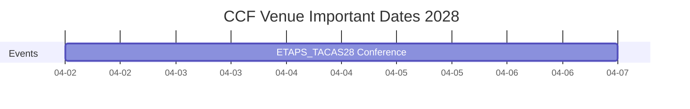
```mermaid
gantt
  title CCF Venue Important Dates 2028
  dateFormat YYYY-MM-DD
  axisFormat %m-%d

  section Events
  ETAPS_TACAS28 Conference :etaps_tacas_28_1_20280402, 2028-04-02, 2028-04-07
```
## 8. 2027 时间线

> 当前章节按 **2027 年实际发生的事件日期** 升序排列；Venue 名称保留会议 edition。

### 8.1 2027 投稿事件总表

| 日期时间 | Venue | 类型-CCF | Track / 事项 | 日期类型 | 阶段状态 | 事件官方来源 | 年度主页 | 论文集 / 名录 | 本库年度页 | 核验状态 | 备注 |
|---|---|---|---|---|---|---|---|---|---|---|---|
| 2027-01-08 待补时刻 | [SANER 2027](./conf-b-saner/2027/README.md) | 会议-B | Research Track camera-ready | Camera-ready | 🟢 投稿中 | [SANER 2027 dates](https://conf.researchr.org/dates/saner-2027) | [SANER 2027](https://conf.researchr.org/home/saner-2027) | 未公布 | [本库年度页](./conf-b-saner/2027/README.md) | 🟡 部分核验 | 官方仅日期；具体时刻待补。 |
| 2027-01-11 待补时刻 AoE | [ETAPS/TACAS 2027](./conf-b-etaps/2027/README.md) | 会议-B | TACAS voluntary artifact submission | Submission | 🟢 投稿中 | [官方来源](https://etaps.org/2027/cfp/) | [年度主页](https://etaps.org/2027/) | 未公布 | [本库年度页](./conf-b-etaps/2027/README.md) | 🟡 部分核验 | 官方仅日期，AoE；时刻待补。 |
| 2027-01-14 待补时刻 AoE | [REFSQ 2027](./conf-c-refsq/2027/README.md) | 会议-C | Research notification | Notification | 🟢 投稿中 | [官方来源](https://2027.refsq.org/dates/refsq-2027) | [年度主页](https://2027.refsq.org/) | 未公布 | [本库年度页](./conf-c-refsq/2027/README.md) | 🟡 部分核验 | main research / research track；具体时刻待补。 |
| 2027-01-25 待补时刻 AoE | [ETAPS/TACAS 2027](./conf-b-etaps/2027/README.md) | 会议-B | TACAS final version | Camera-ready | 🟢 投稿中 | [官方来源](https://etaps.org/2027/cfp/) | [年度主页](https://etaps.org/2027/) | 未公布 | [本库年度页](./conf-b-etaps/2027/README.md) | 🟡 部分核验 | 官方仅日期，AoE；时刻待补。 |
| 2027-01-25 待补时刻 | [ICSE 2027](./conf-a-icse/2027/README.md) | 会议-A | Research Track camera-ready after major revision | Camera-ready | 🟢 投稿中 | [官方来源](https://conf.researchr.org/track/icse-2027/icse-2027-research-track) | [年度主页](https://conf.researchr.org/home/icse-2027) | 未公布 | [本库年度页](./conf-a-icse/2027/README.md) | 🟡 部分核验 | 官方仅日期，AoE；时刻待补。 |
| 2027-02-04 待补时刻 AoE | [REFSQ 2027](./conf-c-refsq/2027/README.md) | 会议-C | Research camera-ready | Camera-ready | 🟢 投稿中 | [官方来源](https://2027.refsq.org/dates/refsq-2027) | [年度主页](https://2027.refsq.org/) | 未公布 | [本库年度页](./conf-c-refsq/2027/README.md) | 🟡 部分核验 | main research / research track；具体时刻待补。 |
| 2027-02-11 待补时刻 AoE | [ETAPS/TACAS 2027](./conf-b-etaps/2027/README.md) | 会议-B | TACAS artifact notification | Notification | 🟢 投稿中 | [官方来源](https://etaps.org/2027/cfp/) | [年度主页](https://etaps.org/2027/) | 未公布 | [本库年度页](./conf-b-etaps/2027/README.md) | 🟡 部分核验 | 官方仅日期，AoE；时刻待补。 |
| 2027-03-01 待补时刻 | [Empirical Software Engineering 2027](./journal-b-ese/2027/README.md) | 期刊专刊-CCF B | PROMPT-SE 2026 submission deadline | Special issue | 🟢 专刊征稿 | [Springer collection](https://link.springer.com/collections/bddiejbihe) | [Springer ESE](https://link.springer.com/journal/10664) | ⏳ 已检索未公布 | [本库年度页](./journal-b-ese/2027/README.md) | 🟡 部分核验 | 官方仅给日期；deadline 落在 2027 年。 |
| 2027-03-09 至 2027-03-12 | [SANER 2027](./conf-b-saner/2027/README.md) | 会议-B | Conference dates | Conference | 🟢 投稿中 | [SANER 2027 home](https://conf.researchr.org/home/saner-2027) | [SANER 2027](https://conf.researchr.org/home/saner-2027) | 未公布 | [本库年度页](./conf-b-saner/2027/README.md) | 🟡 部分核验 | Richmond, Virginia, United States。 |
| 2027-04-10 至 2027-04-15 | [ETAPS/TACAS 2027](./conf-b-etaps/2027/README.md) | 会议-B | ETAPS umbrella conference dates | Conference | 🟢 投稿中 | [官方来源](https://etaps.org/2027/) | [年度主页](https://etaps.org/2027/) | 未公布 | [本库年度页](./conf-b-etaps/2027/README.md) | 🟡 部分核验 | ETAPS umbrella 会期；官方主页 / CFP 均给出 Copenhagen, April 10–15, 2027。 |
| 2027-04-12 至 2027-04-15 | [ETAPS/TACAS 2027](./conf-b-etaps/2027/README.md) | 会议-B | Main conferences / TACAS dates | Conference | 🟢 投稿中 | [官方来源](https://etaps.org/2027/cfp/) | [年度主页](https://etaps.org/2027/) | 未公布 | [本库年度页](./conf-b-etaps/2027/README.md) | 🟡 部分核验 | CFP 明确写明 MAIN CONFERENCES / Main Conference: April 12–15, 2027；TACAS 属 main conferences。 |
| 2027-04-12 至 2027-04-15 | [REFSQ 2027](./conf-c-refsq/2027/README.md) | 会议-C | Conference dates | Conference | 🟢 投稿中 | [官方来源](https://2027.refsq.org/dates/refsq-2027) | [年度主页](https://2027.refsq.org/) | 未公布 | [本库年度页](./conf-c-refsq/2027/README.md) | 🟡 部分核验 | REFSQ official dates；Springer / DBLP 入口分散时以年度页说明为准。 |
| 2027-04-25 至 2027-05-01 | [ICSE 2027](./conf-a-icse/2027/README.md) | 会议-A | Conference dates | Conference | 🟢 投稿中 | [官方来源](https://conf.researchr.org/track/icse-2027/icse-2027-research-track) | [年度主页](https://conf.researchr.org/home/icse-2027) | 未公布 | [本库年度页](./conf-a-icse/2027/README.md) | 🟡 部分核验 | Dublin, Ireland。 |
| 2027-04-30 待补时刻 | [Empirical Software Engineering 2027](./journal-b-ese/2027/README.md) | 期刊专刊-CCF B | PROMPT-SE 2026 first review round | Notification | 🟢 专刊征稿 | [Springer collection](https://link.springer.com/collections/bddiejbihe) | [Springer ESE](https://link.springer.com/journal/10664) | ⏳ 已检索未公布 | [本库年度页](./journal-b-ese/2027/README.md) | 🟡 部分核验 | 官方仅给日期；review round，不是投稿截止。 |
| 2027-05-17 至 2027-05-21 | [ICST 2027](./conf-c-icst/2027/README.md) | 会议-C | Conference dates | Conference | 🟦 已有主页 | [ICST 2027 home](https://conf.researchr.org/home/icst-2027) | [ICST 2027](https://conf.researchr.org/home/icst-2027) | 未公布 | [本库年度页](./conf-c-icst/2027/README.md) | 🟡 部分核验 | Research track / CFP 未公布；只记录已公开会期。 |
| 2027-07-12 至 2027-07-16 | [FSE 2027](./conf-a-fse/2027/README.md) | 会议-A | Conference dates | Conference | 🟦 已有主页 | [官方来源](https://conf.researchr.org/home/fse-2027) | [年度主页](https://conf.researchr.org/home/fse-2027) | 未公布 | [本库年度页](./conf-a-fse/2027/README.md) | 🟡 部分核验 | CFP / deadlines 未公布；仅会期。 |
| 2027-07-31 待补时刻 | [Empirical Software Engineering 2027](./journal-b-ese/2027/README.md) | 期刊专刊-CCF B | PROMPT-SE 2026 revised manuscripts | Camera-ready | 🟢 专刊征稿 | [Springer collection](https://link.springer.com/collections/bddiejbihe) | [Springer ESE](https://link.springer.com/journal/10664) | ⏳ 已检索未公布 | [本库年度页](./journal-b-ese/2027/README.md) | 🟡 部分核验 | 官方仅给日期；revision due。 |
| 2027-11-30 待补时刻 | [Empirical Software Engineering 2027](./journal-b-ese/2027/README.md) | 期刊专刊-CCF B | PROMPT-SE 2026 final notification | Notification | 🟢 专刊征稿 | [Springer collection](https://link.springer.com/collections/bddiejbihe) | [Springer ESE](https://link.springer.com/journal/10664) | ⏳ 已检索未公布 | [本库年度页](./journal-b-ese/2027/README.md) | 🟡 部分核验 | 官方仅给日期；final notification。 |

### 8.2 2027 Mermaid 可视化

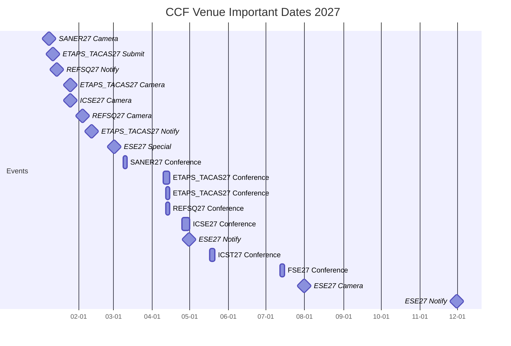
```mermaid
gantt
  title CCF Venue Important Dates 2027
  dateFormat YYYY-MM-DD
  axisFormat %m-%d

  section Events
  SANER27 Camera :milestone, saner_27_1_20270108, 2027-01-08, 1d
  ETAPS_TACAS27 Submit :milestone, etaps_tacas_27_2_20270111, 2027-01-11, 1d
  REFSQ27 Notify :milestone, refsq_27_3_20270114, 2027-01-14, 1d
  ETAPS_TACAS27 Camera :milestone, etaps_tacas_27_4_20270125, 2027-01-25, 1d
  ICSE27 Camera :milestone, icse_27_5_20270125, 2027-01-25, 1d
  REFSQ27 Camera :milestone, refsq_27_6_20270204, 2027-02-04, 1d
  ETAPS_TACAS27 Notify :milestone, etaps_tacas_27_7_20270211, 2027-02-11, 1d
  ESE27 Special :milestone, ese_27_8_20270301, 2027-03-01, 1d
  SANER27 Conference :saner_27_9_20270309, 2027-03-09, 2027-03-12
  ETAPS_TACAS27 Conference :etaps_tacas_27_10_20270410, 2027-04-10, 2027-04-15
  ETAPS_TACAS27 Conference :etaps_tacas_27_11_20270412, 2027-04-12, 2027-04-15
  REFSQ27 Conference :refsq_27_12_20270412, 2027-04-12, 2027-04-15
  ICSE27 Conference :icse_27_13_20270425, 2027-04-25, 2027-05-01
  ESE27 Notify :milestone, ese_27_14_20270430, 2027-04-30, 1d
  ICST27 Conference :icst_27_15_20270517, 2027-05-17, 2027-05-21
  FSE27 Conference :fse_27_16_20270712, 2027-07-12, 2027-07-16
  ESE27 Camera :milestone, ese_27_17_20270731, 2027-07-31, 1d
  ESE27 Notify :milestone, ese_27_18_20271130, 2027-11-30, 1d
```
## 9. 2026 时间线

> 当前章节按 **2026 年实际发生的事件日期** 升序排列；Venue 名称保留会议 edition。

### 9.1 2026 投稿事件总表

| 日期时间 | Venue | 类型-CCF | Track / 事项 | 日期类型 | 阶段状态 | 事件官方来源 | 年度主页 | 论文集 / 名录 | 本库年度页 | 核验状态 | 备注 |
|---|---|---|---|---|---|---|---|---|---|---|---|
| 2026-01-05 待补时刻 | [ICPC 2026](./conf-b-icpc/2026/README.md) | 会议-B | Research Track final notification | Notification | ✅ 已结束 / proceedings 待补 | [ICPC 2026 dates](https://conf.researchr.org/dates/icpc-2026) | [ICPC 2026](https://conf.researchr.org/home/icpc-2026) | 未公布 | [本库年度页](./conf-b-icpc/2026/README.md) | 🟡 部分核验 | 官方仅日期；具体时刻待补。 |
| 2026-01-07 | [MSR 2026](./conf-c-msr/2026/README.md) | 会议-C / P2 | Technical notification | Notification | ✅ 已结束 | [官方来源](https://2026.msrconf.org/dates) | [年度主页](https://2026.msrconf.org/) | [论文集 / 名录](https://2026.msrconf.org/program/program-msr-2026/) | [本库年度页](./conf-c-msr/2026/README.md) | 🟡 部分核验 | PR-9 P2 邻近观察；官方仅日期；不升级为 P0/P1 主线。 |
| 2026-01-08 待补时刻 AoE | [ETAPS/TACAS 2026](./conf-b-etaps/2026/README.md) | 会议-B | TACAS voluntary artifact submission | Submission | ✅ 已结束 | [官方来源](https://etaps.org/2026/cfp/) | [年度主页](https://etaps.org/2026/) | [Programme](https://etaps.org/2026/programme/) / [DBLP TACAS](https://dblp.org/db/conf/tacas/index.html#2026) | [本库年度页](./conf-b-etaps/2026/README.md) | 🟡 部分核验 | CFP 明确写明 All the dates are AoE；官方仅日期，具体时刻待补。 |
| 2026-01-09 待补时刻 | [SANER 2026](./conf-b-saner/2026/README.md) | 会议-B | Research Track camera-ready | Camera-ready | ✅ 已结束 / 待 proceedings | [SANER 2026 dates](https://conf.researchr.org/dates/saner-2026) | [SANER 2026](https://conf.researchr.org/home/saner-2026) | 未公布 | [本库年度页](./conf-b-saner/2026/README.md) | 🟡 部分核验 | Research Track camera-ready；其他 track 多在 2026-01-14。 |
| 2026-01-12 至 2026-01-13 | [VMCAI 2026](./conf-b-vmcai/2026/README.md) | 会议-B | Conference dates | Conference | ✅ 已结束 | [VMCAI 2026 home](https://conf.researchr.org/home/VMCAI-2026) | [VMCAI 2026](https://conf.researchr.org/home/VMCAI-2026) | 未公布 | [本库年度页](./conf-b-vmcai/2026/README.md) | 🟡 部分核验 | POPL co-located；proceedings / DBLP 尚未闭合。 |
| 2026-01-16 | [EASE 2026](./conf-c-ease/2026/README.md) | 会议-C / P2 | Research abstract | Abstract | ✅ 已结束 | [官方来源](https://conf.researchr.org/dates/ease-2026) | [年度主页](https://conf.researchr.org/home/ease-2026) | [论文集 / 名录](https://conf.researchr.org/program/ease-2026/program-ease-2026/) | [本库年度页](./conf-c-ease/2026/README.md) | 🟡 部分核验 | PR-9 P2 邻近观察；AoE；不升级为 P0/P1 主线。 |
| 2026-01-16 待补时刻 | [ICSE 2026](./conf-a-icse/2026/README.md) | 会议-A | Research Track camera-ready, cycle 2 revised | Camera-ready | ✅ 已结束 | [官方来源](https://conf.researchr.org/track/icse-2026/icse-2026-research-track) | [年度主页](https://conf.researchr.org/home/icse-2026) | [Research Track](https://conf.researchr.org/track/icse-2026/icse-2026-research-track) / [Program](https://conf.researchr.org/program/icse-2026/program-icse-2026/) | [本库年度页](./conf-a-icse/2026/README.md) | 🟡 部分核验 | 官方仅日期；时刻待补。 |
| 2026-01-19 待补时刻 AoE | [REFSQ 2026](./conf-c-refsq/2026/README.md) | 会议-C | Research camera-ready | Camera-ready | ✅ 已结束 | [官方来源](https://2026.refsq.org/dates/refsq-2026) | [年度主页](https://2026.refsq.org/) | [Program](https://2026.refsq.org/program/program-refsq-2026/) / [Accepted Papers](https://2026.refsq.org/track/refsq-2026-research-papers) | [本库年度页](./conf-c-refsq/2026/README.md) | 🟡 部分核验 | main research / research track；具体时刻待补。 |
| 2026-01-22 待补时刻 AoE | [ETAPS/TACAS 2026](./conf-b-etaps/2026/README.md) | 会议-B | TACAS final version | Camera-ready | ✅ 已结束 | [官方来源](https://etaps.org/2026/cfp/) | [年度主页](https://etaps.org/2026/) | [Programme](https://etaps.org/2026/programme/) / [DBLP TACAS](https://dblp.org/db/conf/tacas/index.html#2026) | [本库年度页](./conf-b-etaps/2026/README.md) | 🟡 部分核验 | CFP 明确写明 All the dates are AoE；官方仅日期，具体时刻待补。 |
| 2026-01-22 待补时刻 AoE | [SPIN 2026](./conf-c-spin/2026/README.md) | 会议-C | Abstract | Abstract | ✅ 已结束 | [SPIN 2026 CFP](https://spin-web.github.io/SPIN2026/cfp) | [SPIN 2026](https://spin-web.github.io/SPIN2026/) | 未公布 | [本库年度页](./conf-c-spin/2026/README.md) | 🟡 部分核验 | 官方只给日期 / AoE。 |
| 2026-01-23 | [EASE 2026](./conf-c-ease/2026/README.md) | 会议-C / P2 | Research full paper | Submission | ✅ 已结束 | [官方来源](https://conf.researchr.org/dates/ease-2026) | [年度主页](https://conf.researchr.org/home/ease-2026) | [论文集 / 名录](https://conf.researchr.org/program/ease-2026/program-ease-2026/) | [本库年度页](./conf-c-ease/2026/README.md) | 🟡 部分核验 | PR-9 P2 邻近观察；AoE；不升级为 P0/P1 主线。 |
| 2026-01-26 | [MSR 2026](./conf-c-msr/2026/README.md) | 会议-C / P2 | Technical camera-ready | Camera-ready | ✅ 已结束 | [官方来源](https://2026.msrconf.org/dates) | [年度主页](https://2026.msrconf.org/) | [论文集 / 名录](https://2026.msrconf.org/program/program-msr-2026/) | [本库年度页](./conf-c-msr/2026/README.md) | 🟡 部分核验 | PR-9 P2 邻近观察；官方仅日期；不升级为 P0/P1 主线。 |
| 2026-01-26 待补时刻 | [ICPC 2026](./conf-b-icpc/2026/README.md) | 会议-B | Research Track camera-ready | Camera-ready | ✅ 已结束 / proceedings 待补 | [ICPC 2026 dates](https://conf.researchr.org/dates/icpc-2026) | [ICPC 2026](https://conf.researchr.org/home/icpc-2026) | 未公布 | [本库年度页](./conf-b-icpc/2026/README.md) | 🟡 部分核验 | 官方仅日期；具体时刻待补。 |
| 2026-01-28 待补时刻 AoE | [CAV 2026](./conf-a-cav/2026/README.md) | 会议-A | Full paper submission | Submission | 🟡 已通知 / 待会期 | [CAV 2026 CFP](https://conferences.i-cav.org/2026/cfp/) | [CAV 2026](https://conferences.i-cav.org/2026/) | 未公布 | [本库年度页](./conf-a-cav/2026/README.md) | 🟡 部分核验 | 不混入 artifact/workshop。 |
| 2026-01-29 23:59 AoE | [ISSTA 2026](./conf-a-issta/2026/README.md) | 会议-A | Research papers submission | Submission | ✅ 已结束 | [官方来源](https://conf.researchr.org/track/issta-2026/issta-2026-research-papers) | [年度主页](https://conf.researchr.org/home/issta-2026) | 未公布 | [本库年度页](./conf-a-issta/2026/README.md) | 🟡 部分核验 | Co-located with SPLASH/ISSTA 2026；只按 ISSTA 独立计数。 |
| 2026-01-29 待补时刻 AoE | [SPIN 2026](./conf-c-spin/2026/README.md) | 会议-C | Paper submission | Submission | ✅ 已结束 | [SPIN 2026 CFP](https://spin-web.github.io/SPIN2026/cfp) | [SPIN 2026](https://spin-web.github.io/SPIN2026/) | 未公布 | [本库年度页](./conf-c-spin/2026/README.md) | 🟡 部分核验 | tool artifact 单列。 |
| 2026-02-05 待补时刻 AoE | [SPIN 2026](./conf-c-spin/2026/README.md) | 会议-C | Tool artifact submission | Submission | ✅ 已结束 | [SPIN 2026 CFP](https://spin-web.github.io/SPIN2026/cfp) | [SPIN 2026](https://spin-web.github.io/SPIN2026/) | 未公布 | [本库年度页](./conf-c-spin/2026/README.md) | 🟡 部分核验 | artifact 不混入 full-paper count。 |
| 2026-02-06 待补时刻 | [FM 2026](./conf-a-fm/2026/README.md) | 会议-A | Author notification | Notification | ✅ 已结束 | [FM 2026 Dates](https://conf.researchr.org/dates/fm-2026) | [FM 2026](https://conf.researchr.org/home/fm-2026) | [Springer Part I](https://link.springer.com/book/10.1007/978-3-032-26204-2) | [本库年度页](./conf-a-fm/2026/README.md) | 🟡 部分核验 | Springer Part I count 不混入 invited/tutorial/industry。 |
| 2026-02-12 待补时刻 AoE | [ETAPS/TACAS 2026](./conf-b-etaps/2026/README.md) | 会议-B | TACAS artifact notification | Notification | ✅ 已结束 | [官方来源](https://etaps.org/2026/cfp/) | [年度主页](https://etaps.org/2026/) | [Programme](https://etaps.org/2026/programme/) / [DBLP TACAS](https://dblp.org/db/conf/tacas/index.html#2026) | [本库年度页](./conf-b-etaps/2026/README.md) | 🟡 部分核验 | CFP 明确写明 All the dates are AoE；官方仅日期，具体时刻待补。 |
| 2026-02-15 待补时刻 | [SoSyM 2026](./journal-b-sosym/2026/README.md) | 期刊专刊-CCF B | Theme Section: Software and Systems Modeling in Industry 5.0 | Intent | ✅ 已过去 | [Industry 5.0 theme section](https://link.springer.com/collections/hhibjbacdf) | [Springer SoSyM](https://link.springer.com/journal/10270) | [DBLP Vol. 25](https://dblp.org/db/journals/sosym/sosym25.html) | [SoSyM 2026](./journal-b-sosym/2026/README.md) | 🟡 部分核验 | 官方仅给日期；intent to submit 已过去，保留为专刊完整日期链。 |
| 2026-02-16 待补时刻 AoE | [RE 2026](./conf-b-re/2026/README.md) | 会议-B | Research Papers abstract | Abstract | 🟡 审稿中 | [官方来源](https://conf.researchr.org/dates/RE-2026) | [年度主页](https://conf.researchr.org/home/RE-2026) | 未公布 | [本库年度页](./conf-b-re/2026/README.md) | 🟡 部分核验 | main research / research track；具体时刻待补。 |
| 2026-02-20 待补时刻 | [ICST 2026](./conf-c-icst/2026/README.md) | 会议-C | Research author notification | Notification | ✅ 已结束 | [ICST 2026 dates](https://conf.researchr.org/dates/icst-2026) | [ICST 2026](https://conf.researchr.org/home/icst-2026) | [Program](https://conf.researchr.org/program/icst-2026/program-icst-2026/) | [本库年度页](./conf-c-icst/2026/README.md) | 🟡 部分核验 | Research / Industry / Tool / Workshop 不混算。 |
| 2026-02-23 待补时刻 AoE | [RE 2026](./conf-b-re/2026/README.md) | 会议-B | Research Papers submission | Submission | 🟡 审稿中 | [官方来源](https://conf.researchr.org/dates/RE-2026) | [年度主页](https://conf.researchr.org/home/RE-2026) | 未公布 | [本库年度页](./conf-b-re/2026/README.md) | 🟡 部分核验 | main research / research track；具体时刻待补。 |
| 2026-02-27 待补时刻 | [ICSME 2026](./conf-b-icsme/2026/README.md) | 会议-B | Research Papers abstract | Abstract | 🔵 会期临近 / main track 已通知 | [ICSME 2026 dates](https://conf.researchr.org/dates/icsme-2026) | [ICSME 2026](https://conf.researchr.org/home/icsme-2026) | 未公布 | [本库年度页](./conf-b-icsme/2026/README.md) | 🟡 部分核验 | 官方仅日期；具体时刻待补。 |
| 2026-03-01 待补时刻 | [TASE 2026](./conf-c-tase/2026/README.md) | 会议-C | Abstract due | Abstract | ✅ 已结束 | [TASE 2026 official source](https://tase2026.github.io/c_impd.html) | [TASE 2026](https://tase2026.github.io/) | [Accepted Papers](https://tase2026.github.io/c_ap.html)；Springer / DBLP 2026 未公布 | [本库年度页](./conf-c-tase/2026/README.md) | 🟡 部分核验 | TASE official accepted list、Springer TOC 与 DBLP 计数需分列；不混成单一论文数。 |
| 2026-03-02 待补时刻 | [FM 2026](./conf-a-fm/2026/README.md) | 会议-A | Final version | Camera-ready | ✅ 已结束 | [FM 2026 Dates](https://conf.researchr.org/dates/fm-2026) | [FM 2026](https://conf.researchr.org/home/fm-2026) | [Springer Part I](https://link.springer.com/book/10.1007/978-3-032-26204-2) | [本库年度页](./conf-a-fm/2026/README.md) | 🟡 部分核验 | final version deadline。 |
| 2026-03-05 待补时刻 | [SPIN 2026](./conf-c-spin/2026/README.md) | 会议-C | Notification | Notification | ✅ 已结束 | [SPIN 2026 CFP](https://spin-web.github.io/SPIN2026/cfp) | [SPIN 2026](https://spin-web.github.io/SPIN2026/) | 未公布 | [本库年度页](./conf-c-spin/2026/README.md) | 🟡 部分核验 | additional artifact notification 另列。 |
| 2026-03-06 待补时刻 | [ICSME 2026](./conf-b-icsme/2026/README.md) | 会议-B | Research Papers submission | Submission | 🔵 会期临近 / main track 已通知 | [ICSME 2026 dates](https://conf.researchr.org/dates/icsme-2026) | [ICSME 2026](https://conf.researchr.org/home/icsme-2026) | 未公布 | [本库年度页](./conf-b-icsme/2026/README.md) | 🟡 部分核验 | 官方仅日期；具体时刻待补。 |
| 2026-03-06 待补时刻 | [ICST 2026](./conf-c-icst/2026/README.md) | 会议-C | Research camera-ready | Camera-ready | ✅ 已结束 | [ICST 2026 dates](https://conf.researchr.org/dates/icst-2026) | [ICST 2026](https://conf.researchr.org/home/icst-2026) | [Program](https://conf.researchr.org/program/icst-2026/program-icst-2026/) | [本库年度页](./conf-c-icst/2026/README.md) | 🟡 部分核验 | Research track chain。 |
| 2026-03-07 待补时刻 | [TASE 2026](./conf-c-tase/2026/README.md) | 会议-C | Paper submission | Submission | ✅ 已结束 | [TASE 2026 official source](https://tase2026.github.io/c_impd.html) | [TASE 2026](https://tase2026.github.io/) | [Accepted Papers](https://tase2026.github.io/c_ap.html)；Springer / DBLP 2026 未公布 | [本库年度页](./conf-c-tase/2026/README.md) | 🟡 部分核验 | TASE official accepted list、Springer TOC 与 DBLP 计数需分列；不混成单一论文数。 |
| 2026-03-12 待补时刻 | [SPIN 2026](./conf-c-spin/2026/README.md) | 会议-C | Non-tool artifact submission | Submission | ✅ 已结束 | [SPIN 2026 CFP](https://spin-web.github.io/SPIN2026/cfp) | [SPIN 2026](https://spin-web.github.io/SPIN2026/) | 未公布 | [本库年度页](./conf-c-spin/2026/README.md) | 🟡 部分核验 | artifact 单列。 |
| 2026-03-13 | [EASE 2026](./conf-c-ease/2026/README.md) | 会议-C / P2 | Research notification | Notification | ✅ 已结束 | [官方来源](https://conf.researchr.org/dates/ease-2026) | [年度主页](https://conf.researchr.org/home/ease-2026) | [论文集 / 名录](https://conf.researchr.org/program/ease-2026/program-ease-2026/) | [本库年度页](./conf-c-ease/2026/README.md) | 🟡 部分核验 | PR-9 P2 邻近观察；AoE；不升级为 P0/P1 主线。 |
| 2026-03-15 待补时刻 | [JSS 2026](./journal-b-jss/2026/README.md) | 期刊专刊-CCF B | Artificial Intelligence for Software Architecting | Special issue | ✅ 已关闭 | [ScienceDirect CFP](https://www.sciencedirect.com/special-issue/329237/artificial-intelligence-for-software-architecting-ai-for-sa) | [ScienceDirect JSS](https://www.sciencedirect.com/journal/journal-of-systems-and-software) | DBLP Vol. 232-240（[index](https://dblp.org/db/journals/jss/)） | [本库年度页](./journal-b-jss/2026/README.md) | 🟡 部分核验 | 官方仅给日期；ScienceDirect CLI 可能 403/WAF。 |
| 2026-03-17 至 2026-03-20 | [SANER 2026](./conf-b-saner/2026/README.md) | 会议-B | Conference dates | Conference | ✅ 已结束 / 待 proceedings | [SANER 2026 home](https://conf.researchr.org/home/saner-2026) | [SANER 2026](https://conf.researchr.org/home/saner-2026) | 未公布 | [本库年度页](./conf-b-saner/2026/README.md) | 🟡 部分核验 | Limassol, Cyprus。 |
| 2026-03-20 待补时刻 | [MoDELS 2026](./conf-b-models/2026/README.md) | 会议-B | Research Papers abstract | Abstract | 🟡 审稿中 | [官方来源](https://conf.researchr.org/dates/models-2026) | [年度主页](https://conf.researchr.org/home/models-2026) | 未公布 | [本库年度页](./conf-b-models/2026/README.md) | 🟡 部分核验 | 官方仅日期，AoE；时刻待补。 |
| 2026-03-23 至 2026-03-26 | [REFSQ 2026](./conf-c-refsq/2026/README.md) | 会议-C | Conference dates | Conference | ✅ 已结束 | [官方来源](https://2026.refsq.org/dates/refsq-2026) | [年度主页](https://2026.refsq.org/) | [Program](https://2026.refsq.org/program/program-refsq-2026/) / [Accepted Papers](https://2026.refsq.org/track/refsq-2026-research-papers) | [本库年度页](./conf-c-refsq/2026/README.md) | 🟡 部分核验 | REFSQ official dates；Springer / DBLP 入口分散时以年度页说明为准。 |
| 2026-03-24 23:59 AoE | [FSE 2026](./conf-a-fse/2026/README.md) | 会议-A | Major revision final notification | Notification | ✅ 已结束 | [官方来源](https://conf.researchr.org/track/fse-2026/fse-2026-research-papers) | [年度主页](https://conf.researchr.org/home/fse-2026) | [Program](https://conf.researchr.org/program/fse-2026/program-fse-2026/) | [本库年度页](./conf-a-fse/2026/README.md) | 🟡 部分核验 | 23:59 AoE / UTC-12h。 |
| 2026-03-26 待补时刻 AoE | [ASE 2026](./conf-a-ase/2026/README.md) | 会议-A | Research Track paper submission | Submission | 🟡 审稿中 | [官方来源](https://conf.researchr.org/track/ase-2026/ase-2026-research-track) | [年度主页](https://conf.researchr.org/home/ase-2026) | 未公布 | [本库年度页](./conf-a-ase/2026/README.md) | 🟡 部分核验 | 官方未列 abstract deadline。 |
| 2026-03-27 待补时刻 | [MoDELS 2026](./conf-b-models/2026/README.md) | 会议-B | Research Papers submission | Submission | 🟡 审稿中 | [官方来源](https://conf.researchr.org/dates/models-2026) | [年度主页](https://conf.researchr.org/home/models-2026) | 未公布 | [本库年度页](./conf-b-models/2026/README.md) | 🟡 部分核验 | 官方仅日期，AoE；时刻待补。 |
| 2026-03-30 待补时刻 | [SQJ 2026](./journal-c-sqj/2026/README.md) | 期刊专刊-CCF C | Software Quality in an AI-Driven World | Special issue | ✅ 已关闭 | [Springer collection](https://link.springer.com/collections/bjjddgfaei) | [Springer SQJ](https://link.springer.com/journal/11219) | [DBLP Vol. 34](https://dblp.org/db/journals/sqj/sqj34.html) | [本库年度页](./journal-c-sqj/2026/README.md) | 🟡 部分核验 | 当前 collection 页面显示 Closed；历史 deadline 日期仍需官方归档源复核，不写成当前可行动窗口。 |
| 2026-03-30 至 2026-04-02 | [CAV 2026](./conf-a-cav/2026/README.md) | 会议-A | Author response | Rebuttal | 🟡 已通知 / 待会期 | [CAV 2026 CFP](https://conferences.i-cav.org/2026/cfp/) | [CAV 2026](https://conferences.i-cav.org/2026/) | 未公布 | [本库年度页](./conf-a-cav/2026/README.md) | 🟡 部分核验 | response window。 |
| 2026-04-08 待补时刻 | [QRS 2026](./conf-c-qrs/2026/README.md) | 会议-C | Abstract due | Abstract | ✅ 已结束 | [QRS 2026 official source](https://qrs26.techconf.org/) | [QRS 2026](https://qrs26.techconf.org/) | [Proceedings policy](https://qrs26.techconf.org/track/proceeding)；DBLP 年度页未公布 | [本库年度页](./conf-c-qrs/2026/README.md) | 🟡 部分核验 | Regular / short、workshop / special track、proceedings policy / DBLP fallback 分开记录；不把 proceedings policy 页或整本 proceedings fallback 当作 main research count；IEEE Xplore proceedings TOC 待补。 |
| 2026-04-09 待补时刻 | [SPIN 2026](./conf-c-spin/2026/README.md) | 会议-C | Additional artifact notification | Notification | ✅ 已结束 | [SPIN 2026 CFP](https://spin-web.github.io/SPIN2026/cfp) | [SPIN 2026](https://spin-web.github.io/SPIN2026/) | 未公布 | [本库年度页](./conf-c-spin/2026/README.md) | 🟡 部分核验 | artifact 单列。 |
| 2026-04-11 至 2026-04-16 | [ETAPS/TACAS 2026](./conf-b-etaps/2026/README.md) | 会议-B | ETAPS conference dates | Conference | ✅ 已结束 | [官方来源](https://etaps.org/2026/cfp/) | [年度主页](https://etaps.org/2026/) | [Programme](https://etaps.org/2026/programme/) / [DBLP TACAS](https://dblp.org/db/conf/tacas/index.html#2026) | [本库年度页](./conf-b-etaps/2026/README.md) | 🟡 部分核验 | Turin, Italy。 |
| 2026-04-12 至 2026-04-13 | [ICPC 2026](./conf-b-icpc/2026/README.md) | 会议-B | Conference dates | Conference | ✅ 已结束 / proceedings 待补 | [ICPC 2026 home](https://conf.researchr.org/home/icpc-2026) | [ICPC 2026](https://conf.researchr.org/home/icpc-2026) | 未公布 | [本库年度页](./conf-b-icpc/2026/README.md) | 🟡 部分核验 | 官方仅日期；具体时刻待补。 |
| 2026-04-12 至 2026-04-18 | [ICSE 2026](./conf-a-icse/2026/README.md) | 会议-A | Conference dates | Conference | ✅ 已结束 | [官方来源](https://conf.researchr.org/track/icse-2026/icse-2026-research-track) | [年度主页](https://conf.researchr.org/home/icse-2026) | [Research Track](https://conf.researchr.org/track/icse-2026/icse-2026-research-track) / [Program](https://conf.researchr.org/program/icse-2026/program-icse-2026/) | [本库年度页](./conf-a-icse/2026/README.md) | 🟡 部分核验 | Rio de Janeiro, Brazil。 |
| 2026-04-13 至 2026-04-14 | [MSR 2026](./conf-c-msr/2026/README.md) | 会议-C / P2 | Conference | Conference | ✅ 已结束 | [官方来源](https://2026.msrconf.org/dates) | [年度主页](https://2026.msrconf.org/) | [论文集 / 名录](https://2026.msrconf.org/program/program-msr-2026/) | [本库年度页](./conf-c-msr/2026/README.md) | 🟡 部分核验 | PR-9 P2 邻近观察；Rio local time；不升级为 P0/P1 主线。 |
| 2026-04-15 至 2026-04-16 | [SPIN 2026](./conf-c-spin/2026/README.md) | 会议-C | Symposium | Conference | ✅ 已结束 | [SPIN 2026 home](https://spin-web.github.io/SPIN2026/) | [SPIN 2026](https://spin-web.github.io/SPIN2026/) | 未公布 | [本库年度页](./conf-c-spin/2026/README.md) | 🟡 部分核验 | proceedings count 待闭合。 |
| 2026-04-16 23:59 AoE | [ISSTA 2026](./conf-a-issta/2026/README.md) | 会议-A | Initial notification | Notification | ✅ 已结束 | [官方来源](https://conf.researchr.org/track/issta-2026/issta-2026-research-papers) | [年度主页](https://conf.researchr.org/home/issta-2026) | 未公布 | [本库年度页](./conf-a-issta/2026/README.md) | 🟡 部分核验 | 23:59 AoE / UTC-12h。 |
| 2026-04-17 待补时刻 | [CAV 2026](./conf-a-cav/2026/README.md) | 会议-A | Notification | Notification | 🟡 已通知 / 待会期 | [CAV 2026 CFP](https://conferences.i-cav.org/2026/cfp/) | [CAV 2026](https://conferences.i-cav.org/2026/) | 未公布 | [本库年度页](./conf-a-cav/2026/README.md) | 🟡 部分核验 | paper notification。 |
| 2026-04-18 待补时刻 | [TASE 2026](./conf-c-tase/2026/README.md) | 会议-C | Notification | Notification | ✅ 已结束 | [TASE 2026 official source](https://tase2026.github.io/c_impd.html) | [TASE 2026](https://tase2026.github.io/) | [Accepted Papers](https://tase2026.github.io/c_ap.html)；Springer / DBLP 2026 未公布 | [本库年度页](./conf-c-tase/2026/README.md) | 🟡 部分核验 | TASE official accepted list、Springer TOC 与 DBLP 计数需分列；不混成单一论文数。 Important Dates 页为 2026-04-18，CFP 页为 2026-04-15；本库以 Important Dates 为准。 |
| 2026-04-22 待补时刻 | [QRS 2026](./conf-c-qrs/2026/README.md) | 会议-C | Regular and Short papers due extended | Submission | ✅ 已结束 | [QRS 2026 official source](https://qrs26.techconf.org/) | [QRS 2026](https://qrs26.techconf.org/) | [Proceedings policy](https://qrs26.techconf.org/track/proceeding)；DBLP 年度页未公布 | [本库年度页](./conf-c-qrs/2026/README.md) | 🟡 部分核验 | Regular / short、workshop / special track、proceedings policy / DBLP fallback 分开记录；不把 proceedings policy 页或整本 proceedings fallback 当作 main research count；IEEE Xplore proceedings TOC 待补。 |
| 2026-04-24 待补时刻 AoE | [ISSRE 2026](./conf-b-issre/2026/README.md) | 会议-B | Research abstract | Abstract | 🟡 审稿中 | [ISSRE 2026 Research CFP](https://cyprusconferences.org/issre2026/cfp-research/) | [ISSRE 2026](https://cyprusconferences.org/issre2026/) | 未公布 | [本库年度页](./conf-b-issre/2026/README.md) | 🟡 部分核验 | 官方将旧 abstract deadline 2026-04-10 extended 到 2026-04-24；普通 curl 可能 404，带 UA 可 200。 |
| 2026-04-24 待补时刻 AoE | [ISSRE 2026](./conf-b-issre/2026/README.md) | 会议-B | Research paper submission | Submission | 🟡 审稿中 | [ISSRE 2026 Research CFP](https://cyprusconferences.org/issre2026/cfp-research/) | [ISSRE 2026](https://cyprusconferences.org/issre2026/) | 未公布 | [本库年度页](./conf-b-issre/2026/README.md) | 🟡 部分核验 | 官方将旧 paper deadline 2026-04-17 extended 到 2026-04-24。 |
| 2026-04-30 | [EASE 2026](./conf-c-ease/2026/README.md) | 会议-C / P2 | Camera-ready | Camera-ready | ✅ 已结束 | [官方来源](https://conf.researchr.org/dates/ease-2026) | [年度主页](https://conf.researchr.org/home/ease-2026) | [论文集 / 名录](https://conf.researchr.org/program/ease-2026/program-ease-2026/) | [本库年度页](./conf-c-ease/2026/README.md) | 🟡 部分核验 | PR-9 P2 邻近观察；AoE；不升级为 P0/P1 主线。 |
| 2026-04-30 待补时刻 | [Requirements Engineering 2026](./journal-b-re/2026/README.md) | 期刊专刊-CCF B | Rethinking Requirements Engineering in the Age of Large Language Models | Special issue | ✅ 已关闭 | [LLM collection](https://link.springer.com/collections/deebijccbh) | [Springer RE](https://link.springer.com/journal/766) | [DBLP Vol. 31](https://dblp.org/db/journals/re/re31.html) | [Requirements Engineering 2026](./journal-b-re/2026/README.md) | 🟡 部分核验 | Submission deadline 已过；July 2026 revisions / September 2026 final decisions 仅有月份，不生成独立 milestone。 |
| 2026-05-01 待补时刻 | [TASE 2026](./conf-c-tase/2026/README.md) | 会议-C | Camera-ready | Camera-ready | ✅ 已结束 | [TASE 2026 official source](https://tase2026.github.io/c_impd.html) | [TASE 2026](https://tase2026.github.io/) | [Accepted Papers](https://tase2026.github.io/c_ap.html)；Springer / DBLP 2026 未公布 | [本库年度页](./conf-c-tase/2026/README.md) | 🟡 部分核验 | TASE official accepted list、Springer TOC 与 DBLP 计数需分列；不混成单一论文数。 |
| 2026-05-08 待补时刻 AoE | [RE 2026](./conf-b-re/2026/README.md) | 会议-B | Research Papers notification | Notification | 🟡 审稿中 | [官方来源](https://conf.researchr.org/dates/RE-2026) | [年度主页](https://conf.researchr.org/home/RE-2026) | 未公布 | [本库年度页](./conf-b-re/2026/README.md) | 🟡 部分核验 | main research / research track；具体时刻待补。 |
| 2026-05-10 | [SEKE 2026](./conf-c-seke/2026/README.md) | 会议-C / P2 | Paper submission due | Submission | ✅ 已结束 | [官方来源](https://ksiresearch.org/seke/seke26main.html) | [年度主页](https://ksiresearch.org/seke/seke26.html) | 未公布 | [本库年度页](./conf-c-seke/2026/README.md) | 🟡 部分核验 | PR-9 P2 邻近观察；Midnight EST；不升级为 P0/P1 主线。 |
| 2026-05-11 待补时刻 | [ESEM 2026](./conf-b-esem/2026/README.md) | 会议-B | Technical Track abstract | Abstract | 🟡 审稿中 | [Important Dates](https://conf.researchr.org/dates/eseiw-2026) | [ESEIW 2026](https://conf.researchr.org/home/eseiw-2026) | 未公布 | [本库年度页](./conf-b-esem/2026/README.md) | 🟡 部分核验 | 官方仅给日期；ESEM Technical Track。 |
| 2026-05-15 待补时刻 | [CAV 2026](./conf-a-cav/2026/README.md) | 会议-A | Camera-ready | Camera-ready | 🟡 已通知 / 待会期 | [CAV 2026 CFP](https://conferences.i-cav.org/2026/cfp/) | [CAV 2026](https://conferences.i-cav.org/2026/) | 未公布 | [本库年度页](./conf-a-cav/2026/README.md) | 🟡 部分核验 | paper camera-ready。 |
| 2026-05-15 待补时刻 | [QRS 2026](./conf-c-qrs/2026/README.md) | 会议-C | Workshop and Special Track papers due | Submission | ✅ 已结束 | [QRS 2026 official source](https://qrs26.techconf.org/) | [QRS 2026](https://qrs26.techconf.org/) | [Proceedings policy](https://qrs26.techconf.org/track/proceeding)；DBLP 年度页未公布 | [本库年度页](./conf-c-qrs/2026/README.md) | 🟡 部分核验 | Regular / short、workshop / special track、proceedings policy / DBLP fallback 分开记录；不把 proceedings policy 页或整本 proceedings fallback 当作 main research count；IEEE Xplore proceedings TOC 待补。 |
| 2026-05-18 待补时刻 | [ESEM 2026](./conf-b-esem/2026/README.md) | 会议-B | Technical Track submission | Submission | 🟡 审稿中 | [Important Dates](https://conf.researchr.org/dates/eseiw-2026) | [ESEIW 2026](https://conf.researchr.org/home/eseiw-2026) | 未公布 | [本库年度页](./conf-b-esem/2026/README.md) | 🟡 部分核验 | 官方仅给日期；投稿系统为 HotCRP esem26。 |
| 2026-05-18 至 2026-05-22 | [FM 2026](./conf-a-fm/2026/README.md) | 会议-A | Conference dates | Conference | ✅ 已结束 | [FM 2026 home](https://conf.researchr.org/home/fm-2026) | [FM 2026](https://conf.researchr.org/home/fm-2026) | [Springer Part I](https://link.springer.com/book/10.1007/978-3-032-26204-2) | [本库年度页](./conf-a-fm/2026/README.md) | 🟡 部分核验 | Tokyo。 |
| 2026-05-18 至 2026-05-22 | [ICST 2026](./conf-c-icst/2026/README.md) | 会议-C | Conference dates | Conference | ✅ 已结束/待 proceedings | [ICST 2026 home](https://conf.researchr.org/home/icst-2026) | [ICST 2026](https://conf.researchr.org/home/icst-2026) | [Program](https://conf.researchr.org/program/icst-2026/program-icst-2026/) | [本库年度页](./conf-c-icst/2026/README.md) | 🟡 部分核验 | Daejeon。 |
| 2026-05-27 至 2026-05-29 | [MoDELS 2026](./conf-b-models/2026/README.md) | 会议-B | Research Papers author response | Rebuttal | 🟡 审稿中 | [官方来源](https://conf.researchr.org/dates/models-2026) | [年度主页](https://conf.researchr.org/home/models-2026) | 未公布 | [本库年度页](./conf-b-models/2026/README.md) | 🟡 部分核验 | 官方仅日期，AoE；时刻待补。 |
| 2026-05-29 待补时刻 | [ICSME 2026](./conf-b-icsme/2026/README.md) | 会议-B | Research Papers final notification | Notification | 🔵 会期临近 / main track 已通知 | [ICSME 2026 dates](https://conf.researchr.org/dates/icsme-2026) | [ICSME 2026](https://conf.researchr.org/home/icsme-2026) | 未公布 | [本库年度页](./conf-b-icsme/2026/README.md) | 🟡 部分核验 | 官方仅日期；具体时刻待补。 |
| 2026-05-31 待补时刻 | [Empirical Software Engineering 2026](./journal-b-ese/2026/README.md) | 期刊专刊-CCF B | Advancing Software Engineering with Large Language Models / first review round | Notification | ✅ 已结束 | [Springer collection](https://link.springer.com/collections/jfdgedjehb) | [Springer ESE](https://link.springer.com/journal/10664) | [DBLP Vol. 31](https://dblp.org/db/journals/ese/ese31.html) | [本库年度页](./journal-b-ese/2026/README.md) | 🟡 部分核验 | 官方仅给日期；first review round，不是投稿截止。 |
| 2026-06-01 待补时刻 | [QRS 2026](./conf-c-qrs/2026/README.md) | 会议-C | Regular paper notification | Notification | ✅ 已结束 | [QRS 2026 official source](https://qrs26.techconf.org/) | [QRS 2026](https://qrs26.techconf.org/) | [Proceedings policy](https://qrs26.techconf.org/track/proceeding)；DBLP 年度页未公布 | [本库年度页](./conf-c-qrs/2026/README.md) | 🟡 部分核验 | Regular / short、workshop / special track、proceedings policy / DBLP fallback 分开记录；不把 proceedings policy 页或整本 proceedings fallback 当作 main research count；IEEE Xplore proceedings TOC 待补。 |
| 2026-06-05 至 2026-06-09 | [ISSRE 2026](./conf-b-issre/2026/README.md) | 会议-B | Rebuttal | Rebuttal | 🟡 复审中 | [ISSRE 2026 Research CFP](https://cyprusconferences.org/issre2026/cfp-research/) | [ISSRE 2026](https://cyprusconferences.org/issre2026/) | 未公布 | [本库年度页](./conf-b-issre/2026/README.md) | 🟡 部分核验 | 当前日期附近；revision chain 另列。 |
| 2026-06-08 待补时刻 AoE | [RE 2026](./conf-b-re/2026/README.md) | 会议-B | Research Papers camera-ready | Camera-ready | 🟡 审稿中 | [官方来源](https://conf.researchr.org/dates/RE-2026) | [年度主页](https://conf.researchr.org/home/RE-2026) | 未公布 | [本库年度页](./conf-b-re/2026/README.md) | 🟡 部分核验 | main research / research track；具体时刻待补。 |
| 2026-06-09 至 2026-06-12 | [EASE 2026](./conf-c-ease/2026/README.md) | 会议-C / P2 | Conference | Conference | 🔵 会期临近 | [官方来源](https://conf.researchr.org/dates/ease-2026) | [年度主页](https://conf.researchr.org/home/ease-2026) | [论文集 / 名录](https://conf.researchr.org/program/ease-2026/program-ease-2026/) | [本库年度页](./conf-c-ease/2026/README.md) | 🟡 部分核验 | PR-9 P2 邻近观察；Glasgow local time；不升级为 P0/P1 主线。 |
| 2026-06-14 | [RV 2026](./conf-c-rv/2026/README.md) | 会议-C / P2 | Paper submission | Submission | 🟢 投稿中 | [官方来源](https://rv2026.smithengineering.queensu.ca/cfp/) | [年度主页](https://rv2026.smithengineering.queensu.ca/) | [论文集 / 名录](https://rv2026.smithengineering.queensu.ca/program/) | [本库年度页](./conf-c-rv/2026/README.md) | 🟡 部分核验 | PR-9 P2 邻近观察；AoE / extended；不升级为 P0/P1 主线。 |
| 2026-06-15 待补时刻 AoE | [ICFEM 2026](./conf-c-icfem/2026/README.md) | 会议-C | Extended abstract | Abstract | 🟢 投稿中 | [ICFEM 2026 Dates](https://icfem2026.github.io/#dates) | [ICFEM 2026](https://icfem2026.github.io/) | 未公布 | [本库年度页](./conf-c-icfem/2026/README.md) | 🟡 部分核验 | 无 artifact evaluation。 |
| 2026-06-15 待补时刻 | [ISSRE 2026](./conf-b-issre/2026/README.md) | 会议-B | Early decision | Notification | 🟡 复审中 | [ISSRE 2026 Research CFP](https://cyprusconferences.org/issre2026/cfp-research/) | [ISSRE 2026](https://cyprusconferences.org/issre2026/) | 未公布 | [本库年度页](./conf-b-issre/2026/README.md) | 🟡 部分核验 | early notification / decisions。 |
| 2026-06-15 待补时刻 | [QRS 2026](./conf-c-qrs/2026/README.md) | 会议-C | Other tracks notification | Notification | 🟡 审稿中 / 待后续节点 | [QRS 2026 official source](https://qrs26.techconf.org/) | [QRS 2026](https://qrs26.techconf.org/) | [Proceedings policy](https://qrs26.techconf.org/track/proceeding)；DBLP 年度页未公布 | [本库年度页](./conf-c-qrs/2026/README.md) | 🟡 部分核验 | Regular / short、workshop / special track、proceedings policy / DBLP fallback 分开记录；不把 proceedings policy 页或整本 proceedings fallback 当作 main research count；IEEE Xplore proceedings TOC 待补。 |
| 2026-06-17 待补时刻 | [MoDELS 2026](./conf-b-models/2026/README.md) | 会议-B | Research Papers notification | Notification | 🟡 审稿中 | [官方来源](https://conf.researchr.org/dates/models-2026) | [年度主页](https://conf.researchr.org/home/models-2026) | 未公布 | [本库年度页](./conf-b-models/2026/README.md) | 🟡 部分核验 | 官方仅日期，AoE；时刻待补。 |
| 2026-06-18 待补时刻 AoE | [ASE 2026](./conf-a-ase/2026/README.md) | 会议-A | Initial notification | Notification | 🟡 审稿中 | [官方来源](https://conf.researchr.org/track/ase-2026/ase-2026-research-track) | [年度主页](https://conf.researchr.org/home/ase-2026) | 未公布 | [本库年度页](./conf-a-ase/2026/README.md) | 🟡 部分核验 | 官方仅日期；时刻待补。 |
| 2026-06-20 | [SEKE 2026](./conf-c-seke/2026/README.md) | 会议-C / P2 | Notification | Notification | 🟡 审稿中 | [官方来源](https://ksiresearch.org/seke/seke26main.html) | [年度主页](https://ksiresearch.org/seke/seke26.html) | 未公布 | [本库年度页](./conf-c-seke/2026/README.md) | 🟡 部分核验 | PR-9 P2 邻近观察；官方仅日期；不升级为 P0/P1 主线。 |
| 2026-06-20 待补时刻 | [Requirements Engineering 2026](./journal-b-re/2026/README.md) | 期刊专刊-CCF B | 30th Anniversary collection | Special issue | 🟡 专刊征稿 | [30th Anniversary collection](https://link.springer.com/collections/hegaifabjh) | [Springer RE](https://link.springer.com/journal/766) | [DBLP Vol. 31](https://dblp.org/db/journals/re/re31.html) | [Requirements Engineering 2026](./journal-b-re/2026/README.md) | 🟡 部分核验 | 官方仅给日期，未给具体时刻；submission deadline。 |
| 2026-06-22 待补时刻 AoE | [ICFEM 2026](./conf-c-icfem/2026/README.md) | 会议-C | Extended full paper | Submission | 🟢 投稿中 | [ICFEM 2026 Dates](https://icfem2026.github.io/#dates) | [ICFEM 2026](https://icfem2026.github.io/) | 未公布 | [本库年度页](./conf-c-icfem/2026/README.md) | 🟡 部分核验 | extended deadline。 |
| 2026-06-23 待补时刻 | [ICSE 2027](./conf-a-icse/2027/README.md) | 会议-A | Research Track abstract | Abstract | 🟢 投稿中 | [官方来源](https://conf.researchr.org/track/icse-2027/icse-2027-research-track) | [年度主页](https://conf.researchr.org/home/icse-2027) | 未公布 | [本库年度页](./conf-a-icse/2027/README.md) | 🟡 部分核验 | 官方仅日期，AoE / UTC-12h；时刻待补。 |
| 2026-06-25 23:59 AoE | [ISSTA 2026](./conf-a-issta/2026/README.md) | 会议-A | Final notification | Notification | 🟡 审稿中 | [官方来源](https://conf.researchr.org/track/issta-2026/issta-2026-research-papers) | [年度主页](https://conf.researchr.org/home/issta-2026) | 未公布 | [本库年度页](./conf-a-issta/2026/README.md) | 🟡 部分核验 | 23:59 AoE / UTC-12h。 |
| 2026-06-25 待补时刻 | [QRS 2026](./conf-c-qrs/2026/README.md) | 会议-C | Camera-ready / registration | Camera-ready | 🟡 审稿中 / 待后续节点 | [QRS 2026 official source](https://qrs26.techconf.org/) | [QRS 2026](https://qrs26.techconf.org/) | [Proceedings policy](https://qrs26.techconf.org/track/proceeding)；DBLP 年度页未公布 | [本库年度页](./conf-c-qrs/2026/README.md) | 🟡 部分核验 | Regular / short、workshop / special track、proceedings policy / DBLP fallback 分开记录；不把 proceedings policy 页或整本 proceedings fallback 当作 main research count；IEEE Xplore proceedings TOC 待补。 |
| 2026-06-29 待补时刻 | [Requirements Engineering 2026](./journal-b-re/2026/README.md) | 期刊专刊-CCF B | REFSQ 2026 collection | Special issue | 🟡 专刊征稿 | [REFSQ 2026 collection](https://link.springer.com/collections/gidfjjdijf) | [Springer RE](https://link.springer.com/journal/766) | [DBLP Vol. 31](https://dblp.org/db/journals/re/re31.html) | [Requirements Engineering 2026](./journal-b-re/2026/README.md) | 🟡 部分核验 | 官方仅给日期，未给具体时刻；submission deadline。 |
| 2026-06-30 待补时刻 | [ICSE 2027](./conf-a-icse/2027/README.md) | 会议-A | Research Track submission | Submission | 🟢 投稿中 | [官方来源](https://conf.researchr.org/track/icse-2027/icse-2027-research-track) | [年度主页](https://conf.researchr.org/home/icse-2027) | 未公布 | [本库年度页](./conf-a-icse/2027/README.md) | 🟡 部分核验 | 官方仅日期，AoE / UTC-12h；时刻待补。 |
| 2026-07-04 至 2026-07-06 | [TASE 2026](./conf-c-tase/2026/README.md) | 会议-C | Conference dates | Conference | 🔵 会期临近 | [TASE 2026 official source](https://tase2026.github.io/c_impd.html) | [TASE 2026](https://tase2026.github.io/) | [Accepted Papers](https://tase2026.github.io/c_ap.html)；Springer / DBLP 2026 未公布 | [本库年度页](./conf-c-tase/2026/README.md) | 🟡 部分核验 | TASE official accepted list、Springer TOC 与 DBLP 计数需分列；不混成单一论文数。 |
| 2026-07-05 至 2026-07-09 | [FSE 2026](./conf-a-fse/2026/README.md) | 会议-A | Conference dates | Conference | 🔵 会期临近 | [官方来源](https://conf.researchr.org/home/fse-2026) | [年度主页](https://conf.researchr.org/home/fse-2026) | [Program](https://conf.researchr.org/program/fse-2026/program-fse-2026/) | [本库年度页](./conf-a-fse/2026/README.md) | 🟡 部分核验 | Montreal, Canada。 |
| 2026-07-06 | [APSEC 2026](./conf-c-apsec/2026/README.md) | 会议-C / P2 | Technical abstract | Abstract | 🟢 投稿中 | [官方来源](https://conf.researchr.org/dates/apsec-2026) | [年度主页](https://conf.researchr.org/home/apsec-2026) | [论文集 / 名录](https://conf.researchr.org/program/apsec-2026/program-apsec-2026/) | [本库年度页](./conf-c-apsec/2026/README.md) | 🟡 部分核验 | PR-9 P2 邻近观察；AoE / UTC+8 Bali time；不升级为 P0/P1 主线。 |
| 2026-07-08 待补时刻 | [ISSRE 2026](./conf-b-issre/2026/README.md) | 会议-B | Final notification | Notification | 🟡 审稿中 | [ISSRE 2026 Research CFP](https://cyprusconferences.org/issre2026/cfp-research/) | [ISSRE 2026](https://cyprusconferences.org/issre2026/) | 未公布 | [本库年度页](./conf-b-issre/2026/README.md) | 🟡 部分核验 | revised decision chain。 |
| 2026-07-10 待补时刻 | [ESEM 2026](./conf-b-esem/2026/README.md) | 会议-B | Technical Track notification | Notification | 🟡 审稿中 | [Important Dates](https://conf.researchr.org/dates/eseiw-2026) | [ESEIW 2026](https://conf.researchr.org/home/eseiw-2026) | 未公布 | [本库年度页](./conf-b-esem/2026/README.md) | 🟡 部分核验 | 官方仅给日期；当前核查时 notification 尚未发生。 |
| 2026-07-13 | [APSEC 2026](./conf-c-apsec/2026/README.md) | 会议-C / P2 | Technical full paper | Submission | 🟢 投稿中 | [官方来源](https://conf.researchr.org/dates/apsec-2026) | [年度主页](https://conf.researchr.org/home/apsec-2026) | [论文集 / 名录](https://conf.researchr.org/program/apsec-2026/program-apsec-2026/) | [本库年度页](./conf-c-apsec/2026/README.md) | 🟡 部分核验 | PR-9 P2 邻近观察；AoE / UTC+8 Bali time；不升级为 P0/P1 主线。 |
| 2026-07-15 待补时刻 | [Empirical Software Engineering 2026](./journal-b-ese/2026/README.md) | 期刊专刊-CCF B | Advancing Software Engineering with Large Language Models / revised manuscripts | Camera-ready | 🟡 专刊流程中 | [Springer collection](https://link.springer.com/collections/jfdgedjehb) | [Springer ESE](https://link.springer.com/journal/10664) | [DBLP Vol. 31](https://dblp.org/db/journals/ese/ese31.html) | [本库年度页](./journal-b-ese/2026/README.md) | 🟡 部分核验 | 官方仅给日期；revision due，不是首轮投稿截止。 |
| 2026-07-15 待补时刻 | [SoSyM 2026](./journal-b-sosym/2026/README.md) | 期刊专刊-CCF B | Theme Section: Software and Systems Modeling in Industry 5.0 | Special issue | 🟡 专刊征稿 | [Industry 5.0 theme section](https://link.springer.com/collections/hhibjbacdf) | [Springer SoSyM](https://link.springer.com/journal/10270) | [DBLP Vol. 25](https://dblp.org/db/journals/sosym/sosym25.html) | [SoSyM 2026](./journal-b-sosym/2026/README.md) | 🟡 部分核验 | Paper submission deadline；官方仅给日期，未给具体时刻。 |
| 2026-07-16 待补时刻 AoE | [ASE 2026](./conf-a-ase/2026/README.md) | 会议-A | Revision submission | Camera-ready | 🟡 审稿中 | [官方来源](https://conf.researchr.org/track/ase-2026/ase-2026-research-track) | [年度主页](https://conf.researchr.org/home/ase-2026) | 未公布 | [本库年度页](./conf-a-ase/2026/README.md) | 🟡 部分核验 | Major revision only。 |
| 2026-07-20 | [SEKE 2026](./conf-c-seke/2026/README.md) | 会议-C / P2 | Camera-ready | Camera-ready | 🟡 审稿中 | [官方来源](https://ksiresearch.org/seke/seke26main.html) | [年度主页](https://ksiresearch.org/seke/seke26.html) | 未公布 | [本库年度页](./conf-c-seke/2026/README.md) | 🟡 部分核验 | PR-9 P2 邻近观察；官方仅日期；不升级为 P0/P1 主线。 |
| 2026-07-22 至 2026-07-25 | [QRS 2026](./conf-c-qrs/2026/README.md) | 会议-C | Conference dates | Conference | 🟡 已通知 / 待会期 | [QRS 2026 official source](https://qrs26.techconf.org/) | [QRS 2026](https://qrs26.techconf.org/) | [Proceedings policy](https://qrs26.techconf.org/track/proceeding)；DBLP 年度页未公布 | [本库年度页](./conf-c-qrs/2026/README.md) | 🟡 部分核验 | Regular / short、workshop / special track、proceedings policy / DBLP fallback 分开记录；不把 proceedings policy 页或整本 proceedings fallback 当作 main research count；IEEE Xplore proceedings TOC 待补。 |
| 2026-07-26 至 2026-07-29 | [CAV 2026](./conf-a-cav/2026/README.md) | 会议-A | Main conference | Conference | 🟡 已通知 / 待会期 | [CAV 2026 home](https://conferences.i-cav.org/2026/) | [CAV 2026](https://conferences.i-cav.org/2026/) | 未公布 | [本库年度页](./conf-a-cav/2026/README.md) | 🟡 部分核验 | FLoC Lisbon。 |
| 2026-07-30 | [RV 2026](./conf-c-rv/2026/README.md) | 会议-C / P2 | Notification | Notification | 🟢 投稿中 | [官方来源](https://rv2026.smithengineering.queensu.ca/cfp/) | [年度主页](https://rv2026.smithengineering.queensu.ca/) | [论文集 / 名录](https://rv2026.smithengineering.queensu.ca/program/) | [本库年度页](./conf-c-rv/2026/README.md) | 🟡 部分核验 | PR-9 P2 邻近观察；AoE / extended；不升级为 P0/P1 主线。 |
| 2026-07-31 待补时刻 | [MoDELS 2026](./conf-b-models/2026/README.md) | 会议-B | Research Papers camera-ready | Camera-ready | 🟡 审稿中 | [官方来源](https://conf.researchr.org/dates/models-2026) | [年度主页](https://conf.researchr.org/home/models-2026) | 未公布 | [本库年度页](./conf-b-models/2026/README.md) | 🟡 部分核验 | 官方仅日期，AoE；时刻待补。 |
| 2026-08-03 待补时刻 AoE | [ASE 2026](./conf-a-ase/2026/README.md) | 会议-A | Camera-ready | Camera-ready | 🟡 审稿中 | [官方来源](https://conf.researchr.org/track/ase-2026/ase-2026-research-track) | [年度主页](https://conf.researchr.org/home/ase-2026) | 未公布 | [本库年度页](./conf-a-ase/2026/README.md) | 🟡 部分核验 | All papers。 |
| 2026-08-08 待补时刻 | [ICFEM 2026](./conf-c-icfem/2026/README.md) | 会议-C | Acceptance notification | Notification | 🟢 投稿中 | [ICFEM 2026 Dates](https://icfem2026.github.io/#dates) | [ICFEM 2026](https://icfem2026.github.io/) | 未公布 | [本库年度页](./conf-c-icfem/2026/README.md) | 🟡 部分核验 | acceptance notification。 |
| 2026-08-10 | [RV 2026](./conf-c-rv/2026/README.md) | 会议-C / P2 | Camera-ready | Camera-ready | 🟢 投稿中 | [官方来源](https://rv2026.smithengineering.queensu.ca/cfp/) | [年度主页](https://rv2026.smithengineering.queensu.ca/) | [论文集 / 名录](https://rv2026.smithengineering.queensu.ca/program/) | [本库年度页](./conf-c-rv/2026/README.md) | 🟡 部分核验 | PR-9 P2 邻近观察；AoE；不升级为 P0/P1 主线。 |
| 2026-08-17 待补时刻 | [ESEM 2026](./conf-b-esem/2026/README.md) | 会议-B | Technical Track camera-ready | Camera-ready | 🟡 审稿中 | [Important Dates](https://conf.researchr.org/dates/eseiw-2026) | [ESEIW 2026](https://conf.researchr.org/home/eseiw-2026) | 未公布 | [本库年度页](./conf-b-esem/2026/README.md) | 🟡 部分核验 | 官方仅给日期；当前核查时 camera-ready 尚未发生。 |
| 2026-08-17 至 2026-08-21 | [RE 2026](./conf-b-re/2026/README.md) | 会议-B | Conference dates | Conference | 🟡 审稿中 | [官方来源](https://conf.researchr.org/dates/RE-2026) | [年度主页](https://conf.researchr.org/home/RE-2026) | 未公布 | [本库年度页](./conf-b-re/2026/README.md) | 🟡 部分核验 | IEEE RE conference dates。 |
| 2026-08-19 待补时刻 | [ISSRE 2026](./conf-b-issre/2026/README.md) | 会议-B | Camera-ready | Camera-ready | 🟡 审稿中 | [ISSRE 2026 Research CFP](https://cyprusconferences.org/issre2026/cfp-research/) | [ISSRE 2026](https://cyprusconferences.org/issre2026/) | 未公布 | [本库年度页](./conf-b-issre/2026/README.md) | 🟡 部分核验 | research track camera-ready。 |
| 2026-09-07 待补时刻 | [ICFEM 2026](./conf-c-icfem/2026/README.md) | 会议-C | Camera-ready | Camera-ready | 🟢 投稿中 | [ICFEM 2026 Dates](https://icfem2026.github.io/#dates) | [ICFEM 2026](https://icfem2026.github.io/) | 未公布 | [本库年度页](./conf-c-icfem/2026/README.md) | 🟡 部分核验 | final version deadline。 |
| 2026-09-14 | [APSEC 2026](./conf-c-apsec/2026/README.md) | 会议-C / P2 | Technical notification | Notification | 🟢 投稿中 | [官方来源](https://conf.researchr.org/dates/apsec-2026) | [年度主页](https://conf.researchr.org/home/apsec-2026) | [论文集 / 名录](https://conf.researchr.org/program/apsec-2026/program-apsec-2026/) | [本库年度页](./conf-c-apsec/2026/README.md) | 🟡 部分核验 | PR-9 P2 邻近观察；AoE / UTC+8 Bali time；不升级为 P0/P1 主线。 |
| 2026-09-14 至 2026-09-18 | [ICSME 2026](./conf-b-icsme/2026/README.md) | 会议-B | Conference dates | Conference | 🔵 会期临近 / main track 已通知 | [ICSME 2026 dates](https://conf.researchr.org/dates/icsme-2026) | [ICSME 2026](https://conf.researchr.org/home/icsme-2026) | 未公布 | [本库年度页](./conf-b-icsme/2026/README.md) | 🟡 部分核验 | 官方仅日期；具体时刻待补。 |
| 2026-09-15 待补时刻 | [Empirical Software Engineering 2026](./journal-b-ese/2026/README.md) | 期刊专刊-CCF B | Advancing Software Engineering with Large Language Models / final author notification | Notification | 🟡 专刊流程中 | [Springer collection](https://link.springer.com/collections/jfdgedjehb) | [Springer ESE](https://link.springer.com/journal/10664) | [DBLP Vol. 31](https://dblp.org/db/journals/ese/ese31.html) | [本库年度页](./journal-b-ese/2026/README.md) | 🟡 部分核验 | 官方仅给日期；final author notification。 |
| 2026-09-21 待补时刻 | [SANER 2027](./conf-b-saner/2027/README.md) | 会议-B | Research Track abstract | Abstract | 🟢 投稿中 | [SANER 2027 dates](https://conf.researchr.org/dates/saner-2027) | [SANER 2027](https://conf.researchr.org/home/saner-2027) | 未公布 | [本库年度页](./conf-b-saner/2027/README.md) | 🟡 部分核验 | 官方仅日期；具体时刻待补。 |
| 2026-09-23 至 2026-09-25 | [ICSE 2027](./conf-a-icse/2027/README.md) | 会议-A | Research Track author response | Rebuttal | 🟢 投稿中 | [官方来源](https://conf.researchr.org/track/icse-2027/icse-2027-research-track) | [年度主页](https://conf.researchr.org/home/icse-2027) | 未公布 | [本库年度页](./conf-a-icse/2027/README.md) | 🟡 部分核验 | 官方仅日期，AoE / UTC-12h；时刻待补。 |
| 2026-09-25 待补时刻 | [SANER 2027](./conf-b-saner/2027/README.md) | 会议-B | Research Track submission | Submission | 🟢 投稿中 | [SANER 2027 dates](https://conf.researchr.org/dates/saner-2027) | [SANER 2027](https://conf.researchr.org/home/saner-2027) | 未公布 | [本库年度页](./conf-b-saner/2027/README.md) | 🟡 部分核验 | 官方仅日期；具体时刻待补。 |
| 2026-09-28 待补时刻 | [Empirical Software Engineering 2026](./journal-b-ese/2026/README.md) | 期刊专刊-CCF B | Agentic Software Engineering: The Rise of AI Teammates | Special issue | 🟢 专刊征稿 | [Springer collection](https://link.springer.com/collections/aaaihgcafc) | [Springer ESE](https://link.springer.com/journal/10664) | [DBLP Vol. 31](https://dblp.org/db/journals/ese/ese31.html) | [本库年度页](./journal-b-ese/2026/README.md) | 🟡 部分核验 | 官方仅给日期；submission deadline。 |
| 2026-09-30 待补时刻 | [JSS 2026](./journal-b-jss/2026/README.md) | 期刊专刊-CCF B | AI Techniques for Performance, Reliability, and Sustainability | Special issue | 🟢 专刊征稿 | [ScienceDirect CFP](https://www.sciencedirect.com/special-issue/329342/special-issue-on-ai-techniques-for-performance-reliability-and-sustainability-of-modern-software-systems) | [ScienceDirect JSS](https://www.sciencedirect.com/journal/journal-of-systems-and-software) | DBLP Vol. 232-240（[index](https://dblp.org/db/journals/jss/)） | [本库年度页](./journal-b-jss/2026/README.md) | 🟡 部分核验 | 官方仅给日期；ScienceDirect CLI 可能 403/WAF。 |
| 2026-10-01 至 2026-10-02 | [SEKE 2026](./conf-c-seke/2026/README.md) | 会议-C / P2 | Live conference | Conference | 🟡 审稿中 | [官方来源](https://ksiresearch.org/seke/seke26main.html) | [年度主页](https://ksiresearch.org/seke/seke26.html) | 未公布 | [本库年度页](./conf-c-seke/2026/README.md) | 🟡 部分核验 | PR-9 P2 邻近观察；Toronto local time；不升级为 P0/P1 主线。 |
| 2026-10-02 待补时刻 | [Empirical Software Engineering 2026](./journal-b-ese/2026/README.md) | 期刊专刊-CCF B | FORGE 2026 selected papers extended version | Special issue | 🟢 邀请制专刊征稿 | [Springer collection](https://link.springer.com/collections/aciaceiigh) | [Springer ESE](https://link.springer.com/journal/10664) | [DBLP Vol. 31](https://dblp.org/db/journals/ese/ese31.html) | [本库年度页](./journal-b-ese/2026/README.md) | 🟡 部分核验 | 官方仅给日期；邀请制；editors: Gabriele Bavota / Yuan Tian。 |
| 2026-10-03 至 2026-10-09 | [ISSTA 2026](./conf-a-issta/2026/README.md) | 会议-A | Conference dates | Conference | 🔵 会期临近 | [官方来源](https://conf.researchr.org/home/issta-2026) | [年度主页](https://conf.researchr.org/home/issta-2026) | 未公布 | [本库年度页](./conf-a-issta/2026/README.md) | 🟡 部分核验 | Oakland, California；co-location 不改变 ISSTA 独立计数。 |
| 2026-10-04 至 2026-10-09 | [ESEM / ESEIW 2026](./conf-b-esem/2026/README.md) | 会议-B | ESEIW conference dates | Conference | 🟡 审稿中 | [Important Dates](https://conf.researchr.org/dates/eseiw-2026) | [ESEIW 2026](https://conf.researchr.org/home/eseiw-2026) | [Dagstuhl LIPIcs FAQ](https://conf.researchr.org/info/eseiw-2026/dagstuhl-lipics---faq-for-authors) | [本库年度页](./conf-b-esem/2026/README.md) | 🟡 部分核验 | Munich；2026 proceedings 尚未公布，当前只记录 LIPIcs / open science 官方说明。 |
| 2026-10-04 至 2026-10-09 | [MoDELS 2026](./conf-b-models/2026/README.md) | 会议-B | Conference dates | Conference | 🟡 审稿中 | [官方来源](https://conf.researchr.org/dates/models-2026) | [年度主页](https://conf.researchr.org/home/models-2026) | 未公布 | [本库年度页](./conf-b-models/2026/README.md) | 🟡 部分核验 | Málaga, Spain。 |
| 2026-10-04 至 2026-10-10 | [SEKE 2026](./conf-c-seke/2026/README.md) | 会议-C / P2 | Virtual conference | Conference | 🟡 审稿中 | [官方来源](https://ksiresearch.org/seke/seke26main.html) | [年度主页](https://ksiresearch.org/seke/seke26.html) | 未公布 | [本库年度页](./conf-c-seke/2026/README.md) | 🟡 部分核验 | PR-9 P2 邻近观察；virtual；不升级为 P0/P1 主线。 |
| 2026-10-06 至 2026-10-09 | [RV 2026](./conf-c-rv/2026/README.md) | 会议-C / P2 | Conference | Conference | 🟢 投稿中 | [官方来源](https://rv2026.smithengineering.queensu.ca/cfp/) | [年度主页](https://rv2026.smithengineering.queensu.ca/) | [论文集 / 名录](https://rv2026.smithengineering.queensu.ca/program/) | [本库年度页](./conf-c-rv/2026/README.md) | 🟡 部分核验 | PR-9 P2 邻近观察；Kingston local time；不升级为 P0/P1 主线。 |
| 2026-10-12 至 2026-10-16 | [ASE 2026](./conf-a-ase/2026/README.md) | 会议-A | Conference dates | Conference | 🔵 会期临近 | [官方来源](https://conf.researchr.org/home/ase-2026) | [年度主页](https://conf.researchr.org/home/ase-2026) | 未公布 | [本库年度页](./conf-a-ase/2026/README.md) | 🟡 部分核验 | Munich, Germany。 |
| 2026-10-15 待补时刻 AoE | [ETAPS/TACAS 2027](./conf-b-etaps/2027/README.md) | 会议-B | TACAS paper submission | Submission | 🟢 投稿中 | [官方来源](https://etaps.org/2027/cfp/) | [年度主页](https://etaps.org/2027/) | 未公布 | [本库年度页](./conf-b-etaps/2027/README.md) | 🟡 部分核验 | 官方仅日期，AoE；时刻待补。 |
| 2026-10-15 待补时刻 | [SoSyM 2026](./journal-b-sosym/2026/README.md) | 期刊专刊-CCF B | Theme Section: Software and Systems Modeling in Industry 5.0 | Notification | 🟡 专刊征稿 | [Industry 5.0 theme section](https://link.springer.com/collections/hhibjbacdf) | [Springer SoSyM](https://link.springer.com/journal/10270) | [DBLP Vol. 25](https://dblp.org/db/journals/sosym/sosym25.html) | [SoSyM 2026](./journal-b-sosym/2026/README.md) | 🟡 部分核验 | submission deadline 尚未到；notification 为后续节点。 |
| 2026-10-19 | [APSEC 2026](./conf-c-apsec/2026/README.md) | 会议-C / P2 | Technical camera-ready | Camera-ready | 🟢 投稿中 | [官方来源](https://conf.researchr.org/dates/apsec-2026) | [年度主页](https://conf.researchr.org/home/apsec-2026) | [论文集 / 名录](https://conf.researchr.org/program/apsec-2026/program-apsec-2026/) | [本库年度页](./conf-c-apsec/2026/README.md) | 🟡 部分核验 | PR-9 P2 邻近观察；AoE / UTC+8 Bali time；不升级为 P0/P1 主线。 |
| 2026-10-20 待补时刻 | [ICSE 2027](./conf-a-icse/2027/README.md) | 会议-A | Research Track notification | Notification | 🟢 投稿中 | [官方来源](https://conf.researchr.org/track/icse-2027/icse-2027-research-track) | [年度主页](https://conf.researchr.org/home/icse-2027) | 未公布 | [本库年度页](./conf-a-icse/2027/README.md) | 🟡 部分核验 | 官方仅日期；时刻待补。 |
| 2026-10-20 至 2026-10-23 | [ISSRE 2026](./conf-b-issre/2026/README.md) | 会议-B | Conference dates | Conference | 🟡 复审中 | [ISSRE 2026 home](https://cyprusconferences.org/issre2026/) | [ISSRE 2026](https://cyprusconferences.org/issre2026/) | 未公布 | [本库年度页](./conf-b-issre/2026/README.md) | 🟡 部分核验 | Limassol。 |
| 2026-10-29 待补时刻 AoE | [ETAPS/TACAS 2027](./conf-b-etaps/2027/README.md) | 会议-B | TACAS mandatory artifact submission | Submission | 🟢 投稿中 | [官方来源](https://etaps.org/2027/cfp/) | [年度主页](https://etaps.org/2027/) | 未公布 | [本库年度页](./conf-b-etaps/2027/README.md) | 🟡 部分核验 | 官方仅日期，AoE；时刻待补。 |
| 2026-10-31 待补时刻 | [Empirical Software Engineering 2026](./journal-b-ese/2026/README.md) | 期刊专刊-CCF B | EASE 2026 selected papers extended version | Special issue | 🟢 邀请制专刊征稿 | [Springer collection](https://link.springer.com/collections/jefiadfibb) | [Springer ESE](https://link.springer.com/journal/10664) | [DBLP Vol. 31](https://dblp.org/db/journals/ese/ese31.html) | [本库年度页](./journal-b-ese/2026/README.md) | 🟡 部分核验 | 官方仅给日期；仅邀请 selected EASE 2026 papers extended version。 |
| 2026-11-05 待补时刻 AoE | [REFSQ 2027](./conf-c-refsq/2027/README.md) | 会议-C | Research abstract | Abstract | 🟢 投稿中 | [官方来源](https://2027.refsq.org/dates/refsq-2027) | [年度主页](https://2027.refsq.org/) | 未公布 | [本库年度页](./conf-c-refsq/2027/README.md) | 🟡 部分核验 | main research / research track；具体时刻待补。 |
| 2026-11-12 待补时刻 AoE | [REFSQ 2027](./conf-c-refsq/2027/README.md) | 会议-C | Research submission | Submission | 🟢 投稿中 | [官方来源](https://2027.refsq.org/dates/refsq-2027) | [年度主页](https://2027.refsq.org/) | 未公布 | [本库年度页](./conf-c-refsq/2027/README.md) | 🟡 部分核验 | main research / research track；具体时刻待补。 |
| 2026-11-17 待补时刻 | [ICSE 2027](./conf-a-icse/2027/README.md) | 会议-A | Research Track major revision due | Camera-ready | 🟢 投稿中 | [官方来源](https://conf.researchr.org/track/icse-2027/icse-2027-research-track) | [年度主页](https://conf.researchr.org/home/icse-2027) | 未公布 | [本库年度页](./conf-a-icse/2027/README.md) | 🟡 部分核验 | 官方仅日期；时刻待补。 |
| 2026-11-17 至 2026-11-20 | [ICFEM 2026](./conf-c-icfem/2026/README.md) | 会议-C | Conference dates | Conference | 🟢 投稿中 | [ICFEM 2026 home](https://icfem2026.github.io/) | [ICFEM 2026](https://icfem2026.github.io/) | 未公布 | [本库年度页](./conf-c-icfem/2026/README.md) | 🟡 部分核验 | Southampton。 |
| 2026-11-24 待补时刻 | [ICSE 2027](./conf-a-icse/2027/README.md) | 会议-A | Research Track camera-ready direct | Camera-ready | 🟢 投稿中 | [官方来源](https://conf.researchr.org/track/icse-2027/icse-2027-research-track) | [年度主页](https://conf.researchr.org/home/icse-2027) | 未公布 | [本库年度页](./conf-a-icse/2027/README.md) | 🟡 部分核验 | 官方仅日期；时刻待补。 |
| 2026-12-01 待补时刻 | [SANER 2027](./conf-b-saner/2027/README.md) | 会议-B | Research Track notification | Notification | 🟢 投稿中 | [SANER 2027 dates](https://conf.researchr.org/dates/saner-2027) | [SANER 2027](https://conf.researchr.org/home/saner-2027) | 未公布 | [本库年度页](./conf-b-saner/2027/README.md) | 🟡 部分核验 | 官方仅日期；具体时刻待补。 |
| 2026-12-07 至 2026-12-09 AoE | [ETAPS/TACAS 2027](./conf-b-etaps/2027/README.md) | 会议-B | TACAS rebuttal | Rebuttal | 🟢 投稿中 | [官方来源](https://etaps.org/2027/cfp/) | [年度主页](https://etaps.org/2027/) | 未公布 | [本库年度页](./conf-b-etaps/2027/README.md) | 🟡 部分核验 | 官方仅日期，AoE；时刻待补。 |
| 2026-12-07 至 2026-12-10 | [APSEC 2026](./conf-c-apsec/2026/README.md) | 会议-C / P2 | Conference | Conference | 🟢 投稿中 | [官方来源](https://conf.researchr.org/dates/apsec-2026) | [年度主页](https://conf.researchr.org/home/apsec-2026) | [论文集 / 名录](https://conf.researchr.org/program/apsec-2026/program-apsec-2026/) | [本库年度页](./conf-c-apsec/2026/README.md) | 🟡 部分核验 | PR-9 P2 邻近观察；Bali local time；不升级为 P0/P1 主线。 |
| 2026-12-18 待补时刻 | [ICSE 2027](./conf-a-icse/2027/README.md) | 会议-A | Research Track final decision | Notification | 🟢 投稿中 | [官方来源](https://conf.researchr.org/track/icse-2027/icse-2027-research-track) | [年度主页](https://conf.researchr.org/home/icse-2027) | 未公布 | [本库年度页](./conf-a-icse/2027/README.md) | 🟡 部分核验 | 官方仅日期；时刻待补。 |
| 2026-12-22 待补时刻 AoE | [ETAPS/TACAS 2027](./conf-b-etaps/2027/README.md) | 会议-B | TACAS notification | Notification | 🟢 投稿中 | [官方来源](https://etaps.org/2027/cfp/) | [年度主页](https://etaps.org/2027/) | 未公布 | [本库年度页](./conf-b-etaps/2027/README.md) | 🟡 部分核验 | 官方仅日期，AoE；时刻待补。 |

### 9.2 2026 Mermaid 可视化

#### 9.2.1 2026 Mermaid 分片 1

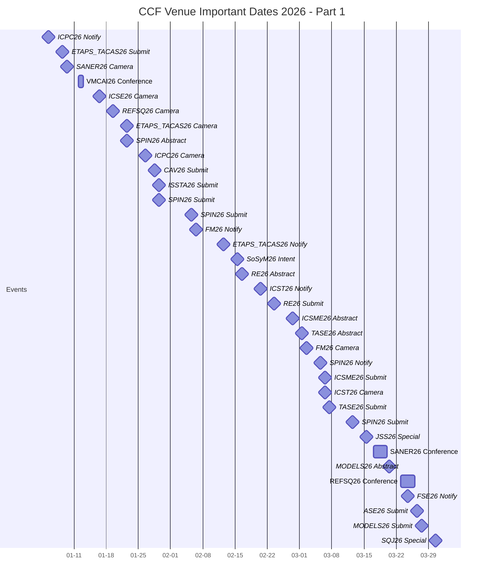
```mermaid
gantt
  title CCF Venue Important Dates 2026 - Part 1
  dateFormat YYYY-MM-DD
  axisFormat %m-%d

  section Events
  ICPC26 Notify :milestone, icpc_26_1_20260105, 2026-01-05, 1d
  ETAPS_TACAS26 Submit :milestone, etaps_tacas_26_2_20260108, 2026-01-08, 1d
  SANER26 Camera :milestone, saner_26_3_20260109, 2026-01-09, 1d
  VMCAI26 Conference :vmcai_26_4_20260112, 2026-01-12, 2026-01-13
  ICSE26 Camera :milestone, icse_26_5_20260116, 2026-01-16, 1d
  REFSQ26 Camera :milestone, refsq_26_6_20260119, 2026-01-19, 1d
  ETAPS_TACAS26 Camera :milestone, etaps_tacas_26_7_20260122, 2026-01-22, 1d
  SPIN26 Abstract :milestone, spin_26_8_20260122, 2026-01-22, 1d
  ICPC26 Camera :milestone, icpc_26_9_20260126, 2026-01-26, 1d
  CAV26 Submit :milestone, cav_26_10_20260128, 2026-01-28, 1d
  ISSTA26 Submit :milestone, issta_26_11_20260129, 2026-01-29, 1d
  SPIN26 Submit :milestone, spin_26_12_20260129, 2026-01-29, 1d
  SPIN26 Submit :milestone, spin_26_13_20260205, 2026-02-05, 1d
  FM26 Notify :milestone, fm_26_14_20260206, 2026-02-06, 1d
  ETAPS_TACAS26 Notify :milestone, etaps_tacas_26_15_20260212, 2026-02-12, 1d
  SoSyM26 Intent :milestone, sosym_26_16_20260215, 2026-02-15, 1d
  RE26 Abstract :milestone, re_26_17_20260216, 2026-02-16, 1d
  ICST26 Notify :milestone, icst_26_18_20260220, 2026-02-20, 1d
  RE26 Submit :milestone, re_26_19_20260223, 2026-02-23, 1d
  ICSME26 Abstract :milestone, icsme_26_20_20260227, 2026-02-27, 1d
  TASE26 Abstract :milestone, tase_26_21_20260301, 2026-03-01, 1d
  FM26 Camera :milestone, fm_26_22_20260302, 2026-03-02, 1d
  SPIN26 Notify :milestone, spin_26_23_20260305, 2026-03-05, 1d
  ICSME26 Submit :milestone, icsme_26_24_20260306, 2026-03-06, 1d
  ICST26 Camera :milestone, icst_26_25_20260306, 2026-03-06, 1d
  TASE26 Submit :milestone, tase_26_26_20260307, 2026-03-07, 1d
  SPIN26 Submit :milestone, spin_26_27_20260312, 2026-03-12, 1d
  JSS26 Special :milestone, jss_26_28_20260315, 2026-03-15, 1d
  SANER26 Conference :saner_26_29_20260317, 2026-03-17, 2026-03-20
  MODELS26 Abstract :milestone, models_26_30_20260320, 2026-03-20, 1d
  REFSQ26 Conference :refsq_26_31_20260323, 2026-03-23, 2026-03-26
  FSE26 Notify :milestone, fse_26_32_20260324, 2026-03-24, 1d
  ASE26 Submit :milestone, ase_26_33_20260326, 2026-03-26, 1d
  MODELS26 Submit :milestone, models_26_34_20260327, 2026-03-27, 1d
  SQJ26 Special :milestone, sqj_26_35_20260330, 2026-03-30, 1d
```

#### 9.2.2 2026 Mermaid 分片 2

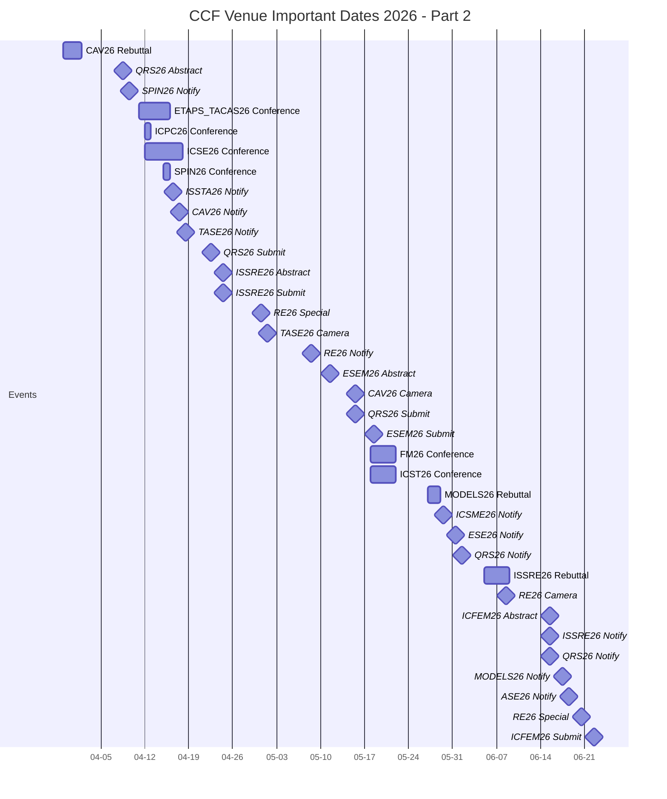
```mermaid
gantt
  title CCF Venue Important Dates 2026 - Part 2
  dateFormat YYYY-MM-DD
  axisFormat %m-%d

  section Events
  CAV26 Rebuttal :cav_26_36_20260330, 2026-03-30, 2026-04-02
  QRS26 Abstract :milestone, qrs_26_37_20260408, 2026-04-08, 1d
  SPIN26 Notify :milestone, spin_26_38_20260409, 2026-04-09, 1d
  ETAPS_TACAS26 Conference :etaps_tacas_26_39_20260411, 2026-04-11, 2026-04-16
  ICPC26 Conference :icpc_26_40_20260412, 2026-04-12, 2026-04-13
  ICSE26 Conference :icse_26_41_20260412, 2026-04-12, 2026-04-18
  SPIN26 Conference :spin_26_42_20260415, 2026-04-15, 2026-04-16
  ISSTA26 Notify :milestone, issta_26_43_20260416, 2026-04-16, 1d
  CAV26 Notify :milestone, cav_26_44_20260417, 2026-04-17, 1d
  TASE26 Notify :milestone, tase_26_45_20260418, 2026-04-18, 1d
  QRS26 Submit :milestone, qrs_26_46_20260422, 2026-04-22, 1d
  ISSRE26 Abstract :milestone, issre_26_47_20260424, 2026-04-24, 1d
  ISSRE26 Submit :milestone, issre_26_48_20260424, 2026-04-24, 1d
  RE26 Special :milestone, re_26_49_20260430, 2026-04-30, 1d
  TASE26 Camera :milestone, tase_26_50_20260501, 2026-05-01, 1d
  RE26 Notify :milestone, re_26_51_20260508, 2026-05-08, 1d
  ESEM26 Abstract :milestone, esem_26_52_20260511, 2026-05-11, 1d
  CAV26 Camera :milestone, cav_26_53_20260515, 2026-05-15, 1d
  QRS26 Submit :milestone, qrs_26_54_20260515, 2026-05-15, 1d
  ESEM26 Submit :milestone, esem_26_55_20260518, 2026-05-18, 1d
  FM26 Conference :fm_26_56_20260518, 2026-05-18, 2026-05-22
  ICST26 Conference :icst_26_57_20260518, 2026-05-18, 2026-05-22
  MODELS26 Rebuttal :models_26_58_20260527, 2026-05-27, 2026-05-29
  ICSME26 Notify :milestone, icsme_26_59_20260529, 2026-05-29, 1d
  ESE26 Notify :milestone, ese_26_60_20260531, 2026-05-31, 1d
  QRS26 Notify :milestone, qrs_26_61_20260601, 2026-06-01, 1d
  ISSRE26 Rebuttal :issre_26_62_20260605, 2026-06-05, 2026-06-09
  RE26 Camera :milestone, re_26_63_20260608, 2026-06-08, 1d
  ICFEM26 Abstract :milestone, icfem_26_64_20260615, 2026-06-15, 1d
  ISSRE26 Notify :milestone, issre_26_65_20260615, 2026-06-15, 1d
  QRS26 Notify :milestone, qrs_26_66_20260615, 2026-06-15, 1d
  MODELS26 Notify :milestone, models_26_67_20260617, 2026-06-17, 1d
  ASE26 Notify :milestone, ase_26_68_20260618, 2026-06-18, 1d
  RE26 Special :milestone, re_26_69_20260620, 2026-06-20, 1d
  ICFEM26 Submit :milestone, icfem_26_70_20260622, 2026-06-22, 1d
```

#### 9.2.3 2026 Mermaid 分片 3

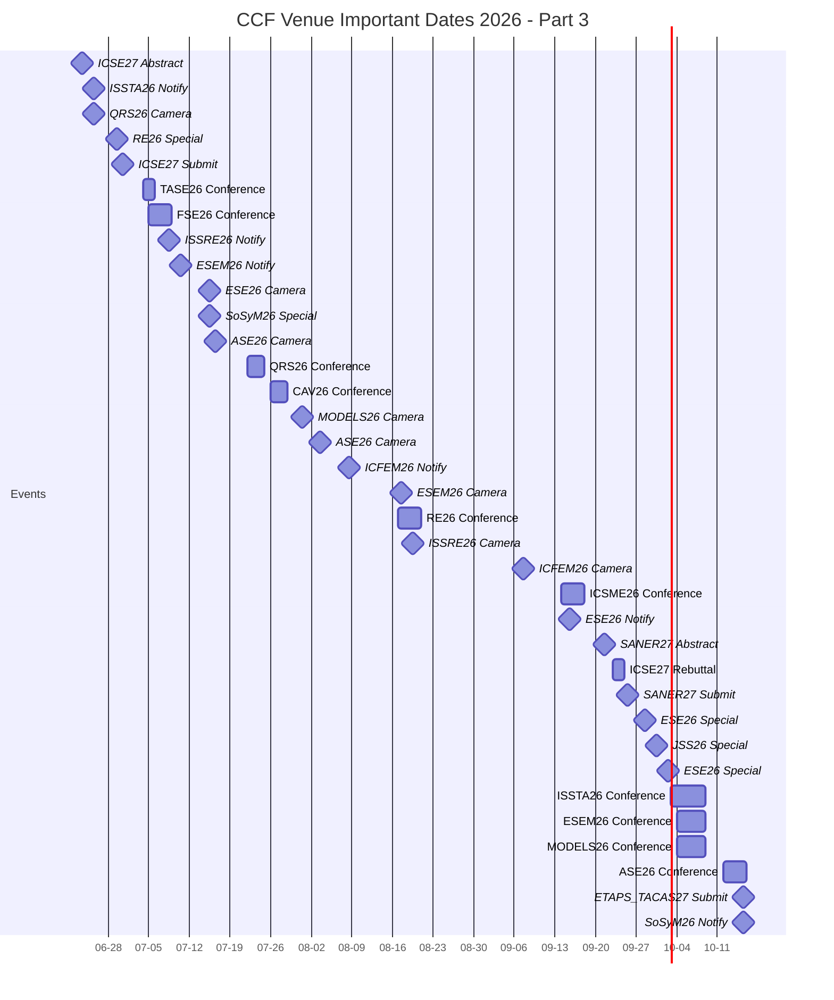
```mermaid
gantt
  title CCF Venue Important Dates 2026 - Part 3
  dateFormat YYYY-MM-DD
  axisFormat %m-%d

  section Events
  ICSE27 Abstract :milestone, icse_27_71_20260623, 2026-06-23, 1d
  ISSTA26 Notify :milestone, issta_26_72_20260625, 2026-06-25, 1d
  QRS26 Camera :milestone, qrs_26_73_20260625, 2026-06-25, 1d
  RE26 Special :milestone, re_26_74_20260629, 2026-06-29, 1d
  ICSE27 Submit :milestone, icse_27_75_20260630, 2026-06-30, 1d
  TASE26 Conference :tase_26_76_20260704, 2026-07-04, 2026-07-06
  FSE26 Conference :fse_26_77_20260705, 2026-07-05, 2026-07-09
  ISSRE26 Notify :milestone, issre_26_78_20260708, 2026-07-08, 1d
  ESEM26 Notify :milestone, esem_26_79_20260710, 2026-07-10, 1d
  ESE26 Camera :milestone, ese_26_80_20260715, 2026-07-15, 1d
  SoSyM26 Special :milestone, sosym_26_81_20260715, 2026-07-15, 1d
  ASE26 Camera :milestone, ase_26_82_20260716, 2026-07-16, 1d
  QRS26 Conference :qrs_26_83_20260722, 2026-07-22, 2026-07-25
  CAV26 Conference :cav_26_84_20260726, 2026-07-26, 2026-07-29
  MODELS26 Camera :milestone, models_26_85_20260731, 2026-07-31, 1d
  ASE26 Camera :milestone, ase_26_86_20260803, 2026-08-03, 1d
  ICFEM26 Notify :milestone, icfem_26_87_20260808, 2026-08-08, 1d
  ESEM26 Camera :milestone, esem_26_88_20260817, 2026-08-17, 1d
  RE26 Conference :re_26_89_20260817, 2026-08-17, 2026-08-21
  ISSRE26 Camera :milestone, issre_26_90_20260819, 2026-08-19, 1d
  ICFEM26 Camera :milestone, icfem_26_91_20260907, 2026-09-07, 1d
  ICSME26 Conference :icsme_26_92_20260914, 2026-09-14, 2026-09-18
  ESE26 Notify :milestone, ese_26_93_20260915, 2026-09-15, 1d
  SANER27 Abstract :milestone, saner_27_94_20260921, 2026-09-21, 1d
  ICSE27 Rebuttal :icse_27_95_20260923, 2026-09-23, 2026-09-25
  SANER27 Submit :milestone, saner_27_96_20260925, 2026-09-25, 1d
  ESE26 Special :milestone, ese_26_97_20260928, 2026-09-28, 1d
  JSS26 Special :milestone, jss_26_98_20260930, 2026-09-30, 1d
  ESE26 Special :milestone, ese_26_99_20261002, 2026-10-02, 1d
  ISSTA26 Conference :issta_26_100_20261003, 2026-10-03, 2026-10-09
  ESEM26 Conference :esem_26_101_20261004, 2026-10-04, 2026-10-09
  MODELS26 Conference :models_26_102_20261004, 2026-10-04, 2026-10-09
  ASE26 Conference :ase_26_103_20261012, 2026-10-12, 2026-10-16
  ETAPS_TACAS27 Submit :milestone, etaps_tacas_27_104_20261015, 2026-10-15, 1d
  SoSyM26 Notify :milestone, sosym_26_105_20261015, 2026-10-15, 1d
```

#### 9.2.4 2026 Mermaid 分片 4

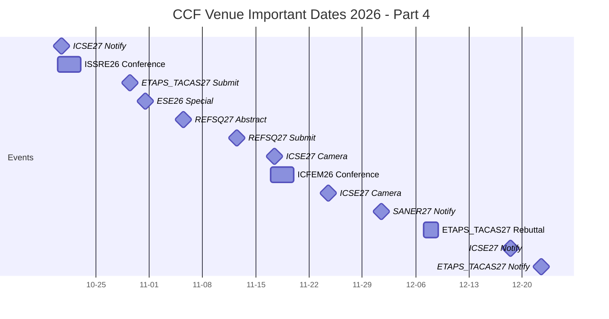
```mermaid
gantt
  title CCF Venue Important Dates 2026 - Part 4
  dateFormat YYYY-MM-DD
  axisFormat %m-%d

  section Events
  ICSE27 Notify :milestone, icse_27_106_20261020, 2026-10-20, 1d
  ISSRE26 Conference :issre_26_107_20261020, 2026-10-20, 2026-10-23
  ETAPS_TACAS27 Submit :milestone, etaps_tacas_27_108_20261029, 2026-10-29, 1d
  ESE26 Special :milestone, ese_26_109_20261031, 2026-10-31, 1d
  REFSQ27 Abstract :milestone, refsq_27_110_20261105, 2026-11-05, 1d
  REFSQ27 Submit :milestone, refsq_27_111_20261112, 2026-11-12, 1d
  ICSE27 Camera :milestone, icse_27_112_20261117, 2026-11-17, 1d
  ICFEM26 Conference :icfem_26_113_20261117, 2026-11-17, 2026-11-20
  ICSE27 Camera :milestone, icse_27_114_20261124, 2026-11-24, 1d
  SANER27 Notify :milestone, saner_27_115_20261201, 2026-12-01, 1d
  ETAPS_TACAS27 Rebuttal :etaps_tacas_27_116_20261207, 2026-12-07, 2026-12-09
  ICSE27 Notify :milestone, icse_27_117_20261218, 2026-12-18, 1d
  ETAPS_TACAS27 Notify :milestone, etaps_tacas_27_118_20261222, 2026-12-22, 1d
```

#### 9.2.5 PR-9 P2 Mermaid 分片

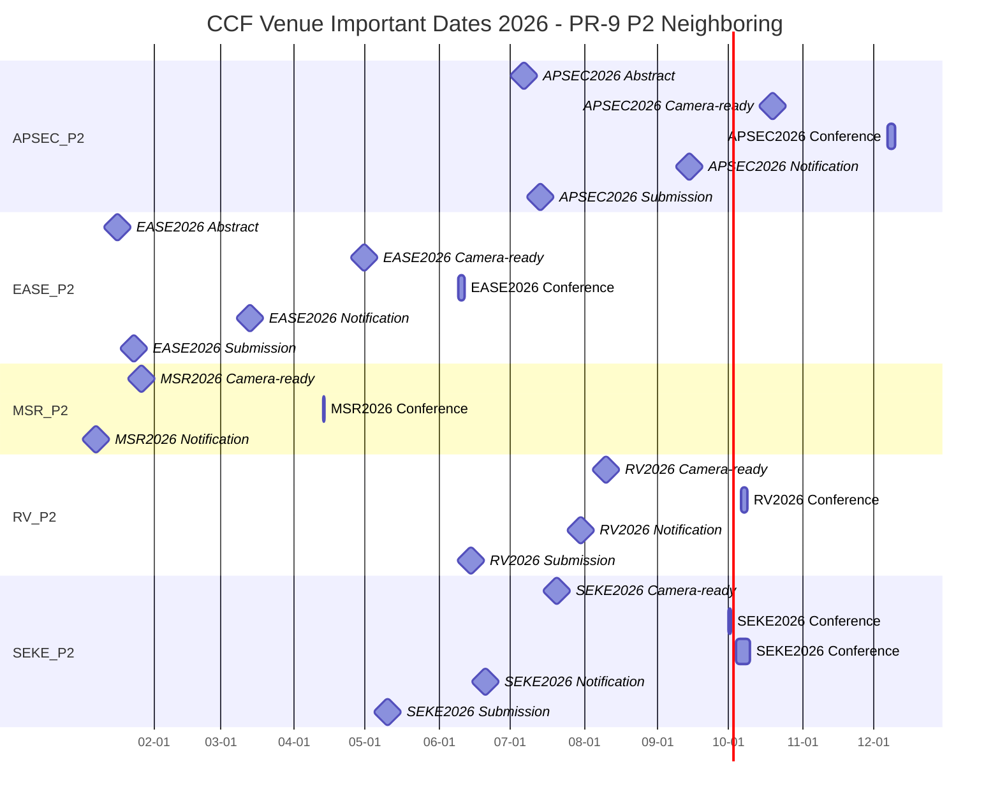
```mermaid
gantt
  title CCF Venue Important Dates 2026 - PR-9 P2 Neighboring
  dateFormat YYYY-MM-DD
  axisFormat %m-%d

  section APSEC_P2
  APSEC2026 Abstract :milestone, pr9_conf_c_apsec_2026_abstract_20260706, 2026-07-06, 1d
  APSEC2026 Camera-ready :milestone, pr9_conf_c_apsec_2026_camera_ready_20261019, 2026-10-19, 1d
  APSEC2026 Conference :pr9_conf_c_apsec_2026_conference_20261207, 2026-12-07, 2026-12-10
  APSEC2026 Notification :milestone, pr9_conf_c_apsec_2026_notification_20260914, 2026-09-14, 1d
  APSEC2026 Submission :milestone, pr9_conf_c_apsec_2026_submission_20260713, 2026-07-13, 1d

  section EASE_P2
  EASE2026 Abstract :milestone, pr9_conf_c_ease_2026_abstract_20260116, 2026-01-16, 1d
  EASE2026 Camera-ready :milestone, pr9_conf_c_ease_2026_camera_ready_20260430, 2026-04-30, 1d
  EASE2026 Conference :pr9_conf_c_ease_2026_conference_20260609, 2026-06-09, 2026-06-12
  EASE2026 Notification :milestone, pr9_conf_c_ease_2026_notification_20260313, 2026-03-13, 1d
  EASE2026 Submission :milestone, pr9_conf_c_ease_2026_submission_20260123, 2026-01-23, 1d

  section MSR_P2
  MSR2026 Camera-ready :milestone, pr9_conf_c_msr_2026_camera_ready_20260126, 2026-01-26, 1d
  MSR2026 Conference :pr9_conf_c_msr_2026_conference_20260413, 2026-04-13, 2026-04-14
  MSR2026 Notification :milestone, pr9_conf_c_msr_2026_notification_20260107, 2026-01-07, 1d

  section RV_P2
  RV2026 Camera-ready :milestone, pr9_conf_c_rv_2026_camera_ready_20260810, 2026-08-10, 1d
  RV2026 Conference :pr9_conf_c_rv_2026_conference_20261006, 2026-10-06, 2026-10-09
  RV2026 Notification :milestone, pr9_conf_c_rv_2026_notification_20260730, 2026-07-30, 1d
  RV2026 Submission :milestone, pr9_conf_c_rv_2026_submission_20260614, 2026-06-14, 1d

  section SEKE_P2
  SEKE2026 Camera-ready :milestone, pr9_conf_c_seke_2026_camera_ready_20260720, 2026-07-20, 1d
  SEKE2026 Conference :pr9_conf_c_seke_2026_conference_20261001, 2026-10-01, 2026-10-02
  SEKE2026 Conference :pr9_conf_c_seke_2026_conference_20261004, 2026-10-04, 2026-10-10
  SEKE2026 Notification :milestone, pr9_conf_c_seke_2026_notification_20260620, 2026-06-20, 1d
  SEKE2026 Submission :milestone, pr9_conf_c_seke_2026_submission_20260510, 2026-05-10, 1d

```
## 10. 2025 时间线

> 当前章节按 **2025 年实际发生的事件日期** 升序排列；Venue 名称保留会议 edition。

### 10.1 2025 投稿事件总表

| 日期时间 | Venue | 类型-CCF | Track / 事项 | 日期类型 | 阶段状态 | 事件官方来源 | 年度主页 | 论文集 / 名录 | 本库年度页 | 核验状态 | 备注 |
|---|---|---|---|---|---|---|---|---|---|---|---|
| 2025-01-09 待补时刻 | [ETAPS/TACAS 2025](./conf-b-etaps/2025/README.md) | 会议-B | TACAS voluntary artifact submission | Submission | ✅ 已结束 | [官方来源](https://etaps.org/2025/cfp/) | [年度主页](https://etaps.org/2025/) | [Past conference](https://etaps.org/2025/past-conference/) / [DBLP TACAS](https://dblp.org/db/conf/tacas/index.html#2025) | [本库年度页](./conf-b-etaps/2025/README.md) | 🟡 部分核验 | 官方仅日期；时刻待补。 |
| 2025-01-12 | [MSR 2025](./conf-c-msr/2025/README.md) | 会议-C / P2 | Technical notification | Notification | ✅ 已结束 | [官方来源](https://2025.msrconf.org/dates) | [年度主页](https://2025.msrconf.org/) | [论文集 / 名录](https://2025.msrconf.org/program/program-msr-2025/) | [本库年度页](./conf-c-msr/2025/README.md) | 🟡 部分核验 | PR-9 P2 邻近观察；官方仅日期；不升级为 P0/P1 主线。 |
| 2025-01-12 待补时刻 | [ICPC 2025](./conf-b-icpc/2025/README.md) | 会议-B | Research Track final notification | Notification | ✅ 已结束 | [ICPC 2025 dates](https://conf.researchr.org/dates/icpc-2025) | [ICPC 2025](https://conf.researchr.org/home/icpc-2025) | [DBLP 2025](https://dblp.org/db/conf/iwpc/icpc2025.html) | [本库年度页](./conf-b-icpc/2025/README.md) | 🟡 部分核验 | 官方仅日期；具体时刻待补。 |
| 2025-01-15 待补时刻 AoE | [REFSQ 2025](./conf-c-refsq/2025/README.md) | 会议-C | Research notification | Notification | ✅ 已结束 | [官方来源](https://2025.refsq.org/dates/refsq-2025) | [年度主页](https://2025.refsq.org/) | [Program](https://2025.refsq.org/program/program-refsq-2025/) / [DBLP](https://dblp.org/db/conf/refsq/refsq2025.html) | [本库年度页](./conf-c-refsq/2025/README.md) | 🟡 部分核验 | main research / research track；具体时刻待补。 |
| 2025-01-22 待补时刻 | [ICSE 2025](./conf-a-icse/2025/README.md) | 会议-A | Research Track final decision, cycle 2 | Notification | ✅ 已结束 | [官方来源](https://conf.researchr.org/track/icse-2025/icse-2025-research-track) | [年度主页](https://conf.researchr.org/home/icse-2025) | [Program](https://conf.researchr.org/program/icse-2025/program-icse-2025/) / [Proceedings](https://conf.researchr.org/info/icse-2025/proceedings) | [本库年度页](./conf-a-icse/2025/README.md) | 🟡 部分核验 | 官方仅日期；时刻待补。 |
| 2025-01-24 | [EASE 2025](./conf-c-ease/2025/README.md) | 会议-C / P2 | Research abstract | Abstract | ✅ 已结束 | [官方来源](https://conf.researchr.org/dates/ease-2025) | [年度主页](https://conf.researchr.org/home/ease-2025) | [论文集 / 名录](https://conf.researchr.org/program/ease-2025/program-ease-2025/) | [本库年度页](./conf-c-ease/2025/README.md) | 🟡 部分核验 | PR-9 P2 邻近观察；AoE；不升级为 P0/P1 主线。 |
| 2025-01-30 待补时刻 | [ETAPS/TACAS 2025](./conf-b-etaps/2025/README.md) | 会议-B | TACAS final version | Camera-ready | ✅ 已结束 | [官方来源](https://etaps.org/2025/cfp/) | [年度主页](https://etaps.org/2025/) | [Past conference](https://etaps.org/2025/past-conference/) / [DBLP TACAS](https://dblp.org/db/conf/tacas/index.html#2025) | [本库年度页](./conf-b-etaps/2025/README.md) | 🟡 部分核验 | 官方仅日期；时刻待补。 |
| 2025-01-31 | [EASE 2025](./conf-c-ease/2025/README.md) | 会议-C / P2 | Research full paper | Submission | ✅ 已结束 | [官方来源](https://conf.researchr.org/dates/ease-2025) | [年度主页](https://conf.researchr.org/home/ease-2025) | [论文集 / 名录](https://conf.researchr.org/program/ease-2025/program-ease-2025/) | [本库年度页](./conf-c-ease/2025/README.md) | 🟡 部分核验 | PR-9 P2 邻近观察；AoE；不升级为 P0/P1 主线。 |
| 2025-02-05 | [MSR 2025](./conf-c-msr/2025/README.md) | 会议-C / P2 | Technical camera-ready | Camera-ready | ✅ 已结束 | [官方来源](https://2025.msrconf.org/dates) | [年度主页](https://2025.msrconf.org/) | [论文集 / 名录](https://2025.msrconf.org/program/program-msr-2025/) | [本库年度页](./conf-c-msr/2025/README.md) | 🟡 部分核验 | PR-9 P2 邻近观察；官方仅日期；不升级为 P0/P1 主线。 |
| 2025-02-05 待补时刻 | [ICPC 2025](./conf-b-icpc/2025/README.md) | 会议-B | Research Track camera-ready | Camera-ready | ✅ 已结束 | [ICPC 2025 dates](https://conf.researchr.org/dates/icpc-2025) | [ICPC 2025](https://conf.researchr.org/home/icpc-2025) | [DBLP 2025](https://dblp.org/db/conf/iwpc/icpc2025.html) | [本库年度页](./conf-b-icpc/2025/README.md) | 🟡 部分核验 | 官方仅日期；具体时刻待补。 |
| 2025-02-07 待补时刻 AoE | [REFSQ 2025](./conf-c-refsq/2025/README.md) | 会议-C | Research camera-ready | Camera-ready | ✅ 已结束 | [官方来源](https://2025.refsq.org/dates/refsq-2025) | [年度主页](https://2025.refsq.org/) | [Program](https://2025.refsq.org/program/program-refsq-2025/) / [DBLP](https://dblp.org/db/conf/refsq/refsq2025.html) | [本库年度页](./conf-c-refsq/2025/README.md) | 🟡 部分核验 | main research / research track；具体时刻待补。 |
| 2025-02-12 待补时刻 | [ICSE 2025](./conf-a-icse/2025/README.md) | 会议-A | Research Track camera-ready, cycle 2 revised | Camera-ready | ✅ 已结束 | [官方来源](https://conf.researchr.org/track/icse-2025/icse-2025-research-track) | [年度主页](https://conf.researchr.org/home/icse-2025) | [Program](https://conf.researchr.org/program/icse-2025/program-icse-2025/) / [Proceedings](https://conf.researchr.org/info/icse-2025/proceedings) | [本库年度页](./conf-a-icse/2025/README.md) | 🟡 部分核验 | 官方仅日期；时刻待补。 |
| 2025-02-13 待补时刻 | [ETAPS/TACAS 2025](./conf-b-etaps/2025/README.md) | 会议-B | TACAS artifact notification | Notification | ✅ 已结束 | [官方来源](https://etaps.org/2025/cfp/) | [年度主页](https://etaps.org/2025/) | [Past conference](https://etaps.org/2025/past-conference/) / [DBLP TACAS](https://dblp.org/db/conf/tacas/index.html#2025) | [本库年度页](./conf-b-etaps/2025/README.md) | 🟡 部分核验 | 官方仅日期；时刻待补。 |
| 2025-02-27 23:59:59 AoE | [ISSTA 2025](./conf-a-issta/2025/README.md) | 会议-A | Research Papers revised manuscript submission | Submission | ✅ 已结束 | [官方来源](https://conf.researchr.org/track/issta-2025/issta-2025-papers) | [年度主页](https://conf.researchr.org/home/issta-2025) | [Program](https://conf.researchr.org/program/issta-2025/program-issta-2025/) / [DBLP companion](https://dblp.org/db/conf/issta/issta2025c.html) | [本库年度页](./conf-a-issta/2025/README.md) | 🟡 部分核验 | Major revisions only；DBLP companion 不作主 proceedings count。 |
| 2025-03-01 待补时刻 AoE | [TASE 2025](./conf-c-tase/2025/README.md) | 会议-C | Abstract due extended | Abstract | ✅ 已结束 | [TASE 2025 official source](https://cyprusconferences.org/tase2025/call-for-papers/) | [TASE 2025](https://cyprusconferences.org/tase2025/) | [Accepted Papers](https://cyprusconferences.org/tase2025/accepted-papers/) / [Proceedings](https://link.springer.com/book/10.1007/978-3-031-98208-8) / [DBLP](https://dblp.org/db/conf/tase/tase2025.html) | [本库年度页](./conf-c-tase/2025/README.md) | 🟡 部分核验 | TASE official accepted list、Springer TOC 与 DBLP 计数需分列；不混成单一论文数。 |
| 2025-03-03 待补时刻 AoE | [RE 2025](./conf-b-re/2025/README.md) | 会议-B | Research Papers abstract | Abstract | ✅ 已结束 | [官方来源](https://conf.researchr.org/dates/RE-2025) | [年度主页](https://conf.researchr.org/home/RE-2025) | [Program](https://conf.researchr.org/program/RE-2025/program-RE-2025/) / [DBLP](https://dblp.org/db/conf/re/re2025.html) | [本库年度页](./conf-b-re/2025/README.md) | 🟡 部分核验 | main research / research track；具体时刻待补。 |
| 2025-03-04 至 2025-03-07 | [SANER 2025](./conf-b-saner/2025/README.md) | 会议-B | Conference dates | Conference | ✅ 已结束 | [SANER 2025 home](https://conf.researchr.org/home/saner-2025) | [SANER 2025](https://conf.researchr.org/home/saner-2025) | [DBLP 2025](https://dblp.org/db/conf/saner/saner2025.html) | [本库年度页](./conf-b-saner/2025/README.md) | 🟡 部分核验 | Montréal, Québec, Canada。 |
| 2025-03-06 待补时刻 | [ICSME 2025](./conf-b-icsme/2025/README.md) | 会议-B | Research Papers abstract | Abstract | ✅ 已结束 | [ICSME 2025 Research Track](https://conf.researchr.org/track/icsme-2025/icsme-2025-papers) | [ICSME 2025](https://conf.researchr.org/home/icsme-2025) | [DBLP 2025](https://dblp.org/db/conf/icsm/icsme2025) | [本库年度页](./conf-b-icsme/2025/README.md) | 🟡 部分核验 | 官方仅日期；具体时刻待补。 |
| 2025-03-07 待补时刻 | [ICSE 2026](./conf-a-icse/2026/README.md) | 会议-A | Research Track abstract, cycle 1 | Abstract | ✅ 已结束 | [官方来源](https://conf.researchr.org/track/icse-2026/icse-2026-research-track) | [年度主页](https://conf.researchr.org/home/icse-2026) | [Research Track](https://conf.researchr.org/track/icse-2026/icse-2026-research-track) / [Program](https://conf.researchr.org/program/icse-2026/program-icse-2026/) | [本库年度页](./conf-a-icse/2026/README.md) | 🟡 部分核验 | 官方仅日期，AoE / UTC-12h；时刻待补。 |
| 2025-03-08 待补时刻 AoE | [TASE 2025](./conf-c-tase/2025/README.md) | 会议-C | Paper submission extended | Submission | ✅ 已结束 | [TASE 2025 official source](https://cyprusconferences.org/tase2025/call-for-papers/) | [TASE 2025](https://cyprusconferences.org/tase2025/) | [Accepted Papers](https://cyprusconferences.org/tase2025/accepted-papers/) / [Proceedings](https://link.springer.com/book/10.1007/978-3-031-98208-8) / [DBLP](https://dblp.org/db/conf/tase/tase2025.html) | [本库年度页](./conf-c-tase/2025/README.md) | 🟡 部分核验 | TASE official accepted list、Springer TOC 与 DBLP 计数需分列；不混成单一论文数。 |
| 2025-03-10 待补时刻 AoE | [RE 2025](./conf-b-re/2025/README.md) | 会议-B | Research Papers submission | Submission | ✅ 已结束 | [官方来源](https://conf.researchr.org/dates/RE-2025) | [年度主页](https://conf.researchr.org/home/RE-2025) | [Program](https://conf.researchr.org/program/RE-2025/program-RE-2025/) / [DBLP](https://dblp.org/db/conf/re/re2025.html) | [本库年度页](./conf-b-re/2025/README.md) | 🟡 部分核验 | main research / research track；具体时刻待补。 |
| 2025-03-13 待补时刻 | [ICSME 2025](./conf-b-icsme/2025/README.md) | 会议-B | Research Papers submission | Submission | ✅ 已结束 | [ICSME 2025 Research Track](https://conf.researchr.org/track/icsme-2025/icsme-2025-papers) | [ICSME 2025](https://conf.researchr.org/home/icsme-2025) | [DBLP 2025](https://dblp.org/db/conf/icsm/icsme2025) | [本库年度页](./conf-b-icsme/2025/README.md) | 🟡 部分核验 | 官方仅日期；具体时刻待补。 |
| 2025-03-14 待补时刻 | [ICSE 2026](./conf-a-icse/2026/README.md) | 会议-A | Research Track submission, cycle 1 | Submission | ✅ 已结束 | [官方来源](https://conf.researchr.org/track/icse-2026/icse-2026-research-track) | [年度主页](https://conf.researchr.org/home/icse-2026) | [Research Track](https://conf.researchr.org/track/icse-2026/icse-2026-research-track) / [Program](https://conf.researchr.org/program/icse-2026/program-icse-2026/) | [本库年度页](./conf-a-icse/2026/README.md) | 🟡 部分核验 | 官方仅日期，AoE / UTC-12h；时刻待补。 |
| 2025-03-21 | [EASE 2025](./conf-c-ease/2025/README.md) | 会议-C / P2 | Research notification | Notification | ✅ 已结束 | [官方来源](https://conf.researchr.org/dates/ease-2025) | [年度主页](https://conf.researchr.org/home/ease-2025) | [论文集 / 名录](https://conf.researchr.org/program/ease-2025/program-ease-2025/) | [本库年度页](./conf-c-ease/2025/README.md) | 🟡 部分核验 | PR-9 P2 邻近观察；AoE；不升级为 P0/P1 主线。 |
| 2025-03-27 待补时刻 | [MoDELS 2025](./conf-b-models/2025/README.md) | 会议-B | Research Papers abstract | Abstract | ✅ 已结束 | [官方来源](https://conf.researchr.org/dates/models-2025) | [年度主页](https://2025.models-conf.com/) | [Program](https://2025.models-conf.com/program/program-models-2025/) / [DBLP](https://dblp.org/db/conf/models/models2025.html) | [本库年度页](./conf-b-models/2025/README.md) | 🟡 部分核验 | 官方仅日期，AoE；时刻待补。 |
| 2025-03-31 23:59:59 AoE | [ISSTA 2025](./conf-a-issta/2025/README.md) | 会议-A | Research Papers final notification for major revisions | Notification | ✅ 已结束 | [官方来源](https://conf.researchr.org/track/issta-2025/issta-2025-papers) | [年度主页](https://conf.researchr.org/home/issta-2025) | [Program](https://conf.researchr.org/program/issta-2025/program-issta-2025/) / [DBLP companion](https://dblp.org/db/conf/issta/issta2025c.html) | [本库年度页](./conf-a-issta/2025/README.md) | 🟡 部分核验 | 官方 track 明确列出 final notification for major revisions。 |
| 2025-04-03 待补时刻 | [MoDELS 2025](./conf-b-models/2025/README.md) | 会议-B | Research Papers submission | Submission | ✅ 已结束 | [官方来源](https://conf.researchr.org/dates/models-2025) | [年度主页](https://2025.models-conf.com/) | [Program](https://2025.models-conf.com/program/program-models-2025/) / [DBLP](https://dblp.org/db/conf/models/models2025.html) | [本库年度页](./conf-b-models/2025/README.md) | 🟡 部分核验 | 官方仅日期，AoE；时刻待补。 |
| 2025-04-05 待补时刻 AoE | [TASE 2025](./conf-c-tase/2025/README.md) | 会议-C | Notification extended | Notification | ✅ 已结束 | [TASE 2025 official source](https://cyprusconferences.org/tase2025/call-for-papers/) | [TASE 2025](https://cyprusconferences.org/tase2025/) | [Accepted Papers](https://cyprusconferences.org/tase2025/accepted-papers/) / [Proceedings](https://link.springer.com/book/10.1007/978-3-031-98208-8) / [DBLP](https://dblp.org/db/conf/tase/tase2025.html) | [本库年度页](./conf-c-tase/2025/README.md) | 🟡 部分核验 | TASE official accepted list、Springer TOC 与 DBLP 计数需分列；不混成单一论文数。 |
| 2025-04-07 至 2025-04-10 | [REFSQ 2025](./conf-c-refsq/2025/README.md) | 会议-C | Conference dates | Conference | ✅ 已结束 | [官方来源](https://2025.refsq.org/dates/refsq-2025) | [年度主页](https://2025.refsq.org/) | [Program](https://2025.refsq.org/program/program-refsq-2025/) / [DBLP](https://dblp.org/db/conf/refsq/refsq2025.html) | [本库年度页](./conf-c-refsq/2025/README.md) | 🟡 部分核验 | REFSQ official dates；Springer / DBLP 入口分散时以年度页说明为准。 |
| 2025-04-15 待补时刻 | [QRS 2025](./conf-c-qrs/2025/README.md) | 会议-C | Regular and Short papers due | Submission | ✅ 已结束 | [QRS 2025 official source](https://qrs25.techconf.org/) | [QRS 2025](https://qrs25.techconf.org/) | [Proceedings policy](https://qrs25.techconf.org/track/proceeding) / [DBLP](https://dblp.org/db/conf/qrs/qrs2025.html) | [本库年度页](./conf-c-qrs/2025/README.md) | 🟡 部分核验 | Regular / short、workshop / special track、proceedings policy / DBLP fallback 分开记录；不把 proceedings policy 页或整本 proceedings fallback 当作 main research count；IEEE Xplore proceedings TOC 待补。 |
| 2025-04-18 待补时刻 | [ESEM 2025](./conf-b-esem/2025/README.md) | 会议-B | Technical Track abstract | Abstract | ✅ 已结束 | [Important Dates](https://conf.researchr.org/dates/esem-2025) | [ESEIW 2025](https://conf.researchr.org/home/esem-2025) | [Program](https://conf.researchr.org/program/esem-2025/program-esem-2025/) / [DBLP](https://dblp.org/db/conf/esem/esem2025.html) | [本库年度页](./conf-b-esem/2025/README.md) | 🟡 部分核验 | 官方仅给日期；ESEM Technical Track。 |
| 2025-04-24 23:59:59 AoE | [ISSTA 2025](./conf-a-issta/2025/README.md) | 会议-A | Research Papers camera-ready | Camera-ready | ✅ 已结束 | [官方来源](https://conf.researchr.org/track/issta-2025/issta-2025-papers) | [年度主页](https://conf.researchr.org/home/issta-2025) | [Program](https://conf.researchr.org/program/issta-2025/program-issta-2025/) / [DBLP companion](https://dblp.org/db/conf/issta/issta2025c.html) | [本库年度页](./conf-a-issta/2025/README.md) | 🟡 部分核验 | 官方 track 明确列出 camera ready。 |
| 2025-04-25 待补时刻 | [ESEM 2025](./conf-b-esem/2025/README.md) | 会议-B | Technical Track submission | Submission | ✅ 已结束 | [Important Dates](https://conf.researchr.org/dates/esem-2025) | [ESEIW 2025](https://conf.researchr.org/home/esem-2025) | [Program](https://conf.researchr.org/program/esem-2025/program-esem-2025/) / [DBLP](https://dblp.org/db/conf/esem/esem2025.html) | [本库年度页](./conf-b-esem/2025/README.md) | 🟡 部分核验 | 官方仅给日期；具体时刻待补。 |
| 2025-04-26 至 2025-05-04 | [ICSE 2025](./conf-a-icse/2025/README.md) | 会议-A | Conference dates | Conference | ✅ 已结束 | [官方来源](https://conf.researchr.org/track/icse-2025/icse-2025-research-track) | [年度主页](https://conf.researchr.org/home/icse-2025) | [Program](https://conf.researchr.org/program/icse-2025/program-icse-2025/) / [Proceedings](https://conf.researchr.org/info/icse-2025/proceedings) | [本库年度页](./conf-a-icse/2025/README.md) | 🟡 部分核验 | Ottawa, Canada。 |
| 2025-04-27 | [EASE 2025](./conf-c-ease/2025/README.md) | 会议-C / P2 | Camera-ready / early registration | Camera-ready | ✅ 已结束 | [官方来源](https://conf.researchr.org/dates/ease-2025) | [年度主页](https://conf.researchr.org/home/ease-2025) | [论文集 / 名录](https://conf.researchr.org/program/ease-2025/program-ease-2025/) | [本库年度页](./conf-c-ease/2025/README.md) | 🟡 部分核验 | PR-9 P2 邻近观察；AoE；不升级为 P0/P1 主线。 |
| 2025-04-27 至 2025-04-28 | [ICPC 2025](./conf-b-icpc/2025/README.md) | 会议-B | Conference dates | Conference | ✅ 已结束 | [ICPC 2025 home](https://conf.researchr.org/home/icpc-2025) | [ICPC 2025](https://conf.researchr.org/home/icpc-2025) | [DBLP 2025](https://dblp.org/db/conf/iwpc/icpc2025.html) | [本库年度页](./conf-b-icpc/2025/README.md) | 🟡 部分核验 | 官方仅日期；具体时刻待补。 |
| 2025-04-28 至 2025-04-29 | [MSR 2025](./conf-c-msr/2025/README.md) | 会议-C / P2 | Conference | Conference | ✅ 已结束 | [官方来源](https://2025.msrconf.org/dates) | [年度主页](https://2025.msrconf.org/) | [论文集 / 名录](https://2025.msrconf.org/program/program-msr-2025/) | [本库年度页](./conf-c-msr/2025/README.md) | 🟡 部分核验 | PR-9 P2 邻近观察；Ottawa local time；不升级为 P0/P1 主线。 |
| 2025-05-01 待补时刻 | [TASE 2025](./conf-c-tase/2025/README.md) | 会议-C | Camera-ready | Camera-ready | ✅ 已结束 | [TASE 2025 official source](https://cyprusconferences.org/tase2025/call-for-papers/) | [TASE 2025](https://cyprusconferences.org/tase2025/) | [Accepted Papers](https://cyprusconferences.org/tase2025/accepted-papers/) / [Proceedings](https://link.springer.com/book/10.1007/978-3-031-98208-8) / [DBLP](https://dblp.org/db/conf/tase/tase2025.html) | [本库年度页](./conf-c-tase/2025/README.md) | 🟡 部分核验 | TASE official accepted list、Springer TOC 与 DBLP 计数需分列；不混成单一论文数。 |
| 2025-05-03 至 2025-05-08 | [ETAPS/TACAS 2025](./conf-b-etaps/2025/README.md) | 会议-B | ETAPS conference dates | Conference | ✅ 已结束 | [官方来源](https://etaps.org/2025/cfp/) | [年度主页](https://etaps.org/2025/) | [Past conference](https://etaps.org/2025/past-conference/) / [DBLP TACAS](https://dblp.org/db/conf/tacas/index.html#2025) | [本库年度页](./conf-b-etaps/2025/README.md) | 🟡 部分核验 | Hamilton, Canada。 |
| 2025-05-15 | [SEKE 2025](./conf-c-seke/2025/README.md) | 会议-C / P2 | Paper submission due | Submission | ✅ 已结束 | [官方来源](https://ksiresearch.org/seke/seke25main.html) | [年度主页](https://ksiresearch.org/seke/seke25.html) | [论文集 / 名录](https://ksiresearch.org/seke/seke25pgm.html) | [本库年度页](./conf-c-seke/2025/README.md) | 🟡 部分核验 | PR-9 P2 邻近观察；Midnight EST / extended hard deadline；不升级为 P0/P1 主线。 |
| 2025-05-23 待补时刻 AoE | [RE 2025](./conf-b-re/2025/README.md) | 会议-B | Research Papers notification | Notification | ✅ 已结束 | [官方来源](https://conf.researchr.org/dates/RE-2025) | [年度主页](https://conf.researchr.org/home/RE-2025) | [Program](https://conf.researchr.org/program/RE-2025/program-RE-2025/) / [DBLP](https://dblp.org/db/conf/re/re2025.html) | [本库年度页](./conf-b-re/2025/README.md) | 🟡 部分核验 | main research / research track；具体时刻待补。 |
| 2025-05-27 至 2025-05-29 | [ICSE 2026](./conf-a-icse/2026/README.md) | 会议-A | Research Track author response, cycle 1 | Rebuttal | ✅ 已结束 | [官方来源](https://conf.researchr.org/track/icse-2026/icse-2026-research-track) | [年度主页](https://conf.researchr.org/home/icse-2026) | [Research Track](https://conf.researchr.org/track/icse-2026/icse-2026-research-track) / [Program](https://conf.researchr.org/program/icse-2026/program-icse-2026/) | [本库年度页](./conf-a-icse/2026/README.md) | 🟡 部分核验 | 官方仅日期；时刻待补。 |
| 2025-05-30 待补时刻 AoE | [ASE 2025](./conf-a-ase/2025/README.md) | 会议-A | Research Papers submission | Submission | ✅ 已结束 | [官方来源](https://conf.researchr.org/track/ase-2025/ase-2025-papers) | [年度主页](https://conf.researchr.org/home/ase-2025) | [Program](https://conf.researchr.org/program/ase-2025/program-ase-2025/) / [DBLP](https://dblp.org/db/conf/kbse/ase2025.html) | [本库年度页](./conf-a-ase/2025/README.md) | 🟡 部分核验 | DBLP fallback 是全 proceedings，非主 track count。 |
| 2025-05-30 待补时刻 | [QRS 2025](./conf-c-qrs/2025/README.md) | 会议-C | Regular paper notification | Notification | ✅ 已结束 | [QRS 2025 official source](https://qrs25.techconf.org/) | [QRS 2025](https://qrs25.techconf.org/) | [Proceedings policy](https://qrs25.techconf.org/track/proceeding) / [DBLP](https://dblp.org/db/conf/qrs/qrs2025.html) | [本库年度页](./conf-c-qrs/2025/README.md) | 🟡 部分核验 | Regular / short、workshop / special track、proceedings policy / DBLP fallback 分开记录；不把 proceedings policy 页或整本 proceedings fallback 当作 main research count；IEEE Xplore proceedings TOC 待补。 |
| 2025-06-03 待补时刻 | [QRS 2025](./conf-c-qrs/2025/README.md) | 会议-C | Other tracks due | Submission | ✅ 已结束 | [QRS 2025 official source](https://qrs25.techconf.org/) | [QRS 2025](https://qrs25.techconf.org/) | [Proceedings policy](https://qrs25.techconf.org/track/proceeding) / [DBLP](https://dblp.org/db/conf/qrs/qrs2025.html) | [本库年度页](./conf-c-qrs/2025/README.md) | 🟡 部分核验 | Regular / short、workshop / special track、proceedings policy / DBLP fallback 分开记录；不把 proceedings policy 页或整本 proceedings fallback 当作 main research count；IEEE Xplore proceedings TOC 待补。 |
| 2025-06-03 至 2025-06-05 | [MoDELS 2025](./conf-b-models/2025/README.md) | 会议-B | Research Papers author response | Rebuttal | ✅ 已结束 | [官方来源](https://conf.researchr.org/dates/models-2025) | [年度主页](https://2025.models-conf.com/) | [Program](https://2025.models-conf.com/program/program-models-2025/) / [DBLP](https://dblp.org/db/conf/models/models2025.html) | [本库年度页](./conf-b-models/2025/README.md) | 🟡 部分核验 | 官方仅日期，AoE；时刻待补。 |
| 2025-06-05 待补时刻 | [ICSME 2025](./conf-b-icsme/2025/README.md) | 会议-B | Research Papers notification | Notification | ✅ 已结束 | [ICSME 2025 Research Track](https://conf.researchr.org/track/icsme-2025/icsme-2025-papers) | [ICSME 2025](https://conf.researchr.org/home/icsme-2025) | [DBLP 2025](https://dblp.org/db/conf/icsm/icsme2025) | [本库年度页](./conf-b-icsme/2025/README.md) | 🟡 部分核验 | 官方仅日期；具体时刻待补。 |
| 2025-06-06 | [RV 2025](./conf-c-rv/2025/README.md) | 会议-C / P2 | Paper submission | Submission | ✅ 已结束 | [官方来源](https://rv25.isec.tugraz.at/?page_id=27) | [年度主页](https://rv25.isec.tugraz.at/) | [论文集 / 名录](https://rv25.isec.tugraz.at/program/) | [本库年度页](./conf-c-rv/2025/README.md) | 🟡 部分核验 | PR-9 P2 邻近观察；AoE；不升级为 P0/P1 主线。 |
| 2025-06-16 待补时刻 | [ESEM 2025](./conf-b-esem/2025/README.md) | 会议-B | Technical Track notification | Notification | ✅ 已结束 | [Important Dates](https://conf.researchr.org/dates/esem-2025) | [ESEIW 2025](https://conf.researchr.org/home/esem-2025) | [Program](https://conf.researchr.org/program/esem-2025/program-esem-2025/) / [DBLP](https://dblp.org/db/conf/esem/esem2025.html) | [本库年度页](./conf-b-esem/2025/README.md) | 🟡 部分核验 | 官方仅给日期；具体时刻待补。 |
| 2025-06-17 至 2025-06-20 | [EASE 2025](./conf-c-ease/2025/README.md) | 会议-C / P2 | Conference | Conference | ✅ 已结束 | [官方来源](https://conf.researchr.org/dates/ease-2025) | [年度主页](https://conf.researchr.org/home/ease-2025) | [论文集 / 名录](https://conf.researchr.org/program/ease-2025/program-ease-2025/) | [本库年度页](./conf-c-ease/2025/README.md) | 🟡 部分核验 | PR-9 P2 邻近观察；Istanbul local time；不升级为 P0/P1 主线。 |
| 2025-06-20 | [SEKE 2025](./conf-c-seke/2025/README.md) | 会议-C / P2 | Notification | Notification | ✅ 已结束 | [官方来源](https://ksiresearch.org/seke/seke25main.html) | [年度主页](https://ksiresearch.org/seke/seke25.html) | [论文集 / 名录](https://ksiresearch.org/seke/seke25pgm.html) | [本库年度页](./conf-c-seke/2025/README.md) | 🟡 部分核验 | PR-9 P2 邻近观察；官方仅日期；不升级为 P0/P1 主线。 |
| 2025-06-20 待补时刻 | [ICSE 2026](./conf-a-icse/2026/README.md) | 会议-A | Research Track notification, cycle 1 | Notification | ✅ 已结束 | [官方来源](https://conf.researchr.org/track/icse-2026/icse-2026-research-track) | [年度主页](https://conf.researchr.org/home/icse-2026) | [Research Track](https://conf.researchr.org/track/icse-2026/icse-2026-research-track) / [Program](https://conf.researchr.org/program/icse-2026/program-icse-2026/) | [本库年度页](./conf-a-icse/2026/README.md) | 🟡 部分核验 | 官方仅日期；时刻待补。 |
| 2025-06-20 待补时刻 | [QRS 2025](./conf-c-qrs/2025/README.md) | 会议-C | Camera-ready / registration | Camera-ready | ✅ 已结束 | [QRS 2025 official source](https://qrs25.techconf.org/) | [QRS 2025](https://qrs25.techconf.org/) | [Proceedings policy](https://qrs25.techconf.org/track/proceeding) / [DBLP](https://dblp.org/db/conf/qrs/qrs2025.html) | [本库年度页](./conf-c-qrs/2025/README.md) | 🟡 部分核验 | Regular / short、workshop / special track、proceedings policy / DBLP fallback 分开记录；不把 proceedings policy 页或整本 proceedings fallback 当作 main research count；IEEE Xplore proceedings TOC 待补。 |
| 2025-06-23 待补时刻 AoE | [RE 2025](./conf-b-re/2025/README.md) | 会议-B | Research Papers camera-ready | Camera-ready | ✅ 已结束 | [官方来源](https://conf.researchr.org/dates/RE-2025) | [年度主页](https://conf.researchr.org/home/RE-2025) | [Program](https://conf.researchr.org/program/RE-2025/program-RE-2025/) / [DBLP](https://dblp.org/db/conf/re/re2025.html) | [本库年度页](./conf-b-re/2025/README.md) | 🟡 部分核验 | main research / research track；具体时刻待补。 |
| 2025-06-23 至 2025-06-27 | [FSE 2025](./conf-a-fse/2025/README.md) | 会议-A | Conference dates | Conference | ✅ 已结束 | [官方来源](https://conf.researchr.org/home/fse-2025) | [年度主页](https://conf.researchr.org/home/fse-2025) | [Program](https://conf.researchr.org/program/fse-2025/program-fse-2025/) / [DBLP](https://dblp.org/db/conf/sigsoft/fse2025c.html) | [本库年度页](./conf-a-fse/2025/README.md) | 🟡 部分核验 | Trondheim, Norway；与 ISSTA 2025 同地同周，但计数正交。 |
| 2025-06-24 待补时刻 | [MoDELS 2025](./conf-b-models/2025/README.md) | 会议-B | Research Papers notification | Notification | ✅ 已结束 | [官方来源](https://conf.researchr.org/dates/models-2025) | [年度主页](https://2025.models-conf.com/) | [Program](https://2025.models-conf.com/program/program-models-2025/) / [DBLP](https://dblp.org/db/conf/models/models2025.html) | [本库年度页](./conf-b-models/2025/README.md) | 🟡 部分核验 | 官方仅日期，AoE；时刻待补。 |
| 2025-06-25 至 2025-06-28 | [ISSTA 2025](./conf-a-issta/2025/README.md) | 会议-A | Conference dates | Conference | ✅ 已结束 | [官方来源](https://conf.researchr.org/home/issta-2025) | [年度主页](https://conf.researchr.org/home/issta-2025) | [Program](https://conf.researchr.org/program/issta-2025/program-issta-2025/) / [DBLP](https://dblp.org/db/conf/issta/issta2025c.html) | [本库年度页](./conf-a-issta/2025/README.md) | 🟡 部分核验 | 与 FSE 同地同周不混计。 |
| 2025-07-11 待补时刻 | [ICSE 2026](./conf-a-icse/2026/README.md) | 会议-A | Research Track abstract, cycle 2 | Abstract | ✅ 已结束 | [官方来源](https://conf.researchr.org/track/icse-2026/icse-2026-research-track) | [年度主页](https://conf.researchr.org/home/icse-2026) | [Research Track](https://conf.researchr.org/track/icse-2026/icse-2026-research-track) / [Program](https://conf.researchr.org/program/icse-2026/program-icse-2026/) | [本库年度页](./conf-a-icse/2026/README.md) | 🟡 部分核验 | 官方仅日期，AoE / UTC-12h；时刻待补。 |
| 2025-07-12 | [RV 2025](./conf-c-rv/2025/README.md) | 会议-C / P2 | Notification | Notification | ✅ 已结束 | [官方来源](https://rv25.isec.tugraz.at/?page_id=27) | [年度主页](https://rv25.isec.tugraz.at/) | [论文集 / 名录](https://rv25.isec.tugraz.at/program/) | [本库年度页](./conf-c-rv/2025/README.md) | 🟡 部分核验 | PR-9 P2 邻近观察；官方仅日期；不升级为 P0/P1 主线。 |
| 2025-07-13 | [APSEC 2025](./conf-c-apsec/2025/README.md) | 会议-C / P2 | Technical abstract optional | Abstract | ✅ 已结束 | [官方来源](https://conf.researchr.org/dates/apsec-2025) | [年度主页](https://conf.researchr.org/home/apsec-2025) | [论文集 / 名录](https://conf.researchr.org/program/apsec-2025/program-apsec-2025/) | [本库年度页](./conf-c-apsec/2025/README.md) | 🟡 部分核验 | PR-9 P2 邻近观察；AoE / UTC-12h；不升级为 P0/P1 主线。 |
| 2025-07-14 至 2025-07-16 | [TASE 2025](./conf-c-tase/2025/README.md) | 会议-C | Conference dates | Conference | ✅ 已结束 | [TASE 2025 official source](https://cyprusconferences.org/tase2025/call-for-papers/) | [TASE 2025](https://cyprusconferences.org/tase2025/) | [Accepted Papers](https://cyprusconferences.org/tase2025/accepted-papers/) / [Proceedings](https://link.springer.com/book/10.1007/978-3-031-98208-8) / [DBLP](https://dblp.org/db/conf/tase/tase2025.html) | [本库年度页](./conf-c-tase/2025/README.md) | 🟡 部分核验 | TASE official accepted list、Springer TOC 与 DBLP 计数需分列；不混成单一论文数。 |
| 2025-07-16 至 2025-07-20 | [QRS 2025](./conf-c-qrs/2025/README.md) | 会议-C | Conference dates | Conference | ✅ 已结束 | [QRS 2025 official source](https://qrs25.techconf.org/) | [QRS 2025](https://qrs25.techconf.org/) | [Proceedings policy](https://qrs25.techconf.org/track/proceeding) / [DBLP](https://dblp.org/db/conf/qrs/qrs2025.html) | [本库年度页](./conf-c-qrs/2025/README.md) | 🟡 部分核验 | Regular / short、workshop / special track、proceedings policy / DBLP fallback 分开记录；不把 proceedings policy 页或整本 proceedings fallback 当作 main research count；IEEE Xplore proceedings TOC 待补。 |
| 2025-07-18 待补时刻 | [ICSE 2026](./conf-a-icse/2026/README.md) | 会议-A | Research Track submission, cycle 2 | Submission | ✅ 已结束 | [官方来源](https://conf.researchr.org/track/icse-2026/icse-2026-research-track) | [年度主页](https://conf.researchr.org/home/icse-2026) | [Research Track](https://conf.researchr.org/track/icse-2026/icse-2026-research-track) / [Program](https://conf.researchr.org/program/icse-2026/program-icse-2026/) | [本库年度页](./conf-a-icse/2026/README.md) | 🟡 部分核验 | 官方仅日期，AoE / UTC-12h；时刻待补。 |
| 2025-07-20 | [APSEC 2025](./conf-c-apsec/2025/README.md) | 会议-C / P2 | Technical paper | Submission | ✅ 已结束 | [官方来源](https://conf.researchr.org/dates/apsec-2025) | [年度主页](https://conf.researchr.org/home/apsec-2025) | [论文集 / 名录](https://conf.researchr.org/program/apsec-2025/program-apsec-2025/) | [本库年度页](./conf-c-apsec/2025/README.md) | 🟡 部分核验 | PR-9 P2 邻近观察；AoE / UTC-12h；不升级为 P0/P1 主线。 |
| 2025-07-20 | [SEKE 2025](./conf-c-seke/2025/README.md) | 会议-C / P2 | Camera-ready | Camera-ready | ✅ 已结束 | [官方来源](https://ksiresearch.org/seke/seke25main.html) | [年度主页](https://ksiresearch.org/seke/seke25.html) | [论文集 / 名录](https://ksiresearch.org/seke/seke25pgm.html) | [本库年度页](./conf-c-seke/2025/README.md) | 🟡 部分核验 | PR-9 P2 邻近观察；官方仅日期；不升级为 P0/P1 主线。 |
| 2025-07-25 待补时刻 | [ESEM 2025](./conf-b-esem/2025/README.md) | 会议-B | Technical Track camera-ready | Camera-ready | ✅ 已结束 | [Important Dates](https://conf.researchr.org/dates/esem-2025) | [ESEIW 2025](https://conf.researchr.org/home/esem-2025) | [Program](https://conf.researchr.org/program/esem-2025/program-esem-2025/) / [DBLP](https://dblp.org/db/conf/esem/esem2025.html) | [本库年度页](./conf-b-esem/2025/README.md) | 🟡 部分核验 | 官方仅给日期；具体时刻待补。 |
| 2025-07-27 | [RV 2025](./conf-c-rv/2025/README.md) | 会议-C / P2 | Camera-ready | Camera-ready | ✅ 已结束 | [官方来源](https://rv25.isec.tugraz.at/?page_id=27) | [年度主页](https://rv25.isec.tugraz.at/) | [论文集 / 名录](https://rv25.isec.tugraz.at/program/) | [本库年度页](./conf-c-rv/2025/README.md) | 🟡 部分核验 | PR-9 P2 邻近观察；官方仅日期；不升级为 P0/P1 主线。 |
| 2025-07-27 待补时刻 | [ICSME 2025](./conf-b-icsme/2025/README.md) | 会议-B | Research Papers camera-ready | Camera-ready | ✅ 已结束 | [ICSME 2025 Research Track](https://conf.researchr.org/track/icsme-2025/icsme-2025-papers) | [ICSME 2025](https://conf.researchr.org/home/icsme-2025) | [DBLP 2025](https://dblp.org/db/conf/icsm/icsme2025) | [本库年度页](./conf-b-icsme/2025/README.md) | 🟡 部分核验 | 官方仅日期；具体时刻待补。 |
| 2025-08-07 待补时刻 | [MoDELS 2025](./conf-b-models/2025/README.md) | 会议-B | Research Papers camera-ready | Camera-ready | ✅ 已结束 | [官方来源](https://conf.researchr.org/dates/models-2025) | [年度主页](https://2025.models-conf.com/) | [Program](https://2025.models-conf.com/program/program-models-2025/) / [DBLP](https://dblp.org/db/conf/models/models2025.html) | [本库年度页](./conf-b-models/2025/README.md) | 🟡 部分核验 | 官方仅日期，AoE；时刻待补。 |
| 2025-08-14 待补时刻 AoE | [ASE 2025](./conf-a-ase/2025/README.md) | 会议-A | Initial notification | Notification | ✅ 已结束 | [官方来源](https://conf.researchr.org/track/ase-2025/ase-2025-papers) | [年度主页](https://conf.researchr.org/home/ase-2025) | [Program](https://conf.researchr.org/program/ase-2025/program-ase-2025/) / [DBLP](https://dblp.org/db/conf/kbse/ase2025.html) | [本库年度页](./conf-a-ase/2025/README.md) | 🟡 部分核验 | 官方仅日期；时刻待补。 |
| 2025-08-23 待补时刻 | [Empirical Software Engineering 2025](./journal-b-ese/2025/README.md) | 期刊专刊-CCF B | AI Foundation Models and Software Engineering / Chinasoft round submission | Special issue | ✅ 已关闭 | [Springer collection](https://link.springer.com/collections/dbdgadcbdg) | [Springer ESE](https://link.springer.com/journal/10664) | [DBLP Vol. 30](https://dblp.org/db/journals/ese/ese30.html) | [本库年度页](./journal-b-ese/2025/README.md) | 🟡 部分核验 | 官方仅给日期；conference round submission due。 |
| 2025-09-01 至 2025-09-05 | [RE 2025](./conf-b-re/2025/README.md) | 会议-B | Conference dates | Conference | ✅ 已结束 | [官方来源](https://conf.researchr.org/dates/RE-2025) | [年度主页](https://conf.researchr.org/home/RE-2025) | [Program](https://conf.researchr.org/program/RE-2025/program-RE-2025/) / [DBLP](https://dblp.org/db/conf/re/re2025.html) | [本库年度页](./conf-b-re/2025/README.md) | 🟡 部分核验 | IEEE RE conference dates。 |
| 2025-09-04 23:59 AoE | [FSE 2026](./conf-a-fse/2026/README.md) | 会议-A | Research Papers registration | Abstract | ✅ 已结束 | [官方来源](https://conf.researchr.org/track/fse-2026/fse-2026-research-papers) | [年度主页](https://conf.researchr.org/home/fse-2026) | [Program](https://conf.researchr.org/program/fse-2026/program-fse-2026/) | [本库年度页](./conf-a-fse/2026/README.md) | 🟡 部分核验 | FSE 使用 paper registration；PACMSE FSE issue 不重复计数。 |
| 2025-09-07 至 2025-09-12 | [ICSME 2025](./conf-b-icsme/2025/README.md) | 会议-B | Conference dates | Conference | ✅ 已结束 | [ICSME 2025 Research Track](https://conf.researchr.org/track/icsme-2025/icsme-2025-papers) | [ICSME 2025](https://conf.researchr.org/home/icsme-2025) | [DBLP 2025](https://dblp.org/db/conf/icsm/icsme2025) | [本库年度页](./conf-b-icsme/2025/README.md) | 🟡 部分核验 | 官方仅日期；具体时刻待补。 |
| 2025-09-10 待补时刻 | [ICSE 2026](./conf-a-icse/2026/README.md) | 会议-A | Research Track camera-ready direct, cycle 1 | Camera-ready | ✅ 已结束 | [官方来源](https://conf.researchr.org/track/icse-2026/icse-2026-research-track) | [年度主页](https://conf.researchr.org/home/icse-2026) | [Research Track](https://conf.researchr.org/track/icse-2026/icse-2026-research-track) / [Program](https://conf.researchr.org/program/icse-2026/program-icse-2026/) | [本库年度页](./conf-a-icse/2026/README.md) | 🟡 部分核验 | 官方仅日期；时刻待补。 |
| 2025-09-11 23:59 AoE | [FSE 2026](./conf-a-fse/2026/README.md) | 会议-A | Research Papers submission | Submission | ✅ 已结束 | [官方来源](https://conf.researchr.org/track/fse-2026/fse-2026-research-papers) | [年度主页](https://conf.researchr.org/home/fse-2026) | [Program](https://conf.researchr.org/program/fse-2026/program-fse-2026/) | [本库年度页](./conf-a-fse/2026/README.md) | 🟡 部分核验 | 23:59 AoE / UTC-12h。 |
| 2025-09-15 待补时刻 | [VMCAI 2026](./conf-b-vmcai/2026/README.md) | 会议-B | Paper submission extended | Submission | ✅ 已结束 | [VMCAI 2026 dates](https://conf.researchr.org/dates/VMCAI-2026) | [VMCAI 2026](https://conf.researchr.org/home/VMCAI-2026) | 未公布 | [本库年度页](./conf-b-vmcai/2026/README.md) | 🟡 部分核验 | edition 为 2026，但事件发生在 2025。 |
| 2025-09-15 至 2025-09-19 | [RV 2025](./conf-c-rv/2025/README.md) | 会议-C / P2 | Conference / workshops | Conference | ✅ 已结束 | [官方来源](https://rv25.isec.tugraz.at/?page_id=27) | [年度主页](https://rv25.isec.tugraz.at/) | [论文集 / 名录](https://rv25.isec.tugraz.at/program/) | [本库年度页](./conf-c-rv/2025/README.md) | 🟡 部分核验 | PR-9 P2 邻近观察；Graz local time；不升级为 P0/P1 主线。 |
| 2025-09-17 待补时刻 | [VMCAI 2026](./conf-b-vmcai/2026/README.md) | 会议-B | Artifact registration | Submission | ✅ 已结束 | [VMCAI 2026 dates](https://conf.researchr.org/dates/VMCAI-2026) | [VMCAI 2026](https://conf.researchr.org/home/VMCAI-2026) | 未公布 | [本库年度页](./conf-b-vmcai/2026/README.md) | 🟡 部分核验 | artifact chain。 |
| 2025-09-20 | [APSEC 2025](./conf-c-apsec/2025/README.md) | 会议-C / P2 | Technical notification | Notification | ✅ 已结束 | [官方来源](https://conf.researchr.org/dates/apsec-2025) | [年度主页](https://conf.researchr.org/home/apsec-2025) | [论文集 / 名录](https://conf.researchr.org/program/apsec-2025/program-apsec-2025/) | [本库年度页](./conf-c-apsec/2025/README.md) | 🟡 部分核验 | PR-9 P2 邻近观察；AoE / UTC-12h；不升级为 P0/P1 主线。 |
| 2025-09-22 待补时刻 | [VMCAI 2026](./conf-b-vmcai/2026/README.md) | 会议-B | Artifact submission | Submission | ✅ 已结束 | [VMCAI 2026 dates](https://conf.researchr.org/dates/VMCAI-2026) | [VMCAI 2026](https://conf.researchr.org/home/VMCAI-2026) | 未公布 | [本库年度页](./conf-b-vmcai/2026/README.md) | 🟡 部分核验 | artifact chain。 |
| 2025-09-23 至 2025-09-25 | [ICSE 2026](./conf-a-icse/2026/README.md) | 会议-A | Research Track author response, cycle 2 | Rebuttal | ✅ 已结束 | [官方来源](https://conf.researchr.org/track/icse-2026/icse-2026-research-track) | [年度主页](https://conf.researchr.org/home/icse-2026) | [Research Track](https://conf.researchr.org/track/icse-2026/icse-2026-research-track) / [Program](https://conf.researchr.org/program/icse-2026/program-icse-2026/) | [本库年度页](./conf-a-icse/2026/README.md) | 🟡 部分核验 | 官方仅日期；时刻待补。 |
| 2025-09-28 至 2025-10-03 | [ESEM / ESEIW 2025](./conf-b-esem/2025/README.md) | 会议-B | ESEIW conference dates | Conference | ✅ 已结束 | [Important Dates](https://conf.researchr.org/dates/esem-2025) | [ESEIW 2025](https://conf.researchr.org/home/esem-2025) | [Program](https://conf.researchr.org/program/esem-2025/program-esem-2025/) / [DBLP](https://dblp.org/db/conf/esem/esem2025.html) | [本库年度页](./conf-b-esem/2025/README.md) | 🟡 部分核验 | Honolulu；ESEM / ESEIW umbrella 会期。 |
| 2025-09-29 至 2025-09-30 | [SEKE 2025](./conf-c-seke/2025/README.md) | 会议-C / P2 | Live conference | Conference | ✅ 已结束 | [官方来源](https://ksiresearch.org/seke/seke25main.html) | [年度主页](https://ksiresearch.org/seke/seke25.html) | [论文集 / 名录](https://ksiresearch.org/seke/seke25pgm.html) | [本库年度页](./conf-c-seke/2025/README.md) | 🟡 部分核验 | PR-9 P2 邻近观察；Pompeii local time；不升级为 P0/P1 主线。 |
| 2025-10-01 至 2025-10-06 | [SEKE 2025](./conf-c-seke/2025/README.md) | 会议-C / P2 | Virtual conference | Conference | ✅ 已结束 | [官方来源](https://ksiresearch.org/seke/seke25main.html) | [年度主页](https://ksiresearch.org/seke/seke25.html) | [论文集 / 名录](https://ksiresearch.org/seke/seke25pgm.html) | [本库年度页](./conf-c-seke/2025/README.md) | 🟡 部分核验 | PR-9 P2 邻近观察；virtual; program/proceedings archive has slight conflict；不升级为 P0/P1 主线。 |
| 2025-10-05 至 2025-10-10 | [MoDELS 2025](./conf-b-models/2025/README.md) | 会议-B | Conference dates | Conference | ✅ 已结束 | [官方来源](https://conf.researchr.org/dates/models-2025) | [年度主页](https://2025.models-conf.com/) | [Program](https://2025.models-conf.com/program/program-models-2025/) / [DBLP](https://dblp.org/db/conf/models/models2025.html) | [本库年度页](./conf-b-models/2025/README.md) | 🟡 部分核验 | Grand Rapids, Michigan。 |
| 2025-10-09 待补时刻 | [SANER 2026](./conf-b-saner/2026/README.md) | 会议-B | Research Track abstract | Abstract | ✅ 已结束 / 待 proceedings | [SANER 2026 dates](https://conf.researchr.org/dates/saner-2026) | [SANER 2026](https://conf.researchr.org/home/saner-2026) | 未公布 | [本库年度页](./conf-b-saner/2026/README.md) | 🟡 部分核验 | 官方仅日期；具体时刻待补。 |
| 2025-10-10 待补时刻 AoE | [REFSQ 2026](./conf-c-refsq/2026/README.md) | 会议-C | Research abstract | Abstract | ✅ 已结束 | [官方来源](https://2026.refsq.org/dates/refsq-2026) | [年度主页](https://2026.refsq.org/) | [Program](https://2026.refsq.org/program/program-refsq-2026/) / [Accepted Papers](https://2026.refsq.org/track/refsq-2026-research-papers) | [本库年度页](./conf-c-refsq/2026/README.md) | 🟡 部分核验 | main research / research track；具体时刻待补。 |
| 2025-10-16 待补时刻 AoE | [ETAPS/TACAS 2026](./conf-b-etaps/2026/README.md) | 会议-B | TACAS paper submission | Submission | ✅ 已结束 | [官方来源](https://etaps.org/2026/cfp/) | [年度主页](https://etaps.org/2026/) | [Programme](https://etaps.org/2026/programme/) / [DBLP TACAS](https://dblp.org/db/conf/tacas/index.html#2026) | [本库年度页](./conf-b-etaps/2026/README.md) | 🟡 部分核验 | CFP 明确写明 All the dates are AoE；官方仅日期，具体时刻待补。 |
| 2025-10-16 待补时刻 | [SANER 2026](./conf-b-saner/2026/README.md) | 会议-B | Research Track submission | Submission | ✅ 已结束 / 待 proceedings | [SANER 2026 dates](https://conf.researchr.org/dates/saner-2026) | [SANER 2026](https://conf.researchr.org/home/saner-2026) | 未公布 | [本库年度页](./conf-b-saner/2026/README.md) | 🟡 部分核验 | 官方仅日期；具体时刻待补。 |
| 2025-10-17 待补时刻 AoE | [REFSQ 2026](./conf-c-refsq/2026/README.md) | 会议-C | Research submission | Submission | ✅ 已结束 | [官方来源](https://2026.refsq.org/dates/refsq-2026) | [年度主页](https://2026.refsq.org/) | [Program](https://2026.refsq.org/program/program-refsq-2026/) / [Accepted Papers](https://2026.refsq.org/track/refsq-2026-research-papers) | [本库年度页](./conf-c-refsq/2026/README.md) | 🟡 部分核验 | main research / research track；具体时刻待补。 |
| 2025-10-17 待补时刻 | [ICSE 2026](./conf-a-icse/2026/README.md) | 会议-A | Research Track notification / final, cycle 1 | Notification | ✅ 已结束 | [官方来源](https://conf.researchr.org/track/icse-2026/icse-2026-research-track) | [年度主页](https://conf.researchr.org/home/icse-2026) | [Research Track](https://conf.researchr.org/track/icse-2026/icse-2026-research-track) / [Program](https://conf.researchr.org/program/icse-2026/program-icse-2026/) | [本库年度页](./conf-a-icse/2026/README.md) | 🟡 部分核验 | 官方仅日期；时刻待补。 |
| 2025-10-19 待补时刻 | [ICPC 2026](./conf-b-icpc/2026/README.md) | 会议-B | Research Track abstract | Abstract | ✅ 已结束 / proceedings 待补 | [ICPC 2026 dates](https://conf.researchr.org/dates/icpc-2026) | [ICPC 2026](https://conf.researchr.org/home/icpc-2026) | 未公布 | [本库年度页](./conf-b-icpc/2026/README.md) | 🟡 部分核验 | 官方仅日期；具体时刻待补。 |
| 2025-10-20 | [APSEC 2025](./conf-c-apsec/2025/README.md) | 会议-C / P2 | Technical camera-ready | Camera-ready | ✅ 已结束 | [官方来源](https://conf.researchr.org/dates/apsec-2025) | [年度主页](https://conf.researchr.org/home/apsec-2025) | [论文集 / 名录](https://conf.researchr.org/program/apsec-2025/program-apsec-2025/) | [本库年度页](./conf-c-apsec/2025/README.md) | 🟡 部分核验 | PR-9 P2 邻近观察；AoE / UTC-12h；不升级为 P0/P1 主线。 |
| 2025-10-20 | [MSR 2026](./conf-c-msr/2026/README.md) | 会议-C / P2 | Technical abstract | Abstract | ✅ 已结束 | [官方来源](https://2026.msrconf.org/dates) | [年度主页](https://2026.msrconf.org/) | [论文集 / 名录](https://2026.msrconf.org/program/program-msr-2026/) | [本库年度页](./conf-c-msr/2026/README.md) | 🟡 部分核验 | PR-9 P2 邻近观察；官方仅日期；不升级为 P0/P1 主线。 |
| 2025-10-23 | [MSR 2026](./conf-c-msr/2026/README.md) | 会议-C / P2 | Technical paper | Submission | ✅ 已结束 | [官方来源](https://2026.msrconf.org/dates) | [年度主页](https://2026.msrconf.org/) | [论文集 / 名录](https://2026.msrconf.org/program/program-msr-2026/) | [本库年度页](./conf-c-msr/2026/README.md) | 🟡 部分核验 | PR-9 P2 邻近观察；官方仅日期；不升级为 P0/P1 主线。 |
| 2025-10-23 待补时刻 | [ICPC 2026](./conf-b-icpc/2026/README.md) | 会议-B | Research Track submission | Submission | ✅ 已结束 / proceedings 待补 | [ICPC 2026 dates](https://conf.researchr.org/dates/icpc-2026) | [ICPC 2026](https://conf.researchr.org/home/icpc-2026) | 未公布 | [本库年度页](./conf-b-icpc/2026/README.md) | 🟡 部分核验 | 官方仅日期；具体时刻待补。 |
| 2025-10-30 待补时刻 AoE | [ETAPS/TACAS 2026](./conf-b-etaps/2026/README.md) | 会议-B | TACAS mandatory artifact submission | Submission | ✅ 已结束 | [官方来源](https://etaps.org/2026/cfp/) | [年度主页](https://etaps.org/2026/) | [Programme](https://etaps.org/2026/programme/) / [DBLP TACAS](https://dblp.org/db/conf/tacas/index.html#2026) | [本库年度页](./conf-b-etaps/2026/README.md) | 🟡 部分核验 | CFP 明确写明 All the dates are AoE；官方仅日期，具体时刻待补。 |
| 2025-11-06 待补时刻 | [VMCAI 2026](./conf-b-vmcai/2026/README.md) | 会议-B | Author notification | Notification | ✅ 已结束 | [VMCAI 2026 dates](https://conf.researchr.org/dates/VMCAI-2026) | [VMCAI 2026](https://conf.researchr.org/home/VMCAI-2026) | 未公布 | [本库年度页](./conf-b-vmcai/2026/README.md) | 🟡 部分核验 | paper chain 使用 Nov 6 / Nov 20，避免误读 artifact line。 |
| 2025-11-14 待补时刻 | [ICSE 2026](./conf-a-icse/2026/README.md) | 会议-A | Research Track revision due, cycle 2 | Camera-ready | ✅ 已结束 | [官方来源](https://conf.researchr.org/track/icse-2026/icse-2026-research-track) | [年度主页](https://conf.researchr.org/home/icse-2026) | [Research Track](https://conf.researchr.org/track/icse-2026/icse-2026-research-track) / [Program](https://conf.researchr.org/program/icse-2026/program-icse-2026/) | [本库年度页](./conf-a-icse/2026/README.md) | 🟡 部分核验 | 官方仅日期；时刻待补。 |
| 2025-11-15 待补时刻 | [JSS 2025](./journal-b-jss/2025/README.md) | 期刊专刊-CCF B | Software Dependability: A Path Forward | Special issue | ✅ 已关闭 | [ScienceDirect CFP](https://www.sciencedirect.com/special-issue/326119/special-issue-on-software-dependability-a-path-forward) | [ScienceDirect JSS](https://www.sciencedirect.com/journal/journal-of-systems-and-software) | DBLP Vol. 219-231（[index](https://dblp.org/db/journals/jss/)） | [本库年度页](./journal-b-jss/2025/README.md) | 🟡 部分核验 | 官方仅给日期；ScienceDirect CLI 可能 403/WAF。 |
| 2025-11-16 至 2025-11-20 | [ASE 2025](./conf-a-ase/2025/README.md) | 会议-A | Conference dates | Conference | ✅ 已结束 | [官方来源](https://conf.researchr.org/home/ase-2025) | [年度主页](https://conf.researchr.org/home/ase-2025) | [Program](https://conf.researchr.org/program/ase-2025/program-ase-2025/) / [DBLP](https://dblp.org/db/conf/kbse/ase2025.html) | [本库年度页](./conf-a-ase/2025/README.md) | 🟡 部分核验 | Seoul, South Korea。 |
| 2025-11-20 待补时刻 | [VMCAI 2026](./conf-b-vmcai/2026/README.md) | 会议-B | Camera-ready | Camera-ready | ✅ 已结束 | [VMCAI 2026 dates](https://conf.researchr.org/dates/VMCAI-2026) | [VMCAI 2026](https://conf.researchr.org/home/VMCAI-2026) | 未公布 | [本库年度页](./conf-b-vmcai/2026/README.md) | 🟡 部分核验 | camera-ready。 |
| 2025-11-25 待补时刻 | [FM 2026](./conf-a-fm/2026/README.md) | 会议-A | Optional abstract | Abstract | ✅ 已结束 | [FM 2026 Dates](https://conf.researchr.org/dates/fm-2026) | [FM 2026](https://conf.researchr.org/home/fm-2026) | [Springer Part I](https://link.springer.com/book/10.1007/978-3-032-26204-2) | [本库年度页](./conf-a-fm/2026/README.md) | 🟡 部分核验 | optional abstract。 |
| 2025-11-28 待补时刻 | [Empirical Software Engineering 2025](./journal-b-ese/2025/README.md) | 期刊专刊-CCF B | Advancing Software Engineering with Large Language Models / expected first submission | Special issue | ✅ 已关闭 | [Springer collection](https://link.springer.com/collections/jfdgedjehb) | [Springer ESE](https://link.springer.com/journal/10664) | [DBLP Vol. 30](https://dblp.org/db/journals/ese/ese30.html) | [本库年度页](./journal-b-ese/2025/README.md) | 🟡 部分核验 | 官方仅给日期；expected first submission。 |
| 2025-11-28 待补时刻 | [ICSE 2026](./conf-a-icse/2026/README.md) | 会议-A | Research Track camera-ready | Camera-ready | ✅ 已结束 | [官方来源](https://conf.researchr.org/track/icse-2026/icse-2026-research-track) | [年度主页](https://conf.researchr.org/home/icse-2026) | [Research Track](https://conf.researchr.org/track/icse-2026/icse-2026-research-track) / [Program](https://conf.researchr.org/program/icse-2026/program-icse-2026/) | [本库年度页](./conf-a-icse/2026/README.md) | 🟡 部分核验 | 官方仅日期；时刻待补。 |
| 2025-12-02 待补时刻 | [FM 2026](./conf-a-fm/2026/README.md) | 会议-A | Full paper submission | Submission | ✅ 已结束 | [FM 2026 Dates](https://conf.researchr.org/dates/fm-2026) | [FM 2026](https://conf.researchr.org/home/fm-2026) | [Springer Part I](https://link.springer.com/book/10.1007/978-3-032-26204-2) | [本库年度页](./conf-a-fm/2026/README.md) | 🟡 部分核验 | official dates page。 |
| 2025-12-02 至 2025-12-05 | [APSEC 2025](./conf-c-apsec/2025/README.md) | 会议-C / P2 | Conference | Conference | ✅ 已结束 | [官方来源](https://conf.researchr.org/dates/apsec-2025) | [年度主页](https://conf.researchr.org/home/apsec-2025) | [论文集 / 名录](https://conf.researchr.org/program/apsec-2025/program-apsec-2025/) | [本库年度页](./conf-c-apsec/2025/README.md) | 🟡 部分核验 | PR-9 P2 邻近观察；Macao local time；不升级为 P0/P1 主线。 |
| 2025-12-08 至 2025-12-10 AoE | [ETAPS/TACAS 2026](./conf-b-etaps/2026/README.md) | 会议-B | TACAS rebuttal | Rebuttal | ✅ 已结束 | [官方来源](https://etaps.org/2026/cfp/) | [年度主页](https://etaps.org/2026/) | [Programme](https://etaps.org/2026/programme/) / [DBLP TACAS](https://dblp.org/db/conf/tacas/index.html#2026) | [本库年度页](./conf-b-etaps/2026/README.md) | 🟡 部分核验 | CFP 明确写明 All the dates are AoE；官方仅日期，具体时刻待补。 |
| 2025-12-08 至 2025-12-11 | [MSR 2026](./conf-c-msr/2026/README.md) | 会议-C / P2 | Technical response | Rebuttal | ✅ 已结束 | [官方来源](https://2026.msrconf.org/dates) | [年度主页](https://2026.msrconf.org/) | [论文集 / 名录](https://2026.msrconf.org/program/program-msr-2026/) | [本库年度页](./conf-c-msr/2026/README.md) | 🟡 部分核验 | PR-9 P2 邻近观察；官方仅日期；不升级为 P0/P1 主线。 |
| 2025-12-09 待补时刻 | [SANER 2026](./conf-b-saner/2026/README.md) | 会议-B | Research Track notification | Notification | ✅ 已结束 / 待 proceedings | [SANER 2026 dates](https://conf.researchr.org/dates/saner-2026) | [SANER 2026](https://conf.researchr.org/home/saner-2026) | 未公布 | [本库年度页](./conf-b-saner/2026/README.md) | 🟡 部分核验 | 官方仅日期；具体时刻待补。 |
| 2025-12-15 待补时刻 AoE | [REFSQ 2026](./conf-c-refsq/2026/README.md) | 会议-C | Research notification | Notification | ✅ 已结束 | [官方来源](https://2026.refsq.org/dates/refsq-2026) | [年度主页](https://2026.refsq.org/) | [Program](https://2026.refsq.org/program/program-refsq-2026/) / [Accepted Papers](https://2026.refsq.org/track/refsq-2026-research-papers) | [本库年度页](./conf-c-refsq/2026/README.md) | 🟡 部分核验 | main research / research track；具体时刻待补。 |
| 2025-12-19 待补时刻 | [ICSE 2026](./conf-a-icse/2026/README.md) | 会议-A | Research Track final decision, cycle 2 | Notification | ✅ 已结束 | [官方来源](https://conf.researchr.org/track/icse-2026/icse-2026-research-track) | [年度主页](https://conf.researchr.org/home/icse-2026) | [Research Track](https://conf.researchr.org/track/icse-2026/icse-2026-research-track) / [Program](https://conf.researchr.org/program/icse-2026/program-icse-2026/) | [本库年度页](./conf-a-icse/2026/README.md) | 🟡 部分核验 | 官方仅日期；时刻待补。 |
| 2025-12-22 23:59 AoE | [FSE 2026](./conf-a-fse/2026/README.md) | 会议-A | Research Papers initial notification | Notification | ✅ 已结束 | [官方来源](https://conf.researchr.org/track/fse-2026/fse-2026-research-papers) | [年度主页](https://conf.researchr.org/home/fse-2026) | [Program](https://conf.researchr.org/program/fse-2026/program-fse-2026/) | [本库年度页](./conf-a-fse/2026/README.md) | 🟡 部分核验 | 23:59 AoE / UTC-12h。 |
| 2025-12-22 待补时刻 AoE | [ETAPS/TACAS 2026](./conf-b-etaps/2026/README.md) | 会议-B | TACAS notification | Notification | ✅ 已结束 | [官方来源](https://etaps.org/2026/cfp/) | [年度主页](https://etaps.org/2026/) | [Programme](https://etaps.org/2026/programme/) / [DBLP TACAS](https://dblp.org/db/conf/tacas/index.html#2026) | [本库年度页](./conf-b-etaps/2026/README.md) | 🟡 部分核验 | CFP 明确写明 All the dates are AoE；官方仅日期，具体时刻待补。 |
| 2025-12-22 待补时刻 | [ICST 2026](./conf-c-icst/2026/README.md) | 会议-C | Research full paper submission | Submission | ✅ 已结束 | [ICST 2026 dates](https://conf.researchr.org/dates/icst-2026) | [ICST 2026](https://conf.researchr.org/home/icst-2026) | [Program](https://conf.researchr.org/program/icst-2026/program-icst-2026/) | [本库年度页](./conf-c-icst/2026/README.md) | 🟡 部分核验 | edition 为 2026，但 submission 在 2025。 |
| 2025-12-28 待补时刻 | [Empirical Software Engineering 2025](./journal-b-ese/2025/README.md) | 期刊专刊-CCF B | AI Foundation Models and Software Engineering / journal round submission | Special issue | ✅ 已关闭 | [Springer collection](https://link.springer.com/collections/dbdgadcbdg) | [Springer ESE](https://link.springer.com/journal/10664) | [DBLP Vol. 30](https://dblp.org/db/journals/ese/ese30.html) | [本库年度页](./journal-b-ese/2025/README.md) | 🟡 部分核验 | 官方仅给日期；journal round submission due。 |

### 10.2 2025 Mermaid 可视化

#### 10.2.1 2025 Mermaid 分片 1

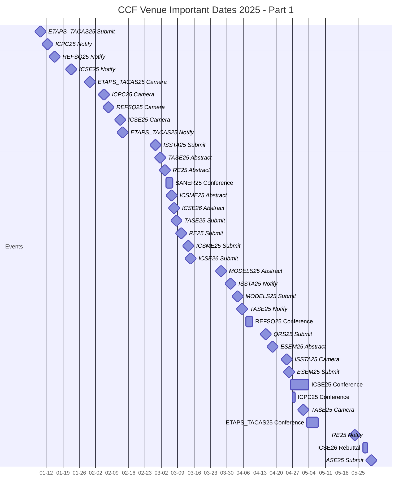
```mermaid
gantt
  title CCF Venue Important Dates 2025 - Part 1
  dateFormat YYYY-MM-DD
  axisFormat %m-%d

  section Events
  ETAPS_TACAS25 Submit :milestone, etaps_tacas_25_1_20250109, 2025-01-09, 1d
  ICPC25 Notify :milestone, icpc_25_2_20250112, 2025-01-12, 1d
  REFSQ25 Notify :milestone, refsq_25_3_20250115, 2025-01-15, 1d
  ICSE25 Notify :milestone, icse_25_4_20250122, 2025-01-22, 1d
  ETAPS_TACAS25 Camera :milestone, etaps_tacas_25_5_20250130, 2025-01-30, 1d
  ICPC25 Camera :milestone, icpc_25_6_20250205, 2025-02-05, 1d
  REFSQ25 Camera :milestone, refsq_25_7_20250207, 2025-02-07, 1d
  ICSE25 Camera :milestone, icse_25_8_20250212, 2025-02-12, 1d
  ETAPS_TACAS25 Notify :milestone, etaps_tacas_25_9_20250213, 2025-02-13, 1d
  ISSTA25 Submit :milestone, issta_25_10_20250227, 2025-02-27, 1d
  TASE25 Abstract :milestone, tase_25_11_20250301, 2025-03-01, 1d
  RE25 Abstract :milestone, re_25_12_20250303, 2025-03-03, 1d
  SANER25 Conference :saner_25_13_20250304, 2025-03-04, 2025-03-07
  ICSME25 Abstract :milestone, icsme_25_14_20250306, 2025-03-06, 1d
  ICSE26 Abstract :milestone, icse_26_15_20250307, 2025-03-07, 1d
  TASE25 Submit :milestone, tase_25_16_20250308, 2025-03-08, 1d
  RE25 Submit :milestone, re_25_17_20250310, 2025-03-10, 1d
  ICSME25 Submit :milestone, icsme_25_18_20250313, 2025-03-13, 1d
  ICSE26 Submit :milestone, icse_26_19_20250314, 2025-03-14, 1d
  MODELS25 Abstract :milestone, models_25_20_20250327, 2025-03-27, 1d
  ISSTA25 Notify :milestone, issta_25_21_20250331, 2025-03-31, 1d
  MODELS25 Submit :milestone, models_25_22_20250403, 2025-04-03, 1d
  TASE25 Notify :milestone, tase_25_23_20250405, 2025-04-05, 1d
  REFSQ25 Conference :refsq_25_24_20250407, 2025-04-07, 2025-04-10
  QRS25 Submit :milestone, qrs_25_25_20250415, 2025-04-15, 1d
  ESEM25 Abstract :milestone, esem_25_26_20250418, 2025-04-18, 1d
  ISSTA25 Camera :milestone, issta_25_27_20250424, 2025-04-24, 1d
  ESEM25 Submit :milestone, esem_25_28_20250425, 2025-04-25, 1d
  ICSE25 Conference :icse_25_29_20250426, 2025-04-26, 2025-05-04
  ICPC25 Conference :icpc_25_30_20250427, 2025-04-27, 2025-04-28
  TASE25 Camera :milestone, tase_25_31_20250501, 2025-05-01, 1d
  ETAPS_TACAS25 Conference :etaps_tacas_25_32_20250503, 2025-05-03, 2025-05-08
  RE25 Notify :milestone, re_25_33_20250523, 2025-05-23, 1d
  ICSE26 Rebuttal :icse_26_34_20250527, 2025-05-27, 2025-05-29
  ASE25 Submit :milestone, ase_25_35_20250530, 2025-05-30, 1d
```

#### 10.2.2 2025 Mermaid 分片 2

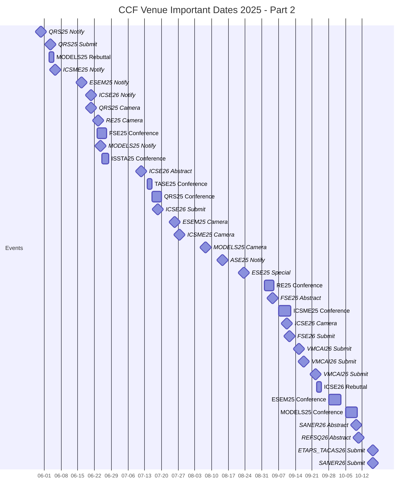
```mermaid
gantt
  title CCF Venue Important Dates 2025 - Part 2
  dateFormat YYYY-MM-DD
  axisFormat %m-%d

  section Events
  QRS25 Notify :milestone, qrs_25_36_20250530, 2025-05-30, 1d
  QRS25 Submit :milestone, qrs_25_37_20250603, 2025-06-03, 1d
  MODELS25 Rebuttal :models_25_38_20250603, 2025-06-03, 2025-06-05
  ICSME25 Notify :milestone, icsme_25_39_20250605, 2025-06-05, 1d
  ESEM25 Notify :milestone, esem_25_40_20250616, 2025-06-16, 1d
  ICSE26 Notify :milestone, icse_26_41_20250620, 2025-06-20, 1d
  QRS25 Camera :milestone, qrs_25_42_20250620, 2025-06-20, 1d
  RE25 Camera :milestone, re_25_43_20250623, 2025-06-23, 1d
  FSE25 Conference :fse_25_44_20250623, 2025-06-23, 2025-06-27
  MODELS25 Notify :milestone, models_25_45_20250624, 2025-06-24, 1d
  ISSTA25 Conference :issta_25_46_20250625, 2025-06-25, 2025-06-28
  ICSE26 Abstract :milestone, icse_26_47_20250711, 2025-07-11, 1d
  TASE25 Conference :tase_25_48_20250714, 2025-07-14, 2025-07-16
  QRS25 Conference :qrs_25_49_20250716, 2025-07-16, 2025-07-20
  ICSE26 Submit :milestone, icse_26_50_20250718, 2025-07-18, 1d
  ESEM25 Camera :milestone, esem_25_51_20250725, 2025-07-25, 1d
  ICSME25 Camera :milestone, icsme_25_52_20250727, 2025-07-27, 1d
  MODELS25 Camera :milestone, models_25_53_20250807, 2025-08-07, 1d
  ASE25 Notify :milestone, ase_25_54_20250814, 2025-08-14, 1d
  ESE25 Special :milestone, ese_25_55_20250823, 2025-08-23, 1d
  RE25 Conference :re_25_56_20250901, 2025-09-01, 2025-09-05
  FSE26 Abstract :milestone, fse_26_57_20250904, 2025-09-04, 1d
  ICSME25 Conference :icsme_25_58_20250907, 2025-09-07, 2025-09-12
  ICSE26 Camera :milestone, icse_26_59_20250910, 2025-09-10, 1d
  FSE26 Submit :milestone, fse_26_60_20250911, 2025-09-11, 1d
  VMCAI26 Submit :milestone, vmcai_26_61_20250915, 2025-09-15, 1d
  VMCAI26 Submit :milestone, vmcai_26_62_20250917, 2025-09-17, 1d
  VMCAI26 Submit :milestone, vmcai_26_63_20250922, 2025-09-22, 1d
  ICSE26 Rebuttal :icse_26_64_20250923, 2025-09-23, 2025-09-25
  ESEM25 Conference :esem_25_65_20250928, 2025-09-28, 2025-10-03
  MODELS25 Conference :models_25_66_20251005, 2025-10-05, 2025-10-10
  SANER26 Abstract :milestone, saner_26_67_20251009, 2025-10-09, 1d
  REFSQ26 Abstract :milestone, refsq_26_68_20251010, 2025-10-10, 1d
  ETAPS_TACAS26 Submit :milestone, etaps_tacas_26_69_20251016, 2025-10-16, 1d
  SANER26 Submit :milestone, saner_26_70_20251016, 2025-10-16, 1d
```

#### 10.2.3 2025 Mermaid 分片 3

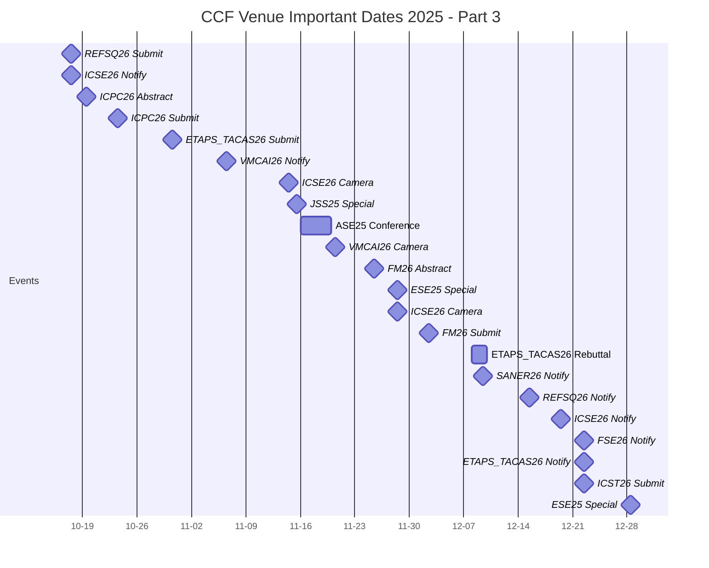
```mermaid
gantt
  title CCF Venue Important Dates 2025 - Part 3
  dateFormat YYYY-MM-DD
  axisFormat %m-%d

  section Events
  REFSQ26 Submit :milestone, refsq_26_71_20251017, 2025-10-17, 1d
  ICSE26 Notify :milestone, icse_26_72_20251017, 2025-10-17, 1d
  ICPC26 Abstract :milestone, icpc_26_73_20251019, 2025-10-19, 1d
  ICPC26 Submit :milestone, icpc_26_74_20251023, 2025-10-23, 1d
  ETAPS_TACAS26 Submit :milestone, etaps_tacas_26_75_20251030, 2025-10-30, 1d
  VMCAI26 Notify :milestone, vmcai_26_76_20251106, 2025-11-06, 1d
  ICSE26 Camera :milestone, icse_26_77_20251114, 2025-11-14, 1d
  JSS25 Special :milestone, jss_25_78_20251115, 2025-11-15, 1d
  ASE25 Conference :ase_25_79_20251116, 2025-11-16, 2025-11-20
  VMCAI26 Camera :milestone, vmcai_26_80_20251120, 2025-11-20, 1d
  FM26 Abstract :milestone, fm_26_81_20251125, 2025-11-25, 1d
  ESE25 Special :milestone, ese_25_82_20251128, 2025-11-28, 1d
  ICSE26 Camera :milestone, icse_26_83_20251128, 2025-11-28, 1d
  FM26 Submit :milestone, fm_26_84_20251202, 2025-12-02, 1d
  ETAPS_TACAS26 Rebuttal :etaps_tacas_26_85_20251208, 2025-12-08, 2025-12-10
  SANER26 Notify :milestone, saner_26_86_20251209, 2025-12-09, 1d
  REFSQ26 Notify :milestone, refsq_26_87_20251215, 2025-12-15, 1d
  ICSE26 Notify :milestone, icse_26_88_20251219, 2025-12-19, 1d
  FSE26 Notify :milestone, fse_26_89_20251222, 2025-12-22, 1d
  ETAPS_TACAS26 Notify :milestone, etaps_tacas_26_90_20251222, 2025-12-22, 1d
  ICST26 Submit :milestone, icst_26_91_20251222, 2025-12-22, 1d
  ESE25 Special :milestone, ese_25_92_20251228, 2025-12-28, 1d
```

#### 10.2.4 PR-9 P2 Mermaid 分片

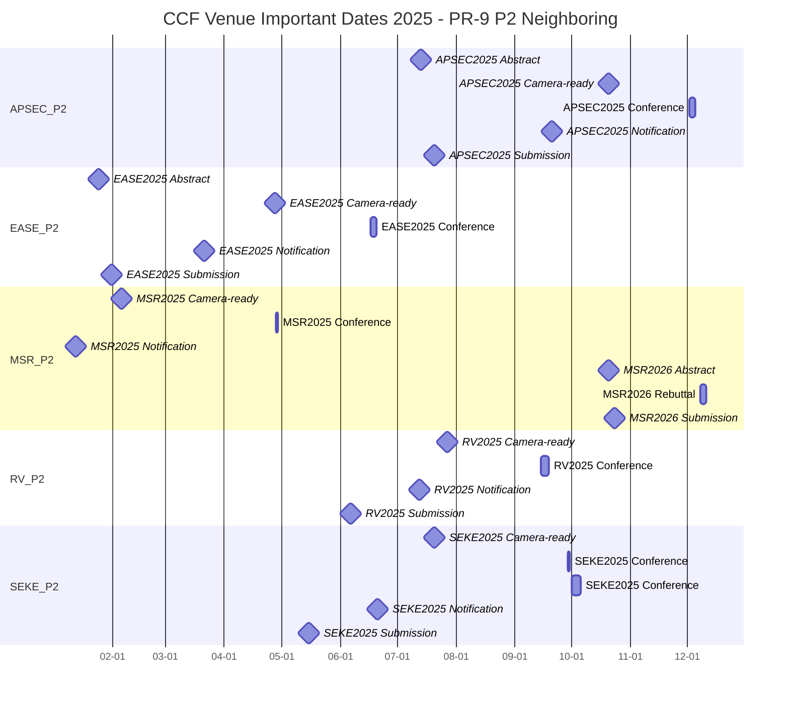
```mermaid
gantt
  title CCF Venue Important Dates 2025 - PR-9 P2 Neighboring
  dateFormat YYYY-MM-DD
  axisFormat %m-%d

  section APSEC_P2
  APSEC2025 Abstract :milestone, pr9_conf_c_apsec_2025_abstract_20250713, 2025-07-13, 1d
  APSEC2025 Camera-ready :milestone, pr9_conf_c_apsec_2025_camera_ready_20251020, 2025-10-20, 1d
  APSEC2025 Conference :pr9_conf_c_apsec_2025_conference_20251202, 2025-12-02, 2025-12-05
  APSEC2025 Notification :milestone, pr9_conf_c_apsec_2025_notification_20250920, 2025-09-20, 1d
  APSEC2025 Submission :milestone, pr9_conf_c_apsec_2025_submission_20250720, 2025-07-20, 1d

  section EASE_P2
  EASE2025 Abstract :milestone, pr9_conf_c_ease_2025_abstract_20250124, 2025-01-24, 1d
  EASE2025 Camera-ready :milestone, pr9_conf_c_ease_2025_camera_ready_20250427, 2025-04-27, 1d
  EASE2025 Conference :pr9_conf_c_ease_2025_conference_20250617, 2025-06-17, 2025-06-20
  EASE2025 Notification :milestone, pr9_conf_c_ease_2025_notification_20250321, 2025-03-21, 1d
  EASE2025 Submission :milestone, pr9_conf_c_ease_2025_submission_20250131, 2025-01-31, 1d

  section MSR_P2
  MSR2025 Camera-ready :milestone, pr9_conf_c_msr_2025_camera_ready_20250205, 2025-02-05, 1d
  MSR2025 Conference :pr9_conf_c_msr_2025_conference_20250428, 2025-04-28, 2025-04-29
  MSR2025 Notification :milestone, pr9_conf_c_msr_2025_notification_20250112, 2025-01-12, 1d
  MSR2026 Abstract :milestone, pr9_conf_c_msr_2026_abstract_20251020, 2025-10-20, 1d
  MSR2026 Rebuttal :pr9_conf_c_msr_2026_rebuttal_20251208, 2025-12-08, 2025-12-11
  MSR2026 Submission :milestone, pr9_conf_c_msr_2026_submission_20251023, 2025-10-23, 1d

  section RV_P2
  RV2025 Camera-ready :milestone, pr9_conf_c_rv_2025_camera_ready_20250727, 2025-07-27, 1d
  RV2025 Conference :pr9_conf_c_rv_2025_conference_20250915, 2025-09-15, 2025-09-19
  RV2025 Notification :milestone, pr9_conf_c_rv_2025_notification_20250712, 2025-07-12, 1d
  RV2025 Submission :milestone, pr9_conf_c_rv_2025_submission_20250606, 2025-06-06, 1d

  section SEKE_P2
  SEKE2025 Camera-ready :milestone, pr9_conf_c_seke_2025_camera_ready_20250720, 2025-07-20, 1d
  SEKE2025 Conference :pr9_conf_c_seke_2025_conference_20250929, 2025-09-29, 2025-09-30
  SEKE2025 Conference :pr9_conf_c_seke_2025_conference_20251001, 2025-10-01, 2025-10-06
  SEKE2025 Notification :milestone, pr9_conf_c_seke_2025_notification_20250620, 2025-06-20, 1d
  SEKE2025 Submission :milestone, pr9_conf_c_seke_2025_submission_20250515, 2025-05-15, 1d

```
## 11. 2024 时间线

> 当前章节按 **2024 年实际发生的事件日期** 升序排列；Venue 名称保留会议 edition。

### 11.1 2024 投稿事件总表

| 日期时间 | Venue | 类型-CCF | Track / 事项 | 日期类型 | 阶段状态 | 事件官方来源 | 年度主页 | 论文集 / 名录 | 本库年度页 | 核验状态 | 备注 |
|---|---|---|---|---|---|---|---|---|---|---|---|
| 2024-01-04 待补时刻 | [ETAPS/TACAS 2024](./conf-b-etaps/2024/README.md) | 会议-B | Artifact submission, non-TACAS tracks | Submission | ✅ 已结束 | [官方来源](https://etaps.org/2024/cfp/) | [年度主页](https://etaps.org/2024/) | [Past conference](https://etaps.org/2024/past-conference/) / [DBLP TACAS](https://dblp.org/db/conf/tacas/index.html#2024) | [本库年度页](./conf-b-etaps/2024/README.md) | 🟡 部分核验 | 官方仅日期；时刻待补。 |
| 2024-01-10 待补时刻 | [ICPC 2024](./conf-b-icpc/2024/README.md) | 会议-B | Research Track final notification | Notification | ✅ 已结束 | [ICPC 2024 dates](https://conf.researchr.org/dates/icpc-2024) | [ICPC 2024](https://conf.researchr.org/home/icpc-2024) | [DBLP 2024](https://dblp.org/db/conf/iwpc/icpc2024) | [本库年度页](./conf-b-icpc/2024/README.md) | 🟡 部分核验 | 官方仅日期；具体时刻待补。 |
| 2024-01-11 | [EASE 2024](./conf-c-ease/2024/README.md) | 会议-C / P2 | Research abstract | Abstract | ✅ 已结束 | [官方来源](https://conf.researchr.org/dates/ease-2024) | [年度主页](https://conf.researchr.org/home/ease-2024) | [论文集 / 名录](https://conf.researchr.org/program/ease-2024/program-ease-2024/) | [本库年度页](./conf-c-ease/2024/README.md) | 🟡 部分核验 | PR-9 P2 邻近观察；AoE；不升级为 P0/P1 主线。 |
| 2024-01-12 | [MSR 2024](./conf-c-msr/2024/README.md) | 会议-C / P2 | Technical notification | Notification | ✅ 已结束 | [官方来源](https://2024.msrconf.org/dates) | [年度主页](https://2024.msrconf.org/) | [论文集 / 名录](https://2024.msrconf.org/program/program-msr-2024/) | [本库年度页](./conf-c-msr/2024/README.md) | 🟡 部分核验 | PR-9 P2 邻近观察；官方仅日期；不升级为 P0/P1 主线。 |
| 2024-01-12 待补时刻 | [ICSE 2024](./conf-a-icse/2024/README.md) | 会议-A | Research Track camera-ready, cycle 2 | Camera-ready | ✅ 已结束 | [官方来源](https://conf.researchr.org/track/icse-2024/icse-2024-research-track) | [年度主页](https://conf.researchr.org/home/icse-2024) | [Program](https://conf.researchr.org/program/icse-2024/program-icse-2024/) / [DBLP](https://dblp.org/db/conf/icse/icse2024.html) | [本库年度页](./conf-a-icse/2024/README.md) | 🟡 部分核验 | 官方仅日期；时刻待补。 |
| 2024-01-15 待补时刻 AoE | [REFSQ 2024](./conf-c-refsq/2024/README.md) | 会议-C | Research notification | Notification | ✅ 已结束 | [官方来源](https://2024.refsq.org/dates/refsq-2024) | [年度主页](https://2024.refsq.org/) | [Program](https://2024.refsq.org/program/program-refsq-2024/) / [DBLP](https://dblp.org/db/conf/refsq/refsq2024.html) | [本库年度页](./conf-c-refsq/2024/README.md) | 🟡 部分核验 | main research / research track；具体时刻待补。 |
| 2024-01-18 | [EASE 2024](./conf-c-ease/2024/README.md) | 会议-C / P2 | Research full paper | Submission | ✅ 已结束 | [官方来源](https://conf.researchr.org/dates/ease-2024) | [年度主页](https://conf.researchr.org/home/ease-2024) | [论文集 / 名录](https://conf.researchr.org/program/ease-2024/program-ease-2024/) | [本库年度页](./conf-c-ease/2024/README.md) | 🟡 部分核验 | PR-9 P2 邻近观察；AoE；不升级为 P0/P1 主线。 |
| 2024-01-18 待补时刻 | [ETAPS/TACAS 2024](./conf-b-etaps/2024/README.md) | 会议-B | TACAS artifact notification | Notification | ✅ 已结束 | [官方来源](https://etaps.org/2024/cfp/) | [年度主页](https://etaps.org/2024/) | [Past conference](https://etaps.org/2024/past-conference/) / [DBLP TACAS](https://dblp.org/db/conf/tacas/index.html#2024) | [本库年度页](./conf-b-etaps/2024/README.md) | 🟡 部分核验 | 官方仅日期；时刻待补。 |
| 2024-01-19 待补时刻 AoE | [RE 2024](./conf-b-re/2024/README.md) | 会议-B | Research Papers abstract | Abstract | ✅ 已结束 | [官方来源](https://conf.researchr.org/dates/RE-2024) | [年度主页](https://conf.researchr.org/home/RE-2024) | [Program](https://conf.researchr.org/program/RE-2024/program-RE-2024/) / [DBLP](https://dblp.org/db/conf/re/re2024.html) | [本库年度页](./conf-b-re/2024/README.md) | 🟡 部分核验 | main research / research track；具体时刻待补。 |
| 2024-01-19 待补时刻 | [SANER 2024](./conf-b-saner/2024/README.md) | 会议-B | Research Papers camera-ready | Camera-ready | ✅ 已结束 | [SANER 2024 dates](https://conf.researchr.org/dates/saner-2024) | [SANER 2024](https://conf.researchr.org/home/saner-2024) | [DBLP 2024](https://dblp.org/db/conf/wcre/saner2024) | [本库年度页](./conf-b-saner/2024/README.md) | 🟡 部分核验 | 官方仅日期；具体时刻待补。 |
| 2024-01-23 待补时刻 | [ETAPS/TACAS 2024](./conf-b-etaps/2024/README.md) | 会议-B | TACAS final version | Camera-ready | ✅ 已结束 | [官方来源](https://etaps.org/2024/cfp/) | [年度主页](https://etaps.org/2024/) | [Past conference](https://etaps.org/2024/past-conference/) / [DBLP TACAS](https://dblp.org/db/conf/tacas/index.html#2024) | [本库年度页](./conf-b-etaps/2024/README.md) | 🟡 部分核验 | 官方仅日期；时刻待补。 |
| 2024-01-26 待补时刻 AoE | [RE 2024](./conf-b-re/2024/README.md) | 会议-B | Research Papers submission | Submission | ✅ 已结束 | [官方来源](https://conf.researchr.org/dates/RE-2024) | [年度主页](https://conf.researchr.org/home/RE-2024) | [Program](https://conf.researchr.org/program/RE-2024/program-RE-2024/) / [DBLP](https://dblp.org/db/conf/re/re2024.html) | [本库年度页](./conf-b-re/2024/README.md) | 🟡 部分核验 | main research / research track；具体时刻待补。 |
| 2024-01-28 | [MSR 2024](./conf-c-msr/2024/README.md) | 会议-C / P2 | Technical camera-ready | Camera-ready | ✅ 已结束 | [官方来源](https://2024.msrconf.org/dates) | [年度主页](https://2024.msrconf.org/) | [论文集 / 名录](https://2024.msrconf.org/program/program-msr-2024/) | [本库年度页](./conf-c-msr/2024/README.md) | 🟡 部分核验 | PR-9 P2 邻近观察；官方仅日期；不升级为 P0/P1 主线。 |
| 2024-01-28 待补时刻 | [ICPC 2024](./conf-b-icpc/2024/README.md) | 会议-B | Research Track camera-ready | Camera-ready | ✅ 已结束 | [ICPC 2024 dates](https://conf.researchr.org/dates/icpc-2024) | [ICPC 2024](https://conf.researchr.org/home/icpc-2024) | [DBLP 2024](https://dblp.org/db/conf/iwpc/icpc2024) | [本库年度页](./conf-b-icpc/2024/README.md) | 🟡 部分核验 | 官方仅日期；具体时刻待补。 |
| 2024-02-07 至 2024-02-09 | [ISSTA 2024](./conf-a-issta/2024/README.md) | 会议-A | Technical Papers author response, round 1 | Rebuttal | ✅ 已结束 | [官方来源](https://conf.researchr.org/track/issta-2024/issta-2024-papers) | [年度主页](https://conf.researchr.org/home/issta-2024) | [Program](https://conf.researchr.org/program/issta-2024/program-issta-2024/) / [DBLP](https://dblp.org/db/conf/issta/issta2024.html) | [本库年度页](./conf-a-issta/2024/README.md) | 🟡 部分核验 | 官方 track / dates 页面均只给日期窗口。 |
| 2024-02-08 待补时刻 | [ETAPS/TACAS 2024](./conf-b-etaps/2024/README.md) | 会议-B | Artifact notification, non-TACAS tracks | Notification | ✅ 已结束 | [官方来源](https://etaps.org/2024/cfp/) | [年度主页](https://etaps.org/2024/) | [Past conference](https://etaps.org/2024/past-conference/) / [DBLP TACAS](https://dblp.org/db/conf/tacas/index.html#2024) | [本库年度页](./conf-b-etaps/2024/README.md) | 🟡 部分核验 | 官方仅日期；时刻待补。 |
| 2024-02-09 待补时刻 AoE | [REFSQ 2024](./conf-c-refsq/2024/README.md) | 会议-C | Research camera-ready | Camera-ready | ✅ 已结束 | [官方来源](https://2024.refsq.org/dates/refsq-2024) | [年度主页](https://2024.refsq.org/) | [Program](https://2024.refsq.org/program/program-refsq-2024/) / [DBLP](https://dblp.org/db/conf/refsq/refsq2024.html) | [本库年度页](./conf-c-refsq/2024/README.md) | 🟡 部分核验 | main research / research track；具体时刻待补。 |
| 2024-02-27 待补时刻 AoE | [TASE 2024](./conf-c-tase/2024/README.md) | 会议-C | Abstract due extended | Abstract | ✅ 已结束 | [TASE 2024 official source](https://tase2024.github.io/c_impd.html) | [TASE 2024](https://tase2024.github.io/) | [Accepted Papers](https://tase2024.github.io/c_ap.html) / [Proceedings](https://link.springer.com/book/10.1007/978-3-031-64626-3) / [DBLP](https://dblp.org/db/conf/tase/tase2024.html) | [本库年度页](./conf-c-tase/2024/README.md) | 🟡 部分核验 | TASE official accepted list、Springer TOC 与 DBLP 计数需分列；不混成单一论文数。 |
| 2024-03-02 待补时刻 AoE | [ISSTA 2024](./conf-a-issta/2024/README.md) | 会议-A | Technical Papers notification, round 1 | Notification | ✅ 已结束 | [官方来源](https://conf.researchr.org/dates/issta-2024) | [年度主页](https://conf.researchr.org/home/issta-2024) | [Program](https://conf.researchr.org/program/issta-2024/program-issta-2024/) / [DBLP](https://dblp.org/db/conf/issta/issta2024.html) | [本库年度页](./conf-a-issta/2024/README.md) | 🟡 部分核验 | 官方仅日期，时刻待补。 |
| 2024-03-05 待补时刻 AoE | [TASE 2024](./conf-c-tase/2024/README.md) | 会议-C | Paper submission extended | Submission | ✅ 已结束 | [TASE 2024 official source](https://tase2024.github.io/c_impd.html) | [TASE 2024](https://tase2024.github.io/) | [Accepted Papers](https://tase2024.github.io/c_ap.html) / [Proceedings](https://link.springer.com/book/10.1007/978-3-031-64626-3) / [DBLP](https://dblp.org/db/conf/tase/tase2024.html) | [本库年度页](./conf-c-tase/2024/README.md) | 🟡 部分核验 | TASE official accepted list、Springer TOC 与 DBLP 计数需分列；不混成单一论文数。 |
| 2024-03-06 | [EASE 2024](./conf-c-ease/2024/README.md) | 会议-C / P2 | Research notification | Notification | ✅ 已结束 | [官方来源](https://conf.researchr.org/dates/ease-2024) | [年度主页](https://conf.researchr.org/home/ease-2024) | [论文集 / 名录](https://conf.researchr.org/program/ease-2024/program-ease-2024/) | [本库年度页](./conf-c-ease/2024/README.md) | 🟡 部分核验 | PR-9 P2 邻近观察；AoE；不升级为 P0/P1 主线。 |
| 2024-03-12 至 2024-03-15 | [SANER 2024](./conf-b-saner/2024/README.md) | 会议-B | Conference dates | Conference | ✅ 已结束 | [SANER 2024 home](https://conf.researchr.org/home/saner-2024) | [SANER 2024](https://conf.researchr.org/home/saner-2024) | [DBLP 2024](https://dblp.org/db/conf/wcre/saner2024) | [本库年度页](./conf-b-saner/2024/README.md) | 🟡 部分核验 | Rovaniemi, Finland。 |
| 2024-03-15 待补时刻 | [ICSE 2025](./conf-a-icse/2025/README.md) | 会议-A | Research Track abstract, cycle 1 | Abstract | ✅ 已结束 | [官方来源](https://conf.researchr.org/track/icse-2025/icse-2025-research-track) | [年度主页](https://conf.researchr.org/home/icse-2025) | [Program](https://conf.researchr.org/program/icse-2025/program-icse-2025/) / [Proceedings](https://conf.researchr.org/info/icse-2025/proceedings) | [本库年度页](./conf-a-icse/2025/README.md) | 🟡 部分核验 | 官方仅日期，AoE / UTC-12h；时刻待补。 |
| 2024-03-18 待补时刻 | [QRS 2024](./conf-c-qrs/2024/README.md) | 会议-C | Abstract due extended | Abstract | ✅ 已结束 | [QRS 2024 official source](https://qrs24.techconf.org/) | [QRS 2024](https://qrs24.techconf.org/) | [Proceedings policy](https://qrs24.techconf.org/track/proceeding) / [DBLP](https://dblp.org/db/conf/qrs/qrs2024.html) | [本库年度页](./conf-c-qrs/2024/README.md) | 🟡 部分核验 | Regular / short、workshop / special track、proceedings policy / DBLP fallback 分开记录；不把 proceedings policy 页或整本 proceedings fallback 当作 main research count；IEEE Xplore proceedings TOC 待补。 |
| 2024-03-21 待补时刻 | [MoDELS 2024](./conf-b-models/2024/README.md) | 会议-B | Technical Track abstract | Abstract | ✅ 已结束 | [官方来源](https://conf.researchr.org/dates/models-2024) | [年度主页](https://conf.researchr.org/home/models-2024) | [Program](https://conf.researchr.org/program/models-2024/program-models-2024/) / [DBLP](https://dblp.org/db/conf/models/models2024.html) | [本库年度页](./conf-b-models/2024/README.md) | 🟡 部分核验 | 官方仅日期，AoE；时刻待补。 |
| 2024-03-22 待补时刻 AoE | [RE 2024](./conf-b-re/2024/README.md) | 会议-B | Research Papers notification | Notification | ✅ 已结束 | [官方来源](https://conf.researchr.org/dates/RE-2024) | [年度主页](https://conf.researchr.org/home/RE-2024) | [Program](https://conf.researchr.org/program/RE-2024/program-RE-2024/) / [DBLP](https://dblp.org/db/conf/re/re2024.html) | [本库年度页](./conf-b-re/2024/README.md) | 🟡 部分核验 | main research / research track；具体时刻待补。 |
| 2024-03-22 待补时刻 | [ICSE 2025](./conf-a-icse/2025/README.md) | 会议-A | Research Track submission, cycle 1 | Submission | ✅ 已结束 | [官方来源](https://conf.researchr.org/track/icse-2025/icse-2025-research-track) | [年度主页](https://conf.researchr.org/home/icse-2025) | [Program](https://conf.researchr.org/program/icse-2025/program-icse-2025/) / [Proceedings](https://conf.researchr.org/info/icse-2025/proceedings) | [本库年度页](./conf-a-icse/2025/README.md) | 🟡 部分核验 | 官方仅日期，AoE / UTC-12h；时刻待补。 |
| 2024-03-25 待补时刻 | [QRS 2024](./conf-c-qrs/2024/README.md) | 会议-C | Regular and Short papers due extended | Submission | ✅ 已结束 | [QRS 2024 official source](https://qrs24.techconf.org/) | [QRS 2024](https://qrs24.techconf.org/) | [Proceedings policy](https://qrs24.techconf.org/track/proceeding) / [DBLP](https://dblp.org/db/conf/qrs/qrs2024.html) | [本库年度页](./conf-c-qrs/2024/README.md) | 🟡 部分核验 | Regular / short、workshop / special track、proceedings policy / DBLP fallback 分开记录；不把 proceedings policy 页或整本 proceedings fallback 当作 main research count；IEEE Xplore proceedings TOC 待补。 |
| 2024-03-28 待补时刻 | [MoDELS 2024](./conf-b-models/2024/README.md) | 会议-B | Technical Track submission | Submission | ✅ 已结束 | [官方来源](https://conf.researchr.org/dates/models-2024) | [年度主页](https://conf.researchr.org/home/models-2024) | [Program](https://conf.researchr.org/program/models-2024/program-models-2024/) / [DBLP](https://dblp.org/db/conf/models/models2024.html) | [本库年度页](./conf-b-models/2024/README.md) | 🟡 部分核验 | 官方仅日期，AoE；时刻待补。 |
| 2024-03-31 待补时刻 AoE | [ISSTA 2024](./conf-a-issta/2024/README.md) | 会议-A | Technical Papers camera-ready, round 1 | Camera-ready | ✅ 已结束 | [官方来源](https://conf.researchr.org/dates/issta-2024) | [年度主页](https://conf.researchr.org/home/issta-2024) | [Program](https://conf.researchr.org/program/issta-2024/program-issta-2024/) / [DBLP](https://dblp.org/db/conf/issta/issta2024.html) | [本库年度页](./conf-a-issta/2024/README.md) | 🟡 部分核验 | 官方仅日期，时刻待补。 |
| 2024-03-31 待补时刻 | [SQJ 2024](./journal-c-sqj/2024/README.md) | 期刊专刊-CCF C | Gamification of Software Development, Verification and Validation | Special issue | ✅ 已关闭 | [Springer collection](https://link.springer.com/collections/hbihjfgjbc) | [Springer SQJ](https://link.springer.com/journal/11219) | [DBLP Vol. 32](https://dblp.org/db/journals/sqj/sqj32.html) | [本库年度页](./journal-c-sqj/2024/README.md) | 🟡 部分核验 | 官方仅给日期；topical collection deadline。 |
| 2024-03-31 待补时刻 | [SQJ 2024](./journal-c-sqj/2024/README.md) | 期刊专刊-CCF C | Quality of Learning-enabled Autonomous Systems | Special issue | ✅ 已关闭 | [Springer collection](https://link.springer.com/collections/ejhjajiejd) | [Springer SQJ](https://link.springer.com/journal/11219) | [DBLP Vol. 32](https://dblp.org/db/journals/sqj/sqj32.html) | [本库年度页](./journal-c-sqj/2024/README.md) | 🟡 部分核验 | 官方仅给日期；topical collection deadline。 |
| 2024-04-04 待补时刻 | [ICSME 2024](./conf-b-icsme/2024/README.md) | 会议-B | Research Papers abstract | Abstract | ✅ 已结束 | [ICSME 2024 Research Track](https://conf.researchr.org/track/icsme-2024/icsme-2024-papers) | [ICSME 2024 Research Track](https://conf.researchr.org/track/icsme-2024/icsme-2024-papers) | [DBLP 2024](https://dblp.org/db/conf/icsm/icsme2024) | [本库年度页](./conf-b-icsme/2024/README.md) | 🟡 部分核验 | 官方仅日期；具体时刻待补。 |
| 2024-04-06 至 2024-04-11 | [ETAPS/TACAS 2024](./conf-b-etaps/2024/README.md) | 会议-B | ETAPS conference dates | Conference | ✅ 已结束 | [官方来源](https://etaps.org/2024/cfp/) | [年度主页](https://etaps.org/2024/) | [Past conference](https://etaps.org/2024/past-conference/) / [DBLP TACAS](https://dblp.org/db/conf/tacas/index.html#2024) | [本库年度页](./conf-b-etaps/2024/README.md) | 🟡 部分核验 | Luxembourg City。 |
| 2024-04-08 至 2024-04-11 | [REFSQ 2024](./conf-c-refsq/2024/README.md) | 会议-C | Conference dates | Conference | ✅ 已结束 | [官方来源](https://2024.refsq.org/dates/refsq-2024) | [年度主页](https://2024.refsq.org/) | [Program](https://2024.refsq.org/program/program-refsq-2024/) / [DBLP](https://dblp.org/db/conf/refsq/refsq2024.html) | [本库年度页](./conf-c-refsq/2024/README.md) | 🟡 部分核验 | REFSQ official dates；Springer / DBLP 入口分散时以年度页说明为准。 |
| 2024-04-10 待补时刻 | [TASE 2024](./conf-c-tase/2024/README.md) | 会议-C | Notification | Notification | ✅ 已结束 | [TASE 2024 official source](https://tase2024.github.io/c_impd.html) | [TASE 2024](https://tase2024.github.io/) | [Accepted Papers](https://tase2024.github.io/c_ap.html) / [Proceedings](https://link.springer.com/book/10.1007/978-3-031-64626-3) / [DBLP](https://dblp.org/db/conf/tase/tase2024.html) | [本库年度页](./conf-c-tase/2024/README.md) | 🟡 部分核验 | TASE official accepted list、Springer TOC 与 DBLP 计数需分列；不混成单一论文数。 |
| 2024-04-11 待补时刻 | [ICSME 2024](./conf-b-icsme/2024/README.md) | 会议-B | Research Papers submission | Submission | ✅ 已结束 | [ICSME 2024 Research Track](https://conf.researchr.org/track/icsme-2024/icsme-2024-papers) | [ICSME 2024 Research Track](https://conf.researchr.org/track/icsme-2024/icsme-2024-papers) | [DBLP 2024](https://dblp.org/db/conf/icsm/icsme2024) | [本库年度页](./conf-b-icsme/2024/README.md) | 🟡 部分核验 | 官方仅日期；具体时刻待补。 |
| 2024-04-12 23:59 AoE | [ISSTA 2024](./conf-a-issta/2024/README.md) | 会议-A | Technical Papers submission, round 2 / major revisions | Submission | ✅ 已结束 | [官方来源](https://conf.researchr.org/track/issta-2024/issta-2024-papers) | [年度主页](https://conf.researchr.org/home/issta-2024) | [Program](https://conf.researchr.org/program/issta-2024/program-issta-2024/) / [DBLP](https://dblp.org/db/conf/issta/issta2024.html) | [本库年度页](./conf-a-issta/2024/README.md) | 🟡 部分核验 | Round 2 / major revisions deadline；AoE / UTC-12h。 |
| 2024-04-12 至 2024-04-21 | [ICSE 2024](./conf-a-icse/2024/README.md) | 会议-A | Conference dates | Conference | ✅ 已结束 | [官方来源](https://conf.researchr.org/track/icse-2024/icse-2024-research-track) | [年度主页](https://conf.researchr.org/home/icse-2024) | [Program](https://conf.researchr.org/program/icse-2024/program-icse-2024/) / [DBLP](https://dblp.org/db/conf/icse/icse2024.html) | [本库年度页](./conf-a-icse/2024/README.md) | 🟡 部分核验 | Lisbon, Portugal。 |
| 2024-04-15 至 2024-04-16 | [ICPC 2024](./conf-b-icpc/2024/README.md) | 会议-B | Conference dates | Conference | ✅ 已结束 | [ICPC 2024 home](https://conf.researchr.org/home/icpc-2024) | [ICPC 2024](https://conf.researchr.org/home/icpc-2024) | [DBLP 2024](https://dblp.org/db/conf/iwpc/icpc2024) | [本库年度页](./conf-b-icpc/2024/README.md) | 🟡 部分核验 | 官方仅日期；具体时刻待补。 |
| 2024-04-15 至 2024-04-16 | [MSR 2024](./conf-c-msr/2024/README.md) | 会议-C / P2 | Conference | Conference | ✅ 已结束 | [官方来源](https://2024.msrconf.org/dates) | [年度主页](https://2024.msrconf.org/) | [论文集 / 名录](https://2024.msrconf.org/program/program-msr-2024/) | [本库年度页](./conf-c-msr/2024/README.md) | 🟡 部分核验 | PR-9 P2 邻近观察；Lisbon local time；不升级为 P0/P1 主线。 |
| 2024-04-19 待补时刻 AoE | [RE 2024](./conf-b-re/2024/README.md) | 会议-B | Research Papers camera-ready | Camera-ready | ✅ 已结束 | [官方来源](https://conf.researchr.org/dates/RE-2024) | [年度主页](https://conf.researchr.org/home/RE-2024) | [Program](https://conf.researchr.org/program/RE-2024/program-RE-2024/) / [DBLP](https://dblp.org/db/conf/re/re2024.html) | [本库年度页](./conf-b-re/2024/README.md) | 🟡 部分核验 | main research / research track；具体时刻待补。 |
| 2024-04-26 | [EASE 2024](./conf-c-ease/2024/README.md) | 会议-C / P2 | Camera-ready | Camera-ready | ✅ 已结束 | [官方来源](https://conf.researchr.org/dates/ease-2024) | [年度主页](https://conf.researchr.org/home/ease-2024) | [论文集 / 名录](https://conf.researchr.org/program/ease-2024/program-ease-2024/) | [本库年度页](./conf-c-ease/2024/README.md) | 🟡 部分核验 | PR-9 P2 邻近观察；AoE；不升级为 P0/P1 主线。 |
| 2024-05-02 待补时刻 | [ESEM 2024](./conf-b-esem/2024/README.md) | 会议-B | Technical Track abstract | Abstract | ✅ 已结束 | [Important Dates](https://conf.researchr.org/dates/esem-2024) | [ESEIW 2024](https://conf.researchr.org/home/esem-2024) | [Program](https://conf.researchr.org/program/esem-2024/program-esem-2024/) / [DBLP](https://dblp.org/db/conf/esem/esem2024.html) | [本库年度页](./conf-b-esem/2024/README.md) | 🟡 部分核验 | 官方仅给日期；ESEM Technical Papers。 |
| 2024-05-06 待补时刻 | [ESEM 2024](./conf-b-esem/2024/README.md) | 会议-B | Technical Track submission | Submission | ✅ 已结束 | [Important Dates](https://conf.researchr.org/dates/esem-2024) | [ESEIW 2024](https://conf.researchr.org/home/esem-2024) | [Program](https://conf.researchr.org/program/esem-2024/program-esem-2024/) / [DBLP](https://dblp.org/db/conf/esem/esem2024.html) | [本库年度页](./conf-b-esem/2024/README.md) | 🟡 部分核验 | 官方仅给日期；具体时刻待补。 |
| 2024-05-07 待补时刻 | [QRS 2024](./conf-c-qrs/2024/README.md) | 会议-C | Author notification | Notification | ✅ 已结束 | [QRS 2024 official source](https://qrs24.techconf.org/) | [QRS 2024](https://qrs24.techconf.org/) | [Proceedings policy](https://qrs24.techconf.org/track/proceeding) / [DBLP](https://dblp.org/db/conf/qrs/qrs2024.html) | [本库年度页](./conf-c-qrs/2024/README.md) | 🟡 部分核验 | Regular / short、workshop / special track、proceedings policy / DBLP fallback 分开记录；不把 proceedings policy 页或整本 proceedings fallback 当作 main research count；IEEE Xplore proceedings TOC 待补。 |
| 2024-05-10 待补时刻 | [TASE 2024](./conf-c-tase/2024/README.md) | 会议-C | Camera-ready | Camera-ready | ✅ 已结束 | [TASE 2024 official source](https://tase2024.github.io/c_impd.html) | [TASE 2024](https://tase2024.github.io/) | [Accepted Papers](https://tase2024.github.io/c_ap.html) / [Proceedings](https://link.springer.com/book/10.1007/978-3-031-64626-3) / [DBLP](https://dblp.org/db/conf/tase/tase2024.html) | [本库年度页](./conf-c-tase/2024/README.md) | 🟡 部分核验 | TASE official accepted list、Springer TOC 与 DBLP 计数需分列；不混成单一论文数。 |
| 2024-05-27 至 2024-05-29 | [MoDELS 2024](./conf-b-models/2024/README.md) | 会议-B | Technical Track author response | Rebuttal | ✅ 已结束 | [官方来源](https://conf.researchr.org/dates/models-2024) | [年度主页](https://conf.researchr.org/home/models-2024) | [Program](https://conf.researchr.org/program/models-2024/program-models-2024/) / [DBLP](https://dblp.org/db/conf/models/models2024.html) | [本库年度页](./conf-b-models/2024/README.md) | 🟡 部分核验 | 官方仅日期，AoE；时刻待补。 |
| 2024-05-28 | [RV 2024](./conf-c-rv/2024/README.md) | 会议-C / P2 | Paper submission | Submission | ✅ 已结束 | [官方来源](https://cmpe.bogazici.edu.tr/rv24/call-for-papers/) | [年度主页](https://cmpe.bogazici.edu.tr/rv24/) | [论文集 / 名录](https://cmpe.bogazici.edu.tr/rv24/program/) | [本库年度页](./conf-c-rv/2024/README.md) | 🟡 部分核验 | PR-9 P2 邻近观察；extended; original 2024-05-14；不升级为 P0/P1 主线。 |
| 2024-05-31 待补时刻 AoE | [ASE 2024](./conf-a-ase/2024/README.md) | 会议-A | Abstract submission | Abstract | ✅ 已结束 | [官方来源](https://conf.researchr.org/track/ase-2024/ase-2024-research) | [年度主页](https://conf.researchr.org/home/ase-2024) | [Program](https://conf.researchr.org/program/ase-2024/program-ase-2024/) / [DBLP](https://dblp.org/db/conf/kbse/ase2024.html) | [本库年度页](./conf-a-ase/2024/README.md) | 🟡 部分核验 |  |
| 2024-06-01 待补时刻 | [QRS 2024](./conf-c-qrs/2024/README.md) | 会议-C | Camera-ready / registration | Camera-ready | ✅ 已结束 | [QRS 2024 official source](https://qrs24.techconf.org/) | [QRS 2024](https://qrs24.techconf.org/) | [Proceedings policy](https://qrs24.techconf.org/track/proceeding) / [DBLP](https://dblp.org/db/conf/qrs/qrs2024.html) | [本库年度页](./conf-c-qrs/2024/README.md) | 🟡 部分核验 | Regular / short、workshop / special track、proceedings policy / DBLP fallback 分开记录；不把 proceedings policy 页或整本 proceedings fallback 当作 main research count；IEEE Xplore proceedings TOC 待补。 |
| 2024-06-07 | [SEKE 2024](./conf-c-seke/2024/README.md) | 会议-C / P2 | Paper submission due | Submission | ✅ 已结束 | [官方来源](https://ksiresearch.org/seke/seke24main.html) | [年度主页](https://ksiresearch.org/seke/seke24.html) | [论文集 / 名录](http://ksiresearchorg.ipage.com/seke/Proceedings/seke/SEKE2024_Proceedings.pdf) | [本库年度页](./conf-c-seke/2024/README.md) | 🟡 部分核验 | PR-9 P2 邻近观察；Midnight EST / extended hard deadline；不升级为 P0/P1 主线。 |
| 2024-06-07 待补时刻 AoE | [ASE 2024](./conf-a-ase/2024/README.md) | 会议-A | Paper submission | Submission | ✅ 已结束 | [官方来源](https://conf.researchr.org/track/ase-2024/ase-2024-research) | [年度主页](https://conf.researchr.org/home/ase-2024) | [Program](https://conf.researchr.org/program/ase-2024/program-ase-2024/) / [DBLP](https://dblp.org/db/conf/kbse/ase2024.html) | [本库年度页](./conf-a-ase/2024/README.md) | 🟡 部分核验 |  |
| 2024-06-10 至 2024-06-13 | [ICSE 2025](./conf-a-icse/2025/README.md) | 会议-A | Research Track author response, cycle 1 | Rebuttal | ✅ 已结束 | [官方来源](https://conf.researchr.org/track/icse-2025/icse-2025-research-track) | [年度主页](https://conf.researchr.org/home/icse-2025) | [Program](https://conf.researchr.org/program/icse-2025/program-icse-2025/) / [Proceedings](https://conf.researchr.org/info/icse-2025/proceedings) | [本库年度页](./conf-a-icse/2025/README.md) | 🟡 部分核验 | 官方仅日期；时刻待补。 |
| 2024-06-11 至 2024-06-13 | [ISSTA 2024](./conf-a-issta/2024/README.md) | 会议-A | Technical Papers author response, round 2 / major revisions | Rebuttal | ✅ 已结束 | [官方来源](https://conf.researchr.org/track/issta-2024/issta-2024-papers) | [年度主页](https://conf.researchr.org/home/issta-2024) | [Program](https://conf.researchr.org/program/issta-2024/program-issta-2024/) / [DBLP](https://dblp.org/db/conf/issta/issta2024.html) | [本库年度页](./conf-a-issta/2024/README.md) | 🟡 部分核验 | 官方 track / dates 页面均只给日期窗口。 |
| 2024-06-13 待补时刻 | [ICSME 2024](./conf-b-icsme/2024/README.md) | 会议-B | Research Papers notification | Notification | ✅ 已结束 | [ICSME 2024 Research Track](https://conf.researchr.org/track/icsme-2024/icsme-2024-papers) | [ICSME 2024 Research Track](https://conf.researchr.org/track/icsme-2024/icsme-2024-papers) | [DBLP 2024](https://dblp.org/db/conf/icsm/icsme2024) | [本库年度页](./conf-b-icsme/2024/README.md) | 🟡 部分核验 | 官方仅日期；具体时刻待补。 |
| 2024-06-17 待补时刻 | [MoDELS 2024](./conf-b-models/2024/README.md) | 会议-B | Technical Track notification | Notification | ✅ 已结束 | [官方来源](https://conf.researchr.org/dates/models-2024) | [年度主页](https://conf.researchr.org/home/models-2024) | [Program](https://conf.researchr.org/program/models-2024/program-models-2024/) / [DBLP](https://dblp.org/db/conf/models/models2024.html) | [本库年度页](./conf-b-models/2024/README.md) | 🟡 部分核验 | 官方仅日期，AoE；时刻待补。 |
| 2024-06-18 至 2024-06-21 | [EASE 2024](./conf-c-ease/2024/README.md) | 会议-C / P2 | Conference | Conference | ✅ 已结束 | [官方来源](https://conf.researchr.org/dates/ease-2024) | [年度主页](https://conf.researchr.org/home/ease-2024) | [论文集 / 名录](https://conf.researchr.org/program/ease-2024/program-ease-2024/) | [本库年度页](./conf-c-ease/2024/README.md) | 🟡 部分核验 | PR-9 P2 邻近观察；Salerno local time；不升级为 P0/P1 主线。 |
| 2024-06-20 待补时刻 | [ESEM 2024](./conf-b-esem/2024/README.md) | 会议-B | Technical Track notification | Notification | ✅ 已结束 | [Important Dates](https://conf.researchr.org/dates/esem-2024) | [ESEIW 2024](https://conf.researchr.org/home/esem-2024) | [Program](https://conf.researchr.org/program/esem-2024/program-esem-2024/) / [DBLP](https://dblp.org/db/conf/esem/esem2024.html) | [本库年度页](./conf-b-esem/2024/README.md) | 🟡 部分核验 | 官方仅给日期；具体时刻待补。 |
| 2024-06-24 至 2024-06-28 | [RE 2024](./conf-b-re/2024/README.md) | 会议-B | Conference dates | Conference | ✅ 已结束 | [官方来源](https://conf.researchr.org/dates/RE-2024) | [年度主页](https://conf.researchr.org/home/RE-2024) | [Program](https://conf.researchr.org/program/RE-2024/program-RE-2024/) / [DBLP](https://dblp.org/db/conf/re/re2024.html) | [本库年度页](./conf-b-re/2024/README.md) | 🟡 部分核验 | IEEE RE conference dates。 |
| 2024-06-25 | [RV 2024](./conf-c-rv/2024/README.md) | 会议-C / P2 | Notification | Notification | ✅ 已结束 | [官方来源](https://cmpe.bogazici.edu.tr/rv24/call-for-papers/) | [年度主页](https://cmpe.bogazici.edu.tr/rv24/) | [论文集 / 名录](https://cmpe.bogazici.edu.tr/rv24/program/) | [本库年度页](./conf-c-rv/2024/README.md) | 🟡 部分核验 | PR-9 P2 邻近观察；官方仅日期；不升级为 P0/P1 主线。 |
| 2024-07-01 至 2024-07-05 | [QRS 2024](./conf-c-qrs/2024/README.md) | 会议-C | Conference dates | Conference | ✅ 已结束 | [QRS 2024 official source](https://qrs24.techconf.org/) | [QRS 2024](https://qrs24.techconf.org/) | [Proceedings policy](https://qrs24.techconf.org/track/proceeding) / [DBLP](https://dblp.org/db/conf/qrs/qrs2024.html) | [本库年度页](./conf-c-qrs/2024/README.md) | 🟡 部分核验 | Regular / short、workshop / special track、proceedings policy / DBLP fallback 分开记录；不把 proceedings policy 页或整本 proceedings fallback 当作 main research count；IEEE Xplore proceedings TOC 待补。 |
| 2024-07-03 待补时刻 AoE | [ISSTA 2024](./conf-a-issta/2024/README.md) | 会议-A | Technical Papers notification, round 2 / major revisions | Notification | ✅ 已结束 | [官方来源](https://conf.researchr.org/dates/issta-2024) | [年度主页](https://conf.researchr.org/home/issta-2024) | [Program](https://conf.researchr.org/program/issta-2024/program-issta-2024/) / [DBLP](https://dblp.org/db/conf/issta/issta2024.html) | [本库年度页](./conf-a-issta/2024/README.md) | 🟡 部分核验 | 官方仅日期，时刻待补。 |
| 2024-07-05 待补时刻 | [ICSE 2025](./conf-a-icse/2025/README.md) | 会议-A | Research Track notification, cycle 1 | Notification | ✅ 已结束 | [官方来源](https://conf.researchr.org/track/icse-2025/icse-2025-research-track) | [年度主页](https://conf.researchr.org/home/icse-2025) | [Program](https://conf.researchr.org/program/icse-2025/program-icse-2025/) / [Proceedings](https://conf.researchr.org/info/icse-2025/proceedings) | [本库年度页](./conf-a-icse/2025/README.md) | 🟡 部分核验 | 官方仅日期；时刻待补。 |
| 2024-07-13 | [APSEC 2024](./conf-c-apsec/2024/README.md) | 会议-C / P2 | Technical abstract | Abstract | ✅ 已结束 | [官方来源](https://conf.researchr.org/dates/apsec-2024) | [年度主页](https://conf.researchr.org/home/apsec-2024) | [论文集 / 名录](https://conf.researchr.org/program/apsec-2024/program-apsec-2024/) | [本库年度页](./conf-c-apsec/2024/README.md) | 🟡 部分核验 | PR-9 P2 邻近观察；AoE / UTC-12h；不升级为 P0/P1 主线。 |
| 2024-07-15 至 2024-07-19 | [FSE 2024](./conf-a-fse/2024/README.md) | 会议-A | Conference dates | Conference | ✅ 已结束 | [官方来源](https://conf.researchr.org/home/fse-2024) | [年度主页](https://conf.researchr.org/home/fse-2024) | [Program](https://conf.researchr.org/program/fse-2024/program-fse-2024/) / [DBLP](https://dblp.org/db/conf/sigsoft/fse2024c.html) | [本库年度页](./conf-a-fse/2024/README.md) | 🟡 部分核验 | Porto de Galinhas, Brazil；PACMSE FSE issue 不重复计数。 |
| 2024-07-20 | [APSEC 2024](./conf-c-apsec/2024/README.md) | 会议-C / P2 | Technical submission | Submission | ✅ 已结束 | [官方来源](https://conf.researchr.org/dates/apsec-2024) | [年度主页](https://conf.researchr.org/home/apsec-2024) | [论文集 / 名录](https://conf.researchr.org/program/apsec-2024/program-apsec-2024/) | [本库年度页](./conf-c-apsec/2024/README.md) | 🟡 部分核验 | PR-9 P2 邻近观察；AoE / UTC-12h；不升级为 P0/P1 主线。 |
| 2024-07-20 | [SEKE 2024](./conf-c-seke/2024/README.md) | 会议-C / P2 | Notification | Notification | ✅ 已结束 | [官方来源](https://ksiresearch.org/seke/seke24main.html) | [年度主页](https://ksiresearch.org/seke/seke24.html) | [论文集 / 名录](http://ksiresearchorg.ipage.com/seke/Proceedings/seke/SEKE2024_Proceedings.pdf) | [本库年度页](./conf-c-seke/2024/README.md) | 🟡 部分核验 | PR-9 P2 邻近观察；官方仅日期；不升级为 P0/P1 主线。 |
| 2024-07-26 待补时刻 | [ICSE 2025](./conf-a-icse/2025/README.md) | 会议-A | Research Track abstract, cycle 2 | Abstract | ✅ 已结束 | [官方来源](https://conf.researchr.org/track/icse-2025/icse-2025-research-track) | [年度主页](https://conf.researchr.org/home/icse-2025) | [Program](https://conf.researchr.org/program/icse-2025/program-icse-2025/) / [Proceedings](https://conf.researchr.org/info/icse-2025/proceedings) | [本库年度页](./conf-a-icse/2025/README.md) | 🟡 部分核验 | 官方仅日期，AoE / UTC-12h；时刻待补。 |
| 2024-07-29 待补时刻 | [ICSME 2024](./conf-b-icsme/2024/README.md) | 会议-B | Research Papers camera-ready | Camera-ready | ✅ 已结束 | [ICSME 2024 Research Track](https://conf.researchr.org/track/icsme-2024/icsme-2024-papers) | [ICSME 2024 Research Track](https://conf.researchr.org/track/icsme-2024/icsme-2024-papers) | [DBLP 2024](https://dblp.org/db/conf/icsm/icsme2024) | [本库年度页](./conf-b-icsme/2024/README.md) | 🟡 部分核验 | 官方仅日期；具体时刻待补。 |
| 2024-07-29 至 2024-08-01 | [TASE 2024](./conf-c-tase/2024/README.md) | 会议-C | Conference dates | Conference | ✅ 已结束 | [TASE 2024 official source](https://tase2024.github.io/c_impd.html) | [TASE 2024](https://tase2024.github.io/) | [Accepted Papers](https://tase2024.github.io/c_ap.html) / [Proceedings](https://link.springer.com/book/10.1007/978-3-031-64626-3) / [DBLP](https://dblp.org/db/conf/tase/tase2024.html) | [本库年度页](./conf-c-tase/2024/README.md) | 🟡 部分核验 | TASE official accepted list、Springer TOC 与 DBLP 计数需分列；不混成单一论文数。 |
| 2024-07-31 待补时刻 AoE | [ISSTA 2024](./conf-a-issta/2024/README.md) | 会议-A | Technical Papers camera-ready, round 2 / major revisions | Camera-ready | ✅ 已结束 | [官方来源](https://conf.researchr.org/dates/issta-2024) | [年度主页](https://conf.researchr.org/home/issta-2024) | [Program](https://conf.researchr.org/program/issta-2024/program-issta-2024/) / [DBLP](https://dblp.org/db/conf/issta/issta2024.html) | [本库年度页](./conf-a-issta/2024/README.md) | 🟡 部分核验 | 官方仅日期，时刻待补。 |
| 2024-07-31 待补时刻 | [MoDELS 2024](./conf-b-models/2024/README.md) | 会议-B | Technical Track camera-ready | Camera-ready | ✅ 已结束 | [官方来源](https://conf.researchr.org/dates/models-2024) | [年度主页](https://conf.researchr.org/home/models-2024) | [Program](https://conf.researchr.org/program/models-2024/program-models-2024/) / [DBLP](https://dblp.org/db/conf/models/models2024.html) | [本库年度页](./conf-b-models/2024/README.md) | 🟡 部分核验 | 官方仅日期，AoE；时刻待补。 |
| 2024-08-02 待补时刻 | [ICSE 2025](./conf-a-icse/2025/README.md) | 会议-A | Research Track submission, cycle 2 | Submission | ✅ 已结束 | [官方来源](https://conf.researchr.org/track/icse-2025/icse-2025-research-track) | [年度主页](https://conf.researchr.org/home/icse-2025) | [Program](https://conf.researchr.org/program/icse-2025/program-icse-2025/) / [Proceedings](https://conf.researchr.org/info/icse-2025/proceedings) | [本库年度页](./conf-a-icse/2025/README.md) | 🟡 部分核验 | 官方仅日期，AoE / UTC-12h；时刻待补。 |
| 2024-08-06 待补时刻 AoE | [ASE 2024](./conf-a-ase/2024/README.md) | 会议-A | Final decisions | Notification | ✅ 已结束 | [官方来源](https://conf.researchr.org/track/ase-2024/ase-2024-research) | [年度主页](https://conf.researchr.org/home/ase-2024) | [Program](https://conf.researchr.org/program/ase-2024/program-ase-2024/) / [DBLP](https://dblp.org/db/conf/kbse/ase2024.html) | [本库年度页](./conf-a-ase/2024/README.md) | 🟡 部分核验 |  |
| 2024-08-12 | [RV 2024](./conf-c-rv/2024/README.md) | 会议-C / P2 | Camera-ready | Camera-ready | ✅ 已结束 | [官方来源](https://cmpe.bogazici.edu.tr/rv24/call-for-papers/) | [年度主页](https://cmpe.bogazici.edu.tr/rv24/) | [论文集 / 名录](https://cmpe.bogazici.edu.tr/rv24/program/) | [本库年度页](./conf-c-rv/2024/README.md) | 🟡 部分核验 | PR-9 P2 邻近观察；官方仅日期；不升级为 P0/P1 主线。 |
| 2024-08-16 待补时刻 | [ICSE 2025](./conf-a-icse/2025/README.md) | 会议-A | Research Track camera-ready direct, cycle 1 | Camera-ready | ✅ 已结束 | [官方来源](https://conf.researchr.org/track/icse-2025/icse-2025-research-track) | [年度主页](https://conf.researchr.org/home/icse-2025) | [Program](https://conf.researchr.org/program/icse-2025/program-icse-2025/) / [Proceedings](https://conf.researchr.org/info/icse-2025/proceedings) | [本库年度页](./conf-a-icse/2025/README.md) | 🟡 部分核验 | 官方仅日期；时刻待补。 |
| 2024-08-20 | [SEKE 2024](./conf-c-seke/2024/README.md) | 会议-C / P2 | Camera-ready | Camera-ready | ✅ 已结束 | [官方来源](https://ksiresearch.org/seke/seke24main.html) | [年度主页](https://ksiresearch.org/seke/seke24.html) | [论文集 / 名录](http://ksiresearchorg.ipage.com/seke/Proceedings/seke/SEKE2024_Proceedings.pdf) | [本库年度页](./conf-c-seke/2024/README.md) | 🟡 部分核验 | PR-9 P2 邻近观察；官方仅日期；不升级为 P0/P1 主线。 |
| 2024-09-03 待补时刻 | [ESEM 2024](./conf-b-esem/2024/README.md) | 会议-B | Technical Track camera-ready | Camera-ready | ✅ 已结束 | [Important Dates](https://conf.researchr.org/dates/esem-2024) | [ESEIW 2024](https://conf.researchr.org/home/esem-2024) | [Program](https://conf.researchr.org/program/esem-2024/program-esem-2024/) / [DBLP](https://dblp.org/db/conf/esem/esem2024.html) | [本库年度页](./conf-b-esem/2024/README.md) | 🟡 部分核验 | 官方仅给日期；具体时刻待补。 |
| 2024-09-12 23:59 AoE | [FSE 2025](./conf-a-fse/2025/README.md) | 会议-A | Research Papers submission | Submission | ✅ 已结束 | [官方来源](https://conf.researchr.org/track/fse-2025/fse-2025-research-papers) | [年度主页](https://conf.researchr.org/home/fse-2025) | [Program](https://conf.researchr.org/program/fse-2025/program-fse-2025/) / [DBLP](https://dblp.org/db/conf/sigsoft/fse2025c.html) | [本库年度页](./conf-a-fse/2025/README.md) | 🟡 部分核验 | Initial notification 年份疑似官方页笔误，年度页已标待复核。 |
| 2024-09-13 | [APSEC 2024](./conf-c-apsec/2024/README.md) | 会议-C / P2 | Technical notification | Notification | ✅ 已结束 | [官方来源](https://conf.researchr.org/dates/apsec-2024) | [年度主页](https://conf.researchr.org/home/apsec-2024) | [论文集 / 名录](https://conf.researchr.org/program/apsec-2024/program-apsec-2024/) | [本库年度页](./conf-c-apsec/2024/README.md) | 🟡 部分核验 | PR-9 P2 邻近观察；AoE / UTC-12h；不升级为 P0/P1 主线。 |
| 2024-09-16 至 2024-09-20 | [ISSTA 2024](./conf-a-issta/2024/README.md) | 会议-A | Conference dates | Conference | ✅ 已结束 | [官方来源](https://conf.researchr.org/home/issta-2024) | [年度主页](https://conf.researchr.org/home/issta-2024) | [Program](https://conf.researchr.org/program/issta-2024/program-issta-2024/) / [DBLP](https://dblp.org/db/conf/issta/issta2024.html) | [本库年度页](./conf-a-issta/2024/README.md) | 🟡 部分核验 | 与 ECOOP/ISSTA co-located。 |
| 2024-09-22 至 2024-09-27 | [MoDELS 2024](./conf-b-models/2024/README.md) | 会议-B | Conference dates | Conference | ✅ 已结束 | [官方来源](https://conf.researchr.org/dates/models-2024) | [年度主页](https://conf.researchr.org/home/models-2024) | [Program](https://conf.researchr.org/program/models-2024/program-models-2024/) / [DBLP](https://dblp.org/db/conf/models/models2024.html) | [本库年度页](./conf-b-models/2024/README.md) | 🟡 部分核验 | Linz, Austria。 |
| 2024-10-04 待补时刻 | [SANER 2025](./conf-b-saner/2025/README.md) | 会议-B | Research Papers abstract | Abstract | ✅ 已结束 | [SANER 2025 dates](https://conf.researchr.org/dates/saner-2025) | [SANER 2025](https://conf.researchr.org/home/saner-2025) | [DBLP 2025](https://dblp.org/db/conf/saner/saner2025.html) | [本库年度页](./conf-b-saner/2025/README.md) | 🟡 部分核验 | 官方仅日期；具体时刻待补。 |
| 2024-10-06 至 2024-10-11 | [ICSME 2024](./conf-b-icsme/2024/README.md) | 会议-B | Conference dates | Conference | ✅ 已结束 | [ICSME 2024 Research Track](https://conf.researchr.org/track/icsme-2024/icsme-2024-papers) | [ICSME 2024 Research Track](https://conf.researchr.org/track/icsme-2024/icsme-2024-papers) | [DBLP 2024](https://dblp.org/db/conf/icsm/icsme2024) | [本库年度页](./conf-b-icsme/2024/README.md) | 🟡 部分核验 | 官方仅日期；具体时刻待补。 |
| 2024-10-07 至 2024-10-10 | [ICSE 2025](./conf-a-icse/2025/README.md) | 会议-A | Research Track author response, cycle 2 | Rebuttal | ✅ 已结束 | [官方来源](https://conf.researchr.org/track/icse-2025/icse-2025-research-track) | [年度主页](https://conf.researchr.org/home/icse-2025) | [Program](https://conf.researchr.org/program/icse-2025/program-icse-2025/) / [Proceedings](https://conf.researchr.org/info/icse-2025/proceedings) | [本库年度页](./conf-a-icse/2025/README.md) | 🟡 部分核验 | 官方仅日期；时刻待补。 |
| 2024-10-10 | [ETAPS/TACAS 2025](./conf-b-etaps/2025/README.md) | 会议-B | TACAS paper submission | Submission | ✅ 已结束 | [官方来源](https://etaps.org/2025/cfp/) | [年度主页](https://etaps.org/2025/) | [Past conference](https://etaps.org/2025/past-conference/) / [DBLP TACAS](https://dblp.org/db/conf/tacas/index.html#2025) | [本库年度页](./conf-b-etaps/2025/README.md) | 🟡 部分核验 | 23:59 AoE。 |
| 2024-10-13 待补时刻 | [SANER 2025](./conf-b-saner/2025/README.md) | 会议-B | Research Papers submission | Submission | ✅ 已结束 | [SANER 2025 dates](https://conf.researchr.org/dates/saner-2025) | [SANER 2025](https://conf.researchr.org/home/saner-2025) | [DBLP 2025](https://dblp.org/db/conf/saner/saner2025.html) | [本库年度页](./conf-b-saner/2025/README.md) | 🟡 部分核验 | 官方仅日期；具体时刻待补。 |
| 2024-10-14 | [ETAPS/TACAS 2025](./conf-b-etaps/2025/README.md) | 会议-B | TACAS polish deadline | Submission | ✅ 已结束 | [官方来源](https://etaps.org/2025/cfp/) | [年度主页](https://etaps.org/2025/) | [Past conference](https://etaps.org/2025/past-conference/) / [DBLP TACAS](https://dblp.org/db/conf/tacas/index.html#2025) | [本库年度页](./conf-b-etaps/2025/README.md) | 🟡 部分核验 | 23:59 AoE。 |
| 2024-10-15 至 2024-10-17 | [RV 2024](./conf-c-rv/2024/README.md) | 会议-C / P2 | Conference | Conference | ✅ 已结束 | [官方来源](https://cmpe.bogazici.edu.tr/rv24/call-for-papers/) | [年度主页](https://cmpe.bogazici.edu.tr/rv24/) | [论文集 / 名录](https://cmpe.bogazici.edu.tr/rv24/program/) | [本库年度页](./conf-c-rv/2024/README.md) | 🟡 部分核验 | PR-9 P2 邻近观察；Istanbul local time；不升级为 P0/P1 主线。 |
| 2024-10-20 | [APSEC 2024](./conf-c-apsec/2024/README.md) | 会议-C / P2 | Technical camera-ready | Camera-ready | ✅ 已结束 | [官方来源](https://conf.researchr.org/dates/apsec-2024) | [年度主页](https://conf.researchr.org/home/apsec-2024) | [论文集 / 名录](https://conf.researchr.org/program/apsec-2024/program-apsec-2024/) | [本库年度页](./conf-c-apsec/2024/README.md) | 🟡 部分核验 | PR-9 P2 邻近观察；AoE / UTC-12h；不升级为 P0/P1 主线。 |
| 2024-10-20 至 2024-10-25 | [ESEM / ESEIW 2024](./conf-b-esem/2024/README.md) | 会议-B | ESEIW conference dates | Conference | ✅ 已结束 | [Important Dates](https://conf.researchr.org/dates/esem-2024) | [ESEIW 2024](https://conf.researchr.org/home/esem-2024) | [Program](https://conf.researchr.org/program/esem-2024/program-esem-2024/) / [DBLP](https://dblp.org/db/conf/esem/esem2024.html) | [本库年度页](./conf-b-esem/2024/README.md) | 🟡 部分核验 | Barcelona；ESEM / ESEIW umbrella 会期。 |
| 2024-10-24 待补时刻 | [ETAPS/TACAS 2025](./conf-b-etaps/2025/README.md) | 会议-B | TACAS mandatory artifact submission | Submission | ✅ 已结束 | [官方来源](https://etaps.org/2025/cfp/) | [年度主页](https://etaps.org/2025/) | [Past conference](https://etaps.org/2025/past-conference/) / [DBLP TACAS](https://dblp.org/db/conf/tacas/index.html#2025) | [本库年度页](./conf-b-etaps/2025/README.md) | 🟡 部分核验 | 官方仅日期；时刻待补。 |
| 2024-10-26 至 2024-10-28 | [SEKE 2024](./conf-c-seke/2024/README.md) | 会议-C / P2 | Live conference | Conference | ✅ 已结束 | [官方来源](https://ksiresearch.org/seke/seke24main.html) | [年度主页](https://ksiresearch.org/seke/seke24.html) | [论文集 / 名录](http://ksiresearchorg.ipage.com/seke/Proceedings/seke/SEKE2024_Proceedings.pdf) | [本库年度页](./conf-c-seke/2024/README.md) | 🟡 部分核验 | PR-9 P2 邻近观察；South San Francisco local time；不升级为 P0/P1 主线。 |
| 2024-10-27 至 2024-11-01 | [ASE 2024](./conf-a-ase/2024/README.md) | 会议-A | Conference dates | Conference | ✅ 已结束 | [官方来源](https://conf.researchr.org/home/ase-2024) | [年度主页](https://conf.researchr.org/home/ase-2024) | [Program](https://conf.researchr.org/program/ase-2024/program-ase-2024/) / [DBLP](https://dblp.org/db/conf/kbse/ase2024.html) | [本库年度页](./conf-a-ase/2024/README.md) | 🟡 部分核验 | Sacramento, California。 |
| 2024-10-29 至 2024-11-03 | [SEKE 2024](./conf-c-seke/2024/README.md) | 会议-C / P2 | Virtual conference | Conference | ✅ 已结束 | [官方来源](https://ksiresearch.org/seke/seke24main.html) | [年度主页](https://ksiresearch.org/seke/seke24.html) | [论文集 / 名录](http://ksiresearchorg.ipage.com/seke/Proceedings/seke/SEKE2024_Proceedings.pdf) | [本库年度页](./conf-c-seke/2024/README.md) | 🟡 部分核验 | PR-9 P2 邻近观察；virtual; proceedings archive has slight conflict；不升级为 P0/P1 主线。 |
| 2024-10-31 23:59:59 AoE | [ISSTA 2025](./conf-a-issta/2025/README.md) | 会议-A | Research Papers full paper submission | Submission | ✅ 已结束 | [官方来源](https://conf.researchr.org/track/issta-2025/issta-2025-papers) | [年度主页](https://conf.researchr.org/home/issta-2025) | [Program](https://conf.researchr.org/program/issta-2025/program-issta-2025/) / [DBLP companion](https://dblp.org/db/conf/issta/issta2025c.html) | [本库年度页](./conf-a-issta/2025/README.md) | 🟡 部分核验 | 官方 track 写 All dates are 23:59:59 AoE；DBLP companion 不作主 proceedings count。 |
| 2024-11-01 待补时刻 AoE | [REFSQ 2025](./conf-c-refsq/2025/README.md) | 会议-C | Research abstract | Abstract | ✅ 已结束 | [官方来源](https://2025.refsq.org/dates/refsq-2025) | [年度主页](https://2025.refsq.org/) | [Program](https://2025.refsq.org/program/program-refsq-2025/) / [DBLP](https://dblp.org/db/conf/refsq/refsq2025.html) | [本库年度页](./conf-c-refsq/2025/README.md) | 🟡 部分核验 | main research / research track；具体时刻待补。 |
| 2024-11-01 待补时刻 | [ICSE 2025](./conf-a-icse/2025/README.md) | 会议-A | Research Track notification / final, cycles | Notification | ✅ 已结束 | [官方来源](https://conf.researchr.org/track/icse-2025/icse-2025-research-track) | [年度主页](https://conf.researchr.org/home/icse-2025) | [Program](https://conf.researchr.org/program/icse-2025/program-icse-2025/) / [Proceedings](https://conf.researchr.org/info/icse-2025/proceedings) | [本库年度页](./conf-a-icse/2025/README.md) | 🟡 部分核验 | 官方仅日期；时刻待补。 |
| 2024-11-06 | [MSR 2025](./conf-c-msr/2025/README.md) | 会议-C / P2 | Technical abstract | Abstract | ✅ 已结束 | [官方来源](https://2025.msrconf.org/dates) | [年度主页](https://2025.msrconf.org/) | [论文集 / 名录](https://2025.msrconf.org/program/program-msr-2025/) | [本库年度页](./conf-c-msr/2025/README.md) | 🟡 部分核验 | PR-9 P2 邻近观察；官方仅日期；不升级为 P0/P1 主线。 |
| 2024-11-06 待补时刻 | [ICPC 2025](./conf-b-icpc/2025/README.md) | 会议-B | Research Track abstract | Abstract | ✅ 已结束 | [ICPC 2025 dates](https://conf.researchr.org/dates/icpc-2025) | [ICPC 2025](https://conf.researchr.org/home/icpc-2025) | [DBLP 2025](https://dblp.org/db/conf/iwpc/icpc2025.html) | [本库年度页](./conf-b-icpc/2025/README.md) | 🟡 部分核验 | 官方仅日期；具体时刻待补。 |
| 2024-11-08 待补时刻 AoE | [REFSQ 2025](./conf-c-refsq/2025/README.md) | 会议-C | Research submission | Submission | ✅ 已结束 | [官方来源](https://2025.refsq.org/dates/refsq-2025) | [年度主页](https://2025.refsq.org/) | [Program](https://2025.refsq.org/program/program-refsq-2025/) / [DBLP](https://dblp.org/db/conf/refsq/refsq2025.html) | [本库年度页](./conf-c-refsq/2025/README.md) | 🟡 部分核验 | main research / research track；具体时刻待补。 |
| 2024-11-09 | [MSR 2025](./conf-c-msr/2025/README.md) | 会议-C / P2 | Technical paper | Submission | ✅ 已结束 | [官方来源](https://2025.msrconf.org/dates) | [年度主页](https://2025.msrconf.org/) | [论文集 / 名录](https://2025.msrconf.org/program/program-msr-2025/) | [本库年度页](./conf-c-msr/2025/README.md) | 🟡 部分核验 | PR-9 P2 邻近观察；官方仅日期；不升级为 P0/P1 主线。 |
| 2024-11-09 待补时刻 | [ICPC 2025](./conf-b-icpc/2025/README.md) | 会议-B | Research Track submission | Submission | ✅ 已结束 | [ICPC 2025 dates](https://conf.researchr.org/dates/icpc-2025) | [ICPC 2025](https://conf.researchr.org/home/icpc-2025) | [DBLP 2025](https://dblp.org/db/conf/iwpc/icpc2025.html) | [本库年度页](./conf-b-icpc/2025/README.md) | 🟡 部分核验 | 官方仅日期；具体时刻待补。 |
| 2024-11-29 待补时刻 | [ICSE 2025](./conf-a-icse/2025/README.md) | 会议-A | Research Track revision due, cycle 2 | Camera-ready | ✅ 已结束 | [官方来源](https://conf.researchr.org/track/icse-2025/icse-2025-research-track) | [年度主页](https://conf.researchr.org/home/icse-2025) | [Program](https://conf.researchr.org/program/icse-2025/program-icse-2025/) / [Proceedings](https://conf.researchr.org/info/icse-2025/proceedings) | [本库年度页](./conf-a-icse/2025/README.md) | 🟡 部分核验 | 官方仅日期；时刻待补。 |
| 2024-11-29 待补时刻 | [SANER 2025](./conf-b-saner/2025/README.md) | 会议-B | Research Papers notification | Notification | ✅ 已结束 | [SANER 2025 dates](https://conf.researchr.org/dates/saner-2025) | [SANER 2025](https://conf.researchr.org/home/saner-2025) | [DBLP 2025](https://dblp.org/db/conf/saner/saner2025.html) | [本库年度页](./conf-b-saner/2025/README.md) | 🟡 部分核验 | 官方仅日期；具体时刻待补。 |
| 2024-12-03 至 2024-12-05 | [ETAPS/TACAS 2025](./conf-b-etaps/2025/README.md) | 会议-B | TACAS rebuttal | Rebuttal | ✅ 已结束 | [官方来源](https://etaps.org/2025/cfp/) | [年度主页](https://etaps.org/2025/) | [Past conference](https://etaps.org/2025/past-conference/) / [DBLP TACAS](https://dblp.org/db/conf/tacas/index.html#2025) | [本库年度页](./conf-b-etaps/2025/README.md) | 🟡 部分核验 | 官方仅日期；时刻待补。 |
| 2024-12-03 至 2024-12-06 | [APSEC 2024](./conf-c-apsec/2024/README.md) | 会议-C / P2 | Conference | Conference | ✅ 已结束 | [官方来源](https://conf.researchr.org/dates/apsec-2024) | [年度主页](https://conf.researchr.org/home/apsec-2024) | [论文集 / 名录](https://conf.researchr.org/program/apsec-2024/program-apsec-2024/) | [本库年度页](./conf-c-apsec/2024/README.md) | 🟡 部分核验 | PR-9 P2 邻近观察；Chongqing local time；不升级为 P0/P1 主线。 |
| 2024-12-12 | [MSR 2025](./conf-c-msr/2025/README.md) | 会议-C / P2 | Technical response | Rebuttal | ✅ 已结束 | [官方来源](https://2025.msrconf.org/dates) | [年度主页](https://2025.msrconf.org/) | [论文集 / 名录](https://2025.msrconf.org/program/program-msr-2025/) | [本库年度页](./conf-c-msr/2025/README.md) | 🟡 部分核验 | PR-9 P2 邻近观察；官方仅日期；不升级为 P0/P1 主线。 |
| 2024-12-13 待补时刻 | [ICSE 2025](./conf-a-icse/2025/README.md) | 会议-A | Research Track camera-ready | Camera-ready | ✅ 已结束 | [官方来源](https://conf.researchr.org/track/icse-2025/icse-2025-research-track) | [年度主页](https://conf.researchr.org/home/icse-2025) | [Program](https://conf.researchr.org/program/icse-2025/program-icse-2025/) / [Proceedings](https://conf.researchr.org/info/icse-2025/proceedings) | [本库年度页](./conf-a-icse/2025/README.md) | 🟡 部分核验 | 官方仅日期；时刻待补。 |
| 2024-12-19 23:59:59 AoE | [ISSTA 2025](./conf-a-issta/2025/README.md) | 会议-A | Research Papers initial notification | Notification | ✅ 已结束 | [官方来源](https://conf.researchr.org/track/issta-2025/issta-2025-papers) | [年度主页](https://conf.researchr.org/home/issta-2025) | [Program](https://conf.researchr.org/program/issta-2025/program-issta-2025/) / [DBLP companion](https://dblp.org/db/conf/issta/issta2025c.html) | [本库年度页](./conf-a-issta/2025/README.md) | 🟡 部分核验 | 官方 track 明确列出 initial notification。 |
| 2024-12-20 待补时刻 | [ETAPS/TACAS 2025](./conf-b-etaps/2025/README.md) | 会议-B | TACAS notification | Notification | ✅ 已结束 | [官方来源](https://etaps.org/2025/cfp/) | [年度主页](https://etaps.org/2025/) | [Past conference](https://etaps.org/2025/past-conference/) / [DBLP TACAS](https://dblp.org/db/conf/tacas/index.html#2025) | [本库年度页](./conf-b-etaps/2025/README.md) | 🟡 部分核验 | 官方仅日期；时刻待补。 |
| 2024-12-27 待补时刻 | [SANER 2025](./conf-b-saner/2025/README.md) | 会议-B | Research Papers camera-ready | Camera-ready | ✅ 已结束 | [SANER 2025 dates](https://conf.researchr.org/dates/saner-2025) | [SANER 2025](https://conf.researchr.org/home/saner-2025) | [DBLP 2025](https://dblp.org/db/conf/saner/saner2025.html) | [本库年度页](./conf-b-saner/2025/README.md) | 🟡 部分核验 | 官方仅日期；具体时刻待补。 |

### 11.2 2024 Mermaid 可视化

#### 11.2.1 2024 Mermaid 分片 1

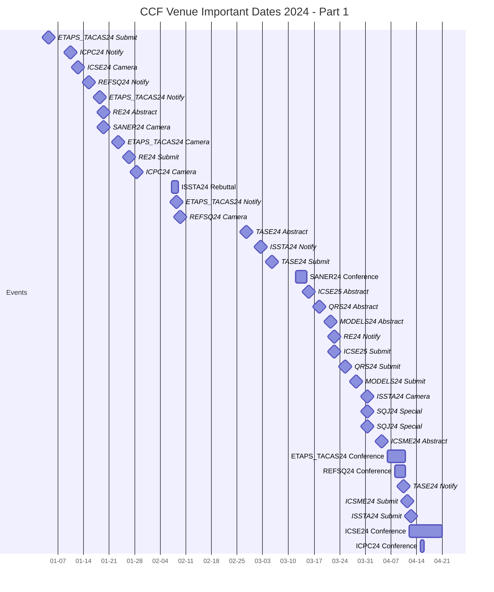
```mermaid
gantt
  title CCF Venue Important Dates 2024 - Part 1
  dateFormat YYYY-MM-DD
  axisFormat %m-%d

  section Events
  ETAPS_TACAS24 Submit :milestone, etaps_tacas_24_1_20240104, 2024-01-04, 1d
  ICPC24 Notify :milestone, icpc_24_2_20240110, 2024-01-10, 1d
  ICSE24 Camera :milestone, icse_24_3_20240112, 2024-01-12, 1d
  REFSQ24 Notify :milestone, refsq_24_4_20240115, 2024-01-15, 1d
  ETAPS_TACAS24 Notify :milestone, etaps_tacas_24_5_20240118, 2024-01-18, 1d
  RE24 Abstract :milestone, re_24_6_20240119, 2024-01-19, 1d
  SANER24 Camera :milestone, saner_24_7_20240119, 2024-01-19, 1d
  ETAPS_TACAS24 Camera :milestone, etaps_tacas_24_8_20240123, 2024-01-23, 1d
  RE24 Submit :milestone, re_24_9_20240126, 2024-01-26, 1d
  ICPC24 Camera :milestone, icpc_24_10_20240128, 2024-01-28, 1d
  ISSTA24 Rebuttal :issta_24_11_20240207, 2024-02-07, 2024-02-09
  ETAPS_TACAS24 Notify :milestone, etaps_tacas_24_12_20240208, 2024-02-08, 1d
  REFSQ24 Camera :milestone, refsq_24_13_20240209, 2024-02-09, 1d
  TASE24 Abstract :milestone, tase_24_14_20240227, 2024-02-27, 1d
  ISSTA24 Notify :milestone, issta_24_15_20240302, 2024-03-02, 1d
  TASE24 Submit :milestone, tase_24_16_20240305, 2024-03-05, 1d
  SANER24 Conference :saner_24_17_20240312, 2024-03-12, 2024-03-15
  ICSE25 Abstract :milestone, icse_25_18_20240315, 2024-03-15, 1d
  QRS24 Abstract :milestone, qrs_24_19_20240318, 2024-03-18, 1d
  MODELS24 Abstract :milestone, models_24_20_20240321, 2024-03-21, 1d
  RE24 Notify :milestone, re_24_21_20240322, 2024-03-22, 1d
  ICSE25 Submit :milestone, icse_25_22_20240322, 2024-03-22, 1d
  QRS24 Submit :milestone, qrs_24_23_20240325, 2024-03-25, 1d
  MODELS24 Submit :milestone, models_24_24_20240328, 2024-03-28, 1d
  ISSTA24 Camera :milestone, issta_24_25_20240331, 2024-03-31, 1d
  SQJ24 Special :milestone, sqj_24_26_20240331, 2024-03-31, 1d
  SQJ24 Special :milestone, sqj_24_27_20240331, 2024-03-31, 1d
  ICSME24 Abstract :milestone, icsme_24_28_20240404, 2024-04-04, 1d
  ETAPS_TACAS24 Conference :etaps_tacas_24_29_20240406, 2024-04-06, 2024-04-11
  REFSQ24 Conference :refsq_24_30_20240408, 2024-04-08, 2024-04-11
  TASE24 Notify :milestone, tase_24_31_20240410, 2024-04-10, 1d
  ICSME24 Submit :milestone, icsme_24_32_20240411, 2024-04-11, 1d
  ISSTA24 Submit :milestone, issta_24_33_20240412, 2024-04-12, 1d
  ICSE24 Conference :icse_24_34_20240412, 2024-04-12, 2024-04-21
  ICPC24 Conference :icpc_24_35_20240415, 2024-04-15, 2024-04-16
```

#### 11.2.2 2024 Mermaid 分片 2

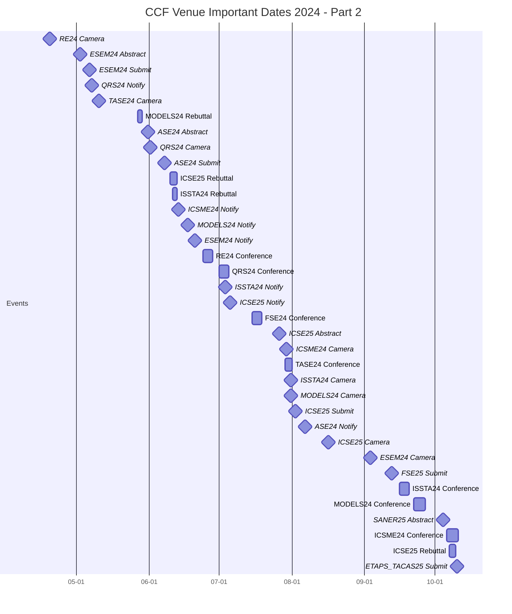
```mermaid
gantt
  title CCF Venue Important Dates 2024 - Part 2
  dateFormat YYYY-MM-DD
  axisFormat %m-%d

  section Events
  RE24 Camera :milestone, re_24_36_20240419, 2024-04-19, 1d
  ESEM24 Abstract :milestone, esem_24_37_20240502, 2024-05-02, 1d
  ESEM24 Submit :milestone, esem_24_38_20240506, 2024-05-06, 1d
  QRS24 Notify :milestone, qrs_24_39_20240507, 2024-05-07, 1d
  TASE24 Camera :milestone, tase_24_40_20240510, 2024-05-10, 1d
  MODELS24 Rebuttal :models_24_41_20240527, 2024-05-27, 2024-05-29
  ASE24 Abstract :milestone, ase_24_42_20240531, 2024-05-31, 1d
  QRS24 Camera :milestone, qrs_24_43_20240601, 2024-06-01, 1d
  ASE24 Submit :milestone, ase_24_44_20240607, 2024-06-07, 1d
  ICSE25 Rebuttal :icse_25_45_20240610, 2024-06-10, 2024-06-13
  ISSTA24 Rebuttal :issta_24_46_20240611, 2024-06-11, 2024-06-13
  ICSME24 Notify :milestone, icsme_24_47_20240613, 2024-06-13, 1d
  MODELS24 Notify :milestone, models_24_48_20240617, 2024-06-17, 1d
  ESEM24 Notify :milestone, esem_24_49_20240620, 2024-06-20, 1d
  RE24 Conference :re_24_50_20240624, 2024-06-24, 2024-06-28
  QRS24 Conference :qrs_24_51_20240701, 2024-07-01, 2024-07-05
  ISSTA24 Notify :milestone, issta_24_52_20240703, 2024-07-03, 1d
  ICSE25 Notify :milestone, icse_25_53_20240705, 2024-07-05, 1d
  FSE24 Conference :fse_24_54_20240715, 2024-07-15, 2024-07-19
  ICSE25 Abstract :milestone, icse_25_55_20240726, 2024-07-26, 1d
  ICSME24 Camera :milestone, icsme_24_56_20240729, 2024-07-29, 1d
  TASE24 Conference :tase_24_57_20240729, 2024-07-29, 2024-08-01
  ISSTA24 Camera :milestone, issta_24_58_20240731, 2024-07-31, 1d
  MODELS24 Camera :milestone, models_24_59_20240731, 2024-07-31, 1d
  ICSE25 Submit :milestone, icse_25_60_20240802, 2024-08-02, 1d
  ASE24 Notify :milestone, ase_24_61_20240806, 2024-08-06, 1d
  ICSE25 Camera :milestone, icse_25_62_20240816, 2024-08-16, 1d
  ESEM24 Camera :milestone, esem_24_63_20240903, 2024-09-03, 1d
  FSE25 Submit :milestone, fse_25_64_20240912, 2024-09-12, 1d
  ISSTA24 Conference :issta_24_65_20240916, 2024-09-16, 2024-09-20
  MODELS24 Conference :models_24_66_20240922, 2024-09-22, 2024-09-27
  SANER25 Abstract :milestone, saner_25_67_20241004, 2024-10-04, 1d
  ICSME24 Conference :icsme_24_68_20241006, 2024-10-06, 2024-10-11
  ICSE25 Rebuttal :icse_25_69_20241007, 2024-10-07, 2024-10-10
  ETAPS_TACAS25 Submit :milestone, etaps_tacas_25_70_20241010, 2024-10-10, 1d
```

#### 11.2.3 2024 Mermaid 分片 3

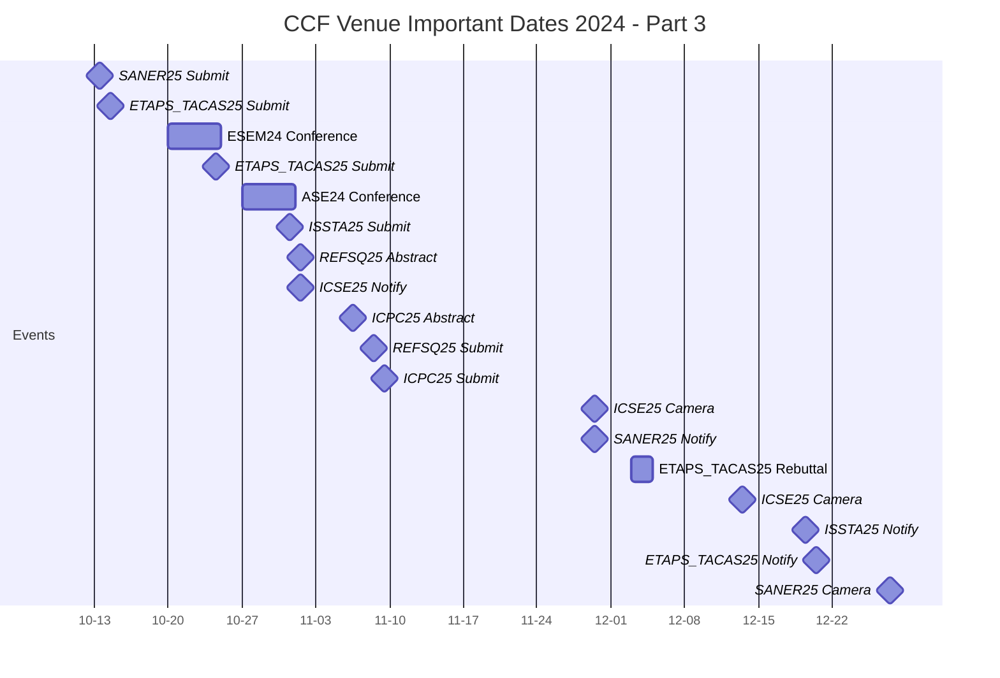
```mermaid
gantt
  title CCF Venue Important Dates 2024 - Part 3
  dateFormat YYYY-MM-DD
  axisFormat %m-%d

  section Events
  SANER25 Submit :milestone, saner_25_71_20241013, 2024-10-13, 1d
  ETAPS_TACAS25 Submit :milestone, etaps_tacas_25_72_20241014, 2024-10-14, 1d
  ESEM24 Conference :esem_24_73_20241020, 2024-10-20, 2024-10-25
  ETAPS_TACAS25 Submit :milestone, etaps_tacas_25_74_20241024, 2024-10-24, 1d
  ASE24 Conference :ase_24_75_20241027, 2024-10-27, 2024-11-01
  ISSTA25 Submit :milestone, issta_25_76_20241031, 2024-10-31, 1d
  REFSQ25 Abstract :milestone, refsq_25_77_20241101, 2024-11-01, 1d
  ICSE25 Notify :milestone, icse_25_78_20241101, 2024-11-01, 1d
  ICPC25 Abstract :milestone, icpc_25_79_20241106, 2024-11-06, 1d
  REFSQ25 Submit :milestone, refsq_25_80_20241108, 2024-11-08, 1d
  ICPC25 Submit :milestone, icpc_25_81_20241109, 2024-11-09, 1d
  ICSE25 Camera :milestone, icse_25_82_20241129, 2024-11-29, 1d
  SANER25 Notify :milestone, saner_25_83_20241129, 2024-11-29, 1d
  ETAPS_TACAS25 Rebuttal :etaps_tacas_25_84_20241203, 2024-12-03, 2024-12-05
  ICSE25 Camera :milestone, icse_25_85_20241213, 2024-12-13, 1d
  ISSTA25 Notify :milestone, issta_25_86_20241219, 2024-12-19, 1d
  ETAPS_TACAS25 Notify :milestone, etaps_tacas_25_87_20241220, 2024-12-20, 1d
  SANER25 Camera :milestone, saner_25_88_20241227, 2024-12-27, 1d
```

#### 11.2.4 PR-9 P2 Mermaid 分片

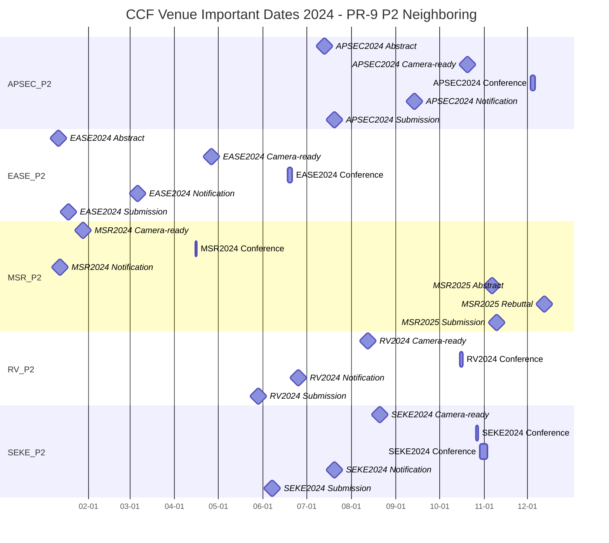
```mermaid
gantt
  title CCF Venue Important Dates 2024 - PR-9 P2 Neighboring
  dateFormat YYYY-MM-DD
  axisFormat %m-%d

  section APSEC_P2
  APSEC2024 Abstract :milestone, pr9_conf_c_apsec_2024_abstract_20240713, 2024-07-13, 1d
  APSEC2024 Camera-ready :milestone, pr9_conf_c_apsec_2024_camera_ready_20241020, 2024-10-20, 1d
  APSEC2024 Conference :pr9_conf_c_apsec_2024_conference_20241203, 2024-12-03, 2024-12-06
  APSEC2024 Notification :milestone, pr9_conf_c_apsec_2024_notification_20240913, 2024-09-13, 1d
  APSEC2024 Submission :milestone, pr9_conf_c_apsec_2024_submission_20240720, 2024-07-20, 1d

  section EASE_P2
  EASE2024 Abstract :milestone, pr9_conf_c_ease_2024_abstract_20240111, 2024-01-11, 1d
  EASE2024 Camera-ready :milestone, pr9_conf_c_ease_2024_camera_ready_20240426, 2024-04-26, 1d
  EASE2024 Conference :pr9_conf_c_ease_2024_conference_20240618, 2024-06-18, 2024-06-21
  EASE2024 Notification :milestone, pr9_conf_c_ease_2024_notification_20240306, 2024-03-06, 1d
  EASE2024 Submission :milestone, pr9_conf_c_ease_2024_submission_20240118, 2024-01-18, 1d

  section MSR_P2
  MSR2024 Camera-ready :milestone, pr9_conf_c_msr_2024_camera_ready_20240128, 2024-01-28, 1d
  MSR2024 Conference :pr9_conf_c_msr_2024_conference_20240415, 2024-04-15, 2024-04-16
  MSR2024 Notification :milestone, pr9_conf_c_msr_2024_notification_20240112, 2024-01-12, 1d
  MSR2025 Abstract :milestone, pr9_conf_c_msr_2025_abstract_20241106, 2024-11-06, 1d
  MSR2025 Rebuttal :milestone, pr9_conf_c_msr_2025_rebuttal_20241212, 2024-12-12, 1d
  MSR2025 Submission :milestone, pr9_conf_c_msr_2025_submission_20241109, 2024-11-09, 1d

  section RV_P2
  RV2024 Camera-ready :milestone, pr9_conf_c_rv_2024_camera_ready_20240812, 2024-08-12, 1d
  RV2024 Conference :pr9_conf_c_rv_2024_conference_20241015, 2024-10-15, 2024-10-17
  RV2024 Notification :milestone, pr9_conf_c_rv_2024_notification_20240625, 2024-06-25, 1d
  RV2024 Submission :milestone, pr9_conf_c_rv_2024_submission_20240528, 2024-05-28, 1d

  section SEKE_P2
  SEKE2024 Camera-ready :milestone, pr9_conf_c_seke_2024_camera_ready_20240820, 2024-08-20, 1d
  SEKE2024 Conference :pr9_conf_c_seke_2024_conference_20241026, 2024-10-26, 2024-10-28
  SEKE2024 Conference :pr9_conf_c_seke_2024_conference_20241029, 2024-10-29, 2024-11-03
  SEKE2024 Notification :milestone, pr9_conf_c_seke_2024_notification_20240720, 2024-07-20, 1d
  SEKE2024 Submission :milestone, pr9_conf_c_seke_2024_submission_20240607, 2024-06-07, 1d

```
## 12. 2023 时间线

> 当前章节按 **2023 年实际发生的事件日期** 升序排列；Venue 名称保留会议 edition。

### 12.1 2023 投稿事件总表

| 日期时间 | Venue | 类型-CCF | Track / 事项 | 日期类型 | 阶段状态 | 事件官方来源 | 年度主页 | 论文集 / 名录 | 本库年度页 | 核验状态 | 备注 |
|---|---|---|---|---|---|---|---|---|---|---|---|
| 2023-01-05 待补时刻 | [ETAPS/TACAS 2023](./conf-b-etaps/2023/README.md) | 会议-B | Artifact submission, non-TACAS tracks | Submission | ✅ 已结束 | [官方来源](https://etaps.org/2023/cfp/) | [年度主页](https://etaps.org/2023/) | [Accepted papers](https://etaps.org/2023/accepted-papers/) / [Proceedings](https://etaps.org/2023/proceedings/) / [DBLP TACAS](https://dblp.org/db/conf/tacas/index.html#2023) | [本库年度页](./conf-b-etaps/2023/README.md) | 🟡 部分核验 | 官方仅日期；时刻待补。 |
| 2023-01-13 | [EASE 2023](./conf-c-ease/2023/README.md) | 会议-C / P2 | Research abstract | Abstract | ✅ 已结束 | [官方来源](https://conf.researchr.org/dates/ease-2023) | [年度主页](https://conf.researchr.org/home/ease-2023) | [论文集 / 名录](https://conf.researchr.org/program/ease-2023/program-ease-2023/) | [本库年度页](./conf-c-ease/2023/README.md) | 🟡 部分核验 | PR-9 P2 邻近观察；官方仅日期；不升级为 P0/P1 主线。 |
| 2023-01-13 待补时刻 | [SANER 2023](./conf-b-saner/2023/README.md) | 会议-B | Camera-ready | Camera-ready | ✅ 已结束 | [SANER 2023 home](https://saner2023.must.edu.mo/) | [SANER 2023](https://saner2023.must.edu.mo/) | [IEEE proceedings](https://ieeexplore.ieee.org/xpl/conhome/10123438/proceeding) | [本库年度页](./conf-b-saner/2023/README.md) | 🟡 部分核验 | 官方仅日期；具体时刻待补。 |
| 2023-01-16 | [MSR 2023](./conf-c-msr/2023/README.md) | 会议-C / P2 | Technical abstract | Abstract | ✅ 已结束 | [官方来源](https://conf.researchr.org/dates/msr-2023) | [年度主页](https://conf.researchr.org/home/msr-2023) | [论文集 / 名录](https://conf.researchr.org/program/msr-2023/program-msr-2023/) | [本库年度页](./conf-c-msr/2023/README.md) | 🟡 部分核验 | PR-9 P2 邻近观察；官方仅日期；不升级为 P0/P1 主线。 |
| 2023-01-19 | [MSR 2023](./conf-c-msr/2023/README.md) | 会议-C / P2 | Technical paper | Submission | ✅ 已结束 | [官方来源](https://conf.researchr.org/dates/msr-2023) | [年度主页](https://conf.researchr.org/home/msr-2023) | [论文集 / 名录](https://conf.researchr.org/program/msr-2023/program-msr-2023/) | [本库年度页](./conf-c-msr/2023/README.md) | 🟡 部分核验 | PR-9 P2 邻近观察；官方仅日期；不升级为 P0/P1 主线。 |
| 2023-01-19 待补时刻 | [ETAPS/TACAS 2023](./conf-b-etaps/2023/README.md) | 会议-B | TACAS artifact notification | Notification | ✅ 已结束 | [官方来源](https://etaps.org/2023/cfp/) | [年度主页](https://etaps.org/2023/) | [Accepted papers](https://etaps.org/2023/accepted-papers/) / [Proceedings](https://etaps.org/2023/proceedings/) / [DBLP TACAS](https://dblp.org/db/conf/tacas/index.html#2023) | [本库年度页](./conf-b-etaps/2023/README.md) | 🟡 部分核验 | 官方仅日期；时刻待补。 |
| 2023-01-20 | [EASE 2023](./conf-c-ease/2023/README.md) | 会议-C / P2 | Research full paper | Submission | ✅ 已结束 | [官方来源](https://conf.researchr.org/dates/ease-2023) | [年度主页](https://conf.researchr.org/home/ease-2023) | [论文集 / 名录](https://conf.researchr.org/program/ease-2023/program-ease-2023/) | [本库年度页](./conf-c-ease/2023/README.md) | 🟡 部分核验 | PR-9 P2 邻近观察；官方仅日期；不升级为 P0/P1 主线。 |
| 2023-01-20 待补时刻 AoE | [REFSQ 2023](./conf-c-refsq/2023/README.md) | 会议-C | Research notification | Notification | ✅ 已结束 | [官方来源](https://2023.refsq.org/dates/refsq-2023) | [年度主页](https://2023.refsq.org/) | [Program](https://2023.refsq.org/program/program-refsq-2023/) / [DBLP](https://dblp.org/db/conf/refsq/refsq2023.html) | [本库年度页](./conf-c-refsq/2023/README.md) | 🟡 部分核验 | main research / research track；具体时刻待补。 |
| 2023-01-26 待补时刻 | [ETAPS/TACAS 2023](./conf-b-etaps/2023/README.md) | 会议-B | TACAS final version | Camera-ready | ✅ 已结束 | [官方来源](https://etaps.org/2023/cfp/) | [年度主页](https://etaps.org/2023/) | [Accepted papers](https://etaps.org/2023/accepted-papers/) / [Proceedings](https://etaps.org/2023/proceedings/) / [DBLP TACAS](https://dblp.org/db/conf/tacas/index.html#2023) | [本库年度页](./conf-b-etaps/2023/README.md) | 🟡 部分核验 | 官方仅日期；时刻待补。 |
| 2023-02-02 23:59 AoE | [ESEC/FSE 2023](./conf-a-fse/2023/README.md) | 会议-A | Research Papers submission | Submission | ✅ 已结束 | [官方来源](https://conf.researchr.org/track/fse-2023/fse-2023-research-papers) | [年度主页](https://conf.researchr.org/home/fse-2023) | [Program](https://conf.researchr.org/program/fse-2023/program-fse-2023/) / [DBLP](https://dblp.org/db/conf/sigsoft/fse2023.html) | [本库年度页](./conf-a-fse/2023/README.md) | 🟡 部分核验 | 年度官方名保留 ESEC/FSE。 |
| 2023-02-09 待补时刻 | [ETAPS/TACAS 2023](./conf-b-etaps/2023/README.md) | 会议-B | Artifact notification | Notification | ✅ 已结束 | [官方来源](https://etaps.org/2023/cfp/) | [年度主页](https://etaps.org/2023/) | [Accepted papers](https://etaps.org/2023/accepted-papers/) / [Proceedings](https://etaps.org/2023/proceedings/) / [DBLP TACAS](https://dblp.org/db/conf/tacas/index.html#2023) | [本库年度页](./conf-b-etaps/2023/README.md) | 🟡 部分核验 | 官方仅日期；时刻待补。 |
| 2023-02-10 待补时刻 | [ICSE 2023](./conf-a-icse/2023/README.md) | 会议-A | Technical Track camera-ready | Camera-ready | ✅ 已结束 | [官方来源](https://conf.researchr.org/track/icse-2023/icse-2023-technical-track) | [年度主页](https://conf.researchr.org/home/icse-2023) | [Program](https://conf.researchr.org/program/icse-2023/program-icse-2023/) / [DBLP](https://dblp.org/db/conf/icse/icse2023.html) | [本库年度页](./conf-a-icse/2023/README.md) | 🟡 部分核验 | 主页历史时间线回填；原 CFP 曾写 TBA。 |
| 2023-02-16 23:59 AoE | [ISSTA 2023](./conf-a-issta/2023/README.md) | 会议-A | Second round submission | Submission | ✅ 已结束 | [官方来源](https://conf.researchr.org/track/issta-2023/issta-2023-technical-papers) | [年度主页](https://conf.researchr.org/home/issta-2023) | [Program](https://conf.researchr.org/program/issta-2023/program-issta-2023/) / [DBLP](https://dblp.org/db/conf/issta/issta2023.html) | [本库年度页](./conf-a-issta/2023/README.md) | 🟡 部分核验 | Technical Papers 第二轮。 |
| 2023-02-17 待补时刻 AoE | [REFSQ 2023](./conf-c-refsq/2023/README.md) | 会议-C | Research camera-ready | Camera-ready | ✅ 已结束 | [官方来源](https://2023.refsq.org/dates/refsq-2023) | [年度主页](https://2023.refsq.org/) | [Program](https://2023.refsq.org/program/program-refsq-2023/) / [DBLP](https://dblp.org/db/conf/refsq/refsq2023.html) | [本库年度页](./conf-c-refsq/2023/README.md) | 🟡 部分核验 | main research / research track；具体时刻待补。 |
| 2023-02-17 待补时刻 | [TASE 2023](./conf-c-tase/2023/README.md) | 会议-C | Abstract due extended | Abstract | ✅ 已结束 | [TASE 2023 official source](https://plrg-bristol.github.io/tase2023/cfp.html) | [TASE 2023](https://plrg-bristol.github.io/tase2023/) | [Accepted Papers](https://plrg-bristol.github.io/tase2023/accepted-papers.html) / [Proceedings](https://link.springer.com/book/10.1007/978-3-031-35257-7) / [DBLP](https://dblp.org/db/conf/tase/tase2023.html) | [本库年度页](./conf-c-tase/2023/README.md) | 🟡 部分核验 | TASE official accepted list、Springer TOC 与 DBLP 计数需分列；不混成单一论文数。 |
| 2023-02-21 待补时刻 | [ICPC 2023](./conf-b-icpc/2023/README.md) | 会议-B | Research Track final notification | Notification | ✅ 已结束 | [ICPC 2023 dates](https://conf.researchr.org/dates/icpc-2023) | [ICPC 2023](https://conf.researchr.org/home/icpc-2023) | [DBLP 2023](https://dblp.org/db/conf/iwpc/icpc2023) | [本库年度页](./conf-b-icpc/2023/README.md) | 🟡 部分核验 | 官方仅日期；具体时刻待补。 |
| 2023-02-22 至 2023-02-24 | [MSR 2023](./conf-c-msr/2023/README.md) | 会议-C / P2 | Technical response | Rebuttal | ✅ 已结束 | [官方来源](https://conf.researchr.org/dates/msr-2023) | [年度主页](https://conf.researchr.org/home/msr-2023) | [论文集 / 名录](https://conf.researchr.org/program/msr-2023/program-msr-2023/) | [本库年度页](./conf-c-msr/2023/README.md) | 🟡 部分核验 | PR-9 P2 邻近观察；官方仅日期；不升级为 P0/P1 主线。 |
| 2023-02-24 待补时刻 | [TASE 2023](./conf-c-tase/2023/README.md) | 会议-C | Paper submission extended | Submission | ✅ 已结束 | [TASE 2023 official source](https://plrg-bristol.github.io/tase2023/cfp.html) | [TASE 2023](https://plrg-bristol.github.io/tase2023/) | [Accepted Papers](https://plrg-bristol.github.io/tase2023/accepted-papers.html) / [Proceedings](https://link.springer.com/book/10.1007/978-3-031-35257-7) / [DBLP](https://dblp.org/db/conf/tase/tase2023.html) | [本库年度页](./conf-c-tase/2023/README.md) | 🟡 部分核验 | TASE official accepted list、Springer TOC 与 DBLP 计数需分列；不混成单一论文数。 |
| 2023-03-06 | [EASE 2023](./conf-c-ease/2023/README.md) | 会议-C / P2 | Research notification | Notification | ✅ 已结束 | [官方来源](https://conf.researchr.org/dates/ease-2023) | [年度主页](https://conf.researchr.org/home/ease-2023) | [论文集 / 名录](https://conf.researchr.org/program/ease-2023/program-ease-2023/) | [本库年度页](./conf-c-ease/2023/README.md) | 🟡 部分核验 | PR-9 P2 邻近观察；官方仅日期；不升级为 P0/P1 主线。 |
| 2023-03-07 | [MSR 2023](./conf-c-msr/2023/README.md) | 会议-C / P2 | Technical notification | Notification | ✅ 已结束 | [官方来源](https://conf.researchr.org/dates/msr-2023) | [年度主页](https://conf.researchr.org/home/msr-2023) | [论文集 / 名录](https://conf.researchr.org/program/msr-2023/program-msr-2023/) | [本库年度页](./conf-c-msr/2023/README.md) | 🟡 部分核验 | PR-9 P2 邻近观察；官方仅日期；不升级为 P0/P1 主线。 |
| 2023-03-10 待补时刻 AoE | [RE 2023](./conf-b-re/2023/README.md) | 会议-B | Research Papers abstract | Abstract | ✅ 已结束 | [官方来源](https://conf.researchr.org/dates/RE-2023) | [年度主页](https://conf.researchr.org/home/RE-2023) | [Program](https://conf.researchr.org/program/RE-2023/program-RE-2023/) / [DBLP](https://dblp.org/db/conf/re/re2023.html) | [本库年度页](./conf-b-re/2023/README.md) | 🟡 部分核验 | main research / research track；具体时刻待补。 |
| 2023-03-13 待补时刻 | [ICPC 2023](./conf-b-icpc/2023/README.md) | 会议-B | Research Track camera-ready | Camera-ready | ✅ 已结束 | [ICPC 2023 dates](https://conf.researchr.org/dates/icpc-2023) | [ICPC 2023](https://conf.researchr.org/home/icpc-2023) | [DBLP 2023](https://dblp.org/db/conf/iwpc/icpc2023) | [本库年度页](./conf-b-icpc/2023/README.md) | 🟡 部分核验 | 官方仅日期；具体时刻待补。 |
| 2023-03-15 | [SEKE 2023](./conf-c-seke/2023/README.md) | 会议-C / P2 | Paper submission due | Submission | ✅ 已结束 | [官方来源](https://ksiresearch.org/seke/seke23main.html) | [年度主页](https://ksiresearch.org/seke/seke23.html) | [论文集 / 名录](https://ksiresearch.org/seke/seke23pgm.html) | [本库年度页](./conf-c-seke/2023/README.md) | 🟡 部分核验 | PR-9 P2 邻近观察；Midnight EST / extended hard deadline；不升级为 P0/P1 主线。 |
| 2023-03-16 | [MSR 2023](./conf-c-msr/2023/README.md) | 会议-C / P2 | Technical camera-ready | Camera-ready | ✅ 已结束 | [官方来源](https://conf.researchr.org/dates/msr-2023) | [年度主页](https://conf.researchr.org/home/msr-2023) | [论文集 / 名录](https://conf.researchr.org/program/msr-2023/program-msr-2023/) | [本库年度页](./conf-c-msr/2023/README.md) | 🟡 部分核验 | PR-9 P2 邻近观察；官方仅日期；不升级为 P0/P1 主线。 |
| 2023-03-17 待补时刻 AoE | [RE 2023](./conf-b-re/2023/README.md) | 会议-B | Research Papers submission | Submission | ✅ 已结束 | [官方来源](https://conf.researchr.org/dates/RE-2023) | [年度主页](https://conf.researchr.org/home/RE-2023) | [Program](https://conf.researchr.org/program/RE-2023/program-RE-2023/) / [DBLP](https://dblp.org/db/conf/re/re2023.html) | [本库年度页](./conf-b-re/2023/README.md) | 🟡 部分核验 | main research / research track；具体时刻待补。 |
| 2023-03-21 至 2023-03-24 | [SANER 2023](./conf-b-saner/2023/README.md) | 会议-B | Conference dates | Conference | ✅ 已结束 | [SANER 2023 home](https://saner2023.must.edu.mo/) | [SANER 2023](https://saner2023.must.edu.mo/) | [DBLP 2023](https://dblp.org/db/conf/wcre/saner2023) | [本库年度页](./conf-b-saner/2023/README.md) | 🟡 部分核验 | Macao SAR, China。 |
| 2023-03-29 待补时刻 | [ICSE 2024](./conf-a-icse/2024/README.md) | 会议-A | Research Track submission, cycle 1 | Submission | ✅ 已结束 | [官方来源](https://conf.researchr.org/track/icse-2024/icse-2024-research-track) | [年度主页](https://conf.researchr.org/home/icse-2024) | [Program](https://conf.researchr.org/program/icse-2024/program-icse-2024/) / [DBLP](https://dblp.org/db/conf/icse/icse2024.html) | [本库年度页](./conf-a-icse/2024/README.md) | 🟡 部分核验 | 官方仅日期，AoE / UTC-12h；时刻待补。 |
| 2023-04-07 待补时刻 | [MoDELS 2023](./conf-b-models/2023/README.md) | 会议-B | Technical Track abstract | Abstract | ✅ 已结束 | [官方来源](https://conf.researchr.org/dates/models-2023) | [年度主页](https://conf.researchr.org/home/models-2023) | [FT](https://conf.researchr.org/info/models-2023/accepted-papers---ft) / [PT](https://conf.researchr.org/info/models-2023/accepted-papers---pt) / [DBLP](https://dblp.org/db/conf/models/models2023.html) | [本库年度页](./conf-b-models/2023/README.md) | 🟡 部分核验 | 官方仅日期；时刻待补。 |
| 2023-04-10 待补时刻 | [TASE 2023](./conf-c-tase/2023/README.md) | 会议-C | Notification | Notification | ✅ 已结束 | [TASE 2023 official source](https://plrg-bristol.github.io/tase2023/cfp.html) | [TASE 2023](https://plrg-bristol.github.io/tase2023/) | [Accepted Papers](https://plrg-bristol.github.io/tase2023/accepted-papers.html) / [Proceedings](https://link.springer.com/book/10.1007/978-3-031-35257-7) / [DBLP](https://dblp.org/db/conf/tase/tase2023.html) | [本库年度页](./conf-c-tase/2023/README.md) | 🟡 部分核验 | TASE official accepted list、Springer TOC 与 DBLP 计数需分列；不混成单一论文数。 |
| 2023-04-14 待补时刻 | [MoDELS 2023](./conf-b-models/2023/README.md) | 会议-B | Technical Track submission | Submission | ✅ 已结束 | [官方来源](https://conf.researchr.org/dates/models-2023) | [年度主页](https://conf.researchr.org/home/models-2023) | [FT](https://conf.researchr.org/info/models-2023/accepted-papers---ft) / [PT](https://conf.researchr.org/info/models-2023/accepted-papers---pt) / [DBLP](https://dblp.org/db/conf/models/models2023.html) | [本库年度页](./conf-b-models/2023/README.md) | 🟡 部分核验 | 官方仅日期；时刻待补。 |
| 2023-04-17 至 2023-04-20 | [REFSQ 2023](./conf-c-refsq/2023/README.md) | 会议-C | Conference dates | Conference | ✅ 已结束 | [官方来源](https://2023.refsq.org/dates/refsq-2023) | [年度主页](https://2023.refsq.org/) | [Program](https://2023.refsq.org/program/program-refsq-2023/) / [DBLP](https://dblp.org/db/conf/refsq/refsq2023.html) | [本库年度页](./conf-c-refsq/2023/README.md) | 🟡 部分核验 | REFSQ official dates；Springer / DBLP 入口分散时以年度页说明为准。 |
| 2023-04-20 | [SEKE 2023](./conf-c-seke/2023/README.md) | 会议-C / P2 | Notification | Notification | ✅ 已结束 | [官方来源](https://ksiresearch.org/seke/seke23main.html) | [年度主页](https://ksiresearch.org/seke/seke23.html) | [论文集 / 名录](https://ksiresearch.org/seke/seke23pgm.html) | [本库年度页](./conf-c-seke/2023/README.md) | 🟡 部分核验 | PR-9 P2 邻近观察；官方仅日期；不升级为 P0/P1 主线。 |
| 2023-04-20 待补时刻 | [ICSME 2023](./conf-b-icsme/2023/README.md) | 会议-B | Research Papers abstract | Abstract | ✅ 已结束 | [ICSME 2023 Research Track](https://conf.researchr.org/track/icsme-2023/icsme-2023-papers) | [ICSME 2023 Research Track](https://conf.researchr.org/track/icsme-2023/icsme-2023-papers) | [DBLP 2023](https://dblp.org/db/conf/icsm/icsme2023) | [本库年度页](./conf-b-icsme/2023/README.md) | 🟡 部分核验 | 官方仅日期；具体时刻待补。 |
| 2023-04-22 至 2023-04-27 | [ETAPS/TACAS 2023](./conf-b-etaps/2023/README.md) | 会议-B | ETAPS conference dates | Conference | ✅ 已结束 | [官方来源](https://etaps.org/2023/cfp/) | [年度主页](https://etaps.org/2023/) | [Accepted papers](https://etaps.org/2023/accepted-papers/) / [Proceedings](https://etaps.org/2023/proceedings/) / [DBLP TACAS](https://dblp.org/db/conf/tacas/index.html#2023) | [本库年度页](./conf-b-etaps/2023/README.md) | 🟡 部分核验 | Paris, France。 |
| 2023-04-24 待补时刻 | [ESEM 2023](./conf-b-esem/2023/README.md) | 会议-B | Technical Track abstract | Abstract | ✅ 已结束 | [Important Dates](https://conf.researchr.org/dates/esem-2023) | [ESEIW 2023](https://conf.researchr.org/home/esem-2023) | [Program](https://conf.researchr.org/program/esem-2023/program-esem-2023/) / [DBLP](https://dblp.org/db/conf/esem/esem2023.html) | [本库年度页](./conf-b-esem/2023/README.md) | 🟡 部分核验 | 官方仅给日期；ESEM Technical Papers。 |
| 2023-04-27 待补时刻 | [ICSME 2023](./conf-b-icsme/2023/README.md) | 会议-B | Research Papers submission | Submission | ✅ 已结束 | [ICSME 2023 Research Track](https://conf.researchr.org/track/icsme-2023/icsme-2023-papers) | [ICSME 2023 Research Track](https://conf.researchr.org/track/icsme-2023/icsme-2023-papers) | [DBLP 2023](https://dblp.org/db/conf/icsm/icsme2023) | [本库年度页](./conf-b-icsme/2023/README.md) | 🟡 部分核验 | 官方仅日期；具体时刻待补。 |
| 2023-04-28 | [EASE 2023](./conf-c-ease/2023/README.md) | 会议-C / P2 | Camera-ready | Camera-ready | ✅ 已结束 | [官方来源](https://conf.researchr.org/dates/ease-2023) | [年度主页](https://conf.researchr.org/home/ease-2023) | [论文集 / 名录](https://conf.researchr.org/program/ease-2023/program-ease-2023/) | [本库年度页](./conf-c-ease/2023/README.md) | 🟡 部分核验 | PR-9 P2 邻近观察；官方仅日期；不升级为 P0/P1 主线。 |
| 2023-04-28 待补时刻 AoE | [ASE 2023](./conf-a-ase/2023/README.md) | 会议-A | Abstract submission | Abstract | ✅ 已结束 | [官方来源](https://conf.researchr.org/track/ase-2023/ase-2023-papers) | [年度主页](https://conf.researchr.org/home/ase-2023) | [Program](https://conf.researchr.org/program/ase-2023/program-ase-2023/) / [DBLP](https://dblp.org/db/conf/kbse/ase2023.html) | [本库年度页](./conf-a-ase/2023/README.md) | 🟡 部分核验 |  |
| 2023-05-01 待补时刻 | [TASE 2023](./conf-c-tase/2023/README.md) | 会议-C | Camera-ready | Camera-ready | ✅ 已结束 | [TASE 2023 official source](https://plrg-bristol.github.io/tase2023/cfp.html) | [TASE 2023](https://plrg-bristol.github.io/tase2023/) | [Accepted Papers](https://plrg-bristol.github.io/tase2023/accepted-papers.html) / [Proceedings](https://link.springer.com/book/10.1007/978-3-031-35257-7) / [DBLP](https://dblp.org/db/conf/tase/tase2023.html) | [本库年度页](./conf-c-tase/2023/README.md) | 🟡 部分核验 | TASE official accepted list、Springer TOC 与 DBLP 计数需分列；不混成单一论文数。 |
| 2023-05-02 待补时刻 | [ESEM 2023](./conf-b-esem/2023/README.md) | 会议-B | Technical Track submission | Submission | ✅ 已结束 | [Important Dates](https://conf.researchr.org/dates/esem-2023) | [ESEIW 2023](https://conf.researchr.org/home/esem-2023) | [Program](https://conf.researchr.org/program/esem-2023/program-esem-2023/) / [DBLP](https://dblp.org/db/conf/esem/esem2023.html) | [本库年度页](./conf-b-esem/2023/README.md) | 🟡 部分核验 | 官方仅给日期；具体时刻待补。 |
| 2023-05-05 待补时刻 AoE | [ASE 2023](./conf-a-ase/2023/README.md) | 会议-A | Paper submission | Submission | ✅ 已结束 | [官方来源](https://conf.researchr.org/track/ase-2023/ase-2023-papers) | [年度主页](https://conf.researchr.org/home/ase-2023) | [Program](https://conf.researchr.org/program/ase-2023/program-ase-2023/) / [DBLP](https://dblp.org/db/conf/kbse/ase2023.html) | [本库年度页](./conf-a-ase/2023/README.md) | 🟡 部分核验 |  |
| 2023-05-10 | [SEKE 2023](./conf-c-seke/2023/README.md) | 会议-C / P2 | Camera-ready | Camera-ready | ✅ 已结束 | [官方来源](https://ksiresearch.org/seke/seke23main.html) | [年度主页](https://ksiresearch.org/seke/seke23.html) | [论文集 / 名录](https://ksiresearch.org/seke/seke23pgm.html) | [本库年度页](./conf-c-seke/2023/README.md) | 🟡 部分核验 | PR-9 P2 邻近观察；官方仅日期；不升级为 P0/P1 主线。 |
| 2023-05-14 至 2023-05-20 | [ICSE 2023](./conf-a-icse/2023/README.md) | 会议-A | Conference dates | Conference | ✅ 已结束 | [官方来源](https://conf.researchr.org/track/icse-2023/icse-2023-technical-track) | [年度主页](https://conf.researchr.org/home/icse-2023) | [Program](https://conf.researchr.org/program/icse-2023/program-icse-2023/) / [DBLP](https://dblp.org/db/conf/icse/icse2023.html) | [本库年度页](./conf-a-icse/2023/README.md) | 🟡 部分核验 | Melbourne, Australia。 |
| 2023-05-15 至 2023-05-16 | [ICPC 2023](./conf-b-icpc/2023/README.md) | 会议-B | Conference dates | Conference | ✅ 已结束 | [ICPC 2023 home](https://conf.researchr.org/home/icpc-2023) | [ICPC 2023](https://conf.researchr.org/home/icpc-2023) | [DBLP 2023](https://dblp.org/db/conf/iwpc/icpc2023) | [本库年度页](./conf-b-icpc/2023/README.md) | 🟡 部分核验 | 官方仅日期；具体时刻待补。 |
| 2023-05-15 至 2023-05-16 | [MSR 2023](./conf-c-msr/2023/README.md) | 会议-C / P2 | Conference | Conference | ✅ 已结束 | [官方来源](https://conf.researchr.org/dates/msr-2023) | [年度主页](https://conf.researchr.org/home/msr-2023) | [论文集 / 名录](https://conf.researchr.org/program/msr-2023/program-msr-2023/) | [本库年度页](./conf-c-msr/2023/README.md) | 🟡 部分核验 | PR-9 P2 邻近观察；program page source；不升级为 P0/P1 主线。 |
| 2023-05-30 待补时刻 AoE | [RE 2023](./conf-b-re/2023/README.md) | 会议-B | Research Papers notification | Notification | ✅ 已结束 | [官方来源](https://conf.researchr.org/dates/RE-2023) | [年度主页](https://conf.researchr.org/home/RE-2023) | [Program](https://conf.researchr.org/program/RE-2023/program-RE-2023/) / [DBLP](https://dblp.org/db/conf/re/re2023.html) | [本库年度页](./conf-b-re/2023/README.md) | 🟡 部分核验 | main research / research track；具体时刻待补。 |
| 2023-06-02 待补时刻 | [ICSE 2024](./conf-a-icse/2024/README.md) | 会议-A | Research Track notification, cycle 1 | Notification | ✅ 已结束 | [官方来源](https://conf.researchr.org/track/icse-2024/icse-2024-research-track) | [年度主页](https://conf.researchr.org/home/icse-2024) | [Program](https://conf.researchr.org/program/icse-2024/program-icse-2024/) / [DBLP](https://dblp.org/db/conf/icse/icse2024.html) | [本库年度页](./conf-a-icse/2024/README.md) | 🟡 部分核验 | 官方仅日期；时刻待补。 |
| 2023-06-04 | [RV 2023](./conf-c-rv/2023/README.md) | 会议-C / P2 | Paper submission | Submission | ✅ 已结束 | [官方来源](https://rv23.csd.auth.gr/calls) | [年度主页](https://rv23.csd.auth.gr/) | [论文集 / 名录](https://easychair.org/smart-program/RV2023/) | [本库年度页](./conf-c-rv/2023/README.md) | 🟡 部分核验 | PR-9 P2 邻近观察；AoE / extended；不升级为 P0/P1 主线。 |
| 2023-06-05 至 2023-06-07 | [MoDELS 2023](./conf-b-models/2023/README.md) | 会议-B | Technical Track author response | Rebuttal | ✅ 已结束 | [官方来源](https://conf.researchr.org/dates/models-2023) | [年度主页](https://conf.researchr.org/home/models-2023) | [FT](https://conf.researchr.org/info/models-2023/accepted-papers---ft) / [PT](https://conf.researchr.org/info/models-2023/accepted-papers---pt) / [DBLP](https://dblp.org/db/conf/models/models2023.html) | [本库年度页](./conf-b-models/2023/README.md) | 🟡 部分核验 | 官方仅日期；时刻待补。 |
| 2023-06-13 至 2023-06-16 | [EASE 2023](./conf-c-ease/2023/README.md) | 会议-C / P2 | Conference | Conference | ✅ 已结束 | [官方来源](https://conf.researchr.org/dates/ease-2023) | [年度主页](https://conf.researchr.org/home/ease-2023) | [论文集 / 名录](https://conf.researchr.org/program/ease-2023/program-ease-2023/) | [本库年度页](./conf-c-ease/2023/README.md) | 🟡 部分核验 | PR-9 P2 邻近观察；Oulu local time；不升级为 P0/P1 主线。 |
| 2023-06-16 待补时刻 | [ESEM 2023](./conf-b-esem/2023/README.md) | 会议-B | Technical Track notification | Notification | ✅ 已结束 | [Important Dates](https://conf.researchr.org/dates/esem-2023) | [ESEIW 2023](https://conf.researchr.org/home/esem-2023) | [Program](https://conf.researchr.org/program/esem-2023/program-esem-2023/) / [DBLP](https://dblp.org/db/conf/esem/esem2023.html) | [本库年度页](./conf-b-esem/2023/README.md) | 🟡 部分核验 | 官方仅给日期；具体时刻待补。 |
| 2023-06-24 待补时刻 | [ICSME 2023](./conf-b-icsme/2023/README.md) | 会议-B | Research Papers notification | Notification | ✅ 已结束 | [ICSME 2023 Research Track](https://conf.researchr.org/track/icsme-2023/icsme-2023-papers) | [ICSME 2023 Research Track](https://conf.researchr.org/track/icsme-2023/icsme-2023-papers) | [DBLP 2023](https://dblp.org/db/conf/icsm/icsme2023) | [本库年度页](./conf-b-icsme/2023/README.md) | 🟡 部分核验 | 官方仅日期；具体时刻待补。 |
| 2023-06-26 待补时刻 | [MoDELS 2023](./conf-b-models/2023/README.md) | 会议-B | Technical Track notification | Notification | ✅ 已结束 | [官方来源](https://conf.researchr.org/dates/models-2023) | [年度主页](https://conf.researchr.org/home/models-2023) | [FT](https://conf.researchr.org/info/models-2023/accepted-papers---ft) / [PT](https://conf.researchr.org/info/models-2023/accepted-papers---pt) / [DBLP](https://dblp.org/db/conf/models/models2023.html) | [本库年度页](./conf-b-models/2023/README.md) | 🟡 部分核验 | 官方仅日期；时刻待补。 |
| 2023-06-30 待补时刻 AoE | [RE 2023](./conf-b-re/2023/README.md) | 会议-B | Research Papers camera-ready | Camera-ready | ✅ 已结束 | [官方来源](https://conf.researchr.org/dates/RE-2023) | [年度主页](https://conf.researchr.org/home/RE-2023) | [Program](https://conf.researchr.org/program/RE-2023/program-RE-2023/) / [DBLP](https://dblp.org/db/conf/re/re2023.html) | [本库年度页](./conf-b-re/2023/README.md) | 🟡 部分核验 | main research / research track；具体时刻待补。 |
| 2023-07-01 至 2023-07-03 | [SEKE 2023](./conf-c-seke/2023/README.md) | 会议-C / P2 | Live conference | Conference | ✅ 已结束 | [官方来源](https://ksiresearch.org/seke/seke23main.html) | [年度主页](https://ksiresearch.org/seke/seke23.html) | [论文集 / 名录](https://ksiresearch.org/seke/seke23pgm.html) | [本库年度页](./conf-c-seke/2023/README.md) | 🟡 部分核验 | PR-9 P2 邻近观察；South San Francisco local time；不升级为 P0/P1 主线。 |
| 2023-07-04 至 2023-07-06 | [TASE 2023](./conf-c-tase/2023/README.md) | 会议-C | Conference dates | Conference | ✅ 已结束 | [TASE 2023 official source](https://plrg-bristol.github.io/tase2023/cfp.html) | [TASE 2023](https://plrg-bristol.github.io/tase2023/) | [Accepted Papers](https://plrg-bristol.github.io/tase2023/accepted-papers.html) / [Proceedings](https://link.springer.com/book/10.1007/978-3-031-35257-7) / [DBLP](https://dblp.org/db/conf/tase/tase2023.html) | [本库年度页](./conf-c-tase/2023/README.md) | 🟡 部分核验 | TASE official accepted list、Springer TOC 与 DBLP 计数需分列；不混成单一论文数。 |
| 2023-07-05 至 2023-07-10 | [SEKE 2023](./conf-c-seke/2023/README.md) | 会议-C / P2 | Virtual conference | Conference | ✅ 已结束 | [官方来源](https://ksiresearch.org/seke/seke23main.html) | [年度主页](https://ksiresearch.org/seke/seke23.html) | [论文集 / 名录](https://ksiresearch.org/seke/seke23pgm.html) | [本库年度页](./conf-c-seke/2023/README.md) | 🟡 部分核验 | PR-9 P2 邻近观察；virtual；不升级为 P0/P1 主线。 |
| 2023-07-07 | [APSEC 2023](./conf-c-apsec/2023/README.md) | 会议-C / P2 | Technical abstract | Abstract | ✅ 已结束 | [官方来源](https://conf.researchr.org/dates/apsec-2023) | [年度主页](https://conf.researchr.org/home/apsec-2023) | [论文集 / 名录](https://conf.researchr.org/program/apsec-2023/program-apsec-2023/) | [本库年度页](./conf-c-apsec/2023/README.md) | 🟡 部分核验 | PR-9 P2 邻近观察；AoE / UTC-12h；不升级为 P0/P1 主线。 |
| 2023-07-07 | [RV 2023](./conf-c-rv/2023/README.md) | 会议-C / P2 | Notification | Notification | ✅ 已结束 | [官方来源](https://rv23.csd.auth.gr/calls) | [年度主页](https://rv23.csd.auth.gr/) | [论文集 / 名录](https://easychair.org/smart-program/RV2023/) | [本库年度页](./conf-c-rv/2023/README.md) | 🟡 部分核验 | PR-9 P2 邻近观察；AoE / extended；不升级为 P0/P1 主线。 |
| 2023-07-07 待补时刻 | [ESEM 2023](./conf-b-esem/2023/README.md) | 会议-B | Technical Track camera-ready | Camera-ready | ✅ 已结束 | [Important Dates](https://conf.researchr.org/dates/esem-2023) | [ESEIW 2023](https://conf.researchr.org/home/esem-2023) | [Program](https://conf.researchr.org/program/esem-2023/program-esem-2023/) / [DBLP](https://dblp.org/db/conf/esem/esem2023.html) | [本库年度页](./conf-b-esem/2023/README.md) | 🟡 部分核验 | 官方仅给日期；具体时刻待补。 |
| 2023-07-10 待补时刻 | [ICSE 2024](./conf-a-icse/2024/README.md) | 会议-A | Research Track revision due, cycle 1 | Camera-ready | ✅ 已结束 | [官方来源](https://conf.researchr.org/track/icse-2024/icse-2024-research-track) | [年度主页](https://conf.researchr.org/home/icse-2024) | [Program](https://conf.researchr.org/program/icse-2024/program-icse-2024/) / [DBLP](https://dblp.org/db/conf/icse/icse2024.html) | [本库年度页](./conf-a-icse/2024/README.md) | 🟡 部分核验 | 官方仅日期；时刻待补。 |
| 2023-07-10 待补时刻 | [MoDELS 2023](./conf-b-models/2023/README.md) | 会议-B | Technical Track camera-ready | Camera-ready | ✅ 已结束 | [官方来源](https://conf.researchr.org/dates/models-2023) | [年度主页](https://conf.researchr.org/home/models-2023) | [FT](https://conf.researchr.org/info/models-2023/accepted-papers---ft) / [PT](https://conf.researchr.org/info/models-2023/accepted-papers---pt) / [DBLP](https://dblp.org/db/conf/models/models2023.html) | [本库年度页](./conf-b-models/2023/README.md) | 🟡 部分核验 | 官方仅日期；时刻待补。 |
| 2023-07-14 | [APSEC 2023](./conf-c-apsec/2023/README.md) | 会议-C / P2 | Technical paper | Submission | ✅ 已结束 | [官方来源](https://conf.researchr.org/dates/apsec-2023) | [年度主页](https://conf.researchr.org/home/apsec-2023) | [论文集 / 名录](https://conf.researchr.org/program/apsec-2023/program-apsec-2023/) | [本库年度页](./conf-c-apsec/2023/README.md) | 🟡 部分核验 | PR-9 P2 邻近观察；AoE / UTC-12h；不升级为 P0/P1 主线。 |
| 2023-07-17 待补时刻 AoE | [ASE 2023](./conf-a-ase/2023/README.md) | 会议-A | Author notification | Notification | ✅ 已结束 | [官方来源](https://conf.researchr.org/track/ase-2023/ase-2023-papers) | [年度主页](https://conf.researchr.org/home/ase-2023) | [Program](https://conf.researchr.org/program/ase-2023/program-ase-2023/) / [DBLP](https://dblp.org/db/conf/kbse/ase2023.html) | [本库年度页](./conf-a-ase/2023/README.md) | 🟡 部分核验 |  |
| 2023-07-17 至 2023-07-21 | [ISSTA 2023](./conf-a-issta/2023/README.md) | 会议-A | Conference dates | Conference | ✅ 已结束 | [官方来源](https://conf.researchr.org/home/issta-2023) | [年度主页](https://conf.researchr.org/home/issta-2023) | [Program](https://conf.researchr.org/program/issta-2023/program-issta-2023/) / [DBLP](https://dblp.org/db/conf/issta/issta2023.html) | [本库年度页](./conf-a-issta/2023/README.md) | 🟡 部分核验 | Seattle, Washington；与 ECOOP and ISSTA 2023 co-located，计数只按 ISSTA 独立入口。 |
| 2023-07-30 | [RV 2023](./conf-c-rv/2023/README.md) | 会议-C / P2 | Camera-ready | Camera-ready | ✅ 已结束 | [官方来源](https://rv23.csd.auth.gr/calls) | [年度主页](https://rv23.csd.auth.gr/) | [论文集 / 名录](https://easychair.org/smart-program/RV2023/) | [本库年度页](./conf-c-rv/2023/README.md) | 🟡 部分核验 | PR-9 P2 邻近观察；AoE；不升级为 P0/P1 主线。 |
| 2023-07-31 待补时刻 | [ICSME 2023](./conf-b-icsme/2023/README.md) | 会议-B | Research Papers camera-ready | Camera-ready | ✅ 已结束 | [ICSME 2023 Research Track](https://conf.researchr.org/track/icsme-2023/icsme-2023-papers) | [ICSME 2023 Research Track](https://conf.researchr.org/track/icsme-2023/icsme-2023-papers) | [DBLP 2023](https://dblp.org/db/conf/icsm/icsme2023) | [本库年度页](./conf-b-icsme/2023/README.md) | 🟡 部分核验 | 官方仅日期；具体时刻待补。 |
| 2023-07-31 待补时刻 | [QRS 2023](./conf-c-qrs/2023/README.md) | 会议-C | Abstract due | Abstract | ✅ 已结束 | [QRS 2023 official source](https://qrs23.techconf.org/) | [QRS 2023](https://qrs23.techconf.org/) | [Proceedings policy](https://qrs23.techconf.org/track/proceeding) / [DBLP](https://dblp.org/db/conf/qrs/qrs2023.html) | [本库年度页](./conf-c-qrs/2023/README.md) | 🟡 部分核验 | Regular / short、workshop / special track、proceedings policy / DBLP fallback 分开记录；不把 proceedings policy 页或整本 proceedings fallback 当作 main research count；IEEE Xplore proceedings TOC 待补。 |
| 2023-08-01 待补时刻 | [ICSE 2024](./conf-a-icse/2024/README.md) | 会议-A | Research Track submission, cycle 2 | Submission | ✅ 已结束 | [官方来源](https://conf.researchr.org/track/icse-2024/icse-2024-research-track) | [年度主页](https://conf.researchr.org/home/icse-2024) | [Program](https://conf.researchr.org/program/icse-2024/program-icse-2024/) / [DBLP](https://dblp.org/db/conf/icse/icse2024.html) | [本库年度页](./conf-a-icse/2024/README.md) | 🟡 部分核验 | 官方仅日期，AoE / UTC-12h；时刻待补。 |
| 2023-08-07 待补时刻 | [QRS 2023](./conf-c-qrs/2023/README.md) | 会议-C | Regular and Short papers due | Submission | ✅ 已结束 | [QRS 2023 official source](https://qrs23.techconf.org/) | [QRS 2023](https://qrs23.techconf.org/) | [Proceedings policy](https://qrs23.techconf.org/track/proceeding) / [DBLP](https://dblp.org/db/conf/qrs/qrs2023.html) | [本库年度页](./conf-c-qrs/2023/README.md) | 🟡 部分核验 | Regular / short、workshop / special track、proceedings policy / DBLP fallback 分开记录；不把 proceedings policy 页或整本 proceedings fallback 当作 main research count；IEEE Xplore proceedings TOC 待补。 |
| 2023-08-23 | [APSEC 2023](./conf-c-apsec/2023/README.md) | 会议-C / P2 | Technical notification | Notification | ✅ 已结束 | [官方来源](https://conf.researchr.org/dates/apsec-2023) | [年度主页](https://conf.researchr.org/home/apsec-2023) | [论文集 / 名录](https://conf.researchr.org/program/apsec-2023/program-apsec-2023/) | [本库年度页](./conf-c-apsec/2023/README.md) | 🟡 部分核验 | PR-9 P2 邻近观察；AoE / UTC-12h；不升级为 P0/P1 主线。 |
| 2023-08-24 待补时刻 | [ICSE 2024](./conf-a-icse/2024/README.md) | 会议-A | Research Track final decision, cycle 1 | Notification | ✅ 已结束 | [官方来源](https://conf.researchr.org/track/icse-2024/icse-2024-research-track) | [年度主页](https://conf.researchr.org/home/icse-2024) | [Program](https://conf.researchr.org/program/icse-2024/program-icse-2024/) / [DBLP](https://dblp.org/db/conf/icse/icse2024.html) | [本库年度页](./conf-a-icse/2024/README.md) | 🟡 部分核验 | 官方仅日期；时刻待补。 |
| 2023-09-04 至 2023-09-08 | [RE 2023](./conf-b-re/2023/README.md) | 会议-B | Conference dates | Conference | ✅ 已结束 | [官方来源](https://conf.researchr.org/dates/RE-2023) | [年度主页](https://conf.researchr.org/home/RE-2023) | [Program](https://conf.researchr.org/program/RE-2023/program-RE-2023/) / [DBLP](https://dblp.org/db/conf/re/re2023.html) | [本库年度页](./conf-b-re/2023/README.md) | 🟡 部分核验 | IEEE RE conference dates。 |
| 2023-09-11 至 2023-09-15 | [ASE 2023](./conf-a-ase/2023/README.md) | 会议-A | Conference dates | Conference | ✅ 已结束 | [官方来源](https://conf.researchr.org/home/ase-2023) | [年度主页](https://conf.researchr.org/home/ase-2023) | [Program](https://conf.researchr.org/program/ase-2023/program-ase-2023/) / [DBLP](https://dblp.org/db/conf/kbse/ase2023.html) | [本库年度页](./conf-a-ase/2023/README.md) | 🟡 部分核验 | Luxembourg。 |
| 2023-09-15 待补时刻 | [ICSE 2024](./conf-a-icse/2024/README.md) | 会议-A | Research Track camera-ready, cycle 1 | Camera-ready | ✅ 已结束 | [官方来源](https://conf.researchr.org/track/icse-2024/icse-2024-research-track) | [年度主页](https://conf.researchr.org/home/icse-2024) | [Program](https://conf.researchr.org/program/icse-2024/program-icse-2024/) / [DBLP](https://dblp.org/db/conf/icse/icse2024.html) | [本库年度页](./conf-a-icse/2024/README.md) | 🟡 部分核验 | 官方仅日期；时刻待补。 |
| 2023-09-21 待补时刻 | [QRS 2023](./conf-c-qrs/2023/README.md) | 会议-C | Author notification | Notification | ✅ 已结束 | [QRS 2023 official source](https://qrs23.techconf.org/) | [QRS 2023](https://qrs23.techconf.org/) | [Proceedings policy](https://qrs23.techconf.org/track/proceeding) / [DBLP](https://dblp.org/db/conf/qrs/qrs2023.html) | [本库年度页](./conf-c-qrs/2023/README.md) | 🟡 部分核验 | Regular / short、workshop / special track、proceedings policy / DBLP fallback 分开记录；不把 proceedings policy 页或整本 proceedings fallback 当作 main research count；IEEE Xplore proceedings TOC 待补。 |
| 2023-09-28 23:59 AoE | [FSE 2024](./conf-a-fse/2024/README.md) | 会议-A | Research Papers submission | Submission | ✅ 已结束 | [官方来源](https://conf.researchr.org/track/fse-2024/fse-2024-research-papers) | [年度主页](https://conf.researchr.org/home/fse-2024) | [Program](https://conf.researchr.org/program/fse-2024/program-fse-2024/) / [DBLP](https://dblp.org/db/conf/sigsoft/fse2024c.html) | [本库年度页](./conf-a-fse/2024/README.md) | 🟡 部分核验 | PACMSE FSE issue 不重复计数。 |
| 2023-10-01 待补时刻 | [QRS 2023](./conf-c-qrs/2023/README.md) | 会议-C | Camera-ready and author registration | Camera-ready | ✅ 已结束 | [QRS 2023 official source](https://qrs23.techconf.org/) | [QRS 2023](https://qrs23.techconf.org/) | [Proceedings policy](https://qrs23.techconf.org/track/proceeding) / [DBLP](https://dblp.org/db/conf/qrs/qrs2023.html) | [本库年度页](./conf-c-qrs/2023/README.md) | 🟡 部分核验 | Regular / short、workshop / special track、proceedings policy / DBLP fallback 分开记录；不把 proceedings policy 页或整本 proceedings fallback 当作 main research count；IEEE Xplore proceedings TOC 待补。 |
| 2023-10-01 至 2023-10-06 | [ICSME 2023](./conf-b-icsme/2023/README.md) | 会议-B | Conference dates | Conference | ✅ 已结束 | [ICSME 2023 Research Track](https://conf.researchr.org/track/icsme-2023/icsme-2023-papers) | [ICSME 2023 Research Track](https://conf.researchr.org/track/icsme-2023/icsme-2023-papers) | [DBLP 2023](https://dblp.org/db/conf/icsm/icsme2023) | [本库年度页](./conf-b-icsme/2023/README.md) | 🟡 部分核验 | 官方仅日期；具体时刻待补。 |
| 2023-10-01 至 2023-10-06 | [MoDELS 2023](./conf-b-models/2023/README.md) | 会议-B | Conference dates | Conference | ✅ 已结束 | [官方来源](https://conf.researchr.org/dates/models-2023) | [年度主页](https://conf.researchr.org/home/models-2023) | [FT](https://conf.researchr.org/info/models-2023/accepted-papers---ft) / [PT](https://conf.researchr.org/info/models-2023/accepted-papers---pt) / [DBLP](https://dblp.org/db/conf/models/models2023.html) | [本库年度页](./conf-b-models/2023/README.md) | 🟡 部分核验 | Västerås, Sweden。 |
| 2023-10-03 至 2023-10-06 | [RV 2023](./conf-c-rv/2023/README.md) | 会议-C / P2 | Conference | Conference | ✅ 已结束 | [官方来源](https://rv23.csd.auth.gr/calls) | [年度主页](https://rv23.csd.auth.gr/) | [论文集 / 名录](https://easychair.org/smart-program/RV2023/) | [本库年度页](./conf-c-rv/2023/README.md) | 🟡 部分核验 | PR-9 P2 邻近观察；Thessaloniki local time；不升级为 P0/P1 主线。 |
| 2023-10-10 待补时刻 | [ICSE 2024](./conf-a-icse/2024/README.md) | 会议-A | Research Track notification, cycle 2 | Notification | ✅ 已结束 | [官方来源](https://conf.researchr.org/track/icse-2024/icse-2024-research-track) | [年度主页](https://conf.researchr.org/home/icse-2024) | [Program](https://conf.researchr.org/program/icse-2024/program-icse-2024/) / [DBLP](https://dblp.org/db/conf/icse/icse2024.html) | [本库年度页](./conf-a-icse/2024/README.md) | 🟡 部分核验 | 官方仅日期；时刻待补。 |
| 2023-10-12 | [ETAPS/TACAS 2024](./conf-b-etaps/2024/README.md) | 会议-B | TACAS paper submission | Submission | ✅ 已结束 | [官方来源](https://etaps.org/2024/cfp/) | [年度主页](https://etaps.org/2024/) | [Past conference](https://etaps.org/2024/past-conference/) / [DBLP TACAS](https://dblp.org/db/conf/tacas/index.html#2024) | [本库年度页](./conf-b-etaps/2024/README.md) | 🟡 部分核验 | 23:59 AoE。 |
| 2023-10-13 待补时刻 | [SANER 2024](./conf-b-saner/2024/README.md) | 会议-B | Research Papers abstract | Abstract | ✅ 已结束 | [SANER 2024 dates](https://conf.researchr.org/dates/saner-2024) | [SANER 2024](https://conf.researchr.org/home/saner-2024) | [DBLP 2024](https://dblp.org/db/conf/wcre/saner2024) | [本库年度页](./conf-b-saner/2024/README.md) | 🟡 部分核验 | 官方仅日期；具体时刻待补。 |
| 2023-10-16 | [ETAPS/TACAS 2024](./conf-b-etaps/2024/README.md) | 会议-B | TACAS update deadline | Submission | ✅ 已结束 | [官方来源](https://etaps.org/2024/cfp/) | [年度主页](https://etaps.org/2024/) | [Past conference](https://etaps.org/2024/past-conference/) / [DBLP TACAS](https://dblp.org/db/conf/tacas/index.html#2024) | [本库年度页](./conf-b-etaps/2024/README.md) | 🟡 部分核验 | 23:59 AoE。 |
| 2023-10-20 | [APSEC 2023](./conf-c-apsec/2023/README.md) | 会议-C / P2 | Technical camera-ready | Camera-ready | ✅ 已结束 | [官方来源](https://conf.researchr.org/dates/apsec-2023) | [年度主页](https://conf.researchr.org/home/apsec-2023) | [论文集 / 名录](https://conf.researchr.org/program/apsec-2023/program-apsec-2023/) | [本库年度页](./conf-c-apsec/2023/README.md) | 🟡 部分核验 | PR-9 P2 邻近观察；AoE / UTC-12h；不升级为 P0/P1 主线。 |
| 2023-10-22 至 2023-10-26 | [QRS 2023](./conf-c-qrs/2023/README.md) | 会议-C | Conference dates | Conference | ✅ 已结束 | [QRS 2023 official source](https://qrs23.techconf.org/) | [QRS 2023](https://qrs23.techconf.org/) | [Proceedings policy](https://qrs23.techconf.org/track/proceeding) / [DBLP](https://dblp.org/db/conf/qrs/qrs2023.html) | [本库年度页](./conf-c-qrs/2023/README.md) | 🟡 部分核验 | Regular / short、workshop / special track、proceedings policy / DBLP fallback 分开记录；不把 proceedings policy 页或整本 proceedings fallback 当作 main research count；IEEE Xplore proceedings TOC 待补。 |
| 2023-10-22 至 2023-10-27 | [ESEM / ESEIW 2023](./conf-b-esem/2023/README.md) | 会议-B | ESEIW conference dates | Conference | ✅ 已结束 | [Important Dates](https://conf.researchr.org/dates/esem-2023) | [ESEIW 2023](https://conf.researchr.org/home/esem-2023) | [Program](https://conf.researchr.org/program/esem-2023/program-esem-2023/) / [DBLP](https://dblp.org/db/conf/esem/esem2023.html) | [本库年度页](./conf-b-esem/2023/README.md) | 🟡 部分核验 | New Orleans；ESEM / ESEIW umbrella 会期。 |
| 2023-10-26 | [ETAPS/TACAS 2024](./conf-b-etaps/2024/README.md) | 会议-B | TACAS artifact submission | Submission | ✅ 已结束 | [官方来源](https://etaps.org/2024/cfp/) | [年度主页](https://etaps.org/2024/) | [Past conference](https://etaps.org/2024/past-conference/) / [DBLP TACAS](https://dblp.org/db/conf/tacas/index.html#2024) | [本库年度页](./conf-b-etaps/2024/README.md) | 🟡 部分核验 | 23:59 AoE；页面版本差异待复核。 |
| 2023-10-29 待补时刻 | [SANER 2024](./conf-b-saner/2024/README.md) | 会议-B | Research Papers submission | Submission | ✅ 已结束 | [SANER 2024 dates](https://conf.researchr.org/dates/saner-2024) | [SANER 2024](https://conf.researchr.org/home/saner-2024) | [DBLP 2024](https://dblp.org/db/conf/wcre/saner2024) | [本库年度页](./conf-b-saner/2024/README.md) | 🟡 部分核验 | 官方仅日期；具体时刻待补。 |
| 2023-10-30 待补时刻 | [ICPC 2024](./conf-b-icpc/2024/README.md) | 会议-B | Research Track abstract | Abstract | ✅ 已结束 | [ICPC 2024 dates](https://conf.researchr.org/dates/icpc-2024) | [ICPC 2024](https://conf.researchr.org/home/icpc-2024) | [DBLP 2024](https://dblp.org/db/conf/iwpc/icpc2024) | [本库年度页](./conf-b-icpc/2024/README.md) | 🟡 部分核验 | 官方仅日期；具体时刻待补。 |
| 2023-11-03 待补时刻 AoE | [REFSQ 2024](./conf-c-refsq/2024/README.md) | 会议-C | Research abstract | Abstract | ✅ 已结束 | [官方来源](https://2024.refsq.org/dates/refsq-2024) | [年度主页](https://2024.refsq.org/) | [Program](https://2024.refsq.org/program/program-refsq-2024/) / [DBLP](https://dblp.org/db/conf/refsq/refsq2024.html) | [本库年度页](./conf-c-refsq/2024/README.md) | 🟡 部分核验 | main research / research track；具体时刻待补。 |
| 2023-11-03 待补时刻 | [ICPC 2024](./conf-b-icpc/2024/README.md) | 会议-B | Research Track submission | Submission | ✅ 已结束 | [ICPC 2024 dates](https://conf.researchr.org/dates/icpc-2024) | [ICPC 2024](https://conf.researchr.org/home/icpc-2024) | [DBLP 2024](https://dblp.org/db/conf/iwpc/icpc2024) | [本库年度页](./conf-b-icpc/2024/README.md) | 🟡 部分核验 | 官方仅日期；具体时刻待补。 |
| 2023-11-10 待补时刻 AoE | [REFSQ 2024](./conf-c-refsq/2024/README.md) | 会议-C | Research submission | Submission | ✅ 已结束 | [官方来源](https://2024.refsq.org/dates/refsq-2024) | [年度主页](https://2024.refsq.org/) | [Program](https://2024.refsq.org/program/program-refsq-2024/) / [DBLP](https://dblp.org/db/conf/refsq/refsq2024.html) | [本库年度页](./conf-c-refsq/2024/README.md) | 🟡 部分核验 | main research / research track；具体时刻待补。 |
| 2023-11-14 | [MSR 2024](./conf-c-msr/2024/README.md) | 会议-C / P2 | Technical abstract | Abstract | ✅ 已结束 | [官方来源](https://2024.msrconf.org/dates) | [年度主页](https://2024.msrconf.org/) | [论文集 / 名录](https://2024.msrconf.org/program/program-msr-2024/) | [本库年度页](./conf-c-msr/2024/README.md) | 🟡 部分核验 | PR-9 P2 邻近观察；官方仅日期；不升级为 P0/P1 主线。 |
| 2023-11-17 | [MSR 2024](./conf-c-msr/2024/README.md) | 会议-C / P2 | Technical paper | Submission | ✅ 已结束 | [官方来源](https://2024.msrconf.org/dates) | [年度主页](https://2024.msrconf.org/) | [论文集 / 名录](https://2024.msrconf.org/program/program-msr-2024/) | [本库年度页](./conf-c-msr/2024/README.md) | 🟡 部分核验 | PR-9 P2 邻近观察；官方仅日期；不升级为 P0/P1 主线。 |
| 2023-11-17 待补时刻 | [ICSE 2024](./conf-a-icse/2024/README.md) | 会议-A | Research Track revision due, cycle 2 | Camera-ready | ✅ 已结束 | [官方来源](https://conf.researchr.org/track/icse-2024/icse-2024-research-track) | [年度主页](https://conf.researchr.org/home/icse-2024) | [Program](https://conf.researchr.org/program/icse-2024/program-icse-2024/) / [DBLP](https://dblp.org/db/conf/icse/icse2024.html) | [本库年度页](./conf-a-icse/2024/README.md) | 🟡 部分核验 | 官方仅日期；时刻待补。 |
| 2023-12-03 至 2023-12-09 | [ESEC/FSE 2023](./conf-a-fse/2023/README.md) | 会议-A | Conference dates | Conference | ✅ 已结束 | [官方来源](https://conf.researchr.org/home/fse-2023) | [年度主页](https://conf.researchr.org/home/fse-2023) | [Program](https://conf.researchr.org/program/fse-2023/program-fse-2023/) / [DBLP](https://dblp.org/db/conf/sigsoft/fse2023.html) | [本库年度页](./conf-a-fse/2023/README.md) | 🟡 部分核验 | San Francisco, CA；历史官方名保留 ESEC/FSE。 |
| 2023-12-04 至 2023-12-07 | [APSEC 2023](./conf-c-apsec/2023/README.md) | 会议-C / P2 | Conference | Conference | ✅ 已结束 | [官方来源](https://conf.researchr.org/dates/apsec-2023) | [年度主页](https://conf.researchr.org/home/apsec-2023) | [论文集 / 名录](https://conf.researchr.org/program/apsec-2023/program-apsec-2023/) | [本库年度页](./conf-c-apsec/2023/README.md) | 🟡 部分核验 | PR-9 P2 邻近观察；Seoul local time；不升级为 P0/P1 主线。 |
| 2023-12-05 至 2023-12-07 | [ETAPS/TACAS 2024](./conf-b-etaps/2024/README.md) | 会议-B | TACAS rebuttal | Rebuttal | ✅ 已结束 | [官方来源](https://etaps.org/2024/cfp/) | [年度主页](https://etaps.org/2024/) | [Past conference](https://etaps.org/2024/past-conference/) / [DBLP TACAS](https://dblp.org/db/conf/tacas/index.html#2024) | [本库年度页](./conf-b-etaps/2024/README.md) | 🟡 部分核验 | 官方仅日期；时刻待补。 |
| 2023-12-15 23:59 AoE | [ISSTA 2024](./conf-a-issta/2024/README.md) | 会议-A | Technical Papers submission, round 1 | Submission | ✅ 已结束 | [官方来源](https://conf.researchr.org/track/issta-2024/issta-2024-papers) | [年度主页](https://conf.researchr.org/home/issta-2024) | [Program](https://conf.researchr.org/program/issta-2024/program-issta-2024/) / [DBLP](https://dblp.org/db/conf/issta/issta2024.html) | [本库年度页](./conf-a-issta/2024/README.md) | 🟡 部分核验 | Canonical track slug 为 `issta-2024-papers`；ISSTA 2024 有两轮 submission。 |
| 2023-12-15 待补时刻 | [ICSE 2024](./conf-a-icse/2024/README.md) | 会议-A | Research Track final decision, cycle 2 | Notification | ✅ 已结束 | [官方来源](https://conf.researchr.org/track/icse-2024/icse-2024-research-track) | [年度主页](https://conf.researchr.org/home/icse-2024) | [Program](https://conf.researchr.org/program/icse-2024/program-icse-2024/) / [DBLP](https://dblp.org/db/conf/icse/icse2024.html) | [本库年度页](./conf-a-icse/2024/README.md) | 🟡 部分核验 | 官方仅日期；时刻待补。 |
| 2023-12-15 待补时刻 | [SANER 2024](./conf-b-saner/2024/README.md) | 会议-B | Research Papers notification | Notification | ✅ 已结束 | [SANER 2024 dates](https://conf.researchr.org/dates/saner-2024) | [SANER 2024](https://conf.researchr.org/home/saner-2024) | [DBLP 2024](https://dblp.org/db/conf/wcre/saner2024) | [本库年度页](./conf-b-saner/2024/README.md) | 🟡 部分核验 | 官方仅日期；具体时刻待补。 |
| 2023-12-19 至 2023-12-22 | [MSR 2024](./conf-c-msr/2024/README.md) | 会议-C / P2 | Technical response | Rebuttal | ✅ 已结束 | [官方来源](https://2024.msrconf.org/dates) | [年度主页](https://2024.msrconf.org/) | [论文集 / 名录](https://2024.msrconf.org/program/program-msr-2024/) | [本库年度页](./conf-c-msr/2024/README.md) | 🟡 部分核验 | PR-9 P2 邻近观察；官方仅日期；不升级为 P0/P1 主线。 |
| 2023-12-21 待补时刻 | [ETAPS/TACAS 2024](./conf-b-etaps/2024/README.md) | 会议-B | TACAS notification | Notification | ✅ 已结束 | [官方来源](https://etaps.org/2024/cfp/) | [年度主页](https://etaps.org/2024/) | [Past conference](https://etaps.org/2024/past-conference/) / [DBLP TACAS](https://dblp.org/db/conf/tacas/index.html#2024) | [本库年度页](./conf-b-etaps/2024/README.md) | 🟡 部分核验 | 官方仅日期；时刻待补。 |

### 12.2 2023 Mermaid 可视化

#### 12.2.1 2023 Mermaid 分片 1

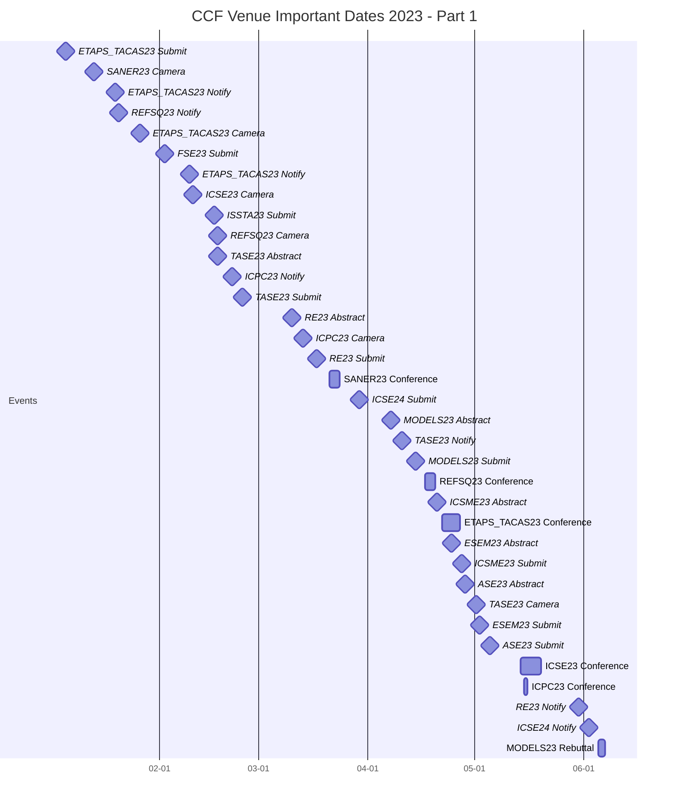
```mermaid
gantt
  title CCF Venue Important Dates 2023 - Part 1
  dateFormat YYYY-MM-DD
  axisFormat %m-%d

  section Events
  ETAPS_TACAS23 Submit :milestone, etaps_tacas_23_1_20230105, 2023-01-05, 1d
  SANER23 Camera :milestone, saner_23_2_20230113, 2023-01-13, 1d
  ETAPS_TACAS23 Notify :milestone, etaps_tacas_23_3_20230119, 2023-01-19, 1d
  REFSQ23 Notify :milestone, refsq_23_4_20230120, 2023-01-20, 1d
  ETAPS_TACAS23 Camera :milestone, etaps_tacas_23_5_20230126, 2023-01-26, 1d
  FSE23 Submit :milestone, fse_23_6_20230202, 2023-02-02, 1d
  ETAPS_TACAS23 Notify :milestone, etaps_tacas_23_7_20230209, 2023-02-09, 1d
  ICSE23 Camera :milestone, icse_23_8_20230210, 2023-02-10, 1d
  ISSTA23 Submit :milestone, issta_23_9_20230216, 2023-02-16, 1d
  REFSQ23 Camera :milestone, refsq_23_10_20230217, 2023-02-17, 1d
  TASE23 Abstract :milestone, tase_23_11_20230217, 2023-02-17, 1d
  ICPC23 Notify :milestone, icpc_23_12_20230221, 2023-02-21, 1d
  TASE23 Submit :milestone, tase_23_13_20230224, 2023-02-24, 1d
  RE23 Abstract :milestone, re_23_14_20230310, 2023-03-10, 1d
  ICPC23 Camera :milestone, icpc_23_15_20230313, 2023-03-13, 1d
  RE23 Submit :milestone, re_23_16_20230317, 2023-03-17, 1d
  SANER23 Conference :saner_23_17_20230321, 2023-03-21, 2023-03-24
  ICSE24 Submit :milestone, icse_24_18_20230329, 2023-03-29, 1d
  MODELS23 Abstract :milestone, models_23_19_20230407, 2023-04-07, 1d
  TASE23 Notify :milestone, tase_23_20_20230410, 2023-04-10, 1d
  MODELS23 Submit :milestone, models_23_21_20230414, 2023-04-14, 1d
  REFSQ23 Conference :refsq_23_22_20230417, 2023-04-17, 2023-04-20
  ICSME23 Abstract :milestone, icsme_23_23_20230420, 2023-04-20, 1d
  ETAPS_TACAS23 Conference :etaps_tacas_23_24_20230422, 2023-04-22, 2023-04-27
  ESEM23 Abstract :milestone, esem_23_25_20230424, 2023-04-24, 1d
  ICSME23 Submit :milestone, icsme_23_26_20230427, 2023-04-27, 1d
  ASE23 Abstract :milestone, ase_23_27_20230428, 2023-04-28, 1d
  TASE23 Camera :milestone, tase_23_28_20230501, 2023-05-01, 1d
  ESEM23 Submit :milestone, esem_23_29_20230502, 2023-05-02, 1d
  ASE23 Submit :milestone, ase_23_30_20230505, 2023-05-05, 1d
  ICSE23 Conference :icse_23_31_20230514, 2023-05-14, 2023-05-20
  ICPC23 Conference :icpc_23_32_20230515, 2023-05-15, 2023-05-16
  RE23 Notify :milestone, re_23_33_20230530, 2023-05-30, 1d
  ICSE24 Notify :milestone, icse_24_34_20230602, 2023-06-02, 1d
  MODELS23 Rebuttal :models_23_35_20230605, 2023-06-05, 2023-06-07
```

#### 12.2.2 2023 Mermaid 分片 2

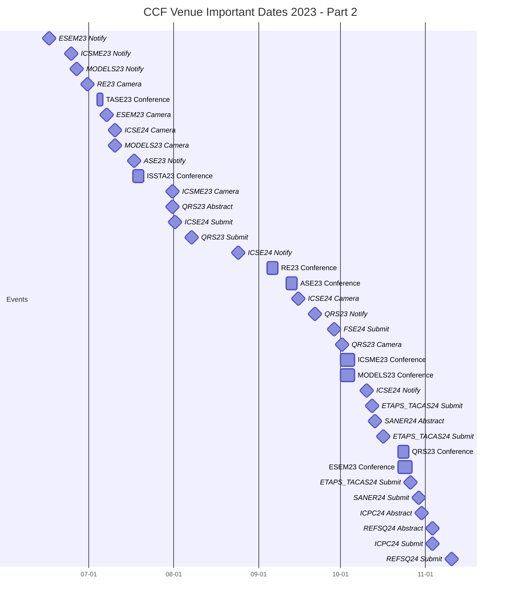
```mermaid
gantt
  title CCF Venue Important Dates 2023 - Part 2
  dateFormat YYYY-MM-DD
  axisFormat %m-%d

  section Events
  ESEM23 Notify :milestone, esem_23_36_20230616, 2023-06-16, 1d
  ICSME23 Notify :milestone, icsme_23_37_20230624, 2023-06-24, 1d
  MODELS23 Notify :milestone, models_23_38_20230626, 2023-06-26, 1d
  RE23 Camera :milestone, re_23_39_20230630, 2023-06-30, 1d
  TASE23 Conference :tase_23_40_20230704, 2023-07-04, 2023-07-06
  ESEM23 Camera :milestone, esem_23_41_20230707, 2023-07-07, 1d
  ICSE24 Camera :milestone, icse_24_42_20230710, 2023-07-10, 1d
  MODELS23 Camera :milestone, models_23_43_20230710, 2023-07-10, 1d
  ASE23 Notify :milestone, ase_23_44_20230717, 2023-07-17, 1d
  ISSTA23 Conference :issta_23_45_20230717, 2023-07-17, 2023-07-21
  ICSME23 Camera :milestone, icsme_23_46_20230731, 2023-07-31, 1d
  QRS23 Abstract :milestone, qrs_23_47_20230731, 2023-07-31, 1d
  ICSE24 Submit :milestone, icse_24_48_20230801, 2023-08-01, 1d
  QRS23 Submit :milestone, qrs_23_49_20230807, 2023-08-07, 1d
  ICSE24 Notify :milestone, icse_24_50_20230824, 2023-08-24, 1d
  RE23 Conference :re_23_51_20230904, 2023-09-04, 2023-09-08
  ASE23 Conference :ase_23_52_20230911, 2023-09-11, 2023-09-15
  ICSE24 Camera :milestone, icse_24_53_20230915, 2023-09-15, 1d
  QRS23 Notify :milestone, qrs_23_54_20230921, 2023-09-21, 1d
  FSE24 Submit :milestone, fse_24_55_20230928, 2023-09-28, 1d
  QRS23 Camera :milestone, qrs_23_56_20231001, 2023-10-01, 1d
  ICSME23 Conference :icsme_23_57_20231001, 2023-10-01, 2023-10-06
  MODELS23 Conference :models_23_58_20231001, 2023-10-01, 2023-10-06
  ICSE24 Notify :milestone, icse_24_59_20231010, 2023-10-10, 1d
  ETAPS_TACAS24 Submit :milestone, etaps_tacas_24_60_20231012, 2023-10-12, 1d
  SANER24 Abstract :milestone, saner_24_61_20231013, 2023-10-13, 1d
  ETAPS_TACAS24 Submit :milestone, etaps_tacas_24_62_20231016, 2023-10-16, 1d
  QRS23 Conference :qrs_23_63_20231022, 2023-10-22, 2023-10-26
  ESEM23 Conference :esem_23_64_20231022, 2023-10-22, 2023-10-27
  ETAPS_TACAS24 Submit :milestone, etaps_tacas_24_65_20231026, 2023-10-26, 1d
  SANER24 Submit :milestone, saner_24_66_20231029, 2023-10-29, 1d
  ICPC24 Abstract :milestone, icpc_24_67_20231030, 2023-10-30, 1d
  REFSQ24 Abstract :milestone, refsq_24_68_20231103, 2023-11-03, 1d
  ICPC24 Submit :milestone, icpc_24_69_20231103, 2023-11-03, 1d
  REFSQ24 Submit :milestone, refsq_24_70_20231110, 2023-11-10, 1d
```

#### 12.2.3 2023 Mermaid 分片 3

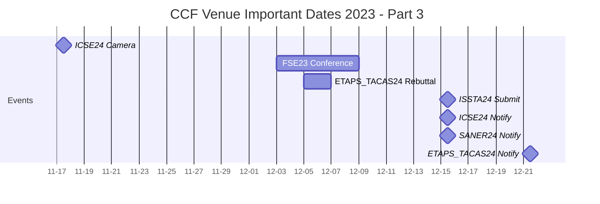
```mermaid
gantt
  title CCF Venue Important Dates 2023 - Part 3
  dateFormat YYYY-MM-DD
  axisFormat %m-%d

  section Events
  ICSE24 Camera :milestone, icse_24_71_20231117, 2023-11-17, 1d
  FSE23 Conference :fse_23_72_20231203, 2023-12-03, 2023-12-09
  ETAPS_TACAS24 Rebuttal :etaps_tacas_24_73_20231205, 2023-12-05, 2023-12-07
  ISSTA24 Submit :milestone, issta_24_74_20231215, 2023-12-15, 1d
  ICSE24 Notify :milestone, icse_24_75_20231215, 2023-12-15, 1d
  SANER24 Notify :milestone, saner_24_76_20231215, 2023-12-15, 1d
  ETAPS_TACAS24 Notify :milestone, etaps_tacas_24_77_20231221, 2023-12-21, 1d
```

#### 12.2.4 PR-9 P2 Mermaid 分片

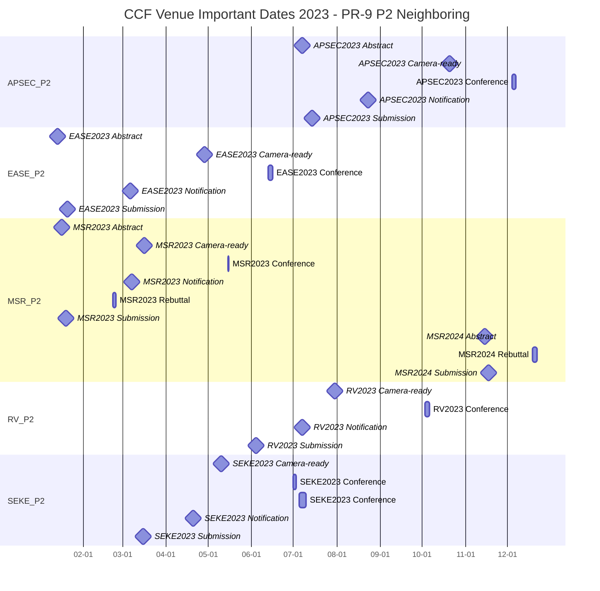
```mermaid
gantt
  title CCF Venue Important Dates 2023 - PR-9 P2 Neighboring
  dateFormat YYYY-MM-DD
  axisFormat %m-%d

  section APSEC_P2
  APSEC2023 Abstract :milestone, pr9_conf_c_apsec_2023_abstract_20230707, 2023-07-07, 1d
  APSEC2023 Camera-ready :milestone, pr9_conf_c_apsec_2023_camera_ready_20231020, 2023-10-20, 1d
  APSEC2023 Conference :pr9_conf_c_apsec_2023_conference_20231204, 2023-12-04, 2023-12-07
  APSEC2023 Notification :milestone, pr9_conf_c_apsec_2023_notification_20230823, 2023-08-23, 1d
  APSEC2023 Submission :milestone, pr9_conf_c_apsec_2023_submission_20230714, 2023-07-14, 1d

  section EASE_P2
  EASE2023 Abstract :milestone, pr9_conf_c_ease_2023_abstract_20230113, 2023-01-13, 1d
  EASE2023 Camera-ready :milestone, pr9_conf_c_ease_2023_camera_ready_20230428, 2023-04-28, 1d
  EASE2023 Conference :pr9_conf_c_ease_2023_conference_20230613, 2023-06-13, 2023-06-16
  EASE2023 Notification :milestone, pr9_conf_c_ease_2023_notification_20230306, 2023-03-06, 1d
  EASE2023 Submission :milestone, pr9_conf_c_ease_2023_submission_20230120, 2023-01-20, 1d

  section MSR_P2
  MSR2023 Abstract :milestone, pr9_conf_c_msr_2023_abstract_20230116, 2023-01-16, 1d
  MSR2023 Camera-ready :milestone, pr9_conf_c_msr_2023_camera_ready_20230316, 2023-03-16, 1d
  MSR2023 Conference :pr9_conf_c_msr_2023_conference_20230515, 2023-05-15, 2023-05-16
  MSR2023 Notification :milestone, pr9_conf_c_msr_2023_notification_20230307, 2023-03-07, 1d
  MSR2023 Rebuttal :pr9_conf_c_msr_2023_rebuttal_20230222, 2023-02-22, 2023-02-24
  MSR2023 Submission :milestone, pr9_conf_c_msr_2023_submission_20230119, 2023-01-19, 1d
  MSR2024 Abstract :milestone, pr9_conf_c_msr_2024_abstract_20231114, 2023-11-14, 1d
  MSR2024 Rebuttal :pr9_conf_c_msr_2024_rebuttal_20231219, 2023-12-19, 2023-12-22
  MSR2024 Submission :milestone, pr9_conf_c_msr_2024_submission_20231117, 2023-11-17, 1d

  section RV_P2
  RV2023 Camera-ready :milestone, pr9_conf_c_rv_2023_camera_ready_20230730, 2023-07-30, 1d
  RV2023 Conference :pr9_conf_c_rv_2023_conference_20231003, 2023-10-03, 2023-10-06
  RV2023 Notification :milestone, pr9_conf_c_rv_2023_notification_20230707, 2023-07-07, 1d
  RV2023 Submission :milestone, pr9_conf_c_rv_2023_submission_20230604, 2023-06-04, 1d

  section SEKE_P2
  SEKE2023 Camera-ready :milestone, pr9_conf_c_seke_2023_camera_ready_20230510, 2023-05-10, 1d
  SEKE2023 Conference :pr9_conf_c_seke_2023_conference_20230701, 2023-07-01, 2023-07-03
  SEKE2023 Conference :pr9_conf_c_seke_2023_conference_20230705, 2023-07-05, 2023-07-10
  SEKE2023 Notification :milestone, pr9_conf_c_seke_2023_notification_20230420, 2023-04-20, 1d
  SEKE2023 Submission :milestone, pr9_conf_c_seke_2023_submission_20230315, 2023-03-15, 1d

```
## 13. 2022 时间线

> 当前章节按 **2022 年实际发生的事件日期** 升序排列；Venue 名称保留会议 edition。

### 13.1 2022 投稿事件总表

| 日期时间 | Venue | 类型-CCF | Track / 事项 | 日期类型 | 阶段状态 | 事件官方来源 | 年度主页 | 论文集 / 名录 | 本库年度页 | 核验状态 | 备注 |
|---|---|---|---|---|---|---|---|---|---|---|---|
| 2022-01-05 | [ETAPS/TACAS 2022](./conf-b-etaps/2022/README.md) | 会议-B | TACAS post-paper artifact submission | Submission | ✅ 已结束 | [官方来源](https://etaps.org/2022/call-for-papers.html) | [年度主页](https://etaps.org/2022/) | [TACAS accepted](https://etaps.org/user-profile/archive/53-etaps-2022/495-tacas-2022-accepted-papers.html) / [Proceedings](https://etaps.org/2022/proceedings.html) | [本库年度页](./conf-b-etaps/2022/README.md) | 🟡 部分核验 | 23:59 AoE。 |
| 2022-01-13 待补时刻 | [ICPC 2022](./conf-b-icpc/2022/README.md) | 会议-B | Research Track abstract | Abstract | ✅ 已结束 | [ICPC 2022 dates](https://conf.researchr.org/dates/icpc-2022) | [ICPC 2022](https://conf.researchr.org/home/icpc-2022) | [DBLP 2022](https://dblp.org/db/conf/iwpc/icpc2022) | [本库年度页](./conf-b-icpc/2022/README.md) | 🟡 部分核验 | 官方仅日期；具体时刻待补。 |
| 2022-01-17 | [MSR 2022](./conf-c-msr/2022/README.md) | 会议-C / P2 | Technical abstract | Abstract | ✅ 已结束 | [官方来源](https://conf.researchr.org/dates/msr-2022) | [年度主页](https://conf.researchr.org/home/msr-2022) | [论文集 / 名录](https://conf.researchr.org/program/msr-2022/program-msr-2022/) | [本库年度页](./conf-c-msr/2022/README.md) | 🟡 部分核验 | PR-9 P2 邻近观察；官方仅日期；不升级为 P0/P1 主线。 |
| 2022-01-18 待补时刻 | [ICPC 2022](./conf-b-icpc/2022/README.md) | 会议-B | Research Track submission | Submission | ✅ 已结束 | [ICPC 2022 dates](https://conf.researchr.org/dates/icpc-2022) | [ICPC 2022](https://conf.researchr.org/home/icpc-2022) | [DBLP 2022](https://dblp.org/db/conf/iwpc/icpc2022) | [本库年度页](./conf-b-icpc/2022/README.md) | 🟡 部分核验 | 官方仅日期；具体时刻待补。 |
| 2022-01-20 | [MSR 2022](./conf-c-msr/2022/README.md) | 会议-C / P2 | Technical paper | Submission | ✅ 已结束 | [官方来源](https://conf.researchr.org/dates/msr-2022) | [年度主页](https://conf.researchr.org/home/msr-2022) | [论文集 / 名录](https://conf.researchr.org/program/msr-2022/program-msr-2022/) | [本库年度页](./conf-c-msr/2022/README.md) | 🟡 部分核验 | PR-9 P2 邻近观察；官方仅日期；不升级为 P0/P1 主线。 |
| 2022-01-24 | [EASE 2022](./conf-c-ease/2022/README.md) | 会议-C / P2 | Research abstract | Abstract | ✅ 已结束 | [官方来源](https://conf.researchr.org/track/ease-2022/ease-2022-research) | [年度主页](https://conf.researchr.org/home/ease-2022) | [论文集 / 名录](https://conf.researchr.org/program/ease-2022/program-ease-2022/) | [本库年度页](./conf-c-ease/2022/README.md) | 🟡 部分核验 | PR-9 P2 邻近观察；官方仅日期；不升级为 P0/P1 主线。 |
| 2022-01-26 待补时刻 | [ETAPS/TACAS 2022](./conf-b-etaps/2022/README.md) | 会议-B | TACAS final version | Camera-ready | ✅ 已结束 | [官方来源](https://etaps.org/2022/call-for-papers.html) | [年度主页](https://etaps.org/2022/) | [TACAS accepted](https://etaps.org/user-profile/archive/53-etaps-2022/495-tacas-2022-accepted-papers.html) / [Proceedings](https://etaps.org/2022/proceedings.html) | [本库年度页](./conf-b-etaps/2022/README.md) | 🟡 部分核验 | 官方仅日期；时刻待补。 |
| 2022-01-28 23:59 AoE | [ISSTA 2022](./conf-a-issta/2022/README.md) | 会议-A | Technical Papers due | Submission | ✅ 已结束 | [官方来源](https://conf.researchr.org/track/issta-2022/issta-2022-technical-papers) | [年度主页](https://conf.researchr.org/home/issta-2022) | [Program](https://conf.researchr.org/program/issta-2022/program-issta-2022/) / [DBLP](https://dblp.org/db/conf/issta/issta2022.html) | [本库年度页](./conf-a-issta/2022/README.md) | 🟡 部分核验 | 23:59 AoE / UTC-12h。 |
| 2022-01-31 | [EASE 2022](./conf-c-ease/2022/README.md) | 会议-C / P2 | Full paper | Submission | ✅ 已结束 | [官方来源](https://conf.researchr.org/track/ease-2022/ease-2022-research) | [年度主页](https://conf.researchr.org/home/ease-2022) | [论文集 / 名录](https://conf.researchr.org/program/ease-2022/program-ease-2022/) | [本库年度页](./conf-c-ease/2022/README.md) | 🟡 部分核验 | PR-9 P2 邻近观察；官方仅日期；不升级为 P0/P1 主线。 |
| 2022-02-11 待补时刻 | [ICSE 2022](./conf-a-icse/2022/README.md) | 会议-A | Technical Track camera-ready | Camera-ready | ✅ 已结束 | [官方来源](https://conf.researchr.org/track/icse-2022/icse-2022-papers) | [年度主页](https://conf.researchr.org/home/icse-2022) | [Program](https://conf.researchr.org/program/icse-2022/program-icse-2022/) / [DBLP](https://dblp.org/db/conf/icse/icse2022.html) | [本库年度页](./conf-a-icse/2022/README.md) | 🟡 部分核验 | 官方仅日期；时刻待补。 |
| 2022-02-14 待补时刻 AoE | [TASE 2022](./conf-c-tase/2022/README.md) | 会议-C | Abstract due extended | Abstract | ✅ 已结束 | [TASE 2022 official source](https://www.cs.ubbcluj.ro/tase2022/c_impd.html) | [TASE 2022](https://www.cs.ubbcluj.ro/tase2022/) | [Accepted Papers](https://www.cs.ubbcluj.ro/tase2022/c_ap.html) / [Proceedings](https://link.springer.com/book/10.1007/978-3-031-10363-6) / [DBLP](https://dblp.org/db/conf/tase/tase2022.html) | [本库年度页](./conf-c-tase/2022/README.md) | 🟡 部分核验 | TASE official accepted list、Springer TOC 与 DBLP 计数需分列；不混成单一论文数。 |
| 2022-02-16 待补时刻 | [ETAPS/TACAS 2022](./conf-b-etaps/2022/README.md) | 会议-B | TACAS artifact notification | Notification | ✅ 已结束 | [官方来源](https://etaps.org/2022/call-for-papers.html) | [年度主页](https://etaps.org/2022/) | [TACAS accepted](https://etaps.org/user-profile/archive/53-etaps-2022/495-tacas-2022-accepted-papers.html) / [Proceedings](https://etaps.org/2022/proceedings.html) | [本库年度页](./conf-b-etaps/2022/README.md) | 🟡 部分核验 | 官方仅日期；时刻待补。 |
| 2022-02-17 待补时刻 AoE | [RE 2022](./conf-b-re/2022/README.md) | 会议-B | Research Papers abstract | Abstract | ✅ 已结束 | [官方来源](https://conf.researchr.org/dates/RE-2022) | [年度主页](https://conf.researchr.org/home/RE-2022) | [Program](https://conf.researchr.org/program/RE-2022/program-RE-2022/) / [DBLP](https://dblp.org/db/conf/re/re2022.html) | [本库年度页](./conf-b-re/2022/README.md) | 🟡 部分核验 | main research / research track；具体时刻待补。 |
| 2022-02-17 待补时刻 AoE | [REFSQ 2022](./conf-c-refsq/2022/README.md) | 会议-C | Research camera-ready | Camera-ready | ✅ 已结束 | [官方来源](https://2022.refsq.org/dates/refsq-2022) | [年度主页](https://2022.refsq.org/) | [Program](https://2022.refsq.org/program/program-refsq-2022/) / [DBLP](https://dblp.org/db/conf/refsq/refsq2022.html) | [本库年度页](./conf-c-refsq/2022/README.md) | 🟡 部分核验 | main research / research track；具体时刻待补。 |
| 2022-02-22 至 2022-02-24 | [MSR 2022](./conf-c-msr/2022/README.md) | 会议-C / P2 | Technical response | Rebuttal | ✅ 已结束 | [官方来源](https://conf.researchr.org/dates/msr-2022) | [年度主页](https://conf.researchr.org/home/msr-2022) | [论文集 / 名录](https://conf.researchr.org/program/msr-2022/program-msr-2022/) | [本库年度页](./conf-c-msr/2022/README.md) | 🟡 部分核验 | PR-9 P2 邻近观察；官方仅日期；不升级为 P0/P1 主线。 |
| 2022-02-24 待补时刻 AoE | [RE 2022](./conf-b-re/2022/README.md) | 会议-B | Research Papers submission | Submission | ✅ 已结束 | [官方来源](https://conf.researchr.org/dates/RE-2022) | [年度主页](https://conf.researchr.org/home/RE-2022) | [Program](https://conf.researchr.org/program/RE-2022/program-RE-2022/) / [DBLP](https://dblp.org/db/conf/re/re2022.html) | [本库年度页](./conf-b-re/2022/README.md) | 🟡 部分核验 | main research / research track；具体时刻待补。 |
| 2022-02-27 待补时刻 AoE | [TASE 2022](./conf-c-tase/2022/README.md) | 会议-C | Paper submission extended | Submission | ✅ 已结束 | [TASE 2022 official source](https://www.cs.ubbcluj.ro/tase2022/c_impd.html) | [TASE 2022](https://www.cs.ubbcluj.ro/tase2022/) | [Accepted Papers](https://www.cs.ubbcluj.ro/tase2022/c_ap.html) / [Proceedings](https://link.springer.com/book/10.1007/978-3-031-10363-6) / [DBLP](https://dblp.org/db/conf/tase/tase2022.html) | [本库年度页](./conf-c-tase/2022/README.md) | 🟡 部分核验 | TASE official accepted list、Springer TOC 与 DBLP 计数需分列；不混成单一论文数。 |
| 2022-03-08 | [MSR 2022](./conf-c-msr/2022/README.md) | 会议-C / P2 | Technical notification | Notification | ✅ 已结束 | [官方来源](https://conf.researchr.org/dates/msr-2022) | [年度主页](https://conf.researchr.org/home/msr-2022) | [论文集 / 名录](https://conf.researchr.org/program/msr-2022/program-msr-2022/) | [本库年度页](./conf-c-msr/2022/README.md) | 🟡 部分核验 | PR-9 P2 邻近观察；官方仅日期；不升级为 P0/P1 主线。 |
| 2022-03-08 待补时刻 | [ICPC 2022](./conf-b-icpc/2022/README.md) | 会议-B | Research Track acceptance notification | Notification | ✅ 已结束 | [ICPC 2022 dates](https://conf.researchr.org/dates/icpc-2022) | [ICPC 2022](https://conf.researchr.org/home/icpc-2022) | [DBLP 2022](https://dblp.org/db/conf/iwpc/icpc2022) | [本库年度页](./conf-b-icpc/2022/README.md) | 🟡 部分核验 | 官方仅日期；具体时刻待补。 |
| 2022-03-15 | [SEKE 2022](./conf-c-seke/2022/README.md) | 会议-C / P2 | Paper submission due | Submission | ✅ 已结束 | [官方来源](https://ksiresearch.org/seke/seke22main.html) | [年度主页](https://ksiresearch.org/seke/seke22.html) | [论文集 / 名录](https://ksiresearch.org/seke/seke22pgm.html) | [本库年度页](./conf-c-seke/2022/README.md) | 🟡 部分核验 | PR-9 P2 邻近观察；Midnight EST / extended hard deadline；不升级为 P0/P1 主线。 |
| 2022-03-15 至 2022-03-18 | [SANER 2022](./conf-b-saner/2022/README.md) | 会议-B | Conference dates | Conference | ✅ 已结束 | [SANER 2022 home](http://saner2022.uom.gr/) | [SANER 2022](http://saner2022.uom.gr/) | [IEEE proceedings](https://ieeexplore.ieee.org/xpl/conhome/9825713/proceeding) | [本库年度页](./conf-b-saner/2022/README.md) | 🟡 部分核验 | Virtual / Online, Honolulu；2021 投稿 ddl 不回填本时间线；HTTPS 证书主机名不匹配，当前使用 HTTP 官方站入口。 |
| 2022-03-16 | [EASE 2022](./conf-c-ease/2022/README.md) | 会议-C / P2 | Notification | Notification | ✅ 已结束 | [官方来源](https://conf.researchr.org/track/ease-2022/ease-2022-research) | [年度主页](https://conf.researchr.org/home/ease-2022) | [论文集 / 名录](https://conf.researchr.org/program/ease-2022/program-ease-2022/) | [本库年度页](./conf-c-ease/2022/README.md) | 🟡 部分核验 | PR-9 P2 邻近观察；官方仅日期；不升级为 P0/P1 主线。 |
| 2022-03-17 23:59 AoE | [ESEC/FSE 2022](./conf-a-fse/2022/README.md) | 会议-A | Research Papers submission | Submission | ✅ 已结束 | [官方来源](https://conf.researchr.org/track/fse-2022/fse-2022-research-papers) | [年度主页](https://conf.researchr.org/home/fse-2022) | [Program](https://conf.researchr.org/program/fse-2022/program-fse-2022/) / [DBLP](https://dblp.org/db/conf/sigsoft/fse2022.html) | [本库年度页](./conf-a-fse/2022/README.md) | 🟡 部分核验 | 年度官方名保留 ESEC/FSE。 |
| 2022-03-21 至 2022-03-24 | [REFSQ 2022](./conf-c-refsq/2022/README.md) | 会议-C | Conference dates | Conference | ✅ 已结束 | [官方来源](https://2022.refsq.org/dates/refsq-2022) | [年度主页](https://2022.refsq.org/) | [Program](https://2022.refsq.org/program/program-refsq-2022/) / [DBLP](https://dblp.org/db/conf/refsq/refsq2022.html) | [本库年度页](./conf-c-refsq/2022/README.md) | 🟡 部分核验 | REFSQ official dates；Springer / DBLP 入口分散时以年度页说明为准。 |
| 2022-03-25 待补时刻 | [ICSME 2022](./conf-b-icsme/2022/README.md) | 会议-B | Research Papers abstract | Abstract | ✅ 已结束 / 日期冲突待核 | [IEEE CFP 2022](https://www.computer.org/cfp/icsme-2022) | [ICSME 2022](https://icsme.computer.org/2022/) | [DBLP 2022](https://dblp.org/db/conf/icsm/icsme2022) | [本库年度页](./conf-b-icsme/2022/README.md) | 🟡 部分核验 | 官方仅日期；会议日期口径另有冲突待核。 |
| 2022-03-31 | [MSR 2022](./conf-c-msr/2022/README.md) | 会议-C / P2 | Technical camera-ready | Camera-ready | ✅ 已结束 | [官方来源](https://conf.researchr.org/dates/msr-2022) | [年度主页](https://conf.researchr.org/home/msr-2022) | [论文集 / 名录](https://conf.researchr.org/program/msr-2022/program-msr-2022/) | [本库年度页](./conf-c-msr/2022/README.md) | 🟡 部分核验 | PR-9 P2 邻近观察；官方仅日期；不升级为 P0/P1 主线。 |
| 2022-03-31 待补时刻 | [ICPC 2022](./conf-b-icpc/2022/README.md) | 会议-B | Research Track camera-ready | Camera-ready | ✅ 已结束 | [ICPC 2022 dates](https://conf.researchr.org/dates/icpc-2022) | [ICPC 2022](https://conf.researchr.org/home/icpc-2022) | [DBLP 2022](https://dblp.org/db/conf/iwpc/icpc2022) | [本库年度页](./conf-b-icpc/2022/README.md) | 🟡 部分核验 | 官方仅日期；具体时刻待补。 |
| 2022-04-01 待补时刻 | [ICSME 2022](./conf-b-icsme/2022/README.md) | 会议-B | Research Papers submission | Submission | ✅ 已结束 / 日期冲突待核 | [IEEE CFP 2022](https://www.computer.org/cfp/icsme-2022) | [ICSME 2022](https://icsme.computer.org/2022/) | [DBLP 2022](https://dblp.org/db/conf/icsm/icsme2022) | [本库年度页](./conf-b-icsme/2022/README.md) | 🟡 部分核验 | 官方仅日期；会议日期口径另有冲突待核。 |
| 2022-04-02 至 2022-04-07 | [ETAPS/TACAS 2022](./conf-b-etaps/2022/README.md) | 会议-B | ETAPS conference dates | Conference | ✅ 已结束 | [官方来源](https://etaps.org/2022/call-for-papers.html) | [年度主页](https://etaps.org/2022/) | [TACAS accepted](https://etaps.org/user-profile/archive/53-etaps-2022/495-tacas-2022-accepted-papers.html) / [Proceedings](https://etaps.org/2022/proceedings.html) | [本库年度页](./conf-b-etaps/2022/README.md) | 🟡 部分核验 | Munich, Germany。 |
| 2022-04-10 待补时刻 | [TASE 2022](./conf-c-tase/2022/README.md) | 会议-C | Notification | Notification | ✅ 已结束 | [TASE 2022 official source](https://www.cs.ubbcluj.ro/tase2022/c_impd.html) | [TASE 2022](https://www.cs.ubbcluj.ro/tase2022/) | [Accepted Papers](https://www.cs.ubbcluj.ro/tase2022/c_ap.html) / [Proceedings](https://link.springer.com/book/10.1007/978-3-031-10363-6) / [DBLP](https://dblp.org/db/conf/tase/tase2022.html) | [本库年度页](./conf-c-tase/2022/README.md) | 🟡 部分核验 | TASE official accepted list、Springer TOC 与 DBLP 计数需分列；不混成单一论文数。 |
| 2022-04-20 | [SEKE 2022](./conf-c-seke/2022/README.md) | 会议-C / P2 | Notification | Notification | ✅ 已结束 | [官方来源](https://ksiresearch.org/seke/seke22main.html) | [年度主页](https://ksiresearch.org/seke/seke22.html) | [论文集 / 名录](https://ksiresearch.org/seke/seke22pgm.html) | [本库年度页](./conf-c-seke/2022/README.md) | 🟡 部分核验 | PR-9 P2 邻近观察；官方仅日期；不升级为 P0/P1 主线。 |
| 2022-04-24 | [EASE 2022](./conf-c-ease/2022/README.md) | 会议-C / P2 | Camera-ready | Camera-ready | ✅ 已结束 | [官方来源](https://conf.researchr.org/track/ease-2022/ease-2022-research) | [年度主页](https://conf.researchr.org/home/ease-2022) | [论文集 / 名录](https://conf.researchr.org/program/ease-2022/program-ease-2022/) | [本库年度页](./conf-c-ease/2022/README.md) | 🟡 部分核验 | PR-9 P2 邻近观察；官方仅日期；不升级为 P0/P1 主线。 |
| 2022-04-25 待补时刻 | [ESEM 2022](./conf-b-esem/2022/README.md) | 会议-B | Technical Track abstract | Abstract | ✅ 已结束 | [Important Dates](https://conf.researchr.org/dates/esem-2022) | [ESEIW 2022](https://conf.researchr.org/home/esem-2022) | [Program](https://conf.researchr.org/program/esem-2022/program-esem-2022/) / [DBLP](https://dblp.org/db/conf/esem/esem2022.html) | [本库年度页](./conf-b-esem/2022/README.md) | 🟡 部分核验 | 官方仅给日期；ESEM Technical Papers，不混入 ESEIW 其他 track。 |
| 2022-04-29 待补时刻 AoE | [ASE 2022](./conf-a-ase/2022/README.md) | 会议-A | Abstract submission | Abstract | ✅ 已结束 | [官方来源](https://conf.researchr.org/track/ase-2022/ase-2022-research-papers) | [年度主页](https://conf.researchr.org/home/ase-2022) | [Program](https://conf.researchr.org/program/ase-2022/program-ase-2022/) / [DBLP](https://dblp.org/db/conf/kbse/ase2022.html) | [本库年度页](./conf-a-ase/2022/README.md) | 🟡 部分核验 |  |
| 2022-05-01 待补时刻 | [TASE 2022](./conf-c-tase/2022/README.md) | 会议-C | Camera-ready | Camera-ready | ✅ 已结束 | [TASE 2022 official source](https://www.cs.ubbcluj.ro/tase2022/c_impd.html) | [TASE 2022](https://www.cs.ubbcluj.ro/tase2022/) | [Accepted Papers](https://www.cs.ubbcluj.ro/tase2022/c_ap.html) / [Proceedings](https://link.springer.com/book/10.1007/978-3-031-10363-6) / [DBLP](https://dblp.org/db/conf/tase/tase2022.html) | [本库年度页](./conf-c-tase/2022/README.md) | 🟡 部分核验 | TASE official accepted list、Springer TOC 与 DBLP 计数需分列；不混成单一论文数。 |
| 2022-05-02 待补时刻 | [ESEM 2022](./conf-b-esem/2022/README.md) | 会议-B | Technical Track submission | Submission | ✅ 已结束 | [Important Dates](https://conf.researchr.org/dates/esem-2022) | [ESEIW 2022](https://conf.researchr.org/home/esem-2022) | [Program](https://conf.researchr.org/program/esem-2022/program-esem-2022/) / [DBLP](https://dblp.org/db/conf/esem/esem2022.html) | [本库年度页](./conf-b-esem/2022/README.md) | 🟡 部分核验 | 官方仅给日期；具体时刻待补。 |
| 2022-05-06 待补时刻 AoE | [ASE 2022](./conf-a-ase/2022/README.md) | 会议-A | Paper submission | Submission | ✅ 已结束 | [官方来源](https://conf.researchr.org/track/ase-2022/ase-2022-research-papers) | [年度主页](https://conf.researchr.org/home/ase-2022) | [Program](https://conf.researchr.org/program/ase-2022/program-ase-2022/) / [DBLP](https://dblp.org/db/conf/kbse/ase2022.html) | [本库年度页](./conf-a-ase/2022/README.md) | 🟡 部分核验 |  |
| 2022-05-08 待补时刻 AoE | [ATVA 2022](./conf-c-atva/2022/README.md) | 会议-C | Abstract submission | Abstract | ✅ 已结束 | [Important Dates](https://atva-conference.org/2022/important-dates/) | [ATVA 2022](https://atva-conference.org/2022/) | [Accepted Papers](https://atva-conference.org/2022/call-for-papers/accepted-papers/) / [Proceedings](https://link.springer.com/book/10.1007/978-3-031-19992-9) | [本库年度页](./conf-c-atva/2022/README.md) | 🟡 部分核验 | 官方将旧 abstract deadline 2022-05-01 AoE extended 到 2022-05-08 AoE。 |
| 2022-05-08 至 2022-05-27 | [ICSE 2022](./conf-a-icse/2022/README.md) | 会议-A | Conference dates | Conference | ✅ 已结束 | [官方来源](https://conf.researchr.org/track/icse-2022/icse-2022-papers) | [年度主页](https://conf.researchr.org/home/icse-2022) | [Program](https://conf.researchr.org/program/icse-2022/program-icse-2022/) / [DBLP](https://dblp.org/db/conf/icse/icse2022.html) | [本库年度页](./conf-a-icse/2022/README.md) | 🟡 部分核验 | venue-wide 会期窗口。 |
| 2022-05-09 待补时刻 AoE | [RE 2022](./conf-b-re/2022/README.md) | 会议-B | Research Papers notification | Notification | ✅ 已结束 | [官方来源](https://conf.researchr.org/dates/RE-2022) | [年度主页](https://conf.researchr.org/home/RE-2022) | [Program](https://conf.researchr.org/program/RE-2022/program-RE-2022/) / [DBLP](https://dblp.org/db/conf/re/re2022.html) | [本库年度页](./conf-b-re/2022/README.md) | 🟡 部分核验 | main research / research track；具体时刻待补。 |
| 2022-05-10 | [SEKE 2022](./conf-c-seke/2022/README.md) | 会议-C / P2 | Camera-ready | Camera-ready | ✅ 已结束 | [官方来源](https://ksiresearch.org/seke/seke22main.html) | [年度主页](https://ksiresearch.org/seke/seke22.html) | [论文集 / 名录](https://ksiresearch.org/seke/seke22pgm.html) | [本库年度页](./conf-c-seke/2022/README.md) | 🟡 部分核验 | PR-9 P2 邻近观察；官方仅日期；不升级为 P0/P1 主线。 |
| 2022-05-15 待补时刻 AoE | [ATVA 2022](./conf-c-atva/2022/README.md) | 会议-C | Paper submission | Submission | ✅ 已结束 | [Important Dates](https://atva-conference.org/2022/important-dates/) | [ATVA 2022](https://atva-conference.org/2022/) | [Accepted Papers](https://atva-conference.org/2022/call-for-papers/accepted-papers/) / [Proceedings](https://link.springer.com/book/10.1007/978-3-031-19992-9) | [本库年度页](./conf-c-atva/2022/README.md) | 🟡 部分核验 | 官方将旧 paper deadline 2022-05-08 AoE extended 到 2022-05-15 AoE。 |
| 2022-05-16 至 2022-05-17 | [ICPC 2022](./conf-b-icpc/2022/README.md) | 会议-B | Conference dates | Conference | ✅ 已结束 | [ICPC 2022 dates](https://conf.researchr.org/dates/icpc-2022) | [ICPC 2022](https://conf.researchr.org/home/icpc-2022) | [DBLP 2022](https://dblp.org/db/conf/iwpc/icpc2022) | [本库年度页](./conf-b-icpc/2022/README.md) | 🟡 部分核验 | 官方仅日期；具体时刻待补。 |
| 2022-05-18 待补时刻 | [MoDELS 2022](./conf-b-models/2022/README.md) | 会议-B | Technical Track abstract / submission | Submission | ✅ 已结束 | [官方来源](https://conf.researchr.org/dates/models-2022) | [年度主页](https://conf.researchr.org/home/models-2022) | [Proceedings](https://conf.researchr.org/info/models-2022/conference-proceedings) / [DBLP](https://dblp.org/db/conf/models/models2022.html) | [本库年度页](./conf-b-models/2022/README.md) | 🟡 部分核验 | abstract 与 full paper 同日；官方仅日期，AoE；时刻待补。 |
| 2022-05-19 | [RV 2022](./conf-c-rv/2022/README.md) | 会议-C / P2 | Paper submission | Submission | ✅ 已结束 | [官方来源](https://rv22.gitlab.io/cfp/) | [年度主页](https://rv22.gitlab.io/) | [论文集 / 名录](https://easychair.org/smart-program/RV2022/) | [本库年度页](./conf-c-rv/2022/README.md) | 🟡 部分核验 | PR-9 P2 邻近观察；官方未给时区；不升级为 P0/P1 主线。 |
| 2022-05-23 至 2022-05-24 | [MSR 2022](./conf-c-msr/2022/README.md) | 会议-C / P2 | Conference | Conference | ✅ 已结束 | [官方来源](https://conf.researchr.org/dates/msr-2022) | [年度主页](https://conf.researchr.org/home/msr-2022) | [论文集 / 名录](https://conf.researchr.org/program/msr-2022/program-msr-2022/) | [本库年度页](./conf-c-msr/2022/README.md) | 🟡 部分核验 | PR-9 P2 邻近观察；Pittsburgh local time；不升级为 P0/P1 主线。 |
| 2022-06-10 待补时刻 | [ICSME 2022](./conf-b-icsme/2022/README.md) | 会议-B | Research Papers notification | Notification | ✅ 已结束 / 日期冲突待核 | [IEEE CFP 2022](https://www.computer.org/cfp/icsme-2022) | [ICSME 2022](https://icsme.computer.org/2022/) | [DBLP 2022](https://dblp.org/db/conf/icsm/icsme2022) | [本库年度页](./conf-b-icsme/2022/README.md) | 🟡 部分核验 | 官方仅日期；会议日期口径另有冲突待核。 |
| 2022-06-13 待补时刻 AoE | [RE 2022](./conf-b-re/2022/README.md) | 会议-B | Research Papers camera-ready | Camera-ready | ✅ 已结束 | [官方来源](https://conf.researchr.org/dates/RE-2022) | [年度主页](https://conf.researchr.org/home/RE-2022) | [Program](https://conf.researchr.org/program/RE-2022/program-RE-2022/) / [DBLP](https://dblp.org/db/conf/re/re2022.html) | [本库年度页](./conf-b-re/2022/README.md) | 🟡 部分核验 | main research / research track；具体时刻待补。 |
| 2022-06-13 至 2022-06-15 | [EASE 2022](./conf-c-ease/2022/README.md) | 会议-C / P2 | Conference | Conference | ✅ 已结束 | [官方来源](https://conf.researchr.org/track/ease-2022/ease-2022-research) | [年度主页](https://conf.researchr.org/home/ease-2022) | [论文集 / 名录](https://conf.researchr.org/program/ease-2022/program-ease-2022/) | [本库年度页](./conf-c-ease/2022/README.md) | 🟡 部分核验 | PR-9 P2 邻近观察；Göteborg local time / online；不升级为 P0/P1 主线。 |
| 2022-06-17 待补时刻 | [ESEM 2022](./conf-b-esem/2022/README.md) | 会议-B | Technical Track notification | Notification | ✅ 已结束 | [Important Dates](https://conf.researchr.org/dates/esem-2022) | [ESEIW 2022](https://conf.researchr.org/home/esem-2022) | [Program](https://conf.researchr.org/program/esem-2022/program-esem-2022/) / [DBLP](https://dblp.org/db/conf/esem/esem2022.html) | [本库年度页](./conf-b-esem/2022/README.md) | 🟡 部分核验 | 官方仅给日期；具体时刻待补。 |
| 2022-06-27 | [RV 2022](./conf-c-rv/2022/README.md) | 会议-C / P2 | Notification | Notification | ✅ 已结束 | [官方来源](https://rv22.gitlab.io/cfp/) | [年度主页](https://rv22.gitlab.io/) | [论文集 / 名录](https://easychair.org/smart-program/RV2022/) | [本库年度页](./conf-c-rv/2022/README.md) | 🟡 部分核验 | PR-9 P2 邻近观察；官方仅给 Week 26；本日期为周一占位待复核；不升级为 P0/P1 主线。 |
| 2022-06-28 至 2022-07-01 | [MoDELS 2022](./conf-b-models/2022/README.md) | 会议-B | Technical Track author response | Rebuttal | ✅ 已结束 | [官方来源](https://conf.researchr.org/dates/models-2022) | [年度主页](https://conf.researchr.org/home/models-2022) | [Proceedings](https://conf.researchr.org/info/models-2022/conference-proceedings) / [DBLP](https://dblp.org/db/conf/models/models2022.html) | [本库年度页](./conf-b-models/2022/README.md) | 🟡 部分核验 | 官方仅日期，AoE；时刻待补。 |
| 2022-07-01 待补时刻 | [ICSME 2022](./conf-b-icsme/2022/README.md) | 会议-B | Research Papers camera-ready | Camera-ready | ✅ 已结束 / 日期冲突待核 | [IEEE CFP 2022](https://www.computer.org/cfp/icsme-2022) | [ICSME 2022](https://icsme.computer.org/2022/) | [DBLP 2022](https://dblp.org/db/conf/icsm/icsme2022) | [本库年度页](./conf-b-icsme/2022/README.md) | 🟡 部分核验 | 官方仅日期；会议日期口径另有冲突待核。 |
| 2022-07-01 至 2022-07-10 | [SEKE 2022](./conf-c-seke/2022/README.md) | 会议-C / P2 | Conference | Conference | ✅ 已结束 | [官方来源](https://ksiresearch.org/seke/seke22main.html) | [年度主页](https://ksiresearch.org/seke/seke22.html) | [论文集 / 名录](https://ksiresearch.org/seke/seke22pgm.html) | [本库年度页](./conf-c-seke/2022/README.md) | 🟡 部分核验 | PR-9 P2 邻近观察；virtual；不升级为 P0/P1 主线。 |
| 2022-07-04 待补时刻 AoE | [ATVA 2022](./conf-c-atva/2022/README.md) | 会议-C | Notification | Notification | ✅ 已结束 | [Important Dates](https://atva-conference.org/2022/important-dates/) | [ATVA 2022](https://atva-conference.org/2022/) | [Accepted Papers](https://atva-conference.org/2022/call-for-papers/accepted-papers/) / [Proceedings](https://link.springer.com/book/10.1007/978-3-031-19992-9) | [本库年度页](./conf-c-atva/2022/README.md) | 🟡 部分核验 | 官方将旧 notification 2022-06-24 extended 到 2022-07-04 AoE。 |
| 2022-07-08 至 2022-07-10 | [TASE 2022](./conf-c-tase/2022/README.md) | 会议-C | Conference dates | Conference | ✅ 已结束 | [TASE 2022 official source](https://www.cs.ubbcluj.ro/tase2022/c_impd.html) | [TASE 2022](https://www.cs.ubbcluj.ro/tase2022/) | [Accepted Papers](https://www.cs.ubbcluj.ro/tase2022/c_ap.html) / [Proceedings](https://link.springer.com/book/10.1007/978-3-031-10363-6) / [DBLP](https://dblp.org/db/conf/tase/tase2022.html) | [本库年度页](./conf-c-tase/2022/README.md) | 🟡 部分核验 | TASE official accepted list、Springer TOC 与 DBLP 计数需分列；不混成单一论文数。 |
| 2022-07-12 待补时刻 | [MoDELS 2022](./conf-b-models/2022/README.md) | 会议-B | Technical Track notification | Notification | ✅ 已结束 | [官方来源](https://conf.researchr.org/dates/models-2022) | [年度主页](https://conf.researchr.org/home/models-2022) | [Proceedings](https://conf.researchr.org/info/models-2022/conference-proceedings) / [DBLP](https://dblp.org/db/conf/models/models2022.html) | [本库年度页](./conf-b-models/2022/README.md) | 🟡 部分核验 | 官方仅日期，AoE；时刻待补。 |
| 2022-07-13 | [APSEC 2022](./conf-c-apsec/2022/README.md) | 会议-C / P2 | Technical abstract | Abstract | ✅ 已结束 | [官方来源](https://conf.researchr.org/dates/apsec-2022) | [年度主页](https://conf.researchr.org/home/apsec-2022) | [论文集 / 名录](https://conf.researchr.org/program/apsec-2022/program-apsec-2022/) | [本库年度页](./conf-c-apsec/2022/README.md) | 🟡 部分核验 | PR-9 P2 邻近观察；AoE / UTC-12h；不升级为 P0/P1 主线。 |
| 2022-07-15 待补时刻 | [ESEM 2022](./conf-b-esem/2022/README.md) | 会议-B | Technical Track camera-ready | Camera-ready | ✅ 已结束 | [Important Dates](https://conf.researchr.org/dates/esem-2022) | [ESEIW 2022](https://conf.researchr.org/home/esem-2022) | [Program](https://conf.researchr.org/program/esem-2022/program-esem-2022/) / [DBLP](https://dblp.org/db/conf/esem/esem2022.html) | [本库年度页](./conf-b-esem/2022/README.md) | 🟡 部分核验 | 官方仅给日期；具体时刻待补。 |
| 2022-07-18 至 2022-07-22 | [ISSTA 2022](./conf-a-issta/2022/README.md) | 会议-A | Conference dates | Conference | ✅ 已结束 | [官方来源](https://conf.researchr.org/home/issta-2022) | [年度主页](https://conf.researchr.org/home/issta-2022) | [Program](https://conf.researchr.org/program/issta-2022/program-issta-2022/) / [DBLP](https://dblp.org/db/conf/issta/issta2022.html) | [本库年度页](./conf-a-issta/2022/README.md) | 🟡 部分核验 | Online；ISSTA 独立计数，不混入 co-located 入口。 |
| 2022-07-20 | [APSEC 2022](./conf-c-apsec/2022/README.md) | 会议-C / P2 | Technical submission | Submission | ✅ 已结束 | [官方来源](https://conf.researchr.org/dates/apsec-2022) | [年度主页](https://conf.researchr.org/home/apsec-2022) | [论文集 / 名录](https://conf.researchr.org/program/apsec-2022/program-apsec-2022/) | [本库年度页](./conf-c-apsec/2022/README.md) | 🟡 部分核验 | PR-9 P2 邻近观察；AoE / UTC-12h；不升级为 P0/P1 主线。 |
| 2022-07-20 待补时刻 AoE | [ASE 2022](./conf-a-ase/2022/README.md) | 会议-A | Author notification | Notification | ✅ 已结束 | [官方来源](https://conf.researchr.org/track/ase-2022/ase-2022-research-papers) | [年度主页](https://conf.researchr.org/home/ase-2022) | [Program](https://conf.researchr.org/program/ase-2022/program-ase-2022/) / [DBLP](https://dblp.org/db/conf/kbse/ase2022.html) | [本库年度页](./conf-a-ase/2022/README.md) | 🟡 部分核验 |  |
| 2022-08-01 待补时刻 AoE | [ATVA 2022](./conf-c-atva/2022/README.md) | 会议-C | Camera-ready | Camera-ready | ✅ 已结束 | [Important Dates](https://atva-conference.org/2022/important-dates/) | [ATVA 2022](https://atva-conference.org/2022/) | [Accepted Papers](https://atva-conference.org/2022/call-for-papers/accepted-papers/) / [Proceedings](https://link.springer.com/book/10.1007/978-3-031-19992-9) | [本库年度页](./conf-c-atva/2022/README.md) | 🟡 部分核验 | 官方将旧 camera-ready 2022-07-22 extended 到 2022-08-01 AoE。 |
| 2022-08-08 待补时刻 | [MoDELS 2022](./conf-b-models/2022/README.md) | 会议-B | Technical Track camera-ready | Camera-ready | ✅ 已结束 | [官方来源](https://conf.researchr.org/dates/models-2022) | [年度主页](https://conf.researchr.org/home/models-2022) | [Proceedings](https://conf.researchr.org/info/models-2022/conference-proceedings) / [DBLP](https://dblp.org/db/conf/models/models2022.html) | [本库年度页](./conf-b-models/2022/README.md) | 🟡 部分核验 | 官方仅日期，AoE；时刻待补。 |
| 2022-08-09 | [RV 2022](./conf-c-rv/2022/README.md) | 会议-C / P2 | Camera-ready | Camera-ready | ✅ 已结束 | [官方来源](https://rv22.gitlab.io/cfp/) | [年度主页](https://rv22.gitlab.io/) | [论文集 / 名录](https://easychair.org/smart-program/RV2022/) | [本库年度页](./conf-c-rv/2022/README.md) | 🟡 部分核验 | PR-9 P2 邻近观察；官方仅日期；不升级为 P0/P1 主线。 |
| 2022-08-15 至 2022-08-20 | [RE 2022](./conf-b-re/2022/README.md) | 会议-B | Conference dates | Conference | ✅ 已结束 | [官方来源](https://conf.researchr.org/dates/RE-2022) | [年度主页](https://conf.researchr.org/home/RE-2022) | [Program](https://conf.researchr.org/program/RE-2022/program-RE-2022/) / [DBLP](https://dblp.org/db/conf/re/re2022.html) | [本库年度页](./conf-b-re/2022/README.md) | 🟡 部分核验 | IEEE RE conference dates。 |
| 2022-08-25 | [APSEC 2022](./conf-c-apsec/2022/README.md) | 会议-C / P2 | Technical notification | Notification | ✅ 已结束 | [官方来源](https://conf.researchr.org/dates/apsec-2022) | [年度主页](https://conf.researchr.org/home/apsec-2022) | [论文集 / 名录](https://conf.researchr.org/program/apsec-2022/program-apsec-2022/) | [本库年度页](./conf-c-apsec/2022/README.md) | 🟡 部分核验 | PR-9 P2 邻近观察；AoE / UTC-12h；不升级为 P0/P1 主线。 |
| 2022-08-31 待补时刻 | [QRS 2022](./conf-c-qrs/2022/README.md) | 会议-C | Abstract due | Abstract | ✅ 已结束 | [QRS 2022 official source](https://qrs22.techconf.org/) | [QRS 2022](https://qrs22.techconf.org/) | [Proceedings policy](https://qrs22.techconf.org/track/proceeding) / [DBLP](https://dblp.org/db/conf/qrs/qrs2022.html) | [本库年度页](./conf-c-qrs/2022/README.md) | 🟡 部分核验 | Regular / short、workshop / special track、proceedings policy / DBLP fallback 分开记录；不把 proceedings policy 页或整本 proceedings fallback 当作 main research count；IEEE Xplore proceedings TOC 待补。 |
| 2022-09-01 待补时刻 | [ICSE 2023](./conf-a-icse/2023/README.md) | 会议-A | Technical Track submission | Submission | ✅ 已结束 | [官方来源](https://conf.researchr.org/track/icse-2023/icse-2023-technical-track) | [年度主页](https://conf.researchr.org/home/icse-2023) | [Program](https://conf.researchr.org/program/icse-2023/program-icse-2023/) / [DBLP](https://dblp.org/db/conf/icse/icse2023.html) | [本库年度页](./conf-a-icse/2023/README.md) | 🟡 部分核验 | 官方仅日期，AoE / UTC-12h；时刻待补。 |
| 2022-09-10 待补时刻 | [QRS 2022](./conf-c-qrs/2022/README.md) | 会议-C | Regular and Short papers due | Submission | ✅ 已结束 | [QRS 2022 official source](https://qrs22.techconf.org/) | [QRS 2022](https://qrs22.techconf.org/) | [Proceedings policy](https://qrs22.techconf.org/track/proceeding) / [DBLP](https://dblp.org/db/conf/qrs/qrs2022.html) | [本库年度页](./conf-c-qrs/2022/README.md) | 🟡 部分核验 | Regular / short、workshop / special track、proceedings policy / DBLP fallback 分开记录；不把 proceedings policy 页或整本 proceedings fallback 当作 main research count；IEEE Xplore proceedings TOC 待补。 |
| 2022-09-18 至 2022-09-23 | [ESEM / ESEIW 2022](./conf-b-esem/2022/README.md) | 会议-B | ESEIW conference dates | Conference | ✅ 已结束 | [Important Dates](https://conf.researchr.org/dates/esem-2022) | [ESEIW 2022](https://conf.researchr.org/home/esem-2022) | [Program](https://conf.researchr.org/program/esem-2022/program-esem-2022/) / [DBLP](https://dblp.org/db/conf/esem/esem2022.html) | [本库年度页](./conf-b-esem/2022/README.md) | 🟡 部分核验 | ESEIW umbrella 会期；ESEM 本体为 2022-09-22..2022-09-23。 |
| 2022-09-28 至 2022-09-30 | [RV 2022](./conf-c-rv/2022/README.md) | 会议-C / P2 | Conference | Conference | ✅ 已结束 | [官方来源](https://rv22.gitlab.io/cfp/) | [年度主页](https://rv22.gitlab.io/) | [论文集 / 名录](https://easychair.org/smart-program/RV2022/) | [本库年度页](./conf-c-rv/2022/README.md) | 🟡 部分核验 | PR-9 P2 邻近观察；Tbilisi local time；不升级为 P0/P1 主线。 |
| 2022-10-03 至 2022-10-07 | [ICSME 2022](./conf-b-icsme/2022/README.md) | 会议-B | Conference dates | Conference | ✅ 已结束 / 日期冲突待核 | [IEEE CFP 2022](https://www.computer.org/cfp/icsme-2022) | [ICSME 2022](https://icsme.computer.org/2022/) | [DBLP 2022](https://dblp.org/db/conf/icsm/icsme2022) | [本库年度页](./conf-b-icsme/2022/README.md) | 🟡 部分核验 | IEEE CFP / archive / proceedings 封面日期不一致，本行按 CFP 记录。 |
| 2022-10-10 至 2022-10-14 | [ASE 2022](./conf-a-ase/2022/README.md) | 会议-A | Conference dates | Conference | ✅ 已结束 | [官方来源](https://conf.researchr.org/home/ase-2022) | [年度主页](https://conf.researchr.org/home/ase-2022) | [Program](https://conf.researchr.org/program/ase-2022/program-ase-2022/) / [DBLP](https://dblp.org/db/conf/kbse/ase2022.html) | [本库年度页](./conf-a-ase/2022/README.md) | 🟡 部分核验 | Michigan, United States。 |
| 2022-10-13 | [ETAPS/TACAS 2023](./conf-b-etaps/2023/README.md) | 会议-B | TACAS paper submission | Submission | ✅ 已结束 | [官方来源](https://etaps.org/2023/cfp/) | [年度主页](https://etaps.org/2023/) | [Accepted papers](https://etaps.org/2023/accepted-papers/) / [Proceedings](https://etaps.org/2023/proceedings/) / [DBLP TACAS](https://dblp.org/db/conf/tacas/index.html#2023) | [本库年度页](./conf-b-etaps/2023/README.md) | 🟡 部分核验 | 23:59 AoE。 |
| 2022-10-14 待补时刻 | [SANER 2023](./conf-b-saner/2023/README.md) | 会议-B | Research Track abstract | Abstract | ✅ 已结束 | [EasyChair CFP](https://easychair.org/cfp/SANER_2023) | [SANER 2023](https://saner2023.must.edu.mo/) | [DBLP 2023](https://dblp.org/db/conf/wcre/saner2023) | [本库年度页](./conf-b-saner/2023/README.md) | 🟡 部分核验 | 官方仅日期；具体时刻待补。 |
| 2022-10-17 | [APSEC 2022](./conf-c-apsec/2022/README.md) | 会议-C / P2 | Technical camera-ready | Camera-ready | ✅ 已结束 | [官方来源](https://conf.researchr.org/dates/apsec-2022) | [年度主页](https://conf.researchr.org/home/apsec-2022) | [论文集 / 名录](https://conf.researchr.org/program/apsec-2022/program-apsec-2022/) | [本库年度页](./conf-c-apsec/2022/README.md) | 🟡 部分核验 | PR-9 P2 邻近观察；AoE / UTC-12h；不升级为 P0/P1 主线。 |
| 2022-10-21 待补时刻 | [SANER 2023](./conf-b-saner/2023/README.md) | 会议-B | Research Track submission | Submission | ✅ 已结束 | [EasyChair CFP](https://easychair.org/cfp/SANER_2023) | [SANER 2023](https://saner2023.must.edu.mo/) | [DBLP 2023](https://dblp.org/db/conf/wcre/saner2023) | [本库年度页](./conf-b-saner/2023/README.md) | 🟡 部分核验 | 官方仅日期；具体时刻待补。 |
| 2022-10-23 至 2022-10-28 | [MoDELS 2022](./conf-b-models/2022/README.md) | 会议-B | Conference dates | Conference | ✅ 已结束 | [官方来源](https://conf.researchr.org/dates/models-2022) | [年度主页](https://conf.researchr.org/home/models-2022) | [Proceedings](https://conf.researchr.org/info/models-2022/conference-proceedings) / [DBLP](https://dblp.org/db/conf/models/models2022.html) | [本库年度页](./conf-b-models/2022/README.md) | 🟡 部分核验 | Montréal, Canada。 |
| 2022-10-25 至 2022-10-28 | [ATVA 2022](./conf-c-atva/2022/README.md) | 会议-C | Conference dates | Conference | ✅ 已结束 | [Important Dates](https://atva-conference.org/2022/important-dates/) | [ATVA 2022](https://atva-conference.org/2022/) | [Accepted Papers](https://atva-conference.org/2022/call-for-papers/accepted-papers/) / [Proceedings](https://link.springer.com/book/10.1007/978-3-031-19992-9) | [本库年度页](./conf-c-atva/2022/README.md) | 🟡 部分核验 | 官方年页说明因疫情最终为 purely virtual event；Springer subtitle 也写 Virtual Event。 |
| 2022-11-01 待补时刻 | [QRS 2022](./conf-c-qrs/2022/README.md) | 会议-C | Author notification | Notification | ✅ 已结束 | [QRS 2022 official source](https://qrs22.techconf.org/) | [QRS 2022](https://qrs22.techconf.org/) | [Proceedings policy](https://qrs22.techconf.org/track/proceeding) / [DBLP](https://dblp.org/db/conf/qrs/qrs2022.html) | [本库年度页](./conf-c-qrs/2022/README.md) | 🟡 部分核验 | Regular / short、workshop / special track、proceedings policy / DBLP fallback 分开记录；不把 proceedings policy 页或整本 proceedings fallback 当作 main research count；IEEE Xplore proceedings TOC 待补。 |
| 2022-11-10 23:59 AoE | [ISSTA 2023](./conf-a-issta/2023/README.md) | 会议-A | First round submission | Submission | ✅ 已结束 | [官方来源](https://conf.researchr.org/track/issta-2023/issta-2023-technical-papers) | [年度主页](https://conf.researchr.org/home/issta-2023) | [Program](https://conf.researchr.org/program/issta-2023/program-issta-2023/) / [DBLP](https://dblp.org/db/conf/issta/issta2023.html) | [本库年度页](./conf-a-issta/2023/README.md) | 🟡 部分核验 | Technical Papers 第一轮。 |
| 2022-11-10 待补时刻 | [ETAPS/TACAS 2023](./conf-b-etaps/2023/README.md) | 会议-B | TACAS artifact submission | Submission | ✅ 已结束 | [官方来源](https://etaps.org/2023/cfp/) | [年度主页](https://etaps.org/2023/) | [Accepted papers](https://etaps.org/2023/accepted-papers/) / [Proceedings](https://etaps.org/2023/proceedings/) / [DBLP TACAS](https://dblp.org/db/conf/tacas/index.html#2023) | [本库年度页](./conf-b-etaps/2023/README.md) | 🟡 部分核验 | 官方仅日期；时刻待补。 |
| 2022-11-11 待补时刻 AoE | [REFSQ 2023](./conf-c-refsq/2023/README.md) | 会议-C | Research abstract | Abstract | ✅ 已结束 | [官方来源](https://2023.refsq.org/dates/refsq-2023) | [年度主页](https://2023.refsq.org/) | [Program](https://2023.refsq.org/program/program-refsq-2023/) / [DBLP](https://dblp.org/db/conf/refsq/refsq2023.html) | [本库年度页](./conf-c-refsq/2023/README.md) | 🟡 部分核验 | main research / research track；具体时刻待补。 |
| 2022-11-14 至 2022-11-18 | [ESEC/FSE 2022](./conf-a-fse/2022/README.md) | 会议-A | Conference dates | Conference | ✅ 已结束 | [官方来源](https://conf.researchr.org/home/fse-2022) | [年度主页](https://conf.researchr.org/home/fse-2022) | [Program](https://conf.researchr.org/program/fse-2022/program-fse-2022/) / [DBLP](https://dblp.org/db/conf/sigsoft/fse2022.html) | [本库年度页](./conf-a-fse/2022/README.md) | 🟡 部分核验 | Singapore；历史官方名保留 ESEC/FSE。 |
| 2022-11-14 至 2022-11-19 | [ICSE 2023](./conf-a-icse/2023/README.md) | 会议-A | Technical Track first response | Rebuttal | ✅ 已结束 | [官方来源](https://conf.researchr.org/track/icse-2023/icse-2023-technical-track) | [年度主页](https://conf.researchr.org/home/icse-2023) | [Program](https://conf.researchr.org/program/icse-2023/program-icse-2023/) / [DBLP](https://dblp.org/db/conf/icse/icse2023.html) | [本库年度页](./conf-a-icse/2023/README.md) | 🟡 部分核验 | 官方仅日期；时刻待补。 |
| 2022-11-15 待补时刻 | [QRS 2022](./conf-c-qrs/2022/README.md) | 会议-C | Camera-ready and author registration | Camera-ready | ✅ 已结束 | [QRS 2022 official source](https://qrs22.techconf.org/) | [QRS 2022](https://qrs22.techconf.org/) | [Proceedings policy](https://qrs22.techconf.org/track/proceeding) / [DBLP](https://dblp.org/db/conf/qrs/qrs2022.html) | [本库年度页](./conf-c-qrs/2022/README.md) | 🟡 部分核验 | Regular / short、workshop / special track、proceedings policy / DBLP fallback 分开记录；不把 proceedings policy 页或整本 proceedings fallback 当作 main research count；IEEE Xplore proceedings TOC 待补。 |
| 2022-11-18 待补时刻 AoE | [REFSQ 2023](./conf-c-refsq/2023/README.md) | 会议-C | Research submission | Submission | ✅ 已结束 | [官方来源](https://2023.refsq.org/dates/refsq-2023) | [年度主页](https://2023.refsq.org/) | [Program](https://2023.refsq.org/program/program-refsq-2023/) / [DBLP](https://dblp.org/db/conf/refsq/refsq2023.html) | [本库年度页](./conf-c-refsq/2023/README.md) | 🟡 部分核验 | main research / research track；具体时刻待补。 |
| 2022-11-29 至 2022-11-30 | [ICSE 2023](./conf-a-icse/2023/README.md) | 会议-A | Technical Track second response | Rebuttal | ✅ 已结束 | [官方来源](https://conf.researchr.org/track/icse-2023/icse-2023-technical-track) | [年度主页](https://conf.researchr.org/home/icse-2023) | [Program](https://conf.researchr.org/program/icse-2023/program-icse-2023/) / [DBLP](https://dblp.org/db/conf/icse/icse2023.html) | [本库年度页](./conf-a-icse/2023/README.md) | 🟡 部分核验 | 官方仅日期；时刻待补。 |
| 2022-12-05 至 2022-12-09 | [QRS 2022](./conf-c-qrs/2022/README.md) | 会议-C | Conference dates | Conference | ✅ 已结束 | [QRS 2022 official source](https://qrs22.techconf.org/) | [QRS 2022](https://qrs22.techconf.org/) | [Proceedings policy](https://qrs22.techconf.org/track/proceeding) / [DBLP](https://dblp.org/db/conf/qrs/qrs2022.html) | [本库年度页](./conf-c-qrs/2022/README.md) | 🟡 部分核验 | Regular / short、workshop / special track、proceedings policy / DBLP fallback 分开记录；不把 proceedings policy 页或整本 proceedings fallback 当作 main research count；IEEE Xplore proceedings TOC 待补。 |
| 2022-12-06 至 2022-12-08 | [ETAPS/TACAS 2023](./conf-b-etaps/2023/README.md) | 会议-B | TACAS rebuttal | Rebuttal | ✅ 已结束 | [官方来源](https://etaps.org/2023/cfp/) | [年度主页](https://etaps.org/2023/) | [Accepted papers](https://etaps.org/2023/accepted-papers/) / [Proceedings](https://etaps.org/2023/proceedings/) / [DBLP TACAS](https://dblp.org/db/conf/tacas/index.html#2023) | [本库年度页](./conf-b-etaps/2023/README.md) | 🟡 部分核验 | 官方仅日期；时刻待补。 |
| 2022-12-06 至 2022-12-09 | [APSEC 2022](./conf-c-apsec/2022/README.md) | 会议-C / P2 | Conference | Conference | ✅ 已结束 | [官方来源](https://conf.researchr.org/dates/apsec-2022) | [年度主页](https://conf.researchr.org/home/apsec-2022) | [论文集 / 名录](https://conf.researchr.org/program/apsec-2022/program-apsec-2022/) | [本库年度页](./conf-c-apsec/2022/README.md) | 🟡 部分核验 | PR-9 P2 邻近观察；JST/online；不升级为 P0/P1 主线。 |
| 2022-12-09 待补时刻 | [ICSE 2023](./conf-a-icse/2023/README.md) | 会议-A | Technical Track notification | Notification | ✅ 已结束 | [官方来源](https://conf.researchr.org/track/icse-2023/icse-2023-technical-track) | [年度主页](https://conf.researchr.org/home/icse-2023) | [Program](https://conf.researchr.org/program/icse-2023/program-icse-2023/) / [DBLP](https://dblp.org/db/conf/icse/icse2023.html) | [本库年度页](./conf-a-icse/2023/README.md) | 🟡 部分核验 | 官方仅日期；时刻待补。 |
| 2022-12-12 待补时刻 | [ICPC 2023](./conf-b-icpc/2023/README.md) | 会议-B | Research Track abstract | Abstract | ✅ 已结束 | [ICPC 2023 dates](https://conf.researchr.org/dates/icpc-2023) | [ICPC 2023](https://conf.researchr.org/home/icpc-2023) | [DBLP 2023](https://dblp.org/db/conf/iwpc/icpc2023) | [本库年度页](./conf-b-icpc/2023/README.md) | 🟡 部分核验 | 官方仅日期；具体时刻待补。 |
| 2022-12-16 待补时刻 | [SANER 2023](./conf-b-saner/2023/README.md) | 会议-B | Research Track notification | Notification | ✅ 已结束 | [EasyChair CFP](https://easychair.org/cfp/SANER_2023) | [SANER 2023](https://saner2023.must.edu.mo/) | [DBLP 2023](https://dblp.org/db/conf/wcre/saner2023) | [本库年度页](./conf-b-saner/2023/README.md) | 🟡 部分核验 | 官方仅日期；具体时刻待补。 |
| 2022-12-19 待补时刻 | [ICPC 2023](./conf-b-icpc/2023/README.md) | 会议-B | Research Track submission | Submission | ✅ 已结束 | [ICPC 2023 dates](https://conf.researchr.org/dates/icpc-2023) | [ICPC 2023](https://conf.researchr.org/home/icpc-2023) | [DBLP 2023](https://dblp.org/db/conf/iwpc/icpc2023) | [本库年度页](./conf-b-icpc/2023/README.md) | 🟡 部分核验 | 官方仅日期；具体时刻待补。 |
| 2022-12-22 待补时刻 | [ETAPS/TACAS 2023](./conf-b-etaps/2023/README.md) | 会议-B | TACAS notification | Notification | ✅ 已结束 | [官方来源](https://etaps.org/2023/cfp/) | [年度主页](https://etaps.org/2023/) | [Accepted papers](https://etaps.org/2023/accepted-papers/) / [Proceedings](https://etaps.org/2023/proceedings/) / [DBLP TACAS](https://dblp.org/db/conf/tacas/index.html#2023) | [本库年度页](./conf-b-etaps/2023/README.md) | 🟡 部分核验 | 官方仅日期；时刻待补。 |

### 13.2 2022 Mermaid 可视化

#### 13.2.1 2022 Mermaid 分片 1

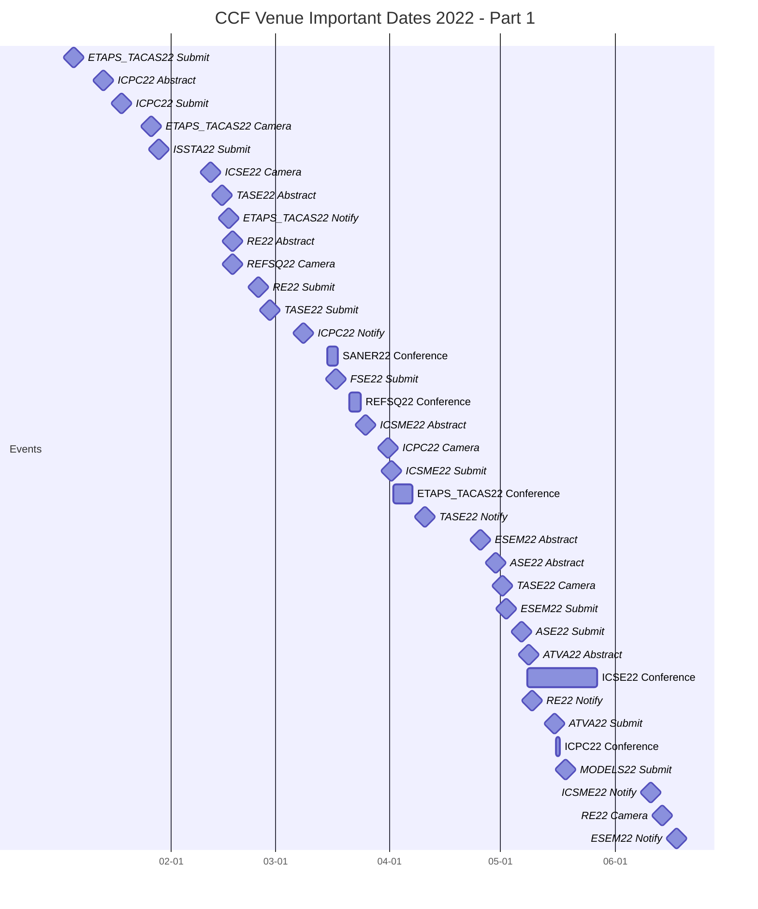
```mermaid
gantt
  title CCF Venue Important Dates 2022 - Part 1
  dateFormat YYYY-MM-DD
  axisFormat %m-%d

  section Events
  ETAPS_TACAS22 Submit :milestone, etaps_tacas_22_1_20220105, 2022-01-05, 1d
  ICPC22 Abstract :milestone, icpc_22_2_20220113, 2022-01-13, 1d
  ICPC22 Submit :milestone, icpc_22_3_20220118, 2022-01-18, 1d
  ETAPS_TACAS22 Camera :milestone, etaps_tacas_22_4_20220126, 2022-01-26, 1d
  ISSTA22 Submit :milestone, issta_22_5_20220128, 2022-01-28, 1d
  ICSE22 Camera :milestone, icse_22_6_20220211, 2022-02-11, 1d
  TASE22 Abstract :milestone, tase_22_7_20220214, 2022-02-14, 1d
  ETAPS_TACAS22 Notify :milestone, etaps_tacas_22_8_20220216, 2022-02-16, 1d
  RE22 Abstract :milestone, re_22_9_20220217, 2022-02-17, 1d
  REFSQ22 Camera :milestone, refsq_22_10_20220217, 2022-02-17, 1d
  RE22 Submit :milestone, re_22_11_20220224, 2022-02-24, 1d
  TASE22 Submit :milestone, tase_22_12_20220227, 2022-02-27, 1d
  ICPC22 Notify :milestone, icpc_22_13_20220308, 2022-03-08, 1d
  SANER22 Conference :saner_22_14_20220315, 2022-03-15, 2022-03-18
  FSE22 Submit :milestone, fse_22_15_20220317, 2022-03-17, 1d
  REFSQ22 Conference :refsq_22_16_20220321, 2022-03-21, 2022-03-24
  ICSME22 Abstract :milestone, icsme_22_17_20220325, 2022-03-25, 1d
  ICPC22 Camera :milestone, icpc_22_18_20220331, 2022-03-31, 1d
  ICSME22 Submit :milestone, icsme_22_19_20220401, 2022-04-01, 1d
  ETAPS_TACAS22 Conference :etaps_tacas_22_20_20220402, 2022-04-02, 2022-04-07
  TASE22 Notify :milestone, tase_22_21_20220410, 2022-04-10, 1d
  ESEM22 Abstract :milestone, esem_22_22_20220425, 2022-04-25, 1d
  ASE22 Abstract :milestone, ase_22_23_20220429, 2022-04-29, 1d
  TASE22 Camera :milestone, tase_22_24_20220501, 2022-05-01, 1d
  ESEM22 Submit :milestone, esem_22_25_20220502, 2022-05-02, 1d
  ASE22 Submit :milestone, ase_22_26_20220506, 2022-05-06, 1d
  ATVA22 Abstract :milestone, atva_22_27_20220508, 2022-05-08, 1d
  ICSE22 Conference :icse_22_28_20220508, 2022-05-08, 2022-05-27
  RE22 Notify :milestone, re_22_29_20220509, 2022-05-09, 1d
  ATVA22 Submit :milestone, atva_22_30_20220515, 2022-05-15, 1d
  ICPC22 Conference :icpc_22_31_20220516, 2022-05-16, 2022-05-17
  MODELS22 Submit :milestone, models_22_32_20220518, 2022-05-18, 1d
  ICSME22 Notify :milestone, icsme_22_33_20220610, 2022-06-10, 1d
  RE22 Camera :milestone, re_22_34_20220613, 2022-06-13, 1d
  ESEM22 Notify :milestone, esem_22_35_20220617, 2022-06-17, 1d
```

#### 13.2.2 2022 Mermaid 分片 2

```mermaid
gantt
  title CCF Venue Important Dates 2022 - Part 2
  dateFormat YYYY-MM-DD
  axisFormat %m-%d

  section Events
  MODELS22 Rebuttal :models_22_36_20220628, 2022-06-28, 2022-07-01
  ICSME22 Camera :milestone, icsme_22_37_20220701, 2022-07-01, 1d
  ATVA22 Notify :milestone, atva_22_38_20220704, 2022-07-04, 1d
  TASE22 Conference :tase_22_39_20220708, 2022-07-08, 2022-07-10
  MODELS22 Notify :milestone, models_22_40_20220712, 2022-07-12, 1d
  ESEM22 Camera :milestone, esem_22_41_20220715, 2022-07-15, 1d
  ISSTA22 Conference :issta_22_42_20220718, 2022-07-18, 2022-07-22
  ASE22 Notify :milestone, ase_22_43_20220720, 2022-07-20, 1d
  ATVA22 Camera :milestone, atva_22_44_20220801, 2022-08-01, 1d
  MODELS22 Camera :milestone, models_22_45_20220808, 2022-08-08, 1d
  RE22 Conference :re_22_46_20220815, 2022-08-15, 2022-08-20
  QRS22 Abstract :milestone, qrs_22_47_20220831, 2022-08-31, 1d
  ICSE23 Submit :milestone, icse_23_48_20220901, 2022-09-01, 1d
  QRS22 Submit :milestone, qrs_22_49_20220910, 2022-09-10, 1d
  ESEM22 Conference :esem_22_50_20220918, 2022-09-18, 2022-09-23
  ICSME22 Conference :icsme_22_51_20221003, 2022-10-03, 2022-10-07
  ASE22 Conference :ase_22_52_20221010, 2022-10-10, 2022-10-14
  ETAPS_TACAS23 Submit :milestone, etaps_tacas_23_53_20221013, 2022-10-13, 1d
  SANER23 Abstract :milestone, saner_23_54_20221014, 2022-10-14, 1d
  SANER23 Submit :milestone, saner_23_55_20221021, 2022-10-21, 1d
  MODELS22 Conference :models_22_56_20221023, 2022-10-23, 2022-10-28
  ATVA22 Conference :atva_22_57_20221025, 2022-10-25, 2022-10-28
  QRS22 Notify :milestone, qrs_22_58_20221101, 2022-11-01, 1d
  ISSTA23 Submit :milestone, issta_23_59_20221110, 2022-11-10, 1d
  ETAPS_TACAS23 Submit :milestone, etaps_tacas_23_60_20221110, 2022-11-10, 1d
  REFSQ23 Abstract :milestone, refsq_23_61_20221111, 2022-11-11, 1d
  FSE22 Conference :fse_22_62_20221114, 2022-11-14, 2022-11-18
  ICSE23 Rebuttal :icse_23_63_20221114, 2022-11-14, 2022-11-19
  QRS22 Camera :milestone, qrs_22_64_20221115, 2022-11-15, 1d
  REFSQ23 Submit :milestone, refsq_23_65_20221118, 2022-11-18, 1d
  ICSE23 Rebuttal :icse_23_66_20221129, 2022-11-29, 2022-11-30
  QRS22 Conference :qrs_22_67_20221205, 2022-12-05, 2022-12-09
  ETAPS_TACAS23 Rebuttal :etaps_tacas_23_68_20221206, 2022-12-06, 2022-12-08
  ICSE23 Notify :milestone, icse_23_69_20221209, 2022-12-09, 1d
  ICPC23 Abstract :milestone, icpc_23_70_20221212, 2022-12-12, 1d
```

#### 13.2.3 2022 Mermaid 分片 3

```mermaid
gantt
  title CCF Venue Important Dates 2022 - Part 3
  dateFormat YYYY-MM-DD
  axisFormat %m-%d

  section Events
  SANER23 Notify :milestone, saner_23_71_20221216, 2022-12-16, 1d
  ICPC23 Submit :milestone, icpc_23_72_20221219, 2022-12-19, 1d
  ETAPS_TACAS23 Notify :milestone, etaps_tacas_23_73_20221222, 2022-12-22, 1d
```

#### 13.2.4 PR-9 P2 Mermaid 分片

```mermaid
gantt
  title CCF Venue Important Dates 2022 - PR-9 P2 Neighboring
  dateFormat YYYY-MM-DD
  axisFormat %m-%d

  section APSEC_P2
  APSEC2022 Abstract :milestone, pr9_conf_c_apsec_2022_abstract_20220713, 2022-07-13, 1d
  APSEC2022 Camera-ready :milestone, pr9_conf_c_apsec_2022_camera_ready_20221017, 2022-10-17, 1d
  APSEC2022 Conference :pr9_conf_c_apsec_2022_conference_20221206, 2022-12-06, 2022-12-09
  APSEC2022 Notification :milestone, pr9_conf_c_apsec_2022_notification_20220825, 2022-08-25, 1d
  APSEC2022 Submission :milestone, pr9_conf_c_apsec_2022_submission_20220720, 2022-07-20, 1d

  section EASE_P2
  EASE2022 Abstract :milestone, pr9_conf_c_ease_2022_abstract_20220124, 2022-01-24, 1d
  EASE2022 Camera-ready :milestone, pr9_conf_c_ease_2022_camera_ready_20220424, 2022-04-24, 1d
  EASE2022 Conference :pr9_conf_c_ease_2022_conference_20220613, 2022-06-13, 2022-06-15
  EASE2022 Notification :milestone, pr9_conf_c_ease_2022_notification_20220316, 2022-03-16, 1d
  EASE2022 Submission :milestone, pr9_conf_c_ease_2022_submission_20220131, 2022-01-31, 1d

  section MSR_P2
  MSR2022 Abstract :milestone, pr9_conf_c_msr_2022_abstract_20220117, 2022-01-17, 1d
  MSR2022 Camera-ready :milestone, pr9_conf_c_msr_2022_camera_ready_20220331, 2022-03-31, 1d
  MSR2022 Conference :pr9_conf_c_msr_2022_conference_20220523, 2022-05-23, 2022-05-24
  MSR2022 Notification :milestone, pr9_conf_c_msr_2022_notification_20220308, 2022-03-08, 1d
  MSR2022 Rebuttal :pr9_conf_c_msr_2022_rebuttal_20220222, 2022-02-22, 2022-02-24
  MSR2022 Submission :milestone, pr9_conf_c_msr_2022_submission_20220120, 2022-01-20, 1d

  section RV_P2
  RV2022 Camera-ready :milestone, pr9_conf_c_rv_2022_camera_ready_20220809, 2022-08-09, 1d
  RV2022 Conference :pr9_conf_c_rv_2022_conference_20220928, 2022-09-28, 2022-09-30
  RV2022 Notification :milestone, pr9_conf_c_rv_2022_notification_20220627, 2022-06-27, 1d
  RV2022 Submission :milestone, pr9_conf_c_rv_2022_submission_20220519, 2022-05-19, 1d

  section SEKE_P2
  SEKE2022 Camera-ready :milestone, pr9_conf_c_seke_2022_camera_ready_20220510, 2022-05-10, 1d
  SEKE2022 Conference :pr9_conf_c_seke_2022_conference_20220701, 2022-07-01, 2022-07-10
  SEKE2022 Notification :milestone, pr9_conf_c_seke_2022_notification_20220420, 2022-04-20, 1d
  SEKE2022 Submission :milestone, pr9_conf_c_seke_2022_submission_20220315, 2022-03-15, 1d

```
## 14. 期刊滚动投稿 / 未定日期

| 年份 | Journal | CCF | 投稿模式 | Author guidelines | Submission system | Special issue / topical collection | 截止时间 | Volume / issue | Online first | 本库年度页 | 核验状态 | 备注 |
|---|---|---|---|---|---|---|---|---|---|---|---|---|
| 2026 | [TSE](./journal-a-tse/README.md) | A | 常规 rolling submission | [IEEE CS Author Resources](https://www.computer.org/publications/author-resources/) | [IEEE Publishing Portal](https://publishingportal.ieee.org/) | 无已知 active dated special issue | 未定 | [TSE archive](https://www.computer.org/csdl/journal/ts) | [TSE archive](https://www.computer.org/csdl/journal/ts) | [TSE 2026](./journal-a-tse/2026/README.md) | 🟡 部分核验 | Publishing Portal 是入口；实际 peer-review destination / TSE 专属 ScholarOne 子站待官方当前页确认。 |
| 2026 | [TOSEM](./journal-a-tosem/README.md) | A | 常规 rolling submission | [ACM DL TOSEM author guidelines](https://dl.acm.org/journal/tosem/author-guidelines) | [TOSEM ScholarOne 候选入口](https://mc.manuscriptcentral.com/tosem) | Agentic AI 线索，deadline 未公布 | 未定 | [ACM DL TOSEM](https://dl.acm.org/journal/tosem) | [TOSEM Just Accepted](https://dl.acm.org/journal/tosem/just-accepted) | [TOSEM 2026](./journal-a-tosem/2026/README.md) | 🟡 部分核验 | ACM DL 动态访问受限；TOSEM ScholarOne 仍作为候选入口，canonical 跳转待人工确认。 |
| 2026 | [SoSyM](./journal-b-sosym/README.md) | B | 常规 rolling submission；theme section 另列 | [Springer submission guidelines](https://link.springer.com/journal/10270/submission-guidelines) | [SoSyM Manuscript Central](https://mc.manuscriptcentral.com/sosym) | [Industry 5.0 theme section](https://link.springer.com/collections/hhibjbacdf)；[Digital Twins rolling theme section](https://www.sosym.org/edtconf_journal_first/) | Industry 5.0: 2026-07-15 待补时刻；Digital Twins: rolling | [Vol. 25 Issue 1](https://link.springer.com/journal/10270/volumes-and-issues/25-1) | [SoSyM online](https://www.sosym.org/online/) | [SoSyM 2026](./journal-b-sosym/2026/README.md) | 🟡 部分核验 | Industry 5.0 与 Digital Twins 是不同 theme section；Industry 5.0 CFP 提示 SoSyM online submission system 将变更。 |
| 2026 | [Requirements Engineering](./journal-b-re/README.md) | B | 常规 rolling submission；2026 collections 另列 | [Springer submission guidelines](https://link.springer.com/journal/766/submission-guidelines) | [Springer Nature Submit manuscript](https://submission.springernature.com/new-submission/766/3) | [LLM collection](https://link.springer.com/collections/deebijccbh)；[30th Anniversary](https://link.springer.com/collections/hegaifabjh)；[REFSQ 2026](https://link.springer.com/collections/gidfjjdijf) | LLM: 2026-04-30 已关闭；30th Anniversary: 2026-06-20 待补时刻；REFSQ 2026: 2026-06-29 待补时刻 | [Vol. 31 Issue 1](https://link.springer.com/journal/766/volumes-and-issues/31-1) | [Springer online first](https://link.springer.com/journal/766/online-first) | [Requirements Engineering 2026](./journal-b-re/2026/README.md) | 🟡 部分核验 | 常规投稿 rolling；带明确日期的 collection 已进入 2026 dated timeline / Mermaid，不在 2027/2028 重复。 |
| 2026 | [STVR](./journal-b-stvr/README.md) | B | 常规 rolling submission | [Wiley STVR for authors](https://onlinelibrary.wiley.com/page/journal/10991689/homepage/forauthors.html)；[Wiley Authors STVR dashboard](https://authors.wiley.com/dashboard/journal?groupCode=STVR) | [Wiley Authors STVR dashboard](https://authors.wiley.com/dashboard/journal?groupCode=STVR)；[Wiley submission candidate for STVR](https://submission.wiley.com/submission/submissionBoard/new/?journalCode=STVR) | 无已知 active dated CFP | 未定 | [Wiley volume archive](https://onlinelibrary.wiley.com/loi/10991689) | [Wiley STVR Early View](https://onlinelibrary.wiley.com/journal/10991689/earlyview) | [STVR 2026](./journal-b-stvr/2026/README.md) | 🟡 部分核验；Wiley CLI WAF/403 | Wiley 官方页面需人工浏览器核验；DBLP 2026 年度页未公布。 |
| 2026 | [STTT](./journal-c-sttt/README.md) | C | 常规 rolling submission；conference-based special issue 需另证 | [Springer submission guidelines](https://link.springer.com/journal/10009/submission-guidelines) | [Equinocs](https://equinocs.cs.tu-dortmund.de/home) | 无已知 active dated CFP；[special issue guidelines](https://link.springer.com/journal/10009/updates/25280072) | 未定 | [Vol. 28 Issue 1](https://link.springer.com/journal/10009/volumes-and-issues/28-1) / [Issue 2](https://link.springer.com/journal/10009/volumes-and-issues/28-2) | [Online first](https://link.springer.com/journal/10009/online-first) | [STTT 2026](./journal-c-sttt/2026/README.md) | 🟡 部分核验 | DBLP `entry article` baseline 不与 TACAS/SPIN/FMICS/RV 等会议 proceedings 混算。 |
| 2026 | [JSEP](./journal-b-jsep/README.md) | B | 常规 rolling submission 候选；Wiley 正文待核验 | [Wiley for authors](https://onlinelibrary.wiley.com/hub/journal/20477481/homepage/forauthors.html) | [ScholarOne / Manuscript Central candidate](https://mc.manuscriptcentral.com/jsme) | 无已知 active dated CFP；DBLP 显示 2022-2025 已出版 special issue 线索 | 未定 | [Wiley issues](https://onlinelibrary.wiley.com/journal/20477481/issues) | [Wiley current issue candidate（Early View 待定位）](https://onlinelibrary.wiley.com/journal/20477481/currentissue) | [JSEP 2026](./journal-b-jsep/2026/README.md) | 🟡 部分核验；Wiley CLI WAF/403 | Wiley 官方主页 / author guidelines / editorial board 均需人工浏览器核验；Early View / articles in press 入口待定位；DBLP 当前只到 2025。 |
| 2026 | [IST](./journal-b-ist/README.md) | B | 常规 rolling submission；ScienceDirect candidate CFP 待人工核验 | [Guide for Authors](https://www.sciencedirect.com/science/journal/09505849/publish/guide-for-authors) | [Editorial Manager INFSoF](https://www.editorialmanager.com/infsof/default.aspx) | [ScienceDirect special issues](https://www.sciencedirect.com/journal/information-and-software-technology/special-issues)；candidate CFP 不写成已核验 deadline | 未定；candidate special issue deadline 待人工浏览器核验 | [ScienceDirect all issues](https://www.sciencedirect.com/journal/information-and-software-technology/issues) / [DBLP IST](https://dblp.org/db/journals/infsof/index.html) | [Articles in Press](https://www.sciencedirect.com/journal/information-and-software-technology/articles-in-press) | [IST 2026](./journal-b-ist/2026/README.md) | 🟡 部分核验；ScienceDirect CLI WAF/403 | 常规投稿 rolling；不因 candidate special issue URL 生成 Mermaid milestone。 |
| 2026 | [SCP](./journal-b-scp/README.md) | B | 常规 rolling submission；ScienceDirect candidate CFP 待人工核验 | [Guide for Authors](https://www.sciencedirect.com/science/journal/01676423/publish/guide-for-authors) | [Editorial Manager SCICO](https://www.editorialmanager.com/scico/default.aspx) | [ScienceDirect special issues](https://www.sciencedirect.com/journal/science-of-computer-programming/special-issues)；candidate CFP 不写成已核验 deadline | 未定；candidate special issue deadline 待人工浏览器核验 | [ScienceDirect all issues](https://www.sciencedirect.com/journal/science-of-computer-programming/issues) / [DBLP SCP](https://dblp.org/db/journals/scp/index.html) | [Articles in Press](https://www.sciencedirect.com/journal/science-of-computer-programming/articles-in-press) | [SCP 2026](./journal-b-scp/2026/README.md) | 🟡 部分核验；ScienceDirect CLI WAF/403 | Editorial Manager 正确代码是 `scico`，不得误用 `scp`；candidate special issue 待浏览器核验。 |
| 2026 | [Empirical Software Engineering](./journal-b-ese/README.md) | B | 常规 rolling submission；collections 另列 | [Springer submission guidelines](https://link.springer.com/journal/10664/submission-guidelines) | [Editorial Manager EMSE](https://www.editorialmanager.com/emse/) | [Advancing SE with LLMs（Closed；仅 review / revision / final notification 阶段）](https://link.springer.com/collections/jfdgedjehb)；[Agentic SE](https://link.springer.com/collections/aaaihgcafc)；[FORGE 2026](https://link.springer.com/collections/aciaceiigh)；[EASE 2026](https://link.springer.com/collections/jefiadfibb)；[PROMPT-SE 2026](https://link.springer.com/collections/bddiejbihe) | LLM collection: 2026-05-31 review、2026-07-15 revision、2026-09-15 final notification（Closed，不是新投稿窗口）；Agentic: 2026-09-28 待补时刻；FORGE: 2026-10-02 待补时刻；EASE: 2026-10-31 待补时刻；PROMPT-SE: 2027-03-01 待补时刻 | [Vol. 31 Issue 1](https://link.springer.com/journal/10664/volumes-and-issues/31-1) | [Online first](https://link.springer.com/journal/10664/online-first) | [ESE 2026](./journal-b-ese/2026/README.md) | 🟡 部分核验 | 常规投稿 rolling；带明确日期的 collection 已同步进 2025--2027 dated timeline / Mermaid；closed collection 在本行只作交叉索引。 |
| 2026 | [JSS](./journal-b-jss/README.md) | B | 常规 rolling submission；special issue 另列 | [Guide for authors](https://www.sciencedirect.com/journal/journal-of-systems-and-software/publish/guide-for-authors) | [Editorial Manager JSS](https://www.editorialmanager.com/jssoftware/default.aspx) | [AI for Software Architecting](https://www.sciencedirect.com/special-issue/329237/artificial-intelligence-for-software-architecting-ai-for-sa)；[AI Techniques for Performance / Reliability / Sustainability](https://www.sciencedirect.com/special-issue/329342/special-issue-on-ai-techniques-for-performance-reliability-and-sustainability-of-modern-software-systems) | AI for SA: 2026-03-15 待补时刻；AI Techniques: 2026-09-30 待补时刻 | [ScienceDirect issues](https://www.sciencedirect.com/journal/journal-of-systems-and-software/issues) | [Articles in press](https://www.sciencedirect.com/journal/journal-of-systems-and-software/articles-in-press) | [JSS 2026](./journal-b-jss/2026/README.md) | 🟡 部分核验；ScienceDirect CLI 可能 403/WAF | 常规投稿 rolling；ScienceDirect special issue URL 可定位但正文需浏览器复核。 |
| 2026 | [SQJ](./journal-c-sqj/README.md) | C | 常规 rolling submission；topical collection 另列 | [Springer submission guidelines](https://link.springer.com/journal/11219/submission-guidelines) | [Springer Nature Submit manuscript](https://submission.nature.com/new-submission/11219/3) | [Software Quality in an AI-Driven World](https://link.springer.com/collections/bjjddgfaei) | 2026-03-30 待补时刻（当前已关闭；历史 deadline 日期待官方归档源复核） | [Vol. 34 Issue 1](https://link.springer.com/journal/11219/volumes-and-issues/34-1) | [Springer articles](https://link.springer.com/journal/11219/articles) | [SQJ 2026](./journal-c-sqj/2026/README.md) | 🟡 部分核验 | 常规投稿 rolling；AI-Driven World collection 已进入 2026 dated timeline；当前 collection 页面显示 Closed，不写成当前可行动窗口。 |

## 15. 待补与核查记录

| Venue | 年份 | 问题 | 当前处理 | 下一步 |
|---|---|---|---|---|
| IST | 2022-2028 / 2029+ | ScienceDirect / Elsevier 页面 CLI WAF/403，scope、editorial board、special issue deadline 与 all issues 正文需浏览器核验 | 保留官方 URL；只写 DBLP `entry article` baseline，不把 candidate special issue 写成 dated event | 人工浏览器核验 editorial roster、candidate CFP deadline、ScienceDirect volume / issue 与 Articles in Press 当前性 |
| SCP | 2022-2028 / 2029+ | ScienceDirect / Elsevier 页面 CLI WAF/403；Editorial Manager 正确代码为 `scico`，candidate special issue deadline 未核验 | 保留官方 URL；只写 DBLP `entry article` baseline，不把 candidate special issue 写成 dated event | 人工浏览器核验 editorial roster、candidate CFP deadline、ScienceDirect volume / issue 与 Articles in Press 当前性 |
| QRS | 2026 | accepted papers / program / DBLP 年度页尚未发布，官网只有 submission stats / proceedings shell | 年度页与 TIMELINE 只记录可核验 dates、proceedings 入口和 DBLP series fallback，不写 accepted count | 会后复核 official program、IEEE proceedings、DBLP 年度页和 regular / short / workshop 计数边界 |
| QRS | 2027-2028 / 2029+ | 未发现官方年度主页 / CFP / important dates | 年度页写 `⏳ 已检索未公布`，TIMELINE 不造日期 | 后续复查 QRS techconf series、DBLP 与 IEEE proceedings |
| TASE | 2026 | Important Dates 页与 CFP 页 notification 存在 2026-04-18 / 2026-04-15 差异；Springer / DBLP 2026 未发布 | 年度页和 TIMELINE 以 Important Dates 页 2026-04-18 为准，并记录冲突；accepted count 不与后续 Springer TOC 混算 | 会后复核 Springer LNCS、DBLP 年度页和 official accepted list / publisher TOC 差异 |
| TASE | 2027-2028 / 2029+ | 未发现官方年度主页 / CFP / important dates，且没有稳定独立 official series page | 年度页写 `⏳ 已检索未公布`；根 README 使用最新年度主页 + DBLP index 作入口，不冒充 series page | 后续复查 TASE GitHub annual pages、Springer 和 DBLP |
| ICSE | 2028 | 年度主页当前 Access denied，仅找到 Hawaii 预告 | 根 README / 年度 README 不写成正式 CFP | 后续复查年度主页与 Research Track |
| ICSE | 2026 | accepted papers 已公开，但 proceedings / DBLP 年度页未公开 | 论文数量按官方 Research Track accepted papers 表记录，核验状态为部分核验 | 后续补 DBLP / proceedings |
| MoDELS | 2026 | submission / rebuttal 已过但 notification 尚未到达 | 当前阶段统一写作 `🟡 审稿中`，program probe 为 Access denied | notification 后复核状态并补 accepted papers / proceedings |
| MoDELS | 2027-2028 | 官方 home / dates / track 未发布 | 年度页标 `⏳ 已检索未公布` | 后续复查 researchr 与长期主页 |
| MoDELS | 2024 | proceedings 页面当前 accessDenied | 继续挂官方 URL，数量用 DBLP fallback | 后续复查 proceedings 页面 |
| ETAPS/TACAS | 2028 | 只有 ETAPS 主页，无 TACAS CFP / dates | 只记录会期，不写 TACAS submission | 后续复查 CFP 与 TACAS 分会页 |
| ETAPS/TACAS | 2024 | TACAS artifact deadline 页面版本差异 | 暂记 `2023-10-26 23:59 AoE` 并保留备注 | 后续精查官方页面 |
| TSE | 2027 / 2028 / 2029+ | 未发现官方年度卷期、online-first 年度入口或 dated special issue | 年度页写 `⏳ 已检索未公布`；不预设未来卷号 | 后续待 IEEE CSDL / DBLP 发布后补录 |
| TOSEM | 2027 / 2028 / 2029+ | 未发现官方年度卷期、online-first 年度入口或 dated special issue | 年度页写 `⏳ 已检索未公布`；不预设未来卷号 | 后续待 ACM DL / DBLP 发布后补录 |
| SoSyM | 2027 / 2028 / 2029+ | 未发现官方年度卷期、online-first 年度入口或 dated special issue | 年度页写 `⏳ 已检索未公布`；不预设未来卷号 | 后续待 Springer / DBLP 发布后补录 |
| SoSyM | 2026 | Digital Twins 是独立 rolling theme section，且 EDTConf'26 日期是 presentation target，不是普通 SoSyM 投稿 deadline | 只放 rolling / 待补记录，不进主 dated timeline | 后续若官方给出固定 journal submission deadline，再同步年度表与 Mermaid |
| Requirements Engineering | 2026 | LLM collection revision / final decision 仅给月份，30th Anniversary 与 REFSQ 2026 collection 给日期但无具体时刻 | TIMELINE 只同步明确日期的 2026-04-30、2026-06-20、2026-06-29；月份节点留备注 | 后续若 Springer 补具体 revision / final decision 日期，再补年度表与 Mermaid |
| Requirements Engineering | 2027 / 2028 / 2029+ | 未发现官方年度卷期、DBLP 年度页或 2029+ dated CFP | 年度页写 `⏳ 已检索未公布`；不预设未来卷号 | 后续待 Springer / DBLP 发布后补录 |
| STVR | 2022-2028 / 2029+ | Wiley Online Library CLI WAF/403，editorial board、for-authors、volume / issue 正文和 Early View 需人工浏览器核验 | 保留官方 URL；用 DBLP 作为论文名录 / 计数 fallback；不臆造 roster 或 future volume | 后续用浏览器核验 Wiley editorial board、ISSN、author guidelines 与卷期正文 |
| STTT | 2022-2026 | conference-based special issue / invited / extended papers 与常规期刊 article 混在 DBLP 年度 baseline 中 | 仅写 DBLP `entry article` baseline，并在根 README 与年度页说明不得和会议 proceedings 混算 | 后续按 Springer issue TOC / article type 拆普通稿、special section 与 invited papers |
| STTT | 2027 / 2028 / 2029+ | 未发现官方年度卷期、DBLP 年度页或 active dated CFP | 年度页写 `⏳ 已检索未公布`；不预设未来卷号 | 后续待 Springer / DBLP 发布后补录 |
| ESEM | 2022-2025 | 2022 已定位 ACM DL proceedings；2023-2025 proceedings 出版商入口、历史 submission system 和论文数量仍未逐项闭合 | 年度页保留 official program / DBLP fallback，并明确部分核验 | 后续优先补 2023-2025 ACM / IEEE / LIPIcs proceedings 官方入口，并复核 2022-2025 Technical Track / ESEIW track 分离计数 |
| ESEM | 2027-2028 | 未发现 official home / CFP / dates | 年度页写 `⏳ 已检索未公布`，不预造 deadline 或地点 | 后续复查 researchr series、ESEIW umbrella 与 ESEM track 页面 |
| Empirical Software Engineering | 2025-2027 | 多个 Springer collection 同时包含 submission / review / revision / notification 日期 | TIMELINE 按事件类型分列，submission deadline 与 review / revision / notification 不混写 | 后续若 Springer 更新 collection 状态或具体时刻，再同步年度 README 与 Mermaid |
| Empirical Software Engineering | 2027-2028 | 未来年度卷期、DBLP 年度页和 2028 dated collection 未公布 | 年度页保留 rolling submission 与 online-first 长期入口，未来年度写 `⏳ 已检索未公布` | 后续待 Springer / DBLP 发布后补录，不预设未来卷号 |
| JSS | 2022-2028 | ScienceDirect CLI 可能 403/WAF，special issue / issue 正文和 Editorial Manager landing 需人工浏览器核验 | 保留官方 URL，标注 CLI/WAF 风险；DBLP volume set 只作 fallback | 后续用浏览器核验 editorial board、issue TOC、special issue 状态和逐卷论文数量 |
| SQJ | 2026 | `Software Quality in an AI-Driven World` 当前 Springer collection 页面显示 Closed，历史 deadline 日期仍需官方归档源复核 | TIMELINE 保留 2026-03-30 dated event，状态写 `✅ 已关闭` 且备注日期待复核 | 后续用浏览器 / 官方归档复查 deadline 和 guest editor 信息 |
| SQJ | 当前 roster | Co-EiC / Managing Editor 未公开，W. Eric Wong / Christoph Treude 属待核验线索 | 根 README 应区分当前 official roster 与待核验线索，不把线索写成已核验角色 | 后续找到官方 collection / board 来源后再升级为正式核心人员事实 |
| Empirical Software Engineering | 2026 | FORGE 2026 邀请制 collection 当前 Open，deadline 为 2026-10-02 | 已补入 ESE 2026 年度页、近期窗口、2026 timeline 与 Mermaid；editors 为 Gabriele Bavota / Yuan Tian | 后续跟踪 collection 状态变化和是否出现 published articles |
| SANER | 2022 | 官方 CFP / submission system 未恢复；第三方 deadline 只作线索 | 年度页保留 IEEE / DBLP / official home，deadline 不写成官方事实 | 后续用浏览器 / Wayback / IEEE CFP 精查 |
| SANER | 2027-2028 / 2029+ | 2027 已有 Research Track dates；2028 仅有 announcement 线索，未检到 official home / CFP | 2027 进入 TIMELINE；2028 年度页写 `⏳ 已检索未公布` | 后续复查 researchr series 与 SANER 官方公告 |
| ICSME | 2022 | IEEE CFP、archive 首页和 proceedings 封面会期不一致 | TIMELINE 按 IEEE CFP 记录并显式标注日期冲突待核 | 后续人工浏览器核验最终会期口径 |
| ICSME | 2026-2028 / 2029+ | 2026 camera-ready 仍为 TBD；2027+ 未发现官方年度页 / CFP | 2026 年度页不预设 camera-ready；2027/2028 写 `⏳ 已检索未公布` | 后续复查 researchr / IEEE CFP / DBLP |
| ICPC | 2026-2028 / 2029+ | 2026 DBLP / proceedings 尚未稳定公开；2027+ 未检到官方年度页 | 2026 只记录 official dates / HotCRP / program；future 年度占位 | 后续补 proceedings、DBLP 和 SC 人员细化 |
| JSEP | 2022-2028 / 2029+ | Wiley Online Library CLI WAF/403；author guidelines、editorial board、volume / issue 需人工浏览器核验，Early View / articles in press 入口待定位 | 保留 Wiley 官方 URL；用 DBLP 2022-2025 `entry article` baseline；2026+ 不预设卷号 | 后续用浏览器核验 Wiley roster、投稿入口、Early View 与 future volume |

## 16. Mermaid 示例与维护规范

单日 deadline 使用 `milestone`：

```mermaid
gantt
  title Example Single Deadline
  dateFormat YYYY-MM-DD
  axisFormat %m-%d

  section ICSE
  ICSE submission :milestone, icse_sub, 2026-03-01, 1d
```

多日窗口使用普通任务，起止日期均来自官方来源：

```mermaid
gantt
  title Example Date Windows
  dateFormat YYYY-MM-DD
  axisFormat %m-%d

  section ICSE
  ICSE rebuttal :icse_rebuttal, 2026-05-01, 2026-05-07
  ICSE conference :icse_conf, 2026-10-01, 2026-10-07
```

更新 Mermaid 后，应至少人工检查 Markdown 预览；若本地有 Mermaid CLI，可运行渲染检查，但不得为了通过渲染而删掉表格事实。

## 17. 会议 / 期刊事实合流提示

| 合流对象 | 维护边界 | 必须保留 | 不应做 |
|---|---|---|---|
| 会议 dated events | 会议年度 README 与会议根 README | ICSE / MoDELS / ETAPS 等会议的 abstract、submission、notification、camera-ready、conference dates；按事件发生年份落表 | 不要用空白年度 TODO 行覆盖已经核验的会议事件 |
| 期刊 dated events | 期刊 special issue / topical collection 年度记录 | SoSyM Industry 5.0 intent / submission / notification 与 Requirements Engineering 2026 collections 等带明确日期的期刊事件 | 不要因为会议数据回填而删除期刊专刊事件 |
| 期刊 rolling / 未定日期表 | 期刊根 README 与年度 README | TSE / TOSEM / SoSyM / Requirements Engineering / STVR / STTT / JSEP / ESE / JSS / SQJ / IST / SCP 的 rolling submission、author guidelines、submission system、volume / online-first 入口 | 不要把 rolling journal 伪造成 dated Mermaid deadline |
| PR-9 P2 邻近观察 dated events | P2 会议年度 README 与 [SUMMARY.md](./SUMMARY.md) §9.3 | APSEC / SEKE / EASE / MSR / RV 的 2022--2026 main / technical / research chain 与 conference dates；备注必须保留“不升级为 P0/P1 主线” | 不要把 P2 venue 写成 P0/P1 主投目标，也不要把 2027/2028 未公布事项造进 dated Mermaid |
| Mermaid 年度图 | 与年度总表一致的事件集合 | 必要时按会议 / 期刊专刊拆图 | 不要因合流删表格事实或删另一类已核验图块 |

## 18. 更新日志

更新日志按时间降序排列，最新记录置于最上方。

| 时间 | 更新内容 |
|---|---|
| `2026-06-05 22:34` | PR-9 merge 最新上游 PR-8：保留 PR-6 / PR-7 / PR-8 的 SANER / ICSME / ICPC / JSEP、ESEM / ESE / JSS / SQJ、IST / SCP / QRS / TASE facts，并合入 APSEC / SEKE / EASE / MSR / RV P2 dated events、P2 Mermaid 分片与 39/273 组合统计。 |
| `2026-06-05 21:16` | PR-8 merge 最新上游 PR-6 / PR-7：保留 SANER / ICSME / ICPC / JSEP、ESEM / ESE / JSS / SQJ 与 IST / SCP / QRS / TASE 双方 facts，重排年度事件表，重生成 Mermaid 分片并将当前组合统计提升为 34 个 venue / 238 个年度 README。 |
| `2026-06-05 20:56` | PR-6 合流 PR-7 后解决 TIMELINE 冲突：保留 SANER / ICSME / ICPC / JSEP 与 ESEM / ESE / JSS / SQJ 事件并集，重排年度事件表，维持期刊 rolling / dated events 共存。 |
| `2026-06-05 20:35` | PR-8 merge upstream PR-7：合并 PR-7 ESEM / ESE / JSS / SQJ dated events、rolling 表与 PR-8 QRS / TASE dated events、IST / SCP rolling 表，重排年度表并保留 2022--2026 Mermaid 分片。 |
| `2026-06-05 19:16` | 修复 PR-8 实现后 review：按年度事件数超过 40 条的既有规则，将 2022--2026 Mermaid 拆成多张分片图，并保留年度总表与 QRS / TASE dated events 不变。 |
| `2026-06-05 19:01` | 最终复审修复：拆分 JSS 长期 roster / special issue guest editor 边界，同步 JSS / SQJ 2026 Mermaid 标签和 ESE rolling 行 closed collection 交叉索引。 |
| `2026-06-05 18:44` | 实现后 review 修复：将 ESE / SQJ Mermaid milestone 标签改为带 collection 语义的短标签，并同步 ESEM 历史投稿入口措辞修复。 |
| `2026-06-05 18:40` | PR-8 形式化 / 工具链补链：新增 QRS / TASE 2022-2026 dated events 到正式年度表与 Mermaid，新增 IST / SCP rolling 投稿行，并把 ScienceDirect WAF/403、QRS/TASE future 年度与计数风险写入待补记录。 |
| `2026-06-05 18:28` | 采纳本地预检 M 级建议：收紧 ESEM proceedings 待补范围，明确 2022 已定位 ACM DL proceedings，后续重点为 2023-2025 出版商入口与 2022-2025 track count 复核。 |
| `2026-06-05 18:13` | PR-7 合流口径修复：收紧 SQJ rolling 表 closed collection 表述，修正待补记录表格断裂，并把当前信息更新时间同步到本轮最终合流。 |
| `2026-06-05 18:13` | PR-6 收尾复核：降级 JSEP rolling 投稿为候选口径，修正 SANER 2022 官方站 HTTP 入口与 HTTPS 证书风险备注。 |
| `2026-06-05 17:58` | PR-7 事实补强：补入 ESE FORGE 2026 邀请制 collection deadline、Agentic SE 第三位 collection editor 线索和 SQJ closed collection / guest editor 核验口径。 |
| `2026-06-05 17:55` | PR-7 实证 / 质量 venue 合流：同步 ESEM 2022-2026 dated events、ESE / JSS / SQJ special issue dated events、期刊 rolling 表、Mermaid 与 PR-7 待补记录，并保留 ScienceDirect WAF 与 Springer closed collection 复核说明。 |
| `2026-06-05 17:35` | PR-6 增量同步 SANER / ICSME / ICPC 会议 dated events 与 JSEP rolling 投稿入口，补入维护修复相关 P1 venue 的 timeline、Mermaid、待补风险记录。 |
| `2026-06-05 15:59` | 实现后 review 修复：把近期投稿窗口从“日期之后”改为“截至信息更新时间仍未错过且可行动”，避免当天 deadline 被误排除。 |
| `2026-06-05 15:36` | PR-5 全局收口：明确近期投稿窗口筛选边界，保持近期窗口作为年度全量表筛选视图而非独立事实源。 |
| `2026-06-05 14:28` | 实现后 review 收尾：补充近期窗口与年度全量表同步说明，并对齐 STVR CCF 等级官方目录链接。 |
| `2026-06-05 13:29` | merge upstream 后同步 TIMELINE：PR-3 形式化 / 验证会议 dated events 与 PR-4 期刊 rolling / Requirements Engineering collections dated events 在近期窗口、年度表、滚动表和 Mermaid 中共存。 |
| `2026-06-05 12:33` | TIMELINE 专项复核 PR-4 期刊合流：补回 Requirements Engineering rolling 投稿行，确认 2026 collection dated events 只落在近期窗口、2026 事件表与 2026 Mermaid。 |
| `2026-06-05 12:18` | 完成 PR-4 期刊合流：新增 Requirements Engineering 2026 collection dated events、REJ/STVR/STTT rolling 投稿行，并记录 Wiley WAF/403、STTT conference-based special issue 与未来年度待补项。 |
| `2026-06-05 11:25` | 根据复审收尾修正 TIMELINE：把 ISSRE 2026 当前阶段统一为复审中，记录 ICFEM/ATVA/ISSRE 最新事实修复已进入正式年度表与 Mermaid，并校正更新日志降序。 |
| `2026-06-05 11:12` | 补充 ATVA 2022 独立年度主页、重要日期、accepted papers 与 Springer proceedings 后，将 ATVA 2022 abstract/submission/notification/camera-ready/conference 同步进 2022 正式时间线与 Mermaid。 |
| `2026-06-05 10:58` | 合并上游 PR-2 后同步 TIMELINE：保留 PR-2 与 PR-3 所有已核验 dated events、期刊 rolling 表和 SoSyM dated event，并修正 ISSRE 2026 extended deadlines 到 2026-04-24。 |
| `2026-06-05 10:04` | PR-3 合流修复：删除临时增量事实表口径，将 PR-3 事件并入正式 2025--2027 年度章节与 Mermaid，并把 PR-3 节降级为未公布年度 / 来源风险审计记录。 |
| `2026-06-05 10:00` | 修复 PR-2 复审发现的 ISSTA 2022/2023 会期遗漏：将年度 README 已记录的会期同步到 2022/2023 事件表与 Mermaid，并保留 ISSTA 独立计数说明。 |
| `2026-06-05 09:46` | PR-3 review 修复：同步当前核查日期为 2026-06-05，并把 ICFEM 2026 extended abstract / full-paper 投稿窗口补入近期投稿窗口速览。 |
| `2026-06-05 00:36` | 合入 PR-1B 期刊试点后完成 TIMELINE 合流：保留会议 dated events、SoSyM Industry 5.0 dated event、期刊 rolling 表和 Mermaid 事实共存规则。 |
| `2026-06-04 23:04` | 吸收 PR-1A 合流协议：TIMELINE 改用事件发生年份口径，新增并行 PR owner 提示，强调会议 dated events、期刊 rolling 表和 SoSyM Industry 5.0 dated event 合并后必须共存。 |
| `2026-06-04 22:05` | 根据正式复审把 SoSyM Industry 5.0 已过 intent 节点标为已过去，避免误读为未来投稿点。 |
| `2026-06-04 21:15` | 根据实现后 review 修正 rolling 表：TOSEM 改用 author-guidelines / Just Accepted / ScholarOne 候选入口，TSE 与 SoSyM 补充投稿入口 caveat，2027/2028 年份说明补充 PR-1B 已核查但无 dated event。 |
| `2026-06-04 20:43` | 回填 PR-1B 期刊试点信息：SoSyM Industry 5.0 dated event、TSE / TOSEM / SoSyM rolling 行、未来年度未公布与 Digital Twins 口径记录。 |
| `2026-06-04 19:37` | 补充 TIMELINE 事件表必须挂事件官方来源、年度主页、论文集 / 名录和本库年度页链接的要求。 |
| `2026-06-04 18:55` | 明确默认未来检索/占位下限为当前年份 + 2（当前到 2028），更远未来若已有官方 CFP / important dates 也必须纳入。 |
