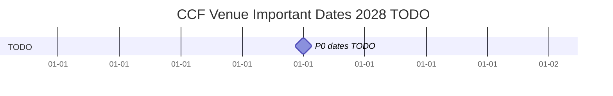
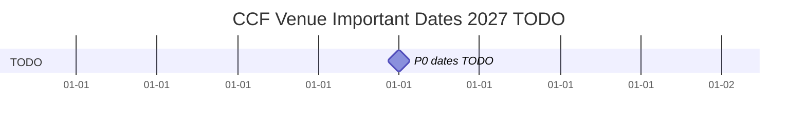
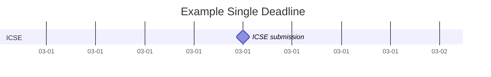
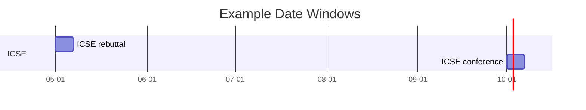

# `ccf_venues/` TIMELINE

> 信息更新时间：`2026-06-04 18:55`（Asia/Shanghai）
> 数据范围：`2022` 至当前年份 + 2 为默认检索与占位下限；已公布 CFP / important dates 的更远未来年度也必须纳入；当前初始化至少覆盖到 `2028`
> 数据来源：各 venue README / 年度 README；本文件是汇总索引，不是事实真源。

## 1. 文档用途

[TIMELINE.md](./TIMELINE.md) 是 `ccf_venues/` 的跨 venue 投稿时间线总览。它不替代各 venue 根 README 或年度 README，而是把已经核验到的会议 / 期刊投稿相关 important dates 按年份串起来，方便直观看到：

1. 每一年哪些 venue 的 abstract / submission / notification / camera-ready / conference dates 聚集在什么时间段。
2. 哪些期刊 special issue 或 topical collection 与会议截稿形成时间冲突。
3. 后续 project_1~4 做投稿规划、论文检索和调研冲刺时，应优先盯哪些时间窗口。

当前文档只固定结构与维护口径；由于正式 venue 年度 README 尚未补齐，本文件不声称已经覆盖任何真实 venue 数据。

## 2. 维护口径

1. **按年份分节**：每个年份一个二级章节，例如 `2028`、`2027`、`2026`，年份按降序排列。
2. **节内按时间升序**：同一年内的表格必须按实际日期时间从早到晚排列。
3. **年度 README 是事实源**：各 venue 年度 README 保存原始核验事实；本文件只做跨 venue 汇总索引。
4. **来源可点击**：每个时间点都必须同时给出官方来源和本库年度 README 链接。
5. **时间精确到分钟**：沿用 [GUIDE.md](./GUIDE.md) 的 `yyyy-mm-dd hh:mm` 口径；官方只给日期时写 `yyyy-mm-dd 待补时刻`。
6. **未来检索下限**：每轮实际搜索默认至少检索到当前年份 + 2；若当前年份 + 1 / +2 没有官方信息，也要在对应 venue 年度页或待补记录中说明已检索但未公布。
7. **更远未来年度**：当前年份 + 3 或更远不强制占位，但只要能找到官方年度主页、`CFP`、important dates 或投稿入口，就必须新增对应年份章节。
8. **期刊区别处理**：rolling submission 不伪造日期，放入“期刊滚动投稿 / 未定日期”；只有 special issue / topical collection 等带明确 ddl 的期刊事件进入年度 dated timeline。
9. **避免超大图**：如果某一年事件超过 `40` 条，按 `A 类 / B 类 / C 类` 或 `会议 / 期刊专刊` 拆成多张 Mermaid 图，仍保持同一年度总表。

## 3. 近期投稿窗口速览

本节只放未来或当前活跃的投稿 / 专刊窗口，便于做投稿规划；历史年度补齐时不需要把所有历史事件复制到这里。

| 日期时间 | Venue | 类型-CCF | Track / 事项 | 日期类型 | 官方来源 | 本库来源 | 核验状态 | 备注 |
|---|---|---|---|---|---|---|---|---|
| 待补 | 待补 | 待补 | 待补 | 待补 | 待补 | 待补 | ⏳ 待核验 | P0 venue 补齐后回填未来 / 活跃窗口。 |

## 4. 事件类型口径

| 日期类型 | 说明 | 是否进入 Mermaid |
|---|---|---|
| `Abstract` | 摘要截止 | 是 |
| `Submission` | 正文 / full paper 截止 | 是 |
| `Rebuttal` | rebuttal / author response 时间窗口 | 是，按起止日期表示 |
| `Notification` | 录用通知 | 是 |
| `Camera-ready` | 终稿截止 | 是 |
| `Conference` | 会期 | 是，按起止日期表示 |
| `Special issue` | 期刊专刊 / topical collection 截止 | 是 |
| `Rolling submission` | 期刊常规滚动投稿 | 否，只在未定日期表中说明 |
| `Proceedings online` | 论文集或年度论文名录上线 | 可选，默认不进图 |

## 5. Mermaid 年度总览规范

1. 默认每年一张 Mermaid `gantt` 图；不要把 `2022` 到未来所有日期塞进一张图。
2. GitHub 支持 Markdown 内 Mermaid，但版本可能滞后；不要使用 Mermaid `timeline` 实验语法作为主图。
3. Mermaid 图只表达日期级粒度；分钟、`AoE`、北京时间换算、官方只给日期等细节放表格备注。
4. 为降低 GitHub 编译风险，图中使用短英文 label，不写 URL、emoji、复杂 `init`、`click`、自定义 CSS 或过长中文 label。

## 6. 2028 时间线

> 当前状态：等待 P0 venue 年度 README 补齐后回填；若某 venue 尚未发布 2028 官方主页，则保留 `⏳ 待官网` 或 `⏳ 已检索未公布` 状态。 若已找到 2029 或更远官方 CFP / important dates，应在本节之前新增对应更高年份章节。

### 6.1 2028 投稿事件总表

| 日期时间 | Venue | 类型-CCF | Track / 事项 | 日期类型 | 官方来源 | 本库来源 | 核验状态 | 备注 |
|---|---|---|---|---|---|---|---|---|
| 待补 | 待补 | 待补 | 待补 | 待补 | 待补 | 待补 | ⏳ 待核验 | P0 venue 补齐后按时间升序维护。 |

### 6.2 2028 Mermaid 可视化

## 7. 2027 时间线

> 当前状态：等待 P0 venue 年度 README 补齐后回填；若某 venue 尚未发布 2027 官方主页，则保留 `⏳ 待官网` 或 `⏳ 已检索未公布` 状态。

### 7.1 2027 投稿事件总表

| 日期时间 | Venue | 类型-CCF | Track / 事项 | 日期类型 | 官方来源 | 本库来源 | 核验状态 | 备注 |
|---|---|---|---|---|---|---|---|---|
| 待补 | 待补 | 待补 | 待补 | 待补 | 待补 | 待补 | ⏳ 待核验 | P0 venue 补齐后按时间升序维护。 |

### 7.2 2027 Mermaid 可视化

## 8. 2026 时间线

> 当前状态：等待 P0 venue 年度 README 补齐后回填。

### 8.1 2026 投稿事件总表

| 日期时间 | Venue | 类型-CCF | Track / 事项 | 日期类型 | 官方来源 | 本库来源 | 核验状态 | 备注 |
|---|---|---|---|---|---|---|---|---|
| 待补 | 待补 | 待补 | 待补 | 待补 | 待补 | 待补 | ⏳ 待核验 | P0 venue 补齐后按时间升序维护。 |

### 8.2 2026 Mermaid 可视化

## 9. 2025 时间线

> 当前状态：等待 P0 venue 年度 README 补齐后回填。

### 9.1 2025 投稿事件总表

| 日期时间 | Venue | 类型-CCF | Track / 事项 | 日期类型 | 官方来源 | 本库来源 | 核验状态 | 备注 |
|---|---|---|---|---|---|---|---|---|
| 待补 | 待补 | 待补 | 待补 | 待补 | 待补 | 待补 | ⏳ 待核验 | P0 venue 补齐后按时间升序维护。 |

### 9.2 2025 Mermaid 可视化

## 10. 2024 时间线

> 当前状态：等待 P0 venue 年度 README 补齐后回填。

### 10.1 2024 投稿事件总表

| 日期时间 | Venue | 类型-CCF | Track / 事项 | 日期类型 | 官方来源 | 本库来源 | 核验状态 | 备注 |
|---|---|---|---|---|---|---|---|---|
| 待补 | 待补 | 待补 | 待补 | 待补 | 待补 | 待补 | ⏳ 待核验 | P0 venue 补齐后按时间升序维护。 |

### 10.2 2024 Mermaid 可视化

## 11. 2023 时间线

> 当前状态：等待 P0 venue 年度 README 补齐后回填。

### 11.1 2023 投稿事件总表

| 日期时间 | Venue | 类型-CCF | Track / 事项 | 日期类型 | 官方来源 | 本库来源 | 核验状态 | 备注 |
|---|---|---|---|---|---|---|---|---|
| 待补 | 待补 | 待补 | 待补 | 待补 | 待补 | 待补 | ⏳ 待核验 | P0 venue 补齐后按时间升序维护。 |

### 11.2 2023 Mermaid 可视化

## 12. 2022 时间线

> 当前状态：等待 P0 venue 年度 README 补齐后回填。

### 12.1 2022 投稿事件总表

| 日期时间 | Venue | 类型-CCF | Track / 事项 | 日期类型 | 官方来源 | 本库来源 | 核验状态 | 备注 |
|---|---|---|---|---|---|---|---|---|
| 待补 | 待补 | 待补 | 待补 | 待补 | 待补 | 待补 | ⏳ 待核验 | P0 venue 补齐后按时间升序维护。 |

### 12.2 2022 Mermaid 可视化

## 13. 期刊滚动投稿 / 未定日期

| 年份 | Journal | CCF | 投稿模式 | Special issue / topical collection | 截止时间 | 官方来源 | 本库来源 | 核验状态 | 备注 |
|---|---|---|---|---|---|---|---|---|---|
| 待补 | 待补 | 待补 | 待补 | 待补 | 未定 | 待补 | 待补 | ⏳ 待核验 | rolling submission 不进入 Mermaid dated timeline。 |

## 14. 待补与冲突记录

| Venue | 年份 | 问题 | 当前处理 | 下一步 |
|---|---|---|---|---|
| 待补 | 待补 | P0 venue 尚未建立年度 README | 保留 timeline 骨架 | 后续逐 venue 补齐后回填 |

## 15. Mermaid 示例与维护规范

单日 deadline 使用 `milestone`：

多日窗口使用普通任务，起止日期均来自官方来源：

更新 Mermaid 后，应至少人工检查 Markdown 预览；若本地有 Mermaid CLI，可运行渲染检查，但不得为了通过渲染而删掉表格事实。

## 16. 更新日志

| 时间 | 更新内容 |
|---|---|
| `2026-06-04 18:55` | 明确默认未来检索/占位下限为当前年份 + 2（当前到 2028），更远未来若已有官方 CFP / important dates 也必须纳入。 |
