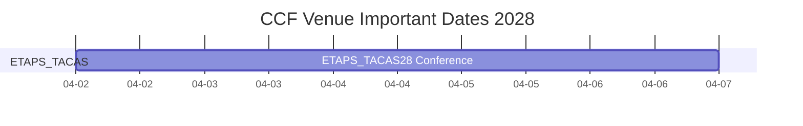
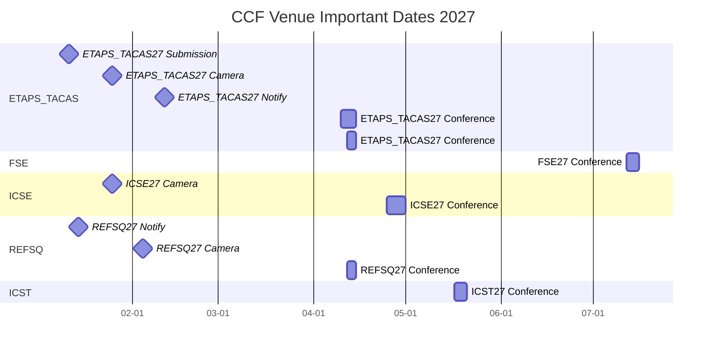
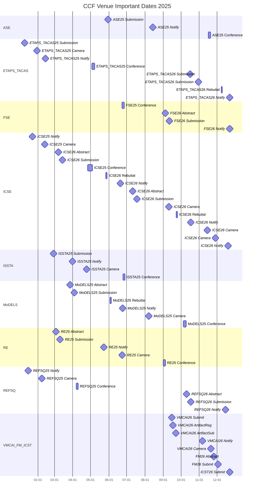
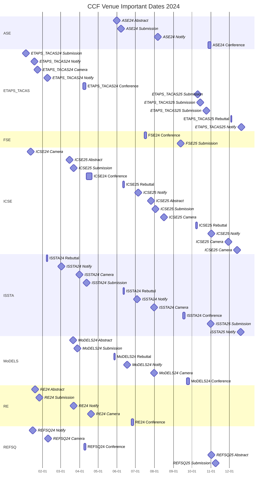
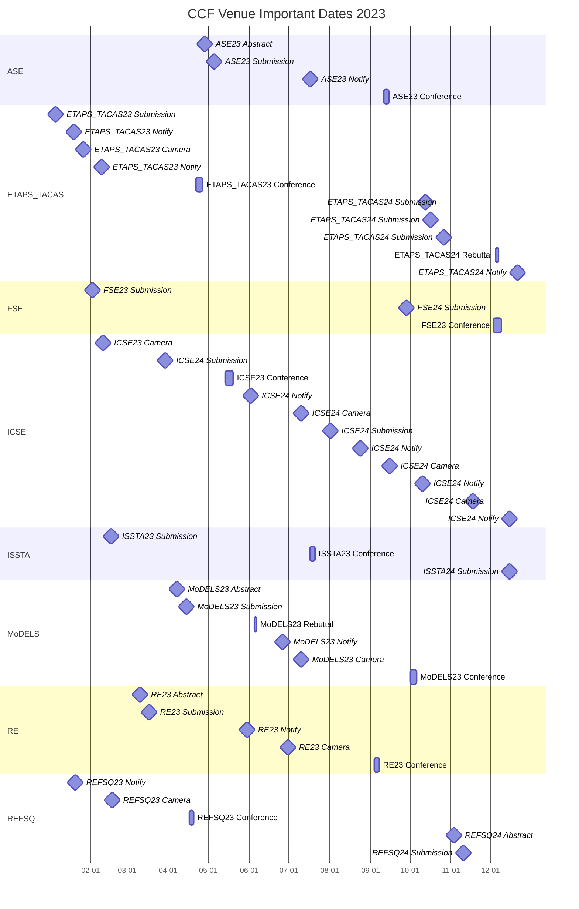
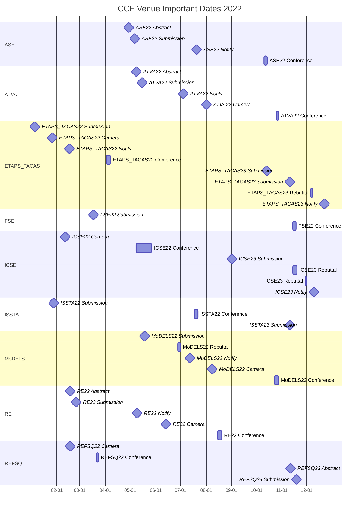
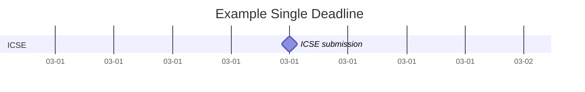
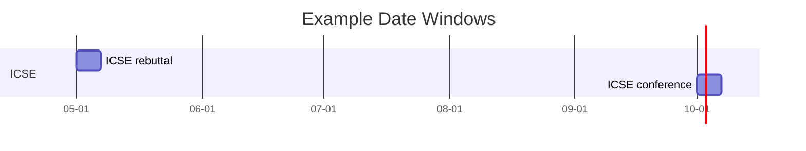

# `ccf_venues/` TIMELINE

> 信息更新时间：`2026-06-05 15:36`（Asia/Shanghai）
> 数据范围：按**事件发生年份**覆盖 `2022` 至当前年份 + 2；已公布 CFP / important dates 的更远未来年度也必须纳入；当前至少覆盖到 `2028`
> 数据来源：各 venue README / 年度 README；本文件是汇总索引，不是事实真源。

## 1. 文档用途

[TIMELINE.md](./TIMELINE.md) 是 `ccf_venues/` 的跨 venue 投稿时间线总览。它不替代各 venue 根 README 或年度 README，而是把已经核验到的会议 / 期刊投稿相关 important dates 按事件发生年份串起来，方便直观看到：

1. 每一年哪些 venue 的 abstract / submission / notification / camera-ready / conference dates 聚集在什么时间段。
2. 哪些会议 edition 的投稿窗口实际落在前一年，例如 `ICSE 2027` 的 submission 在 `2026` 年；哪些期刊 special issue 或 topical collection 与会议截稿形成时间冲突。
3. 后续 project_1~4 做投稿规划、论文检索和调研冲刺时，应优先盯哪些时间窗口。

## 2. 维护口径

1. **按事件发生年份分节**：每个年份一个二级章节，例如 `2028`、`2027`、`2026`；年份按降序排列。会议 edition 的投稿 ddl 若发生在前一年，进入前一年章节，并在 Venue 字段保留 edition。
2. **节内按时间升序**：同一年内的表格必须按实际日期从早到晚排列。
3. **年度 README 是事实源**：各 venue 年度 README 保存原始核验事实；本文件只做跨 venue 汇总索引。
4. **来源可点击**：每个时间点都必须给出事件官方来源、官方年度主页、本库年度 README；已发布论文集 / 论文名录 / 期刊卷期入口时也直接挂链接。
5. **时间精确到分钟**：官方只给日期时写 `yyyy-mm-dd 待补时刻`；Mermaid 图只使用日期级粒度。
6. **阶段状态为当前核查时点状态**：截至 `2026-06-05`，尚未发生的 future notification / camera-ready 不写成“已完成”；若 submission 已过但通知未出，可写 `🟡 审稿中`。
7. **未来检索下限**：每轮实际搜索默认至少检索到当前年份 + 2；若当前年份 + 1 / +2 没有官方信息，也要在对应 venue 年度页或待补记录中说明已检索但未公布。
8. **更远未来年度**：当前年份 + 3 或更远不强制占位，但只要能找到官方年度主页、`CFP`、important dates 或投稿入口，就必须新增对应年份章节。
9. **期刊区别处理**：rolling submission 不伪造日期，放入“期刊滚动投稿 / 未定日期”；只有 special issue / topical collection 等带明确 ddl 的期刊事件进入年度 dated timeline。
10. **已核验事实不互删**：会议 dated events、期刊 rolling 表和期刊 special issue dated events 合流后必须共存；不得用空白年度占位覆盖已经核验的事件行。
11. **避免超大图**：如果某一年事件超过 `40` 条，按 `A 类 / B 类 / C 类` 或 `会议 / 期刊专刊` 拆成多张 Mermaid 图，仍保持同一年度总表。
12. **历史起点说明**：本库时间线从事件日期 `2022` 开始；因此 `ICSE 2022`、`ETAPS/TACAS 2022` 等 edition 的 `2021` 投稿截止只保留在年度 README，不回填到本文件。

## 3. 近期投稿窗口速览

> 筛选规则：仅列 `2026-06-05` 之后、已纳入 venue 中已经能从官方页面核验且仍可行动的 Abstract / Submission / Special issue / Intent 窗口；不列 notification、camera-ready、rebuttal、conference-only 事件，除非后续维护者在备注中显式说明其仍需行动。完整跨年度事件仍以 §6 之后各年度时间线为准。
> 近期窗口是 §6 之后年度全量表的筛选视图，不是独立事实源；新增、删除或修改本节行时，必须同步维护对应年度总表，若事件进入 Mermaid，也必须同步更新对应年度 Mermaid。

| 日期时间 | Venue | 类型-CCF | Track / 事项 | 日期类型 | 阶段状态 | 事件官方来源 | 年度主页 | 论文集 / 名录 | 本库年度页 | 核验状态 | 备注 |
|---|---|---|---|---|---|---|---|---|---|---|---|
| 2026-06-15 待补时刻 AoE | [ICFEM 2026](./conf-c-icfem/2026/README.md) | 会议-C | Extended abstract | Abstract | 🟢 投稿中 | [ICFEM 2026 Dates](https://icfem2026.github.io/#dates) | [ICFEM 2026](https://icfem2026.github.io/) | 未公布 | [本库年度页](./conf-c-icfem/2026/README.md) | 🟡 部分核验 | extended deadline；无 artifact evaluation。 |
| 2026-06-20 待补时刻 | [Requirements Engineering 2026](./journal-b-re/2026/README.md) | 期刊专刊-CCF B | 30th Anniversary collection | Special issue | 🟡 专刊征稿 | [30th Anniversary collection](https://link.springer.com/collections/hegaifabjh) | [Springer RE](https://link.springer.com/journal/766) | [DBLP Vol. 31](https://dblp.org/db/journals/re/re31.html) | [Requirements Engineering 2026](./journal-b-re/2026/README.md) | 🟡 部分核验 | 官方仅给日期，未给具体时刻；submission deadline。 |
| 2026-06-22 待补时刻 AoE | [ICFEM 2026](./conf-c-icfem/2026/README.md) | 会议-C | Extended full paper | Submission | 🟢 投稿中 | [ICFEM 2026 Dates](https://icfem2026.github.io/#dates) | [ICFEM 2026](https://icfem2026.github.io/) | 未公布 | [本库年度页](./conf-c-icfem/2026/README.md) | 🟡 部分核验 | extended full-paper deadline。 |
| 2026-06-23 待补时刻 | [ICSE 2027](./conf-a-icse/2027/README.md) | 会议-A | Research Track abstract | Abstract | 🟢 投稿中 | [Research Track](https://conf.researchr.org/track/icse-2027/icse-2027-research-track) | [ICSE 2027](https://conf.researchr.org/home/icse-2027) | 未公布 | [本库年度页](./conf-a-icse/2027/README.md) | 🟡 部分核验 | AoE / UTC-12h，官方仅日期。 |
| 2026-06-29 待补时刻 | [Requirements Engineering 2026](./journal-b-re/2026/README.md) | 期刊专刊-CCF B | REFSQ 2026 collection | Special issue | 🟡 专刊征稿 | [REFSQ 2026 collection](https://link.springer.com/collections/gidfjjdijf) | [Springer RE](https://link.springer.com/journal/766) | [DBLP Vol. 31](https://dblp.org/db/journals/re/re31.html) | [Requirements Engineering 2026](./journal-b-re/2026/README.md) | 🟡 部分核验 | 官方仅给日期，未给具体时刻；submission deadline。 |
| 2026-06-30 待补时刻 | [ICSE 2027](./conf-a-icse/2027/README.md) | 会议-A | Research Track submission | Submission | 🟢 投稿中 | [Research Track](https://conf.researchr.org/track/icse-2027/icse-2027-research-track) | [ICSE 2027](https://conf.researchr.org/home/icse-2027) | 未公布 | [本库年度页](./conf-a-icse/2027/README.md) | 🟡 部分核验 | AoE / UTC-12h，官方仅日期。 |
| 2026-07-15 待补时刻 | [SoSyM 2026](./journal-b-sosym/2026/README.md) | 期刊专刊-CCF B | Theme Section: Software and Systems Modeling in Industry 5.0 | Special issue | 🟡 专刊征稿 | [Industry 5.0 theme section](https://link.springer.com/collections/hhibjbacdf) | [Springer SoSyM](https://link.springer.com/journal/10270) | [DBLP Vol. 25](https://dblp.org/db/journals/sosym/sosym25.html) | [SoSyM 2026](./journal-b-sosym/2026/README.md) | 🟡 部分核验 | 官方仅给日期，未给具体时刻；另有 intent 2026-02-15 与 notification 2026-10-15。 |
| 2026-10-15 待补时刻 AoE | [ETAPS/TACAS 2027](./conf-b-etaps/2027/README.md) | 会议-B | TACAS paper submission | Submission | 🟢 投稿中 | [ETAPS 2027 CFP](https://etaps.org/2027/cfp/) | [ETAPS 2027](https://etaps.org/2027/) | 未公布 | [本库年度页](./conf-b-etaps/2027/README.md) | 🟡 部分核验 | CFP 明确写明 All the dates are AoE；TACAS deadline 不是 ETAPS umbrella 所有分会的通用 deadline。 |
| 2026-10-29 待补时刻 AoE | [ETAPS/TACAS 2027](./conf-b-etaps/2027/README.md) | 会议-B | TACAS mandatory artifact submission | Submission | 🟢 投稿中 | [ETAPS 2027 CFP](https://etaps.org/2027/cfp/) | [ETAPS 2027](https://etaps.org/2027/) | 未公布 | [本库年度页](./conf-b-etaps/2027/README.md) | 🟡 部分核验 | CFP 明确写明 All the dates are AoE；artifact deadline 单列，避免只看 paper deadline。 |
| 2026-11-05 待补时刻 AoE | [REFSQ 2027](./conf-c-refsq/2027/README.md) | 会议-C | Research abstract | Abstract | 🟢 投稿中 | [Important Dates](https://2027.refsq.org/dates/refsq-2027) | [REFSQ 2027](https://2027.refsq.org/) | 未公布 | [本库年度页](./conf-c-refsq/2027/README.md) | 🟡 部分核验 | 官方仅给日期；具体时刻待补。 |
| 2026-11-12 待补时刻 AoE | [REFSQ 2027](./conf-c-refsq/2027/README.md) | 会议-C | Research submission | Submission | 🟢 投稿中 | [Important Dates](https://2027.refsq.org/dates/refsq-2027) | [REFSQ 2027](https://2027.refsq.org/) | 未公布 | [本库年度页](./conf-c-refsq/2027/README.md) | 🟡 部分核验 | 官方仅给日期；具体时刻待补。 |
| 2027-01-11 待补时刻 AoE | [ETAPS/TACAS 2027](./conf-b-etaps/2027/README.md) | 会议-B | TACAS voluntary artifact submission | Submission | 🟢 投稿中 | [ETAPS 2027 CFP](https://etaps.org/2027/cfp/) | [ETAPS 2027](https://etaps.org/2027/) | 未公布 | [本库年度页](./conf-b-etaps/2027/README.md) | 🟡 部分核验 | CFP 明确写明 All the dates are AoE；录用后 artifact 相关未来截止。 |

## 4. 事件类型口径

| 日期类型 | 说明 | 是否进入 Mermaid |
|---|---|---|
| `Abstract` | 摘要截止 | 是 |
| `Submission` | 正文 / full paper / artifact 截止 | 是 |
| `Rebuttal` | rebuttal / author response 时间窗口 | 是，按起止日期表示 |
| `Notification` | 录用通知 / artifact notification / special issue notification | 是 |
| `Camera-ready` | 终稿 / final version / revision due | 是 |
| `Conference` | 会期 | 是，按起止日期表示 |
| `Intent` | 期刊专刊 / theme section 的 intent to submit 日期 | 是 |
| `Special issue` | 期刊专刊 / topical collection 截止 | 是 |
| `Rolling submission` | 期刊常规滚动投稿 | 否，只在未定日期表中说明 |
| `Proceedings online` | 论文集或年度论文名录上线 | 可选，默认不进图 |

## 5. Mermaid 年度总览规范

1. 默认每年一张 Mermaid `gantt` 图；不要把 `2022` 到未来所有日期塞进一张图。
2. 单日 deadline 使用 `milestone`，多日窗口使用普通任务。
3. Mermaid 图只表达日期级粒度；分钟、`AoE`、北京时间换算、官方只给日期等细节放表格备注。
4. 图中使用短英文 label，不写 URL、emoji、复杂 `init`、`click`、自定义 CSS 或过长中文 label。
5. 图中展示 label 必须使用 **venue edition 年份** 而不是事件发生年份；例如 `FSE 2026` 的 2025 年 submission 应显示 `FSE26 Submission`，事件 id 可继续包含事件发生日期保证唯一性。

<!-- PR-3-BEGIN -->
## 6. PR-3 合流审计与风险记录

> PR-3 的 dated events 已并入 §8--§10 的正式年度时间线与 Mermaid；本节只保留未公布年度、来源降级和后续复查风险，不再作为事实事件源。后续若新增 PR-3 venue 日期，必须直接更新正式年度章节，不得恢复临时增量事实表。

| Venue | 年份 | 当前处理 | 下一步 |
|---|---:|---|---|
| FM | 2027 | 只找到 FM Europe organizer call；未写成正式 CFP | 等正式主页 / CFP / dates |
| FM | 2028 | 未检索到官方年页 | 后续复查 FM Europe / researchr / Springer |
| CAV | 2027-2028 | 未检索到官方年页 / CFP | 后续复查 CAV official series |
| VMCAI | 2027-2028 | 未检索到官方年页 / CFP | 后续复查 researchr series |
| ISSRE | 2027-2028 | 未检索到官方年页 / CFP | 后续复查 ISSRE official pages |
| ICFEM | 2027-2028 | 未检索到官方年页 / CFP | 后续复查 ICFEM official annual pages |
| SPIN | 2027-2028 | 未检索到官方年页 / CFP | 后续复查 SPIN GitHub pages |
| ATVA | 2026-2028 | 未检索到独立官方年页；候选路径不写作正式事实 | 后续用浏览器 / 官方公告复核，不以第三方聚合页替代 |
| ICST | 2027 | 只公布 home/dates shell 和会期；Research track / CFP 未公布 | 后续补 research track 和 submission dates |
| ICST | 2028 | 未检索到官方年页 / CFP | 后续复查 researchr series |
<!-- PR-3-END -->

## 7. 2028 时间线

> 当前章节按 **2028 年实际发生的事件日期** 升序排列；Venue 名称保留会议 edition。

### 7.1 2028 投稿事件总表

| 日期时间 | Venue | 类型-CCF | Track / 事项 | 日期类型 | 阶段状态 | 事件官方来源 | 年度主页 | 论文集 / 名录 | 本库年度页 | 核验状态 | 备注 |
|---|---|---|---|---|---|---|---|---|---|---|---|
| 2028-04-02 至 2028-04-07 | [ETAPS/TACAS 2028](./conf-b-etaps/2028/README.md) | 会议-B | ETAPS conference dates | Conference | 🟦 已有主页 | [官方来源](https://etaps.org/2028/) | [年度主页](https://etaps.org/2028/) | 未公布 | [本库年度页](./conf-b-etaps/2028/README.md) | 🟡 部分核验 | 仅主页公开，CFP / TACAS dates 未公布。 |

### 7.2 2028 Mermaid 可视化

## 8. 2027 时间线

> 当前章节按 **2027 年实际发生的事件日期** 升序排列；Venue 名称保留会议 edition。

### 8.1 2027 投稿事件总表

| 日期时间 | Venue | 类型-CCF | Track / 事项 | 日期类型 | 阶段状态 | 事件官方来源 | 年度主页 | 论文集 / 名录 | 本库年度页 | 核验状态 | 备注 |
|---|---|---|---|---|---|---|---|---|---|---|---|
| 2027-01-11 待补时刻 AoE | [ETAPS/TACAS 2027](./conf-b-etaps/2027/README.md) | 会议-B | TACAS voluntary artifact submission | Submission | 🟢 投稿中 | [官方来源](https://etaps.org/2027/cfp/) | [年度主页](https://etaps.org/2027/) | 未公布 | [本库年度页](./conf-b-etaps/2027/README.md) | 🟡 部分核验 | 官方仅日期，AoE；时刻待补。 |
| 2027-01-14 待补时刻 AoE | [REFSQ 2027](./conf-c-refsq/2027/README.md) | 会议-C | Research notification | Notification | 🟢 投稿中 | [官方来源](https://2027.refsq.org/dates/refsq-2027) | [年度主页](https://2027.refsq.org/) | 未公布 | [本库年度页](./conf-c-refsq/2027/README.md) | 🟡 部分核验 | main research / research track；具体时刻待补。 |
| 2027-01-25 待补时刻 AoE | [ETAPS/TACAS 2027](./conf-b-etaps/2027/README.md) | 会议-B | TACAS final version | Camera-ready | 🟢 投稿中 | [官方来源](https://etaps.org/2027/cfp/) | [年度主页](https://etaps.org/2027/) | 未公布 | [本库年度页](./conf-b-etaps/2027/README.md) | 🟡 部分核验 | 官方仅日期，AoE；时刻待补。 |
| 2027-01-25 待补时刻 | [ICSE 2027](./conf-a-icse/2027/README.md) | 会议-A | Research Track camera-ready after major revision | Camera-ready | 🟢 投稿中 | [官方来源](https://conf.researchr.org/track/icse-2027/icse-2027-research-track) | [年度主页](https://conf.researchr.org/home/icse-2027) | 未公布 | [本库年度页](./conf-a-icse/2027/README.md) | 🟡 部分核验 | 官方仅日期，AoE；时刻待补。 |
| 2027-02-04 待补时刻 AoE | [REFSQ 2027](./conf-c-refsq/2027/README.md) | 会议-C | Research camera-ready | Camera-ready | 🟢 投稿中 | [官方来源](https://2027.refsq.org/dates/refsq-2027) | [年度主页](https://2027.refsq.org/) | 未公布 | [本库年度页](./conf-c-refsq/2027/README.md) | 🟡 部分核验 | main research / research track；具体时刻待补。 |
| 2027-02-11 待补时刻 AoE | [ETAPS/TACAS 2027](./conf-b-etaps/2027/README.md) | 会议-B | TACAS artifact notification | Notification | 🟢 投稿中 | [官方来源](https://etaps.org/2027/cfp/) | [年度主页](https://etaps.org/2027/) | 未公布 | [本库年度页](./conf-b-etaps/2027/README.md) | 🟡 部分核验 | 官方仅日期，AoE；时刻待补。 |
| 2027-04-10 至 2027-04-15 | [ETAPS/TACAS 2027](./conf-b-etaps/2027/README.md) | 会议-B | ETAPS umbrella conference dates | Conference | 🟢 投稿中 | [官方来源](https://etaps.org/2027/) | [年度主页](https://etaps.org/2027/) | 未公布 | [本库年度页](./conf-b-etaps/2027/README.md) | 🟡 部分核验 | ETAPS umbrella 会期；官方主页 / CFP 均给出 Copenhagen, April 10–15, 2027。 |
| 2027-04-12 至 2027-04-15 | [ETAPS/TACAS 2027](./conf-b-etaps/2027/README.md) | 会议-B | Main conferences / TACAS dates | Conference | 🟢 投稿中 | [官方来源](https://etaps.org/2027/cfp/) | [年度主页](https://etaps.org/2027/) | 未公布 | [本库年度页](./conf-b-etaps/2027/README.md) | 🟡 部分核验 | CFP 明确写明 MAIN CONFERENCES / Main Conference: April 12–15, 2027；TACAS 属 main conferences。 |
| 2027-04-12 至 2027-04-15 | [REFSQ 2027](./conf-c-refsq/2027/README.md) | 会议-C | Conference dates | Conference | 🟢 投稿中 | [官方来源](https://2027.refsq.org/dates/refsq-2027) | [年度主页](https://2027.refsq.org/) | 未公布 | [本库年度页](./conf-c-refsq/2027/README.md) | 🟡 部分核验 | REFSQ official dates；Springer / DBLP 入口分散时以年度页说明为准。 |
| 2027-04-25 至 2027-05-01 | [ICSE 2027](./conf-a-icse/2027/README.md) | 会议-A | Conference dates | Conference | 🟢 投稿中 | [官方来源](https://conf.researchr.org/track/icse-2027/icse-2027-research-track) | [年度主页](https://conf.researchr.org/home/icse-2027) | 未公布 | [本库年度页](./conf-a-icse/2027/README.md) | 🟡 部分核验 | Dublin, Ireland。 |
| 2027-05-17 至 2027-05-21 | [ICST 2027](./conf-c-icst/2027/README.md) | 会议-C | Conference dates | Conference | 🟦 已有主页 | [ICST 2027 home](https://conf.researchr.org/home/icst-2027) | [ICST 2027](https://conf.researchr.org/home/icst-2027) | 未公布 | [本库年度页](./conf-c-icst/2027/README.md) | 🟡 部分核验 | Research track / CFP 未公布；只记录已公开会期。 |
| 2027-07-12 至 2027-07-16 | [FSE 2027](./conf-a-fse/2027/README.md) | 会议-A | Conference dates | Conference | 🟦 已有主页 | [官方来源](https://conf.researchr.org/home/fse-2027) | [年度主页](https://conf.researchr.org/home/fse-2027) | 未公布 | [本库年度页](./conf-a-fse/2027/README.md) | 🟡 部分核验 | CFP / deadlines 未公布；仅会期。 |

### 8.2 2027 Mermaid 可视化

## 9. 2026 时间线

> 当前章节按 **2026 年实际发生的事件日期** 升序排列；Venue 名称保留会议 edition。

### 9.1 2026 投稿事件总表

| 日期时间 | Venue | 类型-CCF | Track / 事项 | 日期类型 | 阶段状态 | 事件官方来源 | 年度主页 | 论文集 / 名录 | 本库年度页 | 核验状态 | 备注 |
|---|---|---|---|---|---|---|---|---|---|---|---|
| 2026-01-08 待补时刻 AoE | [ETAPS/TACAS 2026](./conf-b-etaps/2026/README.md) | 会议-B | TACAS voluntary artifact submission | Submission | ✅ 已结束 | [官方来源](https://etaps.org/2026/cfp/) | [年度主页](https://etaps.org/2026/) | [Programme](https://etaps.org/2026/programme/) / [DBLP TACAS](https://dblp.org/db/conf/tacas/index.html#2026) | [本库年度页](./conf-b-etaps/2026/README.md) | 🟡 部分核验 | CFP 明确写明 All the dates are AoE；官方仅日期，具体时刻待补。 |
| 2026-01-12 至 2026-01-13 | [VMCAI 2026](./conf-b-vmcai/2026/README.md) | 会议-B | Conference dates | Conference | ✅ 已结束 | [VMCAI 2026 home](https://conf.researchr.org/home/VMCAI-2026) | [VMCAI 2026](https://conf.researchr.org/home/VMCAI-2026) | 未公布 | [本库年度页](./conf-b-vmcai/2026/README.md) | 🟡 部分核验 | POPL co-located；proceedings / DBLP 尚未闭合。 |
| 2026-01-16 待补时刻 | [ICSE 2026](./conf-a-icse/2026/README.md) | 会议-A | Research Track camera-ready, cycle 2 revised | Camera-ready | ✅ 已结束 | [官方来源](https://conf.researchr.org/track/icse-2026/icse-2026-research-track) | [年度主页](https://conf.researchr.org/home/icse-2026) | [Research Track](https://conf.researchr.org/track/icse-2026/icse-2026-research-track) / [Program](https://conf.researchr.org/program/icse-2026/program-icse-2026/) | [本库年度页](./conf-a-icse/2026/README.md) | 🟡 部分核验 | 官方仅日期；时刻待补。 |
| 2026-01-19 待补时刻 AoE | [REFSQ 2026](./conf-c-refsq/2026/README.md) | 会议-C | Research camera-ready | Camera-ready | ✅ 已结束 | [官方来源](https://2026.refsq.org/dates/refsq-2026) | [年度主页](https://2026.refsq.org/) | [Program](https://2026.refsq.org/program/program-refsq-2026/) / [Accepted Papers](https://2026.refsq.org/track/refsq-2026-research-papers) | [本库年度页](./conf-c-refsq/2026/README.md) | 🟡 部分核验 | main research / research track；具体时刻待补。 |
| 2026-01-22 待补时刻 AoE | [ETAPS/TACAS 2026](./conf-b-etaps/2026/README.md) | 会议-B | TACAS final version | Camera-ready | ✅ 已结束 | [官方来源](https://etaps.org/2026/cfp/) | [年度主页](https://etaps.org/2026/) | [Programme](https://etaps.org/2026/programme/) / [DBLP TACAS](https://dblp.org/db/conf/tacas/index.html#2026) | [本库年度页](./conf-b-etaps/2026/README.md) | 🟡 部分核验 | CFP 明确写明 All the dates are AoE；官方仅日期，具体时刻待补。 |
| 2026-01-22 待补时刻 AoE | [SPIN 2026](./conf-c-spin/2026/README.md) | 会议-C | Abstract | Abstract | ✅ 已结束 | [SPIN 2026 CFP](https://spin-web.github.io/SPIN2026/cfp) | [SPIN 2026](https://spin-web.github.io/SPIN2026/) | 未公布 | [本库年度页](./conf-c-spin/2026/README.md) | 🟡 部分核验 | 官方只给日期 / AoE。 |
| 2026-01-28 待补时刻 AoE | [CAV 2026](./conf-a-cav/2026/README.md) | 会议-A | Full paper submission | Submission | 🟡 已通知 / 待会期 | [CAV 2026 CFP](https://conferences.i-cav.org/2026/cfp/) | [CAV 2026](https://conferences.i-cav.org/2026/) | 未公布 | [本库年度页](./conf-a-cav/2026/README.md) | 🟡 部分核验 | 不混入 artifact/workshop。 |
| 2026-01-29 待补时刻 AoE | [SPIN 2026](./conf-c-spin/2026/README.md) | 会议-C | Paper submission | Submission | ✅ 已结束 | [SPIN 2026 CFP](https://spin-web.github.io/SPIN2026/cfp) | [SPIN 2026](https://spin-web.github.io/SPIN2026/) | 未公布 | [本库年度页](./conf-c-spin/2026/README.md) | 🟡 部分核验 | tool artifact 单列。 |
| 2026-01-29 23:59 AoE | [ISSTA 2026](./conf-a-issta/2026/README.md) | 会议-A | Research papers submission | Submission | ✅ 已结束 | [官方来源](https://conf.researchr.org/track/issta-2026/issta-2026-research-papers) | [年度主页](https://conf.researchr.org/home/issta-2026) | 未公布 | [本库年度页](./conf-a-issta/2026/README.md) | 🟡 部分核验 | Co-located with SPLASH/ISSTA 2026；只按 ISSTA 独立计数。 |
| 2026-02-05 待补时刻 AoE | [SPIN 2026](./conf-c-spin/2026/README.md) | 会议-C | Tool artifact submission | Submission | ✅ 已结束 | [SPIN 2026 CFP](https://spin-web.github.io/SPIN2026/cfp) | [SPIN 2026](https://spin-web.github.io/SPIN2026/) | 未公布 | [本库年度页](./conf-c-spin/2026/README.md) | 🟡 部分核验 | artifact 不混入 full-paper count。 |
| 2026-02-06 待补时刻 | [FM 2026](./conf-a-fm/2026/README.md) | 会议-A | Author notification | Notification | ✅ 已结束 | [FM 2026 Dates](https://conf.researchr.org/dates/fm-2026) | [FM 2026](https://conf.researchr.org/home/fm-2026) | [Springer Part I](https://link.springer.com/book/10.1007/978-3-032-26204-2) | [本库年度页](./conf-a-fm/2026/README.md) | 🟡 部分核验 | Springer Part I count 不混入 invited/tutorial/industry。 |
| 2026-02-12 待补时刻 AoE | [ETAPS/TACAS 2026](./conf-b-etaps/2026/README.md) | 会议-B | TACAS artifact notification | Notification | ✅ 已结束 | [官方来源](https://etaps.org/2026/cfp/) | [年度主页](https://etaps.org/2026/) | [Programme](https://etaps.org/2026/programme/) / [DBLP TACAS](https://dblp.org/db/conf/tacas/index.html#2026) | [本库年度页](./conf-b-etaps/2026/README.md) | 🟡 部分核验 | CFP 明确写明 All the dates are AoE；官方仅日期，具体时刻待补。 |
| 2026-02-15 待补时刻 | [SoSyM 2026](./journal-b-sosym/2026/README.md) | 期刊专刊-CCF B | Theme Section: Software and Systems Modeling in Industry 5.0 | Intent | ✅ 已过去 | [Industry 5.0 theme section](https://link.springer.com/collections/hhibjbacdf) | [Springer SoSyM](https://link.springer.com/journal/10270) | [DBLP Vol. 25](https://dblp.org/db/journals/sosym/sosym25.html) | [SoSyM 2026](./journal-b-sosym/2026/README.md) | 🟡 部分核验 | 官方仅给日期；intent to submit 已过去，保留为专刊完整日期链。 |
| 2026-02-16 待补时刻 AoE | [RE 2026](./conf-b-re/2026/README.md) | 会议-B | Research Papers abstract | Abstract | 🟡 审稿中 | [官方来源](https://conf.researchr.org/dates/RE-2026) | [年度主页](https://conf.researchr.org/home/RE-2026) | 未公布 | [本库年度页](./conf-b-re/2026/README.md) | 🟡 部分核验 | main research / research track；具体时刻待补。 |
| 2026-02-20 待补时刻 | [ICST 2026](./conf-c-icst/2026/README.md) | 会议-C | Research author notification | Notification | ✅ 已结束 | [ICST 2026 dates](https://conf.researchr.org/dates/icst-2026) | [ICST 2026](https://conf.researchr.org/home/icst-2026) | [Program](https://conf.researchr.org/program/icst-2026/program-icst-2026/) | [本库年度页](./conf-c-icst/2026/README.md) | 🟡 部分核验 | Research / Industry / Tool / Workshop 不混算。 |
| 2026-02-23 待补时刻 AoE | [RE 2026](./conf-b-re/2026/README.md) | 会议-B | Research Papers submission | Submission | 🟡 审稿中 | [官方来源](https://conf.researchr.org/dates/RE-2026) | [年度主页](https://conf.researchr.org/home/RE-2026) | 未公布 | [本库年度页](./conf-b-re/2026/README.md) | 🟡 部分核验 | main research / research track；具体时刻待补。 |
| 2026-03-02 待补时刻 | [FM 2026](./conf-a-fm/2026/README.md) | 会议-A | Final version | Camera-ready | ✅ 已结束 | [FM 2026 Dates](https://conf.researchr.org/dates/fm-2026) | [FM 2026](https://conf.researchr.org/home/fm-2026) | [Springer Part I](https://link.springer.com/book/10.1007/978-3-032-26204-2) | [本库年度页](./conf-a-fm/2026/README.md) | 🟡 部分核验 | final version deadline。 |
| 2026-03-05 待补时刻 | [SPIN 2026](./conf-c-spin/2026/README.md) | 会议-C | Notification | Notification | ✅ 已结束 | [SPIN 2026 CFP](https://spin-web.github.io/SPIN2026/cfp) | [SPIN 2026](https://spin-web.github.io/SPIN2026/) | 未公布 | [本库年度页](./conf-c-spin/2026/README.md) | 🟡 部分核验 | additional artifact notification 另列。 |
| 2026-03-06 待补时刻 | [ICST 2026](./conf-c-icst/2026/README.md) | 会议-C | Research camera-ready | Camera-ready | ✅ 已结束 | [ICST 2026 dates](https://conf.researchr.org/dates/icst-2026) | [ICST 2026](https://conf.researchr.org/home/icst-2026) | [Program](https://conf.researchr.org/program/icst-2026/program-icst-2026/) | [本库年度页](./conf-c-icst/2026/README.md) | 🟡 部分核验 | Research track chain。 |
| 2026-03-12 待补时刻 | [SPIN 2026](./conf-c-spin/2026/README.md) | 会议-C | Non-tool artifact submission | Submission | ✅ 已结束 | [SPIN 2026 CFP](https://spin-web.github.io/SPIN2026/cfp) | [SPIN 2026](https://spin-web.github.io/SPIN2026/) | 未公布 | [本库年度页](./conf-c-spin/2026/README.md) | 🟡 部分核验 | artifact 单列。 |
| 2026-03-20 待补时刻 | [MoDELS 2026](./conf-b-models/2026/README.md) | 会议-B | Research Papers abstract | Abstract | 🟡 审稿中 | [官方来源](https://conf.researchr.org/dates/models-2026) | [年度主页](https://conf.researchr.org/home/models-2026) | 未公布 | [本库年度页](./conf-b-models/2026/README.md) | 🟡 部分核验 | 官方仅日期，AoE；时刻待补。 |
| 2026-03-23 至 2026-03-26 | [REFSQ 2026](./conf-c-refsq/2026/README.md) | 会议-C | Conference dates | Conference | ✅ 已结束 | [官方来源](https://2026.refsq.org/dates/refsq-2026) | [年度主页](https://2026.refsq.org/) | [Program](https://2026.refsq.org/program/program-refsq-2026/) / [Accepted Papers](https://2026.refsq.org/track/refsq-2026-research-papers) | [本库年度页](./conf-c-refsq/2026/README.md) | 🟡 部分核验 | REFSQ official dates；Springer / DBLP 入口分散时以年度页说明为准。 |
| 2026-03-24 23:59 AoE | [FSE 2026](./conf-a-fse/2026/README.md) | 会议-A | Major revision final notification | Notification | ✅ 已结束 | [官方来源](https://conf.researchr.org/track/fse-2026/fse-2026-research-papers) | [年度主页](https://conf.researchr.org/home/fse-2026) | [Program](https://conf.researchr.org/program/fse-2026/program-fse-2026/) | [本库年度页](./conf-a-fse/2026/README.md) | 🟡 部分核验 | 23:59 AoE / UTC-12h。 |
| 2026-03-26 待补时刻 AoE | [ASE 2026](./conf-a-ase/2026/README.md) | 会议-A | Research Track paper submission | Submission | 🟡 审稿中 | [官方来源](https://conf.researchr.org/track/ase-2026/ase-2026-research-track) | [年度主页](https://conf.researchr.org/home/ase-2026) | 未公布 | [本库年度页](./conf-a-ase/2026/README.md) | 🟡 部分核验 | 官方未列 abstract deadline。 |
| 2026-03-27 待补时刻 | [MoDELS 2026](./conf-b-models/2026/README.md) | 会议-B | Research Papers submission | Submission | 🟡 审稿中 | [官方来源](https://conf.researchr.org/dates/models-2026) | [年度主页](https://conf.researchr.org/home/models-2026) | 未公布 | [本库年度页](./conf-b-models/2026/README.md) | 🟡 部分核验 | 官方仅日期，AoE；时刻待补。 |
| 2026-03-30 至 2026-04-02 | [CAV 2026](./conf-a-cav/2026/README.md) | 会议-A | Author response | Rebuttal | 🟡 已通知 / 待会期 | [CAV 2026 CFP](https://conferences.i-cav.org/2026/cfp/) | [CAV 2026](https://conferences.i-cav.org/2026/) | 未公布 | [本库年度页](./conf-a-cav/2026/README.md) | 🟡 部分核验 | response window。 |
| 2026-04-09 待补时刻 | [SPIN 2026](./conf-c-spin/2026/README.md) | 会议-C | Additional artifact notification | Notification | ✅ 已结束 | [SPIN 2026 CFP](https://spin-web.github.io/SPIN2026/cfp) | [SPIN 2026](https://spin-web.github.io/SPIN2026/) | 未公布 | [本库年度页](./conf-c-spin/2026/README.md) | 🟡 部分核验 | artifact 单列。 |
| 2026-04-11 至 2026-04-16 | [ETAPS/TACAS 2026](./conf-b-etaps/2026/README.md) | 会议-B | ETAPS conference dates | Conference | ✅ 已结束 | [官方来源](https://etaps.org/2026/cfp/) | [年度主页](https://etaps.org/2026/) | [Programme](https://etaps.org/2026/programme/) / [DBLP TACAS](https://dblp.org/db/conf/tacas/index.html#2026) | [本库年度页](./conf-b-etaps/2026/README.md) | 🟡 部分核验 | Turin, Italy。 |
| 2026-04-12 至 2026-04-18 | [ICSE 2026](./conf-a-icse/2026/README.md) | 会议-A | Conference dates | Conference | ✅ 已结束 | [官方来源](https://conf.researchr.org/track/icse-2026/icse-2026-research-track) | [年度主页](https://conf.researchr.org/home/icse-2026) | [Research Track](https://conf.researchr.org/track/icse-2026/icse-2026-research-track) / [Program](https://conf.researchr.org/program/icse-2026/program-icse-2026/) | [本库年度页](./conf-a-icse/2026/README.md) | 🟡 部分核验 | Rio de Janeiro, Brazil。 |
| 2026-04-15 至 2026-04-16 | [SPIN 2026](./conf-c-spin/2026/README.md) | 会议-C | Symposium | Conference | ✅ 已结束 | [SPIN 2026 home](https://spin-web.github.io/SPIN2026/) | [SPIN 2026](https://spin-web.github.io/SPIN2026/) | 未公布 | [本库年度页](./conf-c-spin/2026/README.md) | 🟡 部分核验 | proceedings count 待闭合。 |
| 2026-04-16 23:59 AoE | [ISSTA 2026](./conf-a-issta/2026/README.md) | 会议-A | Initial notification | Notification | ✅ 已结束 | [官方来源](https://conf.researchr.org/track/issta-2026/issta-2026-research-papers) | [年度主页](https://conf.researchr.org/home/issta-2026) | 未公布 | [本库年度页](./conf-a-issta/2026/README.md) | 🟡 部分核验 | 23:59 AoE / UTC-12h。 |
| 2026-04-17 待补时刻 | [CAV 2026](./conf-a-cav/2026/README.md) | 会议-A | Notification | Notification | 🟡 已通知 / 待会期 | [CAV 2026 CFP](https://conferences.i-cav.org/2026/cfp/) | [CAV 2026](https://conferences.i-cav.org/2026/) | 未公布 | [本库年度页](./conf-a-cav/2026/README.md) | 🟡 部分核验 | paper notification。 |
| 2026-04-24 待补时刻 AoE | [ISSRE 2026](./conf-b-issre/2026/README.md) | 会议-B | Research abstract | Abstract | 🟡 审稿中 | [ISSRE 2026 Research CFP](https://cyprusconferences.org/issre2026/cfp-research/) | [ISSRE 2026](https://cyprusconferences.org/issre2026/) | 未公布 | [本库年度页](./conf-b-issre/2026/README.md) | 🟡 部分核验 | 官方将旧 abstract deadline 2026-04-10 extended 到 2026-04-24；普通 curl 可能 404，带 UA 可 200。 |
| 2026-04-24 待补时刻 AoE | [ISSRE 2026](./conf-b-issre/2026/README.md) | 会议-B | Research paper submission | Submission | 🟡 审稿中 | [ISSRE 2026 Research CFP](https://cyprusconferences.org/issre2026/cfp-research/) | [ISSRE 2026](https://cyprusconferences.org/issre2026/) | 未公布 | [本库年度页](./conf-b-issre/2026/README.md) | 🟡 部分核验 | 官方将旧 paper deadline 2026-04-17 extended 到 2026-04-24。 |
| 2026-04-30 待补时刻 | [Requirements Engineering 2026](./journal-b-re/2026/README.md) | 期刊专刊-CCF B | Rethinking Requirements Engineering in the Age of Large Language Models | Special issue | ✅ 已关闭 | [LLM collection](https://link.springer.com/collections/deebijccbh) | [Springer RE](https://link.springer.com/journal/766) | [DBLP Vol. 31](https://dblp.org/db/journals/re/re31.html) | [Requirements Engineering 2026](./journal-b-re/2026/README.md) | 🟡 部分核验 | Submission deadline 已过；July 2026 revisions / September 2026 final decisions 仅有月份，不生成独立 milestone。 |
| 2026-05-08 待补时刻 AoE | [RE 2026](./conf-b-re/2026/README.md) | 会议-B | Research Papers notification | Notification | 🟡 审稿中 | [官方来源](https://conf.researchr.org/dates/RE-2026) | [年度主页](https://conf.researchr.org/home/RE-2026) | 未公布 | [本库年度页](./conf-b-re/2026/README.md) | 🟡 部分核验 | main research / research track；具体时刻待补。 |
| 2026-05-15 待补时刻 | [CAV 2026](./conf-a-cav/2026/README.md) | 会议-A | Camera-ready | Camera-ready | 🟡 已通知 / 待会期 | [CAV 2026 CFP](https://conferences.i-cav.org/2026/cfp/) | [CAV 2026](https://conferences.i-cav.org/2026/) | 未公布 | [本库年度页](./conf-a-cav/2026/README.md) | 🟡 部分核验 | paper camera-ready。 |
| 2026-05-18 至 2026-05-22 | [FM 2026](./conf-a-fm/2026/README.md) | 会议-A | Conference dates | Conference | ✅ 已结束 | [FM 2026 home](https://conf.researchr.org/home/fm-2026) | [FM 2026](https://conf.researchr.org/home/fm-2026) | [Springer Part I](https://link.springer.com/book/10.1007/978-3-032-26204-2) | [本库年度页](./conf-a-fm/2026/README.md) | 🟡 部分核验 | Tokyo。 |
| 2026-05-18 至 2026-05-22 | [ICST 2026](./conf-c-icst/2026/README.md) | 会议-C | Conference dates | Conference | ✅ 已结束/待 proceedings | [ICST 2026 home](https://conf.researchr.org/home/icst-2026) | [ICST 2026](https://conf.researchr.org/home/icst-2026) | [Program](https://conf.researchr.org/program/icst-2026/program-icst-2026/) | [本库年度页](./conf-c-icst/2026/README.md) | 🟡 部分核验 | Daejeon。 |
| 2026-05-27 至 2026-05-29 | [MoDELS 2026](./conf-b-models/2026/README.md) | 会议-B | Research Papers author response | Rebuttal | 🟡 审稿中 | [官方来源](https://conf.researchr.org/dates/models-2026) | [年度主页](https://conf.researchr.org/home/models-2026) | 未公布 | [本库年度页](./conf-b-models/2026/README.md) | 🟡 部分核验 | 官方仅日期，AoE；时刻待补。 |
| 2026-06-05 至 2026-06-09 | [ISSRE 2026](./conf-b-issre/2026/README.md) | 会议-B | Rebuttal | Rebuttal | 🟡 复审中 | [ISSRE 2026 Research CFP](https://cyprusconferences.org/issre2026/cfp-research/) | [ISSRE 2026](https://cyprusconferences.org/issre2026/) | 未公布 | [本库年度页](./conf-b-issre/2026/README.md) | 🟡 部分核验 | 当前日期附近；revision chain 另列。 |
| 2026-06-08 待补时刻 AoE | [RE 2026](./conf-b-re/2026/README.md) | 会议-B | Research Papers camera-ready | Camera-ready | 🟡 审稿中 | [官方来源](https://conf.researchr.org/dates/RE-2026) | [年度主页](https://conf.researchr.org/home/RE-2026) | 未公布 | [本库年度页](./conf-b-re/2026/README.md) | 🟡 部分核验 | main research / research track；具体时刻待补。 |
| 2026-06-15 待补时刻 | [ISSRE 2026](./conf-b-issre/2026/README.md) | 会议-B | Early decision | Notification | 🟡 复审中 | [ISSRE 2026 Research CFP](https://cyprusconferences.org/issre2026/cfp-research/) | [ISSRE 2026](https://cyprusconferences.org/issre2026/) | 未公布 | [本库年度页](./conf-b-issre/2026/README.md) | 🟡 部分核验 | early notification / decisions。 |
| 2026-06-15 待补时刻 AoE | [ICFEM 2026](./conf-c-icfem/2026/README.md) | 会议-C | Extended abstract | Abstract | 🟢 投稿中 | [ICFEM 2026 Dates](https://icfem2026.github.io/#dates) | [ICFEM 2026](https://icfem2026.github.io/) | 未公布 | [本库年度页](./conf-c-icfem/2026/README.md) | 🟡 部分核验 | 无 artifact evaluation。 |
| 2026-06-17 待补时刻 | [MoDELS 2026](./conf-b-models/2026/README.md) | 会议-B | Research Papers notification | Notification | 🟡 审稿中 | [官方来源](https://conf.researchr.org/dates/models-2026) | [年度主页](https://conf.researchr.org/home/models-2026) | 未公布 | [本库年度页](./conf-b-models/2026/README.md) | 🟡 部分核验 | 官方仅日期，AoE；时刻待补。 |
| 2026-06-18 待补时刻 AoE | [ASE 2026](./conf-a-ase/2026/README.md) | 会议-A | Initial notification | Notification | 🟡 审稿中 | [官方来源](https://conf.researchr.org/track/ase-2026/ase-2026-research-track) | [年度主页](https://conf.researchr.org/home/ase-2026) | 未公布 | [本库年度页](./conf-a-ase/2026/README.md) | 🟡 部分核验 | 官方仅日期；时刻待补。 |
| 2026-06-20 待补时刻 | [Requirements Engineering 2026](./journal-b-re/2026/README.md) | 期刊专刊-CCF B | 30th Anniversary collection | Special issue | 🟡 专刊征稿 | [30th Anniversary collection](https://link.springer.com/collections/hegaifabjh) | [Springer RE](https://link.springer.com/journal/766) | [DBLP Vol. 31](https://dblp.org/db/journals/re/re31.html) | [Requirements Engineering 2026](./journal-b-re/2026/README.md) | 🟡 部分核验 | 官方仅给日期，未给具体时刻；submission deadline。 |
| 2026-06-22 待补时刻 AoE | [ICFEM 2026](./conf-c-icfem/2026/README.md) | 会议-C | Extended full paper | Submission | 🟢 投稿中 | [ICFEM 2026 Dates](https://icfem2026.github.io/#dates) | [ICFEM 2026](https://icfem2026.github.io/) | 未公布 | [本库年度页](./conf-c-icfem/2026/README.md) | 🟡 部分核验 | extended deadline。 |
| 2026-06-23 待补时刻 | [ICSE 2027](./conf-a-icse/2027/README.md) | 会议-A | Research Track abstract | Abstract | 🟢 投稿中 | [官方来源](https://conf.researchr.org/track/icse-2027/icse-2027-research-track) | [年度主页](https://conf.researchr.org/home/icse-2027) | 未公布 | [本库年度页](./conf-a-icse/2027/README.md) | 🟡 部分核验 | 官方仅日期，AoE / UTC-12h；时刻待补。 |
| 2026-06-25 23:59 AoE | [ISSTA 2026](./conf-a-issta/2026/README.md) | 会议-A | Final notification | Notification | 🟡 审稿中 | [官方来源](https://conf.researchr.org/track/issta-2026/issta-2026-research-papers) | [年度主页](https://conf.researchr.org/home/issta-2026) | 未公布 | [本库年度页](./conf-a-issta/2026/README.md) | 🟡 部分核验 | 23:59 AoE / UTC-12h。 |
| 2026-06-29 待补时刻 | [Requirements Engineering 2026](./journal-b-re/2026/README.md) | 期刊专刊-CCF B | REFSQ 2026 collection | Special issue | 🟡 专刊征稿 | [REFSQ 2026 collection](https://link.springer.com/collections/gidfjjdijf) | [Springer RE](https://link.springer.com/journal/766) | [DBLP Vol. 31](https://dblp.org/db/journals/re/re31.html) | [Requirements Engineering 2026](./journal-b-re/2026/README.md) | 🟡 部分核验 | 官方仅给日期，未给具体时刻；submission deadline。 |
| 2026-06-30 待补时刻 | [ICSE 2027](./conf-a-icse/2027/README.md) | 会议-A | Research Track submission | Submission | 🟢 投稿中 | [官方来源](https://conf.researchr.org/track/icse-2027/icse-2027-research-track) | [年度主页](https://conf.researchr.org/home/icse-2027) | 未公布 | [本库年度页](./conf-a-icse/2027/README.md) | 🟡 部分核验 | 官方仅日期，AoE / UTC-12h；时刻待补。 |
| 2026-07-05 至 2026-07-09 | [FSE 2026](./conf-a-fse/2026/README.md) | 会议-A | Conference dates | Conference | 🔵 会期临近 | [官方来源](https://conf.researchr.org/home/fse-2026) | [年度主页](https://conf.researchr.org/home/fse-2026) | [Program](https://conf.researchr.org/program/fse-2026/program-fse-2026/) | [本库年度页](./conf-a-fse/2026/README.md) | 🟡 部分核验 | Montreal, Canada。 |
| 2026-07-08 待补时刻 | [ISSRE 2026](./conf-b-issre/2026/README.md) | 会议-B | Final notification | Notification | 🟡 审稿中 | [ISSRE 2026 Research CFP](https://cyprusconferences.org/issre2026/cfp-research/) | [ISSRE 2026](https://cyprusconferences.org/issre2026/) | 未公布 | [本库年度页](./conf-b-issre/2026/README.md) | 🟡 部分核验 | revised decision chain。 |
| 2026-07-15 待补时刻 | [SoSyM 2026](./journal-b-sosym/2026/README.md) | 期刊专刊-CCF B | Theme Section: Software and Systems Modeling in Industry 5.0 | Special issue | 🟡 专刊征稿 | [Industry 5.0 theme section](https://link.springer.com/collections/hhibjbacdf) | [Springer SoSyM](https://link.springer.com/journal/10270) | [DBLP Vol. 25](https://dblp.org/db/journals/sosym/sosym25.html) | [SoSyM 2026](./journal-b-sosym/2026/README.md) | 🟡 部分核验 | Paper submission deadline；官方仅给日期，未给具体时刻。 |
| 2026-07-16 待补时刻 AoE | [ASE 2026](./conf-a-ase/2026/README.md) | 会议-A | Revision submission | Camera-ready | 🟡 审稿中 | [官方来源](https://conf.researchr.org/track/ase-2026/ase-2026-research-track) | [年度主页](https://conf.researchr.org/home/ase-2026) | 未公布 | [本库年度页](./conf-a-ase/2026/README.md) | 🟡 部分核验 | Major revision only。 |
| 2026-07-26 至 2026-07-29 | [CAV 2026](./conf-a-cav/2026/README.md) | 会议-A | Main conference | Conference | 🟡 已通知 / 待会期 | [CAV 2026 home](https://conferences.i-cav.org/2026/) | [CAV 2026](https://conferences.i-cav.org/2026/) | 未公布 | [本库年度页](./conf-a-cav/2026/README.md) | 🟡 部分核验 | FLoC Lisbon。 |
| 2026-07-31 待补时刻 | [MoDELS 2026](./conf-b-models/2026/README.md) | 会议-B | Research Papers camera-ready | Camera-ready | 🟡 审稿中 | [官方来源](https://conf.researchr.org/dates/models-2026) | [年度主页](https://conf.researchr.org/home/models-2026) | 未公布 | [本库年度页](./conf-b-models/2026/README.md) | 🟡 部分核验 | 官方仅日期，AoE；时刻待补。 |
| 2026-08-03 待补时刻 AoE | [ASE 2026](./conf-a-ase/2026/README.md) | 会议-A | Camera-ready | Camera-ready | 🟡 审稿中 | [官方来源](https://conf.researchr.org/track/ase-2026/ase-2026-research-track) | [年度主页](https://conf.researchr.org/home/ase-2026) | 未公布 | [本库年度页](./conf-a-ase/2026/README.md) | 🟡 部分核验 | All papers。 |
| 2026-08-08 待补时刻 | [ICFEM 2026](./conf-c-icfem/2026/README.md) | 会议-C | Acceptance notification | Notification | 🟢 投稿中 | [ICFEM 2026 Dates](https://icfem2026.github.io/#dates) | [ICFEM 2026](https://icfem2026.github.io/) | 未公布 | [本库年度页](./conf-c-icfem/2026/README.md) | 🟡 部分核验 | acceptance notification。 |
| 2026-08-17 至 2026-08-21 | [RE 2026](./conf-b-re/2026/README.md) | 会议-B | Conference dates | Conference | 🟡 审稿中 | [官方来源](https://conf.researchr.org/dates/RE-2026) | [年度主页](https://conf.researchr.org/home/RE-2026) | 未公布 | [本库年度页](./conf-b-re/2026/README.md) | 🟡 部分核验 | IEEE RE conference dates。 |
| 2026-08-19 待补时刻 | [ISSRE 2026](./conf-b-issre/2026/README.md) | 会议-B | Camera-ready | Camera-ready | 🟡 审稿中 | [ISSRE 2026 Research CFP](https://cyprusconferences.org/issre2026/cfp-research/) | [ISSRE 2026](https://cyprusconferences.org/issre2026/) | 未公布 | [本库年度页](./conf-b-issre/2026/README.md) | 🟡 部分核验 | research track camera-ready。 |
| 2026-09-07 待补时刻 | [ICFEM 2026](./conf-c-icfem/2026/README.md) | 会议-C | Camera-ready | Camera-ready | 🟢 投稿中 | [ICFEM 2026 Dates](https://icfem2026.github.io/#dates) | [ICFEM 2026](https://icfem2026.github.io/) | 未公布 | [本库年度页](./conf-c-icfem/2026/README.md) | 🟡 部分核验 | final version deadline。 |
| 2026-09-23 至 2026-09-25 | [ICSE 2027](./conf-a-icse/2027/README.md) | 会议-A | Research Track author response | Rebuttal | 🟢 投稿中 | [官方来源](https://conf.researchr.org/track/icse-2027/icse-2027-research-track) | [年度主页](https://conf.researchr.org/home/icse-2027) | 未公布 | [本库年度页](./conf-a-icse/2027/README.md) | 🟡 部分核验 | 官方仅日期，AoE / UTC-12h；时刻待补。 |
| 2026-10-03 至 2026-10-09 | [ISSTA 2026](./conf-a-issta/2026/README.md) | 会议-A | Conference dates | Conference | 🔵 会期临近 | [官方来源](https://conf.researchr.org/home/issta-2026) | [年度主页](https://conf.researchr.org/home/issta-2026) | 未公布 | [本库年度页](./conf-a-issta/2026/README.md) | 🟡 部分核验 | Oakland, California；co-location 不改变 ISSTA 独立计数。 |
| 2026-10-04 至 2026-10-09 | [MoDELS 2026](./conf-b-models/2026/README.md) | 会议-B | Conference dates | Conference | 🟡 审稿中 | [官方来源](https://conf.researchr.org/dates/models-2026) | [年度主页](https://conf.researchr.org/home/models-2026) | 未公布 | [本库年度页](./conf-b-models/2026/README.md) | 🟡 部分核验 | Málaga, Spain。 |
| 2026-10-12 至 2026-10-16 | [ASE 2026](./conf-a-ase/2026/README.md) | 会议-A | Conference dates | Conference | 🔵 会期临近 | [官方来源](https://conf.researchr.org/home/ase-2026) | [年度主页](https://conf.researchr.org/home/ase-2026) | 未公布 | [本库年度页](./conf-a-ase/2026/README.md) | 🟡 部分核验 | Munich, Germany。 |
| 2026-10-15 待补时刻 AoE | [ETAPS/TACAS 2027](./conf-b-etaps/2027/README.md) | 会议-B | TACAS paper submission | Submission | 🟢 投稿中 | [官方来源](https://etaps.org/2027/cfp/) | [年度主页](https://etaps.org/2027/) | 未公布 | [本库年度页](./conf-b-etaps/2027/README.md) | 🟡 部分核验 | 官方仅日期，AoE；时刻待补。 |
| 2026-10-15 待补时刻 | [SoSyM 2026](./journal-b-sosym/2026/README.md) | 期刊专刊-CCF B | Theme Section: Software and Systems Modeling in Industry 5.0 | Notification | 🟡 专刊征稿 | [Industry 5.0 theme section](https://link.springer.com/collections/hhibjbacdf) | [Springer SoSyM](https://link.springer.com/journal/10270) | [DBLP Vol. 25](https://dblp.org/db/journals/sosym/sosym25.html) | [SoSyM 2026](./journal-b-sosym/2026/README.md) | 🟡 部分核验 | submission deadline 尚未到；notification 为后续节点。 |
| 2026-10-20 待补时刻 | [ICSE 2027](./conf-a-icse/2027/README.md) | 会议-A | Research Track notification | Notification | 🟢 投稿中 | [官方来源](https://conf.researchr.org/track/icse-2027/icse-2027-research-track) | [年度主页](https://conf.researchr.org/home/icse-2027) | 未公布 | [本库年度页](./conf-a-icse/2027/README.md) | 🟡 部分核验 | 官方仅日期；时刻待补。 |
| 2026-10-20 至 2026-10-23 | [ISSRE 2026](./conf-b-issre/2026/README.md) | 会议-B | Conference dates | Conference | 🟡 复审中 | [ISSRE 2026 home](https://cyprusconferences.org/issre2026/) | [ISSRE 2026](https://cyprusconferences.org/issre2026/) | 未公布 | [本库年度页](./conf-b-issre/2026/README.md) | 🟡 部分核验 | Limassol。 |
| 2026-10-29 待补时刻 AoE | [ETAPS/TACAS 2027](./conf-b-etaps/2027/README.md) | 会议-B | TACAS mandatory artifact submission | Submission | 🟢 投稿中 | [官方来源](https://etaps.org/2027/cfp/) | [年度主页](https://etaps.org/2027/) | 未公布 | [本库年度页](./conf-b-etaps/2027/README.md) | 🟡 部分核验 | 官方仅日期，AoE；时刻待补。 |
| 2026-11-05 待补时刻 AoE | [REFSQ 2027](./conf-c-refsq/2027/README.md) | 会议-C | Research abstract | Abstract | 🟢 投稿中 | [官方来源](https://2027.refsq.org/dates/refsq-2027) | [年度主页](https://2027.refsq.org/) | 未公布 | [本库年度页](./conf-c-refsq/2027/README.md) | 🟡 部分核验 | main research / research track；具体时刻待补。 |
| 2026-11-12 待补时刻 AoE | [REFSQ 2027](./conf-c-refsq/2027/README.md) | 会议-C | Research submission | Submission | 🟢 投稿中 | [官方来源](https://2027.refsq.org/dates/refsq-2027) | [年度主页](https://2027.refsq.org/) | 未公布 | [本库年度页](./conf-c-refsq/2027/README.md) | 🟡 部分核验 | main research / research track；具体时刻待补。 |
| 2026-11-17 待补时刻 | [ICSE 2027](./conf-a-icse/2027/README.md) | 会议-A | Research Track major revision due | Camera-ready | 🟢 投稿中 | [官方来源](https://conf.researchr.org/track/icse-2027/icse-2027-research-track) | [年度主页](https://conf.researchr.org/home/icse-2027) | 未公布 | [本库年度页](./conf-a-icse/2027/README.md) | 🟡 部分核验 | 官方仅日期；时刻待补。 |
| 2026-11-17 至 2026-11-20 | [ICFEM 2026](./conf-c-icfem/2026/README.md) | 会议-C | Conference dates | Conference | 🟢 投稿中 | [ICFEM 2026 home](https://icfem2026.github.io/) | [ICFEM 2026](https://icfem2026.github.io/) | 未公布 | [本库年度页](./conf-c-icfem/2026/README.md) | 🟡 部分核验 | Southampton。 |
| 2026-11-24 待补时刻 | [ICSE 2027](./conf-a-icse/2027/README.md) | 会议-A | Research Track camera-ready direct | Camera-ready | 🟢 投稿中 | [官方来源](https://conf.researchr.org/track/icse-2027/icse-2027-research-track) | [年度主页](https://conf.researchr.org/home/icse-2027) | 未公布 | [本库年度页](./conf-a-icse/2027/README.md) | 🟡 部分核验 | 官方仅日期；时刻待补。 |
| 2026-12-07 至 2026-12-09 AoE | [ETAPS/TACAS 2027](./conf-b-etaps/2027/README.md) | 会议-B | TACAS rebuttal | Rebuttal | 🟢 投稿中 | [官方来源](https://etaps.org/2027/cfp/) | [年度主页](https://etaps.org/2027/) | 未公布 | [本库年度页](./conf-b-etaps/2027/README.md) | 🟡 部分核验 | 官方仅日期，AoE；时刻待补。 |
| 2026-12-18 待补时刻 | [ICSE 2027](./conf-a-icse/2027/README.md) | 会议-A | Research Track final decision | Notification | 🟢 投稿中 | [官方来源](https://conf.researchr.org/track/icse-2027/icse-2027-research-track) | [年度主页](https://conf.researchr.org/home/icse-2027) | 未公布 | [本库年度页](./conf-a-icse/2027/README.md) | 🟡 部分核验 | 官方仅日期；时刻待补。 |
| 2026-12-22 待补时刻 AoE | [ETAPS/TACAS 2027](./conf-b-etaps/2027/README.md) | 会议-B | TACAS notification | Notification | 🟢 投稿中 | [官方来源](https://etaps.org/2027/cfp/) | [年度主页](https://etaps.org/2027/) | 未公布 | [本库年度页](./conf-b-etaps/2027/README.md) | 🟡 部分核验 | 官方仅日期，AoE；时刻待补。 |

### 9.2 2026 Mermaid 可视化

```mermaid
gantt
  title CCF Venue Important Dates 2026
  dateFormat YYYY-MM-DD
  axisFormat %m-%d

  section ASE
  ASE26 Submission :milestone, ase_2026_1_20260326, 2026-03-26, 1d
  ASE26 Notify :milestone, ase_2026_2_20260618, 2026-06-18, 1d
  ASE26 Camera :milestone, ase_2026_3_20260716, 2026-07-16, 1d
  ASE26 Camera :milestone, ase_2026_4_20260803, 2026-08-03, 1d
  ASE26 Conference :ase_2026_5_20261012, 2026-10-12, 2026-10-16

  section ETAPS_TACAS
  ETAPS_TACAS26 Submission :milestone, etaps_tacas_2026_1_20260108, 2026-01-08, 1d
  ETAPS_TACAS26 Camera :milestone, etaps_tacas_2026_2_20260122, 2026-01-22, 1d
  ETAPS_TACAS26 Notify :milestone, etaps_tacas_2026_3_20260212, 2026-02-12, 1d
  ETAPS_TACAS26 Conference :etaps_tacas_2026_4_20260411, 2026-04-11, 2026-04-16
  ETAPS_TACAS27 Submission :milestone, etaps_tacas_2026_5_20261015, 2026-10-15, 1d
  ETAPS_TACAS27 Submission :milestone, etaps_tacas_2026_6_20261029, 2026-10-29, 1d
  ETAPS_TACAS27 Rebuttal :etaps_tacas_2026_7_20261207, 2026-12-07, 2026-12-09
  ETAPS_TACAS27 Notify :milestone, etaps_tacas_2026_8_20261222, 2026-12-22, 1d

  section FSE
  FSE26 Notify :milestone, fse_2026_1_20260324, 2026-03-24, 1d
  FSE26 Conference :fse_2026_2_20260705, 2026-07-05, 2026-07-09

  section ICSE
  ICSE26 Camera :milestone, icse_2026_1_20260116, 2026-01-16, 1d
  ICSE26 Conference :icse_2026_2_20260412, 2026-04-12, 2026-04-18
  ICSE27 Abstract :milestone, icse_2026_3_20260623, 2026-06-23, 1d
  ICSE27 Submission :milestone, icse_2026_4_20260630, 2026-06-30, 1d
  ICSE27 Rebuttal :icse_2026_5_20260923, 2026-09-23, 2026-09-25
  ICSE27 Notify :milestone, icse_2026_6_20261020, 2026-10-20, 1d
  ICSE27 Camera :milestone, icse_2026_7_20261117, 2026-11-17, 1d
  ICSE27 Camera :milestone, icse_2026_8_20261124, 2026-11-24, 1d
  ICSE27 Notify :milestone, icse_2026_9_20261218, 2026-12-18, 1d

  section ISSTA
  ISSTA26 Submission :milestone, issta_2026_1_20260129, 2026-01-29, 1d
  ISSTA26 Notify :milestone, issta_2026_2_20260416, 2026-04-16, 1d
  ISSTA26 Notify :milestone, issta_2026_3_20260625, 2026-06-25, 1d
  ISSTA26 Conference :issta_2026_4_20261003, 2026-10-03, 2026-10-09

  section MoDELS
  MoDELS26 Abstract :milestone, models_2026_1_20260320, 2026-03-20, 1d
  MoDELS26 Submission :milestone, models_2026_2_20260327, 2026-03-27, 1d
  MoDELS26 Rebuttal :models_2026_3_20260527, 2026-05-27, 2026-05-29
  MoDELS26 Notify :milestone, models_2026_4_20260617, 2026-06-17, 1d
  MoDELS26 Camera :milestone, models_2026_5_20260731, 2026-07-31, 1d
  MoDELS26 Conference :models_2026_6_20261004, 2026-10-04, 2026-10-09

  section RE
  RE26 Abstract :milestone, re_2026_1_20260216, 2026-02-16, 1d
  RE26 Submission :milestone, re_2026_2_20260223, 2026-02-23, 1d
  RE26 Notify :milestone, re_2026_3_20260508, 2026-05-08, 1d
  RE26 Camera :milestone, re_2026_4_20260608, 2026-06-08, 1d
  RE26 Conference :re_2026_5_20260817, 2026-08-17, 2026-08-21

  section REFSQ
  REFSQ26 Camera :milestone, refsq_2026_1_20260119, 2026-01-19, 1d
  REFSQ26 Conference :refsq_2026_2_20260323, 2026-03-23, 2026-03-26
  REFSQ27 Abstract :milestone, refsq_2026_3_20261105, 2026-11-05, 1d
  REFSQ27 Submission :milestone, refsq_2026_4_20261112, 2026-11-12, 1d

  section Requirements_Engineering
  REJ26 LLM :milestone, rej_2026_1_20260430, 2026-04-30, 1d
  REJ26 Anniversary :milestone, rej_2026_2_20260620, 2026-06-20, 1d
  REJ26 REFSQ :milestone, rej_2026_3_20260629, 2026-06-29, 1d

  section SoSyM
  SoSyM26 Intent :milestone, sosym_2026_1_20260215, 2026-02-15, 1d
  SoSyM26 Special :milestone, sosym_2026_2_20260715, 2026-07-15, 1d
  SoSyM26 Notify :milestone, sosym_2026_3_20261015, 2026-10-15, 1d

  section FM_CAV_VMCAI
  VMCAI26 Conference :vmcai2026_conf, 2026-01-12, 2026-01-13
  CAV26 Submit :milestone, cav2026_submit, 2026-01-28, 1d
  FM26 Notify :milestone, fm2026_notify, 2026-02-06, 1d
  FM26 Camera :milestone, fm2026_camera, 2026-03-02, 1d
  CAV26 Response :cav2026_resp, 2026-03-30, 2026-04-02
  CAV26 Notify :milestone, cav2026_notify, 2026-04-17, 1d
  CAV26 Camera :milestone, cav2026_camera, 2026-05-15, 1d
  FM26 Conference :fm2026_conf, 2026-05-18, 2026-05-22
  CAV26 Conference :cav2026_conf, 2026-07-26, 2026-07-29

  section ISSRE_ICFEM_SPIN_ICST
  SPIN26 Abstract :milestone, spin2026_abs, 2026-01-22, 1d
  SPIN26 Submit :milestone, spin2026_submit, 2026-01-29, 1d
  SPIN26 ToolArtifact :milestone, spin2026_tool_art, 2026-02-05, 1d
  ICST26 Notify :milestone, icst2026_notify, 2026-02-20, 1d
  SPIN26 Notify :milestone, spin2026_notify, 2026-03-05, 1d
  ICST26 Camera :milestone, icst2026_camera, 2026-03-06, 1d
  SPIN26 NonToolArtifact :milestone, spin2026_non_tool_art, 2026-03-12, 1d
  SPIN26 ArtifactNotify :milestone, spin2026_art_notify, 2026-04-09, 1d
  SPIN26 Conference :spin2026_conf, 2026-04-15, 2026-04-16
  ISSRE26 Abstract :milestone, issre2026_abs, 2026-04-24, 1d
  ISSRE26 Submit :milestone, issre2026_submit, 2026-04-24, 1d
  ICST26 Conference :icst2026_conf, 2026-05-18, 2026-05-22
  ISSRE26 Rebuttal :issre2026_rebuttal, 2026-06-05, 2026-06-09
  ISSRE26 EarlyDecision :milestone, issre2026_early, 2026-06-15, 1d
  ICFEM26 Abstract :milestone, icfem2026_abs, 2026-06-15, 1d
  ICFEM26 Submit :milestone, icfem2026_submit, 2026-06-22, 1d
  ISSRE26 Notify :milestone, issre2026_notify, 2026-07-08, 1d
  ICFEM26 Notify :milestone, icfem2026_notify, 2026-08-08, 1d
  ISSRE26 Camera :milestone, issre2026_camera, 2026-08-19, 1d
  ICFEM26 Camera :milestone, icfem2026_camera, 2026-09-07, 1d
  ISSRE26 Conference :issre2026_conf, 2026-10-20, 2026-10-23
  ICFEM26 Conference :icfem2026_conf, 2026-11-17, 2026-11-20

```

## 10. 2025 时间线

> 当前章节按 **2025 年实际发生的事件日期** 升序排列；Venue 名称保留会议 edition。

### 10.1 2025 投稿事件总表

| 日期时间 | Venue | 类型-CCF | Track / 事项 | 日期类型 | 阶段状态 | 事件官方来源 | 年度主页 | 论文集 / 名录 | 本库年度页 | 核验状态 | 备注 |
|---|---|---|---|---|---|---|---|---|---|---|---|
| 2025-01-09 待补时刻 | [ETAPS/TACAS 2025](./conf-b-etaps/2025/README.md) | 会议-B | TACAS voluntary artifact submission | Submission | ✅ 已结束 | [官方来源](https://etaps.org/2025/cfp/) | [年度主页](https://etaps.org/2025/) | [Past conference](https://etaps.org/2025/past-conference/) / [DBLP TACAS](https://dblp.org/db/conf/tacas/index.html#2025) | [本库年度页](./conf-b-etaps/2025/README.md) | 🟡 部分核验 | 官方仅日期；时刻待补。 |
| 2025-01-15 待补时刻 AoE | [REFSQ 2025](./conf-c-refsq/2025/README.md) | 会议-C | Research notification | Notification | ✅ 已结束 | [官方来源](https://2025.refsq.org/dates/refsq-2025) | [年度主页](https://2025.refsq.org/) | [Program](https://2025.refsq.org/program/program-refsq-2025/) / [DBLP](https://dblp.org/db/conf/refsq/refsq2025.html) | [本库年度页](./conf-c-refsq/2025/README.md) | 🟡 部分核验 | main research / research track；具体时刻待补。 |
| 2025-01-22 待补时刻 | [ICSE 2025](./conf-a-icse/2025/README.md) | 会议-A | Research Track final decision, cycle 2 | Notification | ✅ 已结束 | [官方来源](https://conf.researchr.org/track/icse-2025/icse-2025-research-track) | [年度主页](https://conf.researchr.org/home/icse-2025) | [Program](https://conf.researchr.org/program/icse-2025/program-icse-2025/) / [Proceedings](https://conf.researchr.org/info/icse-2025/proceedings) | [本库年度页](./conf-a-icse/2025/README.md) | 🟡 部分核验 | 官方仅日期；时刻待补。 |
| 2025-01-30 待补时刻 | [ETAPS/TACAS 2025](./conf-b-etaps/2025/README.md) | 会议-B | TACAS final version | Camera-ready | ✅ 已结束 | [官方来源](https://etaps.org/2025/cfp/) | [年度主页](https://etaps.org/2025/) | [Past conference](https://etaps.org/2025/past-conference/) / [DBLP TACAS](https://dblp.org/db/conf/tacas/index.html#2025) | [本库年度页](./conf-b-etaps/2025/README.md) | 🟡 部分核验 | 官方仅日期；时刻待补。 |
| 2025-02-07 待补时刻 AoE | [REFSQ 2025](./conf-c-refsq/2025/README.md) | 会议-C | Research camera-ready | Camera-ready | ✅ 已结束 | [官方来源](https://2025.refsq.org/dates/refsq-2025) | [年度主页](https://2025.refsq.org/) | [Program](https://2025.refsq.org/program/program-refsq-2025/) / [DBLP](https://dblp.org/db/conf/refsq/refsq2025.html) | [本库年度页](./conf-c-refsq/2025/README.md) | 🟡 部分核验 | main research / research track；具体时刻待补。 |
| 2025-02-12 待补时刻 | [ICSE 2025](./conf-a-icse/2025/README.md) | 会议-A | Research Track camera-ready, cycle 2 revised | Camera-ready | ✅ 已结束 | [官方来源](https://conf.researchr.org/track/icse-2025/icse-2025-research-track) | [年度主页](https://conf.researchr.org/home/icse-2025) | [Program](https://conf.researchr.org/program/icse-2025/program-icse-2025/) / [Proceedings](https://conf.researchr.org/info/icse-2025/proceedings) | [本库年度页](./conf-a-icse/2025/README.md) | 🟡 部分核验 | 官方仅日期；时刻待补。 |
| 2025-02-13 待补时刻 | [ETAPS/TACAS 2025](./conf-b-etaps/2025/README.md) | 会议-B | TACAS artifact notification | Notification | ✅ 已结束 | [官方来源](https://etaps.org/2025/cfp/) | [年度主页](https://etaps.org/2025/) | [Past conference](https://etaps.org/2025/past-conference/) / [DBLP TACAS](https://dblp.org/db/conf/tacas/index.html#2025) | [本库年度页](./conf-b-etaps/2025/README.md) | 🟡 部分核验 | 官方仅日期；时刻待补。 |
| 2025-02-27 23:59:59 AoE | [ISSTA 2025](./conf-a-issta/2025/README.md) | 会议-A | Research Papers revised manuscript submission | Submission | ✅ 已结束 | [官方来源](https://conf.researchr.org/track/issta-2025/issta-2025-papers) | [年度主页](https://conf.researchr.org/home/issta-2025) | [Program](https://conf.researchr.org/program/issta-2025/program-issta-2025/) / [DBLP companion](https://dblp.org/db/conf/issta/issta2025c.html) | [本库年度页](./conf-a-issta/2025/README.md) | 🟡 部分核验 | Major revisions only；DBLP companion 不作主 proceedings count。 |
| 2025-03-03 待补时刻 AoE | [RE 2025](./conf-b-re/2025/README.md) | 会议-B | Research Papers abstract | Abstract | ✅ 已结束 | [官方来源](https://conf.researchr.org/dates/RE-2025) | [年度主页](https://conf.researchr.org/home/RE-2025) | [Program](https://conf.researchr.org/program/RE-2025/program-RE-2025/) / [DBLP](https://dblp.org/db/conf/re/re2025.html) | [本库年度页](./conf-b-re/2025/README.md) | 🟡 部分核验 | main research / research track；具体时刻待补。 |
| 2025-03-07 待补时刻 | [ICSE 2026](./conf-a-icse/2026/README.md) | 会议-A | Research Track abstract, cycle 1 | Abstract | ✅ 已结束 | [官方来源](https://conf.researchr.org/track/icse-2026/icse-2026-research-track) | [年度主页](https://conf.researchr.org/home/icse-2026) | [Research Track](https://conf.researchr.org/track/icse-2026/icse-2026-research-track) / [Program](https://conf.researchr.org/program/icse-2026/program-icse-2026/) | [本库年度页](./conf-a-icse/2026/README.md) | 🟡 部分核验 | 官方仅日期，AoE / UTC-12h；时刻待补。 |
| 2025-03-10 待补时刻 AoE | [RE 2025](./conf-b-re/2025/README.md) | 会议-B | Research Papers submission | Submission | ✅ 已结束 | [官方来源](https://conf.researchr.org/dates/RE-2025) | [年度主页](https://conf.researchr.org/home/RE-2025) | [Program](https://conf.researchr.org/program/RE-2025/program-RE-2025/) / [DBLP](https://dblp.org/db/conf/re/re2025.html) | [本库年度页](./conf-b-re/2025/README.md) | 🟡 部分核验 | main research / research track；具体时刻待补。 |
| 2025-03-14 待补时刻 | [ICSE 2026](./conf-a-icse/2026/README.md) | 会议-A | Research Track submission, cycle 1 | Submission | ✅ 已结束 | [官方来源](https://conf.researchr.org/track/icse-2026/icse-2026-research-track) | [年度主页](https://conf.researchr.org/home/icse-2026) | [Research Track](https://conf.researchr.org/track/icse-2026/icse-2026-research-track) / [Program](https://conf.researchr.org/program/icse-2026/program-icse-2026/) | [本库年度页](./conf-a-icse/2026/README.md) | 🟡 部分核验 | 官方仅日期，AoE / UTC-12h；时刻待补。 |
| 2025-03-27 待补时刻 | [MoDELS 2025](./conf-b-models/2025/README.md) | 会议-B | Research Papers abstract | Abstract | ✅ 已结束 | [官方来源](https://conf.researchr.org/dates/models-2025) | [年度主页](https://2025.models-conf.com/) | [Program](https://2025.models-conf.com/program/program-models-2025/) / [DBLP](https://dblp.org/db/conf/models/models2025.html) | [本库年度页](./conf-b-models/2025/README.md) | 🟡 部分核验 | 官方仅日期，AoE；时刻待补。 |
| 2025-03-31 23:59:59 AoE | [ISSTA 2025](./conf-a-issta/2025/README.md) | 会议-A | Research Papers final notification for major revisions | Notification | ✅ 已结束 | [官方来源](https://conf.researchr.org/track/issta-2025/issta-2025-papers) | [年度主页](https://conf.researchr.org/home/issta-2025) | [Program](https://conf.researchr.org/program/issta-2025/program-issta-2025/) / [DBLP companion](https://dblp.org/db/conf/issta/issta2025c.html) | [本库年度页](./conf-a-issta/2025/README.md) | 🟡 部分核验 | 官方 track 明确列出 final notification for major revisions。 |
| 2025-04-03 待补时刻 | [MoDELS 2025](./conf-b-models/2025/README.md) | 会议-B | Research Papers submission | Submission | ✅ 已结束 | [官方来源](https://conf.researchr.org/dates/models-2025) | [年度主页](https://2025.models-conf.com/) | [Program](https://2025.models-conf.com/program/program-models-2025/) / [DBLP](https://dblp.org/db/conf/models/models2025.html) | [本库年度页](./conf-b-models/2025/README.md) | 🟡 部分核验 | 官方仅日期，AoE；时刻待补。 |
| 2025-04-07 至 2025-04-10 | [REFSQ 2025](./conf-c-refsq/2025/README.md) | 会议-C | Conference dates | Conference | ✅ 已结束 | [官方来源](https://2025.refsq.org/dates/refsq-2025) | [年度主页](https://2025.refsq.org/) | [Program](https://2025.refsq.org/program/program-refsq-2025/) / [DBLP](https://dblp.org/db/conf/refsq/refsq2025.html) | [本库年度页](./conf-c-refsq/2025/README.md) | 🟡 部分核验 | REFSQ official dates；Springer / DBLP 入口分散时以年度页说明为准。 |
| 2025-04-24 23:59:59 AoE | [ISSTA 2025](./conf-a-issta/2025/README.md) | 会议-A | Research Papers camera-ready | Camera-ready | ✅ 已结束 | [官方来源](https://conf.researchr.org/track/issta-2025/issta-2025-papers) | [年度主页](https://conf.researchr.org/home/issta-2025) | [Program](https://conf.researchr.org/program/issta-2025/program-issta-2025/) / [DBLP companion](https://dblp.org/db/conf/issta/issta2025c.html) | [本库年度页](./conf-a-issta/2025/README.md) | 🟡 部分核验 | 官方 track 明确列出 camera ready。 |
| 2025-04-26 至 2025-05-04 | [ICSE 2025](./conf-a-icse/2025/README.md) | 会议-A | Conference dates | Conference | ✅ 已结束 | [官方来源](https://conf.researchr.org/track/icse-2025/icse-2025-research-track) | [年度主页](https://conf.researchr.org/home/icse-2025) | [Program](https://conf.researchr.org/program/icse-2025/program-icse-2025/) / [Proceedings](https://conf.researchr.org/info/icse-2025/proceedings) | [本库年度页](./conf-a-icse/2025/README.md) | 🟡 部分核验 | Ottawa, Canada。 |
| 2025-05-03 至 2025-05-08 | [ETAPS/TACAS 2025](./conf-b-etaps/2025/README.md) | 会议-B | ETAPS conference dates | Conference | ✅ 已结束 | [官方来源](https://etaps.org/2025/cfp/) | [年度主页](https://etaps.org/2025/) | [Past conference](https://etaps.org/2025/past-conference/) / [DBLP TACAS](https://dblp.org/db/conf/tacas/index.html#2025) | [本库年度页](./conf-b-etaps/2025/README.md) | 🟡 部分核验 | Hamilton, Canada。 |
| 2025-05-23 待补时刻 AoE | [RE 2025](./conf-b-re/2025/README.md) | 会议-B | Research Papers notification | Notification | ✅ 已结束 | [官方来源](https://conf.researchr.org/dates/RE-2025) | [年度主页](https://conf.researchr.org/home/RE-2025) | [Program](https://conf.researchr.org/program/RE-2025/program-RE-2025/) / [DBLP](https://dblp.org/db/conf/re/re2025.html) | [本库年度页](./conf-b-re/2025/README.md) | 🟡 部分核验 | main research / research track；具体时刻待补。 |
| 2025-05-27 至 2025-05-29 | [ICSE 2026](./conf-a-icse/2026/README.md) | 会议-A | Research Track author response, cycle 1 | Rebuttal | ✅ 已结束 | [官方来源](https://conf.researchr.org/track/icse-2026/icse-2026-research-track) | [年度主页](https://conf.researchr.org/home/icse-2026) | [Research Track](https://conf.researchr.org/track/icse-2026/icse-2026-research-track) / [Program](https://conf.researchr.org/program/icse-2026/program-icse-2026/) | [本库年度页](./conf-a-icse/2026/README.md) | 🟡 部分核验 | 官方仅日期；时刻待补。 |
| 2025-05-30 待补时刻 AoE | [ASE 2025](./conf-a-ase/2025/README.md) | 会议-A | Research Papers submission | Submission | ✅ 已结束 | [官方来源](https://conf.researchr.org/track/ase-2025/ase-2025-papers) | [年度主页](https://conf.researchr.org/home/ase-2025) | [Program](https://conf.researchr.org/program/ase-2025/program-ase-2025/) / [DBLP](https://dblp.org/db/conf/kbse/ase2025.html) | [本库年度页](./conf-a-ase/2025/README.md) | 🟡 部分核验 | DBLP fallback 是全 proceedings，非主 track count。 |
| 2025-06-03 至 2025-06-05 | [MoDELS 2025](./conf-b-models/2025/README.md) | 会议-B | Research Papers author response | Rebuttal | ✅ 已结束 | [官方来源](https://conf.researchr.org/dates/models-2025) | [年度主页](https://2025.models-conf.com/) | [Program](https://2025.models-conf.com/program/program-models-2025/) / [DBLP](https://dblp.org/db/conf/models/models2025.html) | [本库年度页](./conf-b-models/2025/README.md) | 🟡 部分核验 | 官方仅日期，AoE；时刻待补。 |
| 2025-06-20 待补时刻 | [ICSE 2026](./conf-a-icse/2026/README.md) | 会议-A | Research Track notification, cycle 1 | Notification | ✅ 已结束 | [官方来源](https://conf.researchr.org/track/icse-2026/icse-2026-research-track) | [年度主页](https://conf.researchr.org/home/icse-2026) | [Research Track](https://conf.researchr.org/track/icse-2026/icse-2026-research-track) / [Program](https://conf.researchr.org/program/icse-2026/program-icse-2026/) | [本库年度页](./conf-a-icse/2026/README.md) | 🟡 部分核验 | 官方仅日期；时刻待补。 |
| 2025-06-23 至 2025-06-27 | [FSE 2025](./conf-a-fse/2025/README.md) | 会议-A | Conference dates | Conference | ✅ 已结束 | [官方来源](https://conf.researchr.org/home/fse-2025) | [年度主页](https://conf.researchr.org/home/fse-2025) | [Program](https://conf.researchr.org/program/fse-2025/program-fse-2025/) / [DBLP](https://dblp.org/db/conf/sigsoft/fse2025c.html) | [本库年度页](./conf-a-fse/2025/README.md) | 🟡 部分核验 | Trondheim, Norway；与 ISSTA 2025 同地同周，但计数正交。 |
| 2025-06-23 待补时刻 AoE | [RE 2025](./conf-b-re/2025/README.md) | 会议-B | Research Papers camera-ready | Camera-ready | ✅ 已结束 | [官方来源](https://conf.researchr.org/dates/RE-2025) | [年度主页](https://conf.researchr.org/home/RE-2025) | [Program](https://conf.researchr.org/program/RE-2025/program-RE-2025/) / [DBLP](https://dblp.org/db/conf/re/re2025.html) | [本库年度页](./conf-b-re/2025/README.md) | 🟡 部分核验 | main research / research track；具体时刻待补。 |
| 2025-06-24 待补时刻 | [MoDELS 2025](./conf-b-models/2025/README.md) | 会议-B | Research Papers notification | Notification | ✅ 已结束 | [官方来源](https://conf.researchr.org/dates/models-2025) | [年度主页](https://2025.models-conf.com/) | [Program](https://2025.models-conf.com/program/program-models-2025/) / [DBLP](https://dblp.org/db/conf/models/models2025.html) | [本库年度页](./conf-b-models/2025/README.md) | 🟡 部分核验 | 官方仅日期，AoE；时刻待补。 |
| 2025-06-25 至 2025-06-28 | [ISSTA 2025](./conf-a-issta/2025/README.md) | 会议-A | Conference dates | Conference | ✅ 已结束 | [官方来源](https://conf.researchr.org/home/issta-2025) | [年度主页](https://conf.researchr.org/home/issta-2025) | [Program](https://conf.researchr.org/program/issta-2025/program-issta-2025/) / [DBLP](https://dblp.org/db/conf/issta/issta2025c.html) | [本库年度页](./conf-a-issta/2025/README.md) | 🟡 部分核验 | 与 FSE 同地同周不混计。 |
| 2025-07-11 待补时刻 | [ICSE 2026](./conf-a-icse/2026/README.md) | 会议-A | Research Track abstract, cycle 2 | Abstract | ✅ 已结束 | [官方来源](https://conf.researchr.org/track/icse-2026/icse-2026-research-track) | [年度主页](https://conf.researchr.org/home/icse-2026) | [Research Track](https://conf.researchr.org/track/icse-2026/icse-2026-research-track) / [Program](https://conf.researchr.org/program/icse-2026/program-icse-2026/) | [本库年度页](./conf-a-icse/2026/README.md) | 🟡 部分核验 | 官方仅日期，AoE / UTC-12h；时刻待补。 |
| 2025-07-18 待补时刻 | [ICSE 2026](./conf-a-icse/2026/README.md) | 会议-A | Research Track submission, cycle 2 | Submission | ✅ 已结束 | [官方来源](https://conf.researchr.org/track/icse-2026/icse-2026-research-track) | [年度主页](https://conf.researchr.org/home/icse-2026) | [Research Track](https://conf.researchr.org/track/icse-2026/icse-2026-research-track) / [Program](https://conf.researchr.org/program/icse-2026/program-icse-2026/) | [本库年度页](./conf-a-icse/2026/README.md) | 🟡 部分核验 | 官方仅日期，AoE / UTC-12h；时刻待补。 |
| 2025-08-07 待补时刻 | [MoDELS 2025](./conf-b-models/2025/README.md) | 会议-B | Research Papers camera-ready | Camera-ready | ✅ 已结束 | [官方来源](https://conf.researchr.org/dates/models-2025) | [年度主页](https://2025.models-conf.com/) | [Program](https://2025.models-conf.com/program/program-models-2025/) / [DBLP](https://dblp.org/db/conf/models/models2025.html) | [本库年度页](./conf-b-models/2025/README.md) | 🟡 部分核验 | 官方仅日期，AoE；时刻待补。 |
| 2025-08-14 待补时刻 AoE | [ASE 2025](./conf-a-ase/2025/README.md) | 会议-A | Initial notification | Notification | ✅ 已结束 | [官方来源](https://conf.researchr.org/track/ase-2025/ase-2025-papers) | [年度主页](https://conf.researchr.org/home/ase-2025) | [Program](https://conf.researchr.org/program/ase-2025/program-ase-2025/) / [DBLP](https://dblp.org/db/conf/kbse/ase2025.html) | [本库年度页](./conf-a-ase/2025/README.md) | 🟡 部分核验 | 官方仅日期；时刻待补。 |
| 2025-09-01 至 2025-09-05 | [RE 2025](./conf-b-re/2025/README.md) | 会议-B | Conference dates | Conference | ✅ 已结束 | [官方来源](https://conf.researchr.org/dates/RE-2025) | [年度主页](https://conf.researchr.org/home/RE-2025) | [Program](https://conf.researchr.org/program/RE-2025/program-RE-2025/) / [DBLP](https://dblp.org/db/conf/re/re2025.html) | [本库年度页](./conf-b-re/2025/README.md) | 🟡 部分核验 | IEEE RE conference dates。 |
| 2025-09-04 23:59 AoE | [FSE 2026](./conf-a-fse/2026/README.md) | 会议-A | Research Papers registration | Abstract | ✅ 已结束 | [官方来源](https://conf.researchr.org/track/fse-2026/fse-2026-research-papers) | [年度主页](https://conf.researchr.org/home/fse-2026) | [Program](https://conf.researchr.org/program/fse-2026/program-fse-2026/) | [本库年度页](./conf-a-fse/2026/README.md) | 🟡 部分核验 | FSE 使用 paper registration；PACMSE FSE issue 不重复计数。 |
| 2025-09-10 待补时刻 | [ICSE 2026](./conf-a-icse/2026/README.md) | 会议-A | Research Track camera-ready direct, cycle 1 | Camera-ready | ✅ 已结束 | [官方来源](https://conf.researchr.org/track/icse-2026/icse-2026-research-track) | [年度主页](https://conf.researchr.org/home/icse-2026) | [Research Track](https://conf.researchr.org/track/icse-2026/icse-2026-research-track) / [Program](https://conf.researchr.org/program/icse-2026/program-icse-2026/) | [本库年度页](./conf-a-icse/2026/README.md) | 🟡 部分核验 | 官方仅日期；时刻待补。 |
| 2025-09-11 23:59 AoE | [FSE 2026](./conf-a-fse/2026/README.md) | 会议-A | Research Papers submission | Submission | ✅ 已结束 | [官方来源](https://conf.researchr.org/track/fse-2026/fse-2026-research-papers) | [年度主页](https://conf.researchr.org/home/fse-2026) | [Program](https://conf.researchr.org/program/fse-2026/program-fse-2026/) | [本库年度页](./conf-a-fse/2026/README.md) | 🟡 部分核验 | 23:59 AoE / UTC-12h。 |
| 2025-09-15 待补时刻 | [VMCAI 2026](./conf-b-vmcai/2026/README.md) | 会议-B | Paper submission extended | Submission | ✅ 已结束 | [VMCAI 2026 dates](https://conf.researchr.org/dates/VMCAI-2026) | [VMCAI 2026](https://conf.researchr.org/home/VMCAI-2026) | 未公布 | [本库年度页](./conf-b-vmcai/2026/README.md) | 🟡 部分核验 | edition 为 2026，但事件发生在 2025。 |
| 2025-09-17 待补时刻 | [VMCAI 2026](./conf-b-vmcai/2026/README.md) | 会议-B | Artifact registration | Submission | ✅ 已结束 | [VMCAI 2026 dates](https://conf.researchr.org/dates/VMCAI-2026) | [VMCAI 2026](https://conf.researchr.org/home/VMCAI-2026) | 未公布 | [本库年度页](./conf-b-vmcai/2026/README.md) | 🟡 部分核验 | artifact chain。 |
| 2025-09-22 待补时刻 | [VMCAI 2026](./conf-b-vmcai/2026/README.md) | 会议-B | Artifact submission | Submission | ✅ 已结束 | [VMCAI 2026 dates](https://conf.researchr.org/dates/VMCAI-2026) | [VMCAI 2026](https://conf.researchr.org/home/VMCAI-2026) | 未公布 | [本库年度页](./conf-b-vmcai/2026/README.md) | 🟡 部分核验 | artifact chain。 |
| 2025-09-23 至 2025-09-25 | [ICSE 2026](./conf-a-icse/2026/README.md) | 会议-A | Research Track author response, cycle 2 | Rebuttal | ✅ 已结束 | [官方来源](https://conf.researchr.org/track/icse-2026/icse-2026-research-track) | [年度主页](https://conf.researchr.org/home/icse-2026) | [Research Track](https://conf.researchr.org/track/icse-2026/icse-2026-research-track) / [Program](https://conf.researchr.org/program/icse-2026/program-icse-2026/) | [本库年度页](./conf-a-icse/2026/README.md) | 🟡 部分核验 | 官方仅日期；时刻待补。 |
| 2025-10-05 至 2025-10-10 | [MoDELS 2025](./conf-b-models/2025/README.md) | 会议-B | Conference dates | Conference | ✅ 已结束 | [官方来源](https://conf.researchr.org/dates/models-2025) | [年度主页](https://2025.models-conf.com/) | [Program](https://2025.models-conf.com/program/program-models-2025/) / [DBLP](https://dblp.org/db/conf/models/models2025.html) | [本库年度页](./conf-b-models/2025/README.md) | 🟡 部分核验 | Grand Rapids, Michigan。 |
| 2025-10-10 待补时刻 AoE | [REFSQ 2026](./conf-c-refsq/2026/README.md) | 会议-C | Research abstract | Abstract | ✅ 已结束 | [官方来源](https://2026.refsq.org/dates/refsq-2026) | [年度主页](https://2026.refsq.org/) | [Program](https://2026.refsq.org/program/program-refsq-2026/) / [Accepted Papers](https://2026.refsq.org/track/refsq-2026-research-papers) | [本库年度页](./conf-c-refsq/2026/README.md) | 🟡 部分核验 | main research / research track；具体时刻待补。 |
| 2025-10-16 待补时刻 AoE | [ETAPS/TACAS 2026](./conf-b-etaps/2026/README.md) | 会议-B | TACAS paper submission | Submission | ✅ 已结束 | [官方来源](https://etaps.org/2026/cfp/) | [年度主页](https://etaps.org/2026/) | [Programme](https://etaps.org/2026/programme/) / [DBLP TACAS](https://dblp.org/db/conf/tacas/index.html#2026) | [本库年度页](./conf-b-etaps/2026/README.md) | 🟡 部分核验 | CFP 明确写明 All the dates are AoE；官方仅日期，具体时刻待补。 |
| 2025-10-17 待补时刻 | [ICSE 2026](./conf-a-icse/2026/README.md) | 会议-A | Research Track notification / final, cycle 1 | Notification | ✅ 已结束 | [官方来源](https://conf.researchr.org/track/icse-2026/icse-2026-research-track) | [年度主页](https://conf.researchr.org/home/icse-2026) | [Research Track](https://conf.researchr.org/track/icse-2026/icse-2026-research-track) / [Program](https://conf.researchr.org/program/icse-2026/program-icse-2026/) | [本库年度页](./conf-a-icse/2026/README.md) | 🟡 部分核验 | 官方仅日期；时刻待补。 |
| 2025-10-17 待补时刻 AoE | [REFSQ 2026](./conf-c-refsq/2026/README.md) | 会议-C | Research submission | Submission | ✅ 已结束 | [官方来源](https://2026.refsq.org/dates/refsq-2026) | [年度主页](https://2026.refsq.org/) | [Program](https://2026.refsq.org/program/program-refsq-2026/) / [Accepted Papers](https://2026.refsq.org/track/refsq-2026-research-papers) | [本库年度页](./conf-c-refsq/2026/README.md) | 🟡 部分核验 | main research / research track；具体时刻待补。 |
| 2025-10-30 待补时刻 AoE | [ETAPS/TACAS 2026](./conf-b-etaps/2026/README.md) | 会议-B | TACAS mandatory artifact submission | Submission | ✅ 已结束 | [官方来源](https://etaps.org/2026/cfp/) | [年度主页](https://etaps.org/2026/) | [Programme](https://etaps.org/2026/programme/) / [DBLP TACAS](https://dblp.org/db/conf/tacas/index.html#2026) | [本库年度页](./conf-b-etaps/2026/README.md) | 🟡 部分核验 | CFP 明确写明 All the dates are AoE；官方仅日期，具体时刻待补。 |
| 2025-11-06 待补时刻 | [VMCAI 2026](./conf-b-vmcai/2026/README.md) | 会议-B | Author notification | Notification | ✅ 已结束 | [VMCAI 2026 dates](https://conf.researchr.org/dates/VMCAI-2026) | [VMCAI 2026](https://conf.researchr.org/home/VMCAI-2026) | 未公布 | [本库年度页](./conf-b-vmcai/2026/README.md) | 🟡 部分核验 | paper chain 使用 Nov 6 / Nov 20，避免误读 artifact line。 |
| 2025-11-14 待补时刻 | [ICSE 2026](./conf-a-icse/2026/README.md) | 会议-A | Research Track revision due, cycle 2 | Camera-ready | ✅ 已结束 | [官方来源](https://conf.researchr.org/track/icse-2026/icse-2026-research-track) | [年度主页](https://conf.researchr.org/home/icse-2026) | [Research Track](https://conf.researchr.org/track/icse-2026/icse-2026-research-track) / [Program](https://conf.researchr.org/program/icse-2026/program-icse-2026/) | [本库年度页](./conf-a-icse/2026/README.md) | 🟡 部分核验 | 官方仅日期；时刻待补。 |
| 2025-11-16 至 2025-11-20 | [ASE 2025](./conf-a-ase/2025/README.md) | 会议-A | Conference dates | Conference | ✅ 已结束 | [官方来源](https://conf.researchr.org/home/ase-2025) | [年度主页](https://conf.researchr.org/home/ase-2025) | [Program](https://conf.researchr.org/program/ase-2025/program-ase-2025/) / [DBLP](https://dblp.org/db/conf/kbse/ase2025.html) | [本库年度页](./conf-a-ase/2025/README.md) | 🟡 部分核验 | Seoul, South Korea。 |
| 2025-11-20 待补时刻 | [VMCAI 2026](./conf-b-vmcai/2026/README.md) | 会议-B | Camera-ready | Camera-ready | ✅ 已结束 | [VMCAI 2026 dates](https://conf.researchr.org/dates/VMCAI-2026) | [VMCAI 2026](https://conf.researchr.org/home/VMCAI-2026) | 未公布 | [本库年度页](./conf-b-vmcai/2026/README.md) | 🟡 部分核验 | camera-ready。 |
| 2025-11-25 待补时刻 | [FM 2026](./conf-a-fm/2026/README.md) | 会议-A | Optional abstract | Abstract | ✅ 已结束 | [FM 2026 Dates](https://conf.researchr.org/dates/fm-2026) | [FM 2026](https://conf.researchr.org/home/fm-2026) | [Springer Part I](https://link.springer.com/book/10.1007/978-3-032-26204-2) | [本库年度页](./conf-a-fm/2026/README.md) | 🟡 部分核验 | optional abstract。 |
| 2025-11-28 待补时刻 | [ICSE 2026](./conf-a-icse/2026/README.md) | 会议-A | Research Track camera-ready | Camera-ready | ✅ 已结束 | [官方来源](https://conf.researchr.org/track/icse-2026/icse-2026-research-track) | [年度主页](https://conf.researchr.org/home/icse-2026) | [Research Track](https://conf.researchr.org/track/icse-2026/icse-2026-research-track) / [Program](https://conf.researchr.org/program/icse-2026/program-icse-2026/) | [本库年度页](./conf-a-icse/2026/README.md) | 🟡 部分核验 | 官方仅日期；时刻待补。 |
| 2025-12-02 待补时刻 | [FM 2026](./conf-a-fm/2026/README.md) | 会议-A | Full paper submission | Submission | ✅ 已结束 | [FM 2026 Dates](https://conf.researchr.org/dates/fm-2026) | [FM 2026](https://conf.researchr.org/home/fm-2026) | [Springer Part I](https://link.springer.com/book/10.1007/978-3-032-26204-2) | [本库年度页](./conf-a-fm/2026/README.md) | 🟡 部分核验 | official dates page。 |
| 2025-12-08 至 2025-12-10 AoE | [ETAPS/TACAS 2026](./conf-b-etaps/2026/README.md) | 会议-B | TACAS rebuttal | Rebuttal | ✅ 已结束 | [官方来源](https://etaps.org/2026/cfp/) | [年度主页](https://etaps.org/2026/) | [Programme](https://etaps.org/2026/programme/) / [DBLP TACAS](https://dblp.org/db/conf/tacas/index.html#2026) | [本库年度页](./conf-b-etaps/2026/README.md) | 🟡 部分核验 | CFP 明确写明 All the dates are AoE；官方仅日期，具体时刻待补。 |
| 2025-12-15 待补时刻 AoE | [REFSQ 2026](./conf-c-refsq/2026/README.md) | 会议-C | Research notification | Notification | ✅ 已结束 | [官方来源](https://2026.refsq.org/dates/refsq-2026) | [年度主页](https://2026.refsq.org/) | [Program](https://2026.refsq.org/program/program-refsq-2026/) / [Accepted Papers](https://2026.refsq.org/track/refsq-2026-research-papers) | [本库年度页](./conf-c-refsq/2026/README.md) | 🟡 部分核验 | main research / research track；具体时刻待补。 |
| 2025-12-19 待补时刻 | [ICSE 2026](./conf-a-icse/2026/README.md) | 会议-A | Research Track final decision, cycle 2 | Notification | ✅ 已结束 | [官方来源](https://conf.researchr.org/track/icse-2026/icse-2026-research-track) | [年度主页](https://conf.researchr.org/home/icse-2026) | [Research Track](https://conf.researchr.org/track/icse-2026/icse-2026-research-track) / [Program](https://conf.researchr.org/program/icse-2026/program-icse-2026/) | [本库年度页](./conf-a-icse/2026/README.md) | 🟡 部分核验 | 官方仅日期；时刻待补。 |
| 2025-12-22 待补时刻 AoE | [ETAPS/TACAS 2026](./conf-b-etaps/2026/README.md) | 会议-B | TACAS notification | Notification | ✅ 已结束 | [官方来源](https://etaps.org/2026/cfp/) | [年度主页](https://etaps.org/2026/) | [Programme](https://etaps.org/2026/programme/) / [DBLP TACAS](https://dblp.org/db/conf/tacas/index.html#2026) | [本库年度页](./conf-b-etaps/2026/README.md) | 🟡 部分核验 | CFP 明确写明 All the dates are AoE；官方仅日期，具体时刻待补。 |
| 2025-12-22 待补时刻 | [ICST 2026](./conf-c-icst/2026/README.md) | 会议-C | Research full paper submission | Submission | ✅ 已结束 | [ICST 2026 dates](https://conf.researchr.org/dates/icst-2026) | [ICST 2026](https://conf.researchr.org/home/icst-2026) | [Program](https://conf.researchr.org/program/icst-2026/program-icst-2026/) | [本库年度页](./conf-c-icst/2026/README.md) | 🟡 部分核验 | edition 为 2026，但 submission 在 2025。 |
| 2025-12-22 23:59 AoE | [FSE 2026](./conf-a-fse/2026/README.md) | 会议-A | Research Papers initial notification | Notification | ✅ 已结束 | [官方来源](https://conf.researchr.org/track/fse-2026/fse-2026-research-papers) | [年度主页](https://conf.researchr.org/home/fse-2026) | [Program](https://conf.researchr.org/program/fse-2026/program-fse-2026/) | [本库年度页](./conf-a-fse/2026/README.md) | 🟡 部分核验 | 23:59 AoE / UTC-12h。 |

### 10.2 2025 Mermaid 可视化

## 11. 2024 时间线

> 当前章节按 **2024 年实际发生的事件日期** 升序排列；Venue 名称保留会议 edition。

### 11.1 2024 投稿事件总表

| 日期时间 | Venue | 类型-CCF | Track / 事项 | 日期类型 | 阶段状态 | 事件官方来源 | 年度主页 | 论文集 / 名录 | 本库年度页 | 核验状态 | 备注 |
|---|---|---|---|---|---|---|---|---|---|---|---|
| 2024-01-04 待补时刻 | [ETAPS/TACAS 2024](./conf-b-etaps/2024/README.md) | 会议-B | Artifact submission, non-TACAS tracks | Submission | ✅ 已结束 | [官方来源](https://etaps.org/2024/cfp/) | [年度主页](https://etaps.org/2024/) | [Past conference](https://etaps.org/2024/past-conference/) / [DBLP TACAS](https://dblp.org/db/conf/tacas/index.html#2024) | [本库年度页](./conf-b-etaps/2024/README.md) | 🟡 部分核验 | 官方仅日期；时刻待补。 |
| 2024-01-12 待补时刻 | [ICSE 2024](./conf-a-icse/2024/README.md) | 会议-A | Research Track camera-ready, cycle 2 | Camera-ready | ✅ 已结束 | [官方来源](https://conf.researchr.org/track/icse-2024/icse-2024-research-track) | [年度主页](https://conf.researchr.org/home/icse-2024) | [Program](https://conf.researchr.org/program/icse-2024/program-icse-2024/) / [DBLP](https://dblp.org/db/conf/icse/icse2024.html) | [本库年度页](./conf-a-icse/2024/README.md) | 🟡 部分核验 | 官方仅日期；时刻待补。 |
| 2024-01-15 待补时刻 AoE | [REFSQ 2024](./conf-c-refsq/2024/README.md) | 会议-C | Research notification | Notification | ✅ 已结束 | [官方来源](https://2024.refsq.org/dates/refsq-2024) | [年度主页](https://2024.refsq.org/) | [Program](https://2024.refsq.org/program/program-refsq-2024/) / [DBLP](https://dblp.org/db/conf/refsq/refsq2024.html) | [本库年度页](./conf-c-refsq/2024/README.md) | 🟡 部分核验 | main research / research track；具体时刻待补。 |
| 2024-01-18 待补时刻 | [ETAPS/TACAS 2024](./conf-b-etaps/2024/README.md) | 会议-B | TACAS artifact notification | Notification | ✅ 已结束 | [官方来源](https://etaps.org/2024/cfp/) | [年度主页](https://etaps.org/2024/) | [Past conference](https://etaps.org/2024/past-conference/) / [DBLP TACAS](https://dblp.org/db/conf/tacas/index.html#2024) | [本库年度页](./conf-b-etaps/2024/README.md) | 🟡 部分核验 | 官方仅日期；时刻待补。 |
| 2024-01-19 待补时刻 AoE | [RE 2024](./conf-b-re/2024/README.md) | 会议-B | Research Papers abstract | Abstract | ✅ 已结束 | [官方来源](https://conf.researchr.org/dates/RE-2024) | [年度主页](https://conf.researchr.org/home/RE-2024) | [Program](https://conf.researchr.org/program/RE-2024/program-RE-2024/) / [DBLP](https://dblp.org/db/conf/re/re2024.html) | [本库年度页](./conf-b-re/2024/README.md) | 🟡 部分核验 | main research / research track；具体时刻待补。 |
| 2024-01-23 待补时刻 | [ETAPS/TACAS 2024](./conf-b-etaps/2024/README.md) | 会议-B | TACAS final version | Camera-ready | ✅ 已结束 | [官方来源](https://etaps.org/2024/cfp/) | [年度主页](https://etaps.org/2024/) | [Past conference](https://etaps.org/2024/past-conference/) / [DBLP TACAS](https://dblp.org/db/conf/tacas/index.html#2024) | [本库年度页](./conf-b-etaps/2024/README.md) | 🟡 部分核验 | 官方仅日期；时刻待补。 |
| 2024-01-26 待补时刻 AoE | [RE 2024](./conf-b-re/2024/README.md) | 会议-B | Research Papers submission | Submission | ✅ 已结束 | [官方来源](https://conf.researchr.org/dates/RE-2024) | [年度主页](https://conf.researchr.org/home/RE-2024) | [Program](https://conf.researchr.org/program/RE-2024/program-RE-2024/) / [DBLP](https://dblp.org/db/conf/re/re2024.html) | [本库年度页](./conf-b-re/2024/README.md) | 🟡 部分核验 | main research / research track；具体时刻待补。 |
| 2024-02-07 至 2024-02-09 | [ISSTA 2024](./conf-a-issta/2024/README.md) | 会议-A | Technical Papers author response, round 1 | Rebuttal | ✅ 已结束 | [官方来源](https://conf.researchr.org/track/issta-2024/issta-2024-papers) | [年度主页](https://conf.researchr.org/home/issta-2024) | [Program](https://conf.researchr.org/program/issta-2024/program-issta-2024/) / [DBLP](https://dblp.org/db/conf/issta/issta2024.html) | [本库年度页](./conf-a-issta/2024/README.md) | 🟡 部分核验 | 官方 track / dates 页面均只给日期窗口。 |
| 2024-02-08 待补时刻 | [ETAPS/TACAS 2024](./conf-b-etaps/2024/README.md) | 会议-B | Artifact notification, non-TACAS tracks | Notification | ✅ 已结束 | [官方来源](https://etaps.org/2024/cfp/) | [年度主页](https://etaps.org/2024/) | [Past conference](https://etaps.org/2024/past-conference/) / [DBLP TACAS](https://dblp.org/db/conf/tacas/index.html#2024) | [本库年度页](./conf-b-etaps/2024/README.md) | 🟡 部分核验 | 官方仅日期；时刻待补。 |
| 2024-02-09 待补时刻 AoE | [REFSQ 2024](./conf-c-refsq/2024/README.md) | 会议-C | Research camera-ready | Camera-ready | ✅ 已结束 | [官方来源](https://2024.refsq.org/dates/refsq-2024) | [年度主页](https://2024.refsq.org/) | [Program](https://2024.refsq.org/program/program-refsq-2024/) / [DBLP](https://dblp.org/db/conf/refsq/refsq2024.html) | [本库年度页](./conf-c-refsq/2024/README.md) | 🟡 部分核验 | main research / research track；具体时刻待补。 |
| 2024-03-02 待补时刻 AoE | [ISSTA 2024](./conf-a-issta/2024/README.md) | 会议-A | Technical Papers notification, round 1 | Notification | ✅ 已结束 | [官方来源](https://conf.researchr.org/dates/issta-2024) | [年度主页](https://conf.researchr.org/home/issta-2024) | [Program](https://conf.researchr.org/program/issta-2024/program-issta-2024/) / [DBLP](https://dblp.org/db/conf/issta/issta2024.html) | [本库年度页](./conf-a-issta/2024/README.md) | 🟡 部分核验 | 官方仅日期，时刻待补。 |
| 2024-03-15 待补时刻 | [ICSE 2025](./conf-a-icse/2025/README.md) | 会议-A | Research Track abstract, cycle 1 | Abstract | ✅ 已结束 | [官方来源](https://conf.researchr.org/track/icse-2025/icse-2025-research-track) | [年度主页](https://conf.researchr.org/home/icse-2025) | [Program](https://conf.researchr.org/program/icse-2025/program-icse-2025/) / [Proceedings](https://conf.researchr.org/info/icse-2025/proceedings) | [本库年度页](./conf-a-icse/2025/README.md) | 🟡 部分核验 | 官方仅日期，AoE / UTC-12h；时刻待补。 |
| 2024-03-21 待补时刻 | [MoDELS 2024](./conf-b-models/2024/README.md) | 会议-B | Technical Track abstract | Abstract | ✅ 已结束 | [官方来源](https://conf.researchr.org/dates/models-2024) | [年度主页](https://conf.researchr.org/home/models-2024) | [Program](https://conf.researchr.org/program/models-2024/program-models-2024/) / [DBLP](https://dblp.org/db/conf/models/models2024.html) | [本库年度页](./conf-b-models/2024/README.md) | 🟡 部分核验 | 官方仅日期，AoE；时刻待补。 |
| 2024-03-22 待补时刻 | [ICSE 2025](./conf-a-icse/2025/README.md) | 会议-A | Research Track submission, cycle 1 | Submission | ✅ 已结束 | [官方来源](https://conf.researchr.org/track/icse-2025/icse-2025-research-track) | [年度主页](https://conf.researchr.org/home/icse-2025) | [Program](https://conf.researchr.org/program/icse-2025/program-icse-2025/) / [Proceedings](https://conf.researchr.org/info/icse-2025/proceedings) | [本库年度页](./conf-a-icse/2025/README.md) | 🟡 部分核验 | 官方仅日期，AoE / UTC-12h；时刻待补。 |
| 2024-03-22 待补时刻 AoE | [RE 2024](./conf-b-re/2024/README.md) | 会议-B | Research Papers notification | Notification | ✅ 已结束 | [官方来源](https://conf.researchr.org/dates/RE-2024) | [年度主页](https://conf.researchr.org/home/RE-2024) | [Program](https://conf.researchr.org/program/RE-2024/program-RE-2024/) / [DBLP](https://dblp.org/db/conf/re/re2024.html) | [本库年度页](./conf-b-re/2024/README.md) | 🟡 部分核验 | main research / research track；具体时刻待补。 |
| 2024-03-28 待补时刻 | [MoDELS 2024](./conf-b-models/2024/README.md) | 会议-B | Technical Track submission | Submission | ✅ 已结束 | [官方来源](https://conf.researchr.org/dates/models-2024) | [年度主页](https://conf.researchr.org/home/models-2024) | [Program](https://conf.researchr.org/program/models-2024/program-models-2024/) / [DBLP](https://dblp.org/db/conf/models/models2024.html) | [本库年度页](./conf-b-models/2024/README.md) | 🟡 部分核验 | 官方仅日期，AoE；时刻待补。 |
| 2024-03-31 待补时刻 AoE | [ISSTA 2024](./conf-a-issta/2024/README.md) | 会议-A | Technical Papers camera-ready, round 1 | Camera-ready | ✅ 已结束 | [官方来源](https://conf.researchr.org/dates/issta-2024) | [年度主页](https://conf.researchr.org/home/issta-2024) | [Program](https://conf.researchr.org/program/issta-2024/program-issta-2024/) / [DBLP](https://dblp.org/db/conf/issta/issta2024.html) | [本库年度页](./conf-a-issta/2024/README.md) | 🟡 部分核验 | 官方仅日期，时刻待补。 |
| 2024-04-06 至 2024-04-11 | [ETAPS/TACAS 2024](./conf-b-etaps/2024/README.md) | 会议-B | ETAPS conference dates | Conference | ✅ 已结束 | [官方来源](https://etaps.org/2024/cfp/) | [年度主页](https://etaps.org/2024/) | [Past conference](https://etaps.org/2024/past-conference/) / [DBLP TACAS](https://dblp.org/db/conf/tacas/index.html#2024) | [本库年度页](./conf-b-etaps/2024/README.md) | 🟡 部分核验 | Luxembourg City。 |
| 2024-04-08 至 2024-04-11 | [REFSQ 2024](./conf-c-refsq/2024/README.md) | 会议-C | Conference dates | Conference | ✅ 已结束 | [官方来源](https://2024.refsq.org/dates/refsq-2024) | [年度主页](https://2024.refsq.org/) | [Program](https://2024.refsq.org/program/program-refsq-2024/) / [DBLP](https://dblp.org/db/conf/refsq/refsq2024.html) | [本库年度页](./conf-c-refsq/2024/README.md) | 🟡 部分核验 | REFSQ official dates；Springer / DBLP 入口分散时以年度页说明为准。 |
| 2024-04-12 至 2024-04-21 | [ICSE 2024](./conf-a-icse/2024/README.md) | 会议-A | Conference dates | Conference | ✅ 已结束 | [官方来源](https://conf.researchr.org/track/icse-2024/icse-2024-research-track) | [年度主页](https://conf.researchr.org/home/icse-2024) | [Program](https://conf.researchr.org/program/icse-2024/program-icse-2024/) / [DBLP](https://dblp.org/db/conf/icse/icse2024.html) | [本库年度页](./conf-a-icse/2024/README.md) | 🟡 部分核验 | Lisbon, Portugal。 |
| 2024-04-12 23:59 AoE | [ISSTA 2024](./conf-a-issta/2024/README.md) | 会议-A | Technical Papers submission, round 2 / major revisions | Submission | ✅ 已结束 | [官方来源](https://conf.researchr.org/track/issta-2024/issta-2024-papers) | [年度主页](https://conf.researchr.org/home/issta-2024) | [Program](https://conf.researchr.org/program/issta-2024/program-issta-2024/) / [DBLP](https://dblp.org/db/conf/issta/issta2024.html) | [本库年度页](./conf-a-issta/2024/README.md) | 🟡 部分核验 | Round 2 / major revisions deadline；AoE / UTC-12h。 |
| 2024-04-19 待补时刻 AoE | [RE 2024](./conf-b-re/2024/README.md) | 会议-B | Research Papers camera-ready | Camera-ready | ✅ 已结束 | [官方来源](https://conf.researchr.org/dates/RE-2024) | [年度主页](https://conf.researchr.org/home/RE-2024) | [Program](https://conf.researchr.org/program/RE-2024/program-RE-2024/) / [DBLP](https://dblp.org/db/conf/re/re2024.html) | [本库年度页](./conf-b-re/2024/README.md) | 🟡 部分核验 | main research / research track；具体时刻待补。 |
| 2024-05-27 至 2024-05-29 | [MoDELS 2024](./conf-b-models/2024/README.md) | 会议-B | Technical Track author response | Rebuttal | ✅ 已结束 | [官方来源](https://conf.researchr.org/dates/models-2024) | [年度主页](https://conf.researchr.org/home/models-2024) | [Program](https://conf.researchr.org/program/models-2024/program-models-2024/) / [DBLP](https://dblp.org/db/conf/models/models2024.html) | [本库年度页](./conf-b-models/2024/README.md) | 🟡 部分核验 | 官方仅日期，AoE；时刻待补。 |
| 2024-05-31 待补时刻 AoE | [ASE 2024](./conf-a-ase/2024/README.md) | 会议-A | Abstract submission | Abstract | ✅ 已结束 | [官方来源](https://conf.researchr.org/track/ase-2024/ase-2024-research) | [年度主页](https://conf.researchr.org/home/ase-2024) | [Program](https://conf.researchr.org/program/ase-2024/program-ase-2024/) / [DBLP](https://dblp.org/db/conf/kbse/ase2024.html) | [本库年度页](./conf-a-ase/2024/README.md) | 🟡 部分核验 |  |
| 2024-06-07 待补时刻 AoE | [ASE 2024](./conf-a-ase/2024/README.md) | 会议-A | Paper submission | Submission | ✅ 已结束 | [官方来源](https://conf.researchr.org/track/ase-2024/ase-2024-research) | [年度主页](https://conf.researchr.org/home/ase-2024) | [Program](https://conf.researchr.org/program/ase-2024/program-ase-2024/) / [DBLP](https://dblp.org/db/conf/kbse/ase2024.html) | [本库年度页](./conf-a-ase/2024/README.md) | 🟡 部分核验 |  |
| 2024-06-10 至 2024-06-13 | [ICSE 2025](./conf-a-icse/2025/README.md) | 会议-A | Research Track author response, cycle 1 | Rebuttal | ✅ 已结束 | [官方来源](https://conf.researchr.org/track/icse-2025/icse-2025-research-track) | [年度主页](https://conf.researchr.org/home/icse-2025) | [Program](https://conf.researchr.org/program/icse-2025/program-icse-2025/) / [Proceedings](https://conf.researchr.org/info/icse-2025/proceedings) | [本库年度页](./conf-a-icse/2025/README.md) | 🟡 部分核验 | 官方仅日期；时刻待补。 |
| 2024-06-11 至 2024-06-13 | [ISSTA 2024](./conf-a-issta/2024/README.md) | 会议-A | Technical Papers author response, round 2 / major revisions | Rebuttal | ✅ 已结束 | [官方来源](https://conf.researchr.org/track/issta-2024/issta-2024-papers) | [年度主页](https://conf.researchr.org/home/issta-2024) | [Program](https://conf.researchr.org/program/issta-2024/program-issta-2024/) / [DBLP](https://dblp.org/db/conf/issta/issta2024.html) | [本库年度页](./conf-a-issta/2024/README.md) | 🟡 部分核验 | 官方 track / dates 页面均只给日期窗口。 |
| 2024-06-17 待补时刻 | [MoDELS 2024](./conf-b-models/2024/README.md) | 会议-B | Technical Track notification | Notification | ✅ 已结束 | [官方来源](https://conf.researchr.org/dates/models-2024) | [年度主页](https://conf.researchr.org/home/models-2024) | [Program](https://conf.researchr.org/program/models-2024/program-models-2024/) / [DBLP](https://dblp.org/db/conf/models/models2024.html) | [本库年度页](./conf-b-models/2024/README.md) | 🟡 部分核验 | 官方仅日期，AoE；时刻待补。 |
| 2024-06-24 至 2024-06-28 | [RE 2024](./conf-b-re/2024/README.md) | 会议-B | Conference dates | Conference | ✅ 已结束 | [官方来源](https://conf.researchr.org/dates/RE-2024) | [年度主页](https://conf.researchr.org/home/RE-2024) | [Program](https://conf.researchr.org/program/RE-2024/program-RE-2024/) / [DBLP](https://dblp.org/db/conf/re/re2024.html) | [本库年度页](./conf-b-re/2024/README.md) | 🟡 部分核验 | IEEE RE conference dates。 |
| 2024-07-03 待补时刻 AoE | [ISSTA 2024](./conf-a-issta/2024/README.md) | 会议-A | Technical Papers notification, round 2 / major revisions | Notification | ✅ 已结束 | [官方来源](https://conf.researchr.org/dates/issta-2024) | [年度主页](https://conf.researchr.org/home/issta-2024) | [Program](https://conf.researchr.org/program/issta-2024/program-issta-2024/) / [DBLP](https://dblp.org/db/conf/issta/issta2024.html) | [本库年度页](./conf-a-issta/2024/README.md) | 🟡 部分核验 | 官方仅日期，时刻待补。 |
| 2024-07-05 待补时刻 | [ICSE 2025](./conf-a-icse/2025/README.md) | 会议-A | Research Track notification, cycle 1 | Notification | ✅ 已结束 | [官方来源](https://conf.researchr.org/track/icse-2025/icse-2025-research-track) | [年度主页](https://conf.researchr.org/home/icse-2025) | [Program](https://conf.researchr.org/program/icse-2025/program-icse-2025/) / [Proceedings](https://conf.researchr.org/info/icse-2025/proceedings) | [本库年度页](./conf-a-icse/2025/README.md) | 🟡 部分核验 | 官方仅日期；时刻待补。 |
| 2024-07-15 至 2024-07-19 | [FSE 2024](./conf-a-fse/2024/README.md) | 会议-A | Conference dates | Conference | ✅ 已结束 | [官方来源](https://conf.researchr.org/home/fse-2024) | [年度主页](https://conf.researchr.org/home/fse-2024) | [Program](https://conf.researchr.org/program/fse-2024/program-fse-2024/) / [DBLP](https://dblp.org/db/conf/sigsoft/fse2024c.html) | [本库年度页](./conf-a-fse/2024/README.md) | 🟡 部分核验 | Porto de Galinhas, Brazil；PACMSE FSE issue 不重复计数。 |
| 2024-07-26 待补时刻 | [ICSE 2025](./conf-a-icse/2025/README.md) | 会议-A | Research Track abstract, cycle 2 | Abstract | ✅ 已结束 | [官方来源](https://conf.researchr.org/track/icse-2025/icse-2025-research-track) | [年度主页](https://conf.researchr.org/home/icse-2025) | [Program](https://conf.researchr.org/program/icse-2025/program-icse-2025/) / [Proceedings](https://conf.researchr.org/info/icse-2025/proceedings) | [本库年度页](./conf-a-icse/2025/README.md) | 🟡 部分核验 | 官方仅日期，AoE / UTC-12h；时刻待补。 |
| 2024-07-31 待补时刻 AoE | [ISSTA 2024](./conf-a-issta/2024/README.md) | 会议-A | Technical Papers camera-ready, round 2 / major revisions | Camera-ready | ✅ 已结束 | [官方来源](https://conf.researchr.org/dates/issta-2024) | [年度主页](https://conf.researchr.org/home/issta-2024) | [Program](https://conf.researchr.org/program/issta-2024/program-issta-2024/) / [DBLP](https://dblp.org/db/conf/issta/issta2024.html) | [本库年度页](./conf-a-issta/2024/README.md) | 🟡 部分核验 | 官方仅日期，时刻待补。 |
| 2024-07-31 待补时刻 | [MoDELS 2024](./conf-b-models/2024/README.md) | 会议-B | Technical Track camera-ready | Camera-ready | ✅ 已结束 | [官方来源](https://conf.researchr.org/dates/models-2024) | [年度主页](https://conf.researchr.org/home/models-2024) | [Program](https://conf.researchr.org/program/models-2024/program-models-2024/) / [DBLP](https://dblp.org/db/conf/models/models2024.html) | [本库年度页](./conf-b-models/2024/README.md) | 🟡 部分核验 | 官方仅日期，AoE；时刻待补。 |
| 2024-08-02 待补时刻 | [ICSE 2025](./conf-a-icse/2025/README.md) | 会议-A | Research Track submission, cycle 2 | Submission | ✅ 已结束 | [官方来源](https://conf.researchr.org/track/icse-2025/icse-2025-research-track) | [年度主页](https://conf.researchr.org/home/icse-2025) | [Program](https://conf.researchr.org/program/icse-2025/program-icse-2025/) / [Proceedings](https://conf.researchr.org/info/icse-2025/proceedings) | [本库年度页](./conf-a-icse/2025/README.md) | 🟡 部分核验 | 官方仅日期，AoE / UTC-12h；时刻待补。 |
| 2024-08-06 待补时刻 AoE | [ASE 2024](./conf-a-ase/2024/README.md) | 会议-A | Final decisions | Notification | ✅ 已结束 | [官方来源](https://conf.researchr.org/track/ase-2024/ase-2024-research) | [年度主页](https://conf.researchr.org/home/ase-2024) | [Program](https://conf.researchr.org/program/ase-2024/program-ase-2024/) / [DBLP](https://dblp.org/db/conf/kbse/ase2024.html) | [本库年度页](./conf-a-ase/2024/README.md) | 🟡 部分核验 |  |
| 2024-08-16 待补时刻 | [ICSE 2025](./conf-a-icse/2025/README.md) | 会议-A | Research Track camera-ready direct, cycle 1 | Camera-ready | ✅ 已结束 | [官方来源](https://conf.researchr.org/track/icse-2025/icse-2025-research-track) | [年度主页](https://conf.researchr.org/home/icse-2025) | [Program](https://conf.researchr.org/program/icse-2025/program-icse-2025/) / [Proceedings](https://conf.researchr.org/info/icse-2025/proceedings) | [本库年度页](./conf-a-icse/2025/README.md) | 🟡 部分核验 | 官方仅日期；时刻待补。 |
| 2024-09-12 23:59 AoE | [FSE 2025](./conf-a-fse/2025/README.md) | 会议-A | Research Papers submission | Submission | ✅ 已结束 | [官方来源](https://conf.researchr.org/track/fse-2025/fse-2025-research-papers) | [年度主页](https://conf.researchr.org/home/fse-2025) | [Program](https://conf.researchr.org/program/fse-2025/program-fse-2025/) / [DBLP](https://dblp.org/db/conf/sigsoft/fse2025c.html) | [本库年度页](./conf-a-fse/2025/README.md) | 🟡 部分核验 | Initial notification 年份疑似官方页笔误，年度页已标待复核。 |
| 2024-09-16 至 2024-09-20 | [ISSTA 2024](./conf-a-issta/2024/README.md) | 会议-A | Conference dates | Conference | ✅ 已结束 | [官方来源](https://conf.researchr.org/home/issta-2024) | [年度主页](https://conf.researchr.org/home/issta-2024) | [Program](https://conf.researchr.org/program/issta-2024/program-issta-2024/) / [DBLP](https://dblp.org/db/conf/issta/issta2024.html) | [本库年度页](./conf-a-issta/2024/README.md) | 🟡 部分核验 | 与 ECOOP/ISSTA co-located。 |
| 2024-09-22 至 2024-09-27 | [MoDELS 2024](./conf-b-models/2024/README.md) | 会议-B | Conference dates | Conference | ✅ 已结束 | [官方来源](https://conf.researchr.org/dates/models-2024) | [年度主页](https://conf.researchr.org/home/models-2024) | [Program](https://conf.researchr.org/program/models-2024/program-models-2024/) / [DBLP](https://dblp.org/db/conf/models/models2024.html) | [本库年度页](./conf-b-models/2024/README.md) | 🟡 部分核验 | Linz, Austria。 |
| 2024-10-07 至 2024-10-10 | [ICSE 2025](./conf-a-icse/2025/README.md) | 会议-A | Research Track author response, cycle 2 | Rebuttal | ✅ 已结束 | [官方来源](https://conf.researchr.org/track/icse-2025/icse-2025-research-track) | [年度主页](https://conf.researchr.org/home/icse-2025) | [Program](https://conf.researchr.org/program/icse-2025/program-icse-2025/) / [Proceedings](https://conf.researchr.org/info/icse-2025/proceedings) | [本库年度页](./conf-a-icse/2025/README.md) | 🟡 部分核验 | 官方仅日期；时刻待补。 |
| 2024-10-10 | [ETAPS/TACAS 2025](./conf-b-etaps/2025/README.md) | 会议-B | TACAS paper submission | Submission | ✅ 已结束 | [官方来源](https://etaps.org/2025/cfp/) | [年度主页](https://etaps.org/2025/) | [Past conference](https://etaps.org/2025/past-conference/) / [DBLP TACAS](https://dblp.org/db/conf/tacas/index.html#2025) | [本库年度页](./conf-b-etaps/2025/README.md) | 🟡 部分核验 | 23:59 AoE。 |
| 2024-10-14 | [ETAPS/TACAS 2025](./conf-b-etaps/2025/README.md) | 会议-B | TACAS polish deadline | Submission | ✅ 已结束 | [官方来源](https://etaps.org/2025/cfp/) | [年度主页](https://etaps.org/2025/) | [Past conference](https://etaps.org/2025/past-conference/) / [DBLP TACAS](https://dblp.org/db/conf/tacas/index.html#2025) | [本库年度页](./conf-b-etaps/2025/README.md) | 🟡 部分核验 | 23:59 AoE。 |
| 2024-10-24 待补时刻 | [ETAPS/TACAS 2025](./conf-b-etaps/2025/README.md) | 会议-B | TACAS mandatory artifact submission | Submission | ✅ 已结束 | [官方来源](https://etaps.org/2025/cfp/) | [年度主页](https://etaps.org/2025/) | [Past conference](https://etaps.org/2025/past-conference/) / [DBLP TACAS](https://dblp.org/db/conf/tacas/index.html#2025) | [本库年度页](./conf-b-etaps/2025/README.md) | 🟡 部分核验 | 官方仅日期；时刻待补。 |
| 2024-10-27 至 2024-11-01 | [ASE 2024](./conf-a-ase/2024/README.md) | 会议-A | Conference dates | Conference | ✅ 已结束 | [官方来源](https://conf.researchr.org/home/ase-2024) | [年度主页](https://conf.researchr.org/home/ase-2024) | [Program](https://conf.researchr.org/program/ase-2024/program-ase-2024/) / [DBLP](https://dblp.org/db/conf/kbse/ase2024.html) | [本库年度页](./conf-a-ase/2024/README.md) | 🟡 部分核验 | Sacramento, California。 |
| 2024-10-31 23:59:59 AoE | [ISSTA 2025](./conf-a-issta/2025/README.md) | 会议-A | Research Papers full paper submission | Submission | ✅ 已结束 | [官方来源](https://conf.researchr.org/track/issta-2025/issta-2025-papers) | [年度主页](https://conf.researchr.org/home/issta-2025) | [Program](https://conf.researchr.org/program/issta-2025/program-issta-2025/) / [DBLP companion](https://dblp.org/db/conf/issta/issta2025c.html) | [本库年度页](./conf-a-issta/2025/README.md) | 🟡 部分核验 | 官方 track 写 All dates are 23:59:59 AoE；DBLP companion 不作主 proceedings count。 |
| 2024-11-01 待补时刻 | [ICSE 2025](./conf-a-icse/2025/README.md) | 会议-A | Research Track notification / final, cycles | Notification | ✅ 已结束 | [官方来源](https://conf.researchr.org/track/icse-2025/icse-2025-research-track) | [年度主页](https://conf.researchr.org/home/icse-2025) | [Program](https://conf.researchr.org/program/icse-2025/program-icse-2025/) / [Proceedings](https://conf.researchr.org/info/icse-2025/proceedings) | [本库年度页](./conf-a-icse/2025/README.md) | 🟡 部分核验 | 官方仅日期；时刻待补。 |
| 2024-11-01 待补时刻 AoE | [REFSQ 2025](./conf-c-refsq/2025/README.md) | 会议-C | Research abstract | Abstract | ✅ 已结束 | [官方来源](https://2025.refsq.org/dates/refsq-2025) | [年度主页](https://2025.refsq.org/) | [Program](https://2025.refsq.org/program/program-refsq-2025/) / [DBLP](https://dblp.org/db/conf/refsq/refsq2025.html) | [本库年度页](./conf-c-refsq/2025/README.md) | 🟡 部分核验 | main research / research track；具体时刻待补。 |
| 2024-11-08 待补时刻 AoE | [REFSQ 2025](./conf-c-refsq/2025/README.md) | 会议-C | Research submission | Submission | ✅ 已结束 | [官方来源](https://2025.refsq.org/dates/refsq-2025) | [年度主页](https://2025.refsq.org/) | [Program](https://2025.refsq.org/program/program-refsq-2025/) / [DBLP](https://dblp.org/db/conf/refsq/refsq2025.html) | [本库年度页](./conf-c-refsq/2025/README.md) | 🟡 部分核验 | main research / research track；具体时刻待补。 |
| 2024-11-29 待补时刻 | [ICSE 2025](./conf-a-icse/2025/README.md) | 会议-A | Research Track revision due, cycle 2 | Camera-ready | ✅ 已结束 | [官方来源](https://conf.researchr.org/track/icse-2025/icse-2025-research-track) | [年度主页](https://conf.researchr.org/home/icse-2025) | [Program](https://conf.researchr.org/program/icse-2025/program-icse-2025/) / [Proceedings](https://conf.researchr.org/info/icse-2025/proceedings) | [本库年度页](./conf-a-icse/2025/README.md) | 🟡 部分核验 | 官方仅日期；时刻待补。 |
| 2024-12-03 至 2024-12-05 | [ETAPS/TACAS 2025](./conf-b-etaps/2025/README.md) | 会议-B | TACAS rebuttal | Rebuttal | ✅ 已结束 | [官方来源](https://etaps.org/2025/cfp/) | [年度主页](https://etaps.org/2025/) | [Past conference](https://etaps.org/2025/past-conference/) / [DBLP TACAS](https://dblp.org/db/conf/tacas/index.html#2025) | [本库年度页](./conf-b-etaps/2025/README.md) | 🟡 部分核验 | 官方仅日期；时刻待补。 |
| 2024-12-13 待补时刻 | [ICSE 2025](./conf-a-icse/2025/README.md) | 会议-A | Research Track camera-ready | Camera-ready | ✅ 已结束 | [官方来源](https://conf.researchr.org/track/icse-2025/icse-2025-research-track) | [年度主页](https://conf.researchr.org/home/icse-2025) | [Program](https://conf.researchr.org/program/icse-2025/program-icse-2025/) / [Proceedings](https://conf.researchr.org/info/icse-2025/proceedings) | [本库年度页](./conf-a-icse/2025/README.md) | 🟡 部分核验 | 官方仅日期；时刻待补。 |
| 2024-12-19 23:59:59 AoE | [ISSTA 2025](./conf-a-issta/2025/README.md) | 会议-A | Research Papers initial notification | Notification | ✅ 已结束 | [官方来源](https://conf.researchr.org/track/issta-2025/issta-2025-papers) | [年度主页](https://conf.researchr.org/home/issta-2025) | [Program](https://conf.researchr.org/program/issta-2025/program-issta-2025/) / [DBLP companion](https://dblp.org/db/conf/issta/issta2025c.html) | [本库年度页](./conf-a-issta/2025/README.md) | 🟡 部分核验 | 官方 track 明确列出 initial notification。 |
| 2024-12-20 待补时刻 | [ETAPS/TACAS 2025](./conf-b-etaps/2025/README.md) | 会议-B | TACAS notification | Notification | ✅ 已结束 | [官方来源](https://etaps.org/2025/cfp/) | [年度主页](https://etaps.org/2025/) | [Past conference](https://etaps.org/2025/past-conference/) / [DBLP TACAS](https://dblp.org/db/conf/tacas/index.html#2025) | [本库年度页](./conf-b-etaps/2025/README.md) | 🟡 部分核验 | 官方仅日期；时刻待补。 |

### 11.2 2024 Mermaid 可视化

## 12. 2023 时间线

> 当前章节按 **2023 年实际发生的事件日期** 升序排列；Venue 名称保留会议 edition。

### 12.1 2023 投稿事件总表

| 日期时间 | Venue | 类型-CCF | Track / 事项 | 日期类型 | 阶段状态 | 事件官方来源 | 年度主页 | 论文集 / 名录 | 本库年度页 | 核验状态 | 备注 |
|---|---|---|---|---|---|---|---|---|---|---|---|
| 2023-01-05 待补时刻 | [ETAPS/TACAS 2023](./conf-b-etaps/2023/README.md) | 会议-B | Artifact submission, non-TACAS tracks | Submission | ✅ 已结束 | [官方来源](https://etaps.org/2023/cfp/) | [年度主页](https://etaps.org/2023/) | [Accepted papers](https://etaps.org/2023/accepted-papers/) / [Proceedings](https://etaps.org/2023/proceedings/) / [DBLP TACAS](https://dblp.org/db/conf/tacas/index.html#2023) | [本库年度页](./conf-b-etaps/2023/README.md) | 🟡 部分核验 | 官方仅日期；时刻待补。 |
| 2023-01-19 待补时刻 | [ETAPS/TACAS 2023](./conf-b-etaps/2023/README.md) | 会议-B | TACAS artifact notification | Notification | ✅ 已结束 | [官方来源](https://etaps.org/2023/cfp/) | [年度主页](https://etaps.org/2023/) | [Accepted papers](https://etaps.org/2023/accepted-papers/) / [Proceedings](https://etaps.org/2023/proceedings/) / [DBLP TACAS](https://dblp.org/db/conf/tacas/index.html#2023) | [本库年度页](./conf-b-etaps/2023/README.md) | 🟡 部分核验 | 官方仅日期；时刻待补。 |
| 2023-01-20 待补时刻 AoE | [REFSQ 2023](./conf-c-refsq/2023/README.md) | 会议-C | Research notification | Notification | ✅ 已结束 | [官方来源](https://2023.refsq.org/dates/refsq-2023) | [年度主页](https://2023.refsq.org/) | [Program](https://2023.refsq.org/program/program-refsq-2023/) / [DBLP](https://dblp.org/db/conf/refsq/refsq2023.html) | [本库年度页](./conf-c-refsq/2023/README.md) | 🟡 部分核验 | main research / research track；具体时刻待补。 |
| 2023-01-26 待补时刻 | [ETAPS/TACAS 2023](./conf-b-etaps/2023/README.md) | 会议-B | TACAS final version | Camera-ready | ✅ 已结束 | [官方来源](https://etaps.org/2023/cfp/) | [年度主页](https://etaps.org/2023/) | [Accepted papers](https://etaps.org/2023/accepted-papers/) / [Proceedings](https://etaps.org/2023/proceedings/) / [DBLP TACAS](https://dblp.org/db/conf/tacas/index.html#2023) | [本库年度页](./conf-b-etaps/2023/README.md) | 🟡 部分核验 | 官方仅日期；时刻待补。 |
| 2023-02-02 23:59 AoE | [ESEC/FSE 2023](./conf-a-fse/2023/README.md) | 会议-A | Research Papers submission | Submission | ✅ 已结束 | [官方来源](https://conf.researchr.org/track/fse-2023/fse-2023-research-papers) | [年度主页](https://conf.researchr.org/home/fse-2023) | [Program](https://conf.researchr.org/program/fse-2023/program-fse-2023/) / [DBLP](https://dblp.org/db/conf/sigsoft/fse2023.html) | [本库年度页](./conf-a-fse/2023/README.md) | 🟡 部分核验 | 年度官方名保留 ESEC/FSE。 |
| 2023-02-09 待补时刻 | [ETAPS/TACAS 2023](./conf-b-etaps/2023/README.md) | 会议-B | Artifact notification | Notification | ✅ 已结束 | [官方来源](https://etaps.org/2023/cfp/) | [年度主页](https://etaps.org/2023/) | [Accepted papers](https://etaps.org/2023/accepted-papers/) / [Proceedings](https://etaps.org/2023/proceedings/) / [DBLP TACAS](https://dblp.org/db/conf/tacas/index.html#2023) | [本库年度页](./conf-b-etaps/2023/README.md) | 🟡 部分核验 | 官方仅日期；时刻待补。 |
| 2023-02-10 待补时刻 | [ICSE 2023](./conf-a-icse/2023/README.md) | 会议-A | Technical Track camera-ready | Camera-ready | ✅ 已结束 | [官方来源](https://conf.researchr.org/track/icse-2023/icse-2023-technical-track) | [年度主页](https://conf.researchr.org/home/icse-2023) | [Program](https://conf.researchr.org/program/icse-2023/program-icse-2023/) / [DBLP](https://dblp.org/db/conf/icse/icse2023.html) | [本库年度页](./conf-a-icse/2023/README.md) | 🟡 部分核验 | 主页历史时间线回填；原 CFP 曾写 TBA。 |
| 2023-02-16 23:59 AoE | [ISSTA 2023](./conf-a-issta/2023/README.md) | 会议-A | Second round submission | Submission | ✅ 已结束 | [官方来源](https://conf.researchr.org/track/issta-2023/issta-2023-technical-papers) | [年度主页](https://conf.researchr.org/home/issta-2023) | [Program](https://conf.researchr.org/program/issta-2023/program-issta-2023/) / [DBLP](https://dblp.org/db/conf/issta/issta2023.html) | [本库年度页](./conf-a-issta/2023/README.md) | 🟡 部分核验 | Technical Papers 第二轮。 |
| 2023-02-17 待补时刻 AoE | [REFSQ 2023](./conf-c-refsq/2023/README.md) | 会议-C | Research camera-ready | Camera-ready | ✅ 已结束 | [官方来源](https://2023.refsq.org/dates/refsq-2023) | [年度主页](https://2023.refsq.org/) | [Program](https://2023.refsq.org/program/program-refsq-2023/) / [DBLP](https://dblp.org/db/conf/refsq/refsq2023.html) | [本库年度页](./conf-c-refsq/2023/README.md) | 🟡 部分核验 | main research / research track；具体时刻待补。 |
| 2023-03-10 待补时刻 AoE | [RE 2023](./conf-b-re/2023/README.md) | 会议-B | Research Papers abstract | Abstract | ✅ 已结束 | [官方来源](https://conf.researchr.org/dates/RE-2023) | [年度主页](https://conf.researchr.org/home/RE-2023) | [Program](https://conf.researchr.org/program/RE-2023/program-RE-2023/) / [DBLP](https://dblp.org/db/conf/re/re2023.html) | [本库年度页](./conf-b-re/2023/README.md) | 🟡 部分核验 | main research / research track；具体时刻待补。 |
| 2023-03-17 待补时刻 AoE | [RE 2023](./conf-b-re/2023/README.md) | 会议-B | Research Papers submission | Submission | ✅ 已结束 | [官方来源](https://conf.researchr.org/dates/RE-2023) | [年度主页](https://conf.researchr.org/home/RE-2023) | [Program](https://conf.researchr.org/program/RE-2023/program-RE-2023/) / [DBLP](https://dblp.org/db/conf/re/re2023.html) | [本库年度页](./conf-b-re/2023/README.md) | 🟡 部分核验 | main research / research track；具体时刻待补。 |
| 2023-03-29 待补时刻 | [ICSE 2024](./conf-a-icse/2024/README.md) | 会议-A | Research Track submission, cycle 1 | Submission | ✅ 已结束 | [官方来源](https://conf.researchr.org/track/icse-2024/icse-2024-research-track) | [年度主页](https://conf.researchr.org/home/icse-2024) | [Program](https://conf.researchr.org/program/icse-2024/program-icse-2024/) / [DBLP](https://dblp.org/db/conf/icse/icse2024.html) | [本库年度页](./conf-a-icse/2024/README.md) | 🟡 部分核验 | 官方仅日期，AoE / UTC-12h；时刻待补。 |
| 2023-04-07 待补时刻 | [MoDELS 2023](./conf-b-models/2023/README.md) | 会议-B | Technical Track abstract | Abstract | ✅ 已结束 | [官方来源](https://conf.researchr.org/dates/models-2023) | [年度主页](https://conf.researchr.org/home/models-2023) | [FT](https://conf.researchr.org/info/models-2023/accepted-papers---ft) / [PT](https://conf.researchr.org/info/models-2023/accepted-papers---pt) / [DBLP](https://dblp.org/db/conf/models/models2023.html) | [本库年度页](./conf-b-models/2023/README.md) | 🟡 部分核验 | 官方仅日期；时刻待补。 |
| 2023-04-14 待补时刻 | [MoDELS 2023](./conf-b-models/2023/README.md) | 会议-B | Technical Track submission | Submission | ✅ 已结束 | [官方来源](https://conf.researchr.org/dates/models-2023) | [年度主页](https://conf.researchr.org/home/models-2023) | [FT](https://conf.researchr.org/info/models-2023/accepted-papers---ft) / [PT](https://conf.researchr.org/info/models-2023/accepted-papers---pt) / [DBLP](https://dblp.org/db/conf/models/models2023.html) | [本库年度页](./conf-b-models/2023/README.md) | 🟡 部分核验 | 官方仅日期；时刻待补。 |
| 2023-04-17 至 2023-04-20 | [REFSQ 2023](./conf-c-refsq/2023/README.md) | 会议-C | Conference dates | Conference | ✅ 已结束 | [官方来源](https://2023.refsq.org/dates/refsq-2023) | [年度主页](https://2023.refsq.org/) | [Program](https://2023.refsq.org/program/program-refsq-2023/) / [DBLP](https://dblp.org/db/conf/refsq/refsq2023.html) | [本库年度页](./conf-c-refsq/2023/README.md) | 🟡 部分核验 | REFSQ official dates；Springer / DBLP 入口分散时以年度页说明为准。 |
| 2023-04-22 至 2023-04-27 | [ETAPS/TACAS 2023](./conf-b-etaps/2023/README.md) | 会议-B | ETAPS conference dates | Conference | ✅ 已结束 | [官方来源](https://etaps.org/2023/cfp/) | [年度主页](https://etaps.org/2023/) | [Accepted papers](https://etaps.org/2023/accepted-papers/) / [Proceedings](https://etaps.org/2023/proceedings/) / [DBLP TACAS](https://dblp.org/db/conf/tacas/index.html#2023) | [本库年度页](./conf-b-etaps/2023/README.md) | 🟡 部分核验 | Paris, France。 |
| 2023-04-28 待补时刻 AoE | [ASE 2023](./conf-a-ase/2023/README.md) | 会议-A | Abstract submission | Abstract | ✅ 已结束 | [官方来源](https://conf.researchr.org/track/ase-2023/ase-2023-papers) | [年度主页](https://conf.researchr.org/home/ase-2023) | [Program](https://conf.researchr.org/program/ase-2023/program-ase-2023/) / [DBLP](https://dblp.org/db/conf/kbse/ase2023.html) | [本库年度页](./conf-a-ase/2023/README.md) | 🟡 部分核验 |  |
| 2023-05-05 待补时刻 AoE | [ASE 2023](./conf-a-ase/2023/README.md) | 会议-A | Paper submission | Submission | ✅ 已结束 | [官方来源](https://conf.researchr.org/track/ase-2023/ase-2023-papers) | [年度主页](https://conf.researchr.org/home/ase-2023) | [Program](https://conf.researchr.org/program/ase-2023/program-ase-2023/) / [DBLP](https://dblp.org/db/conf/kbse/ase2023.html) | [本库年度页](./conf-a-ase/2023/README.md) | 🟡 部分核验 |  |
| 2023-05-14 至 2023-05-20 | [ICSE 2023](./conf-a-icse/2023/README.md) | 会议-A | Conference dates | Conference | ✅ 已结束 | [官方来源](https://conf.researchr.org/track/icse-2023/icse-2023-technical-track) | [年度主页](https://conf.researchr.org/home/icse-2023) | [Program](https://conf.researchr.org/program/icse-2023/program-icse-2023/) / [DBLP](https://dblp.org/db/conf/icse/icse2023.html) | [本库年度页](./conf-a-icse/2023/README.md) | 🟡 部分核验 | Melbourne, Australia。 |
| 2023-05-30 待补时刻 AoE | [RE 2023](./conf-b-re/2023/README.md) | 会议-B | Research Papers notification | Notification | ✅ 已结束 | [官方来源](https://conf.researchr.org/dates/RE-2023) | [年度主页](https://conf.researchr.org/home/RE-2023) | [Program](https://conf.researchr.org/program/RE-2023/program-RE-2023/) / [DBLP](https://dblp.org/db/conf/re/re2023.html) | [本库年度页](./conf-b-re/2023/README.md) | 🟡 部分核验 | main research / research track；具体时刻待补。 |
| 2023-06-02 待补时刻 | [ICSE 2024](./conf-a-icse/2024/README.md) | 会议-A | Research Track notification, cycle 1 | Notification | ✅ 已结束 | [官方来源](https://conf.researchr.org/track/icse-2024/icse-2024-research-track) | [年度主页](https://conf.researchr.org/home/icse-2024) | [Program](https://conf.researchr.org/program/icse-2024/program-icse-2024/) / [DBLP](https://dblp.org/db/conf/icse/icse2024.html) | [本库年度页](./conf-a-icse/2024/README.md) | 🟡 部分核验 | 官方仅日期；时刻待补。 |
| 2023-06-05 至 2023-06-07 | [MoDELS 2023](./conf-b-models/2023/README.md) | 会议-B | Technical Track author response | Rebuttal | ✅ 已结束 | [官方来源](https://conf.researchr.org/dates/models-2023) | [年度主页](https://conf.researchr.org/home/models-2023) | [FT](https://conf.researchr.org/info/models-2023/accepted-papers---ft) / [PT](https://conf.researchr.org/info/models-2023/accepted-papers---pt) / [DBLP](https://dblp.org/db/conf/models/models2023.html) | [本库年度页](./conf-b-models/2023/README.md) | 🟡 部分核验 | 官方仅日期；时刻待补。 |
| 2023-06-26 待补时刻 | [MoDELS 2023](./conf-b-models/2023/README.md) | 会议-B | Technical Track notification | Notification | ✅ 已结束 | [官方来源](https://conf.researchr.org/dates/models-2023) | [年度主页](https://conf.researchr.org/home/models-2023) | [FT](https://conf.researchr.org/info/models-2023/accepted-papers---ft) / [PT](https://conf.researchr.org/info/models-2023/accepted-papers---pt) / [DBLP](https://dblp.org/db/conf/models/models2023.html) | [本库年度页](./conf-b-models/2023/README.md) | 🟡 部分核验 | 官方仅日期；时刻待补。 |
| 2023-06-30 待补时刻 AoE | [RE 2023](./conf-b-re/2023/README.md) | 会议-B | Research Papers camera-ready | Camera-ready | ✅ 已结束 | [官方来源](https://conf.researchr.org/dates/RE-2023) | [年度主页](https://conf.researchr.org/home/RE-2023) | [Program](https://conf.researchr.org/program/RE-2023/program-RE-2023/) / [DBLP](https://dblp.org/db/conf/re/re2023.html) | [本库年度页](./conf-b-re/2023/README.md) | 🟡 部分核验 | main research / research track；具体时刻待补。 |
| 2023-07-10 待补时刻 | [ICSE 2024](./conf-a-icse/2024/README.md) | 会议-A | Research Track revision due, cycle 1 | Camera-ready | ✅ 已结束 | [官方来源](https://conf.researchr.org/track/icse-2024/icse-2024-research-track) | [年度主页](https://conf.researchr.org/home/icse-2024) | [Program](https://conf.researchr.org/program/icse-2024/program-icse-2024/) / [DBLP](https://dblp.org/db/conf/icse/icse2024.html) | [本库年度页](./conf-a-icse/2024/README.md) | 🟡 部分核验 | 官方仅日期；时刻待补。 |
| 2023-07-10 待补时刻 | [MoDELS 2023](./conf-b-models/2023/README.md) | 会议-B | Technical Track camera-ready | Camera-ready | ✅ 已结束 | [官方来源](https://conf.researchr.org/dates/models-2023) | [年度主页](https://conf.researchr.org/home/models-2023) | [FT](https://conf.researchr.org/info/models-2023/accepted-papers---ft) / [PT](https://conf.researchr.org/info/models-2023/accepted-papers---pt) / [DBLP](https://dblp.org/db/conf/models/models2023.html) | [本库年度页](./conf-b-models/2023/README.md) | 🟡 部分核验 | 官方仅日期；时刻待补。 |
| 2023-07-17 待补时刻 AoE | [ASE 2023](./conf-a-ase/2023/README.md) | 会议-A | Author notification | Notification | ✅ 已结束 | [官方来源](https://conf.researchr.org/track/ase-2023/ase-2023-papers) | [年度主页](https://conf.researchr.org/home/ase-2023) | [Program](https://conf.researchr.org/program/ase-2023/program-ase-2023/) / [DBLP](https://dblp.org/db/conf/kbse/ase2023.html) | [本库年度页](./conf-a-ase/2023/README.md) | 🟡 部分核验 |  |
| 2023-07-17 至 2023-07-21 | [ISSTA 2023](./conf-a-issta/2023/README.md) | 会议-A | Conference dates | Conference | ✅ 已结束 | [官方来源](https://conf.researchr.org/home/issta-2023) | [年度主页](https://conf.researchr.org/home/issta-2023) | [Program](https://conf.researchr.org/program/issta-2023/program-issta-2023/) / [DBLP](https://dblp.org/db/conf/issta/issta2023.html) | [本库年度页](./conf-a-issta/2023/README.md) | 🟡 部分核验 | Seattle, Washington；与 ECOOP and ISSTA 2023 co-located，计数只按 ISSTA 独立入口。 |
| 2023-08-01 待补时刻 | [ICSE 2024](./conf-a-icse/2024/README.md) | 会议-A | Research Track submission, cycle 2 | Submission | ✅ 已结束 | [官方来源](https://conf.researchr.org/track/icse-2024/icse-2024-research-track) | [年度主页](https://conf.researchr.org/home/icse-2024) | [Program](https://conf.researchr.org/program/icse-2024/program-icse-2024/) / [DBLP](https://dblp.org/db/conf/icse/icse2024.html) | [本库年度页](./conf-a-icse/2024/README.md) | 🟡 部分核验 | 官方仅日期，AoE / UTC-12h；时刻待补。 |
| 2023-08-24 待补时刻 | [ICSE 2024](./conf-a-icse/2024/README.md) | 会议-A | Research Track final decision, cycle 1 | Notification | ✅ 已结束 | [官方来源](https://conf.researchr.org/track/icse-2024/icse-2024-research-track) | [年度主页](https://conf.researchr.org/home/icse-2024) | [Program](https://conf.researchr.org/program/icse-2024/program-icse-2024/) / [DBLP](https://dblp.org/db/conf/icse/icse2024.html) | [本库年度页](./conf-a-icse/2024/README.md) | 🟡 部分核验 | 官方仅日期；时刻待补。 |
| 2023-09-04 至 2023-09-08 | [RE 2023](./conf-b-re/2023/README.md) | 会议-B | Conference dates | Conference | ✅ 已结束 | [官方来源](https://conf.researchr.org/dates/RE-2023) | [年度主页](https://conf.researchr.org/home/RE-2023) | [Program](https://conf.researchr.org/program/RE-2023/program-RE-2023/) / [DBLP](https://dblp.org/db/conf/re/re2023.html) | [本库年度页](./conf-b-re/2023/README.md) | 🟡 部分核验 | IEEE RE conference dates。 |
| 2023-09-11 至 2023-09-15 | [ASE 2023](./conf-a-ase/2023/README.md) | 会议-A | Conference dates | Conference | ✅ 已结束 | [官方来源](https://conf.researchr.org/home/ase-2023) | [年度主页](https://conf.researchr.org/home/ase-2023) | [Program](https://conf.researchr.org/program/ase-2023/program-ase-2023/) / [DBLP](https://dblp.org/db/conf/kbse/ase2023.html) | [本库年度页](./conf-a-ase/2023/README.md) | 🟡 部分核验 | Luxembourg。 |
| 2023-09-15 待补时刻 | [ICSE 2024](./conf-a-icse/2024/README.md) | 会议-A | Research Track camera-ready, cycle 1 | Camera-ready | ✅ 已结束 | [官方来源](https://conf.researchr.org/track/icse-2024/icse-2024-research-track) | [年度主页](https://conf.researchr.org/home/icse-2024) | [Program](https://conf.researchr.org/program/icse-2024/program-icse-2024/) / [DBLP](https://dblp.org/db/conf/icse/icse2024.html) | [本库年度页](./conf-a-icse/2024/README.md) | 🟡 部分核验 | 官方仅日期；时刻待补。 |
| 2023-09-28 23:59 AoE | [FSE 2024](./conf-a-fse/2024/README.md) | 会议-A | Research Papers submission | Submission | ✅ 已结束 | [官方来源](https://conf.researchr.org/track/fse-2024/fse-2024-research-papers) | [年度主页](https://conf.researchr.org/home/fse-2024) | [Program](https://conf.researchr.org/program/fse-2024/program-fse-2024/) / [DBLP](https://dblp.org/db/conf/sigsoft/fse2024c.html) | [本库年度页](./conf-a-fse/2024/README.md) | 🟡 部分核验 | PACMSE FSE issue 不重复计数。 |
| 2023-10-01 至 2023-10-06 | [MoDELS 2023](./conf-b-models/2023/README.md) | 会议-B | Conference dates | Conference | ✅ 已结束 | [官方来源](https://conf.researchr.org/dates/models-2023) | [年度主页](https://conf.researchr.org/home/models-2023) | [FT](https://conf.researchr.org/info/models-2023/accepted-papers---ft) / [PT](https://conf.researchr.org/info/models-2023/accepted-papers---pt) / [DBLP](https://dblp.org/db/conf/models/models2023.html) | [本库年度页](./conf-b-models/2023/README.md) | 🟡 部分核验 | Västerås, Sweden。 |
| 2023-10-10 待补时刻 | [ICSE 2024](./conf-a-icse/2024/README.md) | 会议-A | Research Track notification, cycle 2 | Notification | ✅ 已结束 | [官方来源](https://conf.researchr.org/track/icse-2024/icse-2024-research-track) | [年度主页](https://conf.researchr.org/home/icse-2024) | [Program](https://conf.researchr.org/program/icse-2024/program-icse-2024/) / [DBLP](https://dblp.org/db/conf/icse/icse2024.html) | [本库年度页](./conf-a-icse/2024/README.md) | 🟡 部分核验 | 官方仅日期；时刻待补。 |
| 2023-10-12 | [ETAPS/TACAS 2024](./conf-b-etaps/2024/README.md) | 会议-B | TACAS paper submission | Submission | ✅ 已结束 | [官方来源](https://etaps.org/2024/cfp/) | [年度主页](https://etaps.org/2024/) | [Past conference](https://etaps.org/2024/past-conference/) / [DBLP TACAS](https://dblp.org/db/conf/tacas/index.html#2024) | [本库年度页](./conf-b-etaps/2024/README.md) | 🟡 部分核验 | 23:59 AoE。 |
| 2023-10-16 | [ETAPS/TACAS 2024](./conf-b-etaps/2024/README.md) | 会议-B | TACAS update deadline | Submission | ✅ 已结束 | [官方来源](https://etaps.org/2024/cfp/) | [年度主页](https://etaps.org/2024/) | [Past conference](https://etaps.org/2024/past-conference/) / [DBLP TACAS](https://dblp.org/db/conf/tacas/index.html#2024) | [本库年度页](./conf-b-etaps/2024/README.md) | 🟡 部分核验 | 23:59 AoE。 |
| 2023-10-26 | [ETAPS/TACAS 2024](./conf-b-etaps/2024/README.md) | 会议-B | TACAS artifact submission | Submission | ✅ 已结束 | [官方来源](https://etaps.org/2024/cfp/) | [年度主页](https://etaps.org/2024/) | [Past conference](https://etaps.org/2024/past-conference/) / [DBLP TACAS](https://dblp.org/db/conf/tacas/index.html#2024) | [本库年度页](./conf-b-etaps/2024/README.md) | 🟡 部分核验 | 23:59 AoE；页面版本差异待复核。 |
| 2023-11-03 待补时刻 AoE | [REFSQ 2024](./conf-c-refsq/2024/README.md) | 会议-C | Research abstract | Abstract | ✅ 已结束 | [官方来源](https://2024.refsq.org/dates/refsq-2024) | [年度主页](https://2024.refsq.org/) | [Program](https://2024.refsq.org/program/program-refsq-2024/) / [DBLP](https://dblp.org/db/conf/refsq/refsq2024.html) | [本库年度页](./conf-c-refsq/2024/README.md) | 🟡 部分核验 | main research / research track；具体时刻待补。 |
| 2023-11-10 待补时刻 AoE | [REFSQ 2024](./conf-c-refsq/2024/README.md) | 会议-C | Research submission | Submission | ✅ 已结束 | [官方来源](https://2024.refsq.org/dates/refsq-2024) | [年度主页](https://2024.refsq.org/) | [Program](https://2024.refsq.org/program/program-refsq-2024/) / [DBLP](https://dblp.org/db/conf/refsq/refsq2024.html) | [本库年度页](./conf-c-refsq/2024/README.md) | 🟡 部分核验 | main research / research track；具体时刻待补。 |
| 2023-11-17 待补时刻 | [ICSE 2024](./conf-a-icse/2024/README.md) | 会议-A | Research Track revision due, cycle 2 | Camera-ready | ✅ 已结束 | [官方来源](https://conf.researchr.org/track/icse-2024/icse-2024-research-track) | [年度主页](https://conf.researchr.org/home/icse-2024) | [Program](https://conf.researchr.org/program/icse-2024/program-icse-2024/) / [DBLP](https://dblp.org/db/conf/icse/icse2024.html) | [本库年度页](./conf-a-icse/2024/README.md) | 🟡 部分核验 | 官方仅日期；时刻待补。 |
| 2023-12-03 至 2023-12-09 | [ESEC/FSE 2023](./conf-a-fse/2023/README.md) | 会议-A | Conference dates | Conference | ✅ 已结束 | [官方来源](https://conf.researchr.org/home/fse-2023) | [年度主页](https://conf.researchr.org/home/fse-2023) | [Program](https://conf.researchr.org/program/fse-2023/program-fse-2023/) / [DBLP](https://dblp.org/db/conf/sigsoft/fse2023.html) | [本库年度页](./conf-a-fse/2023/README.md) | 🟡 部分核验 | San Francisco, CA；历史官方名保留 ESEC/FSE。 |
| 2023-12-05 至 2023-12-07 | [ETAPS/TACAS 2024](./conf-b-etaps/2024/README.md) | 会议-B | TACAS rebuttal | Rebuttal | ✅ 已结束 | [官方来源](https://etaps.org/2024/cfp/) | [年度主页](https://etaps.org/2024/) | [Past conference](https://etaps.org/2024/past-conference/) / [DBLP TACAS](https://dblp.org/db/conf/tacas/index.html#2024) | [本库年度页](./conf-b-etaps/2024/README.md) | 🟡 部分核验 | 官方仅日期；时刻待补。 |
| 2023-12-15 待补时刻 | [ICSE 2024](./conf-a-icse/2024/README.md) | 会议-A | Research Track final decision, cycle 2 | Notification | ✅ 已结束 | [官方来源](https://conf.researchr.org/track/icse-2024/icse-2024-research-track) | [年度主页](https://conf.researchr.org/home/icse-2024) | [Program](https://conf.researchr.org/program/icse-2024/program-icse-2024/) / [DBLP](https://dblp.org/db/conf/icse/icse2024.html) | [本库年度页](./conf-a-icse/2024/README.md) | 🟡 部分核验 | 官方仅日期；时刻待补。 |
| 2023-12-15 23:59 AoE | [ISSTA 2024](./conf-a-issta/2024/README.md) | 会议-A | Technical Papers submission, round 1 | Submission | ✅ 已结束 | [官方来源](https://conf.researchr.org/track/issta-2024/issta-2024-papers) | [年度主页](https://conf.researchr.org/home/issta-2024) | [Program](https://conf.researchr.org/program/issta-2024/program-issta-2024/) / [DBLP](https://dblp.org/db/conf/issta/issta2024.html) | [本库年度页](./conf-a-issta/2024/README.md) | 🟡 部分核验 | Canonical track slug 为 `issta-2024-papers`；ISSTA 2024 有两轮 submission。 |
| 2023-12-21 待补时刻 | [ETAPS/TACAS 2024](./conf-b-etaps/2024/README.md) | 会议-B | TACAS notification | Notification | ✅ 已结束 | [官方来源](https://etaps.org/2024/cfp/) | [年度主页](https://etaps.org/2024/) | [Past conference](https://etaps.org/2024/past-conference/) / [DBLP TACAS](https://dblp.org/db/conf/tacas/index.html#2024) | [本库年度页](./conf-b-etaps/2024/README.md) | 🟡 部分核验 | 官方仅日期；时刻待补。 |

### 12.2 2023 Mermaid 可视化

## 13. 2022 时间线

> 当前章节按 **2022 年实际发生的事件日期** 升序排列；Venue 名称保留会议 edition。

### 13.1 2022 投稿事件总表

| 日期时间 | Venue | 类型-CCF | Track / 事项 | 日期类型 | 阶段状态 | 事件官方来源 | 年度主页 | 论文集 / 名录 | 本库年度页 | 核验状态 | 备注 |
|---|---|---|---|---|---|---|---|---|---|---|---|
| 2022-01-05 | [ETAPS/TACAS 2022](./conf-b-etaps/2022/README.md) | 会议-B | TACAS post-paper artifact submission | Submission | ✅ 已结束 | [官方来源](https://etaps.org/2022/call-for-papers.html) | [年度主页](https://etaps.org/2022/) | [TACAS accepted](https://etaps.org/user-profile/archive/53-etaps-2022/495-tacas-2022-accepted-papers.html) / [Proceedings](https://etaps.org/2022/proceedings.html) | [本库年度页](./conf-b-etaps/2022/README.md) | 🟡 部分核验 | 23:59 AoE。 |
| 2022-01-26 待补时刻 | [ETAPS/TACAS 2022](./conf-b-etaps/2022/README.md) | 会议-B | TACAS final version | Camera-ready | ✅ 已结束 | [官方来源](https://etaps.org/2022/call-for-papers.html) | [年度主页](https://etaps.org/2022/) | [TACAS accepted](https://etaps.org/user-profile/archive/53-etaps-2022/495-tacas-2022-accepted-papers.html) / [Proceedings](https://etaps.org/2022/proceedings.html) | [本库年度页](./conf-b-etaps/2022/README.md) | 🟡 部分核验 | 官方仅日期；时刻待补。 |
| 2022-01-28 23:59 AoE | [ISSTA 2022](./conf-a-issta/2022/README.md) | 会议-A | Technical Papers due | Submission | ✅ 已结束 | [官方来源](https://conf.researchr.org/track/issta-2022/issta-2022-technical-papers) | [年度主页](https://conf.researchr.org/home/issta-2022) | [Program](https://conf.researchr.org/program/issta-2022/program-issta-2022/) / [DBLP](https://dblp.org/db/conf/issta/issta2022.html) | [本库年度页](./conf-a-issta/2022/README.md) | 🟡 部分核验 | 23:59 AoE / UTC-12h。 |
| 2022-02-11 待补时刻 | [ICSE 2022](./conf-a-icse/2022/README.md) | 会议-A | Technical Track camera-ready | Camera-ready | ✅ 已结束 | [官方来源](https://conf.researchr.org/track/icse-2022/icse-2022-papers) | [年度主页](https://conf.researchr.org/home/icse-2022) | [Program](https://conf.researchr.org/program/icse-2022/program-icse-2022/) / [DBLP](https://dblp.org/db/conf/icse/icse2022.html) | [本库年度页](./conf-a-icse/2022/README.md) | 🟡 部分核验 | 官方仅日期；时刻待补。 |
| 2022-02-16 待补时刻 | [ETAPS/TACAS 2022](./conf-b-etaps/2022/README.md) | 会议-B | TACAS artifact notification | Notification | ✅ 已结束 | [官方来源](https://etaps.org/2022/call-for-papers.html) | [年度主页](https://etaps.org/2022/) | [TACAS accepted](https://etaps.org/user-profile/archive/53-etaps-2022/495-tacas-2022-accepted-papers.html) / [Proceedings](https://etaps.org/2022/proceedings.html) | [本库年度页](./conf-b-etaps/2022/README.md) | 🟡 部分核验 | 官方仅日期；时刻待补。 |
| 2022-02-17 待补时刻 AoE | [RE 2022](./conf-b-re/2022/README.md) | 会议-B | Research Papers abstract | Abstract | ✅ 已结束 | [官方来源](https://conf.researchr.org/dates/RE-2022) | [年度主页](https://conf.researchr.org/home/RE-2022) | [Program](https://conf.researchr.org/program/RE-2022/program-RE-2022/) / [DBLP](https://dblp.org/db/conf/re/re2022.html) | [本库年度页](./conf-b-re/2022/README.md) | 🟡 部分核验 | main research / research track；具体时刻待补。 |
| 2022-02-17 待补时刻 AoE | [REFSQ 2022](./conf-c-refsq/2022/README.md) | 会议-C | Research camera-ready | Camera-ready | ✅ 已结束 | [官方来源](https://2022.refsq.org/dates/refsq-2022) | [年度主页](https://2022.refsq.org/) | [Program](https://2022.refsq.org/program/program-refsq-2022/) / [DBLP](https://dblp.org/db/conf/refsq/refsq2022.html) | [本库年度页](./conf-c-refsq/2022/README.md) | 🟡 部分核验 | main research / research track；具体时刻待补。 |
| 2022-02-24 待补时刻 AoE | [RE 2022](./conf-b-re/2022/README.md) | 会议-B | Research Papers submission | Submission | ✅ 已结束 | [官方来源](https://conf.researchr.org/dates/RE-2022) | [年度主页](https://conf.researchr.org/home/RE-2022) | [Program](https://conf.researchr.org/program/RE-2022/program-RE-2022/) / [DBLP](https://dblp.org/db/conf/re/re2022.html) | [本库年度页](./conf-b-re/2022/README.md) | 🟡 部分核验 | main research / research track；具体时刻待补。 |
| 2022-03-17 23:59 AoE | [ESEC/FSE 2022](./conf-a-fse/2022/README.md) | 会议-A | Research Papers submission | Submission | ✅ 已结束 | [官方来源](https://conf.researchr.org/track/fse-2022/fse-2022-research-papers) | [年度主页](https://conf.researchr.org/home/fse-2022) | [Program](https://conf.researchr.org/program/fse-2022/program-fse-2022/) / [DBLP](https://dblp.org/db/conf/sigsoft/fse2022.html) | [本库年度页](./conf-a-fse/2022/README.md) | 🟡 部分核验 | 年度官方名保留 ESEC/FSE。 |
| 2022-03-21 至 2022-03-24 | [REFSQ 2022](./conf-c-refsq/2022/README.md) | 会议-C | Conference dates | Conference | ✅ 已结束 | [官方来源](https://2022.refsq.org/dates/refsq-2022) | [年度主页](https://2022.refsq.org/) | [Program](https://2022.refsq.org/program/program-refsq-2022/) / [DBLP](https://dblp.org/db/conf/refsq/refsq2022.html) | [本库年度页](./conf-c-refsq/2022/README.md) | 🟡 部分核验 | REFSQ official dates；Springer / DBLP 入口分散时以年度页说明为准。 |
| 2022-04-02 至 2022-04-07 | [ETAPS/TACAS 2022](./conf-b-etaps/2022/README.md) | 会议-B | ETAPS conference dates | Conference | ✅ 已结束 | [官方来源](https://etaps.org/2022/call-for-papers.html) | [年度主页](https://etaps.org/2022/) | [TACAS accepted](https://etaps.org/user-profile/archive/53-etaps-2022/495-tacas-2022-accepted-papers.html) / [Proceedings](https://etaps.org/2022/proceedings.html) | [本库年度页](./conf-b-etaps/2022/README.md) | 🟡 部分核验 | Munich, Germany。 |
| 2022-04-29 待补时刻 AoE | [ASE 2022](./conf-a-ase/2022/README.md) | 会议-A | Abstract submission | Abstract | ✅ 已结束 | [官方来源](https://conf.researchr.org/track/ase-2022/ase-2022-research-papers) | [年度主页](https://conf.researchr.org/home/ase-2022) | [Program](https://conf.researchr.org/program/ase-2022/program-ase-2022/) / [DBLP](https://dblp.org/db/conf/kbse/ase2022.html) | [本库年度页](./conf-a-ase/2022/README.md) | 🟡 部分核验 |  |
| 2022-05-06 待补时刻 AoE | [ASE 2022](./conf-a-ase/2022/README.md) | 会议-A | Paper submission | Submission | ✅ 已结束 | [官方来源](https://conf.researchr.org/track/ase-2022/ase-2022-research-papers) | [年度主页](https://conf.researchr.org/home/ase-2022) | [Program](https://conf.researchr.org/program/ase-2022/program-ase-2022/) / [DBLP](https://dblp.org/db/conf/kbse/ase2022.html) | [本库年度页](./conf-a-ase/2022/README.md) | 🟡 部分核验 |  |
| 2022-05-08 待补时刻 AoE | [ATVA 2022](./conf-c-atva/2022/README.md) | 会议-C | Abstract submission | Abstract | ✅ 已结束 | [Important Dates](https://atva-conference.org/2022/important-dates/) | [ATVA 2022](https://atva-conference.org/2022/) | [Accepted Papers](https://atva-conference.org/2022/call-for-papers/accepted-papers/) / [Proceedings](https://link.springer.com/book/10.1007/978-3-031-19992-9) | [本库年度页](./conf-c-atva/2022/README.md) | 🟡 部分核验 | 官方将旧 abstract deadline 2022-05-01 AoE extended 到 2022-05-08 AoE。 |
| 2022-05-08 至 2022-05-27 | [ICSE 2022](./conf-a-icse/2022/README.md) | 会议-A | Conference dates | Conference | ✅ 已结束 | [官方来源](https://conf.researchr.org/track/icse-2022/icse-2022-papers) | [年度主页](https://conf.researchr.org/home/icse-2022) | [Program](https://conf.researchr.org/program/icse-2022/program-icse-2022/) / [DBLP](https://dblp.org/db/conf/icse/icse2022.html) | [本库年度页](./conf-a-icse/2022/README.md) | 🟡 部分核验 | venue-wide 会期窗口。 |
| 2022-05-09 待补时刻 AoE | [RE 2022](./conf-b-re/2022/README.md) | 会议-B | Research Papers notification | Notification | ✅ 已结束 | [官方来源](https://conf.researchr.org/dates/RE-2022) | [年度主页](https://conf.researchr.org/home/RE-2022) | [Program](https://conf.researchr.org/program/RE-2022/program-RE-2022/) / [DBLP](https://dblp.org/db/conf/re/re2022.html) | [本库年度页](./conf-b-re/2022/README.md) | 🟡 部分核验 | main research / research track；具体时刻待补。 |
| 2022-05-15 待补时刻 AoE | [ATVA 2022](./conf-c-atva/2022/README.md) | 会议-C | Paper submission | Submission | ✅ 已结束 | [Important Dates](https://atva-conference.org/2022/important-dates/) | [ATVA 2022](https://atva-conference.org/2022/) | [Accepted Papers](https://atva-conference.org/2022/call-for-papers/accepted-papers/) / [Proceedings](https://link.springer.com/book/10.1007/978-3-031-19992-9) | [本库年度页](./conf-c-atva/2022/README.md) | 🟡 部分核验 | 官方将旧 paper deadline 2022-05-08 AoE extended 到 2022-05-15 AoE。 |
| 2022-05-18 待补时刻 | [MoDELS 2022](./conf-b-models/2022/README.md) | 会议-B | Technical Track abstract / submission | Submission | ✅ 已结束 | [官方来源](https://conf.researchr.org/dates/models-2022) | [年度主页](https://conf.researchr.org/home/models-2022) | [Proceedings](https://conf.researchr.org/info/models-2022/conference-proceedings) / [DBLP](https://dblp.org/db/conf/models/models2022.html) | [本库年度页](./conf-b-models/2022/README.md) | 🟡 部分核验 | abstract 与 full paper 同日；官方仅日期，AoE；时刻待补。 |
| 2022-06-13 待补时刻 AoE | [RE 2022](./conf-b-re/2022/README.md) | 会议-B | Research Papers camera-ready | Camera-ready | ✅ 已结束 | [官方来源](https://conf.researchr.org/dates/RE-2022) | [年度主页](https://conf.researchr.org/home/RE-2022) | [Program](https://conf.researchr.org/program/RE-2022/program-RE-2022/) / [DBLP](https://dblp.org/db/conf/re/re2022.html) | [本库年度页](./conf-b-re/2022/README.md) | 🟡 部分核验 | main research / research track；具体时刻待补。 |
| 2022-06-28 至 2022-07-01 | [MoDELS 2022](./conf-b-models/2022/README.md) | 会议-B | Technical Track author response | Rebuttal | ✅ 已结束 | [官方来源](https://conf.researchr.org/dates/models-2022) | [年度主页](https://conf.researchr.org/home/models-2022) | [Proceedings](https://conf.researchr.org/info/models-2022/conference-proceedings) / [DBLP](https://dblp.org/db/conf/models/models2022.html) | [本库年度页](./conf-b-models/2022/README.md) | 🟡 部分核验 | 官方仅日期，AoE；时刻待补。 |
| 2022-07-04 待补时刻 AoE | [ATVA 2022](./conf-c-atva/2022/README.md) | 会议-C | Notification | Notification | ✅ 已结束 | [Important Dates](https://atva-conference.org/2022/important-dates/) | [ATVA 2022](https://atva-conference.org/2022/) | [Accepted Papers](https://atva-conference.org/2022/call-for-papers/accepted-papers/) / [Proceedings](https://link.springer.com/book/10.1007/978-3-031-19992-9) | [本库年度页](./conf-c-atva/2022/README.md) | 🟡 部分核验 | 官方将旧 notification 2022-06-24 extended 到 2022-07-04 AoE。 |
| 2022-07-12 待补时刻 | [MoDELS 2022](./conf-b-models/2022/README.md) | 会议-B | Technical Track notification | Notification | ✅ 已结束 | [官方来源](https://conf.researchr.org/dates/models-2022) | [年度主页](https://conf.researchr.org/home/models-2022) | [Proceedings](https://conf.researchr.org/info/models-2022/conference-proceedings) / [DBLP](https://dblp.org/db/conf/models/models2022.html) | [本库年度页](./conf-b-models/2022/README.md) | 🟡 部分核验 | 官方仅日期，AoE；时刻待补。 |
| 2022-07-18 至 2022-07-22 | [ISSTA 2022](./conf-a-issta/2022/README.md) | 会议-A | Conference dates | Conference | ✅ 已结束 | [官方来源](https://conf.researchr.org/home/issta-2022) | [年度主页](https://conf.researchr.org/home/issta-2022) | [Program](https://conf.researchr.org/program/issta-2022/program-issta-2022/) / [DBLP](https://dblp.org/db/conf/issta/issta2022.html) | [本库年度页](./conf-a-issta/2022/README.md) | 🟡 部分核验 | Online；ISSTA 独立计数，不混入 co-located 入口。 |
| 2022-07-20 待补时刻 AoE | [ASE 2022](./conf-a-ase/2022/README.md) | 会议-A | Author notification | Notification | ✅ 已结束 | [官方来源](https://conf.researchr.org/track/ase-2022/ase-2022-research-papers) | [年度主页](https://conf.researchr.org/home/ase-2022) | [Program](https://conf.researchr.org/program/ase-2022/program-ase-2022/) / [DBLP](https://dblp.org/db/conf/kbse/ase2022.html) | [本库年度页](./conf-a-ase/2022/README.md) | 🟡 部分核验 |  |
| 2022-08-01 待补时刻 AoE | [ATVA 2022](./conf-c-atva/2022/README.md) | 会议-C | Camera-ready | Camera-ready | ✅ 已结束 | [Important Dates](https://atva-conference.org/2022/important-dates/) | [ATVA 2022](https://atva-conference.org/2022/) | [Accepted Papers](https://atva-conference.org/2022/call-for-papers/accepted-papers/) / [Proceedings](https://link.springer.com/book/10.1007/978-3-031-19992-9) | [本库年度页](./conf-c-atva/2022/README.md) | 🟡 部分核验 | 官方将旧 camera-ready 2022-07-22 extended 到 2022-08-01 AoE。 |
| 2022-08-08 待补时刻 | [MoDELS 2022](./conf-b-models/2022/README.md) | 会议-B | Technical Track camera-ready | Camera-ready | ✅ 已结束 | [官方来源](https://conf.researchr.org/dates/models-2022) | [年度主页](https://conf.researchr.org/home/models-2022) | [Proceedings](https://conf.researchr.org/info/models-2022/conference-proceedings) / [DBLP](https://dblp.org/db/conf/models/models2022.html) | [本库年度页](./conf-b-models/2022/README.md) | 🟡 部分核验 | 官方仅日期，AoE；时刻待补。 |
| 2022-08-15 至 2022-08-20 | [RE 2022](./conf-b-re/2022/README.md) | 会议-B | Conference dates | Conference | ✅ 已结束 | [官方来源](https://conf.researchr.org/dates/RE-2022) | [年度主页](https://conf.researchr.org/home/RE-2022) | [Program](https://conf.researchr.org/program/RE-2022/program-RE-2022/) / [DBLP](https://dblp.org/db/conf/re/re2022.html) | [本库年度页](./conf-b-re/2022/README.md) | 🟡 部分核验 | IEEE RE conference dates。 |
| 2022-09-01 待补时刻 | [ICSE 2023](./conf-a-icse/2023/README.md) | 会议-A | Technical Track submission | Submission | ✅ 已结束 | [官方来源](https://conf.researchr.org/track/icse-2023/icse-2023-technical-track) | [年度主页](https://conf.researchr.org/home/icse-2023) | [Program](https://conf.researchr.org/program/icse-2023/program-icse-2023/) / [DBLP](https://dblp.org/db/conf/icse/icse2023.html) | [本库年度页](./conf-a-icse/2023/README.md) | 🟡 部分核验 | 官方仅日期，AoE / UTC-12h；时刻待补。 |
| 2022-10-10 至 2022-10-14 | [ASE 2022](./conf-a-ase/2022/README.md) | 会议-A | Conference dates | Conference | ✅ 已结束 | [官方来源](https://conf.researchr.org/home/ase-2022) | [年度主页](https://conf.researchr.org/home/ase-2022) | [Program](https://conf.researchr.org/program/ase-2022/program-ase-2022/) / [DBLP](https://dblp.org/db/conf/kbse/ase2022.html) | [本库年度页](./conf-a-ase/2022/README.md) | 🟡 部分核验 | Michigan, United States。 |
| 2022-10-13 | [ETAPS/TACAS 2023](./conf-b-etaps/2023/README.md) | 会议-B | TACAS paper submission | Submission | ✅ 已结束 | [官方来源](https://etaps.org/2023/cfp/) | [年度主页](https://etaps.org/2023/) | [Accepted papers](https://etaps.org/2023/accepted-papers/) / [Proceedings](https://etaps.org/2023/proceedings/) / [DBLP TACAS](https://dblp.org/db/conf/tacas/index.html#2023) | [本库年度页](./conf-b-etaps/2023/README.md) | 🟡 部分核验 | 23:59 AoE。 |
| 2022-10-23 至 2022-10-28 | [MoDELS 2022](./conf-b-models/2022/README.md) | 会议-B | Conference dates | Conference | ✅ 已结束 | [官方来源](https://conf.researchr.org/dates/models-2022) | [年度主页](https://conf.researchr.org/home/models-2022) | [Proceedings](https://conf.researchr.org/info/models-2022/conference-proceedings) / [DBLP](https://dblp.org/db/conf/models/models2022.html) | [本库年度页](./conf-b-models/2022/README.md) | 🟡 部分核验 | Montréal, Canada。 |
| 2022-10-25 至 2022-10-28 | [ATVA 2022](./conf-c-atva/2022/README.md) | 会议-C | Conference dates | Conference | ✅ 已结束 | [Important Dates](https://atva-conference.org/2022/important-dates/) | [ATVA 2022](https://atva-conference.org/2022/) | [Accepted Papers](https://atva-conference.org/2022/call-for-papers/accepted-papers/) / [Proceedings](https://link.springer.com/book/10.1007/978-3-031-19992-9) | [本库年度页](./conf-c-atva/2022/README.md) | 🟡 部分核验 | 官方年页说明因疫情最终为 purely virtual event；Springer subtitle 也写 Virtual Event。 |
| 2022-11-10 待补时刻 | [ETAPS/TACAS 2023](./conf-b-etaps/2023/README.md) | 会议-B | TACAS artifact submission | Submission | ✅ 已结束 | [官方来源](https://etaps.org/2023/cfp/) | [年度主页](https://etaps.org/2023/) | [Accepted papers](https://etaps.org/2023/accepted-papers/) / [Proceedings](https://etaps.org/2023/proceedings/) / [DBLP TACAS](https://dblp.org/db/conf/tacas/index.html#2023) | [本库年度页](./conf-b-etaps/2023/README.md) | 🟡 部分核验 | 官方仅日期；时刻待补。 |
| 2022-11-10 23:59 AoE | [ISSTA 2023](./conf-a-issta/2023/README.md) | 会议-A | First round submission | Submission | ✅ 已结束 | [官方来源](https://conf.researchr.org/track/issta-2023/issta-2023-technical-papers) | [年度主页](https://conf.researchr.org/home/issta-2023) | [Program](https://conf.researchr.org/program/issta-2023/program-issta-2023/) / [DBLP](https://dblp.org/db/conf/issta/issta2023.html) | [本库年度页](./conf-a-issta/2023/README.md) | 🟡 部分核验 | Technical Papers 第一轮。 |
| 2022-11-11 待补时刻 AoE | [REFSQ 2023](./conf-c-refsq/2023/README.md) | 会议-C | Research abstract | Abstract | ✅ 已结束 | [官方来源](https://2023.refsq.org/dates/refsq-2023) | [年度主页](https://2023.refsq.org/) | [Program](https://2023.refsq.org/program/program-refsq-2023/) / [DBLP](https://dblp.org/db/conf/refsq/refsq2023.html) | [本库年度页](./conf-c-refsq/2023/README.md) | 🟡 部分核验 | main research / research track；具体时刻待补。 |
| 2022-11-14 至 2022-11-18 | [ESEC/FSE 2022](./conf-a-fse/2022/README.md) | 会议-A | Conference dates | Conference | ✅ 已结束 | [官方来源](https://conf.researchr.org/home/fse-2022) | [年度主页](https://conf.researchr.org/home/fse-2022) | [Program](https://conf.researchr.org/program/fse-2022/program-fse-2022/) / [DBLP](https://dblp.org/db/conf/sigsoft/fse2022.html) | [本库年度页](./conf-a-fse/2022/README.md) | 🟡 部分核验 | Singapore；历史官方名保留 ESEC/FSE。 |
| 2022-11-14 至 2022-11-19 | [ICSE 2023](./conf-a-icse/2023/README.md) | 会议-A | Technical Track first response | Rebuttal | ✅ 已结束 | [官方来源](https://conf.researchr.org/track/icse-2023/icse-2023-technical-track) | [年度主页](https://conf.researchr.org/home/icse-2023) | [Program](https://conf.researchr.org/program/icse-2023/program-icse-2023/) / [DBLP](https://dblp.org/db/conf/icse/icse2023.html) | [本库年度页](./conf-a-icse/2023/README.md) | 🟡 部分核验 | 官方仅日期；时刻待补。 |
| 2022-11-18 待补时刻 AoE | [REFSQ 2023](./conf-c-refsq/2023/README.md) | 会议-C | Research submission | Submission | ✅ 已结束 | [官方来源](https://2023.refsq.org/dates/refsq-2023) | [年度主页](https://2023.refsq.org/) | [Program](https://2023.refsq.org/program/program-refsq-2023/) / [DBLP](https://dblp.org/db/conf/refsq/refsq2023.html) | [本库年度页](./conf-c-refsq/2023/README.md) | 🟡 部分核验 | main research / research track；具体时刻待补。 |
| 2022-11-29 至 2022-11-30 | [ICSE 2023](./conf-a-icse/2023/README.md) | 会议-A | Technical Track second response | Rebuttal | ✅ 已结束 | [官方来源](https://conf.researchr.org/track/icse-2023/icse-2023-technical-track) | [年度主页](https://conf.researchr.org/home/icse-2023) | [Program](https://conf.researchr.org/program/icse-2023/program-icse-2023/) / [DBLP](https://dblp.org/db/conf/icse/icse2023.html) | [本库年度页](./conf-a-icse/2023/README.md) | 🟡 部分核验 | 官方仅日期；时刻待补。 |
| 2022-12-06 至 2022-12-08 | [ETAPS/TACAS 2023](./conf-b-etaps/2023/README.md) | 会议-B | TACAS rebuttal | Rebuttal | ✅ 已结束 | [官方来源](https://etaps.org/2023/cfp/) | [年度主页](https://etaps.org/2023/) | [Accepted papers](https://etaps.org/2023/accepted-papers/) / [Proceedings](https://etaps.org/2023/proceedings/) / [DBLP TACAS](https://dblp.org/db/conf/tacas/index.html#2023) | [本库年度页](./conf-b-etaps/2023/README.md) | 🟡 部分核验 | 官方仅日期；时刻待补。 |
| 2022-12-09 待补时刻 | [ICSE 2023](./conf-a-icse/2023/README.md) | 会议-A | Technical Track notification | Notification | ✅ 已结束 | [官方来源](https://conf.researchr.org/track/icse-2023/icse-2023-technical-track) | [年度主页](https://conf.researchr.org/home/icse-2023) | [Program](https://conf.researchr.org/program/icse-2023/program-icse-2023/) / [DBLP](https://dblp.org/db/conf/icse/icse2023.html) | [本库年度页](./conf-a-icse/2023/README.md) | 🟡 部分核验 | 官方仅日期；时刻待补。 |
| 2022-12-22 待补时刻 | [ETAPS/TACAS 2023](./conf-b-etaps/2023/README.md) | 会议-B | TACAS notification | Notification | ✅ 已结束 | [官方来源](https://etaps.org/2023/cfp/) | [年度主页](https://etaps.org/2023/) | [Accepted papers](https://etaps.org/2023/accepted-papers/) / [Proceedings](https://etaps.org/2023/proceedings/) / [DBLP TACAS](https://dblp.org/db/conf/tacas/index.html#2023) | [本库年度页](./conf-b-etaps/2023/README.md) | 🟡 部分核验 | 官方仅日期；时刻待补。 |

### 13.2 2022 Mermaid 可视化

## 14. 期刊滚动投稿 / 未定日期

| 年份 | Journal | CCF | 投稿模式 | Author guidelines | Submission system | Special issue / topical collection | 截止时间 | Volume / issue | Online first | 本库年度页 | 核验状态 | 备注 |
|---|---|---|---|---|---|---|---|---|---|---|---|---|
| 2026 | [TSE](./journal-a-tse/README.md) | A | 常规 rolling submission | [IEEE CS Author Resources](https://www.computer.org/publications/author-resources/) | [IEEE Publishing Portal](https://publishingportal.ieee.org/) | 无已知 active dated special issue | 未定 | [TSE archive](https://www.computer.org/csdl/journal/ts) | [TSE archive](https://www.computer.org/csdl/journal/ts) | [TSE 2026](./journal-a-tse/2026/README.md) | 🟡 部分核验 | Publishing Portal 是入口；实际 peer-review destination / TSE 专属 ScholarOne 子站待官方当前页确认。 |
| 2026 | [TOSEM](./journal-a-tosem/README.md) | A | 常规 rolling submission | [ACM DL TOSEM author guidelines](https://dl.acm.org/journal/tosem/author-guidelines) | [TOSEM ScholarOne 候选入口](https://mc.manuscriptcentral.com/tosem) | Agentic AI 线索，deadline 未公布 | 未定 | [ACM DL TOSEM](https://dl.acm.org/journal/tosem) | [TOSEM Just Accepted](https://dl.acm.org/journal/tosem/just-accepted) | [TOSEM 2026](./journal-a-tosem/2026/README.md) | 🟡 部分核验 | ACM DL 动态访问受限；TOSEM ScholarOne 仍作为候选入口，canonical 跳转待人工确认。 |
| 2026 | [SoSyM](./journal-b-sosym/README.md) | B | 常规 rolling submission；theme section 另列 | [Springer submission guidelines](https://link.springer.com/journal/10270/submission-guidelines) | [SoSyM Manuscript Central](https://mc.manuscriptcentral.com/sosym) | [Industry 5.0 theme section](https://link.springer.com/collections/hhibjbacdf)；[Digital Twins rolling theme section](https://www.sosym.org/edtconf_journal_first/) | Industry 5.0: 2026-07-15 待补时刻；Digital Twins: rolling | [Vol. 25 Issue 1](https://link.springer.com/journal/10270/volumes-and-issues/25-1) | [SoSyM online](https://www.sosym.org/online/) | [SoSyM 2026](./journal-b-sosym/2026/README.md) | 🟡 部分核验 | Industry 5.0 与 Digital Twins 是不同 theme section；Industry 5.0 CFP 提示 SoSyM online submission system 将变更。 |
| 2026 | [Requirements Engineering](./journal-b-re/README.md) | B | 常规 rolling submission；2026 collections 另列 | [Springer submission guidelines](https://link.springer.com/journal/766/submission-guidelines) | [Springer Nature Submit manuscript](https://submission.springernature.com/new-submission/766/3) | [LLM collection](https://link.springer.com/collections/deebijccbh)；[30th Anniversary](https://link.springer.com/collections/hegaifabjh)；[REFSQ 2026](https://link.springer.com/collections/gidfjjdijf) | LLM: 2026-04-30 已关闭；30th Anniversary: 2026-06-20 待补时刻；REFSQ 2026: 2026-06-29 待补时刻 | [Vol. 31 Issue 1](https://link.springer.com/journal/766/volumes-and-issues/31-1) | [Springer online first](https://link.springer.com/journal/766/online-first) | [Requirements Engineering 2026](./journal-b-re/2026/README.md) | 🟡 部分核验 | 常规投稿 rolling；带明确日期的 collection 已进入 2026 dated timeline / Mermaid，不在 2027/2028 重复。 |
| 2026 | [STVR](./journal-b-stvr/README.md) | B | 常规 rolling submission | [Wiley STVR for authors](https://onlinelibrary.wiley.com/page/journal/10991689/homepage/forauthors.html)；[Wiley Authors STVR dashboard](https://authors.wiley.com/dashboard/journal?groupCode=STVR) | [Wiley Authors STVR dashboard](https://authors.wiley.com/dashboard/journal?groupCode=STVR)；[Wiley submission candidate for STVR](https://submission.wiley.com/submission/submissionBoard/new/?journalCode=STVR) | 无已知 active dated CFP | 未定 | [Wiley volume archive](https://onlinelibrary.wiley.com/loi/10991689) | [Wiley STVR Early View](https://onlinelibrary.wiley.com/journal/10991689/earlyview) | [STVR 2026](./journal-b-stvr/2026/README.md) | 🟡 部分核验；Wiley CLI WAF/403 | Wiley 官方页面需人工浏览器核验；DBLP 2026 年度页未公布。 |
| 2026 | [STTT](./journal-c-sttt/README.md) | C | 常规 rolling submission；conference-based special issue 需另证 | [Springer submission guidelines](https://link.springer.com/journal/10009/submission-guidelines) | [Equinocs](https://equinocs.cs.tu-dortmund.de/home) | 无已知 active dated CFP；[special issue guidelines](https://link.springer.com/journal/10009/updates/25280072) | 未定 | [Vol. 28 Issue 1](https://link.springer.com/journal/10009/volumes-and-issues/28-1) / [Issue 2](https://link.springer.com/journal/10009/volumes-and-issues/28-2) | [Online first](https://link.springer.com/journal/10009/online-first) | [STTT 2026](./journal-c-sttt/2026/README.md) | 🟡 部分核验 | DBLP `entry article` baseline 不与 TACAS/SPIN/FMICS/RV 等会议 proceedings 混算。 |

## 15. 待补与核查记录

| Venue | 年份 | 问题 | 当前处理 | 下一步 |
|---|---|---|---|---|
| ICSE | 2028 | 年度主页当前 Access denied，仅找到 Hawaii 预告 | 根 README / 年度 README 不写成正式 CFP | 后续复查年度主页与 Research Track |
| ICSE | 2026 | accepted papers 已公开，但 proceedings / DBLP 年度页未公开 | 论文数量按官方 Research Track accepted papers 表记录，核验状态为部分核验 | 后续补 DBLP / proceedings |
| MoDELS | 2026 | submission / rebuttal 已过但 notification 尚未到达 | 当前阶段统一写作 `🟡 审稿中`，program probe 为 Access denied | notification 后复核状态并补 accepted papers / proceedings |
| MoDELS | 2027-2028 | 官方 home / dates / track 未发布 | 年度页标 `⏳ 已检索未公布` | 后续复查 researchr 与长期主页 |
| MoDELS | 2024 | proceedings 页面当前 accessDenied | 继续挂官方 URL，数量用 DBLP fallback | 后续复查 proceedings 页面 |
| ETAPS/TACAS | 2028 | 只有 ETAPS 主页，无 TACAS CFP / dates | 只记录会期，不写 TACAS submission | 后续复查 CFP 与 TACAS 分会页 |
| ETAPS/TACAS | 2024 | TACAS artifact deadline 页面版本差异 | 暂记 `2023-10-26 23:59 AoE` 并保留备注 | 后续精查官方页面 |
| TSE | 2027 / 2028 / 2029+ | 未发现官方年度卷期、online-first 年度入口或 dated special issue | 年度页写 `⏳ 已检索未公布`；不预设未来卷号 | 后续待 IEEE CSDL / DBLP 发布后补录 |
| TOSEM | 2027 / 2028 / 2029+ | 未发现官方年度卷期、online-first 年度入口或 dated special issue | 年度页写 `⏳ 已检索未公布`；不预设未来卷号 | 后续待 ACM DL / DBLP 发布后补录 |
| SoSyM | 2027 / 2028 / 2029+ | 未发现官方年度卷期、online-first 年度入口或 dated special issue | 年度页写 `⏳ 已检索未公布`；不预设未来卷号 | 后续待 Springer / DBLP 发布后补录 |
| SoSyM | 2026 | Digital Twins 是独立 rolling theme section，且 EDTConf'26 日期是 presentation target，不是普通 SoSyM 投稿 deadline | 只放 rolling / 待补记录，不进主 dated timeline | 后续若官方给出固定 journal submission deadline，再同步年度表与 Mermaid |
| Requirements Engineering | 2026 | LLM collection revision / final decision 仅给月份，30th Anniversary 与 REFSQ 2026 collection 给日期但无具体时刻 | TIMELINE 只同步明确日期的 2026-04-30、2026-06-20、2026-06-29；月份节点留备注 | 后续若 Springer 补具体 revision / final decision 日期，再补年度表与 Mermaid |
| Requirements Engineering | 2027 / 2028 / 2029+ | 未发现官方年度卷期、DBLP 年度页或 2029+ dated CFP | 年度页写 `⏳ 已检索未公布`；不预设未来卷号 | 后续待 Springer / DBLP 发布后补录 |
| STVR | 2022-2028 / 2029+ | Wiley Online Library CLI WAF/403，editorial board、for-authors、volume / issue 正文和 Early View 需人工浏览器核验 | 保留官方 URL；用 DBLP 作为论文名录 / 计数 fallback；不臆造 roster 或 future volume | 后续用浏览器核验 Wiley editorial board、ISSN、author guidelines 与卷期正文 |
| STTT | 2022-2026 | conference-based special issue / invited / extended papers 与常规期刊 article 混在 DBLP 年度 baseline 中 | 仅写 DBLP `entry article` baseline，并在根 README 与年度页说明不得和会议 proceedings 混算 | 后续按 Springer issue TOC / article type 拆普通稿、special section 与 invited papers |
| STTT | 2027 / 2028 / 2029+ | 未发现官方年度卷期、DBLP 年度页或 active dated CFP | 年度页写 `⏳ 已检索未公布`；不预设未来卷号 | 后续待 Springer / DBLP 发布后补录 |

## 16. Mermaid 示例与维护规范

单日 deadline 使用 `milestone`：

多日窗口使用普通任务，起止日期均来自官方来源：

更新 Mermaid 后，应至少人工检查 Markdown 预览；若本地有 Mermaid CLI，可运行渲染检查，但不得为了通过渲染而删掉表格事实。

## 17. 会议 / 期刊事实合流提示

| 合流对象 | 维护边界 | 必须保留 | 不应做 |
|---|---|---|---|
| 会议 dated events | 会议年度 README 与会议根 README | ICSE / MoDELS / ETAPS 等会议的 abstract、submission、notification、camera-ready、conference dates；按事件发生年份落表 | 不要用空白年度 TODO 行覆盖已经核验的会议事件 |
| 期刊 dated events | 期刊 special issue / topical collection 年度记录 | SoSyM Industry 5.0 intent / submission / notification 与 Requirements Engineering 2026 collections 等带明确日期的期刊事件 | 不要因为会议数据回填而删除期刊专刊事件 |
| 期刊 rolling / 未定日期表 | 期刊根 README 与年度 README | TSE / TOSEM / SoSyM / Requirements Engineering / STVR / STTT 的 rolling submission、author guidelines、submission system、volume / online-first 入口 | 不要把 rolling journal 伪造成 dated Mermaid deadline |
| Mermaid 年度图 | 与年度总表一致的事件集合 | 必要时按会议 / 期刊专刊拆图 | 不要因合流删表格事实或删另一类已核验图块 |

## 18. 更新日志

更新日志按时间降序排列，最新记录置于最上方。

| 时间 | 更新内容 |
|---|---|
| `2026-06-05 15:36` | PR-5 全局收口：明确近期投稿窗口筛选边界，保持近期窗口作为年度全量表筛选视图而非独立事实源。 |
| `2026-06-05 14:28` | 实现后 review 收尾：补充近期窗口与年度全量表同步说明，并对齐 STVR CCF 等级官方目录链接。 |
| `2026-06-05 13:29` | merge upstream 后同步 TIMELINE：PR-3 形式化 / 验证会议 dated events 与 PR-4 期刊 rolling / Requirements Engineering collections dated events 在近期窗口、年度表、滚动表和 Mermaid 中共存。 |
| `2026-06-05 12:33` | TIMELINE 专项复核 PR-4 期刊合流：补回 Requirements Engineering rolling 投稿行，确认 2026 collection dated events 只落在近期窗口、2026 事件表与 2026 Mermaid。 |
| `2026-06-05 12:18` | 完成 PR-4 期刊合流：新增 Requirements Engineering 2026 collection dated events、REJ/STVR/STTT rolling 投稿行，并记录 Wiley WAF/403、STTT conference-based special issue 与未来年度待补项。 |
| `2026-06-05 11:25` | 根据复审收尾修正 TIMELINE：把 ISSRE 2026 当前阶段统一为复审中，记录 ICFEM/ATVA/ISSRE 最新事实修复已进入正式年度表与 Mermaid，并校正更新日志降序。 |
| `2026-06-05 11:12` | 补充 ATVA 2022 独立年度主页、重要日期、accepted papers 与 Springer proceedings 后，将 ATVA 2022 abstract/submission/notification/camera-ready/conference 同步进 2022 正式时间线与 Mermaid。 |
| `2026-06-05 10:58` | 合并上游 PR-2 后同步 TIMELINE：保留 PR-2 与 PR-3 所有已核验 dated events、期刊 rolling 表和 SoSyM dated event，并修正 ISSRE 2026 extended deadlines 到 2026-04-24。 |
| `2026-06-05 10:04` | PR-3 合流修复：删除临时增量事实表口径，将 PR-3 事件并入正式 2025--2027 年度章节与 Mermaid，并把 PR-3 节降级为未公布年度 / 来源风险审计记录。 |
| `2026-06-05 10:00` | 修复 PR-2 复审发现的 ISSTA 2022/2023 会期遗漏：将年度 README 已记录的会期同步到 2022/2023 事件表与 Mermaid，并保留 ISSTA 独立计数说明。 |
| `2026-06-05 09:46` | PR-3 review 修复：同步当前核查日期为 2026-06-05，并把 ICFEM 2026 extended abstract / full-paper 投稿窗口补入近期投稿窗口速览。 |
| `2026-06-05 00:36` | 合入 PR-1B 期刊试点后完成 TIMELINE 合流：保留会议 dated events、SoSyM Industry 5.0 dated event、期刊 rolling 表和 Mermaid 事实共存规则。 |
| `2026-06-04 23:04` | 吸收 PR-1A 合流协议：TIMELINE 改用事件发生年份口径，新增并行 PR owner 提示，强调会议 dated events、期刊 rolling 表和 SoSyM Industry 5.0 dated event 合并后必须共存。 |
| `2026-06-04 22:05` | 根据正式复审把 SoSyM Industry 5.0 已过 intent 节点标为已过去，避免误读为未来投稿点。 |
| `2026-06-04 21:15` | 根据实现后 review 修正 rolling 表：TOSEM 改用 author-guidelines / Just Accepted / ScholarOne 候选入口，TSE 与 SoSyM 补充投稿入口 caveat，2027/2028 年份说明补充 PR-1B 已核查但无 dated event。 |
| `2026-06-04 20:43` | 回填 PR-1B 期刊试点信息：SoSyM Industry 5.0 dated event、TSE / TOSEM / SoSyM rolling 行、未来年度未公布与 Digital Twins 口径记录。 |
| `2026-06-04 19:37` | 补充 TIMELINE 事件表必须挂事件官方来源、年度主页、论文集 / 名录和本库年度页链接的要求。 |
| `2026-06-04 18:55` | 明确默认未来检索/占位下限为当前年份 + 2（当前到 2028），更远未来若已有官方 CFP / important dates 也必须纳入。 |
