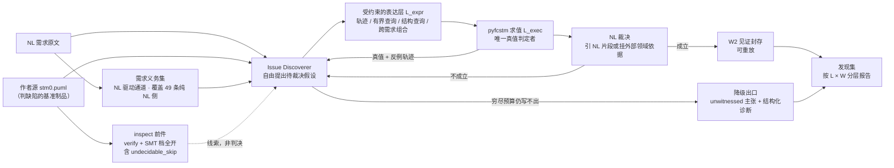

# paper1 方法重构：把问题从「NL 对齐」改为「NL 满足性」

> **一句话**：要检查的不是模型有没有逐句复现 NL 的字面，而是**模型作为一台机器能不能满足 NL 所表达的需求**；凡不违背 NL 的检查都可以构造。本 issue 给出这个口径的形式化、现有实验数据对它的支持、根因定位、技术方案与文献依据。
>
> **可审计证据**：脚本、数据与图片资产在 [gist `0a3a085a`](https://gist.github.com/HansBug/0a3a085a68b7e9d9966e5b1a21606f65)。本文所有数字均可由该 gist 的 `analyze.py` 一条命令复算，复算命令见 §7。

---

## 1 · 学术口径：从对齐性到满足性

### 1.1 用 C 代码说清区别

假设被检查对象不是状态机而是 C 代码。NL 写着「写一个计算加法的函数，当输入 1+2 的时候应该输出 3」，代码是：

```c
int main() { int8 a, b; scanf("%d %d", &a, &b); printf("%d", a + b); }
```

现行 `NL → Req → assertion` 的做法容易只产出一条 `assert main(1, 2) == 3`，其余一概不查。而真正的缺陷是 `assert main(127, 1) == 128` —— 它**不对应任何一句 NL 原话**，却确确实实存在。

站在软件测试的立场，可构造的测试不是「NL 里写了的那些」，而是「**所有不违背 NL 的**」。要检查的是这个函数是否满足**加法这一性质**：无论用构造用例做红灯测试（对应本文的仿真），还是基于字节码做形式化验证（对应本文的 BMC），都是正当手段。

### 1.2 问题的领域正名

这不是一个新问题，它是**测试预言问题（oracle problem）**的一个实例 —— NL 是一个**部分的、非形式的**预言。这个正名有用，因为它一句话说清「为什么不能只对齐 NL 字面」，并把本文接到一支成熟文献上（Barr et al., *IEEE TSE* 41(5):507–525, 2015，DOI [`10.1109/TSE.2014.2372785`](https://doi.org/10.1109/TSE.2014.2372785)）。

### 1.3 三根维度：层级 $L$ · 见证 $W$ · 规范性 $D$

一条「发现」要被完整刻画，需要回答三个互不替代的问题：

| 维度 | 它问什么 | 一句话 |
| :-- | :-- | :-- |
| **$L$ · 层级** | 得出它**需要多少信息** | 从 NL 与模型的表面就能读出，还是必须构造行为 |
| **$W$ · 见证** | 它**被证到什么程度** | 只是主张，还是有可执行对象被判过 |
| **$D$ · 规范性** | 它**凭什么算「错」** | 有没有构成一个可声明的集合差，且该判定不可被推翻 |

⭐⭐ **三者互不蕴含**，这是本框架的核心：一条纯风格偏好可以在 $L$ 与 $W$ 上都打得很高（静态可判、甚至能给可执行见证），却在 $D$ 上不成立。⚠️ 而 $D$ 除了是一根维度，还额外**起前置门的作用**——$D$ 不成立的条目无论 $L$/$W$ 多高都不进 issue（判据见 §1.5.1）。

#### 1.3.1 维度 $L$ · 层级

| 档 | 定义 | 例 |
| :-- | :-- | :-- |
| **L0 · 表面对齐** | 比对 NL 词项与模型词项即可陈述 | NL 点名 `Emergency`，模型没有这个状态 |
| **L1 · 结构导出** | 需从模型结构导出一个事实，静态可判 | 某守卫恒假；某叶态出度为 0 |
| **L2 · 行为构造** | 必须给出或排除一条**带时间维的行为**（轨迹 / 可达性 / 有界检查） | 进入 `ActiveState` 后永久困住 |

**逐档的精确学术定义与出处**（⭐ 全部 **【已核】**，即本轮取到全文/出版页并逐字核对）：

| 档 | 领域既有概念 | 逐字定义 | 出处 |
| :-- | :-- | :-- | :-- |
| **L0** | **syntactic consistency** | "Syntactic consistency ensures that a specification **conforms to the abstract syntax specified by the meta-model**, and requires that the overall model has to be **well formed**" | Torre, Labiche & Genero, *UML consistency rules: a systematic mapping study*, EASE '14, DOI [`10.1145/2601248.2601292`](https://doi.org/10.1145/2601248.2601292)（其 [27] = Engels 等 IDPT 2002） |
| **L0** | **pattern-matching 档** | "Some properties … can be carried out by relatively straightforward **pattern matching** techniques. However, most properties … require much more **sophisticated analysis**" | Emanuelsson & Nilsson, *A Comparative Study of Industrial Static Analysis Tools*, LiU TR 2008:3 §3.1 |
| **L0** | **纯词法档** | grep "is rather lo-fi because it **doesn't understand anything about the files it scans**" | Chess & McGraw, *Static Analysis for Security*, *IEEE S&P* 2(6):76–79, 2004, DOI [`10.1109/MSP.2004.111`](https://doi.org/10.1109/MSP.2004.111) |
| **L1** | **Structural Verification Task** | "**Structural Verification Tasks**, where **a single system state** is considered" | Hilken, Niemann, Gogolla & Wille, *Towards a Catalog of Structural and Behavioral Verification Tasks for UML/OCL Models* |
| **L1** | **invariant** | "An LT property $P_{\mathrm{inv}}$ over AP is an **invariant** if there is a propositional logic formula $\Phi$ over AP such that $P_{\mathrm{inv}} = \\{ A_0 A_1 A_2 \ldots \mid \forall j \geqslant 0.\, A_j \models \Phi \\}$" | Baier & Katoen, *Principles of Model Checking*, MIT Press 2008, Def. 3.20 |
| **L1 / L2 分界** | **invariant 与非 invariant safety 的能力差** | "invariants … can be checked by considering the **reachable states**. Some safety properties, however, may impose requirements on **finite path fragments**, and **cannot be verified by considering the reachable states only**" | 同上 §3.3.2, pp.111–112 |
| **L2** | **Behavioral Verification Task** | "**Behavioral Verification Tasks**, where **a sequence of system states as well as their transitions** … is considered" | Hilken 等（同上） |
| **L2** | **必须纳入动态** | "Partially, consistency problems can be **statically checked by syntax rules** … For other consistency conditions, **the dynamics** of the different diagrams **have to be taken into account**" | Engels, Hausmann, Heckel & Sauer, *Testing the Consistency of Dynamic UML Diagrams*, IDPT 2002 §1 |
| **L2** | **句法层不足以** | "Syntactic checks … **do not suffice** to uncover the more intricate **behavioural** consistency problems, e.g., **whether a network of state machines admits a trace**" | Knapp & Mossakowski, *Multi-view Consistency in UML*, arXiv [1610.03960](https://arxiv.org/abs/1610.03960) §2.1；survey 版 LNCS 10800, 2018, DOI [`10.1007/978-3-319-75396-6_3`](https://doi.org/10.1007/978-3-319-75396-6_3) |
| **L2** | **liveness：有限迹无用** | "the set of **finite traces** of a system are of **no use at all** to decide whether a liveness property holds" | Baier & Katoen, Def. 3.33 |
| **L2** | **黑箱限制**（为何必须构造行为而非检视结构） | "He is **not allowed to open up the machine and look at the parts** … always just what are sometimes called '**black boxes**'" | Moore, *Gedanken-Experiments on Sequential Machines*, 1956, p.132 |

⚠️ **本项目用法与先例的差别**：先例分层的是**分析手段的能力**，本项目分层的是**得出该发现所需的信息**。两者在本语料上重合（手段决定能拿到什么信息），⛔ 但不是同一个概念——论文里必须写成**借用形状，不是引用定义**。

⚠️ **一处必须避的同名歧义**：`structural inconsistency` 有两个互不相容口径 —— Van Der Straeten（VUB 博士论文 2005 §3.2.1）的 structural **包含**「结构规约与行为规约不一致」，比 Hilken 等的「单个系统状态」宽。⛔ 引用时必须指明用谁的；**本项目用 Hilken 的**。

#### 1.3.2 维度 $W$ · 见证

| 档 | 定义 | 例 |
| :-- | :-- | :-- |
| **W0 · 断言** | 散文主张，既无定位也无可执行对象 | 「可能有死锁」 |
| **W1 · 定位** | 点到具体元素或路径，但没有可执行对象 | 「`ActiveState` 出不来」 |
| **W2 · 见证** | 一个**可执行对象**，在被求值的那份制品上被判过真值 | 「输入序列 $\langle a,b,c \rangle$ 下抵达 $S$，且所有出边守卫求值为假」 |

**逐档的精确学术定义与出处**（全部 **【已核】**）：

| 档 | 领域既有概念 | 逐字定义 | 出处 |
| :-- | :-- | :-- | :-- |
| **W1** | **smell 的两项构件**（定位 + 检测机制，但仍非见证） | "A Requirements Smell is an **indicator** of a quality violation, which **may lead to** a defect, with a **concrete location** and a **concrete detection mechanism**" | Femmer, Méndez Fernández, Wagner & Eder, *Rapid quality assurance with Requirements Smells*, *JSS* |
| **W2** | **counterexample** | "We call a path that starts at the initial state and reaches an accepting cycle an accepting path or **counterexample**" | Debbi, *Counterexamples in Model Checking — A Survey*, *Informatica* 42(2):145–166, 2018 §2 |
| **W2** | counterexample 的**证据角色** | "The counterexample is an **error trace**, by analysing it, the user can **locate the source of the error**" | 同上 §1 |
| ⚠️ **W2 的上界** | **spurious counterexample** | "a **spurious counterexample** is an erroneous counterexample that **exists only in the abstract model, not the concrete model**" | 同上 §6（CEGAR） |
| **W < 2 的裁决** | **inconclusive** | "The verdict is either pass, fail, or **inconclusive**. … **Inconclusive** indicates that **no evidence of non-conformance was found, but that the test purpose was not achieved**" · "indicates **correct but not intended behaviour**" | Tretmans, *An Overview of OSI Conformance Testing*, 2001 §3.5 / §3.4 |
| ⚠️ **不要与 $D$ 混** | **actionable alert**（按开发者是否会修定义，属可推翻判断） | "If a developer determines the alert is an **important, fixable** anomaly, then we call the alert an **actionable alert**" | Heckman & Williams, *IST* 53(4):363–387, 2011 §1 |
| ⚠️ **「误报」有两义** | false positive | "some works use the term false positive **interchangeably with non-actionable**, while others use it in a **stricter sense to describe a factual error** in the SCA tool's analysis" | Kószó et al., *Scientific Data*, 2025, arXiv [2511.10323](https://arxiv.org/abs/2511.10323) |

⭐⭐ 三条直接后果：① **§4.4 的降级出口有正式名字 `inconclusive`**，是一致性测试三值裁决的第三个标准值，⛔ 不是本项目发明的妥协；② ⚠️ **W2 的定义必须收窄为「在被求值的那份制品上为真」** —— 主臂在 `model.fcstm`（编译产物 = 一层抽象）上求值，其见证原则上可能是 spurious，⭐ 这正是「表示债务」的形式化名字；③ 报「误报率」必须说明用哪一义（本项目的 `FALSE_POSITIVE` = 严义、`NO_NL_BASIS` = 宽义）。

⛔ **W0 与 W1 的档名是本项目自设**，领域内没有对应的成文术语；⭐ 但 W1 的内容有出处（上表 Femmer 那一行给出 smell 的「定位 + 检测机制」正是 W1 的构件），W2 与「W<2 的裁决后果」都有出处。

#### 1.3.3 维度 $D$ · 规范性

| 档 | 定义 | 例 |
| :-- | :-- | :-- |
| **D2 · 算缺陷** | 有一条**可陈述的被违反义务**，且拿不出站得住的反驳 | `ClampingState` 只有入边无出边，而 NL 第 2 句要求「反馈发出后回到初始态」 |
| **D1 · 两读并立** | 存在一种**与结构事实相容**的第二种称职读法，两种读法都站得住 | 「迁移标签把两个触发与一个 in-state 条件并列塞进一个字符串」——PlantUML 标签是自由文本，可读作三项条件而非一个事件名 |
| **D0 · 不算缺陷** | 作者可正当地说「这就是设计」；或根本没有可陈述的被违反义务 | 「叶层存在非平凡强连通分量」「拓扑不强制终止」——⭐ 反应式控制器持久模式环是应有性质，**领域默认站在主张的反面**（本轮 82:1 落此档）；层次过深 |

⭐⭐ **D2 的三个子类，按义务的出处分**（⚠️ 三者的举证负担不同）：

| 子类 | 定义 | 例 |
| :-- | :-- | :-- |
| **D2-lit · 明文** | 义务有**成文条文**可引：NL 的那一句，或建模语言的二值条款 | NL 逐字要求「returns to the initial state」而模型无该边；初始迁移带触发（违反 UML Constraint） |
| **D2-impl · 隐式预言** | ⭐ **免领域知识、免形式规约**即可判为失效 | 进入某状态后永久困住（死锁）——⛔ 封闭清单只有这一项 |
| **D2-norm · 领域必备** | NL 不会写，但**缺了在本领域不可接受** | 银行系统未做事务化；咖啡机可死机；避撞子机一次触发后再不能重新武装 |

⭐ **举证责任的方向**：`D2-norm` **只需把那条义务写成一句话**，⛔ 不需引外部条款——一条从未被陈述的义务无法被推翻，不是因为它硬，是因为没有靶子。⚠️ 反过来，`D2-norm` 掉到 D1 需要**真的拿出**一种站得住的第二读法，⛔ 空洞否定（「我不认为这是缺陷」）不算。

**逐档的精确学术定义与出处**（全部 **【已核】**）：

| 档 | 领域既有概念 | 逐字定义 | 出处 |
| :-- | :-- | :-- | :-- |
| **D2** | **defect**（须相对规约） | "An imperfection or deficiency in a work product where that work product **does not meet its requirements or specifications**…"（⚠️ 原文续有 `and needs to be either repaired or replaced`，本项目**不采用**第二个合取项，见 §1.5.1） | IEEE Std 1044-2009, Clause 2, DOI [`10.1109/IEEESTD.2010.5399061`](https://doi.org/10.1109/IEEESTD.2010.5399061) |
| **D2-lit** | **validity / completeness**（集合差） | "**Validity** means that all statements made by the model are **correct and relevant** to the problem" · "**Completeness** means that the model contains all the statements which would be correct and relevant about the problem domain" | Krogstie, Lindland & Sindre, IFIP ISCO3, Springer 1995, §3.5, DOI [`10.1007/978-0-387-34870-4_22`](https://doi.org/10.1007/978-0-387-34870-4_22) |
| **D2-lit** · 语言条款 | **Constraint 违反的二值后果** | "**If the specification evaluates to false**, then the Constraint is not satisfied, and **the realization of the model in which the evaluation occurs is not valid**" | OMG UML 2.5.1, formal/17-12-05, §7.6.3 |
| ⚠️ **D2-lit** 的反向边界 | **intentionally unspecified** | "certain aspects of the semantics are listed as **“undefined”** or **“intentionally not specified”** … **allowing for domain- or application-specific customizations**" | 同上 §2 Conformance；⛔ 属此类者不得判 `D2-lit` |
| **D2-impl** | ⭐⭐ **implicit test oracle** | "An implicit test oracle … requires **neither domain knowledge nor a formal specification** to implement" · "such anomalies are **blatant faults**; that is, **no more information is required** to ascertain whether the program behaved correctly or not" | Barr, Harman, McMinn, Shahbaz & Yoo, *The Oracle Problem in Software Testing: A Survey*, IEEE TSE 41(5):507–525, 2015, §6 |
| **D2-impl** · 死锁 | **deadlock freedom 是默认义务** | "Another typical safety property is **deadlock freedom**" · "If indeed some terminal state is encountered, the system contains a deadlock and **has to be repaired before any further analysis**" | Baier & Katoen, *Principles of Model Checking*, MIT Press 2008, §3.3 / §3.2 |
| **D2-impl** · 无需用户声明 | **工具默认开启** | "The plus indicates that a check for **invalid endstates** was done (i.e., for **absence of deadlocks**)" | Holzmann, SPIN `pan` 手册 |
| **D2-norm** | ⭐⭐ **must-be requirement**（不写出来但缺了不可接受） | "the customer **takes them for granted and therefore does not explicitly demand them** … if they are not fulfilled, the customer will **not be interested in the product at all**"；属性表逐字 **implied · self-evident · not expressed · obvious** | Sauerwein, Bailom, Matzler & Hinterhuber, *The Kano Model: How to Delight Your Customers*, Preprints Vol. I, IX. Int. Working Seminar on Production Economics, 1996, pp. 313–327（模型出自 Kano 1984） |
| ⚠️ **D2-norm** 的反向边界 | **attractive requirement**（同样不写出来，缺了却不算缺陷） | "Attractive requirements are **neither explicitly expressed nor expected** by the customer … **If they are not met, however, there is no feeling of dissatisfaction.**" | 同上；⭐ 故区分器是「**缺了是否不可接受**」，⛔ 不是「NL 有没有写」 |
| **D2-norm** · 只需陈述不需引证 | **domain knowledge $K$ 的入册条件** | "There is a set **K** of statements of domain knowledge. Each member of K has been **validated (checked informally)** as true of the environment" · "**S and K together** must be sufficient to guarantee that the requirements are satisfied" | Zave & Jackson, *Four Dark Corners of Requirements Engineering*, TOSEM 6(1), 1997, §6 条件 (2) / §5, DOI [`10.1145/237432.237434`](https://doi.org/10.1145/237432.237434) |
| **D1** | ⭐⭐ **undercutting defeater**（攻击推理，不攻击结论） | "**undercutting** defeaters … **attack the connection between the reason and the conclusion** rather than attacking the conclusion itself" | Pollock, *Defeasible Reasoning*, *Cognitive Science* 11(4):481–518, 1987, 定义 (2.5), p. 485 |
| **D1** | **称职读者**（定义层可用，⛔ 度量层不可用） | "some statements may be **innocuous** because **only one possible interpretation would be reasonable** … statements having **more than one reasonable interpretation** are nocuous" | Massey, Rutledge, Antón & Swire, *Identifying and Classifying Ambiguity for Regulatory Requirements*, RE 2014, §I（pp. 83–92；⚠️ 判定者资格那句在 §II） |
| **D1** | **anomaly**（比 defect 宽，可只基于感知） | "condition that deviates from expectations … **or from someone's perceptions or experiences**" | ISO/IEC/IEEE 24765:2017, entry 3.157 |
| **D1** | 工具把该规则归入**完整性**而非正确性 | `"NoOutgoing \| **Completeness** \| State has no outgoing transitions."`（`NoIncoming` 同归 Completeness） | SDMetrics, *List of UML design rules and object-oriented design heuristics*（UML2 默认规则表） |
| **D0** | ⭐⭐ **rebutting defeater** + 标准里的成文取值 | "**rebutting** defeaters state reasons why a **claim** could be false"；IEEE 1044 的 `Defect Disposition` 取值 **"Not found"** 逐字："No defect was found … or **the reported behavior is actually intended behavior**" | Goodenough, Weinstock & Klein, CMU/SEI-2015-TR-005；IEEE Std 1044-2009, Table A.1 |
| **D0** | **可推翻性是判别式**（⛔ 不是可测量性） | "Such characteristics can be measured with metrics, which define a clear threshold. **However, this threshold can be overridden, if the modeler does not agree.**" | Ganser, Lichter, Roth & Rumpe, arXiv [1408.5699](https://arxiv.org/abs/1408.5699) §3 |
| **D0** | **Style 类：无规范性违反** | "Design rules of the '**Style**' category raise design issues that are considered bad practice. While these issues **do not indicate illegal design** …" | SDMetrics 用户手册 Appendix F |

⛔⛔ **D0 只能是 INVALID，不能是 WONTFIX** —— 领域把这两件事严格分开：

> **INVALID** — “The problem described **is not a bug**.” ｜ **WONTFIX** — “The problem described **is a bug** which will never be fixed.”
> — Bugzilla 官方源码模板 `template/en/default/pages/fields.html.tmpl`

⚠️ 作者说「我知道，但不值得改 / 改不动」⇒ 那是 WONTFIX ⇒ **仍是 D2**。⚠️ 两个比例**分母不同**，不可直接并列：`Not a bug` **33.5%** 出自该文 `Mclosing` 分布（条件在「Reported a bug」子群），而「是真缺陷但不修」是 **63/667 = 9.4%**（全样本）（Di Sorbo, Spillner, Canfora & Panichella, arXiv [1904.02414](https://arxiv.org/abs/1904.02414) §5.1，667 条人工标注）。

⚠️ **三个出口不是 $D$ 档，不要混进档位统计**：`FALSE_POSITIVE`（结构事实本身不成立 —— 攻击的是**证据**，属 undermining）· `NOT_A_DEFECT_CLAIM`（主张的对象不是被评制品，例如指认参考模型／评测真值有问题）· `OUT_OF_SCOPE`（§1.4 的界外对象）。

⛔ **`D1` / `D0` 的档名是本项目自设**；⭐ 但每一档的**内容**都有上表出处支撑。⚠️ **本项目没有取到「工具把缺陷判断显式让给人」的逐字先例**——SDMetrics 规则表只把 `NoOutgoing` 归入 `Completeness` 类别（即「缺少某物」而非「某物错了」），⛔ 该分类支持 D1 的**内容**，但不构成措辞先例。⭐ 完整判定程序（逐步问句、每档必填材料、机械门）在 [`D_PROTOCOL.md`](https://gist.githubusercontent.com/HansBug/0a3a085a68b7e9d9966e5b1a21606f65/raw/D_PROTOCOL.md)。
#### 1.3.4 三根维度合起来才能精确陈述本文的主张

⭐⭐ 朴素基线在 L2 上停在 W0；本方法要占的是 **L2 × W2 × D2**。而 `hit@k` 把 L2/W0/D1 与 L2/W2/D2 记成同一格，**所以它对这个主张完全是盲的**。

⭐ 「朴素基线按构造只能到 W0」是逐字可核的：`baseline_arm/src/runner.py:389` 的 docstring 写着「Run one naive-baseline cell (**single prompt, no loop, no tools**)」，其输出 schema `NaiveIssue` 只有 `issue` / `where` / `reason` **三个自由文本字段**，没有任何可执行对象。

**L2 × W2 × D2 不是同一场比赛里的更好成绩，而是一个没有执行引擎的做法按构造进不去的格子。** 散文猜测能说「也许会卡住」，说不出「在输入序列 $\langle a,b,c \rangle$ 下抵达 $S$，且所有出边守卫求值为假」。后者更深、可核、且直接是后续修复论文的输入。

### 1.4 范围边界

1. **立足 NL，但不受字面束缚。** 判据不是「NL 是否写了」，而是「**在任何站得住的读法下它是否都被违反**」（含领域隐式义务）。⛔ 注意量词是 ∀ 而非 ∃：只要存在一种与结构事实相容的第二读法，该条即落 D1、不进 issue 集合（见 §1.3.3 的 D1/D2 分界）。
2. ⛔ **无 NL 后果的模型内生问题不是关注对象**（冗余变量声明、无用命名动作等）。
3. ⚠️ **但吸收态、永久困住、不可达这类不是「纯内生」。** 吸收态之所以是缺陷，是因为「进得去应该出得来」这条期望；判它需要 NL。若按「内生 vs NL」划界，会把本文最有价值的样本排除掉。
4. 建模对象边界不变：$M = (S, E, V, Tr, A)$，不含时钟、不变式、正交区并发语义。

⭐ 隐式义务的来源必须与 NL 归纳来源**在输出上可区分**，因为审稿人一定会问「你怎么知道需求本来要求这个」，而两者的正确回答不同：

| 来源 | 例 | 出处论证 |
| :-- | :-- | :-- |
| (a) 从 NL 实例归纳到性质 | NL 说 1+2=3 → 这是加法 | 可从 NL 论证 |
| (b) 领域隐式义务 | 门开着不许加热；进得去要出得来 | ⭐ 引入 NL 之外的第三信息源，⛔ **但只需把那条义务陈述出来，不需引外部条款**（`D2-norm`，见 §1.3.3）——⚠️ 要把它降为 D1，须**真的拿出**一种站得住的第二读法 |
| (c) NL 未禁止而模型禁止 | 模型堵死一条 NL 允许的路径 | 相对模型可判，依赖 NL 完备性假设 |

### 1.5 什么算一个 issue：准入判据

⭐ 准入判据就是 §1.3.3 的 $D$ 轴判定程序，⛔ 不再另立一套。一条条目进入本文的 issue 集合，当且仅当它被判为 **D2 的某个子类**（`D2-lit` / `D2-impl` / `D2-norm`）。

#### 1.5.1 ⚠️ 这份判据的局限

1. ⛔ **不采用 IEEE 1044 定义里的第二个合取项**（"needs to be either repaired or replaced"），也不采用 SEQUAL 的 feasible validity / completeness ——即**不把成本收益放进准入门**。这是对两个来源的**显式偏离**，理由是成本判断不可由 $(\mathrm{NL}, M)$ 单独判定，会引入阈值。
2. ⚠️ **只有 `D2-lit` 的 NL 半带逐字锚点门**（`grounding = lit`，102 条，G1 要求 `nl_quote` 为 `nl.txt` 逐字子串）。⛔ `D2-lit` 的**语言条款半**（19 条，只要求 `lang_clause` 非空）与 **`D2-norm`**（3 条，只要求 `obligation_sentence` 与 `domain` 非空）都**没有锚点门**，两者一致性预期最低，⛔ 统计须分别单列。
3. ⚠️ **判定装置资格受限**：本轮为 LLM 子代理单轮判读，⛔ 无判定者间一致性系数。而 Massey 等（RE 2014）明确指出无领域资格的判定者做不了 nocuous/innocuous 区分——⭐ 这条限制直接适用于我们的 D1 判定。
4. ⚠️ **文献侧仍有缺口**：未取到任何来源正面讨论「阈值型度量在什么条件下可升格为缺陷」（SEQUAL 的答案是「不能，它们是 means」，但无文献讨论因果链被实证证明后是否改变结论）；`deontic quality` 没有集合论定义可引（Krogstie 2012 §4.8 只给目的论表述）；$L$ 轴是「借用形状」而非「引用定义」。⭐ 全部 94 条待补已逐条登记在 gist 的 `issue_definition_survey.json` 与 `laxis_references.json`。

#### 1.5.2 ⛔ 本节删除了什么，以及为什么

⭐ 按仓库 §3.6，更正一律就地进行，⛔ 不另发更正件。本节只记录**改了什么**，不复述已删的结论。

| 删除的内容 | ⛔ 删除理由 |
| :-- | :-- |
| 原 §1.3.3 的 D 档定义表（「D2 无条件 / D1 条件式 / D0 可推翻」）及其 20 行出处表 | ⛔ 该定义操作上欠定：⚠️ 一套独立装置在同一格 12 条上实测，7 个 LLM 配置的 D2 占比跨度 **33pp**（42%–75%），同模型仅切 thinking 档就改一半判定（**证据级别 M**：他方实测、本 session 未复算、样本仅 1 格）。⭐ 已整体替换为新判定程序 + 三个 D2 子类 |
| 原 §1.5.2「这条界线在本项目数据里已被**独立**画出两次，且两次重合」 | ⛔⛔ **独立性不成立**。该主张称 `verdict_class`（分拣者给）与 `severity`（工具给）是两个独立来源；⭐ 但 `inspect_findings.json` 的**每一条记录同时带 `code` / `severity` / `verdict`**，分拣者看得见 severity。⛔ 与先前已删的「D 档 × `verdict_class` 零冲突」是同一个病 |
| 原 §1.5.3 的超车点区间 **[36, 56]** | ⛔ 它由 `verdict_class` + code severity 推出，而那两者不独立（见上）；且分档口径已被新程序取代。⭐ 新数字见 §2.13 |
| ⛔ 原 §1.4 表格 (b) 行「⚠️ 引入 NL 之外的第三信息源，**须挂外部依据**」 | ⛔ **与新 `D2-norm` 裁定直接相反**，已就地改为「只需陈述、不需引证」。⚠️ 这一处与下一行是同一个错在两处出现 |
| 原 §1.5.4 限制第 1 条「除非引入领域隐式义务，**而那又需要外部出处支撑**」 | ⛔ **举证责任方向错了**。按 defeasible reasoning 的定义，prima facie reason 成立直到被击败，⭐ 故领域隐式义务（`D2-norm`）**只需陈述、不需引证**（Zave & Jackson：$K$ 的入册条件是 "validated (**checked informally**)"）。⛔ 要求它先自证等于取消 prima facie 这个概念 |
## 2 · 数据：现有实验到底说明了什么

### 2.1 当前裁决池

| 门面 | 数 | 构成 |
| :-- | --: | :-- |
| 工作单 | **54** | 9 个 NL 组 × 6（`00x8` 六个越界 NL 已排除） |
| 台账裁决位 | **99** | 98 `REPORTABLE` + `EIS-0043-02`（带边界裁定标记） |
| 候选裁决位 | **269** | 141 原有（`VU-` / `DIFF-` / `UM-`）+ **128 个 `INS-` 新建块** |
| 清单条目 | **955** | — |

`INS-` 是 `pyfcstm inspect` 的归一化发现：189 条 issue 覆盖 360 条原始诊断，其中 `intrinsic` 91 / `uncertain` 98。判重结论为 `ledger` 45 · `candidate` 16 · `suspect` 24 · `none` 104，故新建块 $24 + 104 = 128$。

### 2.2 主臂的崩塌精确落在 L2


口径：98 条台账 × 2 模型 × 3 轮 = 588 位。主臂 v46 命中 355/588 = **60.4%**，X1 朴素基线 448/588 = **76.2%**，交叉表 都中 271 · 仅主臂 84 · 仅 X1 177 · 都没中 56。

| locus | 条 | 位 | 主臂 | X1 | Δ |
| :-- | --: | --: | --: | --: | --: |
| `element`（单元素点查询） | 85 | 510 | 63.1% | 74.9% | −11.76pp |
| `pair`（成对 / 优先级） | 7 | 42 | 52.4% | 81.0% | −28.57pp |
| ⛔ **`global`（L2 行为构造）** | 6 | 36 | **30.6%** | **88.9%** | **−58.33pp** |
| ⛔ **`global` ∩ 前件在手（环内可得）** | 4 | 24 | **12.5%**（3/24） | **83.3%**（20/24） | **−70.83pp** |

逐个 `logic_kind`：`unreachable` **0.0%** vs 83.3% · `unintended_terminal` **16.7%** vs 83.3% · `nontermination` 66.7% vs 100% · `priority_conflict` **0.0%** vs 83.3% · `hierarchy_entry` 41.7% vs 100%。

⭐⭐ **最后一行是全份分析里最硬的一个数**：在 **4** 条 inspect 前件**在环内配置下确实可得**（`EIS-0002-02` 靠 `W_UNREACHABLE_STATE`；`EIS-0007-01` / `EIS-0026-03` / `EIS-0027-01` 靠 `W_DEADLOCK_LEAF`）的 `global` 条目上，主臂命中 **3/24 = 12.5%**，而一个不带任何工具、只读 NL 与 PlantUML 的单次提示命中 **20/24 = 83.3%**。工具说了「这个状态出不来」，那句话在上下文里，流水线把它变成了零。\n\n⚠️ **此处原报 6/30 = 20.0% vs 26/30 = 86.7%（5 条口径）**，未剔除 `EIS-0036-02` 那条环外前件。⭐ 修正后主臂**更差**（20.0% → 12.5%），故方向对本文不利、结论更硬。

### 2.3 消费缺口：臂内对比才是干净的陈述


「前件在手」的定义要分两步，⛔ 少一步就会把结论说过头。

**第一步**：`inspect_overlap.json` 里 `overlap_kind == "ledger"` 的判重结论（即**判重者**认定「某条 inspect 诊断与这条台账是同一个问题」；⭐ 该判定出自 relabel 入册阶段，源文件 `how_it_was_made` 标为「人判，一个 pair 一位判定者」，⛔ 不是本轮的 LLM 子代理），落在 **35** 条台账上。

**第二步（⛔ 原先漏了）**：那份判重的底层诊断出自 `pyfcstm inspect **--enable-verify**`（**环外**配置），而环内调用是 `inspect_model(model)`。⭐ 本项目实跑 60 份 `model.fcstm` 确认环内只产出 8 个码 —— `I_TRANSITION_NEVER_EVENT_TRIGGERED` · `W_UNREACHABLE_STATE` · `W_DEADLOCK_LEAF` · `W_INITIAL_UNCONDITIONAL_MISSING` · `I_TRANSITION_TO_SELF_VIA_PARENT` · `W_LARGE_COMPOSITE` · `W_REDUNDANT_TRANSITION` · `W_DEAD_NAMED_ACTION` —— ⛔ **不含** `W_TOPOLOGICAL_NOEXIT` / `I_TOPOLOGICAL_NON_TERMINATING` / `I_NONTRIVIAL_SCC` / `W_EVENT_UNREACHABLE_EMIT`。

⛔ 故 35 条里有 **3 条**（`EIS-0016-03` · `EIS-0035-02` · `EIS-0036-02`）的前件码在环内**按构造不产出**，「在手」不等于「在提示里」。**下表用收窄后的 32 条。**

⛔ 臂间差在这组里反而更小，但那不是主臂表现好，是 X1 在这组变差了。看臂内，⭐ 并按 `suspect` 单列给出三分口径：

| | A · 前件在手（环内可得）32 条 | B · 疑似 11 条 | C · 严格不在手 55 条 | 臂内差（A − C） |
| :-- | --: | --: | --: | --: |
| **主臂 v46** | 56.8% | 57.6% | 61.9% | **−5.09pp**（方向相反） |
| **X1 v2** | 66.1% | 97.0% | 77.6% | **−11.42pp** |

⚠️ **口径说明**：三档之和 32 + 11 + 55 = 98（那 3 条环外前件归入 C）。⛔ 原先把 `suspect` 并进「不在手」（得 63 条）会把 X1 的臂内落差从 −11.42pp 抬到 −14.91pp —— ⭐ 而 B 组上 X1 高达 97.0%，合并方向恰好放大了本节要论证的对比，故**改用三分口径**。

⭐ 臂内对比控制住了「条目本身难不难」：X1 在 A 组掉 11.4pp，说明这组**确实更难**。而主臂手里握着这 32 条的前件，命中率**比没前件的还低 5.1pp**。**前件在手对主臂没有产生任何可测的收益** —— 这才是消费缺口的准确陈述。

其中 **8 条前件在手却主臂 0/6**：

| 条目 | 座标 | `reference` | 主臂 | X1 |
| :-- | :-- | :-- | --: | --: |
| `EIS-0026-03` | `global` / `unintended_terminal` | `requirement` | **0/6** | 6/6 |
| `EIS-0027-01` | `global` / `unintended_terminal` | `requirement` | **0/6** | 6/6 |
| `EIS-0032-01` | `element` / `transition` | `requirement` | **0/6** | 6/6 |
| `EIS-0039-02` | `pair` / `hierarchy_entry` | `requirement` | **0/6** | 6/6 |
| `EIS-0037-01` | `element` / `transition` | `requirement` | **0/6** | 5/6 |
| `EIS-0002-02` | `global` / `unreachable` | `language` | **0/6** | 5/6 |
| `EIS-0014-03` | `element` / `effect` | `requirement` | **0/6** | 3/6 |
| `EIS-0047-01` | `element` / `state` | `language` | **0/6** | 2/6 |

### 2.4 优势集的边界是分类学上的，不是程度上的


| | 条数 | `locus` 构成 | `reference` 构成 |
| :-- | --: | :-- | :-- |
| **主臂显著占优**（逐条差 ≥ +3 位） | 13 | ⭐ **`element` 13 · `global` 0 · `pair` 0** | `requirement` 11 · `language` 1 · `other` 1 |
| **X1 显著占优**（≤ −3 位） | 32 | `element` 26 · **`global` 4** · **`pair` 2** | `requirement` 29 · `language` 3 |
| 相当 | 53 | — | — |

**主臂在 `global` 与 `pair` 上一条都没赢过**，而全部 4 条有争议的 `global`、2 条 `pair` 都归 X1。主臂那 13 条按元素类型是 `effect` 5 · `trigger` 3 · `transition` 3 · `state` 2 —— 全部是「指着一个元素说它错了」。

⚠️ **这 13 条是流水线目前唯一被证明的增益，放开自由度时不能把它们弄丢**；`effect` 那 5 条尤其是逐需求枚举的产物。

### 2.5 真值分母与工具视野在 L2 上严重错配


| | `element` | `pair` | `global` |
| :-- | --: | --: | --: |
| 台账 99 条（当前真值分母） | 86（86.9%） | 7（7.1%） | **6（6.1%）** |
| inspect 归一化发现 189 条 | 39（21%） | 18（10%） | **132（70%）** |
| 其中无任何既有条目认领 128 条 | 17 | 7 | **104（81%）** |

⚠️ **未认领的 104 条 `global` 不能读作 104 条真缺陷**：其中 `intrinsic` 仅 **25** 条，`uncertain` 79 条。最强的一档是 **`global` + `intrinsic` + 未认领 = 25 条，分布在 17 个 pair 上**，`logic_kind` 为 `unintended_terminal` 17 · `nontermination` 5 · `unreachable` 3。

⭐ 即使只算这最强的一档：**台账在 L2 那一格记了 6 条，而 inspect 在同一格给出 25 条 intrinsic 的未认领发现。** 这不能证明它们都是缺陷（那正是重标要裁的事），但足以支持一条判断：**L2 那一格的真值分母很可能被严重低估，而 PR #185 的重标正好在处理它。**

⚠️ **重标的工作量已因此上调**：候选裁决位从 141 涨到 269 后，平均每 pair 候选从 2.6 涨到 5.0，合计工时从 33–49 小时上调到 **50–75 小时**（分档判据新增「候选 ≥ 8」一条）。⛔ 这是基数变了，不是原估算偏了。**分区冻结（§6 第 1 条）必须早于重标完成，否则那道判据就不可否证。**

### 2.6 四行重算（分母换成台账 99 条）

⚠️ 口径说明：[`inspect_capability_boundary.md`](https://github.com/HansBug/research_ideas/blob/paper1/g1-ledger-relabel/project_1_llm_state_machine_modeling/paper_stm_issue_discover/discover_matrix/docs/findings/inspect_capability_boundary.md) §四 的 74/165 = 44.8% 用的分母是「99 台账 + 66 可映射候选」，判据是「前件**原则上**可算」；下表分母是台账 99 条，判据是「前件**实测**在手」。⛔ **两者不可相减、不可互相替代。**

| `defect_reference` | 前件在手 | 疑似（`suspect`） | 不在手 | 小计 |
| :-- | --: | --: | --: | --: |
| `language`（不引 NL 即可判） | 5 | 0 | 4 | **9** |
| `requirement`（须引 NL 某句） | 28 | 11 | 49 | **88** |
| `other` | 2 | 0 | 0 | **2** |
| **合计** | **35** | **11** | **53** | **99** |

- **实测可触及面** = `language` 全部 + `requirement` 前件在手 = **37/99 = 37.4%**
- 计入疑似前件的上界 = **48/99 = 48.5%**
- ⭐ **纯 NL 侧 = 49/99 = 49.5%** —— 这一半 inspect 帮不上任何忙

**「前件可算」与「不可算」的分界是「缺陷在模型内部留不留痕」**：

| | 留痕（37 条，L1/L2 可触及） | 不留痕（49 条，纯 NL 侧） |
| :-- | :-- | :-- |
| 例 | `EIS-0026-03` 吸收态；`EIS-0027-01` 永久困住 | NL 要求「门开着不得加热」而那条加热边没有守卫；NL 点名 `Emergency` 而模型没有这个状态 |
| inspect 看到什么 | ⭐ 无出边 / 无退出路径 —— **异常摆在那里** | ⛔ **什么都没有**：无守卫的边是合法的，缺一个状态的机器是良构的 |
| NL 的角色 | 裁决这个异常是不是缺陷 | ⭐ **唯一信息源** |

⭐⭐ **架构后果**：inspect 线索驱动的新通道**实测可触及 37 条**，计入 11 条疑似前件与 2 条 `other`（其前件实测在手）后**上界 50 条**（⭐ 三段之和 37 + 13 + 49 = 99 闭合）；**那 49 条按定义碰不到，必须由 NL 驱动通道承担**。所以不是拆掉 `NL → req` 换成线索驱动，而是**两条通道并存**，且重构对两者的作用完全不同（见 §4.1）。

### 2.7 ⛔ 三重混淆：现有 Δ 不可归因于架构

| | X1 朴素基线 | v46 主臂 |
| :-- | :-- | :-- |
| NL | ✓ | ✓ |
| 被检制品 | ⭐ **`stm0.puml` 作者源** | ⛔ **`model.fcstm` 编译产物** |
| inspect 诊断 | ✗ 完全没有 | ✓（但被三道闸门禁止据它生成义务） |
| 架构 | 单次提示 | 八阶段 + 定向反馈循环 |
| 成本 | 主臂的 **1/212** | — |

**两臂同时差三件事**，因此 −15.82pp **不能**归因于「八阶段循环 vs 单次提示」。而「读编译产物」这一项已能独立解释相当一部分：

1. **守卫类缺陷主臂按构造看不见。** `model.fcstm` 里**作者写的守卫是 0**，而带守卫的迁移有 **124 / 985** —— 即这 124 条全部由编译器注入（⚠️ 其中已逐条核过形式的是 86 条，皆形如 `R45RouteToken == <整数>`；余下的只核到「非作者所写」这一层）。作者源 `stm0.puml` 带方括号的只有 **7 / 54** 份。而 `element/guard` 的 3 条台账：主臂 7/18 = **38.9%** vs X1 15/18 = **83.3%**，其中 2 条落在 X1 显著占优集里。**作者的守卫没活着进到主臂读的那份文件里。**
2. **`language` 类缺陷被编译动作系统性抹除。** 主臂 **31.5%** vs X1 59.3%（Δ = −27.78pp）。机制近乎同义反复：`model.fcstm` 按构造是一份良构 FCSTM（它解析通过了，而 22 个 `E_*` 码里 20 个在可解析模型上不可达），作者源的良构性违反要么在编译时被修掉、要么那个 pair 根本编译不出来。⚠️ 非绝对 —— `EIS-0040-03` 主臂 6/6 vs X1 2/6 是反例。

⭐ 这对论文是坏消息也是好消息：坏消息是现有 Δ 不可归因；**好消息是最大的一块损失可能不需要改方法就能收回 —— 让主臂也读作者源，重跑一次即可拆出这一项的贡献。**

### 2.8 `<NL, STM>` 映射到底有没有收益：数据给出一个明确的拆法

疑虑是对的，但要拆成两半，因为两半的结论相反。

**作为语义产物，映射的信息量近零。** NL 与模型都已经在上下文里，且都不大 —— 42 个有台账的 pair 上限是 **17 状态 / 29 迁移 / 层次深度 2**。在两份都完整可见的小制品之间再加一跳有损摘要，只会引入摘要误差与 token。

**但映射内化的「枚举纪律」不是零 —— 它恰好是主臂唯一被测到的优势。** 主臂显著占优的 13 条**全部**是 `element` locus，按元素类型是 `effect` 5 · `trigger` 3 · `transition` 3 · `state` 2；而这正是逐需求枚举 → 逐元素点查询这条链的产物。

⭐ **所以结论是「砍掉映射文档、保留枚举纪律」，而不是整块消融。** 对应的消融实验也因此有了**可打靶的预测**：映射只应影响 `element` locus 的召回；若砍掉它而 `element` locus 的 `hit@k` 不降，它就是纯负担；若 `global` / `pair` 有变化，说明它的作用机制与我们的理解不符，需要重新定位。

### 2.9 一条必须登记的口径冲突

relabel 已裁定 `defect_element = region` 的条目 `counts_as_defect = false`（界外，可记录不计分）。但台账里 4 条 region 条目 **`EIS-0006-01` / `EIS-0026-01` / `EIS-0036-01` / `EIS-0046-02` 全部仍在 98 条命中分母里**（该分母早于此裁定）。剔除后：

| 口径 | 位 | 主臂 | X1 | Δ |
| :-- | --: | --: | --: | --: |
| 现行 98 条 | 588 | 60.37% | 76.19% | −15.82pp |
| 剔除 4 条界外 region 后 94 条 | 564 | **60.82%** | **75.35%** | **−14.54pp** |

⛔ 这是**已生效裁定与已发布数字之间的冲突**，须裁定采用哪一套；⛔ 不得两套混用。

---

### 2.10 269 的构成，以及 L 分级的正确分母

⛔ **先纠一个容易读错的地方：269 不是 L 分级的分母。** 269 是**候选裁决位**数，它由四支构成，而四支的性质并不同：

| 支 | 条 | 可映射 | 性质 | 能作 X1 覆盖率分母吗 |
| :-- | --: | --: | :-- | :-- |
| `VU-` | 15 | 15 | 人工提出的独立候选缺陷 | ⭐ 能 |
| `DIFF-` | 77 | 49 | 参考模型 vs NL 的差异候选 | ⭐ 能 |
| `INS-` | 128 | 128 | `pyfcstm inspect` 派生候选 | ⭐ 能 |
| ⛔ **`UM-`** | **49** | 2 | **两臂自己未认领产出的池化登记区** | ⛔ **不能** |
| 合计 | **269** | **194** | | 独立候选 = **220** |

⛔⛔ **`UM-` 必须从覆盖率分母里剔出去，理由有两条，都是逐字可核的：**

1. **它装的是两臂的产出，不是独立假设。** 47 个 `UM-` 块的 `blocker` **全部**是 `unit_of_record`，其 note 逐字写着「桶内 11 组座标不一致，一格代表不了：**X1 第 1 组**……**v46 第 4 组**……**v46 第 5 组**……」。`unmatched_issues.json` 的 `totals` 逐字 `dedup_groups: 1063` / `x1_raw: 334` / `v46_raw: 755` —— 实测按臂是 **v46 729 组 + X1 334 组 = 1063**（`v46_raw` 755 是原始条数，并成 729 组；`cell_count` 合计精确等于 755 与 334，交叉验证通过）。⭐ 拿它测 X1 的覆盖率，其中 X1 那 334 组是 **X1 自己的输出**，属循环。
2. **它装的还是旧一代的 X1。** `unmatched_issues.json` 的 `sources` 逐字指向 `baseline_arm/results/verdicts_x1.json .unclaimed_issues`（**v1**）与 run 目录 `x1-baseline-v1`。而本文 X1 一概以 **v2** 为准（v2 未认领 587 条）。

### 2.10.1 L 分级（分母 = 台账 99 + 独立候选可映射 192）

L 档按 §1.3 已发布口径由已冻结的 `locus` 字段导出（`element/guard` 计 L1、`element/region` 计界外）。


| 池 | 可映射 | L0 | L1 | L2 | 界外 | **L1+L2** |
| :-- | --: | --: | --: | --: | --: | --: |
| **台账 99**（当前真值分母） | 99 | 79 | 10 | 6 | 4 | **16（16.2%）** |
| `VU-` 15 | 15 | 9 | 1 | 5 | 0 | 6 |
| `DIFF-` 77 | 49 | 32 | 9 | 2 | 6 | 11 |
| `INS-` 128 | 128 | 16 | 8 | **104** | 0 | **112** |
| **独立候选合计 220** | **192** | 57 | 18 | **111** | 6 | **129（67.2%）** |

⭐⭐ **L1+L2：台账 16 条（占其 99 的 16.2%），独立候选 129 条（占其可映射 192 的 67.2%）。** 独立候选 L2 的 `logic_kind` 构成是 `nontermination` 47 · `other` 36 · `unintended_terminal` 20 · `unreachable` 8。

⚠️ **必须给区间、不能给点估计**：`INS-` 那 104 条 L2 里只有 **25 条是 `intrinsic`**，79 条 `uncertain`（未经人工确认）。故 **L2 真值分母的可靠下界是 6 → 31**（6 + 25），**上界 6 → 117**。⭐ PR #185 的重标裁的就是这个区间。

### 2.10.2 那 75 条不可映射候选：已人工判读 L 档

269 里 75 条不可映射（`DIFF-` 28 + `UM-` 47）。⭐ 本轮 **12 路 LLM 子代理判读**全覆盖（28/28 + 47/47），结论如下。

**`DIFF-` 28 条：只有 7 条真的在指认制品缺陷。**

| | 条 | 说明 |
| :-- | --: | :-- |
| ⛔ **不是缺陷指认** | **21** | 主张对象是**参考模型 / 真值** 13 · **NL 本身欠定** 4 · **逐字否认有缺陷** 3 · 语料元数据 1 |
| ⭐ 是缺陷指认（捆绑） | 7 | 拆出 **30 个构成**：L0 16 · **L1 3** · `no_L` 10 · 界外 1 |

⭐⭐ **展开后 L1+L2 只新增 3 条（全为 L1，L2 零新增）**：

| 构成 | L | 是什么 | X1 是否覆盖 |
| :-- | :-: | :-- | :-- |
| `DIFF-0010-09` | L1 | 作者源把 autonomous mode 写成无子态的叶状态，仅用 `<<submachine>>` stereotype 声称是子机 | ⛔ 未覆盖 |
| `DIFF-0020-06` | L1 | `human steering cmd` 触发的迁移并存于多处、构成冲突目标 | ⛔ 未覆盖 |
| `DIFF-0033-03` | L1 | 三条终结边的源状态层次归属落在 `PumpControl` 之外，越过区域祖先关系 | ⭐ 已覆盖（2 次判 `candidate`） |

⭐ 判读还**更正了 blocker 标签**：原标 `unit_of_record` 的 11 条里有 4 条经回原文核对其实不指认制品（子代理逐字反证被点名的缺陷在 `stm0.puml` 里根本不存在），故属 `not_a_defect_claim` 一类。

**`UM-` 47 条：47/47 判为「不是独立候选」。** 这与 §2.10 的结构裁定完全一致，且是 6 路互不相识的**子代理**独立得出。桶内共 **1059 组**（子代理逐组计数：X1 331 / v46 728；⚠️ 与真源 `dedup_groups 1063`（X1 334 / v46 729）差 **4 组 = 0.38%**，属逐桶计数误差，不改变任何结论），其 L 分布为 **L0 829 · L1 137 · L2 54 · 界外 36 · `no_L` 3**。

⛔ **那 191 组 L1+L2 不入覆盖率分母** —— 它们是两臂自己的未认领产出（X1 侧还是 v1 代），计入等于拿 X1 测 X1。

### 2.11 X1 v2 的全量产出与池子的对应关系（587 条逐条人工判读）

⚠️ **口径**：X1 一概以 **v2** 为准。v2 总产出 **1369** 条（324 格，均 4.23 条/格）。⛔ 此前流传的「已认领率 59.6%」是 **v1** 数字，且建立在一个宽判据上（见下）。

**第一层 · 机械认领**

| | 格数 | issue | 未认领 | 认领 |
| :-- | --: | --: | --: | --: |
| 42 个有台账 pair | 252 | 1160 | **587** | **573（49.4%）** |
| 12 个无台账 pair | 72 | 209 | —（无条目可认领） | — |
| 合计 | 324 | **1369** | | **573 = 41.9%** |

**第二层 · 587 条未认领逐条判读。** **14 个 LLM 子代理**各判 3 个 pair、全覆盖 587 条（复算核验：应判 587 / 实判 587 / 缺 0 / 多 0），判「对应台账」的再过一道**默认立场为推翻**的对抗复核：

| 判读结论 | 条 | 占比 |
| :-- | --: | --: |
| ⛔ **池外**（`none`） | 296 | 50.4% |
| ⭐ **对应候选条目**（`candidate`） | **159** | 27.1% |
| ⚠️ 疑似但拿不准（`uncertain`） | 119 | 20.3% |
| ⭐ **其实对应台账条目**（`ledger`） | 13（复核推翻 2 → 净 **11**） | 2.2%（按 13 计；四档占比只有取 13 才闭合到 100%） |

⭐ **合计对应 99 + 269 池内 = 573 + 11 + 159 = 743**；计入 119 条疑似则 **862**。

⚠️ **三处口径必须写清，⛔ 否则读者对不上账**：

1. **分母闭合**：743 + 119 + 296 = 1158，⛔ 比 1160 少 **2** —— 那 2 条是被对抗复核推翻的 `ledger` 判定（`run1/0029-claude#12` · `run2/0029-claude#11`），⛔ **复核未给它们改判到别的桶，故归属待定**。
2. **比率分母**：743 / 862 / 296 若按 **1160**（42 个有台账 pair 的产出）算，分别是 **64.1% / 74.3% / 25.5%**；若按 **1369**（全语料）算是 54.3% / 63.0% / 21.6%。⛔ 后者把 12 个无台账 pair 的 209 条也放进分母，而那 209 条**按构造全部在池外** —— ⭐ 故按 1369 算时**三个数都是下界**，且它压小了「池外」这个对本文不利的量。⭐ **本文取 1160 口径**：对应池内 **64.1%**、池外 **25.5%**（若把 209 条计入池外，则 505/1369 = **36.9%**）。
3. ⛔ 那 209 条不参与「对应/未对应」判定，因为该 pair 没有任何台账条目可对应。

**第三层 · X1 产出的 L 构成，以及缺口在哪**

| | L0 | L1 | L2 | 界外 |
| :-- | --: | --: | --: | --: |
| X1 未认领 587 条 | **369（62.9%）** | 115（19.6%） | **32（5.5%）** | 71（12.1%） |
| 其中无 NL 依据 | **203（55.0%）** | 33（28.7%） | **4（12.5%）** | 20 |
| 其中靠领域隐式义务 | 14 | 14 | **19（59.4%）** | 0 |

`★★ Insight ────────────────────────────────────` **两条方向相反、但都对本文有利的结论：**

① **X1 的自由发现绝大多数是表面层** —— 未认领里 62.9% 是 L0，L2 只有 32 条（5.5%）。它并没有靠自由度占住 L1/L2。

② ⭐ **越深越靠得住** —— L0 有 **55.0% 无 NL 依据**，L1 降到 28.7%，**L2 只有 12.5%**；而 L2 有 **59.4% 建立在领域隐式义务**上（§1.4 的来源 (b)）。**这说明噪声集中在表面层过度报告，不在深层发现**，「放开自由度必然噪声爆炸」这个担心在 L2 上并不成立。`─────────────────────────────────────────────────`

X1 未认领里 L1+L2 共 147 条（25.0%），其中已对应池内 29 条、疑似 53 条、池外 65 条。⭐ **池外且有 NL 依据（逐字或隐式义务）的 L1+L2 = 36 条**（L1 23 + L2 13）—— 这是 X1 指出、而池子尚未收录的深层候选，是重标应当优先看的一批。

**⛔ 两个必须裁定的方法学问题（本轮新发现）**

**① v1 的 reclaim 用的是宽判据，与严判据差 19 倍。** v1 曾把 210 条从「未认领」改判为「认领」，其判据①逐字是「**共同点名元素 ≥ 2 个**」，且 TSV 里有一行自陈「**命题（Condition Met 系臆造）与台账命题不同，但宽口径对命题盲**」。本轮按「是不是同一处建模失误」的严判据 + 对抗复核，587 条里只有 **11 条**该算认领。⛔ 已发布的「已认领率 59.6%」建立在宽口径上，⛔ 不得与严口径数字并列。

**② 命中判定表在 X1 侧存在可核的低估。** 那 11 条里有 **8 条落在判定表记为「未命中」的位上**，去重后 **7 个「条目 × 模型 × 轮」位**。我逐字核过其中最典型的一条：

| | 逐字 |
| :-- | :-- |
| X1 `run1/0000-claude#7` | 「三种独立触发条件…模型将它们用逗号连成一个标签，语义上不清是'或'关系还是'与'关系；按规格应为三条独立的转换」 |
| 台账 `EIS-0000-02` | 「三个接管条件被压成**一个不可分解的事件标签**…无论按"三选一"还是"合取"读法，单一自由文本标签都不是忠实编码」 |

同一条边、同一处失误、同一条推理 —— 按 `hit_criterion.md` §3 形态①（同一命题、不同谓词）即命中，而判定表记 `0`。**该条目原记 1/6，实际至少 5/6。** 若采纳这 7 位，X1 v2 从 448/588 = 76.2% 升到 455/588 = **77.4%**。

⛔⛔ **但这个 +1.2pp 不可单边采用。** 本轮只重判了 X1 的未认领；主臂的 755 条未认领**没有做同样的严判据重判**。单边采用会把一个判定层的系统性低估算成方法差距。⭐ 正确处置是**两臂同形态对齐重判**，或两边都不动。

### 2.12 ⭐ 超车点有多大：X1 v2 在 L1+L2 上的覆盖缺口

这一节回答「L1/L2 有多少是 X1 v2 没覆盖到的」。⛔ 答案必须分两块给，因为两块的量级差一个数量级、性质也不同。

#### ① 已确认台账的 L1+L2（16 条）：覆盖空间几乎为零，**稳定性空间很大**

| | hit@3（三轮至少一次） | hit@all（三轮全中） |
| :-- | --: | --: |
| **X1 v2** | **15/16 = 93.8%** | 9/16 = 56.2% |
| 主臂 v46 | 9/16 = 56.2% | 3/16 = 18.8% |

X1 三轮全未碰到的只有 **1 条**（`EIS-0016-02`）。⭐ **所以台账侧的超车点不是覆盖，是稳定性** —— X1 有 **6 条（37.5%）「能中但不稳」**：

| 条目 | X1 命中 | 座标 |
| :-- | --: | :-- |
| `EIS-0002-02` | 5/6 | L2 / `unreachable` |
| `EIS-0007-01` | 3/6 | L2 / `unintended_terminal` |
| `EIS-0019-01` | 5/6 | L1 / `nondeterminism` |
| `EIS-0025-01` | 5/6 | L1 / `guard` |
| `EIS-0056-01` | 5/6 | L1 / `priority_conflict` |
| `EIS-0056-02` | 4/6 | L1 / `guard` |

⭐ 可执行见证（W2）恰好把「碰到过」变成「必然判出」——这 6 条是 W 轴价值最直接的靶子。

⚠️ 同时这张表把主臂的处境说得更紧：**主臂在 L1+L2 上既不如 X1 覆盖广（−37.6pp）、也不如它稳（−37.4pp）**，而这两项本该是执行引擎带来的优势 —— 它没被用上（三道闸门，§3）。

#### ② 独立候选的 L1+L2（129 条）：X1 未覆盖 118 条

| | 条 | 占 129 |
| :-- | --: | --: |
| X1 明确覆盖 | 9 | 7.0% |
| X1 疑似覆盖 | 2 | 1.6% |
| ⛔ **X1 完全未覆盖** | **118** | **91.5%** |

未覆盖的 118 条按来源与证据强度：**`INS-uncertain` 85 · `INS-intrinsic` 23 · `DIFF` 7 · `VU` 3**；按层级 **L2 102 / L1 16**。

#### ③ 合并答案：**超车点用条数给，不用比例**

合并 L1+L2 = 台账 16 + 独立候选 129 + `DIFF-` 展开新增 3 = **148 条**。⭐ 展开已完成（§2.10.2），故这个数**不再是下界**；⛔ `UM-` 47 条按裁定不入分母。

| 档 | 条 | 说明 |
| :-- | --: | :-- |
| ⭐ **硬档未覆盖** | **36** | 台账 1（`EIS-0016-02`）+ 人工提出候选 10（`DIFF` 7 + `VU` 3）+ `INS-intrinsic` 23 + `DIFF` 展开新增未覆盖 2 |
| ⚠️ 软档未覆盖 | 85 | `INS-uncertain`，**未经人工确认** |
| X1 已覆盖（明确 25 + 疑似 2） | 27 | |
| 合计未覆盖 | **121** | = 81.8% of 148（分母闭合：36 + 85 = 121） |

`★★ Insight ────────────────────────────────────` **超车点的可靠下界是 36 条，上界 121 条；区间宽度全部来自那 85 条未经人工确认的 `INS-uncertain`。**

⭐ **加 $D$ 档限定后的收窄结果见 §2.13.3**（两个分母口径都给，⚠️ 两者均为上界）。⛔ 原先在此处那个由 `verdict_class` + code severity 推出的区间已删除——那两者不独立（同一条 `inspect_findings.json` 记录同时带 `code` / `severity` / `verdict`）。

⭐ 而这个区间**正是 PR #185 重标要收窄的东西**。所以「先冻结 L 分区、再完成重标」这条顺序不是流程洁癖，它决定这个数能不能被主张。

⭐ **展开已做完，145 → 148，L2 零新增** —— 原先担心的「分母会大幅膨胀」没有发生，所以现在比例也可用。⛔ 但仍以条数为主：**36 / 121**。`─────────────────────────────────────────────────`

#### ④ ⚠️ 一条必须写进限制的方法学不对称

候选侧的覆盖是从 **issue 侧**测的：**子代理**看 X1 的 587 条未认领，问「这条对应哪个候选」。⛔ **不是从候选侧**测的（逐个候选去问「X1 全部 1369 条产出里有没有报过它」）。两个方向不等价 —— 前者只在子代理找到匹配时才记覆盖，故：

- **「X1 已覆盖 27 条」是下界**
- **「未覆盖 121 条」是上界**
- ⭐ 但 **硬档 36 条这个数受影响最小**，因为它的三个来源里有两个（台账 1 条按逐位命中表判、`INS-intrinsic` 23 条按 inspect 归一化判）不依赖 issue 侧匹配

要把 36 从下界变成点估计，需要反向再跑一次：逐个候选查 X1 全部 1369 条产出。⛔ 本轮未做，判读单元从 587 条变成 148 × 1369 的匹配问题，须另设判据。

### 2.13 ⭐⭐ $D$ × $L$ 二维表：全 380 条在**遮蔽版判读包**上重判

⭐ 判定程序见 §1.3.3，完整规则集在 [`D_PROTOCOL.md`](https://gist.githubusercontent.com/HansBug/0a3a085a68b7e9d9966e5b1a21606f65/raw/D_PROTOCOL.md)。⛔ 旧口径下的全部 $D$ 数字已作废，本节是唯一来源。

⛔⛔ **两个分母都给，⛔ 不要相减**：

| 分母 | 定义 | n |
| :-- | :-- | --: |
| **槽位计数** | 一个 `INS-` 块算一条，⛔ 即使判重已认定它与池内既有条目是**同一处**缺陷 | 380 |
| ⭐ **去重后** | 按 `overlap_kind` 折叠，同一处缺陷只算一次 | 319 |

| $D$ 档 | L0 | L1 | L2 | 界外 | 无 L | 合计 |
| :-- | --: | --: | --: | --: | --: | --: |
| **D2-lit** | 73 / 63 | 16 / 8 | 31 / 15 | 1 / 1 | 0 / 0 | **121 / 87** |
| **D2-impl** | 4 / 2 | 0 / 0 | 21 / 15 | 0 / 0 | 0 / 0 | **25 / 17** |
| **D2-norm** | 2 / 1 | 0 / 0 | 1 / 1 | 0 / 0 | 0 / 0 | **3 / 2** |
| **D1** | 54 / 46 | 8 / 6 | 7 / 6 | 1 / 1 | 1 / 1 | **71 / 60** |
| **D0** | 16 / 15 | 9 / 8 | 84 / 79 | 0 / 0 | 0 / 0 | **109 / 102** |
| **NOT_A_DEFECT_CLAIM** | 9 / 9 | 9 / 9 | 0 / 0 | 0 / 0 | 15 / 15 | **33 / 33** |
| **FALSE_POSITIVE** | 4 / 4 | 0 / 0 | 0 / 0 | 0 / 0 | 1 / 1 | **5 / 5** |
| **OUT_OF_SCOPE** | 0 / 0 | 0 / 0 | 1 / 1 | 8 / 8 | 4 / 4 | **13 / 13** |

⭐ **D2 合计 149 / 106**（三子类之和）。每格是「槽位 / 去重后」。

#### 2.13.1 ⛔ 一个必须报的负面结果：`D2-norm` 几乎不起作用

⭐ 「领域必备义务**只需陈述、不需引证**」这条举证方向裁定（§1.3.3）**在本语料上几乎不产出条目**：`D2-norm` 仅 **3** 条，占 D2 的 **2.0%**。

两个机制，⭐ 都可从表里读出：

1. ⭐ **`lit` 先吃掉**：判定程序里 A1（NL 明文）先于 A3（领域义务）。凡领域义务存在处，NL 通常也写了点什么 ⇒ 落 `D2-lit`（**121** 条）。
2. ⛔ **领域默认常站在主张的反面**：D0 共 **109** 条，其中 **89** 条（**82%**）的底层码是环/非终止类（`I_NONTRIVIAL_SCC` · `W_TOPOLOGICAL_NOEXIT` · `I_TOPOLOGICAL_NON_TERMINATING`）——⭐ **反应式控制器本就不该终止**，领域知识在这里推翻主张而不是支持它。

⛔⛔ **故该裁定在本语料上无法被检验**：3 条撑不起任何结论 —— ⭐ 它既没被证实也没被证伪。⚠️ 正确表述是「**本语料上不适用**」，⛔ **不是**「设计无效」，也⛔ 不得据此声称「引入领域义务显著扩大了缺陷集」。⭐ 若换一份 NL 更简略、领域义务更多的语料，它可能才起作用。

#### 2.13.2 台账自审：真值集自己有多少条不该算 issue

⭐ 台账 99 条中已判 **99** 条：

| $D$ 档 | 条 | 占已判 |
| :-- | --: | --: |
| D2-lit | 66 | 66.7% |
| D1 | 25 | 25.3% |
| D2-impl | 3 | 3.0% |
| D0 | 2 | 2.0% |
| OUT_OF_SCOPE | 2 | 2.0% |
| FALSE_POSITIVE | 1 | 1.0% |

⭐ **按新程序不该算 issue 的：5 / 99 = 5.1%** —— `EIS-0020-01` · `EIS-0026-01` · `EIS-0032-02` · `EIS-0040-02` · `EIS-0046-02`。

#### 2.13.3 超车点：`D2 ∩ (L1∪L2)` 上 X1 v2 的覆盖缺口

| 分母口径 | n | 台账侧 X1 零命中 | 候选侧 X1 无覆盖 | ⭐ 未覆盖合计 |
| :-- | --: | --: | --: | --: |
| 槽位计数 | 69 | 1 / 11 | 51 / 58 | **52 / 69 = 75.4%** |
| ⭐ **去重后** | 39 | 1 / 11 | 21 / 28 | **22 / 39 = 56.4%** |

⚠️⚠️ **两个数都是上界，⛔ 不是点估计。** 候选侧的「X1 覆盖」是从 **issue 侧**测的（看 X1 的 587 条问「对应哪个候选」），⛔ **不是**从候选侧逐个查 X1 全部 1369 条产出。⭐ 故「已覆盖」是下界、「未覆盖」是上界。

#### 2.13.4 ⭐⭐ 唯一真正独立的校验点：A0 在**无标记**条件下召回入册裁定

⭐ 入册时已按 `blocker == "not_a_defect_claim"` 裁定 **17** 条（全为 `DIFF-`）。⛔ 遮蔽包里它们**毫无标记**，判读者不知道这个集合存在。

| 结果 | 条 | 占已判 |
| :-- | --: | --: |
| ⭐ 判为 `NOT_A_DEFECT_CLAIM`（同档召回） | 12 | 70.6% |
| ⭐ 判为其它**非缺陷**出口（`OUT_OF_SCOPE` / `FALSE_POSITIVE`） | 4 | 23.5% |
| ⚠️ 判为 D1（即当成了缺陷或待议） | 1 | 5.9% |

⭐ **功能上 16 / 17 = 94% 都没被当成缺陷**，只是走了不同的非缺陷出口。⚠️ 同档召回率 70.6% 是更严的口径，两者都给。

⭐⭐ **反向更要紧**：判读者另有 **21** 条判为 `NOT_A_DEFECT_CLAIM` 而入册未标。逐条机械核（查 `candidate_mapping.json` 的原始 `evidence` 字段，⛔ 不看判读者的说明）后判定为**入册漏标**，且有两种形态：

| 形态 | 含义 |
| :-- | :-- |
| 标成 `unit_of_record` | ⚠️ **轴选错了**——那个 blocker 讲的是计数单位，与「主张对象是谁」正交 |
| ⭐ blocker 为空 | ⛔ **纯漏标**：该条目从未被判定过主张对象是谁 |

⭐ 所以这一项证的是**协议有效**而非无效：A0 在完全无标记条件下**找回了真值集自身的登记遗漏**。⛔ 这与先前那个「D 档 × `verdict_class` 零冲突」不同——那个的判读包里逐字印着 `verdict_class`，根本不独立，已删除。

#### 2.13.5 ⛔ 判定装置：必须随任何 $D$ 数字一起引用

1. ⛔ **LLM 子代理单轮单判读者**，⛔ 无多数票、无判定者间一致性系数、⛔ 非人类标注。
2. ⭐ 判读包三层遮蔽：判定字段（`verdict_class` · `overlap_kind` · 底层码 · 严重度）· 条目来源与 id 前缀与排序 · **正文里 99 句面向流程的整句**。⛔ 残留扫描为 **0**。
3. ⭐ 机械门（G1 `nl_quote` 逐字子串 · G4 非纯否定 · G5 · G6 · G7）：**违门 1 条 / 380**。⭐ 逐条列出：`EIS-0056-02`（G4_空，档 D1）

   ⚠️ ⛔ **违门条目按协议记录而不丢弃**——「哪一档最容易违门」本身是关于该档可判定性的数据。⭐ 本轮唯一一条的性质值得写清：该条的 undercutting 推理**写在了 `basis` 字段里**（逐字「阻断点不是措辞而是记法本身：手写 PlantUML 里 `:` 之后整段是标签自由文本」），⛔ 但 `alternative_reading` 留空 —— ⭐ **材料存在，只是放错了字段**，属字段纪律问题而非推理缺失。⛔ 未回头修改判定以使其过门。

4. ⚠️ **G1 有一个无法机械补的漏洞**：它核不了「引的是不是**该**引的那句」——判读者可以引一句无关的真句子过门。⭐ 只能人工抽查，本轮抽查结果见 §2.13.6 末节。

#### 2.13.6 ⛔⛔ 稳定性测量：事前登记的验收判据**未达标**

⚠️ **本节全部数字出自一套独立装置（他方实测、本 session 未复算），证据级别 M。** ⛔ 不得当作本文自测结果引用；⭐ 但它们是本轮唯一的稳定性证据，任何 $D$ 数字都必须与它们一起读。

##### 受控口径：同一 pair × 多配置

⭐ 这是与旧口径**唯一可直接对照**的测量方式（同格同法，只换协议）：

| 测量 | 格 | 正交区 | 配置数 | ⭐ D2 占比跨度 |
| :-- | :-- | :-- | --: | --: |
| 旧定义 | `0002` | ⛔ 有 | 7 | 33pp |
| 新程序 | `0002` | ⛔ 有 | 6 | ⛔ **36pp** |
| ⭐ 新程序 | ⭐ **`0009`** | ⭐ **零** | 7 | ⛔ **36pp** |

⛔⛔ **事前登记的达标线是跨度 ≤ 15pp。实测 36pp，未达标。**

⭐ 三类混杂已排除，故这个结论证据充分：

| 混杂 | 如何排除 |
| :-- | :-- |
| **正交区**（`0002` 有 2 处 `--` 分隔符，而正交区并发语义是 §1.4 的界外） | ⭐ `0009` 零正交区，跨度同为 36pp |
| **格子选择** | ⭐ 两个不同格给出**同一个数** |
| **配置数** | ⭐ 4 → 7 配置跨度未变 |

⚠️ **一处必须保留的限定**：n = 11。27%–55% 在这个分母上就是 **2 条 vs 6 条**。⭐ 故「**未达标**」稳（36 ≫ 15），⛔ 而「36 vs 旧 33 是升还是降」**不可判**——该口径的分辨率撑不起这个比较。

##### ⛔ 分歧是**重新分布**，不是减少

| 量 | 旧定义 | 新程序 |
| :-- | --: | --: |
| `outcome` 两两一致率 | 69.5% – 76.6% | 72% – 76% |
| 分歧落在 D1↔D2 | 72% | ⭐ **35%** |
| 分歧落在 D0↔D1 | 6% | ⛔ **26%** |

⭐ D1↔D2 降了 37pp，⛔ **但 D0↔D1 同期升了 20pp，而一致率总量没动**。⚠️ 故正确表述是**漂移换了位置**，⛔ 不是「改善」。

⭐⭐ **它换到哪里去了，指向一个可用的结构判断**：`D2-lit` 是唯一带机械门（G1：`nl_quote` 须为 `nl.txt` 逐字子串）的档，⭐ 而它恰是唯一没漂的边界；D0↔D1 两条出口（`design_rationale` / `alternative_reading`）只要求非空，⛔ 漂移就迁移到那里。⚠️ **但这不构成因果**：G1 与「相 A / 相 B 拆分」是同一批改动上线的，两者贡献分不开；要分开须另跑「有两相但无 G1」的对照，不在本轮范围。

##### ⭐ 三个独立实例说明：多格聚合会把漂移抹平

⛔ 若只看多格聚合数，会得出完全相反的结论：

| 口径 | 跨度 | 可用性 |
| :-- | --: | :-- |
| ⚠️ 多格 3 臂 D2 占比（33% / 34% / 36%） | 3pp | ⛔ **不可用作稳定性证据** |
| ⭐ 同格多配置 | **36pp** | ⭐ 可用 |

⭐ 两者差 33pp，**而它们测的是同一个协议**。机制是**个体分歧双向抵消**，⭐ 三个独立实例都指向它（⚠️ 一个实例是巧合，三个才是机制）：

1. 全量 380 条上 D2 占比跨度仅 3pp，⛔ 而同格是 36pp。
2. 逐条 `outcome` 一致率仅 72–76%，⛔ 分歧 103/380 —— 高聚合一致 + 低逐条一致，只能是双向抵消。
3. 某一臂在 `0002` 与 `0009` **两格都落最低端**（27% / 18%，各低出 37pp），⛔ 而它在全量 380 上是 33%、与另一臂的 34% 几乎相同 ⇒ ⭐ 它必然在别的格上偏激进。

⚠️ 第 3 条只报观察，⛔ 不下「该臂系统性保守」的结论——两格不足以支撑，⭐ 而全量数据直接反驳它。

##### ⚠️ 两个未定项

1. ⏳ **偏倚未测完**。以上全部是关于**方差**（判读者之间的离散）的测量。⛔ 「告诉判读者这条属于真值集」造成的是**单向偏倚**，⚠️ 而跨判读者装置对它**结构上是盲的**（单向偏移在对照中被同时抬高、相互抵消）。⭐ 一套**被试内**装置（同判读者 × 遮蔽版 vs 加回 `kind` 版，两版逐条除该字段外差异为 0）正在运行，⛔ 结果待补。
2. ⚠️ **「思考档影响判定倾向」不可分辨**：`0009` 上三个 `max`/`high` 配置都是 55%、两个 `off` 是 36–45%，看似正相关；⛔ 但 `0002` 上方向相反（`pro-high` 45% **低于** `flash-high` 64%）。⭐ 该模式不跨格稳定，⛔ 不作结论。

##### ⭐ G1 漏洞的人工抽查：本轮未见滥用

⛔ G1（`nl_quote` 须为 `nl.txt` 逐字子串）**只能核「引文在不在」，核不了「引的是不是该引的那句」**——判读者可以引一句无关的真句子过门。⚠️ 该漏洞无法机械补，协议要求人工抽查。

⭐ **本轮抽查结果（我方执行，非他方数据）**：从 98 条带引文的 `D2-lit` 中随机抽 6 条（固定种子，可复现），逐条核「引文是否正是该主张所违反的那句义务」——**6/6 切题**。例如：

| 条目 | 引文 | 主张 |
| :-- | :-- | :-- |
| `INS-0014-01` | "The system **starts in the DoorsClosing state**" | ⭐ `DoorsClosing` 无任何入边、根区无初始伪状态出边 |
| `INS-0007-02` | "This sub-machine **becomes active when** a possible frontend collision… **is detected**" | ⭐ 无任何迁移以 `CollisionDetection` 为目标 ⇒ 该子机进不去 |
| `EIS-0055-01` | "…where **the cooking time is displayed and updated**" | ⭐ 作者源全文无 `entry/` `do/` `exit/`、无任何 `/`，动作集为空 |

⚠️ **n = 6，只能说「本轮未见滥用」，⛔ 不能说「不存在」。** ⭐ 该抽查须随每轮重跑，且样本量应随判定量增长。

---

#### 2.13.7 ⭐⭐ 三方逐条分歧：协议的一致性有四分之一来自一条**免判断的捷径**

⭐ 三份判定跑在**同一批遮蔽包 + 同一份协议**上（380 条逐条可对），⛔ 只差模型与 prompt：本臂（Opus 5 · 本文 prompt）· `codex`（GPT-5 · 他方 prompt）· `claude`（Opus 5 · 他方 prompt）。⭐ 故分歧全部归因于「判读者如何执行同一套程序」，⛔ 不含输入差异。

##### 边际分布：三方各档条数

| $D$ 档 | 本臂 | `codex` | `claude` |
| :-- | --: | --: | --: |
| D2-lit | 121 | 108 | 95 |
| D2-impl | 25 | 21 | 25 |
| D2-norm | 3 | 0 | 4 |
| D1 | 71 | 67 | 81 |
| D0 | 109 | 124 | 122 |
| NOT_A_DEFECT_CLAIM | 33 | 39 | 29 |
| OUT_OF_SCOPE | 13 | 11 | 12 |
| FALSE_POSITIVE | 5 | 10 | 12 |
| ⭐ **D2 合计** | **149** | **129** | **124** |
| ⭐ D2 占比 | **39.2%** | 33.9% | 32.6% |

⚠️ D2 占比跨度仅 **6.6%**，⛔ 但这是**多格聚合口径**——按 §2.13.6，它因个体分歧双向抵消而低估漂移，⛔ **不可用作稳定性证据**。⭐ 逐条一致率才是可用的，见下。

##### ⛔ 一致率：两两 72–79%，⭐ 但三方全一致只有 64.2%

| 对照 | 差什么 | `outcome` 一致 | `grounding` 一致 |
| :-- | :-- | --: | --: |
| 本臂 vs `codex` | 模型与 prompt 都不同 | 73.9% | 72.6% |
| 本臂 vs `claude` | ⭐ **同模型族**，不同 prompt | 78.7% | 74.2% |
| codex vs `claude` | ⭐ **同 prompt**，不同模型 | 72.4% | 84.7% |
| ⭐⭐ **三方全一致** | —— | **64.2%**（244/380） | 67.6% |
| ⛔ 三方全不同 | —— | 3.4%（13/380） | —— |

⭐ **两两一致率会被偶然同意抬高**（本语料 D2 占三成以上，随机各判也会撞上相当比例），故 **64.2%** 的三方全一致才是「协议真正稳定的那部分」。

⚠️ 一处只能当提示的观察：**同模型换 prompt 比同 prompt 换模型更一致**（78.7% vs 72.4%），⚠️ 提示模型身份的影响大于 prompt。⛔ 但三个因素未正交拆开（harness 也不同、「同模型族」不等于同配置），⛔ 不作结论。

##### ⭐⭐ 决定性拆分：一致性主要来自一条免判断的捷径

⭐ 协议里有一条**确定性通路**：`grounding == none ⇒ D0`（G6），⛔ 它**不进相 B**、不需要任何推翻搜索。把它拆出来看：

| 子集 | n | 三方全一致 |
| :-- | --: | --: |
| 全部条目 | 380 | 64.2% |
| ⭐ 三方 `grounding` 均为 `none`（**免判断**，直接落 D0） | 93 | ⭐ **95.7%** |
| ⛔ 其余（**相 B 需要真判断**） | 287 | ⛔ **54.0%** |

⭐⭐ **即：93/380 = 24% 的一致性来自一条不需要判断的捷径；在真正需要推翻搜索的 287 条上，三方全一致只有 54.0%。**

##### ⭐ 逐档稳定性：⛔ 与「有门则稳」的假设不符

| 本臂判为 | n | 另两臂**全同意** | 仅一臂同意 | ⛔ 两臂都不同意 | 该档的门 |
| :-- | --: | --: | --: | --: | :-- |
| D2-lit | 121 | **62%**（75） | 18% | 20% | ⭐ G1（逐字子串） |
| D2-impl | 25 | **76%**（19） | 12% | 12% | G2（封闭清单） |
| D2-norm | 3 | **0%**（0） | 33% | 67% | ⛔ 无 |
| D1 | 71 | **28%**（20） | 59% | 13% | G4（非空非纯否定） |
| D0 | 109 | **88%**（96） | 11% | 1% | G5（非空） |
| NOT_A_DEFECT_CLAIM | 33 | **76%**（25） | 24% | 0% | ⛔ 无 |
| OUT_OF_SCOPE | 13 | **38%**（5） | 31% | 31% | ⛔ 无 |
| FALSE_POSITIVE | 5 | **80%**（4） | 0% | 20% | ⛔ 无 |

⛔⛔ **「有机械门的边界稳」这个解释不成立**：`D0` 的门最弱（只要求字段非空）却最稳，⛔ 而 `D2-lit` 有唯一的逐字子串门却只有中等稳定度；`D1` 最不稳。

⭐⭐ **真正的解释是确定性，不是门**：本臂 `D0` 共 109 条，其中 **101 条（93%）来自 `grounding == none` 的免判断捷径**。⭐ 去掉这条捷径后，剩下的每一档都要求判读者真的去搜推翻——⛔ 而那里全部在漂。

##### ⛔ 分歧落在哪条边界

| 边界 | 分歧事件 | 占全部分歧 |
| :-- | --: | --: |
| D1 ↔ D2-lit | 101 | 35.4% |
| D0 ↔ D1 | 65 | 22.8% |
| D2-lit ↔ OUT_OF_SCOPE | 14 | 4.9% |
| D0 ↔ D2-lit | 13 | 4.6% |
| D1 ↔ FALSE_POSITIVE | 11 | 3.9% |
| NOT_A_DEFECT_CLAIM ↔ OUT_OF_SCOPE | 10 | 3.5% |
| 合计 | 285 | 100% |

##### ⭐⭐ 分歧的源头精确落在**相 B**

⭐ `grounding` 三方一致的 **257** 条中，`outcome` 仍有分歧的 **63** 条 = **24.5%** —— ⭐ 即**三方对「NL 说了什么」意见一致，对「那句话能不能被推翻」意见分歧**。

| `grounding` | 三方一致 n | 其中相 B 分歧 | 比例 | 该 grounding 之后是否需判断 |
| :-- | --: | --: | --: | :-- |
| `lit` | 111 | 39 | **35%** | ⭐ 需要（走相 B） |
| `lang` | 27 | 14 | **52%** | ⭐ 需要 |
| `impl` | 24 | 4 | **17%** | ⭐ 需要 |
| `dom` | 2 | 2 | **100%** | ⭐ 需要 |
| `none` | 93 | 4 | **4%** | ⛔ **不需要**（G6 直接 D0） |

⭐⭐ **这张表是本轮最有用的结果**：⛔ 凡 `grounding` 之后**需要判断**的，相 B 分歧率 17%–100%；⭐ 唯一低的那一档（`none`）恰恰是**不需要判断**的。⭐ 结论：**分歧不是「判读者不认真」，而是相 B（尝试推翻）本身没有可机械核验的判据**——而相 A 有（G1 逐字子串）。

⚠️ 由此得到的改进方向已登记为待验证条款（`D_PROTOCOL.md` §7）：给相 B 两条出口加**锚点要求**。⛔ 但离线量化显示朴素形态的锚点门会在 30%–44% 的**正确**答案上撞死（诉诸 UML 惯例的理由在两份制品里无处可指），故须把外部规范引用列为合法锚点、并要求条款号。⭐ 该门尚未生效。

---

## 3 · 根因：三道闸门叠在一起

「值得给 inspect 新增的检查项接近于没有，而未被消费的既有产出很多」这条结论已在 [`inspect_capability_boundary.md`](https://github.com/HansBug/research_ideas/blob/paper1/g1-ledger-relabel/project_1_llm_state_machine_modeling/paper_stm_issue_discover/discover_matrix/docs/findings/inspect_capability_boundary.md) 落盘。本轮把「为什么没消费」定位到三处：

| # | 闸门 | 位置 | 后果 |
| :-- | :-- | :-- | :-- |
| **A** | in-loop 调用是 `inspect_model(model)`，**不带 verify、不带 SMT 档** | `pipeline/feedback_loop/src/paper_stm_feedback_loop/assertions/pyfcstm_adapter.py:34` | 拓扑族（`W_TOPOLOGICAL_NOEXIT` / `I_TOPOLOGICAL_NON_TERMINATING` / `I_NONTRIVIAL_SCC`）与 7 个 SMT 码**在环内从未被算出** |
| **B** | 「inspect diagnostics 是 orientation evidence only，**never turn a tool warning into a requirement**」 | `discover/prompts.py:7` | 即使算出来，**也不许把它变成一条待查义务** |
| **C** | 「inspect diagnostics alone are not sufficient evidence」 | `discover/prompts.py:111`（reviewer） | 只以诊断为据的断言会被审查阶段打回 |

⭐ **每道闸门单独看都对，交集是空集。** B 尤其不能简单删掉 —— 它防的是循环论证：若工具警告能直接变成需求，就是在拿模型对着工具验，而不是对着 NL 验。

⛔ **但它把两件事合并掉了，而这一步正是杀死 L2 的地方**：

- ⛔ 工具警告 → **需求**（循环：工具定义了什么是应该的）→ **保持禁止**
- ⭐ 工具警告 → **待对 NL 裁决的假设**（NL 仍是唯一裁决者）→ **必须放开**

代价可量化：`W_TRANSITION_SHADOWED` 是 SMT 档下**唯一的真新增**（21 条 / 7 个 pair），且与台账的 nondeterminism 条目**逐条核对后有 3 处指向同一状态**（`0019` 的 `enter_hwy`、`0034` 的 `InMotion`、`0056` 那对边）。这 21 条从来没进过 discoverer 的上下文。

⚠️ 配套的第四个缺陷：verify 层把 `unknown` / `timeout` / `undecidable_skip` 的结果**整体丢弃**，于是「零结果」与「零能力」在输出里不可区分。`0029` 那次漏检工具自己知道原因、`reason` 字段都写好了，但不输出。**「工具试过、判不了」本身就是一条一等线索。**

---

## 4 · 技术方案

### 4.1 架构：两条通道 + 单一真值判定者



四条与现行架构的实质差别：

1. **被检制品换成作者源 `stm0.puml`**（§2.7），编译产物只作为可执行介质。
2. **inspect 全开并作为线索注入**，包含 `undecidable_skip`；⛔ 但它不定义义务，义务的裁决权始终在 NL。
3. **义务不再一对一绑需求**：discoverer 主动提假设，NL 裁决。这是 L2 的入口。
4. **降级出口是一等公民**，不是异常路径（§4.4）。

### 4.2 三层表达：只有最底层不许动

这直接回答「写性质写不明白、封装好的函数怎么设计」。⚠️ 先说清一件事：**不能拿「174 位里 83.9% 落在台账已写好并实跑过 19 谓词断言的记录上」来论证词表够用** —— 那是一次**回测**，它证明的是对已经写在台账里的缺陷词表够用，不能证明对台账之外的够用，而新口径的靶子按定义就在台账之外。尤其**跨需求交互**：谓词是对单条义务的一元判断，「A、B 各自合规、合起来违反」一般不可表达为逐需求谓词的合取。

| 层 | 内容 | 自由度 | 校验什么 |
| :-- | :-- | :-- | :-- |
| **L_exec** ⛔ 固定 | pyfcstm 原语：推进一步、在某状态求值、有界查询、结构查询 | ⛔ 不可协商 | 它是唯一真值判定者，也是 W2 见证的产地 |
| **L_expr** ⭐ 自由 | LLM 实际书写的语言：任意轨迹、任意有界公式、跨需求组合 | ⭐ 自由 | ⭐ **只校验合式性**（元素名存不存在、界是不是整数、公式能不能解析）；⛔ 绝不校验语义恰当性 |
| **L_pred** ⚠️ 降级 | 现有 19 谓词 | ⚠️ 从闭合词表 + 门降为**常见形状库 + worked example** | 不再是准入条件 |

⭐ **结构性检查（某状态 / 某事件是否存在、某迁移的目标是谁）是 L_expr 的一等成员，不是仿真与 BMC 的附属。** 数据支持这一点：主臂目前唯一被证明的增益全在 `element` locus（§2.4），若新架构只保留行为构造而丢掉结构点查询，会把这 13 条弄丢。

⭐ **合式性校验是唯一允许进 validator 的一类约束**（[CLAUDE.md](https://github.com/HansBug/research_ideas/blob/main/CLAUDE.md) §11 的准入边界：只放能完美判定的约束）。语义恰当性交给评审端 + 修订循环。

⭐⭐ **19 谓词的出处工作不作废，反而变强。** 74 路检索 / 送审 782 条 / 存活 418 条 / 按出版物去重 **360 独立来源** / **17 of 19 达 ≥6 源** —— 它的角色从「我们的闭合词表有依据」变成「**这 19 项是领域公认普遍的检查，我们的自由表达层必须能表达全部**」。可主张的东西从「够用」升级为「**至少等于领域公认那一套，且严格更多**」。

⚠️ **放开语法正是之前失败过的事，有两条理由认为这次不同，第二条只是假设**：

1. 合式性校验给的是**确定性、机械、非语义**的反馈，节点内定向重试能吸收绝大多数结构错误。
2. ⚠️ **待核**：根因调查查实 schema 把结论排在理由前会**禁掉 CoT**（75 条流式实测 25/25，值 +6.8~9.2pp）。自由构造轨迹重度依赖 CoT。若当初那次自由生成尝试用的是同一个坏 schema，它的失败有一部分不该记在「自由度」账上。⛔ **这条我没有证据，是一个应在重建之前查清的可能性** —— 查法是找出当初那次尝试的 schema 字段序。

### 4.3 封装函数怎么设计：照文献已收敛的形状

⭐⭐ NL → 形式规约这一支已经收敛，多篇独立一致：**LLM 负责语义分解到中间表示，确定性规则负责公式合成与校验，⛔ 不做端到端生成。** 最强的单点支撑是 **Req2LTL**（*ASE* 2025, pp. 1208–1220, DOI [`10.1109/ASE63991.2025.00104`](https://doi.org/10.1109/ASE63991.2025.00104)）：用分层中间表示 `OnionL` 承接语义，LLM 只做分解、合成交给确定性规则，在**真实航天需求**上达 **88.4% 语义正确 + 100% 语法正确**。⚠️ 全文未读，样本量与基线未核。

据此，封装层应满足四条：

| # | 要求 | 依据 |
| --: | :-- | :-- |
| 1 | **合成确定性**：LLM 输出的是分解后的语义单元，最终可执行对象由确定性代码合成 —— 语法正确率按构造为 100% | Req2LTL |
| 2 | **子翻译可追溯**：每个子公式映射回对应的 NL 片段，修订以子翻译为单位而非重写整体 | nl2spec (*CAV* 2023, arXiv [2303.04864](https://arxiv.org/abs/2303.04864)) |
| 3 | **两步式**：先把性质语义显式化，再用框架 API 翻译成可运行实现 | LLM-Based Property Generation for Mobile App Testing (arXiv [2604.13463](https://arxiv.org/abs/2604.13463)) |
| 4 | **输入生成机械化**：轨迹的输入序列由图覆盖准则 / W-method 一族机械产生（**零 token**），LLM 只出预言 | Chow 1978 · Ammann & Offutt ch.7 · TOGLL (*ICSE* 2025) |

⭐ 第 4 条同时是省钱与增 soundness：把测试输入生成与测试预言分开，是测试领域的基本分工，而现行「断言」把两者合成了一个东西，所以每条都得过 LLM。

### 4.4 降级出口

对「一口咬定存在但死活写不出 assert」的情形，降级是一等路径：

1. 产出 **unwitnessed 主张** + 结构化诊断（卡在哪条义务、试过哪些表达、失败签名）。
2. ⛔ 不允许整格崩（[CLAUDE.md](https://github.com/HansBug/research_ideas/blob/main/CLAUDE.md) §10：只有 provider 侧错误与穷尽重试后的 schema 死活对不上才许崩）。
3. **witnessed fraction 是一等指标**，实验章节直接报：这正是本方法与散文猜测的差别所在，也是 §1.3 那个 W 轴的度量。
4. 失败签名重复即判**结构性死路**，停止重试并记为待修设计缺陷（[CLAUDE.md](https://github.com/HansBug/research_ideas/blob/main/CLAUDE.md) §12：采样只决定绕多少圈才撞墙，不决定墙在不在）。

### 4.5 token 成本：七八百刀一次必须系统性下降

| # | 措施 | 依据与预期 |
| --: | :-- | :-- |
| 1 | **砍掉逐需求 fan-out** | splitter + 断言转换是成本大头且**随需求条数线性增长**。新口径不再要求「每条需求一个断言」，这是结构性省钱 |
| 2 | **按需取上下文取代整包塞入** | splitter 的 system prompt 达 **95,589 字符**且开头是语法手册，user prompt 末尾是 trace JSON —— ⛔ **模型生成前最后读到的不是任务**（⚠️ **文献上界**：任务放中间 vs 末尾最差差 −88pp，末尾追加任务副本可恢复到 ±4pp；⛔ **本项目此项未量化**，只有 95,589 字符是实测）；TestExplora 实测 **agent 按需取上下文比把全部依赖塞进提示更省**（arXiv [2602.10471](https://arxiv.org/abs/2602.10471)）⚠️【检索所得】 |
| 3 | **审查轮次先落库重跑再决定是否降到 2** | ⚠️ **I 级**：现有重建**指向**修订回路后段的台账覆盖增量接近零，⛔ 但重建脚本与「代理量」判据**都不在仓库、无法复核**（源文档已撤回原措辞，⛔ 明令不写「证明」「恰好」）。⭐ token 侧「79% 覆盖」是 **M 级**实测。⛔ 故行动项是**先把逐停点重建脚本落库并重跑**，再决定常量 |
| 4 | **schema 把理由排在结论前** | 75 条流式实测 25/25 证实结论在前会禁掉 CoT，值 +6.8~9.2pp |
| 5 | **输入序列机械生成** | 见 §4.3 第 4 条，零 token |
| 6 | **预算纪律写进设计** | ⚠️ 自由发现的代价可能**无界增长**。必须一开始就设死「每个模型 $N$ 个假设 + 优先级排序」，⛔ 不是事后再收 |

⚠️ 第 6 条有外部数据可校准预期：**Agentic PBT**（arXiv [2510.09907](https://arxiv.org/abs/2510.09907)，已核）在 100 个 Python 包上，无排序时 **56%** 报告为真缺陷，**按评分规则取前 21 条则 86% 为真**。⭐ 排序机制的价值被实测量化了，这支持第 6 条把优先级排序做成一等组件而非可选项。

---

## 5 · 文献：可借鉴的方法学

⚠️ **取证档位**：完整档位表与逐条用处见 gist 的 [`references.md`](https://gist.github.com/HansBug/0a3a085a68b7e9d9966e5b1a21606f65)。**【已核】** = 本轮取到出版页 / arXiv 页并核对卷期页码 DOI 与数字；**【检索所得】** = 仅由检索获得题录与要点，⛔ 未读全文；**【领域常识】** = 经典，题录可靠但未逐一取页。⛔ 标【检索所得】者在论文正文引用前必须补全文取件。

### 5.1 早年人类方法学（本项目的四类检查各有原产地）

| 支 | 代表 | 档位 | 给本项目什么 |
| :-- | :-- | :-- | :-- |
| **测试预言问题** | Barr et al., *TSE* 41(5):507–525, **2015** | **【已核】** | 问题的正名；四条预言自动化路线与本项目四类检查对得上 |
| **性质基测试** | QuickCheck, *ICFP* **2000** | 【领域常识】 | `main(127,1)` 就是 PBT；「人写性质、框架生成输入」的原型 |
| **蜕变测试** | Segura et al., *TSE* 42(9), **2016** | 【领域常识】 | 无参考实现时如何造判据 |
| **不变式推断** | Daikon, *TSE* 27(2), **2001** | 【领域常识】 | 「发现 NL 没说的性质」的经典先例 |
| **性质模式目录** | Dwyer, Avrunin, Corbett, *ICSE* **1999** | 【领域常识】 | 领域隐式义务的目录化先例；新口径下升级为自由表达层的**充分性下界** |
| **一致性测试** | Chow W-method, *TSE* SE-4(3), **1978**；Tretmans `ioco`；Ammann & Offutt ch.7 | 【领域常识】 | ⚠️ **本仓库已登记的欠账**：`coverage_audit.md` 逐字记「一篇都没系统进入」，且四路 agent 各自独立指过路、无一路被派去找 |
| **模型变异测试** | Aichernig et al. / MoMuT::UML, *STVR* **2015** | 【检索所得】 | ⭐ 本项目建议新增的**第二个未污染分母**（§6） |

### 5.2 近两年 LLM 侧（含高配模型）

| 支 | 代表 | 档位 | 给本项目什么 |
| :-- | :-- | :-- | :-- |
| **agentic PBT** | Maaz, DeVoe, Hatfield-Dodds, Carlini, arXiv [2510.09907](https://arxiv.org/abs/2510.09907)，**2025** | **【已核】** | ⭐⭐ **与目标架构最接近**：模块分析 → 性质推断（**含跨函数**）→ 测试合成 → 执行 → 反思判真 → 报告。精度量级见 §4.5 |
| **双智能体分层** | Property-Generated Solver, arXiv [2506.18315](https://arxiv.org/abs/2506.18315) | 【检索所得】 | Tester 先定抽象性质、再翻译成可执行检查代码 —— L_expr / L_exec 分工的现成先例 |
| **控制系统域 PBT** | Guardrailing CPS, arXiv [2505.23549](https://arxiv.org/abs/2505.23549) | 【检索所得】 | ⭐ 语料域最近的一篇；导出的性质断言还可作运行时监控 |
| **NL → 形式规约** | Req2LTL, *ASE* **2025**（**已核**）· nl2spec, *CAV* **2023** | 混合 | §4.3 的直接依据 |
| **LLM 写预言** | TOGA *ICSE* 2022 · TOGLL *ICSE* 2025 · TestPilot *TSE* 2024 · CodaMosa *ICSE* 2023 · LIBRO *ICSE* 2023 | 【检索所得】 | CodaMosa 的「逃出覆盖率平台期」是「逃出 NL 字面」的结构同构；LIBRO 是「NL → 可复现测试」形状最近的一篇 |
| **蜕变关系自动生成** | arXiv [2401.17019](https://arxiv.org/abs/2401.17019) · *SANER* 2025 · AutoMT arXiv [2510.19438](https://arxiv.org/abs/2510.19438) | 【检索所得】 | 从**需求**导出可执行 MR；AutoMT 的「抽取 / 过滤 / 生成」模块分离值得照抄 |

### 5.3 三条反面证据（比正面证据更该看）

| # | 证据 | 档位 | 对本项目的含义 |
| --: | :-- | :-- | :-- |
| 1 | **PBT-GPT**（arXiv [2307.04346](https://arxiv.org/abs/2307.04346)）记录：LLM 会合成**不成立的**性质测试 —— 输入/输出对违反了断言，但按规约其实合法 | 【检索所得】 | ⚠️ 自由发现的头号风险；正是 §1.4 (b) 那条「隐式义务须挂外部依据」要防的东西 |
| 2 | **Refute-or-Promote**（arXiv [2604.19049](https://arxiv.org/abs/2604.19049)）报告：**80+ 个 agent（含专职对抗评审）一致认可一个并不存在的** OpenSSL CMS padding oracle | 【检索所得】 | ⛔⛔ **多智能体一致性本身不足以作为证据。** 与本项目 ROI 数据**方向吻合**（⚠️ 现有重建**指向**修订回路后段覆盖增量接近零，**I 级**、无法复核）—— 加评审轮次不是提精度的路 |
| 3 | **FLAG** 2025：直接让 LLM 生成 SVA 会产出大量语法无效或与规约错位的断言 | 【检索所得】 | ⚠️ 支持保留封装层，⛔ 反对「完全自由生成语法」 |

⭐⭐ **agentic 缺陷发现这一支的收敛结论，三条都与本项目数据一致**：① **脚手架比模型更决定结果** —— 广义地问「找缺陷」既噪声大又漏整类，脚手架的作用是把宽泛审计变成**具体的、可检查的义务**；② **可执行复现件应当作为发现出场前的门**；③ ⛔ 不要把多智能体一致当证据。

---

## 6 · 验收判据（须在开跑前登记）

| # | 判据 | 为什么必须事前定 |
| --: | :-- | :-- |
| 1 | **L0/L1/L2 分区在当前台账上冻结**，由 NL + 模型独立导出 | 台账现有 6 条 `global`；重标会往里加。⛔ 分区若晚于结果就不可否证（[CLAUDE.md](https://github.com/HansBug/research_ideas/blob/main/CLAUDE.md) §3.5 风险 #1） |
| 2 | 主指标改为 **`hit@k` 按 L 分层 + witnessed fraction**，⛔ 不再只报总量 | `hit@k` 对 L × W 完全盲（§1.3） |
| 3 | 预测写成**可打靶的形式**：L2 的**尝试率**从近零上升，且 L2 发现以 W2 到达而基线停在 W0 | ⛔ 「希望整体提升」不是可否证的预测 |
| 4 | **制品对称化实验单独一格**：给主臂喂作者源，拆出这一项对 Δ 的贡献 | 三重混淆里唯一能低成本消除的一项（§2.7） |
| 5 | **状态机变异实验**作为第二个未污染分母：注入已知缺陷（删迁移 / 翻守卫 / 改目标态 / 改初始态），并按「具名元素层可见」与「需构造轨迹才可见」两类分别统计 | 台账既是分母又是自家产物（风险 #1）。⚠️ 变异检出率 ≠ 自然缺陷检出率（coupling hypothesis 有争议），它是**补充**不是替代 |
| 6 | 界外 `region` 4 条的口径裁定（§2.9） | ⛔ 已生效裁定与已发布数字冲突，不得两套混用 |
| 7 | 泄漏审查覆盖**运行时生成文本**（gate 报错、修订反馈、渲染说明），并按引入动机反向标注每条规则 | [CLAUDE.md](https://github.com/HansBug/research_ideas/blob/main/CLAUDE.md) §3.5.-1：文本审查的假阴性没有上界 |

---

## 7 · 证据与复算

全部数字来自 [gist `0a3a085a`](https://gist.github.com/HansBug/0a3a085a68b7e9d9966e5b1a21606f65)：`analyze.py`（分析脚本）· `figures.py`（图表脚本）· `analysis.json`（结构化结果，含逐条目 98 行）· `report.txt`（完整文本报告）· `references.md`（文献档位表）· `x1v2_unclaimed_adjudication.json`（587 条逐条判读）· `wf_adjudicate.js`（判读 workflow）· `build_bundles.py`（判读包构建）· `fig5.py` · 五张 PNG。

```bash
# 复算全部数字（数据源均在仓库内，无需网络）
python3 analyze.py --repo <research_ideas 根目录> --out out
python3 figures.py --data out/analysis.json --out out
```

数据源（均为仓库内已入库文件）：

| 文件 | 用途 |
| :-- | :-- |
| `discover_matrix/manual_review/relabel/ledger_mapping.json` | 台账 99 条的五轴座标 |
| `discover_matrix/manual_review/relabel/candidate_mapping.json` | 原有候选 141 条（66 可映射） |
| `discover_matrix/manual_review/relabel/inspect_issues.json` | `INS-` 189 条归一化发现 + 座标 + `verdict_class` |
| `discover_matrix/manual_review/relabel/inspect_overlap.json` | 189 条判重决定（`ledger` 45 / `candidate` 16 / `suspect` 24 / `none` 104） |
| `discover_matrix/v46/verdicts/v46_tiers.json` | 主臂逐位命中（已发布 `hit@1 = 355/588` 的真源） |
| `baseline_arm/results/tiers_x1_v2.json` | X1 v2 逐位命中 |

**取证档位**：

| 结论 | 档位 |
| :-- | :-- |
| §2.1–2.6 全部计数与比率 | **机械复算**，且 `355/588` 与 `448/588`、交叉表 `271/84/177/56` 与已发布数字逐位吻合 |
| 「前件在手」集合（35 条） | **已有人工裁定**（`inspect_overlap.json` 的 `overlap_kind`），⛔ 非本轮推断 |
| L0/L1/L2 ↔ `locus` 的对应 | **类型学已冻结字段**（`defect_taxonomy.md` §3.8），⛔ 非本轮新标 |
| §2.7 的制品不对称 | **源码逐字 + 字段级溯源**：① `naive_v1.txt` 全文（X1 只拿 NL + PlantUML）；② `FrozenDiscoverInputs` 的**完整字段表**里唯一的制品字段是 `stm_text`，且 `stm_text = bundle.fcstm_text = self.fcstm.text`（`discover/cli.py:152` → `common/inputs.py:40`），即编译产物；③ 全流水线（除测试）对 `puml` / `stm0` / `source_line` / `line_text` **零引用**；④ `source_trace` 只含 `entries` / `attribution_exclusions` / `trace_scope` 等可追溯元数据，不含作者源文本；⑤ `pyfcstm_adapter.py:34` 的 `inspect_model(model)` 调用签名不带 verify 与 SMT 档 |
| §1.3 「朴素基线按构造只能到 W0」 | **源码逐字**（`runner.py:389` docstring「no loop, no tools」；`schema.py` 的 `NaiveIssue` 三个自由文本字段） |
| §2.8 的语料规模上限（17 状态 / 29 迁移） | 引自根因调查已落盘结论 |
| §2.9 剔除 region 后的数字 | **机械复算** |
| §4.2 的 schema 字段序假设 | ⚠️ **未核**，已标明为待查 |
| §2.10 的 L 分布 | **机械复算**（L 档由已冻结的 `locus` 字段导出；`element/guard`→L1、`element/region`→界外为我方规则，已写明） |
| §2.11 的 587 条判读 | **14 路 LLM 子代理判读全覆盖 + 对抗复核**（⛔ 非人类标注）（覆盖核验：应判 587 / 实判 587 / 缺 0 / 多 0）；逐条判据与目标 id 见 gist 的 `x1v2_unclaimed_adjudication.json` |
| §2.11 的 `EIS-0000-02` 低估 | ⭐ **主 session 逐字亲核**（X1 issue 原文 vs 台账 statement vs 判定表逐位） |
| §2.11 的 v1 宽判据 | **逐字**（`X1-J*-reclaim.tsv` 的 reason 列，含「宽口径对命题盲」自陈；210 行机械计数） |
| §5 文献 | ⚠️ 逐条标档位；3 条【已核】，其余【检索所得】或【领域常识】 |

---

## 8 · 审计资产留存

全部脚本、输入、判读产物、图表与文献档位表在 [gist `0a3a085a`](https://gist.github.com/HansBug/0a3a085a68b7e9d9966e5b1a21606f65)（38 个文件），⭐ 入口是 [`MANIFEST.md`](https://gist.githubusercontent.com/HansBug/0a3a085a68b7e9d9966e5b1a21606f65/raw/MANIFEST.md)，逐文件写明内容、来源与口径边界。目标是让第三方**不依赖本 issue 的叙述**复算每一个数字。

### 8.1 ⭐ 合并审计表：逐条目一行

[`audit_master.tsv`](https://gist.githubusercontent.com/HansBug/0a3a085a68b7e9d9966e5b1a21606f65/raw/audit_master.tsv) / `.json` —— **429 行 × 23 列**，覆盖台账 99 + `VU-` 15 + `DIFF-` 77 + `UM-` 49 + `INS-` 189。把散在七份文件里的判定并到一行：

| 列组 | 列 |
| :-- | :-- |
| 身份 | `id` · `src` · `pair` |
| 五轴座标 | `locus` · `element` · `qualifier` · `logic_kind` · `reference` |
| **本文三维** | **`L`**（层级） · **`D`**（规范性） · `set_difference`（D2 的集合差形态） |
| 可映射性 | `mappable` · `blocker` |
| `INS-` 专属 | `overlap_kind` · `overlap_target` · `verdict_class` · `codes` · `severities` · ⭐ **`code_in_loop`**（该码在**环内**配置下是否产出） |
| 覆盖 | `main_hits` · `x1_hits`（台账逐位，满分 6） · `x1_coverage`（候选侧判读结论） |
| 判据 | `D_basis`（D 档判定的逐字理由） |

⭐ 该表可独立复现 §2.13 的 D×L 二维表全部 20 格。

### 8.2 ⛔ 为什么表里**没有 W 列**

$W$ 是「**某臂产出的那条发现**」的属性，⛔ 不是台账/候选条目的属性 —— 同一条目在 X1 侧按构造是 **W0**（`baseline_arm/src/runner.py:389` docstring 逐字「single prompt, **no loop, no tools**」，输出 schema `NaiveIssue` 只有三个自由文本字段），在主臂侧若产出了可求值断言则是 **W2**。故 $W$ 只在「**臂 × 条目**」上有定义。

⚠️ **本轮未做逐位 W 标注。** issue 里所有 $W$ 相关陈述（「X1 停在 W0」「主臂产出天然是 W2」）都是**按构造推出**的，⛔ 不是逐条测量。⭐ 要把 $W$ 变成可核数据，需另跑一轮：对每个「臂 × 条目 × 轮」位判定该臂当时产出的是断言、定位还是可执行见证。

### 8.3 判读包：子代理实际读到的输入

| 文件 | 内容 |
| :-- | :-- |
| `bundles_x1_unclaimed.json` | 42 pair：NL · 作者源 PlantUML · 该 pair 台账与候选 · 待判的 X1 未认领 issue 原文 |
| `bundles_d_tier.json` | 54 pair：NL · 作者源 · 全部 380 条待判条目 |
| `bundles_u75.json` | 75 条不可映射候选（`UM-` 附桶内各组、按臂标注） |

⭐ 有了它们，第三方可以**不重跑判读**就核对「子代理看到了什么、据此说了什么」。⚠️ 也正因如此可以直接看到：`bundles_d_tier.json` 逐字印着 `verdict_class` 与 `code_severities`，故 D 档判读**不独立于**它们（§2.13.2 已据此删除原「交叉校验」主张）。

### 8.4 ⛔ 判读产物的口径：LLM 子代理，非人类标注

| 产物 | 条数 | 判定者 | 对抗复核 |
| :-- | --: | :-- | :-- |
| `x1v2_unclaimed_adjudication.json` | 587 | 14 个 LLM 子代理 | 对判为「对应台账」的 13 条复核，推翻 2 |
| `d_tier_classification.json` | 380 | 14 个 LLM 子代理 | 对全部 58 条 D0 复核，改档 1 |
| `u75_L_adjudication.json` | 75 | 12 个 LLM 子代理 | ⛔ 无 |
| `review_findings.json` | 70 条 finding | 7 个 LLM 子代理（七维度各一路） | ⛔ 无（其结论已由本 session 逐条回原文核） |

⛔ **每条判定一次，无判定者间一致性系数，非人类标注。** 论文引用这些数字时必须如此声明。

⭐⭐ **术语约定（⛔ 全文遵守，否则读者必混）**：

| 称法 | 指谁 |
| :-- | :-- |
| **子代理判读** | ⭐ 本轮的三份产物（587 / 380 / 75 条），LLM 子代理作出 |
| **判重者** | relabel 入册阶段对 `INS-` 做判重与归一化的判定者（源文件标为「人判，一个 pair 一位判定者」） |
| **人工重标** | ⭐ PR #185 正在进行的**真人**全量重标（54 份工作单，50–75 工时） |

### 8.5 复算入口

```bash
REPO=<research_ideas 根目录>
python3 analyze.py --repo "$REPO" --out out      # 两臂命中 · locus 交叉 · 四行重算
python3 figures.py --data out/analysis.json --out out
python3 fig5.py && python3 fig6.py
python3 build_audit_master.py                     # 合并审计表
```

⚠️ **一处不在仓库内**：X1 v2 的逐格原始产出来自 `runs/paper1/x1-baseline-v2/`，而 `runs/` 被 `.gitignore` 排除。⭐ 已提取为 gist 的 `x1v2_cells.json`（324 格 / 1369 条 issue 全文），故该环节仍可离线复算。

### 8.6 ⚠️ 五条必须随数字一起引用的口径边界

1. ⛔ 三份判读产物由 **LLM 子代理**作出，每条一次，非人类标注（§8.4）。
2. ⛔ **D 档判读可见 `verdict_class` 与 `code_severities`**，与之不独立。
3. ⚠️ 候选侧「X1 覆盖」从 **issue 侧**测（看 X1 的 587 条问「对应哪个候选」），⛔ 非逐候选查 X1 全部 1369 条 —— 故「已覆盖」是**下界**、「未覆盖」是**上界**。
4. ⚠️ 多报侧五类裁定（含「真漏记 13 条」）**只有 v1**；X1 其余数字一律以 **v2** 为准。
5. ⚠️ `inspect_findings.json` 的 454 条出自 `--enable-verify`；**环内** `inspect_model(model)` 只产出 8 个码（见 `audit_master` 的 `code_in_loop` 列）。⛔ 「前件在手」不等于「前件在提示里」。

