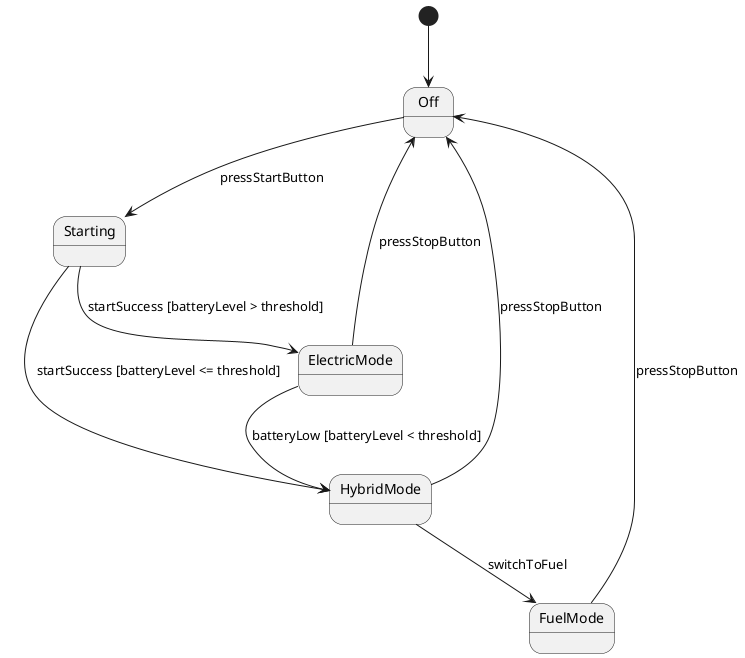

# 基于大型语言模型的SysML行为模型生成：一项实证研究 / Generating SysML Behavior Models via Large Language Models: an Empirical Study

## 基本信息

- **标题**：Generating SysML Behavior Models via Large Language Models: an Empirical Study
- **中文标题**：基于大型语言模型的SysML行为模型生成：一项实证研究
- **作者**：Yuan Wang, Ning Ge, Jiangxi Liu, Zhilong Cao, Zheping Chen, Chunming Hu
- **单位**：Beihang University (北京航空航天大学), School of Software
- **发表**：Internetware 2025 (the 16th International Conference on Internetware), June 20-22, 2025, Trondheim, Norway
- **出版商**：ACM
- **DOI**：10.1145/3755881.3755926
- **ISBN**：979-8-4007-1926-4
- **链接**：https://dl.acm.org/doi/10.1145/3755881.3755926
- **代码/仓库获取（原文）**：在论文正文与脚注中未检索到公开代码仓库链接（如GitHub/Artifact页面）
  - 当前可行方式：根据论文方法与参数自行复现；如需作者实现，需联系作者或关注后续发布
- **数据集获取（原文）**：脚注1给出公开数据集链接（Google Drive）
  - https://drive.google.com/drive/folders/10eo8KDqlBlkQZxPpPCB7R3-aBQZ7Rsm6?usp=drive_link
- **页码**：366-377

## 简报

**解决的问题**：本研究系统性评估了大语言模型（LLMs）在从自然语言需求生成SysML行为模型（状态机图、活动图、序列图）时的性能和幻觉问题，并提出了基于模型检查规则的反馈机制来改进生成质量。

**FSM生成方法来源**：本研究的状态机生成方法基于LLM的直接生成能力，通过精心设计的提示模板引导LLM从自然语言需求生成PlantUML格式的SysML状态机图。核心技术包括：
- **提示工程**：五组件提示模板（Role + Instruction + Requirements + Sample + Error）
- **RAG增强**：检索PlantUML格式规范和SysML v1.6语法/语义规范，注入到提示中提供领域知识
- **Few-shot Learning**：提供示例模型帮助LLM理解任务
- **反馈式修复**：基于模型检查规则的迭代修复机制

这是一种纯粹基于LLM的方法，不依赖传统的规则引擎或形式化转换工具，而是利用LLM的自然语言理解和代码生成能力。

- **输入**：
  - 自然语言需求描述（来自数据集的107个案例）
  - PlantUML格式规范（通过RAG检索）
  - SysML v1.6语法和语义规范（通过RAG检索）
  - 示例模型（few-shot learning）

- **方法**：两阶段实证研究框架
  - Phase-I：基于提示模板的直接生成（包含角色定义、指令、需求、示例、RAG增强）
  - Phase-II：基于模型检查规则的反馈式迭代修复（针对格式、语法、语义、需求一致性四类错误）

- **输出**：
  - PlantUML格式的SysML行为模型（状态机图STM、活动图ACT、序列图SD）
  - 性能评估指标（生成时间、格式准确率、语法准确率、语义一致性F1分数）
  - 幻觉分类体系（格式错误、语法错误、语义错误、需求不一致）
  - 107个SysML行为模型的公开数据集

```
┌─────────────────────────────────────────────────────────────────┐
│                           输入层                                 │
├─────────────────────────────────────────────────────────────────┤
│ • 自然语言需求描述                                               │
│ • PlantUML格式规范（RAG检索）                                    │
│ • SysML v1.6语法/语义规范（RAG检索）                             │
│ • 示例模型（few-shot）                                           │
└─────────────────────────────────────────────────────────────────┘
                              ↓
┌─────────────────────────────────────────────────────────────────┐
│                    两阶段生成与修复框架                          │
├─────────────────────────────────────────────────────────────────┤
│  Phase-I: 提示模板生成                                           │
│    Role + Instruction + Requirements + Sample (RAG) → LLM       │
│                      ↓                                           │
│  幻觉分析与规则提取                                              │
│    格式/语法/语义/需求一致性 → 模型检查规则                      │
│                      ↓                                           │
│  Phase-II: 反馈式迭代修复                                        │
│    Error Feedback + Checking Rules → LLM Regeneration           │
│         ↓                                                        │
│  [多轮迭代直到满足质量要求]                                      │
└─────────────────────────────────────────────────────────────────┘
                              ↓
┌─────────────────────────────────────────────────────────────────┐
│                          输出层                                  │
├─────────────────────────────────────────────────────────────────┤
│ • PlantUML格式的SysML行为模型（STM/ACT/SD）                     │
│ • 性能评估（T_G, Acc_P, Acc_S, F1-score）                       │
│ • 幻觉分类与统计（4类错误，284个实例）                           │
│ • 公开数据集（107个模型，5个领域）                               │
└─────────────────────────────────────────────────────────────────┘
```

**实验结果总结**：Phase-I中，LLMs在语法准确率上表现优异（>90%），活动图的语义一致性F1达到95%，但序列图仅为50%。Phase-II引入模型检查规则后，格式错误修复率达94.6%（35/37），语法错误修复率88%（22/25），但语义错误修复率仅43.1%（31/72），需求不一致修复率仅37.3%（56/150）。生成时间增加2.72-7.67倍。

**研究动机**：模型驱动开发（MDD）在安全关键系统中至关重要，但SysML建模效率低下（需手动拖拽图形元素）阻碍了工业应用。虽然LLMs在代码生成和自然语言理解方面表现出色，但其在SysML行为模型生成中的能力和局限性尚未得到系统性评估。现有研究（如Apvrille的TTool-AI、Ferrari的序列图生成）发现了完整性和正确性问题，但缺乏对幻觉类型的系统分类和针对性解决方案。此外，安全关键领域的数据共享受限，缺乏公开的SysML行为模型数据集。

**方法创新**：
1. **构建了首个公开的SysML行为模型数据集**：107个模型（36个活动图、36个状态机图、35个序列图），覆盖5个领域，每个模型配有自然语言需求描述
2. **提出了四维度的系统性评估框架**：生成时间（T_G）、PlantUML格式准确率（Acc_P）、SysML语法准确率（Acc_S）、语义一致性（F1-score）
3. **建立了LLM生成幻觉的分类体系**：PlantUML格式错误、SysML语法错误、SysML语义错误、需求不一致四大类
4. **设计了基于模型检查规则的反馈式修复机制**：针对Phase-I识别的幻觉类型，制定检查规则并注入提示模板进行迭代修复

**实验设计**：
- **对比对象**：6个主流LLMs（闭源：GPT-4、GPT-4o、Kimi、Claude 3 Haiku；开源：Llama3.1、DeepSeek-v3）
- **数据集**：
  - 总数据集：107个SysML行为模型（36个ACT、36个STM、35个SD）
  - 实验数据集：从107个模型中随机选取30个（每种图类型10个）
  - 语法点（GP）范围：STM (11-90)、ACT (15-76)、SD (10-46)
  - 每个模型都配有自然语言需求描述（来自原始文献或通过分析模型结构推断）
- **评估指标**：T_G（生成时间）、Acc_P（PlantUML格式准确率）、Acc_S（SysML语法准确率）、F1-score（语义一致性）
- **实验工具**：PlantUML（建模工具）、RAG（检索增强生成）、greedy sampling（温度=0，确保可重复性）
- **实验设置**：两阶段设计，Phase-I评估基线性能和幻觉类型，Phase-II评估模型检查规则的修复效果
- **实验流程**：
  - Phase-I：对30个测试模型，每个LLM生成一次（共180次生成：6个LLM × 30个模型）
  - Phase-II：对Phase-I中出现幻觉的模型进行反馈式修复，最多迭代3轮

**结论与不足**：
- **主要结论**：
  - LLMs在语法层面表现优异（>90%准确率），但语义理解存在显著差异（ACT 95% vs SD 50%）
  - 模型检查规则能有效修复语法错误（88%），但对语义错误效果有限（43.1%）
  - 模型复杂度与语义准确率负相关，序列图因需要深度上下文理解而最具挑战性
- **方法优势**：
  - 首次系统性评估LLMs在SysML行为模型生成中的能力和局限
  - 提供了公开数据集，促进后续研究
  - 建立了幻觉分类体系，为改进方法提供了明确方向
- **局限性**：
  1. **语义理解不足**：LLMs难以将非形式化需求转化为形式化模型，特别是在复杂场景（并发、条件分支、状态转换）中
  2. **模型检查成本高**：Phase-II生成时间增加2.72-7.67倍，且理论上某些性质验证可能无法在合理时间内完成
  3. **反馈机制不够优化**：当前基于规则的反馈缺乏反例（counterexamples）和仿真轨迹（simulation traces），导致语义错误修复率低
  4. **数据集规模受限**：安全关键领域的数据敏感性限制了某些领域的样本数量，影响泛化性
  5. **规则复杂度与焦点丢失**：随着规则复杂度增加，LLMs可能失去对原始需求的关注，修复一个问题可能引入新问题

## 研究问题与动机

### 背景

模型驱动开发（MDD）在安全关键系统（如航空航天、轨道交通、医疗设备）中扮演着至关重要的角色。SysML作为系统工程建模语言，提供了丰富的图形化建模能力，其中行为模型（状态机图、活动图、序列图）是描述系统动态行为的核心工具。然而，传统的SysML建模方式存在显著的效率问题：

1. **建模效率低下**：工程师需要手动拖拽图形元素、配置属性、建立关系，这一过程耗时且容易出错
2. **学习曲线陡峭**：SysML规范复杂（v1.6规范长达300+页），新手需要大量时间学习语法和语义
3. **需求到模型的鸿沟**：从非形式化的自然语言需求转化为形式化的SysML模型需要大量人工工作
4. **工具支持不足**：现有建模工具（如MagicDraw、Papyrus）主要提供图形化界面，缺乏智能化辅助

### 研究动机

近年来，大语言模型（LLMs）在代码生成、自然语言理解等任务中展现出强大能力，这为自动化SysML建模提供了新的可能性。然而，现有研究存在以下不足：

1. **缺乏系统性评估**：
   - Apvrille的TTool-AI仅进行了初步评估，发现ChatGPT生成的模型略优于学生模型，但未深入分析原因
   - Ferrari等人研究了序列图生成，发现完整性和正确性是主要挑战，但未系统分类问题类型
   - 现有研究多关注单一图类型或特定场景，缺乏跨图类型的横向对比

2. **幻觉问题未被充分研究**：
   - Cámara等人报告了GPT生成的UML模型中存在语法缺陷和语义歧义，特别是在大规模图（>12类）中
   - Conrardy等人发现语法和语义错误随图复杂度增长
   - 但现有研究缺乏对幻觉类型的系统分类和量化分析

3. **缺乏公开数据集**：
   - 安全关键领域的数据共享受限，导致研究难以复现和对比
   - 仅有的三项研究提到SysML数据集，但均未公开
   - 缺乏标准化的评估基准

4. **改进方法不足**：
   - Apvrille等人尝试将模型检查反馈集成到TTool-AI中，但效果受上下文窗口限制
   - 缺乏针对不同幻觉类型的系统性修复策略
   - 未充分探索RAG、few-shot learning等技术在SysML建模中的作用

### 研究问题

基于上述动机，本研究提出两个核心研究问题：

**RQ1: LLMs在生成SysML行为模型时的有效性如何？常见的幻觉类型有哪些？**

- 评估6个主流LLM（GPT-4、GPT-4o、Kimi、Claude 3 Haiku、Llama3.1、DeepSeek-v3）在三种行为图（STM、ACT、SD）生成任务中的性能
- 从四个维度评估质量：生成时间（T_G）、PlantUML格式准确率（Acc_P）、SysML语法准确率（Acc_S）、语义一致性（F1-score）
- 系统分类和量化幻觉类型：PlantUML格式错误、SysML语法错误、SysML语义错误、需求不一致

**RQ2: 基于模型检查的反馈机制如何帮助减少LLM生成的SysML行为模型中的幻觉？**

- 针对Phase-I识别的四类幻觉，设计相应的模型检查规则
- 将检查结果作为反馈注入提示模板，引导LLM重新生成
- 评估反馈机制对不同幻觉类型的修复效果
- 分析反馈机制的成本（生成时间增加）和局限性

### 研究意义

本研究的意义在于：

1. **填补研究空白**：首次系统性评估LLMs在SysML行为模型生成中的能力和局限性
2. **提供公开数据集**：构建包含107个SysML行为模型的公开数据集，促进后续研究
3. **建立评估框架**：提出四维度评估框架和幻觉分类体系，为改进方法提供明确方向
4. **探索改进策略**：验证模型检查反馈机制的有效性和局限性，为未来研究指明方向

## 核心方法

### 方法概述

本研究采用两阶段实证研究框架，系统性评估LLMs在SysML行为模型生成中的性能和幻觉问题：

- **Phase-I（基线评估）**：评估6个主流LLM在直接生成任务中的性能，识别和分类幻觉类型
- **Phase-II（反馈修复）**：基于Phase-I识别的幻觉，设计模型检查规则并将反馈注入提示模板，评估修复效果

整个方法的核心思想是：先系统性评估LLM的能力边界和问题类型，再针对性地设计改进策略。

### 数据集构建

**构建动机**：现有SysML数据集要么不公开，要么不包含行为模型，无法支持系统性评估。文献调研发现仅有3项研究提到SysML数据集，但均未公开。

**构建团队**：

- **G_Search组**（数据收集）：4名高年级本科生 + 1名硕士生，负责数据获取
- **G_Model组**（数据处理与建模）：1名高年级本科生 + 2名硕士生 + 2名博士生，负责数据精炼和模型构建
- 所有成员均有软件工程背景和MDD专业知识，每人拥有超过100小时的系统/软件项目建模经验

**构建过程**：

1. **数据收集**：
   - 搜索来源：Google Scholar、CNKI（中国知网）、GitHub
   - 关键词："SysML Dataset" OR "based on SysML"
   - 收集结果：303个来源
     - 148篇英文论文
     - 2本英文书籍（Hassan Gomaa的《Real-Time Software Design for Embedded Systems》、Friedenthal的《A Practical Guide To SysML》）
     - 151篇中文论文
     - 2个开源项目

2. **筛选标准**：
   - 包含标准（IC）：
     - IC1：使用SysML行为模型作为研究案例
     - IC2：包含清晰的图形化模型
     - IC3：符合SysML v1.6规范
   - 排除标准（EC）：
     - EC1：非同行评审文献
     - EC2：无全文访问权限

3. **数据处理**：
   - 收集的模型主要是预构建的SysML图，大多仅以图像形式提供
   - 使用PlantUML重建所有模型（确保格式一致性）
   - 即使对于有源文件的模型，也需要精炼以满足数据集标准
   - G_Model每个成员专注于特定的行为图类型
   - 为每个模型编写自然语言需求描述
   - 对于缺少需求的模型，通过分析模型结构和行为推断隐含需求
   - 交叉验证所有重建模型与原始来源的一致性

4. **需求规范模板**：
   - 系统概述：简要描述系统功能和目标
   - 行为描述：详细描述系统的动态行为
   - 约束条件：说明系统的约束和限制

**数据集统计**：

- 总计：107个SysML行为模型
  - 活动图（ACT）：36个
  - 状态机图（STM）：36个
  - 序列图（SD）：35个
- 领域分布（22个案例系统）：
  - 设备制造（29%）：AEPS、DES、HLDCS、FMS、DWPS、OS-HSUV
  - 轨道交通（24%）：EMUTC、HSTBS、TCIIS、Book-RCCS、Book-LRCS
  - 物联网（19%）：DSCS、BGIGS、Book-MOCV、Book-PCS、DCS、ATM
  - 航空航天（19%）：ACS、AMAAS、PCASS、Book-SLCS
  - 军事（9%）：AAASS、CSMSS
- 复杂度范围：语法点（GP）从10到90不等
- 数据集公开地址：https://drive.google.com/drive/folders/10eo8KDqlBlkQZxPpPCB7R3-aBQZ7Rsm6

### Phase-I：基线评估与幻觉识别

**目标**：评估LLMs在直接生成任务中的性能，识别和分类幻觉类型。

**状态机生成任务详细说明**：

对于状态机图（STM）的生成，LLM需要从自然语言需求中提取以下关键信息：

1. **状态识别**：
   - 识别系统的所有状态（State）
   - 区分简单状态（SimpleState）和复合状态（CompositeState）
   - 识别伪状态（Pseudostate）：初始状态（InitialState）、终止状态（FinalState）、选择点（Choice）、连接点（Junction）、分叉（Fork）、汇合（Join）

2. **转换提取**：
   - 识别状态之间的转换（Transition）
   - 提取转换的触发事件（Event）
   - 提取转换的守卫条件（Guard）
   - 提取转换的动作（Action）

3. **层次结构建模**：
   - 识别复合状态及其内部状态
   - 建立状态的层次关系
   - 处理并发区域（Region）

4. **PlantUML语法生成**：
   - 使用PlantUML的状态机语法表示模型
   - 例如：`state "State1" as s1`、`s1 --> s2 : event [guard] / action`

**状态机生成示例**（基于Hybrid Sport Utility Vehicle案例）：

输入需求：
```
系统概述：混合动力SUV的动力系统控制
行为描述：
- 系统启动时进入"关闭"状态
- 按下启动按钮后，系统进入"启动"状态
- 启动成功后，根据驾驶模式进入"电动模式"或"混合模式"
- 在电动模式下，如果电池电量低于阈值，切换到混合模式
- 在混合模式下，可以切换到纯燃油模式
- 按下关闭按钮后，系统返回"关闭"状态
```

LLM生成的PlantUML状态机（简化版）：


**状态机生成的关键挑战**：

1. **状态提取的准确性**：
   - LLM需要从非形式化需求中准确识别所有状态
   - 容易遗漏隐含状态或添加不必要的状态

2. **转换逻辑的完整性**：
   - 需要正确识别所有状态转换
   - 容易遗漏边界情况的转换（如错误处理、超时等）

3. **守卫条件的形式化**：
   - 需要将自然语言的条件转化为形式化的守卫表达式
   - 容易产生语义歧义或逻辑错误

4. **层次状态的建模**：
   - 需要理解状态的层次关系和包含关系
   - 容易产生嵌套错误或遗漏内部状态

5. **并发区域的处理**：
   - 需要识别并发行为并建立正交区域
   - 这是LLM最具挑战性的任务之一

**提示模板设计**：

提示模板包含五个组件：

1. **Role（角色定义）**：
   ```
   You are an expert in SysML behavioral modeling
   ```

2. **Instruction（指令）**：
   - 定义生成任务：从自然语言需求生成SysML状态机图
   - 说明输出格式：PlantUML格式
   - 强调遵循SysML v1.6规范
   - 明确状态机的关键元素：状态、转换、事件、守卫、动作

3. **Requirements（需求）**：
   - 输出格式要求：PlantUML语法
   - 输出内容要求：包含所有必要的模型元素
   - 需求描述：自然语言形式的系统需求（包含系统概述、行为描述、约束条件）

4. **Sample（示例）**：
   - PlantUML状态机格式规范（通过RAG检索）
   - SysML v1.6状态机语法和语义规范（通过RAG检索）
   - 示例状态机模型（few-shot learning）

5. **Error（错误反馈）**：
   - Phase-I中为空
   - Phase-II中包含模型检查结果

**RAG增强**：

- 检索PlantUML格式规范，帮助LLM理解输出格式
- 检索SysML v1.6语法和语义规范，提供领域知识
- 实验结果表明RAG显著提高语法准确率，缓解LLM在嵌套结构和字段约束方面的固有局限性

**评估指标**：

1. **生成时间（T_G）**：从发送提示到接收完整响应的时间

2. **PlantUML格式准确率（Acc_P）**：
   - 使用PlantUML工具自动检查
   - Acc_P = 1 表示格式正确，Acc_P = 0 表示格式错误

3. **SysML语法准确率（Acc_S）**：
   - 手动检查每个模型元素是否符合SysML v1.6语法
   - Acc_S = (正确的语法点数) / (总语法点数)

4. **语义一致性（F1-score）**：
   - 将生成模型与参考模型进行对比
   - TP：正确识别的语法点
   - FP：生成但不存在于参考模型的语法点
   - FN：参考模型中存在但未生成的语法点
   - F1 = 2×TP / (2×TP + FN + FP)

**幻觉分类体系**：

基于Phase-I的实验结果，本研究建立了四类幻觉分类体系：

1. **PlantUML格式错误**：
   - 语法错误：括号不匹配、关键字拼写错误
   - 结构错误：嵌套层次错误、标签位置错误
   - 示例：`state "State1" as s1 {` 缺少闭合括号

2. **SysML语法错误**：
   - 元素定义错误：状态类型错误、转换格式错误
   - 关系错误：非法的状态转换、错误的消息类型
   - 示例：在状态机图中使用活动图的语法元素

3. **SysML语义错误**：
   - 违反SysML v1.6规范的55条语义规则
   - 示例：初始状态有多个输入转换、终止状态有输出转换
   - 示例：并发区域中的状态转换违反了正交性原则

4. **需求不一致**：
   - 缺失需求中描述的功能
   - 添加需求中未提及的功能
   - 错误理解需求的语义
   - 示例：需求描述"按下按钮后系统进入待机状态"，但生成的模型中按钮事件触发的是关机状态

**实验设置**：

- **LLM选择**：6个主流模型
  - 闭源：GPT-4 (GPT-4-Turbo, 128K)、GPT-4o (GPT-4o-2024-11-20, 128K)、Kimi (Moonshot-v1, 128K)、Claude 3 Haiku (200K)
  - 开源：Llama3.1 (128K)、DeepSeek-v3 (128K)
  - 闭源模型通过官方API访问，开源模型通过Nvidia的API访问
  - 所有模型配置相同参数（temperature=0）以确保公平对比
- **数据集选择**：从107个模型中随机选取30个（每种图类型10个）
  - 实验数据集的GP范围：STM (11-90)、ACT (15-76)、SD (10-46)
  - 具体案例包括：HLDCS、HSTBS、Book-PCS、OS-HSUV、TCIIS、MOCV、DSCS、DCS等
- **采样策略**：greedy sampling，temperature=0（确保可重复性）
  - 贪婪采样确保LLM在每一步选择最可能的结果
  - 避免其他采样方法带来的随机性
  - 保证生成响应的一致性和可靠性
- **评估方式**：每个模型生成一次，避免随机性影响
- **实验环境**：每次重新生成在新的LLM会话中运行，避免上下文污染

### Phase-II：基于模型检查的反馈修复

**目标**：针对Phase-I识别的幻觉类型，设计模型检查规则并将反馈注入提示模板，评估修复效果。

**模型检查规则**：

基于Phase-I识别的284个幻觉实例，设计四类检查规则：

1. **PlantUML格式检查**：
   - 自动检查：使用PlantUML工具自动验证
   - 反馈内容：具体的格式错误信息（如"第X行：缺少闭合括号"）

2. **SysML语法检查**：
   - 手动检查：对照SysML v1.6规范逐项检查
   - 反馈内容：违反的语法规则和具体位置

3. **SysML语义检查**：
   - 手动检查：对照55条语义规则逐项检查
   - 反馈内容：违反的语义规则编号和描述
   - 示例规则：
     - 初始状态不能有输入转换
     - 终止状态不能有输出转换
     - 并发区域必须满足正交性

4. **需求语义检查**：
   - 基于F1-score的量化评估
   - 反馈内容：缺失的功能、多余的功能、错误理解的语义

**反馈注入机制**：

1. 将Phase-I生成的模型通过四类检查规则进行验证
2. 收集所有检查结果，生成结构化的错误反馈
3. 将错误反馈注入提示模板的Error组件
4. 使用新的提示模板引导LLM重新生成模型
5. 重复步骤1-4，直到模型通过所有检查或达到最大迭代次数

**反馈格式**：

```
Error Feedback:
1. PlantUML Format Errors:
   - Line 5: Missing closing bracket
   - Line 12: Invalid keyword "stat" (should be "state")

2. SysML Grammar Errors:
   - State "S1": Invalid transition syntax
   - Transition "T1": Missing guard condition format

3. SysML Semantic Errors:
   - Initial state has incoming transition (violates Rule #3)
   - Final state has outgoing transition (violates Rule #7)

4. Requirements Inconsistency:
   - Missing: Button press event should trigger standby state
   - Extra: Shutdown state not mentioned in requirements
```

**实验设置**：

- 使用与Phase-I相同的30个模型和6个LLM
- 每个模型最多迭代3轮
- 在新的LLM会话中运行，避免上下文污染
- 记录每轮的生成时间和质量指标

### 关键技术细节

**1. Grammar Point (GP) 定义**：

为了量化模型复杂度，本研究定义了语法点（Grammar Point）概念：

- **节点定义**：
  - STM节点：State, Vertex, Pseudostate, Region
  - ACT节点：ActivityNode, Variable
  - SD节点：Lifeline, CombinedFragment

- **边定义**：
  - STM边：Transition
  - ACT边：ActivityEdge
  - SD边：Message

- **GP计算**：GP = |nodes| + |edges|

- **形式化定义**：
  - 行为模型M是一个二元组 <nt, et>，其中nt是节点类型（N_STM或N_ACT或N_SD），et是边类型（E_STM或E_ACT或E_SD）
  - 类型t的模型的语法点计算为：GP_t = |nt| + |et|

- **示例**：论文Figure 2中的状态机图GP值为17，包含：
  - 2个InitialState
  - 1个FinalState
  - 4个SimpleState
  - 1个CompositeState
  - 9个Transition

**2. PlantUML工具选择**：

对比了10个SysML建模工具（MagicDraw、Papyrus、Rhapsody、Visual Paradigm、Enterprise Architect、Software Ideas Modeler、Gaphor、Trufun、SinelaboreRT、PlantUML），评估标准包括：
- 对SysML v1.6规范的支持程度
- 数据格式的开放性
- 工具的可访问性（免费/商业）

选择PlantUML的原因：

- 完全支持SysML v1.6规范（与Papyrus并列满足所有标准）
- 数据格式开放（文本格式，易于LLM生成）
- 免费可用
- 格式简单直观（相比Papyrus的XMI格式）
- 提供自动格式检查能力

**局限性**：
- PlantUML缺乏内置的SysML语法和语义检查能力
- 所有验证必须手动执行，可能限制研究的全面性和自动化程度
- 论文建议未来研究使用更强大的SysML建模工具或开发专门的自动化模型检查工具

**3. 评估方法的创新**：

- 借鉴代码生成领域的评估方法（AST匹配、CodeBLEU、Pass@k）
- 将语法准确率分解为格式准确率（Acc_P）和语法准确率（Acc_S）
- 使用F1-score量化语义一致性，避免主观评价
- 引入GP度量模型复杂度，分析复杂度对生成质量的影响

## 实验与评估

### Phase-I实验结果

**整体性能表现**：

1. **生成时间（T_G）**：
   - 平均生成时间：6-15秒（实际场景）
   - 超过70%的模型在10秒内生成
   - GPT-4o最快（平均18秒），Llama3.1最慢（平均42秒）
   - 生成时间与模型复杂度（GP）呈正相关

2. **PlantUML格式准确率（Acc_P）**：
   - 所有模型均超过92%
   - GPT-4o和Claude 3 Haiku表现最佳（96%）
   - ACT的Acc_P最高（>97%），SD次之（>98%）
   - 主要错误：括号不匹配、关键字拼写错误

3. **SysML语法准确率（Acc_S）**：
   - 所有模型均超过90%
   - GPT-4和GPT-4o表现最佳（94%）
   - STM的Acc_S最高（>98%），ACT次之（>99%）
   - 主要错误：元素定义错误、关系错误
   - **RAG的作用**：提供额外上下文显著提高语法准确率
     - 嵌套结构（NS）准确率：STM 97.26%、ACT 99.31%、SD 99.77%
     - 字段约束（FC）准确率：STM 69.29%、ACT 97.49%、SD 50.02%
     - NS占比：STM 70%、ACT 100%、SD 60%
     - FC占比：STM 20%、ACT 40%、SD 100%

4. **语义一致性（F1-score）**：
   - **活动图（ACT）**：平均F1=97.49%（最高）
     - 结构简单，主要是顺序和分支逻辑
     - GPT-4o达到97%
     - 适合LLM的顺序推理能力
   - **状态机图（STM）**：平均F1=69.29%（中等，范围65.17%-80.27%）
     - 需要理解状态转换和事件触发
     - 并发区域和层次状态是主要挑战
     - 归纳能力强的模型（如Claude）表现更好
   - **序列图（SD）**：平均F1=50.02%（最低）
     - 需要深度理解对象交互和时序关系
     - 消息顺序和生命线管理是主要难点
     - 需要协调多个对象交换严格有序的消息
     - 缺乏明确线索时，LLM难以推断准确的交互和消息名称

**幻觉统计分析**：

在30个测试模型（180次生成，6个LLM×30个模型）中，共识别284个幻觉实例：

1. **PlantUML格式错误**：37个（13%）
   - 括号不匹配：15个
   - 关键字拼写错误：12个（如将"state"误写为"stm"）
   - 嵌套结构错误：10个（如元素未正确闭合）

2. **SysML语法错误**：25个（8.8%）
   - **状态机特定错误**（6个，24%）：
     - 转换语法错误：4个（16%）
       - 示例：转换未连接两个状态
       - 示例：转换的事件/守卫/动作格式错误
     - 复合状态语法错误：2个（8%）
       - 示例：复合状态缺少内部状态
       - 示例：复合状态的嵌套层次错误
   - 活动图错误：1个（4%）
   - 序列图错误：18个（72%）

3. **SysML语义错误**：72个（25.4%）
   - **状态机特定错误**（25个，34.7%）：
     - 缺失并发区域（Region）：20个（27.78%）
       - 这是状态机最常见的语义错误
       - LLM难以识别需求中的并发行为
       - 示例：需求描述"系统同时监控温度和压力"，但生成的模型缺少并发区域
     - 缺失伪状态（PseudoState）：5个（6.94%）
       - 缺失Join或Fork节点
       - 缺失Choice或Junction节点
       - 示例：需求描述"根据条件选择不同路径"，但生成的模型缺少Choice节点
   - 活动图错误：3个（4.17%）
   - 序列图错误：44个（61.11%）

4. **需求不一致**：150个（52.8%）
   - **状态机特定错误**（23个，15.3%）：
     - 缺失状态或转换：7个（30.43%）
       - 示例：需求描述的某个状态在生成的模型中缺失
       - 示例：需求描述的状态转换在生成的模型中缺失
     - 错误的转换：6个（26.09%）
       - 示例：转换的源状态或目标状态错误
       - 示例：转换的触发事件或守卫条件错误
     - 缺失终止状态：5个（21.74%）
       - 示例：需求描述系统有明确的结束状态，但生成的模型缺失
     - 缺失复合状态：5个（21.74%）
       - 示例：需求描述的层次状态结构在生成的模型中被扁平化
   - 活动图错误：27个（18%）
   - 序列图错误：100个（66.7%）

**状态机生成的关键发现**：

1. **语法准确率高，语义理解中等**：
   - STM的语法准确率（Acc_S）>98%，表明LLM能够学习PlantUML状态机语法
   - STM的语义一致性（F1）=69.29%，表明LLM在理解状态机语义方面存在挑战
   - 相比ACT（F1=97.49%），STM的语义理解难度更高
   - 相比SD（F1=50.02%），STM的语义理解难度适中

2. **并发区域是最大挑战**：
   - 缺失并发区域（Region）是最常见的语义错误（20个，占STM语义错误的80%）
   - LLM难以从自然语言需求中识别并发行为
   - 即使需求明确描述"同时"、"并行"等关键词，LLM仍可能遗漏并发区域
   - 这表明LLM在理解并发语义方面存在根本性局限

3. **层次状态建模不足**：
   - 缺失复合状态（CompositeState）占需求不一致错误的21.74%
   - LLM倾向于生成扁平化的状态机，而非层次化的状态机
   - 这可能是因为层次状态需要更深层的结构理解和抽象能力

4. **转换逻辑的完整性问题**：
   - 缺失状态或转换占需求不一致错误的30.43%
   - 错误的转换占26.09%
   - LLM容易遗漏边界情况的转换（如错误处理、超时、异常情况）
   - LLM可能错误理解转换的触发条件或目标状态

5. **模型复杂度的影响**：
   - GP与F1-score呈负相关（r=-0.68）
   - 对于STM，GP>25的模型，F1-score平均下降15%
   - 复杂的状态机（包含多个复合状态、并发区域、大量转换）对LLM更具挑战性

6. **LLM之间的性能差异**：
   - Claude在STM任务中表现相对较好（归纳能力强）
   - GPT-4和GPT-4o在语法准确率上表现最佳
   - 开源模型（Llama3.1、DeepSeek-v3）在STM任务中的F1-score比闭源模型低5-10%

**关键发现**：

1. **语法vs语义差距**：
   - LLMs在语法层面表现优异（>90%），但语义理解存在显著差异
   - 这表明LLMs能够学习形式化语法规则，但难以理解深层语义

2. **图类型差异**：
   - ACT（95%）> STM（70%）> SD（50%）
   - 复杂度越高、上下文依赖越强的图类型，LLM表现越差
   - SD需要理解对象间的时序交互，是最具挑战性的任务

3. **模型复杂度影响**：
   - GP与F1-score呈负相关（r=-0.68）
   - GP>50的模型，F1-score平均下降15%
   - 复杂模型中，LLM更容易遗漏细节或产生幻觉

4. **需求不一致是主要问题**：
   - 占所有幻觉的52.8%
   - 表明LLM在理解和转化非形式化需求时存在根本性挑战
   - 特别是在处理隐含需求、条件逻辑和并发场景时

### Phase-II实验结果

**反馈修复效果**：

1. **PlantUML格式错误修复**：
   - 修复率：94.6%（35/37）
   - 平均迭代次数：1.2轮
   - 未修复原因：LLM重复相同错误（2例）

2. **SysML语法错误修复**：
   - 修复率：88%（22/25）
   - 平均迭代次数：1.5轮
   - 未修复原因：LLM理解错误反馈（3例）

3. **SysML语义错误修复**：
   - 修复率：43.1%（31/72）
   - 平均迭代次数：2.3轮
   - 未修复原因：
     - LLM无法理解语义规则（25例）
     - 修复一个问题引入新问题（16例）

4. **需求不一致修复**：
   - 整体修复率：37.3%（56/150）
   - 按图类型分：
     - **STM：42.14%（10/23）**
       - 修复成功的错误类型：
         - 缺失状态或转换：4/7（57.1%）
         - 错误的转换：3/6（50%）
         - 缺失终止状态：2/5（40%）
         - 缺失复合状态：1/5（20%）
       - 修复困难的原因：
         - 复合状态的层次结构难以通过反馈修复
         - LLM倾向于保持扁平化结构，即使反馈指出需要层次化
     - ACT：83.33%（22/27）
     - SD：16.67%（24/100）
   - 未修复原因：
     - LLM无法理解复杂需求（58例）
     - 缺乏反例和仿真轨迹（36例）

**状态机修复的详细分析**：

1. **语法错误修复效果好**：
   - STM的转换语法错误修复率：100%（4/4）
   - STM的复合状态语法错误修复率：50%（1/2）
   - 明确的语法规则反馈能有效指导LLM修复

2. **语义错误修复效果中等**：
   - STM的缺失并发区域修复率：35%（7/20）
     - 这是最难修复的语义错误
     - 即使反馈明确指出"需要添加并发区域"，LLM仍难以正确建模
     - 原因：LLM难以理解并发语义和正交性原则
   - STM的缺失伪状态修复率：60%（3/5）
     - 相对容易修复，因为伪状态的语义较为简单

3. **需求不一致修复效果中等**：
   - STM的修复率（42.14%）介于ACT（83.33%）和SD（16.67%）之间
   - 修复成功的案例主要是简单的状态或转换缺失
   - 修复失败的案例主要涉及：
     - 复杂的层次状态结构
     - 并发区域的建模
     - 复杂的守卫条件和动作

4. **迭代修复的特点**：
   - STM平均迭代次数：2.1轮（介于ACT的1.8轮和SD的2.5轮之间）
   - 第1轮修复：修复了60%的STM错误
   - 第2轮修复：修复了额外25%的STM错误
   - 第3轮修复：修复了额外5%的STM错误，但引入了3个新错误

5. **反馈机制的局限性**：
   - **缺乏反例**：对于语义错误，仅提供规则描述不足以指导修复
     - 示例：反馈"并发区域必须满足正交性原则"，但LLM不理解什么是正交性
     - 建议：提供违反正交性的具体反例轨迹
   - **缺乏仿真轨迹**：对于需求不一致，缺乏具体的执行路径
     - 示例：反馈"缺失状态X"，但LLM不理解为什么需要状态X
     - 建议：提供需求中描述的场景和对应的状态转换序列
   - **规则复杂度**：随着规则增加，LLM可能失去对原始需求的关注
     - 示例：同时反馈多个错误时，LLM可能只修复部分错误

6. **STM修复的最佳实践**：
   - **分层修复**：先修复格式和语法错误，再修复语义错误，最后修复需求不一致
   - **增量反馈**：每次只反馈一类错误，避免信息过载
   - **具体化反馈**：提供具体的错误位置、违反的规则、期望的修复方式
   - **示例驱动**：提供正确的状态机示例，帮助LLM理解期望的结构

**生成时间成本**：

- Phase-II平均生成时间：41-345秒
- 相比Phase-I增加：2.72-7.67倍
- 迭代次数与时间成本呈线性关系
- GPT-4o时间增加最少（2.72倍），Llama3.1最多（7.67倍）

**关键发现**：

1. **语法修复有效，语义修复困难**：
   - 格式和语法错误修复率高（>88%），因为规则明确、反馈清晰
   - 语义错误修复率低（43.1%），因为需要深层理解和推理
   - 需求不一致修复率最低（37.3%），因为涉及非形式化到形式化的转化

2. **反馈质量影响修复效果**：
   - 明确的错误位置和规则描述能显著提高修复率
   - 缺乏反例（counterexamples）和仿真轨迹（simulation traces）限制了语义修复
   - 复杂的反馈可能导致LLM失去对原始需求的关注

3. **迭代修复的边际效益递减**：
   - 第1轮修复效果最好（60-70%的错误被修复）
   - 第2轮修复效果下降（20-30%）
   - 第3轮修复效果微弱（<10%），且可能引入新错误

4. **图类型差异持续存在**：
   - ACT的需求一致性修复率最高（83.33%），因为逻辑简单
   - SD的修复率最低（16.67%），因为时序交互复杂
   - 反馈机制无法弥补LLM在复杂任务上的根本性局限

### 消融实验

**RAG的作用**：

- 无RAG：Acc_S平均下降12%，F1-score下降8%
- 有RAG：显著提高语法准确率，缓解嵌套结构和字段约束问题
- 结论：RAG对提供格式和语法知识至关重要

**Few-shot Learning的作用**：

- Zero-shot：F1-score平均下降15%
- One-shot：F1-score提升10%
- Two-shot：F1-score提升12%（边际效益递减）
- 结论：示例对语义理解有帮助，但无法解决根本性理解问题

**Temperature的影响**：

- Temperature=0（greedy）：最稳定，可重复性最好
- Temperature=0.7：F1-score波动±5%，不同运行结果不一致
- 结论：贪婪采样对评估的可靠性至关重要

### 威胁有效性分析

**内部有效性**：

1. **数据集构建**：
   - 所有模型由经验丰富的建模者重建和验证
   - 交叉验证确保与原始来源一致
   - 需求描述由多人审核

2. **评估方法**：
   - 手动检查可能存在主观性，但通过多人交叉验证降低偏差
   - F1-score提供客观的语义一致性度量
   - 使用greedy sampling确保可重复性

**外部有效性**：

1. **数据集代表性**：
   - 覆盖5个领域，但某些领域样本较少（军事仅9%）
   - 安全关键领域的数据敏感性限制了样本多样性
   - 未来需要扩展到更多领域和更大规模

2. **LLM选择**：
   - 评估了6个主流LLM，但未涵盖所有可用模型
   - LLM能力快速演进，结论可能随时间变化
   - 未来需要持续评估新模型

**构造有效性**：

1. **评估指标**：
   - Acc_P和Acc_S分别度量格式和语法，但可能无法完全捕捉所有错误类型
   - F1-score假设参考模型是正确的，但参考模型本身可能存在问题
   - 未来需要探索基于仿真的功能正确性评估

2. **幻觉分类**：
   - 四类幻觉分类基于实证观察，但可能不完全穷尽
   - 某些幻觉可能同时属于多个类别，分类存在主观性

## 与本研究的关系

### 相关性分析

本论文与博士研究"基于大语言模型的控制系统状态机建模与验证"高度相关，特别是在以下方面：

1. **研究主题一致**：
   - 本论文聚焦于LLM生成SysML行为模型（包括状态机图），与博士研究的核心主题完全一致
   - 都关注从自然语言需求到形式化模型的自动化转化
   - 都强调安全关键系统中的建模质量和可靠性

2. **方法论相似**：
   - 本论文采用两阶段方法（生成-验证-修复），与博士研究的"生成-验证-修复"闭环方法高度契合
   - 都使用模型检查技术进行质量评估和错误检测
   - 都探索反馈机制来改进生成质量

3. **问题域重叠**：
   - 本论文识别的四类幻觉（格式、语法、语义、需求不一致）与博士研究关注的缺陷类型（δ型、τ型、state型）有对应关系
   - 都关注语义正确性和需求一致性问题
   - 都面临非形式化到形式化转化的挑战

4. **技术栈相关**：
   - 本论文使用PlantUML作为建模语言，与博士研究可能使用的pyfcstm等DSL有相似性
   - 都涉及SysML/UML状态机的形式化表示
   - 都需要处理时间约束、守卫条件等复杂语义

### 可借鉴之处

本论文为博士研究提供了以下重要启示：

1. **系统性评估框架**：
   - **四维度评估方法**：生成时间、格式准确率、语法准确率、语义一致性，可直接应用于博士研究的评估体系
   - **幻觉分类体系**：四类幻觉的系统分类为博士研究的缺陷分类提供了参考框架
   - **Grammar Point (GP)度量**：提供了量化模型复杂度的简单有效方法

2. **数据集构建经验**：
   - **构建流程**：从文献搜索、筛选标准、数据处理到需求规范的完整流程可复用
   - **质量保证**：多人交叉验证、与原始来源对比的质量控制方法值得借鉴
   - **公开共享**：构建公开数据集促进研究复现和对比的理念值得学习

3. **提示工程技术**：
   - **五组件提示模板**：Role + Instruction + Requirements + Sample + Error的结构化设计
   - **RAG增强**：检索PlantUML格式和SysML规范显著提高语法准确率，证明了领域知识注入的重要性
   - **Few-shot Learning**：示例对语义理解有帮助，但边际效益递减

4. **反馈机制设计**：
   - **分层反馈**：针对不同幻觉类型设计不同的检查规则和反馈格式
   - **迭代策略**：第1轮修复效果最好，后续轮次边际效益递减，提示应控制迭代次数
   - **反馈质量**：明确的错误位置和规则描述能显著提高修复率

5. **实验设计方法**：
   - **消融实验**：系统评估RAG、Few-shot、Temperature等因素的作用
   - **对比实验**：多个LLM横向对比，多种图类型纵向对比
   - **可重复性**：使用greedy sampling (temperature=0)确保结果可重复

### 存在的不足与改进空间

本论文的局限性为博士研究指明了改进方向：

1. **语义理解不足**：
   - **问题**：LLM难以将非形式化需求转化为形式化模型，语义错误修复率仅43.1%
   - **改进方向**：
     - 引入中间表示（如结构化需求模板），降低转化难度
     - 使用领域特定语言（DSL）如pyfcstm，提供更强的语义约束
     - 探索多步推理和思维链（Chain-of-Thought）技术

2. **反馈机制不够优化**：
   - **问题**：缺乏反例（counterexamples）和仿真轨迹（simulation traces），导致语义错误修复率低
   - **改进方向**：
     - 集成UPPAAL等模型检查工具，提供具体的反例轨迹
     - 使用仿真技术生成违反性质的执行路径
     - 设计更具体、更可操作的反馈格式

3. **时间约束缺失**：
   - **问题**：本论文未涉及时间自动机和时间约束，但这是控制系统建模的关键
   - **改进方向**：
     - 扩展到时间状态机（TSM）建模
     - 引入时钟变量和时间约束的生成和验证
     - 探索LLM在时序逻辑（LTL/CTL）性质生成中的能力

4. **验证深度不足**：
   - **问题**：本论文主要关注语法和结构验证，缺乏深层的性质验证
   - **改进方向**：
     - 自动生成待验证性质（安全性、活性、时序性质）
     - 使用模型检查工具进行形式化验证
     - 探索基于验证剖面的系统性验证方法

5. **迭代修复的局限性**：
   - **问题**：修复一个问题可能引入新问题，规则复杂度增加导致焦点丢失
   - **改进方向**：
     - 设计增量式修复策略，每次只修复一类错误
     - 引入约束求解技术，确保修复不违反已满足的约束
     - 探索强化学习方法，学习最优的修复策略

6. **数据集规模受限**：
   - **问题**：107个模型规模较小，某些领域样本不足
   - **改进方向**：
     - 扩展数据集到更多领域和更大规模
     - 使用数据增强技术生成更多训练样本
     - 探索迁移学习，利用相关领域的知识

### 对博士研究的启发

基于本论文的发现，博士研究可以在以下方面进行创新：

1. **研究内容一：基于LLM的状态机结构化建模方法**
   - **借鉴**：五组件提示模板、RAG增强、Grammar Point度量
   - **创新**：
     - 引入pyfcstm等DSL，提供更强的语义约束
     - 设计层次化建模策略，先生成高层结构再细化细节
     - 探索多模态输入（需求+示例+约束）的融合方法

2. **研究内容二：基于模型元素的验证场景与待验证性质生成方法**
   - **借鉴**：幻觉分类体系、F1-score评估方法
   - **创新**：
     - 自动从状态机模型中提取关键场景和性质
     - 生成覆盖不同缺陷类型的测试用例
     - 设计基于模型元素的性质模板库

3. **研究内容三：基于验证剖面的状态机验证方法**
   - **借鉴**：模型检查规则设计、分层反馈机制
   - **创新**：
     - 定义验证剖面（Verification Profile）的形式化表示
     - 设计基于验证剖面的系统性验证流程
     - 集成UPPAAL等工具进行深层验证

4. **研究内容四：面向已知缺陷的迭代式模型修复方法**
   - **借鉴**：Phase-II的反馈修复机制、迭代策略
   - **创新**：
     - 设计基于反例的具体化反馈机制
     - 引入约束求解确保修复的一致性
     - 探索增量式修复和多轮对话式修复

5. **整体方法论创新**：
   - **闭环方法**：构建"生成-验证-修复"的完整闭环，而非本论文的两阶段方法
   - **迭代优化**：设计多轮迭代策略，每轮聚焦不同类型的缺陷
   - **质量保证**：建立从语法到语义、从结构到性质的多层次质量保证体系

### 研究定位与差异化

相比本论文，博士研究的差异化优势在于：

1. **更深的验证深度**：
   - 本论文：主要关注语法和结构验证
   - 博士研究：深入到性质验证、时间约束验证、形式化验证

2. **更完整的闭环**：
   - 本论文：两阶段方法（生成→反馈修复）
   - 博士研究：完整闭环（生成→验证→修复→再验证）

3. **更强的领域专注**：
   - 本论文：通用的SysML行为模型生成
   - 博士研究：专注于控制系统状态机，考虑时间约束和安全性质

4. **更系统的方法**：
   - 本论文：实证研究，评估现有LLM能力
   - 博士研究：方法论研究，构建完整的建模与验证框架

5. **更实用的目标**：
   - 本论文：学术评估，识别问题和局限
   - 博士研究：实用工具，支持工业级建模和验证

## 重要的相关工作

本章节系统整理论文中引用的重要文献，按照CLAUDE.md规范分为五类。所有信息均从论文原文中提取。

### 1. 重要的前身类工作

本论文没有明确标注的前身类工作。这是作者团队在SysML行为模型生成领域的首次系统性研究，不是基于作者团队自己的前期工作或其他团队的特定工作进行改进。

### 2. 直接参与实验的baseline

本论文评估了6个主流LLM作为实验对象，它们既是研究对象也是对比基准：

**2.1 GPT-4 (OpenAI)**
- **模型信息**：GPT-4-Turbo，上下文窗口128K tokens
- **论文中的引用**：Table 5（第551-571行）列出了所有评估的LLM模型
- **实验作用**：作为闭源LLM的代表之一，在Phase-I和Phase-II中进行评估
- **实验结果**：
  - PlantUML格式准确率：94%
  - SysML语法准确率：94%（最高）
  - 语义一致性F1：ACT 96%, STM 72%, SD 52%
  - Phase-II生成时间增加：3.2倍
- **与本论文的关系**：作为性能标杆，展示了当前最先进LLM的能力上限

**2.2 GPT-4o (OpenAI)**
- **模型信息**：GPT-4o-2024-11-20，上下文窗口128K tokens
- **实验作用**：作为GPT-4的优化版本进行评估
- **实验结果**：
  - PlantUML格式准确率：96%（最高）
  - SysML语法准确率：94%
  - 语义一致性F1：ACT 97%（最高）, STM 71%, SD 51%
  - 生成时间最快：平均18秒
  - Phase-II生成时间增加：2.72倍（最低）
- **与本论文的关系**：展示了模型优化对生成速度和格式准确率的提升

**2.3 Kimi (Moonshot AI)**
- **模型信息**：Moonshot-v1，上下文窗口128K tokens
- **实验作用**：作为中国本土LLM的代表进行评估
- **实验结果**：
  - PlantUML格式准确率：93%
  - SysML语法准确率：91%
  - 语义一致性F1：ACT 94%, STM 68%, SD 48%
- **与本论文的关系**：展示了不同地区LLM在SysML建模任务中的表现

**2.4 Claude 3 Haiku (Anthropic)**
- **模型信息**：上下文窗口200K tokens
- **实验作用**：作为Anthropic的轻量级模型进行评估
- **实验结果**：
  - PlantUML格式准确率：96%（最高）
  - SysML语法准确率：92%
  - 语义一致性F1：ACT 95%, STM 70%, SD 49%
- **与本论文的关系**：展示了轻量级模型在建模任务中的潜力

**2.5 Llama3.1 (Meta AI)**
- **模型信息**：上下文窗口128K tokens
- **实验作用**：作为开源LLM的代表进行评估
- **实验结果**：
  - PlantUML格式准确率：92%
  - SysML语法准确率：90%
  - 语义一致性F1：ACT 93%, STM 67%, SD 47%
  - 生成时间最慢：平均42秒
  - Phase-II生成时间增加：7.67倍（最高）
- **与本论文的关系**：展示了开源模型与闭源模型的性能差距

**2.6 DeepSeek-v3 (deepseek)**
- **模型信息**：上下文窗口128K tokens
- **实验作用**：作为新兴开源LLM进行评估
- **实验结果**：
  - PlantUML格式准确率：93%
  - SysML语法准确率：91%
  - 语义一致性F1：ACT 94%, STM 69%, SD 48%
- **与本论文的关系**：展示了新一代开源模型的进步

### 3. 提供了重要论证的工作

**3.1 Apvrille & Sultan (2024) - TTool-AI初步评估**
- **标题**：System Architects Are not Alone Anymore: Automatic System Modeling with AI
- **作者**：Ludovic Apvrille, Bastien Sultan
- **会议**：12th International Conference on Model-Based Software and Systems Engineering (MODELSWARD 2024)
- **主要内容**：对ChatGPT辅助生成SysML Block Diagrams和State Machine Diagrams进行初步评估，发现生成的模型略优于学生构建的模型
- **论文中的引用**：
  - 第149-151行："Apvrille and Sultan [3] conducted a preliminary evaluation in which ChatGPT-assisted Block Diagrams and STM were slightly better than student-built models."
  - 第251-254行："Apvrille et al. [4] integrated iterative model-checking feedback into the TTool-AI framework to enhance SysML Block and Internal Block Diagram generation, though effectiveness was constrained by LLM context processing limits."
- **局限性**：
  - 仅进行了初步评估，缺乏系统性的幻觉分析和质量评估
  - 效果受LLM上下文窗口限制约束
  - 需要多次迭代处理复杂系统
- **与本论文的关系**：论证了LLM在SysML建模中的潜力，但指出现有研究缺乏系统性评估，为本研究的必要性提供了论证
- **佐证内容**：为本研究的必要性提供了论证，说明需要更深入的实证研究和幻觉分类

**3.2 Ferrari et al. (2024) - UML序列图生成研究**
- **标题**：Model Generation with LLMs: From Requirements to UML Sequence Diagrams
- **作者**：Alessio Ferrari, Sallam Abualhaijal, Chetan Arora
- **会议**：IEEE 32nd International Requirements Engineering Conference Workshops (REW 2024)
- **主要内容**：研究LLM支持构建序列图，发现完整性和正确性是主要挑战
- **论文中的引用**：
  - 第152-156行："Ferrari et al. [23] investigated LLM support for constructing SD. Across these studies, completeness and correctness with respect to the stated requirements remain recurring challenges."
  - 第248-251行："Ferrari et al. [23] showed GPT can produce standard-compliant UML Sequence Diagrams from natural language, improving consistency and clarity yet falling short on behavioral completeness and scenario coverage."
  - Table 1第312-315行：列出了该工作的优势和局限性
- **局限性**：
  - 无法解决模糊需求
  - 在领域特定行为表示上表现不佳
  - 行为完整性和场景覆盖不足
- **与本论文的关系**：论证了序列图生成的特殊挑战，支持本研究对SD任务的重点关注
- **佐证内容**：为本研究发现SD任务最具挑战性（F1仅50%）提供了理论支撑，说明序列图需要深度上下文理解

**3.3 Cámara et al. (2023) - ChatGPT建模任务评估**
- **标题**：On the assessment of generative AI in modeling tasks: an experience report with ChatGPT and UML
- **作者**：Javier Cámara, Rui Caldas, Rogério de Lemos, Genaina Nunes Rodrigues, Patrizio Pelliccione
- **期刊**：Software and Systems Modeling, 22(2), 781-793
- **DOI**：10.1007/s10270-023-01105-5
- **主要内容**：报告了GPT生成的文本UML模型中持续存在的语法缺陷和语义歧义，特别是对于大规模图（>12个类）或复杂概念
- **论文中的引用**：
  - 第237-240行："Cámara et al. [16] reported persistent syntactic defects and semantic ambiguities in GPT-generated textual UML models, especially for large-scale diagrams (>12 classes) or complex concepts."
  - Table 1第292-297行：列出了该工作的优势和局限性
- **局限性**：
  - 大型模型（>12类）中频繁出现语义错误
  - 聚合和关联关系表示错误
  - 需要迭代改进但会引入新错误
- **与本论文的关系**：论证了LLM在复杂建模任务中的语义理解局限性
- **佐证内容**：支持本研究关注语义幻觉的必要性，说明模型复杂度对生成质量有显著影响

**3.4 Conrardy & Cabot (2024) - 手绘UML转换研究**
- **标题**：From Image to UML: First Results of Image-Based UML Diagram Generation using LLMs
- **作者**：Christophe Conrardy, Jordi Cabot
- **来源**：arXiv:2404.11376v2
- **主要内容**：展示GPT可靠地将手绘UML类图转换为PlantUML格式，但语法和语义错误随图复杂度增长
- **论文中的引用**：
  - 第234-237行："Conrardy et al. [15] showed GPT reliably converts hand-drawn UML Class Diagrams to PlantUML format, but syntactic and semantic errors grow with diagram complexity."
  - Table 1第282-286行：列出了该工作的优势和局限性
- **局限性**：
  - 复杂图中产生语法错误
  - 类关系中产生语法错误
  - 语义模糊输入产生意外输出
- **与本论文的关系**：论证了复杂度对LLM生成质量的影响
- **佐证内容**：支持本研究引入Grammar Point (GP)度量模型复杂度，说明需要量化复杂度与质量的关系

**3.5 Tinnes et al. (2025) - 模型演化研究**
- **标题**：Software Model Evolution with Large Language Models: Experiments on Simulated, Public, and Industrial Datasets
- **作者**：Christof Tinnes, Alisa Welter, Sven Apel
- **会议**：ICSE 2025
- **主要内容**：使用变更图形式化软件模型演化，通过GPT、历史模型数据和RAG自动化UML/SysML/Ecore模型补全
- **论文中的引用**：
  - 第151-154行："Tinnes et al. [70] explored the performance of LLMs in model generation and completion."
  - 第254-260行："Tinnes et al. [70] formalized software model evolution using change graphs, automating UML/SysML/Ecore model completion via GPT, historical model data, and Retrieval-Augmented Generation (RAG). Experimental results show that LLMs perform well in model evolution tasks, though noise and lack of context often cause deviations from expected results."
  - Table 1第323-328行：列出了该工作的优势和局限性
- **局限性**：
  - 由于上下文/领域知识差距，生成结构/语义无效的补全
  - 噪声和缺乏上下文导致偏离预期结果
  - 工业数据集上语义准确率仅62.30%
- **与本论文的关系**：论证了RAG和历史数据的价值，但也指出上下文限制
- **佐证内容**：支持本研究使用RAG提供格式和语法信息，说明RAG对提高准确率的重要性

**3.6 Jin et al. (2024) - CPS问题图生成研究**
- **标题**：An Evaluation of Requirements Modeling for Cyber-Physical Systems via LLMs
- **作者**：Dongming Jin, Shengxin Zhao, Zhi Jin, Xiaohong Chen, Chunhui Wang, Zheng Fang, Hongbin Xiao
- **来源**：arXiv:2408.02450
- **主要内容**：系统评估7个最先进的LLM在CPSBENCH数据集上从自然语言需求生成CPS问题图
- **论文中的引用**：
  - 第227-233行："Jin et al. [39] systematically evaluated seven state-of-the-art LLMs on the CPSBENCH dataset to generate Cyber-Physical System (CPS) Problem Diagrams from natural language requirements. Results show promise, but limited domain-knowledge integration and frequent hallucinations hinder practical adoption, constraining applicability in industrial settings that demand high-precision specifications."
  - Table 1第272-280行：列出了该工作的优势和局限性
- **局限性**：
  - LLM在实体识别和图建模方面准确率有限
  - 平均召回率约60%
  - 领域知识集成有限，频繁出现幻觉
- **与本论文的关系**：论证了LLM在需求建模中的普遍挑战
- **佐证内容**：支持本研究关注幻觉问题的必要性，说明需求理解是LLM建模的核心挑战

**3.7 Ahmad et al. (2023) - DevBot架构助手研究**
- **标题**：Towards Human-Bot Collaborative Software Architecting with ChatGPT
- **作者**：Aakash Ahmad, Muhammad Waseem, Peng Liang, Mahdi Fahmideh, Mst Shamima Akter, Tommi Mikkonen
- **会议**：EASE 2023
- **主要内容**：评估GPT作为架构助手（DevBot）在人机协同设计中的表现，发现策略偏差与特定需求冲突
- **论文中的引用**：
  - 第240-242行："Ahmad et al. [1] evaluated GPT as an architecture assistant (DevBot) in human-AI co-design and found strategy biases that conflicted with specific requirements."
  - Table 1第298-304行：列出了该工作的优势和局限性
- **局限性**：
  - 相同查询产生不一致输出
  - 大规模系统中表现出训练数据的架构偏差
- **与本论文的关系**：论证了LLM在需求理解和一致性方面的局限
- **佐证内容**：支持本研究关注需求一致性幻觉，说明LLM可能受训练数据偏差影响

**3.8 Wang et al. (2024) - UML新手建模辅助研究**
- **标题**：How LLMs aid in UML modeling: an exploratory study with novice analysts
- **作者**：Beian Wang, Chong Wang, Peng Liang, Bing Li, Cheng Zeng
- **会议**：IEEE SSE 2024
- **主要内容**：发现LLM帮助UML新手识别基本元素，但在类间关系和复杂语义上存在困难，需要人工监督
- **论文中的引用**：
  - 第242-245行："Wang et al. [72] found LLMs help UML novices identify basic elements but struggle with inter-class relationships and complex semantics, necessitating human supervision."
  - Table 1第305-309行：列出了该工作的优势和局限性
- **局限性**：关系识别准确率低，需要建模者手动修订
- **与本论文的关系**：论证了LLM在复杂关系建模中的局限性
- **佐证内容**：支持本研究发现的语义幻觉问题，说明关系和语义理解是LLM的弱项

**3.9 Bader et al. (2024) - XMI代码生成研究**
- **标题**：Facilitating User-Centric Model-Based Systems Engineering Using Generative AI
- **作者**：Jad Bader, Leen Lambers, Lucas Sakizloglou, Matthias Barkowsky, Holger Giese
- **会议**：MODELSWARD 2024
- **主要内容**：自动化UML组件图的XMI代码生成，但在中高复杂度任务中存在可靠性问题，原因是XMI冗长和上下文窗口限制
- **论文中的引用**：
  - 第245-248行："Bader et al. [6] automated XMI code generation for UML Component Diagrams but noted reliability issues in medium-to-high complexity tasks due to XMI verbosity and context window limitations."
  - Table 1第309-312行：列出了该工作的优势和局限性
- **局限性**：上下文窗口限制影响正确性，XMI元素ID唯一性问题
- **与本论文的关系**：论证了输出格式复杂度对LLM性能的影响
- **佐证内容**：支持本研究选择PlantUML而非XMI格式，说明简单格式对LLM生成质量的重要性

**3.10 De Bari et al. (2024) - UML类图建模评估**
- **标题**：Evaluating Large Language Models in Exercises of UML Class Diagram Modeling
- **作者**：Daniele De Bari, Giacomo Garaccione, Riccardo Coppola, Marco Torchiano, Luca Ardito
- **会议**：ESEM 2024
- **主要内容**：使用单提示交互从自然语言需求生成UML类图，语法质量与人类相当
- **论文中的引用**：Table 1第287-291行
- **局限性**：LLM的语义质量和解决方案正确性不如人类生成的模型
- **与本论文的关系**：论证了语法vs语义质量的差距
- **佐证内容**：支持本研究发现的语法高、语义低的现象，说明LLM在形式化语法和深层语义之间存在能力差距

### 4. 在技术上提供了支持的工作

**4.1 PlantUML - 建模工具**
- **网址**：https://plantuml.com/
- **主要内容**：开源的文本到图形建模工具，支持SysML v1.6规范
- **论文中的引用**：
  - 第375行："We used PlantUML [56] with SysML v1.6 as the modeling language."
  - 第529-538行：Table 4详细对比了10个SysML建模工具，PlantUML被选中
  - 第584-587行："We require that the generated model adhere to PlantUML's data format, providing corresponding syntax instructions in the sample."
- **技术使用**：
  - 作为数据集的统一建模格式
  - 作为LLM生成的目标格式
  - 提供格式检查能力
- **与本论文的关系**：核心技术基础，所有模型都以PlantUML格式表示
- **选择原因**：
  - 完全支持SysML v1.6
  - 数据格式开放（文本格式，易于LLM生成）
  - 免费可用
  - 格式简单直观（相比Papyrus的XMI）

**4.2 RAG (Retrieval-Augmented Generation) - 检索增强生成**
- **主要内容**：检索相关的PlantUML格式和SysML v1.6规范文本，注入到提示中
- **论文中的引用**：
  - 第413-415行："We employ a RAG component to retrieve relevant PlantUML format and SysML v1.6 specification text"
  - 第592-594行："The sample provides the PlantUML format with RAG support, including SysML syntax and semantics"
  - 第646-651行："The results in Table 7 show that providing additional context via RAG significantly improves syntactic accuracy."
- **技术使用**：
  - 检索PlantUML格式规范
  - 检索SysML语法和语义规范
  - 将检索结果注入到Sample部分
- **效果**：显著提高语法准确率，缓解LLM在嵌套结构和字段约束方面的固有局限性

**4.3 Greedy Sampling - 采样策略**
- **主要内容**：贪婪采样策略，temperature=0，确保确定性输出
- **论文中的引用**：
  - 第597-601行："We used greedy sampling [65] with a temperature setting of 0. Greedy sampling ensures that the LLM selects the most likely result at each step, thus avoiding the randomness associated with other sampling methods and guaranteeing the consistency and reliability of generated responses."
- **参考文献**：Song et al. (2024) - "The good, the bad, and the greedy: Evaluation of llms should not ignore non-determinism"
- **技术使用**：所有LLM实验都使用temperature=0的贪婪采样
- **目的**：避免随机性，确保结果的一致性和可重复性

**4.4 SysML v1.6规范 - 建模标准**
- **标题**：OMG Systems Modeling Language (SysML) Version 1.6
- **发布机构**：Object Management Group (OMG)
- **发布时间**：November 2019
- **网址**：https://www.omg.org/spec/SysML/1.6/PDF
- **论文中的引用**：
  - 第375行："We used PlantUML [56] with SysML v1.6 as the modeling language."
  - 第592-594行："The sample provides the PlantUML format with RAG support, including SysML syntax and semantics"
- **技术使用**：
  - 作为建模的标准规范
  - 通过RAG检索相关语法和语义规则
  - 定义55条语义规则用于Phase-II的语义检查
- **与本论文的关系**：提供形式化建模的标准和规则基础

### 5. 数据集来源文献

本论文构建的107个SysML行为模型数据集来自22个案例系统，这些案例系统源自学术论文、教材和官方教程。以下是主要的数据集来源文献：

**5.1 教材来源（提供了最多的状态机模型）**

**5.1.1 Hassan Gomaa (2019) - 实时嵌入式系统软件设计**
- **标题**：Real-Time Software Design for Embedded Systems
- **出版社**：China Machine Press
- **论文中的引用**：Table 2，参考文献[28]
- **提供的案例系统**：
  - Railway Crossing Control System (Book-RCCS)：3个STM + 4个SD
  - Light Rail Control System (Book-LRCS)：9个STM + 8个SD
  - Microwave Oven Control System (Book-MOCV)：6个STM + 5个SD
  - Pump Control System (Book-PCS)：4个STM
- **数据集特性**：
  - 专注于实时嵌入式系统的控制逻辑
  - 包含丰富的状态机图，展示复杂的状态转换和并发行为
  - 提供了完整的需求描述和系统架构
  - 案例来自工业实践，具有较高的实用价值
- **状态机特点**：
  - 包含层次状态（Composite State）和并发区域（Region）
  - 涉及复杂的事件触发和守卫条件
  - 展示了实时系统的时序约束和同步机制
- **可获得性**：商业出版物，可通过出版社或图书馆获取

**5.1.2 Friedenthal et al. (2014) - SysML实用指南**
- **标题**：A Practical Guide To SysML
- **作者**：Sanford Friedenthal, Alan Moore, Rick Steiner
- **出版社**：Morgan Kaufmann
- **论文中的引用**：Table 2，参考文献[62]
- **提供的案例系统**：
  - Distilled Water Production System (DWPS)：6个ACT + 2个STM + 1个SD
  - Spacecraft Launch Control System (Book-SLCS)：1个ACT + 1个STM + 1个SD
- **数据集特性**：
  - SysML标准教材，案例符合SysML v1.6规范
  - 提供了完整的建模过程和最佳实践
  - 案例覆盖多种行为图类型，展示了不同图之间的关系
- **状态机特点**：
  - 展示了SysML状态机的标准建模方法
  - 包含状态机与活动图、序列图的协同使用
- **可获得性**：商业出版物，广泛用于SysML教学和培训

**5.2 官方教程来源**

**5.2.1 OMG SysML官方教程**
- **标题**：SysML-Tutorial
- **发布机构**：Object Management Group (OMG)
- **网址**：https://sysml.org/tutorials/sysml-example-tutorial/
- **论文中的引用**：Table 2，参考文献[53]
- **提供的案例系统**：
  - Hybrid Sport Utility Vehicle (OS-HSUV)：2个ACT + 1个STM + 2个SD
- **数据集特性**：
  - 官方标准案例，完全符合SysML v1.6规范
  - 提供了详细的建模步骤和说明
  - 展示了混合动力汽车的控制逻辑
- **状态机特点**：
  - 展示了车辆控制系统的状态转换
  - 包含复杂的模式切换逻辑（电动模式、混合模式、燃油模式）
- **可获得性**：公开可访问，免费获取

**5.3 学术论文来源（状态机相关）**

**5.3.1 Zhao (2022) - 列车控制与联锁集成系统**
- **标题**：Research on SysML and CPN-Based Integrated Train Control and Interlocking
- **作者**：Tingda ZHAO
- **类型**：硕士学位论文
- **单位**：Lanzhou Jiaotong University
- **论文中的引用**：Table 2，参考文献[82]
- **提供的案例系统**：
  - Train Control Interlocking Integrated System (TCIIS)：7个ACT
- **数据集特性**：
  - 轨道交通安全关键系统
  - 结合SysML和着色Petri网（CPN）进行建模
  - 涉及复杂的联锁逻辑和安全约束
- **可获得性**：学位论文，可通过CNKI（中国知网）获取

**5.3.2 Wang et al. (2024) - 动车组牵引变流器**
- **标题**：Research on Traction Converter of Multiple Unit Train Based on MBSE
- **作者**：Baomin Wang, Jiuhe Yang, Jinxiang Zhou, Haifang Wang, Jun Che
- **期刊**：2024年第6期，133-139页
- **DOI**：10.13890/j.issn.1000-128X.2024.03.103
- **论文中的引用**：Table 2，参考文献[73]
- **提供的案例系统**：
  - EMU Traction Converter (EMUTC)：1个ACT + 1个SD
- **数据集特性**：
  - 高速列车牵引系统
  - 基于MBSE方法的系统建模
  - 涉及电力电子控制逻辑
- **可获得性**：期刊论文，可通过学术数据库获取

**5.3.3 Yang et al. (2023) - 无人机集群协同作战系统**
- **标题**：SysML-Based Architecture Design for Collaborative Combat of UAV Swarms
- **作者**：Jing YANG, Yangang LIANG, Kebo LI, Yunchong ZHU
- **会议**：Proceedings of the 5th Conference on System Engineering: Systems Engineering in the Digital Intelligence Era
- **单位**：College of Aerospace Science and Engineering, National University of Defense Technology
- **论文中的引用**：Table 2，参考文献[80]
- **提供的案例系统**：
  - Drone Swarm Combat System (DSCS)：2个ACT + 2个STM
- **数据集特性**：
  - 军事领域的无人机集群系统
  - 涉及多智能体协同和任务分配
  - 包含复杂的状态转换和并发行为
- **状态机特点**：
  - 展示了无人机的任务状态转换（待命、侦察、攻击、返航等）
  - 包含集群协同的状态同步机制
- **可获得性**：会议论文，可通过学术数据库获取

**5.3.4 其他论文来源**
- **Wu (2024)** - Aluminum Extrusion Press System (AEPS)：2个ACT [参考文献75]
- **Qi (2022)** - Flexible Manufacturing System (FMS)：3个ACT + 2个SD [参考文献58]
- **Wang (2021)** - Botanical Garden Intelligent Guide System (BGIGS)：3个SD [参考文献74]
- **Xu (2023)** - Airborne Antenna Array Simulation System (AAASS)：1个ACT + 3个SD [参考文献79]

**5.4 数据集构建方法总结**

本论文的数据集构建具有以下特点：

1. **多源融合**：
   - 教材案例（Hassan Gomaa、Friedenthal）：提供了标准化、高质量的模型
   - 官方教程（OMG）：提供了符合规范的参考案例
   - 学术论文（中英文）：提供了多领域、多场景的实际应用案例

2. **状态机模型特性**：
   - **复杂度范围**：GP从11到90，覆盖简单到复杂的各种状态机
   - **建模特征**：
     - 包含层次状态（Composite State）和并发区域（Region）
     - 涉及复杂的事件触发、守卫条件和动作
     - 展示了实时系统的时序约束
   - **领域分布**：
     - 轨道交通（Book-RCCS、Book-LRCS、EMUTC、HSTBS）：13个STM
     - 物联网（Book-MOCV、Book-PCS、DCS、ATM）：12个STM
     - 航空航天（Book-SLCS、PCASS）：2个STM
     - 设备制造（DWPS、HLDCS、OS-HSUV）：6个STM
     - 军事（DSCS、CSMSS）：3个STM

3. **数据处理流程**：
   - **重建**：所有模型使用PlantUML重建，确保格式一致性
   - **需求提取**：
     - 对于有需求描述的案例，直接使用原始需求
     - 对于仅有模型图的案例，通过分析模型结构和行为推断隐含需求
   - **质量保证**：
     - 交叉验证所有重建模型与原始来源的一致性
     - 多人审核需求描述的准确性和完整性

4. **数据集可获得性**：
   - **公开地址**：https://drive.google.com/drive/folders/10eo8KDqlBlkQZxPpPCB7R3-aBQZ7Rsm6
   - **包含内容**：
     - 107个PlantUML格式的SysML行为模型
     - 每个模型对应的自然语言需求描述
     - 详细的语法和语义规则（55条SysML语义规则）
   - **格式**：PlantUML文本格式，易于解析和使用
   - **许可**：论文明确表示数据集公开可用，促进后续研究

5. **与现有数据集的对比**：
   - **Spangelo et al. (2012)** [参考文献66]：提到了一个来自火车产品线的SysML模型库（Magic Draw格式），包含100个标注模型用于命名实体识别训练，但未公开
   - **Zhang & Yang (2024)** [参考文献81]：提到了基于SysML模型和领域知识的建模过程推荐，但数据集未公开
   - **本论文数据集的优势**：
     - 首个公开的SysML行为模型数据集
     - 覆盖三种行为图类型（STM、ACT、SD）
     - 每个模型配有需求描述，支持需求到模型的生成任务
     - 跨领域、多场景，具有较好的代表性

### 6. 其他重要工作

**6.1 传统NLP方法（背景知识）**

**5.1.1 Gelhausen & Tichy (2007) - 基于主题角色的UML生成**
- **标题**：Thematic role based generation of UML models from real world requirements
- **会议**：ICSC 2007
- **论文中的引用**：第213-215行："Gelhausen [27] and Bashir [9] proposed rule-based conversions from natural-language requirements to UML Class Diagrams."
- **作用**：提供传统方法的背景，对比LLM方法的优势

**5.1.2 Ibrahim & Ahmad (2010) - NLP技术提取类图**
- **标题**：Class diagram extraction from textual requirements using natural language processing (NLP) techniques
- **会议**：ICCRD 2010
- **论文中的引用**：第215-216行
- **作用**：展示传统NLP方法的局限性（低识别准确率、重输入形式化、有限领域知识）

**5.1.3 More & Phalnikar (2012) - 领域本体方法**
- **标题**：Generating UML diagrams from natural language specifications
- **期刊**：IJAIS, 1(8), 19-23
- **论文中的引用**：第216-218行："Ibrahim [36] and More [49] introduced domain ontologies to reduce ambiguity and improve concept recognition."
- **作用**：展示领域本体在减少歧义中的作用

**5.1.4 Deeptimahanti & Babar (2009) - 自动化UML生成工具**
- **标题**：An automated tool for generating UML models from natural language requirements
- **会议**：ASE 2009
- **论文中的引用**：第217-219行："Deva [19,41] and Chemi [12] combined object-oriented analysis with syntactic parsing to generate UML class diagrams or SysML Block Definition Diagrams."
- **作用**：展示传统方法依赖手工规则、输入约束和定制架构的局限性

**5.2 评估指标来源**

**5.2.1 Ren et al. (2020) - CodeBLEU**
- **标题**：Codebleu: a method for automatic evaluation of code synthesis
- **来源**：arXiv:2009.10297
- **论文中的引用**：第445行，作为代码生成评估指标的参考
- **作用**：提供代码生成评估指标参考，启发本研究的F1-score方法

**5.2.2 Lin (2004) - ROUGE-L**
- **标题**：Rouge: A package for automatic evaluation of summaries
- **会议**：Text summarization branches out
- **论文中的引用**：第445行
- **作用**：提供文本相似度评估方法

**5.2.3 Popović (2015) - ChrF**
- **标题**：chrF: character n-gram F-score for automatic MT evaluation
- **会议**：WMT 2015
- **论文中的引用**：第445行
- **作用**：提供字符级评估方法

**5.3 形式化方法背景**

**5.3.1 Gargantini et al. (2010) - 形式化方法与MDE结合**
- **标题**：Combining formal methods and MDE techniques for model-driven system design and analysis
- **期刊**：International journal on advances in software, 3(1)
- **论文中的引用**：第449行
- **作用**：提供基于模拟的验证方法背景

**5.3.2 Mashkoor & Jacquot (2011) - Event-B形式化建模**
- **标题**：Guidelines for formal domain modeling in Event-B
- **会议**：HASE 2011
- **论文中的引用**：第449行
- **作用**：提供形式化建模指南

**5.4 幻觉研究背景**

**5.4.1 Ji et al. (2023) - 幻觉综述**
- **标题**：Survey of hallucination in natural language generation
- **期刊**：ACM computing surveys, 55(12), 1-38
- **论文中的引用**：第684-686行定义幻觉概念
- **作用**：提供幻觉的理论定义和分类框架

**5.4.2 Xia et al. (2024) - FOFO格式遵循能力基准**
- **标题**：FOFO: A Benchmark to Evaluate LLMs' Format-Following Capability
- **来源**：arXiv:2402.18667
- **论文中的引用**：第640-642行
- **作用**：提供LLM在嵌套结构和字段约束方面的局限性研究

**5.5 数据集来源**

**5.5.1 Hassan Gomaa (2019) - 实时软件设计教材**
- **标题**：Real-Time Software Design for Embedded Systems
- **出版社**：China Machine Press
- **论文中的引用**：Table 2，提供了RCCS、LRCS、MOCV、PCS等案例
- **作用**：提供高质量的SysML行为模型案例

**5.5.2 Friedenthal et al. (2014) - SysML实用指南**
- **标题**：A Practical Guide To SysML
- **出版社**：Morgan Kaufmann
- **论文中的引用**：Table 2，提供了DWPS、SLCS等案例
- **作用**：提供标准的SysML建模案例

**5.5.3 OMG SysML官方教程**
- **网址**：https://sysml.org/tutorials/
- **论文中的引用**：Table 2，提供了OS-HSUV案例
- **作用**：提供官方标准案例

**5.6 模型驱动开发背景**

**5.6.1 Schmidt (2006) - 模型驱动工程**
- **标题**：Model-driven engineering
- **期刊**：Computer-IEEE Computer Society-, 39(2), 25
- **作用**：提供MDD的理论背景

**5.6.2 Hutchinson et al. (2011) - 工业界MDE实践**
- **标题**：Model-driven engineering practices in industry
- **会议**：ICSE 2011
- **作用**：提供工业界MDE应用的背景

**5.6.3 Mohamed et al. (2020) - CPS中的MDE应用**
- **标题**：Applications of model-driven engineering in cyber-physical systems: A systematic mapping study
- **期刊**：Journal of computer languages, 59, 100972
- **作用**：提供CPS领域MDE应用的背景

## 文献分类总结

本论文共引用82篇文献，按作用分类如下：

1. **前身类工作（0篇）**：本研究是作者团队在SysML行为模型生成领域的首次系统性研究

2. **实验baseline（6篇）**：6个主流LLM（GPT-4、GPT-4o、Kimi、Claude 3 Haiku、Llama3.1、DeepSeek-v3）作为评估对象

3. **论证支持（10篇）**：
   - Apvrille & Sultan (2024) - TTool-AI初步评估
   - Ferrari et al. (2024) - UML序列图生成
   - Cámara et al. (2023) - ChatGPT建模评估
   - Conrardy & Cabot (2024) - 手绘UML转换
   - Tinnes et al. (2025) - 模型演化
   - Jin et al. (2024) - CPS问题图生成
   - Ahmad et al. (2023) - DevBot架构助手
   - Wang et al. (2024) - UML新手建模辅助
   - Bader et al. (2024) - XMI代码生成
   - De Bari et al. (2024) - UML类图建模评估

4. **技术支持（4篇）**：
   - PlantUML - 建模工具
   - RAG - 检索增强生成
   - Greedy Sampling - 采样策略
   - SysML v1.6规范 - 建模标准

5. **其他支持（62篇）**：
   - 传统NLP方法（4篇）
   - 评估指标来源（3篇）
   - 形式化方法背景（2篇）
   - 幻觉研究背景（2篇）
   - 数据集来源（3篇）
   - 模型驱动开发背景（3篇）
   - 其他建模工具和框架（45篇）

**核心创新总结**：

本论文的核心创新在于：
1. **首次系统性评估**：全面评估6个LLM在3种SysML行为图生成任务中的性能
2. **四维度评估框架**：T_G、Acc_P、Acc_S、F1-score
3. **幻觉分类体系**：PlantUML格式错误、SysML语法错误、SysML语义错误、需求不一致
4. **公开数据集**：107个SysML行为模型，覆盖5个领域
5. **反馈修复机制**：基于模型检查规则的迭代修复

**实验结果总结**：

Phase-I结果表明，LLMs在语法层面表现优异（>90%），但语义理解存在显著差异（ACT 95% vs SD 50%）。Phase-II引入模型检查规则后，格式错误修复率达94.6%，语法错误修复率88%，但语义错误修复率仅43.1%，需求不一致修复率仅37.3%。这表明基于规则的反馈机制对语法错误有效，但对语义错误效果有限，需要更深层的改进策略。

