# 状态机主要类型详细综述：历史沿革、八条主干分支、近年趋势与对 Project 1 的启示

## 摘要

“状态机”并不是一条单线演化的单一理论，而是一族围绕离散控制、数据约束、时间约束、并发组合与连续动力学逐步展开的形式主义谱系。若只把它理解为“若干状态加若干箭头”，就很难回答 `project_1` 真正关心的问题：究竟应该把自然语言控制需求生成为什么样的状态机；不同类型之间的表达边界、验证代价与工程载体分别是什么；以及为什么一些类型更适合作为可执行、可仿真、可验证的目标表示。

本文把与控制系统建模最相关的状态机主干压缩为八条重点分支：`FSM`、`HSM`、`Statecharts/UML/SCXML/SyncCharts`、`EFSM`、`Timed Automata`、`Petri Nets`、`I/O / Interface Automata`、`Hybrid Automata / Hybrid Systems`。其中，`FSM`、`HSM`、`EFSM` 与 `Timed Automata` 是本文的重点展开对象，因为这四条线几乎构成了从“最小离散控制骨架”走向“工程上可执行、可验证控制模型”的核心路径。[1][2][3][6][7][11]

本文的基本判断是：现代状态机族并不是在做“谁取代谁”的简单替代，而是在不同复杂度来源上持续扩展。若复杂度主要来自模式切换与离散控制，`FSM/HSM` 仍是基线；若复杂度来自变量、守卫和数据更新，则会走向 `EFSM`；若复杂度来自超时、期限和节拍，则会走向 `Timed Automata`；若复杂度来自并发资源和同步，则 `Petri Nets` 更自然；若复杂度来自组件交互，则 `I/O` 与 `Interface Automata` 更合适；若系统本体还包含连续演化，则必须进入 `Hybrid` 主线。[4][8][9][11][15][16][17][18]

## 关键词

状态机；有限状态机；层次状态机；扩展有限状态机；时间自动机；状态图；Petri 网；混成自动机；形式化建模；控制系统

## 1. 引言：为什么需要一篇“以状态机本体为中心”的综述

在软件工程和控制系统讨论里，“状态机”常常被同时用来指代三种不同对象：

1. 一个非常抽象的离散行为骨架，例如 `FSM`。
2. 一个带工程语义和图形语法的建模家族，例如 `Statecharts`、`UML State Machine`、`Stateflow`。
3. 一个带严格数学语义、可直接接入验证器的形式主义，例如 `Timed Automata`、`Hybrid Automata`、`I/O Automata`。

这三层对象经常被混说，导致后续判断失真。例如：

1. 有人把 `UML State Machine` 当作“比 `FSM` 多一些语法糖”的东西，忽略了它在事件队列、`run-to-completion`、`history`、`fork/join` 上的语义负担。[13][14]
2. 有人把 `Timed Automata` 当作“加了时间的 `FSM`”，但事实上它的时钟约束、位置不变式与区域抽象已经让验证理论发生了质变。[11]
3. 也有人把 `Petri Nets` 排除在状态机讨论之外，但在并发与资源流主导的系统里，`Petri Nets` 比单一控制状态图更贴近问题本体。[15]

因此，本文不把“状态机”理解为单一模型，而是把它理解为一族围绕“离散控制状态如何被定义、扩展、组合和验证”的形式主义集合。本文的重点不是覆盖整个自动机理论宇宙，而是聚焦对控制系统建模、需求形式化和可执行验证最相关的那些类型。

## 2. 综述范围与分析框架

### 2.1 本文聚焦的对象

本文重点分析八条主干分支：

| 主干分支 | 核心增量 | 最适合回答的问题 | 典型代表 |
|---|---|---|---|
| `FSM` | 最小离散状态迁移骨架 | 系统是否可压成有限离散模式 | `DFA/NFA`、`Moore`、`Mealy` |
| `HSM` | 在状态内部再嵌状态 | 如何压缩大规模控制结构 | `HSM`、`CHM`、工程 `HFSM` |
| `Statecharts/UML/SCXML/SyncCharts` | 图形化、工业化、同步化扩展 | 复杂反应式系统如何工程落地 | `Statecharts`、`UML`、`SCXML`、`SyncCharts` |
| `EFSM` | 显式变量、守卫、动作更新 | 数据约束如何进入状态机主体 | `EFSM`、协议/测试模型 |
| `Timed Automata` | 显式时钟与时间语义 | 超时、期限、实时约束如何验证 | `TA`、`TIOA`、参数化/网络化变体 |
| `Petri Nets` | token 流、并发与资源同步 | 多进程并发和资源竞争如何建模 | `PN`、`Timed/Colored/Workflow PN` |
| `I/O / Interface Automata` | 组件交互、契约与组合 | 组件接口是否兼容、可替换 | `IOA`、`IA`、`PIA` |
| `Hybrid Automata / Hybrid Systems` | 连续动力学进入离散控制骨架 | CPS/物理耦合系统如何验证 | `PTS`、`HA`、`Rectangular/Stopwatch HA` |

### 2.2 本文不作为重点展开的对象

下列类型很重要，但不作为本文重点主干：

1. `Recursive State Machines` 与 `Visibly Pushdown` 一类带栈/递归结构的模型，它们更适合程序调用结构和嵌套词分析。[19][20]
2. `Probabilistic`、`Stochastic`、`Weighted` 自动机，这些模型面向概率、成本或定量行为。
3. `Tree / Data / Register / Nominal` 一类自动机，它们更偏形式语言和数据词理论。

本文会在后文简要说明这些次级分支的走向，但不会把篇幅中心放在它们身上。

### 2.3 本文采用的三条比较轴

为了避免只做“名词罗列”，本文使用三条比较轴来组织各分支：

1. **控制结构轴**：模型是否只支持平坦状态，还是支持层次、并发、历史和组合。
2. **语义负载轴**：模型是否只处理离散事件，还是引入变量、守卫、时间、连续流。
3. **工程落地轴**：模型是纯理论骨架，还是已有执行器、交换格式、标准与验证工具链。

这三条轴也解释了为什么现代状态机家族不是线性树，而是“多轴扩展网”。

## 3. 历史沿革：状态机不是一条单线，而是多条扩展链的交织

### 3.1 1950s：有限状态行为被正式钉成理论基线

状态机最早的稳定骨架形成于 1950 年代。`Mealy` 机把“输出依赖当前状态与当前输入”这一类顺序机固定下来，[1] `Moore` 机则把“输出依赖当前状态”这一变体系统化，[2] 而 Rabin 与 Scott 进一步把有限自动机、正则语言与一系列判定问题纳入统一理论框架。[3]

这一阶段的核心贡献不是复杂表达力，而是三件基础工作：

1. 明确“有限状态”本身就是一种独立的行为模型，而不只是硬件实现技巧。
2. 建立了状态迁移、接受语义、输出语义和等价/可判定问题的基线。
3. 为后续一切扩展提供比较基准：任何新模型都可以问一句，“它比 `FSM` 多了什么”。

### 3.2 1960s-1980s：并发、协议与复杂控制开始逼迫状态机扩张

随着协议、通信和复杂控制系统的出现，仅靠平坦 `FSM` 已经不够：

1. 并发系统需要表达多个局部进程同时推进，于是 `Petri Nets` 成为另一条并行主线。[15]
2. 协议与交互系统不只关心“本机状态”，还关心“输入/输出动作的角色”，于是 `I/O Automata` 和更后的 `Interface Automata` 提供了组合与契约视角。[8][9]
3. 复杂反应式控制图不再适合平铺枚举，于是 `Statecharts` 引入层次、并发与广播事件，把复杂控制图形化。[4]
4. 协议和控制软件开始要求“同一个状态机里还要带数据变量”，于是 `EFSM` 变成工程上极其常见的扩展方向。[7]

也就是说，到 1980 年代末，状态机已经从单一 `FSM` 裂变成至少四条不同主线：层次、数据、并发、组合。

### 3.3 1990s：时间与连续动力学进入主舞台

1990 年代最关键的增量有两条：

1. `Timed Automata` 把时钟、时间守卫、不变式与可判定的实时验证引入状态机理论。[11]
2. `Hybrid Systems / Hybrid Automata` 把连续变量演化与离散切换耦合起来，打开了 CPS 语义大门。[16][17][18]

这意味着“状态机”不再只是描述离散逻辑，而开始承担实时与物理耦合系统的形式化任务。

### 3.4 2000s：复杂度、组合性与标准化进一步拉开谱系

进入 2000 年以后，状态机谱系继续沿三个方向深化：

1. `HSM` 的理论复杂度、可压缩性与验证边界被系统梳理。[6]
2. `Recursive State Machines` 与 `Visibly Pushdown Languages` 把递归/栈结构纳入自动机主线。[19][20]
3. 工业建模标准和交换载体开始稳定化，例如 `UML` 和后来的 `SCXML`。[12][13]

这一阶段的关键变化是：状态机不再只是理论对象，而开始承担“标准化建模语言”和“工具链互操作中间格式”的角色。

### 3.5 2010s-2020s：语义收束、可执行化与领域专用 profile 成为主流趋势

近十余年的变化并不是又出现了一个“统一新总类”，而是：

1. 工业和学术都意识到，过宽的状态机语义会导致验证和工具互操作困难，因此更强调 profile 化与可执行语义。[12][14][21]
2. 自主系统、机器人与车辆系统越来越依赖层次状态机和其验证变体，于是出现大量面向特定领域的工程化 `HFSM`、状态机库与验证框架。[22][23][24]
3. 从建模、仿真到验证的链路被要求打通，状态机从“图”进一步变成“可执行、可分析的核心模型”。

如果说早期历史是在问“状态机能否表达某类行为”，那么近年的问题更像是在问：“哪一种语义轮廓足够窄，既能表达任务，又能落到执行和验证工具里去？”

## 4. 八条重点主干的总体比较

| 主线 | 解决的主要复杂度来源 | 相对 `FSM` 的核心增量 | 典型优势 | 典型代价 | 后续主走向 |
|---|---|---|---|---|---|
| `FSM` | 基本离散模式切换 | 无 | 语义最干净、理论最稳 | 表达力有限 | 输出机、最小化、学习与基线建模 |
| `HSM` | 结构爆炸 | 层次与复用 | 模型更紧凑、更接近工程分层 | 语义与验证复杂度上升 | `Statecharts`、并发层次机、工程 `HFSM` |
| `Statecharts` 家族 | 复杂反应式行为组织 | 层次 + 并发 + 事件通信 + 工业语法 | 图形表达力强、工程接受度高 | 语义歧义、profile 负担大 | `STATEMATE`、`UML`、`Stateflow`、`SCXML`、`SyncCharts` |
| `EFSM` | 数据约束进入控制逻辑 | 变量、守卫、更新 | 更贴近控制软件和协议 | 可达性与分析复杂度抬升 | 协议分析、测试生成、控制 DSL |
| `Timed Automata` | 显式时间约束 | 时钟、时间守卫、不变式 | 实时验证成熟 | 时钟与数据交互复杂 | 网络 TA、`TIOA`、参数化/控制综合 |
| `Petri Nets` | 并发、同步、资源竞争 | token 流与局部并发 | 并发语义自然 | 对顺序控制者不直观 | `Timed/Colored/Stochastic/Workflow PN` |
| `I/O / Interface Automata` | 组件交互与组合性 | 输入/输出角色与契约 | 组合、兼容与替换分析强 | 不擅长内部复杂控制 | 契约、组件、服务组合、接口替换 |
| `Hybrid` 家族 | 连续动力学 | 连续流与离散跳转耦合 | 最贴近 CPS 与物理系统 | 可判定性与工程难度最高 | `Rectangular/Linear/Stopwatch` 子类与工具化收缩 |

### 4.1 顶层谱系图（用带标签 flowchart 近似思维导图）

下图不是严格意义上的理论偏序图，而是面向本文任务目标绘制的“研究导航图”。之所以不用纯 `mindmap` 语法，而改用带标签的 `flowchart`，是因为本文需要在每一条边上直接写出“为什么会从这里分到那里”。

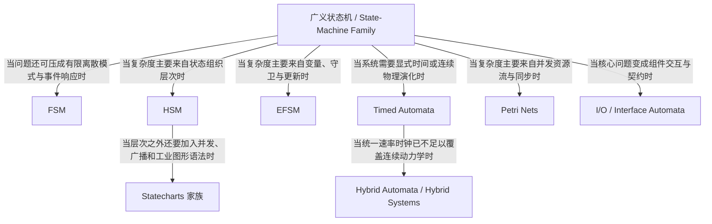

从这张图可以看到，本文所谓“八条主干”并不是并排摆放的八个名词，而是八条围绕不同复杂度来源长出的路线。`FSM` 负责给出最小离散基线；`HSM` 和 `Statecharts` 主要处理结构复杂度；`EFSM` 主要处理数据复杂度；`Timed Automata` 与 `Hybrid` 处理时间和连续复杂度；`Petri Nets` 处理并发资源复杂度；`I/O / Interface Automata` 处理组合与契约复杂度。[4][6][7][8][9][11][15][16][17][18]

换句话说，顶层概念“状态机”真正分叉的依据不是语法风格，而是系统复杂度到底来自哪里。后文每个主干的结构图都会沿用这一原则：先给出该主干的根节点，再展示它在内部如何继续分化，以及每条边为什么成立。

## 5. 第一主线：`FSM` 及其直接分支

### 5.1 为什么 `FSM` 是所有讨论的基线

经典有限状态机可写成：

$$
M = (Q, \Sigma, \delta, q_0, F)
$$

这里 `Q` 是有限状态集，`\Sigma` 是输入字母表，`\delta` 是迁移函数或迁移关系，`q_0` 是初始状态，`F` 是接受状态集合。[3]

`FSM` 的价值并不只是“简单”，而是它为后续所有扩展提供了语义零点：

1. 若一个模型连 `FSM` 都表达不了，它通常已经不属于状态机主线。
2. 若一个模型比 `FSM` 强，必须说明它新增的是结构、数据、时间、并发还是连续动力学。
3. `FSM` 的判定问题、最小化和语言理论最成熟，因此它仍然是很多验证与生成任务的基线对象。

### 5.2 `FSM` 的直接分支：`Moore` 与 `Mealy`

`FSM` 最经典的两个输出型分支是：

1. `Moore Machine`

$$
M_{Moore} = (Q, \Sigma, \Gamma, \delta, \lambda, q_0), \qquad \lambda : Q \to \Gamma
$$

输出只依赖当前状态。[2]

2. `Mealy Machine`

$$
M_{Mealy} = (Q, \Sigma, \Gamma, \delta, \lambda, q_0), \qquad \lambda : Q \times \Sigma \to \Gamma
$$

输出依赖当前状态与当前输入。[1]

这两个分支非常重要，因为它们奠定了一个长期存在的建模差异：动作究竟挂在“状态”上，还是挂在“迁移边”上。后来的 `Statecharts`、`UML`、`SCXML`、控制 DSL 其实一直在重新回答这个问题。

### 5.3 `FSM` 的根本优势

`FSM` 的优势非常明确：

1. 语义最小，几乎没有歧义空间。
2. 适合表达模式切换、简单协议端点、有限响应逻辑。
3. 适合作为自动学习、状态最小化、等价判定和结构化生成的基线。

### 5.4 `FSM` 的根本限制

但 `FSM` 的缺点也同样基础：

1. 它不能自然表达复杂数据依赖。
2. 它不能自然表达层次结构。
3. 它几乎不处理并发资源关系。
4. 它不具备显式时间和连续动力学。
5. 一旦需求同时含有“模式 + 数据 + 时间”，平铺状态数会迅速爆炸。

因此，现代控制系统里纯 `FSM` 往往只作为：

1. 理论基线；
2. 低复杂度局部子模块；
3. 更强模型的可视化投影。

### 5.5 `FSM` 这条分支后来主要走向哪里

`FSM` 之后主要走出三条路：

1. 向**结构复杂度**扩展，得到 `HSM` 与 `Statecharts`。
2. 向**数据复杂度**扩展，得到 `EFSM`。
3. 向**时间复杂度**扩展，得到 `Timed Automata`。

所以 `FSM` 更像“根”，而不是复杂控制系统的终点。

### 5.6 `FSM` 内部结构图

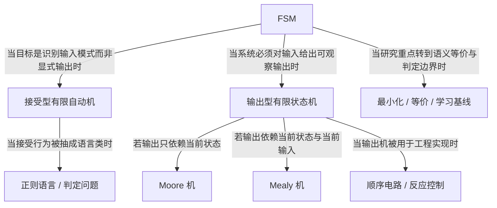

这张图说明，`FSM` 内部最重要的第一次分化并不是“有没有层次”，而是“它到底是一个识别器，还是一个转导器”。接受型自动机最终走向正则语言、判定问题和最小化理论，[3] 输出型自动机则走向 `Moore` 与 `Mealy` 两个经典分支，并深度进入顺序电路和反应控制。[1][2]

进一步看，`Moore` 与 `Mealy` 的区别之所以影响后续状态机设计，是因为它们分别对应“动作挂在状态”与“动作挂在转移”的两种传统。后来的很多 DSL、图形语言和运行时框架，本质上都在重新选择这两种传统中哪一种更适合自己的执行语义。

## 6. 第二主线：`HSM` 及其层次化分支

### 6.1 `HSM` 解决的是“状态爆炸的结构面”

`FSM` 最大的问题之一不是完全不能表达复杂系统，而是表达代价太高。只要不同子模式共享相同上层行为，平铺 `FSM` 就会重复很多相似状态。`HSM` 的核心思想就是：**状态自己还能展开成状态机**。[6]

这类模型的关键收益不是新增数据或时间语义，而是通过层次把重复控制骨架向上提升，从而显著压缩表示规模。

### 6.2 `HSM` 的核心语义

`HSM` 的核心不是简单“画嵌套框”，而是：

1. 复合状态与叶状态的区分；
2. 进入子状态机和退出子状态机的规则；
3. 必要时把层次机 flatten 成普通 `FSM` 的语义关系。

因此，`HSM` 的重点不是新增一条守卫或一条时钟，而是改变“状态空间的组织方式”。

### 6.3 `HSM` 的主要分支走向

`HSM` 后续至少分成三条值得注意的走向：

1. **理论化顺序层次机**：围绕可压缩性、flattening 和验证复杂度的理论工作，这条线由 Yannakakis 的整理最清楚。[6]
2. **并发层次机**：当层次和并发同时存在时，会走向 `CHM/CHSM` 以及更宽的 `Statecharts` 家族。[6]
3. **工程化 HFSM**：在机器人与自主系统中，大量任务控制器使用 `HFSM`，因为任务天然按“任务 -> 子任务 -> 动作阶段”组织。[22][24]

### 6.4 `HSM` 的现实优势

`HSM` 特别适合下面这些系统：

1. 任务分阶段明显；
2. 子模式间共享大量父层行为；
3. 系统复杂度主要来自“结构组织”，而不是复杂数据或时钟约束。

在这些场景里，`HSM` 往往比平铺 `FSM` 更可读，也更贴近工程直觉。

### 6.5 `HSM` 的现实局限

`HSM` 也有明显边界：

1. 它解决的是结构爆炸，不直接解决数据语义。
2. 它不自动解决实时时间问题。
3. 一旦并发、历史、广播等语义继续叠加，就会走向更复杂的 `Statecharts/UML` 语义空间。

所以 `HSM` 常常是从 `FSM` 走向复杂工业状态机的第一个台阶，而不是最后台阶。

### 6.6 `HSM` 内部结构图

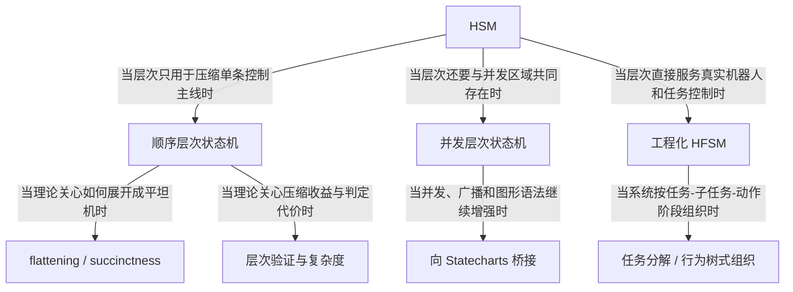

`HSM` 内部最关键的分化是：层次到底只是一个压缩结构，还是已经开始和并发、图形语义一起工作。前者走向理论化 `HSM`，重点讨论 flattening、succinctness 和 model checking 复杂度；后者则自然桥接到 `Statecharts` 与更宽的工业状态图家族。[6]

工程化 `HFSM` 则代表另一条非常现实的路线：它往往不追求广义语义最强，而是利用层次表达任务树、子任务、模式阶段和局部恢复流程。这类系统在机器人、自主任务控制和具身行为组织里非常常见。[22][24]

## 7. 第三主线：`Statecharts` 家族及其工业化分化

### 7.1 为什么 `Statecharts` 是状态机谱系里的分水岭

Harel 在 `Statecharts` 中提出的真正增量不是“层次状态图好看一些”，而是把三个维度同时推上去了：层次、并发、通信。[4] 这使 `Statecharts` 成为复杂反应式系统的图形化母语言，也让后续大量工业建模标准都在它的血缘之下展开。

### 7.2 `Statecharts` 家族的五条关键走向

`Statecharts` 并没有沿着一条线演化，而是迅速分化成五个重要方向：

1. **语义收束方向**：`STATEMATE` 语义试图把早期 `Statecharts` 的执行细节钉死。[5]
2. **工业标准方向**：`UML State Machine` 把状态机接入通用建模元模型，但也带来了更大的语义面。[13][14]
3. **标准化文本载体方向**：`SCXML` 把层次状态机做成标准化 XML 执行与交换格式。[12]
4. **同步反应式方向**：`SyncCharts` 吸收同步语言传统，把 preemption 和同步 instant 语义做得更硬。[10]
5. **工业工具特化方向**：`Stateflow` 等工具家族围绕控制/嵌入式场景做了专门语义和执行器。[21]

### 7.3 为什么这个家族强而复杂

`Statecharts` 家族的优势非常明显：

1. 它能够组织大规模复杂行为图。
2. 它比 `FSM/HSM` 更贴近工程师的复杂控制直觉。
3. 它在工业工具链里接受度极高。

但它的困难也恰恰来自这种强表达力：

1. 优先级规则是否固定；
2. 事件是广播还是队列；
3. `run-to-completion` 如何解释；
4. `history`、`fork/join`、`deferred events` 是否支持；
5. 反例和验证结果如何回写回图形模型。

这些问题导致 `UML State Machine` 的形式化长期要么依赖翻译到别的形式语言，要么单独建立直接操作语义。[14]

### 7.4 `UML` 与 `SCXML` 的差异不能混同

二者都继承自状态图家族，但定位不同：

1. `UML State Machine` 更偏元模型、建模标准和工程沟通载体。[13][14]
2. `SCXML` 更偏执行器、交换格式和处理算法。[12]

换句话说，`UML` 更接近“标准的图”，`SCXML` 更接近“标准的文本执行载体”。这个差异对 `project_1` 很重要，因为一个适合作为“人类前端”，不等于也适合作为“自动执行和验证中间表示”。

### 7.5 `SyncCharts` 为什么值得单列强调

如果说 `Statecharts` 的一个长期难题是复杂语义容易松散，那么 `SyncCharts` 的贡献就是：把同步 instant、强/弱中止、挂起与本地信号做成强语义原语。[10] 它更适合强反应式控制，不太像通用对象行为建模。

因此，`Statecharts` 家族内部其实已经出现了一个重要分叉：

1. 一条线更偏**工业通用建模与标准**；
2. 另一条线更偏**同步反应式控制语言**。

### 7.6 这一家族后续主要走向哪里

这条主线的后续走向主要不是“继续变得更大”，而是两种收缩：

1. 向**标准化可执行载体**收缩，代表是 `SCXML`。[12]
2. 向**语义明确的 profile** 收缩，代表是 `UML` 的各种验证子集、`Stateflow` 操作语义和同步图语言。[14][21]

这说明一个重要事实：越强的图形状态机，越需要 profile 化，才能真正接入自动验证和自动生成。

### 7.7 `Statecharts` 家族内部结构图

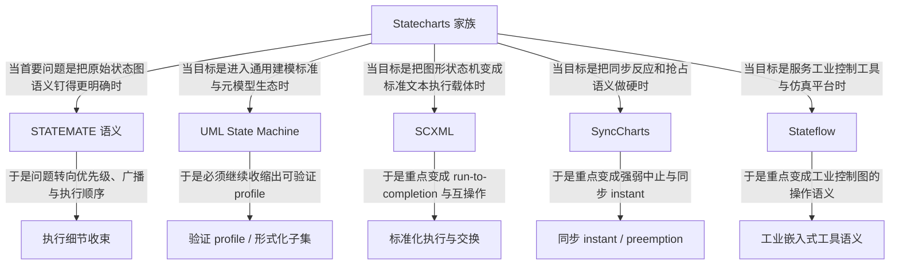

这张图说明，`Statecharts` 家族的真正分化不是“换了几种图标”，而是沿着不同工程目标做语义收束。`STATEMATE` 想解决原始状态图的执行细节，[5] `UML` 想把状态机纳入通用软件建模标准，[13][14] `SCXML` 想把它做成可执行文本载体，[12] `SyncCharts` 想把同步与抢占做成一等公民，[10] `Stateflow` 则直接面向工业控制图运行时。[21]

因此，这个家族的核心经验是：表达力一旦变强，后续必然要选择一个具体“收缩方向”。不同收缩方向决定了它更像标准、像执行器、像同步语言前端，还是像工业控制建模工具。

## 8. 第四主线：`EFSM`（常被误写为 `ESFM`）及其数据语义扩展

### 8.1 `EFSM` 为什么是工程上最重要的扩展之一

很多真实控制逻辑并不缺状态，而是缺“状态之外的数据条件”。例如：

1. 只有当温度大于阈值且故障标志为假时，某条迁移才允许发生。
2. 进入某个模式后还要修改内部计数器。
3. 一个事件的含义要依赖多个离散变量共同决定。

纯 `FSM` 很难自然表达这些内容，于是 `EFSM` 引入变量、守卫和动作更新。[7]

一个典型 `EFSM` 可以保守写成：

$$
M = (S, s_0, E, V, T)
$$

其中每条迁移可写成：

$$
t = (s, e, g, u, s')
$$

这里 `g` 是 guard，`u` 是 update。

### 8.2 `EFSM` 的真正意义

`EFSM` 的关键不只是“加了几个变量”，而是它把控制语义从“纯离散模式切换”推进到“控制状态 + 有限数据状态”的联合对象。因此它特别适合：

1. 通信协议；
2. 交互式软件流程；
3. 带有限数据寄存器的控制器；
4. 需求到可执行模型的结构化转换。

在工程上，很多所谓“状态机控制器”其实更接近 `EFSM`，而不是纯 `FSM`。

### 8.3 `EFSM` 的难点

`EFSM` 的代价也很直接：

1. 可达性和状态空间分析变难，因为离散状态和变量取值组合起来会急剧膨胀。
2. 守卫和更新若写得太自由，状态机会逐渐退化成“程序的一层图皮”。
3. 若没有明确的变量域、动作约束和副作用边界，模型的形式化价值会迅速下降。

这也解释了为什么工程上很多“状态机工具”虽然看起来支持 `EFSM`，但真正可验证的往往只是它们的受限子集。

### 8.4 `EFSM` 后续主要分成哪些方向

`EFSM` 之后主要向三类方向展开：

1. **协议与测试方向**：利用 guard/update 做 conformance testing、symbolic testing 与协议分析。[7]
2. **数据感知状态机方向**：向更复杂数据域、符号执行和 SMT 支持延伸。
3. **控制 DSL 方向**：保留状态与守卫主体，同时约束数据更新和外部动作边界，使模型既可执行又可继续验证。

对 `project_1` 来说，`EFSM` 这条线特别关键，因为只要目标系统不是纯玩具级 `FSM`，大概率都需要一个受约束的数据层。

### 8.5 为什么 `EFSM` 往往是控制 DSL 的最近邻

对于控制系统建模，最常见的真实需求不是“无限并发”，而是：

1. 有限工作模式；
2. 明确触发事件；
3. 一组有限内部变量；
4. 守卫条件；
5. 模式切换时的有限更新。

这正是 `EFSM` 的天然地盘。因此，很多面向控制逻辑的专用 DSL，在语义上都更接近“带层次和时序约束的 `EFSM profile`”，而不是纯 `FSM` 或完整 `UML`。

### 8.6 `EFSM` 内部结构图

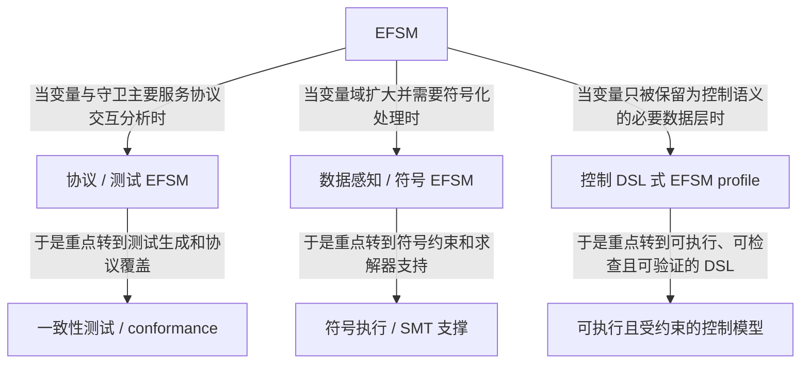

`EFSM` 内部真正重要的不是“变量越来越多”，而是变量到底被拿来做什么。协议和测试方向把 guard/update 当成交互规范的一部分；数据感知方向把它们进一步推进到符号执行和 SMT；控制 DSL 方向则反而倾向于约束变量层，避免它吞没状态机主体。[7]

这也是为什么许多面向控制系统的状态机 profile 虽然从血缘上最接近 `EFSM`，但通常不会让变量和更新无限开放。它们真正追求的是“状态机主体仍然清晰，数据层只作为必要支撑”，否则就会退化成一般程序图。

## 9. 第五主线：`Timed Automata` 及其实时验证谱系

### 9.1 `Timed Automata` 为什么是“时间进入状态机”的关键节点

很多系统不是不知道会发生什么，而是不知道“必须在多久之内发生”。`Timed Automata` 通过显式时钟把时间变成模型主体。[11]

一个标准 `TA` 可写成：

$$
A = (L, \ell_0, C, \Sigma, E, \mathrm{Inv})
$$

其中：

1. `L` 是位置集合；
2. `C` 是时钟集合；
3. `E` 是带 clock guard 和 reset 的边；
4. `\mathrm{Inv}` 是位置不变式。

### 9.2 这条线为什么学术地位极高

`Timed Automata` 的真正突破是：它既把时间显式化，又保住了重要的可分析性。区域抽象和后续 zone 技术让许多实时可达性问题有了成熟算法基础。[11]

因此，它在状态机谱系里的地位非常独特：

1. 比 `FSM/EFSM` 强，因为它有显式时间。
2. 比一般混成系统弱，因为它通常只处理“时钟以固定速率流逝”的连续部分。
3. 也正因为“强得刚好”，它成为实时模型检查最成功的主线之一。

### 9.3 `Timed Automata` 的主要分支走向

`TA` 后续又分出多条重要支线：

1. **网络化 TA**：多个自动机同步构成系统，是实际工具最常见的使用方式。
2. **`Timed I/O Automata`**：把接口/输入输出角色和时间语义结合起来。
3. **参数化与控制综合方向**：把时间参数和控制策略一并分析。
4. **工具生态方向**：围绕 `UPPAAL` 等工具形成可执行建模、仿真、模型检查与测试链路。

### 9.4 `TA` 的现实优势

当系统问题主要是下面这些时，`TA` 几乎是第一候选：

1. timeout；
2. minimum/maximum delay；
3. periodic release；
4. deadline violation；
5. 调度和同步中的时间窗口约束。

### 9.5 `TA` 的现实边界

但 `TA` 也有明确边界：

1. 它擅长 clocks，不擅长高自由度连续动力学。
2. 它不天然欢迎复杂开放式宿主代码。
3. 它若和大规模数据变量深度耦合，分析代价会迅速升高。

所以 `TA` 的工程使用往往意味着：要对数据层和动作层做抽象，保留时钟语义主导地位。

### 9.6 从 `EFSM` 到 `TA` 的关系

很多控制 DSL 的真实落点并不是纯 `TA`，而是“`EFSM` 式控制骨架 + 有限时钟约束”。这也是实时控制建模里最常见的折中：数据层不过度自由，时间层保持显式可分析。

### 9.7 `Timed Automata` 内部结构图

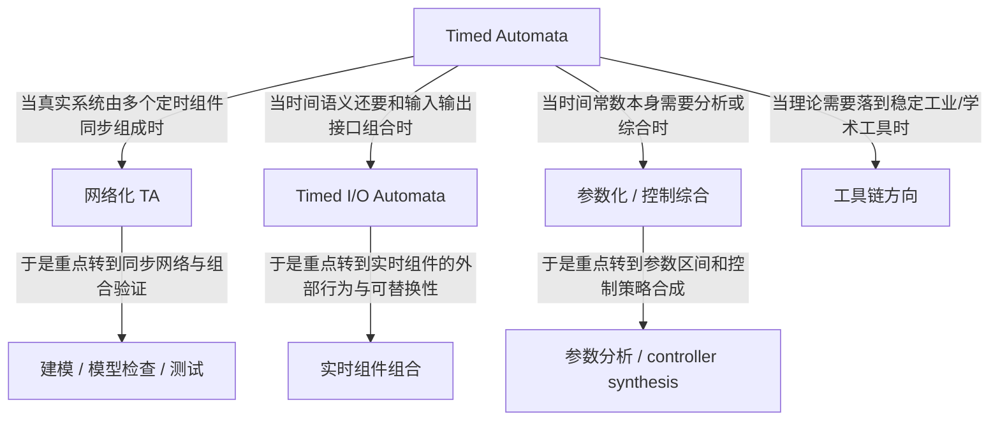

`TA` 内部的关键分化，在于它是否仍被看作“单自动机的时钟模型”。一旦系统由多个实时组件协同组成，网络化 `TA` 就成为主流；一旦问题同时涉及时间和组件接口，`TIOA` 便成为桥梁；一旦时间常数本身不确定，参数化分析和控制综合就会出现。[11][25]

这一主线非常能体现“强理论如何变成强工具”。`TA` 之所以在所有时间状态机中最成功，不是因为它理论上最通用，而是因为它在表达力和可分析性之间找到了一种很稳的平衡。

## 10. 第六主线：`Petri Nets` 及其并发资源语义

### 10.1 为什么 `Petri Nets` 必须被放进主干讨论

若系统的主要复杂度来自“多个局部活动并发推进、同步等待和资源争用”，把所有并发组合硬压成单一控制状态，往往既不自然也不经济。`Petri Nets` 用 place、transition 和 token 流自然表达这种结构。[15]

一个基础 `Petri Net` 可写成：

$$
N = (P, T, F, M_0)
$$

其中 `P` 是 places，`T` 是 transitions，`F` 是流关系，`M_0` 是初始 marking。[15]

### 10.2 `Petri Nets` 和传统状态机的根本差异

传统状态机的核心语义单位通常是“当前控制状态”；`Petri Nets` 的核心语义单位是“当前 marking”。这意味着：

1. 并发不再是额外附加的语义，而是 token 分布的自然结果。
2. 同步和资源竞争通过 token 消耗/产生直接体现。
3. 它不是不关心状态，而是把状态换成了更分布式的表示。

### 10.3 这条线的主要分支走向

`Petri Nets` 后续分化非常丰富，但对控制系统最重要的几条是：

1. `Timed Petri Nets`：把时间放进并发资源系统。
2. `Colored Petri Nets`：用 token 颜色携带数据。
3. `Stochastic Petri Nets`：用于性能与概率分析。
4. `Workflow Nets`：面向业务流程和工作流。

### 10.4 它适合什么，不适合什么

`Petri Nets` 非常适合：

1. 并发任务协调；
2. 制造、调度与资源共享；
3. 多机器人协同；
4. 工作流和同步协议。

但它不总是适合：

1. 高层模式切换主导的问题；
2. 需要清晰层次任务树和局部生命周期的单控制器问题；
3. 强调“人类直读的单主状态图”的场景。

因此，在控制系统建模里，`Petri Nets` 更像并发与资源语义的主线，而不是所有控制器都必须采用的默认表示。

### 10.5 `Petri Nets` 内部结构图

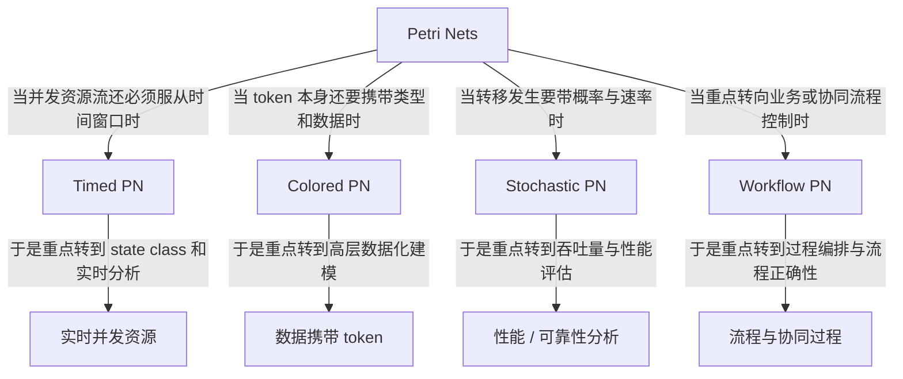

`Petri Nets` 内部最典型的扩展方式，是把原本只负责并发资源流的 token 语义，进一步与时间、数据、概率和流程结构结合起来。`Timed PN` 说明这条线可以吸收实时语义，[27] `Colored PN` 说明 token 可以承载类型与数据，`Workflow PN` 则说明 Petri 思想不仅能做底层并发，也能做高层过程控制。

因此，这条主线最值得保留的认识是：它并不是“另一种画法的状态图”，而是一种把并发、资源与因果关系放到第一位的建模哲学。只要问题本体是这些内容，它就往往比单主状态图更自然。

## 11. 第七主线：`I/O Automata` 与 `Interface Automata` 的组合主线

### 11.1 为什么组件交互需要另一套状态机语义

当系统由多个组件组成时，问题不再只是“单体如何切换状态”，而是：

1. 哪些动作是环境输入；
2. 哪些动作是组件输出；
3. 环境是否允许某动作发生；
4. 两个组件能否无冲突组合；
5. 新组件是否可替换旧组件。

`I/O Automata` 用输入不可阻塞和 trace semantics 给出组合基线，[8] `Interface Automata` 则进一步把“接口假设/保证”和非法组合状态拉成核心对象。[9]

### 11.2 `I/O Automata` 的核心贡献

一个典型 `IOA` 可写成：

$$
A = (Q, Q_0, \Sigma^{in}, \Sigma^{out}, \Sigma^{int}, \rightarrow)
$$

它最关键的要求是 input-enabled：

$$
\forall q \in Q,\ \forall a \in \Sigma^{in},\ \exists q' \in Q,\ q \xrightarrow{a} q'
$$

也就是说，环境输入不应被组件拒绝。[8]

### 11.3 `Interface Automata` 的关键增量

`Interface Automata` 把重点从“输入不可阻塞”推进到“接口兼容性与替换性”。[9] 它最关心的是：如果一方准备输出，另一方是否准备接收；组合后是否会落入 illegal states；某个实现是否满足 alternating simulation 的替换关系。

### 11.4 这一主线的后续走向

这条线之后主要走向：

1. **接口兼容与替换**：`Interface Automata`。[9]
2. **环境假设下的替换**：`Pervasive Interface Automata` 等扩展。[9]
3. **契约和服务组合**：更接近 contract / agreement / service composition 的方向。

### 11.5 这条线对状态机谱系的独特价值

它提醒我们：状态机并不总是在描述“系统内部控制逻辑”，也可以是在描述“系统对外的行为边界和协作契约”。对多组件控制系统、服务编排和接口验证而言，这一点尤其关键。

### 11.6 `I/O / Interface` 主线内部结构图

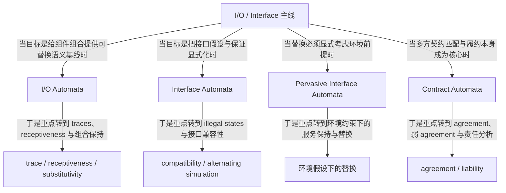

这张图说明，`I/O / Interface` 主线并不是一条普通的“加接口标签”路线，而是一条把组合、替换和契约不断做细的路线。`IOA` 给出最基础的组合语义，[8] `Interface Automata` 把非法组合状态与兼容性拉成中心，[9] `PIA` 把环境假设纳入替换判定，而 `Contract Automata` 则把多方请求/提供匹配与责任分析单独发展出来。[26]

因此，这条主线最适合回答的问题不是“单个控制器内部怎么跑”，而是“多个组件之间能不能说得拢、换得动、履得了约”。

## 12. 第八主线：`Hybrid Automata / Hybrid Systems`

### 12.1 为什么状态机最终会走到混成系统

只要系统同时包含：

1. 离散模式切换；
2. 连续变量演化；
3. 模式切换会改变连续演化规律；

那么纯离散状态机就不再足够。`From Timed to Hybrid Systems` 把 timed transition semantics 推向 phase-based hybrid semantics，[16] 随后的 `Hybrid Automata` 和其理论化工作把这条主线固定下来。[17][18]

### 12.2 混成模型的基本骨架

一个保守的 `Hybrid Automaton` 可以写成：

$$
H = (L, X, \Sigma, \mathrm{Inv}, \mathrm{Flow}, E, \mathrm{Init})
$$

其中：

1. `L` 是离散位置；
2. `X` 是连续变量；
3. `\mathrm{Flow}` 描述位置内连续演化；
4. `E` 描述 jump；
5. `\mathrm{Inv}` 描述位置内必须维持的条件。

### 12.3 为什么这一主线重要但昂贵

`Hybrid` 家族是离散控制与物理对象强耦合系统的自然对象，因此对：

1. 自动驾驶；
2. 航空航天控制；
3. 医疗设备；
4. 机器人运动与动力学系统

尤其重要。

但它的代价也最大：

1. 一般模型的可达性很快不可判定；
2. 工程上通常必须收缩到 `linear/rectangular/stopwatch` 等受限子类；
3. 对建模者的语义纪律要求远高于普通软件状态机。

### 12.4 这条线后续的主要分支走向

`Hybrid` 主线后续主要走向有三类：

1. **理论收缩**：寻找可判定或近似可分析的子类。[18]
2. **验证算法**：围绕 reachability、invariance 和抽象技术展开。[17][18]
3. **领域应用**：把离散监督控制和连续系统模型接到真实 CPS 上。

### 12.5 它和 `Timed Automata` 的关系

可以把 `Timed Automata` 看成一种特殊而成功的 hybrid-like 受限模型：它允许“连续量存在”，但把连续演化几乎收缩成统一速率的时钟。[11][16] 这正是它既有表达力又能成功工具化的原因。

### 12.6 `Hybrid` 主线内部结构图

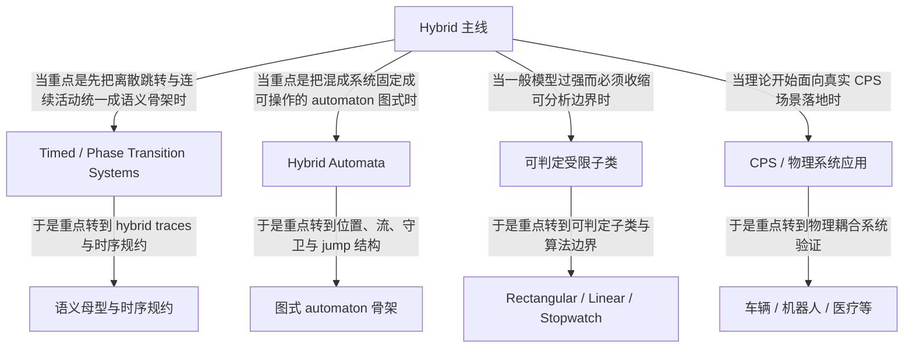

`Hybrid` 主线内部真正重要的，是它从一开始就分成了“语义母型”和“图式 automaton”两种传统。前者更强调 timed/phase transition semantics，[16] 后者更强调 locations、flows、guards 和 jumps 的自动机骨架。[17][18] 这两条线后来共同汇入了可判定子类与具体 CPS 场景应用。

这也解释了为什么 `Hybrid` 虽然学术地位很高，却不一定适合作为一般控制软件的默认目标形式主义：它往往过强，必须通过子类约束和领域假设才能真正稳定落地。

## 13. 其他重要但本文只略述的分支

### 13.1 递归与栈：`Recursive State Machines`、`Visibly Pushdown`

当系统复杂度来自调用栈和嵌套词结构时，状态机会往递归和栈语义方向扩展。`Recursive State Machines` 更贴近程序模块化调用，[19] `Visibly Pushdown Languages` 则把栈操作和输入字母类别绑定起来，从而恢复许多良性性质。[20]

这条线对程序验证极其重要，但对 `project_1` 当前面向控制系统状态机建模的主目标而言，通常不是第一候选。

### 13.2 概率、随机与定量自动机

如果系统问题强调概率转移、性能评估、成本或可靠性分布，状态机会进一步走向 probabilistic/stochastic/weighted 自动机。这条线对性能分析、随机系统和定量验证重要，但不属于本文重点。

### 13.3 树、数据与无限字母表自动机

如果输入对象不再是简单事件序列，而是树、数据词、寄存器结构或无限字母表，那么自动机理论会沿 tree/data/register/nominal 等方向大幅扩张。这些方向在理论上极其丰富，但它们离控制系统“可执行状态机 DSL”的距离通常较远。

## 14. 近年趋势：状态机正在朝什么方向演化

### 14.0 证据口径与统计范围

这一节不再只给“概括性判断”，而是显式区分三类证据来源：一类来自 `project_1/state_machine_types` 文库内部的**趋势对口切片统计**，一类来自 survey 原文已经给出的**量化结果**，另一类来自 `project_1/baselines` 子库中最近两年的**LLM 相关 baseline 切片**。这些统计是为验证本节结论而新开的对口子集，不等同于“整个状态机研究领域”的严格 bibliometric 普查，因此它们的解释边界必须写清楚。

| 证据集 | 统计口径 | 样本数/结果 | 主要服务的趋势 | 来源 |
|---|---|---:|---|---|
| `A0` | `state_machine_types` 下已完成 `desc.md` 的条目总数 | 364 篇 | 全节的本地语境 | 本仓库文库切片 |
| `A1` | `A0` 中能从 `bibtex.bib` 恢复年份，且可分成 `pre-2010` / `2010+` 的条目 | 363 篇 | 趋势 1、4 | 本次新开统计 |
| `A2` | `A0` 中年份位于 `1990s-2020s` 的条目，用于观察“载体/交换/运行时”主类的年代占比变化 | 319 篇 | 趋势 2 | 本次新开统计 |
| `A3` | `A0` 中 `2010+` 且对象类型属于 `🏗️ 标准/基础设施` 或 `🧪 应用/案例` 的条目 | 64 篇 | 趋势 3 | 本次新开统计 |
| `A4` | `A0` 中三类桥接型家族：`⏱️ 时间/时钟自动机`、`🔌 接口 / 组合 / 契约模型`、`📦 标准、交换格式、元模型与执行载体` | 154 篇 | 趋势 4、5、6 | 本次新开统计 |
| `A5` | `UML/Statecharts/SCXML/Stateflow/RoboChart/SyncCharts` 关键词子文库 | 94 篇；非模型层占比由 `23.0%` 升到 `54.5%` | 趋势 1、5 | 本次新开统计 |
| `A6` | `baselines` 中 `2024+` 条目按输出 carrier 粗分类：文本状态机 carrier vs 泛 UML/其他图建模 | 文本状态机 `11` 篇，其中 `🟢/🟡` 为 `9` 篇（`81.8%`）；泛 UML `13` 篇，其中 `🟢/🟡` 为 `2` 篇（`15.4%`） | 趋势 7 | 本次新开统计 |
| `A7` | `baselines` 中 `2024+` 的 state-machine-like 条目，按 primary textual carrier / 次级视图或恢复结果 / 其他做人工复编码 | `12` 篇中 `9` 篇以文本状态机为主要输出，`2` 篇为次级状态机视图，`1` 篇为其他 | 趋势 2、7 | 本次新开统计 |
| `B1` | UML 状态机形式化 survey 的原文量化结果 | 61 篇工作；translation 路线语法覆盖一般不超过约 `65%`；仍可获取/维护的工具很少 | 趋势 1、5 | [14] |
| `B2` | Timed automata survey 的原文量化结果 | `80` 个变体，`12` 个类别，`40` 个工具 | 趋势 5、6 | [28] |
| `C1` | `baselines/SUMMARY.md` 中 `2024+` 且评估为 `🟢/🟡` 的状态机相关条目 | 13 篇 | 趋势 7 | 本次新开统计 |

这里还有一个方法论说明：`A5-A7` 都带有人工粗分类成分，因此它们的角色是“增强因果链的对口证据”，不是替代严格的全领域计量文献分析。需要特别强调两点。第一，`A1-A7` 都是为了回答本节趋势命题而做的**定向重编码与切片**，不是把现有 `SUMMARY.md` 的任何一个总数直接硬套到结论上。第二，`B1-B2` 则提供了 survey 级别的外部量化支撑，用来避免完全只靠本仓库内部文库自证。两类证据结合后，本节的结论会更稳。

### 14.1 趋势一：从“大而全语义”转向“可执行 profile”

这一趋势的核心不是“状态机理论不再追求表达力”，而是**一旦进入执行、验证和工具互操作链路，过宽的语义迟早会被收缩成可执行 profile**。`Statecharts` 家族在理论上很强，但 `UML State Machine` 真正进入自动验证时，研究者必须立即回答事件队列、`run-to-completion`、`history`、`fork/join`、`deferred events` 等一系列精确语义问题。[4][5][13][14]

对这一点，本地文库切片与 survey 原文给出了方向一致、而且更细化的证据。先看全文库对象类型迁移：在 `A1` 中，`pre-2010` 的 199 篇条目里，`🧱 模型本体` 有 149 篇，占 `74.9%`；到了 `2010+`，164 篇条目中模型本体只剩 67 篇，占比降到 `40.9%`。相反，`🛠️ 方法路线 + 🏗️ 标准/基础设施 + 🧪 应用/案例` 这类“非模型层成果”从 `25.1%` 升到 `59.1%`。这说明近十余年里，研究重心明显在从“继续扩写母理论”转向“把已有理论收束成可运行、可验证、可部署的 profile 与 toolchain 对象”。

如果只看与趋势最相关的 `Statecharts/UML/SCXML/Stateflow/RoboChart/SyncCharts` 子文库，这个判断更清楚：`A5` 中 `pre-2010` 的 61 篇条目里，非模型层成果只有 14 篇，占 `23.0%`；到了 `2010+`，33 篇条目中非模型层成果升到 18 篇，占 `54.5%`。也就是说，即便只盯“语义最容易做大”的这条家族线，也能看到同样的 profile 化收缩。

表 14-1 给出这两组切片。

| 统计口径 | `pre-2010` 总数 | `pre-2010` 非模型层占比 | `2010+` 总数 | `2010+` 非模型层占比 |
|---|---:|---:|---:|---:|
| 全文库对象类型迁移 (`A1`) | 199 | `25.1%` | 164 | `59.1%` |
| `Statecharts/UML` 关键词子文库 (`A5`) | 61 | `23.0%` | 33 | `54.5%` |

图 14-1 把全文库层面的变化压成一个最直观的信号：后 2010 时代，非模型层成果已经超过模型本体。

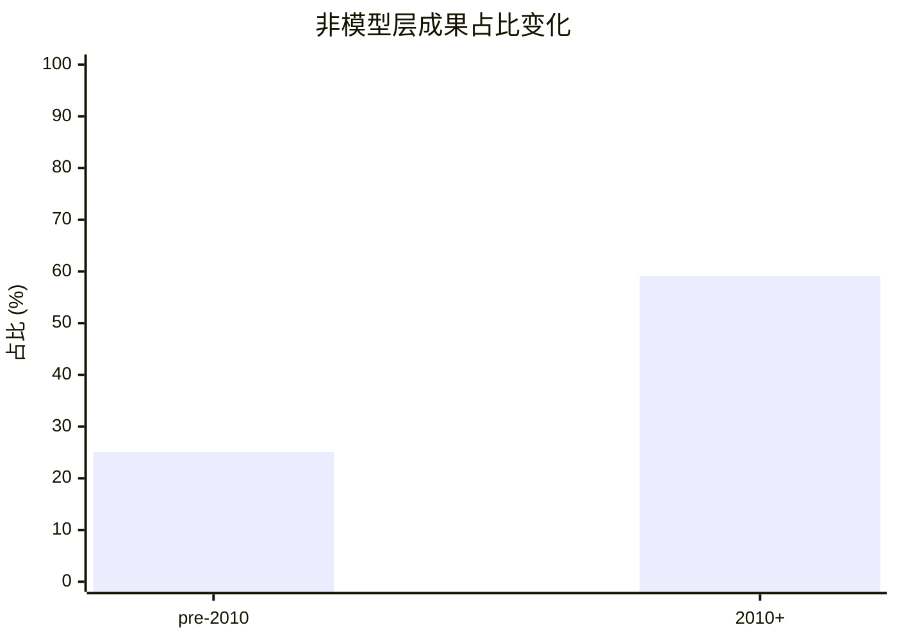

更关键的是，外部 survey 也支持这一方向。Andre 等人的 UML survey 系统整理了 `61` 篇工作后指出：translation 路线的语法覆盖通常达不到完整 UML 语义，没有工作超过大约 `65%` 的语法覆盖，而且真正今天仍可获取、可运行、可维护的工具只剩少数。[14] 这背后的含义非常直接：如果一个状态机家族长期停留在“大而全语义”的宽泛描述上，那么它最终几乎一定会在验证和互操作处被迫切成更窄的 profile。

因此，这一趋势真正反映的是研究评价标准的变化。过去问题常是“还能表达什么”；现在更常见的问题是“在哪个受限子集上，表达、执行、验证和反馈能同时成立”。对 `project_1` 来说，这意味着目标状态机的第一性问题不再是“语法最全的是谁”，而是“谁已经具备稳定可执行 profile”。

逻辑闭环检查：这里不是由“近年工具论文变多”直接推出“profile 更重要”，而是由两段证据链共同支撑。第一段是 `A1/A5` 显示对象类型重心确实从模型本体转向方法、标准和应用；第二段是 [14] 直接说明宽语义在覆盖率和工具寿命上会失稳。两段拼起来，才说明 profile 化不是口味变化，而是落地压力驱动的收缩。

### 14.2 趋势二：文本载体、交换格式与 schema-first 建模越来越重要

第二个趋势不是说图形状态机不重要，而是说**一旦状态机承担自动处理对象的角色，carrier 层本身会迅速上升为一等设计问题**。`SCXML` 的典型意义就在这里：它不是重新定义状态机本体，而是把层次、并发区、历史、数据模型、迁移和执行算法一起钉进标准化文本载体里。[12]

这一变化在本地文库切片里非常明显。按 `A2` 的年代分桶，只看主类为 `📦 标准、交换格式、元模型与执行载体` 的条目，其在各年代条目总数中的占比从 `1990s` 的 `12.5%` 和 `2000s` 的 `13.0%`，上升到 `2010s` 的 `20.5%`，并在 `2020s` 进一步跃升到 `59.5%`。如果把时间切成 `pre-2010` 和 `2010+` 两段，同一家族条目数又从 20 篇增长到 50 篇，是 `2.5x` 的绝对增长。这说明近年的高增长区，已经不只是“又提出一种状态机”，而是“怎么把状态机固定到稳定文本载体、交换格式和执行骨架里”。

表 14-2 列出具体数字。

| 年代 | 该年代条目总数 | `📦` 主类条目数 | 占比 |
|---|---:|---:|---:|
| `1990s` | 40 | 5 | `12.5%` |
| `2000s` | 115 | 15 | `13.0%` |
| `2010s` | 122 | 25 | `20.5%` |
| `2020s` | 42 | 25 | `59.5%` |

图 14-2 显示的是同一组占比信号。

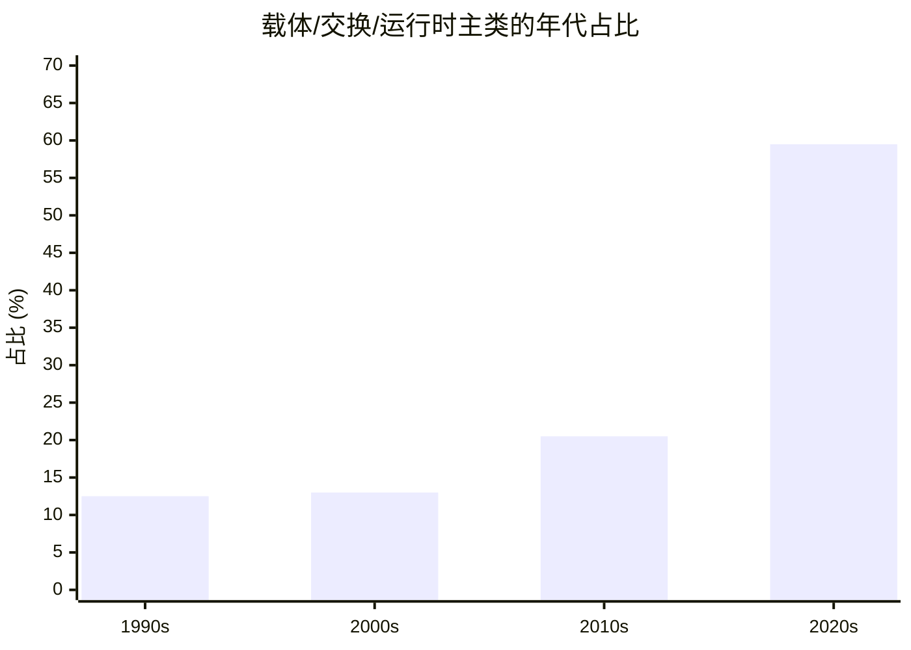

这一点在最近的 LLM 文献切片里也有交叉支撑。按 `A7` 的人工复编码，在 `2024+` 的 12 篇 state-machine-like baseline 中，有 9 篇以文本状态机 carrier 作为主要输出，2 篇把状态机作为次级视图或恢复结果，只有 1 篇落在其他类型。也就是说，当状态机被当成“机器要直接写出来的对象”时，文本优先不是少数做法，而已经接近默认选项。

从工程意义上看，这个趋势至少意味着四件事。第一，状态机开始越来越依赖 schema 固定槽位，而不是只靠图形约定。第二，parser、linter、静态检查和版本差异比较正在变成状态机生态的基本设施。第三，代码生成、模型检查和运行时执行越来越依赖统一 carrier，而不是只依赖图编辑器。第四，LLM 这类生成器在面对“有强结构槽位的文本载体”时，更容易得到可检查、可修复的输出。

因此，`SCXML` 在这条趋势中并不是孤立个例，而是更大转向的代表节点：状态机研究正在越来越重视“语义由什么承载”这个问题，而不仅仅是“语义本身是什么”。[12]

逻辑闭环检查：这里也不是用“`📦` 家族占比提高”直接推出“文本载体更重要”。真正的逻辑是：`A2` 说明 carrier 家族整体扩张，`A7` 说明在最需要机器直接产物的 LLM 语境里，主流输出又确实收敛到文本优先 carrier；两者合在一起，才支撑“schema-first / text-first”已经成为现实工程默认选择。

### 14.3 趋势三：领域专用状态机 profile 正在替代“统一通用大语言”

第三个趋势是：**真正进入工程应用以后，状态机越来越按领域复杂度结构被切成 profile，而不是由一个通用超类横扫一切**。机器人、自主车辆、工业控制、协议系统和 CPS 并不是“同一种复杂度稍作换皮”，所以它们最后也不会稳定落到同一个最大语义超集上。[22][23][24]

为了避免空泛叙述，这里专门取 `A3` 子集，也就是 `2010+` 且对象类型属于 `🏗️ 标准/基础设施` 或 `🧪 应用/案例` 的条目，因为这个子集最能反映“真正落地时人们在什么领域投资源”。结果显示，64 篇条目中有 36 篇属于 `🌡️ CPS / 物理系统建模`，17 篇属于 `🏭 工业控制与自动化`，两者合计 `53/64 = 82.8%`；协议/分布式交互系统只有 7 篇，实时嵌入式和软件行为建模各 2 篇。

更关键的是，如果用同一口径看 `pre-2010` 的基础设施/应用子集，其 top-2 领域集中度只有 `67.6%`；到了 `2010+` 升到 `82.8%`，而覆盖的领域数仍然是 5 类。这说明近年的变化不是“领域变少了”，而是**工程投入更集中地流向了 CPS 与工业控制这些复杂度结构稳定、最值得做专用 profile 的场景**。

表 14-3 给出这一分布。

| 所属领域 | 篇数 | 占比 |
|---|---:|---:|
| `🌡️ CPS / 物理系统建模` | 36 | `56.2%` |
| `🏭 工业控制与自动化` | 17 | `26.6%` |
| `🌐 协议 / 分布式 / 交互系统` | 7 | `10.9%` |
| `⏱️ 实时与嵌入式系统` | 2 | `3.1%` |
| `💻 软件建模与程序行为` | 2 | `3.1%` |

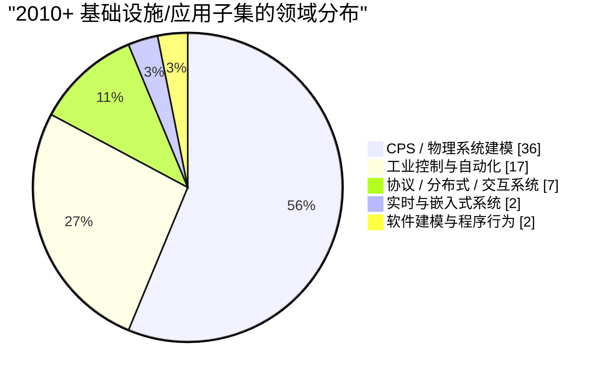

这个分布并不意味着其他领域不重要，而是说明**当状态机真正被做成基础设施和应用对象时，最活跃的需求来自 CPS 与工业控制这类“复杂度结构高度稳定”的场景**。这与机器人 `HFSM` 工具线、车辆/多智能体建模验证框架，以及面向 ROS 2 的工程状态机库形成了相互印证：它们都不是要发明一个最大统一语言，而是在各自领域里提炼“最常用、最稳定、最可执行”的那部分语义。[22][23][24]

因此，这一趋势背后的更深判断是：未来更有生命力的状态机工作，往往不是提出更全的总类，而是提出**收缩恰当、任务对齐、边界稳定的 profile**。对控制系统建模尤其如此。

逻辑闭环检查：这里的关键不是“某个领域论文多”本身，而是我们只在 `基础设施/应用` 子集里看领域分布，因为这个子集最接近真实工程投入。再加上 top-2 领域集中度从 `67.6%` 升到 `82.8%`，才足以说明近年的资源配置正在偏向领域专用 profile，而不是平均撒在一个通用大语言上。

### 14.4 趋势四：状态机正在从单独建模工件转向“生成-仿真-验证-部署”链路中的统一对象

第四个趋势的关键变化是：**状态机不再只是一张图，而越来越像整个链路里的统一中间表示**。如果一个模型既不能被解析，也不能被执行、验证、回写和部署，那么它很难成为真正的工程核心对象。[11][12][14][21][23]

这个变化首先体现在总体对象类型迁移上。表 14-1 已经显示，`2010+` 文献里“非模型层成果”占比达到 `59.1%`。这说明研究投入正在从“提出形式主义”转向“围绕形式主义建设方法、基础设施和场景闭环”。但只看总量还不够，所以还需要看 `A4` 子集，即那些天然跨在“理论-工具-执行”边界上的桥接型家族。

表 14-4 的结果非常有代表性。`⏱️ 时间/时钟自动机` 在 `pre-2010` 时非模型层占比已经有 `55.6%`，到了 `2010+` 升到 `73.9%`；`🔌 接口 / 组合 / 契约模型` 从 `44.4%` 升到 `68.8%`；`📦 标准、交换格式、元模型与执行载体` 更是从 `55.0%` 跃升到 `90.0%`。把三类家族合并看，非模型层成果占比从 `53.8%` 升到 `82.0%`。这意味着近年的研究产出越来越集中在“让模型进入链路”的那一段，而不是仅停留在母理论层。

| 家族 | `pre-2010` 总数 | `pre-2010` 非模型层占比 | `2010+` 总数 | `2010+` 非模型层占比 |
|---|---:|---:|---:|---:|
| `⏱️ 时间/时钟自动机` | 36 | `55.6%` | 23 | `73.9%` |
| `🔌 接口 / 组合 / 契约模型` | 9 | `44.4%` | 16 | `68.8%` |
| `📦 标准、交换格式、元模型与执行载体` | 20 | `55.0%` | 50 | `90.0%` |
| 合计 | 65 | `53.8%` | 89 | `82.0%` |

如果进一步只看 `📦` 家族的标题级编码，显式出现 `tool/runtime/framework/environment/implementation` 这类链路词的条目，从 `pre-2010` 的 `2/20 = 10.0%` 增长到 `2010+` 的 `12/50 = 24.0%`，绝对数量是 `6x` 增长。这说明 carrier 家族本身也在从“定义表示”继续走向“把表示接上执行与工具链”。

因此，今天评价一个状态机家族时，已经不能只问“表达力如何”或“判定性如何”。还必须继续追问：

1. 它有没有稳定 carrier。
2. 它有没有仿真或执行入口。
3. 它能否连接验证器。
4. 反例能否回写到原模型。
5. 模型是否还能继续投影到实现或测试。

`Timed Automata` 之所以长期有生命力，是因为它从一开始就有明确的验证链路；`SCXML` 之所以重要，是因为它把 carrier 与执行算法一起钉死；`UML` 形式化路线之所以始终绕不开“反例能否回写、工具今天还能否获取”，恰恰是因为状态机已经被当作链路对象来评价，而不是单纯语法对象。[11][12][14][21]

逻辑闭环检查：本段不是由“非模型层占比高”直接推出“链路化”。真正的中介是：`A4` 说明桥接型家族的产出确实转到方法/基础设施层；标题级 `tool/runtime/framework` 统计又说明这些新增条目不是一般讨论，而是显式指向执行、实现和工具。两者合起来，才构成“状态机变成统一链路对象”的证据链。

### 14.5 趋势五：验证友好性正在反过来塑造状态机本身

第五个趋势比“进入工具链”更深一层，因为它说的是：**不是模型建完后再想办法去验证，而是验证是否可做正在反过来决定状态机本体应该长成什么样**。[11][14][17][18]

这里最有说服力的不是概念，而是 survey 的量化结果。表 14-5 把两个最关键的 survey 数字放在一起。

| Survey | 量化结果 | 对趋势的含义 |
|---|---|---|
| UML 状态机形式化综述 [14] | 系统回顾 `61` 篇工作；translation 路线语法覆盖一般不超过约 `65%`；长期仍可获取/维护的工具很少 | 说明过宽语义在验证落地时会被迫收缩，否则要么覆盖不全，要么工具失活 |
| Timed automata 综述 [28] | 整理出 `80` 个变体、`12` 个类别、`40` 个工具 | 说明一旦一个家族以验证/分析为中心发展，最终会按可判定性、分析技术和工具用途分裂成稳定子类 |

这两条数字放在一起看，会得到一个很强的结论。对于 `UML State Machine` 这类“先有宽语义、后追验证”的家族，主要问题是 translation gap、语法覆盖和工具寿命；而对于 `Timed Automata` 这类“从一开始就为分析与验证组织语义”的家族，主要现象则是围绕可判定性与工具用途形成大量稳定子类。[11][14][28] 前者的压力来自“太宽难落地”，后者的成功来自“从一开始就按验证问题组织语义”。

本地切片与这个判断一致。首先，表 14-1 已显示 `Statecharts/UML` 关键词子文库的非模型层占比已从 `23.0%` 升到 `54.5%`；其次，表 14-4 又显示，在 `2010+` 时期，时间/时钟家族、接口/契约家族和 carrier 家族的非模型层占比已经分别达到 `73.9%`、`68.8%` 和 `90.0%`。这意味着近年的大量研究工作，其实不是继续把状态机做得更自由，而是在不断围绕“哪些语义边界能让分析真正成立”做限制、编码和工具化。

因此，“验证友好”不应被理解成验证后端的附属要求，而是状态机本体设计约束的一部分。对控制系统这类高可信场景尤为如此：如果动作副作用不可隔离、时间层与数据层混杂、反例回写没有对象边界，那么生成、验证和修复闭环就很难稳定成立。

逻辑闭环检查：这里不是单纯对比了两个 survey 就下结论，而是把“宽语义家族为何被迫收缩”和“验证导向家族为何会稳定分化”放在同一张图里，再用本地 `A5/A4` 切片确认这两种现象在当前文库里也同时存在。这样才足以说“验证友好性正在反过来塑造模型本身”。

### 14.6 趋势六：跨主线混合模型越来越多，但真正落地时反而更强调边界清晰

第六个趋势不是“混合模型变少了”，恰恰相反，**跨主线桥接路线越来越多**。`Timed I/O Automata` 把实时与组件交互结合起来，[25] `Contract Automata` 把接口组合进一步推进到多方契约履约分析，[26] `Time Petri Nets` 则把并发资源流与时间窗口放到同一框架里。[27]

但问题在于，桥接路线越多，越容易误判成“状态机正在走向大一统语义”。实际情况恰好相反。表 14-4 显示，三类最典型的桥接家族在 `2010+` 时期合计已有 89 篇，而其中非模型层成果占比达到 `82.0%`；如果看 `pre-2010`，这一比例只有 `53.8%`。也就是说，近年的桥接路线虽然更多，但它们并没有朝“无限扩大的通用形式”收敛，反而更集中在**边界明确的子问题、工具族和 profile** 上。

为了避免把“桥接家族条目多”误读成“只是 timed 条目多”，这里又补了一层标题级粗编码：在 `⏱️ + 🔌 + 🕸️` 三类家族中，标题里同时出现两个及以上桥接关键词（如 `timed + protocol`、`contract + service`、`workflow + time`）的条目，占比从 `pre-2010` 的 `41.8%` 升到 `2010+` 的 `53.8%`；同一子集中非模型层占比也从 `56.4%` 升到 `78.8%`。这说明增长的确发生在“跨轴交叉问题”上，而且增长后的主要落点仍是方法/工具/profile，而不是一个更大的统一母语言。

图 14-4 把这个变化压成了一个最简信号。

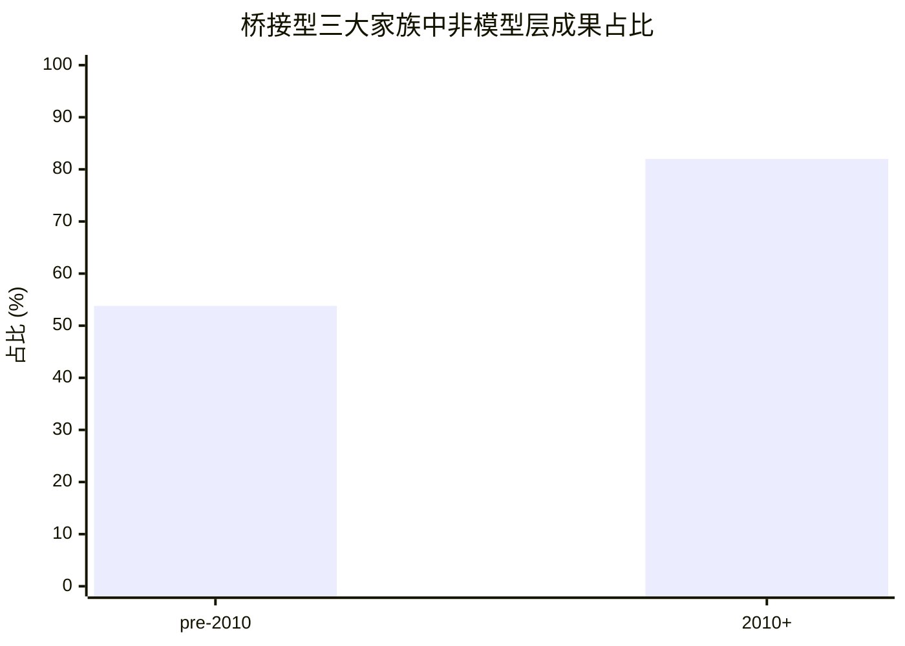

外部 survey 也支持这种“混合增多，但边界更清楚”的解释。Waez 等人的 timed automata survey 之所以会整理出 `80` 个变体、`12` 个类别和 `40` 个工具，并不是因为这些变体想合成一个更大的 timed super-language，而是因为它们分别围绕参数、代价、概率、博弈、实现等不同问题域稳定分化。[28] 同理，`TIOA`、`Contract Automata` 与 `Time Petri Nets` 的成功，也都依赖它们明确限定自己服务的是哪一种交叉复杂度，而不是试图取代所有状态机。[25][26][27]

因此，这一趋势的真正结论不是“混合越多越好”，而是：**跨轴能力是需要的，但必须通过边界清晰的 profile 来提供。** 对 `project_1` 来说，这一点非常关键。控制系统状态机很可能确实需要同时吸收层次、数据和时间，但这不意味着要把所有强语义一次性堆到同一个无边界母语言里。

逻辑闭环检查：本段用了两层统计来避免误读。标题级桥接关键词占比上升，说明“跨轴交叉问题”确实在增多；非模型层占比上升，说明这些交叉问题并没有往大一统理论收敛，而是往工具化和 profile 化落地。只有两层一起成立，才支持“混合增多但边界更清楚”。

### 14.7 趋势七：对 LLM/自动生成来说，语义边界清晰的状态机更有优势

最后一个趋势专门面向 `project_1` 的核心任务：**如果从“让 LLM 稳定生成可执行状态机”这个角度看，语义边界清晰、carrier 稳定、槽位明确的状态机形式显著更占优。** 但这一点不能只靠“最近论文喜欢用状态机”来论证，而必须同时证明两件事：第一，当前 LLM 文献确实更容易在这类 carrier 上形成可用 pipeline；第二，具体实验结果也表明这类 carrier 的语法可学、可查、可修，而真正困难集中在语义层。

先看文献分布层面的切片。把 `baselines` 中 `2024+` 的条目按输出 carrier 粗分成“文本状态机 carrier”和“泛 UML/其他图建模”两类，得到表 14-6。

| `2024+` baseline 粗分类 | 篇数 | `🟢/🟡` 篇数 | `🟢/🟡` 占比 | 带自动反馈/检查的方法条目 |
|---|---:|---:|---:|---:|
| 文本状态机 carrier | 11 | 9 | `81.8%` | 4 |
| 泛 UML / 其他图建模 | 13 | 2 | `15.4%` | 1 |

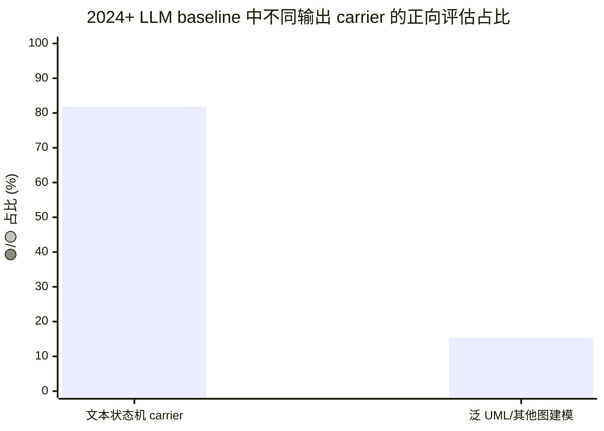

如果再只看 state-machine-like 论文本身，`A7` 显示 `2024+` 共 12 篇，其中 9 篇把文本状态机作为主要输出，2 篇只是把状态机作为次级视图或恢复结果，1 篇归入其他。换句话说，当前 LLM 状态机文献不是在“任何行为建模格式上平均开花”，而是明显收敛到 `PlantUML`、`Mermaid`、`Umple`、`SysML` 这类文本优先、语法明确的 carrier。

但分布统计本身还不够，它只能说明“大家更常选什么”，不能说明“为什么这更适合 LLM”。这里就要看具体实验。Wang 等人的 SysML 行为模型研究直接给出了最关键的一组数字：在 `PlantUML + SysML` 状态机任务上，6 个主流 LLM 的 `PlantUML` 格式准确率达到 `92%-96%`，`SysML` 语法准确率达到 `90%-94%`，但 `STM` 的语义一致性 F1 只有 `67%-72%`；当引入规则反馈后，格式错误修复率达 `94.6%`，语法错误修复率达 `88%`，而语义错误修复率只有 `43.1%`，需求不一致修复率更低到 `37.3%`；去掉 RAG 时，语法准确率平均还会下降 `12%`。[29] 这组结果的含义非常明确：**LLM 对明确语法和显式槽位的学习能力很强，所以结构化文本 carrier 上的“写对格式/写对语法/按规则修复”是可做的；真正难的是深层语义和需求理解。**

Apvrille 和 Sultan 的 `TTool-AI` 进一步说明，只要 carrier 和反馈接口足够明确，LLM 就能接入稳定闭环：其状态机生成分数为 `63/100`，高于学生的 `58/100`，生成时间 `178` 秒，对比人工 `2700` 秒快 `15.2x`，而且标准差 `15` 分显著低于学生的 `32` 分；这条结果并不是靠裸 prompting 得来的，而是靠 `JSON -> SysML` 的结构化中间表示、语法约束和最多 `10` 轮自动反馈循环实现的。[30] 这说明“适合 LLM”的真正含义不是语言越强越好，而是**carrier 能否提供结构约束、自动检查和稳定反馈接口**。

Pathak 关于 `Umple` 的研究把这一点又往前推了一步。该工作里，Zero-shot 生成**完全失败**；进入 One-shot 和 RAG 后，平均归一化 Levenshtein 距离才分别来到 `0.246` 和 `0.244`，而 RAG 的方差更低、更一致；在 RAG 设置下，多数系统的 `ICP` 与 `EUCP` 接近 `0`，说明编译级语法错误基本被压住。[32] 这再次表明：当目标 DSL 有稳定语法，且能给 LLM 足够具体的示例或检索支撑时，模型先把“可编译/可解析”这一层做好是现实可达的；若没有这种结构支撑，Zero-shot 连起步都很困难。

Crabb 等人对 `SysML v2 state machine diagrams` 的 repeated-run 研究也给出了一条重要补证：他们对每种 prompt / temperature 配置都重复运行 `100` 次，发现 prompt technique 对状态机生成质量的影响大于 temperature。[31] 这意味着一旦 carrier 已经固定为结构明确的文本工件，后续性能提升的主变量不再是随便调采样随机性，而是如何给出更好的结构 scaffold、示例和反馈。

因此，这一趋势不能简单表述成“因为 LLM 出现了，所以 LLM 友好的格式更受欢迎”。更准确的说法是：**当前 LLM 之所以把研究注意力推向某些状态机 carrier，是因为这些 carrier 恰好满足三件事：语法可枚举、结构可检查、反馈可具体化。** 在这类对象上，LLM 可以先把格式和语法层学稳，再通过规则、示例、模型检查反馈去逼近语义层；而在泛 UML 或图外观导向的输出上，这种闭环就更难形成。

逻辑闭环检查：这一段的证据链分三层。`A6/A7` 只是说明当前文献注意力确实偏向文本状态机 carrier；[29][30][32] 则说明这种偏向背后有明确机制，即结构化语法更容易被学会、被自动检查、被反馈修复；[31] 进一步说明在 carrier 固定后，性能主变量会转向 prompt scaffold 和反馈设计。三层都成立时，才能说“语义边界清晰的状态机对 LLM 更有优势”。

## 15. 对 Project 1 的启示：应当如何理解“目标状态机选型”

### 15.1 不太可能的两个极端

对 `project_1` 而言，两个极端通常都不理想：

1. **太弱**：纯 `FSM` 往往不足以承载真实控制需求中的变量、守卫和时间。
2. **太宽**：完整 `UML State Machine` 或一般 `Hybrid Automata` 又常常过宽、过重，不利于自动生成与稳定验证。

### 15.2 更现实的落点

更现实的目标通常落在下列交集附近：

1. 结构上接近 `HSM` 或受限 `Statecharts`；
2. 数据上接近受约束的 `EFSM`；
3. 时间上按需吸收 `Timed Automata` 的局部能力；
4. 工程承载上优先选择可执行、可交换的文本载体或强语义 DSL。

### 15.3 一个关键方法论判断

从本文综述可得到一个很重要的方法论判断：

> `project_1` 真正需要的不是“学术上最强的状态机总类”，而是“足够表达控制系统核心语义、又足够窄以支撑自动生成、仿真、验证和修复闭环的状态机 profile”。

这也意味着，后续若要继续讨论 `project_1` 的目标形式主义，应优先围绕下面几个问题：

1. 是否支持层次；
2. 是否支持受约束的变量和守卫；
3. 是否支持必要的时间语义；
4. 外部行为和模型主体是否清晰分层；
5. 是否天然有可执行和可验证入口。

## 16. 结论

状态机谱系的真正结构，不是“`FSM` 之后不断变大”的一条直线，而是围绕复杂度来源展开的多轴扩展网。`FSM` 给出最小离散基线；`HSM` 解决结构爆炸；`Statecharts` 家族把复杂反应式行为工程化，但也因此背上语义 profile 负担；`EFSM` 让数据进入控制主体；`Timed Automata` 让显式时间进入可判定验证链路；`Petri Nets` 以并发资源流为中心；`I/O / Interface Automata` 把组合与契约拉成核心；`Hybrid` 家族则最终把连续物理过程纳入离散控制框架。[3][4][6][7][8][9][11][15][16][17][18]

因此，面向控制系统与自动生成的目标形式主义选择，不应该只问“哪种状态机最流行”，而应该问：

1. 复杂度主要来自哪里；
2. 需要哪一层形式化语义；
3. 能接受多大的工具链代价；
4. 是否需要可执行、可仿真和可验证的统一对象。

就这个意义上说，真正高价值的状态机，不一定是最强的，而往往是**最平衡的**。

## 参考文献

[1] George H. Mealy. “A Method for Synthesizing Sequential Circuits.” *The Bell System Technical Journal*, 34(5):1045-1079, 1955. DOI: 10.1002/j.1538-7305.1955.tb03788.x. [原文链接](https://archive.org/download/bstj34-5-1045/bstj34-5-1045.pdf)

[2] Edward F. Moore. “Gedanken-Experiments on Sequential Machines.” In *Automata Studies*, Annals of Mathematics Studies 34, pp. 129-153, 1956. DOI: 10.1515/9781400882618-006. [原文链接](https://www.cs.cmu.edu/~cdm/resources/Moore1956-gedanken-experiments.pdf)

[3] Michael O. Rabin and Dana Scott. “Finite Automata and Their Decision Problems.” *IBM Journal of Research and Development*, 3(2):114-125, 1959. DOI: 10.1147/rd.32.0114. [原文链接](https://www.cs.miami.edu/~burt/learning/csc427.222/docs/rabin-scott.pdf)

[4] David Harel. “Statecharts: A Visual Formalism for Complex Systems.” *Science of Computer Programming*, 8(3):231-274, 1987. DOI: 10.1016/0167-6423(87)90035-9. [原文链接](https://dubroy.com/refs/Statecharts_a_visual_formalism_for_complex_systems.pdf)

[5] David Harel and Amnon Naamad. “The STATEMATE Semantics of Statecharts.” *ACM Transactions on Software Engineering and Methodology*, 5(4):293-333, 1996. DOI: 10.1145/235321.235322. [原文链接](https://doi.org/10.1145/235321.235322)

[6] Mihalis Yannakakis. “Hierarchical State Machines.” In *Theoretical Computer Science: Exploring New Frontiers of Theoretical Informatics*, pp. 315-330, 2000. DOI: 10.1007/3-540-44929-9_24. [原文链接](https://doi.org/10.1007/3-540-44929-9_24)

[7] Behçet Sarikaya, Vassilios Koukoulidis, and Gregor V. Bochmann. “Method of analysing extended finite-state machine specifications.” *Computer Communications*, 13(2):83-92, 1990. DOI: 10.1016/0140-3664(90)90175-G. [原文链接](http://dx.doi.org/10.1016/0140-3664(90)90175-G)

[8] Nancy A. Lynch and Mark R. Tuttle. “An Introduction to Input/Output Automata.” *CWI Quarterly*, 2(3):219-246, 1989. [原文链接](https://groups.csail.mit.edu/tds/papers/Lynch/CWI89.pdf)

[9] Luca de Alfaro and Thomas A. Henzinger. “Interface Automata.” In *Proceedings of the 8th European Software Engineering Conference Held Jointly with 9th ACM SIGSOFT International Symposium on Foundations of Software Engineering*, pp. 109-120, 2001. DOI: 10.1145/503209.503226. [原文链接](https://web.cs.wpi.edu/~heineman/html/teaching_/CS562/p109-de_alfaro.pdf)

[10] Charles Andre. “SyncCharts: A Visual Representation of Reactive Behaviors.” I3S Technical Report RR 95-52, revision RR 96-56, 1996. [原文链接](http://www-sop.inria.fr/members/Charles.Andre/CA%20Publis/SYNCCHARTS/overview.html)

[11] Rajeev Alur and David L. Dill. “A Theory of Timed Automata.” *Theoretical Computer Science*, 126(2):183-235, 1994. DOI: 10.1016/0304-3975(94)90010-8. [原文链接](https://swt.informatik.uni-freiburg.de/teaching/SS2012/rtsys/Resources/misc/alurdill94.pdf)

[12] W3C Voice Browser Working Group. *State Chart XML (SCXML): State Machine Notation for Control Abstraction.* W3C Recommendation, 2015. [原文链接](https://www.w3.org/TR/scxml/)

[13] Object Management Group. *OMG Unified Modeling Language (OMG UML), Version 2.5.1.* Formal Specification, 2017. [原文链接](https://www.omg.org/spec/UML/2.5.1/PDF)

[14] Etienne Andre, Shuang Liu, Yang Liu, Christine Choppy, Jun Sun, and Jin Song Dong. “Formalizing UML State Machines for Automated Verification -- A Survey.” *ACM Computing Surveys*, 55(13s), 2023. DOI: 10.1145/3579821. [原文链接](https://doi.org/10.1145/3579821)

[15] Tadao Murata. “Petri Nets: Properties, Analysis and Applications.” *Proceedings of the IEEE*, 77(4):541-580, 1989. DOI: 10.1109/5.24143. [原文链接](https://docenti.ing.unipi.it/~a009435/issw/extra/murata.pdf)

[16] Oded Maler, Zohar Manna, and Amir Pnueli. “From Timed to Hybrid Systems.” In *Real-Time: Theory in Practice*, LNCS 600, pp. 447-484, 1992. DOI: 10.1007/BFb0032003. [原文链接](https://www-verimag.imag.fr/PEOPLE/Oded.Maler/Papers/mmp.pdf)

[17] Rajeev Alur, Costas Courcoubetis, Thomas A. Henzinger, and Pei-Hsin Ho. “Hybrid Automata: An Algorithmic Approach to the Specification and Verification of Hybrid Systems.” Cornell University Technical Report TR 93-1343, 1993. [原文链接](https://ecommons.cornell.edu/server/api/core/bitstreams/4acee44b-8ef7-4ff4-8c08-8a3e3e6c2301/content)

[18] Thomas A. Henzinger. “The Theory of Hybrid Automata.” Technical Report UCB/ERL M96/28, University of California, Berkeley, 1996. [原文链接](https://digicoll.lib.berkeley.edu/record/139872/files/ERL-96-28.pdf)

[19] Rajeev Alur, Michael Benedikt, Kousha Etessami, Patrice Godefroid, Thomas Reps, and Mihalis Yannakakis. “Analysis of Recursive State Machines.” *ACM Transactions on Programming Languages and Systems*, 27(4):786-818, 2005. DOI: 10.1145/1075382.1075387. [原文链接](https://www.cis.upenn.edu/~alur/toplas2005.pdf)

[20] Rajeev Alur and P. Madhusudan. “Visibly Pushdown Languages.” In *Proceedings of the 36th Annual ACM Symposium on Theory of Computing*, pp. 202-211, 2004. DOI: 10.1145/1007352.1007390. [原文链接](https://www.cis.upenn.edu/~alur/Stoc04.pdf)

[21] Gregoire Hamon and John Rushby. “An Operational Semantics for Stateflow.” *International Journal on Software Tools for Technology Transfer*, 9(5-6):447-456, 2007. DOI: 10.1007/s10009-007-0049-7. [原文链接](https://doi.org/10.1007/s10009-007-0049-7)

[22] Samuel Rey and José M. Cañas. “VisualHFSM 5: recent improvements in programming robots with automata in JdeRobot.” In *Proceedings of the XVII Workshop of Physical Agents (WAF 2016)*, pp. 1-6, 2016. [原文链接](https://gsyc.urjc.es/jmplaza/papers/waf2016-visualhfsm.pdf)

[23] Johan Arcile, Raymond Devillers, and Hanna Klaudel. “VerifCar: a framework for modeling and model checking communicating autonomous vehicles.” *Autonomous Agents and Multi-Agent Systems*, 33(3):353-381, 2019. DOI: 10.1007/s10458-019-09409-x. [原文链接](https://doi.org/10.1007/s10458-019-09409-x)

[24] Miguel Á. González-Santamarta, Francisco Javier Rodríguez-Lera, Camino Fernández-Llamas, Francisco Martín Rico, and Vicente Matellán Olivera. “YASMIN: Yet Another State MachINe library for ROS 2.” 2022. DOI: 10.1007/978-3-031-21062-4_43. [原文链接](https://arxiv.org/abs/2205.13284)

[25] Dilsun K. Kaynar, Nancy Lynch, Roberto Segala, and Frits Vaandrager. *The Theory of Timed I/O Automata.* MIT Computer Science and Artificial Intelligence Laboratory Technical Report, 2005. [原文链接](https://groups.csail.mit.edu/tds/tioa/public/Documentation/KLSV05.pdf)

[26] Davide Basile, Pierpaolo Degano, and Gian-Luigi Ferrari. “Automata for Analysing Service Contracts.” In *Trustworthy Global Computing (TGC 2014) Pre-Proceedings*, 2014. [原文链接](https://www.cs.le.ac.uk/events/tgc2014/pre-proceedings/basile_et_al.pdf)

[27] Bernard Berthomieu. *Time Petri Nets Part II: State Class based methods.* ATPN tutorial slides, 2008. [原文链接](https://projects.laas.fr/tina/papers/TPNII.pdf)

[28] Md Tawhid Bin Waez, Juergen Dingel, and Karen Rudie. “A Survey of Timed Automata for the Development of Real-Time Systems.” *Computer Science Review*, 9:1-26, 2013. DOI: 10.1016/j.cosrev.2013.05.001. [原文链接](https://doi.org/10.1016/j.cosrev.2013.05.001)

[29] Yuan Wang, Ning Ge, Jiangxi Liu, Zhilong Cao, Zheping Chen, and Chunming Hu. “Generating SysML Behavior Models via Large Language Models: an Empirical Study.” In *Proceedings of the 16th International Conference on Internetware*, pp. 366-377, 2025. DOI: 10.1145/3755881.3755926. [原文链接](https://dl.acm.org/doi/10.1145/3755881.3755926)

[30] Ludovic Apvrille and Bastien Sultan. “System Architects Are not Alone Anymore: Automatic System Modeling with AI.” In *Proceedings of the 12th International Conference on Model-Based Software and Systems Engineering (MODELSWARD)*, pp. 27-38, 2024. DOI: 10.5220/0012320100003645. [原文链接](https://telecom-paris.hal.science/hal-04483279)

[31] Erin Smith Crabb, Cedric Bernard, Matthew T. Jones, and Daniel Dakota. “Pushing the (Generative) Envelope: Measuring the Effect of Prompt Technique and Temperature on the Generation of Model-based Systems Engineering Artifacts.” In *Proceedings of Recent Advances in Natural Language Processing*, 2025. DOI: 10.26615/978-954-452-098-4-137. [原文链接](https://aclanthology.org/2025.ranlp-1.137/)

[32] Parva Pathak. *Exploring How Well Llama3 can Generate State Machines Represented in Umple.* PhD thesis, University of Ottawa, 2025. [原文链接](https://ruor.uottawa.ca/items/b3679a91-5445-45ce-b289-bfddba3010f6)
