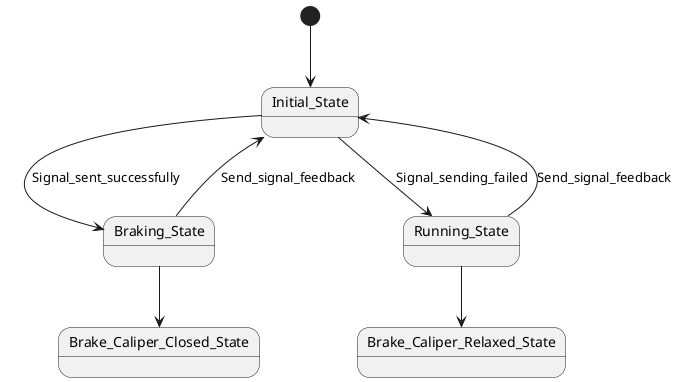
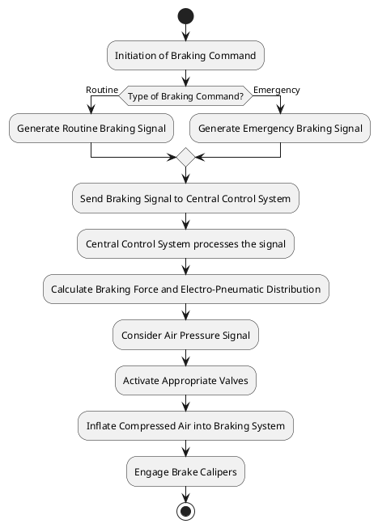
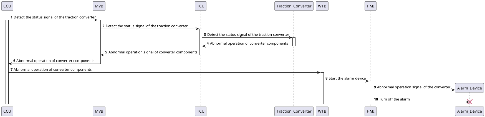

# `baselines` 双绿数据集下载、解析与 `parquet` 化记录

本文记录 `project_1_llm_state_machine_modeling/baselines/SUMMARY.md` 中“`BASELINE评估 = 🟢` 且 `数据集明确可获取 = 🟢`”的 4 组数据资源的本地获取、结构梳理、字段抽取、`parquet` 产物、示例和复现方式。对应论文分别是：

1. `Structure- and Event-Driven Frameworks for State Machine Modeling with Large Language Models` [1][2]
2. `Generating SysML Behavior Models via Large Language Models: an Empirical Study` [3][4]
3. `System Architects Are not Alone Anymore: Automatic System Modeling with AI` [5][6]
4. `Requirements Capture and Evaluation in Nimbus: The Light-Control Case Study` [7][8]

## 1. 本次新增产物

本次所有产物都放在同名资产目录：

`./2026-04-15-01-03-52-AI-讨论-baselines双绿数据集下载解析与parquet化.assets/`

核心文件如下：

| 文件 | 作用 |
| --- | --- |
| [build_baseline_double_green_parquets.py](./2026-04-15-01-03-52-AI-讨论-baselines双绿数据集下载解析与parquet化.assets/build_baseline_double_green_parquets.py) | 统一抽取脚本，负责把 4 组数据源转换成全部 `parquet` |
| [build_baseline_double_green_human_review_parquets.py](./2026-04-15-01-03-52-AI-讨论-baselines双绿数据集下载解析与parquet化.assets/build_baseline_double_green_human_review_parquets.py) | 人工评审抽取脚本，负责把公开人评结果、方法复原和可用性目录转换成 `parquet` |
| [baseline_double_green_dataset_catalog.parquet](./2026-04-15-01-03-52-AI-讨论-baselines双绿数据集下载解析与parquet化.assets/baseline_double_green_dataset_catalog.parquet) | 总目录，汇总每个数据集的样本粒度、规模、元模型和完整性状态 |
| [llms_emp_raw_samples.parquet](./2026-04-15-01-03-52-AI-讨论-baselines双绿数据集下载解析与parquet化.assets/llms_emp_raw_samples.parquet) | `llms_emp` 原始公开账本 107 行 |
| [llms_emp_complete_samples.parquet](./2026-04-15-01-03-52-AI-讨论-baselines双绿数据集下载解析与parquet化.assets/llms_emp_complete_samples.parquet) | `llms_emp` 清洗后 98 个可直接实验样本 |
| [llms_emp_human_review.parquet](./2026-04-15-01-03-52-AI-讨论-baselines双绿数据集下载解析与parquet化.assets/llms_emp_human_review.parquet) | `llms_emp` 公开逐样本人评结果 192 行，现已补入原始 workbook 行、人工文本原文摘录与论文原文评审口径 |
| [ttool_ai_models.parquet](./2026-04-15-01-03-52-AI-讨论-baselines双绿数据集下载解析与parquet化.assets/ttool_ai_models.parquet) | `ttool-ai` 的 15 个完整 AVATAR 设计模型变体 |
| [ttool_ai_state_machine_panels.parquet](./2026-04-15-01-03-52-AI-讨论-baselines双绿数据集下载解析与parquet化.assets/ttool_ai_state_machine_panels.parquet) | `ttool-ai` 的 122 个状态机面板 |
| [ttool_ai_states.parquet](./2026-04-15-01-03-52-AI-讨论-baselines双绿数据集下载解析与parquet化.assets/ttool_ai_states.parquet) | `ttool-ai` 摊平后的 708 个状态节点 |
| [ttool_ai_transitions.parquet](./2026-04-15-01-03-52-AI-讨论-baselines双绿数据集下载解析与parquet化.assets/ttool_ai_transitions.parquet) | `ttool-ai` 摊平后的 798 条迁移 |
| [ttool_ai_human_review.parquet](./2026-04-15-01-03-52-AI-讨论-baselines双绿数据集下载解析与parquet化.assets/ttool_ai_human_review.parquet) | `ttool-ai` 公开人评结果 116 行，含主表测试级总分、案例级摘要、`Overall` 汇总、补充评估原始行与 summary 行，并保留原始 `ods` 行文本 |
| [light_control_nimbus_documents.parquet](./2026-04-15-01-03-52-AI-讨论-baselines双绿数据集下载解析与parquet化.assets/light_control_nimbus_documents.parquet) | `Light Control` 的两份原始文档全文 |
| [light_control_nimbus_fragments.parquet](./2026-04-15-01-03-52-AI-讨论-baselines双绿数据集下载解析与parquet化.assets/light_control_nimbus_fragments.parquet) | `Light Control` 重建后的 4 个可实验片段 |
| [light_control_nimbus_variables.parquet](./2026-04-15-01-03-52-AI-讨论-baselines双绿数据集下载解析与parquet化.assets/light_control_nimbus_variables.parquet) | `Light Control` 的 17 个 monitored / controlled variables |
| [light_control_nimbus_states.parquet](./2026-04-15-01-03-52-AI-讨论-baselines双绿数据集下载解析与parquet化.assets/light_control_nimbus_states.parquet) | `Light Control` 的 20 个层次状态节点 |
| [light_control_nimbus_rules.parquet](./2026-04-15-01-03-52-AI-讨论-baselines双绿数据集下载解析与parquet化.assets/light_control_nimbus_rules.parquet) | `Light Control` 的 16 条 RSML-e 规则 |
| [structure_event_driven_cases.parquet](./2026-04-15-01-03-52-AI-讨论-baselines双绿数据集下载解析与parquet化.assets/structure_event_driven_cases.parquet) | `Structure/Event-Driven` 的 9 个公开描述样本 |
| [structure_event_driven_reference_solutions.parquet](./2026-04-15-01-03-52-AI-讨论-baselines双绿数据集下载解析与parquet化.assets/structure_event_driven_reference_solutions.parquet) | `Structure/Event-Driven` 的 8 个论文案例 prompt/image/count ground truth 与 6 个 Umple 文本参考解 |
| [structure_event_driven_metrics.parquet](./2026-04-15-01-03-52-AI-讨论-baselines双绿数据集下载解析与parquet化.assets/structure_event_driven_metrics.parquet) | `Structure/Event-Driven` 的 512 条逐组件评测记录 |
| [structure_event_driven_human_review.parquet](./2026-04-15-01-03-52-AI-讨论-baselines双绿数据集下载解析与parquet化.assets/structure_event_driven_human_review.parquet) | `Structure/Event-Driven` 的 512 条统一字段人评记录，现已补入原始 `xlsx` 评分行与论文原文评审规则摘录 |
| [baseline_double_green_human_review_records.parquet](./2026-04-15-01-03-52-AI-讨论-baselines双绿数据集下载解析与parquet化.assets/baseline_double_green_human_review_records.parquet) | 跨论文统一人评总表 820 行 |
| [baseline_double_green_human_review_protocols.parquet](./2026-04-15-01-03-52-AI-讨论-baselines双绿数据集下载解析与parquet化.assets/baseline_double_green_human_review_protocols.parquet) | 四篇论文的人评方法复原表，现已补入论文 `paper_content.txt` 的原文摘录 |
| [baseline_double_green_human_review_availability.parquet](./2026-04-15-01-03-52-AI-讨论-baselines双绿数据集下载解析与parquet化.assets/baseline_double_green_human_review_availability.parquet) | 四篇论文公开人评可用性与缺口总表 |

## 2. 统一复现方式

### 2.1 原始数据获取

本次使用的临时原始目录是 `/tmp/baseline_double_green/raw`。若后续重跑，推荐仍使用这个目录，命令如下。

当前机器上已把仓库内原始材料同步到了这个默认目录，可直接重跑：

1. 仓库内长期保存的原始材料位于 `project_1_llm_state_machine_modeling/reproduction/data/raw/`
2. 已同步到脚本默认目录 `/tmp/baseline_double_green/raw/`
3. 并已验证可以直接成功重跑 [build_baseline_double_green_human_review_parquets.py](./2026-04-15-01-03-52-AI-讨论-baselines双绿数据集下载解析与parquet化.assets/build_baseline_double_green_human_review_parquets.py)

`llms_emp` 原始数据 [3][4]：

```bash
mkdir -p /tmp/baseline_double_green/raw
gdown --folder 'https://drive.google.com/drive/folders/10eo8KDqlBlkQZxPpPCB7R3-aBQZ7Rsm6' \
  -O /tmp/baseline_double_green/raw/llms_emp_gmodel
```

`ttool-ai` 原始数据 [5][6]：

```bash
git clone https://github.com/zebradile/ttool-ai /tmp/baseline_double_green/raw/ttool-ai
```

`Nimbus Light Control` 原始论文与原始案例 [7][8]：

```bash
curl -L 'https://www-users.cse.umn.edu/~heimdahl/csci8801-fall06/readings/light-case-jucs.pdf' \
  -o /tmp/baseline_double_green/raw/light-case-jucs.pdf
curl -L 'https://www.st.cs.uni-saarland.de/edu/seminare/2005/advanced/papers/Light%20Control%20Case%20Study.pdf' \
  -o /tmp/baseline_double_green/raw/light-control-original-case-study.pdf
python -m tools.pdf_extractor \
  -i /tmp/baseline_double_green/raw/light-case-jucs.pdf \
  -o /tmp/baseline_double_green/raw/light-case-jucs.txt \
  -m text
python -m tools.pdf_extractor \
  -i /tmp/baseline_double_green/raw/light-control-original-case-study.pdf \
  -o /tmp/baseline_double_green/raw/light-control-original-case-study.txt \
  -m text
```

`Structure/Event-Driven` 匿名工件 [1][2]：

```bash
curl -L \
  'https://r.jina.ai/http://anonymous.4open.science/api/repo/llm_state_machine_modeling/file/backend/resources/state_machine_descriptions.py' \
  -o /tmp/baseline_double_green/raw/state_machine_descriptions.py
curl -L \
  'https://r.jina.ai/http://anonymous.4open.science/api/repo/llm_state_machine_modeling/file/backend/resources/n_shot_examples_single_prompt.py' \
  -o /tmp/baseline_double_green/raw/n_shot_examples_single_prompt.py
curl -L \
  'https://anonymous.4open.science/api/repo/llm_state_machine_modeling/file/Paper%20Experiment%20Resources/Final%20Detailed%20F1-Scores.xlsx' \
  -o /tmp/baseline_double_green/raw/llm_state_machine_final_f1_scores.xlsx
```

说明：

- 匿名工件的官方文件接口在实测中存在 `429` 限流与子目录不可枚举的问题，因此这里使用了 `r.jina.ai` 文本镜像去拉取 `.py` 文本文件。
- `Final Detailed F1-Scores.xlsx` 可以直接下载；结合本地保留的 zip 快照后，`Reference Solutions/` 目录下 8 个论文案例的 prompt/image 以及逐组件 count 级 ground truth 已全部恢复，另有 6 个案例还能恢复完整 Umple 文本参考解。

### 2.2 重新生成全部 `parquet`

```bash
python \
  project_1_llm_state_machine_modeling/discussions/2026-04-15-01-03-52-AI-讨论-baselines双绿数据集下载解析与parquet化.assets/build_baseline_double_green_parquets.py \
  --raw-root /tmp/baseline_double_green/raw \
  --output-dir \
  project_1_llm_state_machine_modeling/discussions/2026-04-15-01-03-52-AI-讨论-baselines双绿数据集下载解析与parquet化.assets
```

脚本不会覆写 Markdown，只会重新计算所有 `parquet`。

### 2.3 重新生成人工评审相关 `parquet`

```bash
python \
  project_1_llm_state_machine_modeling/discussions/2026-04-15-01-03-52-AI-讨论-baselines双绿数据集下载解析与parquet化.assets/build_baseline_double_green_human_review_parquets.py \
  --raw-root /tmp/baseline_double_green/raw \
  --output-dir \
  project_1_llm_state_machine_modeling/discussions/2026-04-15-01-03-52-AI-讨论-baselines双绿数据集下载解析与parquet化.assets
```

该脚本会生成：

1. 3 个论文级人评表：`llms_emp_human_review.parquet`、`ttool_ai_human_review.parquet`、`structure_event_driven_human_review.parquet`
2. 1 个跨论文统一人评总表：`baseline_double_green_human_review_records.parquet`
3. 2 个配套说明表：`baseline_double_green_human_review_protocols.parquet`、`baseline_double_green_human_review_availability.parquet`

重跑后的 `human review` 相关 `parquet` 统一新增以下字段，用于最大限度保留原始人类评价细节：

1. `human_review_source_record_json`：原始 `xlsx/ods` 行或单元格级记录，尽量保留原字段名和原值
2. `human_review_original_text`：直接从原始数据摘录的原文文本或原始评分行文本，不做改写
3. `human_review_original_text_json`：原文摘录的结构化来源信息
4. `paper_method_verbatim_excerpt`：论文 `paper_content.txt` 中与人工评审直接相关的原文段落
5. `paper_method_verbatim_excerpt_json`：上述原文段落的来源路径与行号
6. `verbatim_extraction_verified`：是否已按源文件核验为原文摘录

其中 `Nimbus` 没有逐样本人评原始分数，因此不会生成 `nimbus_human_review.parquet` 这类伪造结果表，而是只进入方法与可用性目录。

## 3. 数据集一：`llms_emp`

### 3.1 原始来源、输入输出与最终元模型

该数据集来自 `Generating SysML Behavior Models via Large Language Models: an Empirical Study` 的公开 `G_Model` 数据集 [3][4]。论文中明确说明作者从论文、书籍和开源项目中筛选行为模型，再统一重建为 `PlantUML` 形式，并补写对应自然语言需求描述 [3]。

该数据集的最终产物不是单一状态机，而是三类 `SysML v1.6` 行为模型：

| 图类型 | 最终元模型 | 公开编码形式 |
| --- | --- | --- |
| `stm` | SysML state machine | PlantUML |
| `act` | SysML activity diagram | PlantUML |
| `sd` | SysML sequence diagram | PlantUML |

因此，这个数据集适合做两类后续实验：

1. 行为模型通用生成实验：`requirements_description -> PlantUML`
2. 只保留状态机子集的专门实验：对 `diagram_type == "stm"` 再过滤

### 3.2 本地抽取结果

本次生成了两个 `parquet`：

| `parquet` | 作用 | 规模 |
| --- | --- | --- |
| [llms_emp_raw_samples.parquet](./2026-04-15-01-03-52-AI-讨论-baselines双绿数据集下载解析与parquet化.assets/llms_emp_raw_samples.parquet) | 原始账本完整镜像 | 107 行 |
| [llms_emp_complete_samples.parquet](./2026-04-15-01-03-52-AI-讨论-baselines双绿数据集下载解析与parquet化.assets/llms_emp_complete_samples.parquet) | 删除占位行与缺失输出后的实验子集 | 98 行 |

清洗后的 98 行图类型分布如下：

- `sd = 39`
- `stm = 38`
- `act = 21`

原始账本里保留了两个很重要的“脏数据事实”：

1. 末尾存在占位行 `to be continue ......`
2. 有 9 行缺失 `PlantUML` 输出，因此不适合直接当完整监督样本

### 3.3 `parquet` 字段

`llms_emp_raw_samples.parquet` 与 `llms_emp_complete_samples.parquet` 字段一致，核心字段如下：

| 字段 | 含义 |
| --- | --- |
| `row_id` | 原始 Excel 行号 |
| `model_name` | 样本名称 |
| `model_source` | 来源领域 / 书籍 / 论文 / 项目 |
| `requirements_description` | 输入需求文本 |
| `plantuml_code` | 输出 PlantUML 代码 |
| `diagram_type` | `stm / act / sd / other / missing` |
| `output_metamodel` | 最终元模型说明 |
| `selection_flag` | 原表里的 `Selected/selected` 标记 |
| `diagram_annotation` | 原表里的补注列，例如 `act` |
| `is_placeholder` | 是否为末尾占位行 |
| `has_requirements` | 是否存在输入需求 |
| `has_output_model` | 是否存在输出 PlantUML |
| `is_complete_sample` | 是否可直接做监督实验 |
| `requirements_char_count` | 输入长度 |
| `plantuml_char_count` | 输出长度 |
| `basic_state_count` | 对状态机的粗粒度状态数估计 |
| `basic_transition_count` | 对状态机的粗粒度迁移数估计 |
| `basic_participant_count` | 对时序图的 participant 数估计 |
| `basic_message_count` | 对时序图的消息数估计 |
| `basic_activity_action_count` | 对活动图动作节点数估计 |
| `basic_decision_count` | 对活动图判断节点数估计 |

### 3.4 三个真实完整例子

#### 例 1：`row_id = 2`，基础制动装置状态机

- `model_name`: `State machine diagram of basic braking device subsystem`
- `diagram_type`: `stm`
- `model_source`: `HSTBS`
- 这是 `llms_emp` 里最典型的“短自然语言描述 -> 平面状态机”样本之一。
- 原论文关心的是 LLM 是否能把这类离散行为要求稳定映射到 `SysML STM` [3]；这个例子对应的关注对象就是“状态、事件触发和收尾反馈”。

完整输入：

```text
1 This state machine model represents the train's basic braking device, which serves as the final execution unit for train braking operations. 
2 When the basic braking device receives a brake signal, it transitions from the initial state to the braking state. If the signal transmission fails, it proceeds to the operational state. Once the signal feedback is sent, it returns to the initial state. 
3 After entering the braking state, the system transitions to the brake caliper clamping state.
```

完整输出：



#### 例 2：`row_id = 3`，列车制动活动图

- `model_name`: `Activity diagram of train brake control`
- `diagram_type`: `act`
- `model_source`: `HSTBS`
- 这是 `llms_emp` 里“过程控制流程 -> 活动图”的代表样本。
- 原论文对这类样本的关注对象是动作节点、判断分支和整体流程语义，而不是状态层次 [3]。

完整输入：

```text
1- Brake command issue: The process begins when the driver or passenger gives a brake command. 
2- Signal generation: According to different situations, two types of brake signals are generated: 
Normal braking signal: This is the standard signal for normal braking scenarios. 
Emergency braking signal: This is a signal that requires immediate action in an emergency situation. 
3- Central control system: Both signals are sent to the central control system, which is represented in the figure as a central buffer. The system processes the input signal. 
4- Calculation of braking force and electric-pneumatic brake distribution calculation: The central control system calculates the required braking force and electric-pneumatic brake distribution. 
5- Valve open: According to the calculation, the appropriate valve is opened to control the flow of air or fluid required for braking. 
Compressed air charging: Compressed air enters the braking system directly to start the braking process. 
6- Brake caliper closed: Finally, the brake caliper engages and physically applies the brake to the train wheels, slowing or stopping the train.
```

完整输出：



#### 例 3：`row_id = 1`，整流检测时序图

- `model_name`: `TCU Rectification Detection Sequence Diagram`
- `diagram_type`: `sd`
- `model_source`: `EMUTC`
- 这是 `llms_emp` 里“通信交互叙述 -> 时序图”的代表样本。
- 原论文在这类样本上重点观察 lifeline、消息顺序和交互完整性，这也是 `SD` 在论文中通常比 `STM/ACT` 更容易出语义偏差的原因之一 [3]。

完整输入：

```text
1. Central Control Unit (CCU) sends rectification information to TCU via Multifunction Vehicle Bus (MVB): 
 - CCU initiates the communication. 
 - CCU sends a message containing rectification information. 
 - MVB transmits the message from CCU to TCU. 
2. TCU forwards rectification information to Rectifier: 
 - TCU receives the rectification information from CCU. 
 - TCU forwards the rectification information to the Rectifier. 
3. Rectifier sends fault information to TCU upon failure: 
 - Rectifier detects a fault. 
 - Rectifier sends a fault message to TCU. 
4. TCU sends fault information to CCU via MVB: 
 - TCU receives the fault message from the Rectifier. 
 - TCU sends the fault message to CCU via MVB. 
5. CCU forms train-level diagnostic information via Wire Train Bus (WTB): 
 - CCU receives the fault message from TCU. 
 - CCU processes the fault information. 
 - CCU sends the diagnostic information to form a train-level alert via WTB. 
6. Host Message Interface (HMI) receives the diagnostic information and triggers an alarm: 
 - HMI is a component that monitors the WTB. 
 - HMI receives the train-level diagnostic information from CCU. 
 - HMI processes the information and triggers an alarm to alert the operator.
```

完整输出：



### 3.5 Python 加载与组装方式

原始 Excel：

```python
from pathlib import Path
import pandas as pd

raw_path = Path("/tmp/baseline_double_green/raw/llms_emp_gmodel/Dataset.xlsx")
raw_df = pd.read_excel(raw_path)
print(raw_df.columns.tolist())
```

加载并组装 `parquet`：

```python
from pathlib import Path
import pandas as pd

assets = Path(
    "project_1_llm_state_machine_modeling/discussions/"
    "2026-04-15-01-03-52-AI-讨论-baselines双绿数据集下载解析与parquet化.assets"
)
df = pd.read_parquet(assets / "llms_emp_complete_samples.parquet")

stm_df = df[df["diagram_type"] == "stm"].copy()
print(df.shape, stm_df.shape)
print(df[["row_id", "model_name", "diagram_type"]].head())
```

组装成可直接用于训练/评测的监督样本：

```python
from pathlib import Path
import pandas as pd

assets = Path(
    "project_1_llm_state_machine_modeling/discussions/"
    "2026-04-15-01-03-52-AI-讨论-baselines双绿数据集下载解析与parquet化.assets"
)
raw_df = pd.read_parquet(assets / "llms_emp_raw_samples.parquet")
complete_df = pd.read_parquet(assets / "llms_emp_complete_samples.parquet")

supervised_df = (
    complete_df.assign(
        input_text=complete_df["requirements_description"],
        output_text=complete_df["plantuml_code"],
    )[
        [
            "row_id",
            "model_name",
            "model_source",
            "diagram_type",
            "output_metamodel",
            "input_text",
            "output_text",
        ]
    ]
    .sort_values("row_id")
    .reset_index(drop=True)
)

raw_account = raw_df[
    ["row_id", "model_name", "diagram_type", "has_requirements", "has_output_model", "is_complete_sample"]
].copy()

print(supervised_df.head(3))
print(supervised_df["diagram_type"].value_counts())
print(raw_account[["row_id", "model_name", "is_complete_sample"]].tail(12))
```

## 4. 数据集二：`ttool-ai`

### 4.1 原始来源、输入输出与最终元模型

`ttool-ai` 来自 `System Architects Are not Alone Anymore: Automatic System Modeling with AI` 的公开 GitHub 工件 [5][6]。论文的最终产物不是单个状态机，而是 `TTool` 的 `AVATAR Design` 模型：一个设计模型内部同时包含块图和多个 `AVATARStateMachineDiagramPanel` [5][6]。

因此，这个数据集的最终元模型必须写清楚：

- 不是普通 `PlantUML`
- 也不是单纯的 `SysML state machine`
- 而是 `TTool AVATAR design model`

其序列化格式是 TTool XML，根节点为 `TURTLEGMODELING`，每个 `Modeling` 对应一份 AI 生成设计变体。

### 4.2 本地抽取结果

本次从公开仓库中只保留论文主体使用的 3 个案例：

1. `platooning`
2. `AutomatedBraking`
3. `spacebasedsystem`

最终得到：

- 15 个完整设计变体，见 [ttool_ai_models.parquet](./2026-04-15-01-03-52-AI-讨论-baselines双绿数据集下载解析与parquet化.assets/ttool_ai_models.parquet)
- 122 个状态机面板，见 [ttool_ai_state_machine_panels.parquet](./2026-04-15-01-03-52-AI-讨论-baselines双绿数据集下载解析与parquet化.assets/ttool_ai_state_machine_panels.parquet)
- 708 个状态节点，见 [ttool_ai_states.parquet](./2026-04-15-01-03-52-AI-讨论-baselines双绿数据集下载解析与parquet化.assets/ttool_ai_states.parquet)
- 798 条迁移，见 [ttool_ai_transitions.parquet](./2026-04-15-01-03-52-AI-讨论-baselines双绿数据集下载解析与parquet化.assets/ttool_ai_transitions.parquet)

### 4.3 `parquet` 字段

| `parquet` | 关键字段 | 含义 |
| --- | --- | --- |
| `ttool_ai_models.parquet` | `case_id`, `variant_name`, `input_spec_text`, `raw_xml`, `block_panel_names_json`, `state_machine_panel_names_json` | 每个完整 AVATAR 设计变体 |
| `ttool_ai_state_machine_panels.parquet` | `panel_id`, `panel_name`, `state_count`, `transition_count`, `nonempty_guard_count`, `raw_panel_xml` | 每个状态机面板 |
| `ttool_ai_states.parquet` | `node_id`, `node_type`, `node_name`, `x`, `y`, `connecting_point_ids_json` | 摊平后的状态节点与起始伪状态 |
| `ttool_ai_transitions.parquet` | `source_node_name`, `target_node_name`, `guard_or_trigger`, `actions`, `after_min`, `after_max` | 摊平后的迁移边和标签 |

说明：

- `node_type = start_state` 时，`node_name` 可能是 `null` 或 `__start__` 语义占位。
- TTool XML 中迁移标签并不总是严格区分 `trigger` 和 `guard`，所以我把统一字段命名为 `guard_or_trigger`，避免过度假设。
- `raw_xml / raw_panel_xml / raw_component_xml / raw_connector_xml` 都保留了原始 XML 片段，后续如果要做更精细解析，可以直接继续处理。

### 4.4 三个真实完整例子

#### 例 1：`platooning / Platoon4 / Vehicle`

这是一个较复杂的车辆状态机面板，包含 10 个状态节点和 26 条迁移。

- 这个例子的关注对象是 `platoon` 形成、加入、离开、分裂和紧急制动等车辆协同行为。
- 结合原论文 [5]，这里最值得观察的是：自然语言规范里写的是完整系统说明，但 TTool-AI 实际生成的是“多 block + 多状态机面板”的 AVATAR 设计，因此这里展示的是其中一个 `Vehicle` 面板的完整输入与完整输出。

完整输入：

```text
Platooning is a transportation technique that consists in grouping trucks or vehicles together to reduce CO2 emissions. A platoon consists of one or several vehicles, the first one in the platoon playing the role of the platoon leader, the other ones playing the role of followers.

1. A vehicle can  create a platoon: this vehicle is then the leader of this platoon. This vehicle informs neighbour cars about this platoon by sending a platoon information message (position, speed, acceleration) every second. Once followers have joined, it regularly informs ---every half second --- the followers of its current situation (speed, acceleration, direction, selected lane). Whenever there is an important modification of speed / acceleration / direction / lane, the leader immediately informs the followers. 
 
2. A follower can join a platoon only at the last position, i.e. behind all other vehicles of the platoon. When it joins the platoon, it informs the leader about this. When a follower wishes to leave the platoon, it informs all other vehicles of the platoon (with a "leave" message) and  then brakes or changes of lane.
  
3. Leaders and followers use front and back cameras to detect the lanes and the distance to other vehicles. The distance between vehicles within a platoon is considered to be between a min and a max distance. If there is less than the min distance between two vehicles, then the first vehicle detecting this situation broadcasts the information to all others and all vehicles of the platoon must perform an emergency braking. If the distance between two vehicles v1 and v2 ---with v1 before v2--- gets over max, then v2 and all the vehicles behind v2 have to leave the platoon. v2 is assumed to send the "leave" message. Obviously, one important goal of the platooning software is to keep the inter-vehicle distance between min and max so as to ensure that the platoon works for a long time. 

In a more advanced version of the platooning system, the platoon can split i.e. a given follower can decide to become the leader of all the followers behind it.

Use at least 2 blocks and at most 10 blocks.
```

完整输出状态节点：

```text
node_type,node_name
state,JoiningPlatoon
other,joinPlatoon()
state,SplittingPlatoon
other,splitPlatoon()
state,EmergencyBraking
state,DetectingDistance
other,detectDistance()
state,DetectingLane
other,detectLane()
state,BreakingOrChangingLane
other,brakeOrChangeLane()
other,leavePlatoon()
state,Monitoring
state,CreatingPlatoon
other,createPlatoon()
state,Idle
state,Start
start_state,null
```

完整输出迁移：

```text
source_node_name,target_node_name,guard_or_trigger,actions
CreatingPlatoon,Monitoring,platoonCreationSuccess,
SplittingPlatoon,Monitoring,,
EmergencyBraking,Monitoring,,
detectDistance(),DetectingDistance,,
Monitoring,detectDistance(),detectDistanceRequest,
JoiningPlatoon,Monitoring,platoonJoinSuccess,
Monitoring,brakeOrChangeLane(),breakingOrChangingLaneRequest,
Idle,joinPlatoon(),joinPlatoonRequest,
BreakingOrChangingLane,Monitoring,,
DetectingLane,Monitoring,,
CreatingPlatoon,Idle,platoonCreationFailure,
detectLane(),DetectingLane,,
Monitoring,leavePlatoon(),platoonLeavingRequest,
Monitoring,splitPlatoon(),splitPlatoonRequest,
splitPlatoon(),SplittingPlatoon,,
brakeOrChangeLane(),BreakingOrChangingLane,,
leavePlatoon(),Idle,,
JoiningPlatoon,Idle,platoonJoinFailure,
Idle,createPlatoon(),createPlatoonRequest,
Monitoring,detectLane(),detectLaneRequest,
null,Start,,
createPlatoon(),CreatingPlatoon,,
Monitoring,EmergencyBraking,emergencyBrakingBroadcast,
Start,Idle,,
DetectingDistance,Monitoring,,
joinPlatoon(),JoiningPlatoon,,
```

#### 例 2：`automated_braking / System1 / Driver`

这个面板比较规整，适合作为“简单交通控制状态机”样本。

- 原论文把完整规范交给 TTool-AI，由其生成多个 block 的状态机 [5]。
- 在这个 `Driver` 面板里，关注对象是“驾驶者相关控制模式是否被正确抽成一条清晰的状态演化链”。

完整输入：

```text
When a dangerous situation occurs that forces the driver, or the car itself, to perform a
manoeuvre, this can endanger other vehicles. In order to warn other vehicles, the car sends
out a warning message. Nearby cars that are in danger can then react according to the
information provided within the message.
An ECU of the chassis & safety domain detects a danger; this may be the trigger of an airbag,
an obstacle in direction of travel seen by an environmental sensor, or an emergency braking
performed by the driver or an automatic system. The Chassis Safety Controller (CSC) gets
information about the dangerous situation via the Chassis Domain Bus. The CSC will assess
the situation and will take measures to mitigate the danger for the car. The measures will
result in commands to actuator ECUs in the chassis & safety domain and additionally com-
mands to the powertrain domain to get a helpful driving power adjustment. In parallel it
will also send information to the Communication Unit (CU). This information will contain
data about the current vehicle dynamic status and detailed information about the planned
actions (deceleration or acceleration, steering, etc.).
The CU will send out a warning message that contains this information via the DSRC interface to nearby vehicles. The emergency message contains longitude, latitude, altitude,
speed, acceleration and heading of the car, the time of message generation, the expiry time
of the message, an indicator for the reliability of the information, a code that is classifying
the car, an id that is identifying the sender of the message, an event code that is classifying
the emergency situation and the planed acceleration and heading. All this information is
packed in a message frame that adds checksum, information for protocol processing and if
necessary security information.

Functional requirements
- No warning message without a real danger is allowed
- No failure in any single unit may be succeeded by a false message
- No failure of any single communication may be succeeded by a false message
- Any single fault in an ECU has to be detectable
- Information about dangerous events has to be broadcast according to the communica-
tion congestion control algorithms
- Information about the dangers have to be broadcast to other cars with highest priority
- Privacy of the broadcast car information has to be guaranteed
Technical Requirements
- The maximum delay from danger detection to broadcast of the car2X message should
be less than 150 ms
- Additional security information on the busses in the chassis and safety & powertrain
domains should be less than 15% of the net data
Security aspects
- Privacy of the broadcast car information has to be guaranteed

Use between 4 and 10 blocks
```

完整输出状态节点：

```text
node_type,node_name
state,Parking
state,Driving
state,Ready
state,Start
start_state,null
```

完整输出迁移：

```text
source_node_name,target_node_name,guard_or_trigger,actions
null,Start,,
Driving,Parking,,
Parking,Ready,,
Ready,Driving,,
Start,Ready,,
```

#### 例 3：`space_based_system / System5 / Software`

这是最适合后续做复杂状态机学习的一个例子之一，节点多、触发明确。

- 原论文关注的是 LLM 是否能从长篇安全关键系统规范中恢复多 block 设计 [5]。
- 在这个 `Software` 面板里，关注对象集中在 `TC/TM` 处理、异常位翻转处理和 `CRC` 相关软件流程。

完整输入：

```text
A ground station needs to regularly monitor the safety data of a space-based system: 3D position, temperature, battery level, fuel quantity. For this, a ground station can send, via radio-frequencies, a TC (TeleCommand) to the space-based system. Once received by the RF receiver, the software of the space-based system gets the request for information. Data of TCs are ciphered. Once the software has deciphered data, it stores data in an intermediate buffer, and a task to handle this request is triggered. This task builds the answer by reading requested values from sensors. Once the answer packet has been built, it is first enciphered and then sent via a TM (TeleMetry) to the ground station, using the RF transmitter. To ensure that the system does not crash, a microcontroller of this system is dedicated to execute a software task that checks, every 10ms, that all other software tasks of the space-based embedded system are still responsive. For this, a signal is sent to each task. If some of the tasks have not responded to this signal, then the whole system is restarted, apart from the watchdog: the latter is not expected to crash, apart if the battery is too low to power the microcontroller. Obviously, this watchdog task is of prime importance for this reliability of
the system. Sometimes, while the software system is computing a TM, another TC is received. To avoid redundancy, the TM under construction is canceled: a new TM corresponding to the latest TC is computed and sent. Last but not least, space-based systems are not well protected against high-energy particles. Such a particle can provoke a bit flip from 0 to 1, or the opposite. The memory is the most sensitive elements of the platform. Therefore, for each block of data the software writes into memory, an error correction code (CRC) of this block has to be computed by the software and stored into memory along with the data block. When this block is read, the corresponding CRC must also be read and checked.
```

完整输出状态节点：

```text
node_type,node_name
state,ComputeCRC
state,HandleBitFlip
state,ComputeTM
state,SendTM
state,EncipherTM
state,HandleTM
state,HandleRequest
state,DecipherTC
state,HandleTC
state,Idle
state,Start
start_state,null
```

完整输出迁移：

```text
source_node_name,target_node_name,guard_or_trigger,actions
HandleTM,EncipherTM,,
HandleBitFlip,ComputeCRC,,
Idle,HandleTC,requestData,
HandleTC,DecipherTC,,
HandleRequest,HandleTM,buildAnswer,
ComputeCRC,Idle,,
Start,Idle,,
Idle,ComputeTM,computeTM,
Idle,HandleBitFlip,bitFlip,
DecipherTC,HandleRequest,,
EncipherTM,SendTM,,
SendTM,Idle,,
ComputeTM,Idle,,
null,Start,,
```

### 4.5 Python 加载与组装方式

原始 Markdown 规范与 XML：

```python
from pathlib import Path
import xml.etree.ElementTree as ET

spec_path = Path("/tmp/baseline_double_green/raw/ttool-ai/platooning/platoonings.md")
xml_path = Path("/tmp/baseline_double_green/raw/ttool-ai/platooning/platoonings.xml")

spec_text = spec_path.read_text(encoding="utf-8")
root = ET.parse(xml_path).getroot()
modelings = root.findall("./Modeling")
print(spec_text[:300])
print(len(modelings), [m.attrib["nameTab"] for m in modelings])
```

加载并组装 `parquet`：

```python
from pathlib import Path
import pandas as pd

assets = Path(
    "project_1_llm_state_machine_modeling/discussions/"
    "2026-04-15-01-03-52-AI-讨论-baselines双绿数据集下载解析与parquet化.assets"
)
models = pd.read_parquet(assets / "ttool_ai_models.parquet")
panels = pd.read_parquet(assets / "ttool_ai_state_machine_panels.parquet")
states = pd.read_parquet(assets / "ttool_ai_states.parquet")
transitions = pd.read_parquet(assets / "ttool_ai_transitions.parquet")

software_panels = panels[panels["panel_name"] == "Software"]
print(models.shape, panels.shape, states.shape, transitions.shape)
print(software_panels[["case_id", "variant_name", "state_count", "transition_count"]])
```

按单个状态机面板组装成“输入规范 + 状态集合 + 迁移集合”：

```python
from pathlib import Path
import pandas as pd

assets = Path(
    "project_1_llm_state_machine_modeling/discussions/"
    "2026-04-15-01-03-52-AI-讨论-baselines双绿数据集下载解析与parquet化.assets"
)
models = pd.read_parquet(assets / "ttool_ai_models.parquet")
panels = pd.read_parquet(assets / "ttool_ai_state_machine_panels.parquet")
states = pd.read_parquet(assets / "ttool_ai_states.parquet")
transitions = pd.read_parquet(assets / "ttool_ai_transitions.parquet")

panel_row = panels.query(
    "case_id == 'platooning' and variant_name == 'Platoon4' and panel_name == 'Vehicle'"
).iloc[0]

panel_states = (
    states[states["panel_id"] == panel_row["panel_id"]]
    [["node_id", "node_type", "node_name", "x", "y"]]
    .sort_values(["node_type", "node_name"], na_position="last")
    .reset_index(drop=True)
)
panel_transitions = (
    transitions[transitions["panel_id"] == panel_row["panel_id"]]
    [["source_node_name", "target_node_name", "guard_or_trigger", "actions"]]
    .reset_index(drop=True)
)

assembled_panel = {
    "case_id": panel_row["case_id"],
    "variant_name": panel_row["variant_name"],
    "panel_name": panel_row["panel_name"],
    "input_spec_text": panel_row["input_spec_text"],
    "states": panel_states.to_dict("records"),
    "transitions": panel_transitions.to_dict("records"),
}

print(models[["case_id", "variant_name"]].drop_duplicates().head())
print(panel_states.head())
print(panel_transitions.head())
print(assembled_panel["input_spec_text"][:400])
```

## 5. 数据集三：`Nimbus Light Control`

### 5.1 原始来源、输入输出与最终元模型

这一组数据不是仓库型 benchmark，而是经典单案例数据源：原始 `Dagstuhl` 灯光控制需求 [8]，加上 `Nimbus` 论文中的 `RSML-e` 需求建模与细化结果 [7]。因此这里不能机械地按“多样本表格”理解，而应视为：

1. 一个原始需求文档
2. 一个正式的 `RSML-e` 建模论文
3. 一组可追溯重建出来的片段级样本

这组数据的最终元模型也必须明确：

- 不是 UML
- 不是 PlantUML
- 而是 `RSML-e` state-based requirements model [7]

### 5.2 本地抽取结果

本次产物分为 5 张表：

| `parquet` | 规模 | 作用 |
| --- | --- | --- |
| [light_control_nimbus_documents.parquet](./2026-04-15-01-03-52-AI-讨论-baselines双绿数据集下载解析与parquet化.assets/light_control_nimbus_documents.parquet) | 2 行 | 保存原始案例和 Nimbus 论文全文 |
| [light_control_nimbus_fragments.parquet](./2026-04-15-01-03-52-AI-讨论-baselines双绿数据集下载解析与parquet化.assets/light_control_nimbus_fragments.parquet) | 4 行 | 保存可直接做实验的片段级样本 |
| [light_control_nimbus_variables.parquet](./2026-04-15-01-03-52-AI-讨论-baselines双绿数据集下载解析与parquet化.assets/light_control_nimbus_variables.parquet) | 17 行 | monitored / operator / controlled 变量字典 |
| [light_control_nimbus_states.parquet](./2026-04-15-01-03-52-AI-讨论-baselines双绿数据集下载解析与parquet化.assets/light_control_nimbus_states.parquet) | 20 行 | 图 6 与图 16 中可恢复的状态节点 |
| [light_control_nimbus_rules.parquet](./2026-04-15-01-03-52-AI-讨论-baselines双绿数据集下载解析与parquet化.assets/light_control_nimbus_rules.parquet) | 16 行 | 关键 RSML-e 赋值 / 迁移规则 |

### 5.3 `parquet` 字段

| `parquet` | 关键字段 | 含义 |
| --- | --- | --- |
| `documents` | `document_role`, `source_url`, `text` | 原始全文，便于以后重新抽取 |
| `fragments` | `fragment_id`, `abstraction_level`, `input_requirement_text`, `output_fragment_excerpt`, `source_line_refs_json` | 一个片段级监督样本 |
| `variables` | `variable_name`, `variable_group`, `range_or_type`, `description` | 变量字典 |
| `states` | `state_name`, `parent_state_name`, `depth` | 层次状态树 |
| `rules` | `target_variable`, `assigned_value`, `condition`, `abstraction_level` | 可直接用于规则学习或结构提取 |

### 5.4 三个真实完整例子

#### 例 1：`room_state_hierarchy_req`

这是 `Nimbus` 案例里最基础也最关键的房间级状态层次样本。

- 它包含占用状态、灯光场景状态和故障状态三个并列关注对象。
- 结合原论文，关注点就在 REQ 层房间状态树与 `Light_Maintenance_Modes` 的划分位置，也就是图 6 和图 8 所在的建模部分 [7]；原始自然语言需求则来自 `Dagstuhl` 灯光控制案例 [8]。

完整输入：

```text
U1: If a person occupies a room, the light has to be sufficient to move safely, if nothing else is desired by a chosen light scene.
U2: As long as the room is occupied, the actual chosen light scene has to be maintained.
U3: If the room is reoccupied within T1 minutes after the last person has left the room, the last chosen light scene has to be reestablished.
U4: If the room is reoccupied after more than T1 minutes since the last person has left the room, the standard light scene has to be established.
U11: If the outdoor light sensor or the motion detector of a room does not work correctly, the user has to be informed.
U12: The ceiling lights and the task light should be maintained by the control system depending on different light scenes.
FM1: Use daylight to achieve the desired light whenever possible.
FM3: If a room is unoccupied for more than T3 minutes, all lights must be switched off.
FM6: The facility manager can turn off any light in a room or hallway section that is not occupied.
FM7: If a malfunction occurs, the facility manager has to be informed.
FM8: If a malfunction occurs, the control system supports the facility manager by finding the reason.
```

完整输出，原始片段：

```text
Light_Control_System_Room
Light_Maintenance_Modes
Room_Occupied
Room_Occupied_Eq
Maintain_Light_Scene
User_Set_Mode
Room_Empty
Occupancy_UndetectableChosen_Light_Scene
Chosen1_LS
Chosen2_LS
Chosen3_LS
Default_LS
Failure_Modes
Ok
Failed
```

完整输出，结构化状态树重建：

```text
Light_Control_System_Room
  Light_Maintenance_Modes
    Room_Occupied
      Room_Occupied_Eq
        Maintain_Light_Scene
        User_Set_Mode
    Room_Empty
    Occupancy_Undetectable
  Chosen_Light_Scene
    Chosen1_LS
    Chosen2_LS
    Chosen3_LS
    Default_LS
  Failure_Modes
    Ok
    Failed
```

完整输出，结构化规则：

```text
target_variable,assigned_value,condition
Light_Maintenance_Modes,Room_Occupied,Occupied_InVar = TRUE && Occupied_Detectable_InVar = TRUE
Light_Maintenance_Modes,Occupancy_Undetectable,Occupied_Detectable_InVar = FALSE
Light_Maintenance_Modes,Room_Empty,Occupied_InVar = FALSE && Occupied_Detectable_InVar = TRUE
```

#### 例 2：`occupancy_and_timeout_req`

这是整个 `Nimbus` 数据集中最适合做“自然语言控制约束 -> RSML-e 规则”实验的片段之一。

- 它完整包含 `T1`、`T3`、重新占用、场景按钮和设施管理员关灯指令这几类关键控制因素。
- 结合原论文，关注对象就在 `Current_LS_Light_Level` 的定义位置，也就是图 9 及其前后的说明段落 [7]；这些规则正是从原始需求 `U1/U2/U3/U4/U10/FM1/FM3/FM5/FM6` 被组织出来的 [8]。

完整输入：

```text
U1: If a person occupies a room, the light has to be sufficient to move safely, if nothing else is desired by a chosen light scene.
U2: As long as the room is occupied, the actual chosen light scene has to be maintained.
U3: If the room is reoccupied within T1 minutes after the last person has left the room, the last chosen light scene has to be reestablished.
U4: If the room is reoccupied after more than T1 minutes since the last person has left the room, the standard light scene has to be established.
U10: The value T1 can be set for each room separately (not by using the control panel).
FM1: Use daylight to achieve the desired light whenever possible.
FM3: If a room is unoccupied for more than T3 minutes, all lights must be switched off.
FM5: The value T3 can be set for each room separately.
FM6: The facility manager can turn off any light in a room or hallway section that is not occupied.
```

完整输出，原始片段：

```text
State Variable 
Light_Maintenance_Modes 
 
Location:  Light_Control_System_Room 
:= Room_Occupied IF 
Occupied_InVar = TRUE T 
Occupied_Detectable_InVar = TRUE T 
:= Occupancy_Undetectable IF 
Occupied_Detectable_InVar = TRUE F 
:= Room_Empty IF 
Occupied_InVar = TRUE F 
Occupied_Detectable_InVar = TRUE T 
 
Figure 8: Light Maintenance Modes in the REQ Relation
[Fig. 6] shows this partitioning of the Light Maintenance Modes. Each mode
has certain conditions under which it is active. These conditions are specified
with a state variable definition as shown in [Fig. 8]. These modes depend on twomonitored variables (see [Tab. 1]) Occupancy
Detectable and Room Occupied ,
which determine whether we can detect the occupancy status of the room, and
if so, whether or not the room is occupied. Note that because this is a specifica-
tion of REQ, the monitored variables are actually the input quantities. Thus, in[Fig. 8], the monitored quantities have the suffix
InVar (this is a naming con-
vention that we commonly use in RSML−especifications, not something which
is enforced by the tool). Also, we have adopted the convention for boolean vari-ables of writing the more lengthy expression “X
var = TRUE” rather than simly
“Xvar” which would be a valid boolean expression by itself. Nimbus ,o fc o u r s e ,

--- Page 14 ---
allows either convention to be used.
The way that we have chosen to describe the control of the light level in the
room is as follows: (1) the light level in the room is compared with the light
level required by the current light scene, (2) if light level is not equal to the lightlevel specified in the current light scene, the light intensity of the window/walllight banks are adjusted proportionally up or down by a small increment. Then,
the system will poll the light level again within a short amount of time and
eventually, the light in the room will comply with the selected light scene.
There is an issue, however, with the fact that it is notdesirable to have the
control system chage the light intensity at the same time as the user attemptsto adjust it; that is, the control system should not fight the user for control over
the lights. Thus, it is necessary to partition the Room
Occupied mode into two
sub-modes: one where the system is receiving user input and should produce nocontrol actions and one where the system is responsible for maintaining the lightlevel in the room. This partition can be seen in [Fig. 6].
The current light scene is the basis of the control of the light in the room.
First, it is computed and then it is used to determine the values of the controlledvariables. The current light scene, like any other light scene, consists of a lightlevel (in lux) and the intensity of the window and wall light banks.
[Fig. 9] shows the state variable definition for the light level of the current
light scene. On the right, the cases are labeled to clarify the presentation in thispaper; this labeling is not a part of RSML
−e. The first case in the definition
simply states that the light level will be updated to the current light level in the
room if the user is setting the controls for the room. This ensures that as the
user makes changes to the lights, the changes are maintained, not reset, by thesystem.
The second group of cases in [Fig. 9] (cases 2-5) handles the user pressing one
of the light scene buttons on the RCP. If the user presses one of these buttons,
the light level associated with the selected light scene is used as the current light
scene and will thus be maintained by the system.
The sixth case determines the light level in the room if the room is unoccu-
pied. The lights are shut off (the light level set to zero) if the room is empty and
either T3 has passed or the facility manager has issued the shutoff command.
T3 is measured from the time that the Light
Maintenance Modes state variable
assumes the value Room Empty (the TIME ENTERED part of line 2). If the
facility manager issues a shutoff command, this is indicated by the reciept of a
message at the FacM Shutoff interface. The MESSAGE AT expression in line 3
of the condition table is true if this is the case.
The specification determines whether the room has been reoccupied by ex-
amining the Light Maintenance Modes state variable. In order to detect a change
in the variable, the specification must be able to reason about previous values of
the variable. RSML−eallows this through the use of the PREV STEP expres-
sion, which returns the value its sub-expression had at the close of the previouscomputation of the RSML
−especification. In case 7, the room is reoccupied if
theRoom Occupied Eqstate variable has the value Maintain Light Scene and
in the previous step, the Light Maintenance Modes state machine did not have
the value Room Occupied4. When the room is reoccupied, then the light level is
determined by whether or not T1 has passed (case seven). The function Reoccu-
4Note that the “..” notation in the figure before the state variable names is used to
indicate that the RSML−eparser should search through the state variable tree to
find the given state variable. This notation avoids having to specify full path nameswithin the specification, as duplicate names are allowed in the tree.

--- Page 15 ---
Case 8:
Otherwise, the lightlevel should remainconstantOutput Variable
Current_LS_Light_Level
Type: INTEGER
Units: lux
Expected Min:  0
Expected Max:  10000
:= Light_Level_InVar IF
..Room_Occupied_Eq IN_STATE  User_Set_Mode T
:= Chosen1_LS_Light_Level IF
Chosen1_LS_Button_InVar = ButtonPressType::kPressed T
Set_Light_Scene_Button_InVar = ButtonPressType::kNotPressed T
:= Chosen2_LS_Light_Level IF
Chosen2_LS_Button_InVar = ButtonPressType::kPressed T
Set_Light_Scene_Button_InVar = ButtonPressType::kNotPressed T
:= Chosen3_LS_Light_Level IF
Chosen3_LS_Button_InVar = ButtonPressType::kPressed T
Set_Light_Scene_Button_InVar = ButtonPressType::kNotPressed T
:= Default_LS_Light_Level IF
Default_LS_Button_InVar = ButtonPressType::kPressed T
Set_Light_Scene_Button_InVar = ButtonPressType::kNotPressed T
:= 0 IF
..Light_Maintenance_Modes IN_STATE  Room_Empty T T
TIME >= ..Light_Maintenance_Modes TIME_ENTERED  Room_Empty +
T3_InVarT*
MESSAGE_AT(FacM_Shutoff) * T
:= Reoccupied_Light_Level() IF
..Room_Occupied_Eq IN_STATE  Maintain_Light_Scene T
PREV_STEP (..Light_Maintenance_Modes IN_STATE  Room_Occupied) F
:= PREV_STEP(Current_LS_Light_Level) IF
..Room_Occupied_Eq IN_STATE  Maintain_Light_Scene T
PREV_STEP (..Light_Maintenance_Modes IN_STATE  Room_Occupied) TCase 1:
```

完整输出，结构化规则：

```text
target_variable,assigned_value,condition
Current_LS_Light_Level,Light_Level_InVar,..Room_Occupied_Eq IN_STATE User_Set_Mode
Current_LS_Light_Level,Chosen1_LS_Light_Level,Chosen1_LS_Button_InVar = kPressed && Set_Light_Scene_Button_InVar = kNotPressed
Current_LS_Light_Level,Chosen2_LS_Light_Level,Chosen2_LS_Button_InVar = kPressed && Set_Light_Scene_Button_InVar = kNotPressed
Current_LS_Light_Level,Chosen3_LS_Light_Level,Chosen3_LS_Button_InVar = kPressed && Set_Light_Scene_Button_InVar = kNotPressed
Current_LS_Light_Level,Default_LS_Light_Level,Default_LS_Button_InVar = kPressed && Set_Light_Scene_Button_InVar = kNotPressed
Current_LS_Light_Level,0,..Light_Maintenance_Modes IN_STATE Room_Empty && (TIME >= TIME_ENTERED(Room_Empty) + T3_InVar || MESSAGE_AT(FacM_Shutoff))
Current_LS_Light_Level,Reoccupied_Light_Level(),..Room_Occupied_Eq IN_STATE Maintain_Light_Scene && PREV_STEP(..Light_Maintenance_Modes IN_STATE Room_Occupied) = FALSE
Current_LS_Light_Level,PREV_STEP(Current_LS_Light_Level),..Room_Occupied_Eq IN_STATE Maintain_Light_Scene && PREV_STEP(..Light_Maintenance_Modes IN_STATE Room_Occupied) = TRUE
```

#### 例 3：`occupied_in_soft_refinement`

这是 `REQ -> SOFT` 细化层里最适合做故障感知状态抽取的一个样本。

- 它讨论的不是灯光场景本身，而是“房间是否可被可靠检测到占用”。
- 结合原论文，关注对象就在 `Occupied_In` 这个细化状态变量定义，也就是图 16 及其故障检测相关论述 [7]；输入自然语言仍然来自原始案例中的故障需求 [8]。

完整输入：

```text
U11: If the outdoor light sensor or the motion detector of a room does not work correctly, the user has to be informed.
FM7: If a malfunction occurs, the facility manager has to be informed.
FM8: If a malfunction occurs, the control system supports the facility manager by finding the reason.
```

完整输出，原始片段：

```text
State Variable
Occupied_In
Location:  Light_Control_System_Room
:= Not_Occupied IF
Motion_Detected_InVar = FALSE T
:= Occupied IF
PREV_STEP(DoorSensor_InVar = DoorSensorType::kClosed) * *
PREV_STEP(..Occupied_In IN_STATE  Not_Occupied) T F
Motion_Detected_InVar = TRUE T T
DoorSensor_InVar = DoorSensorType::kClosed F *
:= Not_Detectable IF
PREV_STEP(DoorSensor_InVar = DoorSensorType::kClosed) T
PREV_STEP(..Occupied_In IN_STATE  Not_Occupied) T
Motion_Detected_InVar = TRUE T
DoorSensor_InVar = DoorSensorType::kClosed T
Figure 16: The definition for the Occupied Instate variable
```

完整输出，结构化状态树重建：

```text
Light_Control_System_Room
  Occupied_In
    Occupied
    Not_Occupied
    Not_Detectable
```

完整输出，结构化规则：

```text
target_variable,assigned_value,condition
Occupied_In,Not_Occupied,Motion_Detected_InVar = FALSE
Occupied_In,Occupied,PREV_STEP(DoorSensor_InVar = kClosed) && PREV_STEP(..Occupied_In IN_STATE Not_Occupied) = FALSE && Motion_Detected_InVar = TRUE
Occupied_In,Not_Detectable,PREV_STEP(DoorSensor_InVar = kClosed) && PREV_STEP(..Occupied_In IN_STATE Not_Occupied) = TRUE && Motion_Detected_InVar = TRUE && DoorSensor_InVar = kClosed
```

### 5.5 Python 加载与组装方式

原始文本：

```python
from pathlib import Path

original_case = Path("/tmp/baseline_double_green/raw/light-control-original-case-study.txt")
nimbus_case = Path("/tmp/baseline_double_green/raw/light-case-jucs.txt")

print(original_case.read_text(encoding="utf-8")[:1200])
print(nimbus_case.read_text(encoding="utf-8")[:1200])
```

加载并组装 `parquet`：

```python
from pathlib import Path
import pandas as pd

assets = Path(
    "project_1_llm_state_machine_modeling/discussions/"
    "2026-04-15-01-03-52-AI-讨论-baselines双绿数据集下载解析与parquet化.assets"
)
fragments = pd.read_parquet(assets / "light_control_nimbus_fragments.parquet")
documents = pd.read_parquet(assets / "light_control_nimbus_documents.parquet")
variables = pd.read_parquet(assets / "light_control_nimbus_variables.parquet")
states = pd.read_parquet(assets / "light_control_nimbus_states.parquet")
rules = pd.read_parquet(assets / "light_control_nimbus_rules.parquet")

req_fragments = fragments[fragments["abstraction_level"] == "REQ"]
print(fragments[["fragment_id", "fragment_title", "abstraction_level"]])
print(variables[["variable_name", "variable_group"]].head())
print(rules[rules["fragment_id"] == "occupancy_and_timeout_req"])
```

组装成“片段输入 + 原始输出片段 + 状态树 + 规则表”的实验对象：

```python
from pathlib import Path
import pandas as pd

assets = Path(
    "project_1_llm_state_machine_modeling/discussions/"
    "2026-04-15-01-03-52-AI-讨论-baselines双绿数据集下载解析与parquet化.assets"
)
documents = pd.read_parquet(assets / "light_control_nimbus_documents.parquet")
fragments = pd.read_parquet(assets / "light_control_nimbus_fragments.parquet")
variables = pd.read_parquet(assets / "light_control_nimbus_variables.parquet")
states = pd.read_parquet(assets / "light_control_nimbus_states.parquet")
rules = pd.read_parquet(assets / "light_control_nimbus_rules.parquet")

state_rows = (
    states.sort_values(["fragment_id", "depth", "state_name"])
    .groupby("fragment_id")[["state_name", "parent_state_name", "depth"]]
    .apply(lambda g: g.to_dict("records"))
    .rename("state_rows")
    .reset_index()
)
rule_rows = (
    rules.sort_values(["fragment_id", "target_variable", "assigned_value"])
    .groupby("fragment_id")[["target_variable", "assigned_value", "condition"]]
    .apply(lambda g: g.to_dict("records"))
    .rename("rule_rows")
    .reset_index()
)

fragment_dataset = (
    fragments.merge(state_rows, on="fragment_id", how="left")
    .merge(rule_rows, on="fragment_id", how="left")
    .sort_values(["abstraction_level", "fragment_id"])
    .reset_index(drop=True)
)

print(documents[["document_role", "source_url"]])
print(variables[["variable_name", "variable_group"]].head())
print(fragment_dataset[["fragment_id", "abstraction_level", "fragment_title"]])
print(fragment_dataset.loc[0, "state_rows"])
print(fragment_dataset.loc[0, "rule_rows"])
```

## 6. 数据集四：`Structure- and Event-Driven Frameworks`

### 6.1 原始来源、输入输出与最终元模型

这组数据来自 `Structure- and Event-Driven Frameworks for State Machine Modeling with Large Language Models` 的匿名公开工件 [1][2]。论文正文明确说明官方评测集有 8 个非结构化 reactive-system descriptions，每个配一份专家 ground truth UML state machine [1]。

这里的最终元模型必须区分两层：

1. 论文任务目标是 `UML state machine` [1]
2. 在匿名工件中，8 个论文案例都能恢复 prompt + reference image，另有 6 个案例能恢复完整 `Umple` 文本参考解 [2]

因此，本次 `parquet` 的建模口径是：

- `structure_event_driven_cases.parquet`：保留原始自然语言描述
- `structure_event_driven_reference_solutions.parquet`：统一保留 prompt / image / metric-derived counts，并在可恢复时补上 Umple 文本参考解
- `structure_event_driven_metrics.parquet`：保留官方逐组件 `TP / FN / FP / Precision / Recall / F1`

### 6.2 本地抽取结果与完整性状态

当前一共恢复出 3 张表：

| `parquet` | 规模 | 说明 |
| --- | --- | --- |
| [structure_event_driven_cases.parquet](./2026-04-15-01-03-52-AI-讨论-baselines双绿数据集下载解析与parquet化.assets/structure_event_driven_cases.parquet) | 9 行 | 8 个论文正式案例 + 1 个工件额外案例 `ATAS` |
| [structure_event_driven_reference_solutions.parquet](./2026-04-15-01-03-52-AI-讨论-baselines双绿数据集下载解析与parquet化.assets/structure_event_driven_reference_solutions.parquet) | 9 行 | 8 个论文正式案例全部带 prompt/image/count ground truth；其中 6 个案例 + 1 个额外 `ATAS` 还带完整 Umple 文本 |
| [structure_event_driven_metrics.parquet](./2026-04-15-01-03-52-AI-讨论-baselines双绿数据集下载解析与parquet化.assets/structure_event_driven_metrics.parquet) | 512 行 | 4 种策略 × 2 个 LLM × 逐案例 × 逐组件的评测记录 |

当前完整性状态必须如实说明：

| 案例 | 描述 | 完整参考解 |
| --- | --- | --- |
| `Printer` | 有 | 有，且有 Umple 文本 |
| `Spa Manager` | 有 | 有，且有 Umple 文本 |
| `Dishwasher` | 有 | 有，且有 Umple 文本 |
| `Chess Clock` | 有 | 有，且有 Umple 文本 |
| `Automatic Bread Maker` | 有 | 有，但仅有 prompt/image/count |
| `Thermomix TM6` | 有 | 有，且有 Umple 文本 |
| `W-UMPLE` | 有 | 有，但仅有 prompt/image/count |
| `SSC7` | 有 | 有，但仅有 prompt/image/count |
| `ATAS` | 有 | 有 Umple 文本，但它不是论文正式 8 案例之一 |

也就是说：

- 8 个论文正式案例的自然语言描述都已经恢复
- 官方指标表也已经完整恢复
- 8 个论文正式案例的 prompt/image/count 级 ground truth 现在也都已恢复
- 但 `Automatic Bread Maker / W-UMPLE / SSC7` 三个正式案例仍然只有 prompt/image/count，没有公开的完整 Umple 文本参考解

这一点已经在 `structure_event_driven_cases.parquet` 与 `structure_event_driven_reference_solutions.parquet` 中显式编码。

### 6.3 `parquet` 字段

| `parquet` | 关键字段 | 含义 |
| --- | --- | --- |
| `cases` | `case_id`, `case_name`, `is_paper_evaluation_case`, `system_description`, `reference_prompt_text`, `reference_components_json`, `has_full_reference_solution` | 案例主表 |
| `reference_solutions` | `case_id`, `reference_solution_text`, `reference_prompt_text`, `reference_image_local_path`, `reference_states_count`, `reference_transitions_count` 等 | prompt/image/count ground truth 与已恢复 Umple 文本 |
| `metrics` | `strategy_name`, `llm_name`, `component`, `tp`, `fn`, `fp`, `precision`, `recall`, `f1_score`, `image_reference` | 官方逐组件评测表 |

### 6.4 三个真实完整例子

#### 例 1：`Printer`

这是该 benchmark 里最标准的“办公设备行为说明 -> 专家状态机”案例之一。

- 它包含账号授权、扫描/打印二选一、缺纸、卡纸、暂停恢复等典型反应式行为。
- 结合原论文，关注对象是 LLM 能否从自由文本里恢复出状态、触发、守卫和动作，并与专家 ground truth 对齐 [1]；完整参考解文本来自匿名工件中的 Umple 实现 [2]。

完整输入：

```text
The printer has a master switch which turns the printer on or off. Once the printer is turned on, a user needs to log in before being able to print or scan a document. To login, a user taps her/his printer card on the printer's card reader. Each printer card has a unique ID. If the printer card is authorized, the user can either choose "scan" or "print". If the printer card is not authorized, a login error message is shown.
For the "print" option, the user presses the start button to print the user's first document in the user's print queue. If there is no document in the print queue, an error message is shown instead of performing the printing task. For the "scan" option, the user presses the start button for the printer to scan an original document, which was placed by the user in the automatic page feeder. The scan is sent to the user's email inbox. If the printer does not detect an original document, an error message is shown instead of performing the scanning task. When the printer is done printing or scanning, the user can print or scan the next document. The user may also stop the printing/scanning task at any time by pressing the stop button. The user is allowed to logoff either before or after a printing/scanning task but not while the printer is in the middle of a printing/scanning task.
If there is a paper jam, the printer will suspend the printing/scanning task to allow the user to clear the paper jam. The user may then either cancel the printing/scanning task or resume it. In case the printer runs out of paper during a printing task, the printer suspends the printing task to allow the user to resupply paper. The user may then either cancel the printing task or resume it.
```

完整输出：

```umple
class Printer{
 sm {
   Off {on -> On;}
   On{
     off -> Off;
     Idle {
       login(cardID) [!idAuthorized(cardID)] -> Idle;
       login(cardID) [idAuthorized(cardID)] / {action="none";} -> Ready;
     }
     
     Ready{
       logoff -> Idle;
       start [action=="scan" && !originalLoaded()] -> Ready;
       start [action=="print" && !documentInQueue()] -> Ready;
       
       scan /{action="scan";} -> Ready;
       
       print /{action="print";} -> Ready;
       
       start [action=="scan" && originalLoaded()] -> ScanAndEmail;
       
       start [action=="print" && documentInQueue()] -> Print;
     }
     
     Busy{
      ScanAndEmail{
        
      }
       
       Print{
         outOfPaper -> Suspended;
       }
       
       jam -> Suspended;
       
       stop -> Ready;
       done -> Ready;
     }
     
     Suspended{
      cancel -> Ready;
       
       resume -> Busy.H;
     }
   }
 }
}
```

#### 例 2：`Chess Clock`

这是最能体现并行状态和时间驱动切换的一个案例。

- 它同时包含配置阶段、白黑棋手座位方向配置、运行阶段双时钟切换和暂停/结束逻辑。
- 结合原论文，关注对象是 LLM 是否能把这种带并行结构、计时事件和历史恢复的描述映射成较复杂的状态机 [1]；匿名工件则给出了完整 Umple ground truth [2]。

完整输入：

```text
The digital chess clock has six buttons (each of which corresponds to one event): flip (the large white button on the top), minus, plus, startStop, select (the four blue buttons from left to right below the screen), onOff (at the bottom of the clock, not shown in figure).
After turning on the chess clock (with the onOff button), players can iterate through all the (predefined) timings using the plus and minus buttons, and finally select the designated timing by the select button. A timing option has a predefined base time (minutes and seconds) and an increment (in seconds, which can be zero). The game then starts when the startStop button is pressed.
At any time before the game is started, the players can set the clock to match the actual seating of White and Black players using the flip button (e.g. see the placement of the small symbols with the White and Black kings on the screen which can be swapped by pressing the flip button).
When the game is started, White's clock starts counting down (in each second) until the flip button is pressed. At this moment, White's clock stops (and receives a bonus time defined by the increment in the timing option), and Black's clock starts counting down. If the flip button is pressed again, then the same procedure is applied with reversed colors. Both clocks can be stopped by pressing the startStop button, while the game can be continued by pressing the startStop button again. If the clock of the current player counts down to zero, then a flashing flag shall appear on the screen.
The chess clock can be turned off at any time by pressing the onOff button.
```

完整输出：

```umple
class ChessClock {
  status {
    Off {
      onOff -> On;
    }
    On {
      GameSetup {
        TimingSelection {
          plus -> /{incrTimingProgram();} TimingSelection;
          minus -> /{decrTimingProgram();} TimingSelection;
        }
        ||
        WhiteKingStatus {
          WhiteKingOnLeft {
            flip -> WhiteKingOnRight;
          }
          WhiteKingOnRight {
            flip -> WhiteKingOnLeft;
          }
        }
      select -> ReadyToStart;
      }
      ReadyToStart{
        startStop -> GameRunning;
      }
      GameRunning {
        WhiteClockRunning {
          after(1) [wc > 0] -> /{decrTimer(wc);} WhiteClockRunning;
          after(1) [wc == 0] -> /{flashFlag(white);} GameFinished;
          flip -> BlackClockRunning;
          entry / {startTimer(wc);}
          exit / {stopTimer(wc);}
        }
        BlackClockRunning {
          after(1) [bc > 0] -> /{decrTimer(bc);} BlackClockRunning;
          after(1) [bc == 0] -> /{flashFlag(black);} GameFinished;
          flip -> WhiteClockRunning;
          entry / {startTimer(bc);}
          exit / {stopTimer(bc);}
        }
      startStop -> GamePaused;
      }
      GamePaused {
        startStop -> GameRunning.H;
      }
      GameFinished {
      }
    onOff -> Off;
    }
  }    
}
```

#### 例 3：`Thermomix TM6`

这是三个例子里输入最长、控制流程也最丰富的一个。

- 它包含运输模式、手动开关机、自动关机、称重、切碎、烹饪、反复加料等多个阶段。
- 结合原论文，关注对象是 LLM 在长篇消费电子设备描述上能否稳定保留守卫、定时、循环步骤和历史回到 `On.H` 这类结构 [1]；完整参考解同样来自匿名工件 [2]。

完整输入：

```text
The Thermomix TM6 is an all-in-one kitchen appliance that preps ingredients and cooks them to perfection.
On delivery, the Thermomix TM6 is set to transportation mode. When the selector (button) is pressed to start up the Thermomix TM6 for the first time, the transportation mode is automatically deactivated, and the home screen is shown. To turn the Thermomix TM6 off, hold the selector down for at least five seconds until a message appears to confirm that the Thermomix TM6 is switching off. You can then release the selector. If the Thermomix TM6 has been turned off, pressing the selector turns it back on and the home screen is shown. To save energy, the Thermomix TM6 switches off automatically after 15 minutes when not in use. A message appears for the last 30 seconds, allowing automatic shutdown to be canceled and the home screen to be shown (by selecting cancel on the appliance's screen or by removing the cooking bowl).
To cook a meal, select a recipe on the screen and then select start to follow the step-by-step instructions. First, add ingredients as instructed. The integrated scale weighs them and allows the next step only if the correct amount has been added. Continue to the next step by selecting next on the screen. The Thermomix TM6 chops the ingredients for as long as and at the speed required for the recipe. When the chopping step is done, select next for the Thermomix TM6 to start the cooking step. Again, the Thermomix TM6 cooks the meal at the temperature and time required for the recipe. At the end of any recipe step, the Thermomix TM6 may prompt you to add further ingredients, which are then again weighed, chopped, and cooked. After the last step, the Thermomix TM6 informs you that the meal is ready to be served. When the cooking bowl is removed, the Thermomix TM6 returns to the home screen. It is not possible to cook a meal if the cooking bowl is not correctly placed on the Thermomix TM6.
The selector button raises the following events: selectorPressed (the selector is pressed and released immediately), selectorHeld (the selector is pressed and not released immediately), and selectorReleased (the selector is released after being held).
```

完整输出：

```umple
class Thermomix {
  sm {
    TransportationMode {
    	selectorPressed -> On;
    }
    PreparingOff {
     	selectorReleased -> On.H ;
      	after5sec -> Off;
    }
    Off {
      	selectorPressed -> On;
    }
    On {
      	selectorHeld -> PreparingOff;
      	bowlRemoved -> On;
		Home {
          after14min30sec -> PreparingShutdown;
          start [!bowlRemoved()] / {action=setIngredients();} -> PromptToAdd;
        }
      	PreparingShutdown {
        	cancel -> Home;
          	after30sec -> Off;
        }
      	PromptToAdd {
			next[weightCorrect() && moreIngredientsRequired] / {action=setIngredients;} -> PromptToAdd;
          	next[weightCorrect() && !moreIngredientsRequired] / {action=setChoppingSpeedAndTime();} -> Chop;
        }
      	Chop {
          next [choppingTimeDone && moreIngredientsRequired()] / {action=setIngredients();} -> PromptToAdd;
          next [choppingTimeDone && !moreIngredientsRequired()] / {action=setCookingSpeedAndTime();} -> Cook;
        }
      	Cook {
          afterChoppingTime [moreIngredientsRequired] / {action=setIngredients();} -> PromptToAdd;
          afterCookingTime [!moreIngredientsRequired] -> Ready;
        }
      	Ready {
        	after14min30sec -> PreparingShutdown; 
        }
    }
  }
}
```

### 6.5 Python 加载与组装方式

原始描述和参考解文本：

```python
from pathlib import Path
import re

raw = Path("/tmp/baseline_double_green/raw")
descriptions_text = (raw / "state_machine_descriptions.py").read_text(encoding="utf-8")
nshot_text = (raw / "n_shot_examples_single_prompt.py").read_text(encoding="utf-8")

desc_body = descriptions_text.split("Markdown Content:\n", 1)[1]
desc_pairs = re.findall(r'([A-Za-z0-9_]+)\\s*=\\s*\"\"\"(.*?)\"\"\"', desc_body, re.S)
print(len(desc_pairs))

code_body = nshot_text.split("Markdown Content:\n", 1)[1]
available_refs = re.findall(
    r'\"([A-Za-z0-9_]+)\":\\s*\\{\\s*\"system_description\":\\s*([A-Za-z0-9_]+),\\s*\"umple_code_solution\":\\s*\\'\\'\\'(.*?)\\'\\'\\'',
    code_body,
    re.S,
)
print(len(available_refs))
```

加载并组装 `parquet`：

```python
from pathlib import Path
import pandas as pd

assets = Path(
    "project_1_llm_state_machine_modeling/discussions/"
    "2026-04-15-01-03-52-AI-讨论-baselines双绿数据集下载解析与parquet化.assets"
)
cases = pd.read_parquet(assets / "structure_event_driven_cases.parquet")
refs = pd.read_parquet(assets / "structure_event_driven_reference_solutions.parquet")
metrics = pd.read_parquet(assets / "structure_event_driven_metrics.parquet")

paper_cases = cases[cases["is_paper_evaluation_case"]]
complete_cases = paper_cases[paper_cases["has_full_reference_solution"]]

print(cases[["case_id", "case_name", "has_full_reference_solution"]])
print(metrics.groupby(["strategy_name", "llm_name"])["f1_score"].mean())
print(refs[["case_id", "umple_transition_count", "umple_block_count"]])
```

组装成“自然语言描述 + 参考解 + 官方评测指标”的统一案例表：

```python
from pathlib import Path
import pandas as pd

assets = Path(
    "project_1_llm_state_machine_modeling/discussions/"
    "2026-04-15-01-03-52-AI-讨论-baselines双绿数据集下载解析与parquet化.assets"
)
cases = pd.read_parquet(assets / "structure_event_driven_cases.parquet")
refs = pd.read_parquet(assets / "structure_event_driven_reference_solutions.parquet")
metrics = pd.read_parquet(assets / "structure_event_driven_metrics.parquet")

case_metric_summary = (
    metrics.groupby("case_id", as_index=False)[["precision", "recall", "f1_score"]]
    .mean()
    .rename(
        columns={
            "precision": "mean_precision",
            "recall": "mean_recall",
            "f1_score": "mean_f1_score",
        }
    )
)

assembled_cases = (
    cases.merge(
        refs[["case_id", "reference_solution_text", "umple_transition_count", "umple_block_count"]],
        on="case_id",
        how="left",
    )
    .merge(case_metric_summary, on="case_id", how="left")
    .sort_values(["is_paper_evaluation_case", "case_name"], ascending=[False, True])
    .reset_index(drop=True)
)

print(assembled_cases[["case_name", "has_full_reference_solution", "mean_f1_score"]])
print(assembled_cases.loc[0, "system_description"][:400])
print(assembled_cases.loc[0, "reference_solution_text"][:400])
```

## 7. 统一使用建议

如果后续要把 4 组数据统一接到新的实验里，我建议按下面方式使用：

1. 先读 [baseline_double_green_dataset_catalog.parquet](./2026-04-15-01-03-52-AI-讨论-baselines双绿数据集下载解析与parquet化.assets/baseline_double_green_dataset_catalog.parquet)，决定你要跑的是“行为图通用生成”还是“纯状态机生成”。
2. 如果要做纯状态机，优先使用：
   - `llms_emp_complete_samples.parquet` 里 `diagram_type == "stm"` 的子集
   - `ttool_ai_state_machine_panels.parquet` + `ttool_ai_states.parquet` + `ttool_ai_transitions.parquet`
   - `light_control_nimbus_fragments.parquet` 里的 `REQ/SOFT` 片段
   - `structure_event_driven_cases.parquet` 与 `structure_event_driven_reference_solutions.parquet` 的可用子集
3. 如果要做“输入文本 -> 完整行为模型代码”，优先使用：
   - `llms_emp_complete_samples.parquet`
   - `structure_event_driven_cases.parquet` + `structure_event_driven_reference_solutions.parquet`
4. 如果要做“生成后评测”，直接使用 `structure_event_driven_metrics.parquet` 里的官方组件级指标口径，或者仿照其字段重新评分。

统一加载入口示例：

```python
from pathlib import Path
import pandas as pd

assets = Path(
    "project_1_llm_state_machine_modeling/discussions/"
    "2026-04-15-01-03-52-AI-讨论-baselines双绿数据集下载解析与parquet化.assets"
)

catalog = pd.read_parquet(assets / "baseline_double_green_dataset_catalog.parquet")
llms_emp = pd.read_parquet(assets / "llms_emp_complete_samples.parquet")
ttool_panels = pd.read_parquet(assets / "ttool_ai_state_machine_panels.parquet")
light_fragments = pd.read_parquet(assets / "light_control_nimbus_fragments.parquet")
structure_cases = pd.read_parquet(assets / "structure_event_driven_cases.parquet")

print(catalog)
print(llms_emp.shape, ttool_panels.shape, light_fragments.shape, structure_cases.shape)
```

## 8. 人工评审结果真实形态总览

这次重新核对原始 `xlsx/ods/pdf` 后，结论已经很明确：之前之所以会感觉 “`human review` parquet 里没有真实的人类专家评价”，不是读取方式错了，而是 4 篇论文里“公开人评数据”的形态本来就不一样。

| 论文 | 当前公开人评状态 | 当前记录数 | 原始人评数据真实形态 | 为什么你在旧版 parquet 里看不到“专家长评原文” |
| --- | --- | ---: | --- | --- |
| `llms_emp` | `sample_level_available` | 192 | 逐样本 `input/ref/pred + Acc/F1 + hallucination` 工作簿 | 有真实人工文本，但多是短错误标签，旧版只把它们埋在 `details_json` 里，没有单独拉平 |
| `ttool-ai` | `summary_only_available` | 116 | `results.ods` 的测试级总分行、案例级摘要、`Overall` 汇总 + `evaluation.ods` 的补充分数行和 summary 行 | 原始数据本来就几乎没有长文本评语，主要是分数行；旧版还漏掉了逗号小数、主表摘要和 `Overall` 汇总 |
| `Nimbus Light Control` | `method_only_no_raw_scores` | 0 | 论文正文里的人工 inspection / formal verification / simulation 方法描述 | 它从一开始就不是逐样本打分 benchmark，没有可抽的 reviewer-by-reviewer 原始表 |
| `Structure/Event-Driven` | `sample_level_available` | 512 | `Final Detailed F1-Scores.xlsx` 的逐组件 `TP/FN/FP/F1` 评分行 | 原始数据本来就是数值表，没有长评文本；旧版也没有把原始评分行保留下来 |

本轮更新后，`human review` 相关 `parquet` 统一新增了 6 个保真字段：

1. `human_review_source_record_json`
2. `human_review_original_text`
3. `human_review_original_text_json`
4. `paper_method_verbatim_excerpt`
5. `paper_method_verbatim_excerpt_json`
6. `verbatim_extraction_verified`

这 6 个字段的职责如下：

1. `human_review_source_record_json` 负责保留原始 `xlsx/ods` 行或单元格级记录，尽量保留原字段名和原值。
2. `human_review_original_text` 负责给出最直接可读的原文摘录；对 `llms_emp` 来说是人工填写的错误文本，对 `ttool-ai` 和 `Structure/Event-Driven` 来说是原始评分行文本。
3. `human_review_original_text_json` 负责说明这些原文摘录来自哪个单元格、哪一行、哪张表。
4. `paper_method_verbatim_excerpt` 负责把论文 `paper_content.txt` 中与人工评审直接相关的原文段落拉进 parquet。
5. `paper_method_verbatim_excerpt_json` 负责保留这些原文段落的来源路径和行号。
6. `verbatim_extraction_verified` 负责标记这些新增字段是否已经按源文件逐条核验。

本轮核验结果如下：

1. `llms_emp` 共核验 `190` 个直接来自 workbook 单元格的人类评价文本摘录。
2. `ttool-ai` 共核验 `116` 条直接来自 `ods` 的原始评分/汇总行。
3. `Structure/Event-Driven` 共核验 `512` 条直接来自 `xlsx` 的原始评分行。
4. `protocols` 表共核验 `4` 行论文原文摘录。

也就是说，现在这些新增字段不是“方法复述”，而是已经核过源文件的原文保真字段。

## 9. 更新后的人工评审 `parquet`

### 9.1 论文级人评表

| 文件 | 行数 | 现在实际包含什么 |
| --- | ---: | --- |
| [llms_emp_human_review.parquet](./2026-04-15-01-03-52-AI-讨论-baselines双绿数据集下载解析与parquet化.assets/llms_emp_human_review.parquet) | 192 | 逐样本人评 benchmark，含 `input/ref/pred`、人工语法/语义检查结果、原始 workbook 行、人工文本原文和论文原文评审口径 |
| [ttool_ai_human_review.parquet](./2026-04-15-01-03-52-AI-讨论-baselines双绿数据集下载解析与parquet化.assets/ttool_ai_human_review.parquet) | 116 | `30` 条主表测试级总分、`36` 条主表案例级摘要、`8` 条 `Overall` 汇总、`30` 条补充评估原始分数行、`12` 条补充评估 summary 行，并保留原始 `ods` 行文本、行号和论文原文评分口径 |
| [structure_event_driven_human_review.parquet](./2026-04-15-01-03-52-AI-讨论-baselines双绿数据集下载解析与parquet化.assets/structure_event_driven_human_review.parquet) | 512 | 逐组件 `TP/FN/FP/F1` benchmark，现已补入原始 `xlsx` 评分行和论文原文评审规则 |

三张表共同保留的核心字段现在分成三类：

1. 任务和工件字段：
   - `input_text`
   - `ref_output_text`
   - `pred_output_text`
   - `ref_output_artifact_path`
   - `pred_output_artifact_path`
2. 评审结果字段：
   - `human_review_score`
   - `human_review_score_unit`
   - `human_review_summary`
   - `human_review_details_json`
3. 原始保真字段：
   - `human_review_source_record_json`
   - `human_review_original_text`
   - `human_review_original_text_json`
   - `paper_method_verbatim_excerpt`
   - `paper_method_verbatim_excerpt_json`
   - `verbatim_extraction_verified`

### 9.2 跨论文说明表

| 文件 | 行数 | 作用 |
| --- | ---: | --- |
| [baseline_double_green_human_review_records.parquet](./2026-04-15-01-03-52-AI-讨论-baselines双绿数据集下载解析与parquet化.assets/baseline_double_green_human_review_records.parquet) | 820 | 把 `llms_emp`、`ttool-ai`、`Structure/Event-Driven` 三篇有公开人评记录的论文统一到同一 schema |
| [baseline_double_green_human_review_protocols.parquet](./2026-04-15-01-03-52-AI-讨论-baselines双绿数据集下载解析与parquet化.assets/baseline_double_green_human_review_protocols.parquet) | 4 | 四篇论文的人评方法复原表，并补入 `paper_content.txt` 中与人工评审直接相关的原文摘录 |
| [baseline_double_green_human_review_availability.parquet](./2026-04-15-01-03-52-AI-讨论-baselines双绿数据集下载解析与parquet化.assets/baseline_double_green_human_review_availability.parquet) | 4 | 四篇论文“公开到什么粒度”的统一目录 |

如果你要直接做跨论文过滤，推荐先读：

```python
from pathlib import Path
import pandas as pd

assets = Path(
    "project_1_llm_state_machine_modeling/discussions/"
    "2026-04-15-01-03-52-AI-讨论-baselines双绿数据集下载解析与parquet化.assets"
)

records = pd.read_parquet(assets / "baseline_double_green_human_review_records.parquet")
availability = pd.read_parquet(assets / "baseline_double_green_human_review_availability.parquet")
protocols = pd.read_parquet(assets / "baseline_double_green_human_review_protocols.parquet")

print(records.groupby("paper_slug").size())
print(records[["paper_slug", "record_type"]].value_counts())
print(protocols[["paper_slug", "paper_method_verbatim_verified"]])
```

## 10. 四篇论文的人评数据到底是什么

### 10.1 `llms_emp`

这篇是四篇里最接近“真实逐样本人评日志”的。

1. 原始来源是 [Experiment Results.xlsx](../reproduction/data/raw/llms_emp_gmodel/Experiment%20Results.xlsx)。
2. 公开表里直接有：
   - `Requirement Description`
   - `PlantUML`
   - `Generation PlantUML`
   - `PlantUML Accuracy`
   - `SysML Grammar Accuracy`
   - `True Positive / False Positive / False Negative / F1 Score`
   - `Format Hallucinations`
   - `SysML Grammar Hallucinations`
   - `Semmantic Hallucinations`
3. 现在的 [llms_emp_human_review.parquet](./2026-04-15-01-03-52-AI-讨论-baselines双绿数据集下载解析与parquet化.assets/llms_emp_human_review.parquet) 里，这些原始列都被保留到了 `human_review_source_record_json`。
4. 原始人工文本没有被改写，直接落在 `human_review_original_text` 和 `human_review_original_text_json`。

几个最典型的真实人工文本例子如下：

1. `STM Results:0`

```text
transition does not connect two state
```

2. `STM Results:1`

```text
missing one state and transition
```

3. `STM Results:5`

```text
transition must connect two state
```

```text
1. Incorrect composite state usage.
2. interaction error
```

4. `SD Results:1`

```text
A lifeline represents the relevant lifetime of a property of the interaction’s owning block, not the actor
```

```text
Incorrect message type..Incorrect message exchange.
```

这篇论文的人工评审口径也已经按原文摘录进入 parquet。最关键的两段原文是：

> `manually compare each item against the standard and record the errors.`

> `we manually check the model against 55 semantics and log violations.`

因此，这篇里的“真实人类反馈”既包括数值，也包括真实的人工短文本错误描述；只是这些文本本来就不是长段专家评论。

### 10.2 `ttool-ai`

这篇原始数据本来就不是“逐条专家点评表”，而是“人工总评分表 + 补充分数表”。

1. 主表原始来源是 [results.ods](../reproduction/data/raw/ttool-ai/results.ods)。
2. 补充表原始来源是 [evaluation.ods](../reproduction/data/raw/ttool-ai/SNCS_complementaryEvaluation/evaluation.ods)。
3. 最早旧版 parquet 之所以只有 `39` 行，是因为补充表里的 `9,2 / 8,8 / 6,7` 这类逗号小数没有被正确解析。
4. 第一轮修复逗号小数后，补充评估部分恢复到了 `72` 行；但主表里的案例级摘要、学生 cohort 摘要和 `Overall` 汇总当时还没有纳入。
5. 现在进一步补齐后，[ttool_ai_human_review.parquet](./2026-04-15-01-03-52-AI-讨论-baselines双绿数据集下载解析与parquet化.assets/ttool_ai_human_review.parquet) 共有 `116` 行：
   - `30` 条 `summary_level_run_score`
   - `36` 条 `case_aggregate_stat`
   - `8` 条 `overall_aggregate_stat`
   - `30` 条 `raw_score_row`
   - `12` 条 `summary`

这篇现在保留的“真实人类反馈数据”主要是原始评分行。例如：

1. 主表 `Platooning` 的第 1 次测试原始行：

```text
1	39	100	221	85
```

它对应：

1. `Test = 1`
2. `Time BD (s) = 39`
3. `Grade BD (/100) = 100`
4. `Time SMD (s) = 221`
5. `Grade SMD (/100) = 85`

2. 补充表 `connectedDevice` 的 `Average` 原始行：

```text
Average	6,2	8,7	9,2	9,3	6,6	6,3	4,7	9,3
```

3. 主表 `Platooning` 的 AI 案例级 `Average` 原始行：

```text
Average	55	83	103	67
```

4. 主表 `Platooning` 的学生 cohort `Average` 原始行：

```text
Average	2700	75	2700	64
```

5. 主表 `Platooning` 的学生 cohort `highest grade` 原始行：

```text
highest grade	100	100
```

6. `Overall` sheet 里 `TTool + AI` 的 `Average` 原始行：

```text
Average	40	81	178	63
```

7. 补充表 `packagingChain` 的 `Std dev` 原始行：

```text
Std dev	1,7	1,8	1,6	1,7
```

这篇没有公开逐维度扣分说明和 reviewer 自由文本，所以现在 parquet 里保留的是：

1. 原始 `ods` 行文本
2. 原始 `ods` 行 JSON
3. `ods` 的行号与 header 行
4. 对学生 cohort 行保留 `Students: N` 这类分组头信息
5. 论文里对评分标准的原文摘录

论文原文已经补到 `paper_method_verbatim_excerpt`。最关键的评分标准原文是：

> `These criteria adhere to the principles of software engineering quality criteria.`

> `They encompass, among others, the adequacy of the diagrams to the specification ...`

> `They also include the syntactic correctness of the models ... detected by TTool’s syntax checker.`

因此，这篇里“看不到专家长评”不是抽取失败，而是公开源里本来就几乎没有那种文本。

### 10.3 `Nimbus Light Control`

这篇不生成论文级 `human_review` 记录表，原因不是遗漏，而是原始公开物本来就没有逐样本人评分数。

1. 它保留在 [baseline_double_green_human_review_protocols.parquet](./2026-04-15-01-03-52-AI-讨论-baselines双绿数据集下载解析与parquet化.assets/baseline_double_green_human_review_protocols.parquet) 和 [baseline_double_green_human_review_availability.parquet](./2026-04-15-01-03-52-AI-讨论-baselines双绿数据集下载解析与parquet化.assets/baseline_double_green_human_review_availability.parquet) 中。
2. 现在 `protocols` 里已经补入论文原文摘录，不再只是脚本复述。
3. 它的“真实人类反馈”是方法级的人工 inspection 机制，而不是逐样本数字表。

最关键的原文是：

> `Assurance ... can be achieved through (1) manual inspections, (2) formal verification ... or (3) simulation and testing ... all three approaches must be used in concert.`

以及：

> `Manual inspections and visualization provide the specification team, customers, systems engineers, and regulatory representatives ...`

还有建模人员原文：

> `The model was developed by two graduate students over approximately three weeks time ...`

所以这篇的“人类评价数据”应该被理解成“高可信 V&V 流程原文”，而不是评分表。

### 10.4 `Structure- and Event-Driven`

这篇公开的人评数据本体就是逐组件评分行。

1. 原始来源是 [llm_state_machine_modeling.zip](../reproduction/data/raw/structure_event/llm_state_machine_modeling.zip) 中的 `Paper Experiment Resources/Final Detailed F1-Scores.xlsx`，并已同步到 `/tmp/baseline_double_green/raw/llm_state_machine_final_f1_scores.xlsx`。
2. [structure_event_driven_human_review.parquet](./2026-04-15-01-03-52-AI-讨论-baselines双绿数据集下载解析与parquet化.assets/structure_event_driven_human_review.parquet) 共 `512` 行，对应：
   - `8` 个案例
   - `4` 种策略
   - `2` 个 LLM
   - `8` 个组件维度
3. 现在每一行都保留了原始 `xlsx` 评分行文本和原始 `xlsx` 评分行 JSON。

最典型的原始评分行例子如下：

1. `Dishwasher (single prompt) / States`

```text
Dishwasher
(single prompt)	States	6	3	0	1	0.6666666666666666	0.8	Dishwasher_single_prompt_001_3d861c05a72cff5d3c2f18e4de10b1c2c2bf591a.png
```

2. 同一案例的 `Transitions`

```text
Transitions	8	9	0	1	0.47058823529411764	0.6399999999999999
```

这篇的人工评审规则也已按原文摘录进入 parquet。最关键的原文包括：

> `Therefore, we manually evaluate the outputs from the generation strategies.`

> `A single author conducts the evaluation for a given designed approach.`

> `exact match or semantic match ... (true positives)`

> `false positives`

> `false negatives`

因此，这篇里真正应该看的不是“专家评论段落”，而是原始 `TP/FN/FP/F1` 行和原始评审规则原文。

## 11. 可直接复用性的最终判断

如果目标是做“`input/ref/pred/human review` 一体化基准”，现在可以更准确地分成四类：

| 论文 | 是否适合直接做统一 benchmark | 现在更准确的结论 |
| --- | --- | --- |
| `llms_emp` | `是` | 最适合直接复用；有逐样本 `input/ref/pred`，也有真实人工短文本反馈 |
| `Structure/Event-Driven` | `是，但属于组件级` | 最适合做逐组件 `TP/FP/FN/F1` benchmark；原始评分行和评审规则都已保留 |
| `ttool-ai` | `部分适合` | 适合做“人工总评分协议 + 原始分数行 + 案例规格 + 最终模型”的方法对比，不适合做逐样本 gold alignment |
| `Nimbus Light Control` | `否，只有方法级` | 适合作为人工 inspection / formal verification / simulation 协同流程来源，不是公开人评分数数据集 |

后续统一实验若要选主干数据，我建议：

1. `llms_emp` 作为主样本级 benchmark。
2. `Structure/Event-Driven` 作为组件级 benchmark。
3. `ttool-ai` 保留为“人工总评分协议”与工具链比较来源。
4. `Nimbus` 保留为“需求评估与 V&V 流程”来源。

## 参考文献

[1] Samer Abdulkarim, Evan Boyd, Karl Bridi, Alec Tufenkjian, Boqi Chen, Gunter Mussbacher. “Structure- and Event-Driven Frameworks for State Machine Modeling with Large Language Models.” *arXiv*, 2026. DOI: 10.48550/arXiv.2604.00275. [论文链接](https://arxiv.org/abs/2604.00275)

[2] Anonymous. “Paper artifacts for Structure- and Event-Driven Frameworks for State Machine Modeling with Large Language Models.” Anonymous 4open artifact repository. [工件入口](https://anonymous.4open.science/r/llm_state_machine_modeling/)

[3] Yuan Wang, Ning Ge, Jiangxi Liu, Zhilong Cao, Zheping Chen, Chunming Hu. “Generating SysML Behavior Models via Large Language Models: an Empirical Study.” *Internetware 2025*, pp. 366-377, 2025. DOI: 10.1145/3755881.3755926. [论文链接](https://dl.acm.org/doi/10.1145/3755881.3755926)

[4] Yuan Wang et al. “G_Model SysML behavior model dataset.” Google Drive public folder linked from [3]. [数据集链接](https://drive.google.com/drive/folders/10eo8KDqlBlkQZxPpPCB7R3-aBQZ7Rsm6)

[5] Ludovic Apvrille, Bastien Sultan. “System Architects Are not Alone Anymore: Automatic System Modeling with AI.” *MODELSWARD 2024*, 2024. [会议页面](https://www.scitepress.org/PublishedPapers/2024/123917/)

[6] zebradile. “ttool-ai.” GitHub repository for the public TTool-AI artifacts referenced by [5]. [仓库链接](https://github.com/zebradile/ttool-ai)

[7] Jeffrey M. Thompson, Michael W. Whalen, Mats P. E. Heimdahl. “Requirements Capture and Evaluation in Nimbus: The Light-Control Case Study.” *Journal of Universal Computer Science*, 6(7), 2000. [PDF 链接](https://www-users.cse.umn.edu/~heimdahl/csci8801-fall06/readings/light-case-jucs.pdf)

[8] “Dagstuhl Seminar Light Control System Case Study.” Original challenge problem statement used by [7]. [PDF 链接](https://www.st.cs.uni-saarland.de/edu/seminare/2005/advanced/papers/Light%20Control%20Case%20Study.pdf)
