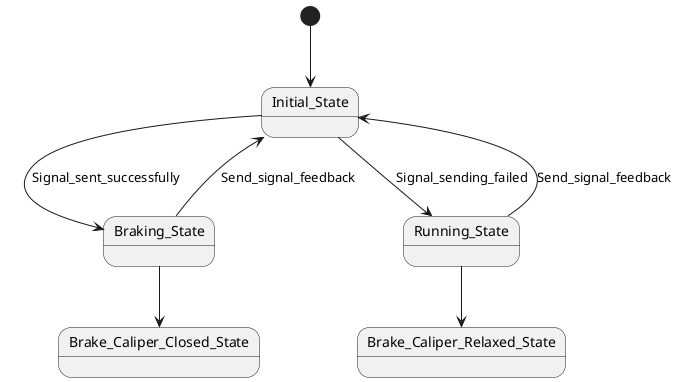
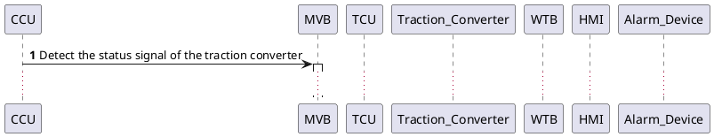

# `baselines` 双绿数据集下载、解析与 `parquet` 化记录

本文记录 `project_1_llm_state_machine_modeling/baselines/SUMMARY.md` 中“`BASELINE评估 = 🟢` 且 `数据集明确可获取 = 🟢`”的 4 组数据资源的本地获取、结构梳理、字段抽取、`parquet` 产物、示例和复现方式。对应论文分别是：

1. `Structure- and Event-Driven Frameworks for State Machine Modeling with Large Language Models` [1][2]
2. `Generating SysML Behavior Models via Large Language Models: an Empirical Study` [3][4]
3. `System Architects Are not Alone Anymore: Automatic System Modeling with AI` [5][6]
4. `Requirements Capture and Evaluation in Nimbus: The Light-Control Case Study` [7][8]

## 1. 本次新增产物

本次所有产物都放在同名资产目录：

`./2026-04-15-01-03-52-AI-讨论-baselines双绿数据集下载解析与parquet化.assets/`

核心文件如下：

| 文件 | 作用 |
| --- | --- |
| [build_baseline_double_green_parquets.py](./2026-04-15-01-03-52-AI-讨论-baselines双绿数据集下载解析与parquet化.assets/build_baseline_double_green_parquets.py) | 统一抽取脚本，负责把 4 组数据源转换成全部 `parquet` |
| [baseline_double_green_dataset_catalog.parquet](./2026-04-15-01-03-52-AI-讨论-baselines双绿数据集下载解析与parquet化.assets/baseline_double_green_dataset_catalog.parquet) | 总目录，汇总每个数据集的样本粒度、规模、元模型和完整性状态 |
| [llms_emp_raw_samples.parquet](./2026-04-15-01-03-52-AI-讨论-baselines双绿数据集下载解析与parquet化.assets/llms_emp_raw_samples.parquet) | `llms_emp` 原始公开账本 107 行 |
| [llms_emp_complete_samples.parquet](./2026-04-15-01-03-52-AI-讨论-baselines双绿数据集下载解析与parquet化.assets/llms_emp_complete_samples.parquet) | `llms_emp` 清洗后 98 个可直接实验样本 |
| [ttool_ai_models.parquet](./2026-04-15-01-03-52-AI-讨论-baselines双绿数据集下载解析与parquet化.assets/ttool_ai_models.parquet) | `ttool-ai` 的 15 个完整 AVATAR 设计模型变体 |
| [ttool_ai_state_machine_panels.parquet](./2026-04-15-01-03-52-AI-讨论-baselines双绿数据集下载解析与parquet化.assets/ttool_ai_state_machine_panels.parquet) | `ttool-ai` 的 122 个状态机面板 |
| [ttool_ai_states.parquet](./2026-04-15-01-03-52-AI-讨论-baselines双绿数据集下载解析与parquet化.assets/ttool_ai_states.parquet) | `ttool-ai` 摊平后的 708 个状态节点 |
| [ttool_ai_transitions.parquet](./2026-04-15-01-03-52-AI-讨论-baselines双绿数据集下载解析与parquet化.assets/ttool_ai_transitions.parquet) | `ttool-ai` 摊平后的 798 条迁移 |
| [light_control_nimbus_documents.parquet](./2026-04-15-01-03-52-AI-讨论-baselines双绿数据集下载解析与parquet化.assets/light_control_nimbus_documents.parquet) | `Light Control` 的两份原始文档全文 |
| [light_control_nimbus_fragments.parquet](./2026-04-15-01-03-52-AI-讨论-baselines双绿数据集下载解析与parquet化.assets/light_control_nimbus_fragments.parquet) | `Light Control` 重建后的 4 个可实验片段 |
| [light_control_nimbus_variables.parquet](./2026-04-15-01-03-52-AI-讨论-baselines双绿数据集下载解析与parquet化.assets/light_control_nimbus_variables.parquet) | `Light Control` 的 17 个 monitored / controlled variables |
| [light_control_nimbus_states.parquet](./2026-04-15-01-03-52-AI-讨论-baselines双绿数据集下载解析与parquet化.assets/light_control_nimbus_states.parquet) | `Light Control` 的 20 个层次状态节点 |
| [light_control_nimbus_rules.parquet](./2026-04-15-01-03-52-AI-讨论-baselines双绿数据集下载解析与parquet化.assets/light_control_nimbus_rules.parquet) | `Light Control` 的 16 条 RSML-e 规则 |
| [structure_event_driven_cases.parquet](./2026-04-15-01-03-52-AI-讨论-baselines双绿数据集下载解析与parquet化.assets/structure_event_driven_cases.parquet) | `Structure/Event-Driven` 的 9 个公开描述样本 |
| [structure_event_driven_reference_solutions.parquet](./2026-04-15-01-03-52-AI-讨论-baselines双绿数据集下载解析与parquet化.assets/structure_event_driven_reference_solutions.parquet) | `Structure/Event-Driven` 中可恢复的 6 个 Umple 参考解 |
| [structure_event_driven_metrics.parquet](./2026-04-15-01-03-52-AI-讨论-baselines双绿数据集下载解析与parquet化.assets/structure_event_driven_metrics.parquet) | `Structure/Event-Driven` 的 512 条逐组件评测记录 |

## 2. 统一复现方式

### 2.1 原始数据获取

本次使用的临时原始目录是 `/tmp/baseline_double_green/raw`。若后续重跑，推荐仍使用这个目录，命令如下。

`llms_emp` 原始数据 [3][4]：

```bash
mkdir -p /tmp/baseline_double_green/raw
gdown --folder 'https://drive.google.com/drive/folders/10eo8KDqlBlkQZxPpPCB7R3-aBQZ7Rsm6' \
  -O /tmp/baseline_double_green/raw/llms_emp_gmodel
```

`ttool-ai` 原始数据 [5][6]：

```bash
git clone https://github.com/zebradile/ttool-ai /tmp/baseline_double_green/raw/ttool-ai
```

`Nimbus Light Control` 原始论文与原始案例 [7][8]：

```bash
curl -L 'https://www-users.cse.umn.edu/~heimdahl/csci8801-fall06/readings/light-case-jucs.pdf' \
  -o /tmp/baseline_double_green/raw/light-case-jucs.pdf
curl -L 'https://www.st.cs.uni-saarland.de/edu/seminare/2005/advanced/papers/Light%20Control%20Case%20Study.pdf' \
  -o /tmp/baseline_double_green/raw/light-control-original-case-study.pdf
python -m tools.pdf_extractor \
  -i /tmp/baseline_double_green/raw/light-case-jucs.pdf \
  -o /tmp/baseline_double_green/raw/light-case-jucs.txt \
  -m text
python -m tools.pdf_extractor \
  -i /tmp/baseline_double_green/raw/light-control-original-case-study.pdf \
  -o /tmp/baseline_double_green/raw/light-control-original-case-study.txt \
  -m text
```

`Structure/Event-Driven` 匿名工件 [1][2]：

```bash
curl -L \
  'https://r.jina.ai/http://anonymous.4open.science/api/repo/llm_state_machine_modeling/file/backend/resources/state_machine_descriptions.py' \
  -o /tmp/baseline_double_green/raw/state_machine_descriptions.py
curl -L \
  'https://r.jina.ai/http://anonymous.4open.science/api/repo/llm_state_machine_modeling/file/backend/resources/n_shot_examples_single_prompt.py' \
  -o /tmp/baseline_double_green/raw/n_shot_examples_single_prompt.py
curl -L \
  'https://anonymous.4open.science/api/repo/llm_state_machine_modeling/file/Paper%20Experiment%20Resources/Final%20Detailed%20F1-Scores.xlsx' \
  -o /tmp/baseline_double_green/raw/llm_state_machine_final_f1_scores.xlsx
```

说明：

- 匿名工件的官方文件接口在实测中存在 `429` 限流与子目录不可枚举的问题，因此这里使用了 `r.jina.ai` 文本镜像去拉取 `.py` 文本文件。
- `Final Detailed F1-Scores.xlsx` 可以直接下载，但匿名源并没有稳定暴露 `Reference Solutions/` 的目录列表；这会影响 3 个案例参考解的完整恢复，后文会单独说明。

### 2.2 重新生成全部 `parquet`

```bash
python \
  project_1_llm_state_machine_modeling/discussions/2026-04-15-01-03-52-AI-讨论-baselines双绿数据集下载解析与parquet化.assets/build_baseline_double_green_parquets.py \
  --raw-root /tmp/baseline_double_green/raw \
  --output-dir \
  project_1_llm_state_machine_modeling/discussions/2026-04-15-01-03-52-AI-讨论-baselines双绿数据集下载解析与parquet化.assets
```

脚本不会覆写 Markdown，只会重新计算所有 `parquet`。

## 3. 数据集一：`llms_emp`

### 3.1 原始来源、输入输出与最终元模型

该数据集来自 `Generating SysML Behavior Models via Large Language Models: an Empirical Study` 的公开 `G_Model` 数据集 [3][4]。论文中明确说明作者从论文、书籍和开源项目中筛选行为模型，再统一重建为 `PlantUML` 形式，并补写对应自然语言需求描述 [3]。

该数据集的最终产物不是单一状态机，而是三类 `SysML v1.6` 行为模型：

| 图类型 | 最终元模型 | 公开编码形式 |
| --- | --- | --- |
| `stm` | SysML state machine | PlantUML |
| `act` | SysML activity diagram | PlantUML |
| `sd` | SysML sequence diagram | PlantUML |

因此，这个数据集适合做两类后续实验：

1. 行为模型通用生成实验：`requirements_description -> PlantUML`
2. 只保留状态机子集的专门实验：对 `diagram_type == "stm"` 再过滤

### 3.2 本地抽取结果

本次生成了两个 `parquet`：

| `parquet` | 作用 | 规模 |
| --- | --- | --- |
| [llms_emp_raw_samples.parquet](./2026-04-15-01-03-52-AI-讨论-baselines双绿数据集下载解析与parquet化.assets/llms_emp_raw_samples.parquet) | 原始账本完整镜像 | 107 行 |
| [llms_emp_complete_samples.parquet](./2026-04-15-01-03-52-AI-讨论-baselines双绿数据集下载解析与parquet化.assets/llms_emp_complete_samples.parquet) | 删除占位行与缺失输出后的实验子集 | 98 行 |

清洗后的 98 行图类型分布如下：

- `sd = 39`
- `stm = 38`
- `act = 21`

原始账本里保留了两个很重要的“脏数据事实”：

1. 末尾存在占位行 `to be continue ......`
2. 有 9 行缺失 `PlantUML` 输出，因此不适合直接当完整监督样本

### 3.3 `parquet` 字段

`llms_emp_raw_samples.parquet` 与 `llms_emp_complete_samples.parquet` 字段一致，核心字段如下：

| 字段 | 含义 |
| --- | --- |
| `row_id` | 原始 Excel 行号 |
| `model_name` | 样本名称 |
| `model_source` | 来源领域 / 书籍 / 论文 / 项目 |
| `requirements_description` | 输入需求文本 |
| `plantuml_code` | 输出 PlantUML 代码 |
| `diagram_type` | `stm / act / sd / other / missing` |
| `output_metamodel` | 最终元模型说明 |
| `selection_flag` | 原表里的 `Selected/selected` 标记 |
| `diagram_annotation` | 原表里的补注列，例如 `act` |
| `is_placeholder` | 是否为末尾占位行 |
| `has_requirements` | 是否存在输入需求 |
| `has_output_model` | 是否存在输出 PlantUML |
| `is_complete_sample` | 是否可直接做监督实验 |
| `requirements_char_count` | 输入长度 |
| `plantuml_char_count` | 输出长度 |
| `basic_state_count` | 对状态机的粗粒度状态数估计 |
| `basic_transition_count` | 对状态机的粗粒度迁移数估计 |
| `basic_participant_count` | 对时序图的 participant 数估计 |
| `basic_message_count` | 对时序图的消息数估计 |
| `basic_activity_action_count` | 对活动图动作节点数估计 |
| `basic_decision_count` | 对活动图判断节点数估计 |

### 3.4 三个真实完整例子

#### 例 1：`row_id = 2`，基础制动装置状态机

- `model_name`: `State machine diagram of basic braking device subsystem`
- `diagram_type`: `stm`
- `model_source`: `HSTBS`
- 输入是 3 条自然语言要求，输出是一个带初始结点、制动态、运行态和钳夹态的状态机。

输入片段：

```text
1 This state machine model represents the train's basic braking device...
2 When the basic braking device receives a brake signal, it transitions from the initial state to the braking state...
3 After entering the braking state, the system transitions to the brake caliper clamping state.
```

输出片段：



#### 例 2：`row_id = 3`，列车制动活动图

- `model_name`: `Activity diagram of train brake control`
- `diagram_type`: `act`
- `model_source`: `HSTBS`
- 输入描述了制动指令、常规/紧急信号分支、中央控制处理与执行机构动作。

输出片段：

```plantuml
@startuml
start
:Initiation of Braking Command;
if (Type of Braking Command?) then (Routine)
 :Generate Routine Braking Signal;
else (Emergency)
 :Generate Emergency Braking Signal;
endif
:Send Braking Signal to Central Control System;
:Central Control System processes the signal;
:Calculate Braking Force and Electro-Pneumatic Distribution;
...
stop
@enduml
```

#### 例 3：`row_id = 1`，整流检测时序图

- `model_name`: `TCU Rectification Detection Sequence Diagram`
- `diagram_type`: `sd`
- `model_source`: `EMUTC`
- 输入描述 `CCU / MVB / TCU / Rectifier / WTB / HMI` 的消息交换，输出是 7 个 lifeline 和 10 条消息的时序图。

输出片段：



### 3.5 Python 加载方式

原始 Excel：

```python
from pathlib import Path
import pandas as pd

raw_path = Path("/tmp/baseline_double_green/raw/llms_emp_gmodel/Dataset.xlsx")
raw_df = pd.read_excel(raw_path)
print(raw_df.columns.tolist())
```

加载实验子集 `parquet`：

```python
from pathlib import Path
import pandas as pd

assets = Path(
    "project_1_llm_state_machine_modeling/discussions/"
    "2026-04-15-01-03-52-AI-讨论-baselines双绿数据集下载解析与parquet化.assets"
)
df = pd.read_parquet(assets / "llms_emp_complete_samples.parquet")

stm_df = df[df["diagram_type"] == "stm"].copy()
print(df.shape, stm_df.shape)
print(df[["row_id", "model_name", "diagram_type"]].head())
```

## 4. 数据集二：`ttool-ai`

### 4.1 原始来源、输入输出与最终元模型

`ttool-ai` 来自 `System Architects Are not Alone Anymore: Automatic System Modeling with AI` 的公开 GitHub 工件 [5][6]。论文的最终产物不是单个状态机，而是 `TTool` 的 `AVATAR Design` 模型：一个设计模型内部同时包含块图和多个 `AVATARStateMachineDiagramPanel` [5][6]。

因此，这个数据集的最终元模型必须写清楚：

- 不是普通 `PlantUML`
- 也不是单纯的 `SysML state machine`
- 而是 `TTool AVATAR design model`

其序列化格式是 TTool XML，根节点为 `TURTLEGMODELING`，每个 `Modeling` 对应一份 AI 生成设计变体。

### 4.2 本地抽取结果

本次从公开仓库中只保留论文主体使用的 3 个案例：

1. `platooning`
2. `AutomatedBraking`
3. `spacebasedsystem`

最终得到：

- 15 个完整设计变体，见 [ttool_ai_models.parquet](./2026-04-15-01-03-52-AI-讨论-baselines双绿数据集下载解析与parquet化.assets/ttool_ai_models.parquet)
- 122 个状态机面板，见 [ttool_ai_state_machine_panels.parquet](./2026-04-15-01-03-52-AI-讨论-baselines双绿数据集下载解析与parquet化.assets/ttool_ai_state_machine_panels.parquet)
- 708 个状态节点，见 [ttool_ai_states.parquet](./2026-04-15-01-03-52-AI-讨论-baselines双绿数据集下载解析与parquet化.assets/ttool_ai_states.parquet)
- 798 条迁移，见 [ttool_ai_transitions.parquet](./2026-04-15-01-03-52-AI-讨论-baselines双绿数据集下载解析与parquet化.assets/ttool_ai_transitions.parquet)

### 4.3 `parquet` 字段

| `parquet` | 关键字段 | 含义 |
| --- | --- | --- |
| `ttool_ai_models.parquet` | `case_id`, `variant_name`, `input_spec_text`, `raw_xml`, `block_panel_names_json`, `state_machine_panel_names_json` | 每个完整 AVATAR 设计变体 |
| `ttool_ai_state_machine_panels.parquet` | `panel_id`, `panel_name`, `state_count`, `transition_count`, `nonempty_guard_count`, `raw_panel_xml` | 每个状态机面板 |
| `ttool_ai_states.parquet` | `node_id`, `node_type`, `node_name`, `x`, `y`, `connecting_point_ids_json` | 摊平后的状态节点与起始伪状态 |
| `ttool_ai_transitions.parquet` | `source_node_name`, `target_node_name`, `guard_or_trigger`, `actions`, `after_min`, `after_max` | 摊平后的迁移边和标签 |

说明：

- `node_type = start_state` 时，`node_name` 可能是 `null` 或 `__start__` 语义占位。
- TTool XML 中迁移标签并不总是严格区分 `trigger` 和 `guard`，所以我把统一字段命名为 `guard_or_trigger`，避免过度假设。
- `raw_xml / raw_panel_xml / raw_component_xml / raw_connector_xml` 都保留了原始 XML 片段，后续如果要做更精细解析，可以直接继续处理。

### 4.4 三个真实完整例子

#### 例 1：`platooning / Platoon4 / Vehicle`

这是一个较复杂的车辆状态机面板，包含 10 个状态节点和 26 条迁移。解析结果里可以直接看到显式的动作状态和请求触发：

状态节点：

```text
JoiningPlatoon
SplittingPlatoon
EmergencyBraking
DetectingDistance
DetectingLane
BreakingOrChangingLane
Monitoring
CreatingPlatoon
Idle
Start
```

迁移片段：

```text
Idle -> createPlatoon()               guard_or_trigger = createPlatoonRequest
Idle -> joinPlatoon()                 guard_or_trigger = joinPlatoonRequest
Monitoring -> detectDistance()        guard_or_trigger = detectDistanceRequest
Monitoring -> splitPlatoon()          guard_or_trigger = splitPlatoonRequest
CreatingPlatoon -> Monitoring         guard_or_trigger = platoonCreationSuccess
CreatingPlatoon -> Idle               guard_or_trigger = platoonCreationFailure
```

#### 例 2：`automated_braking / System1 / Driver`

这个面板比较规整，适合作为“简单交通控制状态机”样本。它有 4 个普通状态和 1 个起始伪状态：

```text
Parking
Driving
Ready
Start
```

迁移关系：

```text
null -> Start
Start -> Ready
Ready -> Driving
Driving -> Parking
Parking -> Ready
```

#### 例 3：`space_based_system / System5 / Software`

这是最适合后续做复杂状态机学习的一个例子之一，节点多、触发明确：

状态节点：

```text
ComputeCRC
HandleBitFlip
ComputeTM
SendTM
EncipherTM
HandleTM
HandleRequest
DecipherTC
HandleTC
Idle
Start
```

迁移片段：

```text
Idle -> HandleTC        guard_or_trigger = requestData
Idle -> ComputeTM       guard_or_trigger = computeTM
Idle -> HandleBitFlip   guard_or_trigger = bitFlip
HandleTC -> DecipherTC
DecipherTC -> HandleRequest
HandleRequest -> HandleTM   guard_or_trigger = buildAnswer
EncipherTM -> SendTM
SendTM -> Idle
```

### 4.5 Python 加载方式

原始 Markdown 规范与 XML：

```python
from pathlib import Path
import xml.etree.ElementTree as ET

spec_path = Path("/tmp/baseline_double_green/raw/ttool-ai/platooning/platoonings.md")
xml_path = Path("/tmp/baseline_double_green/raw/ttool-ai/platooning/platoonings.xml")

spec_text = spec_path.read_text(encoding="utf-8")
root = ET.parse(xml_path).getroot()
modelings = root.findall("./Modeling")
print(spec_text[:300])
print(len(modelings), [m.attrib["nameTab"] for m in modelings])
```

加载 `parquet`：

```python
from pathlib import Path
import pandas as pd

assets = Path(
    "project_1_llm_state_machine_modeling/discussions/"
    "2026-04-15-01-03-52-AI-讨论-baselines双绿数据集下载解析与parquet化.assets"
)
models = pd.read_parquet(assets / "ttool_ai_models.parquet")
panels = pd.read_parquet(assets / "ttool_ai_state_machine_panels.parquet")
states = pd.read_parquet(assets / "ttool_ai_states.parquet")
transitions = pd.read_parquet(assets / "ttool_ai_transitions.parquet")

software_panels = panels[panels["panel_name"] == "Software"]
print(models.shape, panels.shape, states.shape, transitions.shape)
print(software_panels[["case_id", "variant_name", "state_count", "transition_count"]])
```

## 5. 数据集三：`Nimbus Light Control`

### 5.1 原始来源、输入输出与最终元模型

这一组数据不是仓库型 benchmark，而是经典单案例数据源：原始 `Dagstuhl` 灯光控制需求 [8]，加上 `Nimbus` 论文中的 `RSML-e` 需求建模与细化结果 [7]。因此这里不能机械地按“多样本表格”理解，而应视为：

1. 一个原始需求文档
2. 一个正式的 `RSML-e` 建模论文
3. 一组可追溯重建出来的片段级样本

这组数据的最终元模型也必须明确：

- 不是 UML
- 不是 PlantUML
- 而是 `RSML-e` state-based requirements model [7]

### 5.2 本地抽取结果

本次产物分为 5 张表：

| `parquet` | 规模 | 作用 |
| --- | --- | --- |
| [light_control_nimbus_documents.parquet](./2026-04-15-01-03-52-AI-讨论-baselines双绿数据集下载解析与parquet化.assets/light_control_nimbus_documents.parquet) | 2 行 | 保存原始案例和 Nimbus 论文全文 |
| [light_control_nimbus_fragments.parquet](./2026-04-15-01-03-52-AI-讨论-baselines双绿数据集下载解析与parquet化.assets/light_control_nimbus_fragments.parquet) | 4 行 | 保存可直接做实验的片段级样本 |
| [light_control_nimbus_variables.parquet](./2026-04-15-01-03-52-AI-讨论-baselines双绿数据集下载解析与parquet化.assets/light_control_nimbus_variables.parquet) | 17 行 | monitored / operator / controlled 变量字典 |
| [light_control_nimbus_states.parquet](./2026-04-15-01-03-52-AI-讨论-baselines双绿数据集下载解析与parquet化.assets/light_control_nimbus_states.parquet) | 20 行 | 图 6 与图 16 中可恢复的状态节点 |
| [light_control_nimbus_rules.parquet](./2026-04-15-01-03-52-AI-讨论-baselines双绿数据集下载解析与parquet化.assets/light_control_nimbus_rules.parquet) | 16 行 | 关键 RSML-e 赋值 / 迁移规则 |

### 5.3 `parquet` 字段

| `parquet` | 关键字段 | 含义 |
| --- | --- | --- |
| `documents` | `document_role`, `source_url`, `text` | 原始全文，便于以后重新抽取 |
| `fragments` | `fragment_id`, `abstraction_level`, `input_requirement_text`, `output_fragment_excerpt`, `source_line_refs_json` | 一个片段级监督样本 |
| `variables` | `variable_name`, `variable_group`, `range_or_type`, `description` | 变量字典 |
| `states` | `state_name`, `parent_state_name`, `depth` | 层次状态树 |
| `rules` | `target_variable`, `assigned_value`, `condition`, `abstraction_level` | 可直接用于规则学习或结构提取 |

### 5.4 三个真实完整例子

#### 例 1：`room_state_hierarchy_req`

输入需求覆盖 `U1 / U2 / U3 / U4 / U11 / U12 / FM1 / FM3 / FM6 / FM7 / FM8` [7][8]，输出是房间级 RSML-e 状态层次。

状态树核心节点：

```text
Light_Control_System_Room
  Light_Maintenance_Modes
    Room_Occupied
      Room_Occupied_Eq
        Maintain_Light_Scene
        User_Set_Mode
    Room_Empty
    Occupancy_Undetectable
  Chosen_Light_Scene
    Chosen1_LS / Chosen2_LS / Chosen3_LS / Default_LS
  Failure_Modes
    Ok / Failed
```

这说明该案例天然是“层次 + 并行”状态模型，不是平面 FSM [7]。

#### 例 2：`occupancy_and_timeout_req`

这是整个案例里最有价值的控制逻辑片段，直接体现 `T1 / T3 / reoccupy / facility-manager shutoff` 的耦合 [7][8]。

规则片段：

```text
Current_LS_Light_Level := Light_Level_InVar
  IF ..Room_Occupied_Eq IN_STATE User_Set_Mode

Current_LS_Light_Level := 0
  IF ..Light_Maintenance_Modes IN_STATE Room_Empty
  AND (TIME >= TIME_ENTERED(Room_Empty) + T3_InVar
       OR MESSAGE_AT(FacM_Shutoff))

Current_LS_Light_Level := Reoccupied_Light_Level()
  IF ..Room_Occupied_Eq IN_STATE Maintain_Light_Scene
  AND PREV_STEP(..Light_Maintenance_Modes IN_STATE Room_Occupied) = FALSE
```

#### 例 3：`occupied_in_soft_refinement`

这是 `REQ -> SOFT` 细化后的 `Occupied_In` 规则，直接把传感器故障与占用检测耦合起来 [7]。

规则片段：

```text
Occupied_In := Not_Occupied
  IF Motion_Detected_InVar = FALSE

Occupied_In := Occupied
  IF PREV_STEP(DoorSensor_InVar = kClosed)
  AND PREV_STEP(..Occupied_In IN_STATE Not_Occupied) = FALSE
  AND Motion_Detected_InVar = TRUE

Occupied_In := Not_Detectable
  IF PREV_STEP(DoorSensor_InVar = kClosed)
  AND PREV_STEP(..Occupied_In IN_STATE Not_Occupied) = TRUE
  AND Motion_Detected_InVar = TRUE
  AND DoorSensor_InVar = kClosed
```

### 5.5 Python 加载方式

原始文本：

```python
from pathlib import Path

original_case = Path("/tmp/baseline_double_green/raw/light-control-original-case-study.txt")
nimbus_case = Path("/tmp/baseline_double_green/raw/light-case-jucs.txt")

print(original_case.read_text(encoding="utf-8")[:1200])
print(nimbus_case.read_text(encoding="utf-8")[:1200])
```

加载 `parquet`：

```python
from pathlib import Path
import pandas as pd

assets = Path(
    "project_1_llm_state_machine_modeling/discussions/"
    "2026-04-15-01-03-52-AI-讨论-baselines双绿数据集下载解析与parquet化.assets"
)
fragments = pd.read_parquet(assets / "light_control_nimbus_fragments.parquet")
variables = pd.read_parquet(assets / "light_control_nimbus_variables.parquet")
rules = pd.read_parquet(assets / "light_control_nimbus_rules.parquet")

req_fragments = fragments[fragments["abstraction_level"] == "REQ"]
print(fragments[["fragment_id", "fragment_title", "abstraction_level"]])
print(variables[["variable_name", "variable_group"]].head())
print(rules[rules["fragment_id"] == "occupancy_and_timeout_req"])
```

## 6. 数据集四：`Structure- and Event-Driven ...`

### 6.1 原始来源、输入输出与最终元模型

这组数据来自 `Structure- and Event-Driven Frameworks for State Machine Modeling with Large Language Models` 的匿名公开工件 [1][2]。论文正文明确说明官方评测集有 8 个非结构化 reactive-system descriptions，每个配一份专家 ground truth UML state machine [1]。

这里的最终元模型必须区分两层：

1. 论文任务目标是 `UML state machine` [1]
2. 在匿名工件中，当前能恢复出来的完整参考解文本是 `Umple` 语法 [2]

因此，本次 `parquet` 的建模口径是：

- `structure_event_driven_cases.parquet`：保留原始自然语言描述
- `structure_event_driven_reference_solutions.parquet`：保留当前可访问的 Umple 参考解
- `structure_event_driven_metrics.parquet`：保留官方逐组件 `TP / FN / FP / Precision / Recall / F1`

### 6.2 本地抽取结果与完整性状态

当前一共恢复出 3 张表：

| `parquet` | 规模 | 说明 |
| --- | --- | --- |
| [structure_event_driven_cases.parquet](./2026-04-15-01-03-52-AI-讨论-baselines双绿数据集下载解析与parquet化.assets/structure_event_driven_cases.parquet) | 9 行 | 8 个论文正式案例 + 1 个工件额外案例 `ATAS` |
| [structure_event_driven_reference_solutions.parquet](./2026-04-15-01-03-52-AI-讨论-baselines双绿数据集下载解析与parquet化.assets/structure_event_driven_reference_solutions.parquet) | 6 行 | 5 个论文正式案例 + 1 个额外 `ATAS` 的完整 Umple 参考解 |
| [structure_event_driven_metrics.parquet](./2026-04-15-01-03-52-AI-讨论-baselines双绿数据集下载解析与parquet化.assets/structure_event_driven_metrics.parquet) | 512 行 | 4 种策略 × 2 个 LLM × 逐案例 × 逐组件的评测记录 |

当前完整性状态必须如实说明：

| 案例 | 描述 | 完整参考解 |
| --- | --- | --- |
| `Printer` | 有 | 有 |
| `Spa Manager` | 有 | 有 |
| `Dishwasher` | 有 | 有 |
| `Chess Clock` | 有 | 有 |
| `Automatic Bread Maker` | 有 | 无 |
| `Thermomix TM6` | 有 | 有 |
| `W-UMPLE` | 有 | 无 |
| `SSC7` | 有 | 无 |
| `ATAS` | 有 | 有，但它不是论文正式 8 案例之一 |

也就是说：

- 8 个论文正式案例的自然语言描述都已经恢复
- 官方指标表也已经完整恢复
- 但匿名工件对 `Reference Solutions/` 的目录和剩余文件并没有稳定公开，因此 `Automatic Bread Maker / W-UMPLE / SSC7` 三个正式案例目前只有描述和指标，没有完整参考解文本

这一点已经在 `structure_event_driven_cases.parquet` 的 `has_full_reference_solution` 与 `reference_solution_missing_reason` 两列中显式编码。

### 6.3 `parquet` 字段

| `parquet` | 关键字段 | 含义 |
| --- | --- | --- |
| `cases` | `case_id`, `case_name`, `is_paper_evaluation_case`, `system_description`, `has_full_reference_solution` | 案例主表 |
| `reference_solutions` | `case_id`, `reference_solution_text`, `umple_transition_count`, `umple_block_count` | 已恢复的 Umple 参考解 |
| `metrics` | `strategy_name`, `llm_name`, `component`, `tp`, `fn`, `fp`, `precision`, `recall`, `f1_score`, `image_reference` | 官方逐组件评测表 |

### 6.4 三个真实完整例子

#### 例 1：`Printer`

输入描述涉及上电、刷卡登录、扫描/打印、缺纸和卡纸恢复 [1][2]。

参考解开头：

```umple
class Printer{
 sm {
   Off {on -> On;}
   On{
     off -> Off;
     Idle {
       login(cardID) [!idAuthorized(cardID)] -> Idle;
       login(cardID) [idAuthorized(cardID)] / {action="none";} -> Ready;
     }
     Ready{
       logoff -> Idle;
       ...
```

#### 例 2：`Chess Clock`

输入描述涵盖 `flip / plus / minus / startStop / select / onOff` 六种事件，以及白方/黑方计时切换 [1][2]。

参考解片段：

```umple
class ChessClock {
  status {
    Off { onOff -> On; }
    On {
      GameSetup {
        TimingSelection {
          plus -> /{incrTimingProgram();} TimingSelection;
          minus -> /{decrTimingProgram();} TimingSelection;
        }
        ||
        WhiteKingStatus {
          WhiteKingOnLeft { flip -> WhiteKingOnRight; }
          WhiteKingOnRight { flip -> WhiteKingOnLeft; }
        }
      select -> ReadyToStart;
      }
      ...
```

#### 例 3：`Thermomix TM6`

输入描述涵盖运输模式、开关机、自动关机、称重、切碎、烹饪与加料循环 [1][2]。

参考解片段：

```umple
class Thermomix {
  sm {
    TransportationMode { selectorPressed -> On; }
    PreparingOff {
      selectorReleased -> On.H;
      after5sec -> Off;
    }
    Off { selectorPressed -> On; }
    On {
      selectorHeld -> PreparingOff;
      bowlRemoved -> On;
      Home {
        after14min30sec -> PreparingShutdown;
        start [!bowlRemoved()] / {action=setIngredients();} -> PromptToAdd;
      }
      ...
```

### 6.5 Python 加载方式

原始描述和参考解文本：

```python
from pathlib import Path
import re

raw = Path("/tmp/baseline_double_green/raw")
descriptions_text = (raw / "state_machine_descriptions.py").read_text(encoding="utf-8")
nshot_text = (raw / "n_shot_examples_single_prompt.py").read_text(encoding="utf-8")

desc_body = descriptions_text.split("Markdown Content:\n", 1)[1]
desc_pairs = re.findall(r'([A-Za-z0-9_]+)\\s*=\\s*\"\"\"(.*?)\"\"\"', desc_body, re.S)
print(len(desc_pairs))

code_body = nshot_text.split("Markdown Content:\n", 1)[1]
available_refs = re.findall(
    r'\"([A-Za-z0-9_]+)\":\\s*\\{\\s*\"system_description\":\\s*([A-Za-z0-9_]+),\\s*\"umple_code_solution\":\\s*\\'\\'\\'(.*?)\\'\\'\\'',
    code_body,
    re.S,
)
print(len(available_refs))
```

加载 `parquet`：

```python
from pathlib import Path
import pandas as pd

assets = Path(
    "project_1_llm_state_machine_modeling/discussions/"
    "2026-04-15-01-03-52-AI-讨论-baselines双绿数据集下载解析与parquet化.assets"
)
cases = pd.read_parquet(assets / "structure_event_driven_cases.parquet")
refs = pd.read_parquet(assets / "structure_event_driven_reference_solutions.parquet")
metrics = pd.read_parquet(assets / "structure_event_driven_metrics.parquet")

paper_cases = cases[cases["is_paper_evaluation_case"]]
complete_cases = paper_cases[paper_cases["has_full_reference_solution"]]

print(cases[["case_id", "case_name", "has_full_reference_solution"]])
print(metrics.groupby(["strategy_name", "llm_name"])["f1_score"].mean())
print(refs[["case_id", "umple_transition_count", "umple_block_count"]])
```

## 7. 统一使用建议

如果后续要把 4 组数据统一接到新的实验里，我建议按下面方式使用：

1. 先读 [baseline_double_green_dataset_catalog.parquet](./2026-04-15-01-03-52-AI-讨论-baselines双绿数据集下载解析与parquet化.assets/baseline_double_green_dataset_catalog.parquet)，决定你要跑的是“行为图通用生成”还是“纯状态机生成”。
2. 如果要做纯状态机，优先使用：
   - `llms_emp_complete_samples.parquet` 里 `diagram_type == "stm"` 的子集
   - `ttool_ai_state_machine_panels.parquet` + `ttool_ai_states.parquet` + `ttool_ai_transitions.parquet`
   - `light_control_nimbus_fragments.parquet` 里的 `REQ/SOFT` 片段
   - `structure_event_driven_cases.parquet` 与 `structure_event_driven_reference_solutions.parquet` 的可用子集
3. 如果要做“输入文本 -> 完整行为模型代码”，优先使用：
   - `llms_emp_complete_samples.parquet`
   - `structure_event_driven_cases.parquet` + `structure_event_driven_reference_solutions.parquet`
4. 如果要做“生成后评测”，直接使用 `structure_event_driven_metrics.parquet` 里的官方组件级指标口径，或者仿照其字段重新评分。

统一加载入口示例：

```python
from pathlib import Path
import pandas as pd

assets = Path(
    "project_1_llm_state_machine_modeling/discussions/"
    "2026-04-15-01-03-52-AI-讨论-baselines双绿数据集下载解析与parquet化.assets"
)

catalog = pd.read_parquet(assets / "baseline_double_green_dataset_catalog.parquet")
llms_emp = pd.read_parquet(assets / "llms_emp_complete_samples.parquet")
ttool_panels = pd.read_parquet(assets / "ttool_ai_state_machine_panels.parquet")
light_fragments = pd.read_parquet(assets / "light_control_nimbus_fragments.parquet")
structure_cases = pd.read_parquet(assets / "structure_event_driven_cases.parquet")

print(catalog)
print(llms_emp.shape, ttool_panels.shape, light_fragments.shape, structure_cases.shape)
```

## 参考文献

[1] Samer Abdulkarim, Evan Boyd, Karl Bridi, Alec Tufenkjian, Boqi Chen, Gunter Mussbacher. “Structure- and Event-Driven Frameworks for State Machine Modeling with Large Language Models.” *arXiv*, 2026. DOI: 10.48550/arXiv.2604.00275. [论文链接](https://arxiv.org/abs/2604.00275)

[2] Anonymous. “Paper artifacts for Structure- and Event-Driven Frameworks for State Machine Modeling with Large Language Models.” Anonymous 4open artifact repository. [工件入口](https://anonymous.4open.science/r/llm_state_machine_modeling/)

[3] Yuan Wang, Ning Ge, Jiangxi Liu, Zhilong Cao, Zheping Chen, Chunming Hu. “Generating SysML Behavior Models via Large Language Models: an Empirical Study.” *Internetware 2025*, pp. 366-377, 2025. DOI: 10.1145/3755881.3755926. [论文链接](https://dl.acm.org/doi/10.1145/3755881.3755926)

[4] Yuan Wang et al. “G_Model SysML behavior model dataset.” Google Drive public folder linked from [3]. [数据集链接](https://drive.google.com/drive/folders/10eo8KDqlBlkQZxPpPCB7R3-aBQZ7Rsm6)

[5] Ludovic Apvrille, Bastien Sultan. “System Architects Are not Alone Anymore: Automatic System Modeling with AI.” *MODELSWARD 2024*, 2024. [会议页面](https://www.scitepress.org/PublishedPapers/2024/123917/)

[6] zebradile. “ttool-ai.” GitHub repository for the public TTool-AI artifacts referenced by [5]. [仓库链接](https://github.com/zebradile/ttool-ai)

[7] Jeffrey M. Thompson, Michael W. Whalen, Mats P. E. Heimdahl. “Requirements Capture and Evaluation in Nimbus: The Light-Control Case Study.” *Journal of Universal Computer Science*, 6(7), 2000. [PDF 链接](https://www-users.cse.umn.edu/~heimdahl/csci8801-fall06/readings/light-case-jucs.pdf)

[8] “Dagstuhl Seminar Light Control System Case Study.” Original challenge problem statement used by [7]. [PDF 链接](https://www.st.cs.uni-saarland.de/edu/seminare/2005/advanced/papers/Light%20Control%20Case%20Study.pdf)
