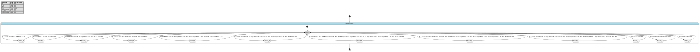

# Case `008` 🌡️ — Twelve-State EMS for LNG-Ship Hybrid Power Dispatch

**Bucket**: EFSM-interlock  |  **Paper**: #157 `state-transitions-logical-design-for-hybrid-energy-generation-with-renewable-energy-sources-in-lng-ship`

- [STM.md case section](../../../sources/state-transitions-logical-design-for-hybrid-energy-generation-with-renewable-energy-sources-in-lng-ship/STM.md)
- [paper PDF](../../../sources/state-transitions-logical-design-for-hybrid-energy-generation-with-renewable-energy-sources-in-lng-ship/paper.pdf)
- [expansion NL JSON (含 provenance)](../expansions/008.json)
- [codex 起草笔记](../ref_stms/codex_drafts/008.notes.md)

## 1. 英文 NL（含 inline [E] 溯源 markers）

> 这是 codex 评审阶段生成的扩充 NL（commit `259e6ea7`），每条 substantive 信息带 `[En]` 标记。完整 provenance 表见 [expansion JSON](../expansions/008.json)。

The LNG-ship EMS manages a ship energy system with PVs, WECs, DGs, LNG, batteries, and time-varying ship loads, issuing cut-in and cut-out commands for generating units and loads [E1]. It controls power dispatch between generating units and load demand during changing time periods and operating conditions, dynamically switching states to maintain power balance as resources and demands vary [E2]. The FSM reads load demand PL, renewable contributions Ppv and Pw, battery state of charge SoC, and engine capacity bounds such as eng3_Pmax, then returns requested generator power, battery discharge or charging power, and spare power [E3]. The twelve finite states are selected by logical transition conditions over demand, generation, capacity, and SoC [E4]. When Ppv + Pw covers PL, the EMS serves all ship demand from RES and charges batteries while SoC is below 0.95 [E5], or treats residual renewable power as spare once SoC is at least 0.95 [E6]. When Ppv + Pw is below PL, dispatch follows the stated priority: RES first [E7], batteries when SoC is suitable [E8], LNG before diesel units [E9], and DG1/DG2 only as the last priority [E10]. Low-SoC branches add explicit charging margins, including Pgmax/5 in an LNG-covered case [E11] and Pd1max/10 in later diesel-generator cases [E12]. When PL = 0, RES production is sent to battery charging [E13] or to spare power according to SoC thresholds [E14]. The overload completion state is illegal: if extreme demand exceeds all RES and thermal resources, EMS activates all thermal generating units, covers the lack by battery discharge, and the state shall never occur in practice [E15].

## 2. 中文 NL 译文（claude 翻译，保留 [En] markers）

LNG 船舶 EMS 管理一套包含光伏、波浪能转换装置、柴油发电机、LNG 发电机、蓄电池以及随时间变化的船舶负载的船舶能量系统，向发电单元和负载发出投入与切除指令 [E1]。它在不断变化的时段和运行工况下控制发电单元与负载需求之间的功率调度，并随资源和需求的变化动态切换状态以维持功率平衡 [E2]。该 FSM 读取负载需求 PL、可再生能源贡献 Ppv 与 Pw、蓄电池荷电状态 SoC 以及诸如 eng3_Pmax 等机组容量上下限，然后返回所需的发电机功率、蓄电池放电或充电功率以及备用功率 [E3]。十二个有限状态由关于需求、发电、容量与 SoC 的逻辑迁移条件来选择 [E4]。当 Ppv + Pw 能够覆盖 PL 时，EMS 由可再生能源满足全部船舶需求，并在 SoC 低于 0.95 时为蓄电池充电 [E5]，或在 SoC 达到 0.95 及以上时将剩余的可再生功率作为备用功率处理 [E6]。当 Ppv + Pw 低于 PL 时，调度遵循既定优先级：可再生能源优先 [E7]，在 SoC 适宜时使用蓄电池 [E8]，LNG 机组先于柴油机组 [E9]，DG1/DG2 仅作为最后优先级 [E10]。低 SoC 分支增加了显式的充电裕量，包括在 LNG 覆盖情形中的 Pgmax/5 [E11] 以及在后续柴油发电机情形中的 Pd1max/10 [E12]。当 PL = 0 时，可再生能源出力根据 SoC 阈值被送入蓄电池充电 [E13] 或作为备用功率 [E14]。过载完成状态属于非法状态：若极端需求超过所有可再生及热力资源，EMS 将启动全部热力发电单元，由蓄电池放电补足缺额，该状态在实际运行中不应发生 [E15]。

## 3. Reference pyfcstm STM (codex 起草，待用户签字)

### 3.1 状态机图（pyfcstm visualize SVG）



PlantUML 源文件：[`../diagrams/008.puml`](../diagrams/008.puml)

### 3.2 pyfcstm DSL 源码

```pyfcstm
def float PL = 0.0;
def float Ppv = 0.0;
def float Pw = 0.0;
def float SoC = 0.25;
def float eng1_Pmax = 0.0;
def float eng2_Pmax = 0.0;
def float eng3_Pmax = 0.0;

state LNGShipEMS {
    pseudo state Select;

    [*] -> Select;

    state State1_1 {
        enter abstract CommandRESLoadAndBatteryCharge;
    }

    state State1_2 {
        enter abstract CommandRESLoadAndSpare;
    }

    state State2_1 {
        enter abstract CommandRESAndBatteryDischargeWithLNGStandby;
    }

    state State2_2 {
        enter abstract CommandLNGWithPgmaxFifthBatteryCharge;
    }

    state State2_3 {
        enter abstract CommandLNGAndBatteryDischargeWithDG1Standby;
    }

    state State2_4 {
        enter abstract CommandLNGDG1WithPd1maxTenthBatteryCharge;
    }

    state State2_5 {
        enter abstract CommandLNGDG1AndBatteryDischargeWithDG2Standby;
    }

    state State2_6 {
        enter abstract CommandAllThermalWithPd1maxTenthBatteryCharge;
    }

    state State2_7 {
        enter abstract CommandAllThermalAndBatteryDischargeIllegalOverload;
    }

    state State3_1 {
        enter abstract CommandNoLoadRESBatteryCharge;
    }

    state State3_2 {
        enter abstract CommandNoLoadPVChargeWindSpare;
    }

    state State3_3 {
        enter abstract CommandNoLoadAllRESSpare;
    }

    Select -> State3_1 : if [PL == 0.0 && SoC < 0.5];
    Select -> State3_2 : if [PL == 0.0 && SoC >= 0.5 && SoC < 0.95];
    Select -> State3_3 : if [PL == 0.0 && SoC >= 0.95];
    Select -> State1_1 : if [PL > 0.0 && Ppv + Pw >= PL && SoC < 0.95];
    Select -> State1_2 : if [PL > 0.0 && Ppv + Pw >= PL && SoC >= 0.95];
    Select -> State2_1 : if [PL > 0.0 && Ppv + Pw < PL && eng3_Pmax > PL - Ppv - Pw && SoC > 0.5];
    Select -> State2_2 : if [PL > 0.0 && Ppv + Pw < PL && eng3_Pmax > PL - Ppv - Pw && SoC < 0.5];
    Select -> State2_3 : if [PL > 0.0 && Ppv + Pw < PL && eng3_Pmax < PL - Ppv - Pw && eng1_Pmax + eng3_Pmax > PL - Ppv - Pw && SoC > 0.5];
    Select -> State2_4 : if [PL > 0.0 && Ppv + Pw < PL && eng3_Pmax < PL - Ppv - Pw && eng1_Pmax + eng3_Pmax > PL - Ppv - Pw && SoC < 0.5];
    Select -> State2_5 : if [PL > 0.0 && Ppv + Pw < PL && eng3_Pmax < PL - Ppv - Pw && eng1_Pmax + eng3_Pmax < PL - Ppv - Pw && eng1_Pmax + eng2_Pmax + eng3_Pmax > PL - Ppv - Pw && SoC > 0.5];
    Select -> State2_6 : if [PL > 0.0 && Ppv + Pw < PL && eng3_Pmax < PL - Ppv - Pw && eng1_Pmax + eng3_Pmax < PL - Ppv - Pw && eng1_Pmax + eng2_Pmax + eng3_Pmax > PL - Ppv - Pw && SoC < 0.5];
    Select -> State2_7 : if [PL > 0.0 && Ppv + Pw < PL && eng3_Pmax < PL - Ppv - Pw && eng1_Pmax + eng3_Pmax < PL - Ppv - Pw && eng1_Pmax + eng2_Pmax + eng3_Pmax < PL - Ppv - Pw];

    State1_1 -> Select;
    State1_2 -> Select;
    State2_1 -> Select;
    State2_2 -> Select;
    State2_3 -> Select;
    State2_4 -> Select;
    State2_5 -> Select;
    State2_6 -> Select;
    State2_7 -> Select;
    State3_1 -> Select;
    State3_2 -> Select;
    State3_3 -> Select;
}

```

**codex 自报 C-axis 使用情况**:
- C1: ✗
- C2: ✓
- C3: ✗
- C4: ✓

**codex 自报 scenarios 覆盖情况**:
- 模式数: 12
- guards 数: 12
- fault paths 数: 1
- per-cycle 行为数: 0
- 硬件 effectors 数: 12

## 4. Test scenarios（覆盖 NL 全特性，必须 100% pass）

```json
{
  "scenarios": [
    {
      "name": "res_charge_soc_below_full",
      "description": "覆盖 [E5]：RES 覆盖正负载且 SoC 低于 0.95 时进入 State1_1 并执行电池充电命令。",
      "initial_state": null,
      "initial_vars": {"PL": 100.0, "Ppv": 60.0, "Pw": 40.0, "SoC": 0.94, "eng1_Pmax": 0.0, "eng2_Pmax": 0.0, "eng3_Pmax": 0.0},
      "steps": [
        {
          "before_cycles": 0,
          "events": [],
          "expected_state": "LNGShipEMS.State1_1",
          "expected_vars": {"PL": 100.0, "Ppv": 60.0, "Pw": 40.0, "SoC": 0.94, "eng1_Pmax": 0.0, "eng2_Pmax": 0.0, "eng3_Pmax": 0.0},
          "name": "dispatch_to_state1_1"
        }
      ]
    },
    {
      "name": "res_spare_soc_full",
      "description": "覆盖 [E6]：RES 覆盖正负载且 SoC 到达 0.95 阈值时进入 State1_2，把剩余 RES 作为 spare。",
      "initial_state": null,
      "initial_vars": {"PL": 100.0, "Ppv": 60.0, "Pw": 40.0, "SoC": 0.95, "eng1_Pmax": 0.0, "eng2_Pmax": 0.0, "eng3_Pmax": 0.0},
      "steps": [
        {
          "before_cycles": 0,
          "events": [],
          "expected_state": "LNGShipEMS.State1_2",
          "expected_vars": {"PL": 100.0, "Ppv": 60.0, "Pw": 40.0, "SoC": 0.95, "eng1_Pmax": 0.0, "eng2_Pmax": 0.0, "eng3_Pmax": 0.0},
          "name": "dispatch_to_state1_2"
        }
      ]
    },
    {
      "name": "lng_standby_battery_discharge",
      "description": "覆盖 [E7][E8][E9]：RES 不足、LNG 容量刚好大于缺口且 SoC 适合放电时进入 State2_1。",
      "initial_state": null,
      "initial_vars": {"PL": 100.0, "Ppv": 30.0, "Pw": 30.0, "SoC": 0.51, "eng1_Pmax": 0.0, "eng2_Pmax": 0.0, "eng3_Pmax": 41.0},
      "steps": [
        {
          "before_cycles": 0,
          "events": [],
          "expected_state": "LNGShipEMS.State2_1",
          "expected_vars": {"PL": 100.0, "Ppv": 30.0, "Pw": 30.0, "SoC": 0.51, "eng1_Pmax": 0.0, "eng2_Pmax": 0.0, "eng3_Pmax": 41.0},
          "name": "dispatch_to_state2_1"
        }
      ]
    },
    {
      "name": "lng_charge_pgmax_margin",
      "description": "覆盖 [E9][E11]：RES 不足、LNG 可覆盖缺口且 SoC 低于 0.5 时进入 State2_2，请求 Pgmax/5 充电裕量。",
      "initial_state": null,
      "initial_vars": {"PL": 100.0, "Ppv": 30.0, "Pw": 30.0, "SoC": 0.49, "eng1_Pmax": 0.0, "eng2_Pmax": 0.0, "eng3_Pmax": 41.0},
      "steps": [
        {
          "before_cycles": 0,
          "events": [],
          "expected_state": "LNGShipEMS.State2_2",
          "expected_vars": {"PL": 100.0, "Ppv": 30.0, "Pw": 30.0, "SoC": 0.49, "eng1_Pmax": 0.0, "eng2_Pmax": 0.0, "eng3_Pmax": 41.0},
          "name": "dispatch_to_state2_2"
        }
      ]
    },
    {
      "name": "lng_active_dg1_standby_battery",
      "description": "覆盖 [E8][E9][E10]：LNG 单独不足、LNG+DG1 大于缺口且 SoC 适合放电时进入 State2_3。",
      "initial_state": null,
      "initial_vars": {"PL": 150.0, "Ppv": 20.0, "Pw": 30.0, "SoC": 0.51, "eng1_Pmax": 2.0, "eng2_Pmax": 0.0, "eng3_Pmax": 99.0},
      "steps": [
        {
          "before_cycles": 0,
          "events": [],
          "expected_state": "LNGShipEMS.State2_3",
          "expected_vars": {"PL": 150.0, "Ppv": 20.0, "Pw": 30.0, "SoC": 0.51, "eng1_Pmax": 2.0, "eng2_Pmax": 0.0, "eng3_Pmax": 99.0},
          "name": "dispatch_to_state2_3"
        }
      ]
    },
    {
      "name": "dg1_charge_pd1_margin",
      "description": "覆盖 [E10][E12]：LNG 单独不足、LNG+DG1 大于缺口且 SoC 低于 0.5 时进入 State2_4，请求 Pd1max/10 充电裕量。",
      "initial_state": null,
      "initial_vars": {"PL": 150.0, "Ppv": 20.0, "Pw": 30.0, "SoC": 0.49, "eng1_Pmax": 2.0, "eng2_Pmax": 0.0, "eng3_Pmax": 99.0},
      "steps": [
        {
          "before_cycles": 0,
          "events": [],
          "expected_state": "LNGShipEMS.State2_4",
          "expected_vars": {"PL": 150.0, "Ppv": 20.0, "Pw": 30.0, "SoC": 0.49, "eng1_Pmax": 2.0, "eng2_Pmax": 0.0, "eng3_Pmax": 99.0},
          "name": "dispatch_to_state2_4"
        }
      ]
    },
    {
      "name": "dg2_standby_battery_discharge",
      "description": "覆盖 [E8][E10]：LNG+DG1 仍不足、三台热机合计大于缺口且 SoC 适合放电时进入 State2_5。",
      "initial_state": null,
      "initial_vars": {"PL": 150.0, "Ppv": 20.0, "Pw": 30.0, "SoC": 0.51, "eng1_Pmax": 30.0, "eng2_Pmax": 31.0, "eng3_Pmax": 40.0},
      "steps": [
        {
          "before_cycles": 0,
          "events": [],
          "expected_state": "LNGShipEMS.State2_5",
          "expected_vars": {"PL": 150.0, "Ppv": 20.0, "Pw": 30.0, "SoC": 0.51, "eng1_Pmax": 30.0, "eng2_Pmax": 31.0, "eng3_Pmax": 40.0},
          "name": "dispatch_to_state2_5"
        }
      ]
    },
    {
      "name": "all_thermal_charge_margin",
      "description": "覆盖 [E10][E12]：LNG+DG1 仍不足、三台热机合计大于缺口且 SoC 低于 0.5 时进入 State2_6。",
      "initial_state": null,
      "initial_vars": {"PL": 150.0, "Ppv": 20.0, "Pw": 30.0, "SoC": 0.49, "eng1_Pmax": 30.0, "eng2_Pmax": 31.0, "eng3_Pmax": 40.0},
      "steps": [
        {
          "before_cycles": 0,
          "events": [],
          "expected_state": "LNGShipEMS.State2_6",
          "expected_vars": {"PL": 150.0, "Ppv": 20.0, "Pw": 30.0, "SoC": 0.49, "eng1_Pmax": 30.0, "eng2_Pmax": 31.0, "eng3_Pmax": 40.0},
          "name": "dispatch_to_state2_6"
        }
      ]
    },
    {
      "name": "illegal_overload_battery_discharge",
      "description": "覆盖 [E15]：极端需求超过 RES 与全部热机容量时进入非法完成状态 State2_7，并以电池放电补缺。",
      "initial_state": null,
      "initial_vars": {"PL": 150.0, "Ppv": 20.0, "Pw": 30.0, "SoC": 0.6, "eng1_Pmax": 30.0, "eng2_Pmax": 30.0, "eng3_Pmax": 30.0},
      "steps": [
        {
          "before_cycles": 0,
          "events": [],
          "expected_state": "LNGShipEMS.State2_7",
          "expected_vars": {"PL": 150.0, "Ppv": 20.0, "Pw": 30.0, "SoC": 0.6, "eng1_Pmax": 30.0, "eng2_Pmax": 30.0, "eng3_Pmax": 30.0},
          "name": "dispatch_to_state2_7"
        }
      ]
    },
    {
      "name": "no_load_res_charge_low_soc",
      "description": "覆盖 [E13]：PL 为 0 且 SoC 低于 0.5 时进入 State3_1，把 RES 功率用于电池充电。",
      "initial_state": null,
      "initial_vars": {"PL": 0.0, "Ppv": 30.0, "Pw": 20.0, "SoC": 0.49, "eng1_Pmax": 0.0, "eng2_Pmax": 0.0, "eng3_Pmax": 0.0},
      "steps": [
        {
          "before_cycles": 0,
          "events": [],
          "expected_state": "LNGShipEMS.State3_1",
          "expected_vars": {"PL": 0.0, "Ppv": 30.0, "Pw": 20.0, "SoC": 0.49, "eng1_Pmax": 0.0, "eng2_Pmax": 0.0, "eng3_Pmax": 0.0},
          "name": "dispatch_to_state3_1"
        }
      ]
    },
    {
      "name": "no_load_partial_charge_and_spare",
      "description": "覆盖 [E13][E14]：PL 为 0 且 SoC 位于 0.5 与 0.95 之间时进入 State3_2，保留部分充电/备用分流。",
      "initial_state": null,
      "initial_vars": {"PL": 0.0, "Ppv": 30.0, "Pw": 20.0, "SoC": 0.51, "eng1_Pmax": 0.0, "eng2_Pmax": 0.0, "eng3_Pmax": 0.0},
      "steps": [
        {
          "before_cycles": 0,
          "events": [],
          "expected_state": "LNGShipEMS.State3_2",
          "expected_vars": {"PL": 0.0, "Ppv": 30.0, "Pw": 20.0, "SoC": 0.51, "eng1_Pmax": 0.0, "eng2_Pmax": 0.0, "eng3_Pmax": 0.0},
          "name": "dispatch_to_state3_2"
        }
      ]
    },
    {
      "name": "no_load_all_spare",
      "description": "覆盖 [E14]：PL 为 0 且 SoC 达到 0.95 阈值时进入 State3_3，把 RES 残余功率全部作为 spare。",
      "initial_state": null,
      "initial_vars": {"PL": 0.0, "Ppv": 30.0, "Pw": 20.0, "SoC": 0.95, "eng1_Pmax": 0.0, "eng2_Pmax": 0.0, "eng3_Pmax": 0.0},
      "steps": [
        {
          "before_cycles": 0,
          "events": [],
          "expected_state": "LNGShipEMS.State3_3",
          "expected_vars": {"PL": 0.0, "Ppv": 30.0, "Pw": 20.0, "SoC": 0.95, "eng1_Pmax": 0.0, "eng2_Pmax": 0.0, "eng3_Pmax": 0.0},
          "name": "dispatch_to_state3_3"
        }
      ]
    },
    {
      "name": "dynamic_reevaluation_from_res_to_dg1_charge",
      "description": "覆盖 [E2][E4][E12]：从 RES 供电状态热启动，在输入条件变为 LNG+DG1 低 SoC 分支后重新路由到 State2_4。",
      "initial_state": "LNGShipEMS.State1_1",
      "initial_vars": {"PL": 150.0, "Ppv": 20.0, "Pw": 30.0, "SoC": 0.49, "eng1_Pmax": 2.0, "eng2_Pmax": 0.0, "eng3_Pmax": 99.0},
      "steps": [
        {
          "before_cycles": 0,
          "events": [],
          "expected_state": "LNGShipEMS.State2_4",
          "expected_vars": {"PL": 150.0, "Ppv": 20.0, "Pw": 30.0, "SoC": 0.49, "eng1_Pmax": 2.0, "eng2_Pmax": 0.0, "eng3_Pmax": 99.0},
          "name": "reevaluate_changed_inputs"
        },
        {
          "before_cycles": 0,
          "events": [],
          "expected_state": "LNGShipEMS.State2_4",
          "expected_vars": {"PL": 150.0, "Ppv": 20.0, "Pw": 30.0, "SoC": 0.49, "eng1_Pmax": 2.0, "eng2_Pmax": 0.0, "eng3_Pmax": 99.0},
          "name": "repeat_dispatch_call_stays_consistent"
        }
      ]
    }
  ]
}
```

## 5. pyfcstm 验证日志（parse + sem + sim + scenarios 全跑）

```
PARSE_OK
SEM_OK (leaf_states=?)
SIM_OK (current_state=State3_1)
SCENARIOS_LOADED: 13
  ✓ [res_charge_soc_below_full]
  ✓ [res_spare_soc_full]
  ✓ [lng_standby_battery_discharge]
  ✓ [lng_charge_pgmax_margin]
  ✓ [lng_active_dg1_standby_battery]
  ✓ [dg1_charge_pd1_margin]
  ✓ [dg2_standby_battery_discharge]
  ✓ [all_thermal_charge_margin]
  ✓ [illegal_overload_battery_discharge]
  ✓ [no_load_res_charge_low_soc]
  ✓ [no_load_partial_charge_and_spare]
  ✓ [no_load_all_spare]
  ✓ [dynamic_reevaluation_from_res_to_dg1_charge]

SCENARIOS_SUMMARY: pass=13 fail=0 error=0 total=13

LINT_RUNNING...
LINT_SUMMARY: warnings=0 by_code={}
ALL_OK
```

## 6. Codex 起草笔记

# Codex Draft Notes — Case 008

## 1. 设计选择

- mode 列表：
  - `State1_1`：来自 STM §1 摘录 C / expansion [E5]，RES 覆盖正负载且 `$SoC < 0.95$`，剩余 RES 给电池充电。
  - `State1_2`：来自 STM §1 摘录 C / expansion [E6]，RES 覆盖正负载且 `$SoC \ge 0.95$`，剩余 RES 作为 spare。
  - `State2_1`：来自 STM §1 摘录 C / expansion [E8][E9]，RES 不足、LNG 容量大于缺口且 `$SoC > 0.5$`，电池放电补缺，LNG standby。
  - `State2_2`：来自 STM §1 摘录 C / expansion [E11]，RES 不足、LNG 容量大于缺口且 `$SoC < 0.5$`，激活 LNG 并请求 `$Pgmax/5$` 充电裕量。
  - `State2_3`：来自 STM §1 摘录 C / expansion [E8][E9][E10]，LNG 单独不足、LNG+DG1 大于缺口且 `$SoC > 0.5$`，LNG 激活、DG1 standby、电池放电。
  - `State2_4`：来自 STM §1 摘录 C / expansion [E12]，LNG 单独不足、LNG+DG1 大于缺口且 `$SoC < 0.5$`，激活 LNG+DG1 并请求 `$Pd1max/10$` 充电裕量。
  - `State2_5`：来自 STM §1 摘录 C / expansion [E8][E10]，LNG+DG1 仍不足、三台热机合计大于缺口且 `$SoC > 0.5$`，LNG+DG1 激活、DG2 standby、电池放电。
  - `State2_6`：来自 STM §1 摘录 C / expansion [E12]，LNG+DG1 仍不足、三台热机合计大于缺口且 `$SoC < 0.5$`，激活全部热机并请求 `$Pd1max/10$` 充电裕量。
  - `State2_7`：来自 STM §1 摘录 C / expansion [E15]，RES 与全部热机仍不足，非法完成状态，全部热机激活且电池放电补缺。
  - `State3_1`：来自 STM §1 摘录 C / expansion [E13]，`$PL = 0$` 且 `$SoC < 0.5$`，RES 给电池充电。
  - `State3_2`：来自 STM §1 摘录 C / expansion [E13][E14]，`$PL = 0$` 且 `$0.5 \le SoC < 0.95$`，零负载下执行部分充电/备用分流。
  - `State3_3`：来自 STM §1 摘录 C / expansion [E14]，`$PL = 0$` 且 `$SoC \ge 0.95$`，RES 残余功率作为 spare。
- event 列表：无。原文和 expansion 只给出输入变量变化触发状态选择，没有给出具名外部 event；因此 DSL 全部使用 guard transition。
- variable 列表：
  - `float PL = 0.0`：来自 Table 1 / expansion [E3]，船舶负载需求。
  - `float Ppv = 0.0`：来自 Table 1 / expansion [E3]，PV 发电功率。
  - `float Pw = 0.0`：来自 Table 1 / expansion [E3]，WEC/风电功率。
  - `float SoC = 0.25`：来自 Table 1 / expansion [E3][E5][E6][E8][E11][E12][E13][E14]，电池荷电状态，阈值 `$0.5$` 与 `$0.95$` 来自 Table 3。
  - `float eng1_Pmax = 0.0`：来自 Table 1 / STM §1 摘录 C，DG1 最大容量；对应论文符号 `Pd1max`。
  - `float eng2_Pmax = 0.0`：来自 Table 1 / STM §1 摘录 C，DG2 最大容量；对应论文符号 `Pd2max`。
  - `float eng3_Pmax = 0.0`：来自 Table 1 / expansion [E3]，LNG 最大容量；对应论文符号 `Pgmax`。
- transition 设计：
  - 使用合成 `pseudo state Select` 表达 Table 3 的“根据当前输入变量选择状态”。`Select` 不是论文 mode，只是 pyfcstm 中的 guard router。
  - `Select -> State1_1/State1_2` 使用 `$PL > 0$`、`$Ppv + Pw \ge PL$` 与 `$SoC$` 阈值，覆盖 expansion [E5][E6]。
  - `Select -> State2_1/State2_2` 使用 `$Ppv + Pw < PL$`、`$eng3\_Pmax > PL - Ppv - Pw$` 与 `$SoC$` 阈值，覆盖 [E8][E9][E11]。
  - `Select -> State2_3/State2_4` 增加 `$eng3\_Pmax < PL - Ppv - Pw$` 与 `$eng1\_Pmax + eng3\_Pmax > PL - Ppv - Pw$`，覆盖 LNG 后接 DG1 的分支 [E9][E10][E12]。
  - `Select -> State2_5/State2_6` 增加 `$eng1\_Pmax + eng3\_Pmax < PL - Ppv - Pw$` 与三台热机容量大于缺口，覆盖 DG2 最后优先级 [E10][E12]。
  - `Select -> State2_7` 使用三台热机容量仍小于缺口，覆盖非法过载完成状态 [E15]。
  - `Select -> State3_1/State3_2/State3_3` 使用 `$PL = 0$` 与 `$SoC$` 阈值，覆盖 [E13][E14]。
  - 12 个 leaf state 都有无条件回到 `Select` 的 transition，用于表达 [E2][E4] 中输入条件变化时动态重判，而不引入原文没有的具名 event。

## 2. C-axis grounding 使用情况

- **C1 (周期执行)**: 未用。原文有 “vs. time” 和动态切换，但没有 each cycle / per tick / timer / continuous update 这样的内部周期动作；DSL 没有 `during {}` 或 `>> during`。
- **C2 (数值守卫)**: 用。`Select` 的全部 transition 都是多变量算术 guard，读取 `PL / Ppv / Pw / SoC / eng1_Pmax / eng2_Pmax / eng3_Pmax`，阈值与比较来自 Table 3 / expansion [E3]-[E6][E11]-[E15]。
- **C3 (forced fault)**: 未用。原文没有 global fault / emergency / forced escape event；`State2_7` 是 Table 3 的非法过载完成状态，按普通 guard state 建模，不写 `! * -> Error`。
- **C4 (硬件)**: 用。各 state 的 `enter abstract` 对应 PV/WEC RES dispatch、LNG、DG1、DG2、电池充电/放电、spare power 和非法过载全部热机激活，来源为 expansion [E1][E3][E7][E9][E10][E13][E14][E15]。

## 3. 与 NL 的对应关系

- expansion NL [E1]: “PVs, WECs, DGs, LNG, batteries, cut-in/cut-out” → 对应各 state 的 `enter abstract Command...` 硬件调度命令。
- expansion NL [E2]: “dynamically switching states to maintain power balance” → 对应所有 leaf state 的 `-> Select` 重判 transition。
- expansion NL [E3]: “reads PL, Ppv, Pw, SoC, eng3_Pmax; returns requested generator/battery/spare power” → 对应 7 个输入变量与 abstract output command。
- expansion NL [E4]: “twelve finite states selected by logical transition conditions” → 对应 `State1_1` 到 `State3_3` 共 12 个 leaf state 以及 `Select` guard router。
- expansion NL [E5]: RES 覆盖且 `$SoC < 0.95$` → `Select -> State1_1`。
- expansion NL [E6]: RES 覆盖且 `$SoC \ge 0.95$` → `Select -> State1_2`。
- expansion NL [E7]: RES first priority → 所有正负载 dispatch guard 都先比较 `$Ppv + Pw$` 与 `$PL$`。
- expansion NL [E8]: SoC 合适时电池承担剩余需求 → `State2_1/State2_3/State2_5` 的 `$SoC > 0.5$` 分支。
- expansion NL [E9]: LNG before diesel units → `State2_1/State2_2` 先检查 `eng3_Pmax`，后续状态再加入 DG1/DG2。
- expansion NL [E10]: DG1/DG2 last priority → `State2_3` 到 `State2_6` 逐步加入 `eng1_Pmax` 与 `eng2_Pmax`。
- expansion NL [E11]: `$Pgmax/5$` 低 SoC 充电裕量 → `State2_2` 的 `CommandLNGWithPgmaxFifthBatteryCharge`。
- expansion NL [E12]: `$Pd1max/10$` 低 SoC 柴油分支充电裕量 → `State2_4` 与 `State2_6` 的 abstract command。
- expansion NL [E13]: `$PL = 0$` 时 RES 给电池充电 → `State3_1` 与 `State3_2`。
- expansion NL [E14]: `$PL = 0$` 且 SoC 足够高时进入 spare → `State3_3`。
- expansion NL [E15]: 极端需求超过全部资源，非法完成状态 → `State2_7`。

## 4. 迭代历史

- iter 1: 写出 `008.fcstm` 初稿 → verify smoke: `PARSE_OK`, `SEM_OK`, `SIM_OK`, `ALL_OK (smoke-only — no scenarios provided)`；由于该 verifier 无 scenarios 时不跑 Stage 5，另行运行 `lint_pyfcstm.py`，结果 `total=0`。
- iter 2: 写出 `008.scenarios.json`，共 13 个 scenarios 覆盖 12 个 mode 与 1 个动态重判路径 → full verify: `PARSE_OK`, `SEM_OK`, `SIM_OK`, `SCENARIOS_SUMMARY: pass=13 fail=0 error=0 total=13`, `LINT_SUMMARY: warnings=0 by_code={}`, `ALL_OK`。

## 5. 与 STM.md 表述的偏差（如有）

- `Select` 是 pyfcstm 实现用 pseudo router，不是原文新增状态；论文的实际 EMS mode 仍是 12 个 leaf state。
- 为避免 `$PL = 0$` 同时满足 `$Ppv + Pw \ge PL$`，`State1_1/State1_2` guard 显式加入 `$PL > 0$`，把零负载情况交给 Table 3 的 `State3_1/State3_2/State3_3`。
- `State3_2` 使用 `$SoC \ge 0.5$` 作为下界、`State3_3` 使用 `$SoC \ge 0.95$`，用于闭合零负载阈值边界；原文描述中 `State3_2/State3_3` 对 `$0.5$` 和 `$0.95$` 的等号口径不完全一致。
- 没有声明 `Pgr/Pd1r/Pd2r/Pbr/Pbc/Ps` 输出变量，因为这些变量若只在 entry/effect 中赋值会触发 `write_only_variable`，且原文没有把输出作为后续 transition guard；输出语义改用 `enter abstract` 硬件/功率请求动作表达。

## 7. Claude 交叉评审

**Verdict**: APPROVE

| 维度 | 打分 | evidence |
|---|---|---|
| 语义正确性 | 🟢 | 12 state 命名 State1_1/1_2/2_1..2_7/3_1..3_3 与论文 Table 3 一致（paper_content.txt 行 624/629/635 证实 State 3_1/3_2/3_3 为原文命名），guard 表达对应 §3.3 优先级 RES→Battery→LNG→DG1→DG2 的层级分支。 |
| NL 忠实性 | 🟢 | 7 个输入变量、SoC 0.5/0.95 阈值、Pgmax/5、Pd1max/10 全部对应 [E3]/[E5][E6]/[E11]/[E12]；Select pseudo state 在 notes 中已明确声明为 pyfcstm router 而非新增 mode，未发现编造硬件或阈值。 |
| C-axis grounding 恰当性 | 🟡 | C2 多变量算术 guard 用得很到位；C4 enter abstract 覆盖 RES/LNG/DG/Battery/Spare 全部具名 effector；C3 正确未用（无 global fault）；C1 未用是主要可商榷点——原文 §3.3 行 642 'selects the next state at each step' 与 'vs. time' 实际上是周期重判语义，仅以… |
| scenarios NL 覆盖度 | 🟢 | 13 个 scenarios 覆盖全部 12 个 leaf state（含非法 State2_7）+ 1 个 dynamic re-route，[E5]-[E15] 标记全部触达，仅缺多 cycle 的 per-step 重判验证。 |

**修订建议**:
- 可考虑在 LNGShipEMS 顶层加入 `during {}` 空体或在每个 leaf state 写 `during abstract ReevaluateDispatchInputs`，把 §3.3 行 642 'selects the next state at each step' 的 C1 周期语义显式化，而不是仅靠 leaf→Select 无条件 transition 隐式表达。
- 在 notes.md 第 5 节明确记录 SoC = 0.95 处 paper 的 `<` 与 `>` 留下的边界缺口（paper 行 630/636），并说明 codex 用 `>=` 闭合的工程化选择，避免后续读者误以为是原文口径。
- 可考虑给 State2_7 的 enter abstract 名 `CommandAllThermalAndBatteryDischargeIllegalOverload` 配套 invariant 注释或在 notes 中提示 'illegal but reachable by guard' 的语义边界，防止后续被误判为应当 forced-error。

**缺失 scenarios 建议**:
- per_cycle_dispatch_stability: 单一 initial_vars 跑 ≥3 cycle，验证输入不变时 Select 路由稳定停在同一 leaf，对应 [E2] 'dynamically switching states' 的稳定收敛侧。
- threshold_boundary_soc_095: SoC 恰为 0.95 时进入 State1_2/State3_3 的边界测试，验证 codex 用 `>=` 闭合 paper 的 `<`/`>` 缺口的实际效果。
- dispatch_chain_walkthrough: 初始 State1_1 → 改输入触发 State2_1 → 再改输入触发 State2_3 → 最后到 State2_7，覆盖 §3.3 整条优先级升级链的多步动态切换。

**总评**: codex 起草质量较高：12-state 命名、guard 算术表达、abstract effector 全部有 NL/原文支撑，无编造内容，scenarios 覆盖面广。主要可改进点在 C1 周期语义未显式表达（用 Select router 隐式替代）与 SoC = 0.95 边界口径需在 notes 标注，整体可进入下一阶段，只需轻度补强。

## 8. 用户审阅区（待签字）

**审阅状态**：⬜ 待审 / ⬜ approve / ⬜ revise / ⬜ rewrite

**审阅笔记**（用户填写）：

- 

**修订要求**（用户填写）：

- 

**签字**：（用户填写日期 + 姓名）

---

**最终 ref 落盘路径（待签字后）**: `audited/008.fcstm` + `audited/008.audit.md`