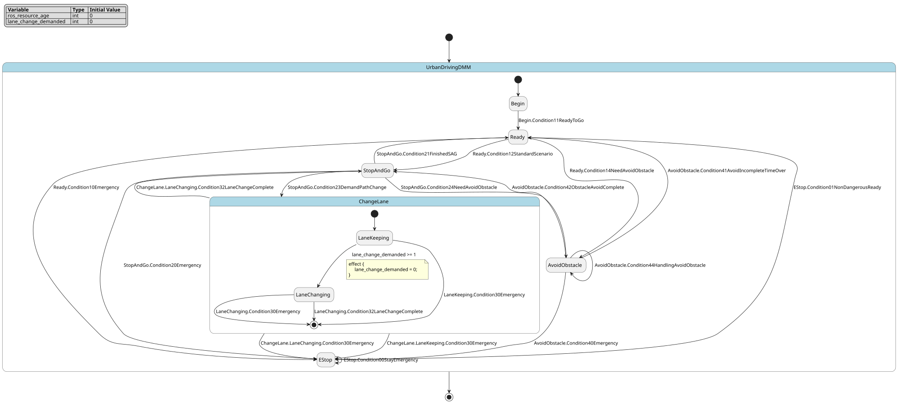

# Case `009` 🚗 — Two-Stage Mission-and-Control FSM for Urban Driving

**Bucket**: HSM-layered  |  **Paper**: #158 `a-hierarchical-control-system-for-autonomous-driving-towards-urban-challenges`

- [STM.md case section](../../../sources/a-hierarchical-control-system-for-autonomous-driving-towards-urban-challenges/STM.md)
- [paper PDF](../../../sources/a-hierarchical-control-system-for-autonomous-driving-towards-urban-challenges/paper.pdf)
- [expansion NL JSON (含 provenance)](../expansions/009.json)
- [codex 起草笔记](../ref_stms/codex_drafts/009.notes.md)

## 1. 英文 NL（含 inline [E] 溯源 markers）

> 这是 codex 评审阶段生成的扩充 NL（commit `259e6ea7`），每条 substantive 信息带 `[En]` 标记。完整 provenance 表见 [expansion JSON](../expansions/009.json)。

The urban-driving controller is a decision-making mechanism for a self-driving car implemented as a two-stage FSM: the Mission FSM manages vehicle missions, and the Control FSM mimics the vehicle's status on the road [E1]. After observing surrounding-object trajectories and mission data, the two FSMs determine mission behavior and on-road control behavior, with mission choices including modes such as Change-Lane, E-stop, and obstacle avoidance [E2][E3]. Within the hierarchy, Change-Lane contains lane-keeping and lane-changing control states, and obstacle avoidance activates when obstacles are detected on the path [E4][E5]. Each FSM state requires a resource updated over time in ROS perception nodes, and the implemented vehicle's sensor set includes 3D LiDAR, Zed-camera, GPS, IMU, and encoders [E6][E7]. Normal progress uses condition 11 when ROS nodes are healthy and the vehicle is ready to go, and condition 23 when a path change is demanded [E8][E9]. Abnormal handling uses perception-driven emergency conditions 10, 20, 30, and 40, keeps working in emergency mode under condition 00, and can wake back to Ready under condition 01 when the case is non-dangerous [E10]. Obstacle recovery is captured by condition 41 when avoidance is incomplete and its time is over, condition 44 while the mission is being handled, and condition 42 when obstacle avoidance is completely performed [E11][E12]. State flags and priorities protect shared resources, with E-stop assigned the highest priority before obstacle avoidance, Change-Lane, and Stop-and-Go [E13][E14]. The downstream control layer follows the chosen trajectory through longitudinal and lateral controllers, using acceleration or braking for speed control and steering turn for lane tracking [E15][E16][E17].

## 2. 中文 NL 译文（claude 翻译，保留 [En] markers）

该城市驾驶控制器是一种为自动驾驶汽车设计的决策机制，采用两级 FSM 实现：Mission FSM 负责管理车辆任务，Control FSM 则模拟车辆在道路上的状态 [E1]。在观测周围物体轨迹与任务数据后，两个 FSM 共同决定任务行为与道路控制行为，任务选择包括换道（Change-Lane）、紧急停车（E-stop）以及避障等模式 [E2][E3]。在层次结构中，Change-Lane 包含车道保持与变道控制状态，避障在检测到路径上存在障碍物时被激活 [E4][E5]。每个 FSM 状态都需要一个由 ROS 感知节点随时间更新的资源，所部署车辆的传感器集合包括 3D 激光雷达、Zed 相机、GPS、IMU 与编码器 [E6][E7]。正常推进在 ROS 节点健康且车辆就绪时使用条件 11，在需要变更路径时使用条件 23 [E8][E9]。异常处理使用由感知驱动的紧急条件 10、20、30 与 40，在条件 00 下持续保持紧急模式工作，并可在条件 01 对应的非危险情形下唤醒回到 Ready 状态 [E10]。障碍物恢复由以下条件刻画：避障未完成且其时间到达时使用条件 41，任务处理过程中使用条件 44，避障完全完成时使用条件 42 [E11][E12]。状态标志与优先级用于保护共享资源，其中 E-stop 被赋予最高优先级，高于避障、Change-Lane 以及 Stop-and-Go [E13][E14]。下游控制层通过纵向与横向控制器跟随所选轨迹，使用加速或制动进行速度控制，并通过转向实现车道跟踪 [E15][E16][E17]。

## 3. Reference pyfcstm STM (codex 起草，待用户签字)

### 3.1 状态机图（pyfcstm visualize SVG）



PlantUML 源文件：[`../diagrams/009.puml`](../diagrams/009.puml)

### 3.2 pyfcstm DSL 源码

```pyfcstm
def int ros_resource_age = 0;
def int lane_change_demanded = 0;

state UrbanDrivingDMM {
    >> during before {
        ros_resource_age = ros_resource_age + 1;
    }

    [*] -> Begin;

    state Begin {
        during abstract ReadLidarZedGpsImuEncoders;
    }

    state Ready {
        during abstract ReadLidarZedGpsImuEncoders;
    }

    state StopAndGo {
        during abstract ApplyAccelerationOrBraking;
    }

    state ChangeLane {
        [*] -> LaneKeeping;

        state LaneKeeping {
            during abstract AdjustSteeringTurn;
        }

        state LaneChanging {
            during abstract AdjustSteeringTurn;
        }

        LaneKeeping -> LaneChanging : if [lane_change_demanded >= 1] effect { lane_change_demanded = 0; };
        LaneKeeping -> [*] :: Condition30Emergency;
        LaneChanging -> [*] :: Condition30Emergency;
        LaneChanging -> [*] :: Condition32LaneChangeComplete;
    }

    state EStop {
        enter abstract ApplyBraking;
        during abstract KeepEmergencyMode;
    }

    state AvoidObstacle {
        during abstract FollowTrajectoryWithLongitudinalAndLateralControllers;
    }

    Begin -> Ready :: Condition11ReadyToGo;

    Ready -> EStop :: Condition10Emergency;
    Ready -> AvoidObstacle :: Condition14NeedAvoidObstacle;
    Ready -> StopAndGo :: Condition12StandardScenario;

    StopAndGo -> EStop :: Condition20Emergency;
    StopAndGo -> AvoidObstacle :: Condition24NeedAvoidObstacle;
    StopAndGo -> ChangeLane :: Condition23DemandPathChange;
    StopAndGo -> Ready :: Condition21FinishedSAG;

    ChangeLane -> EStop : /ChangeLane.LaneKeeping.Condition30Emergency;
    ChangeLane -> EStop : /ChangeLane.LaneChanging.Condition30Emergency;
    ChangeLane -> StopAndGo : /ChangeLane.LaneChanging.Condition32LaneChangeComplete;

    EStop -> EStop :: Condition00StayEmergency;
    EStop -> Ready :: Condition01NonDangerousReady;

    AvoidObstacle -> EStop :: Condition40Emergency;
    AvoidObstacle -> Ready :: Condition41AvoidIncompleteTimeOver;
    AvoidObstacle -> AvoidObstacle :: Condition44HandlingAvoidObstacle;
    AvoidObstacle -> StopAndGo :: Condition42ObstacleAvoidComplete;
}

```

**codex 自报 C-axis 使用情况**:
- C1: ✓
- C2: ✗
- C3: ✗
- C4: ✓

**codex 自报 scenarios 覆盖情况**:
- 模式数: 7
- guards 数: 1
- fault paths 数: 6
- per-cycle 行为数: 1
- 硬件 effectors 数: 5

## 4. Test scenarios（覆盖 NL 全特性，必须 100% pass）

```json
{
  "scenarios": [
    {
      "name": "ready_condition11_and_ros_resource_cycles",
      "description": "覆盖 condition 11 进入 Ready，以及 E6 所述 ROS perception resource 在每个 cycle 更新。",
      "initial_state": null,
      "initial_vars": {},
      "steps": [
        {
          "before_cycles": 0,
          "events": [],
          "expected_state": "UrbanDrivingDMM.Begin",
          "expected_vars": {
            "ros_resource_age": 1,
            "lane_change_demanded": 0
          },
          "name": "default_enters_begin"
        },
        {
          "before_cycles": 0,
          "events": [
            "Condition11ReadyToGo"
          ],
          "expected_state": "UrbanDrivingDMM.Ready",
          "expected_vars": {
            "ros_resource_age": 2,
            "lane_change_demanded": 0
          },
          "name": "condition11_to_ready"
        },
        {
          "before_cycles": 3,
          "events": null,
          "expected_state": "UrbanDrivingDMM.Ready",
          "expected_vars": {
            "ros_resource_age": 5,
            "lane_change_demanded": 0
          },
          "name": "three_resource_update_cycles"
        }
      ]
    },
    {
      "name": "stop_and_go_change_lane_substates_and_completion",
      "description": "覆盖 Stop-and-Go、condition 23 path change、Change-Lane 的 LaneKeeping/LaneChanging 层次和 condition 32 完成。",
      "initial_state": "UrbanDrivingDMM.Ready",
      "initial_vars": {
        "ros_resource_age": 0,
        "lane_change_demanded": 1
      },
      "steps": [
        {
          "before_cycles": 0,
          "events": [
            "Condition12StandardScenario"
          ],
          "expected_state": "UrbanDrivingDMM.StopAndGo",
          "expected_vars": {
            "ros_resource_age": 1,
            "lane_change_demanded": 1
          },
          "name": "ready_to_stop_and_go"
        },
        {
          "before_cycles": 0,
          "events": [
            "Condition23DemandPathChange"
          ],
          "expected_state": "UrbanDrivingDMM.ChangeLane.LaneKeeping",
          "expected_vars": {
            "ros_resource_age": 2,
            "lane_change_demanded": 1
          },
          "name": "condition23_to_change_lane"
        },
        {
          "before_cycles": 0,
          "events": [],
          "expected_state": "UrbanDrivingDMM.ChangeLane.LaneChanging",
          "expected_vars": {
            "ros_resource_age": 3,
            "lane_change_demanded": 0
          },
          "name": "lane_change_demand_enters_lane_changing"
        },
        {
          "before_cycles": 0,
          "events": [
            "Condition32LaneChangeComplete"
          ],
          "expected_state": "UrbanDrivingDMM.StopAndGo",
          "expected_vars": {
            "ros_resource_age": 4,
            "lane_change_demanded": 0
          },
          "name": "condition32_lane_change_complete"
        }
      ]
    },
    {
      "name": "obstacle_avoidance_handling_completion_and_timeout",
      "description": "覆盖 obstacle detected/need avoid、condition 44 handling、condition 42 complete、condition 41 incomplete timeout。",
      "initial_state": "UrbanDrivingDMM.Ready",
      "initial_vars": {
        "ros_resource_age": 0,
        "lane_change_demanded": 0
      },
      "steps": [
        {
          "before_cycles": 0,
          "events": [
            "Condition14NeedAvoidObstacle"
          ],
          "expected_state": "UrbanDrivingDMM.AvoidObstacle",
          "expected_vars": {
            "ros_resource_age": 1,
            "lane_change_demanded": 0
          },
          "name": "ready_to_avoid_obstacle"
        },
        {
          "before_cycles": 0,
          "events": [
            "Condition44HandlingAvoidObstacle"
          ],
          "expected_state": "UrbanDrivingDMM.AvoidObstacle",
          "expected_vars": {
            "ros_resource_age": 2,
            "lane_change_demanded": 0
          },
          "name": "condition44_keeps_handling"
        },
        {
          "before_cycles": 0,
          "events": [
            "Condition42ObstacleAvoidComplete"
          ],
          "expected_state": "UrbanDrivingDMM.StopAndGo",
          "expected_vars": {
            "ros_resource_age": 3,
            "lane_change_demanded": 0
          },
          "name": "condition42_complete_to_stop_and_go"
        },
        {
          "before_cycles": 0,
          "events": [
            "Condition24NeedAvoidObstacle"
          ],
          "expected_state": "UrbanDrivingDMM.AvoidObstacle",
          "expected_vars": {
            "ros_resource_age": 4,
            "lane_change_demanded": 0
          },
          "name": "stop_and_go_to_avoid_obstacle"
        },
        {
          "before_cycles": 0,
          "events": [
            "Condition41AvoidIncompleteTimeOver"
          ],
          "expected_state": "UrbanDrivingDMM.Ready",
          "expected_vars": {
            "ros_resource_age": 5,
            "lane_change_demanded": 0
          },
          "name": "condition41_timeout_to_ready"
        }
      ]
    },
    {
      "name": "ready_emergency_stay_and_recover",
      "description": "覆盖 condition 10 进入 E-stop、condition 00 emergency 持续工作、condition 01 non-dangerous 回 Ready。",
      "initial_state": "UrbanDrivingDMM.Ready",
      "initial_vars": {
        "ros_resource_age": 0,
        "lane_change_demanded": 0
      },
      "steps": [
        {
          "before_cycles": 0,
          "events": [
            "Condition10Emergency"
          ],
          "expected_state": "UrbanDrivingDMM.EStop",
          "expected_vars": {
            "ros_resource_age": 1,
            "lane_change_demanded": 0
          },
          "name": "condition10_to_estop"
        },
        {
          "before_cycles": 0,
          "events": [
            "Condition00StayEmergency"
          ],
          "expected_state": "UrbanDrivingDMM.EStop",
          "expected_vars": {
            "ros_resource_age": 2,
            "lane_change_demanded": 0
          },
          "name": "condition00_stays_estop"
        },
        {
          "before_cycles": 0,
          "events": [
            "Condition01NonDangerousReady"
          ],
          "expected_state": "UrbanDrivingDMM.Ready",
          "expected_vars": {
            "ros_resource_age": 3,
            "lane_change_demanded": 0
          },
          "name": "condition01_returns_ready"
        }
      ]
    },
    {
      "name": "stop_and_go_emergency_priority_over_path_change",
      "description": "覆盖 condition 20 fault path，并验证 E-stop 优先于 Change-Lane 的资源优先级语义。",
      "initial_state": "UrbanDrivingDMM.StopAndGo",
      "initial_vars": {
        "ros_resource_age": 0,
        "lane_change_demanded": 0
      },
      "steps": [
        {
          "before_cycles": 0,
          "events": [
            "Condition20Emergency",
            "Condition23DemandPathChange"
          ],
          "expected_state": "UrbanDrivingDMM.EStop",
          "expected_vars": {
            "ros_resource_age": 1,
            "lane_change_demanded": 0
          },
          "name": "condition20_wins_over_condition23"
        },
        {
          "before_cycles": 0,
          "events": [
            "Condition01NonDangerousReady"
          ],
          "expected_state": "UrbanDrivingDMM.Ready",
          "expected_vars": {
            "ros_resource_age": 2,
            "lane_change_demanded": 0
          },
          "name": "recover_to_ready"
        }
      ]
    },
    {
      "name": "avoid_obstacle_priority_over_path_change",
      "description": "验证 obstacle avoiding priority 高于 Change-Lane：condition 24 与 condition 23 同 cycle 时进入 AvoidObstacle。",
      "initial_state": "UrbanDrivingDMM.StopAndGo",
      "initial_vars": {
        "ros_resource_age": 0,
        "lane_change_demanded": 1
      },
      "steps": [
        {
          "before_cycles": 0,
          "events": [
            "Condition24NeedAvoidObstacle",
            "Condition23DemandPathChange"
          ],
          "expected_state": "UrbanDrivingDMM.AvoidObstacle",
          "expected_vars": {
            "ros_resource_age": 1,
            "lane_change_demanded": 1
          },
          "name": "condition24_wins_over_condition23"
        },
        {
          "before_cycles": 0,
          "events": [
            "Condition42ObstacleAvoidComplete"
          ],
          "expected_state": "UrbanDrivingDMM.StopAndGo",
          "expected_vars": {
            "ros_resource_age": 2,
            "lane_change_demanded": 1
          },
          "name": "complete_obstacle_after_priority_case"
        }
      ]
    },
    {
      "name": "change_lane_keeping_emergency",
      "description": "覆盖 Change-Lane/LaneKeeping 下 condition 30 perception emergency 进入 E-stop。",
      "initial_state": "UrbanDrivingDMM.ChangeLane.LaneKeeping",
      "initial_vars": {
        "ros_resource_age": 0,
        "lane_change_demanded": 0
      },
      "steps": [
        {
          "before_cycles": 0,
          "events": [
            "Condition30Emergency"
          ],
          "expected_state": "UrbanDrivingDMM.EStop",
          "expected_vars": {
            "ros_resource_age": 1,
            "lane_change_demanded": 0
          },
          "name": "condition30_from_lane_keeping"
        }
      ]
    },
    {
      "name": "lane_change_demand_guard_false_boundary",
      "description": "覆盖 lane_change_demanded guard 的 false 边界：demand=0 时 LaneKeeping 不进入 LaneChanging。",
      "initial_state": "UrbanDrivingDMM.ChangeLane.LaneKeeping",
      "initial_vars": {
        "ros_resource_age": 0,
        "lane_change_demanded": 0
      },
      "steps": [
        {
          "before_cycles": 0,
          "events": [],
          "expected_state": "UrbanDrivingDMM.ChangeLane.LaneKeeping",
          "expected_vars": {
            "ros_resource_age": 1,
            "lane_change_demanded": 0
          },
          "name": "demand_zero_stays_lane_keeping"
        }
      ]
    },
    {
      "name": "change_lane_changing_emergency",
      "description": "覆盖 Change-Lane/LaneChanging 下 condition 30 perception emergency 进入 E-stop。",
      "initial_state": "UrbanDrivingDMM.ChangeLane.LaneChanging",
      "initial_vars": {
        "ros_resource_age": 0,
        "lane_change_demanded": 0
      },
      "steps": [
        {
          "before_cycles": 0,
          "events": [
            "Condition30Emergency"
          ],
          "expected_state": "UrbanDrivingDMM.EStop",
          "expected_vars": {
            "ros_resource_age": 1,
            "lane_change_demanded": 0
          },
          "name": "condition30_from_lane_changing"
        }
      ]
    },
    {
      "name": "avoid_obstacle_emergency",
      "description": "覆盖 AvoidObstacle 下 condition 40 perception emergency 进入 E-stop。",
      "initial_state": "UrbanDrivingDMM.AvoidObstacle",
      "initial_vars": {
        "ros_resource_age": 0,
        "lane_change_demanded": 0
      },
      "steps": [
        {
          "before_cycles": 0,
          "events": [
            "Condition40Emergency"
          ],
          "expected_state": "UrbanDrivingDMM.EStop",
          "expected_vars": {
            "ros_resource_age": 1,
            "lane_change_demanded": 0
          },
          "name": "condition40_to_estop"
        }
      ]
    }
  ]
}
```

## 5. pyfcstm 验证日志（parse + sem + sim + scenarios 全跑）

```
PARSE_OK
SEM_OK (leaf_states=?)
SIM_OK (current_state=Begin)
SCENARIOS_LOADED: 10
  ✓ [ready_condition11_and_ros_resource_cycles]
  ✓ [stop_and_go_change_lane_substates_and_completion]
  ✓ [obstacle_avoidance_handling_completion_and_timeout]
  ✓ [ready_emergency_stay_and_recover]
  ✓ [stop_and_go_emergency_priority_over_path_change]
  ✓ [avoid_obstacle_priority_over_path_change]
  ✓ [change_lane_keeping_emergency]
  ✓ [lane_change_demand_guard_false_boundary]
  ✓ [change_lane_changing_emergency]
  ✓ [avoid_obstacle_emergency]

SCENARIOS_SUMMARY: pass=10 fail=0 error=0 total=10

LINT_RUNNING...
LINT_SUMMARY: warnings=0 by_code={}
ALL_OK
```

## 6. Codex 起草笔记

# Codex Draft Notes — Case 009

## 1. 设计选择

- mode 列表：
  - `UrbanDrivingDMM`：来自 expansion [E1] 的 Decision-Making Mechanism / two-stage FSM 总体控制器。
  - `Begin`：来自 Figure 2 文本标签 `Begin`，用于承接默认初态到 `Ready` 的 condition 11。
  - `Ready`：来自 STM §1 摘录 B / expansion [E3]。
  - `StopAndGo`：来自 STM §1 摘录 B 的 Stop-and-Go (SAG) / expansion [E3][E14]。
  - `ChangeLane`：来自 STM §1 摘录 B / expansion [E3][E4]。
  - `LaneKeeping`、`LaneChanging`：来自 STM §1 摘录 B / expansion [E4] 的 CL 内部 control states。
  - `EStop`：来自 STM §1 摘录 B / expansion [E3][E10][E14]。
  - `AvoidObstacle`：来自 STM §1 摘录 B / expansion [E3][E5]。
- event 列表：
  - `Condition11ReadyToGo`：Table 1 condition 11，expansion [E8]。
  - `Condition10Emergency`、`Condition20Emergency`、`Condition30Emergency`、`Condition40Emergency`：Table 1 emergency conditions，expansion [E10]。
  - `Condition00StayEmergency`、`Condition01NonDangerousReady`：Table 1 emergency persistence/recovery，expansion [E10]。
  - `Condition23DemandPathChange`：Table 1 condition 23，expansion [E9]。
  - `Condition41AvoidIncompleteTimeOver`：Table 1 condition 41，expansion [E11]。
  - `Condition44HandlingAvoidObstacle`、`Condition42ObstacleAvoidComplete`、`Condition32LaneChangeComplete`：Table 1 conditions 44/42/32，expansion [E12]。
  - `Condition12StandardScenario`、`Condition14NeedAvoidObstacle`、`Condition24NeedAvoidObstacle`、`Condition21FinishedSAG`：来自 STM §1 摘录 B 所指 Table 1 / paper_content 行 202、207，用于让 `StopAndGo` 和 `AvoidObstacle` 的原文 mode 可达。
- variable 列表：
  - `int ros_resource_age = 0`：来自 expansion [E6] “resource updated over time in ROS perception nodes”，每 cycle 自增并被自身 RHS 读取，scenarios 显式断言其递增。
  - `int lane_change_demanded = 0`：来自 expansion [E4] “lane changing state is demanded” 与 Table 1 condition 33；用作 `LaneKeeping -> LaneChanging` 的 guard 输入，transition 后复位。
- transition 设计：
  - `Begin -> Ready :: Condition11ReadyToGo` 对应 condition 11 [E8]。
  - `Ready` 下 transition 顺序为 E-stop、avoid obstacle、SAG，体现 [E14] 的高优先级先判定。
  - `StopAndGo` 下 transition 顺序为 E-stop、avoid obstacle、Change-Lane、Ready，体现 E-stop > obstacle avoidance > CL > SAG [E14]。
  - `ChangeLane` 默认进入 `LaneKeeping`；`LaneKeeping -> LaneChanging` 使用 `lane_change_demanded >= 1` 表达 lane-changing demand [E4]。
  - `LaneKeeping/LaneChanging -> [*] :: Condition30Emergency` 加父级 `ChangeLane -> EStop`，表达 CL mission 中 perception emergency [E10]。
  - `LaneChanging -> [*] :: Condition32LaneChangeComplete` 加父级 `ChangeLane -> StopAndGo`，表达 lane-changing complete [E12]。
  - `AvoidObstacle` 下 condition 40/41/44/42 分别进入 E-stop、Ready、自保持、StopAndGo，覆盖 [E10][E11][E12]。

## 2. C-axis grounding 使用情况

- **C1 (周期执行)**: 用 — `UrbanDrivingDMM` 上的 `>> during before { ros_resource_age = ros_resource_age + 1; }` 表达每个 FSM state 的 ROS perception resource over-time update [E6]。
- **C2 (数值守卫)**: 未用 — 原文只有离散 condition code，没有多变量算术阈值或物理数值 guard；`lane_change_demanded >= 1` 是离散输入旗标，不作为 C2 数值阈值声明。
- **C3 (forced fault)**: 未用 — 原文支持 emergency conditions [E10]，但 expansion 明确没有 any sub-state/global forced transition；本 ref 用显式 emergency transitions，不写 `! * -> Error`。
- **C4 (硬件)**: 用 — `ReadLidarZedGpsImuEncoders` 对应 3D LiDAR、Zed-camera、GPS、IMU、encoders [E7]；`ApplyAccelerationOrBraking` / `ApplyBraking` 对应 acceleration/braking [E16]；`AdjustSteeringTurn` 对应 steering turn [E17]；`FollowTrajectoryWithLongitudinalAndLateralControllers` 对应 trajectory following with longitudinal/lateral controllers [E15]。

## 3. 与 NL 的对应关系

- expansion NL [E1]: two-stage Mission FSM + Control FSM → `UrbanDrivingDMM` 顶层 state + `ChangeLane` 内部 control substates。
- expansion NL [E2]: perception trajectories and mission data determine behavior → event/guard-driven mission transitions and `ReadLidarZedGpsImuEncoders` abstract action。
- expansion NL [E3]: mission choices Ready / SAG / CL / E-stop / avoid obstacle → `Ready`、`StopAndGo`、`ChangeLane`、`EStop`、`AvoidObstacle`。
- expansion NL [E4]: Change-Lane contains lane-keeping and lane-changing → `ChangeLane.LaneKeeping`、`ChangeLane.LaneChanging`、`lane_change_demanded` guard。
- expansion NL [E5]: obstacle avoidance activates when obstacles detected on path → `Ready/StopAndGo -> AvoidObstacle` via condition 14/24 need-avoid-obstacle events。
- expansion NL [E6]: per-state resource updated over time → `ros_resource_age` per-cycle update。
- expansion NL [E7]: sensor set → `ReadLidarZedGpsImuEncoders` abstract action。
- expansion NL [E8]: condition 11 → `Begin -> Ready :: Condition11ReadyToGo`。
- expansion NL [E9]: condition 23 → `StopAndGo -> ChangeLane :: Condition23DemandPathChange`。
- expansion NL [E10]: conditions 10/20/30/40, 00, 01 → explicit emergency transitions into `EStop`, `EStop -> EStop`, `EStop -> Ready`。
- expansion NL [E11]: condition 41 → `AvoidObstacle -> Ready :: Condition41AvoidIncompleteTimeOver`。
- expansion NL [E12]: condition 44 / 42 / 32 → `AvoidObstacle -> AvoidObstacle`、`AvoidObstacle -> StopAndGo`、`ChangeLane -> StopAndGo`。
- expansion NL [E13]: flags/priorities protect shared resources → no decorative flag variable; priority is represented by transition ordering and verified by simultaneous-event scenarios。
- expansion NL [E14]: priority E-stop > obstacle avoidance > CL > SAG → `StopAndGo` transition order plus two priority scenarios。
- expansion NL [E15]: trajectory following through longitudinal/lateral controllers → `FollowTrajectoryWithLongitudinalAndLateralControllers` abstract action。
- expansion NL [E16]: acceleration/braking → `ApplyAccelerationOrBraking` and `ApplyBraking` abstract actions。
- expansion NL [E17]: steering turn for lane tracking → `AdjustSteeringTurn` abstract action。

## 4. 迭代历史

- iter 1: 写出初稿，parse/sem/smoke OK；单独 lint 发现 `Condition33OperatingLaneChanging` 被报 `unused_event`，原因是 nested internal event transition 未进入 lint 的 root transition used-event 集合。
- iter 2: 将 condition 33 改成 bool guard，parse fail；当前 pyfcstm 运行时实际只接受 `int/float` 变量定义。
- iter 3: 改为 `int lane_change_demanded = 0` 与 guard `lane_change_demanded >= 1`，parse/sem/smoke OK，lint warnings=0。
- iter 4: 写入并补齐 10 条 scenarios，包括 `lane_change_demanded >= 1` 的 false/true 两侧覆盖；完整验证结果为 PARSE_OK、SEM_OK、SIM_OK、SCENARIOS pass=10 fail=0 error=0、LINT warnings=0、ALL_OK。

## 5. 与 STM.md 表述的偏差（如有）

- 没有加入速度、距离、时间长度等数值阈值，因为 STM §1 与 expansion provenance 只给 condition code 语义，没有给出物理阈值。
- 没有使用 `! * -> Error` forced fault；emergency 条件通过显式 mode transitions 表达，符合 expansion 对 C3 的约束。
- `Condition41AvoidIncompleteTimeOver` 的目标选为 `Ready`，依据 condition code `41` 和 Figure 2 的 directed-graph 编码习惯；原文文字只说明 “un-complete obstacle avoiding mission, and the time ... is over”，没有在文字中单独展开目标 state。
- `Condition12StandardScenario`、`Condition14NeedAvoidObstacle`、`Condition24NeedAvoidObstacle`、`Condition21FinishedSAG` 来自完整 Table 1，用于让 NL 中出现的 SAG / avoid-obstacle mode 具备可验证进入与退出路径；它们不是 expansion markers 的重点句，但属于同一 DMM 原文表格。

## 7. Claude 交叉评审

**Verdict**: APPROVE

| 维度 | 打分 | evidence |
|---|---|---|
| 语义正确性 | 🟡 | 5 mission states + CL 子层 LaneKeeping/LaneChanging 与 STM 摘录 B 一致；优先级通过 transition 排序 + scenarios 验证体现 [E14]；但新增的 `Begin` 顶层 state 在 STM §1 摘录与 expansion NL 中均未出现，仅依据 Figure 2 标签推断，是结构上的合理补全但非严格 NL 对应。 |
| NL 忠实性 | 🟡 | 未引入数值阈值/虚构传感器/虚构 fault 路径；`Begin` state 和 `ros_resource_age` 计数器是对 [E6] 'resource updated over time' 与 Figure 2 'Begin' 标签的合理推断，但属于 NL 字面之外的工程化补全；`Condition12/14/24/21` 等事件不在 expansion 17 个 markers… |
| C-axis grounding 恰当性 | 🟢 | C1 用 `>> during before` per-cycle 自增对应 [E6]；C2 正确不用（原文无数值阈值，[E8-E12] 都是离散 condition code）；C3 正确不用 forced fault（NL 未说 any-state 强制跳转，emergency 通过显式 mode transitions + 内部 `[*]` 上抛到父级 EStop 表达）；C4 四个 … |
| scenarios NL 覆盖度 | 🟡 | 10 条 scenarios 覆盖 condition 11/23/32/41/42/44/10/20/30/40/00/01、CL 双子态、E-stop 优先级、obstacle 优先级、per-cycle 3 cycles、guard false 边界；但 `Condition21FinishedSAG`（SAG→Ready 正常完结）与 `Condition44` 在 Ready→Av… |

**Hallucination 检查**:
- `state` `Begin`: STM §1 摘录 B 仅列 5 个 mission classes（Ready/SAG/CL/E-stop/avoid obstacle），expansion NL 未提及 Begin；codex 依据 Figure 2 文本标签补出该初态，属于结构推断而非 NL 字面支持。
- `var` `ros_resource_age`: [E6] 原文是 'a resource updated over time'，并未明确把它建模为递增计数器；ros_resource_age 名称与递增语义是 codex 对'updated over time'的工程化具体化。

**修订建议**:
- 可在 codex notes §5 中显式声明 `Begin` state 是基于 Figure 2 标签的结构推断（而不仅说成 STM §1 摘录），并在 STM §1 摘录 B 与 expansion NL 之间补一句说明；或考虑将 `Begin` 改写为 `[*] -> Ready :: Condition11ReadyToGo` 直接从伪初态进入，去掉一个 NL 未支持的具名 state。
- 建议把 `ros_resource_age` 的语义注释明确写到 notes，使 reviewers 知道它是 [E6] 'updated over time' 的代理计数器而非物理传感器年龄。
- 可考虑为 `StopAndGo -> Ready :: Condition21FinishedSAG` 增加一个 smoke scenario，覆盖 SAG 正常完结路径（目前仅 emergency/path-change/avoid-obstacle 三种 SAG 出路被 scenarios 覆盖）。

**缺失 scenarios 建议**:
- sag_finishes_normally_to_ready: 从 StopAndGo 触发 Condition21FinishedSAG，验证到达 Ready。
- ready_to_avoid_via_condition14_then_handling: 在 Ready→AvoidObstacle 后追加 Condition44HandlingAvoidObstacle 自保持验证（目前 condition44 只在 SAG 入口后的链路里出现，未单独验证 Ready→AvoidObstacle→handling 链）。

**总评**: codex draft 在结构、事件命名、C-axis 选用与 scenarios 覆盖上整体扎实，4 个维度均在 🟢/🟡 区间，符合 APPROVE 门槛。两个值得在 notes 中加强透明度的点是 `Begin` state 的来源（结构推断而非 NL 字面）和 `ros_resource_age` 作为 [E6] 'updated over time' 代理变量的语义说明，不构成强制 REVISE。建议在下一轮 minor revision 中补 1-2 条 scenarios 把 condition 21 与 Ready→handling 的可达路径补齐。

## 8. 用户审阅区（待签字）

**审阅状态**：⬜ 待审 / ⬜ approve / ⬜ revise / ⬜ rewrite

**审阅笔记**（用户填写）：

- 

**修订要求**（用户填写）：

- 

**签字**：（用户填写日期 + 姓名）

---

**最终 ref 落盘路径（待签字后）**: `audited/009.fcstm` + `audited/009.audit.md`