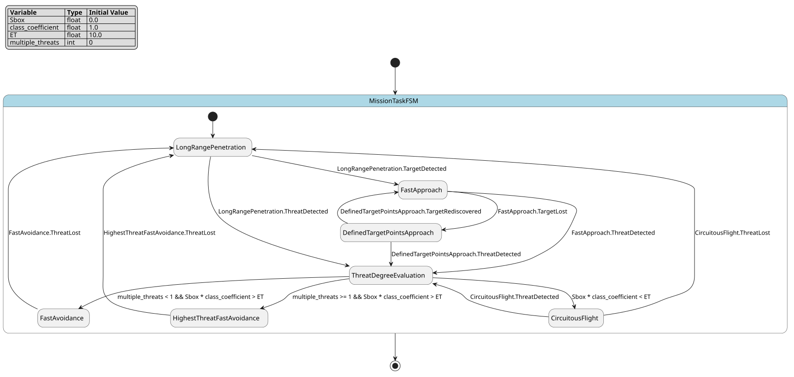

# Case `018` ✈️ — Low-altitude mission-task FSM for target approach and threat avoidance

**Bucket**: FSM-basic  |  **Paper**: #173 `autonomous-control-framework-unmanned-helicopter-low-altitude-flight`

- [STM.md case section](../../../sources/autonomous-control-framework-unmanned-helicopter-low-altitude-flight/STM.md)
- [paper PDF](../../../sources/autonomous-control-framework-unmanned-helicopter-low-altitude-flight/paper.pdf)
- [expansion NL JSON (含 provenance)](../expansions/018.json)
- [codex 起草笔记](../ref_stms/codex_drafts/018.notes.md)

## 1. 英文 NL（含 inline [E] 溯源 markers）

> 这是 codex 评审阶段生成的扩充 NL（commit `259e6ea7`），每条 substantive 信息带 `[En]` 标记。完整 provenance 表见 [expansion JSON](../expansions/018.json)。

The controller is a mission-task finite state machine for unmanned helicopter operations in low-altitude flight, and it forms a continuous operation process without human interference [E1]. In the normal destination-approach flow, the helicopter is given a distant destination, flies at low altitude, and runs a detection network for targets and threat facilities [E2]. When a target is detected, it heads to the target through visual servo control and revises the target position [E3]; it also estimates distance and yaw direction using airborne equipment [E4] and places target points along that direction for VFH path replanning [E5]. If the target is lost, the controller keeps flying toward the defined target points and returns to visual servo control when the target is rediscovered [E6]. For threats, the controller evaluates threat degree E using a class coefficient and Sbox distance [E7], and treats E higher than threshold ET as a serious threat [E8]. A serious threat has priority over fast approach and triggers fast avoidance regardless of target visibility [E9]; if several threats are present, the helicopter heads toward the one with the highest threat degree [E10]. During serious-threat handling, VFH target points are reset to history-path points [E11] and lateral maneuvers restore invisibility behind terrain cover [E12]. If E is lower than ET, the controller treats it as a small threat and executes circuitous flight [E13], with VFH target points reset to the helicopter side before the destination approach resumes when the threat is lost [E14]. The paper describes target/threat detections, airborne-equipment direction estimates, Lidar obstacle readings, and control commands of yaw, altitude, and linear-velocity channels [E2][E4][E15][E16].

## 2. 中文 NL 译文（claude 翻译，保留 [En] markers）

该控制器是一种用于无人直升机低空飞行任务的任务级有限状态机，其在无人干预条件下形成一个连续的运行过程 [E1]。在正常的目标点接近流程中，直升机被赋予一个较远的目标点，进行低空飞行，并运行检测网络以识别目标与威胁设施 [E2]。当检测到目标时，直升机通过视觉伺服控制飞向该目标并修正目标位置 [E3]；同时利用机载设备估计距离与偏航方向 [E4]，并沿该方向布置目标点用于 VFH 路径重规划 [E5]。若目标丢失，控制器继续朝已设定的目标点飞行，并在重新发现目标时返回视觉伺服控制 [E6]。对于威胁，控制器利用类别系数与 Sbox 距离评估威胁程度 E [E7]，并将高于阈值 ET 的 E 视为严重威胁 [E8]。严重威胁的优先级高于快速接近，并无论目标是否可见都会触发快速规避 [E9]；若同时存在多个威胁，直升机会朝威胁程度最高的那个机动 [E10]。在严重威胁处置过程中，VFH 目标点被重置为历史航迹点 [E11]，并通过侧向机动恢复到地形遮蔽后的不可见状态 [E12]。若 E 低于 ET，控制器将其视为小威胁并执行迂回飞行 [E13]，当威胁丢失时，VFH 目标点被重置到直升机侧方，随后恢复目标点接近流程 [E14]。论文描述了目标/威胁检测、机载设备方向估计、Lidar 障碍物读数，以及偏航、高度与线速度通道的控制指令 [E2][E4][E15][E16]。

## 3. Reference pyfcstm STM (codex 起草，待用户签字)

### 3.1 状态机图（pyfcstm visualize SVG）



PlantUML 源文件：[`../diagrams/018.puml`](../diagrams/018.puml)

### 3.2 pyfcstm DSL 源码

```pyfcstm
def float Sbox = 0.0;
def float class_coefficient = 1.0;
def float ET = 10.0;
def int multiple_threats = 0;

state MissionTaskFSM {
    [*] -> LongRangePenetration;

    state LongRangePenetration {
        during abstract DetectionNetworkDetectTargetsAndThreatFacilities;
        during abstract LidarObstacleReadingsForVFH;
        during abstract VFHYawAltitudeLinearVelocityCommands;
    }

    state FastApproach {
        enter abstract VisualServoControlReviseTargetPosition;
        during abstract AirborneEquipmentEstimateDistanceAndYawDirection;
        during abstract PlaceTargetPointsAlongTargetDirectionForVFHPathReplanning;
        during abstract VFHLinearVelocityCommands;
    }

    state DefinedTargetPointsApproach {
        enter abstract ContinueFlyingToDefinedTargetPoints;
        during abstract DetectionNetworkDetectTargetsAndThreatFacilities;
        during abstract VFHPathReplanningToDefinedTargetPoints;
    }

    state ThreatDegreeEvaluation {
        enter abstract EvaluateThreatDegreeFromClassCoefficientAndSbox;
    }

    state FastAvoidance {
        enter abstract ResetVFHTargetPointsToHistoryPathPoints;
        during abstract HeadToThreatForVisibilityJudgement;
        during abstract LateralManeuversRestoreInvisibilityBehindTerrainCover;
    }

    state HighestThreatFastAvoidance {
        enter abstract HeadTowardHighestThreatDegree;
        enter abstract ResetVFHTargetPointsToHistoryPathPoints;
        during abstract LateralManeuversRestoreInvisibilityBehindTerrainCover;
    }

    state CircuitousFlight {
        enter abstract ResetVFHTargetPointsToSideOfHelicopter;
        during abstract MoveLaterallyAndSeekCover;
        during abstract VFHYawAltitudeLinearVelocityCommands;
    }

    LongRangePenetration -> ThreatDegreeEvaluation :: ThreatDetected;
    FastApproach -> ThreatDegreeEvaluation :: ThreatDetected;
    DefinedTargetPointsApproach -> ThreatDegreeEvaluation :: ThreatDetected;
    CircuitousFlight -> ThreatDegreeEvaluation :: ThreatDetected;

    LongRangePenetration -> FastApproach :: TargetDetected;
    FastApproach -> DefinedTargetPointsApproach :: TargetLost;
    DefinedTargetPointsApproach -> FastApproach :: TargetRediscovered;

    ThreatDegreeEvaluation -> HighestThreatFastAvoidance : if [multiple_threats >= 1 and Sbox * class_coefficient > ET];
    ThreatDegreeEvaluation -> FastAvoidance : if [multiple_threats < 1 and Sbox * class_coefficient > ET];
    ThreatDegreeEvaluation -> CircuitousFlight : if [Sbox * class_coefficient < ET];

    FastAvoidance -> LongRangePenetration :: ThreatLost;
    HighestThreatFastAvoidance -> LongRangePenetration :: ThreatLost;
    CircuitousFlight -> LongRangePenetration :: ThreatLost;
}

```

**codex 自报 C-axis 使用情况**:
- C1: ✓
- C2: ✓
- C3: ✗
- C4: ✓

**codex 自报 scenarios 覆盖情况**:
- 模式数: 7
- guards 数: 3
- fault paths 数: 0
- per-cycle 行为数: 2
- 硬件 effectors 数: 16

## 4. Test scenarios（覆盖 NL 全特性，必须 100% pass）

```json
{
  "scenarios": [
    {
      "name": "continuous_long_range_then_target_recovery",
      "description": "覆盖 [E1][E2][E3][E5][E6]：默认长程低空穿透连续运行，目标检测进入快速接近，目标丢失后沿已定义目标点飞行并在重发现后回到视觉伺服。",
      "initial_state": null,
      "initial_vars": {},
      "steps": [
        {
          "before_cycles": 3,
          "events": null,
          "expected_state": "MissionTaskFSM.LongRangePenetration",
          "expected_vars": {
            "Sbox": 0.0,
            "class_coefficient": 1.0,
            "ET": 10.0,
            "multiple_threats": 0
          },
          "name": "continuous_long_range_penetration"
        },
        {
          "before_cycles": 0,
          "events": [
            "MissionTaskFSM.LongRangePenetration.TargetDetected"
          ],
          "expected_state": "MissionTaskFSM.FastApproach",
          "expected_vars": {
            "Sbox": 0.0,
            "class_coefficient": 1.0,
            "ET": 10.0,
            "multiple_threats": 0
          },
          "name": "target_detected_visual_servo"
        },
        {
          "before_cycles": 0,
          "events": [
            "MissionTaskFSM.FastApproach.TargetLost"
          ],
          "expected_state": "MissionTaskFSM.DefinedTargetPointsApproach",
          "expected_vars": {
            "Sbox": 0.0,
            "class_coefficient": 1.0,
            "ET": 10.0,
            "multiple_threats": 0
          },
          "name": "target_lost_defined_points"
        },
        {
          "before_cycles": 0,
          "events": [
            "MissionTaskFSM.DefinedTargetPointsApproach.TargetRediscovered"
          ],
          "expected_state": "MissionTaskFSM.FastApproach",
          "expected_vars": {
            "Sbox": 0.0,
            "class_coefficient": 1.0,
            "ET": 10.0,
            "multiple_threats": 0
          },
          "name": "target_rediscovered_visual_servo"
        }
      ]
    },
    {
      "name": "serious_threat_overrides_fast_approach",
      "description": "覆盖 [E7][E8][E9][E11][E12]：在快速接近中检测到 E=Sbox*class_coefficient 高于 ET 的严重威胁时，优先进入快速规避。",
      "initial_state": null,
      "initial_vars": {
        "Sbox": 12.0,
        "class_coefficient": 1.0,
        "ET": 10.0,
        "multiple_threats": 0
      },
      "steps": [
        {
          "before_cycles": 1,
          "events": null,
          "expected_state": "MissionTaskFSM.LongRangePenetration",
          "expected_vars": {
            "Sbox": 12.0,
            "class_coefficient": 1.0,
            "ET": 10.0,
            "multiple_threats": 0
          },
          "name": "default_destination_approach"
        },
        {
          "before_cycles": 0,
          "events": [
            "MissionTaskFSM.LongRangePenetration.TargetDetected"
          ],
          "expected_state": "MissionTaskFSM.FastApproach",
          "expected_vars": {
            "Sbox": 12.0,
            "class_coefficient": 1.0,
            "ET": 10.0,
            "multiple_threats": 0
          },
          "name": "fast_approach_active"
        },
        {
          "before_cycles": 0,
          "events": [
            "MissionTaskFSM.FastApproach.ThreatDetected"
          ],
          "expected_state": "MissionTaskFSM.ThreatDegreeEvaluation",
          "expected_vars": {
            "Sbox": 12.0,
            "class_coefficient": 1.0,
            "ET": 10.0,
            "multiple_threats": 0
          },
          "name": "threat_degree_evaluated"
        },
        {
          "before_cycles": 0,
          "events": [],
          "expected_state": "MissionTaskFSM.FastAvoidance",
          "expected_vars": {
            "Sbox": 12.0,
            "class_coefficient": 1.0,
            "ET": 10.0,
            "multiple_threats": 0
          },
          "name": "serious_threat_fast_avoidance"
        }
      ]
    },
    {
      "name": "serious_threat_when_target_lost_then_resume",
      "description": "覆盖 [E6][E9][E11][E12]：目标丢失后仍可因严重威胁进入快速规避，威胁丢失后恢复目的地接近链。",
      "initial_state": null,
      "initial_vars": {
        "Sbox": 15.0,
        "class_coefficient": 1.0,
        "ET": 10.0,
        "multiple_threats": 0
      },
      "steps": [
        {
          "before_cycles": 1,
          "events": null,
          "expected_state": "MissionTaskFSM.LongRangePenetration",
          "expected_vars": {
            "Sbox": 15.0,
            "class_coefficient": 1.0,
            "ET": 10.0,
            "multiple_threats": 0
          },
          "name": "initial_long_range"
        },
        {
          "before_cycles": 0,
          "events": [
            "MissionTaskFSM.LongRangePenetration.TargetDetected"
          ],
          "expected_state": "MissionTaskFSM.FastApproach",
          "expected_vars": {
            "Sbox": 15.0,
            "class_coefficient": 1.0,
            "ET": 10.0,
            "multiple_threats": 0
          },
          "name": "target_detected"
        },
        {
          "before_cycles": 0,
          "events": [
            "MissionTaskFSM.FastApproach.TargetLost"
          ],
          "expected_state": "MissionTaskFSM.DefinedTargetPointsApproach",
          "expected_vars": {
            "Sbox": 15.0,
            "class_coefficient": 1.0,
            "ET": 10.0,
            "multiple_threats": 0
          },
          "name": "target_lost"
        },
        {
          "before_cycles": 0,
          "events": [
            "MissionTaskFSM.DefinedTargetPointsApproach.ThreatDetected"
          ],
          "expected_state": "MissionTaskFSM.ThreatDegreeEvaluation",
          "expected_vars": {
            "Sbox": 15.0,
            "class_coefficient": 1.0,
            "ET": 10.0,
            "multiple_threats": 0
          },
          "name": "serious_threat_detected_while_target_lost"
        },
        {
          "before_cycles": 0,
          "events": [],
          "expected_state": "MissionTaskFSM.FastAvoidance",
          "expected_vars": {
            "Sbox": 15.0,
            "class_coefficient": 1.0,
            "ET": 10.0,
            "multiple_threats": 0
          },
          "name": "fast_avoidance_without_target_visibility"
        },
        {
          "before_cycles": 0,
          "events": [
            "MissionTaskFSM.FastAvoidance.ThreatLost"
          ],
          "expected_state": "MissionTaskFSM.LongRangePenetration",
          "expected_vars": {
            "Sbox": 15.0,
            "class_coefficient": 1.0,
            "ET": 10.0,
            "multiple_threats": 0
          },
          "name": "threat_lost_resume_destination_approach"
        }
      ]
    },
    {
      "name": "multiple_serious_threats_select_highest",
      "description": "覆盖 [E9][E10]：目标检测与威胁检测同周期出现时优先走威胁评估，多威胁且 E 高于 ET 时进入最高威胁快速规避。",
      "initial_state": null,
      "initial_vars": {
        "Sbox": 8.0,
        "class_coefficient": 2.0,
        "ET": 10.0,
        "multiple_threats": 1
      },
      "steps": [
        {
          "before_cycles": 1,
          "events": null,
          "expected_state": "MissionTaskFSM.LongRangePenetration",
          "expected_vars": {
            "Sbox": 8.0,
            "class_coefficient": 2.0,
            "ET": 10.0,
            "multiple_threats": 1
          },
          "name": "initial_long_range"
        },
        {
          "before_cycles": 0,
          "events": [
            "MissionTaskFSM.LongRangePenetration.ThreatDetected",
            "MissionTaskFSM.LongRangePenetration.TargetDetected"
          ],
          "expected_state": "MissionTaskFSM.ThreatDegreeEvaluation",
          "expected_vars": {
            "Sbox": 8.0,
            "class_coefficient": 2.0,
            "ET": 10.0,
            "multiple_threats": 1
          },
          "name": "threat_priority_over_target_detection"
        },
        {
          "before_cycles": 0,
          "events": [],
          "expected_state": "MissionTaskFSM.HighestThreatFastAvoidance",
          "expected_vars": {
            "Sbox": 8.0,
            "class_coefficient": 2.0,
            "ET": 10.0,
            "multiple_threats": 1
          },
          "name": "highest_threat_fast_avoidance"
        },
        {
          "before_cycles": 0,
          "events": [
            "MissionTaskFSM.HighestThreatFastAvoidance.ThreatLost"
          ],
          "expected_state": "MissionTaskFSM.LongRangePenetration",
          "expected_vars": {
            "Sbox": 8.0,
            "class_coefficient": 2.0,
            "ET": 10.0,
            "multiple_threats": 1
          },
          "name": "highest_threat_lost_resume"
        }
      ]
    },
    {
      "name": "small_threat_circuitous_resume",
      "description": "覆盖 [E7][E13][E14]：E=Sbox*class_coefficient 低于 ET 时进入迂回飞行，威胁消失后重置目标点并恢复目的地接近。",
      "initial_state": null,
      "initial_vars": {
        "Sbox": 5.0,
        "class_coefficient": 1.0,
        "ET": 10.0,
        "multiple_threats": 0
      },
      "steps": [
        {
          "before_cycles": 1,
          "events": null,
          "expected_state": "MissionTaskFSM.LongRangePenetration",
          "expected_vars": {
            "Sbox": 5.0,
            "class_coefficient": 1.0,
            "ET": 10.0,
            "multiple_threats": 0
          },
          "name": "initial_long_range"
        },
        {
          "before_cycles": 0,
          "events": [
            "MissionTaskFSM.LongRangePenetration.ThreatDetected"
          ],
          "expected_state": "MissionTaskFSM.ThreatDegreeEvaluation",
          "expected_vars": {
            "Sbox": 5.0,
            "class_coefficient": 1.0,
            "ET": 10.0,
            "multiple_threats": 0
          },
          "name": "small_threat_detected"
        },
        {
          "before_cycles": 0,
          "events": [],
          "expected_state": "MissionTaskFSM.CircuitousFlight",
          "expected_vars": {
            "Sbox": 5.0,
            "class_coefficient": 1.0,
            "ET": 10.0,
            "multiple_threats": 0
          },
          "name": "below_threshold_circuitous_flight"
        },
        {
          "before_cycles": 0,
          "events": [
            "MissionTaskFSM.CircuitousFlight.ThreatLost"
          ],
          "expected_state": "MissionTaskFSM.LongRangePenetration",
          "expected_vars": {
            "Sbox": 5.0,
            "class_coefficient": 1.0,
            "ET": 10.0,
            "multiple_threats": 0
          },
          "name": "small_threat_lost_resume"
        }
      ]
    },
    {
      "name": "repeated_threat_detection_during_circuitous",
      "description": "覆盖 [E14] 及论文仿真段落：迂回飞行中再次检测到威胁时重新回到威胁等级评估并按阈值选择规避策略。",
      "initial_state": "MissionTaskFSM.CircuitousFlight",
      "initial_vars": {
        "Sbox": 14.0,
        "class_coefficient": 1.0,
        "ET": 10.0,
        "multiple_threats": 0
      },
      "steps": [
        {
          "before_cycles": 3,
          "events": null,
          "expected_state": "MissionTaskFSM.CircuitousFlight",
          "expected_vars": {
            "Sbox": 14.0,
            "class_coefficient": 1.0,
            "ET": 10.0,
            "multiple_threats": 0
          },
          "name": "circuitous_lateral_operation_continues"
        },
        {
          "before_cycles": 0,
          "events": [
            "MissionTaskFSM.CircuitousFlight.ThreatDetected"
          ],
          "expected_state": "MissionTaskFSM.ThreatDegreeEvaluation",
          "expected_vars": {
            "Sbox": 14.0,
            "class_coefficient": 1.0,
            "ET": 10.0,
            "multiple_threats": 0
          },
          "name": "threat_detected_again"
        },
        {
          "before_cycles": 0,
          "events": [],
          "expected_state": "MissionTaskFSM.FastAvoidance",
          "expected_vars": {
            "Sbox": 14.0,
            "class_coefficient": 1.0,
            "ET": 10.0,
            "multiple_threats": 0
          },
          "name": "repeated_serious_threat_fast_avoidance"
        }
      ]
    }
  ]
}
```

## 5. pyfcstm 验证日志（parse + sem + sim + scenarios 全跑）

```
PARSE_OK
SEM_OK (leaf_states=?)
SIM_OK (current_state=LongRangePenetration)
SCENARIOS_LOADED: 6
  ✓ [continuous_long_range_then_target_recovery]
  ✓ [serious_threat_overrides_fast_approach]
  ✓ [serious_threat_when_target_lost_then_resume]
  ✓ [multiple_serious_threats_select_highest]
  ✓ [small_threat_circuitous_resume]
  ✓ [repeated_threat_detection_during_circuitous]

SCENARIOS_SUMMARY: pass=6 fail=0 error=0 total=6

LINT_RUNNING...
LINT_SUMMARY: warnings=0 by_code={}
ALL_OK
```

## 6. Codex 起草笔记

# Codex Draft Notes — Case 018

## 1. 设计选择

- mode 列表：
  - `LongRangePenetration`：来自 STM §1 摘录 D 的 `long-range penetration`，对应低空目的地接近与 VFH 避障。
  - `FastApproach`：来自 STM §1 摘录 D / expansion [E3] 的 `fast approach` 与 visual servo target approach。
  - `DefinedTargetPointsApproach`：来自 STM §1 摘录 B / expansion [E6] 的 target lost 后继续飞向 defined target points。
  - `ThreatDegreeEvaluation`：来自 expansion [E7] 的 threat degree E evaluation。
  - `FastAvoidance`：来自 STM §1 摘录 C / expansion [E8][E9][E11][E12] 的 serious-threat fast avoidance。
  - `HighestThreatFastAvoidance`：来自 expansion [E10] 的 multiple threats 时 heading toward the highest threat degree。
  - `CircuitousFlight`：来自 STM §1 摘录 D / expansion [E13][E14] 的 small-threat circuitous flight。
- event 列表：
  - `TargetDetected`：来自 STM §1 摘录 B / expansion [E3]。
  - `TargetLost`：来自 STM §1 摘录 B / expansion [E6]。
  - `TargetRediscovered`：来自 STM §1 摘录 B / expansion [E6]。
  - `ThreatDetected`：来自 expansion [E2][E7]。
  - `ThreatLost`：来自 STM §1 摘录 C / expansion [E12][E14] 的 threat lost / invisibility restored 后恢复。
- variable 列表：
  - `float Sbox = 0.0`：来自 expansion [E7]，表示 threat distance / anchor-box distance term。
  - `float class_coefficient = 1.0`：来自 expansion [E7] 的 class coefficient；用 ASCII 名替代原文 $\xi_{class}$。
  - `float ET = 10.0`：来自 STM §1 摘录 C / expansion [E8][E13] 的 threat threshold `ET`。原文未给具体数值，`10.0` 仅作为可执行 reference scenario 的归一化测试阈值。
  - `int multiple_threats = 0`：来自 expansion [E10] 的 several threats present。当前 pyfcstm 运行时不接受 `def bool`，因此用 0/1 int 编码。
- transition 设计：
  - `LongRangePenetration -> FastApproach :: TargetDetected`：对应 [E3]。
  - `FastApproach -> DefinedTargetPointsApproach :: TargetLost` 与 `DefinedTargetPointsApproach -> FastApproach :: TargetRediscovered`：对应 [E6]。
  - `LongRangePenetration/FastApproach/DefinedTargetPointsApproach/CircuitousFlight -> ThreatDegreeEvaluation :: ThreatDetected`：对应 [E7]，并让威胁检测可从目标可见或不可见的路径进入。
  - `ThreatDegreeEvaluation -> FastAvoidance : if [multiple_threats < 1 and Sbox * class_coefficient > ET]`：对应 [E7][E8][E9]。
  - `ThreatDegreeEvaluation -> HighestThreatFastAvoidance : if [multiple_threats >= 1 and Sbox * class_coefficient > ET]`：对应 [E10]。
  - `ThreatDegreeEvaluation -> CircuitousFlight : if [Sbox * class_coefficient < ET]`：对应 [E13]。
  - `FastAvoidance/HighestThreatFastAvoidance/CircuitousFlight -> LongRangePenetration :: ThreatLost`：对应 [E12][E14] 中威胁丢失后恢复原目的地接近链。

## 2. C-axis grounding 使用情况

- **C1 (周期执行)**: 用 — `during abstract ...` 表达 [E1] continuous operation、[E2] detection network works、[E15][E16] Lidar/VFH/control commands 持续参与任务态运行；scenarios 中 `before_cycles >= 3` 覆盖长程穿透和迂回飞行的持续运行。
- **C2 (数值守卫)**: 用 — `Sbox * class_coefficient > ET` 与 `< ET` 对应 [E7][E8][E13]，并由 serious/small threat scenarios 分别覆盖阈值两侧。
- **C3 (forced fault)**: 未用 — 原文没有一般化 fault、ErrorHandler 或 emergency recovery；serious threat 是任务优先级，不是 pyfcstm 的全局 fault path。
- **C4 (硬件)**: 用 — abstract actions 覆盖 detection network [E2]、airborne equipment distance/yaw estimates [E4]、Lidar obstacle readings [E15]、VFH/yaw/altitude/linear-velocity control channels [E16]。

## 3. 与 NL 的对应关系

- expansion NL [E1]: "mission-task finite state machine ... continuous operation process without human interference" → DSL root `state MissionTaskFSM`、默认 `[*] -> LongRangePenetration`、各任务态 `during abstract`。
- expansion NL [E2]: "distant destination ... low altitude ... detection network" → `LongRangePenetration` 的 detection/VFH/Lidar during actions。
- expansion NL [E3]: "target is detected ... heads to the target through visual servo control" → `LongRangePenetration -> FastApproach :: TargetDetected` 与 `VisualServoControlReviseTargetPosition`。
- expansion NL [E4]: "estimate distance and yaw direction using airborne equipment" → `FastApproach` 的 `AirborneEquipmentEstimateDistanceAndYawDirection`。
- expansion NL [E5]: "target points ... VFH path replanning" → `PlaceTargetPointsAlongTargetDirectionForVFHPathReplanning`。
- expansion NL [E6]: "target is lost ... defined target points ... rediscovered" → `FastApproach -> DefinedTargetPointsApproach :: TargetLost` 与 `DefinedTargetPointsApproach -> FastApproach :: TargetRediscovered`。
- expansion NL [E7]: "threat degree E using class coefficient and Sbox distance" → guard expression `Sbox * class_coefficient`.
- expansion NL [E8]: "E higher than threshold ET as a serious threat" → guard `Sbox * class_coefficient > ET`.
- expansion NL [E9]: "serious threat has priority over fast approach ... regardless of target visibility" → `FastApproach` 和 `DefinedTargetPointsApproach` 均可经 `ThreatDetected` 进入 threat evaluation；同时事件 scenario 中 threat transition 写在 target transition 前。
- expansion NL [E10]: "several threats ... highest threat degree" → `HighestThreatFastAvoidance` 与 `multiple_threats >= 1` guard。
- expansion NL [E11]: "VFH target points are reset to history-path points" → `ResetVFHTargetPointsToHistoryPathPoints`。
- expansion NL [E12]: "lateral maneuvers restore invisibility behind terrain cover" → `LateralManeuversRestoreInvisibilityBehindTerrainCover` 与 `ThreatLost` 恢复。
- expansion NL [E13]: "E lower than ET ... circuitous flight" → guard `Sbox * class_coefficient < ET` 到 `CircuitousFlight`。
- expansion NL [E14]: "target points reset to the helicopter side ... destination approach resumes" → `ResetVFHTargetPointsToSideOfHelicopter` 与 `CircuitousFlight -> LongRangePenetration :: ThreatLost`。
- expansion NL [E15]: "Lidar obstacle readings" → `LidarObstacleReadingsForVFH`。
- expansion NL [E16]: "yaw, altitude, and linear-velocity control-command channels" → `VFHYawAltitudeLinearVelocityCommands` 与 `VFHLinearVelocityCommands`。

## 4. 迭代历史

- iter 1: 写出初稿，使用 `def bool multiple_threats = false;` 与布尔逻辑 guard → verify: `PARSE_FAIL`，当前 pyfcstm parser 只接受 `int/float` 定义，且后续 `&&` guard 也随之解析失败。
- iter 2: 将 `multiple_threats` 改为 `int` 0/1，并将 guard 改成数值比较与 `and` 逻辑 → smoke `PARSE_OK / SEM_OK / SIM_OK`，单独 lint `warnings=0`。
- iter 3: 生成 6 个覆盖 scenarios → full verify: `PARSE_OK / SEM_OK / SIM_OK / SCENARIOS pass=6 fail=0 error=0 / LINT_SUMMARY warnings=0 / ALL_OK`。

## 5. 与 STM.md 表述的偏差（如有）

- `multiple_threats` 用 `int` 0/1 而不是 `bool`，原因是本地 pyfcstm parser 不支持 `def bool`；语义仍对应 [E10] 的 "several threats"。
- `ET = 10.0`、scenario 中的 `Sbox`/`class_coefficient` 数值是为了验证阈值两侧路径而设定的归一化测试参数；原文只给出符号与比较关系，没有给具体 `ET` 数值。
- 等号边界未强行归入 small threat：paper 与 expansion [E8][E13] 使用的是 "higher than ET" 与 "lower than ET"；STM §2 的 `E <= ET` 是整理性重述，本 draft 以 expansion 与原文措辞为准。

## 7. Claude 交叉评审

**Verdict**: APPROVE

| 维度 | 打分 | evidence |
|---|---|---|
| 语义正确性 | 🟢 | 状态/事件/变量与 STM §1 摘录 A-D 和 expansion NL 一一对应：LongRangePenetration/FastApproach/DefinedTargetPointsApproach/FastAvoidance/CircuitousFlight 来自摘录 D 与 [E3][E6][E13]，ThreatDegreeEvaluation 作为 guard 分流中转状… |
| NL 忠实性 | 🟡 | ET=10.0、Sbox=0.0、class_coefficient=1.0 为可执行测试默认值（codex 已在 notes 显式声明），multiple_threats 用 int 0/1 替代 bool 是 parser 兼容性合理推断；未发现 NL 未支持的 state/event/effector 编造。 |
| C-axis grounding 恰当性 | 🟢 | C1 用 during abstract 对应 [E1][E2][E15][E16] 的持续检测/VFH 运行；C2 用 Sbox*class_coefficient 与 ET 多变量算术 guard 对应 [E7][E8][E13]；C3 正确不用（NL 无全局 forced fault，serious threat 是任务优先级而非 pyfcstm fault path）；C4 用 ab… |
| scenarios NL 覆盖度 | 🟢 | 6 个 scenario 分别覆盖：连续穿透+target 链 ([E1][E3][E6])、serious threat override fast approach ([E8][E9][E11][E12])、target-lost 时 serious threat ([E9])、multi-threat highest ([E10])、small threat circuitous+re… |

## 8. 用户审阅区（待签字）

**审阅状态**：⬜ 待审 / ⬜ approve / ⬜ revise / ⬜ rewrite

**审阅笔记**（用户填写）：

- 

**修订要求**（用户填写）：

- 

**签字**：（用户填写日期 + 姓名）

---

**最终 ref 落盘路径（待签字后）**: `audited/018.fcstm` + `audited/018.audit.md`