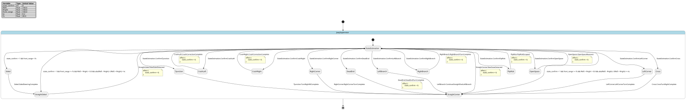

# Case `090` ⚙️ — Joey Pipe-Network Exploration Supervisor

**Bucket**: EFSM-interlock  |  **Paper**: #350 `autonomous-control-miniaturized-mobile-robots-unknown-pipe-networks`

- [STM.md case section](../../../sources/autonomous-control-miniaturized-mobile-robots-unknown-pipe-networks/STM.md)
- [paper PDF](../../../sources/autonomous-control-miniaturized-mobile-robots-unknown-pipe-networks/paper.pdf)
- [expansion NL JSON (含 provenance)](../expansions/090.json)
- [codex 起草笔记](../ref_stms/codex_drafts/090.notes.md)

## 1. 英文 NL（含 inline [E] 溯源 markers）

> 这是 codex 评审阶段生成的扩充 NL（commit `259e6ea7`），每条 substantive 信息带 `[En]` 标记。完整 provenance 表见 [expansion JSON](../expansions/090.json)。

The Joey supervisor is a finite-state autonomous controller that recognizes 13 robot states from sensor readings, while avoiding SLAM, video, and acoustic control inputs [E1] [E2] [E3]. Each estimation cycle fuses histories from the three range sensors, IMU orientation values, wheel-leg rotation, and the previous state; when a new state appears the robot stops to re-assess, and it maneuvers only after state_confirm is larger than 1 [E4] [E5] [E6]. Its numeric guards include a straight-center test where the normalized difference between Rleft and Rright is at or below kc, and a Sided case where the front range is under Fs because the front is close to a wall or obstacle [E7] [E8]. Exploration follows two global directives: at junctions choose the furthest-right direction, and at a dead-end turn around toward the previous junction so the network is covered and the robot can return safely [E9] [E10] [E11]. States are grouped as turning-right, turning-left, or going-straight, while motor execution uses closed-loop speed control for straight pipes or a left branch and closed-loop position control for other fine maneuvers [E12] [E13] [E14]. The effectors are two micro-motors driving the left and right wheel-legs, with magnetic encoders on wheel-leg driveshafts used for odometry and motor control [E15] [E16]. Recovery actions include a 30° backward crash correction followed by re-evaluation, a 180° dead-end turn with re-centering, and slow forward or backward stepping from Flip risk according to pitch and roll [E17] [E18] [E19]. Across all high-level maneuvers and operations, the controller continuously monitors roll, pitch, acceleration, range, and speed values to avoid flipping, crashing, obstacles, and pipe walls; high-level maneuver monitoring is specified at 5 Hz [E20] [E21].

## 2. 中文 NL 译文（claude 翻译，保留 [En] markers）

Joey 监督控制器是一个有限状态自主控制器，可基于传感器读数识别 13 种机器人状态，同时避免使用 SLAM、视频和声学控制输入 [E1] [E2] [E3]。每个估计周期都会融合三个测距传感器的历史数据、IMU 姿态值、轮腿转角以及上一时刻状态；当出现新状态时，机器人停止以重新评估，仅当 state_confirm 大于 1 时才进行机动 [E4] [E5] [E6]。其数值守卫条件包括一个直行居中判定，要求 Rleft 与 Rright 之间的归一化差值不大于 kc，以及一个 Sided 情形，要求前向测距值小于 Fs，表示前方贴近墙壁或障碍物 [E7] [E8]。探索遵循两条全局指令：在路口选择最右侧方向，在死端则朝向上一个路口掉头，以覆盖整个管网并使机器人能够安全返回 [E9] [E10] [E11]。状态分为右转、左转或直行三类，电机执行在直管或左侧分支时采用闭环速度控制，在其他精细机动时采用闭环位置控制 [E12] [E13] [E14]。执行器为两台驱动左、右轮腿的微型电机，轮腿传动轴上的磁编码器用于里程计估计和电机控制 [E15] [E16]。恢复动作包括碰撞后回退 30° 并重新评估、在死端 180° 掉头并重新居中，以及在存在翻倒风险时根据俯仰角和横滚角缓慢前进或后退步进 [E17] [E18] [E19]。在所有高层机动与操作过程中，控制器持续监测横滚、俯仰、加速度、测距和速度值，以避免翻倒、碰撞、障碍物和管壁；高层机动监测被规定为 5 Hz [E20] [E21]。

## 3. Reference pyfcstm STM (codex 起草，待用户签字)

### 3.1 状态机图（pyfcstm visualize SVG）



PlantUML 源文件：[`../diagrams/090.puml`](../diagrams/090.puml)

### 3.2 pyfcstm DSL 源码

```pyfcstm
def int state_confirm = 0;
def float Rleft = 100.0;
def float Rright = 100.0;
def float front_range = 100.0;
def float kc = 0.2;
def float Fs = 40.0;

state JoeySupervisor {
    >> during before abstract MonitorRollPitchAccelerationRangeSpeedAt5Hz;

    [*] -> StateEstimation;

    state StateEstimation {
        enter abstract StopToReassessSensorValues;
        during abstract FuseRangeImuWheelLegAndPreviousStateHistory;
        during { state_confirm = state_confirm + 1; }
    }

    state StraightCenter {
        enter abstract EngageClosedLoopSpeedControl;
        during abstract DriveLeftAndRightWheelLegMicroMotorsAtSpeed;
        exit abstract ReleaseClosedLoopSpeedControl;
    }

    state StraightSided {
        enter abstract EngageClosedLoopSpeedControl;
        during abstract DriveLeftAndRightWheelLegMicroMotorsAtSpeed;
        exit abstract ReleaseClosedLoopSpeedControl;
    }

    state Sided {
        enter abstract EngageClosedLoopPositionControl;
        during abstract FineStepSteerAwayFromWallOrObstacle;
        exit abstract ReleaseClosedLoopPositionControl;
    }

    state LeftCorner {
        enter abstract EngageClosedLoopPositionControl;
        during abstract TurnLeft90WithLowPitchRoll;
        exit abstract ReleaseClosedLoopPositionControl;
    }

    state CrashLeft {
        enter abstract EngageClosedLoopPositionControl;
        during abstract Turn30BackwardToPreviousTurningDirection;
        exit abstract ReleaseClosedLoopPositionControl;
    }

    state CrashRight {
        enter abstract EngageClosedLoopPositionControl;
        during abstract Turn30BackwardToPreviousTurningDirection;
        exit abstract ReleaseClosedLoopPositionControl;
    }

    state Cross {
        enter abstract EngageClosedLoopPositionControl;
        during abstract TurnRight90AtCrossJunction;
        exit abstract ReleaseClosedLoopPositionControl;
    }

    state TJunction {
        enter abstract EngageClosedLoopPositionControl;
        during abstract TurnIntoFurthestRightDirection;
        exit abstract ReleaseClosedLoopPositionControl;
    }

    state RightCorner {
        enter abstract EngageClosedLoopPositionControl;
        during abstract TurnRight90WithLowPitchRoll;
        exit abstract ReleaseClosedLoopPositionControl;
    }

    state RightBranch {
        enter abstract EngageClosedLoopPositionControl;
        during abstract MoveForwardThenTurnRight45;
        exit abstract ReleaseClosedLoopPositionControl;
    }

    state DeadEnd {
        enter abstract EngageClosedLoopPositionControl;
        during abstract TurnAround180AndRecenter;
        exit abstract ReleaseClosedLoopPositionControl;
    }

    state FlipRisk {
        enter abstract EngageClosedLoopPositionControl;
        during abstract StepSlowlyForwardOrBackwardByPitchRoll;
        exit abstract ReleaseClosedLoopPositionControl;
    }

    state OpenSpace {
        enter abstract EngageClosedLoopPositionControl;
        during abstract ApproachSlowlyAndMonitorConditions;
        exit abstract ReleaseClosedLoopPositionControl;
    }

    state LeftBranch {
        enter abstract EngageClosedLoopSpeedControl;
        during abstract SlightlySteerAwayAndContinueStraight;
        exit abstract ReleaseClosedLoopSpeedControl;
    }

    StateEstimation -> LeftCorner :: ConfirmLeftCorner;
    StateEstimation -> CrashLeft :: ConfirmCrashLeft;
    StateEstimation -> CrashRight :: ConfirmCrashRight;
    StateEstimation -> Cross :: ConfirmCross;
    StateEstimation -> TJunction :: ConfirmTJunction;
    StateEstimation -> RightCorner :: ConfirmRightCorner;
    StateEstimation -> RightBranch :: ConfirmRightBranch;
    StateEstimation -> DeadEnd :: ConfirmDeadEnd;
    StateEstimation -> FlipRisk :: ConfirmFlipRisk;
    StateEstimation -> OpenSpace :: ConfirmOpenSpace;
    StateEstimation -> LeftBranch :: ConfirmLeftBranch;
    StateEstimation -> Sided : if [state_confirm > 1 && front_range < Fs];
    StateEstimation -> StraightCenter : if [state_confirm > 1 && front_range >= Fs && Rleft + Rright > 0.0 && abs(Rleft - Rright) / (Rleft + Rright) <= kc];
    StateEstimation -> StraightSided : if [state_confirm > 1 && front_range >= Fs && Rleft + Rright > 0.0 && abs(Rleft - Rright) / (Rleft + Rright) > kc];

    StraightCenter -> StateEstimation :: NewStateDetected effect { state_confirm = 0; };
    StraightSided -> StateEstimation :: NewStateDetected effect { state_confirm = 0; };
    Sided -> StraightSided :: SidedSteeringComplete;
    LeftCorner -> StraightCenter :: LeftCornerTurnComplete;
    CrashLeft -> StateEstimation :: CrashCorrectionComplete effect { state_confirm = 0; };
    CrashRight -> StateEstimation :: CrashCorrectionComplete effect { state_confirm = 0; };
    Cross -> StraightCenter :: CrossTurnRightComplete;
    TJunction -> StraightCenter :: TurnRight90Complete;
    RightCorner -> StraightCenter :: RightCornerTurnComplete;
    RightBranch -> StateEstimation :: RightBranchTurnComplete effect { state_confirm = 0; };
    DeadEnd -> StraightCenter :: DeadEndTurnComplete effect { state_confirm = 0; };
    FlipRisk -> StateEstimation :: FlipRiskEscaped effect { state_confirm = 0; };
    OpenSpace -> StateEstimation :: OpenSpaceReassess effect { state_confirm = 0; };
    LeftBranch -> StraightCenter :: ContinueStraightPastLeftBranch;
}

```

**codex 自报 C-axis 使用情况**:
- C1: ✓
- C2: ✓
- C3: ✗
- C4: ✓

**codex 自报 scenarios 覆盖情况**:
- 模式数: 15
- guards 数: 3
- fault paths 数: 4
- per-cycle 行为数: 2
- 硬件 effectors 数: 4

## 4. Test scenarios（覆盖 NL 全特性，必须 100% pass）

```json
{
  "scenarios": [
    {
      "name": "straight_center_confirm_guard_boundary",
      "description": "覆盖 [E4]-[E7]：估计周期累计 state_confirm，在 state_confirm>1 且 Rleft/Rright 归一化差等于 kc、front_range 等于 Fs 时进入 StraightCenter。",
      "initial_state": null,
      "initial_vars": {
        "state_confirm": 0,
        "Rleft": 120.0,
        "Rright": 80.0,
        "front_range": 40.0,
        "kc": 0.2,
        "Fs": 40.0
      },
      "steps": [
        {
          "before_cycles": 0,
          "events": [],
          "expected_state": "JoeySupervisor.StateEstimation",
          "expected_vars": {
            "state_confirm": 1,
            "Rleft": 120.0,
            "Rright": 80.0,
            "front_range": 40.0,
            "kc": 0.2,
            "Fs": 40.0
          },
          "name": "first_estimation_cycle"
        },
        {
          "before_cycles": 0,
          "events": [],
          "expected_state": "JoeySupervisor.StateEstimation",
          "expected_vars": {
            "state_confirm": 2,
            "Rleft": 120.0,
            "Rright": 80.0,
            "front_range": 40.0
          },
          "name": "confirm_counter_reaches_two"
        },
        {
          "before_cycles": 0,
          "events": [],
          "expected_state": "JoeySupervisor.StraightCenter",
          "expected_vars": {
            "state_confirm": 2,
            "Rleft": 120.0,
            "Rright": 80.0,
            "front_range": 40.0
          },
          "name": "straight_center_at_kc_boundary"
        },
        {
          "before_cycles": 0,
          "events": [
            "NewStateDetected"
          ],
          "expected_state": "JoeySupervisor.StateEstimation",
          "expected_vars": {
            "state_confirm": 1,
            "Rleft": 120.0,
            "Rright": 80.0,
            "front_range": 40.0
          },
          "name": "new_state_resets_for_reassessment"
        }
      ]
    },
    {
      "name": "straight_sided_above_kc_guard",
      "description": "覆盖 [E7]：front_range 不小于 Fs 但 Rleft/Rright 归一化差超过 kc 时进入 StraightSided，而不是 StraightCenter。",
      "initial_state": "JoeySupervisor.StateEstimation",
      "initial_vars": {
        "state_confirm": 2,
        "Rleft": 130.0,
        "Rright": 70.0,
        "front_range": 41.0,
        "kc": 0.2,
        "Fs": 40.0
      },
      "steps": [
        {
          "before_cycles": 0,
          "events": [],
          "expected_state": "JoeySupervisor.StraightSided",
          "expected_vars": {
            "state_confirm": 2,
            "Rleft": 130.0,
            "Rright": 70.0,
            "front_range": 41.0
          },
          "name": "above_kc_goes_straight_sided"
        },
        {
          "before_cycles": 0,
          "events": [
            "NewStateDetected"
          ],
          "expected_state": "JoeySupervisor.StateEstimation",
          "expected_vars": {
            "state_confirm": 1,
            "Rleft": 130.0,
            "Rright": 70.0,
            "front_range": 41.0
          },
          "name": "straight_sided_reassessment"
        }
      ]
    },
    {
      "name": "sided_front_range_below_fs",
      "description": "覆盖 [E8]：front_range 小于 Fs 表示前方接近墙或障碍，进入 Sided 并完成 fine step steering。",
      "initial_state": "JoeySupervisor.StateEstimation",
      "initial_vars": {
        "state_confirm": 2,
        "Rleft": 100.0,
        "Rright": 100.0,
        "front_range": 39.0,
        "kc": 0.2,
        "Fs": 40.0
      },
      "steps": [
        {
          "before_cycles": 0,
          "events": [],
          "expected_state": "JoeySupervisor.Sided",
          "expected_vars": {
            "state_confirm": 2,
            "front_range": 39.0,
            "Fs": 40.0
          },
          "name": "below_fs_enters_sided"
        },
        {
          "before_cycles": 0,
          "events": [
            "SidedSteeringComplete"
          ],
          "expected_state": "JoeySupervisor.StraightSided",
          "expected_vars": {
            "state_confirm": 2,
            "front_range": 39.0
          },
          "name": "fine_step_steering_complete"
        },
        {
          "before_cycles": 0,
          "events": [
            "NewStateDetected"
          ],
          "expected_state": "JoeySupervisor.StateEstimation",
          "expected_vars": {
            "state_confirm": 1,
            "front_range": 39.0
          },
          "name": "sided_path_reassesses"
        }
      ]
    },
    {
      "name": "junction_rightmost_and_branch_modes",
      "description": "覆盖 [E9]-[E14]：T junction/Cross/RightBranch 走最右方向，LeftBranch 继续直行，并触达速度/位置闭环状态。",
      "initial_state": "JoeySupervisor.StateEstimation",
      "initial_vars": {
        "state_confirm": 2,
        "Rleft": 100.0,
        "Rright": 100.0,
        "front_range": 100.0,
        "kc": 0.2,
        "Fs": 40.0
      },
      "steps": [
        {
          "before_cycles": 0,
          "events": [
            "ConfirmTJunction"
          ],
          "expected_state": "JoeySupervisor.TJunction",
          "expected_vars": {
            "state_confirm": 2
          },
          "name": "confirmed_t_junction"
        },
        {
          "before_cycles": 0,
          "events": [
            "TurnRight90Complete"
          ],
          "expected_state": "JoeySupervisor.StraightCenter",
          "expected_vars": {
            "state_confirm": 2
          },
          "name": "t_junction_turns_right"
        },
        {
          "before_cycles": 0,
          "events": [
            "NewStateDetected"
          ],
          "expected_state": "JoeySupervisor.StateEstimation",
          "expected_vars": {
            "state_confirm": 1
          },
          "name": "after_t_reassess"
        },
        {
          "before_cycles": 1,
          "events": [
            "ConfirmLeftBranch"
          ],
          "expected_state": "JoeySupervisor.LeftBranch",
          "expected_vars": {
            "state_confirm": 2
          },
          "name": "confirmed_left_branch"
        },
        {
          "before_cycles": 0,
          "events": [
            "ContinueStraightPastLeftBranch"
          ],
          "expected_state": "JoeySupervisor.StraightCenter",
          "expected_vars": {
            "state_confirm": 2
          },
          "name": "left_branch_keeps_straight"
        },
        {
          "before_cycles": 0,
          "events": [
            "NewStateDetected"
          ],
          "expected_state": "JoeySupervisor.StateEstimation",
          "expected_vars": {
            "state_confirm": 1
          },
          "name": "after_left_branch_reassess"
        },
        {
          "before_cycles": 1,
          "events": [
            "ConfirmRightBranch"
          ],
          "expected_state": "JoeySupervisor.RightBranch",
          "expected_vars": {
            "state_confirm": 2
          },
          "name": "confirmed_right_branch"
        },
        {
          "before_cycles": 0,
          "events": [
            "RightBranchTurnComplete"
          ],
          "expected_state": "JoeySupervisor.StateEstimation",
          "expected_vars": {
            "state_confirm": 1
          },
          "name": "right_branch_turn_reassesses"
        },
        {
          "before_cycles": 1,
          "events": [
            "ConfirmCross"
          ],
          "expected_state": "JoeySupervisor.Cross",
          "expected_vars": {
            "state_confirm": 2
          },
          "name": "confirmed_cross"
        },
        {
          "before_cycles": 0,
          "events": [
            "CrossTurnRightComplete"
          ],
          "expected_state": "JoeySupervisor.StraightCenter",
          "expected_vars": {
            "state_confirm": 2
          },
          "name": "cross_turns_right"
        }
      ]
    },
    {
      "name": "corner_position_control_modes",
      "description": "覆盖 [E12]-[E14] 与 STM 摘录 C：LeftCorner 和 RightCorner 都使用位置闭环完成 90 度转向后回到直行。",
      "initial_state": "JoeySupervisor.StateEstimation",
      "initial_vars": {
        "state_confirm": 2,
        "Rleft": 100.0,
        "Rright": 100.0,
        "front_range": 100.0,
        "kc": 0.2,
        "Fs": 40.0
      },
      "steps": [
        {
          "before_cycles": 0,
          "events": [
            "ConfirmLeftCorner"
          ],
          "expected_state": "JoeySupervisor.LeftCorner",
          "expected_vars": {
            "state_confirm": 2
          },
          "name": "confirmed_left_corner"
        },
        {
          "before_cycles": 0,
          "events": [
            "LeftCornerTurnComplete"
          ],
          "expected_state": "JoeySupervisor.StraightCenter",
          "expected_vars": {
            "state_confirm": 2
          },
          "name": "left_corner_turn_complete"
        },
        {
          "before_cycles": 0,
          "events": [
            "NewStateDetected"
          ],
          "expected_state": "JoeySupervisor.StateEstimation",
          "expected_vars": {
            "state_confirm": 1
          },
          "name": "corner_reassessment"
        },
        {
          "before_cycles": 1,
          "events": [
            "ConfirmRightCorner"
          ],
          "expected_state": "JoeySupervisor.RightCorner",
          "expected_vars": {
            "state_confirm": 2
          },
          "name": "confirmed_right_corner"
        },
        {
          "before_cycles": 0,
          "events": [
            "RightCornerTurnComplete"
          ],
          "expected_state": "JoeySupervisor.StraightCenter",
          "expected_vars": {
            "state_confirm": 2
          },
          "name": "right_corner_turn_complete"
        }
      ]
    },
    {
      "name": "recovery_fault_paths",
      "description": "覆盖 [E17]-[E19]：CrashLeft/CrashRight 30 度后退并重估，DeadEnd 180 度回转居中，FlipRisk 依据姿态慢速前后步进脱险。",
      "initial_state": "JoeySupervisor.StateEstimation",
      "initial_vars": {
        "state_confirm": 2,
        "Rleft": 100.0,
        "Rright": 100.0,
        "front_range": 100.0,
        "kc": 0.2,
        "Fs": 40.0
      },
      "steps": [
        {
          "before_cycles": 0,
          "events": [
            "ConfirmCrashLeft"
          ],
          "expected_state": "JoeySupervisor.CrashLeft",
          "expected_vars": {
            "state_confirm": 2
          },
          "name": "confirmed_crash_left"
        },
        {
          "before_cycles": 0,
          "events": [
            "CrashCorrectionComplete"
          ],
          "expected_state": "JoeySupervisor.StateEstimation",
          "expected_vars": {
            "state_confirm": 1
          },
          "name": "crash_left_reassess"
        },
        {
          "before_cycles": 1,
          "events": [
            "ConfirmCrashRight"
          ],
          "expected_state": "JoeySupervisor.CrashRight",
          "expected_vars": {
            "state_confirm": 2
          },
          "name": "confirmed_crash_right"
        },
        {
          "before_cycles": 0,
          "events": [
            "CrashCorrectionComplete"
          ],
          "expected_state": "JoeySupervisor.StateEstimation",
          "expected_vars": {
            "state_confirm": 1
          },
          "name": "crash_right_reassess"
        },
        {
          "before_cycles": 1,
          "events": [
            "ConfirmDeadEnd"
          ],
          "expected_state": "JoeySupervisor.DeadEnd",
          "expected_vars": {
            "state_confirm": 2
          },
          "name": "confirmed_dead_end"
        },
        {
          "before_cycles": 0,
          "events": [
            "DeadEndTurnComplete"
          ],
          "expected_state": "JoeySupervisor.StraightCenter",
          "expected_vars": {
            "state_confirm": 0
          },
          "name": "dead_end_turnaround_complete"
        },
        {
          "before_cycles": 0,
          "events": [
            "NewStateDetected"
          ],
          "expected_state": "JoeySupervisor.StateEstimation",
          "expected_vars": {
            "state_confirm": 1
          },
          "name": "after_dead_end_reassess"
        },
        {
          "before_cycles": 1,
          "events": [
            "ConfirmFlipRisk"
          ],
          "expected_state": "JoeySupervisor.FlipRisk",
          "expected_vars": {
            "state_confirm": 2
          },
          "name": "confirmed_flip_risk"
        },
        {
          "before_cycles": 0,
          "events": [
            "FlipRiskEscaped"
          ],
          "expected_state": "JoeySupervisor.StateEstimation",
          "expected_vars": {
            "state_confirm": 1
          },
          "name": "flip_risk_escape_reassess"
        }
      ]
    },
    {
      "name": "open_space_reassess",
      "description": "覆盖 [E2] 与 STM 摘录 C：OpenSpace/Manhole 被确认后缓慢接近并重新评估状态。",
      "initial_state": "JoeySupervisor.StateEstimation",
      "initial_vars": {
        "state_confirm": 2,
        "Rleft": 100.0,
        "Rright": 100.0,
        "front_range": 100.0,
        "kc": 0.2,
        "Fs": 40.0
      },
      "steps": [
        {
          "before_cycles": 0,
          "events": [
            "ConfirmOpenSpace"
          ],
          "expected_state": "JoeySupervisor.OpenSpace",
          "expected_vars": {
            "state_confirm": 2
          },
          "name": "confirmed_open_space"
        },
        {
          "before_cycles": 0,
          "events": [
            "OpenSpaceReassess"
          ],
          "expected_state": "JoeySupervisor.StateEstimation",
          "expected_vars": {
            "state_confirm": 1
          },
          "name": "open_space_reassesses"
        }
      ]
    }
  ]
}
```

## 5. pyfcstm 验证日志（parse + sem + sim + scenarios 全跑）

```
PARSE_OK
SEM_OK (leaf_states=?)
SIM_OK (current_state=StateEstimation)
SCENARIOS_LOADED: 7
  ✓ [straight_center_confirm_guard_boundary]
  ✓ [straight_sided_above_kc_guard]
  ✓ [sided_front_range_below_fs]
  ✓ [junction_rightmost_and_branch_modes]
  ✓ [corner_position_control_modes]
  ✓ [recovery_fault_paths]
  ✓ [open_space_reassess]

SCENARIOS_SUMMARY: pass=7 fail=0 error=0 total=7

LINT_RUNNING...
LINT_SUMMARY: warnings=0 by_code={}
ALL_OK
```

## 6. Codex 起草笔记

# Codex Draft Notes — Case 090

## 1. 设计选择

- mode 列表：
  - `StateEstimation`：来自 expansion [E4]-[E6]，表示融合三路 range、IMU、wheel-leg rotation、previous state，并在新状态出现时停止重估。
  - `StraightCenter`：来自 STM §1 摘录 A / Figure 3 `1-straight center` / expansion [E7]。
  - `StraightSided`：来自 STM §1 摘录 A / Figure 3 `2-straight sided` / expansion [E7]。
  - `Sided`：来自 STM §1 摘录 A、C / Figure 3 `3-sided` / expansion [E8]。
  - `LeftCorner`：来自 STM §1 摘录 A、C / Figure 3 `4-left corner`。
  - `CrashLeft`：来自 STM §1 摘录 A、C / Figure 3 `5-crash left` / expansion [E17]。
  - `CrashRight`：来自 STM §1 摘录 A、C / Figure 3 `6-crash right` / expansion [E17]。
  - `Cross`：来自 STM §1 摘录 A、C / Figure 3 `7-cross` / expansion [E9]。
  - `TJunction`：来自 STM §1 摘录 A、B、C / Figure 3 `8-T junction` / expansion [E9]。
  - `RightCorner`：来自 STM §1 摘录 A、C / Figure 3 `9-right corner`。
  - `RightBranch`：来自 STM §1 摘录 A、C / Figure 3 `10-right branch` / expansion [E9]。
  - `DeadEnd`：来自 STM §1 摘录 A、B、C / Figure 3 `11-dead end` / expansion [E10], [E18]。
  - `FlipRisk`：来自 STM §1 摘录 A、C / Figure 3 `12-flip risk` / expansion [E19]。
  - `OpenSpace`：来自 STM §1 摘录 A、C / Figure 3 `13-open space`。
  - `LeftBranch`：来自 STM §1 摘录 A、B / Figure 3 `0-left branch` / expansion [E12], [E13]。
- event 列表：
  - `ConfirmLeftCorner`, `ConfirmCrashLeft`, `ConfirmCrashRight`, `ConfirmCross`, `ConfirmTJunction`, `ConfirmRightCorner`, `ConfirmRightBranch`, `ConfirmDeadEnd`, `ConfirmFlipRisk`, `ConfirmOpenSpace`, `ConfirmLeftBranch`：表示传感器确认当前机器人状态，来源为 [E2], [E4], [E6]。
  - `NewStateDetected`：表示检测到不同于上一状态的新状态后停止重估，来源为 [E5]。
  - `SidedSteeringComplete`：完成 Sided fine step steering，来源为 STM §1 摘录 C / [E8]。
  - `LeftCornerTurnComplete`, `RightCornerTurnComplete`, `TurnRight90Complete`, `CrossTurnRightComplete`：完成 90° 左/右转向，来源为 STM §1 摘录 C / [E9]。
  - `RightBranchTurnComplete`：完成 right branch 的前进和 45° 右转后重估，来源为 STM §1 摘录 C。
  - `DeadEndTurnComplete`：完成 dead-end 180° 回转和居中，来源为 [E10], [E18]。
  - `CrashCorrectionComplete`：完成 30° backward crash correction 后重估，来源为 [E17]。
  - `FlipRiskEscaped`：按 pitch/roll 慢速前进或后退脱离 flip risk 后重估，来源为 [E19]。
  - `OpenSpaceReassess`：OpenSpace/Manhole 慢速接近并重估，来源为 STM §1 摘录 C。
  - `ContinueStraightPastLeftBranch`：LeftBranch 继续直行，来源为 STM §1 摘录 B / Table 2。
- variable 列表：
  - `int state_confirm = 0`：来源为 [E6]；在 `StateEstimation.during` 每周期递增，并被所有数值分类 guard 读取。
  - `float Rleft = 100.0`, `float Rright = 100.0`, `float kc = 0.2`：来源为 [E7]；用于 StraightCenter / StraightSided 的归一化左右距离差判定。
  - `float front_range = 100.0`, `float Fs = 40.0`：来源为 [E8]；用于 Sided 与 straight pipe 分支的前方距离阈值判定。
  - `kc`, `Fs` 的默认数值只是可执行模型的标定占位，scenarios 中会显式设置边界值；notes 不把这些默认数值声明为论文给出的物理常数。
- transition 设计：
  - `StateEstimation -> Sided : if [state_confirm > 1 && front_range < Fs]`：覆盖 [E6], [E8]。
  - `StateEstimation -> StraightCenter : if [state_confirm > 1 && front_range >= Fs && Rleft + Rright > 0.0 && abs(Rleft - Rright) / (Rleft + Rright) <= kc]`：覆盖 [E6], [E7], [E8]。
  - `StateEstimation -> StraightSided : if [state_confirm > 1 && front_range >= Fs && Rleft + Rright > 0.0 && abs(Rleft - Rright) / (Rleft + Rright) > kc]`：覆盖 [E6], [E7], [E8]。
  - `StateEstimation -> <topological/risk mode> :: Confirm...`：原文未给每个拓扑/风险状态的完整可执行阈值，因此只把“状态已被传感器确认”建成事件，避免发明额外 guard。
  - `CrashLeft/CrashRight -> StateEstimation :: CrashCorrectionComplete effect { state_confirm = 0; }`：覆盖 30° 后退并重估 [E17]。
  - `DeadEnd -> StraightCenter :: DeadEndTurnComplete effect { state_confirm = 0; }`：覆盖 180° 回转、居中并返回上一 junction 方向 [E10], [E18]。
  - `FlipRisk -> StateEstimation :: FlipRiskEscaped effect { state_confirm = 0; }`：覆盖 pitch/roll 决定慢速前后步进 [E19]。
  - `TJunction/Cross/RightBranch` 的完成 transition 表达最右方向优先 [E9]，`LeftBranch -> StraightCenter` 表达 left branch 继续直行 [E13]。

## 2. C-axis grounding 使用情况

- **C1 (周期执行)**: 用 — `StateEstimation.during` 每周期执行传感器历史融合抽象动作并递增 `state_confirm`；根状态 `>> during before abstract MonitorRollPitchAccelerationRangeSpeedAt5Hz` 表达 [E20], [E21] 的 continuous / 5 Hz monitoring。
- **C2 (数值守卫)**: 用 — 三条 `StateEstimation` guard 使用 `state_confirm > 1`、`front_range < Fs / >= Fs`、`abs(Rleft - Rright) / (Rleft + Rright) <= kc / > kc`，变量和阈值来自 [E6]-[E8]。
- **C3 (forced fault)**: 未用 — 原文有 crash / flip risk / dead-end recovery，但没有任意状态全局 forced fault 到 ErrorHandler 的语义；因此不写 `! * -> Error`。
- **C4 (硬件)**: 用 — `MonitorRollPitchAccelerationRangeSpeedAt5Hz`, `FuseRangeImuWheelLegAndPreviousStateHistory`, `DriveLeftAndRightWheelLegMicroMotorsAtSpeed`, `FineStepSteerAwayFromWallOrObstacle` 等 abstract action 对应 [E4], [E15], [E16], [E20], [E21] 的 range sensors、IMU、wheel-leg rotation、two micro-motors、magnetic encoders。

## 3. 与 NL 的对应关系

- expansion NL [E1]: finite-state autonomous controller → `state JoeySupervisor`。
- expansion NL [E2]: recognizes robot states from sensor readings → `StateEstimation -> ... :: Confirm...` 与所有命名 robot mode。
- expansion NL [E3]: no SLAM/video/acoustic control input → DSL 只使用 range/IMU/wheel-leg/previous-state 抽象输入，没有 SLAM/video/acoustic event。
- expansion NL [E4]: fuses range histories, IMU orientation, wheel-leg rotation, previous state → `StateEstimation.during abstract FuseRangeImuWheelLegAndPreviousStateHistory`。
- expansion NL [E5]: new state detected, robot stops to reassess → `NewStateDetected` transitions to `StateEstimation` and `enter abstract StopToReassessSensorValues`。
- expansion NL [E6]: maneuver only after `state_confirm > 1` → `state_confirm` variable and three guard transitions out of `StateEstimation`。
- expansion NL [E7]: normalized `Rleft/Rright` straight-center guard at or below `kc` → `StraightCenter` guard。
- expansion NL [E8]: `Sided` when front range below `Fs` → `Sided` guard。
- expansion NL [E9]: junctions choose furthest right → `TJunction`, `Cross`, `RightBranch` modes and their right-turn completion events。
- expansion NL [E10]: dead-end turns around to previous junction → `DeadEnd -> StraightCenter :: DeadEndTurnComplete`。
- expansion NL [E11]: cover network and return safely → junction/dead-end/branch transition set encodes exhaustive exploration direction choices.
- expansion NL [E12]: turning-right / turning-left / going-straight groups → modes preserve right-turn, left-turn, straight and risk classes without adding artificial hierarchy.
- expansion NL [E13]: speed control for straight pipes or left branch → `StraightCenter`, `StraightSided`, `LeftBranch` use speed-control abstract actions。
- expansion NL [E14]: position control for fine maneuvers → Sided, corners, junctions, crash, dead-end, flip-risk, open-space use position/fine-maneuver abstract actions。
- expansion NL [E15]: two micro-motors drive left/right wheel-legs → `DriveLeftAndRightWheelLegMicroMotorsAtSpeed` and fine steering abstract actions。
- expansion NL [E16]: magnetic encoders used for odometry and motor control → motor-control abstract action names and fusion action include wheel-leg history / encoder grounding。
- expansion NL [E17]: 30° backward crash correction then re-evaluation → `CrashLeft/CrashRight -> StateEstimation :: CrashCorrectionComplete`。
- expansion NL [E18]: 180° dead-end turn with re-centering → `DeadEnd.during abstract TurnAround180AndRecenter` and `DeadEndTurnComplete`。
- expansion NL [E19]: slow forward/backward stepping from flip risk by pitch/roll → `FlipRisk.during abstract StepSlowlyForwardOrBackwardByPitchRoll`。
- expansion NL [E20]: high-level maneuver monitoring at 5 Hz → root `>> during before abstract MonitorRollPitchAccelerationRangeSpeedAt5Hz`。
- expansion NL [E21]: all-operation monitoring of range/speed/acceleration → same root aspect applies across all descendant states。

## 4. 迭代历史

- iter 1: 写出初稿 → smoke: `PARSE_OK`, `SEM_OK`, `SIM_OK`; 单独 lint: `warnings=0`; scenarios 首跑 6 pass / 1 error，原因是第一个 scenario 提供了部分 `initial_vars` 但缺少 `state_confirm`。
- iter 2: 补齐第一个 scenario 的 `state_confirm = 0` → full verify: `PARSE_OK`, `SEM_OK`, `SIM_OK`, 7/7 scenarios pass, `LINT_SUMMARY: warnings=0 by_code={}`, `ALL_OK`。

## 5. 与 STM.md 表述的偏差（如有）

- STM 与 expansion 都写“13 robot states”，但 paper Figure 3 可见 `0-left branch` 到 `13-open space` 的 14 个命名 robot-state label。为了不丢失 left branch 与 speed-control 语义，本 draft 保留 Figure 3 中所有命名 robot state，并额外加入一个执行性 `StateEstimation` mode，因此叶子状态数为 15，仍在本任务要求的 6-15 范围内。
- 原文没有给出 `kc`、`Fs` 的具体数值；DSL 需要变量初值才能仿真，所以给了可执行占位默认值，并在 scenarios 中用 `initial_vars` 明确设置边界。模型只声称阈值比较结构来自原文，不声称默认数值来自原文。
- 原文说明各拓扑/风险状态由多个子函数结合历史和传感器判断，但没有完整公开所有阈值和算法。因此非 `StraightCenter/StraightSided/Sided` 的进入条件用 `Confirm...` 事件表达“状态已确认”，没有补造未公开数值 guard。

## 7. Claude 交叉评审

**Verdict**: APPROVE

| 维度 | 打分 | evidence |
|---|---|---|
| 语义正确性 | 🟢 | 15 个 mode 与 Figure 3 + 摘录 A 的 13 robot states 一致并显式补 StateEstimation；state_confirm/Rleft/Rright/front_range 全部对应原文 [E6][E7][E8]；speed/position 闭环二分匹配 [E13][E14]。 |
| NL 忠实性 | 🟡 | 主体零编造，仅 LeftCorner/RightCorner 的 during 抽象名 `Turn(Left\|Right)90WithLowPitchRoll` 把原文 Table 1 row 11 (Dead-end) 的 'low pitch/roll' 属性误嫁接到 corner row 4/9；kc=0.2、Fs=40.0 已在 notes §5 显式声明为可执行占位而非原文常数。 |
| C-axis grounding 恰当性 | 🟢 | C1 用根 `>> during before abstract` aspect + StateEstimation.during 计数器；C2 三条复合算术 guard 用 Expr IR；C3 显式不使用（原文无全局 forced fault path，仅局部 recovery，判断正确）；C4 多个 abstract action 落到 two micro-motors / wheel… |
| scenarios NL 覆盖度 | 🟡 | 7 个 scenario 覆盖 state_confirm 边界、kc=0.2 边界、Fs 边界、所有 junction/corner/branch/risk 模式、crash/dead-end/flip/open-space 恢复路径；轻度遗漏：缺 state_confirm<=1 时 guard 失败的反向断言、缺 normalized diff 略大于 kc 但小于 StraightS… |

**Hallucination 检查**:
- `effector` `TurnLeft90WithLowPitchRoll / TurnRight90WithLowPitchRoll`: 原文 Table 1 行 4 (Left corner) 只说 'turns left 90° while maintaining its center near the center of the junction'，'low pitch/roll' 属性出自行 11 Dead-end ([E18])，被误嫁接到 corner row 4/9；建议改为 `TurnLeft90AtCornerKeepingCenter` 之类的中性命名。

**修订建议**:
- LeftCorner.during 的 `TurnLeft90WithLowPitchRoll` 与 RightCorner.during 的 `TurnRight90WithLowPitchRoll` 改名为 `TurnLeft90KeepingJunctionCenter` / `TurnRight90KeepingJunctionCenter`，对齐 Table 1 row 4 原文措辞，避免把 Dead-end 的 low-pitch-roll 属性嫁接到 corner。
- DeadEndTurnComplete 与 CrashCorrectionComplete 等 reset state_confirm=0，但 LeftCornerTurnComplete / RightCornerTurnComplete / TurnRight90Complete / CrossTurnRightComplete / ContinueStraightPastLeftBranch 没有同样的 reset effect — 建议要么全部 reset 保持一致性，要么在 notes 中说明这种差异是有意为之（毕竟 StraightCenter 没有 incrementer，下次回 StateEstimation 时 NewStateDetected 会重置，因此功能上不影响，但建议显式注释）。

**缺失 scenarios 建议**:
- guard_fail_state_confirm_low: 验证 state_confirm=1 且 Rleft/Rright/front_range 满足数值条件时仍停留 StateEstimation（覆盖 [E6] 的 `> 1` 边界负向）
- straight_sided_just_above_kc: Rleft=110/Rright=90，比值 0.1 — 这个值低于 kc — 应改为 Rleft=125/Rright=75 (比值 0.25) 即 kc=0.2 之外刚超阈值，验证 StraightSided 的最紧 kc 上侧边界
- monitoring_aspect_per_cycle: 多 cycle 推进 StateEstimation 验证 during aspect 在每个 cycle 都执行（对应 [E20][E21] 5 Hz monitoring 的 ≥3 cycle 触达）

**总评**: codex draft 总体语义忠实、C-axis 使用恰当、scenarios 主路径覆盖完备，可进入下一阶段。仅两处 corner during action 名误带 'low pitch/roll' 属性需要轻度改名以严格对齐 Table 1 行 4 措辞，并建议补 2-3 个负向/边界 scenario 提升数值 guard 的鲁棒性证据；reset effect 不一致是功能等价的小瑕疵，可在 notes 中显式说明而无须改 DSL。

## 8. 用户审阅区（待签字）

**审阅状态**：⬜ 待审 / ⬜ approve / ⬜ revise / ⬜ rewrite

**审阅笔记**（用户填写）：

- 

**修订要求**（用户填写）：

- 

**签字**：（用户填写日期 + 姓名）

---

**最终 ref 落盘路径（待签字后）**: `audited/090.fcstm` + `audited/090.audit.md`