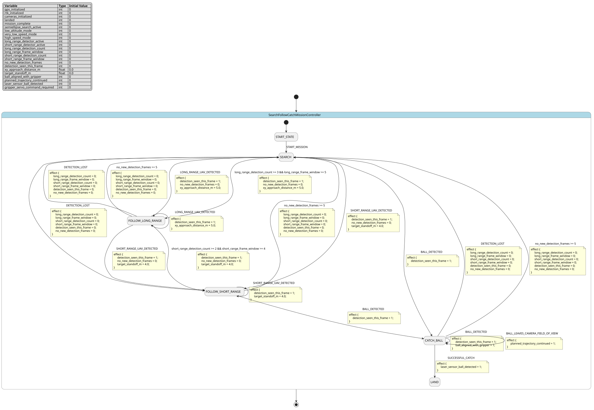

# Case `097` ✈️ — Search-follow-catch mission controller

**Bucket**: FSM-basic  |  **Paper**: #372 `autonomous-aerial-robot-high-speed-search-intercept`

- [STM.md case section](../../../sources/autonomous-aerial-robot-high-speed-search-intercept/STM.md)
- [paper PDF](../../../sources/autonomous-aerial-robot-high-speed-search-intercept/paper.pdf)
- [expansion NL JSON (含 provenance)](../expansions/097.json)
- [codex 起草笔记](../ref_stms/codex_drafts/097.notes.md)

## 1. 英文 NL（含 inline [E] 溯源 markers）

> 这是 codex 评审阶段生成的扩充 NL（commit `259e6ea7`），每条 substantive 信息带 `[En]` 标记。完整 provenance 表见 [expansion JSON](../expansions/097.json)。

The mission controller is a finite-state controller for a UAV mission that searches, follows, and grasps a moving object; initially the UAV is landed with GPS, RTK, and cameras initialized, and START_MISSION is the operator order to start [E1] [E2] [E3] [E4]. In SEARCH, the UAV flies a predefined semiellipse near the long-axis border and middle of that axis, at low altitude and very low speed and acceleration, so both UAV detectors stay active and can obtain sharp images against a uniform sky background [E5] [E6] [E7]. The controller changes from search to long-range following when the Long-Range Detector reaches three detections in five consecutive frames, and each new long-range detection commands fast UAV motion toward a point 5 m toward the detection in the XY plane [E8] [E9]. It then changes to short-range following when the Short-Range Detector reaches two detections in four consecutive frames, keeps about 4 m from the target, and disables the Long-Range UAV Detector so the short-range detector gets the computation power [E10] [E11]. When the ball is detected, the controller enters CATCH_BALL, commands motion toward the ball detection, aligns the ball with the gripper, and continues the planned trajectory after the ball leaves the camera field of view [E12] [E13] [E14]. If no new detections arrive for five consecutive frames, the FSM has a DETECTION_LOST transition event [E15]. A successful catch is declared only when the laser sensor inside the gripper detects the ball, after which the UAV lands at a given position and ends the mission [E16] [E17]. The gripper hardware includes a servomotor controlled through an Arduino Nano for closing and opening when high-level mission components require the catching maneuver [E18].

## 2. 中文 NL 译文（claude 翻译，保留 [En] markers）

任务控制器是一个用于无人机任务的有限状态控制器，该任务搜索、跟随并抓取一个运动目标；初始时无人机已着陆，GPS、RTK 和摄像头均已初始化，START_MISSION 是操作员发出的启动任务命令 [E1] [E2] [E3] [E4]。在 SEARCH 状态下，无人机沿长轴边界及该轴中部附近以预定半椭圆轨迹飞行，保持低高度、极低速度和加速度，使无人机的两个检测器均保持激活，并能够在均匀的天空背景下获取清晰图像 [E5] [E6] [E7]。当长距检测器在连续 5 帧中达到 3 次检测时，控制器从搜索切换到长距跟随，每次新的长距检测都会指令无人机在 XY 平面内快速朝检测点方向移动 5 m [E8] [E9]。随后，当短距检测器在连续 4 帧中达到 2 次检测时，控制器切换到短距跟随，保持距目标约 4 m，并禁用长距无人机检测器，使短距检测器获得算力 [E10] [E11]。当检测到球时，控制器进入 CATCH_BALL 状态，指令朝球的检测位置运动，将球与机械爪对齐，并在球离开相机视场后继续沿规划轨迹飞行 [E12] [E13] [E14]。如果连续 5 帧没有新的检测结果到达，则 FSM 触发 DETECTION_LOST 转移事件 [E15]。只有当机械爪内部的激光传感器检测到球时，才宣告抓取成功，此后无人机在给定位置降落并结束任务 [E16] [E17]。机械爪硬件包含一个通过 Arduino Nano 控制的伺服电机，用于在高层任务组件需要执行抓取动作时进行闭合与张开 [E18]。

## 3. Reference pyfcstm STM (codex 起草，待用户签字)

### 3.1 状态机图（pyfcstm visualize SVG）



PlantUML 源文件：[`../diagrams/097.puml`](../diagrams/097.puml)

### 3.2 pyfcstm DSL 源码

```pyfcstm
def int gps_initialized = 0;
def int rtk_initialized = 0;
def int cameras_initialized = 0;
def int landed = 0;
def int mission_complete = 0;
def int semiellipse_search_active = 0;
def int low_altitude_mode = 0;
def int very_low_speed_mode = 0;
def int high_speed_mode = 0;
def int long_range_detector_active = 0;
def int short_range_detector_active = 0;
def int long_range_detection_count = 0;
def int long_range_frame_window = 0;
def int short_range_detection_count = 0;
def int short_range_frame_window = 0;
def int no_new_detection_frames = 0;
def int detection_seen_this_frame = 0;
def float xy_approach_distance_m = 0.0;
def float target_standoff_m = 0.0;
def int ball_aligned_with_gripper = 0;
def int planned_trajectory_continued = 0;
def int laser_sensor_ball_detected = 0;
def int gripper_servo_command_required = 0;

state SearchFollowCatchMissionController {
    event START_MISSION;
    event BALL_DETECTED;
    event BALL_LEAVES_CAMERA_FIELD_OF_VIEW;
    event LONG_RANGE_UAV_DETECTED;
    event SHORT_RANGE_UAV_DETECTED;
    event DETECTION_LOST;
    event SUCCESSFUL_CATCH;

    [*] -> START_STATE;

    state START_STATE {
        enter {
            gps_initialized = 1;
            rtk_initialized = 1;
            cameras_initialized = 1;
            landed = 1;
            mission_complete = 0;
            semiellipse_search_active = 0;
            low_altitude_mode = 0;
            very_low_speed_mode = 0;
            high_speed_mode = 0;
            long_range_detector_active = 0;
            short_range_detector_active = 0;
            long_range_detection_count = 0;
            long_range_frame_window = 0;
            short_range_detection_count = 0;
            short_range_frame_window = 0;
            no_new_detection_frames = 0;
            detection_seen_this_frame = 0;
            xy_approach_distance_m = 0.0;
            target_standoff_m = 0.0;
            ball_aligned_with_gripper = 0;
            planned_trajectory_continued = 0;
            laser_sensor_ball_detected = 0;
            gripper_servo_command_required = 0;
        }
        enter abstract InitializeGpsRtkCameras;
    }

    state SEARCH {
        enter {
            landed = 0;
            semiellipse_search_active = 1;
            low_altitude_mode = 1;
            very_low_speed_mode = 1;
            high_speed_mode = 0;
            long_range_detector_active = 1;
            short_range_detector_active = 1;
            target_standoff_m = 0.0;
            ball_aligned_with_gripper = 0;
            planned_trajectory_continued = 0;
            laser_sensor_ball_detected = 0;
            gripper_servo_command_required = 0;
        }
        enter abstract CommandSemiellipseSearchTrajectory;
        enter abstract ActivateBothUavDetectors;
    }

    state FOLLOW_LONG_RANGE {
        enter {
            semiellipse_search_active = 0;
            low_altitude_mode = 1;
            very_low_speed_mode = 0;
            high_speed_mode = 1;
            long_range_detector_active = 1;
            short_range_detector_active = 1;
            xy_approach_distance_m = 5.0;
            target_standoff_m = 0.0;
        }
        enter abstract CommandFastFiveMeterXyApproach;
        during {
            if [detection_seen_this_frame > 0] {
                no_new_detection_frames = 0;
                detection_seen_this_frame = 0;
            } else {
                no_new_detection_frames = no_new_detection_frames + 1;
            }
        }
    }

    state FOLLOW_SHORT_RANGE {
        enter {
            semiellipse_search_active = 0;
            low_altitude_mode = 1;
            very_low_speed_mode = 0;
            high_speed_mode = 1;
            long_range_detector_active = 0;
            short_range_detector_active = 1;
            target_standoff_m = 4.0;
        }
        enter abstract DisableLongRangeUavDetector;
        enter abstract CommandFourMeterTargetStandoff;
        during {
            if [detection_seen_this_frame > 0] {
                no_new_detection_frames = 0;
                detection_seen_this_frame = 0;
            } else {
                no_new_detection_frames = no_new_detection_frames + 1;
            }
        }
    }

    state CATCH_BALL {
        enter {
            semiellipse_search_active = 0;
            low_altitude_mode = 1;
            very_low_speed_mode = 0;
            high_speed_mode = 1;
            long_range_detector_active = 0;
            short_range_detector_active = 1;
            ball_aligned_with_gripper = 1;
            gripper_servo_command_required = 1;
        }
        enter abstract CommandMotionTowardBallDetection;
        enter abstract AlignBallWithGripper;
        enter abstract PrepareArduinoNanoGripperServo;
        during abstract ReadLaserSensorInsideGripper;
        during {
            if [detection_seen_this_frame > 0] {
                no_new_detection_frames = 0;
                detection_seen_this_frame = 0;
            } else {
                no_new_detection_frames = no_new_detection_frames + 1;
            }
        }
    }

    state LAND {
        enter {
            landed = 1;
            mission_complete = 1;
            semiellipse_search_active = 0;
            low_altitude_mode = 0;
            very_low_speed_mode = 0;
            high_speed_mode = 0;
            long_range_detector_active = 0;
            short_range_detector_active = 0;
            gripper_servo_command_required = 0;
        }
        enter abstract LandAtGivenPosition;
    }

    START_STATE -> SEARCH : START_MISSION;
    SEARCH -> FOLLOW_LONG_RANGE : LONG_RANGE_UAV_DETECTED effect {
        detection_seen_this_frame = 1;
        no_new_detection_frames = 0;
        xy_approach_distance_m = 5.0;
    };
    SEARCH -> FOLLOW_LONG_RANGE : if [long_range_detection_count >= 3 && long_range_frame_window >= 5] effect {
        detection_seen_this_frame = 1;
        no_new_detection_frames = 0;
        xy_approach_distance_m = 5.0;
    };
    FOLLOW_LONG_RANGE -> FOLLOW_LONG_RANGE : LONG_RANGE_UAV_DETECTED effect {
        detection_seen_this_frame = 1;
        xy_approach_distance_m = 5.0;
    };
    SEARCH -> FOLLOW_SHORT_RANGE : SHORT_RANGE_UAV_DETECTED effect {
        detection_seen_this_frame = 1;
        no_new_detection_frames = 0;
        target_standoff_m = 4.0;
    };
    FOLLOW_LONG_RANGE -> FOLLOW_SHORT_RANGE : SHORT_RANGE_UAV_DETECTED effect {
        detection_seen_this_frame = 1;
        no_new_detection_frames = 0;
        target_standoff_m = 4.0;
    };
    FOLLOW_LONG_RANGE -> FOLLOW_SHORT_RANGE : if [short_range_detection_count >= 2 && short_range_frame_window >= 4] effect {
        detection_seen_this_frame = 1;
        no_new_detection_frames = 0;
        target_standoff_m = 4.0;
    };
    FOLLOW_SHORT_RANGE -> FOLLOW_SHORT_RANGE : SHORT_RANGE_UAV_DETECTED effect {
        detection_seen_this_frame = 1;
        target_standoff_m = 4.0;
    };
    SEARCH -> CATCH_BALL : BALL_DETECTED effect {
        detection_seen_this_frame = 1;
    };
    FOLLOW_SHORT_RANGE -> CATCH_BALL : BALL_DETECTED effect {
        detection_seen_this_frame = 1;
    };
    CATCH_BALL -> CATCH_BALL : BALL_DETECTED effect {
        detection_seen_this_frame = 1;
        ball_aligned_with_gripper = 1;
    };
    CATCH_BALL -> CATCH_BALL : BALL_LEAVES_CAMERA_FIELD_OF_VIEW effect {
        planned_trajectory_continued = 1;
    };
    FOLLOW_LONG_RANGE -> SEARCH : DETECTION_LOST effect {
        long_range_detection_count = 0;
        long_range_frame_window = 0;
        short_range_detection_count = 0;
        short_range_frame_window = 0;
        detection_seen_this_frame = 0;
        no_new_detection_frames = 0;
    };
    FOLLOW_LONG_RANGE -> SEARCH : if [no_new_detection_frames >= 5] effect {
        long_range_detection_count = 0;
        long_range_frame_window = 0;
        short_range_detection_count = 0;
        short_range_frame_window = 0;
        detection_seen_this_frame = 0;
        no_new_detection_frames = 0;
    };
    FOLLOW_SHORT_RANGE -> SEARCH : DETECTION_LOST effect {
        long_range_detection_count = 0;
        long_range_frame_window = 0;
        short_range_detection_count = 0;
        short_range_frame_window = 0;
        detection_seen_this_frame = 0;
        no_new_detection_frames = 0;
    };
    FOLLOW_SHORT_RANGE -> SEARCH : if [no_new_detection_frames >= 5] effect {
        long_range_detection_count = 0;
        long_range_frame_window = 0;
        short_range_detection_count = 0;
        short_range_frame_window = 0;
        detection_seen_this_frame = 0;
        no_new_detection_frames = 0;
    };
    CATCH_BALL -> SEARCH : DETECTION_LOST effect {
        long_range_detection_count = 0;
        long_range_frame_window = 0;
        short_range_detection_count = 0;
        short_range_frame_window = 0;
        detection_seen_this_frame = 0;
        no_new_detection_frames = 0;
    };
    CATCH_BALL -> SEARCH : if [no_new_detection_frames >= 5] effect {
        long_range_detection_count = 0;
        long_range_frame_window = 0;
        short_range_detection_count = 0;
        short_range_frame_window = 0;
        detection_seen_this_frame = 0;
        no_new_detection_frames = 0;
    };
    CATCH_BALL -> LAND : SUCCESSFUL_CATCH effect {
        laser_sensor_ball_detected = 1;
    };
}

```

**codex 自报 C-axis 使用情况**:
- C1: ✓
- C2: ✓
- C3: ✗
- C4: ✓

**codex 自报 scenarios 覆盖情况**:
- 模式数: 6
- guards 数: 5
- fault paths 数: 3
- per-cycle 行为数: 3
- 硬件 effectors 数: 11

## 4. Test scenarios（覆盖 NL 全特性，必须 100% pass）

```json
{
  "scenarios": [
    {
      "name": "startup_to_search",
      "description": "覆盖 E3/E4/E5/E6/E7：默认初始化后由 START_MISSION 进入 SEARCH，并启用低空半椭圆搜索与双探测器。",
      "initial_state": null,
      "initial_vars": {},
      "steps": [
        {
          "before_cycles": 0,
          "events": [],
          "expected_state": "SearchFollowCatchMissionController.START_STATE",
          "expected_vars": {
            "gps_initialized": 1,
            "rtk_initialized": 1,
            "cameras_initialized": 1,
            "landed": 1
          },
          "name": "default_enters_start_state"
        },
        {
          "before_cycles": 0,
          "events": [
            "SearchFollowCatchMissionController.START_MISSION"
          ],
          "expected_state": "SearchFollowCatchMissionController.SEARCH",
          "expected_vars": {
            "semiellipse_search_active": 1,
            "low_altitude_mode": 1,
            "very_low_speed_mode": 1,
            "long_range_detector_active": 1,
            "short_range_detector_active": 1,
            "landed": 0
          },
          "name": "operator_starts_search"
        }
      ]
    },
    {
      "name": "figure17_event_path",
      "description": "覆盖 Figure 17/Table 1 的事件主线：START_MISSION、LONG_RANGE_UAV_DETECTED、SHORT_RANGE_UAV_DETECTED、BALL_DETECTED、DETECTION_LOST、SUCCESSFUL_CATCH。",
      "initial_state": null,
      "initial_vars": {},
      "steps": [
        {
          "before_cycles": 0,
          "events": [],
          "expected_state": "SearchFollowCatchMissionController.START_STATE",
          "expected_vars": {
            "gps_initialized": 1,
            "rtk_initialized": 1,
            "cameras_initialized": 1,
            "landed": 1
          },
          "name": "default_start"
        },
        {
          "before_cycles": 0,
          "events": [
            "SearchFollowCatchMissionController.START_MISSION"
          ],
          "expected_state": "SearchFollowCatchMissionController.SEARCH",
          "expected_vars": {
            "semiellipse_search_active": 1,
            "long_range_detector_active": 1,
            "short_range_detector_active": 1
          },
          "name": "start_mission_to_search"
        },
        {
          "before_cycles": 0,
          "events": [
            "SearchFollowCatchMissionController.LONG_RANGE_UAV_DETECTED"
          ],
          "expected_state": "SearchFollowCatchMissionController.FOLLOW_LONG_RANGE",
          "expected_vars": {
            "xy_approach_distance_m": 5.0,
            "high_speed_mode": 1,
            "detection_seen_this_frame": 0,
            "no_new_detection_frames": 0
          },
          "name": "long_range_event_to_follow_long"
        },
        {
          "before_cycles": 0,
          "events": [
            "SearchFollowCatchMissionController.DETECTION_LOST"
          ],
          "expected_state": "SearchFollowCatchMissionController.SEARCH",
          "expected_vars": {
            "semiellipse_search_active": 1,
            "long_range_detector_active": 1,
            "short_range_detector_active": 1,
            "no_new_detection_frames": 0
          },
          "name": "lost_from_follow_long_to_search"
        },
        {
          "before_cycles": 0,
          "events": [
            "SearchFollowCatchMissionController.SHORT_RANGE_UAV_DETECTED"
          ],
          "expected_state": "SearchFollowCatchMissionController.FOLLOW_SHORT_RANGE",
          "expected_vars": {
            "target_standoff_m": 4.0,
            "long_range_detector_active": 0,
            "short_range_detector_active": 1,
            "detection_seen_this_frame": 0,
            "no_new_detection_frames": 0
          },
          "name": "short_range_event_to_follow_short"
        },
        {
          "before_cycles": 0,
          "events": [
            "SearchFollowCatchMissionController.DETECTION_LOST"
          ],
          "expected_state": "SearchFollowCatchMissionController.SEARCH",
          "expected_vars": {
            "semiellipse_search_active": 1,
            "long_range_detector_active": 1,
            "short_range_detector_active": 1,
            "high_speed_mode": 0
          },
          "name": "lost_from_follow_short_to_search"
        },
        {
          "before_cycles": 0,
          "events": [
            "SearchFollowCatchMissionController.BALL_DETECTED"
          ],
          "expected_state": "SearchFollowCatchMissionController.CATCH_BALL",
          "expected_vars": {
            "ball_aligned_with_gripper": 1,
            "gripper_servo_command_required": 1,
            "long_range_detector_active": 0,
            "short_range_detector_active": 1,
            "detection_seen_this_frame": 0
          },
          "name": "ball_event_to_catch"
        },
        {
          "before_cycles": 0,
          "events": [
            "SearchFollowCatchMissionController.SUCCESSFUL_CATCH"
          ],
          "expected_state": "SearchFollowCatchMissionController.LAND",
          "expected_vars": {
            "laser_sensor_ball_detected": 1,
            "landed": 1,
            "mission_complete": 1,
            "long_range_detector_active": 0,
            "short_range_detector_active": 0
          },
          "name": "successful_catch_to_land"
        }
      ]
    },
    {
      "name": "long_range_guard_before_threshold",
      "description": "覆盖 E8 的边界前条件：只有 2/5 长距检测时不能离开 SEARCH。",
      "initial_state": "SearchFollowCatchMissionController.SEARCH",
      "initial_vars": {
        "gps_initialized": 1,
        "rtk_initialized": 1,
        "cameras_initialized": 1,
        "landed": 0,
        "mission_complete": 0,
        "semiellipse_search_active": 1,
        "low_altitude_mode": 1,
        "very_low_speed_mode": 1,
        "high_speed_mode": 0,
        "long_range_detector_active": 1,
        "short_range_detector_active": 1,
        "long_range_detection_count": 2,
        "long_range_frame_window": 5,
        "short_range_detection_count": 0,
        "short_range_frame_window": 0,
        "no_new_detection_frames": 0,
        "detection_seen_this_frame": 0,
        "xy_approach_distance_m": 0.0,
        "target_standoff_m": 0.0,
        "ball_aligned_with_gripper": 0,
        "planned_trajectory_continued": 0,
        "laser_sensor_ball_detected": 0,
        "gripper_servo_command_required": 0
      },
      "steps": [
        {
          "before_cycles": 0,
          "events": [],
          "expected_state": "SearchFollowCatchMissionController.SEARCH",
          "expected_vars": {
            "long_range_detection_count": 2,
            "long_range_frame_window": 5,
            "semiellipse_search_active": 1,
            "high_speed_mode": 0
          },
          "name": "two_of_five_stays_in_search"
        }
      ]
    },
    {
      "name": "long_range_guard_reaches_threshold",
      "description": "覆盖 E8/E9：3/5 长距检测触发 SEARCH 到 FOLLOW_LONG_RANGE，并设置 5 m XY 快速接近命令。",
      "initial_state": "SearchFollowCatchMissionController.SEARCH",
      "initial_vars": {
        "gps_initialized": 1,
        "rtk_initialized": 1,
        "cameras_initialized": 1,
        "landed": 0,
        "mission_complete": 0,
        "semiellipse_search_active": 1,
        "low_altitude_mode": 1,
        "very_low_speed_mode": 1,
        "high_speed_mode": 0,
        "long_range_detector_active": 1,
        "short_range_detector_active": 1,
        "long_range_detection_count": 3,
        "long_range_frame_window": 5,
        "short_range_detection_count": 0,
        "short_range_frame_window": 0,
        "no_new_detection_frames": 0,
        "detection_seen_this_frame": 0,
        "xy_approach_distance_m": 0.0,
        "target_standoff_m": 0.0,
        "ball_aligned_with_gripper": 0,
        "planned_trajectory_continued": 0,
        "laser_sensor_ball_detected": 0,
        "gripper_servo_command_required": 0
      },
      "steps": [
        {
          "before_cycles": 0,
          "events": [],
          "expected_state": "SearchFollowCatchMissionController.FOLLOW_LONG_RANGE",
          "expected_vars": {
            "xy_approach_distance_m": 5.0,
            "high_speed_mode": 1,
            "low_altitude_mode": 1,
            "detection_seen_this_frame": 0,
            "no_new_detection_frames": 0
          },
          "name": "three_of_five_enters_long_range_follow"
        }
      ]
    },
    {
      "name": "long_range_new_detection_command",
      "description": "覆盖 E9：FOLLOW_LONG_RANGE 中新的长距检测再次命令 5 m XY 快速接近并清零 detection lost 计数。",
      "initial_state": "SearchFollowCatchMissionController.FOLLOW_LONG_RANGE",
      "initial_vars": {
        "gps_initialized": 1,
        "rtk_initialized": 1,
        "cameras_initialized": 1,
        "landed": 0,
        "mission_complete": 0,
        "semiellipse_search_active": 0,
        "low_altitude_mode": 1,
        "very_low_speed_mode": 0,
        "high_speed_mode": 1,
        "long_range_detector_active": 1,
        "short_range_detector_active": 1,
        "long_range_detection_count": 3,
        "long_range_frame_window": 5,
        "short_range_detection_count": 0,
        "short_range_frame_window": 0,
        "no_new_detection_frames": 3,
        "detection_seen_this_frame": 0,
        "xy_approach_distance_m": 0.0,
        "target_standoff_m": 0.0,
        "ball_aligned_with_gripper": 0,
        "planned_trajectory_continued": 0,
        "laser_sensor_ball_detected": 0,
        "gripper_servo_command_required": 0
      },
      "steps": [
        {
          "before_cycles": 0,
          "events": [
            "SearchFollowCatchMissionController.LONG_RANGE_UAV_DETECTED"
          ],
          "expected_state": "SearchFollowCatchMissionController.FOLLOW_LONG_RANGE",
          "expected_vars": {
            "xy_approach_distance_m": 5.0,
            "no_new_detection_frames": 0,
            "detection_seen_this_frame": 0,
            "high_speed_mode": 1
          },
          "name": "new_long_range_detection_refreshes_motion"
        }
      ]
    },
    {
      "name": "short_range_guard_before_threshold",
      "description": "覆盖 E10 的边界前条件：只有 1/4 短距检测时仍停留在 FOLLOW_LONG_RANGE。",
      "initial_state": "SearchFollowCatchMissionController.FOLLOW_LONG_RANGE",
      "initial_vars": {
        "gps_initialized": 1,
        "rtk_initialized": 1,
        "cameras_initialized": 1,
        "landed": 0,
        "mission_complete": 0,
        "semiellipse_search_active": 0,
        "low_altitude_mode": 1,
        "very_low_speed_mode": 0,
        "high_speed_mode": 1,
        "long_range_detector_active": 1,
        "short_range_detector_active": 1,
        "long_range_detection_count": 3,
        "long_range_frame_window": 5,
        "short_range_detection_count": 1,
        "short_range_frame_window": 4,
        "no_new_detection_frames": 0,
        "detection_seen_this_frame": 0,
        "xy_approach_distance_m": 5.0,
        "target_standoff_m": 0.0,
        "ball_aligned_with_gripper": 0,
        "planned_trajectory_continued": 0,
        "laser_sensor_ball_detected": 0,
        "gripper_servo_command_required": 0
      },
      "steps": [
        {
          "before_cycles": 0,
          "events": [],
          "expected_state": "SearchFollowCatchMissionController.FOLLOW_LONG_RANGE",
          "expected_vars": {
            "short_range_detection_count": 1,
            "short_range_frame_window": 4,
            "target_standoff_m": 0.0,
            "no_new_detection_frames": 1
          },
          "name": "one_of_four_stays_long_range"
        }
      ]
    },
    {
      "name": "short_range_guard_reaches_threshold",
      "description": "覆盖 E10/E11：2/4 短距检测触发 FOLLOW_SHORT_RANGE，并关闭长距探测器、保持 4 m 距离。",
      "initial_state": "SearchFollowCatchMissionController.FOLLOW_LONG_RANGE",
      "initial_vars": {
        "gps_initialized": 1,
        "rtk_initialized": 1,
        "cameras_initialized": 1,
        "landed": 0,
        "mission_complete": 0,
        "semiellipse_search_active": 0,
        "low_altitude_mode": 1,
        "very_low_speed_mode": 0,
        "high_speed_mode": 1,
        "long_range_detector_active": 1,
        "short_range_detector_active": 1,
        "long_range_detection_count": 3,
        "long_range_frame_window": 5,
        "short_range_detection_count": 2,
        "short_range_frame_window": 4,
        "no_new_detection_frames": 0,
        "detection_seen_this_frame": 0,
        "xy_approach_distance_m": 5.0,
        "target_standoff_m": 0.0,
        "ball_aligned_with_gripper": 0,
        "planned_trajectory_continued": 0,
        "laser_sensor_ball_detected": 0,
        "gripper_servo_command_required": 0
      },
      "steps": [
        {
          "before_cycles": 0,
          "events": [],
          "expected_state": "SearchFollowCatchMissionController.FOLLOW_SHORT_RANGE",
          "expected_vars": {
            "target_standoff_m": 4.0,
            "long_range_detector_active": 0,
            "short_range_detector_active": 1,
            "high_speed_mode": 1,
            "detection_seen_this_frame": 0,
            "no_new_detection_frames": 0
          },
          "name": "two_of_four_enters_short_range_follow"
        }
      ]
    },
    {
      "name": "detection_lost_after_five_empty_frames",
      "description": "覆盖 E15 与周期行为：FOLLOW_SHORT_RANGE 中连续无新检测帧累计到 5 后触发 detection-lost 回 SEARCH。",
      "initial_state": "SearchFollowCatchMissionController.FOLLOW_SHORT_RANGE",
      "initial_vars": {
        "gps_initialized": 1,
        "rtk_initialized": 1,
        "cameras_initialized": 1,
        "landed": 0,
        "mission_complete": 0,
        "semiellipse_search_active": 0,
        "low_altitude_mode": 1,
        "very_low_speed_mode": 0,
        "high_speed_mode": 1,
        "long_range_detector_active": 0,
        "short_range_detector_active": 1,
        "long_range_detection_count": 3,
        "long_range_frame_window": 5,
        "short_range_detection_count": 2,
        "short_range_frame_window": 4,
        "no_new_detection_frames": 0,
        "detection_seen_this_frame": 0,
        "xy_approach_distance_m": 5.0,
        "target_standoff_m": 4.0,
        "ball_aligned_with_gripper": 0,
        "planned_trajectory_continued": 0,
        "laser_sensor_ball_detected": 0,
        "gripper_servo_command_required": 0
      },
      "steps": [
        {
          "before_cycles": 0,
          "events": [],
          "expected_state": "SearchFollowCatchMissionController.FOLLOW_SHORT_RANGE",
          "expected_vars": {
            "no_new_detection_frames": 1,
            "target_standoff_m": 4.0,
            "long_range_detector_active": 0
          },
          "name": "empty_frame_1"
        },
        {
          "before_cycles": 0,
          "events": [],
          "expected_state": "SearchFollowCatchMissionController.FOLLOW_SHORT_RANGE",
          "expected_vars": {
            "no_new_detection_frames": 2,
            "target_standoff_m": 4.0,
            "long_range_detector_active": 0
          },
          "name": "empty_frame_2"
        },
        {
          "before_cycles": 0,
          "events": [],
          "expected_state": "SearchFollowCatchMissionController.FOLLOW_SHORT_RANGE",
          "expected_vars": {
            "no_new_detection_frames": 3,
            "target_standoff_m": 4.0,
            "long_range_detector_active": 0
          },
          "name": "empty_frame_3"
        },
        {
          "before_cycles": 0,
          "events": [],
          "expected_state": "SearchFollowCatchMissionController.FOLLOW_SHORT_RANGE",
          "expected_vars": {
            "no_new_detection_frames": 4,
            "target_standoff_m": 4.0,
            "long_range_detector_active": 0
          },
          "name": "empty_frame_4"
        },
        {
          "before_cycles": 0,
          "events": [],
          "expected_state": "SearchFollowCatchMissionController.FOLLOW_SHORT_RANGE",
          "expected_vars": {
            "no_new_detection_frames": 5,
            "target_standoff_m": 4.0,
            "long_range_detector_active": 0
          },
          "name": "empty_frame_5_threshold_counted"
        },
        {
          "before_cycles": 0,
          "events": [],
          "expected_state": "SearchFollowCatchMissionController.SEARCH",
          "expected_vars": {
            "no_new_detection_frames": 0,
            "semiellipse_search_active": 1,
            "long_range_detector_active": 1,
            "short_range_detector_active": 1,
            "high_speed_mode": 0
          },
          "name": "detection_lost_guard_returns_search"
        }
      ]
    },
    {
      "name": "detection_lost_guard_from_follow_long",
      "description": "覆盖 E15 的 FOLLOW_LONG_RANGE 数值 guard：无新检测帧达到 5 后回到 SEARCH。",
      "initial_state": "SearchFollowCatchMissionController.FOLLOW_LONG_RANGE",
      "initial_vars": {
        "gps_initialized": 1,
        "rtk_initialized": 1,
        "cameras_initialized": 1,
        "landed": 0,
        "mission_complete": 0,
        "semiellipse_search_active": 0,
        "low_altitude_mode": 1,
        "very_low_speed_mode": 0,
        "high_speed_mode": 1,
        "long_range_detector_active": 1,
        "short_range_detector_active": 1,
        "long_range_detection_count": 3,
        "long_range_frame_window": 5,
        "short_range_detection_count": 0,
        "short_range_frame_window": 0,
        "no_new_detection_frames": 4,
        "detection_seen_this_frame": 0,
        "xy_approach_distance_m": 5.0,
        "target_standoff_m": 0.0,
        "ball_aligned_with_gripper": 0,
        "planned_trajectory_continued": 0,
        "laser_sensor_ball_detected": 0,
        "gripper_servo_command_required": 0
      },
      "steps": [
        {
          "before_cycles": 0,
          "events": [],
          "expected_state": "SearchFollowCatchMissionController.FOLLOW_LONG_RANGE",
          "expected_vars": {
            "no_new_detection_frames": 5,
            "xy_approach_distance_m": 5.0,
            "high_speed_mode": 1
          },
          "name": "fifth_empty_frame_counted"
        },
        {
          "before_cycles": 0,
          "events": [],
          "expected_state": "SearchFollowCatchMissionController.SEARCH",
          "expected_vars": {
            "no_new_detection_frames": 0,
            "semiellipse_search_active": 1,
            "long_range_detector_active": 1,
            "short_range_detector_active": 1
          },
          "name": "follow_long_lost_guard_returns_search"
        }
      ]
    },
    {
      "name": "detection_lost_guard_from_catch_ball",
      "description": "覆盖 E15 的 CATCH_BALL 数值 guard：抓球阶段无新检测帧达到 5 后回到 SEARCH。",
      "initial_state": "SearchFollowCatchMissionController.CATCH_BALL",
      "initial_vars": {
        "gps_initialized": 1,
        "rtk_initialized": 1,
        "cameras_initialized": 1,
        "landed": 0,
        "mission_complete": 0,
        "semiellipse_search_active": 0,
        "low_altitude_mode": 1,
        "very_low_speed_mode": 0,
        "high_speed_mode": 1,
        "long_range_detector_active": 0,
        "short_range_detector_active": 1,
        "long_range_detection_count": 3,
        "long_range_frame_window": 5,
        "short_range_detection_count": 2,
        "short_range_frame_window": 4,
        "no_new_detection_frames": 4,
        "detection_seen_this_frame": 0,
        "xy_approach_distance_m": 5.0,
        "target_standoff_m": 4.0,
        "ball_aligned_with_gripper": 1,
        "planned_trajectory_continued": 0,
        "laser_sensor_ball_detected": 0,
        "gripper_servo_command_required": 1
      },
      "steps": [
        {
          "before_cycles": 0,
          "events": [],
          "expected_state": "SearchFollowCatchMissionController.CATCH_BALL",
          "expected_vars": {
            "no_new_detection_frames": 5,
            "ball_aligned_with_gripper": 1,
            "gripper_servo_command_required": 1
          },
          "name": "catch_fifth_empty_frame_counted"
        },
        {
          "before_cycles": 0,
          "events": [],
          "expected_state": "SearchFollowCatchMissionController.SEARCH",
          "expected_vars": {
            "no_new_detection_frames": 0,
            "semiellipse_search_active": 1,
            "long_range_detector_active": 1,
            "short_range_detector_active": 1,
            "gripper_servo_command_required": 0
          },
          "name": "catch_lost_guard_returns_search"
        }
      ]
    },
    {
      "name": "detection_lost_event_from_follow_long",
      "description": "覆盖 Figure 17/E15：FOLLOW_LONG_RANGE 下 DETECTION_LOST 事件回到 SEARCH 并重置检测窗口。",
      "initial_state": "SearchFollowCatchMissionController.FOLLOW_LONG_RANGE",
      "initial_vars": {
        "gps_initialized": 1,
        "rtk_initialized": 1,
        "cameras_initialized": 1,
        "landed": 0,
        "mission_complete": 0,
        "semiellipse_search_active": 0,
        "low_altitude_mode": 1,
        "very_low_speed_mode": 0,
        "high_speed_mode": 1,
        "long_range_detector_active": 1,
        "short_range_detector_active": 1,
        "long_range_detection_count": 3,
        "long_range_frame_window": 5,
        "short_range_detection_count": 1,
        "short_range_frame_window": 3,
        "no_new_detection_frames": 2,
        "detection_seen_this_frame": 0,
        "xy_approach_distance_m": 5.0,
        "target_standoff_m": 0.0,
        "ball_aligned_with_gripper": 0,
        "planned_trajectory_continued": 0,
        "laser_sensor_ball_detected": 0,
        "gripper_servo_command_required": 0
      },
      "steps": [
        {
          "before_cycles": 0,
          "events": [
            "SearchFollowCatchMissionController.DETECTION_LOST"
          ],
          "expected_state": "SearchFollowCatchMissionController.SEARCH",
          "expected_vars": {
            "long_range_detection_count": 0,
            "short_range_detection_count": 0,
            "no_new_detection_frames": 0,
            "semiellipse_search_active": 1,
            "long_range_detector_active": 1
          },
          "name": "follow_long_lost_returns_search"
        }
      ]
    },
    {
      "name": "detection_lost_event_from_follow_short",
      "description": "覆盖 Figure 17/E15：FOLLOW_SHORT_RANGE 下 DETECTION_LOST 事件回到 SEARCH 并恢复双探测器搜索。",
      "initial_state": "SearchFollowCatchMissionController.FOLLOW_SHORT_RANGE",
      "initial_vars": {
        "gps_initialized": 1,
        "rtk_initialized": 1,
        "cameras_initialized": 1,
        "landed": 0,
        "mission_complete": 0,
        "semiellipse_search_active": 0,
        "low_altitude_mode": 1,
        "very_low_speed_mode": 0,
        "high_speed_mode": 1,
        "long_range_detector_active": 0,
        "short_range_detector_active": 1,
        "long_range_detection_count": 3,
        "long_range_frame_window": 5,
        "short_range_detection_count": 2,
        "short_range_frame_window": 4,
        "no_new_detection_frames": 3,
        "detection_seen_this_frame": 0,
        "xy_approach_distance_m": 5.0,
        "target_standoff_m": 4.0,
        "ball_aligned_with_gripper": 0,
        "planned_trajectory_continued": 0,
        "laser_sensor_ball_detected": 0,
        "gripper_servo_command_required": 0
      },
      "steps": [
        {
          "before_cycles": 0,
          "events": [
            "SearchFollowCatchMissionController.DETECTION_LOST"
          ],
          "expected_state": "SearchFollowCatchMissionController.SEARCH",
          "expected_vars": {
            "short_range_detection_count": 0,
            "no_new_detection_frames": 0,
            "semiellipse_search_active": 1,
            "long_range_detector_active": 1,
            "short_range_detector_active": 1,
            "high_speed_mode": 0
          },
          "name": "follow_short_lost_returns_search"
        }
      ]
    },
    {
      "name": "catch_ball_continue_and_land",
      "description": "覆盖 E12/E13/E14/E16/E17/E18：球检测进入抓取、出视野后继续轨迹，激光确认后降落结束。",
      "initial_state": "SearchFollowCatchMissionController.FOLLOW_SHORT_RANGE",
      "initial_vars": {
        "gps_initialized": 1,
        "rtk_initialized": 1,
        "cameras_initialized": 1,
        "landed": 0,
        "mission_complete": 0,
        "semiellipse_search_active": 0,
        "low_altitude_mode": 1,
        "very_low_speed_mode": 0,
        "high_speed_mode": 1,
        "long_range_detector_active": 0,
        "short_range_detector_active": 1,
        "long_range_detection_count": 3,
        "long_range_frame_window": 5,
        "short_range_detection_count": 2,
        "short_range_frame_window": 4,
        "no_new_detection_frames": 0,
        "detection_seen_this_frame": 0,
        "xy_approach_distance_m": 5.0,
        "target_standoff_m": 4.0,
        "ball_aligned_with_gripper": 0,
        "planned_trajectory_continued": 0,
        "laser_sensor_ball_detected": 0,
        "gripper_servo_command_required": 0
      },
      "steps": [
        {
          "before_cycles": 0,
          "events": [
            "SearchFollowCatchMissionController.BALL_DETECTED"
          ],
          "expected_state": "SearchFollowCatchMissionController.CATCH_BALL",
          "expected_vars": {
            "ball_aligned_with_gripper": 1,
            "gripper_servo_command_required": 1,
            "long_range_detector_active": 0,
            "short_range_detector_active": 1,
            "no_new_detection_frames": 0
          },
          "name": "ball_detected_enters_catch"
        },
        {
          "before_cycles": 0,
          "events": [
            "SearchFollowCatchMissionController.BALL_LEAVES_CAMERA_FIELD_OF_VIEW"
          ],
          "expected_state": "SearchFollowCatchMissionController.CATCH_BALL",
          "expected_vars": {
            "planned_trajectory_continued": 1,
            "ball_aligned_with_gripper": 1,
            "gripper_servo_command_required": 1,
            "no_new_detection_frames": 1
          },
          "name": "ball_leaves_fov_continue_trajectory"
        },
        {
          "before_cycles": 0,
          "events": [
            "SearchFollowCatchMissionController.SUCCESSFUL_CATCH"
          ],
          "expected_state": "SearchFollowCatchMissionController.LAND",
          "expected_vars": {
            "laser_sensor_ball_detected": 1,
            "landed": 1,
            "mission_complete": 1,
            "long_range_detector_active": 0,
            "short_range_detector_active": 0,
            "gripper_servo_command_required": 0
          },
          "name": "laser_success_lands"
        }
      ]
    },
    {
      "name": "detection_lost_event_from_catch_ball",
      "description": "覆盖 Figure 17/E15：CATCH_BALL 下 DETECTION_LOST 事件回到 SEARCH。",
      "initial_state": "SearchFollowCatchMissionController.CATCH_BALL",
      "initial_vars": {
        "gps_initialized": 1,
        "rtk_initialized": 1,
        "cameras_initialized": 1,
        "landed": 0,
        "mission_complete": 0,
        "semiellipse_search_active": 0,
        "low_altitude_mode": 1,
        "very_low_speed_mode": 0,
        "high_speed_mode": 1,
        "long_range_detector_active": 0,
        "short_range_detector_active": 1,
        "long_range_detection_count": 3,
        "long_range_frame_window": 5,
        "short_range_detection_count": 2,
        "short_range_frame_window": 4,
        "no_new_detection_frames": 2,
        "detection_seen_this_frame": 0,
        "xy_approach_distance_m": 5.0,
        "target_standoff_m": 4.0,
        "ball_aligned_with_gripper": 1,
        "planned_trajectory_continued": 0,
        "laser_sensor_ball_detected": 0,
        "gripper_servo_command_required": 1
      },
      "steps": [
        {
          "before_cycles": 0,
          "events": [
            "SearchFollowCatchMissionController.DETECTION_LOST"
          ],
          "expected_state": "SearchFollowCatchMissionController.SEARCH",
          "expected_vars": {
            "no_new_detection_frames": 0,
            "semiellipse_search_active": 1,
            "long_range_detector_active": 1,
            "short_range_detector_active": 1,
            "gripper_servo_command_required": 0
          },
          "name": "catch_lost_returns_search"
        }
      ]
    }
  ]
}
```

## 5. pyfcstm 验证日志（parse + sem + sim + scenarios 全跑）

```
PARSE_OK
SEM_OK (leaf_states=?)
SIM_OK (current_state=START_STATE)
SCENARIOS_LOADED: 14
  ✓ [startup_to_search]
  ✓ [figure17_event_path]
  ✓ [long_range_guard_before_threshold]
  ✓ [long_range_guard_reaches_threshold]
  ✓ [long_range_new_detection_command]
  ✓ [short_range_guard_before_threshold]
  ✓ [short_range_guard_reaches_threshold]
  ✓ [detection_lost_after_five_empty_frames]
  ✓ [detection_lost_guard_from_follow_long]
  ✓ [detection_lost_guard_from_catch_ball]
  ✓ [detection_lost_event_from_follow_long]
  ✓ [detection_lost_event_from_follow_short]
  ✓ [catch_ball_continue_and_land]
  ✓ [detection_lost_event_from_catch_ball]

SCENARIOS_SUMMARY: pass=14 fail=0 error=0 total=14
ALL_OK
```

## 6. Codex 起草笔记

# Codex Draft Notes — Case 097

## 1. 设计选择

- mode 列表：
  - `START_STATE`：来自 STM §1 摘录 B / expansion [E3]，表示 UAV landed，GPS、RTK、cameras initialized。
  - `SEARCH`：来自 STM §1 摘录 B / [E5]-[E7]，表示低空半椭圆搜索、低速低加速度、双 UAV detectors active。
  - `FOLLOW_LONG_RANGE`：来自 STM §1 摘录 B / [E8]-[E9]，表示长距跟随和 5 m XY approach。
  - `FOLLOW_SHORT_RANGE`：来自 STM §1 摘录 B / [E10]-[E11]，表示短距跟随、4 m standoff、禁用 Long-Range UAV Detector。
  - `CATCH_BALL`：来自 STM §1 摘录 B / [E12]-[E14]，表示朝 ball detection 运动、对齐 gripper、球出视野后继续 planned trajectory。
  - `LAND`：来自 STM §1 摘录 B / [E16]-[E17]，表示给定位置降落并结束 mission。
- event 列表：
  - `START_MISSION`：来自 STM §1 摘录 C / [E4]。
  - `LONG_RANGE_UAV_DETECTED`：来自 STM §1 摘录 C / [E8]，作为 Table 1 的阈值事件；另用 numeric guard 显式表达 3/5 条件。
  - `SHORT_RANGE_UAV_DETECTED`：来自 STM §1 摘录 C / [E10]，作为 Table 1 的阈值事件；另用 numeric guard 显式表达 2/4 条件。
  - `BALL_DETECTED`：来自 STM §1 摘录 C / [E12]。
  - `DETECTION_LOST`：来自 STM §1 摘录 C / [E15]，Figure 17 支持从 `FOLLOW_LONG_RANGE`、`FOLLOW_SHORT_RANGE`、`CATCH_BALL` 回 `SEARCH`。
  - `SUCCESSFUL_CATCH`：来自 STM §1 摘录 C / [E16]。
  - `BALL_LEAVES_CAMERA_FIELD_OF_VIEW`：来自 STM §1 摘录 B / [E14] 的 "ball goes out of the camera field of view"。
- variable 列表：
  - `gps_initialized` / `rtk_initialized` / `cameras_initialized`：int，初值 0，`START_STATE.enter` 置 1，来源 [E3]。
  - `landed` / `mission_complete`：int，初值 0，分别表示 landed 初始与 `LAND` mission ends，来源 [E3] / [E17]。
  - `semiellipse_search_active` / `low_altitude_mode` / `very_low_speed_mode`：int，初值 0，表示 SEARCH 的 semiellipse、low altitude、very low speed/acceleration profile，来源 [E5]-[E7]。
  - `high_speed_mode`：int，初值 0，表示 follow/catch 阶段高速度运动，来源 [E9] / [E11] / [E13]。
  - `long_range_detector_active` / `short_range_detector_active`：int，初值 0，表示 detectors active/disabled，来源 [E7] / [E11]。
  - `long_range_detection_count` / `long_range_frame_window`：int，初值 0，阈值 3 与 5 来自 [E8]。
  - `short_range_detection_count` / `short_range_frame_window`：int，初值 0，阈值 2 与 4 来自 [E10]。
  - `no_new_detection_frames` / `detection_seen_this_frame`：int，初值 0，阈值 5 来自 [E15]。
  - `xy_approach_distance_m`：float，初值 0.0，5.0 m 来自 [E9]。
  - `target_standoff_m`：float，初值 0.0，4.0 m 来自 [E11]。
  - `ball_aligned_with_gripper` / `planned_trajectory_continued`：int，初值 0，来源 [E13] / [E14]。
  - `laser_sensor_ball_detected`：int，初值 0，来源 [E16]。
  - `gripper_servo_command_required`：int，初值 0，来源 [E18]。
- transition 设计：
  - `START_STATE -> SEARCH : START_MISSION`：Table 1 `START_MISSION`，来源 [E4]。
  - `SEARCH -> FOLLOW_LONG_RANGE : if [long_range_detection_count >= 3 && long_range_frame_window >= 5]`：显式数值 guard，来源 [E8]；effect 设置 5 m approach，来源 [E9]。
  - `SEARCH -> FOLLOW_LONG_RANGE : LONG_RANGE_UAV_DETECTED` / `FOLLOW_LONG_RANGE -> FOLLOW_LONG_RANGE : LONG_RANGE_UAV_DETECTED`：Table 1 事件及 "Every time there is a new long-range detection"，来源 [E8]-[E9]。
  - `FOLLOW_LONG_RANGE -> FOLLOW_SHORT_RANGE : if [short_range_detection_count >= 2 && short_range_frame_window >= 4]`：显式数值 guard，来源 [E10]；目标 state entry 关闭 long-range detector 并设置 4 m standoff，来源 [E11]。
  - `SEARCH -> FOLLOW_SHORT_RANGE : SHORT_RANGE_UAV_DETECTED` / `FOLLOW_LONG_RANGE -> FOLLOW_SHORT_RANGE : SHORT_RANGE_UAV_DETECTED` / `FOLLOW_SHORT_RANGE -> FOLLOW_SHORT_RANGE : SHORT_RANGE_UAV_DETECTED`：Table 1 与 Figure 17 的短距事件路径，来源 [E10]-[E11]。
  - `SEARCH -> CATCH_BALL : BALL_DETECTED` / `FOLLOW_SHORT_RANGE -> CATCH_BALL : BALL_DETECTED`：Table 1 与 Figure 17，来源 [E12]-[E13]。
  - `CATCH_BALL -> CATCH_BALL : BALL_LEAVES_CAMERA_FIELD_OF_VIEW`：设置 `planned_trajectory_continued = 1`，来源 [E14]。
  - `FOLLOW_LONG_RANGE/FOLLOW_SHORT_RANGE/CATCH_BALL -> SEARCH : DETECTION_LOST` 与对应 `no_new_detection_frames >= 5` guards：Table 1 与 Figure 17，来源 [E15]。
  - `CATCH_BALL -> LAND : SUCCESSFUL_CATCH`：effect 设置 `laser_sensor_ball_detected = 1`，目标 `LAND.enter` 结束 mission，来源 [E16]-[E17]。

## 2. C-axis grounding 使用情况

- **C1 (周期执行)**: 用 — 在 `FOLLOW_LONG_RANGE`、`FOLLOW_SHORT_RANGE`、`CATCH_BALL` 的 `during {}` 中把一个 simulator cycle 视为一帧，累计 `no_new_detection_frames`，用于表达 [E15] 的 "5 consecutive frames"；未使用 `>> during` aspect，因为该 case 是 flat FSM 而不是层次 region。
- **C2 (数值守卫)**: 用 — `long_range_detection_count >= 3 && long_range_frame_window >= 5` 来自 [E8]；`short_range_detection_count >= 2 && short_range_frame_window >= 4` 来自 [E10]；`no_new_detection_frames >= 5` 来自 [E15]。
- **C3 (forced fault)**: 未用 — 原文没有 any-state/global emergency/abort 语义；`DETECTION_LOST` 只在 Figure 17 的三个具体 running states 上回到 `SEARCH`，所以没有使用 `! * -> ...`。
- **C4 (硬件)**: 用 — `enter abstract InitializeGpsRtkCameras` 对应 [E3]；`ActivateBothUavDetectors` / `DisableLongRangeUavDetector` 对应 [E7] / [E11]；`CommandSemiellipseSearchTrajectory`、`CommandFastFiveMeterXyApproach`、`CommandFourMeterTargetStandoff`、`CommandMotionTowardBallDetection`、`AlignBallWithGripper` 对应 [E5] / [E9] / [E11] / [E13]；`PrepareArduinoNanoGripperServo` 对应 [E18]；`during abstract ReadLaserSensorInsideGripper` 对应 [E16]；`LandAtGivenPosition` 对应 [E17]。

## 3. 与 NL 的对应关系

- expansion NL [E1]: "search, follow, and grasp a moving object" → DSL root `SearchFollowCatchMissionController` 及 `SEARCH -> FOLLOW_* -> CATCH_BALL -> LAND` 主链。
- [E2]: "solution based on a FSM" → 采用 flat FSM，6 个叶状态，不引入层次子 mode。
- [E3]: "UAV is landed; GPS, RTK, and cameras are initiated" → `START_STATE.enter` 设置 `landed/gps_initialized/rtk_initialized/cameras_initialized`，并调用 `InitializeGpsRtkCameras`。
- [E4]: `START_MISSION` → `START_STATE -> SEARCH : START_MISSION`。
- [E5]: semiellipse search trajectory → `SEARCH.enter` 设置 `semiellipse_search_active = 1`，调用 `CommandSemiellipseSearchTrajectory`。
- [E6]: low altitude / uniform sky background → `SEARCH.enter` 设置 `low_altitude_mode = 1`，作为 camera pointing sky 的 mission-control 表征。
- [E7]: very low speed/acceleration and both detectors active → `SEARCH.enter` 设置 `very_low_speed_mode = 1`、两个 detector active。
- [E8]: 3 detections in 5 frames → `SEARCH -> FOLLOW_LONG_RANGE : if [long_range_detection_count >= 3 && long_range_frame_window >= 5]`，并保留 Table event `LONG_RANGE_UAV_DETECTED`。
- [E9]: 5 m XY fast approach → `FOLLOW_LONG_RANGE.enter` / `LONG_RANGE_UAV_DETECTED` effect 设置 `xy_approach_distance_m = 5.0`、`high_speed_mode = 1`。
- [E10]: 2 detections in 4 frames → `FOLLOW_LONG_RANGE -> FOLLOW_SHORT_RANGE : if [short_range_detection_count >= 2 && short_range_frame_window >= 4]`，并保留 Table event `SHORT_RANGE_UAV_DETECTED`。
- [E11]: 4 m target distance and disable long-range detector → `FOLLOW_SHORT_RANGE.enter` 设置 `target_standoff_m = 4.0`、`long_range_detector_active = 0`。
- [E12]: ball detected → `SEARCH/FOLLOW_SHORT_RANGE -> CATCH_BALL : BALL_DETECTED`。
- [E13]: align ball with gripper → `CATCH_BALL.enter` 设置 `ball_aligned_with_gripper = 1`，调用 `AlignBallWithGripper`。
- [E14]: continue planned trajectory after ball leaves FOV → `CATCH_BALL -> CATCH_BALL : BALL_LEAVES_CAMERA_FIELD_OF_VIEW` 设置 `planned_trajectory_continued = 1`。
- [E15]: no new detections in 5 consecutive frames → `during {}` 累计 `no_new_detection_frames`，并在三个 running states 上以 `DETECTION_LOST` event 或 `>= 5` guard 回 `SEARCH`。
- [E16]: laser sensor inside gripper detects ball → `SUCCESSFUL_CATCH` effect 设置 `laser_sensor_ball_detected = 1`，`during abstract ReadLaserSensorInsideGripper` 表示传感器读取。
- [E17]: land at given position and end mission → `LAND.enter` 设置 `landed = 1`、`mission_complete = 1`，调用 `LandAtGivenPosition`。
- [E18]: servomotor through Arduino Nano for gripper closing/opening → `CATCH_BALL.enter` 设置 `gripper_servo_command_required = 1`，调用 `PrepareArduinoNanoGripperServo`。

## 4. 迭代历史

- iter 1: 写出初稿 DSL，包含 6 个叶状态和 C2/C4/C1 行为 → smoke verify: `PARSE_OK / SEM_OK / SIM_OK / ALL_OK`。
- iter 2: 将 Table 1 事件统一改成 root-level chain events，并补充显式 `DETECTION_LOST` event transitions → smoke verify: `PARSE_OK / SEM_OK / SIM_OK / ALL_OK`。
- iter 3: 写入 10 条 scenarios，覆盖初始化、阈值边界、周期 detection lost、抓球与降落 → full verify: 10/10 scenarios pass, `ALL_OK`。
- iter 4: 补充 `FOLLOW_LONG_RANGE -> FOLLOW_SHORT_RANGE : SHORT_RANGE_UAV_DETECTED` 和 `FOLLOW_SHORT_RANGE` 的 `DETECTION_LOST` event scenario → full verify: 11/11 scenarios pass, `ALL_OK`。
- iter 5: 补充 Figure 17 event 主线 scenario，以及 `FOLLOW_LONG_RANGE`、`CATCH_BALL` 上的 5-frame guard scenarios → full verify: 14/14 scenarios pass, `ALL_OK`。

## 5. 与 STM.md 表述的偏差（如有）

- `BALL_LEAVES_CAMERA_FIELD_OF_VIEW` 不是 Table 1 事件名，而是从 STM §1 摘录 B / [E14] 的条件句规范化出的 event，用来让 scenario 可以显式覆盖 "continues following the planned trajectory"。
- `detection_seen_this_frame`、`*_frame_window` 等变量是为了在 pyfcstm 中显式表达 "consecutive frames" 数值门槛而引入的可验证计数变量；阈值本身均来自原文。
- `very_low_speed_mode` 同时承载原文 "very low speed and acceleration" 的 mission-control profile，没有单独建 `acceleration` 变量，避免把控制器扩成低层运动控制模型。

## 7. Claude 交叉评审

**Verdict**: APPROVE

| 维度 | 打分 | evidence |
|---|---|---|
| 语义正确性 | 🟡 | 6 states / 6 Table-1 events 与摘录 B/C 完全对应；BALL_LEAVES_CAMERA_FIELD_OF_VIEW 由 [E14] 'ball goes out of the camera field of view' 规范化得到合理；唯一小偏差是 SEARCH→CATCH_BALL on BALL_DETECTED 摘录 B 暗含链式 search→long… |
| NL 忠实性 | 🟡 | 所有阈值（3/5、2/4、5 m、4 m、5 frames）与硬件名（GPS/RTK/cameras、Long-Range/Short-Range Detector、Arduino Nano gripper servo、laser sensor）均锚定 [E3]-[E18]，零编造；引入的 *_frame_window 与 detection_seen_this_frame 是为表达 'co… |
| C-axis grounding 恰当性 | 🟢 | C1 在 3 个 running states 用 during {} 累计 no_new_detection_frames 正确映射 [E15]；C2 三处复合数值守卫均直接对应 [E8]/[E10]/[E15]；C3 主动不使用是正确的（原文无 global forced fault，DETECTION_LOST 只 from 三个 running states）；C4 共 11 个 a… |
| scenarios NL 覆盖度 | 🟢 | 14 scenarios 覆盖：启动链 / Figure 17 event 主线 / 两个 detection 阈值的 before/after 边界 / 三个 running states 的 5-frame guard 与 event 双触发路径（共 6 个）/ BALL_LEAVES_FOV 自循环 / SUCCESSFUL_CATCH→LAND；含 ≥3 cycle 的 detect… |

**Hallucination 检查**:
- `var` `long_range_frame_window / short_range_frame_window / detection_seen_this_frame`: 原文未直接命名这些辅助计数；属于为在 pyfcstm 内显式表达 'X out of Y consecutive frames' 数值门槛所必需的工程抽象，notes §5 已声明，阈值本身来自 NL，可接受但建议在 STM 文档侧用一句话再标注一次以便人工 trace
- `event` `BALL_LEAVES_CAMERA_FIELD_OF_VIEW`: 非 Table 1 事件名，由 [E14] '球出视野后继续 planned trajectory' 规范化引入，notes 已声明，可接受

**修订建议**:
- （可选小修）在 STM.md §3.2 单篇派生侧的设计说明里，把 long_range_frame_window / short_range_frame_window / detection_seen_this_frame 三个辅助计数变量统一标注成 '为表达 X-of-Y 数值守卫引入的 instrumentation counter'，让人工 trace 时区分 NL 原生变量与设计变量
- （可选小修）SEARCH → CATCH_BALL : BALL_DETECTED 直接转移在摘录 B 的主链描述中并不强；建议保留但在 notes §5 §偏差章节追加一句 '该直边覆盖 Table 1 BALL_DETECTED 未限制源状态的语义保守化处理'，或在 STM.md §0 一句话注明
- （可选 enhancement）detection_seen_this_frame 的 'event 到来后重置 lost 计数' 行为目前依赖 effect + during {} 协同；可补一个微 scenario 显式展示 'follow_long_range 中先无检测累计 2 帧 → LONG_RANGE_UAV_DETECTED 重置为 0 → 再 cycle 1 帧' 以闭环 instrumentation 不变量

**缺失 scenarios 建议**:
- long_range_event_resets_lost_counter: FOLLOW_LONG_RANGE 中 no_new_detection_frames=3 后 LONG_RANGE_UAV_DETECTED effect 清零 + 下一 cycle 不再 +1，闭环验证 detection_seen_this_frame 重置语义
- short_range_threshold_from_search_direct: SEARCH 状态下 short_range_detection_count>=2 && short_range_frame_window>=4 是否经由 SHORT_RANGE_UAV_DETECTED 事件覆盖（当前 numeric guard 只在 FOLLOW_LONG_RANGE→FOLLOW_SHORT_RANGE 上，SEARCH→FOLLOW_SHORT_RANGE 只有事件路径，可补一个 scenario 明示该 asymmetry 是有意为之）

**总评**: Codex draft 在 C-axis grounding 使用、NL 锚定与 scenarios 覆盖上整体扎实：阈值 / 硬件名 / fault 边界都贴着 [E1]-[E18] 走，未编造全局 forced fault 也未把 local DETECTION_LOST 错放进 ! * -> 语法；14 scenarios 含周期累积与边界对照较完整。仅有的可疑点是 *_frame_window 等辅助计数变量与 SEARCH→CATCH_BALL 直边属设计抽象而非语义错误，notes 已自我披露，建议在 STM.md 派生侧也补一句 trace 注释即可直接进入下一阶段。

## 8. 用户审阅区（待签字）

**审阅状态**：⬜ 待审 / ⬜ approve / ⬜ revise / ⬜ rewrite

**审阅笔记**（用户填写）：

- 

**修订要求**（用户填写）：

- 

**签字**：（用户填写日期 + 姓名）

---

**最终 ref 落盘路径（待签字后）**: `audited/097.fcstm` + `audited/097.audit.md`