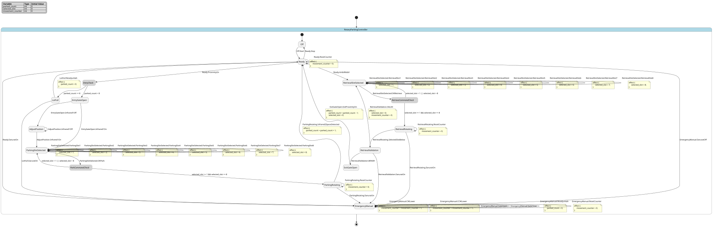

# Case `114` 🅿️ — Slot-Selected Rotary Parking and Retrieval Controller

**Bucket**: EFSM-interlock  |  **Paper**: #414 `vertical-rotary-car-parking-plc-outseal`

- [STM.md case section](../../../sources/vertical-rotary-car-parking-plc-outseal/STM.md)
- [paper PDF](../../../sources/vertical-rotary-car-parking-plc-outseal/paper.pdf)
- [expansion NL JSON (含 provenance)](../expansions/114.json)
- [codex 起草笔记](../ref_stms/codex_drafts/114.notes.md)

## 1. 英文 NL（含 inline [E] 溯源 markers）

> 这是 codex 评审阶段生成的扩充 NL（commit `259e6ea7`），每条 substantive 信息带 `[En]` 标记。完整 provenance 表见 [expansion JSON](../expansions/114.json)。

The controller manages a prototype vertical rotary parking system with eight slots, PLC Outseal, Android HMI, proximity/infrared sensors, LEDs, and DC motors, including a rotary motor for moving parking spaces in and out [E1] [E2] [E3]. A relay protects the DC motor and reverses its rotation for CW/CCW movement [E4]. Operation starts with ON/Start and a green active LED; during entry, the proximity sensor opens the barrier when space is available, but the barrier motor remains closed with the red LED on when the lot is full [E5] [E6] [E7]. Infrared sensor 1 is the readiness guard: ON means the car is ready to park, while OFF means the position is wrong and the user must adjust it [E8] [E9]. For parking, the operator uses the HMI Parkir Mobil screen, chooses slot 1-8, presses OK, and the rotary motor runs until infrared sensor 2 detects a passing parking space, then stops [E10] [E11] [E12]. For retrieval, Ambil Mobil plus a slot number and OK makes the rotary motor move the car downward CW/CCW until the selected HMI slot is below, turning the yellow LED on and the rotary motor off [E13] [E14] [E15]. The validation step opens the barrier only after BENAR; SALAH sends the operator back to repeat Ambil Mobil [E16] [E17]. After exit, proximity detection closes the barrier again, turns the yellow LED off, and supports decrementing the parked-vehicle count [E18] [E19]. The HMI also exposes emergency and reset recovery: DARURAT ON/OFF, CW/CCW lowering, gate open/close, Reset Jumlah, and Reset Counter for cancelled parking/retrieval, parking-space movement counting errors, or disasters [E20] [E21] [E22] [E23] [E24].

## 2. 中文 NL 译文（claude 翻译，保留 [En] markers）

该控制器管理一套原型化的立式旋转停车系统，配备八个车位、Outseal PLC、Android HMI、接近/红外传感器、LED 指示灯以及直流电机，其中包含用于将停车位移入和移出的旋转电机 [E1] [E2] [E3]。继电器对直流电机提供保护，并通过反向其旋转方向实现 CW/CCW 运动 [E4]。系统在按下 ON/Start 后启动，绿色工作 LED 点亮；在车辆进入阶段，当有空位时接近传感器会打开闸门，而当车位已满时闸门电机保持关闭状态并点亮红色 LED [E5] [E6] [E7]。红外传感器 1 担任就绪守卫：ON 表示车辆已就绪可停入，OFF 表示位置不正确，用户必须进行调整 [E8] [E9]。停车操作时，操作员使用 HMI 上的 Parkir Mobil 界面，选择 1-8 号车位，按下 OK，旋转电机随即运转，直到红外传感器 2 检测到一个经过的停车位后停止 [E10] [E11] [E12]。取车操作时，选择 Ambil Mobil 并输入车位编号后按下 OK，旋转电机会沿 CW/CCW 方向将车辆向下移动，直到所选 HMI 车位移到下方，此时点亮黄色 LED 并停止旋转电机 [E13] [E14] [E15]。验证步骤仅在 BENAR 之后才打开闸门；SALAH 则会将操作员退回到重新执行 Ambil Mobil [E16] [E17]。车辆驶出后，接近检测会再次关闭闸门、熄灭黄色 LED，并支持对已停车辆计数进行递减 [E18] [E19]。HMI 还提供紧急与复位恢复功能：DARURAT ON/OFF、CW/CCW 下降、闸门开/关、Reset Jumlah 和 Reset Counter，用于处理取消的停车/取车、停车位移动计数错误或灾难情况 [E20] [E21] [E22] [E23] [E24]。

## 3. Reference pyfcstm STM (codex 起草，待用户签字)

### 3.1 状态机图（pyfcstm visualize SVG）



PlantUML 源文件：[`../diagrams/114.puml`](../diagrams/114.puml)

### 3.2 pyfcstm DSL 源码

```pyfcstm
def int parked_count = 0;
def int selected_slot = 0;
def int movement_counter = 0;

state RotaryParkingController {
    [*] -> Off;

    state Off {
        enter abstract SystemStopped;
    }

    state Ready {
        enter abstract GreenActiveLedOn;
    }

    pseudo state EntryCheck;

    state EntryGateOpen {
        enter abstract EntryBarrierOpen;
    }

    state LotFull {
        enter abstract BarrierClosedRedLedOn;
    }

    state AdjustPosition {
        enter abstract Infrared1OffAdjustCar;
    }

    state ParkingSlotSelected {
        enter abstract HmiParkirMobilScreen;
    }

    state ParkingRotating {
        enter abstract RotaryParkingMotorOn;
        exit abstract RotaryParkingMotorOff;
    }

    state RetrievalSlotSelected {
        enter abstract HmiAmbilMobilScreen;
    }

    state RetrievalRotating {
        enter abstract RelayCwCcwRotaryMotorOn;
        exit abstract RotaryMotorOff;
    }

    state RetrievalValidation {
        enter abstract YellowLedOnSelectedSlotBelow;
    }

    state ExitGateOpen {
        enter abstract ExitBarrierOpen;
        exit abstract ExitBarrierCloseYellowLedOff;
    }

    state EmergencyManual {
        enter abstract DaruratIndicatorOn;
        during abstract EmergencyRotaryGateResetControlsAvailable;
        exit abstract DaruratIndicatorOff;
    }

    pseudo state ParkCommandCheck;
    pseudo state RetrieveCommandCheck;

    Off -> Ready :: Start;
    Ready -> Off :: Stop;

    Ready -> EntryCheck :: ProximityOn;
    EntryCheck -> EntryGateOpen : if [parked_count < 8];
    EntryCheck -> LotFull : if [parked_count >= 8];
    LotFull -> Ready :: ResetJumlah effect { parked_count = 0; };

    EntryGateOpen -> ParkingSlotSelected :: Infrared1On;
    EntryGateOpen -> AdjustPosition :: Infrared1Off;
    AdjustPosition -> ParkingSlotSelected :: Infrared1On;
    AdjustPosition -> AdjustPosition :: Infrared1Off;

    ParkingSlotSelected -> ParkingSlotSelected :: ParkingSlot1 effect { selected_slot = 1; };
    ParkingSlotSelected -> ParkingSlotSelected :: ParkingSlot2 effect { selected_slot = 2; };
    ParkingSlotSelected -> ParkingSlotSelected :: ParkingSlot3 effect { selected_slot = 3; };
    ParkingSlotSelected -> ParkingSlotSelected :: ParkingSlot4 effect { selected_slot = 4; };
    ParkingSlotSelected -> ParkingSlotSelected :: ParkingSlot5 effect { selected_slot = 5; };
    ParkingSlotSelected -> ParkingSlotSelected :: ParkingSlot6 effect { selected_slot = 6; };
    ParkingSlotSelected -> ParkingSlotSelected :: ParkingSlot7 effect { selected_slot = 7; };
    ParkingSlotSelected -> ParkingSlotSelected :: ParkingSlot8 effect { selected_slot = 8; };
    ParkingSlotSelected -> ParkCommandCheck :: OKPark;
    ParkCommandCheck -> ParkingRotating : if [selected_slot >= 1 && selected_slot <= 8];
    ParkCommandCheck -> ParkingSlotSelected : if [selected_slot < 1 || selected_slot > 8];

    ParkingRotating -> Ready :: Infrared2SpaceDetected effect { parked_count = parked_count + 1; };
    ParkingRotating -> ParkingRotating :: ResetCounter effect { movement_counter = 0; };

    Ready -> RetrievalSlotSelected :: AmbilMobil;
    RetrievalSlotSelected -> RetrievalSlotSelected :: RetrievalSlot1 effect { selected_slot = 1; };
    RetrievalSlotSelected -> RetrievalSlotSelected :: RetrievalSlot2 effect { selected_slot = 2; };
    RetrievalSlotSelected -> RetrievalSlotSelected :: RetrievalSlot3 effect { selected_slot = 3; };
    RetrievalSlotSelected -> RetrievalSlotSelected :: RetrievalSlot4 effect { selected_slot = 4; };
    RetrievalSlotSelected -> RetrievalSlotSelected :: RetrievalSlot5 effect { selected_slot = 5; };
    RetrievalSlotSelected -> RetrievalSlotSelected :: RetrievalSlot6 effect { selected_slot = 6; };
    RetrievalSlotSelected -> RetrievalSlotSelected :: RetrievalSlot7 effect { selected_slot = 7; };
    RetrievalSlotSelected -> RetrievalSlotSelected :: RetrievalSlot8 effect { selected_slot = 8; };
    RetrievalSlotSelected -> RetrieveCommandCheck :: OKRetrieve;
    RetrieveCommandCheck -> RetrievalRotating : if [selected_slot >= 1 && selected_slot <= 8];
    RetrieveCommandCheck -> RetrievalSlotSelected : if [selected_slot < 1 || selected_slot > 8];

    RetrievalRotating -> RetrievalValidation :: SelectedSlotBelow;
    RetrievalRotating -> RetrievalRotating :: ResetCounter effect { movement_counter = 0; };
    RetrievalValidation -> ExitGateOpen :: BENAR;
    RetrievalValidation -> RetrievalSlotSelected :: SALAH effect { selected_slot = 0; movement_counter = 0; };
    ExitGateOpen -> Ready :: ExitProximityOn effect { parked_count = parked_count - 1; selected_slot = 0; };

    Ready -> EmergencyManual :: DaruratOn;
    Ready -> Ready :: ResetCounter effect { movement_counter = 0; };
    ParkingRotating -> EmergencyManual :: DaruratOn;
    RetrievalRotating -> EmergencyManual :: DaruratOn;
    RetrievalValidation -> EmergencyManual :: DaruratOn;
    LotFull -> EmergencyManual :: DaruratOn;
    EmergencyManual -> Ready :: DaruratOff;
    EmergencyManual -> EmergencyManual :: CWLower effect { movement_counter = movement_counter + 1; };
    EmergencyManual -> EmergencyManual :: CCWLower effect { movement_counter = movement_counter + 1; };
    EmergencyManual -> EmergencyManual :: GateOpen;
    EmergencyManual -> EmergencyManual :: GateClose;
    EmergencyManual -> EmergencyManual :: ResetJumlah effect { parked_count = 0; };
    EmergencyManual -> EmergencyManual :: ResetCounter effect { movement_counter = 0; };
}

```

**codex 自报 C-axis 使用情况**:
- C1: ?
- C2: ?
- C3: ?
- C4: ?

**codex 自报 scenarios 覆盖情况**:
- 模式数: ?
- guards 数: ?
- fault paths 数: ?
- per-cycle 行为数: ?
- 硬件 effectors 数: ?

## 4. Test scenarios（覆盖 NL 全特性，必须 100% pass）

```json
{
  "scenarios": [
    {
      "name": "ir2_single_trigger_stops_parking",
      "description": "覆盖 Start、可用车位入场、IR1 ON 就绪、Parkir Mobil 选 slot 3、OK 启动旋转，以及 IR2 单次触发直接停止停车流程并回到 Ready，对应 E5-E12。",
      "initial_state": null,
      "initial_vars": {},
      "steps": [
        {
          "before_cycles": 0,
          "events": [],
          "expected_state": "RotaryParkingController.Off",
          "expected_vars": {
            "parked_count": 0,
            "selected_slot": 0,
            "movement_counter": 0
          },
          "name": "default_off"
        },
        {
          "before_cycles": 0,
          "events": [
            "Start"
          ],
          "expected_state": "RotaryParkingController.Ready",
          "expected_vars": {
            "parked_count": 0,
            "selected_slot": 0,
            "movement_counter": 0
          },
          "name": "start_ready"
        },
        {
          "before_cycles": 0,
          "events": [
            "ProximityOn"
          ],
          "expected_state": "RotaryParkingController.EntryGateOpen",
          "expected_vars": {
            "parked_count": 0
          },
          "name": "proximity_available_opens"
        },
        {
          "before_cycles": 0,
          "events": [
            "Infrared1On"
          ],
          "expected_state": "RotaryParkingController.ParkingSlotSelected",
          "expected_vars": {
            "selected_slot": 0
          },
          "name": "ir1_on_hmi_parking"
        },
        {
          "before_cycles": 0,
          "events": [
            "ParkingSlot3"
          ],
          "expected_state": "RotaryParkingController.ParkingSlotSelected",
          "expected_vars": {
            "selected_slot": 3,
            "movement_counter": 0
          },
          "name": "select_slot3"
        },
        {
          "before_cycles": 0,
          "events": [
            "OKPark"
          ],
          "expected_state": "RotaryParkingController.ParkingRotating",
          "expected_vars": {
            "selected_slot": 3,
            "movement_counter": 0,
            "parked_count": 0
          },
          "name": "ok_starts_rotary_motor"
        },
        {
          "before_cycles": 0,
          "events": [],
          "expected_state": "RotaryParkingController.ParkingRotating",
          "expected_vars": {
            "selected_slot": 3,
            "movement_counter": 0,
            "parked_count": 0
          },
          "name": "idle_cycle_no_counter_threshold"
        },
        {
          "before_cycles": 0,
          "events": [
            "Infrared2SpaceDetected"
          ],
          "expected_state": "RotaryParkingController.Ready",
          "expected_vars": {
            "movement_counter": 0,
            "parked_count": 1,
            "selected_slot": 3
          },
          "name": "ir2_single_trigger_ready"
        },
        {
          "before_cycles": 0,
          "events": [
            "Stop"
          ],
          "expected_state": "RotaryParkingController.Off",
          "expected_vars": {
            "parked_count": 1,
            "selected_slot": 3,
            "movement_counter": 0
          },
          "name": "stop_returns_off"
        }
      ]
    },
    {
      "name": "full_lot_guard_reset_jumlah",
      "description": "覆盖 parked_count=8 满位 guard、栏杆保持关闭红灯、Reset Jumlah 仅复位车辆数量，对应 E1、E6、E7、E24。",
      "initial_state": "RotaryParkingController.Ready",
      "initial_vars": {
        "parked_count": 8,
        "selected_slot": 6,
        "movement_counter": 2
      },
      "steps": [
        {
          "before_cycles": 0,
          "events": [
            "ProximityOn"
          ],
          "expected_state": "RotaryParkingController.LotFull",
          "expected_vars": {
            "parked_count": 8,
            "selected_slot": 6,
            "movement_counter": 2
          },
          "name": "full_lot_red_closed"
        },
        {
          "before_cycles": 0,
          "events": [
            "ResetJumlah"
          ],
          "expected_state": "RotaryParkingController.Ready",
          "expected_vars": {
            "parked_count": 0,
            "selected_slot": 6,
            "movement_counter": 2
          },
          "name": "reset_jumlah_clears_only_count"
        }
      ]
    },
    {
      "name": "ir1_off_adjustment_then_ready",
      "description": "覆盖 IR1 OFF 表示位置不正确并要求用户调整，调整后由 IR1 ON 重新点亮并进入 Parkir Mobil，对应 E8-E10。",
      "initial_state": "RotaryParkingController.EntryGateOpen",
      "initial_vars": {
        "parked_count": 0,
        "selected_slot": 0,
        "movement_counter": 0
      },
      "steps": [
        {
          "before_cycles": 0,
          "events": [
            "Infrared1Off"
          ],
          "expected_state": "RotaryParkingController.AdjustPosition",
          "expected_vars": {
            "selected_slot": 0
          },
          "name": "ir1_off_adjust"
        },
        {
          "before_cycles": 0,
          "events": [
            "Infrared1Off"
          ],
          "expected_state": "RotaryParkingController.AdjustPosition",
          "expected_vars": {
            "selected_slot": 0
          },
          "name": "still_not_aligned"
        },
        {
          "before_cycles": 0,
          "events": [
            "Infrared1On"
          ],
          "expected_state": "RotaryParkingController.ParkingSlotSelected",
          "expected_vars": {
            "selected_slot": 0
          },
          "name": "ir1_on_hmi_parking"
        }
      ]
    },
    {
      "name": "slot_boundary_rejects_invalid_accepts_slot8",
      "description": "覆盖 slot 1-8 数值边界：selected_slot=9 被 OK 拒绝，slot 8 被接受，且 IR2 单次触发停车完成，对应 E10-E12。",
      "initial_state": "RotaryParkingController.ParkingSlotSelected",
      "initial_vars": {
        "parked_count": 0,
        "selected_slot": 9,
        "movement_counter": 0
      },
      "steps": [
        {
          "before_cycles": 0,
          "events": [
            "OKPark"
          ],
          "expected_state": "RotaryParkingController.ParkingSlotSelected",
          "expected_vars": {
            "selected_slot": 9,
            "movement_counter": 0
          },
          "name": "slot9_rejected"
        },
        {
          "before_cycles": 0,
          "events": [
            "ParkingSlot8"
          ],
          "expected_state": "RotaryParkingController.ParkingSlotSelected",
          "expected_vars": {
            "selected_slot": 8,
            "movement_counter": 0
          },
          "name": "select_slot8"
        },
        {
          "before_cycles": 0,
          "events": [
            "OKPark"
          ],
          "expected_state": "RotaryParkingController.ParkingRotating",
          "expected_vars": {
            "selected_slot": 8,
            "movement_counter": 0
          },
          "name": "slot8_accepted"
        },
        {
          "before_cycles": 0,
          "events": [
            "Infrared2SpaceDetected"
          ],
          "expected_state": "RotaryParkingController.Ready",
          "expected_vars": {
            "movement_counter": 0,
            "parked_count": 1,
            "selected_slot": 8
          },
          "name": "slot8_ir2_single_stop"
        }
      ]
    },
    {
      "name": "retrieval_wrong_then_benar_exit_decrements",
      "description": "覆盖 Ambil Mobil 选 slot、OK、selected slot 单次到底、SALAH 重复 Ambil Mobil、BENAR 开闸和出场 proximity 递减计数，对应 E13-E19。",
      "initial_state": "RotaryParkingController.Ready",
      "initial_vars": {
        "parked_count": 2,
        "selected_slot": 0,
        "movement_counter": 0
      },
      "steps": [
        {
          "before_cycles": 0,
          "events": [
            "AmbilMobil"
          ],
          "expected_state": "RotaryParkingController.RetrievalSlotSelected",
          "expected_vars": {
            "parked_count": 2,
            "selected_slot": 0
          },
          "name": "ambil_mobil_screen"
        },
        {
          "before_cycles": 0,
          "events": [
            "OKRetrieve"
          ],
          "expected_state": "RotaryParkingController.RetrievalSlotSelected",
          "expected_vars": {
            "selected_slot": 0,
            "movement_counter": 0,
            "parked_count": 2
          },
          "name": "retrieve_slot0_rejected"
        },
        {
          "before_cycles": 0,
          "events": [
            "RetrievalSlot1"
          ],
          "expected_state": "RotaryParkingController.RetrievalSlotSelected",
          "expected_vars": {
            "selected_slot": 1,
            "movement_counter": 0
          },
          "name": "retrieval_slot1_button"
        },
        {
          "before_cycles": 0,
          "events": [
            "RetrievalSlot2"
          ],
          "expected_state": "RotaryParkingController.RetrievalSlotSelected",
          "expected_vars": {
            "selected_slot": 2,
            "movement_counter": 0
          },
          "name": "retrieval_slot2_button"
        },
        {
          "before_cycles": 0,
          "events": [
            "RetrievalSlot3"
          ],
          "expected_state": "RotaryParkingController.RetrievalSlotSelected",
          "expected_vars": {
            "selected_slot": 3,
            "movement_counter": 0
          },
          "name": "retrieval_slot3_button"
        },
        {
          "before_cycles": 0,
          "events": [
            "RetrievalSlot4"
          ],
          "expected_state": "RotaryParkingController.RetrievalSlotSelected",
          "expected_vars": {
            "selected_slot": 4,
            "movement_counter": 0
          },
          "name": "retrieval_slot4_button"
        },
        {
          "before_cycles": 0,
          "events": [
            "RetrievalSlot5"
          ],
          "expected_state": "RotaryParkingController.RetrievalSlotSelected",
          "expected_vars": {
            "selected_slot": 5,
            "movement_counter": 0
          },
          "name": "retrieval_slot5_button"
        },
        {
          "before_cycles": 0,
          "events": [
            "RetrievalSlot6"
          ],
          "expected_state": "RotaryParkingController.RetrievalSlotSelected",
          "expected_vars": {
            "selected_slot": 6,
            "movement_counter": 0
          },
          "name": "retrieval_slot6_button"
        },
        {
          "before_cycles": 0,
          "events": [
            "RetrievalSlot7"
          ],
          "expected_state": "RotaryParkingController.RetrievalSlotSelected",
          "expected_vars": {
            "selected_slot": 7,
            "movement_counter": 0
          },
          "name": "retrieval_slot7_button"
        },
        {
          "before_cycles": 0,
          "events": [
            "RetrievalSlot8"
          ],
          "expected_state": "RotaryParkingController.RetrievalSlotSelected",
          "expected_vars": {
            "selected_slot": 8,
            "movement_counter": 0
          },
          "name": "retrieval_slot8_button"
        },
        {
          "before_cycles": 0,
          "events": [
            "RetrievalSlot2"
          ],
          "expected_state": "RotaryParkingController.RetrievalSlotSelected",
          "expected_vars": {
            "selected_slot": 2,
            "movement_counter": 0
          },
          "name": "select_retrieval_slot2"
        },
        {
          "before_cycles": 0,
          "events": [
            "OKRetrieve"
          ],
          "expected_state": "RotaryParkingController.RetrievalRotating",
          "expected_vars": {
            "movement_counter": 0,
            "selected_slot": 2
          },
          "name": "ok_retrieve_rotating"
        },
        {
          "before_cycles": 0,
          "events": [
            "SelectedSlotBelow"
          ],
          "expected_state": "RotaryParkingController.RetrievalValidation",
          "expected_vars": {
            "movement_counter": 0,
            "selected_slot": 2
          },
          "name": "selected_slot_below_validation"
        },
        {
          "before_cycles": 0,
          "events": [
            "SALAH"
          ],
          "expected_state": "RotaryParkingController.RetrievalSlotSelected",
          "expected_vars": {
            "selected_slot": 0,
            "movement_counter": 0,
            "parked_count": 2
          },
          "name": "salah_repeats_ambil"
        },
        {
          "before_cycles": 0,
          "events": [
            "RetrievalSlot1"
          ],
          "expected_state": "RotaryParkingController.RetrievalSlotSelected",
          "expected_vars": {
            "selected_slot": 1
          },
          "name": "select_retrieval_slot1"
        },
        {
          "before_cycles": 0,
          "events": [
            "OKRetrieve"
          ],
          "expected_state": "RotaryParkingController.RetrievalRotating",
          "expected_vars": {
            "movement_counter": 0
          },
          "name": "retrieve_slot1_rotating"
        },
        {
          "before_cycles": 0,
          "events": [
            "SelectedSlotBelow"
          ],
          "expected_state": "RotaryParkingController.RetrievalValidation",
          "expected_vars": {
            "movement_counter": 0,
            "selected_slot": 1
          },
          "name": "slot1_below_validation"
        },
        {
          "before_cycles": 0,
          "events": [
            "BENAR"
          ],
          "expected_state": "RotaryParkingController.ExitGateOpen",
          "expected_vars": {
            "parked_count": 2,
            "selected_slot": 1
          },
          "name": "benar_opens_exit_gate"
        },
        {
          "before_cycles": 0,
          "events": [
            "ExitProximityOn"
          ],
          "expected_state": "RotaryParkingController.Ready",
          "expected_vars": {
            "parked_count": 1,
            "selected_slot": 0
          },
          "name": "exit_proximity_closes_and_decrements"
        }
      ]
    },
    {
      "name": "parking_hmi_slot_buttons_1_to_8",
      "description": "覆盖 Parkir Mobil HMI 的 slot 1-8 数字按钮都会设置 selected_slot，并保持等待 OK 的 mode，对应 E10-E11。",
      "initial_state": "RotaryParkingController.ParkingSlotSelected",
      "initial_vars": {
        "parked_count": 0,
        "selected_slot": 0,
        "movement_counter": 0
      },
      "steps": [
        {
          "before_cycles": 0,
          "events": [
            "ParkingSlot1"
          ],
          "expected_state": "RotaryParkingController.ParkingSlotSelected",
          "expected_vars": {
            "selected_slot": 1,
            "movement_counter": 0
          },
          "name": "parking_slot1_button"
        },
        {
          "before_cycles": 0,
          "events": [
            "ParkingSlot2"
          ],
          "expected_state": "RotaryParkingController.ParkingSlotSelected",
          "expected_vars": {
            "selected_slot": 2,
            "movement_counter": 0
          },
          "name": "parking_slot2_button"
        },
        {
          "before_cycles": 0,
          "events": [
            "ParkingSlot3"
          ],
          "expected_state": "RotaryParkingController.ParkingSlotSelected",
          "expected_vars": {
            "selected_slot": 3,
            "movement_counter": 0
          },
          "name": "parking_slot3_button"
        },
        {
          "before_cycles": 0,
          "events": [
            "ParkingSlot4"
          ],
          "expected_state": "RotaryParkingController.ParkingSlotSelected",
          "expected_vars": {
            "selected_slot": 4,
            "movement_counter": 0
          },
          "name": "parking_slot4_button"
        },
        {
          "before_cycles": 0,
          "events": [
            "ParkingSlot5"
          ],
          "expected_state": "RotaryParkingController.ParkingSlotSelected",
          "expected_vars": {
            "selected_slot": 5,
            "movement_counter": 0
          },
          "name": "parking_slot5_button"
        },
        {
          "before_cycles": 0,
          "events": [
            "ParkingSlot6"
          ],
          "expected_state": "RotaryParkingController.ParkingSlotSelected",
          "expected_vars": {
            "selected_slot": 6,
            "movement_counter": 0
          },
          "name": "parking_slot6_button"
        },
        {
          "before_cycles": 0,
          "events": [
            "ParkingSlot7"
          ],
          "expected_state": "RotaryParkingController.ParkingSlotSelected",
          "expected_vars": {
            "selected_slot": 7,
            "movement_counter": 0
          },
          "name": "parking_slot7_button"
        },
        {
          "before_cycles": 0,
          "events": [
            "ParkingSlot8"
          ],
          "expected_state": "RotaryParkingController.ParkingSlotSelected",
          "expected_vars": {
            "selected_slot": 8,
            "movement_counter": 0
          },
          "name": "parking_slot8_button"
        }
      ]
    },
    {
      "name": "emergency_manual_controls_and_reset_counter",
      "description": "覆盖 DARURAT ON/OFF、CW/CCW lowering、Gate Open/Close、Reset Counter 和 Reset Jumlah 恢复路径，对应 E20-E24。",
      "initial_state": "RotaryParkingController.ParkingRotating",
      "initial_vars": {
        "parked_count": 5,
        "selected_slot": 4,
        "movement_counter": 2
      },
      "steps": [
        {
          "before_cycles": 0,
          "events": [
            "DaruratOn"
          ],
          "expected_state": "RotaryParkingController.EmergencyManual",
          "expected_vars": {
            "parked_count": 5,
            "selected_slot": 4,
            "movement_counter": 2
          },
          "name": "darurat_on_from_rotation"
        },
        {
          "before_cycles": 0,
          "events": [
            "CWLower"
          ],
          "expected_state": "RotaryParkingController.EmergencyManual",
          "expected_vars": {
            "movement_counter": 3
          },
          "name": "cw_lower_counts"
        },
        {
          "before_cycles": 0,
          "events": [
            "CCWLower"
          ],
          "expected_state": "RotaryParkingController.EmergencyManual",
          "expected_vars": {
            "movement_counter": 4
          },
          "name": "ccw_lower_counts"
        },
        {
          "before_cycles": 0,
          "events": [
            "GateOpen"
          ],
          "expected_state": "RotaryParkingController.EmergencyManual",
          "expected_vars": {
            "movement_counter": 4,
            "parked_count": 5
          },
          "name": "manual_gate_open"
        },
        {
          "before_cycles": 0,
          "events": [
            "GateClose"
          ],
          "expected_state": "RotaryParkingController.EmergencyManual",
          "expected_vars": {
            "movement_counter": 4,
            "parked_count": 5
          },
          "name": "manual_gate_close"
        },
        {
          "before_cycles": 0,
          "events": [
            "ResetCounter"
          ],
          "expected_state": "RotaryParkingController.EmergencyManual",
          "expected_vars": {
            "movement_counter": 0
          },
          "name": "reset_counter"
        },
        {
          "before_cycles": 0,
          "events": [
            "ResetJumlah"
          ],
          "expected_state": "RotaryParkingController.EmergencyManual",
          "expected_vars": {
            "parked_count": 0,
            "selected_slot": 4,
            "movement_counter": 0
          },
          "name": "reset_jumlah"
        },
        {
          "before_cycles": 0,
          "events": [
            "DaruratOff"
          ],
          "expected_state": "RotaryParkingController.Ready",
          "expected_vars": {
            "parked_count": 0,
            "selected_slot": 4,
            "movement_counter": 0
          },
          "name": "darurat_off_ready"
        }
      ]
    },
    {
      "name": "selected_slot_below_single_trigger",
      "description": "覆盖取车旋转中 SelectedSlotBelow 单次触发直接进入取车校验，不再依赖 movement_counter 阈值，对应 E14-E15。",
      "initial_state": "RotaryParkingController.RetrievalRotating",
      "initial_vars": {
        "parked_count": 3,
        "selected_slot": 6,
        "movement_counter": 7
      },
      "steps": [
        {
          "before_cycles": 0,
          "events": [
            "SelectedSlotBelow"
          ],
          "expected_state": "RotaryParkingController.RetrievalValidation",
          "expected_vars": {
            "parked_count": 3,
            "selected_slot": 6,
            "movement_counter": 7
          },
          "name": "selected_slot_below_validation_single"
        }
      ]
    },
    {
      "name": "emergency_from_lot_full_recovers",
      "description": "覆盖已声明的 LotFull 状态下 DARURAT ON/OFF 路径，DARURAT OFF 只退出手动应急界面，不隐式 Reset Jumlah，对应 E20-E24。",
      "initial_state": "RotaryParkingController.LotFull",
      "initial_vars": {
        "parked_count": 8,
        "selected_slot": 0,
        "movement_counter": 0
      },
      "steps": [
        {
          "before_cycles": 0,
          "events": [
            "DaruratOn"
          ],
          "expected_state": "RotaryParkingController.EmergencyManual",
          "expected_vars": {
            "parked_count": 8,
            "selected_slot": 0,
            "movement_counter": 0
          },
          "name": "darurat_on_from_lot_full"
        },
        {
          "before_cycles": 0,
          "events": [
            "DaruratOff"
          ],
          "expected_state": "RotaryParkingController.Ready",
          "expected_vars": {
            "parked_count": 8,
            "selected_slot": 0,
            "movement_counter": 0
          },
          "name": "darurat_off_ready_count_preserved"
        }
      ]
    },
    {
      "name": "reset_counter_in_normal_path",
      "description": "核对 Reset Counter 按 E24 建模为 HMI 恢复控件：Ready 和旋转过程都可清零 movement_counter，且不参与停车/取车停止判定。",
      "initial_state": "RotaryParkingController.Ready",
      "initial_vars": {
        "parked_count": 1,
        "selected_slot": 2,
        "movement_counter": 5
      },
      "steps": [
        {
          "before_cycles": 0,
          "events": [
            "ResetCounter"
          ],
          "expected_state": "RotaryParkingController.Ready",
          "expected_vars": {
            "parked_count": 1,
            "selected_slot": 2,
            "movement_counter": 0
          },
          "name": "reset_counter_clears_in_ready"
        },
        {
          "before_cycles": 0,
          "events": [
            "AmbilMobil"
          ],
          "expected_state": "RotaryParkingController.RetrievalSlotSelected",
          "expected_vars": {
            "parked_count": 1,
            "selected_slot": 2,
            "movement_counter": 0
          },
          "name": "ambil_mobil_after_ready_reset"
        },
        {
          "before_cycles": 0,
          "events": [
            "RetrievalSlot2"
          ],
          "expected_state": "RotaryParkingController.RetrievalSlotSelected",
          "expected_vars": {
            "selected_slot": 2
          },
          "name": "select_retrieval_slot2"
        },
        {
          "before_cycles": 0,
          "events": [
            "OKRetrieve"
          ],
          "expected_state": "RotaryParkingController.RetrievalRotating",
          "expected_vars": {
            "movement_counter": 0,
            "selected_slot": 2
          },
          "name": "enter_retrieval_rotating"
        },
        {
          "before_cycles": 0,
          "events": [
            "ResetCounter"
          ],
          "expected_state": "RotaryParkingController.RetrievalRotating",
          "expected_vars": {
            "parked_count": 1,
            "selected_slot": 2,
            "movement_counter": 0
          },
          "name": "reset_counter_available_while_rotating"
        },
        {
          "before_cycles": 0,
          "events": [
            "SelectedSlotBelow"
          ],
          "expected_state": "RotaryParkingController.RetrievalValidation",
          "expected_vars": {
            "parked_count": 1,
            "selected_slot": 2,
            "movement_counter": 0
          },
          "name": "selected_slot_below_still_single_trigger"
        }
      ]
    }
  ]
}
```

## 5. pyfcstm 验证日志（parse + sem + sim + scenarios 全跑）

```
PARSE_OK
SEM_OK (leaf_states=?)
SIM_OK (current_state=Off)
SCENARIOS_LOADED: 10
  ✓ [ir2_single_trigger_stops_parking]
  ✓ [full_lot_guard_reset_jumlah]
  ✓ [ir1_off_adjustment_then_ready]
  ✓ [slot_boundary_rejects_invalid_accepts_slot8]
  ✓ [retrieval_wrong_then_benar_exit_decrements]
  ✓ [parking_hmi_slot_buttons_1_to_8]
  ✓ [emergency_manual_controls_and_reset_counter]
  ✓ [selected_slot_below_single_trigger]
  ✓ [emergency_from_lot_full_recovers]
  ✓ [reset_counter_in_normal_path]

SCENARIOS_SUMMARY: pass=10 fail=0 error=0 total=10

LINT_RUNNING...
LINT_SUMMARY: warnings=0 by_code={}
ALL_OK
```

## 6. Codex 起草笔记

# Codex Revised Notes — Case 114

## 1. 设计选择

- mode 列表：保留 `Off`、`Ready`、`EntryGateOpen`、`LotFull`、`AdjustPosition`、`ParkingSlotSelected`、`ParkingRotating`、`RetrievalSlotSelected`、`RetrievalRotating`、`RetrievalValidation`、`ExitGateOpen`、`EmergencyManual` 这 12 个可停留 mode。删除上一版的 `AlignmentCheck` 中间停留点和 `ParkingComplete` 完成态，使 IR1 与 IR2/SelectedSlotBelow 更贴近原文单事件语义。
- event 列表：`Start`/`Stop` 来自 [E5]；`ProximityOn`、`Infrared1On`、`Infrared1Off`、`Infrared2SpaceDetected` 来自 [E6][E8][E9][E12]；停车与取车 slot 按钮仍展开为 `ParkingSlot1`-`ParkingSlot8`、`RetrievalSlot1`-`RetrievalSlot8`；`OKPark`、`OKRetrieve`、`SelectedSlotBelow`、`BENAR`、`SALAH`、`ExitProximityOn`、`DaruratOn`/`DaruratOff`、`CWLower`/`CCWLower`、`GateOpen`/`GateClose`、`ResetJumlah`、`ResetCounter` 分别对应 [E10]-[E24]。删除 `CarEntered`、`PositionAdjusted`、`FinishBack`。
- variable 列表：`parked_count` 来自车位满位、停车增加、出车减少和 Reset Jumlah，在 `EntryCheck` guard 中读取；`selected_slot` 来自 HMI slot 选择，在 OK guard 中读取；`movement_counter` 仅保留为 [E24] Reset Counter / parking-space movement counting 的可观察变量，不再参与停车或取车停止 guard。
- transition 设计：`EntryCheck` 仍作为 routing pseudo state 分离 proximity 事件和满位 guard；IR1 ON/OFF 直接从 `EntryGateOpen` 分别进入 `ParkingSlotSelected` 或 `AdjustPosition`，`AdjustPosition` 中再次 `Infrared1On` 表示调整后重新就绪；`ParkingRotating -> Ready :: Infrared2SpaceDetected` 直接停止停车流程并 `parked_count++`；`RetrievalRotating -> RetrievalValidation :: SelectedSlotBelow` 直接进入 BENAR/SALAH 校验；应急路径保留从 `Ready`、旋转中、取车校验和满位状态显式进入 `EmergencyManual`，但不用 any-state forced transition。

## 2. C-axis grounding 使用情况

- **C1 (周期执行)**: 不用。expansion.axis_coverage 明确说明原文不支持每周期 aspect；本版删除了 `ParkingRotating` / `RetrievalRotating` 的 `during` counter 累加。
- **C2 (数值守卫)**: 用，但限定在原文直接支持的离散 guard：`parked_count < 8` / `parked_count >= 8` 表达八车位满位；`selected_slot >= 1 && selected_slot <= 8` 表达 HMI slot 1-8。删除上一版无支撑的 `movement_counter >= selected_slot`。
- **C3 (forced fault)**: 不用。原文只支持 HMI emergency/recovery UI，没有全局任意状态强制故障语义；本版继续使用若干显式 `DaruratOn` transition。
- **C4 (硬件)**: 用。保留 LED、barrier、rotary motor、relay、yellow LED、DARURAT/HMI controls 等 abstract actions；其中 `EmergencyRedIndicatorOn/Off` 改为 `DaruratIndicatorOn/Off`，避免暗示原文未说的 emergency 红灯硬件。

## 3. 与 NL 的对应关系

- expansion NL [E1]: eight slots → `parked_count` 满位 guard 与 slot 1-8 按钮。
- [E5]-[E7]: ON/OFF、green active LED、proximity 入场、满位红灯/闭闸 → `Off`/`Ready`、`EntryCheck`、`EntryGateOpen`、`LotFull`。
- [E8]-[E9]: IR1 ON/OFF readiness guard → `EntryGateOpen -> ParkingSlotSelected :: Infrared1On`、`EntryGateOpen -> AdjustPosition :: Infrared1Off`、`AdjustPosition -> ParkingSlotSelected :: Infrared1On`。
- [E10]-[E12]: Parkir Mobil、slot、OK、IR2 detects passing space and motor OFF → `ParkingSlotSelected`、slot events、`OKPark`、`ParkingRotating -> Ready :: Infrared2SpaceDetected`。
- [E13]-[E15]: Ambil Mobil、slot、CW/CCW downward motion、selected slot below → `RetrievalSlotSelected`、`RetrievalRotating`、`SelectedSlotBelow`、`RetrievalValidation`。
- [E16]-[E19]: BENAR/SALAH validation and exit proximity decrement → `BENAR` 开闸、`SALAH` 返回取车选择、`ExitProximityOn` 回到 `Ready` 并 `parked_count--`。
- [E20]-[E24]: DARURAT、CW/CCW lowering、gate open/close、Reset Jumlah、Reset Counter → `EmergencyManual` 及相应 self transitions；`ResetCounter` 也作为 HMI recovery 控件在 `Ready`、`ParkingRotating`、`RetrievalRotating` 中清零 `movement_counter`。

## 4. 迭代历史

- revision iter 1: 按 claude 反馈删除 counter threshold、C1 during aspect、`CarEntered`、`PositionAdjusted`、`FinishBack`、`ParkingComplete`，重写 scenarios 为单次 IR2 / SelectedSlotBelow 触发；验证结果为 9/10 scenarios pass，`reset_counter_in_normal_path` 因在 `Ready` 注入未声明 `ResetCounter` 报事件解析错误。
- revision iter 2: 将 `ResetCounter` 按 [E24] 作为 HMI recovery 控件补到 `Ready`、`ParkingRotating`、`RetrievalRotating`，并调整对应 scenario；最终 PARSE_OK、SEM_OK、SIM_OK、10/10 scenarios pass、LINT_SUMMARY warnings=0、ALL_OK。

## 5. 与 STM.md 表述的偏差（如有）

- 原文没有给出 slot 参数传递语法；DSL 继续用 `ParkingSlot1`-`ParkingSlot8` 和 `RetrievalSlot1`-`RetrievalSlot8` 展开 HMI 数字按钮。
- 原文没有独立停车完成态，也没有说明停车完成后额外事件；本版在 IR2 触发后直接返回 `Ready`，仅保留 `parked_count++` 这一由停车/出车计数语义支持的状态变量更新。
- `movement_counter` 不再表达“数到 selected_slot 才停”；它只作为 Reset Counter 和应急 CW/CCW movement counting 的可观察变量，避免把 [E24] 扩展成停止判定公式。

## 6. claude 评审反馈响应

### 6.1 hallucinations_found

- `movement_counter >= selected_slot`: 已修复。删除 `ParkingRotating` / `RetrievalRotating` 的 `during` 累加、`ParkStopCheck` / `RetrieveStopCheck` pseudo states，以及所有 `movement_counter >= selected_slot` / `< selected_slot` guard。IR2 与 SelectedSlotBelow 均改为单次事件触发。
- `CarEntered`: 已修复。删除该事件；`EntryGateOpen` 后直接由 `Infrared1On` 或 `Infrared1Off` 判定进入停车选择或调整位置。
- `PositionAdjusted`: 已修复。删除该事件；调整后重新就绪用 `AdjustPosition -> ParkingSlotSelected :: Infrared1On` 表达，并保留 `Infrared1Off` self-loop 表示仍未对齐。
- `FinishBack`: 已修复。删除该事件；停车停止后不再需要额外完成返回事件。
- `ParkingComplete`: 已修复。删除独立完成态；`ParkingRotating -> Ready :: Infrared2SpaceDetected` 直接完成停车流程。
- `EmergencyRedIndicatorOn/Off`: 已修复。重命名为 `DaruratIndicatorOn/Off`，只表达 DARURAT 状态，不暗示未由 NL 支持的 emergency 红灯硬件。

### 6.2 specific_revision_suggestions

- 移除 C1 during aspect 与 counter threshold guard：采纳。IR2 单次触发停车，SelectedSlotBelow 单次触发取车校验；停车目标按第 5 条建议直接到 `Ready`，不保留 `ParkingComplete`。
- 如保留 `movement_counter`，仅作为 Reset Counter 可观察变量：采纳。`movement_counter` 不参与任何 guard，只由 `ResetCounter` 清零、由 emergency CW/CCW lowering 自环递增。
- 删除 `CarEntered`，让入场后由 IR1 直接驱动：采纳。`EntryGateOpen` 的出边现在是 `Infrared1On` / `Infrared1Off`。
- 将 `PositionAdjusted` 替换为再次 `Infrared1On`：采纳。`AdjustPosition -> ParkingSlotSelected :: Infrared1On`。
- 删除 `ParkingComplete` 及 `FinishBack`：采纳。IR2 直接回 `Ready` 并更新 `parked_count`。
- 将 emergency red indicator 抽象重命名为 DARURAT 支持的名称：采纳。使用 `DaruratIndicatorOn/Off`。

### 6.3 missing_scenarios_suggestions

- `ir2_single_trigger_stops_parking`: 已补，对应 scenario `ir2_single_trigger_stops_parking`。该场景验证 IR2 单次触发直接回 `Ready`；未期待 `ParkingComplete`，因为本版已按 hallucination 与第 5 条建议删除该状态。
- `selected_slot_below_single_trigger`: 已补，对应 scenario `selected_slot_below_single_trigger`。
- `emergency_from_lot_full_recovers`: 已补，对应 scenario `emergency_from_lot_full_recovers`。
- `reset_counter_in_normal_path`: 已补，对应 scenario `reset_counter_in_normal_path`。该场景验证 `ResetCounter` 在 `Ready` 和旋转路径中可作为 [E24] HMI recovery 控件清零 `movement_counter`，且不影响 IR2 / SelectedSlotBelow 的单事件停止语义。

## 7. Claude 交叉评审

**Verdict**: APPROVE

| 维度 | 打分 | evidence |
|---|---|---|
| 语义正确性 | 🟢 | 12 个 mode、事件命名（Start/Stop/ProximityOn/Infrared1On/Off/Infrared2SpaceDetected/AmbilMobil/OKPark/OKRetrieve/SelectedSlotBelow/BENAR/SALAH/DaruratOn/Off 等）、变量 parked_count/selected_slot/movement_count… |
| NL 忠实性 | 🟡 | 主体均可溯源；轻度推断：(a) `Ready -> Ready :: ResetCounter` 与 `ParkingRotating/RetrievalRotating -> self :: ResetCounter` 把 [E24] HMI 控件扩展到正常路径，原文未明确说 Reset Counter 在非应急路径下可触发；(b) `EmergencyManual` 中 `CWLower… |
| C-axis grounding 恰当性 | 🟢 | C1 不用（NL 明确 axis_coverage 说无周期 hook，正确）；C2 仅用 `parked_count < 8 / >= 8`（[E1][E7]）与 `selected_slot ∈ [1,8]`（[E11]），全部直接溯源；C3 不用（NL 不支持任意状态 forced fault，正确，emergency 改用显式 `* -> EmergencyManual :: Dar… |
| scenarios NL 覆盖度 | 🟢 | 10 个 scenarios 覆盖 Start/Stop、proximity 入场、IR1 ON/OFF + adjust、Parkir 全部 slot 1-8 按钮、slot 边界拒绝（9 / 0）、IR2 单次触发停车、AmbilMobil 全 slot、SALAH 重试 + BENAR + ExitProximityOn 递减、LotFull + ResetJumlah、emergen… |

## 8. 用户审阅区（待签字）

**审阅状态**：⬜ 待审 / ⬜ approve / ⬜ revise / ⬜ rewrite

**审阅笔记**（用户填写）：

- 

**修订要求**（用户填写）：

- 

**签字**：（用户填写日期 + 姓名）

---

**最终 ref 落盘路径（待签字后）**: `audited/114.fcstm` + `audited/114.audit.md`