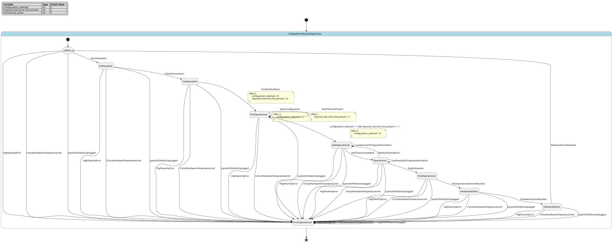

# Case `118` ⚙️ — Robotic Spacecraft Subsystem Lifecycle Supervisor

**Bucket**: HSM-layered  |  **Paper**: #422 `hirosco-high-level-robotic-spacecraft-controller`

- [STM.md case section](../../../sources/hirosco-high-level-robotic-spacecraft-controller/STM.md)
- [paper PDF](../../../sources/hirosco-high-level-robotic-spacecraft-controller/paper.pdf)
- [expansion NL JSON (含 provenance)](../expansions/118.json)
- [codex 起草笔记](../ref_stms/codex_drafts/118.notes.md)

## 1. 英文 NL（含 inline [E] 溯源 markers）

> 这是 codex 评审阶段生成的扩充 NL（commit `259e6ea7`），每条 substantive 信息带 `[En]` 标记。完整 provenance 表见 [expansion JSON](../expansions/118.json)。

HIROSCO treats satellite operation as mode-dependent subsystem coordination, e.g. telepresence or autonomous operation, where some subsystems are connected by real-time links [E1], and a supervisor logs telecommands and telemetry, monitors all subsystems, handles global errors, and manages inter-subsystem communication [E2]. Every subsystem implements the ten-state lifecycle machine for commissioning and coordination [E3]; it starts and stops in Offline [E4], and each state may be subdivided into phases if required [E5]. During commissioning, software data structures are published as parameters [E6], hardware devices are activated and initialized [E7], and the operator selects a configuration from the subsystem descriptor [E8]. The required real-time link is a guard for that move: Real-time Link Handling blocks Pre-Operational-to-Safe-Operational switching while the link is absent [E9], and the supervisor maintains a graph of all real-time links [E10]. In Safe-Operational, all control algorithms are active but hardware actuators remain disabled for verification [E11]; after verification, Operational enables the actuators and permits complete control [E12]. If a severe error occurs in this subsystem or another one, Error-Operational brings hardware devices to a defined state [E13], and a critical hardware-temperature limit is an example condition reported to the supervisor [E14]. Event Handling reacts to asynchronous error notifications with predefined recovery plans based on reason [E15] and the three PUS severity levels: low, medium, and high [E16]. A manipulator failure during grasping is a high-severity case [E17], and Event Handling must then shut down the affected real-time network [E18]; tests show that unplugging the joystick or robot immediately shuts down the joystick and manipulator subsystems [E19]. Medium-severity errors move the affected subsystem back to Safe-Operational [E20], while low-severity errors and progress information are only logged to the console [E21].

## 2. 中文 NL 译文（claude 翻译，保留 [En] markers）

HIROSCO 将卫星运行视为依赖模式的子系统协同，例如遥操作或自主运行，其中部分子系统通过实时链路相连 [E1]，而一个监督器负责记录遥控指令与遥测数据、监控所有子系统、处理全局错误并管理子系统间通信 [E2]。每个子系统都实现用于在轨调试与协同的十状态生命周期状态机 [E3]；它在 Offline 状态启动并停止 [E4]，每个状态在需要时可再细分为若干阶段 [E5]。在调试阶段，软件数据结构被发布为参数 [E6]，硬件设备被激活并初始化 [E7]，操作员从子系统描述符中选择一种配置 [E8]。所需的实时链路是该迁移的守卫条件：Real-time Link Handling 在链路缺失时阻止 Pre-Operational 到 Safe-Operational 的切换 [E9]，监督器维护所有实时链路构成的图 [E10]。在 Safe-Operational 中，所有控制算法均已激活，但硬件执行器仍被禁用以便进行验证 [E11]；验证通过后，Operational 启用执行器并允许完全控制 [E12]。如果本子系统或其他子系统发生严重错误，Error-Operational 会将硬件设备带入预定义状态 [E13]，硬件温度的临界限值即是上报给监督器的一个示例条件 [E14]。Event Handling 根据错误原因以及 PUS 的三种严重级别——低、中、高 [E16]，按预定义的恢复方案响应异步错误通知 [E15]。机械臂在抓取过程中失效属于高严重级别的情况 [E17]，Event Handling 此时必须关停受影响的实时网络 [E18]；测试表明，拔掉操纵杆或机器人会立即关停操纵杆与机械臂子系统 [E19]。中严重级别的错误会将受影响的子系统迁回 Safe-Operational [E20]，而低严重级别的错误以及进度信息仅记录到控制台 [E21]。

## 3. Reference pyfcstm STM (codex 起草，待用户签字)

### 3.1 状态机图（pyfcstm visualize SVG）



PlantUML 源文件：[`../diagrams/118.puml`](../diagrams/118.puml)

### 3.2 pyfcstm DSL 源码

```pyfcstm
def int configuration_selected = 0;
def int required_real_time_link_present = 0;
def int monitoring_cycles = 0;

state SubsystemLifecycleSupervisor {
    event StartSubsystem;
    event PublishParameters;
    event InitializeHardware;
    event SelectConfiguration;
    event RealTimeLinkPresent;
    event VerificationCompleted;
    event StopSubsystem;
    event PostOperationalActionsRevoked;
    event HardwareActionsRevoked;
    event SoftwareActionsRevoked;
    event MediumSeverityError;
    event HighSeverityError;
    event CriticalHardwareTemperatureLimit;
    event JoystickOrRobotUnplugged;
    event LowSeverityOrProgressInformation;

    >> during after {
        monitoring_cycles = monitoring_cycles + 1;
    }

    >> during after abstract MonitorSubsystemsAndMaintainRealTimeLinkGraph;

    ! * -> ErrorOperational : HighSeverityError;
    ! * -> ErrorOperational : CriticalHardwareTemperatureLimit;
    ! * -> ErrorOperational : JoystickOrRobotUnplugged;
    ! Operational -> SafeOperational : MediumSeverityError;

    [*] -> Offline;

    state Offline {
        enter {
            configuration_selected = 0;
            required_real_time_link_present = 0;
        }
        enter abstract StartServicesLoadSubsystemDescriptorAndSwitchOffHardwareDevices;
    }

    state SoftwareInit {
        enter abstract PublishSoftwareDataStructuresAsParameters;
    }

    state HardwareInit {
        enter abstract ActivateAndInitializeHardwareDevices;
    }

    state PreOperational {
        during abstract ManageSubsystemDescriptorConfigurationAndRealTimeLinks;
    }

    state SafeOperational {
        enter abstract DisableHardwareActuators;
        during abstract RunControlAlgorithmsForVerification;
    }

    state Operational {
        enter abstract EnableHardwareActuators;
        during abstract PermitCompleteSubsystemControl;
    }

    state ErrorOperational {
        enter {
            required_real_time_link_present = 0;
        }
        enter abstract BringHardwareDevicesToDefinedState;
        enter abstract ShutdownJoystickManipulatorAndAffectedRealTimeNetwork;
    }

    state PostOperational {
        enter abstract RevokePreOperationalActions;
    }

    state HardwareDeInit {
        enter abstract RevokeHardwareInitializationActions;
    }

    state SoftwareDeInit {
        enter abstract RevokeSoftwareInitializationActions;
    }

    Offline -> SoftwareInit : StartSubsystem;
    SoftwareInit -> HardwareInit : PublishParameters;
    HardwareInit -> PreOperational : InitializeHardware effect {
        configuration_selected = 0;
        required_real_time_link_present = 0;
    };
    PreOperational -> PreOperational : SelectConfiguration effect {
        configuration_selected = 1;
    };
    PreOperational -> PreOperational : RealTimeLinkPresent effect {
        required_real_time_link_present = 1;
    };
    PreOperational -> SafeOperational : if [configuration_selected == 1 && required_real_time_link_present == 1] effect {
        configuration_selected = 0;
    };
    SafeOperational -> Operational : VerificationCompleted;
    Operational -> PostOperational : StopSubsystem;
    PostOperational -> HardwareDeInit : PostOperationalActionsRevoked;
    HardwareDeInit -> SoftwareDeInit : HardwareActionsRevoked;
    SoftwareDeInit -> Offline : SoftwareActionsRevoked;
    SafeOperational -> SafeOperational : LowSeverityOrProgressInformation;
    Operational -> Operational : LowSeverityOrProgressInformation;
}

```

**codex 自报 C-axis 使用情况**:
- C1: ✓
- C2: ✗
- C3: ✓
- C4: ✓

**codex 自报 scenarios 覆盖情况**:
- 模式数: 10
- guards 数: 1
- fault paths 数: 5
- per-cycle 行为数: 1
- 硬件 effectors 数: 8

## 4. Test scenarios（覆盖 NL 全特性，必须 100% pass）

```json
{
  "scenarios": [
    {
      "name": "commissioning_link_guard_to_operational",
      "description": "覆盖 E3-E12：从 Offline 完成 commissioning，并验证 PreOperational 到 SafeOperational 会被 required real-time link guard 阻塞直到链路存在。",
      "initial_state": null,
      "initial_vars": {},
      "steps": [
        {
          "before_cycles": 0,
          "events": [],
          "expected_state": "SubsystemLifecycleSupervisor.Offline",
          "expected_vars": {
            "configuration_selected": 0,
            "required_real_time_link_present": 0,
            "monitoring_cycles": 1
          },
          "name": "default_offline"
        },
        {
          "before_cycles": 0,
          "events": [
            "SubsystemLifecycleSupervisor.StartSubsystem"
          ],
          "expected_state": "SubsystemLifecycleSupervisor.SoftwareInit",
          "expected_vars": {
            "configuration_selected": 0,
            "required_real_time_link_present": 0,
            "monitoring_cycles": 2
          },
          "name": "start_software_init"
        },
        {
          "before_cycles": 0,
          "events": [
            "SubsystemLifecycleSupervisor.PublishParameters"
          ],
          "expected_state": "SubsystemLifecycleSupervisor.HardwareInit",
          "expected_vars": {
            "configuration_selected": 0,
            "required_real_time_link_present": 0,
            "monitoring_cycles": 3
          },
          "name": "parameters_published"
        },
        {
          "before_cycles": 0,
          "events": [
            "SubsystemLifecycleSupervisor.InitializeHardware"
          ],
          "expected_state": "SubsystemLifecycleSupervisor.PreOperational",
          "expected_vars": {
            "configuration_selected": 0,
            "required_real_time_link_present": 0,
            "monitoring_cycles": 4
          },
          "name": "hardware_initialized"
        },
        {
          "before_cycles": 0,
          "events": [],
          "expected_state": "SubsystemLifecycleSupervisor.PreOperational",
          "expected_vars": {
            "configuration_selected": 0,
            "required_real_time_link_present": 0,
            "monitoring_cycles": 5
          },
          "name": "blocked_without_configuration_or_link"
        },
        {
          "before_cycles": 0,
          "events": [
            "SubsystemLifecycleSupervisor.SelectConfiguration"
          ],
          "expected_state": "SubsystemLifecycleSupervisor.PreOperational",
          "expected_vars": {
            "configuration_selected": 1,
            "required_real_time_link_present": 0,
            "monitoring_cycles": 6
          },
          "name": "configuration_selected_link_absent"
        },
        {
          "before_cycles": 0,
          "events": [],
          "expected_state": "SubsystemLifecycleSupervisor.PreOperational",
          "expected_vars": {
            "configuration_selected": 1,
            "required_real_time_link_present": 0,
            "monitoring_cycles": 7
          },
          "name": "still_blocked_without_link"
        },
        {
          "before_cycles": 0,
          "events": [
            "SubsystemLifecycleSupervisor.RealTimeLinkPresent"
          ],
          "expected_state": "SubsystemLifecycleSupervisor.PreOperational",
          "expected_vars": {
            "configuration_selected": 1,
            "required_real_time_link_present": 1,
            "monitoring_cycles": 8
          },
          "name": "real_time_link_present"
        },
        {
          "before_cycles": 0,
          "events": [],
          "expected_state": "SubsystemLifecycleSupervisor.SafeOperational",
          "expected_vars": {
            "configuration_selected": 0,
            "required_real_time_link_present": 1,
            "monitoring_cycles": 9
          },
          "name": "guard_allows_safe_operational"
        },
        {
          "before_cycles": 0,
          "events": [
            "SubsystemLifecycleSupervisor.VerificationCompleted"
          ],
          "expected_state": "SubsystemLifecycleSupervisor.Operational",
          "expected_vars": {
            "configuration_selected": 0,
            "required_real_time_link_present": 1,
            "monitoring_cycles": 10
          },
          "name": "verification_completed_operational"
        }
      ]
    },
    {
      "name": "orderly_stop_to_offline",
      "description": "覆盖 E4 与 STM 摘录 B：Operational 经 PostOperational、HardwareDeInit、SoftwareDeInit 有序撤销动作并回到 Offline。",
      "initial_state": "SubsystemLifecycleSupervisor.Operational",
      "initial_vars": {
        "configuration_selected": 0,
        "required_real_time_link_present": 1,
        "monitoring_cycles": 0
      },
      "steps": [
        {
          "before_cycles": 0,
          "events": [
            "SubsystemLifecycleSupervisor.StopSubsystem"
          ],
          "expected_state": "SubsystemLifecycleSupervisor.PostOperational",
          "expected_vars": {
            "required_real_time_link_present": 1,
            "monitoring_cycles": 1
          },
          "name": "stop_to_post_operational"
        },
        {
          "before_cycles": 0,
          "events": [
            "SubsystemLifecycleSupervisor.PostOperationalActionsRevoked"
          ],
          "expected_state": "SubsystemLifecycleSupervisor.HardwareDeInit",
          "expected_vars": {
            "required_real_time_link_present": 1,
            "monitoring_cycles": 2
          },
          "name": "post_operational_revoked"
        },
        {
          "before_cycles": 0,
          "events": [
            "SubsystemLifecycleSupervisor.HardwareActionsRevoked"
          ],
          "expected_state": "SubsystemLifecycleSupervisor.SoftwareDeInit",
          "expected_vars": {
            "required_real_time_link_present": 1,
            "monitoring_cycles": 3
          },
          "name": "hardware_deinit_revoked"
        },
        {
          "before_cycles": 0,
          "events": [
            "SubsystemLifecycleSupervisor.SoftwareActionsRevoked"
          ],
          "expected_state": "SubsystemLifecycleSupervisor.Offline",
          "expected_vars": {
            "configuration_selected": 0,
            "required_real_time_link_present": 0,
            "monitoring_cycles": 4
          },
          "name": "software_deinit_to_offline"
        }
      ]
    },
    {
      "name": "medium_error_returns_to_safe_operational",
      "description": "覆盖 E15-E16 与 E20：Operational 中 medium-severity error 将受影响 subsystem 退回 SafeOperational。",
      "initial_state": "SubsystemLifecycleSupervisor.Operational",
      "initial_vars": {
        "configuration_selected": 0,
        "required_real_time_link_present": 1,
        "monitoring_cycles": 0
      },
      "steps": [
        {
          "before_cycles": 0,
          "events": [
            "SubsystemLifecycleSupervisor.MediumSeverityError"
          ],
          "expected_state": "SubsystemLifecycleSupervisor.SafeOperational",
          "expected_vars": {
            "configuration_selected": 0,
            "required_real_time_link_present": 1,
            "monitoring_cycles": 1
          },
          "name": "medium_error_safe_operational"
        }
      ]
    },
    {
      "name": "high_error_forces_error_operational",
      "description": "覆盖 E13 与 E15-E18：high-severity error 作为全局 forced fault path 进入 ErrorOperational 并关闭 affected real-time network。",
      "initial_state": "SubsystemLifecycleSupervisor.Operational",
      "initial_vars": {
        "configuration_selected": 0,
        "required_real_time_link_present": 1,
        "monitoring_cycles": 0
      },
      "steps": [
        {
          "before_cycles": 0,
          "events": [
            "SubsystemLifecycleSupervisor.HighSeverityError"
          ],
          "expected_state": "SubsystemLifecycleSupervisor.ErrorOperational",
          "expected_vars": {
            "configuration_selected": 0,
            "required_real_time_link_present": 0,
            "monitoring_cycles": 1
          },
          "name": "high_error_error_operational"
        }
      ]
    },
    {
      "name": "critical_temperature_limit_forces_error_operational",
      "description": "覆盖 E14：critical hardware-temperature limit 被当作严重硬件条件上报 supervisor，并进入 ErrorOperational。",
      "initial_state": "SubsystemLifecycleSupervisor.SafeOperational",
      "initial_vars": {
        "configuration_selected": 0,
        "required_real_time_link_present": 1,
        "monitoring_cycles": 0
      },
      "steps": [
        {
          "before_cycles": 0,
          "events": [
            "SubsystemLifecycleSupervisor.CriticalHardwareTemperatureLimit"
          ],
          "expected_state": "SubsystemLifecycleSupervisor.ErrorOperational",
          "expected_vars": {
            "configuration_selected": 0,
            "required_real_time_link_present": 0,
            "monitoring_cycles": 1
          },
          "name": "critical_temperature_error_operational"
        }
      ]
    },
    {
      "name": "joystick_or_robot_unplug_shutdown",
      "description": "覆盖 E17-E19：unplugging joystick or robot 触发 high-severity shutdown path，进入 ErrorOperational。",
      "initial_state": "SubsystemLifecycleSupervisor.Operational",
      "initial_vars": {
        "configuration_selected": 0,
        "required_real_time_link_present": 1,
        "monitoring_cycles": 0
      },
      "steps": [
        {
          "before_cycles": 0,
          "events": [
            "SubsystemLifecycleSupervisor.JoystickOrRobotUnplugged"
          ],
          "expected_state": "SubsystemLifecycleSupervisor.ErrorOperational",
          "expected_vars": {
            "configuration_selected": 0,
            "required_real_time_link_present": 0,
            "monitoring_cycles": 1
          },
          "name": "unplug_forces_error_operational"
        }
      ]
    },
    {
      "name": "low_error_and_progress_are_logged_only",
      "description": "覆盖 E21：low-severity error/progress information 只记录，不改变 Operational mode。",
      "initial_state": "SubsystemLifecycleSupervisor.Operational",
      "initial_vars": {
        "configuration_selected": 0,
        "required_real_time_link_present": 1,
        "monitoring_cycles": 0
      },
      "steps": [
        {
          "before_cycles": 0,
          "events": [
            "SubsystemLifecycleSupervisor.LowSeverityOrProgressInformation"
          ],
          "expected_state": "SubsystemLifecycleSupervisor.Operational",
          "expected_vars": {
            "configuration_selected": 0,
            "required_real_time_link_present": 1,
            "monitoring_cycles": 1
          },
          "name": "low_severity_no_state_change"
        }
      ]
    },
    {
      "name": "supervisor_monitoring_runs_each_cycle",
      "description": "覆盖 E2 与 E10：supervisor 在任意活动 state 中持续 monitoring subsystem 并维护 real-time link graph。",
      "initial_state": "SubsystemLifecycleSupervisor.SafeOperational",
      "initial_vars": {
        "configuration_selected": 0,
        "required_real_time_link_present": 1,
        "monitoring_cycles": 0
      },
      "steps": [
        {
          "before_cycles": 3,
          "events": null,
          "expected_state": "SubsystemLifecycleSupervisor.SafeOperational",
          "expected_vars": {
            "configuration_selected": 0,
            "required_real_time_link_present": 1,
            "monitoring_cycles": 3
          },
          "name": "three_empty_cycles_monitoring"
        }
      ]
    }
  ]
}
```

## 5. pyfcstm 验证日志（parse + sem + sim + scenarios 全跑）

```
PARSE_OK
SEM_OK (leaf_states=?)
SIM_OK (current_state=Offline)
SCENARIOS_LOADED: 8
  ✓ [commissioning_link_guard_to_operational]
  ✓ [orderly_stop_to_offline]
  ✓ [medium_error_returns_to_safe_operational]
  ✓ [high_error_forces_error_operational]
  ✓ [critical_temperature_limit_forces_error_operational]
  ✓ [joystick_or_robot_unplug_shutdown]
  ✓ [low_error_and_progress_are_logged_only]
  ✓ [supervisor_monitoring_runs_each_cycle]

SCENARIOS_SUMMARY: pass=8 fail=0 error=0 total=8

LINT_RUNNING...
LINT_SUMMARY: warnings=0 by_code={}
ALL_OK
```

## 6. Codex 起草笔记

# Codex Draft Notes — Case 118

## 1. 设计选择

- mode 列表：`Offline`（STM §1 摘录 B / expansion [E4]）、`SoftwareInit`（"Software-Init", [E6]）、`HardwareInit`（"Hardware-Init", [E7]）、`PreOperational`（"Pre-Operational", [E8][E9]）、`SafeOperational`（"Safe-Operational", [E11][E20]）、`Operational`（"Operational", [E12]）、`ErrorOperational`（"Error-Operational", [E13]）、`PostOperational`（"Post-Operational", STM §1 摘录 B / [E5] 附近原文）、`HardwareDeInit`（Figure 4 "H/W DeInit"）、`SoftwareDeInit`（Figure 4 "S/W DeInit"）。
- event 列表：`StartSubsystem`（[E4] starts in Offline / stop lifecycle）、`PublishParameters`（[E6]）、`InitializeHardware`（[E7]）、`SelectConfiguration`（[E8]）、`RealTimeLinkPresent`（[E9][E10]）、`VerificationCompleted`（[E11][E12]）、`StopSubsystem` 与三个 `*Revoked` 事件（STM §1 摘录 B 的 de-initializing / Post-Operational revoke 语义）、`MediumSeverityError`（[E16][E20]）、`HighSeverityError`（[E16][E18]）、`CriticalHardwareTemperatureLimit`（[E14]）、`JoystickOrRobotUnplugged`（[E19]）、`LowSeverityOrProgressInformation`（[E21]）。
- variable 列表：`configuration_selected: int = 0`（[E8]，0/1 flag，用于进入 SafeOperational 前确认 operator configuration 已选择）、`required_real_time_link_present: int = 0`（[E9]，0/1 flag，PreOperational→SafeOperational guard）、`monitoring_cycles: int = 0`（[E2][E10]，用于把 supervisor monitoring / link-graph maintenance 的 per-cycle aspect 做成可验证变量）。
- transition 设计：主 commissioning 链为 `Offline -> SoftwareInit -> HardwareInit -> PreOperational -> SafeOperational -> Operational`，对应 STM §1 摘录 B / [E3]-[E12]；`PreOperational -> SafeOperational` 使用 guard `[configuration_selected == 1 && required_real_time_link_present == 1]`，对应 [E8][E9]；stop 链为 `Operational -> PostOperational -> HardwareDeInit -> SoftwareDeInit -> Offline`，对应 Figure 4 与 de-initializing / Post-Operational revoke 语义；`! * -> ErrorOperational` 覆盖 high severity、critical temperature、joystick/robot unplug，全局 fault 依据 [E13][E14][E18][E19]；`! Operational -> SafeOperational : MediumSeverityError` 对应 [E20]；low severity/progress event 保持原 state，对应 [E21]。

## 2. C-axis grounding 使用情况

- **C1 (周期执行)**: 用 — root 上使用 `>> during after { monitoring_cycles = monitoring_cycles + 1; }` 与 `>> during after abstract MonitorSubsystemsAndMaintainRealTimeLinkGraph;`，依据是 supervisor monitoring all subsystems、managing communication、maintaining real-time link graph at any time（[E2][E10]）。
- **C2 (数值守卫)**: 未用 — expansion 的 axis_coverage 明确说明原文没有具体数值阈值/区间/算术 guard；critical hardware-temperature limit 只作为定性 severe condition 事件建模（[E14]），不伪造温度数值。
- **C3 (forced fault)**: 用 — 三条 `! * -> ErrorOperational` 分别覆盖 high severity、critical hardware-temperature limit、joystick/robot unplug 的全局 severe fault path（[E13][E14][E18][E19]）；medium severity 用 forced transition 从 Operational 回 SafeOperational（[E20]）。
- **C4 (硬件)**: 用 — `ActivateAndInitializeHardwareDevices` 对应 [E7]，`DisableHardwareActuators` 对应 [E11]，`EnableHardwareActuators` 对应 [E12]，`BringHardwareDevicesToDefinedState` 对应 [E13]，`ShutdownJoystickManipulatorAndAffectedRealTimeNetwork` 对应 [E18][E19]，Offline/DeInit/PostOperational abstract actions 对应 STM §1 摘录 B 的 switch-off 与 revoke 语义。

## 3. 与 NL 的对应关系

- expansion NL [E1]: "mode-dependent subsystem coordination ... real-time links" → `required_real_time_link_present` 与 `RealTimeLinkPresent`，并由 `MonitorSubsystemsAndMaintainRealTimeLinkGraph` 表达 link graph 维护。
- expansion NL [E2]: "logs telecommands and telemetry, monitors all subsystems, handles global errors, manages inter-subsystem communication" → root `>> during after` aspect 与 forced fault transitions。
- expansion NL [E3]: "ten-state lifecycle machine" → 十个 lifecycle states。
- expansion NL [E4]: "starts and stops in Offline" → `[*] -> Offline` 与 stop/deinit 链回到 `Offline`。
- expansion NL [E5]: "each state may be subdivided into phases if required" → 不新增无来源 phase；保留十态主机。
- expansion NL [E6]: "software data structures are published as parameters" → `SoftwareInit.enter abstract PublishSoftwareDataStructuresAsParameters` 与 `PublishParameters`。
- expansion NL [E7]: "hardware devices are activated and initialized" → `HardwareInit.enter abstract ActivateAndInitializeHardwareDevices` 与 `InitializeHardware`。
- expansion NL [E8]: "operator selects a configuration from the subsystem descriptor" → `SelectConfiguration` 设置 `configuration_selected`。
- expansion NL [E9]: "blocks Pre-Operational-to-Safe-Operational switching while the link is absent" → guard `[configuration_selected == 1 && required_real_time_link_present == 1]`。
- expansion NL [E10]: "maintains a graph of all real-time links" → `MonitorSubsystemsAndMaintainRealTimeLinkGraph`。
- expansion NL [E11]: "control algorithms active but actuators disabled" → `SafeOperational` abstract actions。
- expansion NL [E12]: "Operational enables the actuators" → `Operational.enter abstract EnableHardwareActuators`。
- expansion NL [E13]: "Error-Operational brings hardware devices to a defined state" → `ErrorOperational.enter abstract BringHardwareDevicesToDefinedState`。
- expansion NL [E14]: "critical hardware-temperature limit" → `CriticalHardwareTemperatureLimit` forced transition。
- expansion NL [E15]: "predefined recovery plans based on reason" → severity events are separated by reason/severity; no unsupported recovery-plan internals are invented。
- expansion NL [E16]: "low, medium, and high" → `LowSeverityOrProgressInformation`, `MediumSeverityError`, `HighSeverityError`。
- expansion NL [E17]: "manipulator failure during grasping is high-severity" → represented under `HighSeverityError` and the high shutdown abstract action。
- expansion NL [E18]: "shut down the affected real-time network" → `ShutdownJoystickManipulatorAndAffectedRealTimeNetwork` in `ErrorOperational`。
- expansion NL [E19]: "unplugging joystick or robot immediately shuts down joystick and manipulator subsystems" → `JoystickOrRobotUnplugged` forced transition to `ErrorOperational`。
- expansion NL [E20]: "medium-severity errors move ... Safe-Operational" → `! Operational -> SafeOperational : MediumSeverityError`。
- expansion NL [E21]: "low-severity errors and progress information are only logged" → self transitions on `SafeOperational` and `Operational` with no state change。

## 4. 迭代历史

- iter 1: 写出初稿 DSL + scenarios，覆盖 commissioning、stop、三类 severity、critical temperature、joystick/robot unplug、per-cycle monitoring；smoke 验证 `PARSE_FAIL`，原因是当前 pyfcstm parser 不接受 `def bool` / `true` / `false`。
- iter 2: 将两个 boolean flag 改为 `int` 的 0/1 编码，并把 guard 改为 `[configuration_selected == 1 && required_real_time_link_present == 1]`；smoke `PARSE_OK -> SEM_OK -> SIM_OK`，全量 scenarios `pass=8 fail=0 error=0`，lint `warnings=0`，最终 `ALL_OK`。

## 5. 与 STM.md 表述的偏差（如有）

- Figure 4 使用短标签 `S/W Init`、`H/W Init`、`PreOp`、`SafeOp`、`Op`、`S/W DeInit`、`H/W DeInit`、`PostOp`、`ErrorOp`；DSL 为可读性采用 `SoftwareInit`、`HardwareInit`、`PreOperational`、`SafeOperational`、`Operational`、`SoftwareDeInit`、`HardwareDeInit`、`PostOperational`、`ErrorOperational`。
- 原文没有给出 temperature 或 torque 的数值阈值，因此没有建模 numeric guard；`CriticalHardwareTemperatureLimit` 是定性事件。
- 原文只说明 state 可按需细分为 phases，没有给具体 phase 名称，因此没有新增内部 phase，避免无中生有。

## 7. Claude 交叉评审

**Verdict**: APPROVE

| 维度 | 打分 | evidence |
|---|---|---|
| 语义正确性 | 🟢 | 10 个 state 与 Figure 4 完全对应（Offline→SoftwareInit→HardwareInit→PreOperational→SafeOperational→Operational + ErrorOperational + PostOperational/HardwareDeInit/SoftwareDeInit），PreOperational→SafeOperat… |
| NL 忠实性 | 🟡 | 主要 state/event/var 均可溯源；monitoring_cycles 为合成计数器（用于落 C1 cycle aspect，NL 未直接出现但合理对应 [E2][E10] supervisor 周期监控）；PostOperationalActionsRevoked / HardwareActionsRevoked / SoftwareActionsRevoked 三个 even… |
| C-axis grounding 恰当性 | 🟢 | C1 用 `>> during after` 表达 supervisor 每周期监控/维护链路图，对应 [E2][E10]；C2 用复合二元 guard `configuration_selected==1 && required_real_time_link_present==1` 对应 [E8][E9]（NL 本就只有定性 guard，未硬塞数值阈值）；C3 用 `! * -> Erro… |
| scenarios NL 覆盖度 | 🟢 | 8 个 scenario 覆盖 commissioning + link guard 阻塞/允许、orderly stop、medium/high/temp/unplug fault、low-severity logged-only、3-cycle 监控，与 [E2]-[E21] 关键特性基本逐条对应。 |

**Hallucination 检查**:
- `var` `monitoring_cycles`: NL 未直接出现该计数器；属于为暴露 C1 cycle 行为构造的合成观测变量，语义上合理对应 [E2][E10] 但形式上是发明的。
- `event` `PostOperationalActionsRevoked / HardwareActionsRevoked / SoftwareActionsRevoked`: NL/摘录 B 仅描述 de-init 顺序，没有为每段 revoke 完成显式命名事件；codex 按 step-complete handshake 模式补名，含义可推断但属推断命名。

**修订建议**:
- （可选）在 notes 中明确标注 monitoring_cycles 与三个 *ActionsRevoked event 为'形式化推断'，让后续 reviewer 不误判为原文给定。
- （可选）考虑把 `! Operational -> SafeOperational : MediumSeverityError` 扩成 `! Operational -> SafeOperational` 加 `! PreOperational/SafeOperational -> SafeOperational`（self-loop）以保持 [E20]'change the state of a subsystem to safe-operational' 在更多源 mode 下都能消费 medium-severity，否则在 SafeOperational 内 medium 会被丢弃。

**缺失 scenarios 建议**:
- medium_error_from_safe_operational: 验证在 SafeOperational 时 MediumSeverityError 行为（当前 ref 中该事件无效，可作 negative scenario 明确该限制）。
- high_error_from_pre_operational_or_safe_operational: 验证 [E13] '任意 mode 下严重 fault 进入 ErrorOperational' 的全局性而不仅从 Operational 触发。

**总评**: ref 整体语义忠实于 STM 摘录 + expansion NL，10-state 拓扑、二元守卫、forced-fault 全局边、abstract effector 占位皆与 [E1]-[E21] 对齐；hallucination 仅限于 1 个合成计数器和 3 个推断命名 event 的命名层面，未发明数值阈值或硬件名。scenarios 覆盖度高，建议补 medium 在 SafeOperational / high 在非 Operational 起点的边界 scenario，但不阻断 APPROVE。

## 8. 用户审阅区（待签字）

**审阅状态**：⬜ 待审 / ⬜ approve / ⬜ revise / ⬜ rewrite

**审阅笔记**（用户填写）：

- 

**修订要求**（用户填写）：

- 

**签字**：（用户填写日期 + 姓名）

---

**最终 ref 落盘路径（待签字后）**: `audited/118.fcstm` + `audited/118.audit.md`