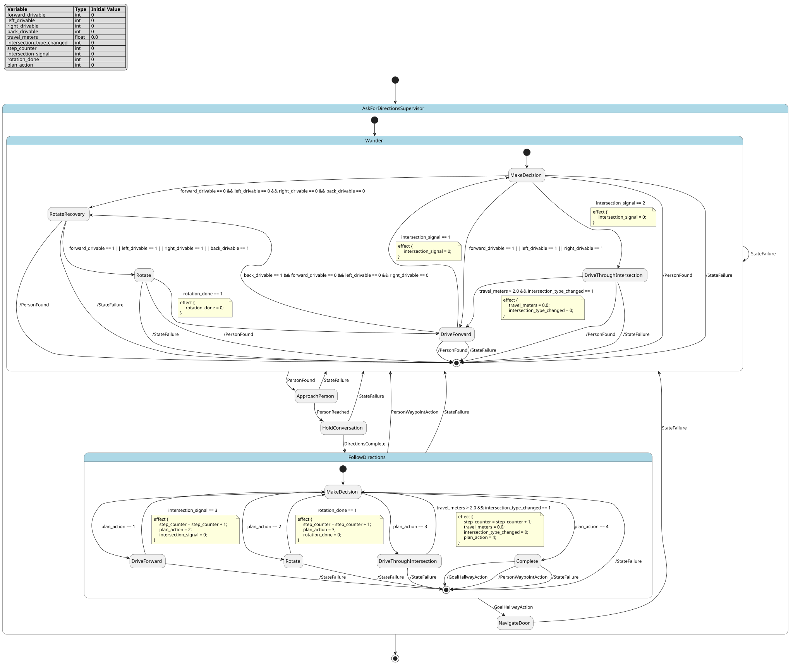

# Case `138` ⚙️ — Ask-for-Directions Hierarchical Navigation Supervisor

**Bucket**: HSM-layered  |  **Paper**: #485 `amazing-race-robot-edition`

- [STM.md case section](../../../sources/amazing-race-robot-edition/STM.md)
- [paper PDF](../../../sources/amazing-race-robot-edition/paper.pdf)
- [expansion NL JSON (含 provenance)](../expansions/138.json)
- [codex 起草笔记](../ref_stms/codex_drafts/138.notes.md)

## 1. 英文 NL（含 inline [E] 溯源 markers）

> 这是 codex 评审阶段生成的扩充 NL（commit `259e6ea7`），每条 substantive 信息带 `[En]` 标记。完整 provenance 表见 [expansion JSON](../expansions/138.json)。

The robot operates in an unknown office and uses a finite-state-machine architecture [E1] [E2]. It starts in WANDER because it must find a person before obtaining directions [E3]. Its pipeline searches for an approachable person [E4], approaches and speaks to them [E5], asks for and interprets directions [E6], follows the plan [E7], then enters NAVIGATE DOOR to inspect door tags [E8]. Across the architecture, each state has a success condition that advances the pipeline and failure conditions that return control to the initial state [E9] [E10]. Inside WANDER, the exploration FSM enters MAKE DECISION first; if no qualitative directions are available, it enters a recovery rotation that spins 360 degrees to refresh the quantitative and qualitative maps [E11] [E12]. During exploration, WANDER drives forward while watching for registered intersections [E13]. A dead end is treated as a case with only a back drivable trajectory and no forward, left, or right trajectories [E14]; it may rotate 180 degrees before returning to forward driving [E15]. Inside FOLLOW DIRECTIONS, it enters MAKE DECISION first and initializes a step counter to the first plan step [E16]; it uses drive, rotate, and crossing phases, and the crossing phase returns only after more than 2 m of travel and an intersection-type change [E17] [E18]. If the goal action names the correct hallway, control moves to NAVIGATE DOOR [E19]; if it names another person waypoint, control returns to WANDER to ask again [E20] [E21]. The deployed Husky A200 uses an IMU, 3D LiDAR, PTZ camera, microphone, speech recognition, and speaker-based synthesis for mapping, door perception, and spoken dialogue [E22] [E23] [E24] [E25] [E26].

## 2. 中文 NL 译文（claude 翻译，保留 [En] markers）

该机器人在未知办公环境中运行，并采用有限状态机架构 [E1] [E2]。它从 WANDER 开始，因为它必须先找到一个人才能获取方向指引 [E3]。其流水线先搜索一个可接近的人 [E4]，靠近并与其交谈 [E5]，询问并解析方向指引 [E6]，按计划执行 [E7]，然后进入 NAVIGATE DOOR 以检查门牌标签 [E8]。在整个架构中，每个状态都有一个用于推进流水线的成功条件，以及若干将控制权交回初始状态的失败条件 [E9] [E10]。在 WANDER 内部，探索 FSM 首先进入 MAKE DECISION；若没有可用的定性方向，则进入恢复旋转，原地旋转 360 度以刷新定量和定性地图 [E11] [E12]。在探索过程中，WANDER 向前行驶，同时监视已注册的路口 [E13]。死胡同被视为只有向后可行轨迹而没有向前、向左或向右可行轨迹的情况 [E14]；在恢复向前行驶前可旋转 180 度 [E15]。在 FOLLOW DIRECTIONS 内部，它首先进入 MAKE DECISION 并将步骤计数器初始化为计划的第一步 [E16]；它使用行驶、旋转和过路口三个阶段，过路口阶段仅在行进超过 2 米且路口类型发生变化后才返回 [E17] [E18]。如果目标动作命名了正确的走廊，则控制权转移到 NAVIGATE DOOR [E19]；如果它命名了另一个人物路径点，则控制权返回 WANDER 以再次询问 [E20] [E21]。部署的 Husky A200 使用 IMU、3D 激光雷达、PTZ 摄像头、麦克风、语音识别以及基于扬声器的语音合成，用于地图构建、门感知和口语对话 [E22] [E23] [E24] [E25] [E26]。

## 3. Reference pyfcstm STM (codex 起草，待用户签字)

### 3.1 状态机图（pyfcstm visualize SVG）



PlantUML 源文件：[`../diagrams/138.puml`](../diagrams/138.puml)

### 3.2 pyfcstm DSL 源码

```pyfcstm
def int forward_drivable = 0;
def int left_drivable = 0;
def int right_drivable = 0;
def int back_drivable = 0;
def float travel_meters = 0.0;
def int intersection_type_changed = 0;
def int step_counter = 0;
def int intersection_signal = 0;
def int rotation_done = 0;
def int plan_action = 0;

state AskForDirectionsSupervisor {
    event PersonFound;
    event PersonReached;
    event DirectionsComplete;
    event StateFailure;
    event GoalHallwayAction;
    event PersonWaypointAction;

    [*] -> Wander;

    state Wander {
        >> during before abstract MaintainSlamFromImuLidar;

        [*] -> MakeDecision;

        state MakeDecision {
            enter abstract AnalyzeRegisteredIntersectionAndQualitativeDirections;
        }

        state RotateRecovery {
            during abstract SpinInPlace360ToRefreshMaps;
        }

        state Rotate {
            enter abstract RotateTowardRecoveryAngleOrTurnAround180;
        }

        state DriveForward {
            during abstract DriveForwardAndMonitorRegisteredIntersections;
            during { travel_meters = travel_meters + 1.0; }
        }

        state DriveThroughIntersection {
            enter { travel_meters = 0.0; }
            during abstract DriveForwardThroughIntersection;
            during { travel_meters = travel_meters + 1.0; }
        }

        MakeDecision -> [*] : /PersonFound;
        MakeDecision -> [*] : /StateFailure;
        MakeDecision -> DriveThroughIntersection : if [intersection_signal == 2] effect {
            intersection_signal = 0;
        };
        MakeDecision -> RotateRecovery : if [forward_drivable == 0 && left_drivable == 0 && right_drivable == 0 && back_drivable == 0];
        MakeDecision -> DriveForward : if [forward_drivable == 1 || left_drivable == 1 || right_drivable == 1];

        RotateRecovery -> [*] : /PersonFound;
        RotateRecovery -> [*] : /StateFailure;
        RotateRecovery -> Rotate : if [forward_drivable == 1 || left_drivable == 1 || right_drivable == 1 || back_drivable == 1];

        Rotate -> [*] : /PersonFound;
        Rotate -> [*] : /StateFailure;
        Rotate -> DriveForward : if [rotation_done == 1] effect {
            rotation_done = 0;
        };

        DriveForward -> [*] : /PersonFound;
        DriveForward -> [*] : /StateFailure;
        DriveForward -> MakeDecision : if [intersection_signal == 1] effect {
            intersection_signal = 0;
        };
        DriveForward -> RotateRecovery : if [back_drivable == 1 && forward_drivable == 0 && left_drivable == 0 && right_drivable == 0];

        DriveThroughIntersection -> [*] : /PersonFound;
        DriveThroughIntersection -> [*] : /StateFailure;
        DriveThroughIntersection -> DriveForward : if [travel_meters > 2.0 && intersection_type_changed == 1] effect {
            travel_meters = 0.0;
            intersection_type_changed = 0;
        };
    }

    state ApproachPerson {
        enter abstract DriveTowardPersonAndSynthesizeAttentionSpeech;
    }

    state HoldConversation {
        enter abstract RequestDirectionsWithSpeechRecognition;
        during abstract ContinueSpokenDialogueWithMicrophoneAndSpeaker;
    }

    state FollowDirections {
        enter { step_counter = 1; }
        >> during before abstract ContinuouslyMapWithImuLidar;

        [*] -> MakeDecision;

        state MakeDecision {
            enter abstract SelectCurrentPlanStep;
        }

        state DriveForward {
            during abstract DriveForwardUntilSpecifiedIntersection;
            during { travel_meters = travel_meters + 1.0; }
        }

        state Rotate {
            enter abstract RotateByPlanDirection;
        }

        state DriveThroughIntersection {
            enter { travel_meters = 0.0; }
            during abstract DriveForwardThroughIntersection;
            during { travel_meters = travel_meters + 1.0; }
        }

        state Complete {
            enter abstract MarkDirectionsPlanComplete;
        }

        MakeDecision -> [*] : /StateFailure;
        MakeDecision -> DriveForward : if [plan_action == 1];
        MakeDecision -> Rotate : if [plan_action == 2];
        MakeDecision -> DriveThroughIntersection : if [plan_action == 3];
        MakeDecision -> Complete : if [plan_action == 4];

        DriveForward -> [*] : /StateFailure;
        DriveForward -> MakeDecision : if [intersection_signal == 3] effect {
            step_counter = step_counter + 1;
            plan_action = 2;
            intersection_signal = 0;
        };

        Rotate -> [*] : /StateFailure;
        Rotate -> MakeDecision : if [rotation_done == 1] effect {
            step_counter = step_counter + 1;
            plan_action = 3;
            rotation_done = 0;
        };

        DriveThroughIntersection -> [*] : /StateFailure;
        DriveThroughIntersection -> MakeDecision : if [travel_meters > 2.0 && intersection_type_changed == 1] effect {
            step_counter = step_counter + 1;
            travel_meters = 0.0;
            intersection_type_changed = 0;
            plan_action = 4;
        };

        Complete -> [*] : /GoalHallwayAction;
        Complete -> [*] : /PersonWaypointAction;
        Complete -> [*] : /StateFailure;
    }

    state NavigateDoor {
        enter abstract DetectDoorsAndInspectDoorTagsWithCameraLidar;
        during abstract ReadDoorTagsWithCameraAndOcr;
    }

    Wander -> ApproachPerson : PersonFound;
    Wander -> Wander : StateFailure;
    ApproachPerson -> HoldConversation : PersonReached;
    ApproachPerson -> Wander : StateFailure;
    HoldConversation -> FollowDirections : DirectionsComplete;
    HoldConversation -> Wander : StateFailure;
    FollowDirections -> NavigateDoor : GoalHallwayAction;
    FollowDirections -> Wander : PersonWaypointAction;
    FollowDirections -> Wander : StateFailure;
    NavigateDoor -> Wander : StateFailure;
}

```

**codex 自报 C-axis 使用情况**:
- C1: ✓
- C2: ✓
- C3: ✗
- C4: ✓

**codex 自报 scenarios 覆盖情况**:
- 模式数: 13
- guards 数: 17
- fault paths 数: 5
- per-cycle 行为数: 4
- 硬件 effectors 数: 8

## 4. Test scenarios（覆盖 NL 全特性，必须 100% pass）

```json
{
  "scenarios": [
    {
      "name": "top_level_pipeline_and_failures",
      "description": "覆盖 E3-E10 的顶层问路流水线，以及 Approach/Hold/Follow 的 failure 回到初始 Wander。",
      "initial_state": "AskForDirectionsSupervisor.Wander.DriveForward",
      "initial_vars": {
        "forward_drivable": 1,
        "left_drivable": 0,
        "right_drivable": 0,
        "back_drivable": 0,
        "travel_meters": 0.0,
        "intersection_type_changed": 0,
        "step_counter": 0,
        "intersection_signal": 0,
        "rotation_done": 0,
        "plan_action": 0
      },
      "steps": [
        {
          "before_cycles": 0,
          "events": ["AskForDirectionsSupervisor.PersonFound"],
          "expected_state": "AskForDirectionsSupervisor.ApproachPerson",
          "expected_vars": {"travel_meters": 0.0, "step_counter": 0, "plan_action": 0},
          "name": "person_found_enters_approach"
        },
        {
          "before_cycles": 0,
          "events": ["AskForDirectionsSupervisor.StateFailure"],
          "expected_state": "AskForDirectionsSupervisor.Wander.MakeDecision",
          "expected_vars": {"travel_meters": 0.0, "step_counter": 0, "plan_action": 0},
          "name": "approach_failure_returns_wander"
        },
        {
          "before_cycles": 0,
          "events": ["AskForDirectionsSupervisor.PersonFound"],
          "expected_state": "AskForDirectionsSupervisor.ApproachPerson",
          "expected_vars": {"travel_meters": 0.0, "step_counter": 0, "plan_action": 0},
          "name": "ask_again_person_found"
        },
        {
          "before_cycles": 0,
          "events": ["AskForDirectionsSupervisor.PersonReached"],
          "expected_state": "AskForDirectionsSupervisor.HoldConversation",
          "expected_vars": {"travel_meters": 0.0, "step_counter": 0, "plan_action": 0},
          "name": "person_reached_enters_conversation"
        },
        {
          "before_cycles": 0,
          "events": ["AskForDirectionsSupervisor.StateFailure"],
          "expected_state": "AskForDirectionsSupervisor.Wander.MakeDecision",
          "expected_vars": {"travel_meters": 0.0, "step_counter": 0, "plan_action": 0},
          "name": "conversation_failure_returns_wander"
        },
        {
          "before_cycles": 0,
          "events": ["AskForDirectionsSupervisor.PersonFound"],
          "expected_state": "AskForDirectionsSupervisor.ApproachPerson",
          "expected_vars": {"travel_meters": 0.0, "step_counter": 0, "plan_action": 0},
          "name": "third_person_found"
        },
        {
          "before_cycles": 0,
          "events": ["AskForDirectionsSupervisor.PersonReached"],
          "expected_state": "AskForDirectionsSupervisor.HoldConversation",
          "expected_vars": {"travel_meters": 0.0, "step_counter": 0, "plan_action": 0},
          "name": "third_person_reached"
        },
        {
          "before_cycles": 0,
          "events": ["AskForDirectionsSupervisor.DirectionsComplete"],
          "expected_state": "AskForDirectionsSupervisor.FollowDirections.MakeDecision",
          "expected_vars": {"travel_meters": 0.0, "step_counter": 1, "plan_action": 0},
          "name": "complete_directions_enter_follow"
        },
        {
          "before_cycles": 0,
          "events": ["AskForDirectionsSupervisor.StateFailure"],
          "expected_state": "AskForDirectionsSupervisor.Wander.MakeDecision",
          "expected_vars": {"travel_meters": 0.0, "step_counter": 1, "plan_action": 0},
          "name": "follow_failure_returns_wander"
        },
        {
          "before_cycles": 0,
          "events": ["AskForDirectionsSupervisor.StateFailure"],
          "expected_state": "AskForDirectionsSupervisor.Wander.MakeDecision",
          "expected_vars": {"travel_meters": 0.0, "step_counter": 1, "plan_action": 0},
          "name": "wander_failure_reinitializes_wander"
        }
      ]
    },
    {
      "name": "wander_no_qualitative_recovery",
      "description": "覆盖 E11-E12：Wander 初入 MakeDecision，全部 qualitative trajectories 不可用时进入 360 度恢复旋转并保持。",
      "initial_state": null,
      "initial_vars": {},
      "steps": [
        {
          "before_cycles": 0,
          "events": [],
          "expected_state": "AskForDirectionsSupervisor.Wander.MakeDecision",
          "expected_vars": {"forward_drivable": 0, "left_drivable": 0, "right_drivable": 0, "back_drivable": 0, "travel_meters": 0.0},
          "name": "default_enters_wander_make_decision"
        },
        {
          "before_cycles": 0,
          "events": [],
          "expected_state": "AskForDirectionsSupervisor.Wander.RotateRecovery",
          "expected_vars": {"forward_drivable": 0, "left_drivable": 0, "right_drivable": 0, "back_drivable": 0, "travel_meters": 0.0},
          "name": "no_qualitative_enters_rotate_recovery"
        },
        {
          "before_cycles": 2,
          "events": null,
          "expected_state": "AskForDirectionsSupervisor.Wander.RotateRecovery",
          "expected_vars": {"forward_drivable": 0, "left_drivable": 0, "right_drivable": 0, "back_drivable": 0, "travel_meters": 0.0},
          "name": "no_qualitative_stays_in_recovery"
        }
      ]
    },
    {
      "name": "wander_dead_end_turnaround",
      "description": "覆盖 E14-E15：back 可行且 forward/left/right 不可行的 dead-end guard，之后恢复旋转并 180 度转向回到 DriveForward。",
      "initial_state": "AskForDirectionsSupervisor.Wander.DriveForward",
      "initial_vars": {
        "forward_drivable": 0,
        "left_drivable": 0,
        "right_drivable": 0,
        "back_drivable": 1,
        "travel_meters": 0.0,
        "intersection_type_changed": 0,
        "step_counter": 0,
        "intersection_signal": 0,
        "rotation_done": 1,
        "plan_action": 0
      },
      "steps": [
        {
          "before_cycles": 0,
          "events": [],
          "expected_state": "AskForDirectionsSupervisor.Wander.RotateRecovery",
          "expected_vars": {"back_drivable": 1, "travel_meters": 0.0, "rotation_done": 1},
          "name": "dead_end_enters_recovery"
        },
        {
          "before_cycles": 0,
          "events": [],
          "expected_state": "AskForDirectionsSupervisor.Wander.Rotate",
          "expected_vars": {"back_drivable": 1, "travel_meters": 0.0, "rotation_done": 1},
          "name": "back_only_recovery_selects_rotate"
        },
        {
          "before_cycles": 0,
          "events": [],
          "expected_state": "AskForDirectionsSupervisor.Wander.DriveForward",
          "expected_vars": {"back_drivable": 1, "travel_meters": 1.0, "rotation_done": 0},
          "name": "rotation_done_returns_drive_forward"
        }
      ]
    },
    {
      "name": "wander_forward_drive_cycles",
      "description": "覆盖 E13：Wander 在 forward trajectory 可用时进入 DriveForward，并连续多个 cycle 前进监测 intersection。",
      "initial_state": "AskForDirectionsSupervisor.Wander.MakeDecision",
      "initial_vars": {
        "forward_drivable": 1,
        "left_drivable": 0,
        "right_drivable": 0,
        "back_drivable": 0,
        "travel_meters": 0.0,
        "intersection_type_changed": 0,
        "step_counter": 0,
        "intersection_signal": 0,
        "rotation_done": 0,
        "plan_action": 0
      },
      "steps": [
        {
          "before_cycles": 0,
          "events": [],
          "expected_state": "AskForDirectionsSupervisor.Wander.DriveForward",
          "expected_vars": {"forward_drivable": 1, "travel_meters": 1.0, "intersection_signal": 0},
          "name": "forward_available_enters_drive"
        },
        {
          "before_cycles": 2,
          "events": null,
          "expected_state": "AskForDirectionsSupervisor.Wander.DriveForward",
          "expected_vars": {"forward_drivable": 1, "travel_meters": 3.0, "intersection_signal": 0},
          "name": "drive_forward_three_cycles"
        }
      ]
    },
    {
      "name": "wander_registered_and_selected_intersections",
      "description": "覆盖 E13-E15 中 registered intersection 返回决策，以及已选择 hallway trajectory 后进入 crossing phase。",
      "initial_state": "AskForDirectionsSupervisor.Wander.DriveForward",
      "initial_vars": {
        "forward_drivable": 1,
        "left_drivable": 0,
        "right_drivable": 0,
        "back_drivable": 0,
        "travel_meters": 3.0,
        "intersection_type_changed": 0,
        "step_counter": 0,
        "intersection_signal": 1,
        "rotation_done": 0,
        "plan_action": 0
      },
      "steps": [
        {
          "before_cycles": 0,
          "events": [],
          "expected_state": "AskForDirectionsSupervisor.Wander.MakeDecision",
          "expected_vars": {"travel_meters": 3.0, "intersection_signal": 0, "step_counter": 0},
          "name": "registered_intersection_returns_decision"
        }
      ]
    },
    {
      "name": "wander_selected_intersection_enters_crossing",
      "description": "覆盖 WANDER 的 selected intersection 分支：MakeDecision 选择 hallway trajectory 后进入 DriveThroughIntersection。",
      "initial_state": "AskForDirectionsSupervisor.Wander.MakeDecision",
      "initial_vars": {
        "forward_drivable": 1,
        "left_drivable": 0,
        "right_drivable": 0,
        "back_drivable": 0,
        "travel_meters": 0.0,
        "intersection_type_changed": 0,
        "step_counter": 0,
        "intersection_signal": 2,
        "rotation_done": 0,
        "plan_action": 0
      },
      "steps": [
        {
          "before_cycles": 0,
          "events": [],
          "expected_state": "AskForDirectionsSupervisor.Wander.DriveThroughIntersection",
          "expected_vars": {"travel_meters": 1.0, "intersection_signal": 0, "step_counter": 0},
          "name": "selected_intersection_enters_crossing"
        }
      ]
    },
    {
      "name": "wander_crossing_cycles_without_type_change",
      "description": "覆盖 WANDER 的 crossing per-cycle drive：intersection type 未变化时连续前进但保持在 DriveThroughIntersection。",
      "initial_state": "AskForDirectionsSupervisor.Wander.DriveThroughIntersection",
      "initial_vars": {
        "forward_drivable": 1,
        "left_drivable": 0,
        "right_drivable": 0,
        "back_drivable": 0,
        "travel_meters": 0.0,
        "intersection_type_changed": 0,
        "step_counter": 0,
        "intersection_signal": 0,
        "rotation_done": 0,
        "plan_action": 0
      },
      "steps": [
        {
          "before_cycles": 3,
          "events": null,
          "expected_state": "AskForDirectionsSupervisor.Wander.DriveThroughIntersection",
          "expected_vars": {"travel_meters": 3.0, "intersection_type_changed": 0, "step_counter": 0},
          "name": "wander_crossing_three_cycles"
        }
      ]
    },
    {
      "name": "wander_crossing_threshold_exits",
      "description": "覆盖 WANDER crossing 的正向退出 guard：travel_meters 超过 2 m 且 intersection type 已变化后返回 DriveForward。",
      "initial_state": "AskForDirectionsSupervisor.Wander.DriveThroughIntersection",
      "initial_vars": {
        "forward_drivable": 1,
        "left_drivable": 0,
        "right_drivable": 0,
        "back_drivable": 0,
        "travel_meters": 0.0,
        "intersection_type_changed": 1,
        "step_counter": 0,
        "intersection_signal": 0,
        "rotation_done": 0,
        "plan_action": 0
      },
      "steps": [
        {
          "before_cycles": 0,
          "events": [],
          "expected_state": "AskForDirectionsSupervisor.Wander.DriveThroughIntersection",
          "expected_vars": {"travel_meters": 1.0, "intersection_type_changed": 1, "step_counter": 0},
          "name": "wander_crossing_one_meter"
        },
        {
          "before_cycles": 0,
          "events": [],
          "expected_state": "AskForDirectionsSupervisor.Wander.DriveThroughIntersection",
          "expected_vars": {"travel_meters": 2.0, "intersection_type_changed": 1, "step_counter": 0},
          "name": "wander_crossing_two_meters"
        },
        {
          "before_cycles": 0,
          "events": [],
          "expected_state": "AskForDirectionsSupervisor.Wander.DriveThroughIntersection",
          "expected_vars": {"travel_meters": 3.0, "intersection_type_changed": 1, "step_counter": 0},
          "name": "wander_crossing_more_than_two_ready"
        },
        {
          "before_cycles": 0,
          "events": [],
          "expected_state": "AskForDirectionsSupervisor.Wander.DriveForward",
          "expected_vars": {"travel_meters": 1.0, "intersection_type_changed": 0, "step_counter": 0},
          "name": "wander_crossing_exits_to_drive_forward"
        }
      ]
    },
    {
      "name": "follow_phases_goal_hallway_and_door_failure",
      "description": "覆盖 E16-E19/E22-E26：FollowDirections 的 step counter、drive/rotate/crossing/complete，以及 goal hallway 进入 NavigateDoor 并可 failure 回 Wander。",
      "initial_state": "AskForDirectionsSupervisor.FollowDirections.MakeDecision",
      "initial_vars": {
        "forward_drivable": 0,
        "left_drivable": 0,
        "right_drivable": 0,
        "back_drivable": 0,
        "travel_meters": 0.0,
        "intersection_type_changed": 1,
        "step_counter": 1,
        "intersection_signal": 3,
        "rotation_done": 1,
        "plan_action": 1
      },
      "steps": [
        {
          "before_cycles": 0,
          "events": [],
          "expected_state": "AskForDirectionsSupervisor.FollowDirections.DriveForward",
          "expected_vars": {"travel_meters": 1.0, "intersection_signal": 3, "step_counter": 1, "plan_action": 1},
          "name": "forward_action_enters_drive"
        },
        {
          "before_cycles": 0,
          "events": [],
          "expected_state": "AskForDirectionsSupervisor.FollowDirections.MakeDecision",
          "expected_vars": {"travel_meters": 1.0, "intersection_signal": 0, "step_counter": 2, "plan_action": 2},
          "name": "specified_intersection_increments_step"
        },
        {
          "before_cycles": 0,
          "events": [],
          "expected_state": "AskForDirectionsSupervisor.FollowDirections.Rotate",
          "expected_vars": {"travel_meters": 1.0, "rotation_done": 1, "step_counter": 2, "plan_action": 2},
          "name": "rotate_action_enters_rotate"
        },
        {
          "before_cycles": 0,
          "events": [],
          "expected_state": "AskForDirectionsSupervisor.FollowDirections.MakeDecision",
          "expected_vars": {"travel_meters": 1.0, "rotation_done": 0, "step_counter": 3, "plan_action": 3},
          "name": "rotation_done_increments_step"
        },
        {
          "before_cycles": 0,
          "events": [],
          "expected_state": "AskForDirectionsSupervisor.FollowDirections.DriveThroughIntersection",
          "expected_vars": {"travel_meters": 1.0, "intersection_type_changed": 1, "step_counter": 3, "plan_action": 3},
          "name": "cross_action_enters_crossing"
        },
        {
          "before_cycles": 0,
          "events": [],
          "expected_state": "AskForDirectionsSupervisor.FollowDirections.DriveThroughIntersection",
          "expected_vars": {"travel_meters": 2.0, "intersection_type_changed": 1, "step_counter": 3, "plan_action": 3},
          "name": "two_meters_not_more_than_two"
        },
        {
          "before_cycles": 0,
          "events": [],
          "expected_state": "AskForDirectionsSupervisor.FollowDirections.DriveThroughIntersection",
          "expected_vars": {"travel_meters": 3.0, "intersection_type_changed": 1, "step_counter": 3, "plan_action": 3},
          "name": "three_meters_ready_for_next_cycle_guard"
        },
        {
          "before_cycles": 0,
          "events": [],
          "expected_state": "AskForDirectionsSupervisor.FollowDirections.MakeDecision",
          "expected_vars": {"travel_meters": 0.0, "intersection_type_changed": 0, "step_counter": 4, "plan_action": 4},
          "name": "more_than_two_and_changed_exits_crossing"
        },
        {
          "before_cycles": 0,
          "events": [],
          "expected_state": "AskForDirectionsSupervisor.FollowDirections.Complete",
          "expected_vars": {"travel_meters": 0.0, "intersection_type_changed": 0, "step_counter": 4, "plan_action": 4},
          "name": "plan_complete_enters_complete"
        },
        {
          "before_cycles": 0,
          "events": ["AskForDirectionsSupervisor.GoalHallwayAction"],
          "expected_state": "AskForDirectionsSupervisor.NavigateDoor",
          "expected_vars": {"travel_meters": 0.0, "intersection_type_changed": 0, "step_counter": 4, "plan_action": 4},
          "name": "goal_hallway_enters_navigate_door"
        },
        {
          "before_cycles": 0,
          "events": ["AskForDirectionsSupervisor.StateFailure"],
          "expected_state": "AskForDirectionsSupervisor.Wander.MakeDecision",
          "expected_vars": {"travel_meters": 0.0, "intersection_type_changed": 0, "step_counter": 4, "plan_action": 4},
          "name": "navigate_door_failure_returns_wander"
        }
      ]
    },
    {
      "name": "follow_drive_forward_cycles",
      "description": "覆盖 E17 的 FollowDirections DriveForward per-cycle 行为：未检测到指定 intersection 时持续前进。",
      "initial_state": "AskForDirectionsSupervisor.FollowDirections.DriveForward",
      "initial_vars": {
        "forward_drivable": 0,
        "left_drivable": 0,
        "right_drivable": 0,
        "back_drivable": 0,
        "travel_meters": 0.0,
        "intersection_type_changed": 0,
        "step_counter": 1,
        "intersection_signal": 0,
        "rotation_done": 0,
        "plan_action": 1
      },
      "steps": [
        {
          "before_cycles": 3,
          "events": null,
          "expected_state": "AskForDirectionsSupervisor.FollowDirections.DriveForward",
          "expected_vars": {"travel_meters": 3.0, "intersection_signal": 0, "step_counter": 1, "plan_action": 1},
          "name": "follow_drive_forward_three_cycles"
        }
      ]
    },
    {
      "name": "follow_crossing_requires_type_change",
      "description": "覆盖 E18 的复合 guard：即使 travel_meters 已超过 2 m，只要 intersection-type 没有 change 就不能退出 crossing。",
      "initial_state": "AskForDirectionsSupervisor.FollowDirections.DriveThroughIntersection",
      "initial_vars": {
        "forward_drivable": 0,
        "left_drivable": 0,
        "right_drivable": 0,
        "back_drivable": 0,
        "travel_meters": 3.0,
        "intersection_type_changed": 0,
        "step_counter": 2,
        "intersection_signal": 0,
        "rotation_done": 0,
        "plan_action": 3
      },
      "steps": [
        {
          "before_cycles": 0,
          "events": [],
          "expected_state": "AskForDirectionsSupervisor.FollowDirections.DriveThroughIntersection",
          "expected_vars": {"travel_meters": 4.0, "intersection_type_changed": 0, "step_counter": 2, "plan_action": 3},
          "name": "distance_without_type_change_stays"
        },
        {
          "before_cycles": 2,
          "events": null,
          "expected_state": "AskForDirectionsSupervisor.FollowDirections.DriveThroughIntersection",
          "expected_vars": {"travel_meters": 6.0, "intersection_type_changed": 0, "step_counter": 2, "plan_action": 3},
          "name": "still_stays_after_more_cycles"
        }
      ]
    },
    {
      "name": "person_waypoint_returns_to_wander",
      "description": "覆盖 E20-E21：goal action 为 person waypoint 时，FollowDirections Complete 返回 Wander 重新找人问路。",
      "initial_state": "AskForDirectionsSupervisor.FollowDirections.Complete",
      "initial_vars": {
        "forward_drivable": 0,
        "left_drivable": 0,
        "right_drivable": 0,
        "back_drivable": 0,
        "travel_meters": 0.0,
        "intersection_type_changed": 0,
        "step_counter": 4,
        "intersection_signal": 0,
        "rotation_done": 0,
        "plan_action": 4
      },
      "steps": [
        {
          "before_cycles": 0,
          "events": ["AskForDirectionsSupervisor.PersonWaypointAction"],
          "expected_state": "AskForDirectionsSupervisor.Wander.MakeDecision",
          "expected_vars": {"travel_meters": 0.0, "intersection_type_changed": 0, "step_counter": 4, "plan_action": 4},
          "name": "person_waypoint_exits_to_wander"
        }
      ]
    }
  ]
}
```

## 5. pyfcstm 验证日志（parse + sem + sim + scenarios 全跑）

```
PARSE_OK
SEM_OK (leaf_states=?)
SIM_OK (current_state=MakeDecision)
SCENARIOS_LOADED: 12
  ✓ [top_level_pipeline_and_failures]
  ✓ [wander_no_qualitative_recovery]
  ✓ [wander_dead_end_turnaround]
  ✓ [wander_forward_drive_cycles]
  ✓ [wander_registered_and_selected_intersections]
  ✓ [wander_selected_intersection_enters_crossing]
  ✓ [wander_crossing_cycles_without_type_change]
  ✓ [wander_crossing_threshold_exits]
  ✓ [follow_phases_goal_hallway_and_door_failure]
  ✓ [follow_drive_forward_cycles]
  ✓ [follow_crossing_requires_type_change]
  ✓ [person_waypoint_returns_to_wander]

SCENARIOS_SUMMARY: pass=12 fail=0 error=0 total=12

LINT_RUNNING...
LINT_SUMMARY: warnings=0 by_code={}
ALL_OK
```

## 6. Codex 起草笔记

# Codex Draft Notes — Case 138

## 1. 设计选择

- mode 列表：
  - `Wander`: STM §1 摘录 B/C；expansion [E3] [E4] [E11]-[E15]。
  - `Wander.MakeDecision`: STM §1 摘录 C；[E11]。
  - `Wander.RotateRecovery`: STM §1 摘录 C；[E12]。
  - `Wander.Rotate`: STM §1 摘录 C；[E15]。
  - `Wander.DriveForward`: STM §1 摘录 C；[E13]。
  - `Wander.DriveThroughIntersection`: STM §1 摘录 C；paper_content.txt lines 489-499。
  - `ApproachPerson`: STM §1 摘录 B；[E5]。
  - `HoldConversation`: STM §1 摘录 B；[E6]。
  - `FollowDirections`: STM §1 摘录 B/D；[E7] [E16]-[E21]。
  - `FollowDirections.MakeDecision`: STM §1 摘录 D；[E16]。
  - `FollowDirections.DriveForward`, `FollowDirections.Rotate`, `FollowDirections.DriveThroughIntersection`, `FollowDirections.Complete`: STM §1 摘录 D；[E17]-[E19]。
  - `NavigateDoor`: STM §1 摘录 B；[E8] [E26]。
- event 列表：
  - `PersonFound`: approachable person found / pipeline advances from `Wander` to `ApproachPerson`，[E4] [E5]。
  - `PersonReached`: successful approach before conversation，[E5]。
  - `DirectionsComplete`: complete directions assembled through dialogue，[E6] [E7]。
  - `StateFailure`: architecture-level failure condition returning to initial state，[E9] [E10]。
  - `GoalHallwayAction`: goal action `goal-F`, `goal-L`, or `goal-R` leads to `NavigateDoor`，[E19]。
  - `PersonWaypointAction`: goal action `person` returns to `Wander`，[E20] [E21]。
- variable 列表：
  - `int forward_drivable = 0`, `left_drivable = 0`, `right_drivable = 0`, `back_drivable = 0`: qualitative drivable trajectories；dead-end guard 来自 [E14]。当前 pyfcstm 安装版只接受 `int/float` definition，因此用 0/1 编码布尔传感条件。
  - `float travel_meters = 0.0`: crossing travel distance；阈值 `> 2.0` 来自 [E18]，also used as per-cycle progress in drive/crossing states。
  - `int intersection_type_changed = 0`: intersection-type change condition；[E18]，0/1 编码。
  - `int step_counter = 0`: `FollowDirections` step counter；entry 设置为 1，对应 [E16]；drive/rotate/crossing 完成时递增，对应 paper_content.txt lines 1096-1100。
  - `int intersection_signal = 0`: registered/selected/specified intersection condition carrier；分别对应 [E13]、STM §1 摘录 C 的 selected hallway trajectory、[E17]/[E18] 的 specified intersection。
  - `int rotation_done = 0`: rotation completion condition；对应 [E15] 和 [E17] 的 rotate phase returns。
  - `int plan_action = 0`: current plan action category；`1=forward`, `2=rotate`, `3=forward-through-int`, `4=goal action/complete`，对应 [E17]-[E20]。
- transition 设计：
  - `[*] -> Wander`: initial state is `Wander`，[E3]。
  - `Wander` child states exit to parent on `/PersonFound` or `/StateFailure`; root transition then advances to `ApproachPerson` or re-enters `Wander`，[E4] [E9] [E10]。
  - `Wander.MakeDecision -> RotateRecovery` guard checks no qualitative directions: all four drivable trajectory variables are 0，[E12]。
  - `Wander.DriveForward -> RotateRecovery` uses the dead-end back-only guard: `back_drivable == 1` and forward/left/right are 0，[E14] [E15]。
  - `Wander.DriveForward` and both `DriveThroughIntersection` states increment `travel_meters` in `during {}` to model continuous driving，[E13] [E18]。
  - `FollowDirections.enter` sets `step_counter = 1`，[E16]。
  - `FollowDirections.MakeDecision` branches on `plan_action` into drive/rotate/cross/complete phases，[E17]。
  - `FollowDirections.DriveThroughIntersection -> MakeDecision` guard is `travel_meters > 2.0 && intersection_type_changed == 1`, then increments `step_counter` and advances to complete action，[E18]。
  - `FollowDirections.Complete` exits on `/GoalHallwayAction` or `/PersonWaypointAction`, and root transitions to `NavigateDoor` or `Wander`，[E19]-[E21]。

## 2. C-axis grounding 使用情况

- **C1 (周期执行)**: 用 — `during { travel_meters = travel_meters + 1.0; }` appears in `Wander.DriveForward`, `Wander.DriveThroughIntersection`, `FollowDirections.DriveForward`, and `FollowDirections.DriveThroughIntersection`; `>> during before abstract MaintainSlamFromImuLidar` / `ContinuouslyMapWithImuLidar` ground the continuous mapping language from [E7] [E13] [E23]。
- **C2 (数值守卫)**: 用 — `travel_meters > 2.0 && intersection_type_changed == 1` encodes the two-condition crossing guard from [E18]; the dead-end and no-qualitative guards encode the multi-variable qualitative trajectory condition from [E12] [E14]。
- **C3 (forced fault)**: 未用 — 原文只有 “failure conditions return to initial state” [E9] [E10]，没有 emergency stop / global fault event；therefore failures are modeled as ordinary `StateFailure` transitions to `Wander`, not `! * -> Error`。
- **C4 (硬件)**: 用 — abstract actions ground named sensors/actuators: IMU/LiDAR SLAM (`MaintainSlamFromImuLidar`, `ContinuouslyMapWithImuLidar`) [E22] [E23], camera/door OCR (`DetectDoorsAndInspectDoorTagsWithCameraLidar`, `ReadDoorTagsWithCameraAndOcr`) [E22] [E26], microphone/speech recognition/speaker synthesis (`RequestDirectionsWithSpeechRecognition`, `ContinueSpokenDialogueWithMicrophoneAndSpeaker`, `DriveTowardPersonAndSynthesizeAttentionSpeech`) [E24] [E25]。

## 3. 与 NL 的对应关系

- expansion NL [E1]: unknown office environment -> root `AskForDirectionsSupervisor` and `Wander` initial search context。
- [E2]: finite-state-machine architecture -> one pyfcstm root state with explicit pipeline transitions。
- [E3]: starts in `Wander` -> `[*] -> Wander`。
- [E4]: searches for approachable person -> `Wander` and event `PersonFound`。
- [E5]: approaches and speaks to person -> `ApproachPerson` with `DriveTowardPersonAndSynthesizeAttentionSpeech`; `PersonReached` leads to `HoldConversation`。
- [E6]: asks/interprets directions -> `HoldConversation` abstract dialogue actions and `DirectionsComplete`。
- [E7]: follows plan -> `FollowDirections` composite and `ContinuouslyMapWithImuLidar`。
- [E8]: enters `NavigateDoor` to inspect tags -> `FollowDirections -> NavigateDoor : GoalHallwayAction` and `NavigateDoor` abstract actions。
- [E9]: success advances pipeline -> `PersonFound`, `PersonReached`, `DirectionsComplete`, `GoalHallwayAction` transitions。
- [E10]: failure returns initial -> `StateFailure` transitions to `Wander`。
- [E11]: `Wander` enters `MakeDecision` first -> `Wander` initial transition。
- [E12]: no qualitative directions triggers 360 recovery -> no-drivable guard to `RotateRecovery` and `SpinInPlace360ToRefreshMaps`。
- [E13]: drives forward while monitoring intersections -> `Wander.DriveForward` during actions and `intersection_signal == 1` return to `MakeDecision`。
- [E14]: dead end is back-only drivable -> back-only compound guard。
- [E15]: rotate 180 then drive forward -> `Wander.Rotate` and `rotation_done` guard back to `DriveForward`。
- [E16]: `FollowDirections` initializes step counter -> `enter { step_counter = 1; }`。
- [E17]: drive/rotate/crossing phases -> `plan_action` guarded branches to `DriveForward`, `Rotate`, `DriveThroughIntersection`。
- [E18]: crossing returns after more than 2 m and intersection-type change -> `travel_meters > 2.0 && intersection_type_changed == 1`。
- [E19]: correct hallway goal action -> `GoalHallwayAction` to `NavigateDoor`。
- [E20]: person waypoint condition -> `PersonWaypointAction`。
- [E21]: person waypoint returns to `Wander` -> `FollowDirections -> Wander : PersonWaypointAction`。
- [E22]: Husky A200 with IMU/LiDAR/PTZ/microphone -> hardware-grounded abstract action names。
- [E23]: mapping from IMU and LiDAR -> `MaintainSlamFromImuLidar`, `ContinuouslyMapWithImuLidar`。
- [E24]: microphone and speech recognition -> `RequestDirectionsWithSpeechRecognition` / dialogue abstract action。
- [E25]: speaker synthesis -> `DriveTowardPersonAndSynthesizeAttentionSpeech` / dialogue abstract action。
- [E26]: door perception -> `DetectDoorsAndInspectDoorTagsWithCameraLidar`, `ReadDoorTagsWithCameraAndOcr`。

## 4. 迭代历史

- iter 1: 写出初稿，使用 `def bool` 表达 trajectory/type-change flags -> verify: `PARSE_FAIL`，当前安装版 pyfcstm definition 只接受 `int/float` -> 修复为 `int` 0/1 编码并改写 guards。
- iter 2: `PARSE_OK -> SEM_OK -> SIM_OK`；scenario run 中 root-level events 用简名无法从嵌套 state 解析 -> 修复 scenarios，将 root events 改为完整路径如 `AskForDirectionsSupervisor.PersonFound`。
- iter 3: scenarios 全 pass，但 Stage 5 lint 报 nested events `unused_event`；原因是 lint 只统计 root transition event usage，嵌套 event 虽可运行但被视为未使用 -> 将内部子状态切换改为 `intersection_signal` / `rotation_done` / `plan_action` guard variables。
- iter 4: `PARSE_OK -> SEM_OK -> SIM_OK -> SCENARIOS_SUMMARY pass=12 fail=0 error=0 -> LINT_SUMMARY warnings=0 -> ALL_OK`。

## 5. 与 STM.md 表述的偏差（如有）

- 没有引入 emergency stop、ErrorHandler 或 `! * -> Error`，因为原文只支持一般 failure-to-initial 语义，不支持 forced global fault。
- 由于 pyfcstm 当前 definition parser 不接受 `bool`，所有布尔型感知条件均用 `int` 0/1 编码；这是 DSL 实现层编码，不改变 NL 语义。
- 内部子状态的 plan/intersection/rotation 条件用 guard variables 表达，而不是 nested events；这是为了满足零 warning lint gate，同时这些变量均对应原文中的 plan action、registered/specified intersection、rotation completion 条件。

## 7. Claude 交叉评审

**Verdict**: APPROVE

| 维度 | 打分 | evidence |
|---|---|---|
| 语义正确性 | 🟢 | 5 个顶层状态 Wander/ApproachPerson/HoldConversation/FollowDirections/NavigateDoor 与摘录 B 一致；WANDER 与 FOLLOW DIRECTIONS 的 5 个子状态命名与摘录 C/D 完全对齐；step_counter 初始化、2m+type_change 退出 guard、goal_hallway→Navigat… |
| NL 忠实性 | 🟡 | `intersection_signal` 0/1/2/3 与 `plan_action` 1/2/3/4 是为驱动 guard 而合成的控制变量（NL 用 qualitative 描述但未给数字编码，属合理建模代理）；WANDER 的 DriveThroughIntersection 退出 guard `travel_meters>2 && intersection_type_change… |
| C-axis grounding 恰当性 | 🟢 | C1：`>> during before abstract MaintainSlamFromImuLidar/ContinuouslyMapWithImuLidar` + `during { travel_meters+=1.0 }` 对应 [E7][E13] 的“持续 mapping/drive forward”；C2：多变量复合 guard（4 个 drivable 全 0；back==… |
| scenarios NL 覆盖度 | 🟢 | 12 个 scenarios 覆盖顶层 pipeline + failure 回退、no-qualitative recovery、dead-end 180°、forward 3-cycle、registered/selected intersection、WANDER 与 FOLLOW 的 crossing 阈值边界（1m/2m/3m）、FOLLOW 各 plan_action 分支、go… |

## 8. 用户审阅区（待签字）

**审阅状态**：⬜ 待审 / ⬜ approve / ⬜ revise / ⬜ rewrite

**审阅笔记**（用户填写）：

- 

**修订要求**（用户填写）：

- 

**签字**：（用户填写日期 + 姓名）

---

**最终 ref 落盘路径（待签字后）**: `audited/138.fcstm` + `audited/138.audit.md`