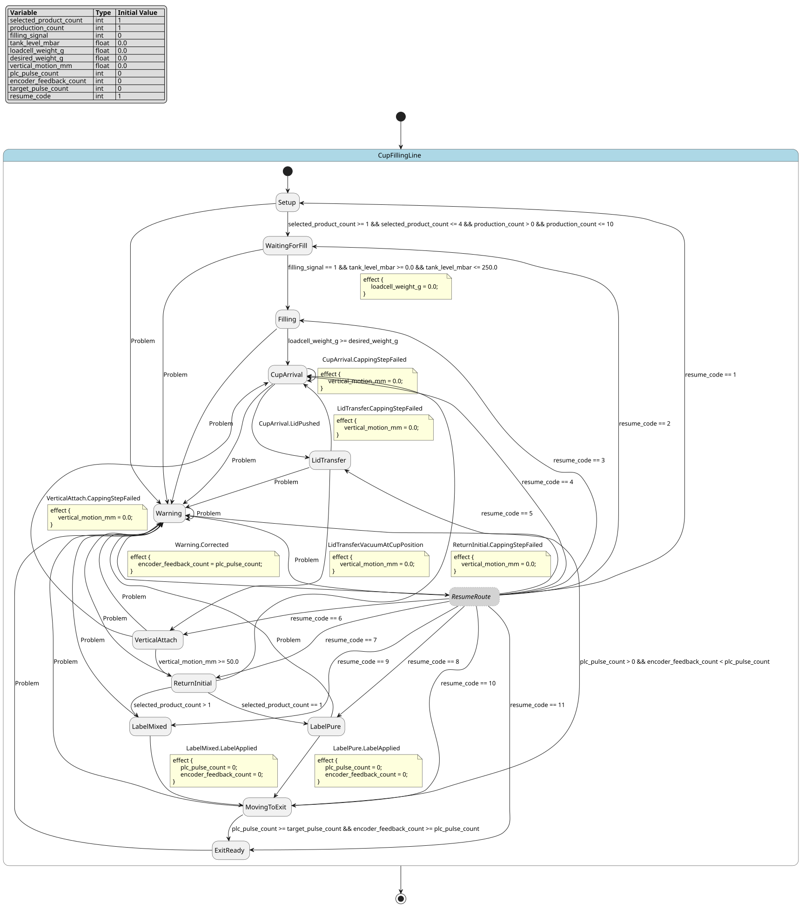

# Case `142` 🏭 — HMI-Configured Cup Filling, Capping, and Labeling Line

**Bucket**: EFSM-interlock  |  **Paper**: #493 `plc-scada-liquid-filling-automation-ejosat`

- [STM.md case section](../../../sources/plc-scada-liquid-filling-automation-ejosat/STM.md)
- [paper PDF](../../../sources/plc-scada-liquid-filling-automation-ejosat/paper.pdf)
- [expansion NL JSON (含 provenance)](../expansions/142.json)
- [codex 起草笔记](../ref_stms/codex_drafts/142.notes.md)

## 1. 英文 NL（含 inline [E] 溯源 markers）

> 这是 codex 评审阶段生成的扩充 NL（commit `259e6ea7`），每条 substantive 信息带 `[En]` 标记。完整 provenance 表见 [expansion JSON](../expansions/142.json)。

The controller manages a prototype PLC/SCADA liquid-filling line through an HMI panel [E1]. At setup, the HMI lets one or more of four products be selected, assigns gram values, and records the production count with a default maximum of 10 units [E1][E2]. Filling starts only when the tank level is at the desired level AND the filling signal arrives; then electropneumatic valves open, and loadcell weight feedback closes the valve when the cup reaches the desired weight [E3][E4]. Tank level comes from pressure transmitters with a 0-250 mBar range and 4-20 mA or 0-10 V analog output [E5]. Capping is a separate phase sequence that includes cup arrival, lid transfer by vacuum to the cup position, a 50 mm vertical attachment motion, and return of the rodless cylinder plus vacuum to the initial position [E6][E7]. If one or more capping steps fail, the whole capping process restarts; when completed correctly, labeling begins [E8]. Labeling uses the product-selection count: multiple selected products mixed at requested ratios get a mixed label, while a single selected product gets a pure label regardless of quantity [E9]. Conveyor movement uses step motor 86HS45 and M542 driver; PLC pulse counts determine motor turns and travel distance [E10]. Encoder feedback on the tension drum closes the loop, so if a move signal is sent but the motor or belt prevents movement, encoder information detects the error [E11]. Across main and auxiliary processes, any problem causes a warning; after correction, operation resumes where it stopped [E12].

## 2. 中文 NL 译文（claude 翻译，保留 [En] markers）

该控制器通过 HMI 面板管理一条原型化的 PLC/SCADA 灌装产线 [E1]。在初始化阶段，HMI 允许从四种产品中选择一种或多种，为其分配克重，并记录生产数量，默认最大值为 10 个单位 [E1][E2]。仅当液位达到设定值且灌装信号到达时，灌装才会启动；随后电气阀打开，称重传感器反馈杯重，当达到设定重量时关闭阀门 [E3][E4]。液位由压力变送器测量，量程为 0–250 mBar，输出 4–20 mA 或 0–10 V 模拟信号 [E5]。封盖是独立的相位序列，包括杯到位、由真空将盖转移至杯位、50 mm 的竖直安装运动，以及无杆气缸和真空回到初始位 [E6][E7]。若一个或多个封盖步骤失败，则整个封盖流程重新启动；正确完成后，开始贴标 [E8]。贴标依据产品选择数量：选择多个产品并按指定比例混合时贴混合标签，仅选择单一产品时无论数量多少均贴纯品标签 [E9]。传送带由 86HS45 步进电机和 M542 驱动器驱动，PLC 脉冲数决定电机圈数和运行距离 [E10]。张紧辊上的编码器反馈构成闭环，若发出移动信号但电机或皮带阻碍运动，则通过编码器信息检测出错误 [E11]。在主流程与辅助流程中，任何问题都会触发告警；故障排除后，运行从中断处恢复 [E12]。

## 3. Reference pyfcstm STM (codex 起草，待用户签字)

### 3.1 状态机图（pyfcstm visualize SVG）



PlantUML 源文件：[`../diagrams/142.puml`](../diagrams/142.puml)

### 3.2 pyfcstm DSL 源码

```pyfcstm
def int selected_product_count = 1;
def int production_count = 1;
def int filling_signal = 0;
def float tank_level_mbar = 0.0;
def float loadcell_weight_g = 0.0;
def float desired_weight_g = 0.0;
def float vertical_motion_mm = 0.0;
def int plc_pulse_count = 0;
def int encoder_feedback_count = 0;
def int target_pulse_count = 0;
def int resume_code = 1;

state CupFillingLine {
    !* -> Warning :: Problem;

    [*] -> Setup;

    state Setup {
        enter { resume_code = 1; }
        enter abstract ReadHmiPanel;
        enter abstract CheckHmiMacroConformity;
    }

    state WaitingForFill {
        enter { resume_code = 2; }
        enter abstract ReadPressureTransmitters;
    }

    state Filling {
        enter { resume_code = 3; }
        enter abstract OpenElectropneumaticValves;
        during { loadcell_weight_g = loadcell_weight_g + 25.0; }
        during abstract ReadLoadcellFeedback;
        exit abstract CloseElectropneumaticValves;
    }

    state CupArrival {
        enter { resume_code = 4; }
        enter abstract DetectCupAtCappingStation;
    }

    state LidTransfer {
        enter { resume_code = 5; }
        enter abstract PushLidFromStorage;
        enter abstract VacuumTransferLidToCupPosition;
    }

    state VerticalAttach {
        enter { resume_code = 6; }
        enter abstract Start50mmVerticalAttachment;
        during { vertical_motion_mm = vertical_motion_mm + 25.0; }
    }

    state ReturnInitial {
        enter { resume_code = 7; }
        enter abstract ReturnRodlessCylinderAndVacuum;
    }

    state LabelPure {
        enter { resume_code = 8; }
        enter abstract PrintPureLabel;
    }

    state LabelMixed {
        enter { resume_code = 9; }
        enter abstract PrintMixedLabel;
    }

    state MovingToExit {
        enter { resume_code = 10; }
        enter abstract Drive86HS45WithM542;
        during { plc_pulse_count = plc_pulse_count + 1; encoder_feedback_count = encoder_feedback_count + 1; }
        during abstract ReadEncoderOnTensionDrum;
    }

    state ExitReady {
        enter { resume_code = 11; }
        enter abstract SendCupToExit;
    }

    state Warning {
        enter abstract RaiseWarning;
    }

    pseudo state ResumeRoute;

    Setup -> WaitingForFill : if [selected_product_count >= 1 && selected_product_count <= 4 && production_count > 0 && production_count <= 10];
    WaitingForFill -> Filling : if [filling_signal == 1 && tank_level_mbar >= 0.0 && tank_level_mbar <= 250.0] effect { loadcell_weight_g = 0.0; };
    Filling -> CupArrival : if [loadcell_weight_g >= desired_weight_g];
    CupArrival -> LidTransfer :: LidPushed;
    LidTransfer -> VerticalAttach :: VacuumAtCupPosition effect { vertical_motion_mm = 0.0; };
    VerticalAttach -> ReturnInitial : if [vertical_motion_mm >= 50.0];
    CupArrival -> CupArrival :: CappingStepFailed effect { vertical_motion_mm = 0.0; };
    LidTransfer -> CupArrival :: CappingStepFailed effect { vertical_motion_mm = 0.0; };
    VerticalAttach -> CupArrival :: CappingStepFailed effect { vertical_motion_mm = 0.0; };
    ReturnInitial -> CupArrival :: CappingStepFailed effect { vertical_motion_mm = 0.0; };
    ReturnInitial -> LabelPure : if [selected_product_count == 1];
    ReturnInitial -> LabelMixed : if [selected_product_count > 1];
    LabelPure -> MovingToExit :: LabelApplied effect { plc_pulse_count = 0; encoder_feedback_count = 0; };
    LabelMixed -> MovingToExit :: LabelApplied effect { plc_pulse_count = 0; encoder_feedback_count = 0; };
    MovingToExit -> Warning : if [plc_pulse_count > 0 && encoder_feedback_count < plc_pulse_count];
    MovingToExit -> ExitReady : if [plc_pulse_count >= target_pulse_count && encoder_feedback_count >= plc_pulse_count];
    Warning -> ResumeRoute :: Corrected effect { encoder_feedback_count = plc_pulse_count; };
    ResumeRoute -> Setup : if [resume_code == 1];
    ResumeRoute -> WaitingForFill : if [resume_code == 2];
    ResumeRoute -> Filling : if [resume_code == 3];
    ResumeRoute -> CupArrival : if [resume_code == 4];
    ResumeRoute -> LidTransfer : if [resume_code == 5];
    ResumeRoute -> VerticalAttach : if [resume_code == 6];
    ResumeRoute -> ReturnInitial : if [resume_code == 7];
    ResumeRoute -> LabelPure : if [resume_code == 8];
    ResumeRoute -> LabelMixed : if [resume_code == 9];
    ResumeRoute -> MovingToExit : if [resume_code == 10];
    ResumeRoute -> ExitReady : if [resume_code == 11];
}

```

**codex 自报 C-axis 使用情况**:
- C1: ✓
- C2: ✓
- C3: ✓
- C4: ✓

**codex 自报 scenarios 覆盖情况**:
- 模式数: 12
- guards 数: 10
- fault paths 数: 3
- per-cycle 行为数: 3
- 硬件 effectors 数: 17

## 4. Test scenarios（覆盖 NL 全特性，必须 100% pass）

```json
{
  "scenarios": [
    {
      "name": "hmi_accepts_four_products_and_max_count",
      "description": "覆盖 E1/E2：HMI 选择四种产品以内、production_count 等于默认最大 10 时进入等待灌装。",
      "initial_state": null,
      "initial_vars": {
        "selected_product_count": 4,
        "production_count": 10,
        "filling_signal": 0,
        "tank_level_mbar": 0.0,
        "loadcell_weight_g": 0.0,
        "desired_weight_g": 100.0,
        "vertical_motion_mm": 0.0,
        "plc_pulse_count": 0,
        "encoder_feedback_count": 0,
        "target_pulse_count": 3,
        "resume_code": 1
      },
      "steps": [
        {
          "before_cycles": 0,
          "events": [],
          "expected_state": "CupFillingLine.Setup",
          "expected_vars": {
            "selected_product_count": 4,
            "production_count": 10,
            "resume_code": 1
          },
          "name": "default_enters_setup"
        },
        {
          "before_cycles": 0,
          "events": [],
          "expected_state": "CupFillingLine.WaitingForFill",
          "expected_vars": {
            "selected_product_count": 4,
            "production_count": 10,
            "resume_code": 2
          },
          "name": "hmi_guard_accepts_limit"
        }
      ]
    },
    {
      "name": "hmi_rejects_count_above_default_max",
      "description": "覆盖 E2：production_count 超过默认最大 10 时 HMI setup guard 不放行。",
      "initial_state": null,
      "initial_vars": {
        "selected_product_count": 1,
        "production_count": 11,
        "filling_signal": 0,
        "tank_level_mbar": 0.0,
        "loadcell_weight_g": 0.0,
        "desired_weight_g": 100.0,
        "vertical_motion_mm": 0.0,
        "plc_pulse_count": 0,
        "encoder_feedback_count": 0,
        "target_pulse_count": 3,
        "resume_code": 1
      },
      "steps": [
        {
          "before_cycles": 0,
          "events": [],
          "expected_state": "CupFillingLine.Setup",
          "expected_vars": {
            "production_count": 11,
            "resume_code": 1
          },
          "name": "enters_setup"
        },
        {
          "before_cycles": 0,
          "events": [],
          "expected_state": "CupFillingLine.Setup",
          "expected_vars": {
            "production_count": 11,
            "resume_code": 1
          },
          "name": "guard_blocks_over_limit"
        }
      ]
    },
    {
      "name": "filling_waits_without_fill_signal",
      "description": "覆盖 E3：tank level 在量程内但 filling_signal 未到达时不能打开阀门。",
      "initial_state": "CupFillingLine.WaitingForFill",
      "initial_vars": {
        "selected_product_count": 1,
        "production_count": 1,
        "filling_signal": 0,
        "tank_level_mbar": 125.0,
        "loadcell_weight_g": 0.0,
        "desired_weight_g": 100.0,
        "vertical_motion_mm": 0.0,
        "plc_pulse_count": 0,
        "encoder_feedback_count": 0,
        "target_pulse_count": 3,
        "resume_code": 2
      },
      "steps": [
        {
          "before_cycles": 0,
          "events": [],
          "expected_state": "CupFillingLine.WaitingForFill",
          "expected_vars": {
            "filling_signal": 0,
            "tank_level_mbar": 125.0,
            "resume_code": 2
          },
          "name": "missing_signal_blocks_filling"
        }
      ]
    },
    {
      "name": "filling_rejects_pressure_transmitter_over_range",
      "description": "覆盖 E5：pressure transmitter 0-250 mBar 量程上界，tank_level_mbar 超过 250 不启动灌装。",
      "initial_state": "CupFillingLine.WaitingForFill",
      "initial_vars": {
        "selected_product_count": 1,
        "production_count": 1,
        "filling_signal": 1,
        "tank_level_mbar": 251.0,
        "loadcell_weight_g": 0.0,
        "desired_weight_g": 100.0,
        "vertical_motion_mm": 0.0,
        "plc_pulse_count": 0,
        "encoder_feedback_count": 0,
        "target_pulse_count": 3,
        "resume_code": 2
      },
      "steps": [
        {
          "before_cycles": 0,
          "events": [],
          "expected_state": "CupFillingLine.WaitingForFill",
          "expected_vars": {
            "filling_signal": 1,
            "tank_level_mbar": 251.0,
            "resume_code": 2
          },
          "name": "over_range_blocks_filling"
        }
      ]
    },
    {
      "name": "filling_opens_with_signal_and_valid_tank_range",
      "description": "覆盖 E3/E5：filling_signal 到达且 tank_level_mbar 位于 0-250 mBar 量程内时打开电气气动阀并进入 Filling。",
      "initial_state": "CupFillingLine.WaitingForFill",
      "initial_vars": {
        "selected_product_count": 1,
        "production_count": 1,
        "filling_signal": 1,
        "tank_level_mbar": 200.0,
        "loadcell_weight_g": 80.0,
        "desired_weight_g": 100.0,
        "vertical_motion_mm": 0.0,
        "plc_pulse_count": 0,
        "encoder_feedback_count": 0,
        "target_pulse_count": 3,
        "resume_code": 2
      },
      "steps": [
        {
          "before_cycles": 0,
          "events": [],
          "expected_state": "CupFillingLine.Filling",
          "expected_vars": {
            "filling_signal": 1,
            "tank_level_mbar": 200.0,
            "loadcell_weight_g": 25.0,
            "resume_code": 3
          },
          "name": "compound_guard_starts_filling"
        }
      ]
    },
    {
      "name": "loadcell_closes_valve_at_desired_weight",
      "description": "覆盖 E4：loadcell_weight_g 低于 desired_weight_g 时继续灌装，达到后关闭阀门并进入封盖第一步。",
      "initial_state": "CupFillingLine.Filling",
      "initial_vars": {
        "selected_product_count": 1,
        "production_count": 1,
        "filling_signal": 0,
        "tank_level_mbar": 0.0,
        "loadcell_weight_g": 99.0,
        "desired_weight_g": 100.0,
        "vertical_motion_mm": 0.0,
        "plc_pulse_count": 0,
        "encoder_feedback_count": 0,
        "target_pulse_count": 3,
        "resume_code": 3
      },
      "steps": [
        {
          "before_cycles": 0,
          "events": [],
          "expected_state": "CupFillingLine.Filling",
          "expected_vars": {
            "loadcell_weight_g": 124.0,
            "desired_weight_g": 100.0,
            "resume_code": 3
          },
          "name": "below_threshold_continues"
        },
        {
          "before_cycles": 0,
          "events": [],
          "expected_state": "CupFillingLine.CupArrival",
          "expected_vars": {
            "loadcell_weight_g": 124.0,
            "desired_weight_g": 100.0,
            "resume_code": 4
          },
          "name": "threshold_reached_closes_valve"
        }
      ]
    },
    {
      "name": "capping_sequence_reaches_mixed_label",
      "description": "覆盖 E6/E7/E8/E9：封盖 cup arrival、vacuum transfer、50 mm attachment、return initial 后，多产品进入 mixed label。",
      "initial_state": "CupFillingLine.CupArrival",
      "initial_vars": {
        "selected_product_count": 2,
        "production_count": 1,
        "filling_signal": 0,
        "tank_level_mbar": 0.0,
        "loadcell_weight_g": 0.0,
        "desired_weight_g": 100.0,
        "vertical_motion_mm": 0.0,
        "plc_pulse_count": 0,
        "encoder_feedback_count": 0,
        "target_pulse_count": 3,
        "resume_code": 4
      },
      "steps": [
        {
          "before_cycles": 0,
          "events": [
            "LidPushed"
          ],
          "expected_state": "CupFillingLine.LidTransfer",
          "expected_vars": {
            "selected_product_count": 2,
            "resume_code": 5
          },
          "name": "lid_pushed_to_transfer"
        },
        {
          "before_cycles": 0,
          "events": [
            "VacuumAtCupPosition"
          ],
          "expected_state": "CupFillingLine.VerticalAttach",
          "expected_vars": {
            "vertical_motion_mm": 25.0,
            "resume_code": 6
          },
          "name": "vacuum_moves_lid_to_cup"
        },
        {
          "before_cycles": 0,
          "events": [],
          "expected_state": "CupFillingLine.VerticalAttach",
          "expected_vars": {
            "vertical_motion_mm": 50.0,
            "resume_code": 6
          },
          "name": "fifty_mm_boundary_reached"
        },
        {
          "before_cycles": 0,
          "events": [],
          "expected_state": "CupFillingLine.ReturnInitial",
          "expected_vars": {
            "vertical_motion_mm": 50.0,
            "resume_code": 7
          },
          "name": "rodless_cylinder_and_vacuum_return"
        },
        {
          "before_cycles": 0,
          "events": [],
          "expected_state": "CupFillingLine.LabelMixed",
          "expected_vars": {
            "selected_product_count": 2,
            "resume_code": 9
          },
          "name": "multiple_products_get_mixed_label"
        }
      ]
    },
    {
      "name": "capping_step_failure_restarts_sequence",
      "description": "覆盖 E8：封盖任一步骤失败时整个 capping process 从 CupArrival 重新开始。",
      "initial_state": "CupFillingLine.VerticalAttach",
      "initial_vars": {
        "selected_product_count": 1,
        "production_count": 1,
        "filling_signal": 0,
        "tank_level_mbar": 0.0,
        "loadcell_weight_g": 0.0,
        "desired_weight_g": 100.0,
        "vertical_motion_mm": 25.0,
        "plc_pulse_count": 0,
        "encoder_feedback_count": 0,
        "target_pulse_count": 3,
        "resume_code": 6
      },
      "steps": [
        {
          "before_cycles": 0,
          "events": [
            "CappingStepFailed"
          ],
          "expected_state": "CupFillingLine.CupArrival",
          "expected_vars": {
            "vertical_motion_mm": 0.0,
            "resume_code": 4
          },
          "name": "failure_returns_to_cup_arrival"
        }
      ]
    },
    {
      "name": "single_product_gets_pure_label_and_conveyor_exits",
      "description": "覆盖 E9/E10/E11：单产品进入 pure label，LabelApplied 后 step motor pulse 与 encoder feedback 周期累加并到达出口。",
      "initial_state": "CupFillingLine.ReturnInitial",
      "initial_vars": {
        "selected_product_count": 1,
        "production_count": 1,
        "filling_signal": 0,
        "tank_level_mbar": 0.0,
        "loadcell_weight_g": 0.0,
        "desired_weight_g": 100.0,
        "vertical_motion_mm": 0.0,
        "plc_pulse_count": 0,
        "encoder_feedback_count": 0,
        "target_pulse_count": 3,
        "resume_code": 7
      },
      "steps": [
        {
          "before_cycles": 0,
          "events": [],
          "expected_state": "CupFillingLine.LabelPure",
          "expected_vars": {
            "selected_product_count": 1,
            "resume_code": 8
          },
          "name": "single_product_gets_pure_label"
        },
        {
          "before_cycles": 0,
          "events": [
            "LabelApplied"
          ],
          "expected_state": "CupFillingLine.MovingToExit",
          "expected_vars": {
            "plc_pulse_count": 1,
            "encoder_feedback_count": 1,
            "target_pulse_count": 3,
            "resume_code": 10
          },
          "name": "label_applied_starts_conveyor"
        },
        {
          "before_cycles": 0,
          "events": [],
          "expected_state": "CupFillingLine.MovingToExit",
          "expected_vars": {
            "plc_pulse_count": 2,
            "encoder_feedback_count": 2,
            "target_pulse_count": 3,
            "resume_code": 10
          },
          "name": "second_pulse_cycle"
        },
        {
          "before_cycles": 0,
          "events": [],
          "expected_state": "CupFillingLine.MovingToExit",
          "expected_vars": {
            "plc_pulse_count": 3,
            "encoder_feedback_count": 3,
            "target_pulse_count": 3,
            "resume_code": 10
          },
          "name": "third_pulse_cycle"
        },
        {
          "before_cycles": 0,
          "events": [],
          "expected_state": "CupFillingLine.ExitReady",
          "expected_vars": {
            "plc_pulse_count": 3,
            "encoder_feedback_count": 3,
            "target_pulse_count": 3,
            "resume_code": 11
          },
          "name": "pulse_target_reaches_exit"
        }
      ]
    },
    {
      "name": "encoder_fault_warns_then_resumes_conveyor",
      "description": "覆盖 E11/E12：PLC 已发 pulse 但 encoder feedback 落后时报警；修正后回到 MovingToExit 并继续完成出口移动。",
      "initial_state": "CupFillingLine.MovingToExit",
      "initial_vars": {
        "selected_product_count": 1,
        "production_count": 1,
        "filling_signal": 0,
        "tank_level_mbar": 0.0,
        "loadcell_weight_g": 0.0,
        "desired_weight_g": 100.0,
        "vertical_motion_mm": 0.0,
        "plc_pulse_count": 2,
        "encoder_feedback_count": 0,
        "target_pulse_count": 3,
        "resume_code": 10
      },
      "steps": [
        {
          "before_cycles": 0,
          "events": [],
          "expected_state": "CupFillingLine.Warning",
          "expected_vars": {
            "plc_pulse_count": 2,
            "encoder_feedback_count": 0,
            "resume_code": 10
          },
          "name": "encoder_lag_detects_error"
        },
        {
          "before_cycles": 0,
          "events": [
            "Corrected"
          ],
          "expected_state": "CupFillingLine.MovingToExit",
          "expected_vars": {
            "plc_pulse_count": 3,
            "encoder_feedback_count": 3,
            "resume_code": 10
          },
          "name": "correction_resumes_move"
        },
        {
          "before_cycles": 0,
          "events": [],
          "expected_state": "CupFillingLine.ExitReady",
          "expected_vars": {
            "plc_pulse_count": 3,
            "encoder_feedback_count": 3,
            "resume_code": 11
          },
          "name": "move_completes_after_resume"
        }
      ]
    },
    {
      "name": "forced_problem_warning_resumes_lid_transfer",
      "description": "覆盖 E12/C3：任意主/辅过程 Problem forced 到 Warning，Corrected 后根据 resume_code 回到停止的 LidTransfer。",
      "initial_state": "CupFillingLine.LidTransfer",
      "initial_vars": {
        "selected_product_count": 1,
        "production_count": 1,
        "filling_signal": 0,
        "tank_level_mbar": 0.0,
        "loadcell_weight_g": 0.0,
        "desired_weight_g": 100.0,
        "vertical_motion_mm": 0.0,
        "plc_pulse_count": 0,
        "encoder_feedback_count": 0,
        "target_pulse_count": 3,
        "resume_code": 5
      },
      "steps": [
        {
          "before_cycles": 0,
          "events": [
            "CupFillingLine.Problem"
          ],
          "expected_state": "CupFillingLine.Warning",
          "expected_vars": {
            "resume_code": 5,
            "plc_pulse_count": 0,
            "encoder_feedback_count": 0
          },
          "name": "global_problem_forces_warning"
        },
        {
          "before_cycles": 0,
          "events": [
            "Corrected"
          ],
          "expected_state": "CupFillingLine.LidTransfer",
          "expected_vars": {
            "resume_code": 5,
            "plc_pulse_count": 0,
            "encoder_feedback_count": 0
          },
          "name": "corrected_resumes_lid_transfer"
        }
      ]
    }
  ]
}
```

## 5. pyfcstm 验证日志（parse + sem + sim + scenarios 全跑）

```
PARSE_OK
SEM_OK (leaf_states=?)
SIM_OK (current_state=Setup)
SCENARIOS_LOADED: 11
  ✓ [hmi_accepts_four_products_and_max_count]
  ✓ [hmi_rejects_count_above_default_max]
  ✓ [filling_waits_without_fill_signal]
  ✓ [filling_rejects_pressure_transmitter_over_range]
  ✓ [filling_opens_with_signal_and_valid_tank_range]
  ✓ [loadcell_closes_valve_at_desired_weight]
  ✓ [capping_sequence_reaches_mixed_label]
  ✓ [capping_step_failure_restarts_sequence]
  ✓ [single_product_gets_pure_label_and_conveyor_exits]
  ✓ [encoder_fault_warns_then_resumes_conveyor]
  ✓ [forced_problem_warning_resumes_lid_transfer]

SCENARIOS_SUMMARY: pass=11 fail=0 error=0 total=11

LINT_RUNNING...
LINT_SUMMARY: warnings=0 by_code={}
ALL_OK
```

## 6. Codex 起草笔记

# Codex Draft Notes — Case 142

## 1. 设计选择

- mode 列表：
  - `Setup`: 来自 STM §1 摘录 A/B 与 expansion [E1][E2]，表示 HMI 配方、gram value、production count 输入与 macro conformity 检查。
  - `WaitingForFill`: 来自 [E3][E5]，表示等待 tank level 合格且 filling signal 到达。
  - `Filling`: 来自 [E3][E4]，表示 electropneumatic valves 打开并由 loadcell feedback 实时控制灌装。
  - `CupArrival`, `LidTransfer`, `VerticalAttach`, `ReturnInitial`: 来自 STM §1 摘录 C 与 [E6][E7] 的封盖五步序列。
  - `LabelPure`, `LabelMixed`: 来自 [E9] 的 single product / multiple products 标签分支。
  - `MovingToExit`, `ExitReady`: 来自 [E10][E11] 的 step motor / M542 driver / encoder 闭环输送到出口。
  - `Warning`, `ResumeRoute`: 来自 [E12] 的 warning 与 correction 后 resume where stopped；`ResumeRoute` 是实现恢复路由的 pseudo state。
- event 列表：
  - `LidPushed`: 来自 [E6] 的 lid 从 storage 推到 transfer 位置。
  - `VacuumAtCupPosition`: 来自 [E6] 的 vacuum 将 lid 带到 cup position。
  - `CappingStepFailed`: 来自 [E8]，任一 capping step 失败后重启 capping process。
  - `LabelApplied`: 来自 [E9] 的 pure/mixed label 完成后进入出口输送。
  - `Problem`: 来自 [E12] 的 any problem causes warning，全局 forced event。
  - `Corrected`: 来自 [E12] 的 after correction resume。
- variable 列表：
  - `selected_product_count:int = 1`: 来自 [E2][E9]；读于 HMI guard 与 pure/mixed label guard。
  - `production_count:int = 1`: 来自 [E2]；读于 HMI guard，覆盖默认最大 10。
  - `filling_signal:int = 0`: 来自 [E3]；pyfcstm 当前 grammar 不接受 `bool`，用 0/1 表示信号是否到达，读于 filling guard。
  - `tank_level_mbar:float = 0.0`: 来自 [E5]；读于 0-250 mBar pressure transmitter range guard。
  - `loadcell_weight_g:float = 0.0`, `desired_weight_g:float = 0.0`: 来自 [E2][E4]；读于 desired weight 关阀 guard，默认 0 表示尚未配置。
  - `vertical_motion_mm:float = 0.0`: 来自 [E7]；读于 50 mm vertical attachment guard。
  - `plc_pulse_count:int = 0`, `target_pulse_count:int = 0`: 来自 [E10]；读于 conveyor travel completion guard，默认 0 表示尚未配置。
  - `encoder_feedback_count:int = 0`: 来自 [E11]；读于 encoder fault 与 movement completion guards。
  - `resume_code:int = 1`: 来自 [E12] 的 resume where stopped 语义；各 mode enter 写入，`ResumeRoute` guards 读取。
- transition 设计：
  - `Setup -> WaitingForFill` 使用 `[selected_product_count >= 1 && selected_product_count <= 4 && production_count > 0 && production_count <= 10]`，对应 [E2]。
  - `WaitingForFill -> Filling` 使用 `[filling_signal == 1 && tank_level_mbar >= 0.0 && tank_level_mbar <= 250.0]`，对应 [E3][E5]。
  - `Filling -> CupArrival` 使用 `[loadcell_weight_g >= desired_weight_g]`，对应 [E4]。
  - capping 四步顺序与 `CappingStepFailed` 回到 `CupArrival`，对应 [E6][E7][E8]。
  - `ReturnInitial -> LabelPure/LabelMixed` 读 `selected_product_count`，对应 [E9]。
  - `MovingToExit -> Warning` 读 `plc_pulse_count` 与 `encoder_feedback_count`，对应 [E11]；`MovingToExit -> ExitReady` 读 pulse target 与 encoder feedback，对应 [E10][E11]。
  - `!* -> Warning :: Problem` 与 `Warning -> ResumeRoute :: Corrected` 加 `resume_code` 路由，对应 [E12]。

## 2. C-axis grounding 使用情况

- **C1 (周期执行)**: 用 — `Filling.during` 周期更新 `loadcell_weight_g`，`VerticalAttach.during` 周期推进 `vertical_motion_mm`，`MovingToExit.during` 周期累加 PLC pulse 与 encoder feedback；依据 [E4][E7][E10][E11]。
- **C2 (数值守卫)**: 用 — HMI count 1-4 / <=10、tank 0-250 mBar + filling signal、loadcell desired weight、50 mm vertical motion、PLC pulse + encoder feedback 都是 guard；依据 [E2][E3][E4][E5][E7][E10][E11]。
- **C3 (forced fault)**: 用 — `!* -> Warning :: Problem` 表达 [E12] 的 cross-process warning；capping step failure 用局部 `CappingStepFailed` 重启封盖流程，对应 [E8]。
- **C4 (硬件)**: 用 — `ReadHmiPanel`, `ReadPressureTransmitters`, `OpenElectropneumaticValves`, `ReadLoadcellFeedback`, `CloseElectropneumaticValves`, `VacuumTransferLidToCupPosition`, `ReturnRodlessCylinderAndVacuum`, `Drive86HS45WithM542`, `ReadEncoderOnTensionDrum` 等 abstract action 对应 [E1][E3][E4][E5][E6][E7][E10][E11]。

## 3. 与 NL 的对应关系

- expansion NL [E1]: prototype PLC/SCADA liquid-filling line through HMI panel → `state CupFillingLine`, `state Setup`, `enter abstract ReadHmiPanel`。
- expansion NL [E2]: one or more of four products, gram values, production count default max 10 → `selected_product_count`, `production_count`, `desired_weight_g`, `Setup -> WaitingForFill` guard。
- expansion NL [E3]: tank level desired AND filling signal opens electropneumatic valves → `WaitingForFill -> Filling` guard + `OpenElectropneumaticValves`。
- expansion NL [E4]: loadcell weight feedback closes valve at desired weight → `Filling.during`, `Filling -> CupArrival`, `CloseElectropneumaticValves`。
- expansion NL [E5]: pressure transmitter 0-250 mBar and analog output → `tank_level_mbar` range guard + `ReadPressureTransmitters` abstract action。
- expansion NL [E6]: cup arrival, lid push, vacuum transfer → `CupArrival -> LidTransfer :: LidPushed`, `LidTransfer -> VerticalAttach :: VacuumAtCupPosition`。
- expansion NL [E7]: 50 mm vertical attachment and return to initial position → `vertical_motion_mm >= 50.0`, `ReturnRodlessCylinderAndVacuum`。
- expansion NL [E8]: capping step failure restarts process; success goes to labeling → `CappingStepFailed` transitions to `CupArrival`, then `ReturnInitial -> LabelPure/LabelMixed`。
- expansion NL [E9]: multiple selected products get mixed label; single product gets pure label → `ReturnInitial -> LabelMixed` / `ReturnInitial -> LabelPure`。
- expansion NL [E10]: 86HS45 + M542 conveyor movement with PLC pulse counts → `MovingToExit`, `Drive86HS45WithM542`, `plc_pulse_count`, `target_pulse_count`。
- expansion NL [E11]: encoder on tension drum detects movement failure → `encoder_feedback_count`, `MovingToExit -> Warning` guard。
- expansion NL [E12]: any problem warning; after correction resume where stopped → `!* -> Warning :: Problem`, `Corrected`, `resume_code`, `ResumeRoute`。

## 4. 迭代历史

- iter 1: 写出初稿 → verify smoke: `PARSE_FAIL`，实际 grammar 不接受 `def bool` / `true` / `false` → 修复为 `def int filling_signal = 0` 与 0/1 guard。
- iter 2: smoke `PARSE_OK` / `SEM_OK` / `SIM_OK`，单独 lint `warnings=0`；随后为符合 [E12]，把 Filling / VerticalAttach / MovingToExit 的清零动作从 enter 移到正常进入 transition effect，避免 Warning 恢复时丢失进度。
- iter 3: scenarios 首跑 11 条全部 runtime construct error，因为 hot-start `initial_vars` 必须提供所有变量 → 机械补齐每条 scenario 的完整变量集。
- iter 4: scenarios 10 pass / 1 error；`Problem` 是 root-level event，简名在 `LidTransfer` 下无法解析 → 修 scenario 为 `CupFillingLine.Problem`。
- iter 5: `PARSE_OK` → `SEM_OK` → `SIM_OK` → scenarios 11/11 pass → `LINT_SUMMARY: warnings=0 by_code={}` → `ALL_OK`。随后做不改变覆盖面的收紧：删除无直接来源的 `NextUnitRequested`，把 `desired_weight_g` / `target_pulse_count` 默认值改成未配置态 0，并重新跑完整验证仍为 `ALL_OK`。

## 5. 与 STM.md 表述的偏差（如有）

- `filling_signal` 用 `int` 0/1 表达，而不是 `bool`，原因是本地 pyfcstm grammar 只接受 `int/float` 变量声明。
- [E5] 的 4-20 mA 或 0-10 V analog output 没有拆成额外变量；本 ref 只把 0-250 mBar 作为控制 guard，把 analog output 作为 `ReadPressureTransmitters` 硬件 grounding，因为 NL 没说明 analog output 本身作为状态迁移条件。
- `desired_weight_g` 与 `target_pulse_count` 是可配置阈值变量；scenario 中的 100 g 与 3 pulses 是验证用输入值，不声称来自论文固定参数。
- `during` 中的 25 g、25 mm、1 pulse 是为了让 sim scenario 可观察地跨过阈值的离散执行步长，不表示论文给出了这些物理速率。

## 7. Claude 交叉评审

**Verdict**: APPROVE

| 维度 | 打分 | evidence |
|---|---|---|
| 语义正确性 | 🟢 | 12 个状态忠实对应 STM §1 摘录 A/B/C 中 HMI setup、tank/filling、loadcell 关阀、五步封盖、pure/mixed 贴标、conveyor 闭环、warning+resume 的全部语义；CappingStepFailed 从 LidTransfer/VerticalAttach/ReturnInitial 回 CupArrival 准确对应 [E… |
| NL 忠实性 | 🟡 | 未发现编造的硬件名/状态/事件；resume_code 与 target_pulse_count 为合理推断（[E12] 'resume where stopped' / [E10] 'pulse counts determine travel distance'），25g·25mm·1pulse 仅为 sim 步长且 notes 已显式披露非论文物理速率。 |
| C-axis grounding 恰当性 | 🟢 | C1 三处 during 都有 NL 依据 ([E4][E7][E10][E11])；C2 复合守卫覆盖 HMI 1-4/≤10、tank 0-250 mBar、loadcell≥desired、50mm、pulse≥target 全部数值阈值；C3 用 `!* -> Warning :: Problem` 表达跨过程 forced + 局部 CappingStepFailed 表达封盖内回… |
| scenarios NL 覆盖度 | 🟡 | 11 条 scenarios 覆盖 HMI 边界、复合 guard、压力越界、loadcell 阈值、capping 全序列、capping 失败重启、pure label+conveyor 全程、encoder 故障+resume、全局 Problem forced 路由；漏掉 selected_product_count==0/5+ 越界、resume_code==1 回 Setup、F… |

**修订建议**:
- 可选优化：scenario 中将 `desired_weight_g` 与 `target_pulse_count` 的初始化值与 notes §5 中 'sim helper 而非论文参数' 的说明保持一致语义，可在 scenario description 末尾 1 句标注 'config-only, not from paper'，避免后续读者误以为 100g/3pulses 是论文数据。
- 可选优化：`Filling.during` 中 `loadcell_weight_g += 25.0` 与 `VerticalAttach.during` 中 `+= 25.0` 步长虽 notes 披露，但可在 .fcstm 中加一行单行注释（若 pyfcstm 支持）指明这是 sim step，否则纯读 DSL 的读者无法分辨。

**缺失 scenarios 建议**:
- hmi_rejects_zero_products: selected_product_count=0 时 Setup guard 不放行，覆盖 [E2] 'one or more' 下界
- hmi_rejects_five_products: selected_product_count=5 时 Setup guard 不放行，覆盖 [E2] '4 different products' 上界
- resume_from_setup_after_problem: 在 Setup 状态触发 Problem→Warning→Corrected，验证 resume_code==1 路由回 Setup（当前只测 resume_code=5/10 两条路径）
- filling_per_cycle_progress: 从 Filling 进入后连续 ≥3 cycles 验证 loadcell_weight_g 累加但未达阈值时保持在 Filling，显式覆盖 C1 axis 的多周期行为

**总评**: codex draft 在语义忠实性、C-axis grounding 选择与 hallucination 控制三个核心维度都达标，全局 forced + resume_code 的组合是本 case 模式化的亮点，五步封盖被合理压缩为四状态 + LidPushed/VacuumAtCupPosition 双事件门控、CappingStepFailed 局部非 forced 与 Problem 全局 forced 的双轨设计准确还原 [E8]/[E12] 的不同 fault scope。scenarios 已覆盖 11 条主线但缺少 HMI 越界下界、resume_code=1 路径和 Filling 多周期不达阈值这 3 类边界，属于增强项而非必修，APPROVE 直接进入下一阶段。

## 8. 用户审阅区（待签字）

**审阅状态**：⬜ 待审 / ⬜ approve / ⬜ revise / ⬜ rewrite

**审阅笔记**（用户填写）：

- 

**修订要求**（用户填写）：

- 

**签字**：（用户填写日期 + 姓名）

---

**最终 ref 落盘路径（待签字后）**: `audited/142.fcstm` + `audited/142.audit.md`