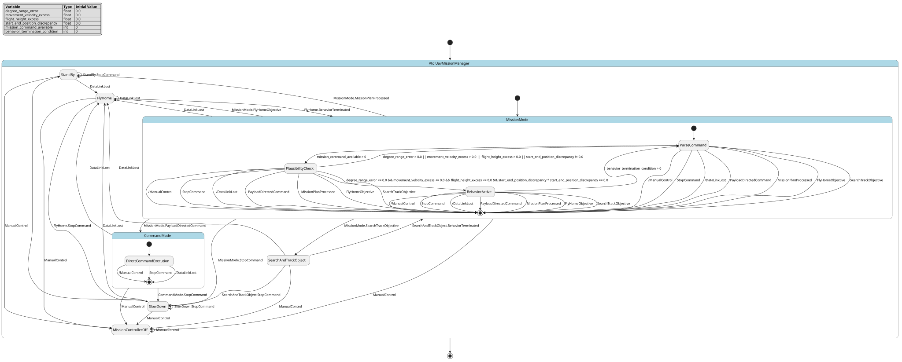

# Case `160` ✈️ — Mission-Mode / Command-Mode VTOL UAV Supervisor

**Bucket**: HSM-layered  |  **Paper**: #543 `onboard-mission-management-vtol-uav-sequence-supervisory-control`

- [STM.md case section](../../../sources/onboard-mission-management-vtol-uav-sequence-supervisory-control/STM.md)
- [paper PDF](../../../sources/onboard-mission-management-vtol-uav-sequence-supervisory-control/paper.pdf)
- [expansion NL JSON (含 provenance)](../expansions/160.json)
- [codex 起草笔记](../ref_stms/codex_drafts/160.notes.md)

## 1. 英文 NL（含 inline [E] 溯源 markers）

> 这是 codex 评审阶段生成的扩充 NL（commit `259e6ea7`），每条 substantive 信息带 `[En]` 标记。完整 provenance 表见 [expansion JSON](../expansions/160.json)。

The Sequence Control System is modeled as UML 1.2 state charts [E1], with exactly one state active at a time [E2]. It has two hierarchical levels whose top level models procedural flow [E3], and Mission Mode and Command Mode separate mission-plan processing from direct command execution [E4]. In auto mode, Stand By lets the UAV hover where it was entered [E5], while Slow Down gives a smooth changeover into Stand By regardless of the current flight maneuver [E6]. Mission Mode contains the behavior library, allows only one behavior to be active [E7], and returns each behavior through a termination condition to Parse Command, which reads behavior commands from the mission plan [E8]. Payload-directed flight can enter Command Mode from every state inside Mission Mode [E9], while a static truth table checks valid combinations for payload-directed flight and operator manual interruption [E10]. Mission-sequence plausibility is handled by grammar [E11] and attribute checks that constrain behavior parameters by expected degree ranges [E12], allowed maximum movement velocity and maximum flight height [E13], and consistency between consecutive movement start and end positions [E14]. Manual-control and stop events cut across the hierarchy: every top-level state can move to Mission Controller Off [E15], every auto-mode state can accept a stop command [E16], and switching to manual mode outranks stopping [E17]. The Supervisory Control System runs before the sequence layer at every instant [E18], reacts to data-link loss [E19], may modify missions [E20], and can command high-level objectives such as Fly Home [E21]. In ARTIS integration [E22], the Mission Manager runs on the flight-control computer and commands the flight controller every cycle [E23], and uses vehicle state estimates plus ground-distance sensor state as main inputs [E24].

## 2. 中文 NL 译文（claude 翻译，保留 [En] markers）

序列控制系统建模为 UML 1.2 状态图 [E1]，任一时刻仅有一个状态处于活动 [E2]；其层次结构分为两级，其中顶层用于建模过程流程 [E3]，并通过任务模式（Mission Mode）和命令模式（Command Mode）将任务计划处理与直接命令执行相分离 [E4]；在自动模式下，待命（Stand By）使无人机在进入该状态时所处位置悬停 [E5]，而减速（Slow Down）则无论当前处于何种飞行机动均可平滑切换进入待命状态 [E6]；任务模式包含行为库，仅允许一个行为处于活动 [E7]，并通过终止条件将每个行为返回至解析命令（Parse Command），由其从任务计划中读取行为命令 [E8]；载荷导向飞行可从任务模式内部的任何状态进入命令模式 [E9]，同时由一个静态真值表检查载荷导向飞行与操作员手动中断的有效组合 [E10]；任务序列的合理性由语法检查 [E11] 和属性检查共同处理，后者通过预期的角度范围 [E12]、允许的最大移动速度和最大飞行高度 [E13]、以及连续运动起止位置之间的一致性 [E14] 来约束行为参数；手动控制与停止事件跨越层次结构：任何顶层状态都可转至任务控制器关闭（Mission Controller Off） [E15]，任何自动模式状态都可接受停止命令 [E16]，且切换到手动模式的优先级高于停止 [E17]；监督控制系统在每一时刻先于序列层运行 [E18]，对数据链路丢失作出反应 [E19]，可修改任务 [E20]，并可下达诸如返航（Fly Home）等高层目标命令 [E21]；在 ARTIS 集成中 [E22]，任务管理器运行于飞行控制计算机之上，并在每个周期向飞行控制器下达命令 [E23]，以飞行器状态估计及地面距离传感器状态作为主要输入 [E24]。

## 3. Reference pyfcstm STM (codex 起草，待用户签字)

### 3.1 状态机图（pyfcstm visualize SVG）



PlantUML 源文件：[`../diagrams/160.puml`](../diagrams/160.puml)

### 3.2 pyfcstm DSL 源码

```pyfcstm
def float degree_range_error = 0.0;
def float movement_velocity_excess = 0.0;
def float flight_height_excess = 0.0;
def float start_end_position_discrepancy = 0.0;
def int mission_command_available = 0;
def int behavior_termination_condition = 0;

state VtolUavMissionManager {
    >> during before abstract SupervisoryControlBeforeSequence;
    >> during before abstract ReadVehicleStateAndGroundDistanceSensor;
    >> during after abstract CommandFlightControllerEveryCycle;

    ! * -> MissionControllerOff :: ManualControl;
    ! MissionMode -> SlowDown :: StopCommand;
    ! CommandMode -> SlowDown :: StopCommand;
    ! FlyHome -> SlowDown :: StopCommand;
    ! SearchAndTrackObject -> SlowDown :: StopCommand;
    ! MissionMode -> FlyHome : DataLinkLost;
    ! CommandMode -> FlyHome : DataLinkLost;
    ! StandBy -> FlyHome : DataLinkLost;
    ! SlowDown -> FlyHome : DataLinkLost;
    ! FlyHome -> FlyHome : DataLinkLost;
    ! SearchAndTrackObject -> FlyHome : DataLinkLost;
    ! MissionMode -> CommandMode :: PayloadDirectedCommand;
    ! MissionMode -> StandBy :: MissionPlanProcessed;
    ! MissionMode -> FlyHome :: FlyHomeObjective;
    ! MissionMode -> SearchAndTrackObject :: SearchTrackObjective;

    [*] -> MissionMode;

    state MissionControllerOff;

    state StandBy {
        enter abstract CaptureHoverPosition;
        during abstract HoldHoverPosition;
    }

    state SlowDown {
        during abstract SmoothChangeoverToStandBy;
    }

    state MissionMode {
        [*] -> ParseCommand;

        state ParseCommand {
            during abstract ReadMissionPlanCommand;
        }

        state PlausibilityCheck {
            during abstract CheckMissionGrammarAndAttributes;
        }

        state BehaviorActive {
            during abstract ExecuteMissionBehavior;
        }

        ParseCommand -> PlausibilityCheck : if [mission_command_available > 0];
        PlausibilityCheck -> BehaviorActive : if [degree_range_error <= 0.0 && movement_velocity_excess <= 0.0 && flight_height_excess <= 0.0 && (start_end_position_discrepancy * start_end_position_discrepancy) == 0.0];
        PlausibilityCheck -> ParseCommand : if [degree_range_error > 0.0 || movement_velocity_excess > 0.0 || flight_height_excess > 0.0 || start_end_position_discrepancy != 0.0];
        BehaviorActive -> ParseCommand : if [behavior_termination_condition > 0];
    }

    state CommandMode {
        [*] -> DirectCommandExecution;

        state DirectCommandExecution {
            during abstract ExecuteDirectCommand;
        }
    }

    state FlyHome {
        during abstract CommandFlyHomeObjective;
    }

    state SearchAndTrackObject {
        during abstract CommandSearchAndTrackObject;
    }

    StandBy -> StandBy :: StopCommand;
    SlowDown -> SlowDown :: StopCommand;
    SlowDown -> StandBy;
    FlyHome -> MissionMode :: BehaviorTerminated;
    SearchAndTrackObject -> MissionMode :: BehaviorTerminated;
}

```

**codex 自报 C-axis 使用情况**:
- C1: ✓
- C2: ✓
- C3: ✓
- C4: ✓

**codex 自报 scenarios 覆盖情况**:
- 模式数: 9
- guards 数: 4
- fault paths 数: 2
- per-cycle 行为数: 5
- 硬件 effectors 数: 6

## 4. Test scenarios（覆盖 NL 全特性，必须 100% pass）

```json
{
  "scenarios": [
    {
      "name": "default_parse_command_waits",
      "description": "覆盖 [E1]-[E4][E8][E18][E23]：默认进入 MissionMode.ParseCommand，且每 cycle 监督/飞控抽象动作不改变状态变量。",
      "initial_state": null,
      "initial_vars": {},
      "steps": [
        {
          "before_cycles": 0,
          "events": [],
          "expected_state": "VtolUavMissionManager.MissionMode.ParseCommand",
          "expected_vars": {
            "degree_range_error": 0.0,
            "movement_velocity_excess": 0.0,
            "flight_height_excess": 0.0,
            "start_end_position_discrepancy": 0.0,
            "mission_command_available": 0,
            "behavior_termination_condition": 0
          },
          "name": "default_initial_parse"
        },
        {
          "before_cycles": 3,
          "events": null,
          "expected_state": "VtolUavMissionManager.MissionMode.ParseCommand",
          "expected_vars": {
            "degree_range_error": 0.0,
            "movement_velocity_excess": 0.0,
            "flight_height_excess": 0.0,
            "start_end_position_discrepancy": 0.0,
            "mission_command_available": 0,
            "behavior_termination_condition": 0
          },
          "name": "parse_holds_without_command"
        }
      ]
    },
    {
      "name": "plausibility_accepts_boundary_command",
      "description": "覆盖 [E8][E11]-[E14]：mission command 可用且 degree/velocity/height/position 检查均在边界内时进入唯一 active behavior。",
      "initial_state": "VtolUavMissionManager.MissionMode.ParseCommand",
      "initial_vars": {
        "degree_range_error": 0.0,
        "movement_velocity_excess": 0.0,
        "flight_height_excess": 0.0,
        "start_end_position_discrepancy": 0.0,
        "mission_command_available": 1,
        "behavior_termination_condition": 0
      },
      "steps": [
        {
          "before_cycles": 0,
          "events": [],
          "expected_state": "VtolUavMissionManager.MissionMode.PlausibilityCheck",
          "expected_vars": {
            "degree_range_error": 0.0,
            "movement_velocity_excess": 0.0,
            "flight_height_excess": 0.0,
            "start_end_position_discrepancy": 0.0,
            "mission_command_available": 1,
            "behavior_termination_condition": 0
          },
          "name": "command_moves_to_plausibility_check"
        },
        {
          "before_cycles": 0,
          "events": [],
          "expected_state": "VtolUavMissionManager.MissionMode.BehaviorActive",
          "expected_vars": {
            "degree_range_error": 0.0,
            "movement_velocity_excess": 0.0,
            "flight_height_excess": 0.0,
            "start_end_position_discrepancy": 0.0,
            "mission_command_available": 1,
            "behavior_termination_condition": 0
          },
          "name": "boundary_attributes_accept"
        },
        {
          "before_cycles": 3,
          "events": null,
          "expected_state": "VtolUavMissionManager.MissionMode.BehaviorActive",
          "expected_vars": {
            "degree_range_error": 0.0,
            "movement_velocity_excess": 0.0,
            "flight_height_excess": 0.0,
            "start_end_position_discrepancy": 0.0,
            "mission_command_available": 1,
            "behavior_termination_condition": 0
          },
          "name": "single_behavior_remains_active"
        }
      ]
    },
    {
      "name": "plausibility_rejects_invalid_attributes",
      "description": "覆盖 [E11]-[E14]：degree range、maximum velocity、maximum flight height 和 start/end position 任一越界时拒绝进入 behavior。",
      "initial_state": "VtolUavMissionManager.MissionMode.ParseCommand",
      "initial_vars": {
        "degree_range_error": 1.0,
        "movement_velocity_excess": 1.0,
        "flight_height_excess": 1.0,
        "start_end_position_discrepancy": 1.0,
        "mission_command_available": 1,
        "behavior_termination_condition": 0
      },
      "steps": [
        {
          "before_cycles": 0,
          "events": [],
          "expected_state": "VtolUavMissionManager.MissionMode.PlausibilityCheck",
          "expected_vars": {
            "degree_range_error": 1.0,
            "movement_velocity_excess": 1.0,
            "flight_height_excess": 1.0,
            "start_end_position_discrepancy": 1.0,
            "mission_command_available": 1,
            "behavior_termination_condition": 0
          },
          "name": "invalid_command_reaches_check"
        },
        {
          "before_cycles": 0,
          "events": [],
          "expected_state": "VtolUavMissionManager.MissionMode.ParseCommand",
          "expected_vars": {
            "degree_range_error": 1.0,
            "movement_velocity_excess": 1.0,
            "flight_height_excess": 1.0,
            "start_end_position_discrepancy": 1.0,
            "mission_command_available": 1,
            "behavior_termination_condition": 0
          },
          "name": "invalid_attributes_reject_to_parse"
        }
      ]
    },
    {
      "name": "behavior_termination_returns_to_parse",
      "description": "覆盖 [E7][E8]：active behavior 的 termination condition 为真时回到 ParseCommand。",
      "initial_state": "VtolUavMissionManager.MissionMode.BehaviorActive",
      "initial_vars": {
        "degree_range_error": 0.0,
        "movement_velocity_excess": 0.0,
        "flight_height_excess": 0.0,
        "start_end_position_discrepancy": 0.0,
        "mission_command_available": 0,
        "behavior_termination_condition": 1
      },
      "steps": [
        {
          "before_cycles": 0,
          "events": [],
          "expected_state": "VtolUavMissionManager.MissionMode.ParseCommand",
          "expected_vars": {
            "degree_range_error": 0.0,
            "movement_velocity_excess": 0.0,
            "flight_height_excess": 0.0,
            "start_end_position_discrepancy": 0.0,
            "mission_command_available": 0,
            "behavior_termination_condition": 1
          },
          "name": "termination_guard_returns_parse"
        }
      ]
    },
    {
      "name": "payload_from_parse_enters_command_mode",
      "description": "覆盖 [E4][E9][E10]：payload-directed flight 可从 MissionMode.ParseCommand 进入 CommandMode。",
      "initial_state": "VtolUavMissionManager.MissionMode.ParseCommand",
      "initial_vars": {
        "degree_range_error": 0.0,
        "movement_velocity_excess": 0.0,
        "flight_height_excess": 0.0,
        "start_end_position_discrepancy": 0.0,
        "mission_command_available": 0,
        "behavior_termination_condition": 0
      },
      "steps": [
        {
          "before_cycles": 0,
          "events": [
            "VtolUavMissionManager.MissionMode.PayloadDirectedCommand"
          ],
          "expected_state": "VtolUavMissionManager.CommandMode.DirectCommandExecution",
          "expected_vars": {
            "degree_range_error": 0.0,
            "movement_velocity_excess": 0.0,
            "flight_height_excess": 0.0,
            "start_end_position_discrepancy": 0.0,
            "mission_command_available": 0,
            "behavior_termination_condition": 0
          },
          "name": "payload_parse_to_command"
        }
      ]
    },
    {
      "name": "payload_from_plausibility_enters_command_mode",
      "description": "覆盖 [E9][E10]：payload-directed flight 可从 MissionMode.PlausibilityCheck 进入 CommandMode。",
      "initial_state": "VtolUavMissionManager.MissionMode.PlausibilityCheck",
      "initial_vars": {
        "degree_range_error": 0.0,
        "movement_velocity_excess": 0.0,
        "flight_height_excess": 0.0,
        "start_end_position_discrepancy": 0.0,
        "mission_command_available": 1,
        "behavior_termination_condition": 0
      },
      "steps": [
        {
          "before_cycles": 0,
          "events": [
            "VtolUavMissionManager.MissionMode.PayloadDirectedCommand"
          ],
          "expected_state": "VtolUavMissionManager.CommandMode.DirectCommandExecution",
          "expected_vars": {
            "degree_range_error": 0.0,
            "movement_velocity_excess": 0.0,
            "flight_height_excess": 0.0,
            "start_end_position_discrepancy": 0.0,
            "mission_command_available": 1,
            "behavior_termination_condition": 0
          },
          "name": "payload_check_to_command"
        }
      ]
    },
    {
      "name": "payload_from_behavior_enters_command_mode",
      "description": "覆盖 [E7][E9][E10]：payload-directed flight 可从 MissionMode.BehaviorActive 打断当前 behavior 并进入 CommandMode。",
      "initial_state": "VtolUavMissionManager.MissionMode.BehaviorActive",
      "initial_vars": {
        "degree_range_error": 0.0,
        "movement_velocity_excess": 0.0,
        "flight_height_excess": 0.0,
        "start_end_position_discrepancy": 0.0,
        "mission_command_available": 0,
        "behavior_termination_condition": 0
      },
      "steps": [
        {
          "before_cycles": 0,
          "events": [
            "VtolUavMissionManager.MissionMode.PayloadDirectedCommand"
          ],
          "expected_state": "VtolUavMissionManager.CommandMode.DirectCommandExecution",
          "expected_vars": {
            "degree_range_error": 0.0,
            "movement_velocity_excess": 0.0,
            "flight_height_excess": 0.0,
            "start_end_position_discrepancy": 0.0,
            "mission_command_available": 0,
            "behavior_termination_condition": 0
          },
          "name": "payload_behavior_to_command"
        }
      ]
    },
    {
      "name": "stop_from_command_slowdown_then_standby",
      "description": "覆盖 [E5][E6][E16][E23][E24]：CommandMode 收到 stop 后进入 SlowDown，再平滑切换到 StandBy 并持续 hover。",
      "initial_state": "VtolUavMissionManager.CommandMode.DirectCommandExecution",
      "initial_vars": {
        "degree_range_error": 0.0,
        "movement_velocity_excess": 0.0,
        "flight_height_excess": 0.0,
        "start_end_position_discrepancy": 0.0,
        "mission_command_available": 0,
        "behavior_termination_condition": 0
      },
      "steps": [
        {
          "before_cycles": 0,
          "events": [
            "VtolUavMissionManager.CommandMode.StopCommand"
          ],
          "expected_state": "VtolUavMissionManager.SlowDown",
          "expected_vars": {
            "degree_range_error": 0.0,
            "movement_velocity_excess": 0.0,
            "flight_height_excess": 0.0,
            "start_end_position_discrepancy": 0.0,
            "mission_command_available": 0,
            "behavior_termination_condition": 0
          },
          "name": "stop_enters_slowdown"
        },
        {
          "before_cycles": 0,
          "events": [],
          "expected_state": "VtolUavMissionManager.StandBy",
          "expected_vars": {
            "degree_range_error": 0.0,
            "movement_velocity_excess": 0.0,
            "flight_height_excess": 0.0,
            "start_end_position_discrepancy": 0.0,
            "mission_command_available": 0,
            "behavior_termination_condition": 0
          },
          "name": "slowdown_completes_to_standby"
        },
        {
          "before_cycles": 3,
          "events": null,
          "expected_state": "VtolUavMissionManager.StandBy",
          "expected_vars": {
            "degree_range_error": 0.0,
            "movement_velocity_excess": 0.0,
            "flight_height_excess": 0.0,
            "start_end_position_discrepancy": 0.0,
            "mission_command_available": 0,
            "behavior_termination_condition": 0
          },
          "name": "standby_hover_cycles"
        }
      ]
    },
    {
      "name": "manual_control_outranks_stop",
      "description": "覆盖 [E15]-[E17]：ManualControl 与 StopCommand 同 cycle 到达时，manual mode 优先进入 MissionControllerOff。",
      "initial_state": "VtolUavMissionManager.MissionMode.BehaviorActive",
      "initial_vars": {
        "degree_range_error": 0.0,
        "movement_velocity_excess": 0.0,
        "flight_height_excess": 0.0,
        "start_end_position_discrepancy": 0.0,
        "mission_command_available": 0,
        "behavior_termination_condition": 0
      },
      "steps": [
        {
          "before_cycles": 0,
          "events": [
            "VtolUavMissionManager.ManualControl",
            "VtolUavMissionManager.MissionMode.StopCommand"
          ],
          "expected_state": "VtolUavMissionManager.MissionControllerOff",
          "expected_vars": {
            "degree_range_error": 0.0,
            "movement_velocity_excess": 0.0,
            "flight_height_excess": 0.0,
            "start_end_position_discrepancy": 0.0,
            "mission_command_available": 0,
            "behavior_termination_condition": 0
          },
          "name": "manual_priority_over_stop"
        }
      ]
    },
    {
      "name": "data_link_loss_forces_fly_home",
      "description": "覆盖 [E18]-[E21]：supervisor 在 data-link loss 时跨层强制进入 FlyHome，并在 deliberate behavior 结束后回到 MissionMode。",
      "initial_state": "VtolUavMissionManager.CommandMode.DirectCommandExecution",
      "initial_vars": {
        "degree_range_error": 0.0,
        "movement_velocity_excess": 0.0,
        "flight_height_excess": 0.0,
        "start_end_position_discrepancy": 0.0,
        "mission_command_available": 0,
        "behavior_termination_condition": 0
      },
      "steps": [
        {
          "before_cycles": 0,
          "events": [
            "VtolUavMissionManager.DataLinkLost"
          ],
          "expected_state": "VtolUavMissionManager.FlyHome",
          "expected_vars": {
            "degree_range_error": 0.0,
            "movement_velocity_excess": 0.0,
            "flight_height_excess": 0.0,
            "start_end_position_discrepancy": 0.0,
            "mission_command_available": 0,
            "behavior_termination_condition": 0
          },
          "name": "datalink_loss_to_fly_home"
        },
        {
          "before_cycles": 0,
          "events": [
            "VtolUavMissionManager.FlyHome.BehaviorTerminated"
          ],
          "expected_state": "VtolUavMissionManager.MissionMode.ParseCommand",
          "expected_vars": {
            "degree_range_error": 0.0,
            "movement_velocity_excess": 0.0,
            "flight_height_excess": 0.0,
            "start_end_position_discrepancy": 0.0,
            "mission_command_available": 0,
            "behavior_termination_condition": 0
          },
          "name": "fly_home_terminates_to_parse"
        }
      ]
    },
    {
      "name": "supervisor_high_level_objectives",
      "description": "覆盖 [E20][E21] 与 STM 摘录 B/C：Supervisor 可发 FlyHome 和 SearchAndTrackObject 高层 objective。",
      "initial_state": null,
      "initial_vars": {},
      "steps": [
        {
          "before_cycles": 0,
          "events": [],
          "expected_state": "VtolUavMissionManager.MissionMode.ParseCommand",
          "expected_vars": {
            "degree_range_error": 0.0,
            "movement_velocity_excess": 0.0,
            "flight_height_excess": 0.0,
            "start_end_position_discrepancy": 0.0,
            "mission_command_available": 0,
            "behavior_termination_condition": 0
          },
          "name": "default_parse_for_objective"
        },
        {
          "before_cycles": 0,
          "events": [
            "VtolUavMissionManager.MissionMode.FlyHomeObjective"
          ],
          "expected_state": "VtolUavMissionManager.FlyHome",
          "expected_vars": {
            "degree_range_error": 0.0,
            "movement_velocity_excess": 0.0,
            "flight_height_excess": 0.0,
            "start_end_position_discrepancy": 0.0,
            "mission_command_available": 0,
            "behavior_termination_condition": 0
          },
          "name": "fly_home_objective"
        },
        {
          "before_cycles": 0,
          "events": [
            "VtolUavMissionManager.FlyHome.BehaviorTerminated"
          ],
          "expected_state": "VtolUavMissionManager.MissionMode.ParseCommand",
          "expected_vars": {
            "degree_range_error": 0.0,
            "movement_velocity_excess": 0.0,
            "flight_height_excess": 0.0,
            "start_end_position_discrepancy": 0.0,
            "mission_command_available": 0,
            "behavior_termination_condition": 0
          },
          "name": "fly_home_returns_parse"
        },
        {
          "before_cycles": 0,
          "events": [
            "VtolUavMissionManager.MissionMode.SearchTrackObjective"
          ],
          "expected_state": "VtolUavMissionManager.SearchAndTrackObject",
          "expected_vars": {
            "degree_range_error": 0.0,
            "movement_velocity_excess": 0.0,
            "flight_height_excess": 0.0,
            "start_end_position_discrepancy": 0.0,
            "mission_command_available": 0,
            "behavior_termination_condition": 0
          },
          "name": "search_track_objective"
        },
        {
          "before_cycles": 0,
          "events": [
            "VtolUavMissionManager.SearchAndTrackObject.BehaviorTerminated"
          ],
          "expected_state": "VtolUavMissionManager.MissionMode.ParseCommand",
          "expected_vars": {
            "degree_range_error": 0.0,
            "movement_velocity_excess": 0.0,
            "flight_height_excess": 0.0,
            "start_end_position_discrepancy": 0.0,
            "mission_command_available": 0,
            "behavior_termination_condition": 0
          },
          "name": "search_track_returns_parse"
        }
      ]
    },
    {
      "name": "mission_processed_to_standby",
      "description": "覆盖 [E5][E8]：mission plan processed 后退出 MissionMode 到 StandBy。",
      "initial_state": "VtolUavMissionManager.MissionMode.ParseCommand",
      "initial_vars": {
        "degree_range_error": 0.0,
        "movement_velocity_excess": 0.0,
        "flight_height_excess": 0.0,
        "start_end_position_discrepancy": 0.0,
        "mission_command_available": 0,
        "behavior_termination_condition": 0
      },
      "steps": [
        {
          "before_cycles": 0,
          "events": [
            "VtolUavMissionManager.MissionMode.MissionPlanProcessed"
          ],
          "expected_state": "VtolUavMissionManager.StandBy",
          "expected_vars": {
            "degree_range_error": 0.0,
            "movement_velocity_excess": 0.0,
            "flight_height_excess": 0.0,
            "start_end_position_discrepancy": 0.0,
            "mission_command_available": 0,
            "behavior_termination_condition": 0
          },
          "name": "mission_processed_to_standby"
        }
      ]
    }
  ]
}
```

## 5. pyfcstm 验证日志（parse + sem + sim + scenarios 全跑）

```
PARSE_OK
SEM_OK (leaf_states=?)
SIM_OK (current_state=ParseCommand)
SCENARIOS_LOADED: 12
  ✓ [default_parse_command_waits]
  ✓ [plausibility_accepts_boundary_command]
  ✓ [plausibility_rejects_invalid_attributes]
  ✓ [behavior_termination_returns_to_parse]
  ✓ [payload_from_parse_enters_command_mode]
  ✓ [payload_from_plausibility_enters_command_mode]
  ✓ [payload_from_behavior_enters_command_mode]
  ✓ [stop_from_command_slowdown_then_standby]
  ✓ [manual_control_outranks_stop]
  ✓ [data_link_loss_forces_fly_home]
  ✓ [supervisor_high_level_objectives]
  ✓ [mission_processed_to_standby]

SCENARIOS_SUMMARY: pass=12 fail=0 error=0 total=12

LINT_RUNNING...
LINT_SUMMARY: warnings=0 by_code={}
ALL_OK
```

## 6. Codex 起草笔记

# Codex Draft Notes — Case 160

## 1. 设计选择

- mode 列表：
  - `VtolUavMissionManager`：整合 Sequence Control System 与 Supervisory Control System；来源 expansion [E1]-[E4][E18]。
  - `MissionMode`：mission-plan processing；来源 STM §1 摘录 A / expansion [E4][E7][E8]。
  - `CommandMode.DirectCommandExecution`：direct command execution；来源 STM §1 摘录 A / expansion [E4][E9][E10]。
  - `MissionControllerOff`：manual control event 后的 idle/off 状态；来源 STM §1 摘录 A / expansion [E15]。
  - `StandBy`：hover at current position；来源 STM §1 摘录 A / expansion [E5]。
  - `SlowDown`：smooth changeover into StandBy；来源 STM §1 摘录 A / expansion [E6]。
  - `MissionMode.ParseCommand`：从 mission plan 读取 behavior commands；来源 STM §1 摘录 A / expansion [E8]。
  - `MissionMode.PlausibilityCheck`：grammar + attribute plausibility checks；来源 expansion [E10]-[E14]。
  - `MissionMode.BehaviorActive`：Mission Mode 内一次只允许一个 behavior active；来源 expansion [E7][E8]。
  - `FlyHome`、`SearchAndTrackObject`：Supervisor high-level objectives / deliberate behaviors；来源 STM §1 摘录 B/C / expansion [E21]。
- event 列表：
  - `ManualControl`：every top-level state to MissionControllerOff；来源 [E15]。
  - `StopCommand`：every auto-mode state can accept stop；来源 [E16]。
  - `PayloadDirectedCommand`：payload-directed flight enters CommandMode from MissionMode；来源 [E9][E10]。
  - `DataLinkLost`：Supervisor reacts to loss of data link；来源 [E19]。
  - `MissionPlanProcessed`：mission plan processed exits MissionMode；来源 [E8]。
  - `FlyHomeObjective`：high-level objective Fly Home；来源 [E21]。
  - `SearchTrackObjective`：high-level behavior search and track object；来源 STM §1 摘录 B/C。
  - `BehaviorTerminated`：deliberate behavior termination back to mission processing；来源 [E8]。
- variable 列表：
  - `degree_range_error: float = 0.0`：degree value expected-range check 的归一化 error；来源 [E12]。
  - `movement_velocity_excess: float = 0.0`：allowed maximum movement velocity 的超限量；来源 [E13]。
  - `flight_height_excess: float = 0.0`：maximum flight height restriction 的超限量；来源 [E13]。
  - `start_end_position_discrepancy: float = 0.0`：consecutive movement start/end position consistency discrepancy；来源 [E14]。
  - `mission_command_available: int = 0`：ParseCommand 是否已从 mission plan 读到 behavior command；来源 [E8]。
  - `behavior_termination_condition: int = 0`：behavior termination condition；来源 [E8]。
- transition 设计：
  - `[*] -> MissionMode` 与 `MissionMode.[*] -> ParseCommand` 表达默认 mission-plan processing 入口；来源 [E3][E4][E8]。
  - `ParseCommand -> PlausibilityCheck : if [mission_command_available > 0]` 表达 ParseCommand 读到 mission plan command 后进入检查；来源 [E8][E11]。
  - `PlausibilityCheck -> BehaviorActive` 的复合数值 guard 同时检查 degree、velocity、height、position consistency；来源 [E12]-[E14]。
  - `PlausibilityCheck -> ParseCommand` 的 rejection guard 表达属性检查失败不进入 behavior；原文未给失败目标，因此保守回到 parser。
  - `BehaviorActive -> ParseCommand : if [behavior_termination_condition > 0]` 表达 behavior termination condition 回跳 parser；来源 [E8]。
  - `! MissionMode -> CommandMode :: PayloadDirectedCommand` 表达 payload-directed flight 从 MissionMode 任一内部状态进入 CommandMode；来源 [E9][E10]。
  - `! * -> MissionControllerOff :: ManualControl`、`! ... -> SlowDown :: StopCommand` 与 transition 顺序表达 manual over stop priority；来源 [E15]-[E17]。
  - `SlowDown -> StandBy` 表达 smooth changeover 后进入 hover standby；来源 [E5][E6]。
  - `! MissionMode/CommandMode/StandBy/SlowDown/FlyHome/SearchAndTrackObject -> FlyHome : DataLinkLost` 表达 operational states 中 data-link loss 触发 Supervisor 高层 FlyHome objective；来源 [E19][E21]。

## 2. C-axis grounding 使用情况

- **C1 (周期执行)**: 用 — root 上 `>> during before abstract SupervisoryControlBeforeSequence` 对应 [E18]，`>> during after abstract CommandFlightControllerEveryCycle` 对应 [E23]；`StandBy`、`SlowDown`、`BehaviorActive` 等 leaf 也用 `during abstract` 表达持续控制动作。
- **C2 (数值守卫)**: 用 — `PlausibilityCheck -> BehaviorActive` / `ParseCommand` 使用 `degree_range_error`、`movement_velocity_excess`、`flight_height_excess`、`start_end_position_discrepancy` 的复合数值 guard；变量来源 [E12]-[E14]。原文没有给具体最大速度/最大高度数值，所以没有捏造常量，只用 0 表示 normalized error/excess/discrepancy 的通过边界。
- **C3 (forced fault)**: 用 — data-link loss forced transitions to `FlyHome` 对应 [E19][E21]；`! * -> MissionControllerOff :: ManualControl` 和 stop forced transitions 对应 [E15]-[E17] 的横切优先级。
- **C4 (硬件)**: 用 — `ReadVehicleStateAndGroundDistanceSensor` 对应 [E24]，`CommandFlightControllerEveryCycle` 对应 [E23]，`CaptureHoverPosition` / `HoldHoverPosition` 对应 [E5]，`SmoothChangeoverToStandBy` 对应 [E6]。这些均用 abstract action，不用 write-only var mock 硬件状态。

## 3. 与 NL 的对应关系

- expansion NL [E1]: Sequence Control System modeled as UML state charts → DSL root `state VtolUavMissionManager` with HSM structure。
- [E2]: exactly one active state → pyfcstm single active leaf semantics；scenarios assert one `expected_state` per step。
- [E3]: two hierarchical levels/top procedural flow → root top-level modes plus `MissionMode` / `CommandMode` composites。
- [E4]: Mission Mode vs Command Mode → `state MissionMode` and `state CommandMode.DirectCommandExecution`。
- [E5]: Stand By hover where entered → `state StandBy { enter abstract CaptureHoverPosition; during abstract HoldHoverPosition; }`。
- [E6]: Slow Down smooth changeover → `state SlowDown { during abstract SmoothChangeoverToStandBy; }` and `SlowDown -> StandBy`。
- [E7]: one behavior active → single leaf `MissionMode.BehaviorActive` with no transitions among multiple behavior leaves。
- [E8]: behavior termination to Parse Command / reads mission plan → `BehaviorActive -> ParseCommand : if [behavior_termination_condition > 0]` and `ParseCommand -> PlausibilityCheck : if [mission_command_available > 0]`。
- [E9]: payload-directed flight enters CommandMode from MissionMode → `! MissionMode -> CommandMode :: PayloadDirectedCommand`。
- [E10]: truth table for payload/manual combinations → forced priority ordering of `ManualControl`, `StopCommand`, and `PayloadDirectedCommand` transitions。
- [E11]: grammar plausibility → `MissionMode.PlausibilityCheck` and abstract `CheckMissionGrammarAndAttributes`。
- [E12]: degree expected range → `degree_range_error <= 0.0`。
- [E13]: max velocity / max flight height → `movement_velocity_excess <= 0.0` and `flight_height_excess <= 0.0`。
- [E14]: consecutive movement start/end position consistency → `(start_end_position_discrepancy * start_end_position_discrepancy) == 0.0`。
- [E15]: every top-level state to MissionControllerOff on manual → `! * -> MissionControllerOff :: ManualControl`。
- [E16]: every auto-mode state accepts stop → forced stop transitions from `MissionMode`, `CommandMode`, `FlyHome`, `SearchAndTrackObject`, plus `StandBy`/`SlowDown` self/advance handling。
- [E17]: manual outranks stop → `ManualControl` forced transition appears before stop transitions; scenario `manual_control_outranks_stop` asserts this。
- [E18]: Supervisor runs before sequence every instant → `>> during before abstract SupervisoryControlBeforeSequence`。
- [E19]: reacts to data-link loss → operational state forced transitions to `FlyHome` on root-level `DataLinkLost`。
- [E20]: may modify missions → Supervisor objective transitions can override current sequence mode。
- [E21]: high-level objectives such as Fly Home → `FlyHome` and `FlyHomeObjective`; STM 摘录 C also supports `SearchAndTrackObject`。
- [E22]: ARTIS integration → represented in root integrated onboard mission-manager scope, no separate hardware platform state。
- [E23]: Mission Manager commands flight controller every cycle → `>> during after abstract CommandFlightControllerEveryCycle`。
- [E24]: vehicle state estimates and ground-distance sensor inputs → `>> during before abstract ReadVehicleStateAndGroundDistanceSensor`。

## 4. 迭代历史

- iter 1: 写出初稿 → verify: `SEM_FAIL Unknown to state 'StandBy'`，原因是 MissionMode 内部 transition 不能直接跳父级 sibling → 修复为 invalid plausibility 回到 `ParseCommand`。
- iter 2: smoke OK，但单独 lint 报嵌套 transition 的 `BehaviorCommandRead` / `BehaviorTerminated` 为 `unused_event` → 改用 `mission_command_available` 和 `behavior_termination_condition` guards。
- iter 3: parse fail，因为当前 pyfcstm 安装版不接受 `def bool` → 改为 `def int behavior_termination_condition = 0` 和 `> 0` guard。
- iter 4: smoke/lint OK，但 runtime trace 发现 bare `ParseCommand -> PlausibilityCheck` 会遮蔽 MissionMode 复合层事件，且复合层普通 transition 不从子叶冒泡 → 加 `mission_command_available > 0` guard，并把 MissionMode override transitions 改为 forced。
- iter 5: scenarios 12/12 pass，lint 0；事实复核后删除不在 STM §1/expansion provenance 中稳定出现的 `StartMission`，重跑完整验证仍 `ALL_OK`。

## 5. 与 STM.md 表述的偏差（如有）

- 原文给出 degree range、maximum velocity、maximum flight height、start/end position consistency，但没有给具体数值阈值；DSL 使用 `*_error` / `*_excess` / `*_discrepancy` 这类归一化变量，并以 0 作为通过边界，避免捏造真实最大速度或高度。
- 原文没有明确 plausibility check 失败后的目标状态；DSL 保守回到 `ParseCommand`，表示拒绝当前 behavior command 后继续解析 mission plan。
- `FlyHome` 与 `SearchAndTrackObject` 被建模为集成根状态机中的 Supervisor high-level objective leaf，而不是 `MissionMode` 内部普通 behavior leaf；依据是 STM §1 摘录 B/C 将 Supervisor State Chart 作为 Sequence Control System 之上的高层控制器。
- 由于 pyfcstm/lint 对嵌套 transition event 的统计会产生 `unused_event` warning，MissionMode 内部“读到命令/behavior termination”用变量 guard 表达，而不是用嵌套 local event 表达。

## 7. Claude 交叉评审

**Verdict**: APPROVE

| 维度 | 打分 | evidence |
|---|---|---|
| 语义正确性 | 🟡 | HSM 结构与 MissionMode/CommandMode/StandBy/SlowDown/MissionControllerOff/ParseCommand 等核心 state 命名与摘录 A 完全一致；FlyHome / SearchAndTrackObject 作为 Supervisor 层 sibling 而非 MissionMode 内部 behavior leaf 属于合理… |
| NL 忠实性 | 🟡 | 无明显发明的硬件名 / 数值阈值；`*_error / *_excess / *_discrepancy` 与 `mission_command_available / behavior_termination_condition` 是对 [E8][E12]-[E14] 的归一化变量化（笔记 §5 已明确声明，非 hallucination），但 `MissionPlanProcessed … |
| C-axis grounding 恰当性 | 🟢 | C1：root `>> during before/after abstract` 直接对应 [E18][E23]；C2：plausibility 复合 guard 同时检查四个属性变量，覆盖 [E12]-[E14]；C3：`! * -> MissionControllerOff :: ManualControl` 列在 StopCommand forced transitions 之前以保… |
| scenarios NL 覆盖度 | 🟡 | 12 个 scenario 覆盖默认入口、plausibility 接受/拒绝、behavior 终止、payload 从 3 个 MissionMode 子状态进入 CommandMode、stop->SlowDown->StandBy 多 cycle、manual 优先 stop、data-link loss 强制 FlyHome、双 high-level objective、missi… |

## 8. 用户审阅区（待签字）

**审阅状态**：⬜ 待审 / ⬜ approve / ⬜ revise / ⬜ rewrite

**审阅笔记**（用户填写）：

- 

**修订要求**（用户填写）：

- 

**签字**：（用户填写日期 + 姓名）

---

**最终 ref 落盘路径（待签字后）**: `audited/160.fcstm` + `audited/160.audit.md`