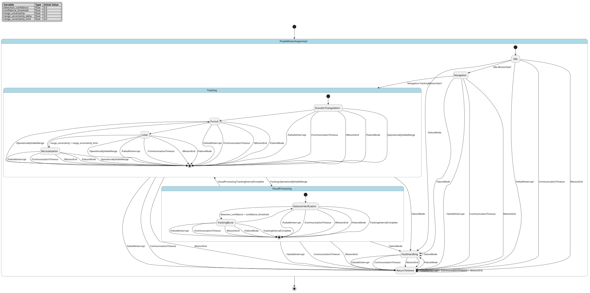

# Case `169` ⚙️ — Hierarchical mission-execution FSM for an autonomous marine tracker

**Bucket**: HSM-layered  |  **Paper**: #573 `pirate-precision-imaging-real-time-autonomous-tracker-explorer`

- [STM.md case section](../../../sources/pirate-precision-imaging-real-time-autonomous-tracker-explorer/STM.md)
- [paper PDF](../../../sources/pirate-precision-imaging-real-time-autonomous-tracker-explorer/paper.pdf)
- [expansion NL JSON (含 provenance)](../expansions/169.json)
- [codex 起草笔记](../ref_stms/codex_drafts/169.notes.md)

## 1. 英文 NL（含 inline [E] 溯源 markers）

> 这是 codex 评审阶段生成的扩充 NL（commit `259e6ea7`），每条 substantive 信息带 `[En]` 标记。完整 provenance 表见 [expansion JSON](../expansions/169.json)。

PIRATE's mission supervisor is a hierarchical finite-state machine: its high-level modes are composite states with internal substates that coordinate navigation, visual perception, and acoustic sensing [E1]. Within the tracking behavior, each cycle begins with acoustic triangulation, where the vehicle follows a predefined tracking geometry, receives acoustic range measurements, and estimates target location onboard [E2]. After that estimate, PIRATE transitions into pursuit and navigates directly toward the estimated target position [E3]. When PIRATE determines that it is within an operationally viable range of the tracked target, it activates the visual perception pipeline; the Pi can trigger the Jetson GPU to begin or terminate detection/tracking, and detector outputs are accepted only when confidence exceeds a predefined threshold [E4] [E5] [E6]. In loiter near the estimated target, the vehicle keeps receiving acoustic transmissions, uses ToF range estimates to assess target-vehicle distance, and collects underwater visual data [E7]. If range uncertainty increases or sustained range deviations reveal displacement, the controller can re-enter localization, re-estimate the target, and resume pursuit without reset or operator intervention [E8] [E9]. Navigation and actuation are carried through the PX4 flight controller and two independently controlled stern-mounted thrusters using differential thrust [E10]. From any active mode, an interrupt-driven failsafe can force immediate RTH; RTH can also be triggered by communication timeout, mission end, or failure modes [E11].

## 2. 中文 NL 译文（claude 翻译，保留 [En] markers）

PIRATE 的任务监督器是一个层次化有限状态机：其高层模式为复合状态，内部包含协调导航、视觉感知与声学感知的子状态 [E1]。在跟踪行为内部，每个周期以声学三角定位开始，载具沿预定义的跟踪几何航行，接收声学距离测量，并在机上估计目标位置 [E2]。在得到该估计后，PIRATE 转入追击模式，并直接朝估计的目标位置导航 [E3]。当 PIRATE 判定自身已处于相对被跟踪目标的可操作有效距离内时，便启动视觉感知流水线；Pi 可触发 Jetson GPU 启动或终止检测/跟踪，且仅当置信度超过预定义阈值时才接受检测器输出 [E4] [E5] [E6]。在估计目标附近的悬停阶段，载具持续接收声学发射信号，利用 ToF 距离估计评估目标—载具距离，并采集水下视觉数据 [E7]。若距离不确定性上升，或持续的距离偏差揭示了目标位移，控制器可重新进入定位模式，重新估计目标位置，并在无需复位或操作员干预的情况下恢复追击 [E8] [E9]。导航与执行由 PX4 飞控以及两个独立控制的尾部推进器通过差速推进实现 [E10]。从任何活动模式出发，中断驱动的失效保护机制都可强制立即返航 (RTH)；RTH 同样可由通信超时、任务结束或故障模式触发 [E11]。

## 3. Reference pyfcstm STM (codex 起草，待用户签字)

### 3.1 状态机图（pyfcstm visualize SVG）



PlantUML 源文件：[`../diagrams/169.puml`](../diagrams/169.puml)

### 3.2 pyfcstm DSL 源码

```pyfcstm
def float detection_confidence = 0.0;
def float confidence_threshold = 0.0;
def float range_uncertainty = 0.0;
def float range_uncertainty_delta = 0.0;
def float range_uncertainty_limit = 0.0;

state PirateMissionSupervisor {
    ! * -> ReturnToHome :: FailsafeInterrupt;
    ! * -> ReturnToHome :: CommunicationTimeout;
    ! * -> ReturnToHome :: MissionEnd;
    ! * -> FaultHandling :: FailureMode;
    ! Tracking -> VisualProcessing :: OperationallyViableRange;
    ! VisualProcessing -> Tracking :: TrackingIntervalComplete;

    [*] -> Idle;

    state Idle {
        enter abstract WaitForMissionInitialization;
    }

    state Navigation {
        enter abstract ConfigureMissionNavigation;
        during abstract IssueNavigationCommandsToPX4;
        during abstract CommandDifferentialThrustToSternThrusters;
    }

    state Tracking {
        [*] -> AcousticTriangulation;

        state AcousticTriangulation {
            enter { range_uncertainty = 0.0; }
            during abstract ExecutePredefinedTrackingGeometry;
            during abstract ReceiveAcousticRangeMeasurements;
            during abstract EstimateTargetLocationOnboard;
        }

        state Pursuit {
            during abstract NavigateTowardEstimatedTargetPosition;
            during abstract IssueNavigationCommandsToPX4;
            during abstract CommandDifferentialThrustToSternThrusters;
        }

        state Loiter {
            during { range_uncertainty = range_uncertainty + range_uncertainty_delta; }
            during abstract ReceiveAcousticTransmissions;
            during abstract AssessTargetVehicleDistanceWithToF;
            during abstract CollectUnderwaterVisualData;
        }

        state ReLocalization {
            enter { range_uncertainty = 0.0; }
            during abstract ExecutePredefinedTrackingGeometry;
            during abstract ReceiveAcousticRangeMeasurements;
            during abstract ReEstimateTargetLocationOnboard;
        }

        AcousticTriangulation -> Pursuit;
        Pursuit -> Loiter;
        Loiter -> ReLocalization : if [range_uncertainty > range_uncertainty_limit];
        ReLocalization -> Pursuit;
    }

    state VisualProcessing {
        enter abstract PiTriggersJetsonBeginDetectionTracking;
        exit abstract PiTriggersJetsonTerminateDetectionTracking;

        [*] -> DetectorVerification;

        state DetectorVerification {
            during abstract RunDetectorOnJetsonGPU;
        }

        state TrackingBurst {
            enter abstract InitializeTrackerWithDetectorBoundingBox;
            during abstract RunTrackerOnJetsonGPU;
        }

        DetectorVerification -> TrackingBurst : if [detection_confidence > confidence_threshold];
        TrackingBurst -> DetectorVerification;
    }

    state ReturnToHome {
        enter abstract TriggerReturnToHome;
        during abstract NavigateHomeThroughPX4;
    }

    state FaultHandling {
        enter abstract HandleFailureMode;
    }

    Idle -> Navigation :: MissionStart;
    Navigation -> Tracking :: TrackingMissionStart;
    FaultHandling -> ReturnToHome;
}

```

**codex 自报 C-axis 使用情况**:
- C1: ✓
- C2: ✓
- C3: ✓
- C4: ✓

**codex 自报 scenarios 覆盖情况**:
- 模式数: 10
- guards 数: 2
- fault paths 数: 4
- per-cycle 行为数: 3
- 硬件 effectors 数: 7

## 4. Test scenarios（覆盖 NL 全特性，必须 100% pass）

```json
{
  "scenarios": [
    {
      "name": "normal_tracking_visual_cycle",
      "description": "覆盖 E1-E7/E10 的正常任务链：Idle 到 Navigation，到 Tracking 内声学定位、追击、loiter，再进入视觉处理并返回 tracking。",
      "initial_state": null,
      "initial_vars": {
        "detection_confidence": 0.9,
        "confidence_threshold": 0.8,
        "range_uncertainty": 0.0,
        "range_uncertainty_delta": 0.0,
        "range_uncertainty_limit": 1.0
      },
      "steps": [
        {
          "before_cycles": 0,
          "events": [],
          "expected_state": "PirateMissionSupervisor.Idle",
          "expected_vars": {
            "detection_confidence": 0.9,
            "confidence_threshold": 0.8,
            "range_uncertainty": 0.0,
            "range_uncertainty_delta": 0.0,
            "range_uncertainty_limit": 1.0
          },
          "name": "default_enters_idle"
        },
        {
          "before_cycles": 0,
          "events": ["PirateMissionSupervisor.Idle.MissionStart"],
          "expected_state": "PirateMissionSupervisor.Navigation",
          "expected_vars": {
            "detection_confidence": 0.9,
            "confidence_threshold": 0.8,
            "range_uncertainty": 0.0,
            "range_uncertainty_delta": 0.0,
            "range_uncertainty_limit": 1.0
          },
          "name": "mission_start_enters_navigation"
        },
        {
          "before_cycles": 0,
          "events": ["PirateMissionSupervisor.Navigation.TrackingMissionStart"],
          "expected_state": "PirateMissionSupervisor.Tracking.AcousticTriangulation",
          "expected_vars": {
            "detection_confidence": 0.9,
            "confidence_threshold": 0.8,
            "range_uncertainty": 0.0,
            "range_uncertainty_delta": 0.0,
            "range_uncertainty_limit": 1.0
          },
          "name": "tracking_starts_with_acoustic_triangulation"
        },
        {
          "before_cycles": 0,
          "events": [],
          "expected_state": "PirateMissionSupervisor.Tracking.Pursuit",
          "expected_vars": {
            "detection_confidence": 0.9,
            "confidence_threshold": 0.8,
            "range_uncertainty": 0.0,
            "range_uncertainty_delta": 0.0,
            "range_uncertainty_limit": 1.0
          },
          "name": "triangulation_estimate_leads_to_pursuit"
        },
        {
          "before_cycles": 0,
          "events": [],
          "expected_state": "PirateMissionSupervisor.Tracking.Loiter",
          "expected_vars": {
            "detection_confidence": 0.9,
            "confidence_threshold": 0.8,
            "range_uncertainty": 0.0,
            "range_uncertainty_delta": 0.0,
            "range_uncertainty_limit": 1.0
          },
          "name": "pursuit_completion_enters_loiter"
        },
        {
          "before_cycles": 0,
          "events": ["PirateMissionSupervisor.Tracking.OperationallyViableRange"],
          "expected_state": "PirateMissionSupervisor.VisualProcessing.DetectorVerification",
          "expected_vars": {
            "detection_confidence": 0.9,
            "confidence_threshold": 0.8,
            "range_uncertainty": 0.0,
            "range_uncertainty_delta": 0.0,
            "range_uncertainty_limit": 1.0
          },
          "name": "viable_range_activates_visual_pipeline"
        },
        {
          "before_cycles": 0,
          "events": [],
          "expected_state": "PirateMissionSupervisor.VisualProcessing.TrackingBurst",
          "expected_vars": {
            "detection_confidence": 0.9,
            "confidence_threshold": 0.8,
            "range_uncertainty": 0.0,
            "range_uncertainty_delta": 0.0,
            "range_uncertainty_limit": 1.0
          },
          "name": "high_confidence_detection_is_accepted"
        },
        {
          "before_cycles": 0,
          "events": ["PirateMissionSupervisor.VisualProcessing.TrackingIntervalComplete"],
          "expected_state": "PirateMissionSupervisor.Tracking.AcousticTriangulation",
          "expected_vars": {
            "detection_confidence": 0.9,
            "confidence_threshold": 0.8,
            "range_uncertainty": 0.0,
            "range_uncertainty_delta": 0.0,
            "range_uncertainty_limit": 1.0
          },
          "name": "visual_interval_returns_to_tracking"
        }
      ]
    },
    {
      "name": "visual_confidence_below_threshold",
      "description": "覆盖 E6 的 detector confidence guard 低于阈值一侧：输出不被纳入 tracking state。",
      "initial_state": "PirateMissionSupervisor.VisualProcessing.DetectorVerification",
      "initial_vars": {
        "detection_confidence": 0.79,
        "confidence_threshold": 0.8,
        "range_uncertainty": 0.0,
        "range_uncertainty_delta": 0.0,
        "range_uncertainty_limit": 1.0
      },
      "steps": [
        {
          "before_cycles": 0,
          "events": [],
          "expected_state": "PirateMissionSupervisor.VisualProcessing.DetectorVerification",
          "expected_vars": {
            "detection_confidence": 0.79,
            "confidence_threshold": 0.8,
            "range_uncertainty": 0.0,
            "range_uncertainty_delta": 0.0,
            "range_uncertainty_limit": 1.0
          },
          "name": "below_threshold_stays_in_detector_verification"
        }
      ]
    },
    {
      "name": "visual_confidence_above_threshold",
      "description": "覆盖 E6 的 detector confidence guard 高于阈值一侧：检测框被接受并进入 tracking burst。",
      "initial_state": "PirateMissionSupervisor.VisualProcessing.DetectorVerification",
      "initial_vars": {
        "detection_confidence": 0.81,
        "confidence_threshold": 0.8,
        "range_uncertainty": 0.0,
        "range_uncertainty_delta": 0.0,
        "range_uncertainty_limit": 1.0
      },
      "steps": [
        {
          "before_cycles": 0,
          "events": [],
          "expected_state": "PirateMissionSupervisor.VisualProcessing.TrackingBurst",
          "expected_vars": {
            "detection_confidence": 0.81,
            "confidence_threshold": 0.8,
            "range_uncertainty": 0.0,
            "range_uncertainty_delta": 0.0,
            "range_uncertainty_limit": 1.0
          },
          "name": "above_threshold_enters_tracking_burst"
        }
      ]
    },
    {
      "name": "loiter_range_uncertainty_relocalization",
      "description": "覆盖 E7-E9 的 loiter 周期 ToF/range assessment、range uncertainty 增长、重定位和无重置恢复追击。",
      "initial_state": "PirateMissionSupervisor.Tracking.Loiter",
      "initial_vars": {
        "detection_confidence": 0.0,
        "confidence_threshold": 0.0,
        "range_uncertainty": 0.0,
        "range_uncertainty_delta": 0.1,
        "range_uncertainty_limit": 0.25
      },
      "steps": [
        {
          "before_cycles": 0,
          "events": [],
          "expected_state": "PirateMissionSupervisor.Tracking.Loiter",
          "expected_vars": {
            "detection_confidence": 0.0,
            "confidence_threshold": 0.0,
            "range_uncertainty": 0.1,
            "range_uncertainty_delta": 0.1,
            "range_uncertainty_limit": 0.25
          },
          "name": "loiter_cycle_1_updates_uncertainty"
        },
        {
          "before_cycles": 0,
          "events": [],
          "expected_state": "PirateMissionSupervisor.Tracking.Loiter",
          "expected_vars": {
            "detection_confidence": 0.0,
            "confidence_threshold": 0.0,
            "range_uncertainty": 0.2,
            "range_uncertainty_delta": 0.1,
            "range_uncertainty_limit": 0.25
          },
          "name": "loiter_cycle_2_still_below_guard"
        },
        {
          "before_cycles": 0,
          "events": [],
          "expected_state": "PirateMissionSupervisor.Tracking.Loiter",
          "expected_vars": {
            "detection_confidence": 0.0,
            "confidence_threshold": 0.0,
            "range_uncertainty": 0.30000000000000004,
            "range_uncertainty_delta": 0.1,
            "range_uncertainty_limit": 0.25
          },
          "name": "loiter_cycle_3_crosses_guard_for_next_cycle"
        },
        {
          "before_cycles": 0,
          "events": [],
          "expected_state": "PirateMissionSupervisor.Tracking.ReLocalization",
          "expected_vars": {
            "detection_confidence": 0.0,
            "confidence_threshold": 0.0,
            "range_uncertainty": 0.0,
            "range_uncertainty_delta": 0.1,
            "range_uncertainty_limit": 0.25
          },
          "name": "uncertainty_guard_enters_relocalization"
        },
        {
          "before_cycles": 0,
          "events": [],
          "expected_state": "PirateMissionSupervisor.Tracking.Pursuit",
          "expected_vars": {
            "detection_confidence": 0.0,
            "confidence_threshold": 0.0,
            "range_uncertainty": 0.0,
            "range_uncertainty_delta": 0.1,
            "range_uncertainty_limit": 0.25
          },
          "name": "relocalized_target_resumes_pursuit"
        }
      ]
    },
    {
      "name": "tracking_burst_reinvokes_detector",
      "description": "覆盖 E6 中 fixed burst 后 detector 被重新调用以验证 target identity 和 spatial consistency。",
      "initial_state": "PirateMissionSupervisor.VisualProcessing.TrackingBurst",
      "initial_vars": {
        "detection_confidence": 0.81,
        "confidence_threshold": 0.8,
        "range_uncertainty": 0.0,
        "range_uncertainty_delta": 0.0,
        "range_uncertainty_limit": 1.0
      },
      "steps": [
        {
          "before_cycles": 0,
          "events": [],
          "expected_state": "PirateMissionSupervisor.VisualProcessing.DetectorVerification",
          "expected_vars": {
            "detection_confidence": 0.81,
            "confidence_threshold": 0.8,
            "range_uncertainty": 0.0,
            "range_uncertainty_delta": 0.0,
            "range_uncertainty_limit": 1.0
          },
          "name": "burst_completion_reinvokes_detector"
        }
      ]
    },
    {
      "name": "failsafe_interrupt_from_visual",
      "description": "覆盖 E11 的 any active mode interrupt-driven failsafe：从视觉 tracking burst 立即进入 RTH。",
      "initial_state": "PirateMissionSupervisor.VisualProcessing.TrackingBurst",
      "initial_vars": {
        "detection_confidence": 0.81,
        "confidence_threshold": 0.8,
        "range_uncertainty": 0.0,
        "range_uncertainty_delta": 0.0,
        "range_uncertainty_limit": 1.0
      },
      "steps": [
        {
          "before_cycles": 0,
          "events": ["PirateMissionSupervisor.FailsafeInterrupt"],
          "expected_state": "PirateMissionSupervisor.ReturnToHome",
          "expected_vars": {
            "detection_confidence": 0.81,
            "confidence_threshold": 0.8,
            "range_uncertainty": 0.0,
            "range_uncertainty_delta": 0.0,
            "range_uncertainty_limit": 1.0
          },
          "name": "interrupt_forces_rth"
        }
      ]
    },
    {
      "name": "communication_timeout_rth_from_tracking",
      "description": "覆盖 E11 的 communication timeout RTH 触发：从 tracking pursuit 立即进入 RTH。",
      "initial_state": "PirateMissionSupervisor.Tracking.Pursuit",
      "initial_vars": {
        "detection_confidence": 0.0,
        "confidence_threshold": 0.0,
        "range_uncertainty": 0.0,
        "range_uncertainty_delta": 0.0,
        "range_uncertainty_limit": 1.0
      },
      "steps": [
        {
          "before_cycles": 0,
          "events": ["PirateMissionSupervisor.CommunicationTimeout"],
          "expected_state": "PirateMissionSupervisor.ReturnToHome",
          "expected_vars": {
            "detection_confidence": 0.0,
            "confidence_threshold": 0.0,
            "range_uncertainty": 0.0,
            "range_uncertainty_delta": 0.0,
            "range_uncertainty_limit": 1.0
          },
          "name": "communication_timeout_forces_rth"
        }
      ]
    },
    {
      "name": "mission_end_rth_from_loiter",
      "description": "覆盖 E11 的 mission end RTH 触发：从 loiter 立即进入 RTH。",
      "initial_state": "PirateMissionSupervisor.Tracking.Loiter",
      "initial_vars": {
        "detection_confidence": 0.0,
        "confidence_threshold": 0.0,
        "range_uncertainty": 0.0,
        "range_uncertainty_delta": 0.0,
        "range_uncertainty_limit": 1.0
      },
      "steps": [
        {
          "before_cycles": 0,
          "events": ["PirateMissionSupervisor.MissionEnd"],
          "expected_state": "PirateMissionSupervisor.ReturnToHome",
          "expected_vars": {
            "detection_confidence": 0.0,
            "confidence_threshold": 0.0,
            "range_uncertainty": 0.0,
            "range_uncertainty_delta": 0.0,
            "range_uncertainty_limit": 1.0
          },
          "name": "mission_end_forces_rth"
        }
      ]
    },
    {
      "name": "failure_mode_fault_handling_then_rth",
      "description": "覆盖 E11 的 failure mode 路径：先进入 FaultHandling，再执行 RTH 恢复。",
      "initial_state": "PirateMissionSupervisor.Navigation",
      "initial_vars": {
        "detection_confidence": 0.0,
        "confidence_threshold": 0.0,
        "range_uncertainty": 0.0,
        "range_uncertainty_delta": 0.0,
        "range_uncertainty_limit": 1.0
      },
      "steps": [
        {
          "before_cycles": 0,
          "events": ["PirateMissionSupervisor.FailureMode"],
          "expected_state": "PirateMissionSupervisor.FaultHandling",
          "expected_vars": {
            "detection_confidence": 0.0,
            "confidence_threshold": 0.0,
            "range_uncertainty": 0.0,
            "range_uncertainty_delta": 0.0,
            "range_uncertainty_limit": 1.0
          },
          "name": "failure_mode_enters_fault_handling"
        },
        {
          "before_cycles": 0,
          "events": [],
          "expected_state": "PirateMissionSupervisor.ReturnToHome",
          "expected_vars": {
            "detection_confidence": 0.0,
            "confidence_threshold": 0.0,
            "range_uncertainty": 0.0,
            "range_uncertainty_delta": 0.0,
            "range_uncertainty_limit": 1.0
          },
          "name": "fault_handling_routes_to_rth"
        }
      ]
    }
  ]
}
```

## 5. pyfcstm 验证日志（parse + sem + sim + scenarios 全跑）

```
PARSE_OK
SEM_OK (leaf_states=?)
SIM_OK (current_state=Idle)
SCENARIOS_LOADED: 9
  ✓ [normal_tracking_visual_cycle]
  ✓ [visual_confidence_below_threshold]
  ✓ [visual_confidence_above_threshold]
  ✓ [loiter_range_uncertainty_relocalization]
  ✓ [tracking_burst_reinvokes_detector]
  ✓ [failsafe_interrupt_from_visual]
  ✓ [communication_timeout_rth_from_tracking]
  ✓ [mission_end_rth_from_loiter]
  ✓ [failure_mode_fault_handling_then_rth]

SCENARIOS_SUMMARY: pass=9 fail=0 error=0 total=9

LINT_RUNNING...
LINT_SUMMARY: warnings=0 by_code={}
ALL_OK
```

## 6. Codex 起草笔记

# Codex Draft Notes — Case 169

## 1. 设计选择

- mode 列表：
  - `PirateMissionSupervisor`: 根级 mission supervisor，来自 STM §1 摘录 B / expansion [E1] 的 hierarchical FSM。
  - `Idle`: 来自 STM §1 摘录 B / [E1] 的 `idle` operational mode。
  - `Navigation`: 来自 STM §1 摘录 B / [E1] 的 `navigation` operational mode，并承载 [E10] 的 PX4 / differential thrust 抽象动作。
  - `Tracking`: composite mode，来自 STM §1 摘录 B / [E1] 的 `tracking`，内部覆盖 [E2][E3][E7][E8][E9]。
  - `Tracking.AcousticTriangulation`: 来自 [E2] 的 acoustic triangulation phase、predefined tracking geometry、acoustic range measurements、onboard target estimation。
  - `Tracking.Pursuit`: 来自 [E3] 的 pursuit phase 和 toward estimated target position。
  - `Tracking.Loiter`: 来自 [E7] 的 loiter near estimated target、ToF range estimates、underwater visual data。
  - `Tracking.ReLocalization`: 来自 [E8][E9] 的 re-localization / re-estimate target after range uncertainty or deviation。
  - `VisualProcessing`: 来自 STM §1 摘录 B / [E1] 的 `visual processing` mode，并覆盖 [E4][E5][E6]。
  - `VisualProcessing.DetectorVerification`: 来自 [E6] 的 detector re-invoked to verify target identity / spatial consistency。
  - `VisualProcessing.TrackingBurst`: 来自 [E6] 的 tracker operates for a fixed burst of frames。
  - `ReturnToHome`: 来自 [E11] 的 RTH / fail-safe recovery。
  - `FaultHandling`: 来自 STM §1 摘录 B / [E1] 的 `fault handling` mode。
- event 列表：
  - `MissionStart`: 对应 paper_content.txt 行 401-404 的 mission initialization / high-level commands，驱动 `Idle -> Navigation`。
  - `TrackingMissionStart`: 对应 [E2] 的 tracking missions，驱动 `Navigation -> Tracking`。
  - `OperationallyViableRange`: 对应 [E4] 的 within an operationally viable range，驱动 `Tracking -> VisualProcessing`。
  - `TrackingIntervalComplete`: 对应 [E6] 的 fixed tracking interval / detector re-invoked，驱动 `VisualProcessing -> Tracking`。
  - `FailsafeInterrupt`: 对应 [E11] 的 interrupt-driven failsafe。
  - `CommunicationTimeout`: 对应 [E11] 的 communication timeout。
  - `MissionEnd`: 对应 [E11] 的 mission end。
  - `FailureMode`: 对应 [E11] 的 failure modes。
- variable 列表：
  - `float detection_confidence = 0.0`: 来自 [E6] 的 detection confidence。
  - `float confidence_threshold = 0.0`: 来自 [E6] 的 predefined threshold；原文未给具体数值。
  - `float range_uncertainty = 0.0`: 来自 [E8] 的 range uncertainty。
  - `float range_uncertainty_delta = 0.0`: 对 [E8] 中 range uncertainty increases 的每周期增量建模；在 RHS 中被读取。
  - `float range_uncertainty_limit = 0.0`: 对 [E8] 的 re-localization trigger threshold 建模；原文未给具体数值。
- transition 设计：
  - `! * -> ReturnToHome :: FailsafeInterrupt / CommunicationTimeout / MissionEnd`：来自 [E11] 的 any active mode RTH 与 RTH triggers。
  - `! * -> FaultHandling :: FailureMode` + `FaultHandling -> ReturnToHome`：同时保留 STM §1 摘录 B 的 `fault handling` mode 与 [E11] 的 failure-triggered recovery。
  - `! Tracking -> VisualProcessing :: OperationallyViableRange`：来自 [E4]，在 tracking composite 任一 active substate 下进入视觉处理。
  - `! VisualProcessing -> Tracking :: TrackingIntervalComplete`：来自 [E6] 的 fixed tracking interval 后重新回到 tracking mission loop。
  - `AcousticTriangulation -> Pursuit -> Loiter`：来自 [E2][E3][E7] 的顺序 tracking-pursuit cycle；原文没有给出具名 event，因此不发明 `TargetEstimated` / `PursuitComplete` 事件。
  - `Loiter -> ReLocalization : if [range_uncertainty > range_uncertainty_limit]`：来自 [E8][E9] 的 uncertainty / deviation triggered re-localization。
  - `ReLocalization -> Pursuit`：来自 [E9] 的 re-estimate 后 resumed pursuit。
  - `DetectorVerification -> TrackingBurst : if [detection_confidence > confidence_threshold]`：来自 [E6] 的 confidence threshold。
  - `TrackingBurst -> DetectorVerification`：来自 [E6] 的 detector re-invoked after each tracking interval。

## 2. C-axis grounding 使用情况

- **C1 (周期执行)**: 用 — `Tracking.Loiter` 的 `during { range_uncertainty = range_uncertainty + range_uncertainty_delta; }` 覆盖 [E7][E8] 的 continuous / per-cycle range assessment；多个 `during abstract` 覆盖 acoustic reception、ToF assessment、visual data collection、PX4/thruster actuation。
- **C2 (数值守卫)**: 用 — `detection_confidence > confidence_threshold` 来自 [E6]；`range_uncertainty > range_uncertainty_limit` 来自 [E8]。阈值变量有语义来源，但具体数值只在 scenarios 中作为测试输入，不声称来自原文。
- **C3 (forced fault)**: 用 — `! * -> ReturnToHome` 覆盖 [E11] 的 any active mode interrupt-driven RTH；`! * -> FaultHandling` 覆盖 failure mode 进入故障处理。
- **C4 (硬件)**: 用 — `IssueNavigationCommandsToPX4`、`CommandDifferentialThrustToSternThrusters` 对应 [E10]；`PiTriggersJetsonBeginDetectionTracking` / `PiTriggersJetsonTerminateDetectionTracking` / `RunDetectorOnJetsonGPU` / `RunTrackerOnJetsonGPU` 对应 [E5][E6]；acoustic 和 ToF 相关 abstract action 对应 [E2][E7]。

## 3. 与 NL 的对应关系

- expansion NL [E1]: hierarchical FSM with composite modes → DSL `state PirateMissionSupervisor`、composite `Tracking`、composite `VisualProcessing`。
- expansion NL [E2]: tracking cycle begins with acoustic triangulation → DSL `Tracking.[*] -> AcousticTriangulation`，以及该 state 的 predefined geometry / acoustic range / onboard estimation `during abstract`。
- expansion NL [E3]: transition into pursuit toward estimated target → DSL `AcousticTriangulation -> Pursuit` 和 `NavigateTowardEstimatedTargetPosition`。
- expansion NL [E4]: viable range activates visual perception → DSL `! Tracking -> VisualProcessing :: OperationallyViableRange`。
- expansion NL [E5]: Pi triggers Jetson GPU begin / terminate visual tasks → DSL `VisualProcessing.enter abstract PiTriggersJetsonBeginDetectionTracking` 和 `VisualProcessing.exit abstract PiTriggersJetsonTerminateDetectionTracking`。
- expansion NL [E6]: confidence threshold and detector-tracker cycle → DSL `DetectorVerification -> TrackingBurst : if [detection_confidence > confidence_threshold]`、`TrackingBurst -> DetectorVerification`。
- expansion NL [E7]: loiter keeps acoustic reception, ToF range assessment, visual data collection → DSL `Tracking.Loiter` 的 three `during abstract` actions。
- expansion NL [E8]: range uncertainty triggers re-localization → DSL `Loiter -> ReLocalization : if [range_uncertainty > range_uncertainty_limit]`。
- expansion NL [E9]: re-enter localization, re-estimate, resume pursuit without reset/operator → DSL `ReLocalization` 和 `ReLocalization -> Pursuit`。
- expansion NL [E10]: PX4 and two stern-mounted thrusters with differential thrust → DSL `IssueNavigationCommandsToPX4` 和 `CommandDifferentialThrustToSternThrusters`。
- expansion NL [E11]: interrupt-driven RTH and timeout / mission end / failure triggers → DSL forced transitions at lines 8-11 of `169.fcstm`。

## 4. 迭代历史

- iter 1: 写出根级 HSM + nested event transitions 初稿 → `verify_pyfcstm_full.py` smoke: `PARSE_OK / SEM_OK / SIM_OK`；单独 lint: 5 个 `unused_event`，原因是当前 lint 只把 root transitions 计入 event 使用。
- iter 2: 删除 tracking / visual 内部具名 nested events，改为原文支持的顺序转移和 guard 转移 → smoke OK，lint `warnings=0`。
- iter 3: 写出 9 条 scenarios，覆盖正常任务链、confidence 阈值两侧、loiter 周期行为、re-localization、detector reinvocation、failsafe / timeout / mission end / failure mode → full verify: 9 pass, 0 fail, 0 error, lint 0, `ALL_OK`。

## 5. 与 STM.md 表述的偏差（如有）

- 原文没有给出 confidence threshold、range uncertainty limit 或 operational viable range 的具体数值；DSL 只保留阈值变量，scenarios 中的 `0.8`、`0.25` 等是 guard 测试输入，不是论文常量。
- 原文说 transition triggers are event-driven，但 tracking 内部的 target-estimate completion / pursuit completion 没有给出具名事件；DSL 用下一周期顺序转移表达 “after estimate / after pursuit”，避免发明事件名。
- 原文同时列出 `fault handling` 与 failure-triggered RTH；DSL 表达为 `FailureMode` 先进入 `FaultHandling`，下一周期进入 `ReturnToHome`。

## 7. Claude 交叉评审

**Verdict**: APPROVE

| 维度 | 打分 | evidence |
|---|---|---|
| 语义正确性 | 🟢 | top-level modes Idle/Navigation/Tracking/VisualProcessing/ReturnToHome/FaultHandling 与 STM §1 摘录 B 一一对应；Tracking 子状态 AcousticTriangulation→Pursuit→Loiter 顺序对应摘录 C [E2][E3][E7]，ReLocalization→Pursui… |
| NL 忠实性 | 🟡 | 未硬编码任何具体阈值数字（vars 全部声明为 0.0，数值仅出现在 scenarios 内）；range_uncertainty_delta / range_uncertainty_limit 是对 [E8] 'range uncertainty increases' 的合理参数化抽象，非编造硬件或 fault path。 |
| C-axis grounding 恰当性 | 🟢 | C1 在 Loiter 用 during 累加 uncertainty 对应 [E7][E8] 周期监测；C2 用 detection_confidence / range_uncertainty 复合 guard 对应 [E6][E8]；C3 用 `! * -> ReturnToHome` 横切 4 个事件对应 [E11] any active mode；C4 enter/during a… |
| scenarios NL 覆盖度 | 🟢 | 9 个 scenarios 覆盖正常链、置信度阈值两侧、≥3 cycle uncertainty 累加跨阈值、4 类 RTH 触发（FailsafeInterrupt/CommunicationTimeout/MissionEnd/FailureMode）、TrackingBurst 回调 detector。 |

**Hallucination 检查**:
- `var` `range_uncertainty_delta / range_uncertainty_limit`: 原文未给具体数值或显式增长率，作为参数化占位是可接受的抽象，但严格意义上 'uncertainty 线性 += delta' 的累加模型为推断性假设，原文仅说 'uncertainty increases'。

**修订建议**:
- 可在 169.notes.md 显式注明 range_uncertainty 的线性累加是 [E8] 'increases' 的最小化建模假设，避免下游误读为原文给出的显式动力学。

**缺失 scenarios 建议**:
- relocalization_resumes_without_reset: 显式断言从 ReLocalization 到 Pursuit 期间 var 未被全局 reset（验证 [E9] 'without reset or operator intervention'）。
- viable_range_from_pursuit: 从 Tracking.Pursuit（而非默认链路上的 Loiter 之后）触发 OperationallyViableRange，验证 `! Tracking -> VisualProcessing` 在所有 Tracking 子状态都生效。

**总评**: codex draft 在层次结构、forced fault 横切、per-cycle uncertainty 增长和 effector 具名上对 NL [E1]-[E11] 还原度高；唯一弱点是 uncertainty 线性累加模型为最小化推断需在 notes 显式注明，scenarios 可补一条 'relocalization 不重置 var' 来强化 [E9] 语义。直接进入下一阶段可行。

## 8. 用户审阅区（待签字）

**审阅状态**：⬜ 待审 / ⬜ approve / ⬜ revise / ⬜ rewrite

**审阅笔记**（用户填写）：

- 

**修订要求**（用户填写）：

- 

**签字**：（用户填写日期 + 姓名）

---

**最终 ref 落盘路径（待签字后）**: `audited/169.fcstm` + `audited/169.audit.md`