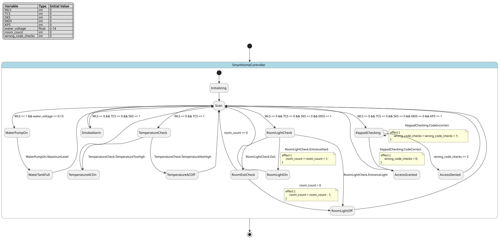

# Case `181` 🏢 — Priority-Scanned Smart-Home Utility and Access Controller

**Bucket**: EFSM-interlock  |  **Paper**: #602 `enhanced-smart-home-control-monitoring-system`

- [STM.md case section](../../../sources/enhanced-smart-home-control-monitoring-system/STM.md)
- [paper PDF](../../../sources/enhanced-smart-home-control-monitoring-system/paper.pdf)
- [expansion NL JSON (含 provenance)](../expansions/181.json)
- [codex 起草笔记](../ref_stms/codex_drafts/181.notes.md)

## 1. 英文 NL（含 inline [E] 溯源 markers）

> 这是 codex 评审阶段生成的扩充 NL（commit `259e6ea7`），每条 substantive 信息带 `[En]` 标记。完整 provenance 表见 [expansion JSON](../expansions/181.json)。

The controller is an enhanced smart-home control and monitoring system built around an AT89C51 microcontroller [E1], and sensor outputs serve as inputs to the microcontroller that controls the monitored processes [E2]. It uses five input process variables—WLS for water level, TCS for temperature control, SKS for smoke, MDS for motion detection, and KPS for keypad input [E3], while the ASM/state-transition design records state, input, output, next-state, and output-function information [E4]. The control software initializes process variables and runs forever [E5]; within each pass, WLS is tested before TCS, then SKS, MDS, and KPS, so the first active signal selects the handled process [E6]. In the water branch, a minimum level switches the pump on, and reaching the maximum level displays “tank full” and switches the pump off [E7]. In the temperature branch, a too-high temperature switches on the AC, otherwise the AC is switched off [E8]. In the smoke branch, sensed smoke sounds an alarm and displays an LCD message, and the GSM AT-command path is activated by the smoke-detector hazard signal [E9][E10]. In the room-light branch, entrance handling tests room light intensity, switches on the light when the room is dark, and increments the count; exit handling checks whether the count is zero before decrementing it and switching off the light [E11][E12]. In the keypad branch, a correct code grants access, but an incorrect code after the allowed three checks denies access, sends a message, sounds an alarm, and displays an LCD error [E13]. The water-level input qualifier also exposes a numeric comparator guard: voltage above 0.13 V maps to zero output, while receiving 0.13 V turns the comparator output to one [E14][E15].

## 2. 中文 NL 译文（claude 翻译，保留 [En] markers）

该控制器是一种围绕 AT89C51 单片机构建的增强型智能家居控制与监控系统 [E1]，传感器输出作为单片机的输入，由单片机控制被监控的过程 [E2]。它使用五个输入过程变量——用于水位的 WLS、用于温度控制的 TCS、用于烟雾的 SKS、用于运动检测的 MDS 以及用于键盘输入的 KPS [E3]，而 ASM/状态转移设计记录了状态、输入、输出、下一状态以及输出函数信息 [E4]。控制软件初始化过程变量并永久运行 [E5]；在每一轮中，先测试 WLS，再测试 TCS，然后依次测试 SKS、MDS 和 KPS，因此第一个有效信号决定了被处理的过程 [E6]。在水位分支中，达到最低水位时打开水泵，达到最高水位时显示"水箱已满"并关闭水泵 [E7]。在温度分支中，温度过高时打开空调，否则关闭空调 [E8]。在烟雾分支中，检测到烟雾时发出警报并显示 LCD 信息，GSM AT 指令路径由烟雾探测器危险信号激活 [E9][E10]。在室内灯光分支中，进入处理会测试室内光照强度，当房间黑暗时打开灯并使计数加一；离开处理则先检查计数是否为零，再进行减一并关闭灯 [E11][E12]。在键盘分支中，正确的密码允许访问，但在允许的三次检查后仍输入错误密码则拒绝访问、发送消息、发出警报并显示 LCD 错误 [E13]。水位输入限定器还暴露了一个数值比较器守卫：电压高于 0.13 V 映射到输出为零，而接收到 0.13 V 时比较器输出变为一 [E14][E15]。

## 3. Reference pyfcstm STM (codex 起草，待用户签字)

### 3.1 状态机图（pyfcstm visualize SVG）



PlantUML 源文件：[`../diagrams/181.puml`](../diagrams/181.puml)

### 3.2 pyfcstm DSL 源码

```pyfcstm
def int WLS = 0;
def int TCS = 0;
def int SKS = 0;
def int MDS = 0;
def int KPS = 0;
def float water_voltage = 0.14;
def int room_count = 0;
def int wrong_code_checks = 0;

state SmartHomeController {
    [*] -> Initializing;

    state Initializing {
        enter abstract InitializeProcessVariables;
    }

    state Scan {
        during abstract ScanProcessVariables;
        during {
            if [water_voltage == 0.13] {
                WLS = 1;
            } else {
                WLS = 0;
            }
        }
    }

    state WaterPumpOn {
        event MaximumLevel;
        enter abstract SwitchOnPump;
    }

    state WaterTankFull {
        enter abstract DisplayTankFull;
        enter abstract SwitchOffPump;
    }

    state TemperatureCheck {
        event TemperatureTooHigh;
        event TemperatureNotHigh;
        enter abstract CheckTemperature;
    }

    state TemperatureACOn {
        enter abstract SwitchOnAC;
    }

    state TemperatureACOff {
        enter abstract SwitchOffAC;
    }

    state SmokeAlarm {
        enter abstract SoundAlarm;
        enter abstract DisplaySmokeMessageLCD;
        enter abstract ActivateGSMATCommand;
    }

    state RoomLightCheck {
        event EntranceDark;
        event EntranceLight;
        event Exit;
        enter abstract CheckEntrance;
        enter abstract CheckRoomLightIntensity;
    }

    state RoomLightOn {
        enter abstract SwitchOnLight;
    }

    state RoomLightOff {
        enter abstract SwitchOffLight;
    }

    state RoomExitCheck {
        enter abstract CheckExit;
        enter abstract CheckCountZero;
    }

    state KeypadChecking {
        event CodeCorrect;
        event CodeIncorrect;
        enter abstract CheckCode;
    }

    state AccessGranted {
        enter abstract GrantAccess;
    }

    state AccessDenied {
        enter abstract DenyAccess;
        enter abstract SendMessage;
        enter abstract SoundAlarm;
        enter abstract DisplayErrorLCD;
        enter abstract ActivateGSMATCommand;
    }

    Initializing -> Scan;
    Scan -> WaterPumpOn : if [WLS == 1 && water_voltage == 0.13];
    Scan -> TemperatureCheck : if [WLS == 0 && TCS == 1];
    Scan -> SmokeAlarm : if [WLS == 0 && TCS == 0 && SKS == 1];
    Scan -> RoomLightCheck : if [WLS == 0 && TCS == 0 && SKS == 0 && MDS == 1];
    Scan -> KeypadChecking : if [WLS == 0 && TCS == 0 && SKS == 0 && MDS == 0 && KPS == 1];
    WaterPumpOn -> WaterTankFull :: MaximumLevel;
    WaterTankFull -> Scan;
    TemperatureCheck -> TemperatureACOn :: TemperatureTooHigh;
    TemperatureCheck -> TemperatureACOff :: TemperatureNotHigh;
    TemperatureACOn -> Scan;
    TemperatureACOff -> Scan;
    SmokeAlarm -> Scan;
    RoomLightCheck -> RoomLightOn :: EntranceDark effect { room_count = room_count + 1; };
    RoomLightCheck -> RoomLightOff :: EntranceLight;
    RoomLightCheck -> RoomExitCheck :: Exit;
    RoomLightOn -> Scan;
    RoomLightOff -> Scan;
    RoomExitCheck -> RoomLightOff : if [room_count > 0] effect { room_count = room_count - 1; };
    RoomExitCheck -> Scan : if [room_count == 0];
    KeypadChecking -> AccessGranted :: CodeCorrect effect { wrong_code_checks = 0; };
    KeypadChecking -> KeypadChecking :: CodeIncorrect effect { wrong_code_checks = wrong_code_checks + 1; };
    KeypadChecking -> AccessDenied : if [wrong_code_checks >= 3];
    AccessGranted -> Scan;
    AccessDenied -> Scan;
}

```

**codex 自报 C-axis 使用情况**:
- C1: ✓
- C2: ✓
- C3: ✗
- C4: ✓

**codex 自报 scenarios 覆盖情况**:
- 模式数: 15
- guards 数: 8
- fault paths 数: 2
- per-cycle 行为数: 1
- 硬件 effectors 数: 22

## 4. Test scenarios（覆盖 NL 全特性，必须 100% pass）

```json
{
  "scenarios": [
    {
      "name": "initialize_and_idle_scan_cycles",
      "description": "覆盖 E5 的初始化和 do-forever 扫描循环，并在无输入时连续 3 个 scan cycle 保持扫描态。",
      "initial_state": null,
      "initial_vars": {
        "WLS": 0,
        "TCS": 0,
        "SKS": 0,
        "MDS": 0,
        "KPS": 0,
        "water_voltage": 0.14,
        "room_count": 0,
        "wrong_code_checks": 0
      },
      "steps": [
        {
          "before_cycles": 0,
          "events": [],
          "expected_state": "SmartHomeController.Initializing",
          "expected_vars": {
            "WLS": 0,
            "water_voltage": 0.14,
            "room_count": 0,
            "wrong_code_checks": 0
          },
          "name": "enter_initializing"
        },
        {
          "before_cycles": 0,
          "events": [],
          "expected_state": "SmartHomeController.Scan",
          "expected_vars": {
            "WLS": 0,
            "water_voltage": 0.14,
            "room_count": 0,
            "wrong_code_checks": 0
          },
          "name": "enter_scan"
        },
        {
          "before_cycles": 2,
          "events": [],
          "expected_state": "SmartHomeController.Scan",
          "expected_vars": {
            "WLS": 0,
            "water_voltage": 0.14,
            "room_count": 0,
            "wrong_code_checks": 0
          },
          "name": "three_idle_scan_cycles"
        }
      ]
    },
    {
      "name": "water_priority_and_tank_full",
      "description": "覆盖 E6/E7/E15：WLS 在 0.13V 时优先于更低优先级输入进入水位分支，最低液位开泵，最大液位显示满箱并停泵。",
      "initial_state": "SmartHomeController.Scan",
      "initial_vars": {
        "WLS": 1,
        "TCS": 1,
        "SKS": 1,
        "MDS": 0,
        "KPS": 1,
        "water_voltage": 0.13,
        "room_count": 0,
        "wrong_code_checks": 0
      },
      "steps": [
        {
          "before_cycles": 0,
          "events": null,
          "expected_state": "SmartHomeController.Scan",
          "expected_vars": {
            "WLS": 1,
            "TCS": 1,
            "SKS": 1,
            "water_voltage": 0.13
          },
          "name": "qualify_wls_at_threshold"
        },
        {
          "before_cycles": 0,
          "events": [],
          "expected_state": "SmartHomeController.WaterPumpOn",
          "expected_vars": {
            "WLS": 1,
            "water_voltage": 0.13,
            "room_count": 0
          },
          "name": "wls_priority_selects_water"
        },
        {
          "before_cycles": 0,
          "events": [
            "MaximumLevel"
          ],
          "expected_state": "SmartHomeController.WaterTankFull",
          "expected_vars": {
            "WLS": 1,
            "water_voltage": 0.13,
            "room_count": 0
          },
          "name": "maximum_level_stops_pump"
        }
      ]
    },
    {
      "name": "comparator_zero_then_temperature_high",
      "description": "覆盖 E6/E8/E14：水位电压高于 0.13V 时 WLS 为零，随后 TCS 按优先级进入温度分支并在温度过高时打开 AC。",
      "initial_state": "SmartHomeController.Scan",
      "initial_vars": {
        "WLS": 0,
        "TCS": 1,
        "SKS": 0,
        "MDS": 0,
        "KPS": 0,
        "water_voltage": 0.14,
        "room_count": 0,
        "wrong_code_checks": 0
      },
      "steps": [
        {
          "before_cycles": 0,
          "events": null,
          "expected_state": "SmartHomeController.Scan",
          "expected_vars": {
            "WLS": 0,
            "TCS": 1,
            "water_voltage": 0.14
          },
          "name": "voltage_above_threshold_zeroes_wls"
        },
        {
          "before_cycles": 0,
          "events": [],
          "expected_state": "SmartHomeController.TemperatureCheck",
          "expected_vars": {
            "WLS": 0,
            "TCS": 1,
            "water_voltage": 0.14
          },
          "name": "tcs_selected_after_wls_false"
        },
        {
          "before_cycles": 0,
          "events": [
            "TemperatureTooHigh"
          ],
          "expected_state": "SmartHomeController.TemperatureACOn",
          "expected_vars": {
            "WLS": 0,
            "TCS": 1,
            "wrong_code_checks": 0
          },
          "name": "too_high_switches_ac_on"
        }
      ]
    },
    {
      "name": "temperature_not_high_ac_off",
      "description": "覆盖 E8 的 otherwise 分支：温度未过高时关闭 AC。",
      "initial_state": "SmartHomeController.TemperatureCheck",
      "initial_vars": {
        "WLS": 0,
        "TCS": 1,
        "SKS": 0,
        "MDS": 0,
        "KPS": 0,
        "water_voltage": 0.14,
        "room_count": 0,
        "wrong_code_checks": 0
      },
      "steps": [
        {
          "before_cycles": 0,
          "events": [
            "TemperatureNotHigh"
          ],
          "expected_state": "SmartHomeController.TemperatureACOff",
          "expected_vars": {
            "WLS": 0,
            "TCS": 1,
            "water_voltage": 0.14
          },
          "name": "otherwise_switches_ac_off"
        }
      ]
    },
    {
      "name": "smoke_hazard_alarm_and_gsm",
      "description": "覆盖 E6/E9/E10：较高优先级输入均未激活时，SKS 进入烟雾报警并触达 LCD、alarm 和 GSM AT-command 动作。",
      "initial_state": "SmartHomeController.Scan",
      "initial_vars": {
        "WLS": 0,
        "TCS": 0,
        "SKS": 1,
        "MDS": 0,
        "KPS": 0,
        "water_voltage": 0.14,
        "room_count": 0,
        "wrong_code_checks": 0
      },
      "steps": [
        {
          "before_cycles": 0,
          "events": null,
          "expected_state": "SmartHomeController.Scan",
          "expected_vars": {
            "WLS": 0,
            "SKS": 1,
            "water_voltage": 0.14
          },
          "name": "scan_smoke_inputs"
        },
        {
          "before_cycles": 0,
          "events": [],
          "expected_state": "SmartHomeController.SmokeAlarm",
          "expected_vars": {
            "WLS": 0,
            "SKS": 1,
            "wrong_code_checks": 0
          },
          "name": "smoke_alarm_actions"
        }
      ]
    },
    {
      "name": "room_entrance_dark_then_exit_decrements",
      "description": "覆盖 E6/E11/E12：MDS 进入房间照明分支，入口且房间暗时开灯并加计数，随后 exit 在 count 非零时递减并关灯。",
      "initial_state": "SmartHomeController.Scan",
      "initial_vars": {
        "WLS": 0,
        "TCS": 0,
        "SKS": 0,
        "MDS": 1,
        "KPS": 0,
        "water_voltage": 0.14,
        "room_count": 0,
        "wrong_code_checks": 0
      },
      "steps": [
        {
          "before_cycles": 0,
          "events": null,
          "expected_state": "SmartHomeController.Scan",
          "expected_vars": {
            "WLS": 0,
            "MDS": 1,
            "room_count": 0
          },
          "name": "scan_room_inputs"
        },
        {
          "before_cycles": 0,
          "events": [],
          "expected_state": "SmartHomeController.RoomLightCheck",
          "expected_vars": {
            "WLS": 0,
            "MDS": 1,
            "room_count": 0
          },
          "name": "mds_selected_after_higher_inputs_false"
        },
        {
          "before_cycles": 0,
          "events": [
            "EntranceDark"
          ],
          "expected_state": "SmartHomeController.RoomLightOn",
          "expected_vars": {
            "MDS": 1,
            "room_count": 1,
            "wrong_code_checks": 0
          },
          "name": "dark_entrance_switches_on_and_increments"
        },
        {
          "before_cycles": 0,
          "events": [],
          "expected_state": "SmartHomeController.Scan",
          "expected_vars": {
            "WLS": 0,
            "MDS": 1,
            "room_count": 1
          },
          "name": "return_to_scan_after_entrance"
        },
        {
          "before_cycles": 0,
          "events": [],
          "expected_state": "SmartHomeController.RoomLightCheck",
          "expected_vars": {
            "WLS": 0,
            "MDS": 1,
            "room_count": 1
          },
          "name": "room_branch_for_exit"
        },
        {
          "before_cycles": 0,
          "events": [
            "Exit"
          ],
          "expected_state": "SmartHomeController.RoomExitCheck",
          "expected_vars": {
            "MDS": 1,
            "room_count": 1
          },
          "name": "exit_checks_count"
        },
        {
          "before_cycles": 0,
          "events": [],
          "expected_state": "SmartHomeController.RoomLightOff",
          "expected_vars": {
            "MDS": 1,
            "room_count": 0
          },
          "name": "nonzero_count_decrements_and_light_off"
        }
      ]
    },
    {
      "name": "room_entrance_not_dark_switches_off",
      "description": "覆盖 E11 的 entrance otherwise 分支：入口处理发现房间不暗时关灯且不增加 count。",
      "initial_state": "SmartHomeController.RoomLightCheck",
      "initial_vars": {
        "WLS": 0,
        "TCS": 0,
        "SKS": 0,
        "MDS": 0,
        "KPS": 0,
        "water_voltage": 0.14,
        "room_count": 0,
        "wrong_code_checks": 0
      },
      "steps": [
        {
          "before_cycles": 0,
          "events": [
            "EntranceLight"
          ],
          "expected_state": "SmartHomeController.RoomLightOff",
          "expected_vars": {
            "room_count": 0,
            "WLS": 0,
            "wrong_code_checks": 0
          },
          "name": "not_dark_switches_light_off"
        }
      ]
    },
    {
      "name": "room_exit_zero_count_returns_scan",
      "description": "覆盖 E12 的 count zero guard：exit 处理发现 count 为 0 时不递减、不关灯，直接回到扫描态。",
      "initial_state": "SmartHomeController.RoomLightCheck",
      "initial_vars": {
        "WLS": 0,
        "TCS": 0,
        "SKS": 0,
        "MDS": 0,
        "KPS": 0,
        "water_voltage": 0.14,
        "room_count": 0,
        "wrong_code_checks": 0
      },
      "steps": [
        {
          "before_cycles": 0,
          "events": [
            "Exit"
          ],
          "expected_state": "SmartHomeController.RoomExitCheck",
          "expected_vars": {
            "room_count": 0,
            "WLS": 0,
            "wrong_code_checks": 0
          },
          "name": "exit_with_zero_count_checks_zero"
        },
        {
          "before_cycles": 0,
          "events": [],
          "expected_state": "SmartHomeController.Scan",
          "expected_vars": {
            "room_count": 0,
            "WLS": 0,
            "wrong_code_checks": 0
          },
          "name": "zero_count_returns_to_scan"
        }
      ]
    },
    {
      "name": "keypad_correct_grants_access",
      "description": "覆盖 E6/E13：KPS 在更高优先级输入均为 false 时进入 keypad 分支，正确 code 立即 grant access。",
      "initial_state": "SmartHomeController.Scan",
      "initial_vars": {
        "WLS": 0,
        "TCS": 0,
        "SKS": 0,
        "MDS": 0,
        "KPS": 1,
        "water_voltage": 0.14,
        "room_count": 0,
        "wrong_code_checks": 0
      },
      "steps": [
        {
          "before_cycles": 0,
          "events": null,
          "expected_state": "SmartHomeController.Scan",
          "expected_vars": {
            "WLS": 0,
            "KPS": 1,
            "wrong_code_checks": 0
          },
          "name": "scan_keypad_inputs"
        },
        {
          "before_cycles": 0,
          "events": [],
          "expected_state": "SmartHomeController.KeypadChecking",
          "expected_vars": {
            "WLS": 0,
            "KPS": 1,
            "wrong_code_checks": 0
          },
          "name": "kps_selected_last"
        },
        {
          "before_cycles": 0,
          "events": [
            "CodeCorrect"
          ],
          "expected_state": "SmartHomeController.AccessGranted",
          "expected_vars": {
            "KPS": 1,
            "wrong_code_checks": 0,
            "room_count": 0
          },
          "name": "correct_code_grants_access"
        }
      ]
    },
    {
      "name": "keypad_three_wrong_attempts_deny_access",
      "description": "覆盖 E13/E10 的三次错误阈值：前两次 incorrect code 留在检查态，第三次达到阈值后 deny access、message、alarm、LCD error 和 GSM。",
      "initial_state": "SmartHomeController.KeypadChecking",
      "initial_vars": {
        "WLS": 0,
        "TCS": 0,
        "SKS": 0,
        "MDS": 0,
        "KPS": 0,
        "water_voltage": 0.14,
        "room_count": 0,
        "wrong_code_checks": 0
      },
      "steps": [
        {
          "before_cycles": 0,
          "events": [
            "CodeIncorrect"
          ],
          "expected_state": "SmartHomeController.KeypadChecking",
          "expected_vars": {
            "wrong_code_checks": 1,
            "WLS": 0,
            "room_count": 0
          },
          "name": "first_wrong_attempt_below_threshold"
        },
        {
          "before_cycles": 0,
          "events": [
            "CodeIncorrect"
          ],
          "expected_state": "SmartHomeController.KeypadChecking",
          "expected_vars": {
            "wrong_code_checks": 2,
            "WLS": 0,
            "room_count": 0
          },
          "name": "second_wrong_attempt_below_threshold"
        },
        {
          "before_cycles": 0,
          "events": [
            "CodeIncorrect"
          ],
          "expected_state": "SmartHomeController.KeypadChecking",
          "expected_vars": {
            "wrong_code_checks": 3,
            "WLS": 0,
            "room_count": 0
          },
          "name": "third_wrong_attempt_reaches_threshold"
        },
        {
          "before_cycles": 0,
          "events": [],
          "expected_state": "SmartHomeController.AccessDenied",
          "expected_vars": {
            "wrong_code_checks": 3,
            "WLS": 0,
            "room_count": 0
          },
          "name": "threshold_guard_denies_access"
        }
      ]
    }
  ]
}
```

## 5. pyfcstm 验证日志（parse + sem + sim + scenarios 全跑）

```
PARSE_OK
SEM_OK (leaf_states=?)
SIM_OK (current_state=Initializing)
SCENARIOS_LOADED: 10
  ✓ [initialize_and_idle_scan_cycles]
  ✓ [water_priority_and_tank_full]
  ✓ [comparator_zero_then_temperature_high]
  ✓ [temperature_not_high_ac_off]
  ✓ [smoke_hazard_alarm_and_gsm]
  ✓ [room_entrance_dark_then_exit_decrements]
  ✓ [room_entrance_not_dark_switches_off]
  ✓ [room_exit_zero_count_returns_scan]
  ✓ [keypad_correct_grants_access]
  ✓ [keypad_three_wrong_attempts_deny_access]

SCENARIOS_SUMMARY: pass=10 fail=0 error=0 total=10

LINT_RUNNING...
LINT_SUMMARY: warnings=0 by_code={}
ALL_OK
```

## 6. Codex 起草笔记

# Codex Draft Notes — Case 181

## 1. 设计选择

- mode 列表：
  - `Initializing`：来自 expansion [E5] "Initialize Process variables"。
  - `Scan`：来自 [E5]/[E6] "Do forever" 和 WLS/TCS/SKS/MDS/KPS ordered scan。
  - `WaterPumpOn`, `WaterTankFull`：来自 [E7] minimum level switches pump on, maximum level displays tank full and switches pump off。
  - `TemperatureCheck`, `TemperatureACOn`, `TemperatureACOff`：来自 [E8] check temperature, too high switches AC on, otherwise off。
  - `SmokeAlarm`：来自 [E9]/[E10] smoke sensed sounds alarm, LCD message, GSM AT-command activation。
  - `RoomLightCheck`, `RoomLightOn`, `RoomLightOff`, `RoomExitCheck`：来自 [E11]/[E12] entrance/dark/count increment and exit/count-zero/decrement/light-off。
  - `KeypadChecking`, `AccessGranted`, `AccessDenied`：来自 [E13] code correct grants access, incorrect after 3 checks denies access with message/alarm/LCD error。
- event 列表：
  - `MaximumLevel`：来自 [E7] "level is maximum"。
  - `TemperatureTooHigh`, `TemperatureNotHigh`：来自 [E8] "temperature too high" / otherwise。
  - `EntranceDark`, `EntranceLight`, `Exit`：来自 [E11]/[E12] entrance, room dark, else switch off, exit。
  - `CodeCorrect`, `CodeIncorrect`：来自 [E13] code correct / code incorrect。
- variable 列表：
  - `int WLS/TCS/SKS/MDS/KPS = 0`：来自 [E3] 五个 input process variables；用 0/1 编码，因为本地 pyfcstm parser 只接受 `int/float` definitions。
  - `float water_voltage = 0.14`：来自 [E14]/[E15] 的 0.13 V input qualifier；默认 0.14 表示 above-threshold zero-output 情况。
  - `int room_count = 0`：来自 [E11]/[E12] increment count、count zero、decrement count。
  - `int wrong_code_checks = 0`：来自 [E13] allowed three checks。
- transition 设计：
  - `Initializing -> Scan` 对应 [E5] 初始化后进入 forever scan。
  - `Scan -> WaterPumpOn : if [WLS == 1 && water_voltage == 0.13]` 对应 [E6]/[E7]/[E15]，并显式保留 0.13 V threshold。
  - `Scan -> TemperatureCheck -> TemperatureACOn/TemperatureACOff` 对应 [E6]/[E8]。
  - `Scan -> SmokeAlarm` 对应 [E6]/[E9]/[E10]。
  - `Scan -> RoomLightCheck -> RoomLightOn/RoomLightOff/RoomExitCheck` 对应 [E6]/[E11]/[E12]。
  - `Scan -> KeypadChecking -> AccessGranted/AccessDenied` 对应 [E6]/[E13]；`wrong_code_checks >= 3` 是三次错误阈值 guard。

## 2. C-axis grounding 使用情况

- **C1 (周期执行)**: 用 — `Scan` 中使用 `during abstract ScanProcessVariables` 和 `during { ... }` 每个 scan cycle 更新 WLS qualifier；`initialize_and_idle_scan_cycles` 连续跑 3 个 scan cycle。
- **C2 (数值守卫)**: 用 — `WLS == 1 && water_voltage == 0.13`，`room_count > 0` / `room_count == 0`，`wrong_code_checks >= 3` 分别覆盖 0.13 V、count-zero 和 three-check threshold。
- **C3 (forced fault)**: 未用 — 原文只有 smoke/keypad 分支内报警与 GSM 激活，没有 any-state/global fault escape 或 ErrorHandler 语义。
- **C4 (硬件)**: 用 — `enter abstract` 覆盖 pump、AC、alarm、LCD、GSM、light、access/message 等具名 effector。

## 3. 与 NL 的对应关系

- expansion NL [E1]/[E2]: AT89C51 and sensor outputs controlling processes → `SmartHomeController` root + `ScanProcessVariables` abstract action。
- [E3]: WLS/TCS/SKS/MDS/KPS → five 0/1 input variables read by `Scan` guards。
- [E4]: ASM/state-transition design → explicit states, guards, events, and abstract outputs in pyfcstm。
- [E5]: initialize and run forever → `Initializing -> Scan` and `Scan.during`。
- [E6]: WLS before TCS before SKS before MDS before KPS → ordered `Scan -> ...` guard transitions with higher-priority exclusions。
- [E7]: minimum/max water behavior → `WaterPumpOn`, `MaximumLevel`, `WaterTankFull` with `SwitchOnPump`, `DisplayTankFull`, `SwitchOffPump`。
- [E8]: too-high temperature / otherwise → `TemperatureTooHigh` to `TemperatureACOn`, `TemperatureNotHigh` to `TemperatureACOff`。
- [E9]/[E10]: smoke alarm/LCD/GSM → `SmokeAlarm` entry abstract actions。
- [E11]/[E12]: room entrance/exit/count → `RoomLightCheck`, `EntranceDark`, `EntranceLight`, `Exit`, `room_count` guards/effects。
- [E13]: correct code and three wrong checks → `CodeCorrect`, `CodeIncorrect`, `wrong_code_checks >= 3`, `AccessGranted`, `AccessDenied`。
- [E14]/[E15]: above 0.13 V zero output, at 0.13 V one output → `Scan.during` WLS qualifier update and water transition guard.

## 4. 迭代历史

- iter 1: 初稿使用 `def bool` → verify: `PARSE_FAIL`，本地 grammar 只接受 `int/float` → 改为 0/1 `int`。
- iter 2: smoke parse/sem/sim 通过；full scenarios setup 报 `initial_vars must provide all variables` → 为每个 scenario 补齐全量变量。
- iter 3: scenarios 因 `Scan` transition 先于 `during` 的执行顺序出现 off-by-one → 将 hot-start 初始断言改为 `events: null`，水位优先场景预置 `WLS=1`。
- iter 4: scenarios 全部通过，但 lint 报 8 个 `unused_event` → 将事件声明从 root 移到实际 source state。
- iter 5: 将 0.13 V threshold 加入水位 transition guard，并补充 `room_count == 0` exit guard 场景后重跑 → `PARSE_OK`, `SEM_OK`, `SIM_OK`, scenarios 10/10 pass, `warnings=0`, `ALL_OK`。

## 5. 与 STM.md 表述的偏差（如有）

- `WLS/TCS/SKS/MDS/KPS` 在 DSL 中用 `int` 0/1 而不是 `bool`，这是为了匹配当前 pyfcstm parser；语义仍是 input process variable 是否激活。
- 水箱最大液位没有原文数值，因此建模为 `MaximumLevel` event，而不是发明一个 numeric maximum threshold。
- 未加入 `! * -> ErrorHandler`，因为原文没有全局 fault 或 any-state forced recovery；smoke 和 keypad 错误只按各自分支建模。

## 7. Claude 交叉评审

**Verdict**: APPROVE

| 维度 | 打分 | evidence |
|---|---|---|
| 语义正确性 | 🟢 | states/events/vars 与 [E3][E5-E13] 一一对应，扫描优先级 else-if 链通过累积否定 guard 正确编码（WLS>TCS>SKS>MDS>KPS）。 |
| NL 忠实性 | 🟢 | 未见编造的硬件名或阈值，所有 abstract action 名（pump/AC/alarm/LCD/GSM/light/access）均可追溯到 [E7-E13]。 |
| C-axis grounding 恰当性 | 🟢 | C1 用 Scan during {} 模拟 do-forever 比较器周期行为 [E5][E14][E15]；C2 用 wrong_code_checks>=3 与 water_voltage==0.13 浮点比较 [E13][E15]；C3 按 axis_coverage 正确未发明 forced fault；C4 用 abstract 占位匹配具名 effector。 |
| scenarios NL 覆盖度 | 🟢 | 10 个 scenarios 覆盖初始化+空扫描、5 条优先级分支、water/temperature/smoke/room/keypad 全分支、entrance dark/light 双路径、exit count=0/>0 双路径、keypad 三次错误阈值边界。 |

**修订建议**:
- 可选：Scan→WaterPumpOn 的 guard 中 water_voltage==0.13 与 during {} 重复（during 已保证 WLS==1 ↔ voltage==0.13），可简化为只保留 WLS==1，但不影响正确性。

**缺失 scenarios 建议**:
- 可选 voltage_threshold_boundary: 显式覆盖 water_voltage 从 0.14→0.13 切换时 during 块把 WLS 由 0 翻为 1（当前 water_priority_and_tank_full 直接以 initial_vars WLS=1 起步，未演示 during 的因果链）。

**总评**: ref DSL 与 NL [E1-E15] 高度对齐，无 hallucination，C1/C2/C4 grounding 自然落到原文支持的 per-cycle 比较器、三次错码阈值和具名 effector，C3 按原文实际不支持而正确避免发明 forced fault。10 个 scenarios 已覆盖全部关键分支与阈值边界，可直接进入下一阶段。

## 8. 用户审阅区（待签字）

**审阅状态**：⬜ 待审 / ⬜ approve / ⬜ revise / ⬜ rewrite

**审阅笔记**（用户填写）：

- 

**修订要求**（用户填写）：

- 

**签字**：（用户填写日期 + 姓名）

---

**最终 ref 落盘路径（待签字后）**: `audited/181.fcstm` + `audited/181.audit.md`