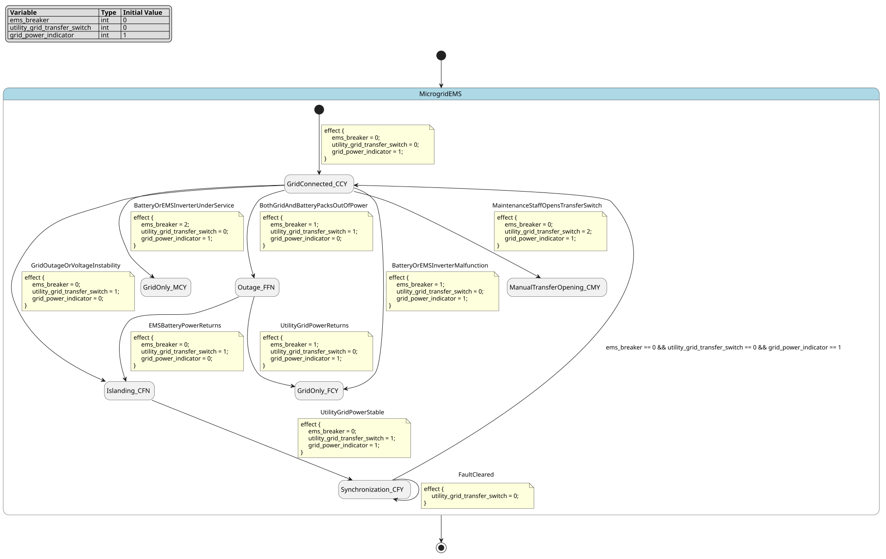

# Case `194` 🌡️ — Five-mode microgrid EMS switch-breaker supervisor

**Bucket**: FSM-basic  |  **Paper**: #648 `optimization-control-energy-management-system-microgrids`

- [STM.md case section](../../../sources/optimization-control-energy-management-system-microgrids/STM.md)
- [paper PDF](../../../sources/optimization-control-energy-management-system-microgrids/paper.pdf)
- [expansion NL JSON (含 provenance)](../expansions/194.json)
- [codex 起草笔记](../ref_stms/codex_drafts/194.notes.md)

## 1. 英文 NL（含 inline [E] 溯源 markers）

> 这是 codex 评审阶段生成的扩充 NL（commit `259e6ea7`），每条 substantive 信息带 `[En]` 标记。完整 provenance 表见 [expansion JSON](../expansions/194.json)。

The EMS controller for a grid-connected microgrid classifies operation into five main modes and implements them as a finite state machine [E1] [E2]. In normal grid-connected operation, the utility grid determines bus voltage, the solar grid-tie inverter and battery pack act as current-source inverters, and the high-level EMS commands battery charge or discharge power [E3] [E4]. If the battery or EMS inverter malfunctions or is under service, the controller opens the breaker connecting the EMS to the microgrid [E5]. When the utility grid is down or voltage-unstable, the EMS detects the incident, opens the grid transfer switch, isolates the microgrid, and runs the EMS inverter as a voltage-source inverter to govern bus voltage, maintain voltage and frequency, and balance generation with consumption [E6] [E7]. Before reconnection from islanded operation, the EMS checks that microgrid and grid magnitude, frequency, and phase are the same [E8]. If both the utility grid and EMS battery packs are out of power, the EMS control unit stays active on reserved power and monitors for return of either source so it can switch to the correct mode [E9]. The FSM variables are the utility-grid transfer switch, EMS breaker, and grid-power indicator; both switches use Closed, Fault opening, and Manual opening, while the grid indicator separates stable power from off-or-unstable power [E10] [E11] [E12]. The transfer-switch relay senses grid current and voltage, trips from Closed to Fault opening on outage or instability, and can reclose from Fault opening to Closed after fault clearance, but not from Manual opening to Closed [E13] [E14]. Three-letter encoded microgrid states record EMS-breaker, transfer-switch, and grid-power-indicator values, and mode circles group states with similar meaning [E15].

## 2. 中文 NL 译文（claude 翻译，保留 [En] markers）

用于并网微电网的 EMS 控制器将运行划分为五种主要模式，并以有限状态机的形式加以实现 [E1] [E2]。在正常并网运行时，公用电网决定母线电压，光伏并网逆变器与电池组作为电流源型逆变器工作，高层 EMS 下发电池的充放电功率指令 [E3] [E4]。若电池或 EMS 逆变器发生故障或处于检修状态，控制器将断开连接 EMS 与微电网的断路器 [E5]。当公用电网失电或电压不稳定时，EMS 检测到该事件，断开电网转换开关，将微电网孤立，并使 EMS 逆变器作为电压源型逆变器运行，以调节母线电压、维持电压与频率，并实现发用电平衡 [E6] [E7]。在从孤岛运行重新并网之前，EMS 须确认微电网与公用电网在幅值、频率和相位上保持一致 [E8]。若公用电网与 EMS 电池组同时失电，EMS 控制单元依靠预留电源保持激活，并持续监测两路电源中任一路的恢复，以便切换至相应模式 [E9]。该 FSM 的变量为公用电网转换开关、EMS 断路器和电网电源指示；两个开关均具有 Closed、Fault opening 和 Manual opening 三种取值，而电网指示则将稳定供电与失电或不稳定供电相区分 [E10] [E11] [E12]。转换开关继电器感测电网电流和电压，在停电或不稳定时从 Closed 跳至 Fault opening，在故障清除后可由 Fault opening 重合至 Closed，但不能由 Manual opening 重合至 Closed [E13] [E14]。微电网状态以三字母编码记录 EMS 断路器、转换开关和电网电源指示的取值，而模式圆圈将语义相近的状态归为一组 [E15]。

## 3. Reference pyfcstm STM (codex 起草，待用户签字)

### 3.1 状态机图（pyfcstm visualize SVG）



PlantUML 源文件：[`../diagrams/194.puml`](../diagrams/194.puml)

### 3.2 pyfcstm DSL 源码

```pyfcstm
def int ems_breaker = 0;
def int utility_grid_transfer_switch = 0;
def int grid_power_indicator = 1;

state MicrogridEMS {
    event BatteryOrEMSInverterMalfunction;
    event BatteryOrEMSInverterUnderService;
    event GridOutageOrVoltageInstability;
    event UtilityGridPowerStable;
    event FaultCleared;
    event BothGridAndBatteryPacksOutOfPower;
    event UtilityGridPowerReturns;
    event EMSBatteryPowerReturns;
    event MaintenanceStaffOpensTransferSwitch;

    [*] -> GridConnected_CCY effect {
        ems_breaker = 0;
        utility_grid_transfer_switch = 0;
        grid_power_indicator = 1;
    };

    state GridConnected_CCY {
        enter abstract UtilityGridDeterminesBusVoltage;
        enter abstract SolarAndBatteryOperateAsCurrentSourceInverters;
        during abstract CommandChargeOrDischargePower;
    }

    state GridOnly_FCY {
        enter abstract OpenEMSBreaker;
        during abstract OperateRemainingDevicesAsGridConnected;
    }

    state GridOnly_MCY {
        enter abstract OpenEMSBreakerForService;
        during abstract OperateRemainingDevicesAsGridConnected;
    }

    state Islanding_CFN {
        enter abstract SenseUtilityGridCurrentAndVoltage;
        enter abstract OpenGridTransferSwitch;
        enter abstract OperateEMSInverterAsVoltageSource;
        during abstract MaintainVoltageFrequencyAndPowerBalance;
    }

    state Synchronization_CFY {
        during abstract EnsureMagnitudeFrequencyPhaseSame;
    }

    state Outage_FFN {
        enter abstract KeepEMSControlUnitActiveOnReservedPower;
        during abstract MonitorSystemWithReservedPower;
    }

    state ManualTransferOpening_CMY {
        enter abstract MaintenanceStaffManualOpening;
    }

    GridConnected_CCY -> GridOnly_FCY : BatteryOrEMSInverterMalfunction effect {
        ems_breaker = 1;
        utility_grid_transfer_switch = 0;
        grid_power_indicator = 1;
    };
    GridConnected_CCY -> GridOnly_MCY : BatteryOrEMSInverterUnderService effect {
        ems_breaker = 2;
        utility_grid_transfer_switch = 0;
        grid_power_indicator = 1;
    };
    GridConnected_CCY -> Islanding_CFN : GridOutageOrVoltageInstability effect {
        ems_breaker = 0;
        utility_grid_transfer_switch = 1;
        grid_power_indicator = 0;
    };
    GridConnected_CCY -> Outage_FFN : BothGridAndBatteryPacksOutOfPower effect {
        ems_breaker = 1;
        utility_grid_transfer_switch = 1;
        grid_power_indicator = 0;
    };
    GridConnected_CCY -> ManualTransferOpening_CMY : MaintenanceStaffOpensTransferSwitch effect {
        ems_breaker = 0;
        utility_grid_transfer_switch = 2;
        grid_power_indicator = 1;
    };

    Islanding_CFN -> Synchronization_CFY : UtilityGridPowerStable effect {
        ems_breaker = 0;
        utility_grid_transfer_switch = 1;
        grid_power_indicator = 1;
    };
    Synchronization_CFY -> Synchronization_CFY : FaultCleared effect {
        utility_grid_transfer_switch = 0;
    };
    Synchronization_CFY -> GridConnected_CCY : if [ems_breaker == 0 && utility_grid_transfer_switch == 0 && grid_power_indicator == 1];

    Outage_FFN -> GridOnly_FCY : UtilityGridPowerReturns effect {
        ems_breaker = 1;
        utility_grid_transfer_switch = 0;
        grid_power_indicator = 1;
    };
    Outage_FFN -> Islanding_CFN : EMSBatteryPowerReturns effect {
        ems_breaker = 0;
        utility_grid_transfer_switch = 1;
        grid_power_indicator = 0;
    };
}

```

**codex 自报 C-axis 使用情况**:
- C1: ✓
- C2: ✗
- C3: ✗
- C4: ✓

**codex 自报 scenarios 覆盖情况**:
- 模式数: 5
- guards 数: 1
- fault paths 数: 4
- per-cycle 行为数: 5
- 硬件 effectors 数: 14

## 4. Test scenarios（覆盖 NL 全特性，必须 100% pass）

```json
{
  "scenarios": [
    {
      "name": "normal_grid_connected_ccy",
      "description": "覆盖 [E3][E4][E10][E11][E12][E15]：默认进入 Grid-connected，CCY 表示 EMS breaker closed、transfer switch closed、grid stable。",
      "initial_state": null,
      "initial_vars": {},
      "steps": [
        {
          "before_cycles": 0,
          "events": [],
          "expected_state": "MicrogridEMS.GridConnected_CCY",
          "expected_vars": {
            "ems_breaker": 0,
            "utility_grid_transfer_switch": 0,
            "grid_power_indicator": 1
          },
          "name": "default_enters_grid_connected"
        }
      ]
    },
    {
      "name": "grid_only_malfunction_opens_ems_breaker",
      "description": "覆盖 [E5][E10][E11][E15]：battery 或 EMS inverter malfunction 时打开 EMS breaker，进入 Grid-only 的 FCY 编码状态。",
      "initial_state": null,
      "initial_vars": {},
      "steps": [
        {
          "before_cycles": 0,
          "events": [],
          "expected_state": "MicrogridEMS.GridConnected_CCY",
          "expected_vars": {
            "ems_breaker": 0,
            "utility_grid_transfer_switch": 0,
            "grid_power_indicator": 1
          },
          "name": "start_from_normal_mode"
        },
        {
          "before_cycles": 0,
          "events": ["MicrogridEMS.BatteryOrEMSInverterMalfunction"],
          "expected_state": "MicrogridEMS.GridOnly_FCY",
          "expected_vars": {
            "ems_breaker": 1,
            "utility_grid_transfer_switch": 0,
            "grid_power_indicator": 1
          },
          "name": "malfunction_opens_ems_breaker"
        }
      ]
    },
    {
      "name": "grid_only_service_manual_opening",
      "description": "覆盖 [E5][E11][E15]：battery 或 EMS inverter under service 时进入 Grid-only 的 MCY 服务打开路径。",
      "initial_state": null,
      "initial_vars": {},
      "steps": [
        {
          "before_cycles": 0,
          "events": [],
          "expected_state": "MicrogridEMS.GridConnected_CCY",
          "expected_vars": {
            "ems_breaker": 0,
            "utility_grid_transfer_switch": 0,
            "grid_power_indicator": 1
          },
          "name": "start_from_normal_mode"
        },
        {
          "before_cycles": 0,
          "events": ["MicrogridEMS.BatteryOrEMSInverterUnderService"],
          "expected_state": "MicrogridEMS.GridOnly_MCY",
          "expected_vars": {
            "ems_breaker": 2,
            "utility_grid_transfer_switch": 0,
            "grid_power_indicator": 1
          },
          "name": "service_opens_ems_breaker"
        }
      ]
    },
    {
      "name": "islanding_sync_guard_and_reclose",
      "description": "覆盖 [E6][E7][E8][E13][E14][E15]：grid outage/instability 使 transfer switch 从 C trip 到 F，grid stable 后进入同步，fault cleared 后 guard 才允许 F 到 C 重连。",
      "initial_state": null,
      "initial_vars": {},
      "steps": [
        {
          "before_cycles": 0,
          "events": [],
          "expected_state": "MicrogridEMS.GridConnected_CCY",
          "expected_vars": {
            "ems_breaker": 0,
            "utility_grid_transfer_switch": 0,
            "grid_power_indicator": 1
          },
          "name": "start_from_normal_mode"
        },
        {
          "before_cycles": 0,
          "events": ["MicrogridEMS.GridOutageOrVoltageInstability"],
          "expected_state": "MicrogridEMS.Islanding_CFN",
          "expected_vars": {
            "ems_breaker": 0,
            "utility_grid_transfer_switch": 1,
            "grid_power_indicator": 0
          },
          "name": "trip_transfer_switch_to_fault_opening"
        },
        {
          "before_cycles": 0,
          "events": ["MicrogridEMS.UtilityGridPowerStable"],
          "expected_state": "MicrogridEMS.Synchronization_CFY",
          "expected_vars": {
            "ems_breaker": 0,
            "utility_grid_transfer_switch": 1,
            "grid_power_indicator": 1
          },
          "name": "enter_synchronization_before_reclose"
        },
        {
          "before_cycles": 1,
          "events": null,
          "expected_state": "MicrogridEMS.Synchronization_CFY",
          "expected_vars": {
            "ems_breaker": 0,
            "utility_grid_transfer_switch": 1,
            "grid_power_indicator": 1
          },
          "name": "guard_blocks_reclose_while_switch_still_fault_opening"
        },
        {
          "before_cycles": 0,
          "events": ["MicrogridEMS.FaultCleared"],
          "expected_state": "MicrogridEMS.Synchronization_CFY",
          "expected_vars": {
            "ems_breaker": 0,
            "utility_grid_transfer_switch": 0,
            "grid_power_indicator": 1
          },
          "name": "fault_clearance_sets_transfer_switch_closed"
        },
        {
          "before_cycles": 0,
          "events": [],
          "expected_state": "MicrogridEMS.GridConnected_CCY",
          "expected_vars": {
            "ems_breaker": 0,
            "utility_grid_transfer_switch": 0,
            "grid_power_indicator": 1
          },
          "name": "guard_allows_reclose_after_fault_clearance"
        }
      ]
    },
    {
      "name": "outage_reserved_power_monitor_and_utility_return",
      "description": "覆盖 [E9][E10][E11][E12][E15]：utility grid 与 EMS battery packs 都 out of power 时进入 Outage，并在 reserved power 下多周期监控，utility 返回后转 Grid-only。",
      "initial_state": null,
      "initial_vars": {},
      "steps": [
        {
          "before_cycles": 0,
          "events": [],
          "expected_state": "MicrogridEMS.GridConnected_CCY",
          "expected_vars": {
            "ems_breaker": 0,
            "utility_grid_transfer_switch": 0,
            "grid_power_indicator": 1
          },
          "name": "start_from_normal_mode"
        },
        {
          "before_cycles": 0,
          "events": ["MicrogridEMS.BothGridAndBatteryPacksOutOfPower"],
          "expected_state": "MicrogridEMS.Outage_FFN",
          "expected_vars": {
            "ems_breaker": 1,
            "utility_grid_transfer_switch": 1,
            "grid_power_indicator": 0
          },
          "name": "both_sources_out_of_power"
        },
        {
          "before_cycles": 3,
          "events": null,
          "expected_state": "MicrogridEMS.Outage_FFN",
          "expected_vars": {
            "ems_breaker": 1,
            "utility_grid_transfer_switch": 1,
            "grid_power_indicator": 0
          },
          "name": "reserved_power_monitoring_over_three_cycles"
        },
        {
          "before_cycles": 0,
          "events": ["MicrogridEMS.UtilityGridPowerReturns"],
          "expected_state": "MicrogridEMS.GridOnly_FCY",
          "expected_vars": {
            "ems_breaker": 1,
            "utility_grid_transfer_switch": 0,
            "grid_power_indicator": 1
          },
          "name": "utility_returns_while_battery_still_out"
        }
      ]
    },
    {
      "name": "outage_battery_return_selects_islanding",
      "description": "覆盖 [E9]：Outage 中监控到 EMS battery source 返回且 utility grid 仍不稳定时，选择 Islanding/battery-only 路径。",
      "initial_state": null,
      "initial_vars": {},
      "steps": [
        {
          "before_cycles": 0,
          "events": [],
          "expected_state": "MicrogridEMS.GridConnected_CCY",
          "expected_vars": {
            "ems_breaker": 0,
            "utility_grid_transfer_switch": 0,
            "grid_power_indicator": 1
          },
          "name": "start_from_normal_mode"
        },
        {
          "before_cycles": 0,
          "events": ["MicrogridEMS.BothGridAndBatteryPacksOutOfPower"],
          "expected_state": "MicrogridEMS.Outage_FFN",
          "expected_vars": {
            "ems_breaker": 1,
            "utility_grid_transfer_switch": 1,
            "grid_power_indicator": 0
          },
          "name": "both_sources_out_of_power"
        },
        {
          "before_cycles": 0,
          "events": ["MicrogridEMS.EMSBatteryPowerReturns"],
          "expected_state": "MicrogridEMS.Islanding_CFN",
          "expected_vars": {
            "ems_breaker": 0,
            "utility_grid_transfer_switch": 1,
            "grid_power_indicator": 0
          },
          "name": "battery_returns_while_grid_still_unstable"
        }
      ]
    },
    {
      "name": "manual_transfer_opening_cannot_reclose_on_fault_cleared",
      "description": "覆盖 [E11][E14][E15]：maintenance staff 将 transfer switch 置为 Manual opening 后，FaultCleared 不允许从 M 回到 C。",
      "initial_state": null,
      "initial_vars": {},
      "steps": [
        {
          "before_cycles": 0,
          "events": [],
          "expected_state": "MicrogridEMS.GridConnected_CCY",
          "expected_vars": {
            "ems_breaker": 0,
            "utility_grid_transfer_switch": 0,
            "grid_power_indicator": 1
          },
          "name": "start_from_normal_mode"
        },
        {
          "before_cycles": 0,
          "events": ["MicrogridEMS.MaintenanceStaffOpensTransferSwitch"],
          "expected_state": "MicrogridEMS.ManualTransferOpening_CMY",
          "expected_vars": {
            "ems_breaker": 0,
            "utility_grid_transfer_switch": 2,
            "grid_power_indicator": 1
          },
          "name": "maintenance_staff_sets_manual_opening"
        },
        {
          "before_cycles": 0,
          "events": ["MicrogridEMS.FaultCleared"],
          "expected_state": "MicrogridEMS.ManualTransferOpening_CMY",
          "expected_vars": {
            "ems_breaker": 0,
            "utility_grid_transfer_switch": 2,
            "grid_power_indicator": 1
          },
          "name": "fault_cleared_does_not_reclose_manual_opening"
        }
      ]
    }
  ]
}
```

## 5. pyfcstm 验证日志（parse + sem + sim + scenarios 全跑）

```
PARSE_OK
SEM_OK (leaf_states=?)
SIM_OK (current_state=GridConnected_CCY)
SCENARIOS_LOADED: 7
  ✓ [normal_grid_connected_ccy]
  ✓ [grid_only_malfunction_opens_ems_breaker]
  ✓ [grid_only_service_manual_opening]
  ✓ [islanding_sync_guard_and_reclose]
  ✓ [outage_reserved_power_monitor_and_utility_return]
  ✓ [outage_battery_return_selects_islanding]
  ✓ [manual_transfer_opening_cannot_reclose_on_fault_cleared]

SCENARIOS_SUMMARY: pass=7 fail=0 error=0 total=7

LINT_RUNNING...
LINT_SUMMARY: warnings=0 by_code={}
ALL_OK
```

## 6. Codex 起草笔记

# Codex Draft Notes — Case 194

## 1. 设计选择

- mode 列表：
  - `GridConnected_CCY`：来自 STM §1 摘录 A 的 Grid-connected mode，以及 expansion [E3][E4]；`CCY` 来自 [E15] 的三字母编码规则，表示 EMS breaker Closed、transfer switch Closed、grid power stable Yes。
  - `GridOnly_FCY`：来自 STM §1 摘录 A 与 expansion [E5] 的 Grid-only mode；`FCY` 表示 EMS breaker Fault opening、transfer switch Closed、grid stable。
  - `GridOnly_MCY`：来自 STM §1 摘录 A 的 under service 和摘录 C/[E11] 的 Manual opening；`MCY` 表示 EMS breaker Manual opening、transfer switch Closed、grid stable。
  - `Islanding_CFN`：来自 STM §1 摘录 A 与 expansion [E6][E7]；`CFN` 直接对应 STM §1 摘录 D/[E15] 给出的例子。
  - `Synchronization_CFY`：来自 STM §1 摘录 B 与 expansion [E8]；`CFY` 表示 EMS breaker Closed、transfer switch Fault opening、grid stable，等待重连。
  - `Outage_FFN`：来自 STM §1 摘录 B 与 expansion [E9]；`FFN` 表示两侧 power source 不可用时 EMS breaker 与 transfer switch 都不处于 Closed，grid indicator 为 N。
  - `ManualTransferOpening_CMY`：来自 STM §1 摘录 C/[E11][E14] 的 transfer switch Manual opening，用于表达 M 不能因 fault cleared 自动回到 C。
- event 列表：
  - `BatteryOrEMSInverterMalfunction`：来自 [E5] 的 battery or EMS inverter malfunction。
  - `BatteryOrEMSInverterUnderService`：来自 [E5] 的 under service。
  - `GridOutageOrVoltageInstability`：来自 [E6][E13] 的 grid down/outage or voltage instability。
  - `UtilityGridPowerStable`：来自 [E12][E14] 的 grid has power and stable / fault cleared 前提。
  - `FaultCleared`：来自 [E14] 的 fault is cleared。
  - `BothGridAndBatteryPacksOutOfPower`：来自 [E9] 的 both utility grid and EMS battery packs are out of power。
  - `UtilityGridPowerReturns`、`EMSBatteryPowerReturns`：来自 [E9] 的 power comes back on either from the battery or utility grid。
  - `MaintenanceStaffOpensTransferSwitch`：来自 [E14] 原文上下文的 maintenance staff opens the switch manually。
- variable 列表：
  - `int ems_breaker = 0`：来自 [E10][E11] 的 EMS breaker state；编码 `0=C, 1=F, 2=M`。
  - `int utility_grid_transfer_switch = 0`：来自 [E10][E11] 的 utility-grid transfer switch state；编码 `0=C, 1=F, 2=M`。
  - `int grid_power_indicator = 1`：来自 [E12] 的 grid has power and stable(Y) / off or unstable(N)；编码 `1=Y, 0=N`。
- transition 设计：
  - `GridConnected_CCY -> GridOnly_FCY : BatteryOrEMSInverterMalfunction`：对应 [E5]，effect 将 `ems_breaker` 置为 Fault opening。
  - `GridConnected_CCY -> GridOnly_MCY : BatteryOrEMSInverterUnderService`：对应 [E5][E11]，service 路径用 Manual opening 表达。
  - `GridConnected_CCY -> Islanding_CFN : GridOutageOrVoltageInstability`：对应 [E6][E13]，transfer switch 从 Closed trip 到 Fault opening，grid indicator 变 N。
  - `Islanding_CFN -> Synchronization_CFY : UtilityGridPowerStable`：对应 [E8][E12]，grid 恢复 stable 后进入同步等待。
  - `Synchronization_CFY -> Synchronization_CFY : FaultCleared` 后接 `Synchronization_CFY -> GridConnected_CCY : if [ems_breaker == 0 && utility_grid_transfer_switch == 0 && grid_power_indicator == 1]`：对应 [E8][E14]，只有 fault cleared 后 switch 变 C 且 grid stable 才重连。
  - `GridConnected_CCY -> Outage_FFN : BothGridAndBatteryPacksOutOfPower` 与 Outage 的两条返回 transition：对应 [E9] 的两源掉电和任一 source 返回后的模式选择。
  - `GridConnected_CCY -> ManualTransferOpening_CMY : MaintenanceStaffOpensTransferSwitch` 且 `ManualTransferOpening_CMY` 没有 `FaultCleared` 出边：对应 [E14] 的 M 不能直接回 C。

## 2. C-axis grounding 使用情况

- **C1 (周期执行)**: 用 — `GridConnected_CCY`、`GridOnly_*`、`Islanding_CFN`、`Synchronization_CFY`、`Outage_FFN` 使用 `during abstract` 表达正常控制、VSI 维持电压频率、同步检查和 reserved-power 监控；依据 [E4][E7][E8][E9] 的运行/维持/监控语义。
- **C2 (数值守卫)**: 未用 — 原文没有同步误差阈值、继电器电压/电流阈值或多变量算术比较；唯一 guard 是离散 switch-state 编码一致性检查，不按 C2 数值阈值处理。
- **C3 (forced fault)**: 未用 — 原文没有 any-state/global forced fault 或 emergency 语义；grid outage 与 switch fault 都是局部模式切换。
- **C4 (硬件)**: 用 — abstract actions 对应 utility grid、solar/battery CSI、EMS breaker、transfer switch relay、EMS inverter、reserved-power monitoring 等具名硬件/执行器/传感器，依据 [E3][E4][E5][E6][E7][E9][E13]。

## 3. 与 NL 的对应关系

- expansion NL [E1]: “classifies operation into five main modes” → DSL 中 `GridConnected_CCY`、`GridOnly_FCY/MCY`、`Islanding_CFN`、`Synchronization_CFY`、`Outage_FFN` 覆盖五类 mode。
- expansion NL [E2]: “implements them as a finite state machine” → 单一 root `state MicrogridEMS` + 明确 transition network。
- expansion NL [E3]: “utility grid determines bus voltage; solar inverter acts as CSI” → `GridConnected_CCY.enter abstract UtilityGridDeterminesBusVoltage` 与 `SolarAndBatteryOperateAsCurrentSourceInverters`。
- expansion NL [E4]: “battery pack acts as CSI; high-level EMS commands charge or discharge power” → `GridConnected_CCY.during abstract CommandChargeOrDischargePower`。
- expansion NL [E5]: “battery/inverter malfunction or service causes EMS breaker opening” → `GridConnected_CCY -> GridOnly_FCY : BatteryOrEMSInverterMalfunction` 与 `GridConnected_CCY -> GridOnly_MCY : BatteryOrEMSInverterUnderService`。
- expansion NL [E6]: “grid down or unstable triggers EMS detection and transfer-switch opening” → `GridConnected_CCY -> Islanding_CFN : GridOutageOrVoltageInstability`，effect 将 `utility_grid_transfer_switch = 1`。
- expansion NL [E7]: “islanded microgrid uses EMS inverter as VSI to govern voltage, frequency, and power balance” → `Islanding_CFN.enter abstract OperateEMSInverterAsVoltageSource` 与 `during abstract MaintainVoltageFrequencyAndPowerBalance`。
- expansion NL [E8]: “synchronization guard before reconnection” → `Synchronization_CFY.during abstract EnsureMagnitudeFrequencyPhaseSame` 与重连 guard。
- expansion NL [E9]: “reserved-power monitoring/recovery” → `Outage_FFN.enter abstract KeepEMSControlUnitActiveOnReservedPower`、`during abstract MonitorSystemWithReservedPower`、`UtilityGridPowerReturns` / `EMSBatteryPowerReturns`。
- expansion NL [E10]: “FSM variables” → 顶层 `ems_breaker`、`utility_grid_transfer_switch`、`grid_power_indicator`。
- expansion NL [E11]: “switch state values C/F/M” → `0=C, 1=F, 2=M` 编码，并进入 state suffix。
- expansion NL [E12]: “grid indicator Y/N” → `grid_power_indicator`，`1=Y, 0=N`。
- expansion NL [E13]: “relay sensing and trip from Closed to Fault opening” → `GridOutageOrVoltageInstability` transition 与 `SenseUtilityGridCurrentAndVoltage`。
- expansion NL [E14]: “reclose from F to C after fault clearance, but not from M to C” → `FaultCleared` 在 `Synchronization_CFY` 中将 transfer switch 置 C，manual state 中无对应出边。
- expansion NL [E15]: “three-letter state encoding and mode grouping” → 所有主要 leaf state 名包含 `CCY/FCY/MCY/CFN/CFY/FFN/CMY` 后缀。

## 4. 迭代历史

- iter 1: 写出初稿 DSL + 7 个 scenarios → verify: PARSE_FAIL，当前解析器实际不接受顶层 `def bool` / `true` / `false`。
- iter 2: 将 `grid_power_indicator` 改为 `int` 编码 `1=Y, 0=N`，并同步 scenarios 与 notes → smoke PARSE_OK / SEM_OK / SIM_OK；完整验证 SCENARIOS_ERROR，root-level event 简名在当前 leaf 下无法解析。
- iter 3: 将 scenarios 中所有事件改为 `MicrogridEMS.<Event>` 全路径 → PARSE_OK / SEM_OK / SIM_OK / scenarios 7 pass / lint warnings=0 / ALL_OK。

## 5. 与 STM.md 表述的偏差（如有）

- 当前 pyfcstm 解析器只接受 `int/float` 顶层变量，没有 enum/bool；因此将 `Closed(C) / Fault opening(F) / Manual opening(M)` 编码为 `0/1/2`，将 `Y/N` 编码为 `1/0`，并在 state 名保留三字母编码以减少语义损失。
- 原文没有明确给出 Grid-only 中 EMS breaker 对 malfunction 与 service 分别对应 F 还是 M；这里将 malfunction 映射为 `FCY`，under service 映射为 `MCY`，因为原文同时给出了 Fault opening 与 Manual opening 两类 switch/breaker value。
- 原文没有给出 Outage 的确切三字母蓝框组合；这里用 `FFN` 表示 utility grid 与 EMS battery packs 都 out of power 时两个连接侧均非 Closed、grid indicator 为 N，并在变量编码中坦诚记录。

## 7. Claude 交叉评审

**Verdict**: APPROVE

| 维度 | 打分 | evidence |
|---|---|---|
| 语义正确性 | 🟡 | 五主模式 + 三字符编码 (CCY/FCY/CFN/CFY/FFN) 全部对应 [E15] 'EMS breaker, grid transfer switch, grid power indicator' 顺序；但 GridOnly_MCY（service→Manual breaker）与 ManualTransferOpening_CMY 是 codex 对 [E14] 'but not… |
| NL 忠实性 | 🟡 | Event MaintenanceStaffOpensTransferSwitch + state ManualTransferOpening_CMY + 区分 BatteryOrEMSInverterUnderService→M 编码均属合理推断而非 NL 直接描述；其余 state/event/var 都能在 [E1]-[E15] 找到锚点。 |
| C-axis grounding 恰当性 | 🟢 | C1: `during abstract` 准确表达 [E3][E4][E7][E9] 的 per-cycle 行为；C2: 离散 int 等值守卫与 [E11][E12] 的 C/F/M、Y/N 离散语义一致，未硬塞数值阈值；C3: 正确未用 forced fault，与 axis_coverage 注明 '原文无全局 emergency' 一致；C4: enter/during abst… |
| scenarios NL 覆盖度 | 🟡 | 7 个 scenarios 覆盖 [E1]-[E15] 主要路径 (normal/malfunction/service/islanding+sync+reclose/outage→utility/outage→battery/manual M)，但缺 GridOnly→GridConnected 恢复路径 scenario 与 islanding 中 per-cycle 'maintain… |

## 8. 用户审阅区（待签字）

**审阅状态**：⬜ 待审 / ⬜ approve / ⬜ revise / ⬜ rewrite

**审阅笔记**（用户填写）：

- 

**修订要求**（用户填写）：

- 

**签字**：（用户填写日期 + 姓名）

---

**最终 ref 落盘路径（待签字后）**: `audited/194.fcstm` + `audited/194.audit.md`