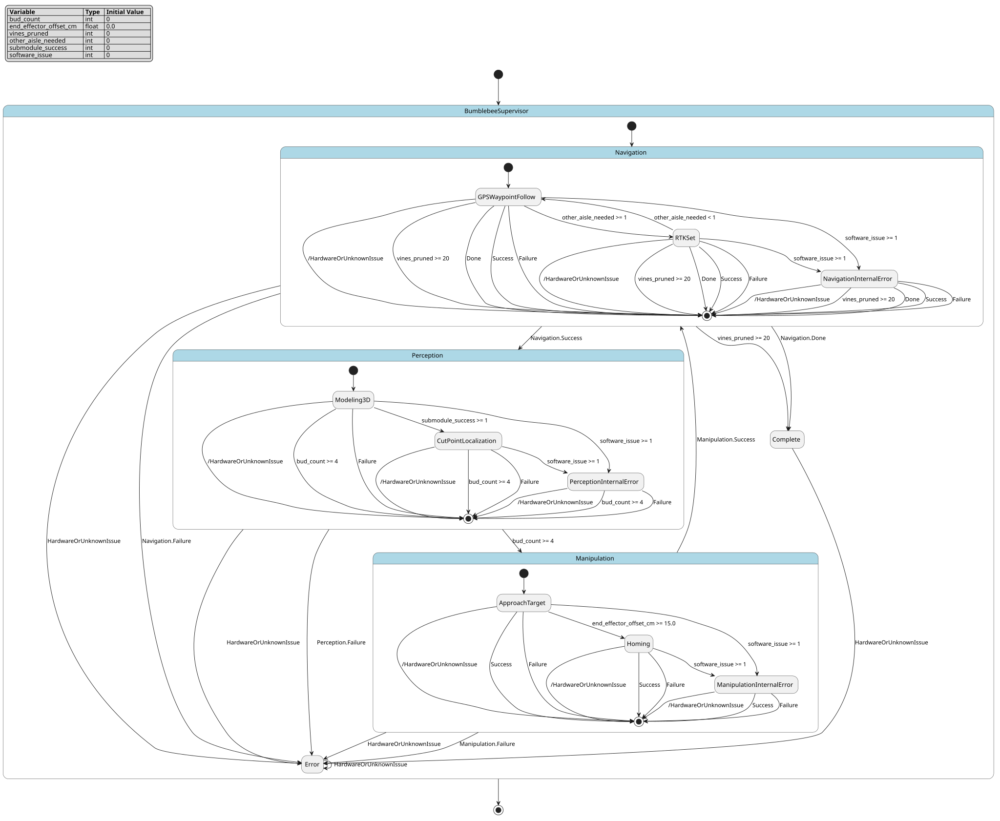

# Case `207` 🏭 — Hierarchical vine-pruning autonomy supervisor

**Bucket**: HSM-layered  |  **Paper**: #708 `bumblebee-autonomous-robotic-vine-pruning`

- [STM.md case section](../../../sources/bumblebee-autonomous-robotic-vine-pruning/STM.md)
- [paper PDF](../../../sources/bumblebee-autonomous-robotic-vine-pruning/paper.pdf)
- [expansion NL JSON (含 provenance)](../expansions/207.json)
- [codex 起草笔记](../ref_stms/codex_drafts/207.notes.md)

## 1. 英文 NL（含 inline [E] 溯源 markers）

> 这是 codex 评审阶段生成的扩充 NL（commit `259e6ea7`），每条 substantive 信息带 `[En]` 标记。完整 provenance 表见 [expansion JSON](../expansions/207.json)。

The Bumblebee vine-pruning robot uses a finite-state high-level supervisor: after START it enters navigation, and the same controller then coordinates perception, manipulation, and a separate error path for autonomous pruning [E1] [E2]. The model is hierarchical because each macro phase owns a sub-module; for example, the navigation sub-module contains GPS Waypoint Follow and an internal error state, while manipulation contains Approach Target/Homing and an internal error state [E3]. In navigation, the vehicle RTK-GPS receiver, wheel encoders, and onboard IMU are fused by an EKF so the ground robot can follow waypoints, enter the other aisle when needed, and stop at each selected vine position [E4] [E5]. Perception scans the vine using a top-bottom stereo camera system on a linear slide, builds a 3D model, detects buds, and localizes cut points [E6] [E7]. The pruning decision uses a simplified spur-pruning rule that retains four buds per cane, so bud count is an explicit numeric constraint for cut-point selection [E8]. During manipulation, the motion planner first positions the cutting end-effector 15cm ahead of the cut point, orients it perpendicular to the branch, inches toward the final pose, and closes then opens the blades to mark a successful cut [E9] [E10] [E11]. Mode changes follow sub-module outcomes such as success, failure, and done, and the predefined sequence repeats until all vines are pruned [E12]. For robustness, each sub-process has an internal error sub-state for software self-diagnosis, while hardware or unknown issues pause all operations for manual intervention [E13]. The integrated platform includes a 7 DoF robot arm, ground robot, cutting end-effector, dual stereo cameras, RTK-GPS, and on-board computers [E14].

## 2. 中文 NL 译文（claude 翻译，保留 [En] markers）

Bumblebee 葡萄藤修剪机器人采用有限状态的高层监督器：在 START 之后进入导航阶段，同一控制器随后协调感知、操作以及一条独立的错误处理路径，以完成自主修剪 [E1] [E2]。该模型呈层次化结构，因为每个宏阶段都拥有自己的子模块；例如，导航子模块包含 GPS 航点跟随和一个内部错误状态，而操作子模块则包含目标接近/归位以及一个内部错误状态 [E3]。在导航过程中，车载 RTK-GPS 接收机、轮式编码器和机载 IMU 通过 EKF 进行融合，使地面机器人能够跟随航点、在需要时驶入另一条作业行，并在每个选定的葡萄藤位置停车 [E4] [E5]。感知模块使用安装在直线滑轨上的上下双目立体相机系统对葡萄藤进行扫描，构建三维模型，检测芽点，并定位切割点 [E6] [E7]。修剪决策采用一种简化的留枝修剪规则，即每条枝条保留四个芽，因此芽的数量成为切割点选择的显式数值约束 [E8]。在操作阶段，运动规划器首先将切割末端执行器定位到切割点前方 15cm 处，使其方向垂直于枝条，逐步逼近最终位姿，然后闭合再张开刀刃以标记一次成功的切割 [E9] [E10] [E11]。模式切换依据各子模块的执行结果（如 success、failure 和 done）进行，并按预定义序列重复，直到所有葡萄藤完成修剪 [E12]。为保证鲁棒性，每个子流程都设有一个内部错误子状态用于软件自诊断，而硬件故障或未知问题则会暂停全部操作以等待人工干预 [E13]。该集成平台包括一台 7 自由度机械臂、地面机器人、切割末端执行器、双立体相机、RTK-GPS 以及车载计算机 [E14]。

## 3. Reference pyfcstm STM (codex 起草，待用户签字)

### 3.1 状态机图（pyfcstm visualize SVG）



PlantUML 源文件：[`../diagrams/207.puml`](../diagrams/207.puml)

### 3.2 pyfcstm DSL 源码

```pyfcstm
def int bud_count = 0;
def float end_effector_offset_cm = 0.0;
def int vines_pruned = 0;
def int other_aisle_needed = 0;
def int submodule_success = 0;
def int software_issue = 0;

state BumblebeeSupervisor {
    !* -> Error :: HardwareOrUnknownIssue;
    !Navigation -> Complete : if [vines_pruned >= 20];
    !Navigation -> Complete :: Done;
    !Navigation -> Perception :: Success;
    !Navigation -> Error :: Failure;
    !Perception -> Manipulation : if [bud_count >= 4];
    !Perception -> Error :: Failure;
    !Manipulation -> Navigation :: Success;
    !Manipulation -> Error :: Failure;

    [*] -> Navigation;

    state Navigation {
        [*] -> GPSWaypointFollow;

        state GPSWaypointFollow {
            during abstract FuseRTKGPSWheelEncodersIMUWithEKF;
            during abstract FollowGPSWaypoints;
        }

        state RTKSet {
            enter abstract StopAtSelectedVinePosition;
            enter { other_aisle_needed = 0; }
        }

        state NavigationInternalError {
            enter abstract SelfDiagnoseNavigationSoftwareIssue;
        }

        GPSWaypointFollow -> RTKSet : if [other_aisle_needed >= 1];
        RTKSet -> GPSWaypointFollow : if [other_aisle_needed < 1];
        GPSWaypointFollow -> NavigationInternalError : if [software_issue >= 1];
        RTKSet -> NavigationInternalError : if [software_issue >= 1];
    }

    state Perception {
        [*] -> Modeling3D;

        state Modeling3D {
            enter abstract MoveTopBottomStereoCamerasOnLinearSlide;
            during abstract AcquireFourteenViewpointImages;
            exit abstract RegisterPointCloudForVineModel;
        }

        state CutPointLocalization {
            enter abstract DetectBudsAndLocalizeCutPoints;
            enter { bud_count = 4; }
            enter { submodule_success = 0; }
        }

        state PerceptionInternalError {
            enter abstract SelfDiagnosePerceptionSoftwareIssue;
        }

        Modeling3D -> CutPointLocalization : if [submodule_success >= 1];
        Modeling3D -> PerceptionInternalError : if [software_issue >= 1];
        CutPointLocalization -> PerceptionInternalError : if [software_issue >= 1];
    }

    state Manipulation {
        [*] -> ApproachTarget;

        state ApproachTarget {
            enter abstract PositionCuttingEndEffectorAheadOfCutPoint;
            enter { end_effector_offset_cm = 15.0; }
            during abstract OrientEndEffectorPerpendicularToBranch;
        }

        state Homing {
            during abstract InchTowardFinalPose;
            exit abstract CloseAndOpenCuttingBlades;
        }

        state ManipulationInternalError {
            enter abstract SelfDiagnoseManipulationSoftwareIssue;
        }

        ApproachTarget -> Homing : if [end_effector_offset_cm >= 15.0];
        ApproachTarget -> ManipulationInternalError : if [software_issue >= 1];
        Homing -> ManipulationInternalError : if [software_issue >= 1];
    }

    state Error {
        enter abstract PauseAllOperationsForManualIntervention;
    }

    state Complete {
        enter abstract AllVinesPruned;
    }

}

```

**codex 自报 C-axis 使用情况**:
- C1: ✓
- C2: ✓
- C3: ✓
- C4: ✓

**codex 自报 scenarios 覆盖情况**:
- 模式数: 11
- guards 数: 7
- fault paths 数: 4
- per-cycle 行为数: 5
- 硬件 effectors 数: 8

## 4. Test scenarios（覆盖 NL 全特性，必须 100% pass）

```json
{
  "scenarios": [
    {
      "name": "default_start_navigation_cycles",
      "description": "覆盖 START 后进入 navigation，并在 GPS waypoint follow 中连续运行 EKF/waypoint 周期行为，对应 [E1] [E4] [E5]。",
      "initial_state": null,
      "initial_vars": {},
      "steps": [
        {
          "before_cycles": 0,
          "events": [],
          "expected_state": "BumblebeeSupervisor.Navigation.GPSWaypointFollow",
          "expected_vars": {
            "bud_count": 0,
            "end_effector_offset_cm": 0.0,
            "vines_pruned": 0,
            "other_aisle_needed": 0,
            "submodule_success": 0,
            "software_issue": 0
          },
          "name": "start_enters_navigation"
        },
        {
          "before_cycles": 3,
          "events": null,
          "expected_state": "BumblebeeSupervisor.Navigation.GPSWaypointFollow",
          "expected_vars": {
            "bud_count": 0,
            "end_effector_offset_cm": 0.0,
            "vines_pruned": 0,
            "other_aisle_needed": 0,
            "submodule_success": 0,
            "software_issue": 0
          },
          "name": "navigation_runs_multiple_cycles"
        }
      ]
    },
    {
      "name": "other_aisle_and_rtk_positioning",
      "description": "覆盖需要进入另一行时 navigation 进入 RTK Set，并停在选中 vine 位置后回到 waypoint follow，对应 [E4] [E5]。",
      "initial_state": "BumblebeeSupervisor.Navigation.GPSWaypointFollow",
      "initial_vars": {
        "bud_count": 0,
        "end_effector_offset_cm": 0.0,
        "vines_pruned": 0,
        "other_aisle_needed": 1,
        "submodule_success": 0,
        "software_issue": 0
      },
      "steps": [
        {
          "before_cycles": 0,
          "events": [],
          "expected_state": "BumblebeeSupervisor.Navigation.RTKSet",
          "expected_vars": {
            "bud_count": 0,
            "end_effector_offset_cm": 0.0,
            "vines_pruned": 0,
            "other_aisle_needed": 0,
            "submodule_success": 0,
            "software_issue": 0
          },
          "name": "other_aisle_enters_rtk_set"
        },
        {
          "before_cycles": 0,
          "events": [],
          "expected_state": "BumblebeeSupervisor.Navigation.GPSWaypointFollow",
          "expected_vars": {
            "bud_count": 0,
            "end_effector_offset_cm": 0.0,
            "vines_pruned": 0,
            "other_aisle_needed": 0,
            "submodule_success": 0,
            "software_issue": 0
          },
          "name": "rtk_set_returns_to_waypoint_follow"
        }
      ]
    },
    {
      "name": "navigation_success_enters_perception",
      "description": "覆盖 navigation sub-module success outcome 推进到 perception macro mode，对应 Figure 13 与 [E12]。",
      "initial_state": "BumblebeeSupervisor.Navigation.GPSWaypointFollow",
      "initial_vars": {
        "bud_count": 0,
        "end_effector_offset_cm": 0.0,
        "vines_pruned": 0,
        "other_aisle_needed": 0,
        "submodule_success": 0,
        "software_issue": 0
      },
      "steps": [
        {
          "before_cycles": 0,
          "events": [
            "BumblebeeSupervisor.Navigation.Success"
          ],
          "expected_state": "BumblebeeSupervisor.Perception.Modeling3D",
          "expected_vars": {
            "bud_count": 0,
            "end_effector_offset_cm": 0.0,
            "vines_pruned": 0,
            "other_aisle_needed": 0,
            "submodule_success": 0,
            "software_issue": 0
          },
          "name": "navigation_success"
        }
      ]
    },
    {
      "name": "perception_four_bud_guard_sequence",
      "description": "覆盖 3D modeling、cut-point localization、retain four buds per cane 后进入 manipulation，对应 [E6] [E7] [E8] [E12]。",
      "initial_state": "BumblebeeSupervisor.Perception.Modeling3D",
      "initial_vars": {
        "bud_count": 0,
        "end_effector_offset_cm": 0.0,
        "vines_pruned": 0,
        "other_aisle_needed": 0,
        "submodule_success": 1,
        "software_issue": 0
      },
      "steps": [
        {
          "before_cycles": 0,
          "events": [],
          "expected_state": "BumblebeeSupervisor.Perception.CutPointLocalization",
          "expected_vars": {
            "bud_count": 4,
            "end_effector_offset_cm": 0.0,
            "vines_pruned": 0,
            "other_aisle_needed": 0,
            "submodule_success": 0,
            "software_issue": 0
          },
          "name": "modeling_success_localizes_cut_points"
        },
        {
          "before_cycles": 0,
          "events": [],
          "expected_state": "BumblebeeSupervisor.Manipulation.ApproachTarget",
          "expected_vars": {
            "bud_count": 4,
            "end_effector_offset_cm": 15.0,
            "vines_pruned": 0,
            "other_aisle_needed": 0,
            "submodule_success": 0,
            "software_issue": 0
          },
          "name": "four_buds_enable_manipulation"
        }
      ]
    },
    {
      "name": "bud_count_below_rule_blocks_cut_selection",
      "description": "覆盖 four buds per cane 数值 guard 的低于阈值边界，对应 [E8]。",
      "initial_state": "BumblebeeSupervisor.Perception.CutPointLocalization",
      "initial_vars": {
        "bud_count": 3,
        "end_effector_offset_cm": 0.0,
        "vines_pruned": 0,
        "other_aisle_needed": 0,
        "submodule_success": 0,
        "software_issue": 0
      },
      "steps": [
        {
          "before_cycles": 0,
          "events": [],
          "expected_state": "BumblebeeSupervisor.Perception.CutPointLocalization",
          "expected_vars": {
            "bud_count": 3,
            "end_effector_offset_cm": 0.0,
            "vines_pruned": 0,
            "other_aisle_needed": 0,
            "submodule_success": 0,
            "software_issue": 0
          },
          "name": "three_buds_do_not_advance"
        }
      ]
    },
    {
      "name": "approach_offset_below_threshold_blocks_homing",
      "description": "覆盖 cutting end-effector 15cm ahead 数值 guard 的低于阈值边界，对应 [E9]。",
      "initial_state": "BumblebeeSupervisor.Manipulation.ApproachTarget",
      "initial_vars": {
        "bud_count": 4,
        "end_effector_offset_cm": 14.0,
        "vines_pruned": 0,
        "other_aisle_needed": 0,
        "submodule_success": 0,
        "software_issue": 0
      },
      "steps": [
        {
          "before_cycles": 0,
          "events": [],
          "expected_state": "BumblebeeSupervisor.Manipulation.ApproachTarget",
          "expected_vars": {
            "bud_count": 4,
            "end_effector_offset_cm": 14.0,
            "vines_pruned": 0,
            "other_aisle_needed": 0,
            "submodule_success": 0,
            "software_issue": 0
          },
          "name": "fourteen_cm_does_not_home"
        }
      ]
    },
    {
      "name": "approach_offset_threshold_and_cut_success",
      "description": "覆盖 15cm approach、homing、垂直姿态、最终逼近和 blade close/open 后 success 回到 navigation，对应 [E9] [E10] [E11] [E12]。",
      "initial_state": "BumblebeeSupervisor.Manipulation.ApproachTarget",
      "initial_vars": {
        "bud_count": 4,
        "end_effector_offset_cm": 15.0,
        "vines_pruned": 2,
        "other_aisle_needed": 0,
        "submodule_success": 0,
        "software_issue": 0
      },
      "steps": [
        {
          "before_cycles": 0,
          "events": [],
          "expected_state": "BumblebeeSupervisor.Manipulation.Homing",
          "expected_vars": {
            "bud_count": 4,
            "end_effector_offset_cm": 15.0,
            "vines_pruned": 2,
            "other_aisle_needed": 0,
            "submodule_success": 0,
            "software_issue": 0
          },
          "name": "fifteen_cm_enters_homing"
        },
        {
          "before_cycles": 0,
          "events": [
            "BumblebeeSupervisor.Manipulation.Success"
          ],
          "expected_state": "BumblebeeSupervisor.Navigation.GPSWaypointFollow",
          "expected_vars": {
            "bud_count": 4,
            "end_effector_offset_cm": 15.0,
            "vines_pruned": 2,
            "other_aisle_needed": 0,
            "submodule_success": 0,
            "software_issue": 0
          },
          "name": "successful_cut_repeats_cycle"
        }
      ]
    },
    {
      "name": "twentieth_vine_guard_completes",
      "description": "覆盖 vines_pruned 达到 20 条 field vines 后自动进入 complete 的数值 guard，对应 STM 摘录 D 与 [E12]。",
      "initial_state": "BumblebeeSupervisor.Navigation.GPSWaypointFollow",
      "initial_vars": {
        "bud_count": 4,
        "end_effector_offset_cm": 15.0,
        "vines_pruned": 20,
        "other_aisle_needed": 0,
        "submodule_success": 0,
        "software_issue": 0
      },
      "steps": [
        {
          "before_cycles": 0,
          "events": [],
          "expected_state": "BumblebeeSupervisor.Complete",
          "expected_vars": {
            "bud_count": 4,
            "end_effector_offset_cm": 15.0,
            "vines_pruned": 20,
            "other_aisle_needed": 0,
            "submodule_success": 0,
            "software_issue": 0
          },
          "name": "twenty_vines_enters_complete"
        }
      ]
    },
    {
      "name": "navigation_done_event_enters_complete",
      "description": "覆盖 Figure 13 navigation sub-module 的 DONE outcome 直接进入 complete，对应 [E12]。",
      "initial_state": "BumblebeeSupervisor.Navigation.GPSWaypointFollow",
      "initial_vars": {
        "bud_count": 4,
        "end_effector_offset_cm": 15.0,
        "vines_pruned": 19,
        "other_aisle_needed": 0,
        "submodule_success": 0,
        "software_issue": 0
      },
      "steps": [
        {
          "before_cycles": 0,
          "events": [
            "BumblebeeSupervisor.Navigation.Done"
          ],
          "expected_state": "BumblebeeSupervisor.Complete",
          "expected_vars": {
            "bud_count": 4,
            "end_effector_offset_cm": 15.0,
            "vines_pruned": 19,
            "other_aisle_needed": 0,
            "submodule_success": 0,
            "software_issue": 0
          },
          "name": "done_event_enters_complete"
        }
      ]
    },
    {
      "name": "navigation_internal_error_failure_path",
      "description": "覆盖 navigation 子过程 internal error self-diagnosis，再由 failure 进入 error/manual intervention，对应 [E3] [E13]。",
      "initial_state": "BumblebeeSupervisor.Navigation.GPSWaypointFollow",
      "initial_vars": {
        "bud_count": 0,
        "end_effector_offset_cm": 0.0,
        "vines_pruned": 0,
        "other_aisle_needed": 0,
        "submodule_success": 0,
        "software_issue": 1
      },
      "steps": [
        {
          "before_cycles": 0,
          "events": [],
          "expected_state": "BumblebeeSupervisor.Navigation.NavigationInternalError",
          "expected_vars": {
            "bud_count": 0,
            "end_effector_offset_cm": 0.0,
            "vines_pruned": 0,
            "other_aisle_needed": 0,
            "submodule_success": 0,
            "software_issue": 1
          },
          "name": "navigation_software_issue"
        },
        {
          "before_cycles": 0,
          "events": [
            "BumblebeeSupervisor.Navigation.Failure"
          ],
          "expected_state": "BumblebeeSupervisor.Error",
          "expected_vars": {
            "bud_count": 0,
            "end_effector_offset_cm": 0.0,
            "vines_pruned": 0,
            "other_aisle_needed": 0,
            "submodule_success": 0,
            "software_issue": 1
          },
          "name": "navigation_failure_enters_error"
        }
      ]
    },
    {
      "name": "perception_internal_error_failure_path",
      "description": "覆盖 perception 子过程 internal error self-diagnosis，再由 failure 进入 error/manual intervention，对应 [E3] [E13]。",
      "initial_state": "BumblebeeSupervisor.Perception.Modeling3D",
      "initial_vars": {
        "bud_count": 0,
        "end_effector_offset_cm": 0.0,
        "vines_pruned": 0,
        "other_aisle_needed": 0,
        "submodule_success": 0,
        "software_issue": 1
      },
      "steps": [
        {
          "before_cycles": 0,
          "events": [],
          "expected_state": "BumblebeeSupervisor.Perception.PerceptionInternalError",
          "expected_vars": {
            "bud_count": 0,
            "end_effector_offset_cm": 0.0,
            "vines_pruned": 0,
            "other_aisle_needed": 0,
            "submodule_success": 0,
            "software_issue": 1
          },
          "name": "perception_software_issue"
        },
        {
          "before_cycles": 0,
          "events": [
            "BumblebeeSupervisor.Perception.Failure"
          ],
          "expected_state": "BumblebeeSupervisor.Error",
          "expected_vars": {
            "bud_count": 0,
            "end_effector_offset_cm": 0.0,
            "vines_pruned": 0,
            "other_aisle_needed": 0,
            "submodule_success": 0,
            "software_issue": 1
          },
          "name": "perception_failure_enters_error"
        }
      ]
    },
    {
      "name": "manipulation_internal_error_failure_path",
      "description": "覆盖 manipulation 子过程 internal error self-diagnosis，再由 failure 进入 error/manual intervention，对应 [E3] [E13]。",
      "initial_state": "BumblebeeSupervisor.Manipulation.Homing",
      "initial_vars": {
        "bud_count": 4,
        "end_effector_offset_cm": 15.0,
        "vines_pruned": 0,
        "other_aisle_needed": 0,
        "submodule_success": 0,
        "software_issue": 1
      },
      "steps": [
        {
          "before_cycles": 0,
          "events": [],
          "expected_state": "BumblebeeSupervisor.Manipulation.ManipulationInternalError",
          "expected_vars": {
            "bud_count": 4,
            "end_effector_offset_cm": 15.0,
            "vines_pruned": 0,
            "other_aisle_needed": 0,
            "submodule_success": 0,
            "software_issue": 1
          },
          "name": "manipulation_software_issue"
        },
        {
          "before_cycles": 0,
          "events": [
            "BumblebeeSupervisor.Manipulation.Failure"
          ],
          "expected_state": "BumblebeeSupervisor.Error",
          "expected_vars": {
            "bud_count": 4,
            "end_effector_offset_cm": 15.0,
            "vines_pruned": 0,
            "other_aisle_needed": 0,
            "submodule_success": 0,
            "software_issue": 1
          },
          "name": "manipulation_failure_enters_error"
        }
      ]
    },
    {
      "name": "global_hardware_unknown_issue_forces_manual_intervention",
      "description": "覆盖 hardware or unknown issues 暂停全部操作并进入 manual intervention error path，对应 [E13] [E14]。",
      "initial_state": "BumblebeeSupervisor.Perception.Modeling3D",
      "initial_vars": {
        "bud_count": 0,
        "end_effector_offset_cm": 0.0,
        "vines_pruned": 0,
        "other_aisle_needed": 0,
        "submodule_success": 0,
        "software_issue": 0
      },
      "steps": [
        {
          "before_cycles": 0,
          "events": [
            "BumblebeeSupervisor.HardwareOrUnknownIssue"
          ],
          "expected_state": "BumblebeeSupervisor.Error",
          "expected_vars": {
            "bud_count": 0,
            "end_effector_offset_cm": 0.0,
            "vines_pruned": 0,
            "other_aisle_needed": 0,
            "submodule_success": 0,
            "software_issue": 0
          },
          "name": "global_issue_enters_error"
        }
      ]
    }
  ]
}
```

## 5. pyfcstm 验证日志（parse + sem + sim + scenarios 全跑）

```
PARSE_OK
SEM_OK (leaf_states=?)
SIM_OK (current_state=GPSWaypointFollow)
SCENARIOS_LOADED: 13
  ✓ [default_start_navigation_cycles]
  ✓ [other_aisle_and_rtk_positioning]
  ✓ [navigation_success_enters_perception]
  ✓ [perception_four_bud_guard_sequence]
  ✓ [bud_count_below_rule_blocks_cut_selection]
  ✓ [approach_offset_below_threshold_blocks_homing]
  ✓ [approach_offset_threshold_and_cut_success]
  ✓ [twentieth_vine_guard_completes]
  ✓ [navigation_done_event_enters_complete]
  ✓ [navigation_internal_error_failure_path]
  ✓ [perception_internal_error_failure_path]
  ✓ [manipulation_internal_error_failure_path]
  ✓ [global_hardware_unknown_issue_forces_manual_intervention]

SCENARIOS_SUMMARY: pass=13 fail=0 error=0 total=13

LINT_RUNNING...
LINT_SUMMARY: warnings=0 by_code={}
ALL_OK
```

## 6. Codex 起草笔记

# Codex Draft Notes — Case 207

## 1. 设计选择

- mode 列表：
  - `Navigation` / `Perception` / `Manipulation` / `Error`：来自 STM §1 摘录 B/C 与 expansion [E2]。
  - `Navigation.GPSWaypointFollow` / `Navigation.RTKSet` / `Navigation.NavigationInternalError`：来自 STM §1 摘录 B 与 [E3] [E4] [E5]。
  - `Perception.Modeling3D` / `Perception.CutPointLocalization` / `Perception.PerceptionInternalError`：来自 STM §1 摘录 B 与 [E3] [E6] [E7]。
  - `Manipulation.ApproachTarget` / `Manipulation.Homing` / `Manipulation.ManipulationInternalError`：来自 STM §1 摘录 B 与 [E3] [E9] [E10] [E11]。
  - `Complete`：来自 Figure 13 的 `COMPLETE` 与 “until all vines were pruned” [E12]。
- event 列表：
  - `Success` / `Failure` / `Done`：来自 Figure 13 与 [E12] 的 sub-module outcomes。
  - `HardwareOrUnknownIssue`：来自 [E13] “hardware or unknown issues pause all operations for manual intervention”。
- variable 列表：
  - `int bud_count = 0`：用于 `bud_count >= 4`，阈值来自 [E8] “retain 4 buds per cane”。
  - `float end_effector_offset_cm = 0.0`：用于 `end_effector_offset_cm >= 15.0`，阈值来自 [E9] “15cm ahead of that cut-point”。
  - `int vines_pruned = 0`：用于 `vines_pruned >= 20`，20 条 field vines 来自 STM 摘录 D / paper_content.txt 行 1020-1024。
  - `int other_aisle_needed = 0`：0/1 guard flag，对应 [E5] “enter the aisle on the other side”。
  - `int submodule_success = 0`：0/1 guard flag，对应 [E12] 的 sub-module success outcome。
  - `int software_issue = 0`：0/1 guard flag，对应 [E13] 的 software-level self-diagnosis issue；使用 `int` 是因为当前 pyfcstm grammar 只接受 `int` / `float` def。
- transition 设计：
  - `[*] -> Navigation`：对应 [E1] START 后进入 navigation。
  - `!Navigation -> Perception :: Success`、`!Perception -> Manipulation : if [bud_count >= 4]`、`!Manipulation -> Navigation :: Success`：对应 Figure 13 / [E12] 的预定义循环。
  - `!Navigation -> Complete :: Done` 与 `!Navigation -> Complete : if [vines_pruned >= 20]`：对应 Figure 13 `DONE` 和 20 vines field result。
  - `!* -> Error :: HardwareOrUnknownIssue`：对应 [E13] 的硬件或未知问题全局暂停路径。
  - 各 macro 内 `software_issue >= 1` 进入 internal error，再由 macro `Failure` forced transition 进入 `Error`：对应 [E13]。

## 2. C-axis grounding 使用情况

- **C1 (周期执行)**: 用 — `GPSWaypointFollow`、`Modeling3D`、`ApproachTarget`、`Homing` 使用 `during abstract` 表达持续导航、扫描、姿态保持和末端逼近；未加入无来源的计时/累加变量。
- **C2 (数值守卫)**: 用 — `bud_count >= 4`、`end_effector_offset_cm >= 15.0`、`vines_pruned >= 20` 分别来自 [E8]、[E9]、STM 摘录 D；原文不支持复合多变量算术 guard，因此未编造。
- **C3 (forced fault)**: 用 — `!* -> Error :: HardwareOrUnknownIssue` 表达硬件或未知问题暂停全部操作并进入 manual intervention；没有加入 emergency-stop 或恢复路径。
- **C4 (硬件)**: 用 — abstract actions 覆盖 RTK-GPS/wheel encoders/IMU/EKF、GPS waypoints、top-bottom stereo cameras/linear slide、7 DoF arm/cutting end-effector/blades、manual intervention。

## 3. 与 NL 的对应关系

- expansion NL [E1]: “after START it enters navigation” → DSL `[*] -> Navigation`。
- expansion NL [E2]: “navigation, perception, manipulation, and a separate error path” → DSL root states `Navigation` / `Perception` / `Manipulation` / `Error`。
- expansion NL [E3]: “each macro phase owns a sub-module” → nested states under `Navigation` / `Perception` / `Manipulation` with `InternalError` leaves。
- expansion NL [E4]: “RTK-GPS receiver, wheel encoders, and onboard IMU are fused by an EKF” → `during abstract FuseRTKGPSWheelEncodersIMUWithEKF`。
- expansion NL [E5]: “follow waypoints, enter the other aisle, and stop at vine positions” → `FollowGPSWaypoints` / `other_aisle_needed` / `StopAtSelectedVinePosition`。
- expansion NL [E6]: “top-bottom stereo camera system on a linear slide” → `MoveTopBottomStereoCamerasOnLinearSlide`。
- expansion NL [E7]: “3D modeling, bud detection, and cut-point localization” → `Modeling3D` / `CutPointLocalization` / `DetectBudsAndLocalizeCutPoints`。
- expansion NL [E8]: “retains four buds per cane” → guard `bud_count >= 4`。
- expansion NL [E9]: “15cm ahead of the cut point” → `end_effector_offset_cm >= 15.0` and `PositionCuttingEndEffectorAheadOfCutPoint`。
- expansion NL [E10]: “orients it perpendicular to the branch” → `OrientEndEffectorPerpendicularToBranch`。
- expansion NL [E11]: “closes then opens the blades” → `exit abstract CloseAndOpenCuttingBlades`。
- expansion NL [E12]: “success, failure, and done” / “repeats until all vines are pruned” → forced outcome transitions `Success` / `Failure` / `Done` and `vines_pruned >= 20`。
- expansion NL [E13]: “internal error sub-state” / “hardware or unknown issues pause all operations” → `software_issue >= 1` internal errors and `HardwareOrUnknownIssue` forced transition。
- expansion NL [E14]: “7 DoF robot arm, ground robot, cutting end-effector, dual stereo cameras, RTK-GPS, on-board computers” → C4 abstract action names。

## 4. 迭代历史

- iter 1: 写出层次化初稿 → smoke verify: PARSE_OK / SEM_OK / SIM_OK。
- iter 2: scenarios 失败：parent-level event 简名无法从 leaf state 解析，且进入 manipulation 的 15cm 变量未被设置 → 改用完整 event path，并把 15cm 语义放回 transition/entry 侧检查。
- iter 3: scenarios 仍失败：普通 composite source transition 不会从 active descendant 自动触发 → 改为 `!Navigation` / `!Perception` / `!Manipulation` forced outcome transitions。
- iter 4: scenarios 全 pass 但 lint 报 nested transition 自动事件 `unused_event` → 将内部子模块事件改为 guard flags，避免 lint 误报并保留可测语义。
- iter 5: guard flags 初用 `bool` 导致 PARSE_FAIL；确认当前 grammar 只支持 `int` / `float` def 后改为 0/1 `int` flags → scenarios 13/13 pass，`LINT_SUMMARY: warnings=0 by_code={}`，ALL_OK。

## 5. 与 STM.md 表述的偏差（如有）

- `other_aisle_needed`、`submodule_success`、`software_issue` 是为了让 scenarios 可热启动并覆盖内部 guard 的 0/1 抽象输入；原文只给出语义，不给出具体变量名。
- `vines_pruned` 用作外部进度 guard，不在 `Manipulation.Success` 中自动递增；原文说明循环直到全部 vines 被处理和 field trial 的 20 vines，但未说明 FSM 内部维护计数器。
- 外层 success/failure/done 使用 forced transitions 是 pyfcstm runtime 的编码选择，用来表达 Figure 13 “sub-module outcome from any active sub-state”的 HSM 语义。

## 7. Claude 交叉评审

**Verdict**: APPROVE

| 维度 | 打分 | evidence |
|---|---|---|
| 语义正确性 | 🟡 | 4 个 macro state + 各 sub-module 与 §1 摘录 B 一致，Success/Failure/Done forced 切换符合 Figure 13；但 vines_pruned>=20 把 field trial 的 20 棵藤当成 FSM 完成条件，与原文 [E12] '直到所有藤被修剪' 的开放循环略有偏差。 |
| NL 忠实性 | 🟡 | other_aisle_needed / submodule_success / software_issue 三个 0/1 flag 是 codex 为 scenario 热启动新造（笔记已声明），可接受；但 enter {bud_count=4} 与 enter {end_effector_offset_cm=15.0} 把变量在 entry 直接设为阈值，等价于把数值 guard 退化… |
| C-axis grounding 恰当性 | 🟡 | C1 在 GPS/3D modeling/Approach/Homing 用 during abstract 恰当；C3 的 !* -> Error :: HardwareOrUnknownIssue 与 [E13] 横切语义一致；C4 abstract 命名贴合 [E4-E11][E14]；C2 三个数值 guard 中只有 bud_count、offset 来源稳定，vines_prun… |
| scenarios NL 覆盖度 | 🟢 | 13 个 scenarios 覆盖 START→Navigation、RTK 折返、success 链、bud_count/offset 上下边界、Done、20-vine 完成、3 个 internal error→Failure、HardwareOrUnknownIssue 全局 fault；唯一较弱的是 per-cycle 仅在 GPSWaypointFollow 验证多周期。 |

## 8. 用户审阅区（待签字）

**审阅状态**：⬜ 待审 / ⬜ approve / ⬜ revise / ⬜ rewrite

**审阅笔记**（用户填写）：

- 

**修订要求**（用户填写）：

- 

**签字**：（用户填写日期 + 姓名）

---

**最终 ref 落盘路径（待签字后）**: `audited/207.fcstm` + `audited/207.audit.md`