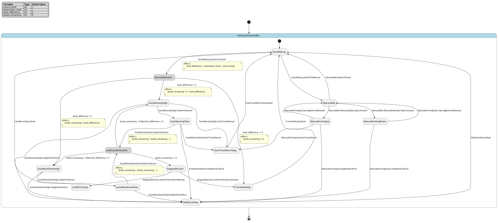

# Case `234` 🅿️ — Multi-level parking lift auto/manual positioning controller

**Bucket**: EFSM-interlock  |  **Paper**: #775 `lift-control-automatic-car-parking-using-plc`

- [STM.md case section](../../../sources/lift-control-automatic-car-parking-using-plc/STM.md)
- [paper PDF](../../../sources/lift-control-automatic-car-parking-using-plc/paper.pdf)
- [expansion NL JSON (含 provenance)](../expansions/234.json)
- [codex 起草笔记](../ref_stms/codex_drafts/234.notes.md)

## 1. 英文 NL（含 inline [E] 溯源 markers）

> 这是 codex 评审阶段生成的扩充 NL（commit `259e6ea7`），每条 substantive 信息带 `[En]` 标记。完整 provenance 表见 [expansion JSON](../expansions/234.json)。

The controller belongs to a fully automatic level car-parking lift system used to take cars in and out and park them [E1], and the described installation has two lifts, three level-transfer mechanisms, one Beckhoff PLC, and VFD speed control for acceleration, deceleration, and stopping accuracy [E2][E3]. Dedicated sensing covers pallet position, lift-level positioning, safety interlocks, fork sensing for speed reduction, and slat-position confirmation for checking correct position [E4][E5][E6]. The operational sequence is divided into manual and auto modes: manual mode is inching for maintenance through spring-action up/down commands from the HMI or teach pendant at slow speed [E7][E8][E9]. Auto mode starts from a waiting-for-command phase; the command states direction and number of levels, and the lift then moves in the commanded direction [E10][E11]. The movement decision uses the signed difference destination level minus source level: the formula is shown as destination level no minus source level no, a negative result selects upward travel and initializes the level counter to one, while a positive example gives a down command with two levels to move [E12][E13][E14]. During automatic travel, fork-sensor input reduces VFD speed, and the stop fork sensor stops the lift [E15]. After stopping, level-position and level-confirmation sensors are checked; if a level difference remains, the confirmation sensor is absent and an error is given [E16][E17]. Across both upward and downward movements, Height/AntiLift sensors cut and stop operation when pallet engagement is improper, while over-travel sensors alarm when the lift goes above safe position limits [E18][E19]. The PLC-to-VFD interface exposes Forward, Backward, slow-speed, high-speed, and reset commands, and the PLC receives Run and Fault status feedback from the VFD [E20][E21].

## 2. 中文 NL 译文（claude 翻译，保留 [En] markers）

该控制器属于一套用于车辆出入与停放的全自动平层式立体停车升降系统 [E1]，所描述的安装包含两台升降机、三套平层转运机构、一台 Beckhoff PLC，以及用于加速、减速与停车精度控制的 VFD 变频调速 [E2][E3]；专用传感覆盖托盘位置、升降平层定位、安全联锁、用于减速的拨叉传感以及用于确认正确位置的板条位置确认 [E4][E5][E6]；运行序列划分为手动与自动两种模式：手动模式用于维护时的点动，通过 HMI 或示教器上的弹簧自复位上/下命令以慢速进行 [E7][E8][E9]；自动模式从等待命令阶段开始，命令给出方向与层数，随后升降机按指令方向运动 [E10][E11]；运动决策使用带符号的差值 目标层减去源层：公式表示为 目标层号 减 源层号，结果为负则选择向上运行并将层计数器初始化为一，而一个为正的示例给出带两层移动量的向下命令 [E12][E13][E14]；自动运行过程中，拨叉传感器输入会降低 VFD 速度，停止拨叉传感器则使升降机停车 [E15]；停车后检查平层位置与平层确认传感器，如仍存在层差，则确认传感器缺失并报错 [E16][E17]；在向上和向下两类运动中，当托盘啮合不正常时 Height/AntiLift 传感器切断并停止运行，而当升降机超过安全位置限值时超程传感器报警 [E18][E19]；PLC 至 VFD 接口对外暴露正转、反转、慢速、高速与复位命令，PLC 则从 VFD 接收 Run 与 Fault 状态反馈 [E20][E21]。

## 3. Reference pyfcstm STM (codex 起草，待用户签字)

### 3.1 状态机图（pyfcstm visualize SVG）



PlantUML 源文件：[`../diagrams/234.puml`](../diagrams/234.puml)

### 3.2 pyfcstm DSL 源码

```pyfcstm
def int source_level = 1;
def int destination_level = 1;
def int level_difference = 0;
def int levels_remaining = 0;

state ParkingLiftController {
    [*] -> AutoWaiting;

    state AutoWaiting {
        event AutoCommand;
        event SwitchToManual;
        enter abstract WaitForAutoDirectionAndLevelCommand;
        enter abstract CheckPalletPositionOnLift;
    }

    pseudo state DirectionDecision;
    pseudo state LevelCounterDecision;

    state ManualIdle {
        event ManualUpSpringCommand;
        event ManualDownSpringCommand;
        event SwitchToAuto;
        enter abstract ManualMaintenanceReadyFromHmiOrTeachPendant;
    }

    state ManualInchingUp {
        event SpringButtonReleased;
        event HeightAntiLiftCut;
        event OverTravelSensor;
        during abstract CommandVfdForwardSlowSpeed;
    }

    state ManualInchingDown {
        event SpringButtonReleased;
        event HeightAntiLiftCut;
        during abstract CommandVfdBackwardSlowSpeed;
    }

    state AutoMoveUpHigh {
        event SlowForkSensor;
        event HeightAntiLiftCut;
        event OverTravelSensor;
        during abstract CommandVfdForwardHighSpeed;
        during abstract ReadVfdRunAndFaultStatus;
    }

    state AutoMoveUpSlow {
        event StopForkSensor;
        event HeightAntiLiftCut;
        event OverTravelSensor;
        during abstract CommandVfdForwardSlowSpeed;
        during abstract ReadVfdRunAndFaultStatus;
    }

    state AutoMoveDownHigh {
        event SlowForkSensor;
        event HeightAntiLiftCut;
        during abstract CommandVfdBackwardHighSpeed;
        during abstract ReadVfdRunAndFaultStatus;
    }

    state AutoMoveDownSlow {
        event StopForkSensor;
        event HeightAntiLiftCut;
        during abstract CommandVfdBackwardSlowSpeed;
        during abstract ReadVfdRunAndFaultStatus;
    }

    state StoppedAtLevel {
        event LevelConfirmationSensed;
        event LevelConfirmationMissing;
        enter abstract StopVfd;
        enter abstract CheckLevelPositionAndSlatConfirmationSensors;
    }

    state TransferReady {
        event Reset;
        enter abstract ConfirmPalletTransferSafe;
    }

    state LevelErrorStop {
        event Reset;
        enter abstract GiveLevelDifferenceError;
        enter abstract StopVfd;
    }

    state SafetyCutStop {
        event Reset;
        enter abstract CutAndStopLiftByHeightAntiLift;
    }

    state OverTravelAlarmStop {
        event Reset;
        enter abstract AlarmOverTravelSafePositionLimit;
        enter abstract StopVfd;
    }

    AutoWaiting -> DirectionDecision :: AutoCommand effect {
        level_difference = destination_level - source_level;
    };
    AutoWaiting -> ManualIdle :: SwitchToManual;

    DirectionDecision -> AutoMoveUpHigh : if [level_difference < 0] effect {
        levels_remaining = 0 - level_difference;
    };
    DirectionDecision -> AutoMoveDownHigh : if [level_difference > 0] effect {
        levels_remaining = level_difference;
    };
    DirectionDecision -> TransferReady : if [level_difference == 0] effect {
        levels_remaining = 0;
    };

    ManualIdle -> ManualInchingUp :: ManualUpSpringCommand;
    ManualIdle -> ManualInchingDown :: ManualDownSpringCommand;
    ManualIdle -> AutoWaiting :: SwitchToAuto;
    ManualInchingUp -> ManualIdle :: SpringButtonReleased;
    ManualInchingDown -> ManualIdle :: SpringButtonReleased;
    ManualInchingUp -> SafetyCutStop :: HeightAntiLiftCut;
    ManualInchingDown -> SafetyCutStop :: HeightAntiLiftCut;
    ManualInchingUp -> OverTravelAlarmStop :: OverTravelSensor;

    AutoMoveUpHigh -> AutoMoveUpSlow :: SlowForkSensor;
    AutoMoveDownHigh -> AutoMoveDownSlow :: SlowForkSensor;
    AutoMoveUpSlow -> LevelCounterDecision :: StopForkSensor effect {
        levels_remaining = levels_remaining - 1;
    };
    AutoMoveDownSlow -> LevelCounterDecision :: StopForkSensor effect {
        levels_remaining = levels_remaining - 1;
    };

    LevelCounterDecision -> AutoMoveUpHigh : if [levels_remaining > 0 && level_difference < 0];
    LevelCounterDecision -> AutoMoveDownHigh : if [levels_remaining > 0 && level_difference > 0];
    LevelCounterDecision -> StoppedAtLevel : if [levels_remaining <= 0];

    AutoMoveUpHigh -> SafetyCutStop :: HeightAntiLiftCut;
    AutoMoveUpSlow -> SafetyCutStop :: HeightAntiLiftCut;
    AutoMoveDownHigh -> SafetyCutStop :: HeightAntiLiftCut;
    AutoMoveDownSlow -> SafetyCutStop :: HeightAntiLiftCut;
    AutoMoveUpHigh -> OverTravelAlarmStop :: OverTravelSensor;
    AutoMoveUpSlow -> OverTravelAlarmStop :: OverTravelSensor;

    StoppedAtLevel -> TransferReady :: LevelConfirmationSensed;
    StoppedAtLevel -> LevelErrorStop :: LevelConfirmationMissing;

    TransferReady -> AutoWaiting :: Reset;
    LevelErrorStop -> AutoWaiting :: Reset;
    SafetyCutStop -> AutoWaiting :: Reset;
    OverTravelAlarmStop -> AutoWaiting :: Reset;
}

```

**codex 自报 C-axis 使用情况**:
- C1: ✓
- C2: ✓
- C3: ✗
- C4: ✓

**codex 自报 scenarios 覆盖情况**:
- 模式数: 13
- guards 数: 6
- fault paths 数: 3
- per-cycle 行为数: 2
- 硬件 effectors 数: 14

## 4. Test scenarios（覆盖 NL 全特性，必须 100% pass）

```json
{
  "scenarios": [
    {
      "name": "manual_inching_spring_commands",
      "description": "覆盖 [E7][E8][E9]：从自动等待切到手动维护，HMI/teach pendant spring-action 上下点动均以慢速保持，释放按钮返回手动空闲。",
      "initial_state": null,
      "initial_vars": {},
      "steps": [
        {
          "before_cycles": 0,
          "events": [],
          "expected_state": "ParkingLiftController.AutoWaiting",
          "expected_vars": {
            "source_level": 1,
            "destination_level": 1,
            "level_difference": 0,
            "levels_remaining": 0
          },
          "name": "default_auto_waiting"
        },
        {
          "before_cycles": 0,
          "events": [
            "SwitchToManual"
          ],
          "expected_state": "ParkingLiftController.ManualIdle",
          "expected_vars": {
            "source_level": 1,
            "destination_level": 1,
            "level_difference": 0,
            "levels_remaining": 0
          },
          "name": "switch_to_manual"
        },
        {
          "before_cycles": 0,
          "events": [
            "ManualUpSpringCommand"
          ],
          "expected_state": "ParkingLiftController.ManualInchingUp",
          "expected_vars": {
            "source_level": 1,
            "destination_level": 1,
            "level_difference": 0,
            "levels_remaining": 0
          },
          "name": "manual_up_inching"
        },
        {
          "before_cycles": 3,
          "events": null,
          "expected_state": "ParkingLiftController.ManualInchingUp",
          "expected_vars": {
            "source_level": 1,
            "destination_level": 1,
            "level_difference": 0,
            "levels_remaining": 0
          },
          "name": "manual_up_slow_held_for_three_cycles"
        },
        {
          "before_cycles": 0,
          "events": [
            "SpringButtonReleased"
          ],
          "expected_state": "ParkingLiftController.ManualIdle",
          "expected_vars": {
            "source_level": 1,
            "destination_level": 1,
            "level_difference": 0,
            "levels_remaining": 0
          },
          "name": "release_manual_up"
        },
        {
          "before_cycles": 0,
          "events": [
            "ManualDownSpringCommand"
          ],
          "expected_state": "ParkingLiftController.ManualInchingDown",
          "expected_vars": {
            "source_level": 1,
            "destination_level": 1,
            "level_difference": 0,
            "levels_remaining": 0
          },
          "name": "manual_down_inching"
        },
        {
          "before_cycles": 0,
          "events": [
            "SpringButtonReleased"
          ],
          "expected_state": "ParkingLiftController.ManualIdle",
          "expected_vars": {
            "source_level": 1,
            "destination_level": 1,
            "level_difference": 0,
            "levels_remaining": 0
          },
          "name": "release_manual_down"
        },
        {
          "before_cycles": 0,
          "events": [
            "SwitchToAuto"
          ],
          "expected_state": "ParkingLiftController.AutoWaiting",
          "expected_vars": {
            "source_level": 1,
            "destination_level": 1,
            "level_difference": 0,
            "levels_remaining": 0
          },
          "name": "return_to_auto_waiting"
        }
      ]
    },
    {
      "name": "auto_up_one_level_nominal",
      "description": "覆盖 [E10]-[E16][E20][E21]：自动命令用 destination-source=-1 选择上行，counter=1，高速运行、fork 降速、stop fork 停止并确认到位。",
      "initial_state": null,
      "initial_vars": {
        "source_level": 2,
        "destination_level": 1,
        "level_difference": 0,
        "levels_remaining": 0
      },
      "steps": [
        {
          "before_cycles": 0,
          "events": [],
          "expected_state": "ParkingLiftController.AutoWaiting",
          "expected_vars": {
            "source_level": 2,
            "destination_level": 1,
            "level_difference": 0,
            "levels_remaining": 0
          },
          "name": "auto_waiting_with_up_command_values"
        },
        {
          "before_cycles": 0,
          "events": [
            "AutoCommand"
          ],
          "expected_state": "ParkingLiftController.AutoMoveUpHigh",
          "expected_vars": {
            "source_level": 2,
            "destination_level": 1,
            "level_difference": -1,
            "levels_remaining": 1
          },
          "name": "negative_difference_selects_up"
        },
        {
          "before_cycles": 3,
          "events": null,
          "expected_state": "ParkingLiftController.AutoMoveUpHigh",
          "expected_vars": {
            "source_level": 2,
            "destination_level": 1,
            "level_difference": -1,
            "levels_remaining": 1
          },
          "name": "up_high_speed_persists_for_three_cycles"
        },
        {
          "before_cycles": 0,
          "events": [
            "SlowForkSensor"
          ],
          "expected_state": "ParkingLiftController.AutoMoveUpSlow",
          "expected_vars": {
            "source_level": 2,
            "destination_level": 1,
            "level_difference": -1,
            "levels_remaining": 1
          },
          "name": "fork_sensor_reduces_speed"
        },
        {
          "before_cycles": 0,
          "events": [
            "StopForkSensor"
          ],
          "expected_state": "ParkingLiftController.StoppedAtLevel",
          "expected_vars": {
            "source_level": 2,
            "destination_level": 1,
            "level_difference": -1,
            "levels_remaining": 0
          },
          "name": "stop_sensor_stops_at_target"
        },
        {
          "before_cycles": 0,
          "events": [
            "LevelConfirmationSensed"
          ],
          "expected_state": "ParkingLiftController.TransferReady",
          "expected_vars": {
            "source_level": 2,
            "destination_level": 1,
            "level_difference": -1,
            "levels_remaining": 0
          },
          "name": "level_confirmation_allows_transfer"
        },
        {
          "before_cycles": 0,
          "events": [
            "Reset"
          ],
          "expected_state": "ParkingLiftController.AutoWaiting",
          "expected_vars": {
            "source_level": 2,
            "destination_level": 1,
            "level_difference": -1,
            "levels_remaining": 0
          },
          "name": "vfd_reset_returns_to_waiting"
        }
      ]
    },
    {
      "name": "auto_down_two_levels_counter",
      "description": "覆盖 [E12][E14][E15]：destination-source=2 选择下行且 counter=2，第一次 stop fork 后还需继续移动，第二次 stop fork 后才停层检查。",
      "initial_state": null,
      "initial_vars": {
        "source_level": 1,
        "destination_level": 3,
        "level_difference": 0,
        "levels_remaining": 0
      },
      "steps": [
        {
          "before_cycles": 0,
          "events": [],
          "expected_state": "ParkingLiftController.AutoWaiting",
          "expected_vars": {
            "source_level": 1,
            "destination_level": 3,
            "level_difference": 0,
            "levels_remaining": 0
          },
          "name": "auto_waiting_with_down_command_values"
        },
        {
          "before_cycles": 0,
          "events": [
            "AutoCommand"
          ],
          "expected_state": "ParkingLiftController.AutoMoveDownHigh",
          "expected_vars": {
            "source_level": 1,
            "destination_level": 3,
            "level_difference": 2,
            "levels_remaining": 2
          },
          "name": "positive_difference_selects_down"
        },
        {
          "before_cycles": 0,
          "events": [
            "SlowForkSensor"
          ],
          "expected_state": "ParkingLiftController.AutoMoveDownSlow",
          "expected_vars": {
            "source_level": 1,
            "destination_level": 3,
            "level_difference": 2,
            "levels_remaining": 2
          },
          "name": "first_down_fork_reduces_speed"
        },
        {
          "before_cycles": 0,
          "events": [
            "StopForkSensor"
          ],
          "expected_state": "ParkingLiftController.AutoMoveDownHigh",
          "expected_vars": {
            "source_level": 1,
            "destination_level": 3,
            "level_difference": 2,
            "levels_remaining": 1
          },
          "name": "first_stop_decrements_counter_and_continues"
        },
        {
          "before_cycles": 0,
          "events": [
            "SlowForkSensor"
          ],
          "expected_state": "ParkingLiftController.AutoMoveDownSlow",
          "expected_vars": {
            "source_level": 1,
            "destination_level": 3,
            "level_difference": 2,
            "levels_remaining": 1
          },
          "name": "second_down_fork_reduces_speed"
        },
        {
          "before_cycles": 0,
          "events": [
            "StopForkSensor"
          ],
          "expected_state": "ParkingLiftController.StoppedAtLevel",
          "expected_vars": {
            "source_level": 1,
            "destination_level": 3,
            "level_difference": 2,
            "levels_remaining": 0
          },
          "name": "second_stop_reaches_target"
        },
        {
          "before_cycles": 0,
          "events": [
            "LevelConfirmationSensed"
          ],
          "expected_state": "ParkingLiftController.TransferReady",
          "expected_vars": {
            "source_level": 1,
            "destination_level": 3,
            "level_difference": 2,
            "levels_remaining": 0
          },
          "name": "down_confirmation_allows_transfer"
        }
      ]
    },
    {
      "name": "auto_zero_difference_boundary",
      "description": "覆盖 [E12]-[E14] 的数值 guard 边界：destination-source=0 时不进入上行或下行，而是直接停在可转运确认态。",
      "initial_state": null,
      "initial_vars": {
        "source_level": 2,
        "destination_level": 2,
        "level_difference": 0,
        "levels_remaining": 0
      },
      "steps": [
        {
          "before_cycles": 0,
          "events": [],
          "expected_state": "ParkingLiftController.AutoWaiting",
          "expected_vars": {
            "source_level": 2,
            "destination_level": 2,
            "level_difference": 0,
            "levels_remaining": 0
          },
          "name": "auto_waiting_zero_difference_values"
        },
        {
          "before_cycles": 0,
          "events": [
            "AutoCommand"
          ],
          "expected_state": "ParkingLiftController.TransferReady",
          "expected_vars": {
            "source_level": 2,
            "destination_level": 2,
            "level_difference": 0,
            "levels_remaining": 0
          },
          "name": "zero_difference_goes_ready"
        },
        {
          "before_cycles": 0,
          "events": [
            "Reset"
          ],
          "expected_state": "ParkingLiftController.AutoWaiting",
          "expected_vars": {
            "source_level": 2,
            "destination_level": 2,
            "level_difference": 0,
            "levels_remaining": 0
          },
          "name": "reset_zero_difference_ready"
        }
      ]
    },
    {
      "name": "level_confirmation_missing_error",
      "description": "覆盖 [E16][E17]：自动停止后若 level confirmation sensor 未 sensed，则进入 error stop 而不是 transfer ready。",
      "initial_state": null,
      "initial_vars": {
        "source_level": 2,
        "destination_level": 1,
        "level_difference": 0,
        "levels_remaining": 0
      },
      "steps": [
        {
          "before_cycles": 0,
          "events": [],
          "expected_state": "ParkingLiftController.AutoWaiting",
          "expected_vars": {
            "source_level": 2,
            "destination_level": 1,
            "level_difference": 0,
            "levels_remaining": 0
          },
          "name": "auto_waiting_before_error_path"
        },
        {
          "before_cycles": 0,
          "events": [
            "AutoCommand"
          ],
          "expected_state": "ParkingLiftController.AutoMoveUpHigh",
          "expected_vars": {
            "source_level": 2,
            "destination_level": 1,
            "level_difference": -1,
            "levels_remaining": 1
          },
          "name": "begin_up_for_error_path"
        },
        {
          "before_cycles": 0,
          "events": [
            "SlowForkSensor"
          ],
          "expected_state": "ParkingLiftController.AutoMoveUpSlow",
          "expected_vars": {
            "source_level": 2,
            "destination_level": 1,
            "level_difference": -1,
            "levels_remaining": 1
          },
          "name": "slow_before_error_stop"
        },
        {
          "before_cycles": 0,
          "events": [
            "StopForkSensor"
          ],
          "expected_state": "ParkingLiftController.StoppedAtLevel",
          "expected_vars": {
            "source_level": 2,
            "destination_level": 1,
            "level_difference": -1,
            "levels_remaining": 0
          },
          "name": "stopped_before_confirmation_error"
        },
        {
          "before_cycles": 0,
          "events": [
            "LevelConfirmationMissing"
          ],
          "expected_state": "ParkingLiftController.LevelErrorStop",
          "expected_vars": {
            "source_level": 2,
            "destination_level": 1,
            "level_difference": -1,
            "levels_remaining": 0
          },
          "name": "missing_confirmation_enters_error"
        },
        {
          "before_cycles": 0,
          "events": [
            "Reset"
          ],
          "expected_state": "ParkingLiftController.AutoWaiting",
          "expected_vars": {
            "source_level": 2,
            "destination_level": 1,
            "level_difference": -1,
            "levels_remaining": 0
          },
          "name": "reset_from_level_error"
        }
      ]
    },
    {
      "name": "height_antilift_cut_up_and_down",
      "description": "覆盖 [E18]：Height/AntiLift 在上行与下行 movement 中均切断并停止 lift operation。",
      "initial_state": null,
      "initial_vars": {
        "source_level": 1,
        "destination_level": 3,
        "level_difference": 0,
        "levels_remaining": 0
      },
      "steps": [
        {
          "before_cycles": 0,
          "events": [],
          "expected_state": "ParkingLiftController.AutoWaiting",
          "expected_vars": {
            "source_level": 1,
            "destination_level": 3,
            "level_difference": 0,
            "levels_remaining": 0
          },
          "name": "auto_waiting_before_safety_test"
        },
        {
          "before_cycles": 0,
          "events": [
            "SwitchToManual"
          ],
          "expected_state": "ParkingLiftController.ManualIdle",
          "expected_vars": {
            "source_level": 1,
            "destination_level": 3,
            "level_difference": 0,
            "levels_remaining": 0
          },
          "name": "manual_idle_for_up_safety"
        },
        {
          "before_cycles": 0,
          "events": [
            "ManualUpSpringCommand"
          ],
          "expected_state": "ParkingLiftController.ManualInchingUp",
          "expected_vars": {
            "source_level": 1,
            "destination_level": 3,
            "level_difference": 0,
            "levels_remaining": 0
          },
          "name": "manual_up_before_height_antilift"
        },
        {
          "before_cycles": 0,
          "events": [
            "HeightAntiLiftCut"
          ],
          "expected_state": "ParkingLiftController.SafetyCutStop",
          "expected_vars": {
            "source_level": 1,
            "destination_level": 3,
            "level_difference": 0,
            "levels_remaining": 0
          },
          "name": "height_antilift_cuts_up_movement"
        },
        {
          "before_cycles": 0,
          "events": [
            "Reset"
          ],
          "expected_state": "ParkingLiftController.AutoWaiting",
          "expected_vars": {
            "source_level": 1,
            "destination_level": 3,
            "level_difference": 0,
            "levels_remaining": 0
          },
          "name": "reset_after_up_safety_cut"
        },
        {
          "before_cycles": 0,
          "events": [
            "AutoCommand"
          ],
          "expected_state": "ParkingLiftController.AutoMoveDownHigh",
          "expected_vars": {
            "source_level": 1,
            "destination_level": 3,
            "level_difference": 2,
            "levels_remaining": 2
          },
          "name": "auto_down_before_height_antilift"
        },
        {
          "before_cycles": 0,
          "events": [
            "HeightAntiLiftCut"
          ],
          "expected_state": "ParkingLiftController.SafetyCutStop",
          "expected_vars": {
            "source_level": 1,
            "destination_level": 3,
            "level_difference": 2,
            "levels_remaining": 2
          },
          "name": "height_antilift_cuts_down_movement"
        }
      ]
    },
    {
      "name": "over_travel_alarm_up_limit",
      "description": "覆盖 [E19]：上行 movement 中 over-travel sensor 报警，进入 safe-position-limit alarm stop。",
      "initial_state": null,
      "initial_vars": {
        "source_level": 2,
        "destination_level": 1,
        "level_difference": 0,
        "levels_remaining": 0
      },
      "steps": [
        {
          "before_cycles": 0,
          "events": [],
          "expected_state": "ParkingLiftController.AutoWaiting",
          "expected_vars": {
            "source_level": 2,
            "destination_level": 1,
            "level_difference": 0,
            "levels_remaining": 0
          },
          "name": "auto_waiting_before_overtravel"
        },
        {
          "before_cycles": 0,
          "events": [
            "AutoCommand"
          ],
          "expected_state": "ParkingLiftController.AutoMoveUpHigh",
          "expected_vars": {
            "source_level": 2,
            "destination_level": 1,
            "level_difference": -1,
            "levels_remaining": 1
          },
          "name": "up_high_before_overtravel"
        },
        {
          "before_cycles": 0,
          "events": [
            "OverTravelSensor"
          ],
          "expected_state": "ParkingLiftController.OverTravelAlarmStop",
          "expected_vars": {
            "source_level": 2,
            "destination_level": 1,
            "level_difference": -1,
            "levels_remaining": 1
          },
          "name": "overtravel_sensor_alarms"
        },
        {
          "before_cycles": 0,
          "events": [
            "Reset"
          ],
          "expected_state": "ParkingLiftController.AutoWaiting",
          "expected_vars": {
            "source_level": 2,
            "destination_level": 1,
            "level_difference": -1,
            "levels_remaining": 1
          },
          "name": "reset_after_overtravel_alarm"
        }
      ]
    },
    {
      "name": "auto_up_two_levels_counter",
      "description": "覆盖 [E12][E13][E15]：destination-source=-2 时上行 counter=2，第一次 stop fork 后 remaining 仍大于 0 并继续上行。",
      "initial_state": null,
      "initial_vars": {
        "source_level": 3,
        "destination_level": 1,
        "level_difference": 0,
        "levels_remaining": 0
      },
      "steps": [
        {
          "before_cycles": 0,
          "events": [],
          "expected_state": "ParkingLiftController.AutoWaiting",
          "expected_vars": {
            "source_level": 3,
            "destination_level": 1,
            "level_difference": 0,
            "levels_remaining": 0
          },
          "name": "auto_waiting_with_two_level_up_values"
        },
        {
          "before_cycles": 0,
          "events": [
            "AutoCommand"
          ],
          "expected_state": "ParkingLiftController.AutoMoveUpHigh",
          "expected_vars": {
            "source_level": 3,
            "destination_level": 1,
            "level_difference": -2,
            "levels_remaining": 2
          },
          "name": "negative_two_difference_selects_up"
        },
        {
          "before_cycles": 0,
          "events": [
            "SlowForkSensor"
          ],
          "expected_state": "ParkingLiftController.AutoMoveUpSlow",
          "expected_vars": {
            "source_level": 3,
            "destination_level": 1,
            "level_difference": -2,
            "levels_remaining": 2
          },
          "name": "first_up_fork_reduces_speed"
        },
        {
          "before_cycles": 0,
          "events": [
            "StopForkSensor"
          ],
          "expected_state": "ParkingLiftController.AutoMoveUpHigh",
          "expected_vars": {
            "source_level": 3,
            "destination_level": 1,
            "level_difference": -2,
            "levels_remaining": 1
          },
          "name": "first_up_stop_decrements_counter_and_continues"
        },
        {
          "before_cycles": 0,
          "events": [
            "SlowForkSensor"
          ],
          "expected_state": "ParkingLiftController.AutoMoveUpSlow",
          "expected_vars": {
            "source_level": 3,
            "destination_level": 1,
            "level_difference": -2,
            "levels_remaining": 1
          },
          "name": "second_up_fork_reduces_speed"
        },
        {
          "before_cycles": 0,
          "events": [
            "StopForkSensor"
          ],
          "expected_state": "ParkingLiftController.StoppedAtLevel",
          "expected_vars": {
            "source_level": 3,
            "destination_level": 1,
            "level_difference": -2,
            "levels_remaining": 0
          },
          "name": "second_up_stop_reaches_target"
        },
        {
          "before_cycles": 0,
          "events": [
            "LevelConfirmationSensed"
          ],
          "expected_state": "ParkingLiftController.TransferReady",
          "expected_vars": {
            "source_level": 3,
            "destination_level": 1,
            "level_difference": -2,
            "levels_remaining": 0
          },
          "name": "two_level_up_confirmation_allows_transfer"
        }
      ]
    }
  ]
}
```

## 5. pyfcstm 验证日志（parse + sem + sim + scenarios 全跑）

```
PARSE_OK
SEM_OK (leaf_states=?)
SIM_OK (current_state=AutoWaiting)
SCENARIOS_LOADED: 8
  ✓ [manual_inching_spring_commands]
  ✓ [auto_up_one_level_nominal]
  ✓ [auto_down_two_levels_counter]
  ✓ [auto_zero_difference_boundary]
  ✓ [level_confirmation_missing_error]
  ✓ [height_antilift_cut_up_and_down]
  ✓ [over_travel_alarm_up_limit]
  ✓ [auto_up_two_levels_counter]

SCENARIOS_SUMMARY: pass=8 fail=0 error=0 total=8

LINT_RUNNING...
LINT_SUMMARY: warnings=0 by_code={}
ALL_OK
```

## 6. Codex 起草笔记

# Codex Draft Notes — Case 234

## 1. 设计选择

- mode 列表：
  - `AutoWaiting`：来自 STM §1 摘录 C / expansion [E10]，auto mode always waiting for command。
  - `DirectionDecision`：pseudo state，来自 [E12]-[E14] 的 destination level minus source level 方向判定。
  - `ManualIdle`：来自 STM §1 摘录 C / [E7]-[E9] 的 manual maintenance mode。
  - `ManualInchingUp` / `ManualInchingDown`：来自 [E8][E9] 的 spring-action up/down inching at slow speed。
  - `AutoMoveUpHigh` / `AutoMoveDownHigh`：来自 [E11][E20] 的 commanded direction + VFD high-speed command。
  - `AutoMoveUpSlow` / `AutoMoveDownSlow`：来自 [E15][E20] 的 fork sensor reduces VFD speed。
  - `LevelCounterDecision`：pseudo state，用于表达 [E13][E14] 的 level counter 消耗后是否继续移动。
  - `StoppedAtLevel`：来自 [E15][E16] 的 stop fork sensor stops lift, then level-position sensors checked。
  - `TransferReady`：来自 [E6][E16] 的 correct position confirmed and pallet transfer safe。
  - `LevelErrorStop`：来自 [E17] 的 level confirmation missing gives error。
  - `SafetyCutStop`：来自 [E18] 的 Height/AntiLift sensors cut and stop operation。
  - `OverTravelAlarmStop`：来自 [E19] 的 over-travel safe-position-limit alarm。

- event 列表：
  - `SwitchToManual` / `SwitchToAuto`：来自 [E7] manual/auto sequence split。
  - `ManualUpSpringCommand` / `ManualDownSpringCommand` / `SpringButtonReleased`：来自 [E8][E9] spring-action button up/down from HMI or teach pendant；release 行为按 spring-action 语义建模。
  - `AutoCommand`：来自 [E10][E11] waiting-for-command phase and command-driven movement。
  - `SlowForkSensor` / `StopForkSensor`：来自 [E5][E15] fork sensor for speed reduction and stop fork sensor for stopping。
  - `LevelConfirmationSensed` / `LevelConfirmationMissing`：来自 [E6][E16][E17] slat/level confirmation present or absent。
  - `HeightAntiLiftCut`：来自 [E18]。
  - `OverTravelSensor`：来自 [E19]。
  - `Reset`：来自 [E20] PLC-to-VFD reset command。

- variable 列表：
  - `int source_level = 1`：来自 [E12]-[E14] source/current level no；被 `AutoCommand` effect RHS 读取。
  - `int destination_level = 1`：来自 [E12]-[E14] destination/command level no；被 `AutoCommand` effect RHS 读取。
  - `int level_difference = 0`：来自 [E12]-[E14] destination level no minus source level no；被 direction guards 读取。
  - `int levels_remaining = 0`：来自 [E13][E14] counter value / level counter；被 remaining-level guards 读取。
  - 数值阈值：只使用 sign boundary `0` 与 counter completion `<= 0`，均来自 [E12]-[E14] 的 negative/up、positive/down 与 counter examples；未添加额外时间、速度或安全阈值。

- transition 设计：
  - `AutoWaiting -> DirectionDecision :: AutoCommand effect { level_difference = destination_level - source_level; }`：对应 [E10]-[E12]。
  - `DirectionDecision -> AutoMoveUpHigh : if [level_difference < 0]`：对应 [E13] negative result selects upward travel and initializes counter。
  - `DirectionDecision -> AutoMoveDownHigh : if [level_difference > 0]`：对应 [E14] positive result gives down command with two levels。
  - `DirectionDecision -> TransferReady : if [level_difference == 0]`：零差值边界，避免无方向移动。
  - `AutoMove*High -> AutoMove*Slow :: SlowForkSensor`：对应 [E15] fork sensor reduces speed。
  - `AutoMove*Slow -> LevelCounterDecision :: StopForkSensor effect { levels_remaining = levels_remaining - 1; }`：对应 [E15] stop fork sensor stops and [E13][E14] counter value。
  - `LevelCounterDecision -> AutoMove*High` when remaining levels stay positive：对应 multi-level command continuing until counter consumed。
  - `StoppedAtLevel -> TransferReady :: LevelConfirmationSensed` / `StoppedAtLevel -> LevelErrorStop :: LevelConfirmationMissing`：对应 [E16][E17]。
  - movement states to `SafetyCutStop` on `HeightAntiLiftCut`：对应 [E18]。
  - up movement states to `OverTravelAlarmStop` on `OverTravelSensor`：对应 [E19] above safe position limits。

## 2. C-axis grounding 使用情况

- **C1 (周期执行)**: 用 — `ManualInchingUp` / `ManualInchingDown` / `AutoMove*High` / `AutoMove*Slow` 使用 `during abstract` 表达 movement 状态持续向 VFD 输出方向与速度命令；scenarios 中对 manual up 和 auto up high-speed 分别保持多个 empty cycles。没有添加数值 timer，因为原文没有周期计数阈值。
- **C2 (数值守卫)**: 用 — `level_difference = destination_level - source_level`，并用 `< 0`、`> 0`、`== 0` 选择上行、下行或不移动；`levels_remaining > 0 && level_difference < 0 / > 0` 表达 counter 尚未耗尽时继续同方向移动。来源 [E12]-[E14]。
- **C3 (forced fault)**: 未用 — [E18][E19] 只支持 up/down movement 范围内的安全切断和 over-travel alarm，不支持任意状态 emergency forced transition。
- **C4 (硬件)**: 用 — `CommandVfdForwardHighSpeed`、`CommandVfdBackwardHighSpeed`、`CommandVfdForwardSlowSpeed`、`CommandVfdBackwardSlowSpeed`、`StopVfd` 对应 [E3][E15][E20]；`CheckPalletPositionOnLift`、`CheckLevelPositionAndSlatConfirmationSensors` 对应 [E4][E6][E16]；`ReadVfdRunAndFaultStatus` 对应 [E21]；`CutAndStopLiftByHeightAntiLift` 与 `AlarmOverTravelSafePositionLimit` 对应 [E18][E19]。

## 3. 与 NL 的对应关系

- expansion NL [E1]: fully automatic Level Car Parking System used to take cars in/out and park cars → DSL root `ParkingLiftController` 的系统边界。
- expansion NL [E2]: two lifts, three level-transfer mechanisms, one Beckhoff PLC → 作为系统上下文保留在 notes；DSL 聚焦单个 lift controller，未建并行双 lift 调度。
- expansion NL [E3]: VFD speed control for acceleration/deceleration/stopping accuracy → `CommandVfd*HighSpeed` / `CommandVfd*SlowSpeed` / `StopVfd` abstract actions。
- expansion NL [E4]: pallet position, lift-level positioning, safety interlocks → `CheckPalletPositionOnLift`、`CheckLevelPositionAndSlatConfirmationSensors`、`SafetyCutStop`。
- expansion NL [E5]: fork sensor reduces speed → `SlowForkSensor` transitions to `AutoMove*Slow`。
- expansion NL [E6]: slat-position confirmation checks correct position → `LevelConfirmationSensed` to `TransferReady`。
- expansion NL [E7]: manual and auto modes → `AutoWaiting` / `ManualIdle` and switch events。
- expansion NL [E8]: manual inching with spring-action up/down commands → `ManualUpSpringCommand` / `ManualDownSpringCommand` / `SpringButtonReleased`。
- expansion NL [E9]: HMI or teach pendant at slow speed → `ManualIdle` and manual `during abstract CommandVfd*SlowSpeed`。
- expansion NL [E10]: auto waiting-for-command phase → `AutoWaiting` and `AutoCommand`。
- expansion NL [E11]: move in commanded direction → `AutoMoveUpHigh` / `AutoMoveDownHigh`。
- expansion NL [E12]: destination-source signed formula → `level_difference = destination_level - source_level`。
- expansion NL [E13]: negative result selects upward travel, counter one → guard `level_difference < 0` and `levels_remaining = 0 - level_difference`。
- expansion NL [E14]: positive example gives down command with two levels → guard `level_difference > 0` and `levels_remaining = level_difference`。
- expansion NL [E15]: fork slow sensor and stop fork sensor → `SlowForkSensor` and `StopForkSensor` transitions。
- expansion NL [E16]: after stopping, level-position sensors checked → `StoppedAtLevel` entry abstract action。
- expansion NL [E17]: level difference remains, confirmation sensor absent, error → `LevelConfirmationMissing` to `LevelErrorStop`。
- expansion NL [E18]: Height/AntiLift cut and stop during up/down movement → movement-state transitions to `SafetyCutStop`。
- expansion NL [E19]: over-travel sensors alarm above safe limits → up movement transitions to `OverTravelAlarmStop`。
- expansion NL [E20]: Forward, Backward, slow-speed, high-speed, reset commands → VFD abstract actions and `Reset` transitions。
- expansion NL [E21]: Run and Fault feedback from VFD → `ReadVfdRunAndFaultStatus` during automatic movement states；未发明 VFD fault recovery policy。

## 4. 迭代历史

- iter 1: 写出初稿 `234.fcstm` → smoke `PARSE_OK`、`SEM_OK`、`SIM_OK`；额外独立 lint 检查 `warnings=0`。
- iter 2: 写出 7 条 scenarios → full verify `PARSE_OK`、`SEM_OK`、`SIM_OK`、`SCENARIOS_SUMMARY: pass=7 fail=0 error=0 total=7`、`LINT_SUMMARY: warnings=0 by_code={}`、`ALL_OK`。
- iter 3: 复核数值 guard 覆盖，补充 `auto_up_two_levels_counter` 覆盖 `levels_remaining > 0 && level_difference < 0` 的上行多层继续移动分支 → full verify `SCENARIOS_SUMMARY: pass=8 fail=0 error=0 total=8`、`LINT_SUMMARY: warnings=0 by_code={}`、`ALL_OK`。

## 5. 与 STM.md 表述的偏差（如有）

- STM §1 / expansion 提到 two lifts 与 three level-transfer mechanisms，但没有给出多 lift 协调或 transfer mechanism 调度状态，因此 DSL 只建单个 lift positioning controller。
- 未使用 `! * -> Error` forced transition；安全语义只绑定到 movement states，以符合 [E18][E19] 的 up/down movement 限定。
- 未把 VFD Run/Fault feedback 建成独立故障迁移；原文只说明 PLC receives feedback，没有给出 Fault status 后的控制动作，所以仅用 `ReadVfdRunAndFaultStatus` grounding 该 I/O。
- 事件与 mode 名做了 CamelCase 规范化；语义均来自 STM §1 摘录或 expansion markers。

## 7. Claude 交叉评审

**Verdict**: APPROVE

| 维度 | 打分 | evidence |
|---|---|---|
| 语义正确性 | 🟢 | states/events/vars/transitions 均映射到 [E7]-[E21]，destination-source signed math + level counter 与 [E12]-[E14] 完全一致，方向慢速接近+停层确认+错误分支均还原 [E15]-[E17] |
| NL 忠实性 | 🟡 | `SpringButtonReleased` 由 spring-action 语义合理推断；`level_difference==0 -> TransferReady` 与 `Reset` 作为全局错误恢复属于 NL 字面未覆盖的轻度防御性补全，但未引入新阈值/硬件 |
| C-axis grounding 恰当性 | 🟢 | C1 用 `during abstract` 表达 VFD 持续命令、C2 用多变量 Expr IR 表达 signed diff + counter、C3 克制不滥用 forced fault（[E18][E19] 仅限 movement 范围）、C4 abstract effector 全部对齐具名 PLC/VFD I/O |
| scenarios NL 覆盖度 | 🟡 | 8 scenarios 覆盖 manual/auto/up-down/multi-level/error/safety/over-travel 主路径并含 ≥3-cycle 持续验证，但 ManualInchingUp→OverTravelAlarmStop、ManualInchingDown→SafetyCutStop 两条 manual 安全边未被任何 scenario 触达 |

## 8. 用户审阅区（待签字）

**审阅状态**：⬜ 待审 / ⬜ approve / ⬜ revise / ⬜ rewrite

**审阅笔记**（用户填写）：

- 

**修订要求**（用户填写）：

- 

**签字**：（用户填写日期 + 姓名）

---

**最终 ref 落盘路径（待签字后）**: `audited/234.fcstm` + `audited/234.audit.md`