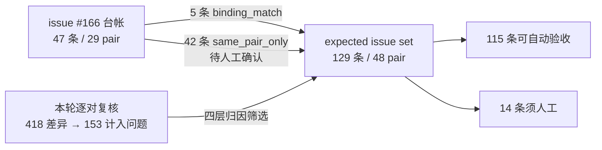

issue [#166](https://github.com/HansBug/research_ideas/issues/166) 的 47 条 expected issue **无法与本集合做 binding 级合并**：其 `ledger.json` 于 2026-07-29 机器重建时丢失、从未进入 git、不可恢复，47 条中仅 **5 条**被重建出机器可比的 `eval_assert`，其余 42 条只剩自然语言陈述。

因此关系被反转：**本集合即台帐**，而 #166 的 47 条降级为一份**必须被逐条交代的覆盖清单**。逐条结果：

| 交代结果 | 条数 | 含义 |
| --- | ---: | --- |
| `binding_match` | **5** | 旧条目有 `eval_assert`，且与本集合某条断言**共享模型元素**——机器可判，最强关联 |
| `same_pair_only` | **42** | 本集合在该 pair 上有条目，但具体对应只能靠读陈述——需人工确认 |
| `unaccounted` | **0** | 本集合在该 pair 上没有任何可入条目——**这个数必须为 0**，否则等于静默丢弃既有发现 |
| **合计** | **47** | |

**`unaccounted` = 0。** 也就是说旧台帐涉及的每个 pair，本集合都有对应条目。但必须说清这是**必要条件而非充分条件**：42 条 `same_pair_only` 只证明「该 pair 有新条目」，不证明「新条目覆盖了旧条目所指的那个缺陷」——那需要逐条人工确认，本集合尚未完成。

### 旧台帐的类别分布（#166 §3 的 taxonomy）

| 类别 | 条数 | 含义 |
| --- | ---: | --- |
| `IT` | 17 | 初始化、完成与作用域：初态、终态、局部退出或全局完成缺失、提前或作用域错误 |
| `TR` | 9 | 迁移关系完整性：NL 明确要求的 source-trigger-target 关系缺失，或三者之一错误 |
| `SH` | 8 | 结构与层次完整性：NL 明确要求的状态、子状态、层次归属或区域结构缺失或错置 |
| `GC` | 8 | 条件、选择与冲突：条件缺失或错置，或同一适用条件产生无法区分的冲突目标 |
| `EA` | 2 | Effect 与动作：NL 明确要求的 effect、赋值、输出或状态局部动作缺失或错误 |
| `UA` | 2 | 未授权行为：额外迁移违反 NL 明确给出的 remain、until、only 或 never 义务 |
| `DA` | 1 | 领域与任务对齐：作者模型属于错误任务领域，或缺少足以识别任务的核心行为 |
| **合计** | **47** | |

### 覆盖范围的扩张

旧台帐涉及 **29** 个 pair，本集合覆盖 **48** 个，新增 **19** 个旧台帐完全没有记录的 pair：`0004`、`0012`、`0013`、`0015`、`0016`、`0027`、`0032`、`0036`、`0039`、`0042`、`0043`、`0045`、`0046`、`0050`、`0053`、`0055`、`0056`、`0057`、`0059`。

逐条对照数据：[ledger_coverage.json](https://gist.github.com/HansBug/e92fb6ca165b46d19b1638f03ae93842#file-ledger_coverage-json)
