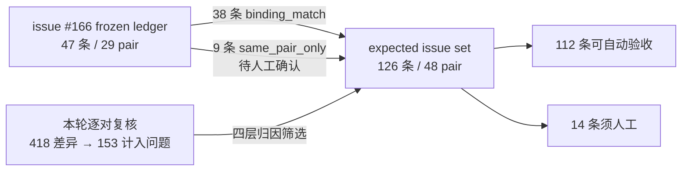

⚠️ **一处必须更正的前提。** 本 issue 的初版称 issue [#166](https://github.com/HansBug/research_ideas/issues/166) 的机器总账 `ledger.json` 已在 2026-07-29 机器重建中丢失且不可恢复，因此无法做 binding 级交代。**这个判断是错的。** 该文件一直在仓库里：路径 `.omx/specs/autoresearch-paper1-llms-emp-60-expected-issues/ledger.json`，370,994 字节，SHA-256 `03d8756650c0…` 与 #166 正文公布的「机器总账 SHA-256」逐字符一致，已于 2026-07-29 22:01 由 commit `94074e4e` 恢复并纳入 git。**其 47 / 47 条带 `eval_assert`，其中 44 条含可提取的模型元素路径。**初版之所以判为丢失，是因为检索 `ledger.json` 时用的 glob 不匹配 `.omx` 这个点开头的目录。

本节数字已改用 frozen ledger 重算（来源：`frozen`）。这也纠正了一处违规：`HIT_CRITERION.md` §7 明文规定「不要再基于重建版计算或引用任何命中数字」，而初版读的正是那份仅覆盖 4 个 pair 的重建物。

关系仍然是：**本集合即台帐**，#166 的 47 条作为一份**必须被逐条交代的覆盖清单**。改用 frozen ledger 后的逐条结果：

| 交代结果 | 条数 | 含义 |
| --- | ---: | --- |
| `binding_match` | **38** | 旧条目的 `eval_assert` 与本集合某条断言**共享模型元素**——机器可判，最强关联 |
| `same_pair_only` | **9** | 本集合在该 pair 上有条目，但 binding 不相交——具体对应需人工确认 |
| `unaccounted` | **0** | 本集合在该 pair 上没有任何可入条目——**这个数必须为 0**，否则等于静默丢弃既有发现 |
| **合计** | **47** | |

**`unaccounted` = 0**，即旧台帐涉及的每个 pair 本集合都有对应条目。其中 **38 条达到 binding 级交代**（81%）——旧条目的断言与本集合某条断言绑定到了同一批模型元素，这是机器可判的最强关联。剩余 **9 条**只达到 pair 级：**它们只证明「该 pair 有新条目」，不证明「新条目覆盖了旧条目所指的那个缺陷」**——这是必要条件而非充分条件，需逐条人工确认，尚未完成。

### 旧台帐的类别分布（#166 §3 的 taxonomy）

| 类别 | 条数 | 含义 |
| --- | ---: | --- |
| `IT` | 17 | 初始化、完成与作用域：初态、终态、局部退出或全局完成缺失、提前或作用域错误 |
| `TR` | 9 | 迁移关系完整性：NL 明确要求的 source-trigger-target 关系缺失，或三者之一错误 |
| `SH` | 8 | 结构与层次完整性：NL 明确要求的状态、子状态、层次归属或区域结构缺失或错置 |
| `GC` | 8 | 条件、选择与冲突：条件缺失或错置，或同一适用条件产生无法区分的冲突目标 |
| `EA` | 2 | Effect 与动作：NL 明确要求的 effect、赋值、输出或状态局部动作缺失或错误 |
| `UA` | 2 | 未授权行为：额外迁移违反 NL 明确给出的 remain、until、only 或 never 义务 |
| `DA` | 1 | 领域与任务对齐：作者模型属于错误任务领域，或缺少足以识别任务的核心行为 |
| **合计** | **47** | |

### 覆盖范围的扩张

旧台帐涉及 **29** 个 pair，本集合覆盖 **48** 个，新增 **19** 个旧台帐完全没有记录的 pair：`0004`、`0012`、`0013`、`0015`、`0016`、`0027`、`0032`、`0036`、`0039`、`0042`、`0043`、`0045`、`0046`、`0050`、`0053`、`0055`、`0056`、`0057`、`0059`。

逐条对照数据：[ledger_coverage.json](https://gist.github.com/HansBug/e92fb6ca165b46d19b1638f03ae93842#file-ledger_coverage-json)
