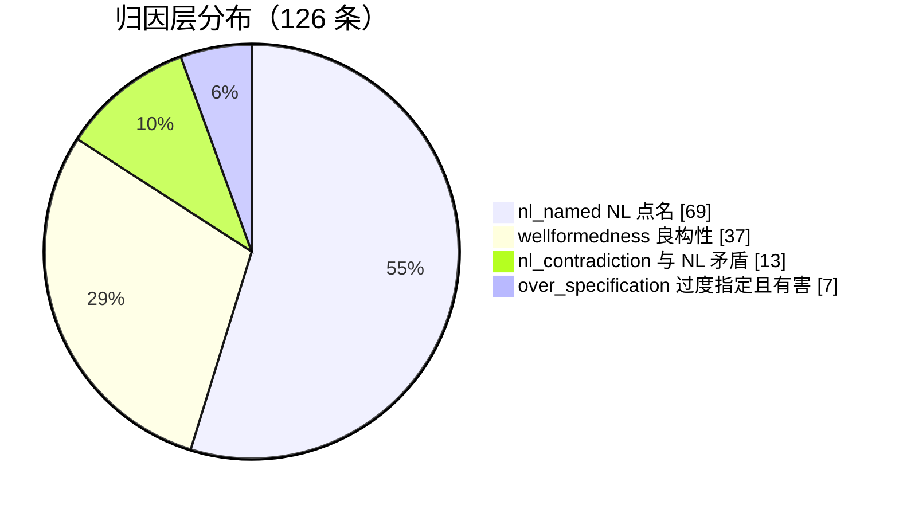

| 量 | 值 | 口径 |
| --- | ---: | --- |
| **expected issue 条数** | **126** | 一条记录一条 issue |
| **同质组** | **126** | 同 pair 上主谓词与元素集合完全相同者视为同一缺陷。当前 **0 次合并**——在 112 条有 binding 的记录里键零碰撞，故组数 = 记录数。**命中率仍应按同质组计**，以防后续新增记录出现真实重复 |
| 覆盖 pair | 48 / 60 | 10 NL × 6 LLM 全因子设计 |
| 可自动验收 | **112**（89%）| 主断言实测返回 `False` |
| 须人工验收 | **14** | 19 个封闭谓词表述不出 |
| 带实测有效负控 | **2** / 126 | 负控须实测为 `True`。覆盖率 2%——**这是本集合已知的最大证据弱点** |
| 经主裁定 | 2 | 复核结论被推翻或换据后重判 |
| 落在有旧台帐 E1 的 pair 上 | 98 | 其余落在旧台帐无记录的 pair |

### 归因层：凭什么把一条差异归给生成方

四层不是严重程度，而是**证明所依赖的 oracle 强度**，从强到弱：

| 层 | 条数 | 占比 | 图示 | 判据 |
| --- | ---: | ---: | --- | --- |
| `nl_named`（NL 点名）| **69** | 55% | ██████████████ | NL 逐字点名了那个缺失或错位的元素 |
| `wellformedness`（良构性）| **37** | 29% | ████████░░░░░░ | 无需任何 oracle，仅凭生成模型自身即可判定 |
| `nl_contradiction`（与 NL 矛盾）| **13** | 10% | ███░░░░░░░░░░░ | 模型行为与 NL 的显式义务相反 |
| `over_specification`（过度指定且有害）| **7** | 6% | █░░░░░░░░░░░░░ | 生成方凭空多出，且造成可断言的负面后果 |
| **合计** | **126** | 100% | | |

### ⚠️ 归因门控：本集合最重要的限制

把这 126 条逐条重放一遍归因，结果是：

| 归因结论 | 条数 | 占比 | 按流水线契约能否成为 confirmed issue |
| --- | ---: | ---: | --- |
| `safe` | **64** | 51% | 可以 |
| `representation_debt` | **32** | 25% | **不能**——判定所依赖的元素落在该 pair 的 `attribution_exclusions` 里 |
| `unattributed` | **16** | 13% | **不能**——找不到可信源头映射 |
| `declared_not_expressible` | 14 | 11% | 无断言可归因 |

**48 条触发 `excluded_findings` 硬门控**（`representation_debt` 32 + `unattributed` 16）：`discover/prompts.py:73` 明写「False results marked representation_debt or unattributed must go to excluded_findings, **never confirmed issues**」。连同 14 条无可求值断言，共 **62 / 126 = 49% 的记录不满足「binding = `safe` 且实测 `False`」这一 confirmed 前提**（`prompts.py` 另一句：「Create confirmed issues only from False assertions whose binding status is safe」）。**两个数口径不同，不可互换：48 是硬门控触发数，62 是不满足 confirmed 前提的总数**。把本集合当作命中率分母时，必须同时报告这个分层，否则会把流水线按设计不该上报的条目记成漏检。

**按归因通过率给四层重新排序，结论与直觉相反：**

| 层 | 条数 | 其中 `safe` | 通过率 |
| --- | ---: | ---: | ---: |
| `nl_contradiction`（与 NL 矛盾）| 13 | 11 | **85%** |
| `over_specification`（过度指定且有害）| 7 | 4 | **57%** |
| `nl_named`（NL 点名）| 69 | 36 | **52%** |
| `wellformedness`（良构性）| 37 | 13 | **35%** |

⚠️ **一处必须撤回的表述。** 本 issue 初版称 `wellformedness` 这一层「最难被质疑」，理由是它不需要 NL 也不需要参考模型。**按归因实测，它恰恰是四层里通过率最低的一层**：37 条里只有 **13 条** `safe`（19 条 `representation_debt`、4 条 `unattributed`、1 条无可求值断言）。通过率最高的是 `nl_contradiction`（11 / 13）。原因见 §7.4：该层的判定大量依赖 R4.5 投影注入的合成节点，而那些节点正是归因排除表里的元素。

⚠️ 同质组的口径经过一次修正：初版（129 条记录时）报 126 组，因为合并键在记录缺主断言时退化为 `(pair, None, ())`，把同 pair 上无断言记录中的 3 对**不同**缺陷误并（`0025`、`0034`、`0035` 各一对）。修正后无断言记录各自单独成组，因此**该机制在本集合上没有消解任何真实重复**——它是为后续规模准备的，当前未生效。
