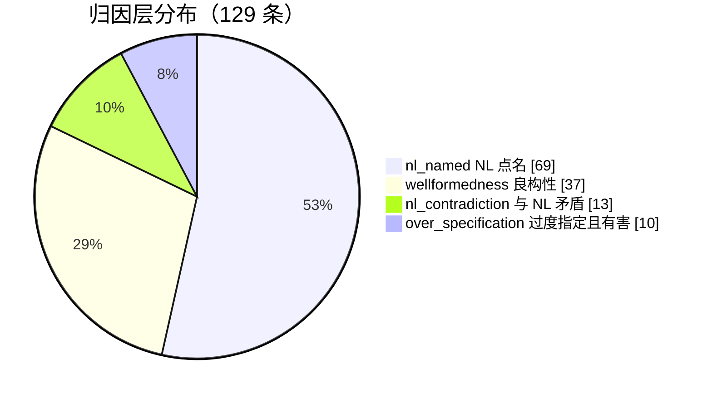

| 量 | 值 | 口径 |
| --- | ---: | --- |
| **expected issue 条数** | **129** | 一条记录一条 issue |
| **同质组** | **129** | 同 pair 上主谓词与元素集合完全相同者视为同一缺陷。当前 **0 次合并**——在 115 条有 binding 的记录里键零碰撞，故组数 = 记录数。**命中率仍应按同质组计**，以防后续新增记录出现真实重复 |
| 覆盖 pair | 48 / 60 | 10 NL × 6 LLM 全因子设计 |
| 可自动验收 | **115**（89%）| 主断言实测返回 `False` |
| 须人工验收 | **14** | 19 个封闭谓词表述不出 |
| 带实测有效负控 | **2** / 129 | 负控须实测为 `True`。覆盖率 2%——**这是本集合已知的最大证据弱点** |
| 经主裁定 | 2 | 复核结论被推翻或换据后重判 |
| 落在有旧台帐 E1 的 pair 上 | 100 | 其余落在旧台帐无记录的 pair |

### 归因层：凭什么把一条差异归给生成方

四层不是严重程度，而是**证明所依赖的 oracle 强度**，从强到弱：

| 层 | 条数 | 占比 | 图示 | 判据 |
| --- | ---: | ---: | --- | --- |
| `nl_named`（NL 点名）| **69** | 53% | ██████████████ | NL 逐字点名了那个缺失或错位的元素 |
| `wellformedness`（良构性）| **37** | 29% | ████████░░░░░░ | 无需任何 oracle，仅凭生成模型自身即可判定 |
| `nl_contradiction`（与 NL 矛盾）| **13** | 10% | ███░░░░░░░░░░░ | 模型行为与 NL 的显式义务相反 |
| `over_specification`（过度指定且有害）| **10** | 8% | ██░░░░░░░░░░░░ | 生成方凭空多出，且造成可断言的负面后果 |
| **合计** | **129** | 100% | | |

`wellformedness` 这 37 条最难被质疑——反驳它必须先反驳模型自身，不需要 NL 也不需要参考模型。

⚠️ 同质组的口径经过一次修正：初版报 126 组，因为合并键在记录缺主断言时退化为 `(pair, None, ())`，把同 pair 上无断言记录中的 3 对**不同**缺陷误并（`0025`、`0034`、`0035` 各一对）。修正后无断言记录各自单独成组，因此**该机制在本集合上没有消解任何真实重复**——它是为后续规模准备的，当前未生效。
