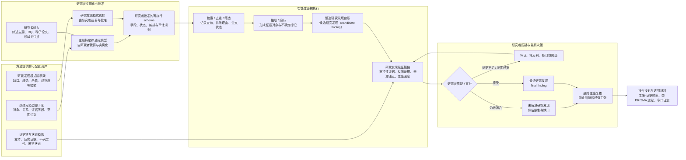

# 论文主线：研究者引导、发现导向、可审计的智能体式 SLR 支持工作流

## 1. 工作标题

候选中文标题：**面向软件工程 SLR/SMS 的研究者引导、发现导向、可审计智能体式支持工作流**。

候选英文标题只作为后续英文稿写作入口：**Toward Researcher-Guided and Finding-Oriented Agentic Support for Auditable Software Engineering Reviews**。

标题边界：不得暗示端到端无人、完全自动、完整覆盖或 PRISMA 合规（PRISMA-compliant）；`agent-based SLR` 只能作为总括性术语，正式叙事优先使用“研究者引导的智能体式 SLR 支持工作流”。

## 2. 核心论点

本文研究一种**研究者引导、发现导向、可审计的智能体式 SLR 支持工作流**：方法提供综述元模型脚手架、研究发现模式脚手架和证据链模板；使用本文方法的研究者裁剪并实例化主题特定综述元模型，再批准可执行 schema；智能体在该 schema 和研究发现模式约束下抽取证据对象、提出候选研究发现并构建证据链；研究者通过审计 / 质疑闭环对证据、反例、范围与主张强度进行质疑、修订、降级或接受。本文评价的核心不是自动生成综述文本，而是候选研究发现的证据支撑度、可追踪性、无证据支撑 / 过强主张控制、质疑后修订、审计成本与可复查性。

## 2.1 叙事成熟度与更新策略

PR-B0 的 35 篇全文文本级基线调研与全 CCF A/B/C 扩展检索已经表明，宽泛的“LLM / 智能体自动化综述”“多智能体 SLR 工作流”“自动生成综述”叙事会被已有近邻工作打穿。因此 PR-S0 不再把论文主线写成“自动生成综述文本”或“多阶段证据包工作流”本身，而是把新颖性候选收紧到：**方法提供可配置脚手架 + 研究者实例化综述元模型 + 研究发现模式 + 研究发现级证据链 + 研究者质疑闭环**。

本文档是 PR-S0 后续叙事真源之一；术语必须优先遵守 [terminology_policy.md](./terminology_policy.md)。若本文档与 2026-06-15 正式导师讨论记录或 [terminology_policy.md](./terminology_policy.md) 冲突，应以后者为准并回写本文件。

更新原则：宁可把论文主线写成可审计、可降级、可迭代的研究假设，也不要把尚未实验验证的候选贡献写成最终结论。后续 PR 若新增基线、survey-of-surveys、脚手架、真实运行或评价结果，必须同步更新本文档、[paper_outline.md](./paper_outline.md)、[claim_evidence_map.md](./claim_evidence_map.md)、[differential_novelty_matrix.md](./differential_novelty_matrix.md) 与 [../experiment_design/reviewer_risk_register.md](../experiment_design/reviewer_risk_register.md)。

## 3. 任务边界

| 项 | PR-S0 冻结口径 |
|---|---|
| 输入 | 综述主题、初始 RQ、种子论文、领域知识、研究者关注点、来源范围、候选论文池、全文可获取性记录。 |
| 研究者拥有的输入 | 综述元模型脚手架的裁剪 / 实例化决定、主题特定综述元模型、研究发现模式选择、审计 / 质疑政策。 |
| 智能体处理对象 | 元数据、全文、证据对象、抽取字段、编码决策、候选研究发现、支持性 / 反向证据、质疑日志。 |
| 输出 | 以研究发现为中心的证据包（finding-centered evidence package）：研究者批准的可执行 schema、证据对象表、候选研究发现台账、主张-证据映射、质疑 / 修订 / 降级 / 未解决日志、类 PRISMA（PRISMA-style）透明报告材料、下游报告投影。 |
| 最终研究发现条件 | 只有来源锚定的支持性证据、反向证据 / 不确定性检查或缺口标记、范围与主张强度经研究者确认后，候选研究发现才能升级为最终研究发现。 |
| 人的角色 | 设定 / 确认元模型、批准可执行 schema、审计证据链、发起质疑、裁决分歧、确认最终研究发现。 |
| 智能体的角色 | 辅助检索、筛选、抽取、编码、提出候选研究发现、构建证据链、搜索反向证据、提出修订 / 降级建议和进行报告投影。 |
| 不属于 PR-S0 | 真实管线实现、真实 LLM 运行、四个真实例子、完整 survey-of-surveys、完整脚手架 schema、最终评价指标公式、完整论文正文。 |
| 不属于本文强主张 | 禁止写完全替代 SLR 专家、端到端无人自动产出合格 SLR、PRISMA 合规（PRISMA-compliant）、complete coverage、first automated / first agentic SLR、LLM 自动定义可靠元模型。 |

## 4. 问题缺口

传统 SE SLR / SMS 的价值不只是把文献整理成列表，而是围绕研究者关心的问题形成研究发现：哪些主题被充分研究，哪些方法存在系统性不足，哪些证据相互冲突，哪些结论只在特定范围下成立。已有自动化工具和新近 LLM / 智能体工作已经覆盖了筛选、抽取、分类、证据综合、综述生成、人在回路（human-in-the-loop）与局部来源追溯（provenance）；当前缺口不再是“没有自动化”，而是：**当智能体参与多阶段 review 时，如何让研究者的概念框架、候选研究发现、证据链、反证、降级和最终接受过程成为可审计对象**。

因此本文不主张发明 SLR，也不主张首次自动化 SLR；本文聚焦智能体化之后的**研究发现形成可靠性（finding formation reliability）**：候选研究发现如何在研究者定义的元模型与研究发现模式约束下生成，如何被证据链支撑或反驳，如何经研究者质疑闭环修订、降级、保留为未解决或接受为最终研究发现。

## 5. 技术挑战

1. **综述框架隐性化**：不同研究者对同一 SLR 主题的对象、关系、证据字段和研究发现类型理解不同；若元模型不显式化，智能体很容易把通用摘要框架误当成领域发现框架。
2. **候选研究发现与最终研究发现混淆**：LLM / 智能体很容易生成看似合理的 gap、trend 或 conclusion；若没有研究发现生命周期，就会把未审计的候选研究发现误写成最终研究发现。
3. **证据链必须支持质疑而非只支持展示**：报告级可追踪性只是最低要求；研究者还需要看到支持性证据、反向证据、不确定性、范围与修订历史，才能质疑或降级研究发现。
4. **多环节漂移会累积到研究发现**：检索、筛选、全文可用性、抽取、编码和综合任一阶段的错误都会改变候选研究发现的强度和范围。
5. **人工审计不是免费 oracle**：质疑闭环可能提高可复查性，也可能增加成本、暴露未解决的研究发现；必须记录审计时间、分歧、降级、残余无证据支撑主张，而不是只报告“人工通过”。

## 6. 方法洞察

核心设计原则：**把智能体式 SLR 从“生成综述文本 / 证据包”进一步改写成“围绕候选研究发现构建可质疑、可修订、可降级、可接受的证据形成过程”**。

这意味着：

1. 元模型是研究者的问题意识入口，不是 LLM 自动生成的通用软件工程本体；
2. 研究发现模式约束智能体提出何种候选研究发现，而不是让模型自由综合；
3. 证据包以研究发现为中心组织，既保存支持性证据，也保存反向证据、不确定性与质疑历史；
4. 最终研究发现是研究者审计后的状态，不是智能体输出后的默认标签。

## 6.1 方法总览图

下图是后续论文方法大图的文本版草案，用来说明“方法提供脚手架、研究者实例化框架、智能体执行证据工作、研究者质疑并确认研究发现”四者之间的关系。它不是结果图，也不表示 PR-S0 已经实现运行时；后续 A2/A3/A4/A5 若改变阶段契约、schema 或证据字段，必须同步更新本图。

读图要点：

1. **脚手架属于方法资产**：本文贡献不是让研究者从零手写框架，而是提供可配置的综述元模型、研究发现模式和证据链模板。
2. **元模型由研究者实例化**：智能体可以辅助整理字段和候选 schema，但最终综述框架由研究者裁剪、确认和批准。
3. **智能体产出的是候选研究发现**：候选研究发现必须带证据链、反向证据和不确定性，不能直接进入最终结论。
4. **质疑闭环是方法核心**：研究者可以要求补证、查找反例、缩小范围、降低主张强度或标记未解决。
5. **报告投影仍需最终主张复核**：论文 / 报告文本来自已接受、已降级或未解决研究发现的证据状态，不以自动写作质量作为核心贡献。

## 7. 系统 / 方法阶段

| 阶段 | 目标 | PR-S0 证据 / 后续门槛 |
|---|---|---|
| M0 综述元模型实例化 | 研究者基于脚手架声明综述对象、关系、证据字段、范围约束与研究发现类型。 | 后续脚手架 PR 必须给出字段、示例和批准日志；PR-S0 只冻结术语和叙事角色。 |
| M1 可执行 schema 准备 | 系统辅助把主题特定综述元模型转成研究者批准的可执行 schema。 | A2 需冻结 schema 契约；未经研究者批准的 schema 不进入正式运行。 |
| M2 证据获取 | 执行检索、去重、筛选、全文状态记录和合法获取状态管理。 | 检索日志、筛选台账、全文状态、版权 / 失败记录；覆盖情况只能报告覆盖代理（coverage proxy）。 |
| M3 证据抽取与编码 | 从全文 / 元数据抽取证据对象并按 schema 编码。 | 抽取表、来源定位、负证据、不确定标记、编码分歧。 |
| M4 候选研究发现提出 | 智能体根据研究发现模式脚手架从证据对象中提出候选研究发现。 | 候选研究发现台账；必须标明研究发现类型、范围、支持性证据和不确定性。 |
| M5 证据链构建 | 为每个候选研究发现组织支持性 / 反向证据、主张强度与来源锚点。 | 主张到来源链、反向证据列表、无证据支撑 / 过强主张检查。 |
| M6 研究者质疑 / 细化 | 研究者对候选研究发现提出质疑，系统补证、找反例、修订或降级。 | 质疑输入、操作、输出、停止条件、修订 / 降级 / 未解决日志。 |
| M7 最终研究发现决策与报告投影 | 研究者接受、降级或保留未解决的研究发现，并投影到报告草案。 | 最终研究发现状态、范围 / 主张强度、类 PRISMA 透明材料；禁止写 PRISMA 合规（PRISMA-compliant）。 |

传统检索 / 筛选 / 全文 / 抽取流程仍然重要，但在 PR-S0 叙事中它们服务于以研究发现为中心的证据工作流，而不是论文主贡献本身。

## 8. 候选贡献

PR-S0 只冻结候选贡献。后续 A2/A3/A5/A6 必须用脚手架、运行记录和评价结果支持后，才可进入摘要或引言。

| 候选贡献 | 当前状态 | 所需证据 |
|---|---|---|
| 研究者实例化的综述元模型脚手架 | 方法设计候选 | 脚手架字段、实例化协议、研究者批准记录、survey-of-surveys 设计依据。 |
| SLR 研究发现模式脚手架 | 方法设计候选 | 研究发现模式来源、示例、适用 / 不适用条件、人工可理解性与审计记录。 |
| 元模型引导的智能体支持工作流 | 工作流 / 制品候选 | schema 驱动的抽取、编码、候选研究发现提出阶段契约、运行记录和失败分类。 |
| 证据支撑的研究者质疑闭环 | 方法与评价候选 | 质疑日志、支持性 / 反向证据、修订 / 降级 / 未解决率、审计成本。 |
| 以研究发现为中心的评价协议 | 评价候选 | 候选研究发现相关性、证据支撑度、主张到来源准确性、无证据支撑研究发现率、成本 / 审计有效性。 |

“多场景基准 / 案例研究”是后续证据计划，不是 PR-S0 的核心贡献；它必须服务于上述贡献的验证。

## 9. 证据计划

| 证据类型 | 当前 PR-S0 状态 | 后续落点 |
|---|---|---|
| 导师定调 | 2026-06-15 正式记录已明确元模型由使用本文方法的研究者基于脚手架设定，SLR 要形成研究发现，并允许研究者质疑。 | 本文档、[paper_outline.md](./paper_outline.md)、[claim_evidence_map.md](./claim_evidence_map.md)。 |
| B0 基线 | 35 篇全文文本级基线 + 全 CCF A/B/C 扩展检索已说明宽泛自动化叙事被击穿。 | [differential_novelty_matrix.md](./differential_novelty_matrix.md)、相关工作、A1/A6。 |
| `sources/` 文库 | `main` 已有，可作为领域场景 / 压力测试线索。 | A3 场景设计；不能作为论文新颖性本身。 |
| PR #97 438→69→25 与 25 篇全文 | PR #97 OPEN / 未合入 / 快照证据。 | 若 PR #97 merge 或冻结 SHA 后再复核；不得写成 `main` 事实。 |
| survey-of-surveys | PR-S0 只登记为设计依据需求，不执行。 | 后续新增子 PR：抽取 SE / AI4SE / MDE / LLM4SE survey 的 RQ、taxonomy、研究发现模式与证据 schema。 |
| 脚手架 / 运行时 | PR-S0 不实现。 | A2 / scaffold PR / A4。 |
| 真实运行 | PR-S0 不运行。 | A3/A4/A5；真实 LLM 必须 `source .env` 并保存运行记录。 |
| 评价指标 | PR-S0 只登记以研究发现为中心的评价义务。 | A5 冻结公式、阈值、统计协议和制品检查清单。 |

## 10. 相关工作定位

本文必须主动承认：已有工作已经覆盖多智能体 SLR 工作流、临床证据综合、人在回路来源追溯、筛选 / 抽取、综述生成与 SE LLM-SLR 方法学风险。差异化不能写成“首次智能体式 SLR”，只能写成特定组合：**研究者实例化的元模型 + 研究发现模式脚手架 + 研究发现级证据链 + 研究者质疑协议**。

| 基线 / 方向 | 已有能力 | 对本文的约束 | 本文候选差异 |
|---|---|---|---|
| AgentSLR / 流行病学系统综述评价框架 | 检索、筛选、PDF 转 Markdown、结构化抽取、专家标注与分阶段评价。 | 不能写“首次评估 AI-based SLR workflow”；必须有阶段级评价和成本意识。 | 聚焦 SE SLR/SMS 的研究者定义综述框架、研究发现生命周期与质疑日志。 |
| LatteReview | 多智能体筛选、相关性评分、结构化抽取工作流，含资深 reviewer 裁决和结构化输出。 | 不能把“多智能体 SLR 工作流”当核心新颖性。 | 不以筛选 / 抽取工作流为终点，而以候选研究发现的证据、反证、降级和最终决策为中心。 |
| EviSearch | 临床证据抽取中的单元格级来源追溯、页码 / 模态 / 引文归因与 reviewer edits。 | 不能声称 来源追溯 / 人在回路审计 是空白。 | 从单元格级抽取来源追溯扩展到 SE review 的研究发现级主张到来源、反向证据与质疑修订。 |
| LR-Robot | 专家 taxonomy、LLM classification、RAG knowledge base / network analysis、human-in-the-loop。 | 不能声称专家定义 taxonomy + LLM 分类未被研究。 | meta-model 不只服务分类，还约束研究发现模式、候选研究发现提出和质疑闭环。 |
| TrialMind | 临床检索、筛选、抽取、meta-analysis inputs 与 human-AI collaboration。 | 不能写完整证据综合管线为空白。 | 避免 clinical PICO / 统计综合语境，强调 SE SLR/SMS 的开放证据对象、研究发现审计与报告级主张控制。 |
| WSESE@ICSE 2025 LLM-SLR difficulties | SE 社区已讨论 LLM 支持 SLR conducting / replication 的困难。 | 不能写 SE 社区尚未意识到 LLM-SLR 风险。 | 把提示词敏感性、随机性、透明性、数据仓库缺口转成可审计工作流与评价义务。 |
| Beyond Accuracy / SE SLR screening variability | SE SLR screening 中 LLM 变异性、人工复核路由和治理问题。 | 不能把 screening accuracy/F1 当完整贡献。 | 将筛选风险纳入研究发现证据链与质疑协议。 |
| Automated survey / literature review generation | 自动生成综述文本、引用、survey 结构和 LLM-as-Judge 评价。 | 不能把报告生成或文本质量当核心新颖性。 | 报告只是已接受 / 已降级 / 未解决研究发现的下游投影。 |
| ASReview / RobotReviewer / review automation | 主动学习筛选、偏倚风险 / 证据自动化、机器学习辅助综述。 | 不能写 first automated SLR 或 prior work 只有人工综述。 | 正面定位在 智能体 / LLM 时代的研究发现级审计与研究者质疑。 |

## 11. 可考虑提出的主张

以下主张只有在后续证据闭合后才能进入摘要 / 引言；PR-S0 仅登记安全方向。

- 本文研究面向 SE SLR/SMS 的研究者引导智能体支持，而不是端到端无人自动 SLR。
- 本文把研究者拥有的 meta-model 作为综述框架起点，让智能体在研究者批准的 schema 下执行抽取、编码和候选研究发现提出。
- 本文把 SLR 的研究发现功能显式化，用研究发现模式约束候选研究发现类型和证据要求。
- 本文要求候选研究发现通过证据链、反向证据 / 不确定性标记和研究者质疑后，才能升级为最终研究发现。
- 本文计划以研究发现相关性、证据支撑度、主张到来源可追踪性、无证据支撑 / 过强主张研究发现率、质疑后修订、覆盖代理、透明性与人工成本评价方法可靠性。

## 12. 需要谨慎处理的主张

| 谨慎主张 | 风险 | 安全写法 |
|---|---|---|
| 元模型脚手架有用 | 需要 survey-of-surveys、实例化案例和用户 / 专家审计支持。 | 在若干 SE review 场景中观察脚手架是否改善抽取 / 编码结构化程度。 |
| 研究发现模式提高研究发现质量 | 质量需定义，且可能只改变研究发现类型覆盖或可审计性。 | 评估候选研究发现的相关性、非平凡性、证据支撑度与可审计性。 |
| 质疑闭环有收益 | 质疑可能增加成本，也可能产生未解决研究发现。 | 报告修订 / 降级 / 未解决 / 新证据与审计时间，不预设正收益。 |
| 证据链降低无证据支撑研究发现 | 需要 金事实 / 银事实、人工核验和残余错误统计。 | 报告无证据支撑 / 过强主张研究发现率与审计拦截。 |
| 适用于 SE SLR/SMS | 场景数量和主题会限制泛化。 | 明确范围：只在选定 SE / LLM4Modeling / MDE 场景中观察。 |
| 类 PRISMA 报告可生成 | 不等于检查清单合规。 | 写“生成 PRISMA-style 透明材料”，不写合规。 |

## 13. 禁止提出的主张

- 禁止写智能体完全替代 SLR 专家。
- 禁止写端到端无人自动产出合格 SLR。
- 禁止写首次 LLM / 智能体自动化 SLR、first agentic SLR 或 complete coverage。
- 禁止写 PRISMA 合规（PRISMA-compliant），除非后续检查清单与报告要求全部闭合。
- 禁止写 LLM 自动定义可靠 meta-model；必须写研究者基于脚手架裁剪并确认。
- 禁止写本文提供通用软件工程综述本体；当前只提供可配置脚手架 / 协议候选。
- 禁止把候选研究发现（candidate finding）直接写成最终研究发现（final finding）。
- 禁止把 `final findings produced by agents` 写成贡献。
- 禁止把 自动报告生成或综述写作质量 写成核心贡献。
- 禁止把 PR #97 OPEN / 未合入资产写成 `main` 已有事实。
- 禁止把 `sources/` 文库规模写成论文新颖性本身。
- 禁止把 PR-S0 的评价维度种子写成 A5 已经验证的指标协议。

## 14. 审稿风险

核心风险已结构化记录在 [../experiment_design/reviewer_risk_register.md](../experiment_design/reviewer_risk_register.md)。PR-S0 阶段最高优先级风险包括：

1. 叙事回滑为“又一个智能体式 SLR / 自动化综述生成工作流”；
2. 新颖性被 AgentSLR、LatteReview、EviSearch、LR-Robot、TrialMind、WSESE@ICSE 2025 或综述生成工作打穿；
3. 元模型被误写成作者定义的通用软件工程本体，或误写成 LLM 自动生成；
4. 候选研究发现（candidate finding）/最终研究发现（final finding）边界不清，导致智能体输出被当成最终研究发现；
5. 质疑闭环只停留在口号，没有输入、操作、输出、停止条件、修订 / 降级 / 未解决记录；
6. 评价仍停留在报告生成质量、筛选 F1 或省时，不能支撑以研究发现为中心的主张；
7. 审计门只报告“人工通过”，没有成本、分歧、降级和残余无证据支撑研究发现统计；
8. PR #97 事实漂移或资产版权边界不清。
