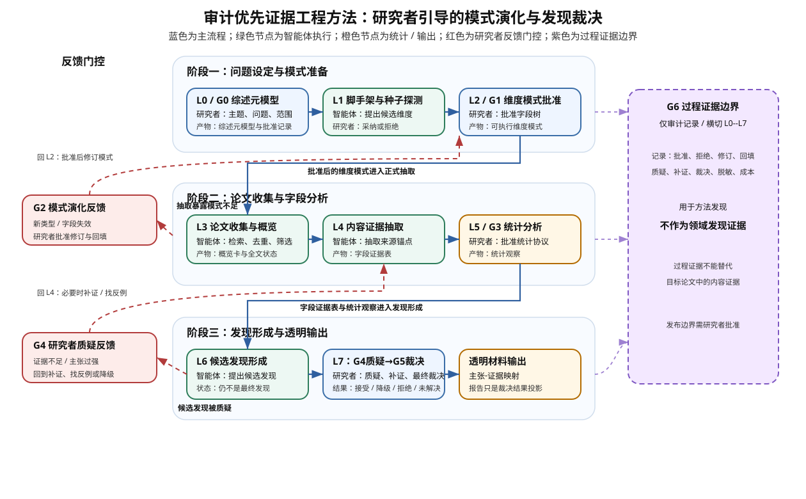
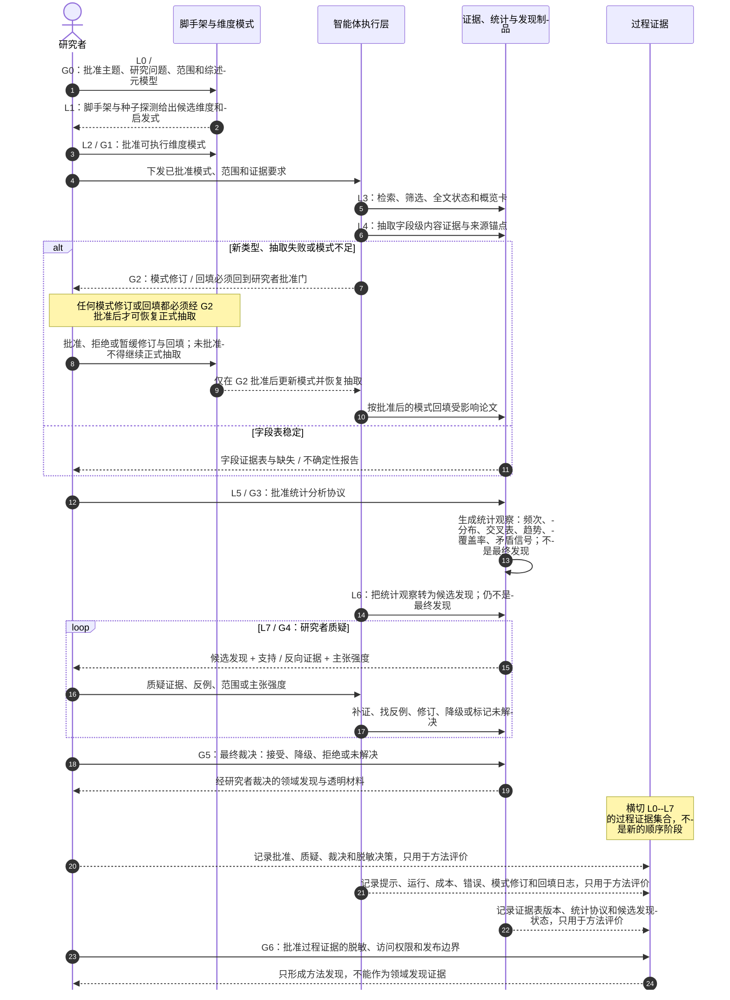

# 论文主线：面向软件工程系统综述的审计优先证据工程方法

## 1. 工作标题

候选中文标题：**面向软件工程系统综述的审计优先证据工程方法：研究者引导的维度模式演化与发现裁决**。

标题边界：不得暗示端到端无人、完全自动、完整覆盖、首次智能体式系统综述或 PRISMA 透明报告框架（Preferred Reporting Items for Systematic Reviews and Meta-Analyses, PRISMA）合规。正式叙事优先使用“审计优先证据工程方法”或“研究者引导的系统综述支持方法”，而不是“自动生成综述”。后续英文稿标题单独处理，本文件只保留必要术语锚点。

## 2. 术语首次出现规则

本文件采用“首次出现写作 `中文术语（英文术语 / 缩写）`，后续一律写中文术语”的规则。下表给出本文件后续默认使用的中文简称；除论文名、工具名、路径、命令、阶段编号和必要缩写外，正文不再成片使用英文。

| 首次出现写法 | 后续默认写法 | 本文含义 |
|---|---|---|
| 软件工程（Software Engineering, SE） | 软件工程 | 本文目标领域，后续不再单独展开英文。 |
| 系统综述（Systematic Literature Review, SLR） | 系统综述 | 按可追溯协议综合某领域研究证据的综述活动。 |
| 系统映射研究（Systematic Mapping Study, SMS） | 系统映射研究 | 更偏领域结构、主题分布和证据地图的系统化综述活动。 |
| 大语言模型（Large Language Model, LLM） | 大语言模型 | 可用于筛选、抽取、摘要、归类和生成候选线索的模型能力来源。 |
| 智能体（agent） | 智能体 | 围绕任务、工具、提示和状态进行协作执行的软件代理；不是最终研究裁决者。 |
| 综述元模型（review meta-model） | 综述元模型 | 研究者为具体综述主题设定的对象、关系、问题、证据类型和发现类型框架。 |
| 维度模式（dimension pattern / extraction schema） | 维度模式 | 把综述元模型投影到单篇论文分析上的字段树、取值空间、证据要求和缺失语义。 |
| 模式演化（pattern-evolving） | 模式演化 | 维度模式随着种子论文、真实抽取失败、新类别和研究者理解深化而版本化修订。 |
| 综述之综述脚手架（survey-of-surveys scaffold） | 脚手架 | 从既有综述、系统综述和系统映射研究中抽取维度、发现和证据呈现模式的低成本先验。 |
| 种子论文探测（seed-paper probing） | 种子探测 | 用少量代表性论文压力测试候选维度模式是否可执行。 |
| 字段级内容证据（field-level content evidence） | 内容证据 | 来自目标论文全文、表格、图、制品链接或缺失说明的可定位证据。 |
| 过程证据（process evidence / audit trail） | 过程证据 | 人机交互、批准、修订、回填、质疑、裁决、提示和脱敏记录。 |
| 统计分析（statistical analysis） | 统计分析 | 对字段证据表做频次、分布、交叉表、趋势、覆盖率和矛盾信号分析。 |
| 候选发现信号（candidate finding signal） | 候选发现 | 智能体基于统计观察、启发式和内容证据提出的待审计线索。 |
| 目标领域研究发现（target-domain research finding） | 领域发现 | 经过内容证据、反向证据、不确定性和研究者裁决支撑的领域主张。 |
| 方法评估发现（method-evaluation finding） | 方法发现 | 由试运行、使用过程和交互日志支撑的关于方法可用性、审计性、成本和失败模式的主张。 |
| 人工门控（human gate） | 人工门控 | 带输入制品、决策类型、理由、版本变化、影响范围和后续动作的研究者裁决点。 |
| PRISMA 透明报告框架（Preferred Reporting Items for Systematic Reviews and Meta-Analyses, PRISMA） | PRISMA 透明报告框架 | 系统综述透明报告的常用框架。 |
| 类 PRISMA 透明材料（PRISMA-style transparency artifacts） | 类 PRISMA 材料 | 受 PRISMA 透明报告框架启发的流程、排除理由和审计材料；不是合规声明。 |

## 3. 一句话论点

本文研究一种面向软件工程系统综述 / 系统映射研究的**审计优先证据工程方法**：研究者先定义主题、研究问题、范围和综述元模型；方法把该综述元模型投影为可版本化、可修订、可回填的维度模式；大语言模型与智能体只在研究者批准后的模式下辅助论文收集、字段级内容证据抽取、统计分析和候选发现生成；最终领域发现必须经过研究者质疑、反向证据检查、补证、降级和裁决；全过程导出可审计制品链和过程证据，用于评价方法本身。

## 4. 任务边界

| 项 | 当前冻结口径 |
|---|---|
| 输入 | 综述主题、研究问题、范围、种子论文、候选论文池、全文状态、研究者关注点、可用脚手架。 |
| 研究者拥有的输入 | 主题、研究问题、范围、综述元模型、维度模式审批、发现启发式选择、统计分析解释、候选发现质疑、最终裁决和过程记录边界。 |
| 智能体处理对象 | 元数据、全文、概览卡、内容证据、抽取字段、统计视图、候选发现、支持证据、反向证据和审计日志草案。 |
| 输出 | 研究者批准的维度模式、概览卡表、字段证据表、模式修订 / 回填日志、统计分析表、候选发现台账、质疑 / 裁决日志、透明报告材料和过程证据。 |
| 最终领域发现条件 | 领域发现必须由内容证据、统计观察、反向证据 / 不确定性检查和研究者裁决共同支撑；智能体输出只能是候选发现。 |
| 不属于本阶段 | 真实智能体运行时、真实大语言模型调用、完整脚手架研究、完整数据结构、用户界面、四个真实例子、最终指标公式、最终英文论文。 |
| 禁止主张 | 首次、完全自动、PRISMA 透明报告框架合规、完整覆盖、大语言模型自动产出最终发现、过程证据支撑领域发现、试运行证明泛化。 |

## 5. 问题缺口

传统软件工程系统综述 / 系统映射研究的价值不是把论文整理成列表，而是形成可解释、可复核的研究发现：哪些主题受到关注，哪些方法存在系统性不足，哪些证据相互矛盾，哪些结论只在特定范围内成立。近年的大语言模型与智能体工作已经覆盖筛选、抽取、分类、证据综合、报告生成、来源追溯和人在回路复核。因此，第二篇论文不能把新颖性放在“智能体也能做系统综述”或“自动生成综述文本”上。

当前缺口是：**当大语言模型与智能体参与软件工程系统综述 / 系统映射研究时，如何让研究者的概念框架、可演化维度模式、字段级内容证据、统计分析、候选发现、反向证据、降级与最终裁决成为显式、可审计、可迭代的研究制品。**

## 6. 技术挑战

1. **维度模式初期必然不完整**：真实系统综述开始时很难一次性定义完整抽取字段；随着阅读更多论文，输出类型、方法类型、评价方式、证据形式和缺失值语义都会变化。
2. **统计观察容易被误写成研究发现**：频次、分布、交叉表和趋势只是字段表上的归纳结果；若缺少解释、反例和主张强度控制，容易把统计事实包装成过强发现。
3. **证据类型容易混用**：领域发现需要目标论文原文中的内容证据；试运行和学生交互日志等过程证据只能支撑方法可用性、审计性和人机协同成本。
4. **人在回路不能只做末端审核**：如果研究者只在最后看报告，综述元模型、维度模式、统计解释和候选发现都可能已经漂移；必须把研究者裁决放进多个门控。
5. **人工审计不是免费答案机**：质疑闭环会产生成本、分歧、降级和未解决发现；这些过程本身要记录为方法评估证据。

## 7. 方法洞察

核心设计原则是：**把系统综述中的“论文收集 → 维度模式驱动的论文分析 → 统计分析与研究发现形成”显式拆开，并把每一层都绑定到研究者门控、可导出审计制品和可失败的评价指标。**

这带来四个方法约束：

1. 维度模式是方法的一等制品，不是隐藏在提示词里的字段清单；
2. 统计分析是研究发现的证据基础，不是最终研究发现本身；
3. 内容证据和过程证据分别服务不同类型主张；
4. 最终领域发现是研究者裁决状态，不是智能体输出状态。

## 7.1 审计优先证据工程对象

为避免方法只停留在流程门控或安全口号，本 PR 进一步把 S0-v2 的正面贡献压缩为一组可导出、可检查、可失败的审计制品链。后续 A2/A3/A5 必须把这些对象实例化；否则本文只能算方法设想，不能支撑强论文主张。

| 审计对象 | 最小内容 | 对应风险 | 后续评价入口 |
|---|---|---|---|
| 维度模式与修订 / 回填日志 | 字段树、取值空间、证据要求、缺失语义、版本、触发原因、影响论文、回填状态 | 维度模式平铺化、模式漂移、旧论文未回填 | 模式修订次数、回填完成率、回填成本、冻结条件 |
| 字段级内容证据表 | 字段值、页码 / 章节 / 短引文 / 表格 / 图 / 制品链接、缺失或不确定说明 | 无来源锚点、字段事实错误、证据断链 | 来源锚点准确性、断链率、字段错误分类 |
| 候选发现台账 | 统计观察、发现启发式、候选发现、支持证据、反向证据、主张强度 | 统计观察被直接写成发现、无证据 / 过强主张 | 候选发现相关性、非平凡性、可审计性、过强主张率 |
| 质疑 / 裁决 / 未解决日志 | 研究者质疑、补证、找反例、接受、降级、拒绝、未解决、裁决理由 | 人在回路退化成末端签字、候选发现直接进结论 | 接受 / 降级 / 拒绝 / 未解决比例，质疑拦截率，质疑成本 |
| 过程证据包 | 提示、运行、人工修改、批准、拒绝建议、时间、调用、错误、脱敏状态 | 过程证据与内容证据混用、方法评价无证据 | 过程证据完整性、成本、失败模式、脱敏完整性 |

这些对象共同定义“审计优先证据工程”的论文级技术对象：本文不争夺“智能体能否自动写综述”的宽泛能力，而是研究如何把研究者的综述问题框架、论文级内容证据、统计观察、候选发现和最终裁决组织成可复核的证据工程链。

## 8. 方法总览图

本节给出两张图。第一张是普通流程图，用于快速看清阶段、参与者、制品和反馈关系；第二张是时序 / 泳道图，用于看清每个门控的责任边界。普通流程图以可控 SVG 维护，避免自动布局导致倒序、过宽或过高；时序 / 泳道图保留 Mermaid 便于后续调整门控顺序。两图均为方法草案，不表示本 PR 已实现运行时。

### 8.1 普通流程图：阶段、参与者与制品关系

读图要点：

1. 三行结构对应真实系统综述实践，并在图中直接映射到 L0--L7：阶段一覆盖 L0--L2，先由研究者设定问题与模式；阶段二覆盖 L3--L5，由智能体在批准模式下分析论文；阶段三覆盖 L6--L7，由研究者通过 G5 最终裁决把候选发现裁决为领域发现、降级主张、拒绝或未解决问题。
2. 每个阶段都显式标出参与者：研究者负责主题、模式、统计协议、G4 质疑和 G5 最终裁决；智能体负责脚手架建议、论文处理、证据抽取、统计观察和候选发现草案。
3. G0、G1、G3、G5 是阶段内人工门控；G2 和 G4 是反馈门控，只在模式不足或发现质疑触发时回跳。
4. 模式演化反馈从阶段二的抽取失败触发，回到阶段一修订维度模式，并回到阶段二回填受影响论文；发现质疑反馈从阶段三触发，回到阶段二补证或降低候选发现强度；G4 只是研究者质疑与补证入口，不是自动裁决门。
5. G6 是横切记录层，不是第四阶段：它记录过程证据并用于方法评价，不能替代内容证据来支撑领域发现。

### 8.2 时序 / 泳道图：门控责任边界

读图要点：

1. **G0/G1 决定可执行模式**：大语言模型和智能体可以建议候选模式，但研究者不批准就不能进入正式抽取。
2. **G2 处理模式演化**：如果新论文暴露模式不足，必须记录触发原因、影响字段、受影响论文和回填状态。
3. **G3 把统计协议显式化**：统计分析是字段表上的归纳操作；统计结果只能作为候选发现的证据基础。
4. **G4/G5 区分候选与最终**：智能体只生成候选发现；最终领域发现必须经过研究者质疑与裁决。
5. **G6 管住过程证据发布边界**：过程证据用于方法发现，不能替代目标论文的内容证据，也不能支撑领域发现。

## 9. 方法阶段

| 阶段 | 目标 | 关键产物 | 研究者门控 |
|---|---|---|---|
| L0 主题与综述元模型设定 | 明确主题、研究问题、范围、核心对象、关系和证据类型 | 主题说明、综述元模型 | G0 综述元模型批准 |
| L1 脚手架挖掘与种子探测 | 从既有综述和少量种子论文获得候选模式先验 | 候选维度、候选发现启发式、证据呈现模式 | 采纳 / 拒绝理由 |
| L2 维度模式批准 | 把综述元模型投影为可执行抽取模式 | 维度登记表、字段定义、取值空间、缺失值语义 | G1 模式批准 |
| L3 论文收集与概览 | 检索、去重、筛选、全文状态和概览卡 | 检索日志、筛选台账、概览卡 | 筛选抽查 |
| L4 字段级证据抽取与模式演化 | 抽取内容证据，并根据失败修订模式 | 字段证据表、来源锚点、修订 / 回填日志 | G2 修订 / 回填批准 |
| L5 统计分析 | 在字段表上形成统计观察 | 分布、交叉表、趋势、覆盖率代理、矛盾信号 | G3 分析协议检查 |
| L6 候选发现形成 | 用发现启发式提出候选发现线索 | 候选发现台账、支持 / 反向证据草案 | G4 质疑 |
| L7 最终裁决与透明投影 | 接受、降级、拒绝或保留未解决发现 | 最终 / 降级 / 未决发现、透明材料、审计轨迹 | G5 最终裁决 |

## 10. 候选贡献

本文件只冻结候选贡献，后续必须由后续设计、试运行、真实运行、评价与相关工作用数据结构、试运行、过程数据和评价结果支撑。

| 候选贡献 | 当前状态 | 需要的后续证据 |
|---|---|---|
| 研究者引导的综述元模型与维度脚手架 | 方法设计候选 | 脚手架抽样、实例化案例、研究者批准记录。 |
| 可演化的论文分析模式生命周期 | 方法设计候选 | 模式修订日志、影响分析、回填负担、稳定 / 冻结记录；至少一个最小闭环样例。 |
| 字段级内容证据到发现级主张的审计链 | 方法设计候选 | 来源锚点准确性、断链率、无支撑字段比例、主张到来源审计。 |
| 统计观察到候选发现与最终裁决的分层协议 | 方法设计候选 | 统计结果、候选发现台账、反向证据、质疑 / 接受 / 降级 / 拒绝 / 未解决记录。 |
| 过程证据支撑的方法评估 | 评价候选 | 试运行、硕士生人机交互日志、同意 / 匿名化 / 脱敏记录。 |

## 11. 证据计划

| 证据类型 | 当前状态 | 后续落点 |
|---|---|---|
| 当前基线调研 | 已有 35 篇全文文本级评审与全 CCF 检索，证明宽泛自动化叙事会被击穿 | 相关工作与差异化矩阵 |
| 导师讨论记录 | 已合入上游，提供最高优先级主线约束 | 本文件与所有 S0-v2 文档 |
| 脚手架研究 | 计划证据；不在本 PR 执行 | 后续脚手架 / 设计依据 PR |
| LLM4STM / LLM4Modeling 试读检查 | 本文档只做文档可执行性试读检查，不运行真实大语言模型 | [../plan/progress.md](../plan/progress.md) |
| 试运行 | 后续计划，用于闭环可行性和制品完整性 | 后续试运行、真实运行与评价 |
| 硕士生过程数据 | 后续计划，用于方法发现 | 后续评价与伦理 / 数据边界 PR |

## 11.1 最小闭环样例要求

为回应“强协议 / 弱证据”的审查风险，当前 PR 将最小闭环样例列为后续阻塞性义务，而不是可选展示材料。推荐优先使用基于大语言模型的状态机建模（LLM4STM / LLM4Modeling）作为准真实主题，选取 3--5 篇种子论文做 L0--L7 dry-run。该样例至少要展示：

1. 初始综述元模型和维度模式版本；
2. 至少一个由新论文类型、字段失效、证据不足或研究者质疑触发的模式修订；
3. 受影响论文列表与回填状态；
4. 一个统计观察如何被转换为候选发现；
5. 一个候选发现如何经反向证据、范围检查和研究者裁决后被接受、降级、拒绝或标为未解决；
6. 内容证据与过程证据的分离记录。

该样例的目标不是证明泛化或优于人工，而是证明 S0-v2 的审计对象和门控链能够真实跑通，并暴露模式漂移、证据断链、过强主张和复核成本。

## 12. 相关工作定位

本文必须主动承认：AgentSLR、LatteReview、EviSearch、LR-Robot、TrialMind、WSESE@ICSE 2025、ASReview、RobotReviewer 和自动综述生成工作已经覆盖多阶段系统综述自动化、筛选 / 抽取、人在回路、来源追溯、临床证据综合、报告生成和软件工程中的大语言模型辅助系统综述风险讨论。本文不能声称这些能力空白；引言和相关工作应把这些强近邻作为正面约束，而不是留到文末被动防御。

安全差异化应压缩为：**面向软件工程系统综述 / 系统映射研究的研究者定义综述元模型、可演化维度模式、字段级内容证据、统计分析与研究发现分层、研究者质疑 / 裁决、以及过程证据支撑的方法评估**。

## 13. 可以主张、谨慎主张与禁止主张

### 13.1 可以尝试主张

- 本文研究如何把软件工程系统综述 / 系统映射研究中的研究者问题框架显式转化为智能体可执行、研究者批准的维度模式。
- 本文把维度模式演化、模式修订、影响分析和回填作为论文分析层的可审计制品。
- 本文区分统计分析、候选发现和最终领域发现，避免智能体直接生成最终发现。
- 本文把过程证据用于方法评估，而不是目标领域发现证据。

### 13.2 需要谨慎主张

- “提高发现质量”：需要人工评价、质疑结果和残余错误统计。
- “降低人力成本”：需要记录研究者审计时间、模式修订 / 回填负担和调用成本。
- “适用于软件工程系统综述 / 系统映射研究”：若试运行只覆盖 LLM4STM / LLM4Modeling，必须限定范围。
- “脚手架有效”：需要后续抽样、审计和使用案例支撑。

### 13.3 禁止主张

- 首次大语言模型 / 智能体系统综述、首次智能体式系统综述、完整自动化系统综述。
- 大语言模型自动定义可靠综述元模型或最终发现。
- PRISMA 透明报告框架合规或完整覆盖。
- 脚手架是目标系统综述证据池或三级综述。
- 过程证据支撑领域发现。
- 试运行或硕士生数据证明方法跨主题泛化。
- 研究者只做末端审核或润色。

## 14. 审稿风险

最高优先级风险见 [../experiment_design/reviewer_risk_register.md](../experiment_design/reviewer_risk_register.md)。当前阶段尤其要防止：

1. 叙事双头：一边讲软件工程特化综述元模型，一边讲证据链，却没有用维度模式生命周期和发现形成串起来；
2. 统计分析和研究发现混淆；
3. 内容证据与过程证据混用；
4. 脚手架被误写成完整三级综述；
5. 人在回路被降级为末端人工复核；
6. 试运行 / 学生数据被过度外推；
7. 强近邻相关工作被弱化或遗漏。
