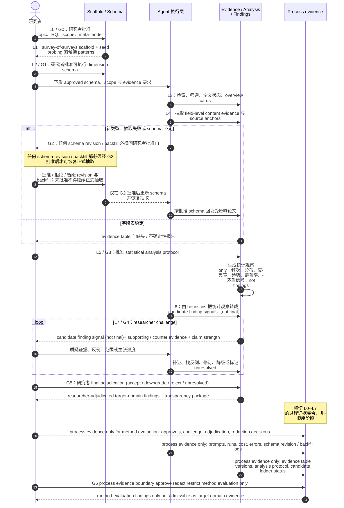

# 论文主线：研究者引导、模式演化、证据支撑、发现导向的智能体式 SLR 支持方法

## 1. 工作标题

候选中文标题：**面向软件工程 SLR/SMS 的研究者引导、模式演化与证据支撑的智能体式综述支持方法**。

候选英文标题仅作为后续英文稿锚点：**Researcher-Guided, Pattern-Evolving, and Evidence-Backed Agentic Support for Software Engineering Reviews**。

标题边界：不得暗示端到端无人、完全自动、完整覆盖、首次智能体式 SLR 或 PRISMA 合规。正式叙事优先使用“研究者引导的智能体式 SLR/SMS 支持方法”，而不是“自动生成综述”。

## 2. 一句话论点

本文研究一种面向 SE SLR/SMS 的 **researcher-guided、pattern-evolving、evidence-backed、finding-oriented agentic SLR support approach**：研究者定义 topic / RQ / scope / meta-model，LLM/agent 基于 survey-of-surveys scaffold 与 seed-paper probing 提出候选 dimension / finding patterns；在研究者批准的 dimension schema 下，agent 支持论文收集、overview card、字段级内容证据抽取、dimension pattern 修订与 backfill、统计分析和候选 finding signal 生成；最终 target-domain findings 必须经过研究者的 challenge、counter-evidence search、补证、降级和 adjudication，同时保留 process evidence / audit trail 以支撑后续方法评估。

## 3. 任务边界

| 项 | PR-S0-v2 冻结口径 |
|---|---|
| 输入 | 综述主题、RQ、scope、种子论文、候选论文池、全文状态、研究者关注点、可用 survey-of-surveys scaffold。 |
| 研究者拥有的输入 | topic / RQ / scope / meta-model、dimension schema 审批、finding heuristic 选择、统计分析解释、candidate finding challenge、final adjudication、process logging 边界。 |
| 智能体处理对象 | 元数据、全文、overview card、字段级内容证据、抽取字段、统计视图、候选 finding signal、支持/反向证据、审计日志草案。 |
| 输出 | 研究者批准的 dimension schema、overview card 表、字段级 evidence table、schema revision / backfill log、statistical analysis table、candidate finding ledger、challenge / adjudication log、透明报告材料、process evidence。 |
| 最终 finding 条件 | final target-domain finding 必须由 content evidence、统计观察、反向证据 / 不确定性检查和研究者裁决共同支撑；agent 输出只能是 candidate finding signal。 |
| 不属于 PR-S0-v2 | 真实 agent runtime、真实 LLM 调用、完整 survey-of-surveys、完整 JSON schema、UI、四个真实例子、最终指标公式、最终英文论文。 |
| 禁止主张 | first / fully automated / PRISMA-compliant / complete coverage / LLM final findings / process data 支撑目标领域结论 / pilot 证明泛化。 |

## 4. 问题缺口

传统 SE SLR/SMS 的价值不是把论文整理成列表，而是形成可解释、可复核的研究发现：哪些主题受到关注，哪些方法存在系统性不足，哪些证据相互矛盾，哪些结论只在特定范围内成立。近年的 LLM / agent 工作已经覆盖筛选、抽取、分类、证据综合、报告生成、来源追溯和人在回路复核。因此，paper2 不能把新颖性放在“agent 也能做 SLR”或“自动生成综述文本”上。

当前缺口是：**当 LLM/agent 参与 SE SLR/SMS 时，如何让研究者的概念框架、可演化维度模式、字段级内容证据、统计分析、候选研究发现、反向证据、降级与最终裁决成为显式、可审计、可迭代的研究制品。**

## 5. 技术挑战

1. **维度模式初期必然不完整**：真实 SLR 开始时很难一次性定义完整抽取字段；随着阅读更多论文，输出类型、方法类型、评价方式、证据形式和缺失值语义都会变化。
2. **统计观察容易被误写成研究发现**：频次、分布、交叉表和趋势只是字段表上的归纳结果；若缺少解释、反例和主张强度控制，容易把统计事实包装成过强 finding。
3. **证据类型容易混用**：目标领域 finding 需要目标论文原文中的 content evidence；pilot / student interaction log 等 process evidence 只能支撑方法可用性、审计性和人机协同成本。
4. **human-in-the-loop 不能只做末端审核**：如果研究者只在最后看报告，meta-model、schema、统计解释和 candidate finding 都已经可能漂移；必须把研究者裁决放进多个 gate。
5. **人工审计不是免费 oracle**：challenge loop 会产生成本、分歧、降级和 unresolved finding；这些过程本身要记录为方法评估证据。

## 6. 方法洞察

核心设计原则是：**把 SLR 中“论文收集 → 维度模式驱动的论文分析 → 统计分析与研究发现形成”显式拆开，并把每一层都绑定到研究者 gate 和可审计证据。**

这带来四个方法约束：

1. dimension pattern 是方法的一等制品，不是隐藏在 prompt 里的字段清单；
2. statistical analysis 是 finding 的证据基础，不是 final finding 本身；
3. content evidence 和 process evidence 分别服务不同类型主张；
4. final finding 是研究者裁决状态，不是 agent 输出状态。

## 7. 方法总览图

下图是 PR-S0-v2 的方法图草案。它不是运行结果图，也不表示本 PR 已实现 agent runtime。图采用时序 / 泳道式表达，重点展示研究者、schema / scaffold、agent 执行层、证据 / 统计 / findings 制品、process evidence 之间的责任边界。读图时应注意：agent 输出停留在 candidate finding signals，final target-domain findings 只能由研究者裁决；process evidence 经过 G6 后只用于方法评价。

读图要点：

1. **G0/G1 决定 operative schema**：LLM/agent 可以建议候选 pattern，但研究者不批准就不能进入正式抽取。
2. **G2 处理 pattern evolution**：如果新论文暴露 schema 不足，必须记录 change trigger、影响字段、受影响论文和 backfill 状态。
3. **G3 把统计协议显式化**：统计分析是字段表上的归纳操作；统计结果只能作为 candidate finding 的证据基础。
4. **G4/G5 区分 candidate 与 final**：agent 只生成 candidate finding signals；final target-domain finding 必须经过研究者 challenge 与裁决。
5. **G6 管住 process evidence 发布边界**：process evidence 用于 method-evaluation findings，不能替代目标论文 content evidence，也不能支撑 target-domain findings。

## 8. 方法阶段

| 阶段 | 目标 | 关键产物 | 研究者 gate |
|---|---|---|---|
| L0 主题与 meta-model 设定 | 明确 topic、RQ、scope、核心对象、关系和证据类型 | topic brief、review meta-model | G0 meta-model approval |
| L1 scaffold mining / seed probing | 从既有 survey 与少量种子论文获得候选 pattern prior | 候选 dimension / finding / evidence-presentation patterns | scaffold 采纳/拒绝理由 |
| L2 dimension schema 批准 | 把 meta-model 投影为可执行抽取 schema | dimension registry、字段定义、取值空间、缺失值语义 | G1 schema approval |
| L3 论文收集与 overview | 检索、去重、筛选、全文状态和 overview card | search log、screening ledger、overview cards | screening audit |
| L4 字段级证据抽取与 pattern evolution | 抽取 field-level content evidence，并根据失败修订 schema | evidence table、source anchors、revision/backfill log | G2 revision/backfill approval |
| L5 statistical analysis | 在字段表上形成统计观察 | distribution、cross-tab、trend、coverage proxy、contradiction signal | G3 analysis protocol check |
| L6 candidate finding signal | 用 finding heuristics 提出候选发现线索 | candidate finding ledger、support/counter evidence draft | G4 challenge |
| L7 final adjudication 与透明投影 | 接受、降级、拒绝或保留 unresolved finding | final/downgraded/unresolved findings、透明材料、audit trail | G5 final adjudication |

## 9. 候选贡献

PR-S0-v2 只冻结候选贡献，后续必须由 A2/A3/A5/A6 用 schema、pilot、process data 和评价结果支撑。

| 候选贡献 | 当前状态 | 需要的后续证据 |
|---|---|---|
| 研究者引导的 meta-model 与 dimension pattern scaffold | 方法设计候选 | survey-of-surveys scaffold、实例化案例、研究者批准记录。 |
| 可演化的论文分析 schema 生命周期 | 方法设计候选 | schema revision log、impact analysis、backfill burden、stability/freeze 记录。 |
| 字段级 content evidence 到 finding 级证据链 | 方法设计候选 | source anchor 准确性、unsupported field rate、claim-to-source audit。 |
| statistical-analysis-to-finding 分层协议 | 方法设计候选 | 统计结果、candidate finding ledger、challenge / downgrade / unresolved 记录。 |
| process evidence 支撑的方法评估 | 评价候选 | pilot run、硕士生 human-LLM interaction logs、consent / anonymization / redaction 记录。 |

## 10. 证据计划

| 证据类型 | 当前状态 | 后续落点 |
|---|---|---|
| PR-B0 baseline | 已有 35 篇全文文本级 review 与全 CCF discovery，证明宽泛自动化 story 被击穿 | A6 related work 与 novelty matrix |
| PR-S0-pre / PR-S0B 导师记录 | 已合入上游，提供最高优先级 story 约束 | 本文件与所有 S0-v2 文档 |
| survey-of-surveys scaffold | 计划证据；不在本 PR 执行 | 后续 scaffold / design-basis PR |
| LLM4STM / LLM4Modeling dry-run | 本 PR 只做文档可执行性 dry-run，不运行真实 LLM | `plan/progress.md` |
| pilot run | 后续计划，用于 closure / feasibility / artifact completeness | A3/A4/A5 |
| 硕士生 process data | 后续计划，用于 method-evaluation findings | A5 / ethics-data-boundary PR |

## 11. 相关工作定位

本文必须主动承认：AgentSLR、LatteReview、EviSearch、LR-Robot、TrialMind、WSESE@ICSE 2025、ASReview、RobotReviewer 和自动综述生成工作已经覆盖多阶段 SLR 自动化、筛选/抽取、人在回路、来源追溯、临床证据综合、报告生成和 SE LLM-SLR 风险讨论。本文不能声称这些能力空白。

安全差异化应压缩为：**面向 SE SLR/SMS 的研究者定义 meta-model、可演化 dimension pattern、字段级 content evidence、statistical analysis 与 research finding 分层、研究者 challenge/adjudication、以及 process evidence 支撑的方法评估**。

## 12. Claims to make / be careful / avoid

### 12.1 可以尝试主张

- 本文研究如何把 SE SLR/SMS 中研究者的 topic / RQ / scope / meta-model 显式转化为 agent 可执行、研究者批准的 dimension schema。
- 本文把 dimension pattern 演化、schema revision、impact analysis 和 backfill 作为 SLR 论文分析层的可审计制品。
- 本文区分 statistical analysis、candidate finding signal 和 final target-domain finding，避免 agent 直接生成最终发现。
- 本文把 process evidence 用于方法评估，而不是目标领域 finding 证据。

### 12.2 需要谨慎主张

- “提高 finding quality”：需要人工评价、challenge 结果和残余错误统计。
- “降低人力成本”：需要记录研究者审计时间、schema revision/backfill burden 和 token/API 成本。
- “适用于 SE SLR/SMS”：若 pilot 只覆盖 LLM4STM / LLM4Modeling，必须限定范围。
- “survey-of-surveys scaffold 有效”：需要后续抽样、审计和使用案例支撑。

### 12.3 禁止主张

- 首次 LLM / agent SLR、first agentic SLR、完整自动化 SLR。
- LLM 自动定义可靠 meta-model 或 final findings。
- PRISMA-compliant 或 complete coverage。
- survey-of-surveys 是目标 SLR evidence pool 或 tertiary review。
- process evidence 支撑 target-domain findings。
- pilot run 或硕士生数据证明方法跨主题泛化。
- 研究者只做末端审核或润色。

## 13. 审稿风险

最高优先级风险见 [../experiment_design/reviewer_risk_register.md](../experiment_design/reviewer_risk_register.md)。PR-S0-v2 阶段尤其要防止：

1. 叙事双头：一边讲 SE-specific meta-model，一边讲 evidence chain，却没有用 dimension pattern lifecycle 和 finding formation 串起来；
2. 统计分析和 research finding 混淆；
3. content evidence 与 process evidence 混用；
4. survey-of-surveys 被误写成完整 tertiary review；
5. human-in-the-loop 被降级为末端人工复核；
6. pilot / student data 被过度外推；
7. 强近邻 related work 被弱化或遗漏。
