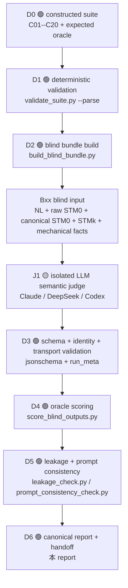

# R5.7.5 full blind adjudication dry-run 报告

> 证据引用说明：正文中的方括号引用（如 `[src-*]`、`[clm-*]`、`[cmd-*]`）均指向文末审计附录。这些键是稳定 ASCII key，不按数字顺序重排。

## 1. 定位与回答的问题

本报告补充在 R5.7.5 constructed answer-key suite 之后，回答一个此前不能由 answer-key fixture 证明的问题：在 judge **看不到 expected verdict、Cxx 构造意图、oracle mapping、PR 讨论上下文** 的情况下，仅给出 `NL + raw STM_0 + canonical STM_0 + candidate STM_k + neutral mechanical/provenance facts`，是否能按 R5.7.1--R5.7.4 的 E0--E11 / G0--G6 评价链完成 blind Better STM 裁决 `[clm-blind-purpose]`。

本报告仍然不是 repair effectiveness 报告：20 个 `STM_k` 均为 constructed protocol cases，不是真实 repair loop 输出；全部 `headline_eligible=false`、`repair_effectiveness_eligible=false`、`real_repair_run_id=null` `[clm-boundary]`。

## 2. blind 隔离纪律

| 环节 | 本轮做法 | 证据 |
|---|---|---|
| judge 输入 | `blind_inputs/Bxx/` 只含 `input_packet.json`、`nl.txt`、`raw_stm0.plantuml`、`canonical_stm0.fcstm`、`candidate_stmk.fcstm`；不含 expected verdict / Cxx slug / answer key。 | [src-blind-index], [cmd-leakage] |
| hidden oracle | `oracle_answer_key.json` 只给 scorer 使用，不进入 prompt。 | [src-oracle] |
| 上下文隔离 | 每个 case 由 `run_blind_judge.py` 调用 `claude -p --no-session-persistence --bare --model sonnet --json-schema ...`，并在仓库外临时目录运行；运行目录只包含 `prompt.txt` 和 `output_schema.json`。 | [src-runner], [src-manifest] |
| 全过程存档 | 每个 Bxx 均保存 `prompt.txt`、`raw_output.txt`、`combined_output_for_parse.txt`、`parsed_output.json`、`stdout.txt`、`stderr.txt`、`run_meta_start.json`、`run_meta_end.json`。 | [src-outputs], [src-manifest] |
| prompt 一致性 | final scoring 前重建 20 个 prompt 并与归档 prompt 比对，`mismatch_count=0`。 | [src-prompt-check], [cmd-prompt-check] |
| 结构化评分 | `score_blind_outputs.py` 只在 `exit_code=0`、schema-valid、identity 匹配且无 provider/CLI nonzero parsed-output 时计入 final score；`run_validity_match` 使用归一化等价桶，不是字面字符串相等。 | [src-score-script], [cmd-score] |

## 2.1 本报告的归一化范围

本文件是 R5.7.5 阶段的 **canonical 总报告**：它把先前分散在 constructed `STM_k` suite 报告、blind bundle README、prompt/schema、runner/scorer、三方 judge 输出与 PR handoff 中的事实汇总到同一条可审计链路中 `[clm-canonical-report]`。若只想理解 R5.7.5 对后续 R6/R7 的稳定输入，应优先读本文件；若需要逐案机器事实，再跳转到 A.2 中列出的 JSON / Python / judge output 原始资产。

需要特别区分两类材料：

1. **constructed answer-key suite**：C01--C20 是人工构造的 protocol dry-run case，用于覆盖 expected outcome、anti-gaming 与 fail-closed 分支；它们不是真实 repair loop 产物 `[clm-constructed-blind-link]`。
2. **full blind adjudication run**：B01--B20 是从 Cxx suite 派生出的 blind packet；judge 只能看 Bxx 输入，不知道 Cxx mapping、expected verdict 或 construction intent；hidden oracle 只给 deterministic scorer 使用 `[clm-constructed-blind-link]`。

因此，本报告的 headline 结论只能是：**Better STM adjudication protocol 在 constructed cases 上具备 blind 可执行性、分支覆盖与校准价值**。它不能被改写成“repair method 已有效”或“LLM-as-Judge 已充分可靠”。

## 2.2 完整 better-adjudication dry-run 链路

本轮不是“纯 LLM 一把梭”。完整链路由前置确定性事实、一次隔离语义 judge、后置确定性审计三部分组成 `[clm-chain-boundary]`：

| 阶段 | 性质 | 主要执行文件 / 资产 | 输入 | 输出 | 是否允许访问 hidden oracle | 学术职责 |
|---|---|---|---|---|---|---|
| D0 constructed suite | 人工构造 + 机器归档 | [src-suite], [src-constructed-readme], [src-constructed-report] | 20 个 `NL, STM_0, STM_k` protocol cases | C01--C20 expected outcome / target ledger / change ledger | 是，但仅作为 answer-key fixture | 覆盖评价协议分支，不证明 repair。 |
| D1 suite validation | 确定性 | [src-validator], [cmd-validate-constructed] | Cxx case files | 文件、hash、schema、parse 预期检查 | 否 | 防止 constructed fixture 自身不完整。 |
| D2 blind bundle build | 确定性 | [src-build-script], [cmd-build] | Cxx suite + fixed mapping | Bxx blind inputs、hash、parse/provenance 机械事实、hidden oracle | 写 oracle，但不放入 prompt | 把 answer-key case 转成可 blind 运行的 input。 |
| J1 isolated semantic judge | LLM | [src-prompt], [src-schema], [src-runner] | Bxx packet + NL/raw/canonical/candidate | `parsed_output.json` candidate verdict | 否 | 只做语义裁决、归因、no-regression、improvement 与 rationale。 |
| D3 output validation | 确定性 | [src-score-script] | raw / parsed output + run meta | eligible / invalid output 标记 | 否 | schema、identity、exit code、parse error gate。 |
| D4 oracle scoring | 确定性 | [src-oracle], [src-score-script], [cmd-score] | eligible parsed output + hidden oracle | verdict/scope/run-validity/gate match counts | 是，仅 scorer 访问 | 计算协议 dry-run 是否对齐预期。 |
| D5 audit checks | 确定性 | [src-leakage-script], [src-prompt-consistency-script], [cmd-leakage], [cmd-prompt-check] | blind inputs、archived prompts | leakage=0、prompt mismatch=0 | 否 | 防止 answer-key 泄露与 stale prompt。 |
| D6 report/handoff | 人类可读汇总 | 本报告、[src-blind-readme] | D0--D5 facts | R6/R7 handoff | 否 | 冻结可防守结论和后续工程纪律。 |

这个设计的关键是：**parse/hash/provenance 等机械事实由 D1/D2 确定性产生，LLM 不负责发现这些事实；LLM 只在 J1 中消费这些事实并进行语义裁决；最终是否计入结果再由 D3--D5 确定性审计决定** `[clm-deterministic-facts]`。

## 2.3 G0--G6 中 deterministic 与 LLM 的职责边界

当前 R5.7.5 的 G0--G6 是评价协议的语义 gate，而不是每个 gate 都已经变成独立 deterministic blocker。它们在本轮的职责边界如下 `[clm-gate-responsibility]`：

| gate | 当前输入事实 | 当前裁决主体 | 当前 R5.7.5 已做到 | 后续 R6/R7 必须硬化 |
|---|---|---|---|---|
| G0 scope | NL / raw / canonical / candidate 中的 T0、T0.5、T1 线索 | LLM semantic judge，scorer 对照 oracle | Claude 20/20 scope；DeepSeek B17 有 T0.5 caveat 分歧；Codex 20/20 scope。 | T0.5 caveat 与 T1 stress 的规则要继续校准，必要时加入人工仲裁样例。 |
| G1 admissibility | `baseline_file_present`、`candidate_file_present`、`candidate_parse_status`、schema/transport 状态 | 机械事实由 D1/D2/D3 确定；LLM 输出 G1 status | C17 parse-invalid、provider/schema-invalid 不会被计入有效成功。 | parse/provenance/hash/identity 应前移成 deterministic blocker；LLM 不应拥有最终解释权。 |
| G2 attribution | change ledger availability、candidate 与 canonical diff、conversion/normalization 边界 | 机械 provenance + LLM attribution | prompt 明确禁止把格式转换、canonicalization、`.fcstm` 可解析性算作 repair gain。 | 真实 repair run 必须绑定 `AgentLoopRunRecord`、change ledger、target ledger 和 prompt/output hash。 |
| G3 no-regression | NL + 两版 STM 的状态、迁移、层级、guard/action/effect/trace | LLM semantic judge | text-similarity / deletion 反例已通过 C20/B18 校准。 | 增加人工 spot-check 与 regression taxonomy，避免 LLM 过度相信表面文字。 |
| G4 improvement | target issue 是否被 NL 支持且被严格改善 | LLM semantic judge + hidden oracle score | `better`、`partial`、`unknown`、`not_better` 分支均覆盖。 | 明确 partial 与 strict better 的闭合条件，尤其 Codex B08 过度给分。 |
| G5 semantic synthesis | no-regression + improvement + anti-gaming | LLM semantic judge | 不透明 `effect_token_*` 已校准为 unknown，不再当成 action/effect improvement。 | 建立 human arbitration / multi-judge disagreement policy。 |
| G6 reporting / eligibility | schema、forbidden claims、headline flags、run meta | schema + scorer + LLM JSON | `headline_eligible=false`、`repair_effectiveness_eligible=false` 固定，0 leakage。 | 真实实验必须新增 `repair_effectiveness_eligible` 的 eligibility filter，禁止 constructed case 混入主统计。 |

因此，如果问“blind 环节是不是一个 LLM call 就完事”，严格答案是：**J1 语义裁决是每个 judge / case 一次 LLM call，但它被 D1/D2 的确定性机械事实约束，并由 D3--D5 的确定性校验、scoring、leakage 与 prompt-consistency 审计包围**。R5.7.5 已经能支撑 protocol dry-run；真实 repair 实验前还必须把 G1/G2 中可机械判定的部分进一步代码化为 hard blocker `[clm-handoff-preflight]`。

## 3. 最终全量 dry-run 结果

最终全量运行窗口：`2026-07-05T14:40:09` 到 `2026-07-05T14:54:39`；final judge family 为 `claude-blind-judge`。本轮 B01--B20 均由隔离外部 CLI 子进程执行；其中 B18 在 C20 反例被加硬为“明显删除 NL 支持的 Power_Off / human fallback”后重新运行，最终 `prompt_consistency_check` 证明 20/20 归档 prompt 与当前 bundle 完全一致 `[clm-prompt-consistency]`。

| 指标 | 数值 |
|---|---:|
| case_count | 20 |
| valid_output_count | 20 |
| verdict_match_count | 20 |
| scope_match_count | 20 |
| run_validity_match_count | 20 |
| gate_all_match_count | 6 |
| gate_disagreement_count | 25 |
| leakage_detected_count | 0 |

结论：20/20 输出 schema-valid，20/20 primary verdict 与 hidden oracle 一致，20/20 scope routing 一致，20/20 run validity 一致，0 个输出报告泄露；gate-level 只有 6/20 完全一致，因此 gate-level disagreement 应保留为 calibration evidence，而不是被“洗”成主结论 `[clm-final-score]`。

其中 `run_validity_match_count=20` 的含义是 scorer 按预注册归一化桶计算：`valid_constructed_protocol_case` 与 `valid_blind_protocol_case` 均归为 `valid`，`candidate_schema_or_parse_invalid` 与 `stmk_repair_failure` 均归为 `candidate_invalid`；它不是 observed / expected 原始字符串逐字相等 `[clm-run-validity-policy]`。

## 4. expected verdict 覆盖

| expected verdict | 数量 |
|---|---:|
| `better` | 2 |
| `not_better` | 12 |
| `partial` | 2 |
| `unknown` | 1 |
| `protocol_or_provenance_invalid` | 1 |
| `stmk_repair_failure` | 1 |
| `stress_t1` | 1 |

这组分布覆盖 R5.7.5 需要压力测试的主要分支：strict improvement、not better、partial / under-repair、unknown / evidence-insufficient、candidate failure、protocol/provenance invalid、T0.5 caveat 与 T1 stress `[clm-branch-coverage]`。

## 5. 20 case blind 对照表

`verdict` / `scope` 列中 ✅ 表示 observed 与 hidden oracle 一致；人工升级列中 ✅ 表示本次 judge 未要求 human escalation，⚠️ 表示 judge 自身认为需要升级。

| blind | source | expected | observed | verdict | expected scope | observed scope | scope | confidence | no human escalation | gate disagreements |
|---|---|---|---|---|---|---|---|---|---|---:|
| B01 | C08 | `partial` | `partial` | ✅ | `in_scope_t0_protocol_case` | `in_scope_t0_protocol_case` | ✅ | `medium` | ✅ | 2 |
| B02 | C10 | `unknown` | `unknown` | ✅ | `in_scope_t0_protocol_case` | `in_scope_t0_protocol_case` | ✅ | `low` | ⚠️ | 2 |
| B03 | C02 | `not_better` | `not_better` | ✅ | `in_scope_t0_protocol_case` | `in_scope_t0_protocol_case` | ✅ | `high` | ✅ | 1 |
| B04 | C09 | `not_better` | `not_better` | ✅ | `in_scope_t0_protocol_case` | `in_scope_t0_protocol_case` | ✅ | `high` | ✅ | 0 |
| B05 | C05 | `not_better` | `not_better` | ✅ | `in_scope_t0_protocol_case` | `in_scope_t0_protocol_case` | ✅ | `high` | ✅ | 0 |
| B06 | C01 | `better` | `better` | ✅ | `in_scope_t0_protocol_case` | `in_scope_t0_protocol_case` | ✅ | `high` | ✅ | 0 |
| B07 | C04 | `not_better` | `not_better` | ✅ | `in_scope_t0_protocol_case` | `in_scope_t0_protocol_case` | ✅ | `high` | ✅ | 1 |
| B08 | C19 | `partial` | `partial` | ✅ | `in_scope_t0_protocol_case` | `in_scope_t0_protocol_case` | ✅ | `medium` | ✅ | 2 |
| B09 | C11 | `better` | `better` | ✅ | `in_scope_t0_protocol_case` | `in_scope_t0_protocol_case` | ✅ | `medium` | ✅ | 0 |
| B10 | C03 | `not_better` | `not_better` | ✅ | `in_scope_t0_protocol_case` | `in_scope_t0_protocol_case` | ✅ | `high` | ✅ | 1 |
| B11 | C12 | `not_better` | `not_better` | ✅ | `in_scope_t0_protocol_case` | `in_scope_t0_protocol_case` | ✅ | `high` | ✅ | 0 |
| B12 | C18 | `protocol_or_provenance_invalid` | `protocol_or_provenance_invalid` | ✅ | `in_scope_t0_protocol_case` | `in_scope_t0_protocol_case` | ✅ | `medium` | ⚠️ | 3 |
| B13 | C17 | `stmk_repair_failure` | `stmk_repair_failure` | ✅ | `in_scope_t0_protocol_case` | `in_scope_t0_protocol_case` | ✅ | `high` | ✅ | 4 |
| B14 | C13 | `not_better` | `not_better` | ✅ | `in_scope_t0_protocol_case` | `in_scope_t0_protocol_case` | ✅ | `high` | ✅ | 2 |
| B15 | C15 | `not_better` | `not_better` | ✅ | `in_scope_t0_protocol_case` | `in_scope_t0_protocol_case` | ✅ | `high` | ✅ | 1 |
| B16 | C06 | `not_better` | `not_better` | ✅ | `in_scope_t0_protocol_case` | `in_scope_t0_protocol_case` | ✅ | `high` | ✅ | 1 |
| B17 | C14 | `not_better` | `not_better` | ✅ | `caveat_t05` | `caveat_t05` | ✅ | `medium` | ✅ | 1 |
| B18 | C20 | `not_better` | `not_better` | ✅ | `in_scope_t0_protocol_case` | `in_scope_t0_protocol_case` | ✅ | `high` | ✅ | 0 |
| B19 | C07 | `not_better` | `not_better` | ✅ | `in_scope_t0_protocol_case` | `in_scope_t0_protocol_case` | ✅ | `high` | ✅ | 1 |
| B20 | C16 | `stress_t1` | `stress_t1` | ✅ | `out_of_headline_stress_t1` | `out_of_headline_stress_t1` | ✅ | `high` | ✅ | 3 |

## 6. gate-level calibration 结果

primary verdict / scope / run-validity 已 20/20 对齐，但 G0--G6 的细粒度状态仍存在 25 处 disagreement。该结果说明：当前 prompt 足以支撑主裁决流程，但 gate-level schema 与 oracle 粒度仍需要在 R6/R7 前继续校准，尤其是 `not_evaluated` vs `unknown`、`partial` vs `pass`、以及 T0.5/T1 scope gate 的状态编码 `[clm-gate-calibration]`。

| gate | status match |
|---|---:|
| G0 | 18 / 20 |
| G1 | 20 / 20 |
| G2 | 14 / 20 |
| G3 | 16 / 20 |
| G4 | 11 / 20 |
| G5 | 16 / 20 |
| G6 | 20 / 20 |

| blind | source | gate disagreements |
|---|---|---|
| B01 | C08 | G4: `pass`→`partial`; G5: `pass`→`partial` |
| B02 | C10 | G2: `pass`→`partial`; G3: `unknown`→`pass` |
| B03 | C02 | G2: `fail`→`pass` |
| B07 | C04 | G2: `pass`→`fail` |
| B08 | C19 | G4: `pass`→`partial`; G5: `pass`→`partial` |
| B10 | C03 | G4: `pass`→`partial` |
| B12 | C18 | G3: `not_evaluated`→`unknown`; G4: `not_evaluated`→`unknown`; G5: `not_evaluated`→`unknown` |
| B13 | C17 | G2: `not_evaluated`→`not_applicable`; G3: `not_evaluated`→`fail`; G4: `not_evaluated`→`fail`; G5: `not_evaluated`→`fail` |
| B14 | C13 | G2: `fail`→`pass`; G4: `not_applicable`→`fail` |
| B15 | C15 | G2: `pass`→`fail` |
| B16 | C06 | G4: `not_applicable`→`fail` |
| B17 | C14 | G0: `caveat`→`pass` |
| B19 | C07 | G4: `not_applicable`→`fail` |
| B20 | C16 | G0: `out_of_headline`→`fail`; G3: `not_applicable`→`pass`; G4: `not_applicable`→`fail` |

## 7. 本轮 blind run 反向校准出的关键规则

| 校准点 | 触发 case | 最终处理 | 学术理由 |
|---|---|---|---|
| 不透明 `effect_token_*` 不得被当作 action/effect improvement。 | C10/B02 | prompt 加硬：无语义变量且无 trace map 时，若 readable label / topology 未删，应输出 `unknown`，不能因“看起来增加了 effect block”输出 `partial`。 | 避免 LLM judge 把形式化 instrumentation 误当语义修复。 |
| text-similarity 反例必须是 cue-free 但语义删除明确。 | C20/B18 | candidate 加硬为删除 NL 支持的 `Power_Off` final behavior 与 human steering/brake fallback。 | 如果反例只删除 ambiguous transition，blind judge 会合理地判为 partial/better；反例必须服务于真实 anti-gaming 风险而非人为陷阱。 |
| partial 是“有局部严格收益但同族目标未闭合”，不是失败。 | C08/B01、C19/B08 | 保留 `partial`，不强行改成 better 或 not_better。 | action/effect 或 guard 有局部收益，但同族 entry/do action 或重复 guard pattern 没闭合。 |
| gate-level 不追求 20/20 人工抹平。 | 多 case | final report 保留 25 个 gate disagreement。 | primary verdict 是当前 R5.7.5 的核心验收；gate disagreement 是后续 prompt/schema/oracle calibration evidence。 |
| schema-invalid / provider-invalid 不进入主统计。 | runner/scorer | scorer 只有合法 JSON、schema-valid、identity match、exit_code=0 时 eligible。 | 学术审计中不能把“看起来答对”的无效输出计入主结果。 |

## 7.5 追加 multi-judge blind replication（Codex / DeepSeek）

根据 [src-pr-multijudge-comment] 的追加要求，R5.7.5 在 Claude final run 之后补充了 Codex-DeepSeek 与 Codex CLI 的 blind replication。新增阶段仍使用同一套 B01--B20 blind inputs、同一 hidden oracle、同一 `better_adjudication_blind_prompt_v0.md` 与同一输出 schema；目的只是在 constructed cases 上审计评价协议的跨 judge 可执行性和校准风险，而不是证明 repair method effectiveness `[clm-multijudge-scope]`。

本次 Codex 复验有一个重要工程口径：`codex exec --output-schema` 在完整 B01 prompt 上仍触发 provider 502；但同一完整 prompt 通过 **直接 `codex exec` + `-o last_message.txt` + 本地 `jsonschema` 严格校验** 可以稳定产出 schema-valid JSON。因此当前 Codex final run 的 `cli_output_schema_mode` 统一记录为 `local_jsonschema_validation_no_cli_output_schema`：provider CLI 不强制 structured output，但每个 `last_message/stdout` 仍必须通过本地 schema、identity、`exit_code=0`、无 leakage 才能计入 eligible `[clm-codex-rerun]`。

### 7.5.1 per-judge 结果总表

| judge | case_count | valid outputs | verdict match | scope match | run-validity match | gate all match | gate disagreements | leakage | 结论口径 |
|---|---:|---:|---:|---:|---:|---:|---:|---:|---|
| `claude-blind-judge` | 20 | 20 | 20 | 20 | 20 | 6 | 25 | 0 | 当前 single-judge final truth；支持 blind protocol 可执行性。 |
| `deepseek-blind-judge` | 20 | 20 | 20 | 19 | 20 | 6 | 26 | 0 | 有效 replication；B17 的 T0.5 caveat scope 被判为 in-scope，保留为 scope/gate calibration evidence。 |
| `codex-blind-judge` | 20 | 20 | 18 | 20 | 20 | 9 | 21 | 0 | 有效 replication；B08 `partial→better`、B11 `not_better→unknown` 暴露 over-credit / evidence-insufficient 边界校准需求。 |

### 7.5.2 DeepSeek replication 的有效发现

DeepSeek run 对 B01--B20 全部输出 schema-valid JSON，并通过 prompt consistency 与 leakage 检查 `[src-deepseek-score]` `[src-deepseek-prompt-check]`。它在 primary verdict 上与 hidden oracle 20/20 一致，这说明当前 prompt 的主裁决类别（`better / not_better / partial / unknown / protocol invalid / candidate failure / stress_t1`）不是 Claude-only 的偶然现象 `[clm-multijudge-verdict]`。

但 DeepSeek 在 B17/C14 上把 expected `caveat_t05` scope route 判成 `in_scope_t0_protocol_case`，同时仍给出 `not_better` verdict。因此这里不是 repair outcome 的分歧，而是 T0.5 tick/counter caveat 的 scope coding 分歧 `[clm-deepseek-scope-calibration]`。该分歧应交给 R6/R7 校准：后续若要把 T0.5 作为 caveat 纳入，需要在 prompt/schema 中更明确区分“discrete counter abstraction 可评价”与“普通 T0 in-scope”。

### 7.5.3 Codex replication 的 full eligible rerun

Codex final rerun 在 `2026-07-06T01:16:43` 到 `2026-07-06T01:28:58` 期间完成 B01--B20；20/20 case 均有 `prompt.txt`、`last_message.txt`、`raw_output.txt`、`combined_output_for_parse.txt`、`parsed_output.json`、`stdout.txt`、`stderr.txt`、`run_meta_start.json`、`run_meta_end.json`，且 `exit_code=0`、本地 schema-valid、identity 匹配、无 provider/CLI failure `[src-codex-score]` `[src-codex-manifest]`。CLI transcript 记录 model alias 为 `gpt-5.5`、provider 为 `pro`，但仍未暴露 provider-side exact backend model ID，因此该结果不能作为正式模型比较证据 `[clm-codex-rerun]`。

Codex 的核心结果是：`valid_output_count=20`、`verdict_match_count=18`、`scope_match_count=20`、`run_validity_match_count=20`、`gate_all_match_count=9`、`gate_disagreement_count=21`、`leakage_detected_count=0` `[src-codex-score]`。这说明 Codex 当前已可作为第三个 blind replication judge，但它对 `partial` 与 `unknown/not_better` 的边界比 Claude / DeepSeek 更激进或更保守，不能把 18/20 简化成协议失败。

| blind | source | expected | observed | mismatch 类型 | 解释与 handoff |
|---|---|---|---|---|---|
| B08 | C19 | `partial` | `better` | over-credit partial as strict better | Codex 认为 candidate 已足够改善重复 guard / explicitness；hidden oracle 更保守，认为同族 guard/effect pattern 未完全闭合，只能 partial。R6/R7 需要在 prompt 中更强地区分“局部显式化收益”与“完整 strict better”。 |
| B11 | C12 | `not_better` | `unknown` | evidence-insufficient fallback | Codex 未直接判 fail，而是认为证据不足；hidden oracle 认为候选破坏/缺失证据足以 not_better。R6/R7 需要继续校准 evidence-insufficient 与 semantic regression 的分界。 |

### 7.5.4 multi-judge 结论

本轮追加后，R5.7.5 的可防守结论应更新为：

1. Claude final run、DeepSeek replication 与 Codex rerun 均形成 20/20 schema-valid blind outputs，且无 leakage；这加强了 Better STM blind adjudication protocol 的可执行性证据。
2. Claude / DeepSeek 在 primary verdict 上 20/20 对齐 hidden oracle；Codex 18/20 对齐，且 scope / run-validity 20/20 对齐。Codex 的 B08、B11 分歧是评价边界校准证据，不是 repair outcome 证据。
3. DeepSeek 的 B17 scope mismatch 与三方大量 gate-level disagreement 说明：**主 verdict 比 gate-level status 更稳定**；G0/T0.5 与 G2--G5 的细粒度状态仍需 R6/R7 校准。
4. 所有 multi-judge 结果仍只覆盖 constructed `STM_k` protocol cases；真实 repair effectiveness 必须等待 R6/R7 真实 agent-loop/run-record/change-ledger 产生后再评价。

## 8. 限制与禁止外推

1. 本轮证明的是 **blind adjudication protocol 可执行性、分支覆盖与校准价值**，不是 repair method effectiveness `[clm-boundary]`。
2. 当前 final truth 仍以 `claude-blind-judge` 为主；DeepSeek 与 Codex replication 用于补强主裁决稳健性和暴露校准风险，三者都不能作为正式模型比较证据。Claude run 只记录 CLI alias `sonnet`，Codex/DeepSeek 也只记录 CLI transcript 中可见的 model/provider，不暴露 provider-side exact model ID；若后续论文要把 LLM-as-Judge 本身作为方法学证据，需要 R7/R8 另做多 judge、一致性、随机性、人工仲裁实验，并在 provider 支持时记录精确模型 ID `[clm-limitation]`。
3. `.fcstm`、`pyfcstm`、PlantUML canonicalization 仍只是实验内部介质；不得作为贡献或 repair gain `[clm-boundary]`。
4. 20/20 是对 hidden oracle 的一致性，不等于 oracle 绝对正确；本轮 C10/C20 的校准正说明 oracle / prompt / fixture 必须经 blind dry-run 反向审计 `[clm-calibration]`。

## 9. 后续 handoff

R5.7.5 交付的是一套 **可复用但仍需硬化的评价协议资产**，不是 repair effectiveness 结果。后续 PR / R6 / R7 应按下表接收本轮产物与限制 `[clm-handoff-preflight]`：

| 后续环节 | 可以直接继承的 R5.7.5 资产 | 必须新增或硬化的内容 | 触发证据 / 风险 | 验收口径 |
|---|---|---|---|---|
| R6 真实 repair loop 接入 | [src-prompt]、[src-schema]、blind runner/scorer 的结构化输出纪律 | 每个真实 run 必须生成 `AgentLoopRunRecord`、LLM prompt/raw output/usage、change ledger、target ledger、candidate hash 与 provider/model metadata。 | 本轮全部 `STM_k` 均为 constructed protocol cases，不可充当真实修复结果 `[clm-boundary]`。 | 没有真实 run record 的 candidate 一律 `repair_effectiveness_eligible=false`。 |
| R6/R7 deterministic preflight | D1/D2/D3 的 parse/hash/provenance/check 逻辑 | 把 parse failure、missing ledger、hash mismatch、identity mismatch、provider/CLI nonzero 等升级为独立 deterministic blocker，而不是只靠 prompt 让 LLM 输出 G1/G2。 | G1 机械事实已经可由 [src-validator]、[src-build-script]、[src-score-script] 计算；LLM 不应最终裁断机械有效性。 | preflight JSON 必须先通过，LLM semantic judge 才运行；preflight fail 的 case 不进入 headline denominator。 |
| R7 Better adjudication calibration | B01--B20 blind bundle、hidden oracle、三方 score summaries | 继续校准 `partial` vs strict `better`、`unknown` vs `not_better`、T0.5 caveat vs T0 in-scope、gate status 粒度。 | Codex B08/B11、DeepSeek B17 与 gate-level disagreement 表明主 verdict 比 gate status 稳定。 | 允许保留 disagreement，但必须有人工 arbitration 或规则修订依据，不能空口改 oracle。 |
| R7 multi-judge / human arbitration | Claude / DeepSeek / Codex 三方 outputs 与 prompt consistency 记录 | 增加重复运行、温度/随机性记录、人工仲裁样例、judge identity 精确 model id（provider 支持时）。 | 当前 CLI 只暴露 alias / transcript provider，不足以做模型比较 `[clm-limitation]`。 | 若论文声称 judge reliability，必须报告 inter-judge agreement、人工仲裁和失败样例。 |
| R7 scenario-overfitting / anti-gaming | C10/C20 校准经验、text-similarity / opaque effect token 规则 | 新增真实或构造的 scenario-overfitting 反例、semantic deletion 反例、over/under repair stress case。 | [src-suite] 已标记 scenario-overfitting 为 handoff-only；当前 20 case 尚不足以覆盖所有 anti-gaming。 | 反例必须由 blind run 触发真实分歧或校准需求后再修改规则，避免空口加指标。 |
| R6/R7 reporting / paper writing | 本报告 A.2--A.4 的证据链格式 | 继续使用稳定 ASCII claim key；每个 headline number 都要有 machine source、复验命令和 caveat。 | report 归一化目标是让论文实验段可直接追踪事实源。 | 没有 source / command / caveat 的数字不得进入论文主表。 |

### 9.1 后续必须保留的禁止外推

1. 不得把 constructed `STM_k` 写成真实 repair loop 产物。
2. 不得把 `.fcstm` parse success、PlantUML canonicalization、format conversion 或 hash 完整性写成 repair gain。
3. 不得把单 judge 或三 judge dry-run 写成 LLM-as-Judge 方法学已经充分可靠。
4. 不得把 Codex / DeepSeek / Claude 的本轮结果写成正式模型比较；当前缺少统一 provider-side exact model id、重复运行和人工仲裁。
5. 不得把 gate-level disagreement 人工抹平为 20/20；这些 disagreement 是后续校准证据。

### 9.2 后续可以直接复用的命令入口

R6/R7 在接入真实 repair output 之前，至少应能复跑 A.4 中的 [cmd-validate-constructed]、[cmd-leakage]、[cmd-score]、[cmd-score-deepseek]、[cmd-score-codex] 与 prompt-consistency checks。若真实 repair loop 改动 prompt/schema/runner/scorer，必须同步更新本报告式的 A.2--A.4 证据链，而不是只在 PR comment 中说明。

## 审计附录：证据链与事实源

### A.1 来源考据表

| source path | source creation commit | prefix commit | substantive fact commit 判定理由 | non-prefix revision/migration commit | canonical machine source |
|---|---|---|---|---|---|
| 本文件 | 当前 PR 提交 | 当前 PR 提交 | R5.7.5 追加 full blind adjudication dry-run 后归一化为 canonical 总报告，冻结 constructed suite、deterministic/LLM/score 链路、三方 judge 结果、oracle/prompt/case 校准与 R6/R7 handoff。 | — | [score_summary.json](../pipeline/evaluation/dry_run_examples/r5_7_5_blind_adjudication/judge_outputs/claude-blind-judge/score_summary.json) |

### A.2 上游事实源清单

| 编号 / 引用键 | source_id | 事实源 | 类型 | 用途 | 关键锚点 |
|---|---|---|---|---|---|
| [src-suite] | constructed_suite | [suite_index.json](../pipeline/evaluation/dry_run_examples/r5_7_5_constructed_stmk/suite_index.json) | json | 20 个 constructed source case、expected branch、eligibility boundary | `$.cases[*]`, `$.coverage_summary` |
| [src-constructed-report] | constructed_report | [2026-07-05-02-10-39-r5-7-5-constructed-stmk-coverage-dry-run.md](./2026-07-05-02-10-39-r5-7-5-constructed-stmk-coverage-dry-run.md) | md | C01--C20 constructed suite 的人类可读报告 | §2--§7, A.2--A.4 |
| [src-constructed-readme] | constructed_suite_readme | [r5_7_5_constructed_stmk/README.md](../pipeline/evaluation/dry_run_examples/r5_7_5_constructed_stmk/README.md) | md | constructed suite 文件布局、case 入口与复验命令 | file table, validation commands |
| [src-blind-readme] | blind_bundle_readme | [r5_7_5_blind_adjudication/README.md](../pipeline/evaluation/dry_run_examples/r5_7_5_blind_adjudication/README.md) | md | blind bundle 总入口、三方 judge current result 与复验命令 | §1--§3 |
| [src-validator] | constructed_validator | [validate_suite.py](../pipeline/evaluation/dry_run_examples/r5_7_5_constructed_stmk/validate_suite.py) | py | constructed suite 文件、hash、schema、parse 预期检查 | `validate_case`, `pyfcstm_parse` |
| [src-blind-index] | blind_input_index | [blind_input_index.json](../pipeline/evaluation/dry_run_examples/r5_7_5_blind_adjudication/blind_input_index.json) | json | Bxx blind input 入口，不含 hidden oracle | `$.cases[*]` |
| [src-oracle] | oracle_answer_key | [oracle_answer_key.json](../pipeline/evaluation/dry_run_examples/r5_7_5_blind_adjudication/oracle_answer_key.json) | json | scorer 使用的 hidden oracle，不进入 judge prompt | `$.cases[*]` |
| [src-prompt] | blind_prompt | [better_adjudication_blind_prompt_v0.md](../experiment_design/protocols/better_adjudication_blind_prompt_v0.md) | md | blind judge 裁决 prompt 与 fail-closed 规则 | §2、§2.2、§5 |
| [src-schema] | blind_schema | [better_adjudication_blind_output_schema_v0.json](../experiment_design/protocols/better_adjudication_blind_output_schema_v0.json) | json | blind output JSON schema | required fields, enum |
| [src-build-script] | blind_bundle_builder | [build_blind_bundle.py](../pipeline/evaluation/dry_run_examples/r5_7_5_blind_adjudication/build_blind_bundle.py) | py | 从 Cxx suite 刷新 Bxx blind input、hash、parse/provenance 机械事实与 hidden oracle | `pyfcstm_parse_status`, `mechanical_checks`, `provenance_checks` |
| [src-leakage-script] | leakage_check | [leakage_check.py](../pipeline/evaluation/dry_run_examples/r5_7_5_blind_adjudication/leakage_check.py) | py | 检查 blind inputs / prompt 不含 expected verdict、oracle、Cxx slug 等泄露 | scan rules, output summary |
| [src-prompt-consistency-script] | prompt_consistency_check | [prompt_consistency_check.py](../pipeline/evaluation/dry_run_examples/r5_7_5_blind_adjudication/prompt_consistency_check.py) | py | 重建 prompt 并与 archived prompt 比对，防止 stale output | `mismatch_count` |
| [src-runner] | run_blind_judge | [run_blind_judge.py](../pipeline/evaluation/dry_run_examples/r5_7_5_blind_adjudication/run_blind_judge.py) | py | 逐 case 构造 prompt、调用 isolated judge、写盘全过程 | `build_prompt`, `subprocess.run` |
| [src-score-script] | score_blind_outputs | [score_blind_outputs.py](../pipeline/evaluation/dry_run_examples/r5_7_5_blind_adjudication/score_blind_outputs.py) | py | schema-valid / identity / provider status / oracle match 评分 | `score_row`, `eligible_output` |
| [src-score] | score_summary | [score_summary.json](../pipeline/evaluation/dry_run_examples/r5_7_5_blind_adjudication/judge_outputs/claude-blind-judge/score_summary.json) | json | final 20 case blind score | top-level counts, `rows[*]` |
| [src-manifest] | final_run_manifest | [final_run_manifest.json](../pipeline/evaluation/dry_run_examples/r5_7_5_blind_adjudication/judge_outputs/claude-blind-judge/final_run_manifest.json) | json | final run 起止时间、每 case prompt/raw/parsed/meta 路径 | `cases[*]` |
| [src-outputs] | judge_outputs | [claude-blind-judge/](../pipeline/evaluation/dry_run_examples/r5_7_5_blind_adjudication/judge_outputs/claude-blind-judge) | directory | 每 case prompt/raw/parsed/stdout/stderr/run meta | `Bxx/*` |
| [src-prompt-check] | prompt_consistency | [prompt_consistency_check.stdout.json](../pipeline/evaluation/dry_run_examples/r5_7_5_blind_adjudication/judge_outputs/claude-blind-judge/prompt_consistency_check.stdout.json) | json | 20 case 归档 prompt 与当前 bundle 一致性检查 | `mismatch_count=0` |
| [src-deepseek-score] | deepseek_score_summary | [deepseek-blind-judge/score_summary.json](../pipeline/evaluation/dry_run_examples/r5_7_5_blind_adjudication/judge_outputs/deepseek-blind-judge/score_summary.json) | json | DeepSeek full blind replication score | top-level counts, B17 row |
| [src-deepseek-manifest] | deepseek_manifest | [deepseek-blind-judge/final_run_manifest.json](../pipeline/evaluation/dry_run_examples/r5_7_5_blind_adjudication/judge_outputs/deepseek-blind-judge/final_run_manifest.json) | json | DeepSeek run window、case audit paths、model/provider notes | `cases[*]`, `model_identity` |
| [src-deepseek-prompt-check] | deepseek_prompt_consistency | [deepseek-blind-judge/prompt_consistency_check.stdout.json](../pipeline/evaluation/dry_run_examples/r5_7_5_blind_adjudication/judge_outputs/deepseek-blind-judge/prompt_consistency_check.stdout.json) | json | DeepSeek archived prompts 与当前 bundle/template 一致性检查 | `checked_count=20`, `mismatch_count=0` |
| [src-codex-score] | codex_score_summary | [codex-blind-judge/score_summary.json](../pipeline/evaluation/dry_run_examples/r5_7_5_blind_adjudication/judge_outputs/codex-blind-judge/score_summary.json) | json | Codex full eligible blind replication score | `valid_output_count=20`; `verdict_match_count=18`; `scope_match_count=20`; `run_validity_match_count=20`; `provider_or_cli_failure_count=0` |
| [src-codex-manifest] | codex_manifest | [codex-blind-judge/final_run_manifest.json](../pipeline/evaluation/dry_run_examples/r5_7_5_blind_adjudication/judge_outputs/codex-blind-judge/final_run_manifest.json) | json | Codex rerun paths、model/provider observation、local-jsonschema mode 与每 case audit paths | `provider_notes`, `model_identity`, `cases[*].cli_output_schema_mode`, `cases[*].started_at`, `cases[*].completed_at`, `cases[*].artifact_path_exists` |
| [src-codex-prompt-check] | codex_prompt_consistency | [codex-blind-judge/prompt_consistency_check.stdout.json](../pipeline/evaluation/dry_run_examples/r5_7_5_blind_adjudication/judge_outputs/codex-blind-judge/prompt_consistency_check.stdout.json) | json | Codex B01--B20 archived prompts 与当前 bundle/template 一致性检查 | `checked_count=20`, `mismatch_count=0` |
| [src-pr-multijudge-comment] | pr_multijudge_contract | [PR #143 comment 4885651351](https://github.com/HansBug/research_ideas/pull/143#issuecomment-4885651351) | GitHub comment | 追加 Codex / DeepSeek multi-judge contract | execution discipline, boundary |

### A.3 Claim-evidence map

| 编号 / 引用键 | claim_id | 结论 / claim | 类型 | 上游事实源与锚点 | 复验命令 | 置信度 | 限制 / caveat |
|---|---|---|---|---|---|---|---|
| [clm-canonical-report] | R5.7.5-A0 | 本文件是 R5.7.5 阶段的 canonical 总报告，归一化 constructed suite、blind bundle、三方 judge、deterministic/LLM/score 链路与 R6/R7 handoff。 | report scope | [src-constructed-report], [src-blind-readme], [src-score], [src-deepseek-score], [src-codex-score] | [cmd-score], [cmd-score-deepseek], [cmd-score-codex] | high | 机器事实仍以 A.2 JSON / Python / output artifacts 为准。 |
| [clm-chain-boundary] | R5.7.5-A1 | R5.7.5 链路由 deterministic pre/post checks 包围一次 isolated LLM semantic judge；不是纯 LLM 一把梭。 | protocol design | [src-validator], [src-build-script], [src-runner], [src-score-script], [src-leakage-script], [src-prompt-consistency-script] | [cmd-validate-constructed], [cmd-leakage], [cmd-score] | high | 当前 G1/G2 仍需在 R6/R7 进一步前移为 hard blocker。 |
| [clm-deterministic-facts] | R5.7.5-A2 | candidate parse status、hash、ledger availability、identity/schema/exit-code 等机械事实由确定性脚本产生或校验，LLM 只消费这些事实做语义裁决。 | protocol design | [src-build-script] `mechanical_checks`; [src-score-script] `eligible_output`; [src-validator] `pyfcstm_parse` | [cmd-validate-constructed], [cmd-score] | high | T0/T0.5/T1 scope 与 semantic improvement 仍主要依赖 LLM/人工语义判断。 |
| [clm-constructed-blind-link] | R5.7.5-A3 | C01--C20 是 answer-key constructed suite；B01--B20 是不含 Cxx slug / expected verdict 的 blind remapping；hidden oracle 只由 scorer 使用。 | protocol design | [src-suite], [src-oracle], [src-blind-index], [src-build-script] | [cmd-build], [cmd-leakage] | high | oracle 是校准工具，不是 prompt 输入。 |
| [clm-gate-responsibility] | R5.7.5-A4 | G0--G6 当前混合了 deterministic facts 与 LLM semantic adjudication；R5.7.5 已记录职责边界，R6/R7 要把可机械判定部分硬化。 | handoff | [src-prompt], [src-build-script], [src-score-script], [src-score] gate counts | [cmd-score] | high | 不阻塞 protocol dry-run ready，但阻塞真实 repair effectiveness 主统计。 |
| [clm-handoff-preflight] | R5.7.5-A5 | 后续真实 repair 实验必须新增 deterministic preflight hard blocker、真实 run record、multi-judge / human arbitration 与 evidence-driven rule revision。 | handoff | 本报告 §9；[src-score], [src-deepseek-score], [src-codex-score] | [cmd-score], [cmd-score-deepseek], [cmd-score-codex] | high | 后续 PR 不应仅凭 prompt 文字承诺替代机器 evidence。 |
| [clm-blind-purpose] | R5.7.5-B1 | 本报告验证的是 blind adjudication protocol，而不是 answer-key fixture 自检。 | scope | [src-blind-index], [src-runner] | [cmd-final-run] | high | 只覆盖 constructed cases。 |
| [clm-boundary] | R5.7.5-B2 | 全部 case 禁止计入 headline success 或 repair effectiveness。 | prohibition | [src-suite] case-level eligibility false；[src-prompt] 固定输出 eligibility false | [cmd-validate-constructed] | high | 真实 repair loop 可另建结果。 |
| [clm-final-score] | R5.7.5-B3 | final Claude full blind run 达成 20/20 schema-valid、20/20 verdict match、20/20 scope match、20/20 run validity match、0 leakage。 | result | [src-score] top-level counts | [cmd-score] | high | 单 judge family；gate-level 仍有 25 处 disagreement。 |
| [clm-branch-coverage] | R5.7.5-B4 | 本轮覆盖 better/not_better/partial/unknown/failure/protocol invalid/stress 与 T0.5 caveat。 | coverage | [src-suite] coverage summary；[src-score] rows | [cmd-score] | high | scenario-overfitting 仍 handoff。 |
| [clm-calibration] | R5.7.5-B5 | blind dry-run 反向校准了 C10/C20 fixture 与 prompt/scorer 纪律。 | design finding | [src-score] rows；[src-prompt] fail-closed rules；[src-suite] current expected verdict | [cmd-score] | medium | 历史中间 runs 未作为最终统计，只作为设计修订动因。 |
| [clm-gate-calibration] | R5.7.5-B6 | 主 verdict 已稳定，但 gate-level status 仍需 R6/R7 校准。 | limitation / handoff | [src-score] `gate_status_match_counts`, `gate_disagreement_count` | [cmd-score] | high | 不阻塞 R5.7.5；不能把 gate-level 写成 20/20。 |
| [clm-prompt-consistency] | R5.7.5-B7 | final archived prompts 与当前 prompt template / blind inputs 一致，未使用 stale prompt。 | audit | [src-prompt-check] `mismatch_count=0` | [cmd-prompt-check] | high | 只能证明 prompt bytes 一致，不证明 judge 无随机性。 |
| [clm-run-validity-policy] | R5.7.5-B8 | `run_validity_match_count=20` 使用归一化等价桶，不是原始字符串字面相等。 | scoring policy | [src-score-script] `normalize_run_validity`; [src-score] `run_validity_match_policy` | [cmd-score] | high | 报告主表仍保留 expected/observed 原始状态，便于审计。 |
| [clm-limitation] | R5.7.5-B9 | 单 judge 20/20 不能证明 LLM-as-Judge 方法学充分可靠，且本轮 Claude CLI 只记录 `sonnet` alias、未暴露 resolved exact model ID。 | limitation | [src-runner] judge=`claude`; [src-manifest] `model_identity`, `provider_notes`; [src-score] judge field | [cmd-manifest] | high | R7/R8 需多 judge / 人工仲裁，并在 provider 支持时记录精确模型 ID。 |
| [clm-multijudge-scope] | R5.7.5-MJ1 | multi-judge 追加阶段只验证 constructed blind adjudication protocol，不证明 repair effectiveness。 | scope | [src-pr-multijudge-comment], [src-deepseek-score], [src-codex-score] | [cmd-score-deepseek], [cmd-score-codex] | high | 所有 `STM_k` 仍为 constructed protocol cases。 |
| [clm-multijudge-verdict] | R5.7.5-MJ2 | DeepSeek replication 达成 20/20 primary verdict match、20/20 run-validity match、0 leakage，且 20/20 archived prompts 与当前 bundle/template 一致。 | result | [src-deepseek-score] top-level counts；[src-deepseek-prompt-check] `mismatch_count=0` | [cmd-score-deepseek], [cmd-prompt-check-deepseek] | high | scope 不是 20/20；B17 caveat 分歧需保留。 |
| [clm-deepseek-scope-calibration] | R5.7.5-MJ3 | DeepSeek B17 将 `caveat_t05` 判为 `in_scope_t0_protocol_case`，暴露 T0.5 scope/gate 校准需求。 | calibration | [src-deepseek-score] B17 row | [cmd-score-deepseek] | high | verdict 仍为 `not_better`，不是 repair outcome 分歧。 |
| [clm-codex-rerun] | R5.7.5-MJ4 | Codex final rerun 形成 20/20 eligible outputs、18/20 primary verdict match、20/20 scope match、20/20 run-validity match、0 leakage；运行采用直接 `codex exec`、不启用 provider CLI structured output，并由本地 jsonschema 严格校验。 | result / caveat | [src-codex-score], [src-codex-manifest], [src-codex-prompt-check] | [cmd-score-codex], [cmd-prompt-check-codex], [cmd-manifest-codex] | high | 旧 `--output-schema` 502 尝试只作为被 supersede 的 provider/CLI caveat；Codex 18/20 不得外推为模型比较。 |

### A.4 复验命令

| 编号 / 引用键 | 命令 | 目的 |
|---|---|---|
| [cmd-validate-constructed] | `python project_1_llm_state_machine_modeling/paper_stm_repair/pipeline/evaluation/dry_run_examples/r5_7_5_constructed_stmk/validate_suite.py --parse` | 验证 constructed suite 结构、hash、schema 与 C17 parse-invalid 预期。 |
| [cmd-build] | `python project_1_llm_state_machine_modeling/paper_stm_repair/pipeline/evaluation/dry_run_examples/r5_7_5_blind_adjudication/build_blind_bundle.py` | 从 constructed suite 刷新 blind inputs 与 hidden oracle。 |
| [cmd-leakage] | `python project_1_llm_state_machine_modeling/paper_stm_repair/pipeline/evaluation/dry_run_examples/r5_7_5_blind_adjudication/leakage_check.py` | 检查 blind inputs 不含 expected verdict / oracle / Cxx slug。 |
| [cmd-final-run] | `source .env && for i in $(seq -w 1 20); do python "$BASE/run_blind_judge.py" --judge claude --case "B$i" --timeout 900; done` | 执行 20 case isolated Claude blind judge；每 case prompt/raw/parsed/meta 写盘。 |
| [cmd-score] | `python project_1_llm_state_machine_modeling/paper_stm_repair/pipeline/evaluation/dry_run_examples/r5_7_5_blind_adjudication/score_blind_outputs.py --judge claude-blind-judge --require-all-valid --require-all-core-match --require-no-leakage` | 复算 score summary 并要求 all valid / core match / no leakage。 |
| [cmd-manifest] | `python project_1_llm_state_machine_modeling/paper_stm_repair/pipeline/evaluation/dry_run_examples/r5_7_5_blind_adjudication/build_final_run_manifest.py --judge claude-blind-judge` | 生成 final run manifest。 |
| [cmd-prompt-check] | `python project_1_llm_state_machine_modeling/paper_stm_repair/pipeline/evaluation/dry_run_examples/r5_7_5_blind_adjudication/prompt_consistency_check.py --judge claude-blind-judge` | 检查 final archived prompts 与当前 bundle/template 一致。 |
| [cmd-score-deepseek] | `python project_1_llm_state_machine_modeling/paper_stm_repair/pipeline/evaluation/dry_run_examples/r5_7_5_blind_adjudication/score_blind_outputs.py --judge deepseek-blind-judge --require-all-valid --require-no-leakage` | 复算 DeepSeek full blind replication；不要求 all-core-match，因为 B17 scope mismatch 被保留为 calibration evidence。 |
| [cmd-prompt-check-deepseek] | `python project_1_llm_state_machine_modeling/paper_stm_repair/pipeline/evaluation/dry_run_examples/r5_7_5_blind_adjudication/prompt_consistency_check.py --judge deepseek-blind-judge` | 检查 DeepSeek archived prompts 与当前 bundle/template 一致；归档输出为 `deepseek-blind-judge/prompt_consistency_check.stdout.json`。 |
| [cmd-score-codex] | `python project_1_llm_state_machine_modeling/paper_stm_repair/pipeline/evaluation/dry_run_examples/r5_7_5_blind_adjudication/score_blind_outputs.py --judge codex-blind-judge --require-all-valid --require-no-leakage` | 复算 Codex full eligible blind replication；不要求 all-core-match，因为 B08/B11 verdict mismatch 被保留为 calibration evidence。 |
| [cmd-prompt-check-codex] | `python project_1_llm_state_machine_modeling/paper_stm_repair/pipeline/evaluation/dry_run_examples/r5_7_5_blind_adjudication/prompt_consistency_check.py --judge codex-blind-judge` | 检查 Codex B01--B20 archived prompts 与当前 bundle/template 一致；归档输出为 `codex-blind-judge/prompt_consistency_check.stdout.json`。 |
| [cmd-manifest-deepseek] | `python project_1_llm_state_machine_modeling/paper_stm_repair/pipeline/evaluation/dry_run_examples/r5_7_5_blind_adjudication/build_final_run_manifest.py --judge deepseek-blind-judge` | 生成 DeepSeek final run manifest。 |
| [cmd-manifest-codex] | `python project_1_llm_state_machine_modeling/paper_stm_repair/pipeline/evaluation/dry_run_examples/r5_7_5_blind_adjudication/build_final_run_manifest.py --judge codex-blind-judge` | 生成 Codex full rerun manifest，并记录 local-jsonschema mode 与旧 structured-output 502 caveat。 |
