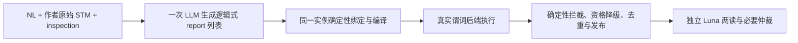

# A3：一次生成逻辑式报告的消融事前协议

本协议依据 [伞 PR #179](https://github.com/HansBug/research_ideas/pull/179) 与 2026-09-10 用户十二部分中文合同。A3 检验撤除中间发现引导后的报告产出与覆盖变化。首阶段先 Sonnet、再 Luna，各同一冻结 54 pair × 3 round = 162 格，合计 324 格。Qwen/Muse 属后续阶段，本协议不授权启动 O2 或自动合并。依赖保持 `P1 -> A3 AND A4 -> O2 -> W1 -> FREEZE`；A2 非阻塞，A4 独立施工。

## 1. 干预与适用覆盖

**显式 override：** 本次正常 method 仅有一次生成 LLM 调用，关闭内部 D 及其纠错。此定义覆盖 #179 旧 §4.6 的“保留原有末端语义判定”和“一次仅指发现阶段”；A1/A2 [消融公约](../../protocol/ablation_design_and_parallel_contract.md) 的三值枚举限制仅对原两路有效，本次追加互斥的 `direct-report` 值，不改变既有条件语义。外部 Luna judge 独立执行，不计作 method 生成。传输重试、定向格式/引用/类型纠正单列异常审计，不允许追加语义发现。

生成阶段仅可见完整 NL、作者源、inspection、中立来源/模型身份映射、十二谓词定义和 typed 输入约束。必要 FCSTM 编译表示用于同一实例绑定与执行。不读取 ledger、145 expected issues、judge 标签、Full/A2/A4 历史报告或语义契约。禁止 lens、覆盖清单、义务分解、frontier 或领域规则推导被压缩回单个 prompt。

## 2. 真实消费者关闭表

下列函数均位于 [runner.py](../../../../method/src/paper_stm_method/orchestration/runner.py)，除特别标明者；运行前测试以不可调用哨兵验证，而非仅检查 stage 名称。

| 消费者 | A3 处置 | 证据与边界 |
| --- | --- | --- |
| `_method_cell` | 增加显式 A3 分派 | 原 Full/A1 分支和 prompt/schema 不改 |
| contract_extraction / contract_completion / segment coverage | 关闭 | 不提取、补全或枚举全域契约 |
| discovery_grounding 两 lens | 关闭，替换为一次 direct report | 输出为最终主张唯一来源 |
| `semantics/frontier.py:materialize_typed_frontier` | 关闭 | 含 source divergence 新候选 |
| `materialize_domain_invariant_contracts` | 关闭 | 不物化领域不变量候选 |
| source-transition closure 新发现 | 关闭 | 可解析精确映射，不扫描余下模型 |
| `_materialize_exact_s2_inventory_candidates` | 关闭 | inspection 只作输入 |
| `_materialize_deterministic_execution_probes` | 关闭 | 不补 probe 或候选 |
| `_admit_grounding_unresolved` / `_admit_frontier_unresolved` | 关闭 | 不由缺口新增实质 claim |
| 自动候选扩展、coverage repair、语义反馈修订 | 关闭 | 全部标记 disabled_by_ablation |
| `_prepare_candidate` 中精确映射、binding、compile、backend | 逐项复用 | 仅处理已生成实例，检查任何隐式路由/主张修改 |
| 内部 d_adjudication / correction / rebuttal | 关闭 | 不伪造 D 同意 |
| publish | 最小 direct-report 适配 | 真值拦截、W 资格、来源资格、精确去重与主张可追溯 |

## 3. 输出与发布合同

一次结构化输出无候选数人为上限。每条含标题、requirement quote/依据、作者源引用与位置、locus kind/names、property、violation_direction、expected/observed、reason/basis、predicate ID、注册表合法 typed inputs、必要变量及精确 binding refs。沿用 registry/compiler/backend 表示，不执行生成代码，不接受自报 verdict 或评测 K/N/I、D/A、L。若内部类型要求 contract_id，从同条报告派生唯一 ID 和最小契约适配，不另造语义义务。

true 检查成立：保留执行审计，拦截相同缺陷主张。false 仅作为执行证据，外部 judge 决定有效性。unknown、不适用、无法闭合和 predicate-null：具体 source-backed 主张按原适用资格保留 W1，无法具体定位为 W0/结构化缺口；不假造 W2、不默删困难格。全局范围外主张不发布。参数不唯一绑定不得宣称执行证明。内部 D 状态显式为 disabled_by_ablation，发布不依赖虚构 D2/D1。

逐条保存生成 report -> 绑定 -> plan/receipt -> filtered/published/folded 的映射；final 实质主张必须来自唯一生成输出，折叠不得扩大主张集合。唯一 final report 是评测分母，不按 predicate/facet 数重复计数。零报告格保存正常完成回执。

## 4. 来源、模型与冻结

Sonnet Full 从 [E2 cells](../../../../final_results/e2_20260907/sonnet/cells.json) 的 ours/source/hash 读取；原件为 E2 raw 下的 source 相对路径。Luna 从 [luna_history.json](../../../../final_results/e2_20260907/luna_history.json) 的 verification.arms.ours.cells 读取，0045/r1 固定使用 `v61_current_fill0045/method/0045/round-1.json`，其余通常为 `v61_current/method/method/<pair>/round-N.json`，以 manifest 为准。Full 只读，不新增运行或 rejudge；前后逐文件 hash 核验。

运行前离线重算参考 K/N/I：Sonnet 536/183/104，823 报告，719/823=87.36%；Luna 561/198/144，903 报告，759/903=84.05%。这些是待核验的 Full 参考值，不是 A3 预测。Luna 历史十二谓词按现有 predicate_id_mapping 展示同组分析，保留原 ID/定义版本。

真实调用必须用 utils.llm profile 与显式 live/full-live。profile 精确模型、provider/endpoint、temperature、context/max output、输入集合、prompt/schema、代码、轮次、条件与 worker 参数进入运行 manifest/hash；运行前与 Full 逐项核验并冻结。不同条件/模型/输入/配置不得 resume 为 A3。原始输出、usage、finish_reason、截断、错误和重试留审计；配置明文不打印、不入库。prompt generator 不读取凭据。

## 5. 调度与裁定

method 活跃总配置为 16 workers，先 Sonnet 后 Luna，共享上限，不为三轮重复启动三个 16-worker 驱动。judge 固定 Luna，实验 r1/r2/r3 各 8 workers，三个队列同时工作，跨模型总上限 24。复用原 CLI、锁与严格 resume；各轮首批 ready 后即可判定，未 ready 排队，零报告直接核销。每个 worker 保留标准两次独立读与必要仲裁。真实 PID、参数、吞吐、失败/降级/待判数量和首批 ETA 只记 PR。

judge 只判 A3 唯一 final report，使用标准盲投影，不把执行 verdict、内部标签、Full 标签或 expected 答案送入 validity；relation 按既有隔离协议使用 expected。A4 true-I oracle 与 Full 内容复用规则不适用于 A3。仅完全相同输入/配置 hash 的已完成 A3 judge 可 resume。所有报告和关系映射必须闭合，人工确认数量如实为实际值。

## 6. 事前假设与分析

待检验 H1：相较同模型 Full，A3 的 K+N 与 hit 下降；H2：precision 可能明显下降。变化方向和幅度均不是验收门槛。A3 保留真实执行拦截，不用 raw-direct/A2/A4 估算替代实测。若有效量下降而 I 近似不变，精度变化主要体现有效报告量变化；若 I 同降而精度变化小，区分发现能力损失与执行筛除效应，不声称等效。

主表给双方完整三轮 pooled micro precision、逐轮 54 格结果、K/N/I、K+N、总报告、I/完成格、precision 百分点差、hit@1/@3/@all、L1/L2、唯一 expected-hit 增减。145 expected 和 435 expected-round 分母固定，N 报告不当独立新缺陷。配对保留同 pair 三轮相关性，使用既有九 NL 簇稳健性与区间估计；数值变化与统计显著分开。未全判的中间值标明覆盖分母。

完整漏斗为生成 -> 合法绑定 -> true/false/unknown -> 执行拦截 -> final -> K/N/I。内容分析使用既有需求、结构/行为、局部/跨状态、引用、谓词族与模型位置分类，给 Full 独有有效、A3 独有有效、共有与无效案例及来源。按实质 claim 比较，不能只靠 ID/标题/reason 长度。

## 7. 验收与交付

运行前使用 1-3 个真实/准真实 fixture：一格涵盖真实 true/false/unknown 和 predicate-null，一格覆盖零报告/失败降级，一格对拍默认 Full/A1 并验证 worker/resume。必须证明：正常一次生成、全部关闭消费者零调用、inspection 可见与 ledger/历史不可达、合法 typed binding 与真实 receipt、自报 verdict 拒绝、过滤/降级正确、无新增 claim、去重/零报告分母闭合、A3 身份全链路传递和旧条件行为不变、16 与三组 8-worker 无同格双写。

provider-free 验证通过后，预选首三个按 ID 排序的范围内 pair 的 r1 进行真实 smoke；合同/配置未变且合格的格纳入162，避免重复调用。发现设计错误先修接口，旧原件保留并登记版本/eligibility，不通过整格 MAXTRY 冷启动抽样择优。代码、协议和配置身份先 push 再运行。

首阶段交付必须为 Sonnet 162/162、Luna 162/162 method 完整交代、所有发布报告和必要读/仲裁核销、无 pending/漏格、三轮分母闭合。终止失败不当成功。提供统一 provider-free 离线复算，重建来源清单、阶段计数、报告/判定映射与主表；原 Full hash 不变。交付代码/测试、协议、可入库索引与结果、逐格审计、中文分析及合同/实现/数值/来源/解释 review；影响有效性的 C/I 须有处置证据。四模型 A3 与 A4 完成、review、合流前不放行 O2。
