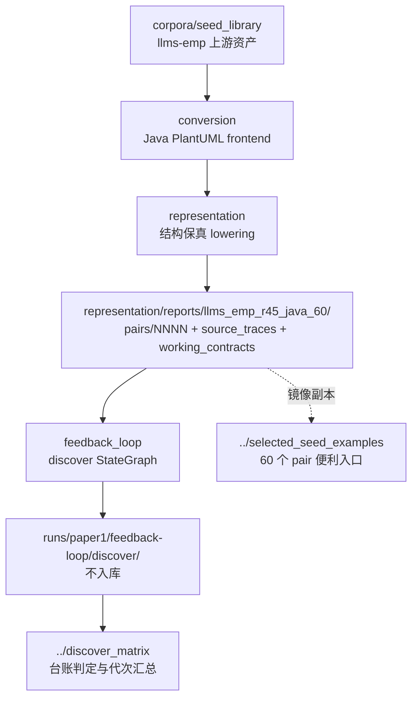

# pipeline/ — 方法实现与输入准备链路

> **导航页。** 本目录是 paper1（STM issue discover）的**代码**所在处：一条准备链（PlantUML → canonical JSON → `.fcstm`）加一条发现链（NL + `.fcstm` → issue + 断言）。评测与结果**不在这里**，在 [../discover_matrix/](../discover_matrix/)。

## 1. 先看一眼：哪个目录在跑，哪个不在

**六个子目录中只有两个参与「跑一格实验」这件事**：

| 子目录 | 是什么 | 在运行路径上？ | 依据 |
| :-- | :-- | :-- | :-- |
| [feedback_loop/](./feedback_loop/) | **当前活的 discover 实现**。Requirement-to-Assertion StateGraph，包 `paper_stm_feedback_loop` | 🟢 | 根 `Makefile` 的 `discover*` 目标全部转发到这里 |
| [representation/](./representation/) | 表示桥。产出 discover 每次真正读的那份输入目录 | 🟢 | `discover/cli.py` 的 `REPORT_ROOT` 硬指向 `representation/reports/llms_emp_r45_java_60/` |
| [conversion/](./conversion/) | PlantUML → canonical。表示桥的上游 | 🟡 | 产物已冻结；只有换语料或改前端时才重跑 |
| [readiness_audit/](./readiness_audit/) | R5 语料准入审计。判断哪些 seed 能进后续阶段 | 🟡 | 结论已固化在 `handoff/`；60 例已选定，不再重跑 |
| [evaluation/](./evaluation/) | 只剩两份 v0 schema + fixture + 门禁测试 | 🔴 | 论文的评测在 [../discover_matrix/](../discover_matrix/)，不在此处 |
| [agent_loop/](../archive/r9_agent_loop_pipeline/agent_loop/) ⚠️ **已于 2026-08-11 归档** | **上一版单 Agent 实现，已退出运行路径**，代码完整保留在 [archive/r9_agent_loop_pipeline/](../archive/r9_agent_loop_pipeline/)（配复活导引） | 🔴 | 入口改名为 `make legacy-discover-*`；包 `paper_stm_repair_loop` |

口径：🟢 当前运行路径 ｜ 🟡 产物已冻结、按需重跑 ｜ 🔴 不在运行路径上

⚠️ **改方法请改 [feedback_loop/](./feedback_loop/)。** 旧的 agent_loop 已于 2026-08-11 归档到 [archive/r9_agent_loop_pipeline/](../archive/r9_agent_loop_pipeline/agent_loop/)，不在本目录下，也不要改它。 两者的目录结构、fixture 名、prompt 都长得很像，改错地方不会报错，只会毫无效果。

## 2. 数据流：一格实验从哪读到哪写



三点容易踩错：

1. **discover 的输入根不是 [../selected_seed_examples/](../selected_seed_examples/)**，而是 `representation/reports/llms_emp_r45_java_60/`。前者是内容逐字节相同的镜像副本，供人阅读；已核对 pair `0000` 的 `nl.txt` 与 `.fcstm` 两侧 SHA-256 一致。只有退役的 `paper_stm_repair_loop.inputs.load_pair()` 才读 `selected_seed_examples/`。
2. **运行产物写 `runs/`，而 `runs/` 全目录被 `.gitignore` 排除。** 事前登记、判据、报告必须落到 [../discover_matrix/](../discover_matrix/)，写进 `runs/` 等于没提交。
3. **网格是 54 pair，不是 60。** 末位为 `8` 的 6 个 pair 因建模对象边界排除，判据只读 `nl.txt`；见 [../discover_matrix/docs/protocol/nl_scope_rule.md](../discover_matrix/docs/protocol/nl_scope_rule.md)。

## 3. 怎么用

### 3.1 跑一次 discover（唯一活入口）

真实 LLM 前必须先 `source .env`。以下都在**仓库根目录**执行：

```bash
make discover-demo                                          # 自包含 identity fixture，不占正式语料
make discover-pair DISCOVER_PAIR=llms_emp_feedback_final_0029 DISCOVER_PROFILE=gpt-5.5
make discover-test                                          # 转发到 feedback_loop 的 1755 个测试
```

等价的 `python -m` 入口与全部 CLI 参数见 [feedback_loop/README.md](./feedback_loop/README.md)。

### 3.2 跑退役实现（只为对照，不产出论文数据）

```bash
make legacy-discover-demo
make legacy-discover-test
```

### 3.3 重跑准备链

```bash
# 编译 Java PlantUML frontend，再重放 60 例（写到新目录，不覆盖已封存证据）
make -C project_1_llm_state_machine_modeling/paper_stm_issue_discover/pipeline/conversion/java/plantuml-state-frontend fetch compile
PYTHONPATH=pyfcstm:.../conversion/src:.../representation/src \
python .../conversion/tools/run_llms_emp_r45.py --output-dir .../llms_emp_r45_java_60_replay
```

完整路径与覆盖保护规则见 [representation/README.md](./representation/README.md) §3。

### 3.4 准备链与门禁测试

```bash
P=project_1_llm_state_machine_modeling/paper_stm_issue_discover/pipeline
PYTHONPATH=$P/readiness_audit/src:$P/representation/src:$P/conversion/src \
python -m pytest $P/conversion/tests $P/representation/tests $P/readiness_audit/tests $P/evaluation/tests
```

各套当前规模：`conversion` 144、`representation` 129、`readiness_audit` 8、`evaluation` 45，合计 326；`feedback_loop` 另有 1755；`agent_loop` 已于 2026-08-11 归档，其测试数不再计入本表66。

## 4. Python 包名：三个已去掉 `repair`，一个随归档冻结

工作区 2026-08-11 从 `paper_stm_repair/` 更名为 `paper_stm_issue_discover/`。同日**三个 live 包已去掉 `repair` 字样**；第四个随 `agent_loop` 一并归档，⛔ **不改名**——改归档内容等于篡改冻结件。

| 目录 | 包名 | 备注 |
| :-- | :-- | :-- |
| `conversion/` | `paper_stm_conversion` | ✅ 2026-08-11 改名，原 `paper_stm_repair_conversion` |
| `representation/` | `paper_stm_representation` | ✅ 2026-08-11 改名，原 `paper_stm_repair_representation` |
| `readiness_audit/` | `paper_stm_smoke` | ✅ 2026-08-11 改名，原 `paper_stm_repair_smoke`。⚠️ 仍与目录名不同（该目录原名 `pipeline/smoke/`） |
| `archive/r9_agent_loop_pipeline/agent_loop/` | `paper_stm_repair_loop` | 旧名，⚠️ **随归档冻结、不改名**——改归档等于篡改冻结件 |
| `feedback_loop/` | `paper_stm_feedback_loop` | 新包，本来就不带 `repair` |

**这是有意为之，不是遗漏。** 改包名会同时打断已提交的 run record、report 里的 `generator_cli_sha256`、implementation-tree hash 与全部 `PYTHONPATH`；留待单独一轮做，届时必须配迁移测试。看到 `paper_stm_repair_*` 时按上表对应即可。

## 5. ⚠️ 各套件的规范跑法（同一批测试，跑法不同结果不同）

**本仓库的测试结果依赖 cwd 与 `PYTHONPATH`。** 同一套测试换个跑法，通过数会变——2026-08-11 曾因此**两次差点误报回归**：`project_1/tests` 从仓库根跑是 collection error、从 `project_1/` 内跑是 `2 failed`、只有下表这个口径才是 `40 passed`。⛔ **判断「我是不是改坏了」之前，先确认跑法与基线一致**，否则比的是两个不同的东西。

原因是两类约束互相拉扯：`archive.*` 这类导入要求 `project_1_llm_state_machine_modeling` 在 `sys.path` 上，而测试内部用的是**仓库根相对路径**，要求 cwd 是仓库根。两者必须同时满足。

| 套件 | 规范跑法（cwd = 仓库根） | 当前基线 |
| :-- | :-- | :-- |
| `feedback_loop` | `python -m pytest <此目录>/feedback_loop -q` | 1860 passed, 4 skipped |
| `discover_matrix` | cwd = `paper_stm_issue_discover/`，`python -m pytest discover_matrix -q` | 1 failed, 412 passed |
| `conversion` / `representation` / `readiness_audit` | cwd = `paper_stm_issue_discover/`，三个目录一起传 | 121 failed, 160 passed |
| `project_1/tests` | `PYTHONPATH=<repo>/project_1_llm_state_machine_modeling:<repo>` | 40 passed |
| `archive/r9_agent_loop_pipeline/agent_loop/tests` | 同上，另加 `<该目录>/src` | 1 failed, 265 passed |
| 仓库根 `tests/`、`tools/` | 直接跑 | 158 passed / 68 passed |

⚠️ **那 121 个失败不是回归**：全部是缺 pinned PlantUML jar（`Pinned PlantUML 1.2024.7 jar not found`，需 `make fetch`），是环境依赖。⛔ **不能拿「CI 绿」当这三套的健康判据**，也不要为了让它变绿去改测试。同理，`archive/r9` 那 1 个失败依赖被 gitignore 的 `runs/` 产物，在干净 clone 上无条件失败——搬迁前后完全一致。

## 6. 归因纪律（会影响论文结论，不是工程偏好）

1. conversion / normalization / lowering 带来的**可解析性改善单独归因**，不得计入方法效果。全部 loss ledger 中 `repair_contribution_allowed` 恒为 `false`。
2. 上游 `llms-emp` 论文作者自己的 Phase-II checking 收益**不属于本方法**；58 例取 Phase-II 输出，`0054/0055` 回退 Phase-I，两者都不得写成本研究的产出。
3. 编译器自造的支架元素（`FinalWait*`、`R45RouteToken` 等）**不得升级为作者缺陷**。
4. 判缺陷读**作者源**（`plantuml.puml`），不读编译产物（`.fcstm`）——只读后者会把编译债务当成模型缺陷。

## 7. 与工作区其它目录的关系

- [../discover_matrix/](../discover_matrix/)：评测、台账、判定口径、代次结果。**结论都在那边。**
- [../selected_seed_examples/](../selected_seed_examples/)：60 个 pair 的人读镜像。
- [../corpora/](../corpora/)：上游语料与文献库；pipeline 只消费其已登记事实。
- [../experiment_design/](../experiment_design/)、[../evidence/](../evidence/)：早期设计与审计材料，均已不在运行路径上。
- [../archive/](../archive/)：本工作区内部历史快照（含旧 Better STM evaluation gate 全树）。
