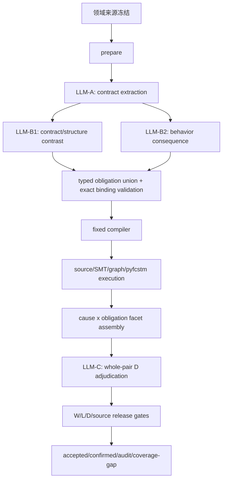

# Paper1 领域来源驱动的可执行义务发现方法

状态：本文是新方法的学术叙事与实现合同主稿。方法语义只由外部领域研究、UML 元模型与形式验证/软件测试传统建立；真实 benchmark 输入只用于统一效果评估，工程调试只用于确认实现是否符合既定合同。

## 1. 三段式 story

第一段是方法来源：真实控制系统案例、工业性质库、状态机质量检查、UML 元模型、guard completeness/consistency 和 property-specification pattern 已经给出反复出现的检查任务与可表达性质。本文先复用 PR #183 已检索并裁定的来源池，再只对新 surface 的证据空白做定向补检，从而归纳五类 typed obligation，并明确哪些 operator 是基础义务、派生宏、后端比较或证据不足扩展；完整逐项来源见 [TYPED_OBLIGATION_PROVENANCE.md](./TYPED_OBLIGATION_PROVENANCE.md)。

第二段是方法运行：给定 numbered NL、作者源 PlantUML、带逐元素语义映射注释的 FCSTM、working contract 与 `pyfcstm inspect`，LLM 只负责开放语义工作，即抽取规范义务、处理跨句指代与作用域、选择精确形式元素；确定性层只处理 schema、精确 ID、AST、图、SMT、trace、hash、预算和执行。每个候选被编译为 typed Evidence Program 并真实运行，随后整格一次 D 裁决为每条 finding 独立输出 D2/D1/D0，发布层机械输出 W2/W1/W0、L2/L1/L0、source attribution、accepted/confirmed 状态和完整 receipt。

第三段是效果验证：冻结同一方法版本后，在完整 54 pair、145 条台账上统一评估，不作数据集角色拆分。论文同时报告 overall 与各 D×L 分层的 `hit@1/@3/@all`、precision、false positive、W2/W1/W0、source-attributable W2、degraded/unsupported grid、同模型美元成本倍率，以及相对 X1v2 的 pair-clustered uncertainty；成功条件是 overall 显著领先 X1v2，同时尽可能覆盖 D2×L2、降低 false positive，并让高 D finding 尽量达到 W2。

## 2. 问题定义

输入不是“待逐句复现的文字”，而是一个部分、非形式的 test oracle：自然语言给出系统义务，作者源状态机与转换后 FCSTM 给出被测实现的两个表示。目标是发现状态机不满足义务的地方，并把每个报告从散文主张推进到可执行、可归因、可重放的证据对象。该定位来自 test oracle problem，而不是本文自造，基础来源是 Barr et al. 的综述：[The Oracle Problem in Software Testing](https://doi.org/10.1109/TSE.2014.2372785)。

本文的核心研究缺口不是“形式判据不存在”。ACCESS 已能把 EOL 查询挂到 RoboChart 具体迁移并执行；SV-COMP witness、模型检查 counterexample 与成熟测试框架也早有可重算证据。更准确的缺口是：现有近邻通常从人工结构化需求、人工安全目标或人工 property 开始，原始 NL 到 typed executable obligation 的语义桥接仍主要由人完成；仓库对该边界的证据见 [c3_iii_supplement.md](../../../related_work/provenance/c3_iii_supplement.md) 与 [PR #183](https://github.com/HansBug/research_ideas/pull/183)。

LLM4MDE 调研对应 [PR #186](https://github.com/HansBug/research_ideas/pull/186)。第三方 N=86 映射研究中 model validation 是少数方向而不是空白；因此论文不主张“首次用 LLM 验证模型”，而主张把原始 NL 义务发现、作者源/转换制品双绑定、真实执行证据、规范性 D 裁决和逐 finding receipt 连接成一条可审计方法链。

## 3. 领域来源账

| 领域来源 | 可复用的定义性构件 | 本方法中的投影 | 不能外推的内容 |
|---|---|---|---|
| Chow 1978，[FSM testing](https://doi.org/10.1109/TSE.1978.231496)；Lee & Yannakakis 1996，[survey](https://doi.org/10.1109/5.533956) | output/transfer/state-count 等故障域与序列测试传统 | element、transition endpoint、行为序列与可区分后果 | 经典 FSM 不覆盖层次、守卫和任意 NL 语义 |
| Lackner & Schmidt 2015，[EPTCS 180](https://doi.org/10.4204/EPTCS.180.4)；Fabbri/statechart mutation 传统 | model-element deletion/insertion/property change；transition、trigger、guard、effect 等 mutation target | ElementObligation 与 AttachmentObligation；缺失、多余、错误目标/归属的对偶义务 | 一阶 mutation 不能完整表达跨句、多要素合取和全局行为 |
| OMG UML 2.5.1，[规范 PDF](https://www.omg.org/spec/UML/2.5.1/PDF) | state/region/transition/trigger/guard/effect 元模型、良构性约束和刻意未规定边界 | exact source metamodel query、language-clause receipt、D2-lit 的 language grounding | UML 没有规定的内容不能冒充语言违规；orthogonal semantics 不在当前 W2 fragment |
| Heimdahl & Leveson 1996，[completeness and consistency](https://doi.org/10.1109/32.508311) | 按 state/event 检查条件覆盖与条件互斥 | GuardSetObligation 的 `disjoint` 与 `complete`，SMT countermodel/coverage gap | 不透明自然语言条件不能靠字符串规则形式化 |
| Dwyer, Avrunin & Corbett 1999，[property patterns](https://doi.org/10.1145/302405.302672) | response、precedence、existence、absence、universality 与 scope 组合 | TemporalObligation 的 pattern × scope | pattern 目录降低表达成本，但不自动完成 NL 到 property 的绑定 |
| Baier & Katoen；模型检查 counterexample 传统 | reachable state、finite path、deadlock、termination、counterexample | GraphObligation 与 TemporalObligation 的 path/trace/SCC/cut receipt；L1/L2 分界 | 有界执行不能被写成无界证明；转换制品反例可能是 representation debt |
| Das & Dingel 2015，[UML-RT antipatterns](https://doi.org/10.1109/MODELS.2015.7338235)；Heitmeyer et al. 1996，[SCR consistency](https://doi.org/10.1145/234426.234431)；Sims et al. 2001，[Salsa](https://doi.org/10.1109/ASE.2001.989794) | 接近100个模型的 antipattern、A-7E 的57个 disjointness reports、Ford powertrain 的成批 nondeterminism/missing-case/dead-code checks | GuardSet 的现实任务依据与 false-positive 风险；Graph reachability/dead-code 的应用依据 | tool report 数不是确认缺陷数，也不是跨系统发生率 |
| Barr et al. 2015，[oracle problem](https://doi.org/10.1109/TSE.2014.2372785) | partial oracle、implicit oracle、blatant fault | D2-impl 的封闭 deadlock 类；W2 仍与 D 独立 | 工具 warning 不能自动成为规范义务 |
| Pollock 1987，[defeasible reasoning](https://doi.org/10.1207/s15516709cog1104_4)；Massey et al. RE 2014 | undercutting defeater 与 multiple reasonable interpretations | D1 的“第二种称职读法”与最强 defeater 字段 | D 仍是 LLM 语义裁决，不能由字符串或执行真假机械推出 |
| Verification witness 与 test-report 传统，[Verification Witnesses](https://doi.org/10.1145/3477579)；SARIF 2.1.0 | machine-readable witness、validator、artifact location、tool metadata | Evidence Program、execution receipt、source-causality certificate、hash chain | receipt 只在声明的 soundness fragment 内有效 |
| nl2spec，[CAV 2023](https://doi.org/10.1007/978-3-031-37703-7_18)；Endres et al.，[FSE 2024](https://doi.org/10.1145/3660791) | LLM 从 NL 形成形式性质/后置条件的可行性与风险 | LLM-A/LLM-B 负责 semantic obligation 与 binding，compiler 不解析自由文本 | LLM 输出必须经过 typed schema、执行与独立 D，不把生成本身当证据 |

完整缺陷类型学见 [defect_taxonomy.md](../../../discover_matrix/docs/protocol/defect_taxonomy.md)。PR #183 复用的是经过裁定的来源与事实，不是旧 19 谓词的分类或闭合词表；新方法的一等对象是以下五类义务，25 个旧 relation 只作为 lowering operation 保留。逐 operator 的复用来源、新增来源、现实基数、合法分母和证据缺口见 [TYPED_OBLIGATION_PROVENANCE.md](./TYPED_OBLIGATION_PROVENANCE.md)。

## 4. Typed obligation surface

| 义务族 | 正式问题 | 典型字段 | 主要反例 | 当前 W2 后端 |
|---|---|---|---|---|
| `ElementObligation` | 某类模型元素是否应存在或满足 NL 明示 cardinality | `element_kind`、`operator`、`subject_ref`、`expected_count` | required state 缺失、extraneous transition、成员集合不完整 | source/artifact AST、inspect inventory |
| `AttachmentObligation` | 一个元素是否附着在正确 owner/slot/endpoint | `attachment`、`subject_ref`、`owner_ref`、`reference_ref` | wrong target、wrong containment、guard/effect 挂错边、action phase 错误 | source AST、mapping projection、双边 endpoint assertion |
| `GuardSetObligation` | 同一 `(source,event)` 的守卫集合是否 satisfiable/disjoint/complete | `property`、`scope_ref`、`transition_refs` | dead transition、guard overlap、coverage hole | 声明 grammar 内的 guard AST + SMT |
| `GraphObligation` | 状态图是否满足 reachability、deadlock freedom 或 path exclusion | `property`、`source_ref`、`target_ref`、`forbidden_scope_ref`、`bound` | unreachable component、reachable deadlock、forbidden route | source/FCSTM graph、path/cut/SCC、必要时 bounded trace |
| `TemporalObligation` | Dwyer pattern 在某 scope 内是否成立 | `pattern`、`scope`、`trigger_ref`、`response_ref`、`state_ref`、`bound` | missing response、precedence/absence/universality violation | pyfcstm trace/BMC，保存 counterexample trace |

五类义务不是从145条台账归纳的标签，而是把现实控制系统检查、工业性质、元模型定义、guard completeness/consistency、图性质与五类 property pattern 归纳成最小表达面。`absent`、event-target response、termination、holds-until 等只作为固定派生宏；`kind_is`、formula equivalence/implication、event-consumer reachability 只作为后端比较或前置 receipt；`containment` 与 exact cardinality 明确标记为证据不足扩展。

当前 Python 原型已把该 surface 实现为五类 Pydantic discriminated union。每个新候选必须携带 `domain_obligation`；旧 `EvidenceGoal.relation` 只决定 compiler lowering。确定性层按 exact operator 而非 family 粗粒度检查预注册兼容表，不从 obligation/claim 文本推理；不兼容时产生独立 `SupportDisposition`，有定位则 W1、只有散文则 W0，不会被强行送入错误后端。

## 5. 完整 LangGraph 流程



| 阶段 | 输入 | 输出 | 跳转与失败处理 |
|---|---|---|---|
| `domain_freeze` | 外部文献、UML 元模型、pyfcstm 可执行片段 | obligation taxonomy、operator roles、compiler registry、soundness table、prompt hash | 任何能力没有领域来源时不进入 core；没有 sound backend 时由 `SupportDisposition` 降级，不查 benchmark 补洞 |
| `prepare` | NL、PlantUML、FCSTM、working contract、source trace | numbered NL、canonical source IR、带 mapping comments 的 FCSTM、verify/SMT inspect、artifact hash | parse/inspect 内部失败记 structured coverage gap，pair 继续 |
| `contract_extraction` | 仅 numbered NL | explicit initial/containment/transition/state/event-scope contract 与跨句 concept ID | 一次 schema 定向修复；该节点看不到制品，防止错误模型改写规范 |
| `discovery_grounding` × 2 | 同一 NL contract、四视图、inspect frontier、exact inventory | typed obligation、精确 concept/state binding、initial/containment sparse semantic veto、每个 raw transition target 的穷尽 observed-transition binding、observed fact | 两个互补 lens 独立运行；fresh 分支必须逐 raw group、逐 target 完整覆盖，任何缺失、重复或越界索引都会让该分支整体隔离且不得执行；exact binding 冲突可机械 veto，语义冲突不得按文本相似度裁决；满足的 transition contract 在执行后过滤，不占 D 输出 |
| `compile` | typed obligation、lowering op、exact formal IDs | Evidence Program、backend、preconditions、oracle、soundness fragment、replay code/hash | 缺字段、family 不兼容或 unsupported 均降级，不让 pair 崩溃 |
| `execute` | Evidence Program、精确 source/FCSTM artifact | terminal verdict、observations、trace/path/cut/SCC/SMT model、source certificate、tool/config/hash | assertion satisfied 只记 attempt；counterexample 进入 finding；exception 逐候选降级 |
| `facet_assembly` | obligation、cause、execution/source receipts | 每个 `(cause, obligation)` 一条 finding facet | 相同 cause 的多个义务不共享 D；报告层先按精确 cause key 聚类并保留 facets |
| `d_adjudication` | 首轮输入整格 numbered NL、全部压缩 finding dossier、共享一次的 source state/transition inventory、language clause，不含 W label | 每个 finding 恰好一个 DDecision，同时可用 exact `duplicate_of` 边标记报告级语义重复 | 首轮整格一次调用且禁止 batch；若 decision 的 key 合同、D 语义合同或 duplicate 引用非法，确定性 validator 冻结全部合法 decision，只把非法 finding、对应 dossier、精确错误和冻结 decision 摘要送入一次 targeted repair；修复仍失败时仅该子集 `D_UNRESOLVED`，其他 decision 原样保留；structured-output 整体不可解析时才允许同一节点做一次带错误位置的结构修复 |
| `publish` | finding + D/W/L/source receipts | accepted、confirmed、D0 audit、coverage gap、usage/cost | D1/D2 的 W0/W1 仍可 provisional 发布；W2 若 source attribution 不安全则不能冒充作者源 issue |

整个流程没有 execution-truth feedback 搜索回路。LLM-B 看不到 assertion true/false，不会在失败后换一个更容易得到 counterexample 的义务；backend bug 修复后 replay 同一个 typed obligation。只有 provider 错误和穷尽定向修复后仍 schema-invalid 可以让整格失败，其他内部错误一律降级并落盘。任何 LLM 返工都进入计费，只有确实触发下一次调用的 provider/transport retry 前序失败 attempt 可以豁免；未重试的 provider 失败、schema 修复、output-limit、D targeted repair 和所有内容返工都计费并保留审计。

## 6. Evidence Program 与 W2

选择结论：不让 LLM 自由写 Python，也不把旧谓词列表当论文表达面。LLM 生成 typed obligation 与 exact bindings，固定 compiler 决定 source AST、guard SMT、graph proof 或 pyfcstm trace/BMC 后端，并渲染可重放 assertion code。这样保留开放语义表达能力，同时把执行、source attribution、hash、异常和 soundness 边界固定在方法内。

一个 Evidence Program 至少包含：`domain_obligation`、`nl_anchor`、`formal_bindings`、`semantic_binding_receipt`、`preconditions`、`oracle`、`backend`、`soundness_fragment`、`source_cause_check`、`compiled_code_sha256` 和 `artifact_sha256`。候选另外保存 LLM 的 `basis` 与 `observed_fact`，D dossier 保存 `rationale`、`strongest_defeater` 和 `defeater_disposition`；这些字段让审计者能够重建语义判断依据，但不进入 assertion code/hash，也不替代 formal receipt。程序运行后产生 Execution Receipt：`terminal`、`verdict`、`counterexample_found`、`observed_values`、`trace/path/cut/SCC/SMT_model`、`engine/tool_version`、`limitations`、`source_causality_certificate` 与完整 call/plan/candidate hash chain。

W2 的机械判据是：存在 typed Evidence Program；程序在记录 hash 的确切制品上真实运行；terminal verdict 为 counterexample；receipt 与 compiled assertion hash 闭合；若报告作者源 issue，还必须有安全 runtime path、source direct certificate 或 source/FCSTM causal dual certificate。生成了代码但没有运行、运行异常、precondition 未满足、结果 inconclusive 或 source cause 不闭合都不能算 W2。

W1 表示已经定位到具体 source/artifact element、path 或 unsupported obligation，但没有合格 terminal counterexample；W0 表示只有散文义务或定位也未闭合。W1 是 W2 的兜底，W0 是 W2/W1 的最终兜底；D1/D2 的 W1/W0 finding 仍进入 accepted/provisional 输出，因此“尽量 W2”不会变成“做不到 W2 就把问题丢掉”。

### 6.1 合成示例

NL 写作“收到 `evt_a` 后，控制器应从 `q0` 进入 `q1`”。LLM 产生的论文级义务是：

```json
{
  "family": "temporal",
  "pattern": "response",
  "scope": "after",
  "trigger_ref": "evt_a",
  "response_ref": "active(q1)",
  "scope_ref": "q0",
  "bound": 3
}
```

LLM 同时绑定 exact state/transition ID；compiler 将它 lower 为固定 Evidence Program：先验证 `q0` 可达，再施加 `evt_a`，最后检查三步内 `q1` active。示意 code 为：

```python
precondition = reaches(source="[*]", target="M.q0", within_cycles=6)
observed = occupancy_after(source="M.q0", trigger="evt_a", target="M.q1", within_cycles=3)
assert precondition, "paper1 evidence precondition failed"
assert observed is True, "paper1 formal evidence assertion failed"
```

若 `q0` 不可达，结果是 `precondition_failed`，该义务不能靠错误前件得到 W2；若 `q0` 可达且 `q1` 未在三步内激活，receipt 保存实际 trace 并得到 W2；若两个断言都成立，则只保留 satisfied attempt，不发布 issue。LLM 不选择 `occupancy_after`，也看不到执行结果后改写义务。

## 7. D、W、L 的独立性

| 维度 | 定义 | 产生者 | 例 |
|---|---|---|---|
| D2 | 有可陈述的被违反义务，最强 rebutting/undercutting defeater 已被击败 | 独立 LLM-C，随后机械检查引用与枚举合同 | NL 明文要求返回初始态，source/trace 显示没有返回路径 |
| D1 | 有第一读法 grounding，但存在与结构事实相容的第二种称职读法或未决 undercutting defeater | 独立 LLM-C | 自由 label 可被读作 trigger，也可被读作普通显示文本 |
| D0 | 没有可陈述义务、存在有效 rebuttal、或事实只是合法设计 | 独立 LLM-C | 持久反应式模式形成 SCC，但 NL 未要求终止 |
| W2 | typed program 真实执行并得到合格 counterexample receipt | deterministic executor | trace、SMT model、path/cut/SCC 或 exact AST assertion |
| W1 | 具体定位存在，但执行不支持、失败或 inconclusive | deterministic release layer | orthogonal region obligation 已定位但当前后端不执行并发 |
| W0 | 仅有散文假设 | deterministic release layer | LLM 认为语义可疑，但无法绑定任何 exact element |
| L0 | 直接 inventory/edge/label 对照 | relation-to-L registry | missing state、extraneous edge |
| L1 | 需要静态结构或 guard 推导 | relation-to-L registry | containment、guard overlap、cardinality |
| L2 | 需要 path/reachability/response/termination 行为构造 | relation-to-L registry | unreachable、deadlock、wrong-scope trace、nontermination |

D prompt 必须给出上述定义和合成例子，并要求先写 `grounding`、`violated_obligation`、`strongest_defeater`、`defeater_kind`、`defeater_disposition`，最后才输出 D。D 看不到 W label，不能因为“断言执行过”就把规范性抬到 D2；W/L 完全由代码派生，LLM 不输出 W，也不能用 proposed L 覆盖 registry。

D2 细分为 `D2-lit`、`D2-impl`、`D2-norm`。`D2-lit` 必须引用确切 NL span 或具 antecedent/violation receipt 的语言条款；`D2-impl` 当前保持封闭，只接收满足声明前提的 reachable non-final deadlock；`D2-norm` 必须明确写出领域必备义务和被击败的最强反例。D1/D0 使用 `d_subclass=not_applicable`，避免把弱读法伪装成某种 D2。

## 8. Finding、accepted 与 confirmed

`finding` 是 `(cause, obligation)` facet，不是最终发布单位。它包含 typed obligation、claim、exact locations、W/L、execution/source receipts、D decision 和 validation errors。一个根因可能违反多个义务，因此 facets 各自判 D。最终 report issue 先按精确 cause key 聚合，再由同一次整格 D 调用判断跨 cause key 的语义重复；LLM 只能用 exact `duplicate_of=<earlier finding_key>` 表示“相同 exact source elements/transition set、相同 violated property、相同最小修复”。确定性层只校验 earlier-key 引用闭包和方向、exact source-certificate cause 约束与 canonical `GoalRelation + bindings` property signature，随后执行并查集合并；它不读取自由文本，也不自称验证了最小修复。文本相似度、embedding、identifier 或自由描述均不参与 dedup，cluster 保留全部 cause/facet 与 duplicate receipt。

`accepted` 是可发布集合：D 必须为 D1 或 D2，D/W 合同无错误，source certificate 不能明确 `sound_for_claim=false`。W2 finding 还必须有安全 source attribution；W1/W0 不要求伪造 source-W2，因此高 D 但证据较弱的问题以 `provisional_issue` 发布，符合 W2 → W1 → W0 的兜底关系。

`confirmed` 是 accepted 的严格子集：`D2 ∧ W2 ∧ safe source attribution`，并且 D/W validation 均通过。它不是“唯一可发布集合”，而是可以对作者源缺陷作最强自动确认的集合。D0、`D_UNRESOLVED`、satisfied attempt 和 coverage gap 都保留在 audit record，用于计算 false positive、降级率与能力边界，但不混入 accepted。

## 9. 防泄漏与学术纪律

Runtime 不导入 `ledger.json`、X1v2 命中、真实台账答案或 matching verdict。Prompt worked examples 只使用 `q0/q1/evt_a` 等合成符号；测试拒绝四位 pair ID、ledger ID 与真实制品 identifier。工程调试只能修 schema、异常降级、证书闭包、hash chain、计价或实现偏离，不能从某个真实输入的漏报新增 obligation、relation 或 prompt 语义规则。

所有自由文本语义都由 LLM 判断。确定性代码不得在 NL、claim、obligation、label、diagnostic message 或 identifier 名称上使用关键词、substring、`and/or`、词干、编辑距离、embedding 阈值、suffix 或唯一候选补全来推出语义；只允许对正式 guard grammar、exact ID、AST、图、SMT、trace、hash、预算与 schema 做可完美判定的计算。

逐条 feasibility audit 可以回答145条台账中哪些义务在冻结方法内可表达、partial 或 unsupported，但不得反向修改方法。fork/join/region/history 等当前界外问题照常由 LLM 发现并给 D；若执行面不支持，则由 compiler 产生 located-only W1 或 prose-only W0 的 `SupportDisposition`，并在 limitation 与 degraded grid 中报告。

## 10. 完整 54 pair 评测合同

主比较必须同模型横向进行，例如 Opus 对 Opus、GPT 对 GPT。方法成本读取 `.llmconfig.yml` 的 uncached input、output、cache read、cache write 四类美元单价；缓存按配置价格计入，不追求复原每家账单的所有长上下文、峰谷或 TTL 细节。schema 失败、output-limit、内容修复和其他非 provider 错误的全部 prototype attempt 都计费，只有 typed provider/transport failure 的重试可排除重复计费；排除不等于删除，attempt、异常和可得 usage 仍完整落盘。成本硬门唯一作用于完整实验的 `prototype issue-generation / X1v2 issue-generation`，原则上不超过25×，不要求每个方法格各自低于25×；独立 semantic judge 只做冻结输出的 hit/FP 对账，token、cache、retry 与美元成本单独审计但不进入倍率。质量优先级依次为 hit、false positive、prototype 整体成本，三者达标后才继续压成本。最终口径见 [final_output_metrics_policy.md](../../../discover_matrix/docs/protocol/final_output_metrics_policy.md)。

主质量门是 overall `hit@1` 至少比 X1v2 高5个百分点，且按 pair 聚类的 bootstrap 95% CI 下界大于0；overall `hit@all` 也必须提高，防止只靠方差偶然命中。D2×L2 目标是至少覆盖28/34个 unique item、`hit@3 >= 70%`、`hit@all > 50%`，但论文必须同时报告 L0/L1/L2 和全部 D×L，不能只展示优势分层。

Precision/matching 在方法环外进行：独立 LLM semantic judge 只看冻结 report 与台账条目，按“同位置 + 同性质”判断 hit，并为每条 emission 产出 ledger-accounted/unmatched 理由；匹配不得使用文本相似度或字符串规则，method D 也不能充当 reference truth。judge 的 token、cache、retry 与美元成本不计入 method 倍率。必要对照包括 X1v2、budget-matched repeated-X1，以及分别移除 NL contract、semantic grounding、mapping/inspect、formal execution、source gate、D adjudication 的 ablation。

## 11. 当前原型状态与收敛判断

当前代码已经实现五类 discriminated typed obligation、operator-to-relation 兼容检查、独立 `SupportDisposition` 降级、互补双 B、fixed compiler、四类执行后端、source/FCSTM 双证书、semantic call/plan/candidate hash chain、整格单次 D、accepted/confirmed 分层和四类 token 计价。旧 relation 仍存在于 compiler 内部，这是兼容层而不是论文表达面。

尚未完成的冻结项包括：让所有 fresh LLM candidate 强制携带 typed obligation 并对旧 replay 显式标记 legacy；补齐 guard completeness、precise attachment、deadlock freedom 与更多 temporal lowering；清除 exact quote/language-clause/namespace completion 的剩余实现风险；完成每个 operator 的逐来源 soundness table 和145条 feasibility audit；在完整54 pair上取得正式 hit、precision 与成本结果。

初步可行性判断是“方向可行但尚不能声称效果达标”。后端已经能把 element/attachment/guard/graph/temporal 多类义务编译为真实执行证据，关键风险集中在 LLM 是否稳定提出正确义务、semantic binding 是否准确、D1/D2 边界是否稳定，以及完整 benchmark 上的 false positive。下一步优化应优先提高 typed obligation recall、binding accuracy、D dossier 质量和 cause-level dedup，不为省 token 删除发现通道，也不为追 W2 把无 sound lowering 的义务硬塞进错误后端。
