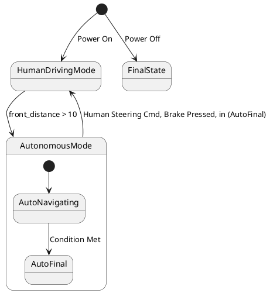

# Pair `0000`：NL + PlantUML STM0 + FCSTM STM0

[返回 60 组索引](../../PAIR_INDEX.md) | [下一组 `0001`](../0001/README.md)

- LLM：`GPT-4o`
- 模型/场景：high-level driving module
- 作者输出阶段：`Result with Semantic Checking`
- 作者输出单元格：`AE2`；Excel row：`2`
- Phase-I fallback：`false`
- 相对 Phase-I 是否变化：`true`
- Phase-I PlantUML SHA-256：`8fd2f71b338836488e2e29fe19c4e58c4992d4186367f43efc121fae6c36db7f`
- NL SHA-256：`f1c3dc88371b8256352e7ab6ee7eb42424de6e11dfde70d185f224dd1d05a7a8`
- PlantUML SHA-256：`4fe07b05bdcfaac1c961d1176fb099d8240818160caa6edfb57928c6be2efc8a`
- FCSTM SHA-256：`3f56e942007e9ab1839315e904cea3e1b8222732075f6c89e7d68ddbeb3666ad`
- review subject SHA-256：`37f4521695506147565637dc024e47acc64e6dfdbf34945f566b4aa4d61b0e87`
- working contract SHA-256：`4725aa3a62ba15a48b606b98c0781a7dc7a5ec4fe3847daea9a1bbbb52130853`
- 结构裁决：`structure_preserved`
- source states / transitions：`5` / `6`
- mapped / blocked / silent drop：`6` / `0` / `0`
- final / lifecycle / body coverage：`0/0` / `0/0` / `0/0`
- concurrent region / separator coverage：`0/0` / `0/0`
- source normalization coverage：`0/0`
- official raw / validation：`state_diagram` / `state_diagram`
- official identity states / transitions：`5` / `6`
- official identity remaps：state `0` / transition endpoint `0`
- AST audit：`passed`
- legacy whole-model FCSTM execution / Discover：`false` / `false`
- working bundle usage gate：`discover_input_with_capability_mask`
- ownership source / compiler / agent：`11` / `15` / `0`
- source macro / positive identity trace / conversion boundary trace：`6` / `11` / `0`
- capability source-static / simulation / transition-trace：`eligible_with_exclusions` / `eligible_with_exclusions` / `eligible_with_exclusions`
- compiler-only diagnostic policy：`rejected_conversion_artifact`；main-result conversion artifact limit：`0`
- 主 session 对读：`pass`；ownership/macro/capability 均为 `pass`；Case 0000 passes the current attribution-safe forward review; this does not assert global behavior equivalence, and unsupported runtime semantics remain fail-closed. Amendment record: the substantive subject review remains the one recorded in review_context (first reviewed 2026-07-20T05:44:08Z by gpt-5.5 (session omx-1784393668980-pxpj3q), and it still binds because review_subject_sha256 is unchanged. A scoped re-check was performed 2026-08-17 by claude-opus-5 (main-session LLM, PR #185) because commit bbb04cb1 (2026-07-27) regenerated the 60 working contracts and commit 35eba126 (2026-08-11) renamed the paper workspace, and neither refreshed this registry. The re-review is scoped: a key-by-key diff shows the only contract changes are capability_eligibility.simulation, capability_eligibility.transition_trace and summary.simulation_status (bbb04cb1) plus the four artifact_bindings path strings (35eba126); the remaining 168 keys and the whole of canonical/fcstm/parse_inspect/source_traces are byte-identical, so review_subject_sha256 is unchanged and the original ownership, macro and correspondence findings still stand. The capability block was re-checked against seven invariants: eligible ids are source: only, excluded ids cover the compiler-owned set, the two sets are disjoint, claim_boundary and reason_codes are non-empty, main_result_conversion_artifact_limit is still 0, and usage_gate is unchanged.
- source anchors：`source-ref:llms_emp_feedback_final_0000.puml:line:4\|state HumanDrivingMode {, source-ref:llms_emp_feedback_final_0000.puml:line:2\|[*] --> HumanDrivingMode : Power On`；FCSTM anchors：`element-ref:source:state:HumanDrivingMode@line:8\|state HumanDrivingMode named "HumanDrivingMode";, element-ref:compiler:transition_segment:tr_0001:segment:1@line:19\|[*] -> HumanDrivingMode : /Power_On;`
- 三个原始文件：[NL](./nl.txt) | [PlantUML](./plantuml.puml) | [FCSTM](./fcstm.fcstm)
- 审计入口：[canonical](../../canonical/llms_emp_feedback_final_0000.json) | [冻结 FCSTM](../../fcstm/llms_emp_feedback_final_0000.fcstm) | [case report](../../case_reports/llms_emp_feedback_final_0000.json) | [working contract](../../working_contracts/llms_emp_feedback_final_0000.json) | [source trace](../../source_traces/llms_emp_feedback_final_0000.json) | [人工总账](../../MANUAL_REVIEW.md)

## 主 session 三方语义对应

| projection | assessment | NL anchor | PlantUML anchor | FCSTM anchor | source roots | compiler members | rationale |
|---|---|---|---|---|---|---|---|
| `direct` | `preserved` | 1 The human driving mode is represented by a simple state. | source-ref:llms_emp_feedback_final_0000.puml:line:4\|state HumanDrivingMode { | element-ref:source:state:HumanDrivingMode@line:8\|state HumanDrivingMode named "HumanDrivingMode"; | source:state:HumanDrivingMode | - | Case 0000 binds source:state:HumanDrivingMode to authored PlantUML occurrence 'state HumanDrivingMode {' and current FCSTM occurrence 'state HumanDrivingMode named "HumanDrivingMode";'; the source semantic root remains attributable while any compiler-owned projection stays protected and cannot become an independent Repair target. |
| `macro` | `preserved_with_exclusions` | power on | source-ref:llms_emp_feedback_final_0000.puml:line:2\|[*] --> HumanDrivingMode : Power On | element-ref:compiler:transition_segment:tr_0001:segment:1@line:19\|[*] -> HumanDrivingMode : /Power_On; | source:transition:tr_0001 | compiler:transition_segment:tr_0001:segment:1 | Case 0000 binds source:transition:tr_0001 to authored PlantUML occurrence '[*] --> HumanDrivingMode : Power On' and current FCSTM occurrence '[*] -> HumanDrivingMode : /Power_On;'; the source semantic root remains attributable while any compiler-owned projection stays protected and cannot become an independent Repair target. |

## Risk occurrence 第二遍复核

| obligation | risk tag | assessment | PlantUML evidence | FCSTM evidence | ownership evidence | rationale |
|---|---|---|---|---|---|---|
| `review:multi_segment_macro:0001:tr_0005` | `multi_segment_macro` | `compiler_artifact_excluded` | source-ref:llms_emp_feedback_final_0000.puml:line:13\|AutonomousMode --> HumanDrivingMode : Human Steering Cmd, Brake Pressed, in (AutoFinal) | element-ref:compiler:route_control:R45RouteToken@line:1\|def int R45RouteToken = 0;, element-ref:compiler:transition_segment:tr_0005:segment:1@line:14\|AutoNavigating -> [*] : /Human_Steering_Cmd_Brake_Pressed_in_AutoFinal effect { R45RouteToken = 5; };, element-ref:compiler:transition_segment:tr_0005:segment:2@line:15\|AutoFinal -> [*] : /Human_Steering_Cmd_Brake_Pressed_in_AutoFinal effect { R45RouteToken = 5; };, element-ref:compiler:transition_segment:tr_0005:segment:3@line:18\|AutonomousMode -> HumanDrivingMode : if [R45RouteToken == 5] effect { R45RouteToken = 0; }; | compiler:route_control:R45RouteToken, compiler:transition_segment:tr_0005:segment:1, compiler:transition_segment:tr_0005:segment:2, compiler:transition_segment:tr_0005:segment:3, source:transition:tr_0005 | Case 0000 multi_segment_macro occurrence review:multi_segment_macro:0001:tr_0005 binds exact source refs to working-contract elements compiler:route_control:R45RouteToken, compiler:transition_segment:tr_0005:segment:1, compiler:transition_segment:tr_0005:segment:2, compiler:transition_segment:tr_0005:segment:3, source:transition:tr_0005. All emitted segments collapse to one source transition root; no segment is promoted as a separate authored transition or editable issue target. |
| `review:route_controller:0002:tr_0005` | `route_controller` | `compiler_artifact_excluded` | source-ref:llms_emp_feedback_final_0000.puml:line:13\|AutonomousMode --> HumanDrivingMode : Human Steering Cmd, Brake Pressed, in (AutoFinal) | element-ref:compiler:route_control:R45RouteToken@line:1\|def int R45RouteToken = 0;, element-ref:compiler:transition_segment:tr_0005:segment:1@line:14\|AutoNavigating -> [*] : /Human_Steering_Cmd_Brake_Pressed_in_AutoFinal effect { R45RouteToken = 5; };, element-ref:compiler:transition_segment:tr_0005:segment:2@line:15\|AutoFinal -> [*] : /Human_Steering_Cmd_Brake_Pressed_in_AutoFinal effect { R45RouteToken = 5; };, element-ref:compiler:transition_segment:tr_0005:segment:3@line:18\|AutonomousMode -> HumanDrivingMode : if [R45RouteToken == 5] effect { R45RouteToken = 0; }; | compiler:route_control:R45RouteToken, compiler:transition_segment:tr_0005:segment:1, compiler:transition_segment:tr_0005:segment:2, compiler:transition_segment:tr_0005:segment:3, source:transition:tr_0005 | Case 0000 route_controller occurrence review:route_controller:0002:tr_0005 binds exact source refs to working-contract elements compiler:route_control:R45RouteToken, compiler:transition_segment:tr_0005:segment:1, compiler:transition_segment:tr_0005:segment:2, compiler:transition_segment:tr_0005:segment:3, source:transition:tr_0005. R45RouteToken and routed segments remain compiler_owned, protected, and excluded from confirmed issues, Repair, Confirm acceptance, and main results. |
| `review:explicit_concurrency:0003:001-multiple_initial_fanout` | `explicit_concurrency` | `capability_excluded` | source-ref:llms_emp_feedback_final_0000.puml:line:14\|[*] --> FinalState : Power Off, source-ref:llms_emp_feedback_final_0000.puml:line:2\|[*] --> HumanDrivingMode : Power On | element-ref:compiler:transition_segment:tr_0001:segment:1@line:19\|[*] -> HumanDrivingMode : /Power_On;, element-ref:compiler:transition_segment:tr_0006:segment:1@line:21\|[*] -> FinalState : /Power_Off; | source:transition:tr_0001, source:transition:tr_0006 | Case 0000 explicit_concurrency occurrence review:explicit_concurrency:0003:001-multiple_initial_fanout binds exact source refs to working-contract elements source:transition:tr_0001, source:transition:tr_0006. The authored fork, join, or fan-out occurrence remains source-visible, while unsupported concurrent execution is capability_excluded rather than guessed. |

## 作者阶段 lineage

| stage | output cell | present | output SHA-256 | feedback | resolved |
|---|---|---|---|---|---|
| `phase_i_generation` | `I2` | `true` | `8fd2f71b338836488e2e29fe19c4e58c4992d4186367f43efc121fae6c36db7f` | - | - |
| `phase_ii_format` | `U2` | `false` | `-` | - | - |
| `phase_ii_grammar` | `Z2` | `true` | `4fe07b05bdcfaac1c961d1176fb099d8240818160caa6edfb57928c6be2efc8a` | transition does not connect two state | 1.0 |
| `phase_ii_semantic` | `AE2` | `true` | `4fe07b05bdcfaac1c961d1176fb099d8240818160caa6edfb57928c6be2efc8a` | None | 1.0 |

## Official identity ledger

- status：`aligned`
- canonical / official states：`5` / `5`
- aligned transition endpoints：`6`

本组 state identity 无需重映射。

本组 transition endpoint 无需重映射。

## Source normalization ledger

本组没有 source-input normalization。

## Concurrent region ledger

本组没有 PlantUML orthogonal/concurrent region separator。

## Operational debt

| reason code | count |
|---|---:|
| `R45.DEBT.composite_source_activation_dispatch` | 1 |
| `R45.DEBT.multiple_initial_fanout` | 1 |
| `R45.DEBT.opaque_transition_label_semantics` | 5 |

## NL

```text
1 The human driving mode is represented by a simple state. 2 The autonomous mode has sub-states and is represented by a sub machine state. 3. when power on, the system turn into human driving mode 4when front_distance > 10, auto transport to autonomous state 4. transit to human driving mode when receive human steering cmd, brake pressed, in (auto final) 5 when power off, it will transit to final state
```

## 作者 Phase-II 最终 PlantUML STM0



## 转换后 FCSTM STM0

```fcstm
def int R45RouteToken = 0;
state llms_emp_feedback_final_0000 named "llms_emp_feedback_final_0000" {
    event Power_On named "Power On";
    event Condition_Met named "Condition Met";
    event front_distance_10 named "front_distance > 10";
    event Human_Steering_Cmd_Brake_Pressed_in_AutoFinal named "Human Steering Cmd, Brake Pressed, in (AutoFinal)";
    event Power_Off named "Power Off";
    state HumanDrivingMode named "HumanDrivingMode";
    state AutonomousMode named "AutonomousMode" {
        state AutoNavigating named "AutoNavigating";
        state AutoFinal named "AutoFinal";
        [*] -> AutoNavigating;
        AutoNavigating -> AutoFinal : /Condition_Met;
        AutoNavigating -> [*] : /Human_Steering_Cmd_Brake_Pressed_in_AutoFinal effect { R45RouteToken = 5; };
        AutoFinal -> [*] : /Human_Steering_Cmd_Brake_Pressed_in_AutoFinal effect { R45RouteToken = 5; };
    }
    state FinalState named "FinalState";
    AutonomousMode -> HumanDrivingMode : if [R45RouteToken == 5] effect { R45RouteToken = 0; };
    [*] -> HumanDrivingMode : /Power_On;
    HumanDrivingMode -> AutonomousMode : /front_distance_10;
    [*] -> FinalState : /Power_Off;
}
```

[返回 60 组索引](../../PAIR_INDEX.md) | [下一组 `0001`](../0001/README.md)
