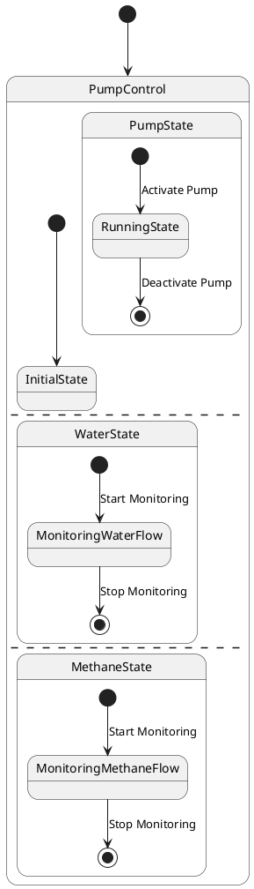

# Pair `0002`：NL + PlantUML STM0 + FCSTM STM0

[上一组 `0001`](../0001/README.md) | [返回 60 组索引](../../PAIR_INDEX.md) | [下一组 `0003`](../0003/README.md)

- LLM：`GPT-4o`
- 模型/场景：Pump Control state machine
- 作者输出阶段：`Result with Semantic Checking`
- 作者输出单元格：`AE4`；Excel row：`4`
- Phase-I fallback：`false`
- 相对 Phase-I 是否变化：`true`
- Phase-I PlantUML SHA-256：`945aa398670dec96e72eb75bf7ca969371d1c7eabbd1bd9ce7c153565e35a934`
- NL SHA-256：`a391765dba935d89e6d2467c97b218c0136d106ea9c00bac91e6525e28ac04f1`
- PlantUML SHA-256：`3a8e81a4a5a1e54e3994af300fcbd1913073547b8069288bbe57e61d989c3d43`
- FCSTM SHA-256：`6cdf10be62b94ea61521c386e88ac8a02d256091d803c851af0ba39b8ea25204`
- review subject SHA-256：`6f7cdcb914ce6d0a2e77feed45044a2ebb268d03036a68f9ee8d435c95a35c4b`
- working contract SHA-256：`ee3947225dbe00a954701ba2777bb0af00b39f48cb79f1217e3550df5f47cce6`
- 结构裁决：`structure_preserved`
- source states / transitions：`8` / `8`
- mapped / blocked / silent drop：`8` / `0` / `0`
- final / lifecycle / body coverage：`3/3` / `0/0` / `0/0`
- concurrent region / separator coverage：`3/3` / `2/2`
- source normalization coverage：`0/0`
- official raw / validation：`state_diagram` / `state_diagram`
- official identity states / transitions：`8` / `8`
- official identity remaps：state `0` / transition endpoint `0`
- AST audit：`passed`
- legacy whole-model FCSTM execution / Discover：`false` / `false`
- working bundle usage gate：`discover_input_with_capability_mask`
- ownership source / compiler / agent：`19` / `16` / `0`
- source macro / positive identity trace / conversion boundary trace：`11` / `19` / `0`
- capability source-static / simulation / transition-trace：`eligible_with_exclusions` / `ineligible` / `ineligible`
- compiler-only diagnostic policy：`rejected_conversion_artifact`；main-result conversion artifact limit：`0`
- 主 session 对读：`pass`；ownership/macro/capability 均为 `pass`；Case 0002 passes the current attribution-safe forward review; this does not assert global behavior equivalence, and unsupported runtime semantics remain fail-closed.
- source anchors：`source-ref:llms_emp_feedback_final_0002.puml:line:4\|state PumpControl {, source-ref:llms_emp_feedback_final_0002.puml:line:8\|[*] --> RunningState : Activate Pump`；FCSTM anchors：`element-ref:source:state:PumpControl@line:6\|state PumpControl named "PumpControl\n[PlantUML concurrent region 0] states=PumpControl.PumpState, PumpControl.InitialState; transitions=tr_0002\n[PlantUML concurrent region 1] states=PumpControl.WaterState; transitions=-\n[PlantUML concurrent region 2] states=PumpControl.MethaneState; transitions=-\n[PlantUML concurrent separator] region 0 -> 1 at llms_emp_feedback_final_0002.puml:line:12\n[PlantUML concurrent separator] region 1 -> 2 at llms_emp_feedback_final_0002.puml:line:19" {, element-ref:compiler:transition_segment:tr_0003:segment:1@line:10\|[*] -> RunningState : /Activate_Pump;`
- 三个原始文件：[NL](./nl.txt) | [PlantUML](./plantuml.puml) | [FCSTM](./fcstm.fcstm)
- 审计入口：[canonical](../../canonical/llms_emp_feedback_final_0002.json) | [冻结 FCSTM](../../fcstm/llms_emp_feedback_final_0002.fcstm) | [case report](../../case_reports/llms_emp_feedback_final_0002.json) | [working contract](../../working_contracts/llms_emp_feedback_final_0002.json) | [source trace](../../source_traces/llms_emp_feedback_final_0002.json) | [人工总账](../../MANUAL_REVIEW.md)

## 主 session 三方语义对应

| projection | assessment | NL anchor | PlantUML anchor | FCSTM anchor | source roots | compiler members | rationale |
|---|---|---|---|---|---|---|---|
| `direct` | `preserved` | PumpControl | source-ref:llms_emp_feedback_final_0002.puml:line:4\|state PumpControl { | element-ref:source:state:PumpControl@line:6\|state PumpControl named "PumpControl\n[PlantUML concurrent region 0] states=PumpControl.PumpState, PumpControl.InitialState; transitions=tr_0002\n[PlantUML concurrent region 1] states=PumpControl.WaterState; transitions=-\n[PlantUML concurrent region 2] states=PumpControl.MethaneState; transitions=-\n[PlantUML concurrent separator] region 0 -> 1 at llms_emp_feedback_final_0002.puml:line:12\n[PlantUML concurrent separator] region 1 -> 2 at llms_emp_feedback_final_0002.puml:line:19" { | source:state:PumpControl | - | Case 0002 binds source:state:PumpControl to authored PlantUML occurrence 'state PumpControl {' and current FCSTM occurrence 'state PumpControl named "PumpControl\n[PlantUML concurrent region 0] states=PumpControl.PumpState, PumpControl.InitialState; transitions=tr_0002\n[PlantUML concurrent region 1] states=PumpControl.WaterState; transitions=-\n[PlantUML concurrent region 2] states=PumpControl.MethaneState; transitions=-\n[PlantUML concurrent separator] region 0 -> 1 at llms_emp_feedback_final_0002.puml:line:12\n[PlantUML concurrent separator] region 1 -> 2 at llms_emp_feedback_final_0002.puml:line:19" {'; the source semantic root remains attributable while any compiler-owned projection stays protected and cannot become an independent Repair target. |
| `macro` | `preserved_with_exclusions` | PumpState | source-ref:llms_emp_feedback_final_0002.puml:line:8\|[*] --> RunningState : Activate Pump | element-ref:compiler:transition_segment:tr_0003:segment:1@line:10\|[*] -> RunningState : /Activate_Pump; | source:transition:tr_0003 | compiler:transition_segment:tr_0003:segment:1 | Case 0002 binds source:transition:tr_0003 to authored PlantUML occurrence '[*] --> RunningState : Activate Pump' and current FCSTM occurrence '[*] -> RunningState : /Activate_Pump;'; the source semantic root remains attributable while any compiler-owned projection stays protected and cannot become an independent Repair target. |

## Risk occurrence 第二遍复核

| obligation | risk tag | assessment | PlantUML evidence | FCSTM evidence | ownership evidence | rationale |
|---|---|---|---|---|---|---|
| `review:final_boundary:0001:tr_0004` | `final_boundary` | `source_fact_preserved` | source-ref:llms_emp_feedback_final_0002.puml:line:9\|RunningState --> [*] : Deactivate Pump | element-ref:compiler:state:llms_emp_feedback_final_0002.PumpControl.PumpState.FinalWaittr_0004@line:9\|state FinalWaittr_0004 named "Completed final boundary: PumpControl.PumpState.RunningState";, element-ref:compiler:transition_segment:tr_0004:segment:1@line:11\|RunningState -> FinalWaittr_0004 : /Deactivate_Pump; | compiler:state:llms_emp_feedback_final_0002.PumpControl.PumpState.FinalWaittr_0004, compiler:transition_segment:tr_0004:segment:1, source:transition:tr_0004 | Case 0002 final_boundary occurrence review:final_boundary:0001:tr_0004 binds exact source refs to working-contract elements compiler:state:llms_emp_feedback_final_0002.PumpControl.PumpState.FinalWaittr_0004, compiler:transition_segment:tr_0004:segment:1, source:transition:tr_0004. The authored final occurrence remains visible through its source root; any completion holder or routing segment is excluded from source-level claims. |
| `review:final_boundary:0002:tr_0006` | `final_boundary` | `source_fact_preserved` | source-ref:llms_emp_feedback_final_0002.puml:line:16\|MonitoringWaterFlow --> [*] : Stop Monitoring | element-ref:compiler:state:llms_emp_feedback_final_0002.PumpControl.WaterState.FinalWaittr_0006@line:15\|state FinalWaittr_0006 named "Completed final boundary: PumpControl.WaterState.MonitoringWaterFlow";, element-ref:compiler:transition_segment:tr_0006:segment:1@line:17\|MonitoringWaterFlow -> FinalWaittr_0006 : /Stop_Monitoring; | compiler:state:llms_emp_feedback_final_0002.PumpControl.WaterState.FinalWaittr_0006, compiler:transition_segment:tr_0006:segment:1, source:transition:tr_0006 | Case 0002 final_boundary occurrence review:final_boundary:0002:tr_0006 binds exact source refs to working-contract elements compiler:state:llms_emp_feedback_final_0002.PumpControl.WaterState.FinalWaittr_0006, compiler:transition_segment:tr_0006:segment:1, source:transition:tr_0006. The authored final occurrence remains visible through its source root; any completion holder or routing segment is excluded from source-level claims. |
| `review:final_boundary:0003:tr_0008` | `final_boundary` | `source_fact_preserved` | source-ref:llms_emp_feedback_final_0002.puml:line:23\|MonitoringMethaneFlow --> [*] : Stop Monitoring | element-ref:compiler:state:llms_emp_feedback_final_0002.PumpControl.MethaneState.FinalWaittr_0008@line:21\|state FinalWaittr_0008 named "Completed final boundary: PumpControl.MethaneState.MonitoringMethaneFlow";, element-ref:compiler:transition_segment:tr_0008:segment:1@line:23\|MonitoringMethaneFlow -> FinalWaittr_0008 : /Stop_Monitoring; | compiler:state:llms_emp_feedback_final_0002.PumpControl.MethaneState.FinalWaittr_0008, compiler:transition_segment:tr_0008:segment:1, source:transition:tr_0008 | Case 0002 final_boundary occurrence review:final_boundary:0003:tr_0008 binds exact source refs to working-contract elements compiler:state:llms_emp_feedback_final_0002.PumpControl.MethaneState.FinalWaittr_0008, compiler:transition_segment:tr_0008:segment:1, source:transition:tr_0008. The authored final occurrence remains visible through its source root; any completion holder or routing segment is excluded from source-level claims. |
| `review:synthetic_state:0004:001-FinalWaittr_0004` | `synthetic_state` | `compiler_artifact_excluded` | source-ref:llms_emp_feedback_final_0002.puml:line:9\|RunningState --> [*] : Deactivate Pump | element-ref:compiler:state:llms_emp_feedback_final_0002.PumpControl.PumpState.FinalWaittr_0004@line:9\|state FinalWaittr_0004 named "Completed final boundary: PumpControl.PumpState.RunningState"; | compiler:state:llms_emp_feedback_final_0002.PumpControl.PumpState.FinalWaittr_0004, source:transition:tr_0004 | Case 0002 synthetic_state occurrence review:synthetic_state:0004:001-FinalWaittr_0004 binds exact source refs to working-contract elements compiler:state:llms_emp_feedback_final_0002.PumpControl.PumpState.FinalWaittr_0004, source:transition:tr_0004. The placeholder makes the authored missing, invalid, or final boundary visible while the synthetic state itself remains a non-repairable compiler artifact. |
| `review:synthetic_state:0005:002-FinalWaittr_0006` | `synthetic_state` | `compiler_artifact_excluded` | source-ref:llms_emp_feedback_final_0002.puml:line:16\|MonitoringWaterFlow --> [*] : Stop Monitoring | element-ref:compiler:state:llms_emp_feedback_final_0002.PumpControl.WaterState.FinalWaittr_0006@line:15\|state FinalWaittr_0006 named "Completed final boundary: PumpControl.WaterState.MonitoringWaterFlow"; | compiler:state:llms_emp_feedback_final_0002.PumpControl.WaterState.FinalWaittr_0006, source:transition:tr_0006 | Case 0002 synthetic_state occurrence review:synthetic_state:0005:002-FinalWaittr_0006 binds exact source refs to working-contract elements compiler:state:llms_emp_feedback_final_0002.PumpControl.WaterState.FinalWaittr_0006, source:transition:tr_0006. The placeholder makes the authored missing, invalid, or final boundary visible while the synthetic state itself remains a non-repairable compiler artifact. |
| `review:synthetic_state:0006:003-FinalWaittr_0008` | `synthetic_state` | `compiler_artifact_excluded` | source-ref:llms_emp_feedback_final_0002.puml:line:23\|MonitoringMethaneFlow --> [*] : Stop Monitoring | element-ref:compiler:state:llms_emp_feedback_final_0002.PumpControl.MethaneState.FinalWaittr_0008@line:21\|state FinalWaittr_0008 named "Completed final boundary: PumpControl.MethaneState.MonitoringMethaneFlow"; | compiler:state:llms_emp_feedback_final_0002.PumpControl.MethaneState.FinalWaittr_0008, source:transition:tr_0008 | Case 0002 synthetic_state occurrence review:synthetic_state:0006:003-FinalWaittr_0008 binds exact source refs to working-contract elements compiler:state:llms_emp_feedback_final_0002.PumpControl.MethaneState.FinalWaittr_0008, source:transition:tr_0008. The placeholder makes the authored missing, invalid, or final boundary visible while the synthetic state itself remains a non-repairable compiler artifact. |
| `review:concurrent_region:0007:PumpControl:region:0` | `concurrent_region` | `capability_excluded` | source-ref:llms_emp_feedback_final_0002.puml:line:12\|-- | element-ref:source:region:PumpControl:region:0@line:6\|state PumpControl named "PumpControl\n[PlantUML concurrent region 0] states=PumpControl.PumpState, PumpControl.InitialState; transitions=tr_0002\n[PlantUML concurrent region 1] states=PumpControl.WaterState; transitions=-\n[PlantUML concurrent region 2] states=PumpControl.MethaneState; transitions=-\n[PlantUML concurrent separator] region 0 -> 1 at llms_emp_feedback_final_0002.puml:line:12\n[PlantUML concurrent separator] region 1 -> 2 at llms_emp_feedback_final_0002.puml:line:19" { | source:region:PumpControl:region:0 | Case 0002 concurrent_region occurrence review:concurrent_region:0007:PumpControl:region:0 binds exact source refs to working-contract elements source:region:PumpControl:region:0. The authored region occurrence is preserved as source metadata, while single-active FCSTM runtime behavior remains capability_excluded. |
| `review:concurrent_region:0008:PumpControl:region:1` | `concurrent_region` | `capability_excluded` | source-ref:llms_emp_feedback_final_0002.puml:line:12\|--, source-ref:llms_emp_feedback_final_0002.puml:line:19\|-- | element-ref:source:region:PumpControl:region:1@line:6\|state PumpControl named "PumpControl\n[PlantUML concurrent region 0] states=PumpControl.PumpState, PumpControl.InitialState; transitions=tr_0002\n[PlantUML concurrent region 1] states=PumpControl.WaterState; transitions=-\n[PlantUML concurrent region 2] states=PumpControl.MethaneState; transitions=-\n[PlantUML concurrent separator] region 0 -> 1 at llms_emp_feedback_final_0002.puml:line:12\n[PlantUML concurrent separator] region 1 -> 2 at llms_emp_feedback_final_0002.puml:line:19" { | source:region:PumpControl:region:1 | Case 0002 concurrent_region occurrence review:concurrent_region:0008:PumpControl:region:1 binds exact source refs to working-contract elements source:region:PumpControl:region:1. The authored region occurrence is preserved as source metadata, while single-active FCSTM runtime behavior remains capability_excluded. |
| `review:concurrent_region:0009:PumpControl:region:2` | `concurrent_region` | `capability_excluded` | source-ref:llms_emp_feedback_final_0002.puml:line:19\|-- | element-ref:source:region:PumpControl:region:2@line:6\|state PumpControl named "PumpControl\n[PlantUML concurrent region 0] states=PumpControl.PumpState, PumpControl.InitialState; transitions=tr_0002\n[PlantUML concurrent region 1] states=PumpControl.WaterState; transitions=-\n[PlantUML concurrent region 2] states=PumpControl.MethaneState; transitions=-\n[PlantUML concurrent separator] region 0 -> 1 at llms_emp_feedback_final_0002.puml:line:12\n[PlantUML concurrent separator] region 1 -> 2 at llms_emp_feedback_final_0002.puml:line:19" { | source:region:PumpControl:region:2 | Case 0002 concurrent_region occurrence review:concurrent_region:0009:PumpControl:region:2 binds exact source refs to working-contract elements source:region:PumpControl:region:2. The authored region occurrence is preserved as source metadata, while single-active FCSTM runtime behavior remains capability_excluded. |

## 作者阶段 lineage

| stage | output cell | present | output SHA-256 | feedback | resolved |
|---|---|---|---|---|---|
| `phase_i_generation` | `I4` | `true` | `945aa398670dec96e72eb75bf7ca969371d1c7eabbd1bd9ce7c153565e35a934` | - | - |
| `phase_ii_format` | `U4` | `false` | `-` | - | - |
| `phase_ii_grammar` | `Z4` | `false` | `-` | - | - |
| `phase_ii_semantic` | `AE4` | `true` | `3a8e81a4a5a1e54e3994af300fcbd1913073547b8069288bbe57e61d989c3d43` | 1. should use region to seperate three states | 1.0 |

## Official identity ledger

- status：`aligned`
- canonical / official states：`8` / `8`
- aligned transition endpoints：`8`

本组 state identity 无需重映射。

本组 transition endpoint 无需重映射。

## Source normalization ledger

本组没有 source-input normalization。

## Concurrent region ledger

| owner | region | direct states | direct transitions | separator before | separator after |
|---|---:|---|---|---|---|
| `PumpControl` | 0 | PumpControl.PumpState, PumpControl.InitialState | tr_0002 | - | llms_emp_feedback_final_0002.puml:line:12 |
| `PumpControl` | 1 | PumpControl.WaterState | - | llms_emp_feedback_final_0002.puml:line:12 | llms_emp_feedback_final_0002.puml:line:19 |
| `PumpControl` | 2 | PumpControl.MethaneState | - | llms_emp_feedback_final_0002.puml:line:19 | - |

## Operational debt

| reason code | count |
|---|---:|
| `R45.DEBT.concurrent_region_semantics` | 1 |
| `R45.DEBT.opaque_transition_label_semantics` | 6 |

## NL

```text
1. The system begins in the PumpControl state, from which it can transition to different substates based on specific conditions.
2. Within the PumpControl state, there are three main substates: PumpState, WaterState, and MethaneState.
3. The system first transitions to the PumpState substate, where the pump is activated or controlled.
4. The system can also transition to the WaterState substate, indicating that the pump is controlling or monitoring the water flow.
5. Similarly, the system can transition to the MethaneState substate, indicating that the pump is controlling or monitoring the methane flow.
```

## 作者 Phase-II 最终 PlantUML STM0



## 转换后 FCSTM STM0

```fcstm
state llms_emp_feedback_final_0002 named "llms_emp_feedback_final_0002" {
    event Activate_Pump named "Activate Pump";
    event Deactivate_Pump named "Deactivate Pump";
    event Start_Monitoring named "Start Monitoring";
    event Stop_Monitoring named "Stop Monitoring";
    state PumpControl named "PumpControl\n[PlantUML concurrent region 0] states=PumpControl.PumpState, PumpControl.InitialState; transitions=tr_0002\n[PlantUML concurrent region 1] states=PumpControl.WaterState; transitions=-\n[PlantUML concurrent region 2] states=PumpControl.MethaneState; transitions=-\n[PlantUML concurrent separator] region 0 -> 1 at llms_emp_feedback_final_0002.puml:line:12\n[PlantUML concurrent separator] region 1 -> 2 at llms_emp_feedback_final_0002.puml:line:19" {
        state PumpState named "PumpState" {
            state RunningState named "RunningState";
            state FinalWaittr_0004 named "Completed final boundary: PumpControl.PumpState.RunningState";
            [*] -> RunningState : /Activate_Pump;
            RunningState -> FinalWaittr_0004 : /Deactivate_Pump;
        }
        state WaterState named "WaterState" {
            state MonitoringWaterFlow named "MonitoringWaterFlow";
            state FinalWaittr_0006 named "Completed final boundary: PumpControl.WaterState.MonitoringWaterFlow";
            [*] -> MonitoringWaterFlow : /Start_Monitoring;
            MonitoringWaterFlow -> FinalWaittr_0006 : /Stop_Monitoring;
        }
        state MethaneState named "MethaneState" {
            state MonitoringMethaneFlow named "MonitoringMethaneFlow";
            state FinalWaittr_0008 named "Completed final boundary: PumpControl.MethaneState.MonitoringMethaneFlow";
            [*] -> MonitoringMethaneFlow : /Start_Monitoring;
            MonitoringMethaneFlow -> FinalWaittr_0008 : /Stop_Monitoring;
        }
        state InitialState named "InitialState";
        [*] -> InitialState;
    }
    [*] -> PumpControl;
}
```

[上一组 `0001`](../0001/README.md) | [返回 60 组索引](../../PAIR_INDEX.md) | [下一组 `0003`](../0003/README.md)
