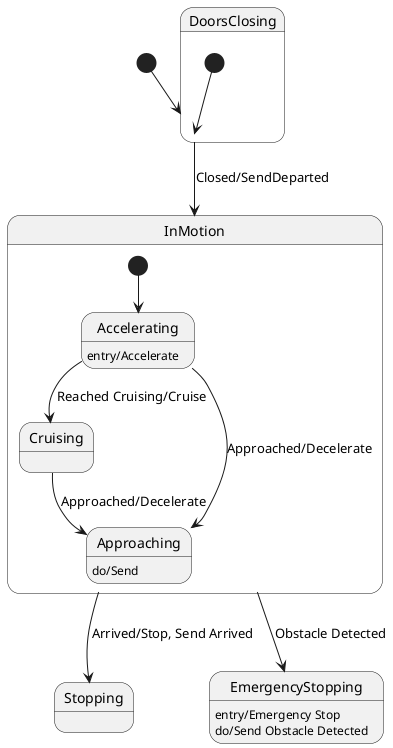

# Pair `0004`：NL + PlantUML STM0 + FCSTM STM0

[上一组 `0003`](../0003/README.md) | [返回 60 组索引](../../PAIR_INDEX.md) | [下一组 `0005`](../0005/README.md)

- LLM：`GPT-4o`
- 模型/场景：state machine for Train Control
- 作者输出阶段：`Result with Semantic Checking`
- 作者输出单元格：`AE6`；Excel row：`6`
- Phase-I fallback：`false`
- 相对 Phase-I 是否变化：`true`
- Phase-I PlantUML SHA-256：`6313557b3733707618bb785619f2b87e2f93ed3373c038222112f8cff3d2694c`
- NL SHA-256：`3110cbcf15bfb507f0326965970888eada5541b791b5fa661698dfc74e82c2ce`
- PlantUML SHA-256：`188bebba5631b87c315e966d8cd0f993630182d74f9b9bd677e1452198e458cb`
- FCSTM SHA-256：`89d8bffbbc69d720d97225397233adeff8fa0c56e3c259c7fd2b56b235d21278`
- review subject SHA-256：`f1a41e12fc2f3a3329b50d5b90d49630023b52c5bb6d892ee21c1b488a723a37`
- working contract SHA-256：`0462f1e9d37daea4870eadc7c86a2a545ecc1d8fed27d8afd0d38067fe40b965`
- 结构裁决：`structure_preserved`
- source states / transitions：`7` / `9`
- mapped / blocked / silent drop：`9` / `0` / `0`
- final / lifecycle / body coverage：`0/0` / `4/4` / `0/0`
- concurrent region / separator coverage：`0/0` / `0/0`
- source normalization coverage：`0/0`
- official raw / validation：`state_diagram` / `state_diagram`
- official identity states / transitions：`7` / `9`
- official identity remaps：state `0` / transition endpoint `0`
- AST audit：`passed`
- legacy whole-model FCSTM execution / Discover：`false` / `false`
- working bundle usage gate：`discover_input_with_capability_mask`
- ownership source / compiler / agent：`20` / `27` / `0`
- source macro / positive identity trace / conversion boundary trace：`13` / `20` / `0`
- capability source-static / simulation / transition-trace：`eligible_with_exclusions` / `ineligible` / `ineligible`
- compiler-only diagnostic policy：`rejected_conversion_artifact`；main-result conversion artifact limit：`0`
- 主 session 对读：`pass`；ownership/macro/capability 均为 `pass`；Case 0004 passes the current attribution-safe forward review; this does not assert global behavior equivalence, and unsupported runtime semantics remain fail-closed.
- source anchors：`source-ref:llms_emp_feedback_final_0004.puml:line:4\|state DoorsClosing {, source-ref:llms_emp_feedback_final_0004.puml:line:8\|DoorsClosing --> InMotion : Closed/SendDeparted`；FCSTM anchors：`element-ref:source:state:DoorsClosing@line:8\|state DoorsClosing named "DoorsClosing" {, element-ref:compiler:transition_segment:tr_0003:segment:1@line:39\|!DoorsClosing -> InMotion : /Closed_SendDeparted;`
- 三个原始文件：[NL](./nl.txt) | [PlantUML](./plantuml.puml) | [FCSTM](./fcstm.fcstm)
- 审计入口：[canonical](../../canonical/llms_emp_feedback_final_0004.json) | [冻结 FCSTM](../../fcstm/llms_emp_feedback_final_0004.fcstm) | [case report](../../case_reports/llms_emp_feedback_final_0004.json) | [working contract](../../working_contracts/llms_emp_feedback_final_0004.json) | [source trace](../../source_traces/llms_emp_feedback_final_0004.json) | [人工总账](../../MANUAL_REVIEW.md)

## 主 session 三方语义对应

| projection | assessment | NL anchor | PlantUML anchor | FCSTM anchor | source roots | compiler members | rationale |
|---|---|---|---|---|---|---|---|
| `direct` | `preserved` | DoorsClosing | source-ref:llms_emp_feedback_final_0004.puml:line:4\|state DoorsClosing { | element-ref:source:state:DoorsClosing@line:8\|state DoorsClosing named "DoorsClosing" { | source:state:DoorsClosing | - | Case 0004 binds source:state:DoorsClosing to authored PlantUML occurrence 'state DoorsClosing {' and current FCSTM occurrence 'state DoorsClosing named "DoorsClosing" {'; the source semantic root remains attributable while any compiler-owned projection stays protected and cannot become an independent Repair target. |
| `macro` | `preserved_with_exclusions` | Closed/SendDeparted | source-ref:llms_emp_feedback_final_0004.puml:line:8\|DoorsClosing --> InMotion : Closed/SendDeparted | element-ref:compiler:transition_segment:tr_0003:segment:1@line:39\|!DoorsClosing -> InMotion : /Closed_SendDeparted; | source:transition:tr_0003 | compiler:transition_segment:tr_0003:segment:1 | Case 0004 binds source:transition:tr_0003 to authored PlantUML occurrence 'DoorsClosing --> InMotion : Closed/SendDeparted' and current FCSTM occurrence '!DoorsClosing -> InMotion : /Closed_SendDeparted;'; the source semantic root remains attributable while any compiler-owned projection stays protected and cannot become an independent Repair target. |

## Risk occurrence 第二遍复核

| obligation | risk tag | assessment | PlantUML evidence | FCSTM evidence | ownership evidence | rationale |
|---|---|---|---|---|---|---|
| `review:multi_segment_macro:0001:tr_0008` | `multi_segment_macro` | `compiler_artifact_excluded` | source-ref:llms_emp_feedback_final_0004.puml:line:29\|InMotion --> Stopping : Arrived/Stop, Send Arrived, source-ref:llms_emp_feedback_final_0004.puml:line:30\|InMotion --> EmergencyStopping : Obstacle Detected | element-ref:compiler:route_control:R45RouteToken@line:1\|def int R45RouteToken = 0;, element-ref:compiler:transition_segment:tr_0008:segment:1@line:24\|Accelerating -> [*] : /Arrived_Stop_Send_Arrived effect { R45RouteToken = 8; };, element-ref:compiler:transition_segment:tr_0008:segment:2@line:25\|Cruising -> [*] : /Arrived_Stop_Send_Arrived effect { R45RouteToken = 8; };, element-ref:compiler:transition_segment:tr_0008:segment:3@line:26\|Approaching -> [*] : /Arrived_Stop_Send_Arrived effect { R45RouteToken = 8; };, element-ref:compiler:transition_segment:tr_0008:segment:4@line:36\|InMotion -> Stopping : if [R45RouteToken == 8] effect { R45RouteToken = 0; }; | compiler:route_control:R45RouteToken, compiler:transition_segment:tr_0008:segment:1, compiler:transition_segment:tr_0008:segment:2, compiler:transition_segment:tr_0008:segment:3, compiler:transition_segment:tr_0008:segment:4, source:transition:tr_0008 | Case 0004 multi_segment_macro occurrence review:multi_segment_macro:0001:tr_0008 binds exact source refs to working-contract elements compiler:route_control:R45RouteToken, compiler:transition_segment:tr_0008:segment:1, compiler:transition_segment:tr_0008:segment:2, compiler:transition_segment:tr_0008:segment:3, compiler:transition_segment:tr_0008:segment:4, source:transition:tr_0008. All emitted segments collapse to one source transition root; no segment is promoted as a separate authored transition or editable issue target. |
| `review:route_controller:0002:tr_0008` | `route_controller` | `compiler_artifact_excluded` | source-ref:llms_emp_feedback_final_0004.puml:line:29\|InMotion --> Stopping : Arrived/Stop, Send Arrived, source-ref:llms_emp_feedback_final_0004.puml:line:30\|InMotion --> EmergencyStopping : Obstacle Detected | element-ref:compiler:route_control:R45RouteToken@line:1\|def int R45RouteToken = 0;, element-ref:compiler:transition_segment:tr_0008:segment:1@line:24\|Accelerating -> [*] : /Arrived_Stop_Send_Arrived effect { R45RouteToken = 8; };, element-ref:compiler:transition_segment:tr_0008:segment:2@line:25\|Cruising -> [*] : /Arrived_Stop_Send_Arrived effect { R45RouteToken = 8; };, element-ref:compiler:transition_segment:tr_0008:segment:3@line:26\|Approaching -> [*] : /Arrived_Stop_Send_Arrived effect { R45RouteToken = 8; };, element-ref:compiler:transition_segment:tr_0008:segment:4@line:36\|InMotion -> Stopping : if [R45RouteToken == 8] effect { R45RouteToken = 0; }; | compiler:route_control:R45RouteToken, compiler:transition_segment:tr_0008:segment:1, compiler:transition_segment:tr_0008:segment:2, compiler:transition_segment:tr_0008:segment:3, compiler:transition_segment:tr_0008:segment:4, source:transition:tr_0008 | Case 0004 route_controller occurrence review:route_controller:0002:tr_0008 binds exact source refs to working-contract elements compiler:route_control:R45RouteToken, compiler:transition_segment:tr_0008:segment:1, compiler:transition_segment:tr_0008:segment:2, compiler:transition_segment:tr_0008:segment:3, compiler:transition_segment:tr_0008:segment:4, source:transition:tr_0008. R45RouteToken and routed segments remain compiler_owned, protected, and excluded from confirmed issues, Repair, Confirm acceptance, and main results. |
| `review:multi_segment_macro:0003:tr_0009` | `multi_segment_macro` | `compiler_artifact_excluded` | source-ref:llms_emp_feedback_final_0004.puml:line:29\|InMotion --> Stopping : Arrived/Stop, Send Arrived, source-ref:llms_emp_feedback_final_0004.puml:line:30\|InMotion --> EmergencyStopping : Obstacle Detected | element-ref:compiler:route_control:R45RouteToken@line:1\|def int R45RouteToken = 0;, element-ref:compiler:transition_segment:tr_0009:segment:1@line:27\|Accelerating -> [*] : /Obstacle_Detected effect { R45RouteToken = 9; };, element-ref:compiler:transition_segment:tr_0009:segment:2@line:28\|Cruising -> [*] : /Obstacle_Detected effect { R45RouteToken = 9; };, element-ref:compiler:transition_segment:tr_0009:segment:3@line:29\|Approaching -> [*] : /Obstacle_Detected effect { R45RouteToken = 9; };, element-ref:compiler:transition_segment:tr_0009:segment:4@line:37\|InMotion -> EmergencyStopping : if [R45RouteToken == 9] effect { R45RouteToken = 0; }; | compiler:route_control:R45RouteToken, compiler:transition_segment:tr_0009:segment:1, compiler:transition_segment:tr_0009:segment:2, compiler:transition_segment:tr_0009:segment:3, compiler:transition_segment:tr_0009:segment:4, source:transition:tr_0009 | Case 0004 multi_segment_macro occurrence review:multi_segment_macro:0003:tr_0009 binds exact source refs to working-contract elements compiler:route_control:R45RouteToken, compiler:transition_segment:tr_0009:segment:1, compiler:transition_segment:tr_0009:segment:2, compiler:transition_segment:tr_0009:segment:3, compiler:transition_segment:tr_0009:segment:4, source:transition:tr_0009. All emitted segments collapse to one source transition root; no segment is promoted as a separate authored transition or editable issue target. |
| `review:route_controller:0004:tr_0009` | `route_controller` | `compiler_artifact_excluded` | source-ref:llms_emp_feedback_final_0004.puml:line:29\|InMotion --> Stopping : Arrived/Stop, Send Arrived, source-ref:llms_emp_feedback_final_0004.puml:line:30\|InMotion --> EmergencyStopping : Obstacle Detected | element-ref:compiler:route_control:R45RouteToken@line:1\|def int R45RouteToken = 0;, element-ref:compiler:transition_segment:tr_0009:segment:1@line:27\|Accelerating -> [*] : /Obstacle_Detected effect { R45RouteToken = 9; };, element-ref:compiler:transition_segment:tr_0009:segment:2@line:28\|Cruising -> [*] : /Obstacle_Detected effect { R45RouteToken = 9; };, element-ref:compiler:transition_segment:tr_0009:segment:3@line:29\|Approaching -> [*] : /Obstacle_Detected effect { R45RouteToken = 9; };, element-ref:compiler:transition_segment:tr_0009:segment:4@line:37\|InMotion -> EmergencyStopping : if [R45RouteToken == 9] effect { R45RouteToken = 0; }; | compiler:route_control:R45RouteToken, compiler:transition_segment:tr_0009:segment:1, compiler:transition_segment:tr_0009:segment:2, compiler:transition_segment:tr_0009:segment:3, compiler:transition_segment:tr_0009:segment:4, source:transition:tr_0009 | Case 0004 route_controller occurrence review:route_controller:0004:tr_0009 binds exact source refs to working-contract elements compiler:route_control:R45RouteToken, compiler:transition_segment:tr_0009:segment:1, compiler:transition_segment:tr_0009:segment:2, compiler:transition_segment:tr_0009:segment:3, compiler:transition_segment:tr_0009:segment:4, source:transition:tr_0009. R45RouteToken and routed segments remain compiler_owned, protected, and excluded from confirmed issues, Repair, Confirm acceptance, and main results. |
| `review:synthetic_state:0005:001-InvalidInitialtr_0002` | `synthetic_state` | `compiler_artifact_excluded` | source-ref:llms_emp_feedback_final_0004.puml:line:5\|[*] --> DoorsClosing | element-ref:compiler:state:llms_emp_feedback_final_0004.DoorsClosing.InvalidInitialtr_0002@line:9\|state InvalidInitialtr_0002 named "PlantUML initial target outside child scope: DoorsClosing"; | compiler:state:llms_emp_feedback_final_0004.DoorsClosing.InvalidInitialtr_0002, source:transition:tr_0002 | Case 0004 synthetic_state occurrence review:synthetic_state:0005:001-InvalidInitialtr_0002 binds exact source refs to working-contract elements compiler:state:llms_emp_feedback_final_0004.DoorsClosing.InvalidInitialtr_0002, source:transition:tr_0002. The placeholder makes the authored missing, invalid, or final boundary visible while the synthetic state itself remains a non-repairable compiler artifact. |
| `review:lifecycle:0006:001-InMotion.Accelerating` | `lifecycle` | `capability_excluded` | source-ref:llms_emp_feedback_final_0004.puml:line:14\|Accelerating: entry/Accelerate | element-ref:compiler:lifecycle_action:InMotion.Accelerating:1:Accelerate@line:14\|enter abstract Accelerate; | compiler:lifecycle_action:InMotion.Accelerating:1:Accelerate, source:lifecycle:InMotion.Accelerating:1 | Case 0004 lifecycle occurrence review:lifecycle:0006:001-InMotion.Accelerating binds exact source refs to working-contract elements compiler:lifecycle_action:InMotion.Accelerating:1:Accelerate, source:lifecycle:InMotion.Accelerating:1. The lifecycle owner, kind, and action text remain source-visible through an abstract hook, while executable action behavior stays capability_excluded. |
| `review:lifecycle:0007:002-InMotion.Approaching` | `lifecycle` | `capability_excluded` | source-ref:llms_emp_feedback_final_0004.puml:line:25\|Approaching: do/Send | element-ref:compiler:lifecycle_action:InMotion.Approaching:2:Send@line:18\|during abstract Send; | compiler:lifecycle_action:InMotion.Approaching:2:Send, source:lifecycle:InMotion.Approaching:2 | Case 0004 lifecycle occurrence review:lifecycle:0007:002-InMotion.Approaching binds exact source refs to working-contract elements compiler:lifecycle_action:InMotion.Approaching:2:Send, source:lifecycle:InMotion.Approaching:2. The lifecycle owner, kind, and action text remain source-visible through an abstract hook, while executable action behavior stays capability_excluded. |
| `review:lifecycle:0008:003-EmergencyStopping` | `lifecycle` | `capability_excluded` | source-ref:llms_emp_feedback_final_0004.puml:line:33\|EmergencyStopping: entry/Emergency Stop | element-ref:compiler:lifecycle_action:EmergencyStopping:3:EmergencyStop@line:32\|enter abstract EmergencyStop; | compiler:lifecycle_action:EmergencyStopping:3:EmergencyStop, source:lifecycle:EmergencyStopping:3 | Case 0004 lifecycle occurrence review:lifecycle:0008:003-EmergencyStopping binds exact source refs to working-contract elements compiler:lifecycle_action:EmergencyStopping:3:EmergencyStop, source:lifecycle:EmergencyStopping:3. The lifecycle owner, kind, and action text remain source-visible through an abstract hook, while executable action behavior stays capability_excluded. |
| `review:lifecycle:0009:004-EmergencyStopping` | `lifecycle` | `capability_excluded` | source-ref:llms_emp_feedback_final_0004.puml:line:34\|EmergencyStopping: do/Send Obstacle Detected | element-ref:compiler:lifecycle_action:EmergencyStopping:4:SendObstacleDetected@line:33\|during abstract SendObstacleDetected; | compiler:lifecycle_action:EmergencyStopping:4:SendObstacleDetected, source:lifecycle:EmergencyStopping:4 | Case 0004 lifecycle occurrence review:lifecycle:0009:004-EmergencyStopping binds exact source refs to working-contract elements compiler:lifecycle_action:EmergencyStopping:4:SendObstacleDetected, source:lifecycle:EmergencyStopping:4. The lifecycle owner, kind, and action text remain source-visible through an abstract hook, while executable action behavior stays capability_excluded. |

## 作者阶段 lineage

| stage | output cell | present | output SHA-256 | feedback | resolved |
|---|---|---|---|---|---|
| `phase_i_generation` | `I6` | `true` | `6313557b3733707618bb785619f2b87e2f93ed3373c038222112f8cff3d2694c` | - | - |
| `phase_ii_format` | `U6` | `true` | `ffbc4577a4244c407f754a67975472017d9b1aa0eb1bb23df025f891d434c81a` | syntax error (Assumed diagram type: state) entry/Accelerate | YES |
| `phase_ii_grammar` | `Z6` | `false` | `-` | - | - |
| `phase_ii_semantic` | `AE6` | `true` | `188bebba5631b87c315e966d8cd0f993630182d74f9b9bd677e1452198e458cb` | None | - |

## Official identity ledger

- status：`aligned`
- canonical / official states：`7` / `7`
- aligned transition endpoints：`9`

本组 state identity 无需重映射。

本组 transition endpoint 无需重映射。

## Source normalization ledger

本组没有 source-input normalization。

## Concurrent region ledger

本组没有 PlantUML orthogonal/concurrent region separator。

## Operational debt

| reason code | count |
|---|---:|
| `R45.DEBT.composite_source_activation_dispatch` | 2 |
| `R45.DEBT.invalid_source_initial_target` | 1 |
| `R45.DEBT.opaque_transition_label_semantics` | 6 |

## NL

```text
1. The system starts in the DoorsClosing state and transitions to InMotion when the doors are closed, triggered by the "Closed/SendDeparted" signal.
2. In the InMotion state, the system can either transition to the Stopping state when it arrives, indicated by the "Arrived/Stop, Send Arrived" signal, or to the EmergencyStopping state if an obstacle is detected.
3. When an obstacle is detected, the system enters the EmergencyStopping state, which includes the actions "Emergency Stop" and sends the "Obstacle Detected" signal.
4. Within the InMotion state, the system operates in three substates: Accelerating, Cruising, and Approaching, which represent different phases of the train's motion.
5. The system begins in the Accelerating substate, moving to the Cruising substate once cruising speed is reached, as indicated by the "Reached Cruising/Cruise" signal.
6. If the system is in the Accelerating substate and approaches its destination, it transitions to the Approaching substate upon receiving the "Approached/Decelerate" signal.
7. The system in the Cruising substate transitions to the Approaching substate when it approaches the destination, triggered by the "Approached/Decelerate" signal.
8. The system enters the Accelerating substate when motion begins, marked by the "Entry/Accelerate" action.
9. In the Approaching substate, the system sends the "Send" signal and continues to approach the destination.
10. The system remains in the Approaching substate while nearing the destination, until it is ready to stop or decelerate.
```

## 作者 Phase-II 最终 PlantUML STM0



## 转换后 FCSTM STM0

```fcstm
def int R45RouteToken = 0;
state llms_emp_feedback_final_0004 named "llms_emp_feedback_final_0004" {
    event Closed_SendDeparted named "Closed/SendDeparted";
    event Reached_Cruising_Cruise named "Reached Cruising/Cruise";
    event Approached_Decelerate named "Approached/Decelerate";
    event Arrived_Stop_Send_Arrived named "Arrived/Stop, Send Arrived";
    event Obstacle_Detected named "Obstacle Detected";
    state DoorsClosing named "DoorsClosing" {
        state InvalidInitialtr_0002 named "PlantUML initial target outside child scope: DoorsClosing";
        [*] -> InvalidInitialtr_0002;
    }
    state InMotion named "InMotion" {
        state Accelerating named "Accelerating" {
            enter abstract Accelerate;
        }
        state Cruising named "Cruising";
        state Approaching named "Approaching" {
            during abstract Send;
        }
        [*] -> Accelerating;
        Accelerating -> Cruising : /Reached_Cruising_Cruise;
        Accelerating -> Approaching : /Approached_Decelerate;
        Cruising -> Approaching : /Approached_Decelerate;
        Accelerating -> [*] : /Arrived_Stop_Send_Arrived effect { R45RouteToken = 8; };
        Cruising -> [*] : /Arrived_Stop_Send_Arrived effect { R45RouteToken = 8; };
        Approaching -> [*] : /Arrived_Stop_Send_Arrived effect { R45RouteToken = 8; };
        Accelerating -> [*] : /Obstacle_Detected effect { R45RouteToken = 9; };
        Cruising -> [*] : /Obstacle_Detected effect { R45RouteToken = 9; };
        Approaching -> [*] : /Obstacle_Detected effect { R45RouteToken = 9; };
    }
    state EmergencyStopping named "EmergencyStopping" {
        enter abstract EmergencyStop;
        during abstract SendObstacleDetected;
    }
    state Stopping named "Stopping";
    InMotion -> Stopping : if [R45RouteToken == 8] effect { R45RouteToken = 0; };
    InMotion -> EmergencyStopping : if [R45RouteToken == 9] effect { R45RouteToken = 0; };
    [*] -> DoorsClosing;
    !DoorsClosing -> InMotion : /Closed_SendDeparted;
}
```

[上一组 `0003`](../0003/README.md) | [返回 60 组索引](../../PAIR_INDEX.md) | [下一组 `0005`](../0005/README.md)
