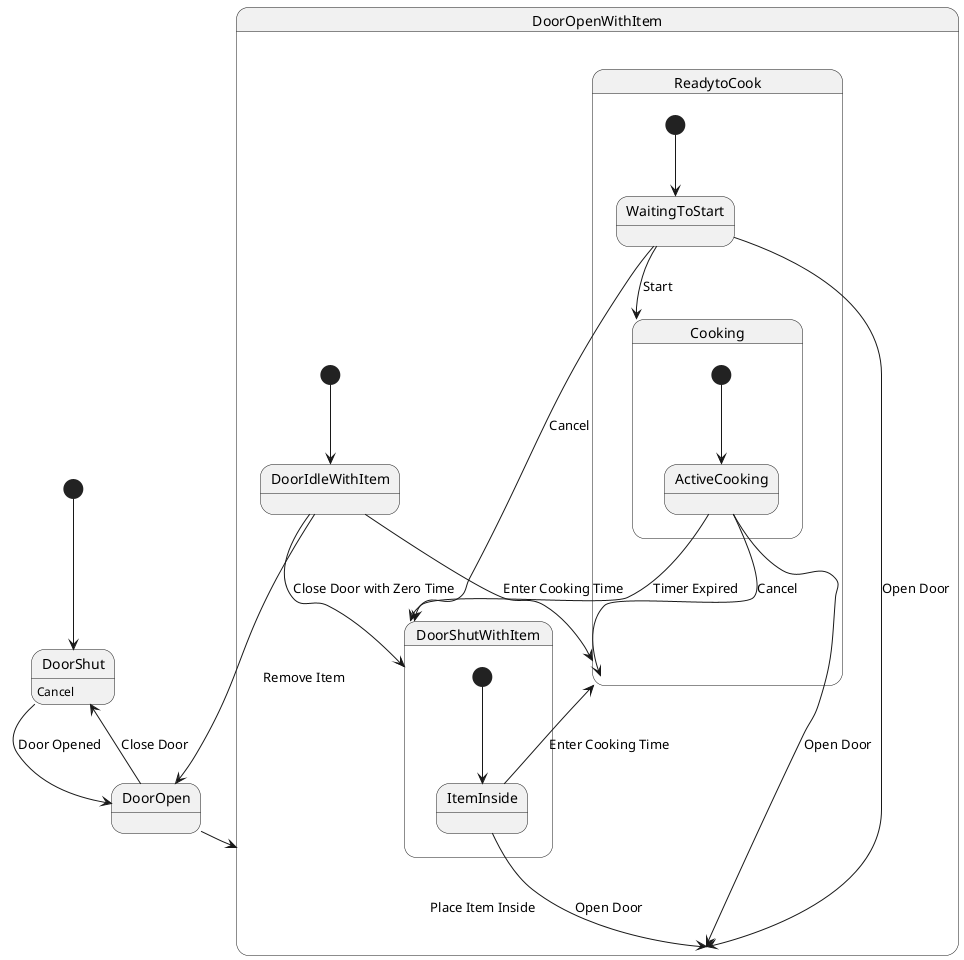

# Pair `0005`：NL + PlantUML STM0 + FCSTM STM0

[上一组 `0004`](../0004/README.md) | [返回 60 组索引](../../PAIR_INDEX.md) | [下一组 `0006`](../0006/README.md)

- LLM：`GPT-4o`
- 模型/场景：Microwave Oven Control with entry and <br> exit actions
- 作者输出阶段：`Result with Semantic Checking`
- 作者输出单元格：`AE7`；Excel row：`7`
- Phase-I fallback：`false`
- 相对 Phase-I 是否变化：`true`
- Phase-I PlantUML SHA-256：`0727625138b0bac74c9332b4af3c8e653f0721cb84e44628332b3bebd3308f77`
- NL SHA-256：`934e19bd4ae2a793c334fdcf486092d3aa20858f09ae892753ef87698feb061f`
- PlantUML SHA-256：`6dfdab20dd467253efdd23ee3b8973eaeb9296ef2502fd01d3287f84e10a2511`
- FCSTM SHA-256：`214088e638026b68f78d022e04cd57a837da7fc4d558cb064d39eaee219aed72`
- review subject SHA-256：`27a0530b88dee81e94d756fe187fdffbc5e123cb9d7a587879e04ac87ab948a1`
- working contract SHA-256：`61d11f0f08d17970172e1a54f2ee978b0c13d578d65eb7fa19ae9dcbf2991da2`
- 结构裁决：`structure_preserved`
- source states / transitions：`10` / `19`
- mapped / blocked / silent drop：`19` / `0` / `0`
- final / lifecycle / body coverage：`0/0` / `0/0` / `1/1`
- concurrent region / separator coverage：`0/0` / `0/0`
- source normalization coverage：`0/0`
- official raw / validation：`state_diagram` / `state_diagram`
- official identity states / transitions：`10` / `19`
- official identity remaps：state `6` / transition endpoint `13`
- AST audit：`passed`
- legacy whole-model FCSTM execution / Discover：`false` / `false`
- working bundle usage gate：`discover_input_with_capability_mask`
- ownership source / compiler / agent：`30` / `45` / `0`
- source macro / positive identity trace / conversion boundary trace：`20` / `30` / `0`
- capability source-static / simulation / transition-trace：`eligible_with_exclusions` / `ineligible` / `ineligible`
- compiler-only diagnostic policy：`rejected_conversion_artifact`；main-result conversion artifact limit：`0`
- 主 session 对读：`pass`；ownership/macro/capability 均为 `pass`；Case 0005 passes the current attribution-safe forward review; this does not assert global behavior equivalence, and unsupported runtime semantics remain fail-closed.
- source anchors：`source-ref:llms_emp_feedback_final_0005.puml:line:10\|state DoorOpenWithItem {, source-ref:llms_emp_feedback_final_0005.puml:line:5\|DoorShut --> DoorOpen : Door Opened`；FCSTM anchors：`element-ref:source:state:DoorOpenWithItem@line:13\|state DoorOpenWithItem named "DoorOpenWithItem" {, element-ref:compiler:transition_segment:tr_0002:segment:1@line:57\|DoorShut -> DoorOpen : /Door_Opened;`
- 三个原始文件：[NL](./nl.txt) | [PlantUML](./plantuml.puml) | [FCSTM](./fcstm.fcstm)
- 审计入口：[canonical](../../canonical/llms_emp_feedback_final_0005.json) | [冻结 FCSTM](../../fcstm/llms_emp_feedback_final_0005.fcstm) | [case report](../../case_reports/llms_emp_feedback_final_0005.json) | [working contract](../../working_contracts/llms_emp_feedback_final_0005.json) | [source trace](../../source_traces/llms_emp_feedback_final_0005.json) | [人工总账](../../MANUAL_REVIEW.md)

## 主 session 三方语义对应

| projection | assessment | NL anchor | PlantUML anchor | FCSTM anchor | source roots | compiler members | rationale |
|---|---|---|---|---|---|---|---|
| `direct` | `preserved` | DoorOpenWithItem | source-ref:llms_emp_feedback_final_0005.puml:line:10\|state DoorOpenWithItem { | element-ref:source:state:DoorOpenWithItem@line:13\|state DoorOpenWithItem named "DoorOpenWithItem" { | source:state:DoorOpenWithItem | - | Case 0005 binds source:state:DoorOpenWithItem to authored PlantUML occurrence 'state DoorOpenWithItem {' and current FCSTM occurrence 'state DoorOpenWithItem named "DoorOpenWithItem" {'; the source semantic root remains attributable while any compiler-owned projection stays protected and cannot become an independent Repair target. |
| `macro` | `preserved_with_exclusions` | Door Opened | source-ref:llms_emp_feedback_final_0005.puml:line:5\|DoorShut --> DoorOpen : Door Opened | element-ref:compiler:transition_segment:tr_0002:segment:1@line:57\|DoorShut -> DoorOpen : /Door_Opened; | source:transition:tr_0002 | compiler:transition_segment:tr_0002:segment:1 | Case 0005 binds source:transition:tr_0002 to authored PlantUML occurrence 'DoorShut --> DoorOpen : Door Opened' and current FCSTM occurrence 'DoorShut -> DoorOpen : /Door_Opened;'; the source semantic root remains attributable while any compiler-owned projection stays protected and cannot become an independent Repair target. |

## Risk occurrence 第二遍复核

| obligation | risk tag | assessment | PlantUML evidence | FCSTM evidence | ownership evidence | rationale |
|---|---|---|---|---|---|---|
| `review:official_identity_remap:0001:state-001` | `official_identity_remap` | `source_fact_preserved` | source-ref:llms_emp_feedback_final_0005.puml:line:18\|state DoorShutWithItem { | element-ref:source:state:DoorOpenWithItem.DoorShutWithItem@line:14\|state DoorShutWithItem named "DoorShutWithItem" { | source:state:DoorOpenWithItem.DoorShutWithItem | Case 0005 official_identity_remap occurrence review:official_identity_remap:0001:state-001 binds exact source refs to working-contract elements source:state:DoorOpenWithItem.DoorShutWithItem. The pinned PlantUML identity decision is preserved as a source fact and is not replaced by a lexical-scope guess from the converter. |
| `review:official_identity_remap:0002:state-002` | `official_identity_remap` | `source_fact_preserved` | source-ref:llms_emp_feedback_final_0005.puml:line:25\|state ReadytoCook { | element-ref:source:state:DoorOpenWithItem.ReadytoCook@line:20\|state ReadytoCook named "ReadytoCook" { | source:state:DoorOpenWithItem.ReadytoCook | Case 0005 official_identity_remap occurrence review:official_identity_remap:0002:state-002 binds exact source refs to working-contract elements source:state:DoorOpenWithItem.ReadytoCook. The pinned PlantUML identity decision is preserved as a source fact and is not replaced by a lexical-scope guess from the converter. |
| `review:official_identity_remap:0003:state-003` | `official_identity_remap` | `source_fact_preserved` | source-ref:llms_emp_feedback_final_0005.puml:line:33\|state Cooking { | element-ref:source:state:DoorOpenWithItem.ReadytoCook.Cooking@line:21\|state Cooking named "Cooking" { | source:state:DoorOpenWithItem.ReadytoCook.Cooking | Case 0005 official_identity_remap occurrence review:official_identity_remap:0003:state-003 binds exact source refs to working-contract elements source:state:DoorOpenWithItem.ReadytoCook.Cooking. The pinned PlantUML identity decision is preserved as a source fact and is not replaced by a lexical-scope guess from the converter. |
| `review:official_identity_remap:0004:state-004` | `official_identity_remap` | `source_fact_preserved` | source-ref:llms_emp_feedback_final_0005.puml:line:19\|[*] --> ItemInside | element-ref:source:state:DoorOpenWithItem.DoorShutWithItem.ItemInside@line:15\|state ItemInside named "ItemInside"; | source:state:DoorOpenWithItem.DoorShutWithItem.ItemInside | Case 0005 official_identity_remap occurrence review:official_identity_remap:0004:state-004 binds exact source refs to working-contract elements source:state:DoorOpenWithItem.DoorShutWithItem.ItemInside. The pinned PlantUML identity decision is preserved as a source fact and is not replaced by a lexical-scope guess from the converter. |
| `review:official_identity_remap:0005:state-005` | `official_identity_remap` | `source_fact_preserved` | source-ref:llms_emp_feedback_final_0005.puml:line:26\|[*] --> WaitingToStart | element-ref:source:state:DoorOpenWithItem.ReadytoCook.WaitingToStart@line:28\|state WaitingToStart named "WaitingToStart"; | source:state:DoorOpenWithItem.ReadytoCook.WaitingToStart | Case 0005 official_identity_remap occurrence review:official_identity_remap:0005:state-005 binds exact source refs to working-contract elements source:state:DoorOpenWithItem.ReadytoCook.WaitingToStart. The pinned PlantUML identity decision is preserved as a source fact and is not replaced by a lexical-scope guess from the converter. |
| `review:official_identity_remap:0006:state-006` | `official_identity_remap` | `source_fact_preserved` | source-ref:llms_emp_feedback_final_0005.puml:line:34\|[*] --> ActiveCooking | element-ref:source:state:DoorOpenWithItem.ReadytoCook.Cooking.ActiveCooking@line:22\|state ActiveCooking named "ActiveCooking"; | source:state:DoorOpenWithItem.ReadytoCook.Cooking.ActiveCooking | Case 0005 official_identity_remap occurrence review:official_identity_remap:0006:state-006 binds exact source refs to working-contract elements source:state:DoorOpenWithItem.ReadytoCook.Cooking.ActiveCooking. The pinned PlantUML identity decision is preserved as a source fact and is not replaced by a lexical-scope guess from the converter. |
| `review:official_identity_remap:0007:transition-001-tr_0007` | `official_identity_remap` | `source_fact_preserved` | source-ref:llms_emp_feedback_final_0005.puml:line:14\|DoorIdleWithItem --> DoorShutWithItem : Close Door with Zero Time | element-ref:compiler:transition_segment:tr_0007:segment:1@line:47\|DoorIdleWithItem -> DoorShutWithItem : /Close_Door_with_Zero_Time; | source:transition:tr_0007 | Case 0005 official_identity_remap occurrence review:official_identity_remap:0007:transition-001-tr_0007 binds exact source refs to working-contract elements source:transition:tr_0007. The pinned PlantUML identity decision is preserved as a source fact and is not replaced by a lexical-scope guess from the converter. |
| `review:official_identity_remap:0008:transition-002-tr_0008` | `official_identity_remap` | `source_fact_preserved` | source-ref:llms_emp_feedback_final_0005.puml:line:15\|DoorIdleWithItem --> ReadytoCook : Enter Cooking Time | element-ref:compiler:transition_segment:tr_0008:segment:1@line:48\|DoorIdleWithItem -> ReadytoCook : /Enter_Cooking_Time; | source:transition:tr_0008 | Case 0005 official_identity_remap occurrence review:official_identity_remap:0008:transition-002-tr_0008 binds exact source refs to working-contract elements source:transition:tr_0008. The pinned PlantUML identity decision is preserved as a source fact and is not replaced by a lexical-scope guess from the converter. |
| `review:official_identity_remap:0009:transition-003-tr_0009` | `official_identity_remap` | `source_fact_preserved` | source-ref:llms_emp_feedback_final_0005.puml:line:19\|[*] --> ItemInside | element-ref:compiler:transition_segment:tr_0009:segment:1@line:16\|[*] -> ItemInside; | source:transition:tr_0009 | Case 0005 official_identity_remap occurrence review:official_identity_remap:0009:transition-003-tr_0009 binds exact source refs to working-contract elements source:transition:tr_0009. The pinned PlantUML identity decision is preserved as a source fact and is not replaced by a lexical-scope guess from the converter. |
| `review:official_identity_remap:0010:transition-004-tr_0010` | `official_identity_remap` | `source_fact_preserved` | source-ref:llms_emp_feedback_final_0005.puml:line:21\|ItemInside --> DoorOpenWithItem : Open Door | element-ref:compiler:route_control:R45RouteToken@line:1\|def int R45RouteToken = 0; | source:transition:tr_0010 | Case 0005 official_identity_remap occurrence review:official_identity_remap:0010:transition-004-tr_0010 binds exact source refs to working-contract elements source:transition:tr_0010. The pinned PlantUML identity decision is preserved as a source fact and is not replaced by a lexical-scope guess from the converter. |
| `review:official_identity_remap:0011:transition-005-tr_0011` | `official_identity_remap` | `source_fact_preserved` | source-ref:llms_emp_feedback_final_0005.puml:line:22\|ItemInside --> ReadytoCook : Enter Cooking Time | element-ref:compiler:route_control:R45RouteToken@line:1\|def int R45RouteToken = 0; | source:transition:tr_0011 | Case 0005 official_identity_remap occurrence review:official_identity_remap:0011:transition-005-tr_0011 binds exact source refs to working-contract elements source:transition:tr_0011. The pinned PlantUML identity decision is preserved as a source fact and is not replaced by a lexical-scope guess from the converter. |
| `review:official_identity_remap:0012:transition-006-tr_0012` | `official_identity_remap` | `source_fact_preserved` | source-ref:llms_emp_feedback_final_0005.puml:line:26\|[*] --> WaitingToStart | element-ref:compiler:transition_segment:tr_0012:segment:1@line:32\|[*] -> WaitingToStart; | source:transition:tr_0012 | Case 0005 official_identity_remap occurrence review:official_identity_remap:0012:transition-006-tr_0012 binds exact source refs to working-contract elements source:transition:tr_0012. The pinned PlantUML identity decision is preserved as a source fact and is not replaced by a lexical-scope guess from the converter. |
| `review:official_identity_remap:0013:transition-007-tr_0013` | `official_identity_remap` | `source_fact_preserved` | source-ref:llms_emp_feedback_final_0005.puml:line:28\|WaitingToStart --> DoorShutWithItem : Cancel | element-ref:compiler:route_control:R45RouteToken@line:1\|def int R45RouteToken = 0; | source:transition:tr_0013 | Case 0005 official_identity_remap occurrence review:official_identity_remap:0013:transition-007-tr_0013 binds exact source refs to working-contract elements source:transition:tr_0013. The pinned PlantUML identity decision is preserved as a source fact and is not replaced by a lexical-scope guess from the converter. |
| `review:official_identity_remap:0014:transition-008-tr_0014` | `official_identity_remap` | `source_fact_preserved` | source-ref:llms_emp_feedback_final_0005.puml:line:29\|WaitingToStart --> DoorOpenWithItem : Open Door | element-ref:compiler:route_control:R45RouteToken@line:1\|def int R45RouteToken = 0; | source:transition:tr_0014 | Case 0005 official_identity_remap occurrence review:official_identity_remap:0014:transition-008-tr_0014 binds exact source refs to working-contract elements source:transition:tr_0014. The pinned PlantUML identity decision is preserved as a source fact and is not replaced by a lexical-scope guess from the converter. |
| `review:official_identity_remap:0015:transition-009-tr_0015` | `official_identity_remap` | `source_fact_preserved` | source-ref:llms_emp_feedback_final_0005.puml:line:30\|WaitingToStart --> Cooking : Start | element-ref:compiler:transition_segment:tr_0015:segment:1@line:35\|WaitingToStart -> Cooking : /Start; | source:transition:tr_0015 | Case 0005 official_identity_remap occurrence review:official_identity_remap:0015:transition-009-tr_0015 binds exact source refs to working-contract elements source:transition:tr_0015. The pinned PlantUML identity decision is preserved as a source fact and is not replaced by a lexical-scope guess from the converter. |
| `review:official_identity_remap:0016:transition-010-tr_0016` | `official_identity_remap` | `source_fact_preserved` | source-ref:llms_emp_feedback_final_0005.puml:line:34\|[*] --> ActiveCooking | element-ref:compiler:transition_segment:tr_0016:segment:1@line:23\|[*] -> ActiveCooking; | source:transition:tr_0016 | Case 0005 official_identity_remap occurrence review:official_identity_remap:0016:transition-010-tr_0016 binds exact source refs to working-contract elements source:transition:tr_0016. The pinned PlantUML identity decision is preserved as a source fact and is not replaced by a lexical-scope guess from the converter. |
| `review:official_identity_remap:0017:transition-011-tr_0017` | `official_identity_remap` | `source_fact_preserved` | source-ref:llms_emp_feedback_final_0005.puml:line:36\|ActiveCooking --> DoorOpenWithItem : Open Door | element-ref:compiler:route_control:R45RouteToken@line:1\|def int R45RouteToken = 0; | source:transition:tr_0017 | Case 0005 official_identity_remap occurrence review:official_identity_remap:0017:transition-011-tr_0017 binds exact source refs to working-contract elements source:transition:tr_0017. The pinned PlantUML identity decision is preserved as a source fact and is not replaced by a lexical-scope guess from the converter. |
| `review:official_identity_remap:0018:transition-012-tr_0018` | `official_identity_remap` | `source_fact_preserved` | source-ref:llms_emp_feedback_final_0005.puml:line:37\|ActiveCooking --> DoorShutWithItem : Timer Expired | element-ref:compiler:route_control:R45RouteToken@line:1\|def int R45RouteToken = 0; | source:transition:tr_0018 | Case 0005 official_identity_remap occurrence review:official_identity_remap:0018:transition-012-tr_0018 binds exact source refs to working-contract elements source:transition:tr_0018. The pinned PlantUML identity decision is preserved as a source fact and is not replaced by a lexical-scope guess from the converter. |
| `review:official_identity_remap:0019:transition-013-tr_0019` | `official_identity_remap` | `source_fact_preserved` | source-ref:llms_emp_feedback_final_0005.puml:line:38\|ActiveCooking --> ReadytoCook : Cancel | element-ref:compiler:route_control:R45RouteToken@line:1\|def int R45RouteToken = 0; | source:transition:tr_0019 | Case 0005 official_identity_remap occurrence review:official_identity_remap:0019:transition-013-tr_0019 binds exact source refs to working-contract elements source:transition:tr_0019. The pinned PlantUML identity decision is preserved as a source fact and is not replaced by a lexical-scope guess from the converter. |
| `review:multi_segment_macro:0020:tr_0006` | `multi_segment_macro` | `compiler_artifact_excluded` | source-ref:llms_emp_feedback_final_0005.puml:line:13\|DoorIdleWithItem --> DoorOpen : Remove Item, source-ref:llms_emp_feedback_final_0005.puml:line:21\|ItemInside --> DoorOpenWithItem : Open Door, source-ref:llms_emp_feedback_final_0005.puml:line:22\|ItemInside --> ReadytoCook : Enter Cooking Time, source-ref:llms_emp_feedback_final_0005.puml:line:28\|WaitingToStart --> DoorShutWithItem : Cancel, source-ref:llms_emp_feedback_final_0005.puml:line:29\|WaitingToStart --> DoorOpenWithItem : Open Door, source-ref:llms_emp_feedback_final_0005.puml:line:36\|ActiveCooking --> DoorOpenWithItem : Open Door, source-ref:llms_emp_feedback_final_0005.puml:line:37\|ActiveCooking --> DoorShutWithItem : Timer Expired, source-ref:llms_emp_feedback_final_0005.puml:line:38\|ActiveCooking --> ReadytoCook : Cancel | element-ref:compiler:route_control:R45RouteToken@line:1\|def int R45RouteToken = 0;, element-ref:compiler:transition_segment:tr_0006:segment:1@line:46\|DoorIdleWithItem -> [*] : /Remove_Item effect { R45RouteToken = 6; };, element-ref:compiler:transition_segment:tr_0006:segment:2@line:52\|DoorOpenWithItem -> DoorOpen : if [R45RouteToken == 6] effect { R45RouteToken = 0; }; | compiler:route_control:R45RouteToken, compiler:transition_segment:tr_0006:segment:1, compiler:transition_segment:tr_0006:segment:2, source:transition:tr_0006 | Case 0005 multi_segment_macro occurrence review:multi_segment_macro:0020:tr_0006 binds exact source refs to working-contract elements compiler:route_control:R45RouteToken, compiler:transition_segment:tr_0006:segment:1, compiler:transition_segment:tr_0006:segment:2, source:transition:tr_0006. All emitted segments collapse to one source transition root; no segment is promoted as a separate authored transition or editable issue target. |
| `review:route_controller:0021:tr_0006` | `route_controller` | `compiler_artifact_excluded` | source-ref:llms_emp_feedback_final_0005.puml:line:13\|DoorIdleWithItem --> DoorOpen : Remove Item, source-ref:llms_emp_feedback_final_0005.puml:line:21\|ItemInside --> DoorOpenWithItem : Open Door, source-ref:llms_emp_feedback_final_0005.puml:line:22\|ItemInside --> ReadytoCook : Enter Cooking Time, source-ref:llms_emp_feedback_final_0005.puml:line:28\|WaitingToStart --> DoorShutWithItem : Cancel, source-ref:llms_emp_feedback_final_0005.puml:line:29\|WaitingToStart --> DoorOpenWithItem : Open Door, source-ref:llms_emp_feedback_final_0005.puml:line:36\|ActiveCooking --> DoorOpenWithItem : Open Door, source-ref:llms_emp_feedback_final_0005.puml:line:37\|ActiveCooking --> DoorShutWithItem : Timer Expired, source-ref:llms_emp_feedback_final_0005.puml:line:38\|ActiveCooking --> ReadytoCook : Cancel | element-ref:compiler:route_control:R45RouteToken@line:1\|def int R45RouteToken = 0;, element-ref:compiler:transition_segment:tr_0006:segment:1@line:46\|DoorIdleWithItem -> [*] : /Remove_Item effect { R45RouteToken = 6; };, element-ref:compiler:transition_segment:tr_0006:segment:2@line:52\|DoorOpenWithItem -> DoorOpen : if [R45RouteToken == 6] effect { R45RouteToken = 0; }; | compiler:route_control:R45RouteToken, compiler:transition_segment:tr_0006:segment:1, compiler:transition_segment:tr_0006:segment:2, source:transition:tr_0006 | Case 0005 route_controller occurrence review:route_controller:0021:tr_0006 binds exact source refs to working-contract elements compiler:route_control:R45RouteToken, compiler:transition_segment:tr_0006:segment:1, compiler:transition_segment:tr_0006:segment:2, source:transition:tr_0006. R45RouteToken and routed segments remain compiler_owned, protected, and excluded from confirmed issues, Repair, Confirm acceptance, and main results. |
| `review:multi_segment_macro:0022:tr_0010` | `multi_segment_macro` | `compiler_artifact_excluded` | source-ref:llms_emp_feedback_final_0005.puml:line:13\|DoorIdleWithItem --> DoorOpen : Remove Item, source-ref:llms_emp_feedback_final_0005.puml:line:21\|ItemInside --> DoorOpenWithItem : Open Door, source-ref:llms_emp_feedback_final_0005.puml:line:22\|ItemInside --> ReadytoCook : Enter Cooking Time, source-ref:llms_emp_feedback_final_0005.puml:line:28\|WaitingToStart --> DoorShutWithItem : Cancel, source-ref:llms_emp_feedback_final_0005.puml:line:29\|WaitingToStart --> DoorOpenWithItem : Open Door, source-ref:llms_emp_feedback_final_0005.puml:line:36\|ActiveCooking --> DoorOpenWithItem : Open Door, source-ref:llms_emp_feedback_final_0005.puml:line:37\|ActiveCooking --> DoorShutWithItem : Timer Expired, source-ref:llms_emp_feedback_final_0005.puml:line:38\|ActiveCooking --> ReadytoCook : Cancel | element-ref:compiler:route_control:R45RouteToken@line:1\|def int R45RouteToken = 0;, element-ref:compiler:transition_segment:tr_0010:segment:1@line:17\|ItemInside -> [*] : /Open_Door effect { R45RouteToken = 10; };, element-ref:compiler:transition_segment:tr_0010:segment:2@line:38\|DoorShutWithItem -> [*] : if [R45RouteToken == 10];, element-ref:compiler:transition_segment:tr_0010:segment:3@line:53\|DoorOpenWithItem -> DoorOpenWithItem : if [R45RouteToken == 10] effect { R45RouteToken = 0; }; | compiler:route_control:R45RouteToken, compiler:transition_segment:tr_0010:segment:1, compiler:transition_segment:tr_0010:segment:2, compiler:transition_segment:tr_0010:segment:3, source:transition:tr_0010 | Case 0005 multi_segment_macro occurrence review:multi_segment_macro:0022:tr_0010 binds exact source refs to working-contract elements compiler:route_control:R45RouteToken, compiler:transition_segment:tr_0010:segment:1, compiler:transition_segment:tr_0010:segment:2, compiler:transition_segment:tr_0010:segment:3, source:transition:tr_0010. All emitted segments collapse to one source transition root; no segment is promoted as a separate authored transition or editable issue target. |
| `review:route_controller:0023:tr_0010` | `route_controller` | `compiler_artifact_excluded` | source-ref:llms_emp_feedback_final_0005.puml:line:13\|DoorIdleWithItem --> DoorOpen : Remove Item, source-ref:llms_emp_feedback_final_0005.puml:line:21\|ItemInside --> DoorOpenWithItem : Open Door, source-ref:llms_emp_feedback_final_0005.puml:line:22\|ItemInside --> ReadytoCook : Enter Cooking Time, source-ref:llms_emp_feedback_final_0005.puml:line:28\|WaitingToStart --> DoorShutWithItem : Cancel, source-ref:llms_emp_feedback_final_0005.puml:line:29\|WaitingToStart --> DoorOpenWithItem : Open Door, source-ref:llms_emp_feedback_final_0005.puml:line:36\|ActiveCooking --> DoorOpenWithItem : Open Door, source-ref:llms_emp_feedback_final_0005.puml:line:37\|ActiveCooking --> DoorShutWithItem : Timer Expired, source-ref:llms_emp_feedback_final_0005.puml:line:38\|ActiveCooking --> ReadytoCook : Cancel | element-ref:compiler:route_control:R45RouteToken@line:1\|def int R45RouteToken = 0;, element-ref:compiler:transition_segment:tr_0010:segment:1@line:17\|ItemInside -> [*] : /Open_Door effect { R45RouteToken = 10; };, element-ref:compiler:transition_segment:tr_0010:segment:2@line:38\|DoorShutWithItem -> [*] : if [R45RouteToken == 10];, element-ref:compiler:transition_segment:tr_0010:segment:3@line:53\|DoorOpenWithItem -> DoorOpenWithItem : if [R45RouteToken == 10] effect { R45RouteToken = 0; }; | compiler:route_control:R45RouteToken, compiler:transition_segment:tr_0010:segment:1, compiler:transition_segment:tr_0010:segment:2, compiler:transition_segment:tr_0010:segment:3, source:transition:tr_0010 | Case 0005 route_controller occurrence review:route_controller:0023:tr_0010 binds exact source refs to working-contract elements compiler:route_control:R45RouteToken, compiler:transition_segment:tr_0010:segment:1, compiler:transition_segment:tr_0010:segment:2, compiler:transition_segment:tr_0010:segment:3, source:transition:tr_0010. R45RouteToken and routed segments remain compiler_owned, protected, and excluded from confirmed issues, Repair, Confirm acceptance, and main results. |
| `review:multi_segment_macro:0024:tr_0011` | `multi_segment_macro` | `compiler_artifact_excluded` | source-ref:llms_emp_feedback_final_0005.puml:line:13\|DoorIdleWithItem --> DoorOpen : Remove Item, source-ref:llms_emp_feedback_final_0005.puml:line:21\|ItemInside --> DoorOpenWithItem : Open Door, source-ref:llms_emp_feedback_final_0005.puml:line:22\|ItemInside --> ReadytoCook : Enter Cooking Time, source-ref:llms_emp_feedback_final_0005.puml:line:28\|WaitingToStart --> DoorShutWithItem : Cancel, source-ref:llms_emp_feedback_final_0005.puml:line:29\|WaitingToStart --> DoorOpenWithItem : Open Door, source-ref:llms_emp_feedback_final_0005.puml:line:36\|ActiveCooking --> DoorOpenWithItem : Open Door, source-ref:llms_emp_feedback_final_0005.puml:line:37\|ActiveCooking --> DoorShutWithItem : Timer Expired, source-ref:llms_emp_feedback_final_0005.puml:line:38\|ActiveCooking --> ReadytoCook : Cancel | element-ref:compiler:route_control:R45RouteToken@line:1\|def int R45RouteToken = 0;, element-ref:compiler:transition_segment:tr_0011:segment:1@line:18\|ItemInside -> [*] : /Enter_Cooking_Time effect { R45RouteToken = 11; };, element-ref:compiler:transition_segment:tr_0011:segment:2@line:39\|DoorShutWithItem -> ReadytoCook : if [R45RouteToken == 11] effect { R45RouteToken = 0; }; | compiler:route_control:R45RouteToken, compiler:transition_segment:tr_0011:segment:1, compiler:transition_segment:tr_0011:segment:2, source:transition:tr_0011 | Case 0005 multi_segment_macro occurrence review:multi_segment_macro:0024:tr_0011 binds exact source refs to working-contract elements compiler:route_control:R45RouteToken, compiler:transition_segment:tr_0011:segment:1, compiler:transition_segment:tr_0011:segment:2, source:transition:tr_0011. All emitted segments collapse to one source transition root; no segment is promoted as a separate authored transition or editable issue target. |
| `review:route_controller:0025:tr_0011` | `route_controller` | `compiler_artifact_excluded` | source-ref:llms_emp_feedback_final_0005.puml:line:13\|DoorIdleWithItem --> DoorOpen : Remove Item, source-ref:llms_emp_feedback_final_0005.puml:line:21\|ItemInside --> DoorOpenWithItem : Open Door, source-ref:llms_emp_feedback_final_0005.puml:line:22\|ItemInside --> ReadytoCook : Enter Cooking Time, source-ref:llms_emp_feedback_final_0005.puml:line:28\|WaitingToStart --> DoorShutWithItem : Cancel, source-ref:llms_emp_feedback_final_0005.puml:line:29\|WaitingToStart --> DoorOpenWithItem : Open Door, source-ref:llms_emp_feedback_final_0005.puml:line:36\|ActiveCooking --> DoorOpenWithItem : Open Door, source-ref:llms_emp_feedback_final_0005.puml:line:37\|ActiveCooking --> DoorShutWithItem : Timer Expired, source-ref:llms_emp_feedback_final_0005.puml:line:38\|ActiveCooking --> ReadytoCook : Cancel | element-ref:compiler:route_control:R45RouteToken@line:1\|def int R45RouteToken = 0;, element-ref:compiler:transition_segment:tr_0011:segment:1@line:18\|ItemInside -> [*] : /Enter_Cooking_Time effect { R45RouteToken = 11; };, element-ref:compiler:transition_segment:tr_0011:segment:2@line:39\|DoorShutWithItem -> ReadytoCook : if [R45RouteToken == 11] effect { R45RouteToken = 0; }; | compiler:route_control:R45RouteToken, compiler:transition_segment:tr_0011:segment:1, compiler:transition_segment:tr_0011:segment:2, source:transition:tr_0011 | Case 0005 route_controller occurrence review:route_controller:0025:tr_0011 binds exact source refs to working-contract elements compiler:route_control:R45RouteToken, compiler:transition_segment:tr_0011:segment:1, compiler:transition_segment:tr_0011:segment:2, source:transition:tr_0011. R45RouteToken and routed segments remain compiler_owned, protected, and excluded from confirmed issues, Repair, Confirm acceptance, and main results. |
| `review:multi_segment_macro:0026:tr_0013` | `multi_segment_macro` | `compiler_artifact_excluded` | source-ref:llms_emp_feedback_final_0005.puml:line:13\|DoorIdleWithItem --> DoorOpen : Remove Item, source-ref:llms_emp_feedback_final_0005.puml:line:21\|ItemInside --> DoorOpenWithItem : Open Door, source-ref:llms_emp_feedback_final_0005.puml:line:22\|ItemInside --> ReadytoCook : Enter Cooking Time, source-ref:llms_emp_feedback_final_0005.puml:line:28\|WaitingToStart --> DoorShutWithItem : Cancel, source-ref:llms_emp_feedback_final_0005.puml:line:29\|WaitingToStart --> DoorOpenWithItem : Open Door, source-ref:llms_emp_feedback_final_0005.puml:line:36\|ActiveCooking --> DoorOpenWithItem : Open Door, source-ref:llms_emp_feedback_final_0005.puml:line:37\|ActiveCooking --> DoorShutWithItem : Timer Expired, source-ref:llms_emp_feedback_final_0005.puml:line:38\|ActiveCooking --> ReadytoCook : Cancel | element-ref:compiler:route_control:R45RouteToken@line:1\|def int R45RouteToken = 0;, element-ref:compiler:transition_segment:tr_0013:segment:1@line:33\|WaitingToStart -> [*] : /Cancel effect { R45RouteToken = 13; };, element-ref:compiler:transition_segment:tr_0013:segment:2@line:40\|ReadytoCook -> DoorShutWithItem : if [R45RouteToken == 13] effect { R45RouteToken = 0; }; | compiler:route_control:R45RouteToken, compiler:transition_segment:tr_0013:segment:1, compiler:transition_segment:tr_0013:segment:2, source:transition:tr_0013 | Case 0005 multi_segment_macro occurrence review:multi_segment_macro:0026:tr_0013 binds exact source refs to working-contract elements compiler:route_control:R45RouteToken, compiler:transition_segment:tr_0013:segment:1, compiler:transition_segment:tr_0013:segment:2, source:transition:tr_0013. All emitted segments collapse to one source transition root; no segment is promoted as a separate authored transition or editable issue target. |
| `review:route_controller:0027:tr_0013` | `route_controller` | `compiler_artifact_excluded` | source-ref:llms_emp_feedback_final_0005.puml:line:13\|DoorIdleWithItem --> DoorOpen : Remove Item, source-ref:llms_emp_feedback_final_0005.puml:line:21\|ItemInside --> DoorOpenWithItem : Open Door, source-ref:llms_emp_feedback_final_0005.puml:line:22\|ItemInside --> ReadytoCook : Enter Cooking Time, source-ref:llms_emp_feedback_final_0005.puml:line:28\|WaitingToStart --> DoorShutWithItem : Cancel, source-ref:llms_emp_feedback_final_0005.puml:line:29\|WaitingToStart --> DoorOpenWithItem : Open Door, source-ref:llms_emp_feedback_final_0005.puml:line:36\|ActiveCooking --> DoorOpenWithItem : Open Door, source-ref:llms_emp_feedback_final_0005.puml:line:37\|ActiveCooking --> DoorShutWithItem : Timer Expired, source-ref:llms_emp_feedback_final_0005.puml:line:38\|ActiveCooking --> ReadytoCook : Cancel | element-ref:compiler:route_control:R45RouteToken@line:1\|def int R45RouteToken = 0;, element-ref:compiler:transition_segment:tr_0013:segment:1@line:33\|WaitingToStart -> [*] : /Cancel effect { R45RouteToken = 13; };, element-ref:compiler:transition_segment:tr_0013:segment:2@line:40\|ReadytoCook -> DoorShutWithItem : if [R45RouteToken == 13] effect { R45RouteToken = 0; }; | compiler:route_control:R45RouteToken, compiler:transition_segment:tr_0013:segment:1, compiler:transition_segment:tr_0013:segment:2, source:transition:tr_0013 | Case 0005 route_controller occurrence review:route_controller:0027:tr_0013 binds exact source refs to working-contract elements compiler:route_control:R45RouteToken, compiler:transition_segment:tr_0013:segment:1, compiler:transition_segment:tr_0013:segment:2, source:transition:tr_0013. R45RouteToken and routed segments remain compiler_owned, protected, and excluded from confirmed issues, Repair, Confirm acceptance, and main results. |
| `review:multi_segment_macro:0028:tr_0014` | `multi_segment_macro` | `compiler_artifact_excluded` | source-ref:llms_emp_feedback_final_0005.puml:line:13\|DoorIdleWithItem --> DoorOpen : Remove Item, source-ref:llms_emp_feedback_final_0005.puml:line:21\|ItemInside --> DoorOpenWithItem : Open Door, source-ref:llms_emp_feedback_final_0005.puml:line:22\|ItemInside --> ReadytoCook : Enter Cooking Time, source-ref:llms_emp_feedback_final_0005.puml:line:28\|WaitingToStart --> DoorShutWithItem : Cancel, source-ref:llms_emp_feedback_final_0005.puml:line:29\|WaitingToStart --> DoorOpenWithItem : Open Door, source-ref:llms_emp_feedback_final_0005.puml:line:36\|ActiveCooking --> DoorOpenWithItem : Open Door, source-ref:llms_emp_feedback_final_0005.puml:line:37\|ActiveCooking --> DoorShutWithItem : Timer Expired, source-ref:llms_emp_feedback_final_0005.puml:line:38\|ActiveCooking --> ReadytoCook : Cancel | element-ref:compiler:route_control:R45RouteToken@line:1\|def int R45RouteToken = 0;, element-ref:compiler:transition_segment:tr_0014:segment:1@line:34\|WaitingToStart -> [*] : /Open_Door effect { R45RouteToken = 14; };, element-ref:compiler:transition_segment:tr_0014:segment:2@line:41\|ReadytoCook -> [*] : if [R45RouteToken == 14];, element-ref:compiler:transition_segment:tr_0014:segment:3@line:54\|DoorOpenWithItem -> DoorOpenWithItem : if [R45RouteToken == 14] effect { R45RouteToken = 0; }; | compiler:route_control:R45RouteToken, compiler:transition_segment:tr_0014:segment:1, compiler:transition_segment:tr_0014:segment:2, compiler:transition_segment:tr_0014:segment:3, source:transition:tr_0014 | Case 0005 multi_segment_macro occurrence review:multi_segment_macro:0028:tr_0014 binds exact source refs to working-contract elements compiler:route_control:R45RouteToken, compiler:transition_segment:tr_0014:segment:1, compiler:transition_segment:tr_0014:segment:2, compiler:transition_segment:tr_0014:segment:3, source:transition:tr_0014. All emitted segments collapse to one source transition root; no segment is promoted as a separate authored transition or editable issue target. |
| `review:route_controller:0029:tr_0014` | `route_controller` | `compiler_artifact_excluded` | source-ref:llms_emp_feedback_final_0005.puml:line:13\|DoorIdleWithItem --> DoorOpen : Remove Item, source-ref:llms_emp_feedback_final_0005.puml:line:21\|ItemInside --> DoorOpenWithItem : Open Door, source-ref:llms_emp_feedback_final_0005.puml:line:22\|ItemInside --> ReadytoCook : Enter Cooking Time, source-ref:llms_emp_feedback_final_0005.puml:line:28\|WaitingToStart --> DoorShutWithItem : Cancel, source-ref:llms_emp_feedback_final_0005.puml:line:29\|WaitingToStart --> DoorOpenWithItem : Open Door, source-ref:llms_emp_feedback_final_0005.puml:line:36\|ActiveCooking --> DoorOpenWithItem : Open Door, source-ref:llms_emp_feedback_final_0005.puml:line:37\|ActiveCooking --> DoorShutWithItem : Timer Expired, source-ref:llms_emp_feedback_final_0005.puml:line:38\|ActiveCooking --> ReadytoCook : Cancel | element-ref:compiler:route_control:R45RouteToken@line:1\|def int R45RouteToken = 0;, element-ref:compiler:transition_segment:tr_0014:segment:1@line:34\|WaitingToStart -> [*] : /Open_Door effect { R45RouteToken = 14; };, element-ref:compiler:transition_segment:tr_0014:segment:2@line:41\|ReadytoCook -> [*] : if [R45RouteToken == 14];, element-ref:compiler:transition_segment:tr_0014:segment:3@line:54\|DoorOpenWithItem -> DoorOpenWithItem : if [R45RouteToken == 14] effect { R45RouteToken = 0; }; | compiler:route_control:R45RouteToken, compiler:transition_segment:tr_0014:segment:1, compiler:transition_segment:tr_0014:segment:2, compiler:transition_segment:tr_0014:segment:3, source:transition:tr_0014 | Case 0005 route_controller occurrence review:route_controller:0029:tr_0014 binds exact source refs to working-contract elements compiler:route_control:R45RouteToken, compiler:transition_segment:tr_0014:segment:1, compiler:transition_segment:tr_0014:segment:2, compiler:transition_segment:tr_0014:segment:3, source:transition:tr_0014. R45RouteToken and routed segments remain compiler_owned, protected, and excluded from confirmed issues, Repair, Confirm acceptance, and main results. |
| `review:multi_segment_macro:0030:tr_0017` | `multi_segment_macro` | `compiler_artifact_excluded` | source-ref:llms_emp_feedback_final_0005.puml:line:13\|DoorIdleWithItem --> DoorOpen : Remove Item, source-ref:llms_emp_feedback_final_0005.puml:line:21\|ItemInside --> DoorOpenWithItem : Open Door, source-ref:llms_emp_feedback_final_0005.puml:line:22\|ItemInside --> ReadytoCook : Enter Cooking Time, source-ref:llms_emp_feedback_final_0005.puml:line:28\|WaitingToStart --> DoorShutWithItem : Cancel, source-ref:llms_emp_feedback_final_0005.puml:line:29\|WaitingToStart --> DoorOpenWithItem : Open Door, source-ref:llms_emp_feedback_final_0005.puml:line:36\|ActiveCooking --> DoorOpenWithItem : Open Door, source-ref:llms_emp_feedback_final_0005.puml:line:37\|ActiveCooking --> DoorShutWithItem : Timer Expired, source-ref:llms_emp_feedback_final_0005.puml:line:38\|ActiveCooking --> ReadytoCook : Cancel | element-ref:compiler:route_control:R45RouteToken@line:1\|def int R45RouteToken = 0;, element-ref:compiler:transition_segment:tr_0017:segment:1@line:24\|ActiveCooking -> [*] : /Open_Door effect { R45RouteToken = 17; };, element-ref:compiler:transition_segment:tr_0017:segment:2@line:29\|Cooking -> [*] : if [R45RouteToken == 17];, element-ref:compiler:transition_segment:tr_0017:segment:3@line:42\|ReadytoCook -> [*] : if [R45RouteToken == 17];, element-ref:compiler:transition_segment:tr_0017:segment:4@line:55\|DoorOpenWithItem -> DoorOpenWithItem : if [R45RouteToken == 17] effect { R45RouteToken = 0; }; | compiler:route_control:R45RouteToken, compiler:transition_segment:tr_0017:segment:1, compiler:transition_segment:tr_0017:segment:2, compiler:transition_segment:tr_0017:segment:3, compiler:transition_segment:tr_0017:segment:4, source:transition:tr_0017 | Case 0005 multi_segment_macro occurrence review:multi_segment_macro:0030:tr_0017 binds exact source refs to working-contract elements compiler:route_control:R45RouteToken, compiler:transition_segment:tr_0017:segment:1, compiler:transition_segment:tr_0017:segment:2, compiler:transition_segment:tr_0017:segment:3, compiler:transition_segment:tr_0017:segment:4, source:transition:tr_0017. All emitted segments collapse to one source transition root; no segment is promoted as a separate authored transition or editable issue target. |
| `review:route_controller:0031:tr_0017` | `route_controller` | `compiler_artifact_excluded` | source-ref:llms_emp_feedback_final_0005.puml:line:13\|DoorIdleWithItem --> DoorOpen : Remove Item, source-ref:llms_emp_feedback_final_0005.puml:line:21\|ItemInside --> DoorOpenWithItem : Open Door, source-ref:llms_emp_feedback_final_0005.puml:line:22\|ItemInside --> ReadytoCook : Enter Cooking Time, source-ref:llms_emp_feedback_final_0005.puml:line:28\|WaitingToStart --> DoorShutWithItem : Cancel, source-ref:llms_emp_feedback_final_0005.puml:line:29\|WaitingToStart --> DoorOpenWithItem : Open Door, source-ref:llms_emp_feedback_final_0005.puml:line:36\|ActiveCooking --> DoorOpenWithItem : Open Door, source-ref:llms_emp_feedback_final_0005.puml:line:37\|ActiveCooking --> DoorShutWithItem : Timer Expired, source-ref:llms_emp_feedback_final_0005.puml:line:38\|ActiveCooking --> ReadytoCook : Cancel | element-ref:compiler:route_control:R45RouteToken@line:1\|def int R45RouteToken = 0;, element-ref:compiler:transition_segment:tr_0017:segment:1@line:24\|ActiveCooking -> [*] : /Open_Door effect { R45RouteToken = 17; };, element-ref:compiler:transition_segment:tr_0017:segment:2@line:29\|Cooking -> [*] : if [R45RouteToken == 17];, element-ref:compiler:transition_segment:tr_0017:segment:3@line:42\|ReadytoCook -> [*] : if [R45RouteToken == 17];, element-ref:compiler:transition_segment:tr_0017:segment:4@line:55\|DoorOpenWithItem -> DoorOpenWithItem : if [R45RouteToken == 17] effect { R45RouteToken = 0; }; | compiler:route_control:R45RouteToken, compiler:transition_segment:tr_0017:segment:1, compiler:transition_segment:tr_0017:segment:2, compiler:transition_segment:tr_0017:segment:3, compiler:transition_segment:tr_0017:segment:4, source:transition:tr_0017 | Case 0005 route_controller occurrence review:route_controller:0031:tr_0017 binds exact source refs to working-contract elements compiler:route_control:R45RouteToken, compiler:transition_segment:tr_0017:segment:1, compiler:transition_segment:tr_0017:segment:2, compiler:transition_segment:tr_0017:segment:3, compiler:transition_segment:tr_0017:segment:4, source:transition:tr_0017. R45RouteToken and routed segments remain compiler_owned, protected, and excluded from confirmed issues, Repair, Confirm acceptance, and main results. |
| `review:multi_segment_macro:0032:tr_0018` | `multi_segment_macro` | `compiler_artifact_excluded` | source-ref:llms_emp_feedback_final_0005.puml:line:13\|DoorIdleWithItem --> DoorOpen : Remove Item, source-ref:llms_emp_feedback_final_0005.puml:line:21\|ItemInside --> DoorOpenWithItem : Open Door, source-ref:llms_emp_feedback_final_0005.puml:line:22\|ItemInside --> ReadytoCook : Enter Cooking Time, source-ref:llms_emp_feedback_final_0005.puml:line:28\|WaitingToStart --> DoorShutWithItem : Cancel, source-ref:llms_emp_feedback_final_0005.puml:line:29\|WaitingToStart --> DoorOpenWithItem : Open Door, source-ref:llms_emp_feedback_final_0005.puml:line:36\|ActiveCooking --> DoorOpenWithItem : Open Door, source-ref:llms_emp_feedback_final_0005.puml:line:37\|ActiveCooking --> DoorShutWithItem : Timer Expired, source-ref:llms_emp_feedback_final_0005.puml:line:38\|ActiveCooking --> ReadytoCook : Cancel | element-ref:compiler:route_control:R45RouteToken@line:1\|def int R45RouteToken = 0;, element-ref:compiler:transition_segment:tr_0018:segment:1@line:25\|ActiveCooking -> [*] : /Timer_Expired effect { R45RouteToken = 18; };, element-ref:compiler:transition_segment:tr_0018:segment:2@line:30\|Cooking -> [*] : if [R45RouteToken == 18];, element-ref:compiler:transition_segment:tr_0018:segment:3@line:43\|ReadytoCook -> DoorShutWithItem : if [R45RouteToken == 18] effect { R45RouteToken = 0; }; | compiler:route_control:R45RouteToken, compiler:transition_segment:tr_0018:segment:1, compiler:transition_segment:tr_0018:segment:2, compiler:transition_segment:tr_0018:segment:3, source:transition:tr_0018 | Case 0005 multi_segment_macro occurrence review:multi_segment_macro:0032:tr_0018 binds exact source refs to working-contract elements compiler:route_control:R45RouteToken, compiler:transition_segment:tr_0018:segment:1, compiler:transition_segment:tr_0018:segment:2, compiler:transition_segment:tr_0018:segment:3, source:transition:tr_0018. All emitted segments collapse to one source transition root; no segment is promoted as a separate authored transition or editable issue target. |
| `review:route_controller:0033:tr_0018` | `route_controller` | `compiler_artifact_excluded` | source-ref:llms_emp_feedback_final_0005.puml:line:13\|DoorIdleWithItem --> DoorOpen : Remove Item, source-ref:llms_emp_feedback_final_0005.puml:line:21\|ItemInside --> DoorOpenWithItem : Open Door, source-ref:llms_emp_feedback_final_0005.puml:line:22\|ItemInside --> ReadytoCook : Enter Cooking Time, source-ref:llms_emp_feedback_final_0005.puml:line:28\|WaitingToStart --> DoorShutWithItem : Cancel, source-ref:llms_emp_feedback_final_0005.puml:line:29\|WaitingToStart --> DoorOpenWithItem : Open Door, source-ref:llms_emp_feedback_final_0005.puml:line:36\|ActiveCooking --> DoorOpenWithItem : Open Door, source-ref:llms_emp_feedback_final_0005.puml:line:37\|ActiveCooking --> DoorShutWithItem : Timer Expired, source-ref:llms_emp_feedback_final_0005.puml:line:38\|ActiveCooking --> ReadytoCook : Cancel | element-ref:compiler:route_control:R45RouteToken@line:1\|def int R45RouteToken = 0;, element-ref:compiler:transition_segment:tr_0018:segment:1@line:25\|ActiveCooking -> [*] : /Timer_Expired effect { R45RouteToken = 18; };, element-ref:compiler:transition_segment:tr_0018:segment:2@line:30\|Cooking -> [*] : if [R45RouteToken == 18];, element-ref:compiler:transition_segment:tr_0018:segment:3@line:43\|ReadytoCook -> DoorShutWithItem : if [R45RouteToken == 18] effect { R45RouteToken = 0; }; | compiler:route_control:R45RouteToken, compiler:transition_segment:tr_0018:segment:1, compiler:transition_segment:tr_0018:segment:2, compiler:transition_segment:tr_0018:segment:3, source:transition:tr_0018 | Case 0005 route_controller occurrence review:route_controller:0033:tr_0018 binds exact source refs to working-contract elements compiler:route_control:R45RouteToken, compiler:transition_segment:tr_0018:segment:1, compiler:transition_segment:tr_0018:segment:2, compiler:transition_segment:tr_0018:segment:3, source:transition:tr_0018. R45RouteToken and routed segments remain compiler_owned, protected, and excluded from confirmed issues, Repair, Confirm acceptance, and main results. |
| `review:multi_segment_macro:0034:tr_0019` | `multi_segment_macro` | `compiler_artifact_excluded` | source-ref:llms_emp_feedback_final_0005.puml:line:13\|DoorIdleWithItem --> DoorOpen : Remove Item, source-ref:llms_emp_feedback_final_0005.puml:line:21\|ItemInside --> DoorOpenWithItem : Open Door, source-ref:llms_emp_feedback_final_0005.puml:line:22\|ItemInside --> ReadytoCook : Enter Cooking Time, source-ref:llms_emp_feedback_final_0005.puml:line:28\|WaitingToStart --> DoorShutWithItem : Cancel, source-ref:llms_emp_feedback_final_0005.puml:line:29\|WaitingToStart --> DoorOpenWithItem : Open Door, source-ref:llms_emp_feedback_final_0005.puml:line:36\|ActiveCooking --> DoorOpenWithItem : Open Door, source-ref:llms_emp_feedback_final_0005.puml:line:37\|ActiveCooking --> DoorShutWithItem : Timer Expired, source-ref:llms_emp_feedback_final_0005.puml:line:38\|ActiveCooking --> ReadytoCook : Cancel | element-ref:compiler:route_control:R45RouteToken@line:1\|def int R45RouteToken = 0;, element-ref:compiler:transition_segment:tr_0019:segment:1@line:26\|ActiveCooking -> [*] : /Cancel effect { R45RouteToken = 19; };, element-ref:compiler:transition_segment:tr_0019:segment:2@line:31\|Cooking -> [*] : if [R45RouteToken == 19];, element-ref:compiler:transition_segment:tr_0019:segment:3@line:44\|ReadytoCook -> ReadytoCook : if [R45RouteToken == 19] effect { R45RouteToken = 0; }; | compiler:route_control:R45RouteToken, compiler:transition_segment:tr_0019:segment:1, compiler:transition_segment:tr_0019:segment:2, compiler:transition_segment:tr_0019:segment:3, source:transition:tr_0019 | Case 0005 multi_segment_macro occurrence review:multi_segment_macro:0034:tr_0019 binds exact source refs to working-contract elements compiler:route_control:R45RouteToken, compiler:transition_segment:tr_0019:segment:1, compiler:transition_segment:tr_0019:segment:2, compiler:transition_segment:tr_0019:segment:3, source:transition:tr_0019. All emitted segments collapse to one source transition root; no segment is promoted as a separate authored transition or editable issue target. |
| `review:route_controller:0035:tr_0019` | `route_controller` | `compiler_artifact_excluded` | source-ref:llms_emp_feedback_final_0005.puml:line:13\|DoorIdleWithItem --> DoorOpen : Remove Item, source-ref:llms_emp_feedback_final_0005.puml:line:21\|ItemInside --> DoorOpenWithItem : Open Door, source-ref:llms_emp_feedback_final_0005.puml:line:22\|ItemInside --> ReadytoCook : Enter Cooking Time, source-ref:llms_emp_feedback_final_0005.puml:line:28\|WaitingToStart --> DoorShutWithItem : Cancel, source-ref:llms_emp_feedback_final_0005.puml:line:29\|WaitingToStart --> DoorOpenWithItem : Open Door, source-ref:llms_emp_feedback_final_0005.puml:line:36\|ActiveCooking --> DoorOpenWithItem : Open Door, source-ref:llms_emp_feedback_final_0005.puml:line:37\|ActiveCooking --> DoorShutWithItem : Timer Expired, source-ref:llms_emp_feedback_final_0005.puml:line:38\|ActiveCooking --> ReadytoCook : Cancel | element-ref:compiler:route_control:R45RouteToken@line:1\|def int R45RouteToken = 0;, element-ref:compiler:transition_segment:tr_0019:segment:1@line:26\|ActiveCooking -> [*] : /Cancel effect { R45RouteToken = 19; };, element-ref:compiler:transition_segment:tr_0019:segment:2@line:31\|Cooking -> [*] : if [R45RouteToken == 19];, element-ref:compiler:transition_segment:tr_0019:segment:3@line:44\|ReadytoCook -> ReadytoCook : if [R45RouteToken == 19] effect { R45RouteToken = 0; }; | compiler:route_control:R45RouteToken, compiler:transition_segment:tr_0019:segment:1, compiler:transition_segment:tr_0019:segment:2, compiler:transition_segment:tr_0019:segment:3, source:transition:tr_0019 | Case 0005 route_controller occurrence review:route_controller:0035:tr_0019 binds exact source refs to working-contract elements compiler:route_control:R45RouteToken, compiler:transition_segment:tr_0019:segment:1, compiler:transition_segment:tr_0019:segment:2, compiler:transition_segment:tr_0019:segment:3, source:transition:tr_0019. R45RouteToken and routed segments remain compiler_owned, protected, and excluded from confirmed issues, Repair, Confirm acceptance, and main results. |

## 作者阶段 lineage

| stage | output cell | present | output SHA-256 | feedback | resolved |
|---|---|---|---|---|---|
| `phase_i_generation` | `I7` | `true` | `0727625138b0bac74c9332b4af3c8e653f0721cb84e44628332b3bebd3308f77` | - | - |
| `phase_ii_format` | `U7` | `false` | `-` | - | - |
| `phase_ii_grammar` | `Z7` | `true` | `5e029144ff6ac8853d1be33d3a3c3509f03f891fd59a538fce4191ee7b142151` | transition must connect two state<br> | YES |
| `phase_ii_semantic` | `AE7` | `true` | `6dfdab20dd467253efdd23ee3b8973eaeb9296ef2502fd01d3287f84e10a2511` | 1. Incorrect composite state usage.<br>2. interaction error | 1.0 |

## Official identity ledger

- status：`aligned`
- canonical / official states：`10` / `10`
- aligned transition endpoints：`19`

| source-parser identity | pinned PlantUML identity | raw ref | reason |
|---|---|---|---|
| `DoorShutWithItem` | `DoorOpenWithItem.DoorShutWithItem` | `llms_emp_feedback_final_0005.puml:line:18` | `official_link_endpoint_identity` |
| `ReadytoCook` | `DoorOpenWithItem.ReadytoCook` | `llms_emp_feedback_final_0005.puml:line:25` | `official_link_endpoint_identity` |
| `Cooking` | `DoorOpenWithItem.ReadytoCook.Cooking` | `llms_emp_feedback_final_0005.puml:line:33` | `official_link_endpoint_identity` |
| `DoorShutWithItem.ItemInside` | `DoorOpenWithItem.DoorShutWithItem.ItemInside` | `llms_emp_feedback_final_0005.puml:line:19` | `official_link_endpoint_identity` |
| `ReadytoCook.WaitingToStart` | `DoorOpenWithItem.ReadytoCook.WaitingToStart` | `llms_emp_feedback_final_0005.puml:line:26` | `official_link_endpoint_identity` |
| `Cooking.ActiveCooking` | `DoorOpenWithItem.ReadytoCook.Cooking.ActiveCooking` | `llms_emp_feedback_final_0005.puml:line:34` | `official_link_endpoint_identity` |

| transition | source before -> after | target before -> after | raw ref |
|---|---|---|---|
| `tr_0007` | `DoorOpenWithItem.DoorIdleWithItem` -> `DoorOpenWithItem.DoorIdleWithItem` | `DoorShutWithItem` -> `DoorOpenWithItem.DoorShutWithItem` | `llms_emp_feedback_final_0005.puml:line:14` |
| `tr_0008` | `DoorOpenWithItem.DoorIdleWithItem` -> `DoorOpenWithItem.DoorIdleWithItem` | `ReadytoCook` -> `DoorOpenWithItem.ReadytoCook` | `llms_emp_feedback_final_0005.puml:line:15` |
| `tr_0009` | `@initial:DoorShutWithItem` -> `@initial:DoorOpenWithItem.DoorShutWithItem` | `DoorShutWithItem.ItemInside` -> `DoorOpenWithItem.DoorShutWithItem.ItemInside` | `llms_emp_feedback_final_0005.puml:line:19` |
| `tr_0010` | `DoorShutWithItem.ItemInside` -> `DoorOpenWithItem.DoorShutWithItem.ItemInside` | `DoorOpenWithItem` -> `DoorOpenWithItem` | `llms_emp_feedback_final_0005.puml:line:21` |
| `tr_0011` | `DoorShutWithItem.ItemInside` -> `DoorOpenWithItem.DoorShutWithItem.ItemInside` | `ReadytoCook` -> `DoorOpenWithItem.ReadytoCook` | `llms_emp_feedback_final_0005.puml:line:22` |
| `tr_0012` | `@initial:ReadytoCook` -> `@initial:DoorOpenWithItem.ReadytoCook` | `ReadytoCook.WaitingToStart` -> `DoorOpenWithItem.ReadytoCook.WaitingToStart` | `llms_emp_feedback_final_0005.puml:line:26` |
| `tr_0013` | `ReadytoCook.WaitingToStart` -> `DoorOpenWithItem.ReadytoCook.WaitingToStart` | `DoorShutWithItem` -> `DoorOpenWithItem.DoorShutWithItem` | `llms_emp_feedback_final_0005.puml:line:28` |
| `tr_0014` | `ReadytoCook.WaitingToStart` -> `DoorOpenWithItem.ReadytoCook.WaitingToStart` | `DoorOpenWithItem` -> `DoorOpenWithItem` | `llms_emp_feedback_final_0005.puml:line:29` |
| `tr_0015` | `ReadytoCook.WaitingToStart` -> `DoorOpenWithItem.ReadytoCook.WaitingToStart` | `Cooking` -> `DoorOpenWithItem.ReadytoCook.Cooking` | `llms_emp_feedback_final_0005.puml:line:30` |
| `tr_0016` | `@initial:Cooking` -> `@initial:DoorOpenWithItem.ReadytoCook.Cooking` | `Cooking.ActiveCooking` -> `DoorOpenWithItem.ReadytoCook.Cooking.ActiveCooking` | `llms_emp_feedback_final_0005.puml:line:34` |
| `tr_0017` | `Cooking.ActiveCooking` -> `DoorOpenWithItem.ReadytoCook.Cooking.ActiveCooking` | `DoorOpenWithItem` -> `DoorOpenWithItem` | `llms_emp_feedback_final_0005.puml:line:36` |
| `tr_0018` | `Cooking.ActiveCooking` -> `DoorOpenWithItem.ReadytoCook.Cooking.ActiveCooking` | `DoorShutWithItem` -> `DoorOpenWithItem.DoorShutWithItem` | `llms_emp_feedback_final_0005.puml:line:37` |
| `tr_0019` | `Cooking.ActiveCooking` -> `DoorOpenWithItem.ReadytoCook.Cooking.ActiveCooking` | `ReadytoCook` -> `DoorOpenWithItem.ReadytoCook` | `llms_emp_feedback_final_0005.puml:line:38` |

## Source normalization ledger

本组没有 source-input normalization。

## Concurrent region ledger

本组没有 PlantUML orthogonal/concurrent region separator。

## Operational debt

| reason code | count |
|---|---:|
| `R45.DEBT.opaque_state_body_semantics` | 1 |
| `R45.DEBT.opaque_transition_label_semantics` | 14 |

## NL

```text
1. The microwave starts in the DoorShut state. From this state, the system can either remain in DoorShut if a Cancel action is performed or transition to the DoorOpen state when the door is opened.
2. When the Door Opened action occurs in the DoorShut state, the system transitions to the DoorOpen state. The door can be closed to return to the DoorShut state.
3. In the DoorOpen state, placing an item inside the microwave transitions the system to DoorOpenWithItem. If the item is removed, the system returns to DoorOpen.
4. From DoorOpenWithItem, the system can transition to DoorShutWithItem if the door is closed with zero time set or to ReadytoCook if cooking time is entered.
5. In the DoorShutWithItem state, opening the door transitions the system back to DoorOpenWithItem, while entering cooking time takes the system to ReadytoCook, where the cooking time is displayed and updated.
6. In the ReadytoCook state, if the Cancel action is performed, the system returns to DoorShutWithItem, canceling or updating the cooking time. If the door is opened, the system transitions to DoorOpenWithItem.
7. When the Start action is performed in ReadytoCook, the system transitions to the Cooking state, where the timer starts.
8. In the Cooking state, opening the door stops the timer and the system transitions to DoorOpenWithItem, while if the timer expires, the system moves to DoorShutWithItem. A Cancel action transitions the system back to ReadytoCook.
```

## 作者 Phase-II 最终 PlantUML STM0



## 转换后 FCSTM STM0

```fcstm
def int R45RouteToken = 0;
state llms_emp_feedback_final_0005 named "llms_emp_feedback_final_0005" {
    event Door_Opened named "Door Opened";
    event Close_Door named "Close Door";
    event Place_Item_Inside named "Place Item Inside";
    event Remove_Item named "Remove Item";
    event Close_Door_with_Zero_Time named "Close Door with Zero Time";
    event Enter_Cooking_Time named "Enter Cooking Time";
    event Open_Door named "Open Door";
    event Cancel named "Cancel";
    event Start named "Start";
    event Timer_Expired named "Timer Expired";
    state DoorOpenWithItem named "DoorOpenWithItem" {
        state DoorShutWithItem named "DoorShutWithItem" {
            state ItemInside named "ItemInside";
            [*] -> ItemInside;
            ItemInside -> [*] : /Open_Door effect { R45RouteToken = 10; };
            ItemInside -> [*] : /Enter_Cooking_Time effect { R45RouteToken = 11; };
        }
        state ReadytoCook named "ReadytoCook" {
            state Cooking named "Cooking" {
                state ActiveCooking named "ActiveCooking";
                [*] -> ActiveCooking;
                ActiveCooking -> [*] : /Open_Door effect { R45RouteToken = 17; };
                ActiveCooking -> [*] : /Timer_Expired effect { R45RouteToken = 18; };
                ActiveCooking -> [*] : /Cancel effect { R45RouteToken = 19; };
            }
            state WaitingToStart named "WaitingToStart";
            Cooking -> [*] : if [R45RouteToken == 17];
            Cooking -> [*] : if [R45RouteToken == 18];
            Cooking -> [*] : if [R45RouteToken == 19];
            [*] -> WaitingToStart;
            WaitingToStart -> [*] : /Cancel effect { R45RouteToken = 13; };
            WaitingToStart -> [*] : /Open_Door effect { R45RouteToken = 14; };
            WaitingToStart -> Cooking : /Start;
        }
        state DoorIdleWithItem named "DoorIdleWithItem";
        DoorShutWithItem -> [*] : if [R45RouteToken == 10];
        DoorShutWithItem -> ReadytoCook : if [R45RouteToken == 11] effect { R45RouteToken = 0; };
        ReadytoCook -> DoorShutWithItem : if [R45RouteToken == 13] effect { R45RouteToken = 0; };
        ReadytoCook -> [*] : if [R45RouteToken == 14];
        ReadytoCook -> [*] : if [R45RouteToken == 17];
        ReadytoCook -> DoorShutWithItem : if [R45RouteToken == 18] effect { R45RouteToken = 0; };
        ReadytoCook -> ReadytoCook : if [R45RouteToken == 19] effect { R45RouteToken = 0; };
        [*] -> DoorIdleWithItem;
        DoorIdleWithItem -> [*] : /Remove_Item effect { R45RouteToken = 6; };
        DoorIdleWithItem -> DoorShutWithItem : /Close_Door_with_Zero_Time;
        DoorIdleWithItem -> ReadytoCook : /Enter_Cooking_Time;
    }
    state DoorShut named "DoorShut\n[PlantUML body] Cancel";
    state DoorOpen named "DoorOpen";
    DoorOpenWithItem -> DoorOpen : if [R45RouteToken == 6] effect { R45RouteToken = 0; };
    DoorOpenWithItem -> DoorOpenWithItem : if [R45RouteToken == 10] effect { R45RouteToken = 0; };
    DoorOpenWithItem -> DoorOpenWithItem : if [R45RouteToken == 14] effect { R45RouteToken = 0; };
    DoorOpenWithItem -> DoorOpenWithItem : if [R45RouteToken == 17] effect { R45RouteToken = 0; };
    [*] -> DoorShut;
    DoorShut -> DoorOpen : /Door_Opened;
    DoorOpen -> DoorShut : /Close_Door;
    DoorOpen -> DoorOpenWithItem : /Place_Item_Inside;
}
```

[上一组 `0004`](../0004/README.md) | [返回 60 组索引](../../PAIR_INDEX.md) | [下一组 `0006`](../0006/README.md)
