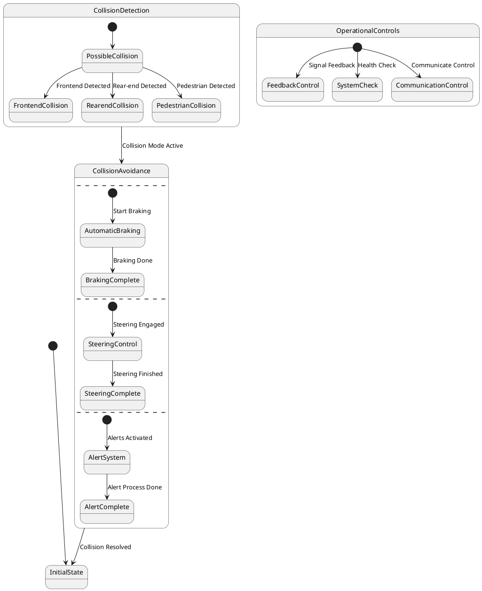

# Pair `0007`：NL + PlantUML STM0 + FCSTM STM0

[上一组 `0006`](../0006/README.md) | [返回 60 组索引](../../PAIR_INDEX.md) | [下一组 `0008`](../0008/README.md)

- LLM：`GPT-4o`
- 模型/场景：Collision avoidance sub-machine state diagram
- 作者输出阶段：`Result with Semantic Checking`
- 作者输出单元格：`AE9`；Excel row：`9`
- Phase-I fallback：`false`
- 相对 Phase-I 是否变化：`true`
- Phase-I PlantUML SHA-256：`2e95dc642f73f0d546f8fc356d6ac3a03283887a693a8c56797c1199da64d2b2`
- NL SHA-256：`49854d044ad99f16a710021500f5e972da93b27635a41144d9b91d32444c0f63`
- PlantUML SHA-256：`b703cade3844700c2705caa20001f515b16438ca308f973c7e4caf2f263478f4`
- FCSTM SHA-256：`684b144bb8d600c1be2f42bfd986be7dbf780cb2cb1b2c60a31beaa8d42ac2de`
- review subject SHA-256：`be8d7711ecd3a8c06a713d6ae83d1cc4c01adbbcea7640cbc677d0716fc9191b`
- working contract SHA-256：`5742d5eaf38a232a497d68bc1b79344452df86b25e2b9b4cf0255ba3234a75eb`
- 结构裁决：`structure_preserved`
- source states / transitions：`17` / `16`
- mapped / blocked / silent drop：`16` / `0` / `0`
- final / lifecycle / body coverage：`0/0` / `0/0` / `0/0`
- concurrent region / separator coverage：`4/4` / `3/3`
- source normalization coverage：`0/0`
- official raw / validation：`state_diagram` / `state_diagram`
- official identity states / transitions：`17` / `16`
- official identity remaps：state `0` / transition endpoint `0`
- AST audit：`passed`
- legacy whole-model FCSTM execution / Discover：`false` / `false`
- working bundle usage gate：`discover_input_with_capability_mask`
- ownership source / compiler / agent：`37` / `42` / `0`
- source macro / positive identity trace / conversion boundary trace：`20` / `37` / `0`
- capability source-static / simulation / transition-trace：`eligible_with_exclusions` / `eligible_with_exclusions` / `eligible_with_exclusions`
- compiler-only diagnostic policy：`rejected_conversion_artifact`；main-result conversion artifact limit：`0`
- 主 session 对读：`pass`；ownership/macro/capability 均为 `pass`；Case 0007 passes the current attribution-safe forward review; this does not assert global behavior equivalence, and unsupported runtime semantics remain fail-closed. Amendment record: the substantive subject review remains the one recorded in review_context (first reviewed 2026-07-20T05:44:08Z by gpt-5.5 (session omx-1784393668980-pxpj3q), and it still binds because review_subject_sha256 is unchanged. A scoped re-check was performed 2026-08-17 by claude-opus-5 (main-session LLM, PR #185) because commit bbb04cb1 (2026-07-27) regenerated the 60 working contracts and commit 35eba126 (2026-08-11) renamed the paper workspace, and neither refreshed this registry. The re-review is scoped: a key-by-key diff shows the only contract changes are capability_eligibility.simulation, capability_eligibility.transition_trace and summary.simulation_status (bbb04cb1) plus the four artifact_bindings path strings (35eba126); the remaining 168 keys and the whole of canonical/fcstm/parse_inspect/source_traces are byte-identical, so review_subject_sha256 is unchanged and the original ownership, macro and correspondence findings still stand. The capability block was re-checked against seven invariants: eligible ids are source: only, excluded ids cover the compiler-owned set, the two sets are disjoint, claim_boundary and reason_codes are non-empty, main_result_conversion_artifact_limit is still 0, and usage_gate is unchanged.
- source anchors：`source-ref:llms_emp_feedback_final_0007.puml:line:4\|state CollisionDetection {, source-ref:llms_emp_feedback_final_0007.puml:line:6\|PossibleCollision --> FrontendCollision : Frontend Detected`；FCSTM anchors：`element-ref:source:state:CollisionDetection@line:17\|state CollisionDetection named "CollisionDetection" {, element-ref:compiler:transition_segment:tr_0003:segment:1@line:23\|PossibleCollision -> FrontendCollision : /Frontend_Detected;`
- 三个原始文件：[NL](./nl.txt) | [PlantUML](./plantuml.puml) | [FCSTM](./fcstm.fcstm)
- 审计入口：[canonical](../../canonical/llms_emp_feedback_final_0007.json) | [冻结 FCSTM](../../fcstm/llms_emp_feedback_final_0007.fcstm) | [case report](../../case_reports/llms_emp_feedback_final_0007.json) | [working contract](../../working_contracts/llms_emp_feedback_final_0007.json) | [source trace](../../source_traces/llms_emp_feedback_final_0007.json) | [人工总账](../../MANUAL_REVIEW.md)

## 主 session 三方语义对应

| projection | assessment | NL anchor | PlantUML anchor | FCSTM anchor | source roots | compiler members | rationale |
|---|---|---|---|---|---|---|---|
| `direct` | `preserved` | There are three region in this diagram | source-ref:llms_emp_feedback_final_0007.puml:line:4\|state CollisionDetection { | element-ref:source:state:CollisionDetection@line:17\|state CollisionDetection named "CollisionDetection" { | source:state:CollisionDetection | - | Case 0007 binds source:state:CollisionDetection to authored PlantUML occurrence 'state CollisionDetection {' and current FCSTM occurrence 'state CollisionDetection named "CollisionDetection" {'; the source semantic root remains attributable while any compiler-owned projection stays protected and cannot become an independent Repair target. |
| `macro` | `preserved_with_exclusions` | This sub-machine becomes active when a possible frontend collision, rear-end collision or collision with pedestrian is | source-ref:llms_emp_feedback_final_0007.puml:line:6\|PossibleCollision --> FrontendCollision : Frontend Detected | element-ref:compiler:transition_segment:tr_0003:segment:1@line:23\|PossibleCollision -> FrontendCollision : /Frontend_Detected; | source:transition:tr_0003 | compiler:transition_segment:tr_0003:segment:1 | Case 0007 binds source:transition:tr_0003 to authored PlantUML occurrence 'PossibleCollision --> FrontendCollision : Frontend Detected' and current FCSTM occurrence 'PossibleCollision -> FrontendCollision : /Frontend_Detected;'; the source semantic root remains attributable while any compiler-owned projection stays protected and cannot become an independent Repair target. |

## Risk occurrence 第二遍复核

| obligation | risk tag | assessment | PlantUML evidence | FCSTM evidence | ownership evidence | rationale |
|---|---|---|---|---|---|---|
| `review:multi_segment_macro:0001:tr_0015` | `multi_segment_macro` | `compiler_artifact_excluded` | source-ref:llms_emp_feedback_final_0007.puml:line:31\|CollisionDetection -down-> CollisionAvoidance : Collision Mode Active, source-ref:llms_emp_feedback_final_0007.puml:line:32\|CollisionAvoidance --> InitialState : Collision Resolved | element-ref:compiler:route_control:R45RouteToken@line:1\|def int R45RouteToken = 0;, element-ref:compiler:transition_segment:tr_0015:segment:1@line:26\|PossibleCollision -> [*] : /Collision_Mode_Active effect { R45RouteToken = 15; };, element-ref:compiler:transition_segment:tr_0015:segment:2@line:27\|FrontendCollision -> [*] : /Collision_Mode_Active effect { R45RouteToken = 15; };, element-ref:compiler:transition_segment:tr_0015:segment:3@line:28\|RearendCollision -> [*] : /Collision_Mode_Active effect { R45RouteToken = 15; };, element-ref:compiler:transition_segment:tr_0015:segment:4@line:29\|PedestrianCollision -> [*] : /Collision_Mode_Active effect { R45RouteToken = 15; };, element-ref:compiler:transition_segment:tr_0015:segment:5@line:60\|CollisionDetection -> CollisionAvoidance : if [R45RouteToken == 15] effect { R45RouteToken = 0; }; | compiler:route_control:R45RouteToken, compiler:transition_segment:tr_0015:segment:1, compiler:transition_segment:tr_0015:segment:2, compiler:transition_segment:tr_0015:segment:3, compiler:transition_segment:tr_0015:segment:4, compiler:transition_segment:tr_0015:segment:5, source:transition:tr_0015 | Case 0007 multi_segment_macro occurrence review:multi_segment_macro:0001:tr_0015 binds exact source refs to working-contract elements compiler:route_control:R45RouteToken, compiler:transition_segment:tr_0015:segment:1, compiler:transition_segment:tr_0015:segment:2, compiler:transition_segment:tr_0015:segment:3, compiler:transition_segment:tr_0015:segment:4, compiler:transition_segment:tr_0015:segment:5, source:transition:tr_0015. All emitted segments collapse to one source transition root; no segment is promoted as a separate authored transition or editable issue target. |
| `review:route_controller:0002:tr_0015` | `route_controller` | `compiler_artifact_excluded` | source-ref:llms_emp_feedback_final_0007.puml:line:31\|CollisionDetection -down-> CollisionAvoidance : Collision Mode Active, source-ref:llms_emp_feedback_final_0007.puml:line:32\|CollisionAvoidance --> InitialState : Collision Resolved | element-ref:compiler:route_control:R45RouteToken@line:1\|def int R45RouteToken = 0;, element-ref:compiler:transition_segment:tr_0015:segment:1@line:26\|PossibleCollision -> [*] : /Collision_Mode_Active effect { R45RouteToken = 15; };, element-ref:compiler:transition_segment:tr_0015:segment:2@line:27\|FrontendCollision -> [*] : /Collision_Mode_Active effect { R45RouteToken = 15; };, element-ref:compiler:transition_segment:tr_0015:segment:3@line:28\|RearendCollision -> [*] : /Collision_Mode_Active effect { R45RouteToken = 15; };, element-ref:compiler:transition_segment:tr_0015:segment:4@line:29\|PedestrianCollision -> [*] : /Collision_Mode_Active effect { R45RouteToken = 15; };, element-ref:compiler:transition_segment:tr_0015:segment:5@line:60\|CollisionDetection -> CollisionAvoidance : if [R45RouteToken == 15] effect { R45RouteToken = 0; }; | compiler:route_control:R45RouteToken, compiler:transition_segment:tr_0015:segment:1, compiler:transition_segment:tr_0015:segment:2, compiler:transition_segment:tr_0015:segment:3, compiler:transition_segment:tr_0015:segment:4, compiler:transition_segment:tr_0015:segment:5, source:transition:tr_0015 | Case 0007 route_controller occurrence review:route_controller:0002:tr_0015 binds exact source refs to working-contract elements compiler:route_control:R45RouteToken, compiler:transition_segment:tr_0015:segment:1, compiler:transition_segment:tr_0015:segment:2, compiler:transition_segment:tr_0015:segment:3, compiler:transition_segment:tr_0015:segment:4, compiler:transition_segment:tr_0015:segment:5, source:transition:tr_0015. R45RouteToken and routed segments remain compiler_owned, protected, and excluded from confirmed issues, Repair, Confirm acceptance, and main results. |
| `review:multi_segment_macro:0003:tr_0016` | `multi_segment_macro` | `compiler_artifact_excluded` | source-ref:llms_emp_feedback_final_0007.puml:line:31\|CollisionDetection -down-> CollisionAvoidance : Collision Mode Active, source-ref:llms_emp_feedback_final_0007.puml:line:32\|CollisionAvoidance --> InitialState : Collision Resolved | element-ref:compiler:route_control:R45RouteToken@line:1\|def int R45RouteToken = 0;, element-ref:compiler:transition_segment:tr_0016:segment:1@line:44\|AutomaticBraking -> [*] : /Collision_Resolved effect { R45RouteToken = 16; };, element-ref:compiler:transition_segment:tr_0016:segment:2@line:45\|BrakingComplete -> [*] : /Collision_Resolved effect { R45RouteToken = 16; };, element-ref:compiler:transition_segment:tr_0016:segment:3@line:46\|SteeringControl -> [*] : /Collision_Resolved effect { R45RouteToken = 16; };, element-ref:compiler:transition_segment:tr_0016:segment:4@line:47\|SteeringComplete -> [*] : /Collision_Resolved effect { R45RouteToken = 16; };, element-ref:compiler:transition_segment:tr_0016:segment:5@line:48\|AlertSystem -> [*] : /Collision_Resolved effect { R45RouteToken = 16; };, element-ref:compiler:transition_segment:tr_0016:segment:6@line:49\|AlertComplete -> [*] : /Collision_Resolved effect { R45RouteToken = 16; };, element-ref:compiler:transition_segment:tr_0016:segment:7@line:61\|CollisionAvoidance -> InitialState : if [R45RouteToken == 16] effect { R45RouteToken = 0; }; | compiler:route_control:R45RouteToken, compiler:transition_segment:tr_0016:segment:1, compiler:transition_segment:tr_0016:segment:2, compiler:transition_segment:tr_0016:segment:3, compiler:transition_segment:tr_0016:segment:4, compiler:transition_segment:tr_0016:segment:5, compiler:transition_segment:tr_0016:segment:6, compiler:transition_segment:tr_0016:segment:7, source:transition:tr_0016 | Case 0007 multi_segment_macro occurrence review:multi_segment_macro:0003:tr_0016 binds exact source refs to working-contract elements compiler:route_control:R45RouteToken, compiler:transition_segment:tr_0016:segment:1, compiler:transition_segment:tr_0016:segment:2, compiler:transition_segment:tr_0016:segment:3, compiler:transition_segment:tr_0016:segment:4, compiler:transition_segment:tr_0016:segment:5, compiler:transition_segment:tr_0016:segment:6, compiler:transition_segment:tr_0016:segment:7, source:transition:tr_0016. All emitted segments collapse to one source transition root; no segment is promoted as a separate authored transition or editable issue target. |
| `review:route_controller:0004:tr_0016` | `route_controller` | `compiler_artifact_excluded` | source-ref:llms_emp_feedback_final_0007.puml:line:31\|CollisionDetection -down-> CollisionAvoidance : Collision Mode Active, source-ref:llms_emp_feedback_final_0007.puml:line:32\|CollisionAvoidance --> InitialState : Collision Resolved | element-ref:compiler:route_control:R45RouteToken@line:1\|def int R45RouteToken = 0;, element-ref:compiler:transition_segment:tr_0016:segment:1@line:44\|AutomaticBraking -> [*] : /Collision_Resolved effect { R45RouteToken = 16; };, element-ref:compiler:transition_segment:tr_0016:segment:2@line:45\|BrakingComplete -> [*] : /Collision_Resolved effect { R45RouteToken = 16; };, element-ref:compiler:transition_segment:tr_0016:segment:3@line:46\|SteeringControl -> [*] : /Collision_Resolved effect { R45RouteToken = 16; };, element-ref:compiler:transition_segment:tr_0016:segment:4@line:47\|SteeringComplete -> [*] : /Collision_Resolved effect { R45RouteToken = 16; };, element-ref:compiler:transition_segment:tr_0016:segment:5@line:48\|AlertSystem -> [*] : /Collision_Resolved effect { R45RouteToken = 16; };, element-ref:compiler:transition_segment:tr_0016:segment:6@line:49\|AlertComplete -> [*] : /Collision_Resolved effect { R45RouteToken = 16; };, element-ref:compiler:transition_segment:tr_0016:segment:7@line:61\|CollisionAvoidance -> InitialState : if [R45RouteToken == 16] effect { R45RouteToken = 0; }; | compiler:route_control:R45RouteToken, compiler:transition_segment:tr_0016:segment:1, compiler:transition_segment:tr_0016:segment:2, compiler:transition_segment:tr_0016:segment:3, compiler:transition_segment:tr_0016:segment:4, compiler:transition_segment:tr_0016:segment:5, compiler:transition_segment:tr_0016:segment:6, compiler:transition_segment:tr_0016:segment:7, source:transition:tr_0016 | Case 0007 route_controller occurrence review:route_controller:0004:tr_0016 binds exact source refs to working-contract elements compiler:route_control:R45RouteToken, compiler:transition_segment:tr_0016:segment:1, compiler:transition_segment:tr_0016:segment:2, compiler:transition_segment:tr_0016:segment:3, compiler:transition_segment:tr_0016:segment:4, compiler:transition_segment:tr_0016:segment:5, compiler:transition_segment:tr_0016:segment:6, compiler:transition_segment:tr_0016:segment:7, source:transition:tr_0016. R45RouteToken and routed segments remain compiler_owned, protected, and excluded from confirmed issues, Repair, Confirm acceptance, and main results. |
| `review:concurrent_region:0005:CollisionAvoidance:region:0` | `concurrent_region` | `capability_excluded` | source-ref:llms_emp_feedback_final_0007.puml:line:12\|-- | element-ref:source:region:CollisionAvoidance:region:0@line:31\|state CollisionAvoidance named "CollisionAvoidance\n[PlantUML concurrent region 0] states=-; transitions=-\n[PlantUML concurrent region 1] states=CollisionAvoidance.AutomaticBraking, CollisionAvoidance.BrakingComplete; transitions=tr_0006, tr_0007\n[PlantUML concurrent region 2] states=CollisionAvoidance.SteeringControl, CollisionAvoidance.SteeringComplete; transitions=tr_0008, tr_0009\n[PlantUML concurrent region 3] states=CollisionAvoidance.AlertSystem, CollisionAvoidance.AlertComplete; transitions=tr_0010, tr_0011\n[PlantUML concurrent separator] region 0 -> 1 at llms_emp_feedback_final_0007.puml:line:12\n[PlantUML concurrent separator] region 1 -> 2 at llms_emp_feedback_final_0007.puml:line:16\n[PlantUML concurrent separator] region 2 -> 3 at llms_emp_feedback_final_0007.puml:line:20" { | source:region:CollisionAvoidance:region:0 | Case 0007 concurrent_region occurrence review:concurrent_region:0005:CollisionAvoidance:region:0 binds exact source refs to working-contract elements source:region:CollisionAvoidance:region:0. The authored region occurrence is preserved as source metadata, while single-active FCSTM runtime behavior remains capability_excluded. |
| `review:concurrent_region:0006:CollisionAvoidance:region:1` | `concurrent_region` | `capability_excluded` | source-ref:llms_emp_feedback_final_0007.puml:line:12\|--, source-ref:llms_emp_feedback_final_0007.puml:line:16\|-- | element-ref:source:region:CollisionAvoidance:region:1@line:31\|state CollisionAvoidance named "CollisionAvoidance\n[PlantUML concurrent region 0] states=-; transitions=-\n[PlantUML concurrent region 1] states=CollisionAvoidance.AutomaticBraking, CollisionAvoidance.BrakingComplete; transitions=tr_0006, tr_0007\n[PlantUML concurrent region 2] states=CollisionAvoidance.SteeringControl, CollisionAvoidance.SteeringComplete; transitions=tr_0008, tr_0009\n[PlantUML concurrent region 3] states=CollisionAvoidance.AlertSystem, CollisionAvoidance.AlertComplete; transitions=tr_0010, tr_0011\n[PlantUML concurrent separator] region 0 -> 1 at llms_emp_feedback_final_0007.puml:line:12\n[PlantUML concurrent separator] region 1 -> 2 at llms_emp_feedback_final_0007.puml:line:16\n[PlantUML concurrent separator] region 2 -> 3 at llms_emp_feedback_final_0007.puml:line:20" { | source:region:CollisionAvoidance:region:1 | Case 0007 concurrent_region occurrence review:concurrent_region:0006:CollisionAvoidance:region:1 binds exact source refs to working-contract elements source:region:CollisionAvoidance:region:1. The authored region occurrence is preserved as source metadata, while single-active FCSTM runtime behavior remains capability_excluded. |
| `review:concurrent_region:0007:CollisionAvoidance:region:2` | `concurrent_region` | `capability_excluded` | source-ref:llms_emp_feedback_final_0007.puml:line:16\|--, source-ref:llms_emp_feedback_final_0007.puml:line:20\|-- | element-ref:source:region:CollisionAvoidance:region:2@line:31\|state CollisionAvoidance named "CollisionAvoidance\n[PlantUML concurrent region 0] states=-; transitions=-\n[PlantUML concurrent region 1] states=CollisionAvoidance.AutomaticBraking, CollisionAvoidance.BrakingComplete; transitions=tr_0006, tr_0007\n[PlantUML concurrent region 2] states=CollisionAvoidance.SteeringControl, CollisionAvoidance.SteeringComplete; transitions=tr_0008, tr_0009\n[PlantUML concurrent region 3] states=CollisionAvoidance.AlertSystem, CollisionAvoidance.AlertComplete; transitions=tr_0010, tr_0011\n[PlantUML concurrent separator] region 0 -> 1 at llms_emp_feedback_final_0007.puml:line:12\n[PlantUML concurrent separator] region 1 -> 2 at llms_emp_feedback_final_0007.puml:line:16\n[PlantUML concurrent separator] region 2 -> 3 at llms_emp_feedback_final_0007.puml:line:20" { | source:region:CollisionAvoidance:region:2 | Case 0007 concurrent_region occurrence review:concurrent_region:0007:CollisionAvoidance:region:2 binds exact source refs to working-contract elements source:region:CollisionAvoidance:region:2. The authored region occurrence is preserved as source metadata, while single-active FCSTM runtime behavior remains capability_excluded. |
| `review:concurrent_region:0008:CollisionAvoidance:region:3` | `concurrent_region` | `capability_excluded` | source-ref:llms_emp_feedback_final_0007.puml:line:20\|-- | element-ref:source:region:CollisionAvoidance:region:3@line:31\|state CollisionAvoidance named "CollisionAvoidance\n[PlantUML concurrent region 0] states=-; transitions=-\n[PlantUML concurrent region 1] states=CollisionAvoidance.AutomaticBraking, CollisionAvoidance.BrakingComplete; transitions=tr_0006, tr_0007\n[PlantUML concurrent region 2] states=CollisionAvoidance.SteeringControl, CollisionAvoidance.SteeringComplete; transitions=tr_0008, tr_0009\n[PlantUML concurrent region 3] states=CollisionAvoidance.AlertSystem, CollisionAvoidance.AlertComplete; transitions=tr_0010, tr_0011\n[PlantUML concurrent separator] region 0 -> 1 at llms_emp_feedback_final_0007.puml:line:12\n[PlantUML concurrent separator] region 1 -> 2 at llms_emp_feedback_final_0007.puml:line:16\n[PlantUML concurrent separator] region 2 -> 3 at llms_emp_feedback_final_0007.puml:line:20" { | source:region:CollisionAvoidance:region:3 | Case 0007 concurrent_region occurrence review:concurrent_region:0008:CollisionAvoidance:region:3 binds exact source refs to working-contract elements source:region:CollisionAvoidance:region:3. The authored region occurrence is preserved as source metadata, while single-active FCSTM runtime behavior remains capability_excluded. |
| `review:explicit_concurrency:0009:001-multiple_initial_fanout` | `explicit_concurrency` | `capability_excluded` | source-ref:llms_emp_feedback_final_0007.puml:line:13\|[*] --> AutomaticBraking : Start Braking, source-ref:llms_emp_feedback_final_0007.puml:line:17\|[*] --> SteeringControl : Steering Engaged, source-ref:llms_emp_feedback_final_0007.puml:line:21\|[*] --> AlertSystem : Alerts Activated | element-ref:compiler:transition_segment:tr_0006:segment:1@line:38\|[*] -> AutomaticBraking : /Start_Braking;, element-ref:compiler:transition_segment:tr_0008:segment:1@line:40\|[*] -> SteeringControl : /Steering_Engaged;, element-ref:compiler:transition_segment:tr_0010:segment:1@line:42\|[*] -> AlertSystem : /Alerts_Activated; | source:transition:tr_0006, source:transition:tr_0008, source:transition:tr_0010 | Case 0007 explicit_concurrency occurrence review:explicit_concurrency:0009:001-multiple_initial_fanout binds exact source refs to working-contract elements source:transition:tr_0006, source:transition:tr_0008, source:transition:tr_0010. The authored fork, join, or fan-out occurrence remains source-visible, while unsupported concurrent execution is capability_excluded rather than guessed. |
| `review:explicit_concurrency:0010:002-multiple_initial_fanout` | `explicit_concurrency` | `capability_excluded` | source-ref:llms_emp_feedback_final_0007.puml:line:26\|[*] --> FeedbackControl : Signal Feedback, source-ref:llms_emp_feedback_final_0007.puml:line:27\|[*] --> SystemCheck : Health Check, source-ref:llms_emp_feedback_final_0007.puml:line:28\|[*] --> CommunicationControl : Communicate Control | element-ref:compiler:transition_segment:tr_0012:segment:1@line:55\|[*] -> FeedbackControl : /Signal_Feedback;, element-ref:compiler:transition_segment:tr_0013:segment:1@line:56\|[*] -> SystemCheck : /Health_Check;, element-ref:compiler:transition_segment:tr_0014:segment:1@line:57\|[*] -> CommunicationControl : /Communicate_Control; | source:transition:tr_0012, source:transition:tr_0013, source:transition:tr_0014 | Case 0007 explicit_concurrency occurrence review:explicit_concurrency:0010:002-multiple_initial_fanout binds exact source refs to working-contract elements source:transition:tr_0012, source:transition:tr_0013, source:transition:tr_0014. The authored fork, join, or fan-out occurrence remains source-visible, while unsupported concurrent execution is capability_excluded rather than guessed. |

## 作者阶段 lineage

| stage | output cell | present | output SHA-256 | feedback | resolved |
|---|---|---|---|---|---|
| `phase_i_generation` | `I9` | `true` | `2e95dc642f73f0d546f8fc356d6ac3a03283887a693a8c56797c1199da64d2b2` | - | - |
| `phase_ii_format` | `U9` | `false` | `-` | - | - |
| `phase_ii_grammar` | `Z9` | `false` | `-` | - | - |
| `phase_ii_semantic` | `AE9` | `true` | `b703cade3844700c2705caa20001f515b16438ca308f973c7e4caf2f263478f4` | 1. use region instead of state in composite state | 1.0 |

## Official identity ledger

- status：`aligned`
- canonical / official states：`17` / `17`
- aligned transition endpoints：`16`

本组 state identity 无需重映射。

本组 transition endpoint 无需重映射。

## Source normalization ledger

本组没有 source-input normalization。

## Concurrent region ledger

| owner | region | direct states | direct transitions | separator before | separator after |
|---|---:|---|---|---|---|
| `CollisionAvoidance` | 0 | - | - | - | llms_emp_feedback_final_0007.puml:line:12 |
| `CollisionAvoidance` | 1 | CollisionAvoidance.AutomaticBraking, CollisionAvoidance.BrakingComplete | tr_0006, tr_0007 | llms_emp_feedback_final_0007.puml:line:12 | llms_emp_feedback_final_0007.puml:line:16 |
| `CollisionAvoidance` | 2 | CollisionAvoidance.SteeringControl, CollisionAvoidance.SteeringComplete | tr_0008, tr_0009 | llms_emp_feedback_final_0007.puml:line:16 | llms_emp_feedback_final_0007.puml:line:20 |
| `CollisionAvoidance` | 3 | CollisionAvoidance.AlertSystem, CollisionAvoidance.AlertComplete | tr_0010, tr_0011 | llms_emp_feedback_final_0007.puml:line:20 | - |

## Operational debt

| reason code | count |
|---|---:|
| `R45.DEBT.composite_source_activation_dispatch` | 2 |
| `R45.DEBT.concurrent_region_semantics` | 1 |
| `R45.DEBT.multiple_initial_fanout` | 2 |
| `R45.DEBT.opaque_transition_label_semantics` | 14 |

## NL

```text
1. There are three region in this diagram
2. This sub-machine becomes active when a possible frontend collision, rear-end collision or collision with pedestrian is detected.
3. The orthogonal regions of the active mode of collision avoidance allow for concurrent activation different of collision avoidance controls.
```

## 作者 Phase-II 最终 PlantUML STM0



## 转换后 FCSTM STM0

```fcstm
def int R45RouteToken = 0;
state llms_emp_feedback_final_0007 named "llms_emp_feedback_final_0007" {
    event Frontend_Detected named "Frontend Detected";
    event Rear_end_Detected named "Rear-end Detected";
    event Pedestrian_Detected named "Pedestrian Detected";
    event Start_Braking named "Start Braking";
    event Braking_Done named "Braking Done";
    event Steering_Engaged named "Steering Engaged";
    event Steering_Finished named "Steering Finished";
    event Alerts_Activated named "Alerts Activated";
    event Alert_Process_Done named "Alert Process Done";
    event Signal_Feedback named "Signal Feedback";
    event Health_Check named "Health Check";
    event Communicate_Control named "Communicate Control";
    event Collision_Mode_Active named "Collision Mode Active";
    event Collision_Resolved named "Collision Resolved";
    state CollisionDetection named "CollisionDetection" {
        state PossibleCollision named "PossibleCollision";
        state FrontendCollision named "FrontendCollision";
        state RearendCollision named "RearendCollision";
        state PedestrianCollision named "PedestrianCollision";
        [*] -> PossibleCollision;
        PossibleCollision -> FrontendCollision : /Frontend_Detected;
        PossibleCollision -> RearendCollision : /Rear_end_Detected;
        PossibleCollision -> PedestrianCollision : /Pedestrian_Detected;
        PossibleCollision -> [*] : /Collision_Mode_Active effect { R45RouteToken = 15; };
        FrontendCollision -> [*] : /Collision_Mode_Active effect { R45RouteToken = 15; };
        RearendCollision -> [*] : /Collision_Mode_Active effect { R45RouteToken = 15; };
        PedestrianCollision -> [*] : /Collision_Mode_Active effect { R45RouteToken = 15; };
    }
    state CollisionAvoidance named "CollisionAvoidance\n[PlantUML concurrent region 0] states=-; transitions=-\n[PlantUML concurrent region 1] states=CollisionAvoidance.AutomaticBraking, CollisionAvoidance.BrakingComplete; transitions=tr_0006, tr_0007\n[PlantUML concurrent region 2] states=CollisionAvoidance.SteeringControl, CollisionAvoidance.SteeringComplete; transitions=tr_0008, tr_0009\n[PlantUML concurrent region 3] states=CollisionAvoidance.AlertSystem, CollisionAvoidance.AlertComplete; transitions=tr_0010, tr_0011\n[PlantUML concurrent separator] region 0 -> 1 at llms_emp_feedback_final_0007.puml:line:12\n[PlantUML concurrent separator] region 1 -> 2 at llms_emp_feedback_final_0007.puml:line:16\n[PlantUML concurrent separator] region 2 -> 3 at llms_emp_feedback_final_0007.puml:line:20" {
        state AutomaticBraking named "AutomaticBraking";
        state BrakingComplete named "BrakingComplete";
        state SteeringControl named "SteeringControl";
        state SteeringComplete named "SteeringComplete";
        state AlertSystem named "AlertSystem";
        state AlertComplete named "AlertComplete";
        [*] -> AutomaticBraking : /Start_Braking;
        AutomaticBraking -> BrakingComplete : /Braking_Done;
        [*] -> SteeringControl : /Steering_Engaged;
        SteeringControl -> SteeringComplete : /Steering_Finished;
        [*] -> AlertSystem : /Alerts_Activated;
        AlertSystem -> AlertComplete : /Alert_Process_Done;
        AutomaticBraking -> [*] : /Collision_Resolved effect { R45RouteToken = 16; };
        BrakingComplete -> [*] : /Collision_Resolved effect { R45RouteToken = 16; };
        SteeringControl -> [*] : /Collision_Resolved effect { R45RouteToken = 16; };
        SteeringComplete -> [*] : /Collision_Resolved effect { R45RouteToken = 16; };
        AlertSystem -> [*] : /Collision_Resolved effect { R45RouteToken = 16; };
        AlertComplete -> [*] : /Collision_Resolved effect { R45RouteToken = 16; };
    }
    state OperationalControls named "OperationalControls" {
        state FeedbackControl named "FeedbackControl";
        state SystemCheck named "SystemCheck";
        state CommunicationControl named "CommunicationControl";
        [*] -> FeedbackControl : /Signal_Feedback;
        [*] -> SystemCheck : /Health_Check;
        [*] -> CommunicationControl : /Communicate_Control;
    }
    state InitialState named "InitialState";
    CollisionDetection -> CollisionAvoidance : if [R45RouteToken == 15] effect { R45RouteToken = 0; };
    CollisionAvoidance -> InitialState : if [R45RouteToken == 16] effect { R45RouteToken = 0; };
    [*] -> InitialState;
}
```

[上一组 `0006`](../0006/README.md) | [返回 60 组索引](../../PAIR_INDEX.md) | [下一组 `0008`](../0008/README.md)
