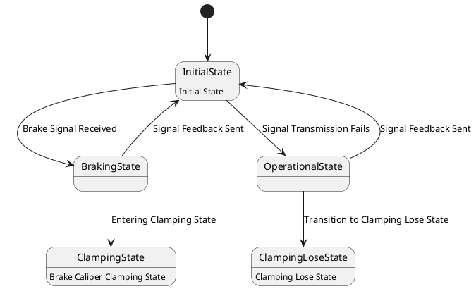

# Pair `0011`：NL + PlantUML STM0 + FCSTM STM0

[上一组 `0010`](../0010/README.md) | [返回 60 组索引](../../PAIR_INDEX.md) | [下一组 `0012`](../0012/README.md)

- LLM：`GPT-4`
- 模型/场景：State machine diagram of the base brake subsystem
- 作者输出阶段：`Result with Semantic Checking`
- 作者输出单元格：`AE13`；Excel row：`13`
- Phase-I fallback：`false`
- 相对 Phase-I 是否变化：`true`
- Phase-I PlantUML SHA-256：`3d75fa9170ba4fdf5b0e8061e2dc1bba709824fbffb6768713232f262bb6ce28`
- NL SHA-256：`abb20a2187c100d7c75a3038df101c91b369df70a07dfafd6eafc72da859fc99`
- PlantUML SHA-256：`a609a81454607877775487b2b020a85ab1e4ad859a7dc98f20e2df0a93104c12`
- FCSTM SHA-256：`80bc87148fdeef46a1b69f22f9cb71c060030bf763cdbf90614579b051f8a078`
- review subject SHA-256：`e8dae467545e868b37aa121dcd671f29f6a8e2dc050c2d7afb3424f227a89fbb`
- working contract SHA-256：`044d2df104cfbab377987133e6dcfa73b657a41009db09725108cbfefd2caf40`
- 结构裁决：`structure_preserved`
- source states / transitions：`5` / `7`
- mapped / blocked / silent drop：`7` / `0` / `0`
- final / lifecycle / body coverage：`0/0` / `0/0` / `3/3`
- concurrent region / separator coverage：`0/0` / `0/0`
- source normalization coverage：`0/0`
- official raw / validation：`state_diagram` / `state_diagram`
- official identity states / transitions：`5` / `7`
- official identity remaps：state `0` / transition endpoint `0`
- AST audit：`passed`
- legacy whole-model FCSTM execution / Discover：`false` / `false`
- working bundle usage gate：`discover_input_with_capability_mask`
- ownership source / compiler / agent：`15` / `13` / `0`
- source macro / positive identity trace / conversion boundary trace：`10` / `15` / `0`
- capability source-static / simulation / transition-trace：`eligible_with_exclusions` / `eligible_with_exclusions` / `eligible_with_exclusions`
- compiler-only diagnostic policy：`rejected_conversion_artifact`；main-result conversion artifact limit：`0`
- 主 session 对读：`pass`；ownership/macro/capability 均为 `pass`；Case 0011 passes the current attribution-safe forward review; this does not assert global behavior equivalence, and unsupported runtime semantics remain fail-closed. Amendment record: the substantive subject review remains the one recorded in review_context (first reviewed 2026-07-20T05:44:08Z by gpt-5.5 (session omx-1784393668980-pxpj3q), and it still binds because review_subject_sha256 is unchanged. A scoped re-check was performed 2026-08-17 by claude-opus-5 (main-session LLM, PR #185) because commit bbb04cb1 (2026-07-27) regenerated the 60 working contracts and commit 35eba126 (2026-08-11) renamed the paper workspace, and neither refreshed this registry. The re-review is scoped: a key-by-key diff shows the only contract changes are capability_eligibility.simulation, capability_eligibility.transition_trace and summary.simulation_status (bbb04cb1) plus the four artifact_bindings path strings (35eba126); the remaining 168 keys and the whole of canonical/fcstm/parse_inspect/source_traces are byte-identical, so review_subject_sha256 is unchanged and the original ownership, macro and correspondence findings still stand. The capability block was re-checked against seven invariants: eligible ids are source: only, excluded ids cover the compiler-owned set, the two sets are disjoint, claim_boundary and reason_codes are non-empty, main_result_conversion_artifact_limit is still 0, and usage_gate is unchanged.
- source anchors：`source-ref:llms_emp_feedback_final_0011.puml:line:2\|[*] --> InitialState, source-ref:llms_emp_feedback_final_0011.puml:line:6\|InitialState --> OperationalState : Signal Transmission Fails`；FCSTM anchors：`element-ref:source:state:InitialState@line:7\|state InitialState named "InitialState\n[PlantUML body] Initial State";, element-ref:compiler:transition_segment:tr_0003:segment:1@line:14\|InitialState -> OperationalState : /Signal_Transmission_Fails;`
- 三个原始文件：[NL](./nl.txt) | [PlantUML](./plantuml.puml) | [FCSTM](./fcstm.fcstm)
- 审计入口：[canonical](../../canonical/llms_emp_feedback_final_0011.json) | [冻结 FCSTM](../../fcstm/llms_emp_feedback_final_0011.fcstm) | [case report](../../case_reports/llms_emp_feedback_final_0011.json) | [working contract](../../working_contracts/llms_emp_feedback_final_0011.json) | [source trace](../../source_traces/llms_emp_feedback_final_0011.json) | [人工总账](../../MANUAL_REVIEW.md)

## 主 session 三方语义对应

| projection | assessment | NL anchor | PlantUML anchor | FCSTM anchor | source roots | compiler members | rationale |
|---|---|---|---|---|---|---|---|
| `direct` | `preserved` | 1 This state machine model represents the train's basic braking device, which serves as the final execution unit for | source-ref:llms_emp_feedback_final_0011.puml:line:2\|[*] --> InitialState | element-ref:source:state:InitialState@line:7\|state InitialState named "InitialState\n[PlantUML body] Initial State"; | source:state:InitialState | - | Case 0011 binds source:state:InitialState to authored PlantUML occurrence '[*] --> InitialState' and current FCSTM occurrence 'state InitialState named "InitialState\n[PlantUML body] Initial State";'; the source semantic root remains attributable while any compiler-owned projection stays protected and cannot become an independent Repair target. |
| `macro` | `preserved_with_exclusions` | signal transmission fails | source-ref:llms_emp_feedback_final_0011.puml:line:6\|InitialState --> OperationalState : Signal Transmission Fails | element-ref:compiler:transition_segment:tr_0003:segment:1@line:14\|InitialState -> OperationalState : /Signal_Transmission_Fails; | source:transition:tr_0003 | compiler:transition_segment:tr_0003:segment:1 | Case 0011 binds source:transition:tr_0003 to authored PlantUML occurrence 'InitialState --> OperationalState : Signal Transmission Fails' and current FCSTM occurrence 'InitialState -> OperationalState : /Signal_Transmission_Fails;'; the source semantic root remains attributable while any compiler-owned projection stays protected and cannot become an independent Repair target. |

## Risk occurrence 第二遍复核

本组不要求 risk-tag 第二遍复核。

## 作者阶段 lineage

| stage | output cell | present | output SHA-256 | feedback | resolved |
|---|---|---|---|---|---|
| `phase_i_generation` | `I13` | `true` | `3d75fa9170ba4fdf5b0e8061e2dc1bba709824fbffb6768713232f262bb6ce28` | - | - |
| `phase_ii_format` | `U13` | `false` | `-` | - | - |
| `phase_ii_grammar` | `Z13` | `false` | `-` | - | - |
| `phase_ii_semantic` | `AE13` | `true` | `a609a81454607877775487b2b020a85ab1e4ad859a7dc98f20e2df0a93104c12` | 1. missing state and transition | 1.0 |

## Official identity ledger

- status：`aligned`
- canonical / official states：`5` / `5`
- aligned transition endpoints：`7`

本组 state identity 无需重映射。

本组 transition endpoint 无需重映射。

## Source normalization ledger

本组没有 source-input normalization。

## Concurrent region ledger

本组没有 PlantUML orthogonal/concurrent region separator。

## Operational debt

| reason code | count |
|---|---:|
| `R45.DEBT.opaque_state_body_semantics` | 3 |
| `R45.DEBT.opaque_transition_label_semantics` | 6 |

## NL

```text
1 This state machine model represents the train's basic braking device, which serves as the final execution unit for train braking operations.
2 When the basic braking device receives a brake signal, it transitions from the initial state to the braking state. If the signal transmission fails, it proceeds to the operational state. Once the signal feedback is sent, it returns to the initial state.
3 After entering the braking state, the system transitions to the brake caliper clamping state.
```

## 作者 Phase-II 最终 PlantUML STM0



## 转换后 FCSTM STM0

```fcstm
state llms_emp_feedback_final_0011 named "llms_emp_feedback_final_0011" {
    event Brake_Signal_Received named "Brake Signal Received";
    event Signal_Transmission_Fails named "Signal Transmission Fails";
    event Entering_Clamping_State named "Entering Clamping State";
    event Signal_Feedback_Sent named "Signal Feedback Sent";
    event Transition_to_Clamping_Lose_State named "Transition to Clamping Lose State";
    state InitialState named "InitialState\n[PlantUML body] Initial State";
    state BrakingState named "BrakingState";
    state OperationalState named "OperationalState";
    state ClampingState named "ClampingState\n[PlantUML body] Brake Caliper Clamping State";
    state ClampingLoseState named "ClampingLoseState\n[PlantUML body] Clamping Lose State";
    [*] -> InitialState;
    InitialState -> BrakingState : /Brake_Signal_Received;
    InitialState -> OperationalState : /Signal_Transmission_Fails;
    BrakingState -> ClampingState : /Entering_Clamping_State;
    OperationalState -> InitialState : /Signal_Feedback_Sent;
    BrakingState -> InitialState : /Signal_Feedback_Sent;
    OperationalState -> ClampingLoseState : /Transition_to_Clamping_Lose_State;
}
```

[上一组 `0010`](../0010/README.md) | [返回 60 组索引](../../PAIR_INDEX.md) | [下一组 `0012`](../0012/README.md)
