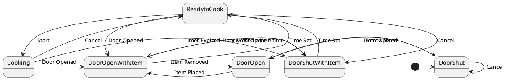

# Pair `0015`：NL + PlantUML STM0 + FCSTM STM0

[上一组 `0014`](../0014/README.md) | [返回 60 组索引](../../PAIR_INDEX.md) | [下一组 `0016`](../0016/README.md)

- LLM：`GPT-4`
- 模型/场景：Microwave Oven Control with entry and <br> exit actions
- 作者输出阶段：`Result with Semantic Checking`
- 作者输出单元格：`AE17`；Excel row：`17`
- Phase-I fallback：`false`
- 相对 Phase-I 是否变化：`true`
- Phase-I PlantUML SHA-256：`beba54d00f7620bcc9b14a882183354a7d49a56468c27fda7a0d2fd4c11b1c6b`
- NL SHA-256：`934e19bd4ae2a793c334fdcf486092d3aa20858f09ae892753ef87698feb061f`
- PlantUML SHA-256：`ff317db2b2e6a4a6a5031e9b33e7cc3a3262ed22e6229f4bb727034fb846c4e3`
- FCSTM SHA-256：`041faf850a00ed47b07a9d2be709dc1c63e376caa28d4e9f35a64dfbc77784ca`
- review subject SHA-256：`037a08efbf1f5fe050d526a2cdd6d7321092f143df73f64869be85e7358108cd`
- working contract SHA-256：`b2a94ba54f9c36772bf6611b61fbb6cd333fc41b1c5227c6af4d3a3f4bec7cc4`
- 结构裁决：`structure_preserved`
- source states / transitions：`6` / `16`
- mapped / blocked / silent drop：`16` / `0` / `0`
- final / lifecycle / body coverage：`0/0` / `0/0` / `0/0`
- concurrent region / separator coverage：`0/0` / `0/0`
- source normalization coverage：`0/0`
- official raw / validation：`state_diagram` / `state_diagram`
- official identity states / transitions：`6` / `16`
- official identity remaps：state `0` / transition endpoint `0`
- AST audit：`passed`
- legacy whole-model FCSTM execution / Discover：`false` / `false`
- working bundle usage gate：`discover_input_with_capability_mask`
- ownership source / compiler / agent：`22` / `26` / `0`
- source macro / positive identity trace / conversion boundary trace：`16` / `22` / `0`
- capability source-static / simulation / transition-trace：`eligible_with_exclusions` / `ineligible` / `ineligible`
- compiler-only diagnostic policy：`rejected_conversion_artifact`；main-result conversion artifact limit：`0`
- 主 session 对读：`pass`；ownership/macro/capability 均为 `pass`；Case 0015 passes the current attribution-safe forward review; this does not assert global behavior equivalence, and unsupported runtime semantics remain fail-closed.
- source anchors：`source-ref:llms_emp_feedback_final_0015.puml:line:2\|state DoorShut, source-ref:llms_emp_feedback_final_0015.puml:line:11\|DoorShut -> DoorOpen : Door Opened`；FCSTM anchors：`element-ref:source:state:DoorShut@line:11\|state DoorShut named "DoorShut";, element-ref:compiler:transition_segment:tr_0002:segment:1@line:18\|DoorShut -> DoorOpen : /Door_Opened;`
- 三个原始文件：[NL](./nl.txt) | [PlantUML](./plantuml.puml) | [FCSTM](./fcstm.fcstm)
- 审计入口：[canonical](../../canonical/llms_emp_feedback_final_0015.json) | [冻结 FCSTM](../../fcstm/llms_emp_feedback_final_0015.fcstm) | [case report](../../case_reports/llms_emp_feedback_final_0015.json) | [working contract](../../working_contracts/llms_emp_feedback_final_0015.json) | [source trace](../../source_traces/llms_emp_feedback_final_0015.json) | [人工总账](../../MANUAL_REVIEW.md)

## 主 session 三方语义对应

| projection | assessment | NL anchor | PlantUML anchor | FCSTM anchor | source roots | compiler members | rationale |
|---|---|---|---|---|---|---|---|
| `direct` | `preserved` | DoorShut | source-ref:llms_emp_feedback_final_0015.puml:line:2\|state DoorShut | element-ref:source:state:DoorShut@line:11\|state DoorShut named "DoorShut"; | source:state:DoorShut | - | Case 0015 binds source:state:DoorShut to authored PlantUML occurrence 'state DoorShut' and current FCSTM occurrence 'state DoorShut named "DoorShut";'; the source semantic root remains attributable while any compiler-owned projection stays protected and cannot become an independent Repair target. |
| `macro` | `preserved_with_exclusions` | Door Opened | source-ref:llms_emp_feedback_final_0015.puml:line:11\|DoorShut -> DoorOpen : Door Opened | element-ref:compiler:transition_segment:tr_0002:segment:1@line:18\|DoorShut -> DoorOpen : /Door_Opened; | source:transition:tr_0002 | compiler:transition_segment:tr_0002:segment:1 | Case 0015 binds source:transition:tr_0002 to authored PlantUML occurrence 'DoorShut -> DoorOpen : Door Opened' and current FCSTM occurrence 'DoorShut -> DoorOpen : /Door_Opened;'; the source semantic root remains attributable while any compiler-owned projection stays protected and cannot become an independent Repair target. |

## Risk occurrence 第二遍复核

本组不要求 risk-tag 第二遍复核。

## 作者阶段 lineage

| stage | output cell | present | output SHA-256 | feedback | resolved |
|---|---|---|---|---|---|
| `phase_i_generation` | `I17` | `true` | `beba54d00f7620bcc9b14a882183354a7d49a56468c27fda7a0d2fd4c11b1c6b` | - | - |
| `phase_ii_format` | `U17` | `false` | `-` | - | - |
| `phase_ii_grammar` | `Z17` | `false` | `-` | - | - |
| `phase_ii_semantic` | `AE17` | `true` | `ff317db2b2e6a4a6a5031e9b33e7cc3a3262ed22e6229f4bb727034fb846c4e3` | 1. no need to use composite state<br>2. interaction error | - |

## Official identity ledger

- status：`aligned`
- canonical / official states：`6` / `6`
- aligned transition endpoints：`16`

本组 state identity 无需重映射。

本组 transition endpoint 无需重映射。

## Source normalization ledger

本组没有 source-input normalization。

## Concurrent region ledger

本组没有 PlantUML orthogonal/concurrent region separator。

## Operational debt

| reason code | count |
|---|---:|
| `R45.DEBT.opaque_transition_label_semantics` | 15 |

## NL

```text
1. The microwave starts in the DoorShut state. From this state, the system can either remain in DoorShut if a Cancel action is performed or transition to the DoorOpen state when the door is opened.
2. When the Door Opened action occurs in the DoorShut state, the system transitions to the DoorOpen state. The door can be closed to return to the DoorShut state.
3. In the DoorOpen state, placing an item inside the microwave transitions the system to DoorOpenWithItem. If the item is removed, the system returns to DoorOpen.
4. From DoorOpenWithItem, the system can transition to DoorShutWithItem if the door is closed with zero time set or to ReadytoCook if cooking time is entered.
5. In the DoorShutWithItem state, opening the door transitions the system back to DoorOpenWithItem, while entering cooking time takes the system to ReadytoCook, where the cooking time is displayed and updated.
6. In the ReadytoCook state, if the Cancel action is performed, the system returns to DoorShutWithItem, canceling or updating the cooking time. If the door is opened, the system transitions to DoorOpenWithItem.
7. When the Start action is performed in ReadytoCook, the system transitions to the Cooking state, where the timer starts.
8. In the Cooking state, opening the door stops the timer and the system transitions to DoorOpenWithItem, while if the timer expires, the system moves to DoorShutWithItem. A Cancel action transitions the system back to ReadytoCook.
```

## 作者 Phase-II 最终 PlantUML STM0



## 转换后 FCSTM STM0

```fcstm
state llms_emp_feedback_final_0015 named "llms_emp_feedback_final_0015" {
    event Door_Opened named "Door Opened";
    event Cancel named "Cancel";
    event Door_Closed named "Door Closed";
    event Item_Placed named "Item Placed";
    event Item_Removed named "Item Removed";
    event Door_Closed_with_0_time named "Door Closed with 0 time";
    event Time_Set named "Time Set";
    event Start named "Start";
    event Timer_Expired named "Timer Expired";
    state DoorShut named "DoorShut";
    state DoorOpen named "DoorOpen";
    state DoorOpenWithItem named "DoorOpenWithItem";
    state DoorShutWithItem named "DoorShutWithItem";
    state ReadytoCook named "ReadytoCook";
    state Cooking named "Cooking";
    [*] -> DoorShut;
    DoorShut -> DoorOpen : /Door_Opened;
    DoorShut -> DoorShut : /Cancel;
    DoorOpen -> DoorShut : /Door_Closed;
    DoorOpen -> DoorOpenWithItem : /Item_Placed;
    DoorOpenWithItem -> DoorOpen : /Item_Removed;
    DoorOpenWithItem -> DoorShutWithItem : /Door_Closed_with_0_time;
    DoorOpenWithItem -> ReadytoCook : /Time_Set;
    DoorShutWithItem -> DoorOpenWithItem : /Door_Opened;
    DoorShutWithItem -> ReadytoCook : /Time_Set;
    ReadytoCook -> DoorShutWithItem : /Cancel;
    ReadytoCook -> DoorOpenWithItem : /Door_Opened;
    ReadytoCook -> Cooking : /Start;
    Cooking -> DoorOpenWithItem : /Door_Opened;
    Cooking -> DoorShutWithItem : /Timer_Expired;
    Cooking -> ReadytoCook : /Cancel;
}
```

[上一组 `0014`](../0014/README.md) | [返回 60 组索引](../../PAIR_INDEX.md) | [下一组 `0016`](../0016/README.md)
