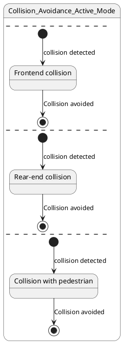

# Pair `0017`：NL + PlantUML STM0 + FCSTM STM0

[上一组 `0016`](../0016/README.md) | [返回 60 组索引](../../PAIR_INDEX.md) | [下一组 `0018`](../0018/README.md)

- LLM：`GPT-4`
- 模型/场景：Collision avoidance sub-machine state diagram
- 作者输出阶段：`Result with Semantic Checking`
- 作者输出单元格：`AE19`；Excel row：`19`
- Phase-I fallback：`false`
- 相对 Phase-I 是否变化：`true`
- Phase-I PlantUML SHA-256：`f8a5658fe506ac755121a5dc3ca3e03564833a8abf51cdd1fb54dd41274b4d79`
- NL SHA-256：`49854d044ad99f16a710021500f5e972da93b27635a41144d9b91d32444c0f63`
- PlantUML SHA-256：`45ffb4fb63359ba7da949bdcbcf8dbd9bcfb802ec7612c989ad06381f2544151`
- FCSTM SHA-256：`904b012efc7c3c2904cefc12ba488f66f8df475edef9797019774ce1bffb1f20`
- review subject SHA-256：`5245c77abe71502c913624cc5241963bafa62b6fb396315c13345512c8bca16b`
- working contract SHA-256：`ee9038ee5f1cef135bc45b2f4706b2021806e301a6ed31845b314dcc7d7d4e80`
- 结构裁决：`structure_preserved`
- source states / transitions：`4` / `6`
- mapped / blocked / silent drop：`6` / `0` / `0`
- final / lifecycle / body coverage：`3/3` / `0/0` / `0/0`
- concurrent region / separator coverage：`4/4` / `3/3`
- source normalization coverage：`0/0`
- official raw / validation：`state_diagram` / `state_diagram`
- official identity states / transitions：`4` / `6`
- official identity remaps：state `0` / transition endpoint `0`
- AST audit：`passed`
- legacy whole-model FCSTM execution / Discover：`false` / `false`
- working bundle usage gate：`discover_input_with_capability_mask`
- ownership source / compiler / agent：`14` / `14` / `0`
- source macro / positive identity trace / conversion boundary trace：`10` / `14` / `0`
- capability source-static / simulation / transition-trace：`eligible_with_exclusions` / `ineligible` / `ineligible`
- compiler-only diagnostic policy：`rejected_conversion_artifact`；main-result conversion artifact limit：`0`
- 主 session 对读：`pass`；ownership/macro/capability 均为 `pass`；Case 0017 passes the current attribution-safe forward review; this does not assert global behavior equivalence, and unsupported runtime semantics remain fail-closed.
- source anchors：`source-ref:llms_emp_feedback_final_0017.puml:line:2\|state Collision_Avoidance_Active_Mode {, source-ref:llms_emp_feedback_final_0017.puml:line:4\|[*] --> F : collision detected`；FCSTM anchors：`element-ref:source:state:Collision_Avoidance_Active_Mode@line:5\|state Collision_Avoidance_Active_Mode named "Collision_Avoidance_Active_Mode\n[PlantUML concurrent region 0] states=-; transitions=-\n[PlantUML concurrent region 1] states=Collision_Avoidance_Active_Mode.F; transitions=tr_0001, tr_0002\n[PlantUML concurrent region 2] states=Collision_Avoidance_Active_Mode.R; transitions=tr_0003, tr_0004\n[PlantUML concurrent region 3] states=Collision_Avoidance_Active_Mode.P; transitions=tr_0005, tr_0006\n[PlantUML concurrent separator] region 0 -> 1 at llms_emp_feedback_final_0017.puml:line:3\n[PlantUML concurrent separator] region 1 -> 2 at llms_emp_feedback_final_0017.puml:line:8\n[PlantUML concurrent separator] region 2 -> 3 at llms_emp_feedback_final_0017.puml:line:13" {, element-ref:compiler:transition_segment:tr_0001:segment:1@line:12\|[*] -> F : /collision_detected;`
- 三个原始文件：[NL](./nl.txt) | [PlantUML](./plantuml.puml) | [FCSTM](./fcstm.fcstm)
- 审计入口：[canonical](../../canonical/llms_emp_feedback_final_0017.json) | [冻结 FCSTM](../../fcstm/llms_emp_feedback_final_0017.fcstm) | [case report](../../case_reports/llms_emp_feedback_final_0017.json) | [working contract](../../working_contracts/llms_emp_feedback_final_0017.json) | [source trace](../../source_traces/llms_emp_feedback_final_0017.json) | [人工总账](../../MANUAL_REVIEW.md)

## 主 session 三方语义对应

| projection | assessment | NL anchor | PlantUML anchor | FCSTM anchor | source roots | compiler members | rationale |
|---|---|---|---|---|---|---|---|
| `direct` | `preserved` | There are three region in this diagram | source-ref:llms_emp_feedback_final_0017.puml:line:2\|state Collision_Avoidance_Active_Mode { | element-ref:source:state:Collision_Avoidance_Active_Mode@line:5\|state Collision_Avoidance_Active_Mode named "Collision_Avoidance_Active_Mode\n[PlantUML concurrent region 0] states=-; transitions=-\n[PlantUML concurrent region 1] states=Collision_Avoidance_Active_Mode.F; transitions=tr_0001, tr_0002\n[PlantUML concurrent region 2] states=Collision_Avoidance_Active_Mode.R; transitions=tr_0003, tr_0004\n[PlantUML concurrent region 3] states=Collision_Avoidance_Active_Mode.P; transitions=tr_0005, tr_0006\n[PlantUML concurrent separator] region 0 -> 1 at llms_emp_feedback_final_0017.puml:line:3\n[PlantUML concurrent separator] region 1 -> 2 at llms_emp_feedback_final_0017.puml:line:8\n[PlantUML concurrent separator] region 2 -> 3 at llms_emp_feedback_final_0017.puml:line:13" { | source:state:Collision_Avoidance_Active_Mode | - | Case 0017 binds source:state:Collision_Avoidance_Active_Mode to authored PlantUML occurrence 'state Collision_Avoidance_Active_Mode {' and current FCSTM occurrence 'state Collision_Avoidance_Active_Mode named "Collision_Avoidance_Active_Mode\n[PlantUML concurrent region 0] states=-; transitions=-\n[PlantUML concurrent region 1] states=Collision_Avoidance_Active_Mode.F; transitions=tr_0001, tr_0002\n[PlantUML concurrent region 2] states=Collision_Avoidance_Active_Mode.R; transitions=tr_0003, tr_0004\n[PlantUML concurrent region 3] states=Collision_Avoidance_Active_Mode.P; transitions=tr_0005, tr_0006\n[PlantUML concurrent separator] region 0 -> 1 at llms_emp_feedback_final_0017.puml:line:3\n[PlantUML concurrent separator] region 1 -> 2 at llms_emp_feedback_final_0017.puml:line:8\n[PlantUML concurrent separator] region 2 -> 3 at llms_emp_feedback_final_0017.puml:line:13" {'; the source semantic root remains attributable while any compiler-owned projection stays protected and cannot become an independent Repair target. |
| `macro` | `preserved_with_exclusions` | This sub-machine becomes active when a possible frontend collision, rear-end collision or collision with pedestrian is | source-ref:llms_emp_feedback_final_0017.puml:line:4\|[*] --> F : collision detected | element-ref:compiler:transition_segment:tr_0001:segment:1@line:12\|[*] -> F : /collision_detected; | source:transition:tr_0001 | compiler:transition_segment:tr_0001:segment:1 | Case 0017 binds source:transition:tr_0001 to authored PlantUML occurrence '[*] --> F : collision detected' and current FCSTM occurrence '[*] -> F : /collision_detected;'; the source semantic root remains attributable while any compiler-owned projection stays protected and cannot become an independent Repair target. |

## Risk occurrence 第二遍复核

| obligation | risk tag | assessment | PlantUML evidence | FCSTM evidence | ownership evidence | rationale |
|---|---|---|---|---|---|---|
| `review:final_boundary:0001:tr_0002` | `final_boundary` | `source_fact_preserved` | source-ref:llms_emp_feedback_final_0017.puml:line:6\|F --> [*] : Collision avoided | element-ref:compiler:state:llms_emp_feedback_final_0017.Collision_Avoidance_Active_Mode.FinalWaittr_0002@line:9\|state FinalWaittr_0002 named "Completed final boundary: Collision_Avoidance_Active_Mode.F";, element-ref:compiler:transition_segment:tr_0002:segment:1@line:13\|F -> FinalWaittr_0002 : /Collision_avoided; | compiler:state:llms_emp_feedback_final_0017.Collision_Avoidance_Active_Mode.FinalWaittr_0002, compiler:transition_segment:tr_0002:segment:1, source:transition:tr_0002 | Case 0017 final_boundary occurrence review:final_boundary:0001:tr_0002 binds exact source refs to working-contract elements compiler:state:llms_emp_feedback_final_0017.Collision_Avoidance_Active_Mode.FinalWaittr_0002, compiler:transition_segment:tr_0002:segment:1, source:transition:tr_0002. The authored final occurrence remains visible through its source root; any completion holder or routing segment is excluded from source-level claims. |
| `review:final_boundary:0002:tr_0004` | `final_boundary` | `source_fact_preserved` | source-ref:llms_emp_feedback_final_0017.puml:line:11\|R --> [*] : Collision avoided | element-ref:compiler:state:llms_emp_feedback_final_0017.Collision_Avoidance_Active_Mode.FinalWaittr_0004@line:10\|state FinalWaittr_0004 named "Completed final boundary: Collision_Avoidance_Active_Mode.R";, element-ref:compiler:transition_segment:tr_0004:segment:1@line:15\|R -> FinalWaittr_0004 : /Collision_avoided; | compiler:state:llms_emp_feedback_final_0017.Collision_Avoidance_Active_Mode.FinalWaittr_0004, compiler:transition_segment:tr_0004:segment:1, source:transition:tr_0004 | Case 0017 final_boundary occurrence review:final_boundary:0002:tr_0004 binds exact source refs to working-contract elements compiler:state:llms_emp_feedback_final_0017.Collision_Avoidance_Active_Mode.FinalWaittr_0004, compiler:transition_segment:tr_0004:segment:1, source:transition:tr_0004. The authored final occurrence remains visible through its source root; any completion holder or routing segment is excluded from source-level claims. |
| `review:final_boundary:0003:tr_0006` | `final_boundary` | `source_fact_preserved` | source-ref:llms_emp_feedback_final_0017.puml:line:16\|P --> [*] : Collision avoided | element-ref:compiler:state:llms_emp_feedback_final_0017.Collision_Avoidance_Active_Mode.FinalWaittr_0006@line:11\|state FinalWaittr_0006 named "Completed final boundary: Collision_Avoidance_Active_Mode.P";, element-ref:compiler:transition_segment:tr_0006:segment:1@line:17\|P -> FinalWaittr_0006 : /Collision_avoided; | compiler:state:llms_emp_feedback_final_0017.Collision_Avoidance_Active_Mode.FinalWaittr_0006, compiler:transition_segment:tr_0006:segment:1, source:transition:tr_0006 | Case 0017 final_boundary occurrence review:final_boundary:0003:tr_0006 binds exact source refs to working-contract elements compiler:state:llms_emp_feedback_final_0017.Collision_Avoidance_Active_Mode.FinalWaittr_0006, compiler:transition_segment:tr_0006:segment:1, source:transition:tr_0006. The authored final occurrence remains visible through its source root; any completion holder or routing segment is excluded from source-level claims. |
| `review:synthetic_state:0004:001-UnspecifiedInitial` | `synthetic_state` | `compiler_artifact_excluded` | source-ref:llms_emp_feedback_final_0017.puml:line:2\|state Collision_Avoidance_Active_Mode { | element-ref:compiler:state:llms_emp_feedback_final_0017.UnspecifiedInitial@line:4\|state UnspecifiedInitial named "Unspecified initial";, element-ref:source:state:Collision_Avoidance_Active_Mode@line:5\|state Collision_Avoidance_Active_Mode named "Collision_Avoidance_Active_Mode\n[PlantUML concurrent region 0] states=-; transitions=-\n[PlantUML concurrent region 1] states=Collision_Avoidance_Active_Mode.F; transitions=tr_0001, tr_0002\n[PlantUML concurrent region 2] states=Collision_Avoidance_Active_Mode.R; transitions=tr_0003, tr_0004\n[PlantUML concurrent region 3] states=Collision_Avoidance_Active_Mode.P; transitions=tr_0005, tr_0006\n[PlantUML concurrent separator] region 0 -> 1 at llms_emp_feedback_final_0017.puml:line:3\n[PlantUML concurrent separator] region 1 -> 2 at llms_emp_feedback_final_0017.puml:line:8\n[PlantUML concurrent separator] region 2 -> 3 at llms_emp_feedback_final_0017.puml:line:13" { | compiler:state:llms_emp_feedback_final_0017.UnspecifiedInitial, source:state:Collision_Avoidance_Active_Mode | Case 0017 synthetic_state occurrence review:synthetic_state:0004:001-UnspecifiedInitial binds exact source refs to working-contract elements compiler:state:llms_emp_feedback_final_0017.UnspecifiedInitial, source:state:Collision_Avoidance_Active_Mode. The placeholder makes the authored missing, invalid, or final boundary visible while the synthetic state itself remains a non-repairable compiler artifact. |
| `review:synthetic_state:0005:002-FinalWaittr_0002` | `synthetic_state` | `compiler_artifact_excluded` | source-ref:llms_emp_feedback_final_0017.puml:line:6\|F --> [*] : Collision avoided | element-ref:compiler:state:llms_emp_feedback_final_0017.Collision_Avoidance_Active_Mode.FinalWaittr_0002@line:9\|state FinalWaittr_0002 named "Completed final boundary: Collision_Avoidance_Active_Mode.F"; | compiler:state:llms_emp_feedback_final_0017.Collision_Avoidance_Active_Mode.FinalWaittr_0002, source:transition:tr_0002 | Case 0017 synthetic_state occurrence review:synthetic_state:0005:002-FinalWaittr_0002 binds exact source refs to working-contract elements compiler:state:llms_emp_feedback_final_0017.Collision_Avoidance_Active_Mode.FinalWaittr_0002, source:transition:tr_0002. The placeholder makes the authored missing, invalid, or final boundary visible while the synthetic state itself remains a non-repairable compiler artifact. |
| `review:synthetic_state:0006:003-FinalWaittr_0004` | `synthetic_state` | `compiler_artifact_excluded` | source-ref:llms_emp_feedback_final_0017.puml:line:11\|R --> [*] : Collision avoided | element-ref:compiler:state:llms_emp_feedback_final_0017.Collision_Avoidance_Active_Mode.FinalWaittr_0004@line:10\|state FinalWaittr_0004 named "Completed final boundary: Collision_Avoidance_Active_Mode.R"; | compiler:state:llms_emp_feedback_final_0017.Collision_Avoidance_Active_Mode.FinalWaittr_0004, source:transition:tr_0004 | Case 0017 synthetic_state occurrence review:synthetic_state:0006:003-FinalWaittr_0004 binds exact source refs to working-contract elements compiler:state:llms_emp_feedback_final_0017.Collision_Avoidance_Active_Mode.FinalWaittr_0004, source:transition:tr_0004. The placeholder makes the authored missing, invalid, or final boundary visible while the synthetic state itself remains a non-repairable compiler artifact. |
| `review:synthetic_state:0007:004-FinalWaittr_0006` | `synthetic_state` | `compiler_artifact_excluded` | source-ref:llms_emp_feedback_final_0017.puml:line:16\|P --> [*] : Collision avoided | element-ref:compiler:state:llms_emp_feedback_final_0017.Collision_Avoidance_Active_Mode.FinalWaittr_0006@line:11\|state FinalWaittr_0006 named "Completed final boundary: Collision_Avoidance_Active_Mode.P"; | compiler:state:llms_emp_feedback_final_0017.Collision_Avoidance_Active_Mode.FinalWaittr_0006, source:transition:tr_0006 | Case 0017 synthetic_state occurrence review:synthetic_state:0007:004-FinalWaittr_0006 binds exact source refs to working-contract elements compiler:state:llms_emp_feedback_final_0017.Collision_Avoidance_Active_Mode.FinalWaittr_0006, source:transition:tr_0006. The placeholder makes the authored missing, invalid, or final boundary visible while the synthetic state itself remains a non-repairable compiler artifact. |
| `review:concurrent_region:0008:Collision_Avoidance_Active_Mode:region:0` | `concurrent_region` | `capability_excluded` | source-ref:llms_emp_feedback_final_0017.puml:line:3\|-- | element-ref:source:region:Collision_Avoidance_Active_Mode:region:0@line:5\|state Collision_Avoidance_Active_Mode named "Collision_Avoidance_Active_Mode\n[PlantUML concurrent region 0] states=-; transitions=-\n[PlantUML concurrent region 1] states=Collision_Avoidance_Active_Mode.F; transitions=tr_0001, tr_0002\n[PlantUML concurrent region 2] states=Collision_Avoidance_Active_Mode.R; transitions=tr_0003, tr_0004\n[PlantUML concurrent region 3] states=Collision_Avoidance_Active_Mode.P; transitions=tr_0005, tr_0006\n[PlantUML concurrent separator] region 0 -> 1 at llms_emp_feedback_final_0017.puml:line:3\n[PlantUML concurrent separator] region 1 -> 2 at llms_emp_feedback_final_0017.puml:line:8\n[PlantUML concurrent separator] region 2 -> 3 at llms_emp_feedback_final_0017.puml:line:13" { | source:region:Collision_Avoidance_Active_Mode:region:0 | Case 0017 concurrent_region occurrence review:concurrent_region:0008:Collision_Avoidance_Active_Mode:region:0 binds exact source refs to working-contract elements source:region:Collision_Avoidance_Active_Mode:region:0. The authored region occurrence is preserved as source metadata, while single-active FCSTM runtime behavior remains capability_excluded. |
| `review:concurrent_region:0009:Collision_Avoidance_Active_Mode:region:1` | `concurrent_region` | `capability_excluded` | source-ref:llms_emp_feedback_final_0017.puml:line:3\|--, source-ref:llms_emp_feedback_final_0017.puml:line:8\|-- | element-ref:source:region:Collision_Avoidance_Active_Mode:region:1@line:5\|state Collision_Avoidance_Active_Mode named "Collision_Avoidance_Active_Mode\n[PlantUML concurrent region 0] states=-; transitions=-\n[PlantUML concurrent region 1] states=Collision_Avoidance_Active_Mode.F; transitions=tr_0001, tr_0002\n[PlantUML concurrent region 2] states=Collision_Avoidance_Active_Mode.R; transitions=tr_0003, tr_0004\n[PlantUML concurrent region 3] states=Collision_Avoidance_Active_Mode.P; transitions=tr_0005, tr_0006\n[PlantUML concurrent separator] region 0 -> 1 at llms_emp_feedback_final_0017.puml:line:3\n[PlantUML concurrent separator] region 1 -> 2 at llms_emp_feedback_final_0017.puml:line:8\n[PlantUML concurrent separator] region 2 -> 3 at llms_emp_feedback_final_0017.puml:line:13" { | source:region:Collision_Avoidance_Active_Mode:region:1 | Case 0017 concurrent_region occurrence review:concurrent_region:0009:Collision_Avoidance_Active_Mode:region:1 binds exact source refs to working-contract elements source:region:Collision_Avoidance_Active_Mode:region:1. The authored region occurrence is preserved as source metadata, while single-active FCSTM runtime behavior remains capability_excluded. |
| `review:concurrent_region:0010:Collision_Avoidance_Active_Mode:region:2` | `concurrent_region` | `capability_excluded` | source-ref:llms_emp_feedback_final_0017.puml:line:13\|--, source-ref:llms_emp_feedback_final_0017.puml:line:8\|-- | element-ref:source:region:Collision_Avoidance_Active_Mode:region:2@line:5\|state Collision_Avoidance_Active_Mode named "Collision_Avoidance_Active_Mode\n[PlantUML concurrent region 0] states=-; transitions=-\n[PlantUML concurrent region 1] states=Collision_Avoidance_Active_Mode.F; transitions=tr_0001, tr_0002\n[PlantUML concurrent region 2] states=Collision_Avoidance_Active_Mode.R; transitions=tr_0003, tr_0004\n[PlantUML concurrent region 3] states=Collision_Avoidance_Active_Mode.P; transitions=tr_0005, tr_0006\n[PlantUML concurrent separator] region 0 -> 1 at llms_emp_feedback_final_0017.puml:line:3\n[PlantUML concurrent separator] region 1 -> 2 at llms_emp_feedback_final_0017.puml:line:8\n[PlantUML concurrent separator] region 2 -> 3 at llms_emp_feedback_final_0017.puml:line:13" { | source:region:Collision_Avoidance_Active_Mode:region:2 | Case 0017 concurrent_region occurrence review:concurrent_region:0010:Collision_Avoidance_Active_Mode:region:2 binds exact source refs to working-contract elements source:region:Collision_Avoidance_Active_Mode:region:2. The authored region occurrence is preserved as source metadata, while single-active FCSTM runtime behavior remains capability_excluded. |
| `review:concurrent_region:0011:Collision_Avoidance_Active_Mode:region:3` | `concurrent_region` | `capability_excluded` | source-ref:llms_emp_feedback_final_0017.puml:line:13\|-- | element-ref:source:region:Collision_Avoidance_Active_Mode:region:3@line:5\|state Collision_Avoidance_Active_Mode named "Collision_Avoidance_Active_Mode\n[PlantUML concurrent region 0] states=-; transitions=-\n[PlantUML concurrent region 1] states=Collision_Avoidance_Active_Mode.F; transitions=tr_0001, tr_0002\n[PlantUML concurrent region 2] states=Collision_Avoidance_Active_Mode.R; transitions=tr_0003, tr_0004\n[PlantUML concurrent region 3] states=Collision_Avoidance_Active_Mode.P; transitions=tr_0005, tr_0006\n[PlantUML concurrent separator] region 0 -> 1 at llms_emp_feedback_final_0017.puml:line:3\n[PlantUML concurrent separator] region 1 -> 2 at llms_emp_feedback_final_0017.puml:line:8\n[PlantUML concurrent separator] region 2 -> 3 at llms_emp_feedback_final_0017.puml:line:13" { | source:region:Collision_Avoidance_Active_Mode:region:3 | Case 0017 concurrent_region occurrence review:concurrent_region:0011:Collision_Avoidance_Active_Mode:region:3 binds exact source refs to working-contract elements source:region:Collision_Avoidance_Active_Mode:region:3. The authored region occurrence is preserved as source metadata, while single-active FCSTM runtime behavior remains capability_excluded. |
| `review:explicit_concurrency:0012:001-multiple_initial_fanout` | `explicit_concurrency` | `capability_excluded` | source-ref:llms_emp_feedback_final_0017.puml:line:14\|[*] --> P : collision detected, source-ref:llms_emp_feedback_final_0017.puml:line:4\|[*] --> F : collision detected, source-ref:llms_emp_feedback_final_0017.puml:line:9\|[*] --> R : collision detected | element-ref:compiler:transition_segment:tr_0001:segment:1@line:12\|[*] -> F : /collision_detected;, element-ref:compiler:transition_segment:tr_0003:segment:1@line:14\|[*] -> R : /collision_detected;, element-ref:compiler:transition_segment:tr_0005:segment:1@line:16\|[*] -> P : /collision_detected; | source:transition:tr_0001, source:transition:tr_0003, source:transition:tr_0005 | Case 0017 explicit_concurrency occurrence review:explicit_concurrency:0012:001-multiple_initial_fanout binds exact source refs to working-contract elements source:transition:tr_0001, source:transition:tr_0003, source:transition:tr_0005. The authored fork, join, or fan-out occurrence remains source-visible, while unsupported concurrent execution is capability_excluded rather than guessed. |

## 作者阶段 lineage

| stage | output cell | present | output SHA-256 | feedback | resolved |
|---|---|---|---|---|---|
| `phase_i_generation` | `I19` | `true` | `f8a5658fe506ac755121a5dc3ca3e03564833a8abf51cdd1fb54dd41274b4d79` | - | - |
| `phase_ii_format` | `U19` | `false` | `-` | - | - |
| `phase_ii_grammar` | `Z19` | `false` | `-` | - | - |
| `phase_ii_semantic` | `AE19` | `true` | `45ffb4fb63359ba7da949bdcbcf8dbd9bcfb802ec7612c989ad06381f2544151` | 1. use region instead of state in composite state | 1.0 |

## Official identity ledger

- status：`aligned`
- canonical / official states：`4` / `4`
- aligned transition endpoints：`6`

本组 state identity 无需重映射。

本组 transition endpoint 无需重映射。

## Source normalization ledger

本组没有 source-input normalization。

## Concurrent region ledger

| owner | region | direct states | direct transitions | separator before | separator after |
|---|---:|---|---|---|---|
| `Collision_Avoidance_Active_Mode` | 0 | - | - | - | llms_emp_feedback_final_0017.puml:line:3 |
| `Collision_Avoidance_Active_Mode` | 1 | Collision_Avoidance_Active_Mode.F | tr_0001, tr_0002 | llms_emp_feedback_final_0017.puml:line:3 | llms_emp_feedback_final_0017.puml:line:8 |
| `Collision_Avoidance_Active_Mode` | 2 | Collision_Avoidance_Active_Mode.R | tr_0003, tr_0004 | llms_emp_feedback_final_0017.puml:line:8 | llms_emp_feedback_final_0017.puml:line:13 |
| `Collision_Avoidance_Active_Mode` | 3 | Collision_Avoidance_Active_Mode.P | tr_0005, tr_0006 | llms_emp_feedback_final_0017.puml:line:13 | - |

## Operational debt

| reason code | count |
|---|---:|
| `R45.DEBT.concurrent_region_semantics` | 1 |
| `R45.DEBT.missing_explicit_initial` | 1 |
| `R45.DEBT.multiple_initial_fanout` | 1 |
| `R45.DEBT.opaque_transition_label_semantics` | 6 |

## NL

```text
1. There are three region in this diagram
2. This sub-machine becomes active when a possible frontend collision, rear-end collision or collision with pedestrian is detected.
3. The orthogonal regions of the active mode of collision avoidance allow for concurrent activation different of collision avoidance controls.
```

## 作者 Phase-II 最终 PlantUML STM0



## 转换后 FCSTM STM0

```fcstm
state llms_emp_feedback_final_0017 named "llms_emp_feedback_final_0017" {
    event collision_detected named "collision detected";
    event Collision_avoided named "Collision avoided";
    state UnspecifiedInitial named "Unspecified initial";
    state Collision_Avoidance_Active_Mode named "Collision_Avoidance_Active_Mode\n[PlantUML concurrent region 0] states=-; transitions=-\n[PlantUML concurrent region 1] states=Collision_Avoidance_Active_Mode.F; transitions=tr_0001, tr_0002\n[PlantUML concurrent region 2] states=Collision_Avoidance_Active_Mode.R; transitions=tr_0003, tr_0004\n[PlantUML concurrent region 3] states=Collision_Avoidance_Active_Mode.P; transitions=tr_0005, tr_0006\n[PlantUML concurrent separator] region 0 -> 1 at llms_emp_feedback_final_0017.puml:line:3\n[PlantUML concurrent separator] region 1 -> 2 at llms_emp_feedback_final_0017.puml:line:8\n[PlantUML concurrent separator] region 2 -> 3 at llms_emp_feedback_final_0017.puml:line:13" {
        state F named "Frontend collision";
        state R named "Rear-end collision";
        state P named "Collision with pedestrian";
        state FinalWaittr_0002 named "Completed final boundary: Collision_Avoidance_Active_Mode.F";
        state FinalWaittr_0004 named "Completed final boundary: Collision_Avoidance_Active_Mode.R";
        state FinalWaittr_0006 named "Completed final boundary: Collision_Avoidance_Active_Mode.P";
        [*] -> F : /collision_detected;
        F -> FinalWaittr_0002 : /Collision_avoided;
        [*] -> R : /collision_detected;
        R -> FinalWaittr_0004 : /Collision_avoided;
        [*] -> P : /collision_detected;
        P -> FinalWaittr_0006 : /Collision_avoided;
    }
    [*] -> UnspecifiedInitial;
}
```

[上一组 `0016`](../0016/README.md) | [返回 60 组索引](../../PAIR_INDEX.md) | [下一组 `0018`](../0018/README.md)
