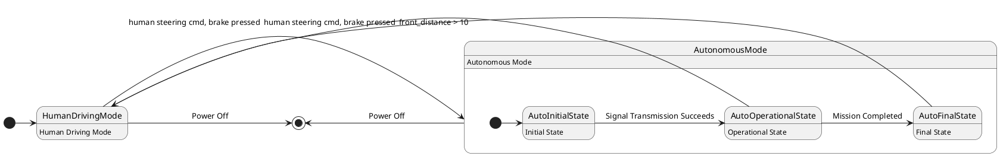

# Pair `0020`：NL + PlantUML STM0 + FCSTM STM0

[上一组 `0019`](../0019/README.md) | [返回 60 组索引](../../PAIR_INDEX.md) | [下一组 `0021`](../0021/README.md)

- LLM：`Llama`
- 模型/场景：high-level driving module
- 作者输出阶段：`Result with Semantic Checking`
- 作者输出单元格：`AE22`；Excel row：`22`
- Phase-I fallback：`false`
- 相对 Phase-I 是否变化：`true`
- Phase-I PlantUML SHA-256：`478b8db78f5465f4ced13d2ed7f455bc12bbb5c77b5d1d0b475cdc97d905b8c6`
- NL SHA-256：`f1c3dc88371b8256352e7ab6ee7eb42424de6e11dfde70d185f224dd1d05a7a8`
- PlantUML SHA-256：`155e5f625d96c14b5e5fc83bd3f7468d057d72b6551193b18610bbe89957196f`
- FCSTM SHA-256：`4ded1eebbbeb20001da152aa70d10bc4dcd9c45cff5cda063e80ef86abad47df`
- review subject SHA-256：`7873835e3837d9358c355792808d3191a06c16f1fc880ca9626958d6ccef1e3e`
- working contract SHA-256：`d3cb345779790cc65f9a044c746b69e3e5f8cc50261d6c4a99c7ad258c3116e0`
- 结构裁决：`structure_preserved`
- source states / transitions：`5` / `9`
- mapped / blocked / silent drop：`9` / `0` / `0`
- final / lifecycle / body coverage：`2/2` / `0/0` / `5/5`
- concurrent region / separator coverage：`0/0` / `0/0`
- source normalization coverage：`0/0`
- official raw / validation：`state_diagram` / `state_diagram`
- official identity states / transitions：`5` / `9`
- official identity remaps：state `0` / transition endpoint `0`
- AST audit：`passed`
- legacy whole-model FCSTM execution / Discover：`false` / `false`
- working bundle usage gate：`discover_input_with_capability_mask`
- ownership source / compiler / agent：`19` / `21` / `0`
- source macro / positive identity trace / conversion boundary trace：`14` / `19` / `0`
- capability source-static / simulation / transition-trace：`eligible_with_exclusions` / `eligible_with_exclusions` / `eligible_with_exclusions`
- compiler-only diagnostic policy：`rejected_conversion_artifact`；main-result conversion artifact limit：`0`
- 主 session 对读：`pass`；ownership/macro/capability 均为 `pass`；Case 0020 passes the current attribution-safe forward review; this does not assert global behavior equivalence, and unsupported runtime semantics remain fail-closed. Amendment record: the substantive subject review remains the one recorded in review_context (first reviewed 2026-07-20T05:44:08Z by gpt-5.5 (session omx-1784393668980-pxpj3q), and it still binds because review_subject_sha256 is unchanged. A scoped re-check was performed 2026-08-17 by claude-opus-5 (main-session LLM, PR #185) because commit bbb04cb1 (2026-07-27) regenerated the 60 working contracts and commit 35eba126 (2026-08-11) renamed the paper workspace, and neither refreshed this registry. The re-review is scoped: a key-by-key diff shows the only contract changes are capability_eligibility.simulation, capability_eligibility.transition_trace and summary.simulation_status (bbb04cb1) plus the four artifact_bindings path strings (35eba126); the remaining 168 keys and the whole of canonical/fcstm/parse_inspect/source_traces are byte-identical, so review_subject_sha256 is unchanged and the original ownership, macro and correspondence findings still stand. The capability block was re-checked against seven invariants: eligible ids are source: only, excluded ids cover the compiler-owned set, the two sets are disjoint, claim_boundary and reason_codes are non-empty, main_result_conversion_artifact_limit is still 0, and usage_gate is unchanged.
- source anchors：`source-ref:llms_emp_feedback_final_0020.puml:line:6\|state AutonomousMode {, source-ref:llms_emp_feedback_final_0020.puml:line:4\|HumanDrivingMode -> AutonomousMode: front_distance > 10`；FCSTM anchors：`element-ref:source:state:AutonomousMode@line:8\|state AutonomousMode named "AutonomousMode\n[PlantUML body] Autonomous Mode" {, element-ref:compiler:transition_segment:tr_0002:segment:1@line:26\|HumanDrivingMode -> AutonomousMode : /front_distance_10;`
- 三个原始文件：[NL](./nl.txt) | [PlantUML](./plantuml.puml) | [FCSTM](./fcstm.fcstm)
- 审计入口：[canonical](../../canonical/llms_emp_feedback_final_0020.json) | [冻结 FCSTM](../../fcstm/llms_emp_feedback_final_0020.fcstm) | [case report](../../case_reports/llms_emp_feedback_final_0020.json) | [working contract](../../working_contracts/llms_emp_feedback_final_0020.json) | [source trace](../../source_traces/llms_emp_feedback_final_0020.json) | [人工总账](../../MANUAL_REVIEW.md)

## 主 session 三方语义对应

| projection | assessment | NL anchor | PlantUML anchor | FCSTM anchor | source roots | compiler members | rationale |
|---|---|---|---|---|---|---|---|
| `direct` | `preserved` | 1 The human driving mode is represented by a simple state. | source-ref:llms_emp_feedback_final_0020.puml:line:6\|state AutonomousMode { | element-ref:source:state:AutonomousMode@line:8\|state AutonomousMode named "AutonomousMode\n[PlantUML body] Autonomous Mode" { | source:state:AutonomousMode | - | Case 0020 binds source:state:AutonomousMode to authored PlantUML occurrence 'state AutonomousMode {' and current FCSTM occurrence 'state AutonomousMode named "AutonomousMode\n[PlantUML body] Autonomous Mode" {'; the source semantic root remains attributable while any compiler-owned projection stays protected and cannot become an independent Repair target. |
| `macro` | `preserved_with_exclusions` | front_distance > 10 | source-ref:llms_emp_feedback_final_0020.puml:line:4\|HumanDrivingMode -> AutonomousMode: front_distance > 10 | element-ref:compiler:transition_segment:tr_0002:segment:1@line:26\|HumanDrivingMode -> AutonomousMode : /front_distance_10; | source:transition:tr_0002 | compiler:transition_segment:tr_0002:segment:1 | Case 0020 binds source:transition:tr_0002 to authored PlantUML occurrence 'HumanDrivingMode -> AutonomousMode: front_distance > 10' and current FCSTM occurrence 'HumanDrivingMode -> AutonomousMode : /front_distance_10;'; the source semantic root remains attributable while any compiler-owned projection stays protected and cannot become an independent Repair target. |

## Risk occurrence 第二遍复核

| obligation | risk tag | assessment | PlantUML evidence | FCSTM evidence | ownership evidence | rationale |
|---|---|---|---|---|---|---|
| `review:multi_segment_macro:0001:tr_0006` | `multi_segment_macro` | `compiler_artifact_excluded` | source-ref:llms_emp_feedback_final_0020.puml:line:13\|AutoOperationalState -> HumanDrivingMode: human steering cmd, brake pressed, source-ref:llms_emp_feedback_final_0020.puml:line:14\|AutoFinalState -> HumanDrivingMode: human steering cmd, brake pressed, source-ref:llms_emp_feedback_final_0020.puml:line:17\|AutonomousMode -> [*]: Power Off | element-ref:compiler:route_control:R45RouteToken@line:1\|def int R45RouteToken = 0;, element-ref:compiler:transition_segment:tr_0006:segment:1@line:15\|AutoOperationalState -> [*] : /human_steering_cmd_brake_pressed effect { R45RouteToken = 6; };, element-ref:compiler:transition_segment:tr_0006:segment:2@line:22\|AutonomousMode -> HumanDrivingMode : if [R45RouteToken == 6] effect { R45RouteToken = 0; }; | compiler:route_control:R45RouteToken, compiler:transition_segment:tr_0006:segment:1, compiler:transition_segment:tr_0006:segment:2, source:transition:tr_0006 | Case 0020 multi_segment_macro occurrence review:multi_segment_macro:0001:tr_0006 binds exact source refs to working-contract elements compiler:route_control:R45RouteToken, compiler:transition_segment:tr_0006:segment:1, compiler:transition_segment:tr_0006:segment:2, source:transition:tr_0006. All emitted segments collapse to one source transition root; no segment is promoted as a separate authored transition or editable issue target. |
| `review:route_controller:0002:tr_0006` | `route_controller` | `compiler_artifact_excluded` | source-ref:llms_emp_feedback_final_0020.puml:line:13\|AutoOperationalState -> HumanDrivingMode: human steering cmd, brake pressed, source-ref:llms_emp_feedback_final_0020.puml:line:14\|AutoFinalState -> HumanDrivingMode: human steering cmd, brake pressed, source-ref:llms_emp_feedback_final_0020.puml:line:17\|AutonomousMode -> [*]: Power Off | element-ref:compiler:route_control:R45RouteToken@line:1\|def int R45RouteToken = 0;, element-ref:compiler:transition_segment:tr_0006:segment:1@line:15\|AutoOperationalState -> [*] : /human_steering_cmd_brake_pressed effect { R45RouteToken = 6; };, element-ref:compiler:transition_segment:tr_0006:segment:2@line:22\|AutonomousMode -> HumanDrivingMode : if [R45RouteToken == 6] effect { R45RouteToken = 0; }; | compiler:route_control:R45RouteToken, compiler:transition_segment:tr_0006:segment:1, compiler:transition_segment:tr_0006:segment:2, source:transition:tr_0006 | Case 0020 route_controller occurrence review:route_controller:0002:tr_0006 binds exact source refs to working-contract elements compiler:route_control:R45RouteToken, compiler:transition_segment:tr_0006:segment:1, compiler:transition_segment:tr_0006:segment:2, source:transition:tr_0006. R45RouteToken and routed segments remain compiler_owned, protected, and excluded from confirmed issues, Repair, Confirm acceptance, and main results. |
| `review:multi_segment_macro:0003:tr_0007` | `multi_segment_macro` | `compiler_artifact_excluded` | source-ref:llms_emp_feedback_final_0020.puml:line:13\|AutoOperationalState -> HumanDrivingMode: human steering cmd, brake pressed, source-ref:llms_emp_feedback_final_0020.puml:line:14\|AutoFinalState -> HumanDrivingMode: human steering cmd, brake pressed, source-ref:llms_emp_feedback_final_0020.puml:line:17\|AutonomousMode -> [*]: Power Off | element-ref:compiler:route_control:R45RouteToken@line:1\|def int R45RouteToken = 0;, element-ref:compiler:transition_segment:tr_0007:segment:1@line:16\|AutoFinalState -> [*] : /human_steering_cmd_brake_pressed effect { R45RouteToken = 7; };, element-ref:compiler:transition_segment:tr_0007:segment:2@line:23\|AutonomousMode -> HumanDrivingMode : if [R45RouteToken == 7] effect { R45RouteToken = 0; }; | compiler:route_control:R45RouteToken, compiler:transition_segment:tr_0007:segment:1, compiler:transition_segment:tr_0007:segment:2, source:transition:tr_0007 | Case 0020 multi_segment_macro occurrence review:multi_segment_macro:0003:tr_0007 binds exact source refs to working-contract elements compiler:route_control:R45RouteToken, compiler:transition_segment:tr_0007:segment:1, compiler:transition_segment:tr_0007:segment:2, source:transition:tr_0007. All emitted segments collapse to one source transition root; no segment is promoted as a separate authored transition or editable issue target. |
| `review:route_controller:0004:tr_0007` | `route_controller` | `compiler_artifact_excluded` | source-ref:llms_emp_feedback_final_0020.puml:line:13\|AutoOperationalState -> HumanDrivingMode: human steering cmd, brake pressed, source-ref:llms_emp_feedback_final_0020.puml:line:14\|AutoFinalState -> HumanDrivingMode: human steering cmd, brake pressed, source-ref:llms_emp_feedback_final_0020.puml:line:17\|AutonomousMode -> [*]: Power Off | element-ref:compiler:route_control:R45RouteToken@line:1\|def int R45RouteToken = 0;, element-ref:compiler:transition_segment:tr_0007:segment:1@line:16\|AutoFinalState -> [*] : /human_steering_cmd_brake_pressed effect { R45RouteToken = 7; };, element-ref:compiler:transition_segment:tr_0007:segment:2@line:23\|AutonomousMode -> HumanDrivingMode : if [R45RouteToken == 7] effect { R45RouteToken = 0; }; | compiler:route_control:R45RouteToken, compiler:transition_segment:tr_0007:segment:1, compiler:transition_segment:tr_0007:segment:2, source:transition:tr_0007 | Case 0020 route_controller occurrence review:route_controller:0004:tr_0007 binds exact source refs to working-contract elements compiler:route_control:R45RouteToken, compiler:transition_segment:tr_0007:segment:1, compiler:transition_segment:tr_0007:segment:2, source:transition:tr_0007. R45RouteToken and routed segments remain compiler_owned, protected, and excluded from confirmed issues, Repair, Confirm acceptance, and main results. |
| `review:final_boundary:0005:tr_0008` | `final_boundary` | `source_fact_preserved` | source-ref:llms_emp_feedback_final_0020.puml:line:16\|HumanDrivingMode -> [*]: Power Off | element-ref:compiler:transition_segment:tr_0008:segment:1@line:27\|HumanDrivingMode -> [*] : /Power_Off; | compiler:transition_segment:tr_0008:segment:1, source:transition:tr_0008 | Case 0020 final_boundary occurrence review:final_boundary:0005:tr_0008 binds exact source refs to working-contract elements compiler:transition_segment:tr_0008:segment:1, source:transition:tr_0008. The authored final occurrence remains visible through its source root; any completion holder or routing segment is excluded from source-level claims. |
| `review:multi_segment_macro:0006:tr_0009` | `multi_segment_macro` | `compiler_artifact_excluded` | source-ref:llms_emp_feedback_final_0020.puml:line:13\|AutoOperationalState -> HumanDrivingMode: human steering cmd, brake pressed, source-ref:llms_emp_feedback_final_0020.puml:line:14\|AutoFinalState -> HumanDrivingMode: human steering cmd, brake pressed, source-ref:llms_emp_feedback_final_0020.puml:line:17\|AutonomousMode -> [*]: Power Off | element-ref:compiler:route_control:R45RouteToken@line:1\|def int R45RouteToken = 0;, element-ref:compiler:transition_segment:tr_0009:segment:1@line:17\|AutoInitialState -> [*] : /Power_Off effect { R45RouteToken = 9; };, element-ref:compiler:transition_segment:tr_0009:segment:2@line:18\|AutoOperationalState -> [*] : /Power_Off effect { R45RouteToken = 9; };, element-ref:compiler:transition_segment:tr_0009:segment:3@line:19\|AutoFinalState -> [*] : /Power_Off effect { R45RouteToken = 9; };, element-ref:compiler:transition_segment:tr_0009:segment:4@line:24\|AutonomousMode -> [*] : if [R45RouteToken == 9] effect { R45RouteToken = 0; }; | compiler:route_control:R45RouteToken, compiler:transition_segment:tr_0009:segment:1, compiler:transition_segment:tr_0009:segment:2, compiler:transition_segment:tr_0009:segment:3, compiler:transition_segment:tr_0009:segment:4, source:transition:tr_0009 | Case 0020 multi_segment_macro occurrence review:multi_segment_macro:0006:tr_0009 binds exact source refs to working-contract elements compiler:route_control:R45RouteToken, compiler:transition_segment:tr_0009:segment:1, compiler:transition_segment:tr_0009:segment:2, compiler:transition_segment:tr_0009:segment:3, compiler:transition_segment:tr_0009:segment:4, source:transition:tr_0009. All emitted segments collapse to one source transition root; no segment is promoted as a separate authored transition or editable issue target. |
| `review:route_controller:0007:tr_0009` | `route_controller` | `compiler_artifact_excluded` | source-ref:llms_emp_feedback_final_0020.puml:line:13\|AutoOperationalState -> HumanDrivingMode: human steering cmd, brake pressed, source-ref:llms_emp_feedback_final_0020.puml:line:14\|AutoFinalState -> HumanDrivingMode: human steering cmd, brake pressed, source-ref:llms_emp_feedback_final_0020.puml:line:17\|AutonomousMode -> [*]: Power Off | element-ref:compiler:route_control:R45RouteToken@line:1\|def int R45RouteToken = 0;, element-ref:compiler:transition_segment:tr_0009:segment:1@line:17\|AutoInitialState -> [*] : /Power_Off effect { R45RouteToken = 9; };, element-ref:compiler:transition_segment:tr_0009:segment:2@line:18\|AutoOperationalState -> [*] : /Power_Off effect { R45RouteToken = 9; };, element-ref:compiler:transition_segment:tr_0009:segment:3@line:19\|AutoFinalState -> [*] : /Power_Off effect { R45RouteToken = 9; };, element-ref:compiler:transition_segment:tr_0009:segment:4@line:24\|AutonomousMode -> [*] : if [R45RouteToken == 9] effect { R45RouteToken = 0; }; | compiler:route_control:R45RouteToken, compiler:transition_segment:tr_0009:segment:1, compiler:transition_segment:tr_0009:segment:2, compiler:transition_segment:tr_0009:segment:3, compiler:transition_segment:tr_0009:segment:4, source:transition:tr_0009 | Case 0020 route_controller occurrence review:route_controller:0007:tr_0009 binds exact source refs to working-contract elements compiler:route_control:R45RouteToken, compiler:transition_segment:tr_0009:segment:1, compiler:transition_segment:tr_0009:segment:2, compiler:transition_segment:tr_0009:segment:3, compiler:transition_segment:tr_0009:segment:4, source:transition:tr_0009. R45RouteToken and routed segments remain compiler_owned, protected, and excluded from confirmed issues, Repair, Confirm acceptance, and main results. |
| `review:final_boundary:0008:tr_0009` | `final_boundary` | `source_fact_preserved` | source-ref:llms_emp_feedback_final_0020.puml:line:13\|AutoOperationalState -> HumanDrivingMode: human steering cmd, brake pressed, source-ref:llms_emp_feedback_final_0020.puml:line:14\|AutoFinalState -> HumanDrivingMode: human steering cmd, brake pressed, source-ref:llms_emp_feedback_final_0020.puml:line:17\|AutonomousMode -> [*]: Power Off | element-ref:compiler:route_control:R45RouteToken@line:1\|def int R45RouteToken = 0;, element-ref:compiler:transition_segment:tr_0009:segment:1@line:17\|AutoInitialState -> [*] : /Power_Off effect { R45RouteToken = 9; };, element-ref:compiler:transition_segment:tr_0009:segment:2@line:18\|AutoOperationalState -> [*] : /Power_Off effect { R45RouteToken = 9; };, element-ref:compiler:transition_segment:tr_0009:segment:3@line:19\|AutoFinalState -> [*] : /Power_Off effect { R45RouteToken = 9; };, element-ref:compiler:transition_segment:tr_0009:segment:4@line:24\|AutonomousMode -> [*] : if [R45RouteToken == 9] effect { R45RouteToken = 0; }; | compiler:route_control:R45RouteToken, compiler:transition_segment:tr_0009:segment:1, compiler:transition_segment:tr_0009:segment:2, compiler:transition_segment:tr_0009:segment:3, compiler:transition_segment:tr_0009:segment:4, source:transition:tr_0009 | Case 0020 final_boundary occurrence review:final_boundary:0008:tr_0009 binds exact source refs to working-contract elements compiler:route_control:R45RouteToken, compiler:transition_segment:tr_0009:segment:1, compiler:transition_segment:tr_0009:segment:2, compiler:transition_segment:tr_0009:segment:3, compiler:transition_segment:tr_0009:segment:4, source:transition:tr_0009. The authored final occurrence remains visible through its source root; any completion holder or routing segment is excluded from source-level claims. |

## 作者阶段 lineage

| stage | output cell | present | output SHA-256 | feedback | resolved |
|---|---|---|---|---|---|
| `phase_i_generation` | `I22` | `true` | `478b8db78f5465f4ced13d2ed7f455bc12bbb5c77b5d1d0b475cdc97d905b8c6` | - | - |
| `phase_ii_format` | `U22` | `true` | `155e5f625d96c14b5e5fc83bd3f7468d057d72b6551193b18610bbe89957196f` | syntax error: stm DrivingMode<br> | YES |
| `phase_ii_grammar` | `Z22` | `false` | `-` | - | - |
| `phase_ii_semantic` | `AE22` | `true` | `155e5f625d96c14b5e5fc83bd3f7468d057d72b6551193b18610bbe89957196f` | None | - |

## Official identity ledger

- status：`aligned`
- canonical / official states：`5` / `5`
- aligned transition endpoints：`9`

本组 state identity 无需重映射。

本组 transition endpoint 无需重映射。

## Source normalization ledger

本组没有 source-input normalization。

## Concurrent region ledger

本组没有 PlantUML orthogonal/concurrent region separator。

## Operational debt

| reason code | count |
|---|---:|
| `R45.DEBT.composite_source_activation_dispatch` | 1 |
| `R45.DEBT.opaque_state_body_semantics` | 5 |
| `R45.DEBT.opaque_transition_label_semantics` | 7 |

## NL

```text
1 The human driving mode is represented by a simple state. 2 The autonomous mode has sub-states and is represented by a sub machine state. 3. when power on, the system turn into human driving mode 4when front_distance > 10, auto transport to autonomous state 4. transit to human driving mode when receive human steering cmd, brake pressed, in (auto final) 5 when power off, it will transit to final state
```

## 作者 Phase-II 最终 PlantUML STM0



## 转换后 FCSTM STM0

```fcstm
def int R45RouteToken = 0;
state llms_emp_feedback_final_0020 named "llms_emp_feedback_final_0020" {
    event front_distance_10 named "front_distance > 10";
    event Signal_Transmission_Succeeds named "Signal Transmission Succeeds";
    event Mission_Completed named "Mission Completed";
    event human_steering_cmd_brake_pressed named "human steering cmd, brake pressed";
    event Power_Off named "Power Off";
    state AutonomousMode named "AutonomousMode\n[PlantUML body] Autonomous Mode" {
        state AutoInitialState named "AutoInitialState\n[PlantUML body] Initial State";
        state AutoOperationalState named "AutoOperationalState\n[PlantUML body] Operational State";
        state AutoFinalState named "AutoFinalState\n[PlantUML body] Final State";
        [*] -> AutoInitialState;
        AutoInitialState -> AutoOperationalState : /Signal_Transmission_Succeeds;
        AutoOperationalState -> AutoFinalState : /Mission_Completed;
        AutoOperationalState -> [*] : /human_steering_cmd_brake_pressed effect { R45RouteToken = 6; };
        AutoFinalState -> [*] : /human_steering_cmd_brake_pressed effect { R45RouteToken = 7; };
        AutoInitialState -> [*] : /Power_Off effect { R45RouteToken = 9; };
        AutoOperationalState -> [*] : /Power_Off effect { R45RouteToken = 9; };
        AutoFinalState -> [*] : /Power_Off effect { R45RouteToken = 9; };
    }
    state HumanDrivingMode named "HumanDrivingMode\n[PlantUML body] Human Driving Mode";
    AutonomousMode -> HumanDrivingMode : if [R45RouteToken == 6] effect { R45RouteToken = 0; };
    AutonomousMode -> HumanDrivingMode : if [R45RouteToken == 7] effect { R45RouteToken = 0; };
    AutonomousMode -> [*] : if [R45RouteToken == 9] effect { R45RouteToken = 0; };
    [*] -> HumanDrivingMode;
    HumanDrivingMode -> AutonomousMode : /front_distance_10;
    HumanDrivingMode -> [*] : /Power_Off;
}
```

[上一组 `0019`](../0019/README.md) | [返回 60 组索引](../../PAIR_INDEX.md) | [下一组 `0021`](../0021/README.md)
