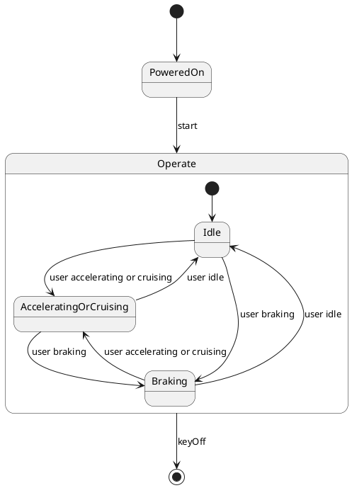

# Pair `0022`：NL + PlantUML STM0 + FCSTM STM0

[上一组 `0021`](../0021/README.md) | [返回 60 组索引](../../PAIR_INDEX.md) | [下一组 `0023`](../0023/README.md)

- LLM：`Llama`
- 模型/场景：Hybrid Sport Utility Vehicle, HSUV
- 作者输出阶段：`Result with Semantic Checking`
- 作者输出单元格：`AE24`；Excel row：`24`
- Phase-I fallback：`false`
- 相对 Phase-I 是否变化：`true`
- Phase-I PlantUML SHA-256：`8ea7e01c4cf73f562b0c55fed76f8f318797aa06f9ee043170e79385f326f7c5`
- NL SHA-256：`9fe426ba761d5a52c3b670f35410502a5289bdd9489c4a9bfa983e34d565040c`
- PlantUML SHA-256：`245204b8393136d7b1e0394710457dd5505e7f00d03d3bceb467b7e6c7c343b0`
- FCSTM SHA-256：`825992778cb4e7ec94b151b78a6ddb1e671c19dbc4d2f7a18880eaa8c8f9e915`
- review subject SHA-256：`ef9aaea9423eddb64ee7ab83701de3b96e0b63d8b4eb9f127c9dcf6a6bfb163a`
- working contract SHA-256：`c3a9b9558ccb13bcfae9cd0a3f4a9e230a11e53845caba0bf028a87a5eb1738b`
- 结构裁决：`structure_preserved`
- source states / transitions：`5` / `10`
- mapped / blocked / silent drop：`10` / `0` / `0`
- final / lifecycle / body coverage：`1/1` / `0/0` / `0/0`
- concurrent region / separator coverage：`0/0` / `0/0`
- source normalization coverage：`0/0`
- official raw / validation：`state_diagram` / `state_diagram`
- official identity states / transitions：`5` / `10`
- official identity remaps：state `0` / transition endpoint `0`
- AST audit：`passed`
- legacy whole-model FCSTM execution / Discover：`false` / `false`
- working bundle usage gate：`discover_input_with_capability_mask`
- ownership source / compiler / agent：`15` / `20` / `0`
- source macro / positive identity trace / conversion boundary trace：`10` / `15` / `0`
- capability source-static / simulation / transition-trace：`eligible_with_exclusions` / `eligible_with_exclusions` / `eligible_with_exclusions`
- compiler-only diagnostic policy：`rejected_conversion_artifact`；main-result conversion artifact limit：`0`
- 主 session 对读：`pass`；ownership/macro/capability 均为 `pass`；Case 0022 passes the current attribution-safe forward review; this does not assert global behavior equivalence, and unsupported runtime semantics remain fail-closed. Amendment record: the substantive subject review remains the one recorded in review_context (first reviewed 2026-07-20T05:44:08Z by gpt-5.5 (session omx-1784393668980-pxpj3q), and it still binds because review_subject_sha256 is unchanged. A scoped re-check was performed 2026-08-17 by claude-opus-5 (main-session LLM, PR #185) because commit bbb04cb1 (2026-07-27) regenerated the 60 working contracts and commit 35eba126 (2026-08-11) renamed the paper workspace, and neither refreshed this registry. The re-review is scoped: a key-by-key diff shows the only contract changes are capability_eligibility.simulation, capability_eligibility.transition_trace and summary.simulation_status (bbb04cb1) plus the four artifact_bindings path strings (35eba126); the remaining 168 keys and the whole of canonical/fcstm/parse_inspect/source_traces are byte-identical, so review_subject_sha256 is unchanged and the original ownership, macro and correspondence findings still stand. The capability block was re-checked against seven invariants: eligible ids are source: only, excluded ids cover the compiler-owned set, the two sets are disjoint, claim_boundary and reason_codes are non-empty, main_result_conversion_artifact_limit is still 0, and usage_gate is unchanged.
- source anchors：`source-ref:llms_emp_feedback_final_0022.puml:line:4\|state Operate {, source-ref:llms_emp_feedback_final_0022.puml:line:3\|PoweredOn --> Operate: start`；FCSTM anchors：`element-ref:source:state:Operate@line:8\|state Operate named "Operate" {, element-ref:compiler:transition_segment:tr_0002:segment:1@line:26\|PoweredOn -> Operate : /start;`
- 三个原始文件：[NL](./nl.txt) | [PlantUML](./plantuml.puml) | [FCSTM](./fcstm.fcstm)
- 审计入口：[canonical](../../canonical/llms_emp_feedback_final_0022.json) | [冻结 FCSTM](../../fcstm/llms_emp_feedback_final_0022.fcstm) | [case report](../../case_reports/llms_emp_feedback_final_0022.json) | [working contract](../../working_contracts/llms_emp_feedback_final_0022.json) | [source trace](../../source_traces/llms_emp_feedback_final_0022.json) | [人工总账](../../MANUAL_REVIEW.md)

## 主 session 三方语义对应

| projection | assessment | NL anchor | PlantUML anchor | FCSTM anchor | source roots | compiler members | rationale |
|---|---|---|---|---|---|---|---|
| `direct` | `preserved` | Operate | source-ref:llms_emp_feedback_final_0022.puml:line:4\|state Operate { | element-ref:source:state:Operate@line:8\|state Operate named "Operate" { | source:state:Operate | - | Case 0022 binds source:state:Operate to authored PlantUML occurrence 'state Operate {' and current FCSTM occurrence 'state Operate named "Operate" {'; the source semantic root remains attributable while any compiler-owned projection stays protected and cannot become an independent Repair target. |
| `macro` | `preserved_with_exclusions` | Operate | source-ref:llms_emp_feedback_final_0022.puml:line:3\|PoweredOn --> Operate: start | element-ref:compiler:transition_segment:tr_0002:segment:1@line:26\|PoweredOn -> Operate : /start; | source:transition:tr_0002 | compiler:transition_segment:tr_0002:segment:1 | Case 0022 binds source:transition:tr_0002 to authored PlantUML occurrence 'PoweredOn --> Operate: start' and current FCSTM occurrence 'PoweredOn -> Operate : /start;'; the source semantic root remains attributable while any compiler-owned projection stays protected and cannot become an independent Repair target. |

## Risk occurrence 第二遍复核

| obligation | risk tag | assessment | PlantUML evidence | FCSTM evidence | ownership evidence | rationale |
|---|---|---|---|---|---|---|
| `review:multi_segment_macro:0001:tr_0010` | `multi_segment_macro` | `compiler_artifact_excluded` | source-ref:llms_emp_feedback_final_0022.puml:line:13\|Operate --> [*] : keyOff | element-ref:compiler:route_control:R45RouteToken@line:1\|def int R45RouteToken = 0;, element-ref:compiler:transition_segment:tr_0010:segment:1@line:19\|Idle -> [*] : /keyOff effect { R45RouteToken = 10; };, element-ref:compiler:transition_segment:tr_0010:segment:2@line:20\|AcceleratingOrCruising -> [*] : /keyOff effect { R45RouteToken = 10; };, element-ref:compiler:transition_segment:tr_0010:segment:3@line:21\|Braking -> [*] : /keyOff effect { R45RouteToken = 10; };, element-ref:compiler:transition_segment:tr_0010:segment:4@line:24\|Operate -> [*] : if [R45RouteToken == 10] effect { R45RouteToken = 0; }; | compiler:route_control:R45RouteToken, compiler:transition_segment:tr_0010:segment:1, compiler:transition_segment:tr_0010:segment:2, compiler:transition_segment:tr_0010:segment:3, compiler:transition_segment:tr_0010:segment:4, source:transition:tr_0010 | Case 0022 multi_segment_macro occurrence review:multi_segment_macro:0001:tr_0010 binds exact source refs to working-contract elements compiler:route_control:R45RouteToken, compiler:transition_segment:tr_0010:segment:1, compiler:transition_segment:tr_0010:segment:2, compiler:transition_segment:tr_0010:segment:3, compiler:transition_segment:tr_0010:segment:4, source:transition:tr_0010. All emitted segments collapse to one source transition root; no segment is promoted as a separate authored transition or editable issue target. |
| `review:route_controller:0002:tr_0010` | `route_controller` | `compiler_artifact_excluded` | source-ref:llms_emp_feedback_final_0022.puml:line:13\|Operate --> [*] : keyOff | element-ref:compiler:route_control:R45RouteToken@line:1\|def int R45RouteToken = 0;, element-ref:compiler:transition_segment:tr_0010:segment:1@line:19\|Idle -> [*] : /keyOff effect { R45RouteToken = 10; };, element-ref:compiler:transition_segment:tr_0010:segment:2@line:20\|AcceleratingOrCruising -> [*] : /keyOff effect { R45RouteToken = 10; };, element-ref:compiler:transition_segment:tr_0010:segment:3@line:21\|Braking -> [*] : /keyOff effect { R45RouteToken = 10; };, element-ref:compiler:transition_segment:tr_0010:segment:4@line:24\|Operate -> [*] : if [R45RouteToken == 10] effect { R45RouteToken = 0; }; | compiler:route_control:R45RouteToken, compiler:transition_segment:tr_0010:segment:1, compiler:transition_segment:tr_0010:segment:2, compiler:transition_segment:tr_0010:segment:3, compiler:transition_segment:tr_0010:segment:4, source:transition:tr_0010 | Case 0022 route_controller occurrence review:route_controller:0002:tr_0010 binds exact source refs to working-contract elements compiler:route_control:R45RouteToken, compiler:transition_segment:tr_0010:segment:1, compiler:transition_segment:tr_0010:segment:2, compiler:transition_segment:tr_0010:segment:3, compiler:transition_segment:tr_0010:segment:4, source:transition:tr_0010. R45RouteToken and routed segments remain compiler_owned, protected, and excluded from confirmed issues, Repair, Confirm acceptance, and main results. |
| `review:final_boundary:0003:tr_0010` | `final_boundary` | `source_fact_preserved` | source-ref:llms_emp_feedback_final_0022.puml:line:13\|Operate --> [*] : keyOff | element-ref:compiler:route_control:R45RouteToken@line:1\|def int R45RouteToken = 0;, element-ref:compiler:transition_segment:tr_0010:segment:1@line:19\|Idle -> [*] : /keyOff effect { R45RouteToken = 10; };, element-ref:compiler:transition_segment:tr_0010:segment:2@line:20\|AcceleratingOrCruising -> [*] : /keyOff effect { R45RouteToken = 10; };, element-ref:compiler:transition_segment:tr_0010:segment:3@line:21\|Braking -> [*] : /keyOff effect { R45RouteToken = 10; };, element-ref:compiler:transition_segment:tr_0010:segment:4@line:24\|Operate -> [*] : if [R45RouteToken == 10] effect { R45RouteToken = 0; }; | compiler:route_control:R45RouteToken, compiler:transition_segment:tr_0010:segment:1, compiler:transition_segment:tr_0010:segment:2, compiler:transition_segment:tr_0010:segment:3, compiler:transition_segment:tr_0010:segment:4, source:transition:tr_0010 | Case 0022 final_boundary occurrence review:final_boundary:0003:tr_0010 binds exact source refs to working-contract elements compiler:route_control:R45RouteToken, compiler:transition_segment:tr_0010:segment:1, compiler:transition_segment:tr_0010:segment:2, compiler:transition_segment:tr_0010:segment:3, compiler:transition_segment:tr_0010:segment:4, source:transition:tr_0010. The authored final occurrence remains visible through its source root; any completion holder or routing segment is excluded from source-level claims. |

## 作者阶段 lineage

| stage | output cell | present | output SHA-256 | feedback | resolved |
|---|---|---|---|---|---|
| `phase_i_generation` | `I24` | `true` | `8ea7e01c4cf73f562b0c55fed76f8f318797aa06f9ee043170e79385f326f7c5` | - | - |
| `phase_ii_format` | `U24` | `true` | `e49387473ec71fe91e9d06a3ef180ded992b251ff805422a997d216a973a3800` | syntax error: stm DeviceController | YES |
| `phase_ii_grammar` | `Z24` | `false` | `-` | - | - |
| `phase_ii_semantic` | `AE24` | `true` | `245204b8393136d7b1e0394710457dd5505e7f00d03d3bceb467b7e6c7c343b0` | missing composite state | 1.0 |

## Official identity ledger

- status：`aligned`
- canonical / official states：`5` / `5`
- aligned transition endpoints：`10`

本组 state identity 无需重映射。

本组 transition endpoint 无需重映射。

## Source normalization ledger

本组没有 source-input normalization。

## Concurrent region ledger

本组没有 PlantUML orthogonal/concurrent region separator。

## Operational debt

| reason code | count |
|---|---:|
| `R45.DEBT.composite_source_activation_dispatch` | 1 |
| `R45.DEBT.opaque_transition_label_semantics` | 8 |

## NL

```text
1. Once the device is powered on, the system enters the `Operate` state, and based on user actions, it transitions between `Idle`, `Accelerating or Cruising`, and `Braking` states.
2. The system can be turned on with the `start` signal and turned off with the `keyOff` signal.
3. Within the `Operate` state, the system transitions between different substates depending on actions like accelerating, braking, or stopping.
```

## 作者 Phase-II 最终 PlantUML STM0



## 转换后 FCSTM STM0

```fcstm
def int R45RouteToken = 0;
state llms_emp_feedback_final_0022 named "llms_emp_feedback_final_0022" {
    event start named "start";
    event user_accelerating_or_cruising named "user accelerating or cruising";
    event user_braking named "user braking";
    event user_idle named "user idle";
    event keyOff named "keyOff";
    state Operate named "Operate" {
        state Idle named "Idle";
        state AcceleratingOrCruising named "AcceleratingOrCruising";
        state Braking named "Braking";
        [*] -> Idle;
        Idle -> AcceleratingOrCruising : /user_accelerating_or_cruising;
        Idle -> Braking : /user_braking;
        AcceleratingOrCruising -> Idle : /user_idle;
        AcceleratingOrCruising -> Braking : /user_braking;
        Braking -> Idle : /user_idle;
        Braking -> AcceleratingOrCruising : /user_accelerating_or_cruising;
        Idle -> [*] : /keyOff effect { R45RouteToken = 10; };
        AcceleratingOrCruising -> [*] : /keyOff effect { R45RouteToken = 10; };
        Braking -> [*] : /keyOff effect { R45RouteToken = 10; };
    }
    state PoweredOn named "PoweredOn";
    Operate -> [*] : if [R45RouteToken == 10] effect { R45RouteToken = 0; };
    [*] -> PoweredOn;
    PoweredOn -> Operate : /start;
}
```

[上一组 `0021`](../0021/README.md) | [返回 60 组索引](../../PAIR_INDEX.md) | [下一组 `0023`](../0023/README.md)
