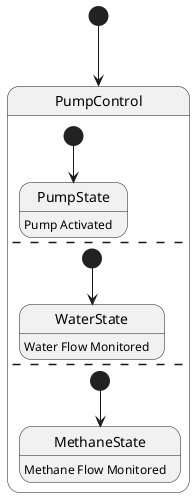

# Pair `0023`：NL + PlantUML STM0 + FCSTM STM0

[上一组 `0022`](../0022/README.md) | [返回 60 组索引](../../PAIR_INDEX.md) | [下一组 `0024`](../0024/README.md)

- LLM：`Llama`
- 模型/场景：Pump Control state machine
- 作者输出阶段：`Result with Semantic Checking`
- 作者输出单元格：`AE25`；Excel row：`25`
- Phase-I fallback：`false`
- 相对 Phase-I 是否变化：`true`
- Phase-I PlantUML SHA-256：`3237c282856c15de2d2cc794e37cf945b24316694858ba99b94ec69521cc5e2a`
- NL SHA-256：`a391765dba935d89e6d2467c97b218c0136d106ea9c00bac91e6525e28ac04f1`
- PlantUML SHA-256：`1c4f737b5fbf4f9cde73da5b29313ed59319389a4e00695e2d81aa9362a92601`
- FCSTM SHA-256：`a591eac6f67541d4d83a205f251a4f1be0931cdea94bfd0432a515e63678172b`
- review subject SHA-256：`84ce0c943e5114835c085fe68e7e88ddbfe190a38f8046aee83a89995cdc8c28`
- working contract SHA-256：`301c1d42f9155a05776ac27695fac02a17dd2ce804bb445687c6bd842681be29`
- 结构裁决：`structure_preserved`
- source states / transitions：`4` / `4`
- mapped / blocked / silent drop：`4` / `0` / `0`
- final / lifecycle / body coverage：`0/0` / `0/0` / `3/3`
- concurrent region / separator coverage：`3/3` / `2/2`
- source normalization coverage：`0/0`
- official raw / validation：`state_diagram` / `state_diagram`
- official identity states / transitions：`4` / `4`
- official identity remaps：state `0` / transition endpoint `0`
- AST audit：`passed`
- legacy whole-model FCSTM execution / Discover：`false` / `false`
- working bundle usage gate：`discover_input_with_capability_mask`
- ownership source / compiler / agent：`14` / `5` / `0`
- source macro / positive identity trace / conversion boundary trace：`10` / `14` / `0`
- capability source-static / simulation / transition-trace：`eligible_with_exclusions` / `eligible_with_exclusions` / `eligible_with_exclusions`
- compiler-only diagnostic policy：`rejected_conversion_artifact`；main-result conversion artifact limit：`0`
- 主 session 对读：`pass`；ownership/macro/capability 均为 `pass`；Case 0023 passes the current attribution-safe forward review; this does not assert global behavior equivalence, and unsupported runtime semantics remain fail-closed. Amendment record: the substantive subject review remains the one recorded in review_context (first reviewed 2026-07-20T05:44:08Z by gpt-5.5 (session omx-1784393668980-pxpj3q), and it still binds because review_subject_sha256 is unchanged. A scoped re-check was performed 2026-08-17 by claude-opus-5 (main-session LLM, PR #185) because commit bbb04cb1 (2026-07-27) regenerated the 60 working contracts and commit 35eba126 (2026-08-11) renamed the paper workspace, and neither refreshed this registry. The re-review is scoped: a key-by-key diff shows the only contract changes are capability_eligibility.simulation, capability_eligibility.transition_trace and summary.simulation_status (bbb04cb1) plus the four artifact_bindings path strings (35eba126); the remaining 168 keys and the whole of canonical/fcstm/parse_inspect/source_traces are byte-identical, so review_subject_sha256 is unchanged and the original ownership, macro and correspondence findings still stand. The capability block was re-checked against seven invariants: eligible ids are source: only, excluded ids cover the compiler-owned set, the two sets are disjoint, claim_boundary and reason_codes are non-empty, main_result_conversion_artifact_limit is still 0, and usage_gate is unchanged.
- source anchors：`source-ref:llms_emp_feedback_final_0023.puml:line:3\|state PumpControl {, source-ref:llms_emp_feedback_final_0023.puml:line:2\|[*] --> PumpControl`；FCSTM anchors：`element-ref:source:state:PumpControl@line:2\|state PumpControl named "PumpControl\n[PlantUML concurrent region 0] states=PumpControl.PumpState; transitions=tr_0002\n[PlantUML concurrent region 1] states=PumpControl.WaterState; transitions=tr_0003\n[PlantUML concurrent region 2] states=PumpControl.MethaneState; transitions=tr_0004\n[PlantUML concurrent separator] region 0 -> 1 at llms_emp_feedback_final_0023.puml:line:5\n[PlantUML concurrent separator] region 1 -> 2 at llms_emp_feedback_final_0023.puml:line:7" {, element-ref:compiler:transition_segment:tr_0001:segment:1@line:10\|[*] -> PumpControl;`
- 三个原始文件：[NL](./nl.txt) | [PlantUML](./plantuml.puml) | [FCSTM](./fcstm.fcstm)
- 审计入口：[canonical](../../canonical/llms_emp_feedback_final_0023.json) | [冻结 FCSTM](../../fcstm/llms_emp_feedback_final_0023.fcstm) | [case report](../../case_reports/llms_emp_feedback_final_0023.json) | [working contract](../../working_contracts/llms_emp_feedback_final_0023.json) | [source trace](../../source_traces/llms_emp_feedback_final_0023.json) | [人工总账](../../MANUAL_REVIEW.md)

## 主 session 三方语义对应

| projection | assessment | NL anchor | PlantUML anchor | FCSTM anchor | source roots | compiler members | rationale |
|---|---|---|---|---|---|---|---|
| `direct` | `preserved` | PumpControl | source-ref:llms_emp_feedback_final_0023.puml:line:3\|state PumpControl { | element-ref:source:state:PumpControl@line:2\|state PumpControl named "PumpControl\n[PlantUML concurrent region 0] states=PumpControl.PumpState; transitions=tr_0002\n[PlantUML concurrent region 1] states=PumpControl.WaterState; transitions=tr_0003\n[PlantUML concurrent region 2] states=PumpControl.MethaneState; transitions=tr_0004\n[PlantUML concurrent separator] region 0 -> 1 at llms_emp_feedback_final_0023.puml:line:5\n[PlantUML concurrent separator] region 1 -> 2 at llms_emp_feedback_final_0023.puml:line:7" { | source:state:PumpControl | - | Case 0023 binds source:state:PumpControl to authored PlantUML occurrence 'state PumpControl {' and current FCSTM occurrence 'state PumpControl named "PumpControl\n[PlantUML concurrent region 0] states=PumpControl.PumpState; transitions=tr_0002\n[PlantUML concurrent region 1] states=PumpControl.WaterState; transitions=tr_0003\n[PlantUML concurrent region 2] states=PumpControl.MethaneState; transitions=tr_0004\n[PlantUML concurrent separator] region 0 -> 1 at llms_emp_feedback_final_0023.puml:line:5\n[PlantUML concurrent separator] region 1 -> 2 at llms_emp_feedback_final_0023.puml:line:7" {'; the source semantic root remains attributable while any compiler-owned projection stays protected and cannot become an independent Repair target. |
| `macro` | `preserved_with_exclusions` | PumpControl | source-ref:llms_emp_feedback_final_0023.puml:line:2\|[*] --> PumpControl | element-ref:compiler:transition_segment:tr_0001:segment:1@line:10\|[*] -> PumpControl; | source:transition:tr_0001 | compiler:transition_segment:tr_0001:segment:1 | Case 0023 binds source:transition:tr_0001 to authored PlantUML occurrence '[*] --> PumpControl' and current FCSTM occurrence '[*] -> PumpControl;'; the source semantic root remains attributable while any compiler-owned projection stays protected and cannot become an independent Repair target. |

## Risk occurrence 第二遍复核

| obligation | risk tag | assessment | PlantUML evidence | FCSTM evidence | ownership evidence | rationale |
|---|---|---|---|---|---|---|
| `review:concurrent_region:0001:PumpControl:region:0` | `concurrent_region` | `capability_excluded` | source-ref:llms_emp_feedback_final_0023.puml:line:5\|-- | element-ref:source:region:PumpControl:region:0@line:2\|state PumpControl named "PumpControl\n[PlantUML concurrent region 0] states=PumpControl.PumpState; transitions=tr_0002\n[PlantUML concurrent region 1] states=PumpControl.WaterState; transitions=tr_0003\n[PlantUML concurrent region 2] states=PumpControl.MethaneState; transitions=tr_0004\n[PlantUML concurrent separator] region 0 -> 1 at llms_emp_feedback_final_0023.puml:line:5\n[PlantUML concurrent separator] region 1 -> 2 at llms_emp_feedback_final_0023.puml:line:7" { | source:region:PumpControl:region:0 | Case 0023 concurrent_region occurrence review:concurrent_region:0001:PumpControl:region:0 binds exact source refs to working-contract elements source:region:PumpControl:region:0. The authored region occurrence is preserved as source metadata, while single-active FCSTM runtime behavior remains capability_excluded. |
| `review:concurrent_region:0002:PumpControl:region:1` | `concurrent_region` | `capability_excluded` | source-ref:llms_emp_feedback_final_0023.puml:line:5\|--, source-ref:llms_emp_feedback_final_0023.puml:line:7\|-- | element-ref:source:region:PumpControl:region:1@line:2\|state PumpControl named "PumpControl\n[PlantUML concurrent region 0] states=PumpControl.PumpState; transitions=tr_0002\n[PlantUML concurrent region 1] states=PumpControl.WaterState; transitions=tr_0003\n[PlantUML concurrent region 2] states=PumpControl.MethaneState; transitions=tr_0004\n[PlantUML concurrent separator] region 0 -> 1 at llms_emp_feedback_final_0023.puml:line:5\n[PlantUML concurrent separator] region 1 -> 2 at llms_emp_feedback_final_0023.puml:line:7" { | source:region:PumpControl:region:1 | Case 0023 concurrent_region occurrence review:concurrent_region:0002:PumpControl:region:1 binds exact source refs to working-contract elements source:region:PumpControl:region:1. The authored region occurrence is preserved as source metadata, while single-active FCSTM runtime behavior remains capability_excluded. |
| `review:concurrent_region:0003:PumpControl:region:2` | `concurrent_region` | `capability_excluded` | source-ref:llms_emp_feedback_final_0023.puml:line:7\|-- | element-ref:source:region:PumpControl:region:2@line:2\|state PumpControl named "PumpControl\n[PlantUML concurrent region 0] states=PumpControl.PumpState; transitions=tr_0002\n[PlantUML concurrent region 1] states=PumpControl.WaterState; transitions=tr_0003\n[PlantUML concurrent region 2] states=PumpControl.MethaneState; transitions=tr_0004\n[PlantUML concurrent separator] region 0 -> 1 at llms_emp_feedback_final_0023.puml:line:5\n[PlantUML concurrent separator] region 1 -> 2 at llms_emp_feedback_final_0023.puml:line:7" { | source:region:PumpControl:region:2 | Case 0023 concurrent_region occurrence review:concurrent_region:0003:PumpControl:region:2 binds exact source refs to working-contract elements source:region:PumpControl:region:2. The authored region occurrence is preserved as source metadata, while single-active FCSTM runtime behavior remains capability_excluded. |
| `review:explicit_concurrency:0004:001-multiple_initial_fanout` | `explicit_concurrency` | `capability_excluded` | source-ref:llms_emp_feedback_final_0023.puml:line:4\|[*] --> PumpState, source-ref:llms_emp_feedback_final_0023.puml:line:6\|[*] --> WaterState, source-ref:llms_emp_feedback_final_0023.puml:line:8\|[*] --> MethaneState | element-ref:compiler:transition_segment:tr_0002:segment:1@line:6\|[*] -> PumpState;, element-ref:compiler:transition_segment:tr_0003:segment:1@line:7\|[*] -> WaterState;, element-ref:compiler:transition_segment:tr_0004:segment:1@line:8\|[*] -> MethaneState; | source:transition:tr_0002, source:transition:tr_0003, source:transition:tr_0004 | Case 0023 explicit_concurrency occurrence review:explicit_concurrency:0004:001-multiple_initial_fanout binds exact source refs to working-contract elements source:transition:tr_0002, source:transition:tr_0003, source:transition:tr_0004. The authored fork, join, or fan-out occurrence remains source-visible, while unsupported concurrent execution is capability_excluded rather than guessed. |

## 作者阶段 lineage

| stage | output cell | present | output SHA-256 | feedback | resolved |
|---|---|---|---|---|---|
| `phase_i_generation` | `I25` | `true` | `3237c282856c15de2d2cc794e37cf945b24316694858ba99b94ec69521cc5e2a` | - | - |
| `phase_ii_format` | `U25` | `true` | `faf9413be7762300a212a594f56043ec6e235af5e20faa66f7f8551da9eb7659` | syntax error: stm PumpControlSystem | YES |
| `phase_ii_grammar` | `Z25` | `false` | `-` | - | - |
| `phase_ii_semantic` | `AE25` | `true` | `1c4f737b5fbf4f9cde73da5b29313ed59319389a4e00695e2d81aa9362a92601` | 1.missing regions<br>2 missing composite states | 1.0 |

## Official identity ledger

- status：`aligned`
- canonical / official states：`4` / `4`
- aligned transition endpoints：`4`

本组 state identity 无需重映射。

本组 transition endpoint 无需重映射。

## Source normalization ledger

本组没有 source-input normalization。

## Concurrent region ledger

| owner | region | direct states | direct transitions | separator before | separator after |
|---|---:|---|---|---|---|
| `PumpControl` | 0 | PumpControl.PumpState | tr_0002 | - | llms_emp_feedback_final_0023.puml:line:5 |
| `PumpControl` | 1 | PumpControl.WaterState | tr_0003 | llms_emp_feedback_final_0023.puml:line:5 | llms_emp_feedback_final_0023.puml:line:7 |
| `PumpControl` | 2 | PumpControl.MethaneState | tr_0004 | llms_emp_feedback_final_0023.puml:line:7 | - |

## Operational debt

| reason code | count |
|---|---:|
| `R45.DEBT.concurrent_region_semantics` | 1 |
| `R45.DEBT.multiple_initial_fanout` | 1 |
| `R45.DEBT.opaque_state_body_semantics` | 3 |

## NL

```text
1. The system begins in the PumpControl state, from which it can transition to different substates based on specific conditions.
2. Within the PumpControl state, there are three main substates: PumpState, WaterState, and MethaneState.
3. The system first transitions to the PumpState substate, where the pump is activated or controlled.
4. The system can also transition to the WaterState substate, indicating that the pump is controlling or monitoring the water flow.
5. Similarly, the system can transition to the MethaneState substate, indicating that the pump is controlling or monitoring the methane flow.
```

## 作者 Phase-II 最终 PlantUML STM0



## 转换后 FCSTM STM0

```fcstm
state llms_emp_feedback_final_0023 named "llms_emp_feedback_final_0023" {
    state PumpControl named "PumpControl\n[PlantUML concurrent region 0] states=PumpControl.PumpState; transitions=tr_0002\n[PlantUML concurrent region 1] states=PumpControl.WaterState; transitions=tr_0003\n[PlantUML concurrent region 2] states=PumpControl.MethaneState; transitions=tr_0004\n[PlantUML concurrent separator] region 0 -> 1 at llms_emp_feedback_final_0023.puml:line:5\n[PlantUML concurrent separator] region 1 -> 2 at llms_emp_feedback_final_0023.puml:line:7" {
        state PumpState named "PumpState\n[PlantUML body] Pump Activated";
        state WaterState named "WaterState\n[PlantUML body] Water Flow Monitored";
        state MethaneState named "MethaneState\n[PlantUML body] Methane Flow Monitored";
        [*] -> PumpState;
        [*] -> WaterState;
        [*] -> MethaneState;
    }
    [*] -> PumpControl;
}
```

[上一组 `0022`](../0022/README.md) | [返回 60 组索引](../../PAIR_INDEX.md) | [下一组 `0024`](../0024/README.md)
