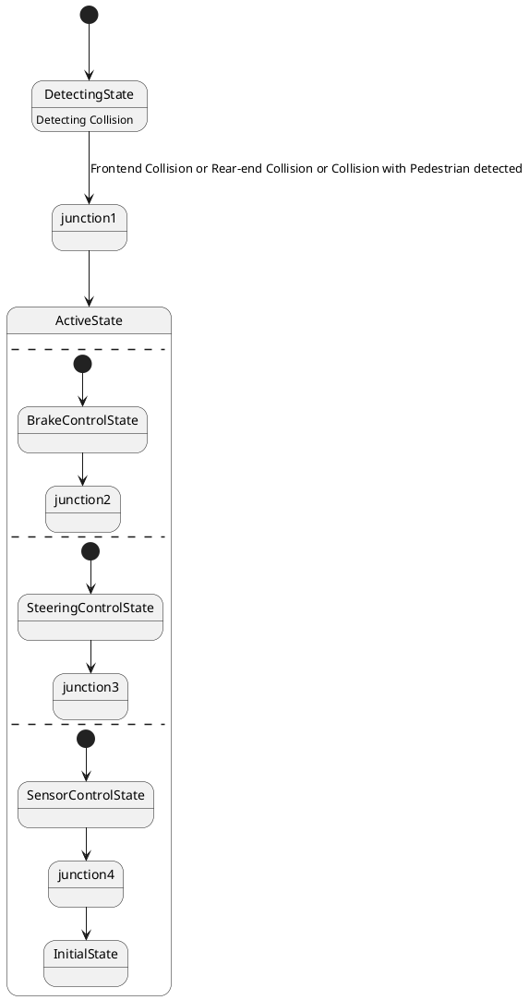

# Pair `0027`：NL + PlantUML STM0 + FCSTM STM0

[上一组 `0026`](../0026/README.md) | [返回 60 组索引](../../PAIR_INDEX.md) | [下一组 `0028`](../0028/README.md)

- LLM：`Llama`
- 模型/场景：Collision avoidance sub-machine state diagram
- 作者输出阶段：`Result with Semantic Checking`
- 作者输出单元格：`AE29`；Excel row：`29`
- Phase-I fallback：`false`
- 相对 Phase-I 是否变化：`true`
- Phase-I PlantUML SHA-256：`9a0ab14a1252a2c11fb409f770f670f465e72b8fc542f5bb5e2019e476a778c6`
- NL SHA-256：`49854d044ad99f16a710021500f5e972da93b27635a41144d9b91d32444c0f63`
- PlantUML SHA-256：`2fb8e2efb51eb16d39b43c07e6a24dbb60d2dc09601f795dd6ab67a0ad6bb49e`
- FCSTM SHA-256：`5ea0ed43ef1be97e2b2a10ede6140076d132e786e2660fd7dba5ea60ae89a52d`
- review subject SHA-256：`b5cf17030a86c8f46b88b5135ba5f8198c19016166c3749f4fec6c2c61e214eb`
- working contract SHA-256：`fc147aa2e6e05029bce018869f4ef63d0f89ef67707e6414cecb183bf121e282`
- 结构裁决：`structure_preserved`
- source states / transitions：`10` / `10`
- mapped / blocked / silent drop：`10` / `0` / `0`
- final / lifecycle / body coverage：`0/0` / `0/0` / `1/1`
- concurrent region / separator coverage：`4/4` / `3/3`
- source normalization coverage：`0/0`
- official raw / validation：`state_diagram` / `state_diagram`
- official identity states / transitions：`10` / `10`
- official identity remaps：state `0` / transition endpoint `0`
- AST audit：`passed`
- legacy whole-model FCSTM execution / Discover：`false` / `false`
- working bundle usage gate：`discover_input_with_capability_mask`
- ownership source / compiler / agent：`25` / `12` / `0`
- source macro / positive identity trace / conversion boundary trace：`15` / `25` / `0`
- capability source-static / simulation / transition-trace：`eligible_with_exclusions` / `ineligible` / `ineligible`
- compiler-only diagnostic policy：`rejected_conversion_artifact`；main-result conversion artifact limit：`0`
- 主 session 对读：`pass`；ownership/macro/capability 均为 `pass`；Case 0027 passes the current attribution-safe forward review; this does not assert global behavior equivalence, and unsupported runtime semantics remain fail-closed.
- source anchors：`source-ref:llms_emp_feedback_final_0027.puml:line:6\|state ActiveState {, source-ref:llms_emp_feedback_final_0027.puml:line:4\|DetectingState --> junction1: Frontend Collision or Rear-end Collision or Collision with Pedestrian detected`；FCSTM anchors：`element-ref:source:state:ActiveState@line:3\|state ActiveState named "ActiveState\n[PlantUML concurrent region 0] states=-; transitions=-\n[PlantUML concurrent region 1] states=ActiveState.BrakeControlState, ActiveState.junction2; transitions=tr_0004, tr_0005\n[PlantUML concurrent region 2] states=ActiveState.SteeringControlState, ActiveState.junction3; transitions=tr_0006, tr_0007\n[PlantUML concurrent region 3] states=ActiveState.SensorControlState, ActiveState.junction4, ActiveState.InitialState; transitions=tr_0008, tr_0009, tr_0010\n[PlantUML concurrent separator] region 0 -> 1 at llms_emp_feedback_final_0027.puml:line:7\n[PlantUML concurrent separator] region 1 -> 2 at llms_emp_feedback_final_0027.puml:line:10\n[PlantUML concurrent separator] region 2 -> 3 at llms_emp_feedback_final_0027.puml:line:13" {, element-ref:compiler:transition_segment:tr_0002:segment:1@line:22\|DetectingState -> junction1 : /Frontend_Collision_or_Rear_end_Collision_or_Collision_with_Pedestrian_detected;`
- 三个原始文件：[NL](./nl.txt) | [PlantUML](./plantuml.puml) | [FCSTM](./fcstm.fcstm)
- 审计入口：[canonical](../../canonical/llms_emp_feedback_final_0027.json) | [冻结 FCSTM](../../fcstm/llms_emp_feedback_final_0027.fcstm) | [case report](../../case_reports/llms_emp_feedback_final_0027.json) | [working contract](../../working_contracts/llms_emp_feedback_final_0027.json) | [source trace](../../source_traces/llms_emp_feedback_final_0027.json) | [人工总账](../../MANUAL_REVIEW.md)

## 主 session 三方语义对应

| projection | assessment | NL anchor | PlantUML anchor | FCSTM anchor | source roots | compiler members | rationale |
|---|---|---|---|---|---|---|---|
| `direct` | `preserved` | There are three region in this diagram | source-ref:llms_emp_feedback_final_0027.puml:line:6\|state ActiveState { | element-ref:source:state:ActiveState@line:3\|state ActiveState named "ActiveState\n[PlantUML concurrent region 0] states=-; transitions=-\n[PlantUML concurrent region 1] states=ActiveState.BrakeControlState, ActiveState.junction2; transitions=tr_0004, tr_0005\n[PlantUML concurrent region 2] states=ActiveState.SteeringControlState, ActiveState.junction3; transitions=tr_0006, tr_0007\n[PlantUML concurrent region 3] states=ActiveState.SensorControlState, ActiveState.junction4, ActiveState.InitialState; transitions=tr_0008, tr_0009, tr_0010\n[PlantUML concurrent separator] region 0 -> 1 at llms_emp_feedback_final_0027.puml:line:7\n[PlantUML concurrent separator] region 1 -> 2 at llms_emp_feedback_final_0027.puml:line:10\n[PlantUML concurrent separator] region 2 -> 3 at llms_emp_feedback_final_0027.puml:line:13" { | source:state:ActiveState | - | Case 0027 binds source:state:ActiveState to authored PlantUML occurrence 'state ActiveState {' and current FCSTM occurrence 'state ActiveState named "ActiveState\n[PlantUML concurrent region 0] states=-; transitions=-\n[PlantUML concurrent region 1] states=ActiveState.BrakeControlState, ActiveState.junction2; transitions=tr_0004, tr_0005\n[PlantUML concurrent region 2] states=ActiveState.SteeringControlState, ActiveState.junction3; transitions=tr_0006, tr_0007\n[PlantUML concurrent region 3] states=ActiveState.SensorControlState, ActiveState.junction4, ActiveState.InitialState; transitions=tr_0008, tr_0009, tr_0010\n[PlantUML concurrent separator] region 0 -> 1 at llms_emp_feedback_final_0027.puml:line:7\n[PlantUML concurrent separator] region 1 -> 2 at llms_emp_feedback_final_0027.puml:line:10\n[PlantUML concurrent separator] region 2 -> 3 at llms_emp_feedback_final_0027.puml:line:13" {'; the source semantic root remains attributable while any compiler-owned projection stays protected and cannot become an independent Repair target. |
| `macro` | `preserved_with_exclusions` | This sub-machine becomes active when a possible frontend collision, rear-end collision or collision with pedestrian is | source-ref:llms_emp_feedback_final_0027.puml:line:4\|DetectingState --> junction1: Frontend Collision or Rear-end Collision or Collision with Pedestrian detected | element-ref:compiler:transition_segment:tr_0002:segment:1@line:22\|DetectingState -> junction1 : /Frontend_Collision_or_Rear_end_Collision_or_Collision_with_Pedestrian_detected; | source:transition:tr_0002 | compiler:transition_segment:tr_0002:segment:1 | Case 0027 binds source:transition:tr_0002 to authored PlantUML occurrence 'DetectingState --> junction1: Frontend Collision or Rear-end Collision or Collision with Pedestrian detected' and current FCSTM occurrence 'DetectingState -> junction1 : /Frontend_Collision_or_Rear_end_Collision_or_Collision_with_Pedestrian_detected;'; the source semantic root remains attributable while any compiler-owned projection stays protected and cannot become an independent Repair target. |

## Risk occurrence 第二遍复核

| obligation | risk tag | assessment | PlantUML evidence | FCSTM evidence | ownership evidence | rationale |
|---|---|---|---|---|---|---|
| `review:concurrent_region:0001:ActiveState:region:0` | `concurrent_region` | `capability_excluded` | source-ref:llms_emp_feedback_final_0027.puml:line:7\|-- | element-ref:source:region:ActiveState:region:0@line:3\|state ActiveState named "ActiveState\n[PlantUML concurrent region 0] states=-; transitions=-\n[PlantUML concurrent region 1] states=ActiveState.BrakeControlState, ActiveState.junction2; transitions=tr_0004, tr_0005\n[PlantUML concurrent region 2] states=ActiveState.SteeringControlState, ActiveState.junction3; transitions=tr_0006, tr_0007\n[PlantUML concurrent region 3] states=ActiveState.SensorControlState, ActiveState.junction4, ActiveState.InitialState; transitions=tr_0008, tr_0009, tr_0010\n[PlantUML concurrent separator] region 0 -> 1 at llms_emp_feedback_final_0027.puml:line:7\n[PlantUML concurrent separator] region 1 -> 2 at llms_emp_feedback_final_0027.puml:line:10\n[PlantUML concurrent separator] region 2 -> 3 at llms_emp_feedback_final_0027.puml:line:13" { | source:region:ActiveState:region:0 | Case 0027 concurrent_region occurrence review:concurrent_region:0001:ActiveState:region:0 binds exact source refs to working-contract elements source:region:ActiveState:region:0. The authored region occurrence is preserved as source metadata, while single-active FCSTM runtime behavior remains capability_excluded. |
| `review:concurrent_region:0002:ActiveState:region:1` | `concurrent_region` | `capability_excluded` | source-ref:llms_emp_feedback_final_0027.puml:line:10\|--, source-ref:llms_emp_feedback_final_0027.puml:line:7\|-- | element-ref:source:region:ActiveState:region:1@line:3\|state ActiveState named "ActiveState\n[PlantUML concurrent region 0] states=-; transitions=-\n[PlantUML concurrent region 1] states=ActiveState.BrakeControlState, ActiveState.junction2; transitions=tr_0004, tr_0005\n[PlantUML concurrent region 2] states=ActiveState.SteeringControlState, ActiveState.junction3; transitions=tr_0006, tr_0007\n[PlantUML concurrent region 3] states=ActiveState.SensorControlState, ActiveState.junction4, ActiveState.InitialState; transitions=tr_0008, tr_0009, tr_0010\n[PlantUML concurrent separator] region 0 -> 1 at llms_emp_feedback_final_0027.puml:line:7\n[PlantUML concurrent separator] region 1 -> 2 at llms_emp_feedback_final_0027.puml:line:10\n[PlantUML concurrent separator] region 2 -> 3 at llms_emp_feedback_final_0027.puml:line:13" { | source:region:ActiveState:region:1 | Case 0027 concurrent_region occurrence review:concurrent_region:0002:ActiveState:region:1 binds exact source refs to working-contract elements source:region:ActiveState:region:1. The authored region occurrence is preserved as source metadata, while single-active FCSTM runtime behavior remains capability_excluded. |
| `review:concurrent_region:0003:ActiveState:region:2` | `concurrent_region` | `capability_excluded` | source-ref:llms_emp_feedback_final_0027.puml:line:10\|--, source-ref:llms_emp_feedback_final_0027.puml:line:13\|-- | element-ref:source:region:ActiveState:region:2@line:3\|state ActiveState named "ActiveState\n[PlantUML concurrent region 0] states=-; transitions=-\n[PlantUML concurrent region 1] states=ActiveState.BrakeControlState, ActiveState.junction2; transitions=tr_0004, tr_0005\n[PlantUML concurrent region 2] states=ActiveState.SteeringControlState, ActiveState.junction3; transitions=tr_0006, tr_0007\n[PlantUML concurrent region 3] states=ActiveState.SensorControlState, ActiveState.junction4, ActiveState.InitialState; transitions=tr_0008, tr_0009, tr_0010\n[PlantUML concurrent separator] region 0 -> 1 at llms_emp_feedback_final_0027.puml:line:7\n[PlantUML concurrent separator] region 1 -> 2 at llms_emp_feedback_final_0027.puml:line:10\n[PlantUML concurrent separator] region 2 -> 3 at llms_emp_feedback_final_0027.puml:line:13" { | source:region:ActiveState:region:2 | Case 0027 concurrent_region occurrence review:concurrent_region:0003:ActiveState:region:2 binds exact source refs to working-contract elements source:region:ActiveState:region:2. The authored region occurrence is preserved as source metadata, while single-active FCSTM runtime behavior remains capability_excluded. |
| `review:concurrent_region:0004:ActiveState:region:3` | `concurrent_region` | `capability_excluded` | source-ref:llms_emp_feedback_final_0027.puml:line:13\|-- | element-ref:source:region:ActiveState:region:3@line:3\|state ActiveState named "ActiveState\n[PlantUML concurrent region 0] states=-; transitions=-\n[PlantUML concurrent region 1] states=ActiveState.BrakeControlState, ActiveState.junction2; transitions=tr_0004, tr_0005\n[PlantUML concurrent region 2] states=ActiveState.SteeringControlState, ActiveState.junction3; transitions=tr_0006, tr_0007\n[PlantUML concurrent region 3] states=ActiveState.SensorControlState, ActiveState.junction4, ActiveState.InitialState; transitions=tr_0008, tr_0009, tr_0010\n[PlantUML concurrent separator] region 0 -> 1 at llms_emp_feedback_final_0027.puml:line:7\n[PlantUML concurrent separator] region 1 -> 2 at llms_emp_feedback_final_0027.puml:line:10\n[PlantUML concurrent separator] region 2 -> 3 at llms_emp_feedback_final_0027.puml:line:13" { | source:region:ActiveState:region:3 | Case 0027 concurrent_region occurrence review:concurrent_region:0004:ActiveState:region:3 binds exact source refs to working-contract elements source:region:ActiveState:region:3. The authored region occurrence is preserved as source metadata, while single-active FCSTM runtime behavior remains capability_excluded. |
| `review:explicit_concurrency:0005:001-multiple_initial_fanout` | `explicit_concurrency` | `capability_excluded` | source-ref:llms_emp_feedback_final_0027.puml:line:11\|[*] --> SteeringControlState, source-ref:llms_emp_feedback_final_0027.puml:line:14\|[*] --> SensorControlState, source-ref:llms_emp_feedback_final_0027.puml:line:8\|[*] --> BrakeControlState | element-ref:compiler:transition_segment:tr_0004:segment:1@line:11\|[*] -> BrakeControlState;, element-ref:compiler:transition_segment:tr_0006:segment:1@line:13\|[*] -> SteeringControlState;, element-ref:compiler:transition_segment:tr_0008:segment:1@line:15\|[*] -> SensorControlState; | source:transition:tr_0004, source:transition:tr_0006, source:transition:tr_0008 | Case 0027 explicit_concurrency occurrence review:explicit_concurrency:0005:001-multiple_initial_fanout binds exact source refs to working-contract elements source:transition:tr_0004, source:transition:tr_0006, source:transition:tr_0008. The authored fork, join, or fan-out occurrence remains source-visible, while unsupported concurrent execution is capability_excluded rather than guessed. |

## 作者阶段 lineage

| stage | output cell | present | output SHA-256 | feedback | resolved |
|---|---|---|---|---|---|
| `phase_i_generation` | `I29` | `true` | `9a0ab14a1252a2c11fb409f770f670f465e72b8fc542f5bb5e2019e476a778c6` | - | - |
| `phase_ii_format` | `U29` | `true` | `e2996def21e49dbfdefa922aeaed1395bf013c97455b9d802a0c2ce43b7a84c8` | syntax error: stm CollisionAvoidance | YES |
| `phase_ii_grammar` | `Z29` | `false` | `-` | - | - |
| `phase_ii_semantic` | `AE29` | `true` | `2fb8e2efb51eb16d39b43c07e6a24dbb60d2dc09601f795dd6ab67a0ad6bb49e` | missing regions | 1.0 |

## Official identity ledger

- status：`aligned`
- canonical / official states：`10` / `10`
- aligned transition endpoints：`10`

本组 state identity 无需重映射。

本组 transition endpoint 无需重映射。

## Source normalization ledger

本组没有 source-input normalization。

## Concurrent region ledger

| owner | region | direct states | direct transitions | separator before | separator after |
|---|---:|---|---|---|---|
| `ActiveState` | 0 | - | - | - | llms_emp_feedback_final_0027.puml:line:7 |
| `ActiveState` | 1 | ActiveState.BrakeControlState, ActiveState.junction2 | tr_0004, tr_0005 | llms_emp_feedback_final_0027.puml:line:7 | llms_emp_feedback_final_0027.puml:line:10 |
| `ActiveState` | 2 | ActiveState.SteeringControlState, ActiveState.junction3 | tr_0006, tr_0007 | llms_emp_feedback_final_0027.puml:line:10 | llms_emp_feedback_final_0027.puml:line:13 |
| `ActiveState` | 3 | ActiveState.SensorControlState, ActiveState.junction4, ActiveState.InitialState | tr_0008, tr_0009, tr_0010 | llms_emp_feedback_final_0027.puml:line:13 | - |

## Operational debt

| reason code | count |
|---|---:|
| `R45.DEBT.concurrent_region_semantics` | 1 |
| `R45.DEBT.multiple_initial_fanout` | 1 |
| `R45.DEBT.opaque_state_body_semantics` | 1 |
| `R45.DEBT.opaque_transition_label_semantics` | 1 |

## NL

```text
1. There are three region in this diagram
2. This sub-machine becomes active when a possible frontend collision, rear-end collision or collision with pedestrian is detected.
3. The orthogonal regions of the active mode of collision avoidance allow for concurrent activation different of collision avoidance controls.
```

## 作者 Phase-II 最终 PlantUML STM0



## 转换后 FCSTM STM0

```fcstm
state llms_emp_feedback_final_0027 named "llms_emp_feedback_final_0027" {
    event Frontend_Collision_or_Rear_end_Collision_or_Collision_with_Pedestrian_detected named "Frontend Collision or Rear-end Collision or Collision with Pedestrian detected";
    state ActiveState named "ActiveState\n[PlantUML concurrent region 0] states=-; transitions=-\n[PlantUML concurrent region 1] states=ActiveState.BrakeControlState, ActiveState.junction2; transitions=tr_0004, tr_0005\n[PlantUML concurrent region 2] states=ActiveState.SteeringControlState, ActiveState.junction3; transitions=tr_0006, tr_0007\n[PlantUML concurrent region 3] states=ActiveState.SensorControlState, ActiveState.junction4, ActiveState.InitialState; transitions=tr_0008, tr_0009, tr_0010\n[PlantUML concurrent separator] region 0 -> 1 at llms_emp_feedback_final_0027.puml:line:7\n[PlantUML concurrent separator] region 1 -> 2 at llms_emp_feedback_final_0027.puml:line:10\n[PlantUML concurrent separator] region 2 -> 3 at llms_emp_feedback_final_0027.puml:line:13" {
        state BrakeControlState named "BrakeControlState";
        state junction2 named "junction2";
        state SteeringControlState named "SteeringControlState";
        state junction3 named "junction3";
        state SensorControlState named "SensorControlState";
        state junction4 named "junction4";
        state InitialState named "InitialState";
        [*] -> BrakeControlState;
        BrakeControlState -> junction2;
        [*] -> SteeringControlState;
        SteeringControlState -> junction3;
        [*] -> SensorControlState;
        SensorControlState -> junction4;
        junction4 -> InitialState;
    }
    state DetectingState named "DetectingState\n[PlantUML body] Detecting Collision";
    state junction1 named "junction1";
    [*] -> DetectingState;
    DetectingState -> junction1 : /Frontend_Collision_or_Rear_end_Collision_or_Collision_with_Pedestrian_detected;
    junction1 -> ActiveState;
}
```

[上一组 `0026`](../0026/README.md) | [返回 60 组索引](../../PAIR_INDEX.md) | [下一组 `0028`](../0028/README.md)
