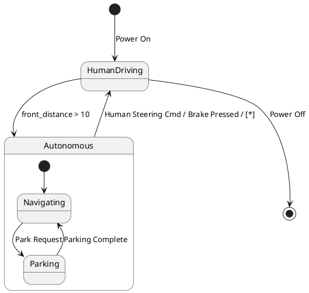

# Pair `0030`：NL + PlantUML STM0 + FCSTM STM0

[上一组 `0029`](../0029/README.md) | [返回 60 组索引](../../PAIR_INDEX.md) | [下一组 `0031`](../0031/README.md)

- LLM：`Kimi`
- 模型/场景：high-level driving module
- 作者输出阶段：`Result with Semantic Checking`
- 作者输出单元格：`AE32`；Excel row：`32`
- Phase-I fallback：`false`
- 相对 Phase-I 是否变化：`true`
- Phase-I PlantUML SHA-256：`e1c89866e4ea2332ca45c2755508cf1c0742595876037ba3c3d0ae7f10feb9c9`
- NL SHA-256：`f1c3dc88371b8256352e7ab6ee7eb42424de6e11dfde70d185f224dd1d05a7a8`
- PlantUML SHA-256：`3a57437b4affea98105ee794349865f92f42e01865786658aeeaf6529c76237a`
- FCSTM SHA-256：`ce24edc53d796f7fba71e455656f1f40dbb7f3e5b9f4531f7aa5026543c0559b`
- review subject SHA-256：`2a4eac38e2854382531e16a9f11671d625eec690c0e1daba32851558835f00e7`
- working contract SHA-256：`08bebfe7a3e81c57d588a1917ae1954ac23b6ad990cba753cd6b5d8d0e00d2b5`
- 结构裁决：`structure_preserved`
- source states / transitions：`4` / `7`
- mapped / blocked / silent drop：`7` / `0` / `0`
- final / lifecycle / body coverage：`1/1` / `0/0` / `0/0`
- concurrent region / separator coverage：`0/0` / `0/0`
- source normalization coverage：`0/0`
- official raw / validation：`state_diagram` / `state_diagram`
- official identity states / transitions：`4` / `7`
- official identity remaps：state `0` / transition endpoint `0`
- AST audit：`passed`
- legacy whole-model FCSTM execution / Discover：`false` / `false`
- working bundle usage gate：`discover_input_with_capability_mask`
- ownership source / compiler / agent：`11` / `17` / `0`
- source macro / positive identity trace / conversion boundary trace：`7` / `11` / `0`
- capability source-static / simulation / transition-trace：`eligible_with_exclusions` / `ineligible` / `ineligible`
- compiler-only diagnostic policy：`rejected_conversion_artifact`；main-result conversion artifact limit：`0`
- 主 session 对读：`pass`；ownership/macro/capability 均为 `pass`；Case 0030 passes the current attribution-safe forward review; this does not assert global behavior equivalence, and unsupported runtime semantics remain fail-closed.
- source anchors：`source-ref:llms_emp_feedback_final_0030.puml:line:4\|state HumanDriving {, source-ref:llms_emp_feedback_final_0030.puml:line:15\|HumanDriving --> Autonomous : front_distance > 10`；FCSTM anchors：`element-ref:source:state:HumanDriving@line:9\|state HumanDriving named "HumanDriving";, element-ref:compiler:transition_segment:tr_0005:segment:1@line:21\|HumanDriving -> Autonomous : /front_distance_10;`
- 三个原始文件：[NL](./nl.txt) | [PlantUML](./plantuml.puml) | [FCSTM](./fcstm.fcstm)
- 审计入口：[canonical](../../canonical/llms_emp_feedback_final_0030.json) | [冻结 FCSTM](../../fcstm/llms_emp_feedback_final_0030.fcstm) | [case report](../../case_reports/llms_emp_feedback_final_0030.json) | [working contract](../../working_contracts/llms_emp_feedback_final_0030.json) | [source trace](../../source_traces/llms_emp_feedback_final_0030.json) | [人工总账](../../MANUAL_REVIEW.md)

## 主 session 三方语义对应

| projection | assessment | NL anchor | PlantUML anchor | FCSTM anchor | source roots | compiler members | rationale |
|---|---|---|---|---|---|---|---|
| `direct` | `preserved` | 1 The human driving mode is represented by a simple state. | source-ref:llms_emp_feedback_final_0030.puml:line:4\|state HumanDriving { | element-ref:source:state:HumanDriving@line:9\|state HumanDriving named "HumanDriving"; | source:state:HumanDriving | - | Case 0030 binds source:state:HumanDriving to authored PlantUML occurrence 'state HumanDriving {' and current FCSTM occurrence 'state HumanDriving named "HumanDriving";'; the source semantic root remains attributable while any compiler-owned projection stays protected and cannot become an independent Repair target. |
| `macro` | `preserved_with_exclusions` | front_distance > 10 | source-ref:llms_emp_feedback_final_0030.puml:line:15\|HumanDriving --> Autonomous : front_distance > 10 | element-ref:compiler:transition_segment:tr_0005:segment:1@line:21\|HumanDriving -> Autonomous : /front_distance_10; | source:transition:tr_0005 | compiler:transition_segment:tr_0005:segment:1 | Case 0030 binds source:transition:tr_0005 to authored PlantUML occurrence 'HumanDriving --> Autonomous : front_distance > 10' and current FCSTM occurrence 'HumanDriving -> Autonomous : /front_distance_10;'; the source semantic root remains attributable while any compiler-owned projection stays protected and cannot become an independent Repair target. |

## Risk occurrence 第二遍复核

| obligation | risk tag | assessment | PlantUML evidence | FCSTM evidence | ownership evidence | rationale |
|---|---|---|---|---|---|---|
| `review:multi_segment_macro:0001:tr_0006` | `multi_segment_macro` | `compiler_artifact_excluded` | source-ref:llms_emp_feedback_final_0030.puml:line:16\|Autonomous --> HumanDriving : Human Steering Cmd / Brake Pressed / [*] | element-ref:compiler:route_control:R45RouteToken@line:1\|def int R45RouteToken = 0;, element-ref:compiler:transition_segment:tr_0006:segment:1@line:16\|Navigating -> [*] : /Human_Steering_Cmd_Brake_Pressed effect { R45RouteToken = 6; };, element-ref:compiler:transition_segment:tr_0006:segment:2@line:17\|Parking -> [*] : /Human_Steering_Cmd_Brake_Pressed effect { R45RouteToken = 6; };, element-ref:compiler:transition_segment:tr_0006:segment:3@line:19\|Autonomous -> HumanDriving : if [R45RouteToken == 6] effect { R45RouteToken = 0; }; | compiler:route_control:R45RouteToken, compiler:transition_segment:tr_0006:segment:1, compiler:transition_segment:tr_0006:segment:2, compiler:transition_segment:tr_0006:segment:3, source:transition:tr_0006 | Case 0030 multi_segment_macro occurrence review:multi_segment_macro:0001:tr_0006 binds exact source refs to working-contract elements compiler:route_control:R45RouteToken, compiler:transition_segment:tr_0006:segment:1, compiler:transition_segment:tr_0006:segment:2, compiler:transition_segment:tr_0006:segment:3, source:transition:tr_0006. All emitted segments collapse to one source transition root; no segment is promoted as a separate authored transition or editable issue target. |
| `review:route_controller:0002:tr_0006` | `route_controller` | `compiler_artifact_excluded` | source-ref:llms_emp_feedback_final_0030.puml:line:16\|Autonomous --> HumanDriving : Human Steering Cmd / Brake Pressed / [*] | element-ref:compiler:route_control:R45RouteToken@line:1\|def int R45RouteToken = 0;, element-ref:compiler:transition_segment:tr_0006:segment:1@line:16\|Navigating -> [*] : /Human_Steering_Cmd_Brake_Pressed effect { R45RouteToken = 6; };, element-ref:compiler:transition_segment:tr_0006:segment:2@line:17\|Parking -> [*] : /Human_Steering_Cmd_Brake_Pressed effect { R45RouteToken = 6; };, element-ref:compiler:transition_segment:tr_0006:segment:3@line:19\|Autonomous -> HumanDriving : if [R45RouteToken == 6] effect { R45RouteToken = 0; }; | compiler:route_control:R45RouteToken, compiler:transition_segment:tr_0006:segment:1, compiler:transition_segment:tr_0006:segment:2, compiler:transition_segment:tr_0006:segment:3, source:transition:tr_0006 | Case 0030 route_controller occurrence review:route_controller:0002:tr_0006 binds exact source refs to working-contract elements compiler:route_control:R45RouteToken, compiler:transition_segment:tr_0006:segment:1, compiler:transition_segment:tr_0006:segment:2, compiler:transition_segment:tr_0006:segment:3, source:transition:tr_0006. R45RouteToken and routed segments remain compiler_owned, protected, and excluded from confirmed issues, Repair, Confirm acceptance, and main results. |
| `review:final_boundary:0003:tr_0007` | `final_boundary` | `source_fact_preserved` | source-ref:llms_emp_feedback_final_0030.puml:line:18\|HumanDriving --> [*] : Power Off | element-ref:compiler:transition_segment:tr_0007:segment:1@line:22\|HumanDriving -> [*] : /Power_Off; | compiler:transition_segment:tr_0007:segment:1, source:transition:tr_0007 | Case 0030 final_boundary occurrence review:final_boundary:0003:tr_0007 binds exact source refs to working-contract elements compiler:transition_segment:tr_0007:segment:1, source:transition:tr_0007. The authored final occurrence remains visible through its source root; any completion holder or routing segment is excluded from source-level claims. |

## 作者阶段 lineage

| stage | output cell | present | output SHA-256 | feedback | resolved |
|---|---|---|---|---|---|
| `phase_i_generation` | `I32` | `true` | `e1c89866e4ea2332ca45c2755508cf1c0742595876037ba3c3d0ae7f10feb9c9` | - | - |
| `phase_ii_format` | `U32` | `false` | `-` | - | - |
| `phase_ii_grammar` | `Z32` | `false` | `-` | - | - |
| `phase_ii_semantic` | `AE32` | `true` | `3a57437b4affea98105ee794349865f92f42e01865786658aeeaf6529c76237a` | 1. missing final state | 1.0 |

## Official identity ledger

- status：`aligned`
- canonical / official states：`4` / `4`
- aligned transition endpoints：`7`

本组 state identity 无需重映射。

本组 transition endpoint 无需重映射。

## Source normalization ledger

本组没有 source-input normalization。

## Concurrent region ledger

本组没有 PlantUML orthogonal/concurrent region separator。

## Operational debt

| reason code | count |
|---|---:|
| `R45.DEBT.composite_source_activation_dispatch` | 1 |
| `R45.DEBT.opaque_transition_label_semantics` | 6 |

## NL

```text
1 The human driving mode is represented by a simple state. 2 The autonomous mode has sub-states and is represented by a sub machine state. 3. when power on, the system turn into human driving mode 4when front_distance > 10, auto transport to autonomous state 4. transit to human driving mode when receive human steering cmd, brake pressed, in (auto final) 5 when power off, it will transit to final state
```

## 作者 Phase-II 最终 PlantUML STM0



## 转换后 FCSTM STM0

```fcstm
def int R45RouteToken = 0;
state llms_emp_feedback_final_0030 named "llms_emp_feedback_final_0030" {
    event Power_On named "Power On";
    event Park_Request named "Park Request";
    event Parking_Complete named "Parking Complete";
    event front_distance_10 named "front_distance > 10";
    event Human_Steering_Cmd_Brake_Pressed named "Human Steering Cmd / Brake Pressed / [*]";
    event Power_Off named "Power Off";
    state HumanDriving named "HumanDriving";
    state Autonomous named "Autonomous" {
        state Navigating named "Navigating";
        state Parking named "Parking";
        [*] -> Navigating;
        Navigating -> Parking : /Park_Request;
        Parking -> Navigating : /Parking_Complete;
        Navigating -> [*] : /Human_Steering_Cmd_Brake_Pressed effect { R45RouteToken = 6; };
        Parking -> [*] : /Human_Steering_Cmd_Brake_Pressed effect { R45RouteToken = 6; };
    }
    Autonomous -> HumanDriving : if [R45RouteToken == 6] effect { R45RouteToken = 0; };
    [*] -> HumanDriving : /Power_On;
    HumanDriving -> Autonomous : /front_distance_10;
    HumanDriving -> [*] : /Power_Off;
}
```

[上一组 `0029`](../0029/README.md) | [返回 60 组索引](../../PAIR_INDEX.md) | [下一组 `0031`](../0031/README.md)
