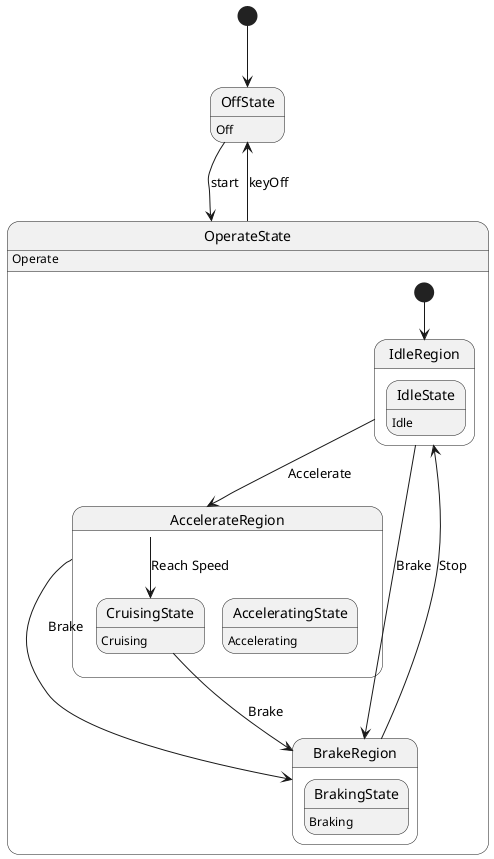

# Pair `0032`：NL + PlantUML STM0 + FCSTM STM0

[上一组 `0031`](../0031/README.md) | [返回 60 组索引](../../PAIR_INDEX.md) | [下一组 `0033`](../0033/README.md)

- LLM：`Kimi`
- 模型/场景：Hybrid Sport Utility Vehicle, HSUV
- 作者输出阶段：`Result with Semantic Checking`
- 作者输出单元格：`AE34`；Excel row：`34`
- Phase-I fallback：`false`
- 相对 Phase-I 是否变化：`true`
- Phase-I PlantUML SHA-256：`95515e5e0af74e499fafe8da9fd82fb1a94f745f719b94288e6ece5872545451`
- NL SHA-256：`9fe426ba761d5a52c3b670f35410502a5289bdd9489c4a9bfa983e34d565040c`
- PlantUML SHA-256：`27c46de7026a1e17808669ce36edee7d2d59b9033435581d56b1f0237dde7d92`
- FCSTM SHA-256：`bb1abfd98c73674454b11e25f4814657a6e87c3428eef21a0d0966969e89aa94`
- review subject SHA-256：`068e6a6a8eb451ccde260f2d38aceab75f6870eef19074a7ef0c581c9892137c`
- working contract SHA-256：`494daa1bee278dc4b1450b6ff67eb1584624bd35673b34012a66d7df50b80d6c`
- 结构裁决：`structure_preserved`
- source states / transitions：`9` / `10`
- mapped / blocked / silent drop：`10` / `0` / `0`
- final / lifecycle / body coverage：`0/0` / `0/0` / `6/6`
- concurrent region / separator coverage：`0/0` / `0/0`
- source normalization coverage：`0/0`
- official raw / validation：`state_diagram` / `state_diagram`
- official identity states / transitions：`9` / `10`
- official identity remaps：state `1` / transition endpoint `2`
- AST audit：`passed`
- legacy whole-model FCSTM execution / Discover：`false` / `false`
- working bundle usage gate：`discover_input_with_capability_mask`
- ownership source / compiler / agent：`25` / `48` / `0`
- source macro / positive identity trace / conversion boundary trace：`16` / `25` / `0`
- capability source-static / simulation / transition-trace：`eligible_with_exclusions` / `eligible_with_exclusions` / `eligible_with_exclusions`
- compiler-only diagnostic policy：`rejected_conversion_artifact`；main-result conversion artifact limit：`0`
- 主 session 对读：`pass`；ownership/macro/capability 均为 `pass`；Case 0032 passes the current attribution-safe forward review; this does not assert global behavior equivalence, and unsupported runtime semantics remain fail-closed. Amendment record: the substantive subject review remains the one recorded in review_context (first reviewed 2026-07-20T05:44:08Z by gpt-5.5 (session omx-1784393668980-pxpj3q), and it still binds because review_subject_sha256 is unchanged. A scoped re-check was performed 2026-08-17 by claude-opus-5 (main-session LLM, PR #185) because commit bbb04cb1 (2026-07-27) regenerated the 60 working contracts and commit 35eba126 (2026-08-11) renamed the paper workspace, and neither refreshed this registry. The re-review is scoped: a key-by-key diff shows the only contract changes are capability_eligibility.simulation, capability_eligibility.transition_trace and summary.simulation_status (bbb04cb1) plus the four artifact_bindings path strings (35eba126); the remaining 168 keys and the whole of canonical/fcstm/parse_inspect/source_traces are byte-identical, so review_subject_sha256 is unchanged and the original ownership, macro and correspondence findings still stand. The capability block was re-checked against seven invariants: eligible ids are source: only, excluded ids cover the compiler-owned set, the two sets are disjoint, claim_boundary and reason_codes are non-empty, main_result_conversion_artifact_limit is still 0, and usage_gate is unchanged.
- source anchors：`source-ref:llms_emp_feedback_final_0032.puml:line:7\|state OperateState {, source-ref:llms_emp_feedback_final_0032.puml:line:4\|OffState --> OperateState : start`；FCSTM anchors：`element-ref:source:state:OperateState@line:9\|state OperateState named "OperateState\n[PlantUML body] Operate" {, element-ref:compiler:transition_segment:tr_0002:segment:1@line:61\|OffState -> OperateState : /start;`
- 三个原始文件：[NL](./nl.txt) | [PlantUML](./plantuml.puml) | [FCSTM](./fcstm.fcstm)
- 审计入口：[canonical](../../canonical/llms_emp_feedback_final_0032.json) | [冻结 FCSTM](../../fcstm/llms_emp_feedback_final_0032.fcstm) | [case report](../../case_reports/llms_emp_feedback_final_0032.json) | [working contract](../../working_contracts/llms_emp_feedback_final_0032.json) | [source trace](../../source_traces/llms_emp_feedback_final_0032.json) | [人工总账](../../MANUAL_REVIEW.md)

## 主 session 三方语义对应

| projection | assessment | NL anchor | PlantUML anchor | FCSTM anchor | source roots | compiler members | rationale |
|---|---|---|---|---|---|---|---|
| `direct` | `preserved` | Once the device is powered on, the system enters the `Operate` state, and based on user actions, it transitions | source-ref:llms_emp_feedback_final_0032.puml:line:7\|state OperateState { | element-ref:source:state:OperateState@line:9\|state OperateState named "OperateState\n[PlantUML body] Operate" { | source:state:OperateState | - | Case 0032 binds source:state:OperateState to authored PlantUML occurrence 'state OperateState {' and current FCSTM occurrence 'state OperateState named "OperateState\n[PlantUML body] Operate" {'; the source semantic root remains attributable while any compiler-owned projection stays protected and cannot become an independent Repair target. |
| `macro` | `preserved_with_exclusions` | start | source-ref:llms_emp_feedback_final_0032.puml:line:4\|OffState --> OperateState : start | element-ref:compiler:transition_segment:tr_0002:segment:1@line:61\|OffState -> OperateState : /start; | source:transition:tr_0002 | compiler:transition_segment:tr_0002:segment:1 | Case 0032 binds source:transition:tr_0002 to authored PlantUML occurrence 'OffState --> OperateState : start' and current FCSTM occurrence 'OffState -> OperateState : /start;'; the source semantic root remains attributable while any compiler-owned projection stays protected and cannot become an independent Repair target. |

## Risk occurrence 第二遍复核

| obligation | risk tag | assessment | PlantUML evidence | FCSTM evidence | ownership evidence | rationale |
|---|---|---|---|---|---|---|
| `review:official_identity_remap:0001:state-001` | `official_identity_remap` | `source_fact_preserved` | source-ref:llms_emp_feedback_final_0032.puml:line:15\|CruisingState : Cruising, source-ref:llms_emp_feedback_final_0032.puml:line:24\|AccelerateRegion --> CruisingState : Reach Speed | element-ref:source:state:OperateState.AccelerateRegion.CruisingState@line:22\|state CruisingState named "CruisingState\n[PlantUML body] Cruising"; | source:state:OperateState.AccelerateRegion.CruisingState | Case 0032 official_identity_remap occurrence review:official_identity_remap:0001:state-001 binds exact source refs to working-contract elements source:state:OperateState.AccelerateRegion.CruisingState. The pinned PlantUML identity decision is preserved as a source fact and is not replaced by a lexical-scope guess from the converter. |
| `review:official_identity_remap:0002:transition-001-tr_0006` | `official_identity_remap` | `source_fact_preserved` | source-ref:llms_emp_feedback_final_0032.puml:line:24\|AccelerateRegion --> CruisingState : Reach Speed | element-ref:compiler:route_control:R45RouteToken@line:1\|def int R45RouteToken = 0; | source:transition:tr_0006 | Case 0032 official_identity_remap occurrence review:official_identity_remap:0002:transition-001-tr_0006 binds exact source refs to working-contract elements source:transition:tr_0006. The pinned PlantUML identity decision is preserved as a source fact and is not replaced by a lexical-scope guess from the converter. |
| `review:official_identity_remap:0003:transition-002-tr_0008` | `official_identity_remap` | `source_fact_preserved` | source-ref:llms_emp_feedback_final_0032.puml:line:26\|CruisingState --> BrakeRegion : Brake | element-ref:compiler:route_control:R45RouteToken@line:1\|def int R45RouteToken = 0; | source:transition:tr_0008 | Case 0032 official_identity_remap occurrence review:official_identity_remap:0003:transition-002-tr_0008 binds exact source refs to working-contract elements source:transition:tr_0008. The pinned PlantUML identity decision is preserved as a source fact and is not replaced by a lexical-scope guess from the converter. |
| `review:multi_segment_macro:0004:tr_0004` | `multi_segment_macro` | `compiler_artifact_excluded` | source-ref:llms_emp_feedback_final_0032.puml:line:22\|IdleRegion --> AccelerateRegion : Accelerate, source-ref:llms_emp_feedback_final_0032.puml:line:23\|IdleRegion --> BrakeRegion : Brake, source-ref:llms_emp_feedback_final_0032.puml:line:24\|AccelerateRegion --> CruisingState : Reach Speed, source-ref:llms_emp_feedback_final_0032.puml:line:25\|AccelerateRegion --> BrakeRegion : Brake, source-ref:llms_emp_feedback_final_0032.puml:line:26\|CruisingState --> BrakeRegion : Brake, source-ref:llms_emp_feedback_final_0032.puml:line:27\|BrakeRegion --> IdleRegion : Stop, source-ref:llms_emp_feedback_final_0032.puml:line:30\|OperateState --> OffState : keyOff | element-ref:compiler:route_control:R45RouteToken@line:1\|def int R45RouteToken = 0;, element-ref:compiler:transition_segment:tr_0004:segment:1@line:14\|IdleState -> [*] : /Accelerate effect { R45RouteToken = 4; };, element-ref:compiler:transition_segment:tr_0004:segment:2@line:47\|IdleRegion -> AccelerateRegion : if [R45RouteToken == 4] effect { R45RouteToken = 0; };, element-ref:compiler:transition_segment:tr_0004:segment:3@line:17\|UnspecifiedInitial -> [*] : /Accelerate effect { R45RouteToken = 4; }; | compiler:route_control:R45RouteToken, compiler:transition_segment:tr_0004:segment:1, compiler:transition_segment:tr_0004:segment:2, compiler:transition_segment:tr_0004:segment:3, source:transition:tr_0004 | Case 0032 multi_segment_macro occurrence review:multi_segment_macro:0004:tr_0004 binds exact source refs to working-contract elements compiler:route_control:R45RouteToken, compiler:transition_segment:tr_0004:segment:1, compiler:transition_segment:tr_0004:segment:2, compiler:transition_segment:tr_0004:segment:3, source:transition:tr_0004. All emitted segments collapse to one source transition root; no segment is promoted as a separate authored transition or editable issue target. |
| `review:route_controller:0005:tr_0004` | `route_controller` | `compiler_artifact_excluded` | source-ref:llms_emp_feedback_final_0032.puml:line:22\|IdleRegion --> AccelerateRegion : Accelerate, source-ref:llms_emp_feedback_final_0032.puml:line:23\|IdleRegion --> BrakeRegion : Brake, source-ref:llms_emp_feedback_final_0032.puml:line:24\|AccelerateRegion --> CruisingState : Reach Speed, source-ref:llms_emp_feedback_final_0032.puml:line:25\|AccelerateRegion --> BrakeRegion : Brake, source-ref:llms_emp_feedback_final_0032.puml:line:26\|CruisingState --> BrakeRegion : Brake, source-ref:llms_emp_feedback_final_0032.puml:line:27\|BrakeRegion --> IdleRegion : Stop, source-ref:llms_emp_feedback_final_0032.puml:line:30\|OperateState --> OffState : keyOff | element-ref:compiler:route_control:R45RouteToken@line:1\|def int R45RouteToken = 0;, element-ref:compiler:transition_segment:tr_0004:segment:1@line:14\|IdleState -> [*] : /Accelerate effect { R45RouteToken = 4; };, element-ref:compiler:transition_segment:tr_0004:segment:2@line:47\|IdleRegion -> AccelerateRegion : if [R45RouteToken == 4] effect { R45RouteToken = 0; };, element-ref:compiler:transition_segment:tr_0004:segment:3@line:17\|UnspecifiedInitial -> [*] : /Accelerate effect { R45RouteToken = 4; }; | compiler:route_control:R45RouteToken, compiler:transition_segment:tr_0004:segment:1, compiler:transition_segment:tr_0004:segment:2, compiler:transition_segment:tr_0004:segment:3, source:transition:tr_0004 | Case 0032 route_controller occurrence review:route_controller:0005:tr_0004 binds exact source refs to working-contract elements compiler:route_control:R45RouteToken, compiler:transition_segment:tr_0004:segment:1, compiler:transition_segment:tr_0004:segment:2, compiler:transition_segment:tr_0004:segment:3, source:transition:tr_0004. R45RouteToken and routed segments remain compiler_owned, protected, and excluded from confirmed issues, Repair, Confirm acceptance, and main results. |
| `review:multi_segment_macro:0006:tr_0005` | `multi_segment_macro` | `compiler_artifact_excluded` | source-ref:llms_emp_feedback_final_0032.puml:line:22\|IdleRegion --> AccelerateRegion : Accelerate, source-ref:llms_emp_feedback_final_0032.puml:line:23\|IdleRegion --> BrakeRegion : Brake, source-ref:llms_emp_feedback_final_0032.puml:line:24\|AccelerateRegion --> CruisingState : Reach Speed, source-ref:llms_emp_feedback_final_0032.puml:line:25\|AccelerateRegion --> BrakeRegion : Brake, source-ref:llms_emp_feedback_final_0032.puml:line:26\|CruisingState --> BrakeRegion : Brake, source-ref:llms_emp_feedback_final_0032.puml:line:27\|BrakeRegion --> IdleRegion : Stop, source-ref:llms_emp_feedback_final_0032.puml:line:30\|OperateState --> OffState : keyOff | element-ref:compiler:route_control:R45RouteToken@line:1\|def int R45RouteToken = 0;, element-ref:compiler:transition_segment:tr_0005:segment:1@line:15\|IdleState -> [*] : /Brake effect { R45RouteToken = 5; };, element-ref:compiler:transition_segment:tr_0005:segment:2@line:48\|IdleRegion -> BrakeRegion : if [R45RouteToken == 5] effect { R45RouteToken = 0; };, element-ref:compiler:transition_segment:tr_0005:segment:3@line:18\|UnspecifiedInitial -> [*] : /Brake effect { R45RouteToken = 5; }; | compiler:route_control:R45RouteToken, compiler:transition_segment:tr_0005:segment:1, compiler:transition_segment:tr_0005:segment:2, compiler:transition_segment:tr_0005:segment:3, source:transition:tr_0005 | Case 0032 multi_segment_macro occurrence review:multi_segment_macro:0006:tr_0005 binds exact source refs to working-contract elements compiler:route_control:R45RouteToken, compiler:transition_segment:tr_0005:segment:1, compiler:transition_segment:tr_0005:segment:2, compiler:transition_segment:tr_0005:segment:3, source:transition:tr_0005. All emitted segments collapse to one source transition root; no segment is promoted as a separate authored transition or editable issue target. |
| `review:route_controller:0007:tr_0005` | `route_controller` | `compiler_artifact_excluded` | source-ref:llms_emp_feedback_final_0032.puml:line:22\|IdleRegion --> AccelerateRegion : Accelerate, source-ref:llms_emp_feedback_final_0032.puml:line:23\|IdleRegion --> BrakeRegion : Brake, source-ref:llms_emp_feedback_final_0032.puml:line:24\|AccelerateRegion --> CruisingState : Reach Speed, source-ref:llms_emp_feedback_final_0032.puml:line:25\|AccelerateRegion --> BrakeRegion : Brake, source-ref:llms_emp_feedback_final_0032.puml:line:26\|CruisingState --> BrakeRegion : Brake, source-ref:llms_emp_feedback_final_0032.puml:line:27\|BrakeRegion --> IdleRegion : Stop, source-ref:llms_emp_feedback_final_0032.puml:line:30\|OperateState --> OffState : keyOff | element-ref:compiler:route_control:R45RouteToken@line:1\|def int R45RouteToken = 0;, element-ref:compiler:transition_segment:tr_0005:segment:1@line:15\|IdleState -> [*] : /Brake effect { R45RouteToken = 5; };, element-ref:compiler:transition_segment:tr_0005:segment:2@line:48\|IdleRegion -> BrakeRegion : if [R45RouteToken == 5] effect { R45RouteToken = 0; };, element-ref:compiler:transition_segment:tr_0005:segment:3@line:18\|UnspecifiedInitial -> [*] : /Brake effect { R45RouteToken = 5; }; | compiler:route_control:R45RouteToken, compiler:transition_segment:tr_0005:segment:1, compiler:transition_segment:tr_0005:segment:2, compiler:transition_segment:tr_0005:segment:3, source:transition:tr_0005 | Case 0032 route_controller occurrence review:route_controller:0007:tr_0005 binds exact source refs to working-contract elements compiler:route_control:R45RouteToken, compiler:transition_segment:tr_0005:segment:1, compiler:transition_segment:tr_0005:segment:2, compiler:transition_segment:tr_0005:segment:3, source:transition:tr_0005. R45RouteToken and routed segments remain compiler_owned, protected, and excluded from confirmed issues, Repair, Confirm acceptance, and main results. |
| `review:multi_segment_macro:0008:tr_0006` | `multi_segment_macro` | `compiler_artifact_excluded` | source-ref:llms_emp_feedback_final_0032.puml:line:22\|IdleRegion --> AccelerateRegion : Accelerate, source-ref:llms_emp_feedback_final_0032.puml:line:23\|IdleRegion --> BrakeRegion : Brake, source-ref:llms_emp_feedback_final_0032.puml:line:24\|AccelerateRegion --> CruisingState : Reach Speed, source-ref:llms_emp_feedback_final_0032.puml:line:25\|AccelerateRegion --> BrakeRegion : Brake, source-ref:llms_emp_feedback_final_0032.puml:line:26\|CruisingState --> BrakeRegion : Brake, source-ref:llms_emp_feedback_final_0032.puml:line:27\|BrakeRegion --> IdleRegion : Stop, source-ref:llms_emp_feedback_final_0032.puml:line:30\|OperateState --> OffState : keyOff | element-ref:compiler:route_control:R45RouteToken@line:1\|def int R45RouteToken = 0;, element-ref:compiler:transition_segment:tr_0006:segment:1@line:27\|CruisingState -> [*] : /Reach_Speed effect { R45RouteToken = 6; };, element-ref:compiler:transition_segment:tr_0006:segment:2@line:28\|AcceleratingState -> [*] : /Reach_Speed effect { R45RouteToken = 6; };, element-ref:compiler:transition_segment:tr_0006:segment:3@line:49\|AccelerateRegion -> AccelerateRegion : if [R45RouteToken == 6];, element-ref:compiler:transition_segment:tr_0006:segment:4@line:25\|[*] -> CruisingState : if [R45RouteToken == 6] effect { R45RouteToken = 0; };, element-ref:compiler:transition_segment:tr_0006:segment:5@line:34\|UnspecifiedInitial -> [*] : /Reach_Speed effect { R45RouteToken = 6; }; | compiler:route_control:R45RouteToken, compiler:transition_segment:tr_0006:segment:1, compiler:transition_segment:tr_0006:segment:2, compiler:transition_segment:tr_0006:segment:3, compiler:transition_segment:tr_0006:segment:4, compiler:transition_segment:tr_0006:segment:5, source:transition:tr_0006 | Case 0032 multi_segment_macro occurrence review:multi_segment_macro:0008:tr_0006 binds exact source refs to working-contract elements compiler:route_control:R45RouteToken, compiler:transition_segment:tr_0006:segment:1, compiler:transition_segment:tr_0006:segment:2, compiler:transition_segment:tr_0006:segment:3, compiler:transition_segment:tr_0006:segment:4, compiler:transition_segment:tr_0006:segment:5, source:transition:tr_0006. All emitted segments collapse to one source transition root; no segment is promoted as a separate authored transition or editable issue target. |
| `review:route_controller:0009:tr_0006` | `route_controller` | `compiler_artifact_excluded` | source-ref:llms_emp_feedback_final_0032.puml:line:22\|IdleRegion --> AccelerateRegion : Accelerate, source-ref:llms_emp_feedback_final_0032.puml:line:23\|IdleRegion --> BrakeRegion : Brake, source-ref:llms_emp_feedback_final_0032.puml:line:24\|AccelerateRegion --> CruisingState : Reach Speed, source-ref:llms_emp_feedback_final_0032.puml:line:25\|AccelerateRegion --> BrakeRegion : Brake, source-ref:llms_emp_feedback_final_0032.puml:line:26\|CruisingState --> BrakeRegion : Brake, source-ref:llms_emp_feedback_final_0032.puml:line:27\|BrakeRegion --> IdleRegion : Stop, source-ref:llms_emp_feedback_final_0032.puml:line:30\|OperateState --> OffState : keyOff | element-ref:compiler:route_control:R45RouteToken@line:1\|def int R45RouteToken = 0;, element-ref:compiler:transition_segment:tr_0006:segment:1@line:27\|CruisingState -> [*] : /Reach_Speed effect { R45RouteToken = 6; };, element-ref:compiler:transition_segment:tr_0006:segment:2@line:28\|AcceleratingState -> [*] : /Reach_Speed effect { R45RouteToken = 6; };, element-ref:compiler:transition_segment:tr_0006:segment:3@line:49\|AccelerateRegion -> AccelerateRegion : if [R45RouteToken == 6];, element-ref:compiler:transition_segment:tr_0006:segment:4@line:25\|[*] -> CruisingState : if [R45RouteToken == 6] effect { R45RouteToken = 0; };, element-ref:compiler:transition_segment:tr_0006:segment:5@line:34\|UnspecifiedInitial -> [*] : /Reach_Speed effect { R45RouteToken = 6; }; | compiler:route_control:R45RouteToken, compiler:transition_segment:tr_0006:segment:1, compiler:transition_segment:tr_0006:segment:2, compiler:transition_segment:tr_0006:segment:3, compiler:transition_segment:tr_0006:segment:4, compiler:transition_segment:tr_0006:segment:5, source:transition:tr_0006 | Case 0032 route_controller occurrence review:route_controller:0009:tr_0006 binds exact source refs to working-contract elements compiler:route_control:R45RouteToken, compiler:transition_segment:tr_0006:segment:1, compiler:transition_segment:tr_0006:segment:2, compiler:transition_segment:tr_0006:segment:3, compiler:transition_segment:tr_0006:segment:4, compiler:transition_segment:tr_0006:segment:5, source:transition:tr_0006. R45RouteToken and routed segments remain compiler_owned, protected, and excluded from confirmed issues, Repair, Confirm acceptance, and main results. |
| `review:multi_segment_macro:0010:tr_0007` | `multi_segment_macro` | `compiler_artifact_excluded` | source-ref:llms_emp_feedback_final_0032.puml:line:22\|IdleRegion --> AccelerateRegion : Accelerate, source-ref:llms_emp_feedback_final_0032.puml:line:23\|IdleRegion --> BrakeRegion : Brake, source-ref:llms_emp_feedback_final_0032.puml:line:24\|AccelerateRegion --> CruisingState : Reach Speed, source-ref:llms_emp_feedback_final_0032.puml:line:25\|AccelerateRegion --> BrakeRegion : Brake, source-ref:llms_emp_feedback_final_0032.puml:line:26\|CruisingState --> BrakeRegion : Brake, source-ref:llms_emp_feedback_final_0032.puml:line:27\|BrakeRegion --> IdleRegion : Stop, source-ref:llms_emp_feedback_final_0032.puml:line:30\|OperateState --> OffState : keyOff | element-ref:compiler:route_control:R45RouteToken@line:1\|def int R45RouteToken = 0;, element-ref:compiler:transition_segment:tr_0007:segment:1@line:29\|CruisingState -> [*] : /Brake effect { R45RouteToken = 7; };, element-ref:compiler:transition_segment:tr_0007:segment:2@line:30\|AcceleratingState -> [*] : /Brake effect { R45RouteToken = 7; };, element-ref:compiler:transition_segment:tr_0007:segment:3@line:50\|AccelerateRegion -> BrakeRegion : if [R45RouteToken == 7] effect { R45RouteToken = 0; };, element-ref:compiler:transition_segment:tr_0007:segment:4@line:35\|UnspecifiedInitial -> [*] : /Brake effect { R45RouteToken = 7; }; | compiler:route_control:R45RouteToken, compiler:transition_segment:tr_0007:segment:1, compiler:transition_segment:tr_0007:segment:2, compiler:transition_segment:tr_0007:segment:3, compiler:transition_segment:tr_0007:segment:4, source:transition:tr_0007 | Case 0032 multi_segment_macro occurrence review:multi_segment_macro:0010:tr_0007 binds exact source refs to working-contract elements compiler:route_control:R45RouteToken, compiler:transition_segment:tr_0007:segment:1, compiler:transition_segment:tr_0007:segment:2, compiler:transition_segment:tr_0007:segment:3, compiler:transition_segment:tr_0007:segment:4, source:transition:tr_0007. All emitted segments collapse to one source transition root; no segment is promoted as a separate authored transition or editable issue target. |
| `review:route_controller:0011:tr_0007` | `route_controller` | `compiler_artifact_excluded` | source-ref:llms_emp_feedback_final_0032.puml:line:22\|IdleRegion --> AccelerateRegion : Accelerate, source-ref:llms_emp_feedback_final_0032.puml:line:23\|IdleRegion --> BrakeRegion : Brake, source-ref:llms_emp_feedback_final_0032.puml:line:24\|AccelerateRegion --> CruisingState : Reach Speed, source-ref:llms_emp_feedback_final_0032.puml:line:25\|AccelerateRegion --> BrakeRegion : Brake, source-ref:llms_emp_feedback_final_0032.puml:line:26\|CruisingState --> BrakeRegion : Brake, source-ref:llms_emp_feedback_final_0032.puml:line:27\|BrakeRegion --> IdleRegion : Stop, source-ref:llms_emp_feedback_final_0032.puml:line:30\|OperateState --> OffState : keyOff | element-ref:compiler:route_control:R45RouteToken@line:1\|def int R45RouteToken = 0;, element-ref:compiler:transition_segment:tr_0007:segment:1@line:29\|CruisingState -> [*] : /Brake effect { R45RouteToken = 7; };, element-ref:compiler:transition_segment:tr_0007:segment:2@line:30\|AcceleratingState -> [*] : /Brake effect { R45RouteToken = 7; };, element-ref:compiler:transition_segment:tr_0007:segment:3@line:50\|AccelerateRegion -> BrakeRegion : if [R45RouteToken == 7] effect { R45RouteToken = 0; };, element-ref:compiler:transition_segment:tr_0007:segment:4@line:35\|UnspecifiedInitial -> [*] : /Brake effect { R45RouteToken = 7; }; | compiler:route_control:R45RouteToken, compiler:transition_segment:tr_0007:segment:1, compiler:transition_segment:tr_0007:segment:2, compiler:transition_segment:tr_0007:segment:3, compiler:transition_segment:tr_0007:segment:4, source:transition:tr_0007 | Case 0032 route_controller occurrence review:route_controller:0011:tr_0007 binds exact source refs to working-contract elements compiler:route_control:R45RouteToken, compiler:transition_segment:tr_0007:segment:1, compiler:transition_segment:tr_0007:segment:2, compiler:transition_segment:tr_0007:segment:3, compiler:transition_segment:tr_0007:segment:4, source:transition:tr_0007. R45RouteToken and routed segments remain compiler_owned, protected, and excluded from confirmed issues, Repair, Confirm acceptance, and main results. |
| `review:multi_segment_macro:0012:tr_0008` | `multi_segment_macro` | `compiler_artifact_excluded` | source-ref:llms_emp_feedback_final_0032.puml:line:22\|IdleRegion --> AccelerateRegion : Accelerate, source-ref:llms_emp_feedback_final_0032.puml:line:23\|IdleRegion --> BrakeRegion : Brake, source-ref:llms_emp_feedback_final_0032.puml:line:24\|AccelerateRegion --> CruisingState : Reach Speed, source-ref:llms_emp_feedback_final_0032.puml:line:25\|AccelerateRegion --> BrakeRegion : Brake, source-ref:llms_emp_feedback_final_0032.puml:line:26\|CruisingState --> BrakeRegion : Brake, source-ref:llms_emp_feedback_final_0032.puml:line:27\|BrakeRegion --> IdleRegion : Stop, source-ref:llms_emp_feedback_final_0032.puml:line:30\|OperateState --> OffState : keyOff | element-ref:compiler:route_control:R45RouteToken@line:1\|def int R45RouteToken = 0;, element-ref:compiler:transition_segment:tr_0008:segment:1@line:31\|CruisingState -> [*] : /Brake effect { R45RouteToken = 8; };, element-ref:compiler:transition_segment:tr_0008:segment:2@line:51\|AccelerateRegion -> BrakeRegion : if [R45RouteToken == 8] effect { R45RouteToken = 0; }; | compiler:route_control:R45RouteToken, compiler:transition_segment:tr_0008:segment:1, compiler:transition_segment:tr_0008:segment:2, source:transition:tr_0008 | Case 0032 multi_segment_macro occurrence review:multi_segment_macro:0012:tr_0008 binds exact source refs to working-contract elements compiler:route_control:R45RouteToken, compiler:transition_segment:tr_0008:segment:1, compiler:transition_segment:tr_0008:segment:2, source:transition:tr_0008. All emitted segments collapse to one source transition root; no segment is promoted as a separate authored transition or editable issue target. |
| `review:route_controller:0013:tr_0008` | `route_controller` | `compiler_artifact_excluded` | source-ref:llms_emp_feedback_final_0032.puml:line:22\|IdleRegion --> AccelerateRegion : Accelerate, source-ref:llms_emp_feedback_final_0032.puml:line:23\|IdleRegion --> BrakeRegion : Brake, source-ref:llms_emp_feedback_final_0032.puml:line:24\|AccelerateRegion --> CruisingState : Reach Speed, source-ref:llms_emp_feedback_final_0032.puml:line:25\|AccelerateRegion --> BrakeRegion : Brake, source-ref:llms_emp_feedback_final_0032.puml:line:26\|CruisingState --> BrakeRegion : Brake, source-ref:llms_emp_feedback_final_0032.puml:line:27\|BrakeRegion --> IdleRegion : Stop, source-ref:llms_emp_feedback_final_0032.puml:line:30\|OperateState --> OffState : keyOff | element-ref:compiler:route_control:R45RouteToken@line:1\|def int R45RouteToken = 0;, element-ref:compiler:transition_segment:tr_0008:segment:1@line:31\|CruisingState -> [*] : /Brake effect { R45RouteToken = 8; };, element-ref:compiler:transition_segment:tr_0008:segment:2@line:51\|AccelerateRegion -> BrakeRegion : if [R45RouteToken == 8] effect { R45RouteToken = 0; }; | compiler:route_control:R45RouteToken, compiler:transition_segment:tr_0008:segment:1, compiler:transition_segment:tr_0008:segment:2, source:transition:tr_0008 | Case 0032 route_controller occurrence review:route_controller:0013:tr_0008 binds exact source refs to working-contract elements compiler:route_control:R45RouteToken, compiler:transition_segment:tr_0008:segment:1, compiler:transition_segment:tr_0008:segment:2, source:transition:tr_0008. R45RouteToken and routed segments remain compiler_owned, protected, and excluded from confirmed issues, Repair, Confirm acceptance, and main results. |
| `review:multi_segment_macro:0014:tr_0009` | `multi_segment_macro` | `compiler_artifact_excluded` | source-ref:llms_emp_feedback_final_0032.puml:line:22\|IdleRegion --> AccelerateRegion : Accelerate, source-ref:llms_emp_feedback_final_0032.puml:line:23\|IdleRegion --> BrakeRegion : Brake, source-ref:llms_emp_feedback_final_0032.puml:line:24\|AccelerateRegion --> CruisingState : Reach Speed, source-ref:llms_emp_feedback_final_0032.puml:line:25\|AccelerateRegion --> BrakeRegion : Brake, source-ref:llms_emp_feedback_final_0032.puml:line:26\|CruisingState --> BrakeRegion : Brake, source-ref:llms_emp_feedback_final_0032.puml:line:27\|BrakeRegion --> IdleRegion : Stop, source-ref:llms_emp_feedback_final_0032.puml:line:30\|OperateState --> OffState : keyOff | element-ref:compiler:route_control:R45RouteToken@line:1\|def int R45RouteToken = 0;, element-ref:compiler:transition_segment:tr_0009:segment:1@line:42\|BrakingState -> [*] : /Stop effect { R45RouteToken = 9; };, element-ref:compiler:transition_segment:tr_0009:segment:2@line:52\|BrakeRegion -> IdleRegion : if [R45RouteToken == 9] effect { R45RouteToken = 0; };, element-ref:compiler:transition_segment:tr_0009:segment:3@line:44\|UnspecifiedInitial -> [*] : /Stop effect { R45RouteToken = 9; }; | compiler:route_control:R45RouteToken, compiler:transition_segment:tr_0009:segment:1, compiler:transition_segment:tr_0009:segment:2, compiler:transition_segment:tr_0009:segment:3, source:transition:tr_0009 | Case 0032 multi_segment_macro occurrence review:multi_segment_macro:0014:tr_0009 binds exact source refs to working-contract elements compiler:route_control:R45RouteToken, compiler:transition_segment:tr_0009:segment:1, compiler:transition_segment:tr_0009:segment:2, compiler:transition_segment:tr_0009:segment:3, source:transition:tr_0009. All emitted segments collapse to one source transition root; no segment is promoted as a separate authored transition or editable issue target. |
| `review:route_controller:0015:tr_0009` | `route_controller` | `compiler_artifact_excluded` | source-ref:llms_emp_feedback_final_0032.puml:line:22\|IdleRegion --> AccelerateRegion : Accelerate, source-ref:llms_emp_feedback_final_0032.puml:line:23\|IdleRegion --> BrakeRegion : Brake, source-ref:llms_emp_feedback_final_0032.puml:line:24\|AccelerateRegion --> CruisingState : Reach Speed, source-ref:llms_emp_feedback_final_0032.puml:line:25\|AccelerateRegion --> BrakeRegion : Brake, source-ref:llms_emp_feedback_final_0032.puml:line:26\|CruisingState --> BrakeRegion : Brake, source-ref:llms_emp_feedback_final_0032.puml:line:27\|BrakeRegion --> IdleRegion : Stop, source-ref:llms_emp_feedback_final_0032.puml:line:30\|OperateState --> OffState : keyOff | element-ref:compiler:route_control:R45RouteToken@line:1\|def int R45RouteToken = 0;, element-ref:compiler:transition_segment:tr_0009:segment:1@line:42\|BrakingState -> [*] : /Stop effect { R45RouteToken = 9; };, element-ref:compiler:transition_segment:tr_0009:segment:2@line:52\|BrakeRegion -> IdleRegion : if [R45RouteToken == 9] effect { R45RouteToken = 0; };, element-ref:compiler:transition_segment:tr_0009:segment:3@line:44\|UnspecifiedInitial -> [*] : /Stop effect { R45RouteToken = 9; }; | compiler:route_control:R45RouteToken, compiler:transition_segment:tr_0009:segment:1, compiler:transition_segment:tr_0009:segment:2, compiler:transition_segment:tr_0009:segment:3, source:transition:tr_0009 | Case 0032 route_controller occurrence review:route_controller:0015:tr_0009 binds exact source refs to working-contract elements compiler:route_control:R45RouteToken, compiler:transition_segment:tr_0009:segment:1, compiler:transition_segment:tr_0009:segment:2, compiler:transition_segment:tr_0009:segment:3, source:transition:tr_0009. R45RouteToken and routed segments remain compiler_owned, protected, and excluded from confirmed issues, Repair, Confirm acceptance, and main results. |
| `review:multi_segment_macro:0016:tr_0010` | `multi_segment_macro` | `compiler_artifact_excluded` | source-ref:llms_emp_feedback_final_0032.puml:line:22\|IdleRegion --> AccelerateRegion : Accelerate, source-ref:llms_emp_feedback_final_0032.puml:line:23\|IdleRegion --> BrakeRegion : Brake, source-ref:llms_emp_feedback_final_0032.puml:line:24\|AccelerateRegion --> CruisingState : Reach Speed, source-ref:llms_emp_feedback_final_0032.puml:line:25\|AccelerateRegion --> BrakeRegion : Brake, source-ref:llms_emp_feedback_final_0032.puml:line:26\|CruisingState --> BrakeRegion : Brake, source-ref:llms_emp_feedback_final_0032.puml:line:27\|BrakeRegion --> IdleRegion : Stop, source-ref:llms_emp_feedback_final_0032.puml:line:30\|OperateState --> OffState : keyOff | element-ref:compiler:route_control:R45RouteToken@line:1\|def int R45RouteToken = 0;, element-ref:compiler:transition_segment:tr_0010:segment:10@line:36\|UnspecifiedInitial -> [*] : /keyOff effect { R45RouteToken = 10; };, element-ref:compiler:transition_segment:tr_0010:segment:11@line:45\|UnspecifiedInitial -> [*] : /keyOff effect { R45RouteToken = 10; };, element-ref:compiler:transition_segment:tr_0010:segment:1@line:16\|IdleState -> [*] : /keyOff effect { R45RouteToken = 10; };, element-ref:compiler:transition_segment:tr_0010:segment:2@line:53\|IdleRegion -> [*] : if [R45RouteToken == 10];, element-ref:compiler:transition_segment:tr_0010:segment:3@line:32\|CruisingState -> [*] : /keyOff effect { R45RouteToken = 10; };, element-ref:compiler:transition_segment:tr_0010:segment:4@line:54\|AccelerateRegion -> [*] : if [R45RouteToken == 10];, element-ref:compiler:transition_segment:tr_0010:segment:5@line:33\|AcceleratingState -> [*] : /keyOff effect { R45RouteToken = 10; };, element-ref:compiler:transition_segment:tr_0010:segment:6@line:43\|BrakingState -> [*] : /keyOff effect { R45RouteToken = 10; };, element-ref:compiler:transition_segment:tr_0010:segment:7@line:55\|BrakeRegion -> [*] : if [R45RouteToken == 10];, element-ref:compiler:transition_segment:tr_0010:segment:8@line:59\|OperateState -> OffState : if [R45RouteToken == 10] effect { R45RouteToken = 0; };, element-ref:compiler:transition_segment:tr_0010:segment:9@line:19\|UnspecifiedInitial -> [*] : /keyOff effect { R45RouteToken = 10; }; | compiler:route_control:R45RouteToken, compiler:transition_segment:tr_0010:segment:1, compiler:transition_segment:tr_0010:segment:10, compiler:transition_segment:tr_0010:segment:11, compiler:transition_segment:tr_0010:segment:2, compiler:transition_segment:tr_0010:segment:3, compiler:transition_segment:tr_0010:segment:4, compiler:transition_segment:tr_0010:segment:5, compiler:transition_segment:tr_0010:segment:6, compiler:transition_segment:tr_0010:segment:7, compiler:transition_segment:tr_0010:segment:8, compiler:transition_segment:tr_0010:segment:9, source:transition:tr_0010 | Case 0032 multi_segment_macro occurrence review:multi_segment_macro:0016:tr_0010 binds exact source refs to working-contract elements compiler:route_control:R45RouteToken, compiler:transition_segment:tr_0010:segment:1, compiler:transition_segment:tr_0010:segment:10, compiler:transition_segment:tr_0010:segment:11, compiler:transition_segment:tr_0010:segment:2, compiler:transition_segment:tr_0010:segment:3, compiler:transition_segment:tr_0010:segment:4, compiler:transition_segment:tr_0010:segment:5, compiler:transition_segment:tr_0010:segment:6, compiler:transition_segment:tr_0010:segment:7, compiler:transition_segment:tr_0010:segment:8, compiler:transition_segment:tr_0010:segment:9, source:transition:tr_0010. All emitted segments collapse to one source transition root; no segment is promoted as a separate authored transition or editable issue target. |
| `review:route_controller:0017:tr_0010` | `route_controller` | `compiler_artifact_excluded` | source-ref:llms_emp_feedback_final_0032.puml:line:22\|IdleRegion --> AccelerateRegion : Accelerate, source-ref:llms_emp_feedback_final_0032.puml:line:23\|IdleRegion --> BrakeRegion : Brake, source-ref:llms_emp_feedback_final_0032.puml:line:24\|AccelerateRegion --> CruisingState : Reach Speed, source-ref:llms_emp_feedback_final_0032.puml:line:25\|AccelerateRegion --> BrakeRegion : Brake, source-ref:llms_emp_feedback_final_0032.puml:line:26\|CruisingState --> BrakeRegion : Brake, source-ref:llms_emp_feedback_final_0032.puml:line:27\|BrakeRegion --> IdleRegion : Stop, source-ref:llms_emp_feedback_final_0032.puml:line:30\|OperateState --> OffState : keyOff | element-ref:compiler:route_control:R45RouteToken@line:1\|def int R45RouteToken = 0;, element-ref:compiler:transition_segment:tr_0010:segment:10@line:36\|UnspecifiedInitial -> [*] : /keyOff effect { R45RouteToken = 10; };, element-ref:compiler:transition_segment:tr_0010:segment:11@line:45\|UnspecifiedInitial -> [*] : /keyOff effect { R45RouteToken = 10; };, element-ref:compiler:transition_segment:tr_0010:segment:1@line:16\|IdleState -> [*] : /keyOff effect { R45RouteToken = 10; };, element-ref:compiler:transition_segment:tr_0010:segment:2@line:53\|IdleRegion -> [*] : if [R45RouteToken == 10];, element-ref:compiler:transition_segment:tr_0010:segment:3@line:32\|CruisingState -> [*] : /keyOff effect { R45RouteToken = 10; };, element-ref:compiler:transition_segment:tr_0010:segment:4@line:54\|AccelerateRegion -> [*] : if [R45RouteToken == 10];, element-ref:compiler:transition_segment:tr_0010:segment:5@line:33\|AcceleratingState -> [*] : /keyOff effect { R45RouteToken = 10; };, element-ref:compiler:transition_segment:tr_0010:segment:6@line:43\|BrakingState -> [*] : /keyOff effect { R45RouteToken = 10; };, element-ref:compiler:transition_segment:tr_0010:segment:7@line:55\|BrakeRegion -> [*] : if [R45RouteToken == 10];, element-ref:compiler:transition_segment:tr_0010:segment:8@line:59\|OperateState -> OffState : if [R45RouteToken == 10] effect { R45RouteToken = 0; };, element-ref:compiler:transition_segment:tr_0010:segment:9@line:19\|UnspecifiedInitial -> [*] : /keyOff effect { R45RouteToken = 10; }; | compiler:route_control:R45RouteToken, compiler:transition_segment:tr_0010:segment:1, compiler:transition_segment:tr_0010:segment:10, compiler:transition_segment:tr_0010:segment:11, compiler:transition_segment:tr_0010:segment:2, compiler:transition_segment:tr_0010:segment:3, compiler:transition_segment:tr_0010:segment:4, compiler:transition_segment:tr_0010:segment:5, compiler:transition_segment:tr_0010:segment:6, compiler:transition_segment:tr_0010:segment:7, compiler:transition_segment:tr_0010:segment:8, compiler:transition_segment:tr_0010:segment:9, source:transition:tr_0010 | Case 0032 route_controller occurrence review:route_controller:0017:tr_0010 binds exact source refs to working-contract elements compiler:route_control:R45RouteToken, compiler:transition_segment:tr_0010:segment:1, compiler:transition_segment:tr_0010:segment:10, compiler:transition_segment:tr_0010:segment:11, compiler:transition_segment:tr_0010:segment:2, compiler:transition_segment:tr_0010:segment:3, compiler:transition_segment:tr_0010:segment:4, compiler:transition_segment:tr_0010:segment:5, compiler:transition_segment:tr_0010:segment:6, compiler:transition_segment:tr_0010:segment:7, compiler:transition_segment:tr_0010:segment:8, compiler:transition_segment:tr_0010:segment:9, source:transition:tr_0010. R45RouteToken and routed segments remain compiler_owned, protected, and excluded from confirmed issues, Repair, Confirm acceptance, and main results. |
| `review:synthetic_state:0018:001-UnspecifiedInitial` | `synthetic_state` | `compiler_artifact_excluded` | source-ref:llms_emp_feedback_final_0032.puml:line:9\|state IdleRegion { | element-ref:compiler:state:llms_emp_feedback_final_0032.OperateState.IdleRegion.UnspecifiedInitial@line:12\|state UnspecifiedInitial named "Unspecified initial";, element-ref:source:state:OperateState.IdleRegion@line:10\|state IdleRegion named "IdleRegion" { | compiler:state:llms_emp_feedback_final_0032.OperateState.IdleRegion.UnspecifiedInitial, source:state:OperateState.IdleRegion | Case 0032 synthetic_state occurrence review:synthetic_state:0018:001-UnspecifiedInitial binds exact source refs to working-contract elements compiler:state:llms_emp_feedback_final_0032.OperateState.IdleRegion.UnspecifiedInitial, source:state:OperateState.IdleRegion. The placeholder makes the authored missing, invalid, or final boundary visible while the synthetic state itself remains a non-repairable compiler artifact. |
| `review:synthetic_state:0019:002-UnspecifiedInitial` | `synthetic_state` | `compiler_artifact_excluded` | source-ref:llms_emp_feedback_final_0032.puml:line:13\|state AccelerateRegion { | element-ref:compiler:state:llms_emp_feedback_final_0032.OperateState.AccelerateRegion.UnspecifiedInitial@line:24\|state UnspecifiedInitial named "Unspecified initial";, element-ref:source:state:OperateState.AccelerateRegion@line:21\|state AccelerateRegion named "AccelerateRegion" { | compiler:state:llms_emp_feedback_final_0032.OperateState.AccelerateRegion.UnspecifiedInitial, source:state:OperateState.AccelerateRegion | Case 0032 synthetic_state occurrence review:synthetic_state:0019:002-UnspecifiedInitial binds exact source refs to working-contract elements compiler:state:llms_emp_feedback_final_0032.OperateState.AccelerateRegion.UnspecifiedInitial, source:state:OperateState.AccelerateRegion. The placeholder makes the authored missing, invalid, or final boundary visible while the synthetic state itself remains a non-repairable compiler artifact. |
| `review:synthetic_state:0020:003-UnspecifiedInitial` | `synthetic_state` | `compiler_artifact_excluded` | source-ref:llms_emp_feedback_final_0032.puml:line:18\|state BrakeRegion { | element-ref:compiler:state:llms_emp_feedback_final_0032.OperateState.BrakeRegion.UnspecifiedInitial@line:40\|state UnspecifiedInitial named "Unspecified initial";, element-ref:source:state:OperateState.BrakeRegion@line:38\|state BrakeRegion named "BrakeRegion" { | compiler:state:llms_emp_feedback_final_0032.OperateState.BrakeRegion.UnspecifiedInitial, source:state:OperateState.BrakeRegion | Case 0032 synthetic_state occurrence review:synthetic_state:0020:003-UnspecifiedInitial binds exact source refs to working-contract elements compiler:state:llms_emp_feedback_final_0032.OperateState.BrakeRegion.UnspecifiedInitial, source:state:OperateState.BrakeRegion. The placeholder makes the authored missing, invalid, or final boundary visible while the synthetic state itself remains a non-repairable compiler artifact. |

## 作者阶段 lineage

| stage | output cell | present | output SHA-256 | feedback | resolved |
|---|---|---|---|---|---|
| `phase_i_generation` | `I34` | `true` | `95515e5e0af74e499fafe8da9fd82fb1a94f745f719b94288e6ece5872545451` | - | - |
| `phase_ii_format` | `U34` | `true` | `c237ccacee9f024ce6e366d6ca35a54336991ae8b205880a92acff54ccef8562` | syntax error: stm [stateMachine] Device Operation [Device Operation State Machine] | YES |
| `phase_ii_grammar` | `Z34` | `false` | `-` | - | - |
| `phase_ii_semantic` | `AE34` | `true` | `27c46de7026a1e17808669ce36edee7d2d59b9033435581d56b1f0237dde7d92` | 1. missing composite state | 1.0 |

## Official identity ledger

- status：`aligned`
- canonical / official states：`9` / `9`
- aligned transition endpoints：`10`

| source-parser identity | pinned PlantUML identity | raw ref | reason |
|---|---|---|---|
| `OperateState.CruisingState` | `OperateState.AccelerateRegion.CruisingState` | `llms_emp_feedback_final_0032.puml:line:24` | `official_link_endpoint_identity` |

| transition | source before -> after | target before -> after | raw ref |
|---|---|---|---|
| `tr_0006` | `OperateState.AccelerateRegion` -> `OperateState.AccelerateRegion` | `OperateState.CruisingState` -> `OperateState.AccelerateRegion.CruisingState` | `llms_emp_feedback_final_0032.puml:line:24` |
| `tr_0008` | `OperateState.CruisingState` -> `OperateState.AccelerateRegion.CruisingState` | `OperateState.BrakeRegion` -> `OperateState.BrakeRegion` | `llms_emp_feedback_final_0032.puml:line:26` |

## Source normalization ledger

本组没有 source-input normalization。

## Concurrent region ledger

本组没有 PlantUML orthogonal/concurrent region separator。

## Operational debt

| reason code | count |
|---|---:|
| `R45.DEBT.composite_source_activation_dispatch` | 6 |
| `R45.DEBT.composite_source_external_reentry` | 1 |
| `R45.DEBT.missing_explicit_initial` | 3 |
| `R45.DEBT.opaque_state_body_semantics` | 6 |
| `R45.DEBT.opaque_transition_label_semantics` | 8 |

## NL

```text
1. Once the device is powered on, the system enters the `Operate` state, and based on user actions, it transitions between `Idle`, `Accelerating or Cruising`, and `Braking` states.
2. The system can be turned on with the `start` signal and turned off with the `keyOff` signal.
3. Within the `Operate` state, the system transitions between different substates depending on actions like accelerating, braking, or stopping.
```

## 作者 Phase-II 最终 PlantUML STM0



## 转换后 FCSTM STM0

```fcstm
def int R45RouteToken = 0;
state llms_emp_feedback_final_0032 named "llms_emp_feedback_final_0032" {
    event start named "start";
    event Accelerate named "Accelerate";
    event Brake named "Brake";
    event Reach_Speed named "Reach Speed";
    event Stop named "Stop";
    event keyOff named "keyOff";
    state OperateState named "OperateState\n[PlantUML body] Operate" {
        state IdleRegion named "IdleRegion" {
            state IdleState named "IdleState\n[PlantUML body] Idle";
            state UnspecifiedInitial named "Unspecified initial";
            [*] -> UnspecifiedInitial;
            IdleState -> [*] : /Accelerate effect { R45RouteToken = 4; };
            IdleState -> [*] : /Brake effect { R45RouteToken = 5; };
            IdleState -> [*] : /keyOff effect { R45RouteToken = 10; };
            UnspecifiedInitial -> [*] : /Accelerate effect { R45RouteToken = 4; };
            UnspecifiedInitial -> [*] : /Brake effect { R45RouteToken = 5; };
            UnspecifiedInitial -> [*] : /keyOff effect { R45RouteToken = 10; };
        }
        state AccelerateRegion named "AccelerateRegion" {
            state CruisingState named "CruisingState\n[PlantUML body] Cruising";
            state AcceleratingState named "AcceleratingState\n[PlantUML body] Accelerating";
            state UnspecifiedInitial named "Unspecified initial";
            [*] -> CruisingState : if [R45RouteToken == 6] effect { R45RouteToken = 0; };
            [*] -> UnspecifiedInitial;
            CruisingState -> [*] : /Reach_Speed effect { R45RouteToken = 6; };
            AcceleratingState -> [*] : /Reach_Speed effect { R45RouteToken = 6; };
            CruisingState -> [*] : /Brake effect { R45RouteToken = 7; };
            AcceleratingState -> [*] : /Brake effect { R45RouteToken = 7; };
            CruisingState -> [*] : /Brake effect { R45RouteToken = 8; };
            CruisingState -> [*] : /keyOff effect { R45RouteToken = 10; };
            AcceleratingState -> [*] : /keyOff effect { R45RouteToken = 10; };
            UnspecifiedInitial -> [*] : /Reach_Speed effect { R45RouteToken = 6; };
            UnspecifiedInitial -> [*] : /Brake effect { R45RouteToken = 7; };
            UnspecifiedInitial -> [*] : /keyOff effect { R45RouteToken = 10; };
        }
        state BrakeRegion named "BrakeRegion" {
            state BrakingState named "BrakingState\n[PlantUML body] Braking";
            state UnspecifiedInitial named "Unspecified initial";
            [*] -> UnspecifiedInitial;
            BrakingState -> [*] : /Stop effect { R45RouteToken = 9; };
            BrakingState -> [*] : /keyOff effect { R45RouteToken = 10; };
            UnspecifiedInitial -> [*] : /Stop effect { R45RouteToken = 9; };
            UnspecifiedInitial -> [*] : /keyOff effect { R45RouteToken = 10; };
        }
        IdleRegion -> AccelerateRegion : if [R45RouteToken == 4] effect { R45RouteToken = 0; };
        IdleRegion -> BrakeRegion : if [R45RouteToken == 5] effect { R45RouteToken = 0; };
        AccelerateRegion -> AccelerateRegion : if [R45RouteToken == 6];
        AccelerateRegion -> BrakeRegion : if [R45RouteToken == 7] effect { R45RouteToken = 0; };
        AccelerateRegion -> BrakeRegion : if [R45RouteToken == 8] effect { R45RouteToken = 0; };
        BrakeRegion -> IdleRegion : if [R45RouteToken == 9] effect { R45RouteToken = 0; };
        IdleRegion -> [*] : if [R45RouteToken == 10];
        AccelerateRegion -> [*] : if [R45RouteToken == 10];
        BrakeRegion -> [*] : if [R45RouteToken == 10];
        [*] -> IdleRegion;
    }
    state OffState named "OffState\n[PlantUML body] Off";
    OperateState -> OffState : if [R45RouteToken == 10] effect { R45RouteToken = 0; };
    [*] -> OffState;
    OffState -> OperateState : /start;
}
```

[上一组 `0031`](../0031/README.md) | [返回 60 组索引](../../PAIR_INDEX.md) | [下一组 `0033`](../0033/README.md)
