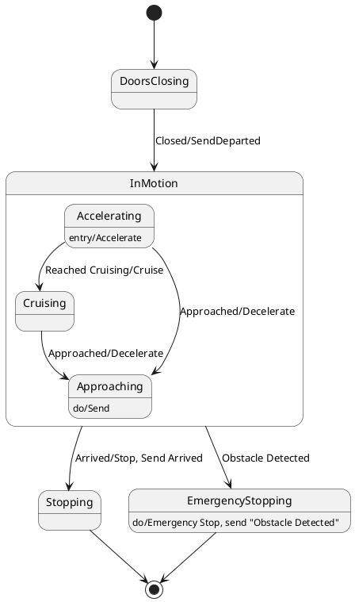

# Pair `0044`：NL + PlantUML STM0 + FCSTM STM0

[上一组 `0043`](../0043/README.md) | [返回 60 组索引](../../PAIR_INDEX.md) | [下一组 `0045`](../0045/README.md)

- LLM：`DeepSeek`
- 模型/场景：state machine for Train Control
- 作者输出阶段：`Result with Semantic Checking`
- 作者输出单元格：`AE46`；Excel row：`46`
- Phase-I fallback：`false`
- 相对 Phase-I 是否变化：`true`
- Phase-I PlantUML SHA-256：`7f5397c95cef79f21a7d18892486a912a7cdeaa1d9d9465bac47df872e0c9b6a`
- NL SHA-256：`3110cbcf15bfb507f0326965970888eada5541b791b5fa661698dfc74e82c2ce`
- PlantUML SHA-256：`38ba184ccbb3ed5d77a9cf48493190fd87c83374219d033194248984f2410fe3`
- FCSTM SHA-256：`265189e17700beb0743f61ec0119c8133d8d4df9ce5077364419f888ad18a9de`
- review subject SHA-256：`aa1533b0dcef0c7fdd130c440ca896e5e998b450034a0502a0154b7210aade9c`
- working contract SHA-256：`146627c3a8da1bbd58a3bb326a4645712fd70c9a9bec7f56cd066f0ea3e17e4d`
- 结构裁决：`structure_preserved`
- source states / transitions：`7` / `9`
- mapped / blocked / silent drop：`9` / `0` / `0`
- final / lifecycle / body coverage：`2/2` / `3/3` / `0/0`
- concurrent region / separator coverage：`0/0` / `0/0`
- source normalization coverage：`0/0`
- official raw / validation：`state_diagram` / `state_diagram`
- official identity states / transitions：`7` / `9`
- official identity remaps：state `0` / transition endpoint `0`
- AST audit：`passed`
- legacy whole-model FCSTM execution / Discover：`false` / `false`
- working bundle usage gate：`discover_input_with_capability_mask`
- ownership source / compiler / agent：`19` / `29` / `0`
- source macro / positive identity trace / conversion boundary trace：`12` / `19` / `0`
- capability source-static / simulation / transition-trace：`eligible_with_exclusions` / `eligible_with_exclusions` / `eligible_with_exclusions`
- compiler-only diagnostic policy：`rejected_conversion_artifact`；main-result conversion artifact limit：`0`
- 主 session 对读：`pass`；ownership/macro/capability 均为 `pass`；Case 0044 passes the current attribution-safe forward review; this does not assert global behavior equivalence, and unsupported runtime semantics remain fail-closed. Amendment record: the substantive subject review remains the one recorded in review_context (first reviewed 2026-07-20T05:44:08Z by gpt-5.5 (session omx-1784393668980-pxpj3q), and it still binds because review_subject_sha256 is unchanged. A scoped re-check was performed 2026-08-17 by claude-opus-5 (main-session LLM, PR #185) because commit bbb04cb1 (2026-07-27) regenerated the 60 working contracts and commit 35eba126 (2026-08-11) renamed the paper workspace, and neither refreshed this registry. The re-review is scoped: a key-by-key diff shows the only contract changes are capability_eligibility.simulation, capability_eligibility.transition_trace and summary.simulation_status (bbb04cb1) plus the four artifact_bindings path strings (35eba126); the remaining 168 keys and the whole of canonical/fcstm/parse_inspect/source_traces are byte-identical, so review_subject_sha256 is unchanged and the original ownership, macro and correspondence findings still stand. The capability block was re-checked against seven invariants: eligible ids are source: only, excluded ids cover the compiler-owned set, the two sets are disjoint, claim_boundary and reason_codes are non-empty, main_result_conversion_artifact_limit is still 0, and usage_gate is unchanged.
- source anchors：`source-ref:llms_emp_feedback_final_0044.puml:line:4\|state DoorsClosing, source-ref:llms_emp_feedback_final_0044.puml:line:5\|DoorsClosing --> InMotion : Closed/SendDeparted`；FCSTM anchors：`element-ref:source:state:DoorsClosing@line:8\|state DoorsClosing named "DoorsClosing";, element-ref:compiler:transition_segment:tr_0002:segment:1@line:38\|DoorsClosing -> InMotion : /Closed_SendDeparted;`
- 三个原始文件：[NL](./nl.txt) | [PlantUML](./plantuml.puml) | [FCSTM](./fcstm.fcstm)
- 审计入口：[canonical](../../canonical/llms_emp_feedback_final_0044.json) | [冻结 FCSTM](../../fcstm/llms_emp_feedback_final_0044.fcstm) | [case report](../../case_reports/llms_emp_feedback_final_0044.json) | [working contract](../../working_contracts/llms_emp_feedback_final_0044.json) | [source trace](../../source_traces/llms_emp_feedback_final_0044.json) | [人工总账](../../MANUAL_REVIEW.md)

## 主 session 三方语义对应

| projection | assessment | NL anchor | PlantUML anchor | FCSTM anchor | source roots | compiler members | rationale |
|---|---|---|---|---|---|---|---|
| `direct` | `preserved` | DoorsClosing | source-ref:llms_emp_feedback_final_0044.puml:line:4\|state DoorsClosing | element-ref:source:state:DoorsClosing@line:8\|state DoorsClosing named "DoorsClosing"; | source:state:DoorsClosing | - | Case 0044 binds source:state:DoorsClosing to authored PlantUML occurrence 'state DoorsClosing' and current FCSTM occurrence 'state DoorsClosing named "DoorsClosing";'; the source semantic root remains attributable while any compiler-owned projection stays protected and cannot become an independent Repair target. |
| `macro` | `preserved_with_exclusions` | Closed/SendDeparted | source-ref:llms_emp_feedback_final_0044.puml:line:5\|DoorsClosing --> InMotion : Closed/SendDeparted | element-ref:compiler:transition_segment:tr_0002:segment:1@line:38\|DoorsClosing -> InMotion : /Closed_SendDeparted; | source:transition:tr_0002 | compiler:transition_segment:tr_0002:segment:1 | Case 0044 binds source:transition:tr_0002 to authored PlantUML occurrence 'DoorsClosing --> InMotion : Closed/SendDeparted' and current FCSTM occurrence 'DoorsClosing -> InMotion : /Closed_SendDeparted;'; the source semantic root remains attributable while any compiler-owned projection stays protected and cannot become an independent Repair target. |

## Risk occurrence 第二遍复核

| obligation | risk tag | assessment | PlantUML evidence | FCSTM evidence | ownership evidence | rationale |
|---|---|---|---|---|---|---|
| `review:multi_segment_macro:0001:tr_0006` | `multi_segment_macro` | `compiler_artifact_excluded` | source-ref:llms_emp_feedback_final_0044.puml:line:17\|InMotion --> Stopping : Arrived/Stop, Send Arrived, source-ref:llms_emp_feedback_final_0044.puml:line:18\|InMotion --> EmergencyStopping : Obstacle Detected | element-ref:compiler:route_control:R45RouteToken@line:1\|def int R45RouteToken = 0;, element-ref:compiler:transition_segment:tr_0006:segment:1@line:22\|Accelerating -> [*] : /Arrived_Stop_Send_Arrived effect { R45RouteToken = 6; };, element-ref:compiler:transition_segment:tr_0006:segment:2@line:23\|Cruising -> [*] : /Arrived_Stop_Send_Arrived effect { R45RouteToken = 6; };, element-ref:compiler:transition_segment:tr_0006:segment:3@line:24\|Approaching -> [*] : /Arrived_Stop_Send_Arrived effect { R45RouteToken = 6; };, element-ref:compiler:transition_segment:tr_0006:segment:4@line:35\|InMotion -> Stopping : if [R45RouteToken == 6] effect { R45RouteToken = 0; };, element-ref:compiler:transition_segment:tr_0006:segment:5@line:28\|UnspecifiedInitial -> [*] : /Arrived_Stop_Send_Arrived effect { R45RouteToken = 6; }; | compiler:route_control:R45RouteToken, compiler:transition_segment:tr_0006:segment:1, compiler:transition_segment:tr_0006:segment:2, compiler:transition_segment:tr_0006:segment:3, compiler:transition_segment:tr_0006:segment:4, compiler:transition_segment:tr_0006:segment:5, source:transition:tr_0006 | Case 0044 multi_segment_macro occurrence review:multi_segment_macro:0001:tr_0006 binds exact source refs to working-contract elements compiler:route_control:R45RouteToken, compiler:transition_segment:tr_0006:segment:1, compiler:transition_segment:tr_0006:segment:2, compiler:transition_segment:tr_0006:segment:3, compiler:transition_segment:tr_0006:segment:4, compiler:transition_segment:tr_0006:segment:5, source:transition:tr_0006. All emitted segments collapse to one source transition root; no segment is promoted as a separate authored transition or editable issue target. |
| `review:route_controller:0002:tr_0006` | `route_controller` | `compiler_artifact_excluded` | source-ref:llms_emp_feedback_final_0044.puml:line:17\|InMotion --> Stopping : Arrived/Stop, Send Arrived, source-ref:llms_emp_feedback_final_0044.puml:line:18\|InMotion --> EmergencyStopping : Obstacle Detected | element-ref:compiler:route_control:R45RouteToken@line:1\|def int R45RouteToken = 0;, element-ref:compiler:transition_segment:tr_0006:segment:1@line:22\|Accelerating -> [*] : /Arrived_Stop_Send_Arrived effect { R45RouteToken = 6; };, element-ref:compiler:transition_segment:tr_0006:segment:2@line:23\|Cruising -> [*] : /Arrived_Stop_Send_Arrived effect { R45RouteToken = 6; };, element-ref:compiler:transition_segment:tr_0006:segment:3@line:24\|Approaching -> [*] : /Arrived_Stop_Send_Arrived effect { R45RouteToken = 6; };, element-ref:compiler:transition_segment:tr_0006:segment:4@line:35\|InMotion -> Stopping : if [R45RouteToken == 6] effect { R45RouteToken = 0; };, element-ref:compiler:transition_segment:tr_0006:segment:5@line:28\|UnspecifiedInitial -> [*] : /Arrived_Stop_Send_Arrived effect { R45RouteToken = 6; }; | compiler:route_control:R45RouteToken, compiler:transition_segment:tr_0006:segment:1, compiler:transition_segment:tr_0006:segment:2, compiler:transition_segment:tr_0006:segment:3, compiler:transition_segment:tr_0006:segment:4, compiler:transition_segment:tr_0006:segment:5, source:transition:tr_0006 | Case 0044 route_controller occurrence review:route_controller:0002:tr_0006 binds exact source refs to working-contract elements compiler:route_control:R45RouteToken, compiler:transition_segment:tr_0006:segment:1, compiler:transition_segment:tr_0006:segment:2, compiler:transition_segment:tr_0006:segment:3, compiler:transition_segment:tr_0006:segment:4, compiler:transition_segment:tr_0006:segment:5, source:transition:tr_0006. R45RouteToken and routed segments remain compiler_owned, protected, and excluded from confirmed issues, Repair, Confirm acceptance, and main results. |
| `review:multi_segment_macro:0003:tr_0007` | `multi_segment_macro` | `compiler_artifact_excluded` | source-ref:llms_emp_feedback_final_0044.puml:line:17\|InMotion --> Stopping : Arrived/Stop, Send Arrived, source-ref:llms_emp_feedback_final_0044.puml:line:18\|InMotion --> EmergencyStopping : Obstacle Detected | element-ref:compiler:route_control:R45RouteToken@line:1\|def int R45RouteToken = 0;, element-ref:compiler:transition_segment:tr_0007:segment:1@line:25\|Accelerating -> [*] : /Obstacle_Detected effect { R45RouteToken = 7; };, element-ref:compiler:transition_segment:tr_0007:segment:2@line:26\|Cruising -> [*] : /Obstacle_Detected effect { R45RouteToken = 7; };, element-ref:compiler:transition_segment:tr_0007:segment:3@line:27\|Approaching -> [*] : /Obstacle_Detected effect { R45RouteToken = 7; };, element-ref:compiler:transition_segment:tr_0007:segment:4@line:36\|InMotion -> EmergencyStopping : if [R45RouteToken == 7] effect { R45RouteToken = 0; };, element-ref:compiler:transition_segment:tr_0007:segment:5@line:29\|UnspecifiedInitial -> [*] : /Obstacle_Detected effect { R45RouteToken = 7; }; | compiler:route_control:R45RouteToken, compiler:transition_segment:tr_0007:segment:1, compiler:transition_segment:tr_0007:segment:2, compiler:transition_segment:tr_0007:segment:3, compiler:transition_segment:tr_0007:segment:4, compiler:transition_segment:tr_0007:segment:5, source:transition:tr_0007 | Case 0044 multi_segment_macro occurrence review:multi_segment_macro:0003:tr_0007 binds exact source refs to working-contract elements compiler:route_control:R45RouteToken, compiler:transition_segment:tr_0007:segment:1, compiler:transition_segment:tr_0007:segment:2, compiler:transition_segment:tr_0007:segment:3, compiler:transition_segment:tr_0007:segment:4, compiler:transition_segment:tr_0007:segment:5, source:transition:tr_0007. All emitted segments collapse to one source transition root; no segment is promoted as a separate authored transition or editable issue target. |
| `review:route_controller:0004:tr_0007` | `route_controller` | `compiler_artifact_excluded` | source-ref:llms_emp_feedback_final_0044.puml:line:17\|InMotion --> Stopping : Arrived/Stop, Send Arrived, source-ref:llms_emp_feedback_final_0044.puml:line:18\|InMotion --> EmergencyStopping : Obstacle Detected | element-ref:compiler:route_control:R45RouteToken@line:1\|def int R45RouteToken = 0;, element-ref:compiler:transition_segment:tr_0007:segment:1@line:25\|Accelerating -> [*] : /Obstacle_Detected effect { R45RouteToken = 7; };, element-ref:compiler:transition_segment:tr_0007:segment:2@line:26\|Cruising -> [*] : /Obstacle_Detected effect { R45RouteToken = 7; };, element-ref:compiler:transition_segment:tr_0007:segment:3@line:27\|Approaching -> [*] : /Obstacle_Detected effect { R45RouteToken = 7; };, element-ref:compiler:transition_segment:tr_0007:segment:4@line:36\|InMotion -> EmergencyStopping : if [R45RouteToken == 7] effect { R45RouteToken = 0; };, element-ref:compiler:transition_segment:tr_0007:segment:5@line:29\|UnspecifiedInitial -> [*] : /Obstacle_Detected effect { R45RouteToken = 7; }; | compiler:route_control:R45RouteToken, compiler:transition_segment:tr_0007:segment:1, compiler:transition_segment:tr_0007:segment:2, compiler:transition_segment:tr_0007:segment:3, compiler:transition_segment:tr_0007:segment:4, compiler:transition_segment:tr_0007:segment:5, source:transition:tr_0007 | Case 0044 route_controller occurrence review:route_controller:0004:tr_0007 binds exact source refs to working-contract elements compiler:route_control:R45RouteToken, compiler:transition_segment:tr_0007:segment:1, compiler:transition_segment:tr_0007:segment:2, compiler:transition_segment:tr_0007:segment:3, compiler:transition_segment:tr_0007:segment:4, compiler:transition_segment:tr_0007:segment:5, source:transition:tr_0007. R45RouteToken and routed segments remain compiler_owned, protected, and excluded from confirmed issues, Repair, Confirm acceptance, and main results. |
| `review:final_boundary:0005:tr_0008` | `final_boundary` | `source_fact_preserved` | source-ref:llms_emp_feedback_final_0044.puml:line:22\|Stopping --> [*] | element-ref:compiler:transition_segment:tr_0008:segment:1@line:39\|Stopping -> [*]; | compiler:transition_segment:tr_0008:segment:1, source:transition:tr_0008 | Case 0044 final_boundary occurrence review:final_boundary:0005:tr_0008 binds exact source refs to working-contract elements compiler:transition_segment:tr_0008:segment:1, source:transition:tr_0008. The authored final occurrence remains visible through its source root; any completion holder or routing segment is excluded from source-level claims. |
| `review:final_boundary:0006:tr_0009` | `final_boundary` | `source_fact_preserved` | source-ref:llms_emp_feedback_final_0044.puml:line:23\|EmergencyStopping --> [*] | element-ref:compiler:transition_segment:tr_0009:segment:1@line:40\|EmergencyStopping -> [*]; | compiler:transition_segment:tr_0009:segment:1, source:transition:tr_0009 | Case 0044 final_boundary occurrence review:final_boundary:0006:tr_0009 binds exact source refs to working-contract elements compiler:transition_segment:tr_0009:segment:1, source:transition:tr_0009. The authored final occurrence remains visible through its source root; any completion holder or routing segment is excluded from source-level claims. |
| `review:synthetic_state:0007:001-UnspecifiedInitial` | `synthetic_state` | `compiler_artifact_excluded` | source-ref:llms_emp_feedback_final_0044.puml:line:7\|state InMotion { | element-ref:compiler:state:llms_emp_feedback_final_0044.InMotion.UnspecifiedInitial@line:17\|state UnspecifiedInitial named "Unspecified initial";, element-ref:source:state:InMotion@line:9\|state InMotion named "InMotion" { | compiler:state:llms_emp_feedback_final_0044.InMotion.UnspecifiedInitial, source:state:InMotion | Case 0044 synthetic_state occurrence review:synthetic_state:0007:001-UnspecifiedInitial binds exact source refs to working-contract elements compiler:state:llms_emp_feedback_final_0044.InMotion.UnspecifiedInitial, source:state:InMotion. The placeholder makes the authored missing, invalid, or final boundary visible while the synthetic state itself remains a non-repairable compiler artifact. |
| `review:lifecycle:0008:001-InMotion.Accelerating` | `lifecycle` | `capability_excluded` | source-ref:llms_emp_feedback_final_0044.puml:line:8\|state Accelerating : entry/Accelerate | element-ref:compiler:lifecycle_action:InMotion.Accelerating:1:Accelerate@line:11\|enter abstract Accelerate; | compiler:lifecycle_action:InMotion.Accelerating:1:Accelerate, source:lifecycle:InMotion.Accelerating:1 | Case 0044 lifecycle occurrence review:lifecycle:0008:001-InMotion.Accelerating binds exact source refs to working-contract elements compiler:lifecycle_action:InMotion.Accelerating:1:Accelerate, source:lifecycle:InMotion.Accelerating:1. The lifecycle owner, kind, and action text remain source-visible through an abstract hook, while executable action behavior stays capability_excluded. |
| `review:lifecycle:0009:002-InMotion.Approaching` | `lifecycle` | `capability_excluded` | source-ref:llms_emp_feedback_final_0044.puml:line:10\|state Approaching : do/Send | element-ref:compiler:lifecycle_action:InMotion.Approaching:2:Send@line:15\|during abstract Send; | compiler:lifecycle_action:InMotion.Approaching:2:Send, source:lifecycle:InMotion.Approaching:2 | Case 0044 lifecycle occurrence review:lifecycle:0009:002-InMotion.Approaching binds exact source refs to working-contract elements compiler:lifecycle_action:InMotion.Approaching:2:Send, source:lifecycle:InMotion.Approaching:2. The lifecycle owner, kind, and action text remain source-visible through an abstract hook, while executable action behavior stays capability_excluded. |
| `review:lifecycle:0010:003-EmergencyStopping` | `lifecycle` | `capability_excluded` | source-ref:llms_emp_feedback_final_0044.puml:line:20\|state EmergencyStopping : do/Emergency Stop, send "Obstacle Detected" | element-ref:compiler:lifecycle_action:EmergencyStopping:3:EmergencyStopSendObstacleDetected@line:32\|during abstract EmergencyStopSendObstacleDetected; | compiler:lifecycle_action:EmergencyStopping:3:EmergencyStopSendObstacleDetected, source:lifecycle:EmergencyStopping:3 | Case 0044 lifecycle occurrence review:lifecycle:0010:003-EmergencyStopping binds exact source refs to working-contract elements compiler:lifecycle_action:EmergencyStopping:3:EmergencyStopSendObstacleDetected, source:lifecycle:EmergencyStopping:3. The lifecycle owner, kind, and action text remain source-visible through an abstract hook, while executable action behavior stays capability_excluded. |

## 作者阶段 lineage

| stage | output cell | present | output SHA-256 | feedback | resolved |
|---|---|---|---|---|---|
| `phase_i_generation` | `I46` | `true` | `7f5397c95cef79f21a7d18892486a912a7cdeaa1d9d9465bac47df872e0c9b6a` | - | - |
| `phase_ii_format` | `U46` | `true` | `38ba184ccbb3ed5d77a9cf48493190fd87c83374219d033194248984f2410fe3` | syntax error: stm TrainSystem | YES |
| `phase_ii_grammar` | `Z46` | `false` | `-` | - | - |
| `phase_ii_semantic` | `AE46` | `true` | `38ba184ccbb3ed5d77a9cf48493190fd87c83374219d033194248984f2410fe3` | None | - |

## Official identity ledger

- status：`aligned`
- canonical / official states：`7` / `7`
- aligned transition endpoints：`9`

本组 state identity 无需重映射。

本组 transition endpoint 无需重映射。

## Source normalization ledger

本组没有 source-input normalization。

## Concurrent region ledger

本组没有 PlantUML orthogonal/concurrent region separator。

## Operational debt

| reason code | count |
|---|---:|
| `R45.DEBT.composite_source_activation_dispatch` | 2 |
| `R45.DEBT.missing_explicit_initial` | 1 |
| `R45.DEBT.opaque_transition_label_semantics` | 6 |

## NL

```text
1. The system starts in the DoorsClosing state and transitions to InMotion when the doors are closed, triggered by the "Closed/SendDeparted" signal.
2. In the InMotion state, the system can either transition to the Stopping state when it arrives, indicated by the "Arrived/Stop, Send Arrived" signal, or to the EmergencyStopping state if an obstacle is detected.
3. When an obstacle is detected, the system enters the EmergencyStopping state, which includes the actions "Emergency Stop" and sends the "Obstacle Detected" signal.
4. Within the InMotion state, the system operates in three substates: Accelerating, Cruising, and Approaching, which represent different phases of the train's motion.
5. The system begins in the Accelerating substate, moving to the Cruising substate once cruising speed is reached, as indicated by the "Reached Cruising/Cruise" signal.
6. If the system is in the Accelerating substate and approaches its destination, it transitions to the Approaching substate upon receiving the "Approached/Decelerate" signal.
7. The system in the Cruising substate transitions to the Approaching substate when it approaches the destination, triggered by the "Approached/Decelerate" signal.
8. The system enters the Accelerating substate when motion begins, marked by the "Entry/Accelerate" action.
9. In the Approaching substate, the system sends the "Send" signal and continues to approach the destination.
10. The system remains in the Approaching substate while nearing the destination, until it is ready to stop or decelerate.
```

## 作者 Phase-II 最终 PlantUML STM0



## 转换后 FCSTM STM0

```fcstm
def int R45RouteToken = 0;
state llms_emp_feedback_final_0044 named "llms_emp_feedback_final_0044" {
    event Closed_SendDeparted named "Closed/SendDeparted";
    event Reached_Cruising_Cruise named "Reached Cruising/Cruise";
    event Approached_Decelerate named "Approached/Decelerate";
    event Arrived_Stop_Send_Arrived named "Arrived/Stop, Send Arrived";
    event Obstacle_Detected named "Obstacle Detected";
    state DoorsClosing named "DoorsClosing";
    state InMotion named "InMotion" {
        state Accelerating named "Accelerating" {
            enter abstract Accelerate;
        }
        state Cruising named "Cruising";
        state Approaching named "Approaching" {
            during abstract Send;
        }
        state UnspecifiedInitial named "Unspecified initial";
        [*] -> UnspecifiedInitial;
        Accelerating -> Cruising : /Reached_Cruising_Cruise;
        Accelerating -> Approaching : /Approached_Decelerate;
        Cruising -> Approaching : /Approached_Decelerate;
        Accelerating -> [*] : /Arrived_Stop_Send_Arrived effect { R45RouteToken = 6; };
        Cruising -> [*] : /Arrived_Stop_Send_Arrived effect { R45RouteToken = 6; };
        Approaching -> [*] : /Arrived_Stop_Send_Arrived effect { R45RouteToken = 6; };
        Accelerating -> [*] : /Obstacle_Detected effect { R45RouteToken = 7; };
        Cruising -> [*] : /Obstacle_Detected effect { R45RouteToken = 7; };
        Approaching -> [*] : /Obstacle_Detected effect { R45RouteToken = 7; };
        UnspecifiedInitial -> [*] : /Arrived_Stop_Send_Arrived effect { R45RouteToken = 6; };
        UnspecifiedInitial -> [*] : /Obstacle_Detected effect { R45RouteToken = 7; };
    }
    state EmergencyStopping named "EmergencyStopping" {
        during abstract EmergencyStopSendObstacleDetected;
    }
    state Stopping named "Stopping";
    InMotion -> Stopping : if [R45RouteToken == 6] effect { R45RouteToken = 0; };
    InMotion -> EmergencyStopping : if [R45RouteToken == 7] effect { R45RouteToken = 0; };
    [*] -> DoorsClosing;
    DoorsClosing -> InMotion : /Closed_SendDeparted;
    Stopping -> [*];
    EmergencyStopping -> [*];
}
```

[上一组 `0043`](../0043/README.md) | [返回 60 组索引](../../PAIR_INDEX.md) | [下一组 `0045`](../0045/README.md)
